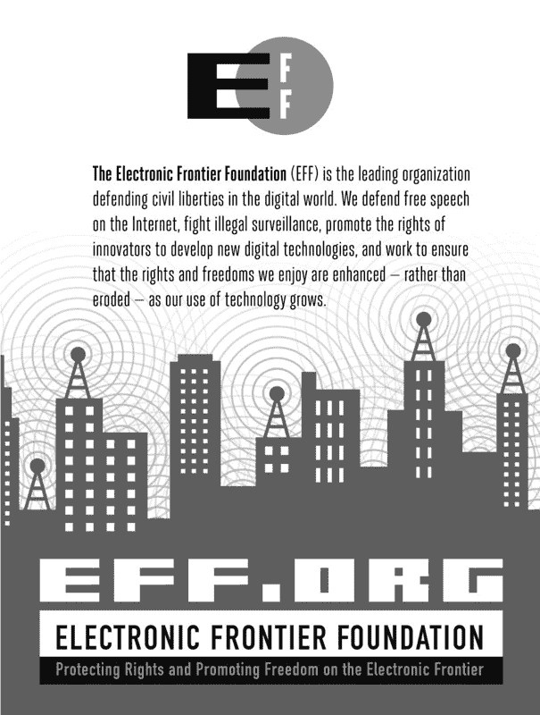

## 索引

*页面编号后跟字母* t *表示表格；页面编号后跟字母* f *表示图形。*

### 数字

4Kn 磁盘, 12, 41–44, 42*f*

512e 扇区仿真, 41, 42, 43

### A

抽象层，磁盘接口, 34, 35*f*

AccessData。*参见* ftkimager 工具；FTK SMART 格式

Ace 实验室 PC-3000 工具, 122

ACPO（英国警察首席官员协会）, 2, 6–7

获取主机

附加目标磁盘至

Apple 目标磁盘模式, 137–138

具有块或字符访问的设备, 140

启用访问隐藏扇区, 118–125

检查目标 PC 硬件, 101–102

识别目标驱动器, 105–107

NVME SSD, 138–139

查询目标磁盘, 107–118

可移动存储介质, 132–136

查看检查员工作站硬件, 103–104

性能优化, 88–90

获取过程。*参见* 取证获取

ACS（ATA 命令集）。*参见* ATA 命令

高级取证格式。*参见* AFF

高级格式 4Kn 磁盘, 12, 41–44, 42*f*

高级格式 512e 磁盘, 41, 42, 43

高级主机控制器接口（AHCI）模式，SATA, 23–24

高级技术附件命令。*参见* ATA 命令

AFF（高级取证格式）

aff4imager 工具, 190

affcat 工具, 209–210

affconvert 工具, 204–205, 209

affcrypto 工具, 215

affinfo 工具, 198, 210, 211

AFFlib 软件包

affuse 工具, 196–197, 235

内置压缩, 190

内置加密, 215

概述, 62

管道, 209

签名和验证签名, 202

内置压缩, 190

内置加密, 215

将原始镜像转换为, 204–205

转换为其他格式, 209–211

概述, 62–63

管道, 209

重新计算取证镜像的哈希值, 198–199

AHCI（高级主机控制器接口）模式，SATA, 23–24

aimage 工具, 190

Jacob Appelbaum, 251

Apple

FileVault, 248–251

目标磁盘模式，31，137–138

雷电接口，30–32，31*f*，137

array-info 工具，178

英国首席警察官协会（ACPO），2，6–7

ATA（高级技术附件）命令

常见，35*t*

DCO 和 HPA 驱动区域，39–40

概述，34–36

密码保护的磁盘，126–128

和 SCSI，39

安全擦除命令，226–227

SSD 设备，16–17

ATA 命令集（ACS）。*参见* ATA 命令

ATAPI（ATA 包装接口）

DCO 和 HPA 驱动区域，39–40

概述，35–36

密码保护的磁盘，126–128

SCSI 命令，39

Atola Insight Forensic，122

auditd 包，76

审计跟踪

概述，70

shell 历史，73–75

任务管理，70–73

终端监视器和 Linux 审计，76

终端记录器，75–76

`aureport` 命令，76

### B

Bash（Bourne Again shell），56，73，74，82。*另见* 命令行

Bash 数学扩展，183，248，249，252，265，274

`bdeinfo` 命令，248

`bdemount` 命令，248

BDs。*参见* 蓝光光盘；光学存储介质

媒体开始（BOM）标记，磁带上，176

磁带上的开始标记（BOT），176

BitLocker，微软，243–248

`blkcat` 命令，274

`blkls` 命令，271–272

blktap-utils 工具，241

`blockdev` 命令，43，98，99，108

块设备

获取，172–173

附加到采集主机，140

从原始镜像创建，230

Linux，50–55

将 QCOW2 镜像设置为，237–239

块级加密系统。*参见* 加密文件系统，访问

蓝光光盘（BDs），19*f*，21–22。*另见* 光学存储介质

获取，174，175

转移取证镜像到，222，223

媒体开始（BOM）标记，磁带上，176

可启动的 Linux 光盘，98，99

准备启动镜像与 xmount，235–237

BOT（磁带开始）标记，在磁带上，176

BOT（仅大容量传输）USB 接口，29，40–41

性能瓶颈，88–90，91*t*

Bourne Again shell（Bash），56，73，74，82。*另见* 命令行

大容量传输（BOT）USB 接口，29，40–41

将取证镜像刻录到光盘，221–222

总线速度，90，91*t*。*另见* 接口

bzip 工具，188，189

### C

CA（证书颁发机构）证书，156，157，201–202

C.A.I.N.E. 启动 CD，99

卡片读卡器，18

Carrier，Brian，48

切割工具，165

`cat` 命令，196，199

cciss-vol-status 包，178

CDB（命令描述符块），36

`cd-drive` 命令，132–133

`cd-info` 命令，133

cdparanoia 工具，175

CDs（光盘）。*另见* 光学存储介质

获取，174，175

Linux 取证启动，98，99

作为存储介质，19*f*，20–21

将取证镜像传输到，221–222

证书颁发机构（CA）证书，156，157，201–202

CF（CompactFlash）卡，18

CFTT（计算机取证工具测试）项目

dd 实用程序测试，60

取证成像要求，9

HWB 设备规格，94

概览，3，6

软件写保护器，99

芯片脱除，15，125

Choudary，Omar，248

CipherShed，217

客户模式，rdd 工具，166，167–168

克隆磁盘，219–221

Coltel，Romain，243

命令描述符块（CDB），36

命令行。*另见* Linux；*特定命令/工具*

审计追踪，70–76

命令权限，xxv，212，233

输出组织，76–83

输出

组织，76–83

重定向，81–83

可扩展的检查目录结构，79–81

使用原因，xx–xxi

使用重定向保存输出，81–83

shell 历史记录，73–75

任务管理，70–73

终端监视器和 Linux 审计，76

终端记录器，75–76

查看检查员工作站硬件，103–104

命令集

ATA，34–36，35*t*

NVME，37–38，37*t*

SCSI，36–37，37*t*，39

光盘。*参见* CDs；光学存储介质

CompactFlash (CF) 卡，18

完整性，法医，10

估算完成时间，87–88

压缩

AFFlib 内置，190

与拆分结合，192

EnCase EWF 压缩格式，189

FTK SMART 压缩格式，190

SquashFS，66–67，191

计算机法医工具测试项目。*参见* CFTT 项目

计算机相关的法医。*参见* 数字法医；法医采集

图像格式转换，202–211

`conv=noerror` 参数，dd 工具，143

复制法医图像，87

写时复制（CoW）快照，实时成像，172

死因调查工具包，2

Corsair Padlock2 优盘，228

CoW（写时复制）快照，实时成像，172

cpqarrayd 工具，178

加密学。*另见* 加密文件系统，访问；加密

基本哈希，151–152，151*t*

哈希窗口，143，152–154，199–200

密钥擦除程序，227–228

RFC-3161 时间戳，157–159

签名法医图像，154–157

验证法医图像完整性，197–202

cryptsetup 工具，251–254，257

CTRL-Z 快捷键，92–93，123

`curl` 命令，158

### D

dares carver 工具，165

数据 CD，20。*另见* CDs；光学存储介质

数据销毁，224–228

数据提取

手动使用偏移，272–274

分区提取，264–271

分区方案分析，259–264

空闲空间，271–272

未分配块，272

数据流，优化，90

数据恢复工具，61–62，162–163

dc3dd 工具

将图像采集到多个目标，150

加密哈希算法, 151–152, 151*t*

错误处理, 160–161

法医采集与, 142, 144–145

光盘成像, 174–175

概述, 61

分段哈希, 153–154

拆分功能, 193

SquashFS 法医证据容器, 65, 149

擦除功能, 225–226

将图像文件写入克隆磁盘, 220–221

dcfldd 工具

将图像采集到多个目的地, 150

压缩图像, 189

加密哈希算法, 151, 151*t*

采集过程中的加密, 212

错误处理, 160

法医采集与, 142, 144–145

哈希窗口, 153

概述, 61

分区提取, 266

拆分功能, 192–193

磁带, 从中提取数据, 177

DCO（设备配置覆盖）

提取属于的扇区范围, 269–271

概述, 39–40, 118

移除, 118–121

dd_rescue 工具, 61, 62, 142, 163, 215–216

ddrescue 工具, 61, 142, 162–163, 165

dd 工具

压缩与拆分结合, 192

加密哈希算法, 152

法医采集与, 142–144

法医变种, 61, 144–145

使用偏移量手动提取, 273–274

分区提取, 266

原始镜像, 60

安全远程成像, 168, 169–170

稀疏文件, 85

验证采集哈希值, 197–198

擦除功能, 226

调试端口，使用它们访问存储介质, 122–125

解密。 *另见* 密码学；加密文件系统，访问；加密

GPG 加密图像的, 212, 213

OpenSSL 加密文件的, 213–214

DEFT（数字证据与法医工具包）, 98–99

删除的分区, 提取, 266–268

删除法医图像数据, 224–228

Linux 桌面环境, 56

*/dev* 目录，Linux，50，51–52

设备配置覆盖。*见* DCO

设备映射器，179–182，231–232，253，255–256

设备树，Linux，50–51

DFRWS（数字取证研究研讨会），2，8，59

诊断端口，使用访问存储介质，122–125

迪亚兹·迪亚兹（Antonio），61，162

diff 工具，200

数字证据与取证工具包（DEFT），98–99

数字证据袋。*见* 取证文件

格式，数字取证研究研讨会（DFRWS），2，8，59

数字取证。*另见* 取证采集

定义，2

历史，1–4

Linux 与 OSS 在此背景下，48–50

同行评审研究，7–8

原则，6–10

标准，6–7

趋势与挑战，4–5

*数字调查：国际数字取证与事件响应期刊*，7

数字签名，154–157

数字多功能光盘。*见* DVDs；光学存储介质

目录

命名约定，76–79

可扩展检查结构，79–81

磁盘块恢复工具，162–163

磁盘克隆与复制，219–221

磁盘冷却器，93

磁盘映像。*见* 取证采集

磁盘分区方案，分析，259–264

磁盘。*见* 取证采集；存储介质；目标磁盘

disktype 工具，260–261，263

dislocker 包，243–247

卸载 VeraCrypt 卷，218。*另见* 卸载

数据处置，224–228

发行版，Linux，55–56

dm-crypt 加密，251，254

dmesg 工具，206

dmraid 工具，178–179

dmsetup 工具，159–160，179–180，182，183

记录设备识别详细信息，107–108

DOS 分区方案，262

dpt-i2o-raidutils 包，178

驱动器维护扇区，40，122–125

驱动器。*见* 取证采集；*特定媒体*；存储介质；目标磁盘

杜兰诺伊（Alexandre），61

复制，磁盘，219–221

DVD（数字多功能光盘）, 19*f*, 21。*另见* 光学存储介质

获取, 174, 175

概述, 21

重新组装分割的取证图像, 196

转移取证图像到, 222

动态磁盘，Microsoft, 181–182

### E

EIDE（增强型集成驱动电子技术）, 32

`eject` shell 命令, 133

*电子犯罪现场调查：第一响应者指南*（美国司法部）, 3, 7

EnCase EWF

内建加密, 215

压缩格式, 189

将 AFF 图像转换为, 209–210

将 FTK 文件转换为, 208

将原始图像转换为, 202–203

转换为其他格式, 205–208

取证采集, 145–146

哈希窗口, 153

图像访问任务, 233–234

概述, 62

重新计算取证映像的哈希值, 198

远程取证采集, 171–172

在采集过程中分割图像, 193

加密文件系统, 访问

Apple FileVault, 248–251

Linux LUKS, 251–254

Microsoft BitLocker, 243–248

概述, 243

TrueCrypt, 254–257

VeraCrypt, 254–257

*EncryptedRoot.plist.wipekey* 文件, 249–250

加密。*另见* 密码学；加密文件系统，访问

闪存驱动器, 17, 131, 131*f*, 228

清除密钥的程序, 227–228

Opal, 128–131

使用 211–218 保护磁盘映像

增强型集成驱动电子技术（EIDE）, 32

环境因素, 91–93

EO1\. *参见* EnCase EWF

磁带上的 EOD（数据结束）标记, 14, 176

磁带上的 EOF（文件结束）标记, 176

磁带上的 EOM（介质结束）标记, 176

磁带上的 EOT（磁带结束）标记, 176

擦除取证图像数据, 224–228

驱动器错误, 159–165

估算完成时间, 87–88

证据

容器。*参见* 取证文件格式

磁盘。*参见* 主题磁盘

完整性, 197–202。*另见* 密码学

组织, 76–83

EWF。*参见* EnCase EWF

ewfacquirestream 工具, 172, 210

ewfacquire 工具

压缩图像, 189

将原始镜像转换为 EWF， 202–203

加密哈希算法， 151, 151*t*

错误处理， 161

法医获取， 141, 145–147

获取期间分割镜像， 193

ewfexport 工具， 205, 206, 207

ewfinfo 工具， 206, 207

ewfmount 工具， 233, 234

ewfverify 工具， 198

检查目录结构， 79–81

检查主机。*参见* 获取主机

专家证人格式。*参见* EnCase EWF

`EXTENDED SECURITY ERASE` 命令， 227

可扩展主机控制器接口（xHCI）， 29–30

外部驱动器，加密， 216, 217–218

提取文件，命名规范， 77–78

提取数据子集。*参见* 数据提取

### F

故障，硬盘， 159–165

FC（光纤通道）接口， 25–26, 26*f*

FDE（全盘加密）， 128–131, 216–218

`fg` 命令， 93

光纤通道（FC）接口， 25–26, 26*f*

文件压缩， 85

文件格式。*参见* 法医文件格式

文件，命名规范， 76–79

文件销毁器, 224–225

文件大小，报告， 86–87

文件空闲区， 43

文件系统。*参见* 加密文件系统，访问

作为法医文件格式访问， 233–235

数据 CD， 20

通用磁盘加密， 216–217, 218

识别， 263–264

Linux 内核和， 52–55

提取空闲空间， 271–272

提取未分配的块， 272

文件传输协议， 224

FileVault，苹果， 248–251

FileVault 破解软件， 251

FireWire（IEEE1394）接口， 33, 33*f*, 137

第一个响应者对活跃 PC 的分诊， 102

闪存驱动器, 17, 131, 131*f*, 173, 228

闪存。*参见* 非易失性存储器

闪存转换层（FTL）， 15

`fls` 命令， 180, 238, 242, 249–250, 265–266

法医采集。*另请参见* 数据提取；数字取证；法医镜像管理；镜像访问任务

完整性, 10

基于 dd 的工具, 142–145

在期间加密, 212, 213, 214

使用法医格式, 145–150

作为平台的 Linux, 47–57

管理驱动器故障和错误, 159–165

向多个目标传输, 150

通过网络, 166–172

概述, 141, 275–276

同行评审研究, 7–8

性能, 88–90, 91*t*

前提条件, 9

RAID 和多磁盘系统, 178–184

可移动介质, 172–178

签名法医镜像, 154–157

在期间拆分镜像, 192–194

标准, 6–7

暂停过程, 92–93

选择工具, 141–142

趋势和挑战, 4–5

在期间验证哈希值, 197–198

将镜像文件写入克隆磁盘, 220–221

法医启动 CD, 98, 99

法医文件格式。*另请参见具体格式*

使用获取镜像, 145–150

内置加密, 214–216

在之间转换, 202–211

镜像访问任务, 233–235

镜像压缩支持, 188

命名约定, 77

概述, 59–60

原始镜像, 60–62

SquashFS, 63–67

法医文件系统分析, 271, 274

法医镜像管理

压缩, 187–191

在镜像格式之间转换, 202–211

磁盘克隆和复制, 219–221

概述, 187

安全擦除和数据处理, 224–228

使用加密保护镜像, 211–218

拆分镜像, 191–197

传输和存储, 221–224

验证镜像完整性, 197–202

法医影像。*请参见* 法医采集

法医准备状态, 69–70

法医写保护器。*请参见* 写保护器

在开源软件中的分叉, 49

格式，文件。*请参见* 法医文件格式

FreeTSA, 158, 159, 201

冻结命令，ATA 密码保护的磁盘, 127

冻结 DCO 配置, 119–120

`fsstat`命令, 263–264

ftkimager 工具

内置加密, 214–215

压缩镜像, 190

将文件从 EnCase 转换为 FTK, 207–208

从 FTK 格式转换, 208–209

将原始镜像转换为 FTK SMART, 203

加密哈希算法, 151, 151*t*

错误处理, 161–162

取证采集, 141, 147–149

概述, 62

采集过程中分割镜像, 193–194

FTK SMART 格式

压缩格式, 190

将 AFF 镜像转换为, 209–210

将 EnCase EWF 文件转换为, 207–208

将原始镜像转换为, 203

转换为另一种格式, 208–209

概述, 62

远程取证采集, 171–172

FTL（闪存转换层）, 15

全盘加密 (FDE), 128–131, 216–218

FUSE 文件系统, 196, 233, 241–243, 245, 246, 250–251

`fusermount` 命令, 234

fvdeinfo 工具, 249

fvdemount 工具, 250–251

### G

Garfinkel, Simson, 62

Garloff, Kurt, 62, 163

全局唯一标识符（GUID）, LDM 磁盘组, 181

GNU dd. *参见* dd 工具

GNU dd_rescue 工具, 61, 62, 142, 163, 215–216

GNU ddrescue 工具, 61, 142, 162–163, 165

GNU 隐私保护工具（GnuPG 或 GPG）, 155–156, 200–201, 211–213

GNU screen 终端复用器, 75–76

GNU `split` 命令, 192

gpart 工具, 267

GPG（GNU 隐私保护工具）, 155–156, 200–201, 211–213

gpgsm 工具, 156–157

gptparser.pl 工具, 263

GPT 分区方案, 262

Grenier, Christophe, 267

`growisofs` 命令, 222

GUID（全局唯一标识符）, LDM 磁盘组, 181

Guidance Software. *参见* EnCase EWF

GUI 界面

与命令行相比, xxi

Linux, 55–56

gunzip 工具, 188, 213

gzip 工具，188–189，192，204，214

### H

Harbour，Nicholas，61

硬盘。*参见* 法医获取；存储介质；目标磁盘

磁性，12–13，13*f*

服务区域，40

将法医映像传输到，223

硬件

检查员工作站，查看，103–104

管理驱动器故障和错误，159–165

检查目标 PC，101–102

写保护器，39，94–97，94*f*，95*f*，97*f*，107–108

硬件写保护（HWB）设备规格，版本 2.0，94

哈希

基础，151–152，151*t*

GPG 加密，213

OpenSSL 加密，214

概述，197

重新计算哈希，198–199

拆分原始图像，199

验证获取过程中哈希值，197–198

哈希窗口，143，152–154，199–200

HBA（主机总线适配器），36

hd（hexdump）工具，226

HDDGURU，125

HDD Oracle，125

hddtemp 工具，91

hdparm 工具

ATA 密码保护磁盘，126，127

ATA 安全擦除单元命令，227

DCO，移除，118–120

HPA

移除，121–122

使用复制扇区大小，220

扇区范围，提取，270

使用查询磁盘功能和特性，108–112

只读属性，98

SSD，16–17

热量，监控，91–93

散热片，93

hexdump（hd）工具，226

隐藏扇区，启用访问

移除 DCO，118–121

移除 HPA，121–122

概述，118

系统区域，122–125

隐藏卷，VeraCrypt，256–257

历史，外壳，73–75

主机总线适配器（HBA），36

HPA（主机保护区域）

提取属于的扇区范围，269–271

概述，39–40，118

移除，121–122

使用复制扇区大小，219–220

Hulton，David，251

HWB（硬件写保护）设备规格，版本 2.0，94

hxxp，79

### I

IAAC（信息保障咨询委员会），8

icat 工具，249–250

IDE（集成驱动电子），18，32，32*f*

IEEE1394（FireWire）接口，33，33*f*，137

图像访问任务。*另请参见* 加密文件系统，访问

启动镜像，使用 xmount 准备，235–237

法医格式镜像文件，233–235

概览，229–230

原始镜像，230–233

VM 镜像，237–243

图像采集/成像。*参见* 法医采集

`img_stat` 命令，59–60，194，195，197–198

行业

内部协作，5

法规和最佳实践，8–9

信息保障咨询委员会（IAAC），8

信息安全，211–218

启动器，SCSI 命令，36

集成驱动电子（IDE），18，32，32*f*

完整性。*参见* 加密学；验证法医镜像完整性

接口。*另请参见特定接口*

总线速度，90，91*t*

遗留，32–34，32*f*，33*f*，34*f*

NVME，27–29，27*f*，28*f*

概览，22

SAS 和光纤通道，25–26，25*f*，26*f*

SATA，22–25，23*f*，24*f*，25*f*

Thunderbolt，30–32，31*f*

USB，29–30，29*f*，30*f*

国际标准化组织（ISO），6

国际计算机证据组织（IOCE），2，3

物联网，4

分区间隙，提取，269

IOCE（国际计算机证据组织），2，3

ISO（国际标准化组织），6

iStorage datashur 驱动器，228

### J

越狱设备，5

JBOD（仅一堆磁盘），179–180

JTAG 接口，125

跳线设置，Advanced Format 512e 磁盘，43

仅一堆磁盘（JBOD），179–180

### K

Kali Linux，99

内核，Linux

定义，55

确定分区详细信息，264

和文件系统，52–55

和存储设备，50–52

内核补丁，写保护，98–99

内核环形缓冲区，106

凯斯勒，盖瑞，262–263

密钥擦除程序，227–228

科恩布鲁姆，杰西，61

kpartx 工具，231，233，234，241，242

### L

执法机构和数字取证

合作，5

历史，1–2

LDM（逻辑磁盘管理器），181

ldmtool 工具，181

传统技术

磁性，15

光学存储介质，22

存储介质接口，32–34，32*f*，33*f*，34*f*

联想 ThinkPad 安全硬盘，216，216*f*

libata 库，39

libbde 包，247–248

libewf 库，62，215

libfvde 软件包，248–251

libqcow-utils 包，237

libvhdi 工具，241

libvmdk-utils 软件包，240

链接层，磁盘接口，34，35*f*，38

Linux。*参见*命令行；*特定命令*

高级格式 4Kn 磁盘，42–43

Apple 目标磁盘模式，137–138

审计跟踪，76

命令执行，56

压缩工具，188–189

发行版，55–56

法医启动 CD，98，99

在法医环境中，48–50

内核和文件系统，52–55

内核和存储设备，50–52

循环设备，230–233

LUKS，251–254

概览，xx–xxi，47，57

管道和重定向，56–57

RAID-5 采集，183–184

SCSI 命令，36–37

shell 历史，73，74

shell，56

软件 RAID，178

Thunderbolt 接口，31–32

Linux 存储堆栈图，52，53*f*

使用 CoW 快照进行实时成像，172

实时 PC，分类，102

锁定 DCO 配置，119–120

逻辑磁盘管理器（LDM），181

逻辑卷管理器（LVM）层，254

物流问题

环境因素，91–93

估算任务完成时间，87–88

文件压缩，85

镜像大小和磁盘空间要求，83–84

移动和复制法医镜像，87

概述，83

性能和瓶颈，88–90，91*t*

报告的文件和镜像大小，86–87

稀疏文件，85–86

日志，SMART，115

法医镜像的长期存储，221–224

循环设备，183–184，230–233，252–253，265–266

`loop` 选项，`mount` 命令，245，247

`losetup` 命令，183，230，231，252，265

Lougher, Phillip，63

`lsblk` 命令，106–107，108

`ls` 命令，86–87，196

lshw 工具，103，104，133–134

lspci 工具，103–104

`lsscsi` 命令，105，108

lsusb 工具，104，105，108

`luksDump` 命令，252–253

LUKS 加密系统，251–254

LVM（逻辑卷管理）层，254

### M

M.2 接口

NVME，27，27*f*

SATA, 24, 24*f*

磁性存储介质。*参见* 硬盘；磁带

传统，15

概述，12

磁带，14*f*

获取，176–178

连接到采集主机，133–135

概述，13–14

物理只读模式，100

维护扇区，40，122–125

管理镜像文件。*参见* 法医镜像管理

使用偏移量进行手动提取，272–274

映射设备，179–182，231–232，253，255–256

大容量存储技术。*参见* 存储介质

主引导记录（MBR），129

主密码，ATA 密码保护磁盘，126–127，128

克隆驱动器上的最大可见扇区，220

MBR（主引导记录），129

md5sum 工具，152，154，207

mdadm 工具，183，184

媒体。*参见* 存储介质

内存。*参见特定类型的内存*；存储介质

存储卡，18*f*

获取，173–174

附加到采集主机，136

概览，17–18

内存空闲，43

元数据，取证文件格式，62

Metz, Joachim，62，237，247，248

微型 IDE ZIF 接口，33，33*f*

微型 SATA 接口，24，24*f*

Micro SD 卡，173–174

Microsoft BitLocker，243–248

Microsoft 动态磁盘，181–182

Microsoft VHD 格式，241–243

迷你 IDE 接口，33，33*f*

Mini-SAS HD 接口，26*f*

迷你 SATA（mSATA）接口，23，23*f*

镜像磁盘，RAID-1，182–183

不匹配的哈希窗口，199–200

`mkisofs` 命令，221–222

mksquashfs 工具，63，170，206–207

mmcat 工具，266，268，269，270

`mmls` 命令，262

`mmstat` 命令，260，261

`mount` 命令，184，241，245，247

挂载

解密的文件系统镜像，245，246，247，250，253，256

Linux 中的文件系统，53–54

取证格式图像文件，233–235

将图像文件作为常规文件系统，229

循环分区，232–233

SquashFS 容器，66

VeraCrypt 卷，218

虚拟机镜像，236，238–239，240–243

移动取证镜像，87

mpt-status 工具，178

mSATA（迷你 SATA）接口，23，23*f*

msed 工具，129

mt 工具，134–135

多磁盘系统，获取

JBOD 和 RAID-0 条带磁盘，179–180

Linux RAID-5，183–184

Microsoft 动态磁盘，181–182

概览，178

专有系统，178–179

RAID-0 条带磁盘，179–180

RAID-1 镜像磁盘，182–183

多功能驱动舱写保护器，94，95*f*

多个目的地，法医采集到，150

音乐 CD，20，175。*另见* CD；光学存储介质

myrescue 工具，163

### N

命名空间，NVME，44–45，138，139，226

文件和目录的命名约定，76–79

NAND 闪存技术，15

国家标准与技术研究院

技术。*见* CFTT 项目

nbd 内核模块，237–238，239

错误扇区，40，122–125

荷兰法医研究院（NFI），166

网络

图像采集

转到 EnCase 或 FTK 格式，171–172

使用 CoW 快照进行实时映像，172

概览，166

使用 rdd，166–168

转到 SquashFS 证据容器，169–171

使用 `ssh`，168–169

转移采集图像，223–224，223*t*

性能调优，90

下一代封装形式（NGFF），27

NFI（荷兰法医研究院），166

NIST。*见* CFTT 项目

非特权用户，241–243，246，251，254

非易失性存储器

遗留，19

概览，15–16

可移动内存卡，17–18，18*f*

固态硬盘，16–17，16*f*

USB 闪存驱动器，17，17*f*

非易失性存储器快闪（NVME）

命令集，37–38，37*t*

接口，27–29，27*f*，28*f*

命名空间，44–45，138，139，226

nvme-cli 软件包，44–45

nvme 工具，138，139

SSD，138–139

擦除驱动器，226

nwipe 工具，226

### O

`of=` 标志，dc3dd 工具，150

`--offset` 标志，`losetup` 命令，231

偏移量，手动提取，272–274

Opal 自加密硬盘，128–131，228

opengates 工具，236

openjobs 工具，236

开源软件（OSS），48–50，276

OpenSSH 软件包，224

OpenSSL 命令行工具，157–159，201–202，213–214

光学存储介质

获取，174–175

附加到获取主机，132–133

蓝光光盘，19*f*，21–22

获取，174，175

转移取证镜像到，222，223

光盘，19*f*，20–21

获取，174，175

Linux 取证启动，98，99

转移取证镜像到，221–222

损坏，165

光盘，19*f*，21

获取，174，175

重新组装分割的取证镜像，196

转移取证镜像到，222

传统，22

概述，19–20

转移取证镜像到，221–223

操作系统加密文件系统。*参见* 加密文件系统，访问

操作系统镜像，在虚拟机中启动，235–237

OSS（开源软件），48–50，276

OS X，在虚拟机中启动镜像，236

超额配置，15–16

### P

并行 ATA（PATA），18

并行接口，22

解析工具，262–263

分区设备，51–52，231–233，238，239–240

分区提取

删除，266–268

HPA 和 DCO 扇区范围，269–271

个人，264–266

分区间间隙，269

概述，264

分区方案，分析，259–264

分区表，261–263

密码保护磁盘，126–128

密码恢复技术，125

PATA（并行 ATA），18

PC-3000 工具，Ace 实验室，122

PCI 总线，列出连接到的设备，103–104

PCI Express 写保护器，96，97*f*

PEM 签名文件，157，201

Pentoo 取证 CD，99

PEOT（磁带物理结束）标记，176

性能，取证获取，88–90，91*t*

PGP（非常好的隐私），155–156

PHY 设备，38

磁带物理结束（PEOT）标记，176

物理错误，SMART 数据, 117–118

物理层，磁盘接口, 34, 35*f*, 38–39

物理 PC 检查, 102

物理只读模式，带有介质的, 100, 100*f*

物理安全 ID (PSID), 128, 129*f*, 228

分段数据提取。*另见* 数据提取

分段哈希, 152–154, 199–200

管道

将图像获取到多个目标, 150

使用 AFF 文件, 209

压缩与分割结合, 192

使用压缩图像, 189

分割原始图像的加密哈希, 199

加密哈希算法, 152

在 Linux 中, 56–57

验证获取哈希值, 197–198

PKI（公钥基础设施）, 156, 216

普通的 dm-crypt 加密, 251, 254

法医获取计划。*另见* 准备性法医任务

获取后的任务。*另见* 数据提取；法医图像管理；图像访问任务

死后计算机法医学。*另见* 数字法医学；法医获取

电源管理, 93

准备性法医任务。*另见* 物流问题

审计追踪, 70–76

组织收集的证据和命令输出, 76–83

概述, 69–70

写保护, 93–100

优良隐私 (PGP), 155–156

私营部门法医准备工作, 70

特权，命令，xxv, 212, 233。*另见* 非特权用户

proc 文件系统，Linux, 107

专有 RAID 获取, 178–179

假定义文件, mksquashfs, 206

PSID（物理安全 ID）, 128, 129*f*, 228

公钥基础设施 (PKI), 156, 216

公共部门法医准备工作, 70

### Q

QCOW2 格式, 237–239

qcowinfo 工具, 237

qcowmount 工具, 237

QEMU 模拟器, 237–239

`qemu-img` 命令, 237

qemu-nbd 工具, 237–238, 239

查询目标磁盘

记录设备标识详细信息, 107–108

提取 SMART 数据, 112–118

使用 hdparm, 108–112

概述, 107

### R

RAID（独立磁盘冗余阵列）系统，获取

JBOD 条带磁盘，179–180

Linux RAID-5，183–184

Microsoft 动态磁盘，181–182

概述，178

专有系统，178–179

RAID-0 条带磁盘，180

RAID-1 镜像磁盘，182–183

RAM 空闲，43

在 Linux 中的原始设备，51，52

原始镜像

访问取证文件格式，233–235

转换为 AFF 格式，209

转换为另一种格式，202–205

拆分的加密哈希，199

数据恢复工具，61–62

dd 工具，60

取证 dd 变体，61

镜像访问任务，230–233

命名约定，77

概述，60

使用 xmount 工具准备启动镜像，236

重新组装，196–197

写入克隆磁盘，220–221

rdd 工具，166–168

读取错误，dd 工具，143–144

只读模式，带有的媒体，100，100*f*

只读属性，使用写保护器设置，97–98

重新组装拆分的取证镜像，195–197

重新计算取证镜像的哈希值，198–199

记录器识别码（RID），光盘，21

recoverdm 工具，163

重定向

使用 AFF 文件，209

使用压缩镜像，189

在 Linux 中，56–57

使用保存命令输出，81–83

独立磁盘冗余阵列（RAID）。*参见* RAID 系统，获取

行业特定的法规，8–9

重新映射的扇区，40

远程访问命令行，xxi

远程取证获取

转换为 EnCase 或 FTK 格式，171–172

使用 CoW 快照进行实时成像，172

概述，166

使用 rdd，166–168

安全，使用 `ssh`，168–169

转换为 SquashFS 证据容器，169–171

转移获取的镜像，223–224，223*t*

可移动存储介质。*参见特定的介质类型*；存储介质

获取，172–178

附加到获取主机，132–136

加密，216

将取证镜像传输到，221–223

报告的文件和镜像大小，86–87

研究，同行评审，3，7–8

RFC-3161 时间戳, 157–159, 201

RID（记录器识别码），CD, 21

环形缓冲区, 内核, 106

提取音乐 CD, 175

### S

S01\. *参见* FTK SMART 格式

SAS（串行附加 SCSI）接口, 25–26, 25*f*, 26*f*, 37

SAT（SCSI-ATA 转换）, 39

SATA（串行 ATA）接口, 16, 22–25, 23*f*, 24*f*, 25*f*, 94*f*

SATA Express 磁盘接口, 25, 25*f*

可扩展的检查目录结构, 79–81

数字证据科学工作组（SWGDE）, 3

scp（安全复制）工具, 224

屏幕终端多路复用器, 75–76

`script`命令, 75

脚本编写，命令行, xxi

`scriptreplay`命令, 75

SCSI-ATA 转换（SAT）, 39

SCSI 接口, 34*f*

命令集, 36–37, 37*t*, 39

记录设备识别详细信息, 108

识别目标驱动器, 105

概述, 33–34

查询驱动器, 112

磁带驱动器，查询, 134

SD（安全数字）标准, 18

`sdparm`命令, 112

扇区偏移

转换为字节偏移, 247–248, 249, 252, 265

文件系统识别, 263–264

使用手动提取, 272–274

扇区。*另见* 隐藏扇区，启用访问；4Kn 磁盘

硬盘, 12, 40

使用 HPA 进行复制, 219–220

用户可访问的, 擦除, 225–226

安全复制（scp）工具, 224

secure_deletion 工具包, 224

安全数字（SD）标准, 18

安全/多用途互联网邮件扩展（S/MIME）, 155, 156–157, 201

安全网络数据传输, 223–224

安全远程成像, 168–169

安全擦除和数据处置, 224–228

安全擦除命令, ATA, 226–227

安全特性, 目标磁盘

ATA 密码保护磁盘, 126–128

加密闪存 U 盘, 131

概述, 125

自加密驱动器, 128–131

安全级别，ATA 密码保护硬盘，127

法医图像的安全性，211–218

SEDs（自加密硬盘），128–131，218，228

`sedutil-cli`命令，129–130，218，228

在压缩文件中进行查找，188，204

自加密硬盘（SEDs），128–131，218，228

自监控、分析和报告技术（SMART）

使用`smartctl`提取数据，112–118

管理硬盘故障和错误，163–164

NVME 硬盘，139

自测，SMART 数据，115–116

磁盘的串行访问，122–125

串行 ATA（SATA）接口，16，22–25，23*f*，24*f*，25*f*，94*f*

串行附加 SCSI（SAS）接口，25–26，25*f*，26*f*，37

串行总线控制器类，104

串行点对点连接，22

服务器模式，rdd 工具，166，167，168

服务区域，40，122–125

会话，CD，20

sfsimage 工具

获取图像，149–150

将 AFF 文件转换为压缩的 SquashFS，210

将 FTK 文件转换为 SquashFS，208–209

将原始图像转换为 SquashFS，203–204

dcfldd 和 dc3dd 工具，145

图像访问任务，235

概述，63

远程法医采集，169–171

可移动媒体，获取图像，174

SquashFS 压缩，191

SquashFS 证据容器，64–67

sg3_utils 软件包，36–37

Opal SEDs 上的影像 MBR，129–130，131

共享总线，22

shell 别名，72–73

shell 历史记录，73–75

Shells。*参见* Bash；命令行

擦除文件，224–225

SID（源唯一标识符），CD，21

sigfind 工具，266

确认签名的有效性，200–202

签名法医图像，154–157

大小

磁盘映像，83–84

报告的文件和图像，86–87

`skip`参数，用于 dd 分区提取，266

闲置空间，43，271–272

Sleuth Kit

`blkcat` 命令，274

`blkls` 命令，271–272

`fls` 命令，180，238，242，249–250，265–266

`fsstat` 命令，263–264

`img_stat` 命令，59–60，194，195，197–198

mmcat 工具，266，268，269，270

`mmls` 命令，262

`mmstat` 命令，260，261

sigfind 工具，266

SMART（FTK 法医格式）。*参见* FTK SMART 格式

SMART（自监控、分析与报告技术）

使用 `smartctl` 提取数据，112–118

管理驱动故障和错误，163–164

NVME 驱动，139

`smartctl` 命令，91–92，112–118

S/MIME（安全/多用途互联网邮件扩展），155，156–157，201

Snoopy 命令日志记录器，74–75

软件

开源，48–50

专有，49–50

写保护器，97–99，108

固态硬盘（SSDs），12，16–17，16*f*，43，138–139

固态混合硬盘（SSHDs），45

源代码级访问，开放源代码软件，48

源唯一标识符（SID），CDs，21

空间要求，83–84

稀疏文件，85–86

`split` 命令，192

拆分法医镜像

访问，194–195

加密哈希值，199

获取过程中，192–194

概述，191–192

重新组装，195–197

SquashFS

背景，63

将文件刻录到 CD，221–222

转换 AFF 文件为压缩格式，210–211

转换 FTK 文件到，208–209

转换原始镜像，202–205

法医证据容器，64–67，149–150，191

镜像访问任务，235

手动容器创建，205–207

概述，63

远程法医获取，169–171

squashfs-tools 包，64

SSD（固态硬盘），12，16–17，16*f*，43，138–139

`ssh` 命令，168–172

SSHD（固态混合硬盘），45

标准，数字取证，6–7

标准错误（stderr），82

标准输入（stdin），82，189

标准输出（stdout），81–82，189

存储，取证镜像，221–224

存储介质。*参见* 取证采集；*特定介质类型*；目标磁盘

高级格式 4Kn 硬盘，12，41–44，42*f*

DCO 和 HPA 驱动器区域，39–40

加密，216–218

检查员工作站硬件，103–104

镜像大小和磁盘空间要求，83–84

接口和连接器，22–32

Linux 内核和，50–52，53*f*

磁性，12–15

命名约定，77，78

非易失性存储器，15–19

NVME 命名空间，44–45

光学，19–22

概述，11–12，46

重新映射扇区，40

可扩展的检查目录结构，80，81

安全磁盘擦除，225–226

固态混合硬盘，45

系统区域，40，122–125

使用的术语，xxvi

趋势与挑战，4

UASP，29，40–41

写入阻止保护，93–100

`strace` 命令，195

条带化硬盘，179–180

目标磁盘。*参见* 取证采集；存储介质

附加到采集主机

苹果目标磁盘模式，137–138

具有块或字符访问的设备，140

启用访问隐藏扇区，118–125

检查目标 PC 硬件，101–102

识别目标驱动器，105–107

NVME SSD，138–139

概述，101

查询目标磁盘，107–118

可移动存储介质，132–136

安全功能，125–131

查看检查员工作站硬件，103–104

定义，xxvi

镜像大小和磁盘空间要求，83–84

使用 xmount 工具准备启动镜像，235–237

从 PC 移除，102

温度监控，91–93

数据子集，提取。*参见* 数据提取

`sudo` 命令, 212, 242–243, 246, 251, 254

支持, 开源软件, 48, 49

嫌疑磁盘。*参见* 主题磁盘

暂停采集过程, 92–93

SWGDE（数字证据科学工作组）, 3

对称加密, 211–213, 215–216

`sync` 参数, dd 工具, 143

*/sys* 伪文件系统, 42–43

系统区域, 40, 122–125

### T

tableau-parm 工具, 95–96, 121

Tableau 写入阻断器, 94*f*, 95–96

tapeinfo 工具, 134–135

磁带, 14*f*

获取, 176–178

附加到采集主机, 133–135

概述, 13–14

物理只读模式, 100

目标, SCSI 命令, 36

目标磁盘模式（TDM），苹果, 31, 137–138

任务完成时间, 估算, 87–88

任务管理, 70–73

Taskwarrior, 71–72

TCG（受信计算组织）, 128

tc-play, 217

TDM（目标磁盘模式），苹果, 31, 137–138

`tee` 命令, 152

温度数据, SMART, 116–117

温度监控, 91–93

终端监视器, 76

终端复用器, 75–76

终端记录器, 75–76

testdisk 工具, 267–268

文本文件, 命名约定, 78, 79

U 盘, 17, 131, 131*f*, 173, 228

Thunderbolt 接口, 30–32, 31*f*, 137

Thunderbolt 转 FireWire 适配器, 137–138

`time` 命令, 82

时间戳, 82–83, 157–159, 201–202

tmux 终端复用器, 75–76

*todo.txt* 文件格式, 72

转移, 法医镜像, 221–224

传输层, 磁盘接口, 34, 35*f*

Trapani, Gina, 72

活跃 PC 的分类, 102

TRIM 命令, ATA, 16–17

TrueCrypt, 216–217, 254–257

可信计算组（TCG），128

TSA 证书, 201

`ts` 命令, 83, 158–159

`tsget` 命令, 158

Type C 接口, USB, 30, 30*f*

### U

U.2 接口，NVME，28, 28*f*

UASP（USB 附加 SCSI 协议），29, 40–41

UDF（通用磁盘格式），21

`udevadm` 工具, 50–51

`udev` 系统，Linux，50–51

`umount` 命令, 54, 207, 232–233, 234, 241

提取未分配的块, 272

唯一标识符, 77, 105

通用磁盘格式（UDF），21

通用串行总线。*参见* USB

卸载解密后的文件系统映像, 245, 251, 254, 256

Linux 中的文件系统, 54

法医格式的映像文件, 234

循环分区, 232–233

VeraCrypt 卷, 218

虚拟映像, 236

`unsquashfs` 命令, 207

URL 命名约定, 79

USB（通用串行总线），29*f*, 30*f*

卡片读取器, 18

记录设备识别详细信息, 108

闪存驱动器, 17, 17*f*, 131, 131*f*, 173, 228

列出附加设备, 104, 105

多功能设备, 140

概述, 29–30

串行访问磁盘, 122–125

USB 附加 SCSI 协议（UASP），29, 40–41

usb_modeswitch 工具, 140

无用的 cat 命令使用（UUOC），199

用户可访问的扇区，擦除, 225–226

用户密码，ATA 密码保护的磁盘, 126–127

UUOC（无用的 cat 命令使用），199

### V

varmon 工具, 178

VBoxManage 工具, 239

VDI 格式, 236, 239–240

VeraCrypt, 217–218, 254–257

验证法医映像完整性

GPG 加密, 213

手动创建 SquashFS 容器, 207

不匹配的哈希窗口, 199–200

OpenSSL 加密, 214

概述, 197

重新计算哈希值，198–199

签名和时间戳，200–202

拆分原始镜像，199

验证哈希值在获取过程中的应用，197–198

VFDecrypt 工具，251

VFS (虚拟文件系统) 抽象层，52

VHD 格式，Microsoft，241–243

`vhdiinfo` 命令，241–242

`vhdimount` 命令，242

VirtualBox VDI 镜像，236，239–240

虚拟文件系统 (VFS) 抽象层，52

虚拟机磁盘 (VMDK) 格式，240–241

重要产品数据 (VPD)，112

`vmdkinfo` 命令，240

虚拟机镜像，访问

dislocker 包，244–245

Microsoft VHD，241–243

概述，237

QEMU QCOW2，237–239

VirtualBox VDI，239–240

VMWare VMDK，240–241

虚拟机，启动主题驱动，235–237

VMWare VMDK 格式，240–241

VPD（重要产品数据），112

### W

穿戴均衡，15

Weinmann, Ralf-Philipp，251

窗口管理器，Linux，55–56

Windows，在虚拟机中启动镜像，236

擦除取证镜像数据，224–228

世界范围名称 (WWN)，111–112

写保护器

记录使用证据，107–108

硬件，39，94–97，94*f*， 95*f*，97*f*

重要性，93–94

用于遗留接口，34

Linux 取证启动 CD，99

物理只读模式的介质，100，100*f*

NVME，28–29

概述，21

软件，97–99，108

用于 USB 设备，30

挂载文件系统时，54

WWN（世界范围名称），111–112

### X

X11 窗口系统，Linux，55

Xen blktap xapi 接口，241

xHCI（可扩展主机控制器接口），29–30

xmount 工具，使用其准备启动镜像，235–237

### Z

zcat 工具，189，196，199

ZIP 压缩档案格式，211

zuluCrypt，217

