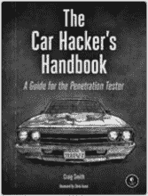
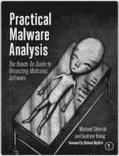
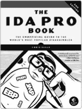
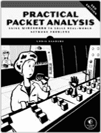
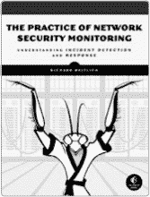
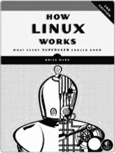

**更新**

访问 *[`www.nostarch.com/forensicimaging/`](https://www.nostarch.com/forensicimaging/)* 获取更新、勘误和其他信息。

*更多务实的书籍来自*  **NO STARCH PRESS**

**汽车黑客手册**

**渗透测试员指南**

*作者：* CRAIG SMITH

2016 年 3 月，304 页，$49.95

ISBN 978-1-59327-703-1

**实用恶意软件分析**

**恶意软件剖析实用指南**

*作者：* MICHAEL SIKORSKI *和* ANDREW HONIG

2012 年 2 月，800 页，$59.95

ISBN 978-1-59327-290-6

**IDA PRO 书籍，第 2 版**

**世界上最受欢迎反汇编工具的非官方指南**

*作者：* CHRIS EAGLE

2011 年 7 月，672 页，$69.95

ISBN 978-1-59327-289-0

**实用数据包分析，第 3 版**

**使用 Wireshark 解决真实世界的网络问题**

*作者：* CHRIS SANDERS

2017 年冬季，304 页，$49.95

ISBN 978-1-59327-802-1

**网络安全监控实战**

**理解事件检测与响应**

*作者：* RICHARD BEJTLICH

2013 年 7 月，376 页，$49.95

ISBN 978-1-59327-509-9

**如何运行 Linux，第 2 版**

**每个超级用户应该知道的**

*作者：* BRIAN WARD

2014 年 11 月，392 页，$39.95

ISBN 978-1-59327-567-9

**电话：**

800.420.7240 或

415.863.9900

**电子邮件：**

SALES@NOSTARCH.COM

**网站：**

[WWW.NOSTARCH.COM](http://WWW.NOSTARCH.COM)
