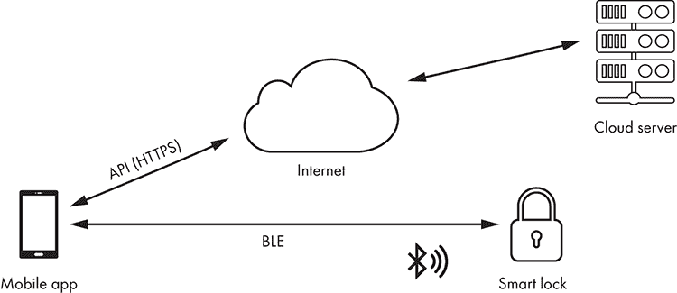
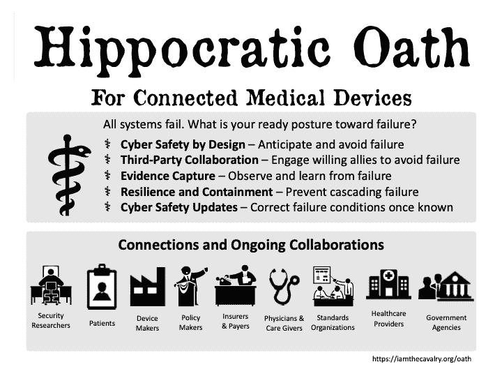
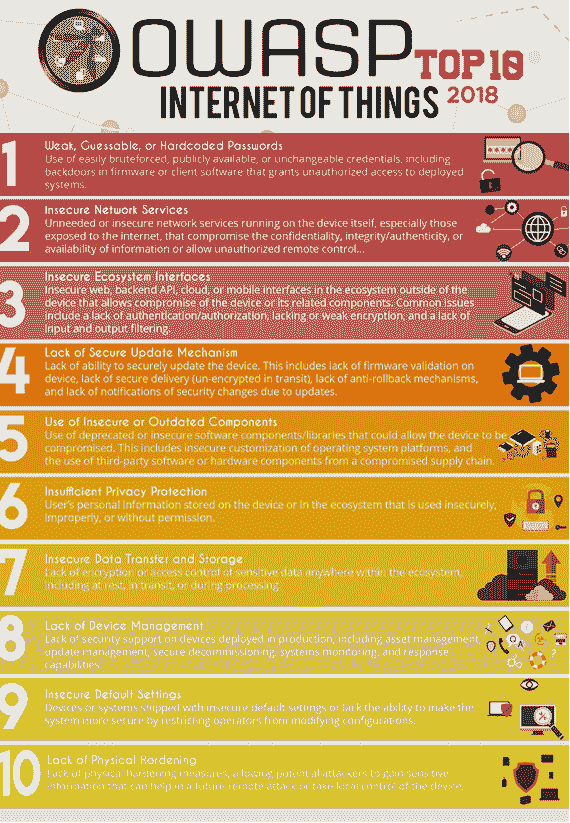

# 物联网安全的世界

从你公寓楼的屋顶上，你可能被*物联网（IoT）*所包围。在楼下的街道上，每小时都有数百辆“轮子上的电脑”驶过，每辆车都由传感器、处理器和网络设备组成。在天际线处，公寓楼上布满了各种天线和卫星接收器，将许多个人助手、智能微波炉和学习型恒温器连接到互联网。头顶上，移动数据中心以每小时数百英里的速度穿越天空，留下的数据痕迹比它们的尾迹还要厚重。走进一个制造厂、医院或电子商店，你同样会被那些无处不在的联网设备所压倒。

尽管定义差异很大，即使在专家中也是如此，但为了本书的目的，*物联网（IoT）*指的是那些具备计算能力并能通过网络传输数据的物理设备，但通常不需要人机交互。有些人通过“像计算机，但又不完全是”的方式来描述物联网设备。我们常常将特定的物联网设备称为“智能”——例如，智能微波炉——尽管许多人已经开始质疑这么做的智慧。（参见 Lauren Goode 在*The Verge*上发表的 2018 年文章《一切都已连接，我们无法回头》）目前看来，物联网的权威定义在短期内难以到来。

对黑客来说，物联网生态系统是一个充满机会的世界：数十亿个互联设备在传输和共享数据，创造了一个巨大的游乐场，供他们 tinkering、制作、利用漏洞以及将这些系统推向极限。在我们深入探讨物联网设备的黑客入侵与安全防护的技术细节之前，本章将向你介绍物联网安全的世界。我们将以三个案例研究结尾，探讨保障物联网设备安全的法律、实践和个人层面。

## 为什么物联网安全很重要？

你可能听说过这样的统计数据：到 2025 年，将会有数百亿个新的物联网设备问世，全球 GDP 将因此增长数十万亿美元。但那仅仅是我们做对事情，并且这些新设备快速进入市场的情况下。相反，我们看到的是安全、隐私、可靠性等方面的担忧阻碍了设备的普及。安全问题可能与设备的价格一样，成为一个阻碍因素。

物联网行业的缓慢增长不仅是一个经济问题。物联网设备在许多领域有潜力改善人们的生活。2016 年，美国公路上有 37,416 人死亡。根据美国国家公路交通安全管理局的数据，94%的死亡是由人为错误引起的。自动驾驶车辆可以大幅减少这些数字，使我们的道路更加安全，但前提是它们必须值得信赖。

在我们生活的其他领域，我们同样能够从为设备增添更多功能中受益。例如，在医疗领域，能够每日向医生发送数据的心脏起搏器将显著降低心脏病发作导致的死亡。然而，在心脏节律学会的一个座谈会上，一位来自退伍军人事务部的医生表示，她的病人拒绝植入这些设备，因为他们害怕被黑客攻击。许多来自行业、政府和安全研究领域的人士担心，信任危机将会拖延拯救生命的技术，甚至拖延数年或数十年。

当然，随着这些技术与我们的生活日益交织，我们必须知道——而不仅仅是希望——它们值得我们所赋予的信任。在一项由英国政府资助的物联网设备消费者信任调查中，72%的受访者表示，他们认为安全性已经内置。然而，对于大多数物联网行业来说，安全性更多的是事后考虑的附加功能。

2016 年 10 月，*Mirai*僵尸网络攻击发生，美国联邦政府及世界各国政府纷纷关注此事。这一系列日益升级的攻击通过众所周知的默认密码（如`admin`、`password`、`1234`）将成千上万的低成本设备转为己用。最终，攻击导致了对域名系统（DNS）提供商 Dyn 的*分布式拒绝服务攻击*（*DDoS*），该公司是许多美国巨头互联网基础设施的一部分，包括亚马逊、Netflix、Twitter、*华尔街日报*、星巴克等。客户、收入和声誉在超过八小时内受到了剧烈冲击。

很多人认为这些攻击是由外国国家力量所为。紧随其后，*WannaCry*和*NotPetya*攻击在全球造成了数万亿美元的损失，部分原因是它们影响了用于关键基础设施和制造业的物联网系统。它们还让各国政府深刻感受到，在保护公民的责任上，它们明显落后了。WannaCry 和 NotPetya 本质上是勒索病毒攻击，它们利用了 EternalBlue 漏洞，该漏洞利用了微软在实现服务器消息块（SMB）协议时的一个安全漏洞。到 2017 年 12 月，当人们揭露 Mirai 是由几个大学生设计和实施时，全球各国政府已经意识到他们必须检视物联网安全问题的严重性。

物联网安全有三条发展路径：现状可以保持，消费者可以开始将安全性“加装”到默认不安全的设备上，或者制造商可以从一开始就将安全性内建到设备中。在现状情境下，社会将接受由于安全问题而带来的定期损害，认为这是使用物联网设备的必要部分。在后市场安全情境中，新公司将填补设备制造商忽视的空白，而买家最终会为不完全符合需求的安全性支付更多费用。在第三种情境中，制造商将安全性内建于设备中，买家和运营商将更好地解决问题，风险和成本的决策将转向供应链中更高效的点。

我们可以从过去汲取经验，看看这三种情境，特别是最后两种，可能会如何发展。例如，纽约最初的消防逃生通道经常被固定在建筑物外部。因此，根据一篇名为《消防逃生如何变成装饰品》的*Atlantic*文章，它们通常会增加成本并对居民造成更大的伤害。今天，这些消防逃生通道被建入建筑物内，通常是第一项建设的内容，居民的消防安全比以往任何时候都更有保障。就像建筑物中的消防逃生通道一样，内建于物联网设备中的安全性可以带来新的能力，这些能力是外加安全方式所无法实现的，例如可更新性、强化、安全威胁建模和组件隔离——这些内容你将在本书中看到。

请注意，上述三条发展路径并非互相排斥；物联网市场可以支持这三种情境。

## 物联网安全与传统 IT 安全有何不同？

IoT 技术与更为熟悉的信息技术（IT）在关键方面有所不同。*I Am The Cavalry*，一个全球性的草根倡议，在安全研究社区中提供了一种比较两者的教学框架，具体内容如下。

物联网安全失败的*后果*可能直接导致生命的丧失。它们还可能摧毁公众对公司或更广泛行业的信任，以及对政府通过监管和监督保障公民安全能力的信心。例如，当 WannaCry 攻击爆发时，患有时间敏感性疾病的患者，如中风或心脏病发作的患者，毫无疑问未能得到及时治疗，因为这次攻击导致医疗服务延误了好几天。

攻击这些系统的*对手*有不同的目标、动机、方法和能力。有些对手可能会尽量避免造成伤害，而其他对手则可能专门攻击物联网系统以造成伤害。例如，医院常常成为勒索的目标，因为对患者的潜在伤害会增加受害者支付赎金的可能性和速度。

物联网设备的*组成*，包括安全系统，创造了在典型 IT 环境中找不到的约束。例如，心脏起搏器中的大小和功率限制，给应用传统 IT 安全方法（需要大量存储或计算能力）带来了挑战。

物联网设备通常在特定的*上下文*和*环境*中运行，例如家庭环境，其中设备由个人控制，而这些个人并没有部署、操作和维护安全的知识或资源。例如，我们不应期望连接汽车的驾驶员安装后续的安全产品，如防病毒保护。我们也不应期望他们具备足够的专业知识或能力在安全事件发生时作出迅速反应。但我们会期望企业能够做到这一点。

物联网制造的*经济性*驱动设备成本（因此驱动组件成本）降到最低，这通常使得安全成为一个昂贵的事后考虑。此外，这些设备往往面向对价格敏感、缺乏安全选择和部署经验的客户。此外，这些设备的不安全性往往会带来成本，这些成本最终由非主要设备拥有者或操作员承担。例如，Mirai 僵尸网络利用了嵌入芯片固件中的硬编码密码来传播。大多数设备拥有者并不知道他们应该更改密码，或者不知道如何更改。Mirai 通过攻击一家不拥有任何受影响设备的第三方 DNS 供应商，给美国经济带来了数十亿美元的损失。

物联网设计、开发、实施、操作和退役的*时间尺度*通常以几十年为单位来衡量。响应时间也可能因为组成、上下文和环境的不同而延长。例如，电厂中的连接设备通常预计能使用超过 20 年而无需更换。但针对乌克兰能源供应商的攻击仅在对工业控制基础设施采取行动后的几秒钟内就造成了停运。

### 物联网黑客攻击有什么特别之处？

由于物联网安全与传统 IT 安全在许多方面存在显著差异，因此攻击物联网系统也需要不同的技术。物联网生态系统通常由嵌入式设备和传感器、移动应用程序、云基础设施和网络通信协议组成。这些协议包括 TCP/IP 网络堆栈中的协议（例如 mDNS、DNS-SD、UPnP、WS-Discovery 和 DICOM），以及用于短程无线（如 NFC、RFID、蓝牙和 BLE）、中程无线（如 Wi-Fi、Wi-Fi Direct 和 Zigbee）和长程无线（如 LoRa、LoRaWAN 和 Sigfox）的协议。

与传统的安全测试不同，物联网安全测试需要你检查并经常拆解设备硬件，处理在其他环境中通常不会遇到的网络协议，分析控制设备的移动应用程序，并检查设备如何通过应用程序接口（API）与托管在云端的 Web 服务进行通信。我们将在接下来的章节中详细解释所有这些任务。

让我们来看一个智能门锁的例子。图 1-1 展示了智能锁系统的常见架构。智能锁通过蓝牙低能耗（BLE）与用户的智能手机应用进行通信，而应用通过 HTTPS 上的 API 与云端的智能锁服务器进行通信。在这个网络设计中，智能锁依赖于用户的移动设备来连接互联网，以便接收来自云端服务器的任何消息。

图 1-1：智能锁系统的网络结构图

这三个组件（智能锁设备、智能手机应用和云服务）相互互动并信任对方，从而形成一个暴露较大攻击面物联网系统。试想一下，当你撤销使用此智能锁系统的 Airbnb 客人的数字钥匙时会发生什么。作为公寓和智能锁设备的所有者，你的手机应用被授权向云服务发送取消客人用户钥匙的消息。当然，你可能根本不在公寓或锁旁边。服务器接收到撤销更新后，会向智能锁发送一个特殊的消息来更新其访问控制列表（ACL）。如果恶意客人仅仅将他们的手机设置为飞行模式，智能锁就无法将其用作接收来自服务器的状态更新的中继，客人仍然能够进入你的公寓。

我们刚才描述的这种简单的撤销规避攻击，揭示了你在破解物联网系统时可能遇到的漏洞类型。此外，使用小型、低功耗、低成本嵌入式设备所带来的限制，只会增加这些系统的不安全性。例如，物联网设备通常不使用资源密集的公钥密码学，而是仅依赖对称密钥来加密其通信通道。这些加密密钥往往是非唯一的，且硬编码在固件或硬件中，这意味着攻击者可以提取这些密钥，然后在其他设备中重复使用。

### 框架、标准和指南

处理这些安全问题的标准方法是实施，嗯，标准。在过去的几年里，许多框架、指南和其他文档尝试解决物联网系统中安全性和信任问题的不同方面。虽然标准旨在将行业凝聚在公认的最佳实践周围，但标准过多导致了一个支离破碎的局面，这表明人们对于如何做事情存在广泛的分歧。然而，我们可以从研究各种标准和框架中汲取许多价值，即使我们认识到对于如何确保物联网设备安全的最佳方法并没有达成共识。

首先，我们可以将那些指导*设计*的文档与那些管理*操作*的文档区分开。二者是相互关联的，因为设备的设计能力会被操作员用来保护他们的环境。反过来也成立：许多在设备设计中没有的能力在操作中是无法实现的，比如安全软件更新、法证有效的证据捕获、设备内隔离和分段以及安全失败状态等。采购*指南文件*，通常由公司、行业协会或政府发布，可以帮助桥接这两类文档。

第二，我们可以区分*框架*和*标准*。框架定义了可实现目标的类别，而标准则定义了实现这些目标的过程和规范。两者都很有价值，但框架更具长久性且广泛适用，因为安全标准通常老化较快，并且在特定用例中效果最佳。另一方面，一些标准非常有用，并且构成了物联网技术的核心组件，比如用于互操作性的标准，如 IPv4 和 Wi-Fi。因此，框架和标准的结合可以有效地治理技术领域。

在本书中，我们会根据需要参考框架和标准，以便为设计师和操作员提供关于如何解决安全研究人员在使用我们概述的工具、技术和流程时发现的问题的指导。以下是一些标准、指南文件和框架的示例：

1.  标准 欧洲电信标准化协会（ETSI）成立于 1988 年，每年创建超过 2000 项标准。其《消费物联网的网络安全技术规范》详细规定了如何安全地构建物联网设备。美国国家标准与技术研究院（NIST）和国际标准化组织（ISO）发布了几项支持物联网设备安全的标准。

1.  框架 "I Am The Cavalry"成立于 2013 年，是一个由安全研究社区成员组成的全球草根倡议。其《连接医疗设备的希波克拉底誓言》（图 1-2）描述了设计和开发医疗设备的目标和能力。许多内容已被纳入 FDA 批准医疗设备的监管标准。其他框架包括 NIST 网络安全框架（适用于拥有和运营物联网设备）、思科的物联网安全框架以及云安全联盟的物联网安全控制框架等。

1.  指导文档 开放 Web 应用安全项目（OWASP）自 2001 年启动以来，已远远超出了其原名的范围。其 Top 10 列表已成为软件开发人员和 IT 采购的强大工具，并被用来提高各种项目的安全级别。2014 年，其物联网项目（图 1-3）发布了第一个 Top 10 列表。最新版本（截至本文写作时）来自 2018 年。其他指导文档包括 NIST 物联网核心基准、NTIA 物联网安全可升级性和修补资源、ENISA 物联网安全基准建议、GSMA 物联网安全指南和评估以及物联网安全基金会最佳实践指南等。

图 1-2：连接医疗设备的希波克拉底誓言，物联网框架

图 1-3：OWASP 物联网十大风险，指导文档

## 案例研究：发现、报告和披露物联网安全问题

尽管本书的大部分内容详细介绍了技术方面的考虑，但你仍需理解一些影响物联网（IoT）安全研究的其他因素。这些因素是通过长期从事该领域的工作所学到的，涉及到在披露漏洞时必须做出的权衡，以及研究人员、制造商和公众在披露时应考虑的事项。以下案例研究概述了一个成功结束的物联网安全研究项目，我们将突出展示其成功的原因和方式。

2016 年，安全研究员兼 1 型糖尿病患者 Jay Radcliffe 发现并报告了 Animas OneTouch Ping 胰岛素泵的三个安全问题给制造商。他的工作始于前几个月，当时他购买了设备，建立了测试实验室，并识别出潜在威胁进行测试。此外，他还寻求了法律建议，以确保他的测试符合国家和地方的法律规定。

Jay 的主要目标是保护患者，因此他通过制造商的协调漏洞披露政策报告了该漏洞。通过电子邮件、电话和面对面的交流，Jay 解释了技术细节、问题的影响及其缓解步骤。这个过程持续了几个月，在此期间，他展示了漏洞的利用方法，并提供了概念验证代码。

那年晚些时候，当 Jay 了解到制造商没有计划在发布新版本硬件之前进行任何技术修复时，他发布了公开披露，内容包括以下回应：“如果我的任何孩子患上糖尿病，且医疗人员建议给他们使用泵，我不会犹豫地给他们使用 OneTouch Ping。它不是完美的，但没有什么是完美的。”请见 [`blog.rapid7.com/2016/10/04/r7-2016-07-multiple-vulnerabilities-in-animas-onetouch-ping-insulin-pump/`](https://blog.rapid7.com/2016/10/04/r7-2016-07-multiple-vulnerabilities-in-animas-onetouch-ping-insulin-pump/) 以查看完整披露。

Jay 已经花费近一年时间寻找漏洞并解决问题。在制造商通知受影响的患者后，他原计划在一个重要会议上展示他的工作。许多患者依赖邮寄方式接收此类信息，但不幸的是，邮件在他演讲后才会到达。Jay 做出了一个艰难的决定，取消了会议上的演讲，以便患者能够通过他们的医生或公司了解这一问题，而不是通过新闻文章得知。

你可以从像 Jay 这样的成熟安全研究员的实例中学到几个教训：

1.  他们考虑自己发现对相关人员的影响。Jay 的准备工作不仅涉及获取法律意见，还确保他的测试不会对实验室外的人造成影响。此外，他确保患者从他们信任的人那里了解这些问题，减少了他们恐慌或停止使用这种救命技术的可能性。

1.  它们更多的是提供信息，而非替代决策。Jay 明白制造商将较少的资源投入到修复旧设备上，而是专注于开发新产品，以便挽救和改善更多生命。Jay 没有要求设备制造商修补这些旧的易受攻击的设备，而是尊重他们的判断。

1.  他们以身作则。Jay 和许多其他医疗领域的研究员建立了长期的患者、监管机构、医生和制造商关系。在许多情况下，这意味着放弃公开认可和有偿项目，并且需要极大的耐心。但结果证明一切。领先的设备制造商正在生产史上最安全的医疗设备，同时在像 DEF CON 的 Biohacking Village 等活动中与安全研究社区保持互动。

1.  他们了解法律。安全研究员几十年来一直面临法律威胁。其中一些是无理的，其他则不然。尽管专家们仍在努力为协调披露和漏洞奖励计划制定标准化语言，但研究员们很少，甚至几乎从未因在这些计划内披露而面临法律后果。

## 专家观点：应对物联网的挑战

我们联系了几位公认的法律和公共政策专家，帮助读者了解那些在黑客书籍中通常未涉及的主题。Harley Geiger 讨论了两部与美国安全研究人员相关的法律，而 David Rogers 则介绍了英国在提升物联网设备安全方面正在进行的努力。  

### 物联网黑客法律  

#### Harley Geiger，Rapid7 公共政策总监  

可以说，影响物联网研究的两部最重要的联邦法律是《数字千年版权法》（DMCA）和《计算机欺诈与滥用法》（CFAA）。让我们快速了解这两部残酷的法规。

许多物联网安全研究涉及绕过软件的弱保护措施，但《数字千年版权法》通常禁止绕过*技术保护措施*（*TPMs*），例如加密、身份验证要求和地区编码，来访问受版权保护的作品（如软件），未经版权持有者的许可。这意味着研究人员在进行物联网安全研究之前需要获得物联网软件制造商的许可——*即使是你自己拥有的设备也不例外*! 幸运的是，针对诚信安全测试有一个特定的例外，允许安全研究人员绕过 TPM 而无需版权持有者的许可。国会图书馆馆长在安全研究社区及其盟友的请求下批准了这一例外。自 2019 年起，为了在《数字千年版权法》下获得法律保护，研究必须满足以下基本条件：  

+   研究必须基于合法获得的设备（例如，计算机所有者授权的设备）。  

+   研究必须仅为测试或修正安全漏洞的目的进行。  

+   研究必须在一个旨在避免危害的环境中进行（因此，不能在核电厂或拥挤的高速公路上进行）。  

+   从研究中获得的信息必须主要用于促进设备、计算机或其用户的安全性（例如，不能主要用于盗版）。  

+   研究不得违反其他法律，例如（但不限于）《计算机欺诈与滥用法》（CFAA）。  

有两个例外，但只有一个提供真正的保护。这个更强的例外每三年必须由国会图书馆馆长重新批准，而且在重新批准时，保护的范围可能会发生变化。通过这一过程，许多最具进步性的安全研究法律保护成果得以实现。最新的 2018 版《数字千年版权法》安全测试例外见于[`www.govinfo.gov/content/pkg/FR-2018-10-26/pdf/2018-23241.pdf#page=17/`](https://www.govinfo.gov/content/pkg/FR-2018-10-26/pdf/2018-23241.pdf#page=17/)。  

CFAA 也经常被提及；正如你刚刚看到的，它在 DMCA 下的安全测试保护中被引用。CFAA 是美国最重要的联邦反黑客法律，且与 DMCA 不同，该法律目前并未直接保护安全测试。但 CFAA 通常适用于未经*计算机所有者*授权而访问或破坏他人计算机（而不是像 DMCA 那样针对软件版权的所有者）。那么，如果你被授权使用某个物联网设备（例如，由雇主或学校授权），但你的物联网研究超出了这个授权范围怎么办？法院仍在为此争论中。欢迎进入 CFAA 的法律灰色地带，顺便说一下，该法律已经实施了 30 多年。尽管如此，如果你正在访问或破坏你拥有或经计算机所有者授权进行研究的物联网设备，那么在 DMCA 和 CFAA 下，你更可能是合法的。恭喜！

等等！还有许多其他法律可能会涉及物联网安全研究，尤其是州级反黑客法律，这些法律可能比 CFAA 更广泛、更模糊。（有趣的事实：华盛顿州的黑客法律专门为“白帽黑客”提供法律保护。）关键是，不要因为你没有违反 DMCA 或 CFAA 就假设你的物联网安全研究是完全合法的——虽然这当然是一个很好的开始！

如果你觉得这些法律保护让人困惑或令人畏惧，你并不孤单。这些法律复杂，甚至让律师和当选官员都感到困惑，但目前有一个坚定且日益增长的努力，旨在澄清并加强对安全研究的法律保护。你在应对那些阻碍宝贵物联网安全研究的模糊法律时的声音和经验，将为关于改革 DMCA、CFAA 及其他法律的持续辩论提供有益的贡献。

### 政府在物联网安全中的作用

#### Copper Horse Security 的首席执行官 David Rogers，英国《实践规范》作者，英国帝国勋章（MBE）获得者，因其对网络安全的贡献而获此殊荣

政府承担着保护社会的艰巨任务，同时又要促进经济繁荣。尽管世界各国政府因担心扼杀创新而对物联网安全保持谨慎态度，但像 Mirai 僵尸网络、WannaCry 和 NotPetya 这样的事件促使立法者和监管机构重新思考其放任不管的态度。

其中一个政府努力是英国的《行为准则》。该准则首次发布于 2018 年 3 月，旨在使英国成为世界上最安全的在线生活和商业场所。国家意识到物联网生态系统具有巨大的潜力，但也存在巨大的风险，因为制造商未能保护消费者和公民。2017 年，英国成立了一个由来自各行业、政府和学术界的人组成的专家咨询小组，开始着手解决这个问题。此外，该倡议还咨询了包括“I Am The Cavalry”等组织在内的许多安全研究社区成员。  

该准则制定了 13 条指南，作为整体将提升网络安全标准，不仅针对设备，还包括周围的生态系统。它适用于移动应用开发者、云服务提供商、移动网络运营商以及零售商。这种方法将安全负担从消费者转移到了那些在设备生命周期早期能更好解决安全问题的组织。  

你可以在[`www.gov.uk/government/publications/code-of-practice-for-consumer-iot-security/`](https://www.gov.uk/government/publications/code-of-practice-for-consumer-iot-security/)阅读完整的准则。最紧急的事项是前三项：避免默认密码、实施并执行漏洞披露政策、确保设备能够进行软件更新。作者将这些准则描述为*不安全的金丝雀*；如果一个物联网产品未能遵守这些准则，那么该产品其他部分可能也存在缺陷。  

该准则采取了真正的国际化方式，认识到物联网世界及其供应链是全球性问题。该准则得到了全球数十家公司支持，并于 2019 年 1 月被 ETSI 采纳为 ETSI 技术规范 103 645。

欲了解更多关于物联网安全的具体政府政策，请参阅 I Am The Cavalry 物联网网络安全政策数据库，地址为[`iatc.me/iotcyberpolicydb/`](https://iatc.me/iotcyberpolicydb/)。  

### 医疗设备安全的患者视角  

设计和开发物联网设备可能迫使制造商做出一些艰难的权衡。那些依赖医疗设备来照顾自己的安全研究人员，比如 Marie Moe 和 Jay Radcliffe，非常清楚这些权衡。  

#### Marie Moe, @mariegmoe, SINTEF  

我是一个安全研究人员，同时也是一名患者。我的每一次心跳都由一台医疗设备生成，一颗植入我体内的心脏起搏器。八年前，我醒来时躺在地板上。我摔倒了，因为我的心脏停跳了——停得足够长，导致我昏迷。为了保持脉搏并防止我的心脏停跳，我需要一颗心脏起搏器。这个小设备监测每次心跳，并通过电极将一个小的电信号直接发送到我的心脏，保持它跳动。但是，当我的心脏由专有代码驱动而且没有透明度时，我该如何信任它呢？  

当我植入心脏起搏器时，这是一个紧急手术。我需要这个设备才能活下来，因此没有选择不植入的余地。但这是时候提出问题了。令我的医生们惊讶的是，我开始询问关于心脏起搏器软件中潜在的安全漏洞以及黑客攻击这个关乎生命的设备的可能性。答案并不令人满意。我的医疗服务提供者无法回答我关于计算机安全的技术问题；他们中的许多人甚至没有考虑到我体内的这台机器正在运行计算机代码，而来自植入设备制造商的技术信息也非常有限。

所以，我开始了一个黑客项目；在过去的四年里，我了解了更多关于这个保持我生命的设备的安全性。我发现，我对医疗设备网络安全状况的许多担忧确实是正确的。我了解到，采用“安全性通过模糊性”的专有软件，可能掩盖了不良的安全性和隐私实施。我还了解到，老旧技术与增加的连接性相结合，会增加攻击面，从而增加可能影响患者安全的网络安全问题风险。像我这样的安全研究人员，并不是怀着制造恐惧或伤害患者的意图去破解设备。我的动机是希望发现的缺陷得到修复。为此，各方的合作至关重要。

我的愿望是，当我和其他研究人员向医疗设备制造商报告网络安全问题时，他们能认真对待我们，并以患者安全为最大利益行事。

首先，我们需要认识到，网络安全问题可能会导致患者安全问题。对已知漏洞保持沉默或否认其存在，并不能让患者更安全。透明度的努力，例如创建安全无线通信协议的开放标准、发布协调的漏洞披露政策邀请研究人员本着良好的信念报告问题，以及向患者和医生发布网络安全警告，都让我有信心厂商正在认真对待这些问题并努力减轻风险。这使得我和我的医生能够有信心，平衡医疗风险和网络安全副作用与我的个人威胁模型之间的关系。

未来的解决方案是透明度和更好的合作，并充满理解和同理心。

#### Jay Radcliffe，@jradcliffe02，赛默飞世尔科技

我清晰地记得我被诊断为糖尿病的那一天。那是我 22 岁的生日。我当时表现出典型的 I 型糖尿病症状：极度口渴和体重减轻。那一天改变了我的生活。我是为数不多的几位能说自己因糖尿病诊断而感到幸运的人之一。糖尿病让我接触到了互联医疗设备的世界。我一直喜欢拆解东西并重新组装。对我来说，这只是一种锻炼这些直觉和技能的新方式。拥有一个连接到你身体的设备，控制着生命的重大功能，这种感觉是无法用言语形容的。知道它具有无线连接性并且存在漏洞时，这种不可言喻的感觉又是另一种。每一次有机会帮助让医疗设备更能抵御充满敌意的电子/连接世界，我都心怀感激。这些设备对保持人们健康和生命至关重要。胰岛素泵、心脏起搏器、心血管设备、脊柱刺激器、神经刺激器，以及无数其他设备正在让人们的生活变得更好。

这些设备通常与手机连接，然后再连接到互联网，让医生和看护人员了解患者的健康状况。但连接性伴随着风险。作为安全专业人员，我们的责任是帮助患者和医生理解这些风险，并帮助制造商识别和控制这些风险。尽管过去几十年计算机、连接性和安全性的性质发生了巨大变化，但美国的法定语言在诚信安全研究方面并没有发生显著变化。（请检查你所在地区的法律；它们可能有所不同。）幸运的是，得益于黑客、学者、公司和有见识的政府人员的努力，法规语言、豁免条款和实施细节已经有所改变——而且是朝着更好的方向发展。对安全研究中的法律问题进行全面讨论可能需要几卷由经验丰富的律师编写的干巴巴的内容，因此这不是进行那种讨论的地方。但一般来说，如果你拥有一台设备，在美国进行安全研究是合法的，前提是研究的范围限制在你自己的网络之内。

## 结论

物联网的前景正在迅速扩展。这些“物品”的数量、种类和用途变化比任何出版截止日期都要快。在你读到这些文字的时候，可能已经出现了我们在这些页面中未曾考虑到的新“物品”。尽管如此，我们仍然确信本书提供了有价值的资源和参考，能够帮助你构建能力，无论在一年或十年后你在实验台上发现了什么。
