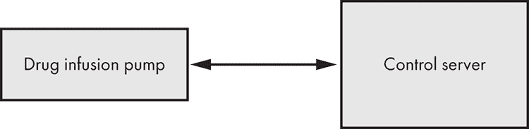
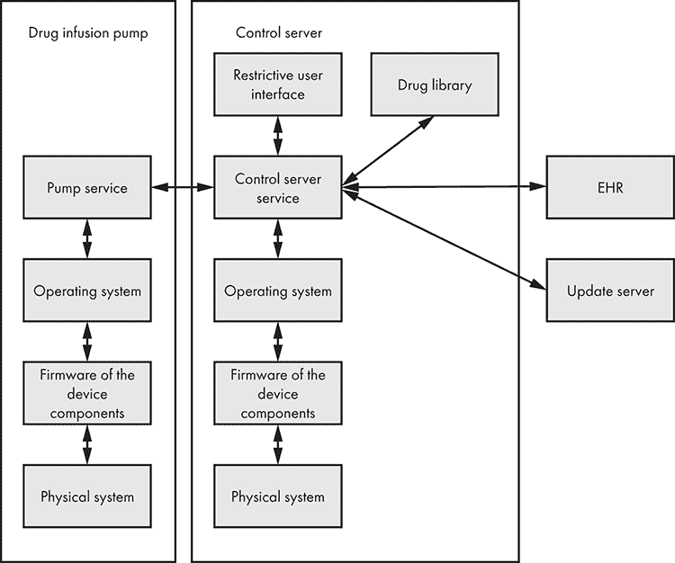
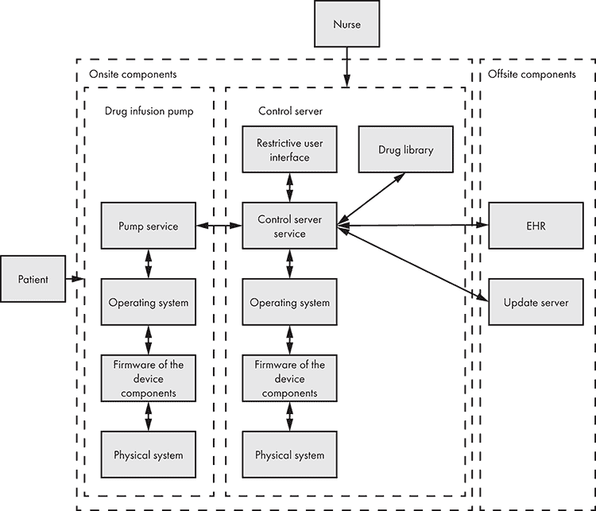
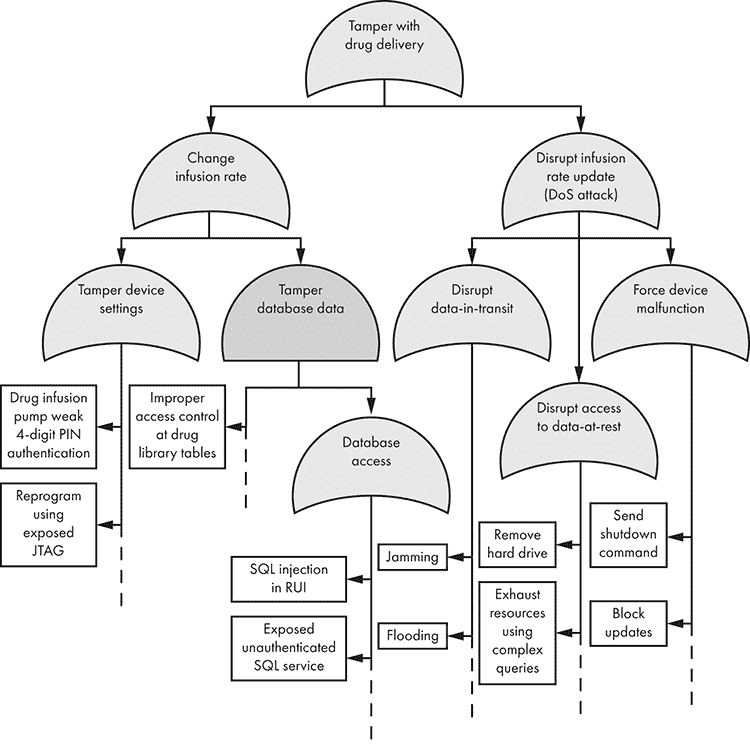

# 2

威胁建模

*威胁建模*过程系统地识别可能针对设备的攻击，然后根据其严重性对某些问题进行优先级排序。由于威胁建模可能会显得冗长，因此有时会被忽视。尽管如此，它对于理解威胁、其影响以及你必须采取的适当缓解措施至关重要。

在本章中，我们将带你了解一个简单的威胁建模框架，并讨论几个替代框架。然后，我们简要描述一些物联网基础设施通常遇到的最重要的威胁，帮助你在下次物联网评估中成功运用威胁建模技术。

## 物联网的威胁建模

当你为物联网设备专门创建威胁模型时，你很可能会遇到一些反复出现的问题。原因在于，物联网世界主要由低计算能力、低功耗、有限内存和磁盘空间的系统组成，这些系统部署在不安全的网络环境中。许多硬件制造商意识到，他们可以轻松地将任何廉价平台，如 Android 手机或平板、树莓派或 Arduino 板，转换为复杂的物联网设备。

因此，许多物联网设备的核心运行的是 Android 或常见的 Linux 发行版，这些操作系统与超过十亿部手机、平板电脑、手表和电视所使用的相同。这些操作系统是众所周知的，且通常提供的功能超出设备需求，从而增加了攻击者利用设备的方式。更糟的是，物联网开发者通过引入缺乏适当安全控制的自定义应用程序来补充操作系统。然后，为了确保产品能够执行其主要功能，开发者常常不得不绕过操作系统的原始保护。还有一些基于实时操作系统（RTOS）的物联网设备，虽然最小化了处理时间，但并未实施更先进平台的安全标准。

此外，这些物联网设备通常没有运行防病毒或反恶意软件保护的能力。它们的极简设计，旨在简化使用，无法支持常见的安全控制，例如*软件白名单*，在这种控制下，设备只允许安装特定的软件，或*网络访问控制（NAC）*解决方案，它执行网络策略，控制用户和设备的访问。许多厂商在产品初次发布后不久就停止提供安全更新。此外，通常开发这些产品的白标公司通过许多供应商在不同品牌名称和标志下广泛分发它们，这使得安全性和软件更新难以应用到所有产品。

这些局限性迫使许多联网设备使用专有的或不太知名的协议，这些协议未能达到行业安全标准。通常，它们无法支持复杂的加固方法，比如*软件完整性控制*，它可以验证第三方是否篡改了可执行文件，或*设备验证*，它使用专用硬件来确保目标设备的合法性。

## 遵循威胁建模框架

在安全评估中使用威胁建模的最简单方法是遵循像*STRIDE 威胁分类模型*这样的框架，该模型侧重于识别技术中的弱点，而不是易受攻击的资产或潜在的攻击者。STRIDE 由微软的 Praerit Garg 和 Loren Kohnfelder 开发，是最流行的威胁分类方案之一。这个首字母缩略词代表以下几种威胁：

1.  欺骗：当一个行为者假装扮演系统组件的角色时

1.  篡改：当一个行为者破坏数据或系统的完整性时

1.  否认：当用户可以否认自己在系统上执行了某些操作时

1.  信息披露：当行为者破坏系统数据的机密性时

1.  服务拒绝：当一个行为者破坏系统组件或整个系统的可用性时

1.  权限提升：当用户或系统组件能够提升到不应有的权限级别时

STRIDE 包含三个步骤：识别架构，拆解成组件，并识别每个组件的威胁。为了展示这一框架的实际应用，假设我们正在为一个药物输液泵进行威胁建模。我们假设该泵通过 Wi-Fi 连接到医院内的控制服务器。网络不安全且缺乏分段，这意味着医院的访客可能会连接到 Wi-Fi，并被动监控泵的流量。我们将利用这个场景来逐步演示框架的每个步骤。

### 识别架构

我们从检查设备的架构开始我们的威胁建模。系统由药物输液泵和一个能够向数十个泵发送命令的控制服务器组成（图 2-1）。护士操作该服务器，尽管在某些情况下，授权的 IT 管理员也可能访问它。

图 2-1：输液泵的简单架构图

控制服务器有时需要软件更新，包括药物库和患者记录的更新。这意味着它有时会连接到*电子健康记录（EHR）*和更新服务器。EHR 数据库包含患者的健康记录。尽管这两个组件可能超出了安全评估的范围，但我们还是将它们包含在我们的威胁模型中（图 2-2）。

图 2-2：输液泵及其控制服务器的扩展架构图，控制服务器还连接到电子健康记录（EHR）和更新服务器

### 将架构拆解成组件

现在让我们更仔细地观察一下架构。输注泵和控制服务器由多个组件组成，因此我们需要拆解模型，以更可靠地识别威胁。图 2-3 展示了架构组件的更详细信息。

图 2-3：进一步拆解我们的威胁模型

泵系统由硬件（实际的泵）、操作系统，以及泵内运行的软件和微控制器组成。我们还考虑了控制服务器的操作系统、*控制服务器服务*（运行控制服务器的程序）以及限制性的用户界面，该界面限制了用户与服务的交互。

现在我们对系统有了更清晰的了解，接下来让我们确定这些组件之间信息流动的方向。通过这样做，我们可以定位敏感数据，并找出攻击者可能会攻击的组件。我们可能还会发现一些我们之前不知道的隐藏数据流路径。假设在进一步检查生态系统后，我们得出结论：所有组件之间的数据流动是双向的。我们已经在图 2-3 中使用双向箭头标记了这一点，请记住这个细节。

让我们继续，在图示中添加信任边界（图 2-4）。*信任边界*围绕具有相同安全属性的群组，这有助于我们揭示可能容易受到威胁的数据流入口。

图 2-4：包含信任边界的图示

我们围绕泵、控制服务器、现场组件和远程组件创建了独立的信任边界。出于实际原因，我们还添加了两个外部用户：使用泵的患者和操作控制服务器的护士。

注意到，像来自泵的患者数据等敏感信息，可以通过控制服务器传递到第三方供应商的更新服务器。我们的方法有效：我们已经发现了第一个威胁——不安全的更新机制，这可能会将患者数据暴露给未经授权的系统。

### 识别威胁

现在我们将应用 STRIDE 框架来分析图示中的组件，给出一个更全面的威胁列表。尽管为了简洁起见，我们在本次练习中只讨论其中一些组件，但你应该在威胁建模过程中涵盖所有组件。

首先，我们将审查产品的一般安全要求。通常，这些要求是在开发过程中由供应商确定的。如果我们没有供应商的具体要求清单，我们可以通过查阅设备文档自行确定。例如，作为医疗设备，药物输液泵必须确保患者的安全与隐私。此外，所有医疗设备应获得针对其所处市场的认证。例如，在欧洲经济区（EEA）的扩展单一市场上交易的设备应具备欧盟认证（CE）标志。我们将在分析每个组件时牢记这些要求。

#### 限制性用户界面

*限制性用户界面（RUI）*是与控制服务器服务交互的自助应用程序。该应用程序严重限制用户可以执行的操作。它就像一个 ATM 应用程序；你可以与软件进行互动，但只能以极少数的方式进行互动。除了通用的安全要求外，RUI 还有其特定的约束条件。首先，用户不应该能够退出该应用程序。其次，用户必须使用有效的凭据进行身份验证才能访问它。现在，让我们逐一分析 STRIDE 模型中的每个部分，以识别潜在的威胁。

在*欺骗*方面，RUI 使用弱的四位数 PIN 进行用户认证，攻击者很容易预测这些 PIN。如果攻击者猜对了 PIN，他们就可以访问授权账户，并代表账户所有者向输液泵发送命令。

就*篡改*而言，RUI 可以接收除了有限允许的输入以外的其他输入。例如，它可能通过外部键盘接收输入。即使大多数键盘键已被禁用，系统仍可能允许某些键组合，比如快捷键、热键，或甚至由底层操作系统配置的辅助功能（例如，在 Windows 中按 alt-F4 关闭窗口）。这些可能允许用户绕过 RUI 并退出自助服务应用程序。我们将在第三章中描述这种攻击。

在*否认*方面，RUI 仅支持一个医疗工作人员账户，使得所有日志文件（如果存在的话）都变得毫无用处，因为你无法识别到底是谁使用了该设备。由于 RUI 不能在多用户模式下运行，任何医疗团队成员都可以访问控制服务器并操作输液泵，而系统无法区分他们。

说到*信息披露*，某些调试消息或错误在展示给用户时，可能会透露有关患者或系统内部的重要信息。攻击者可能能够解码这些消息，发现底层系统使用的技术，并找出一种方式加以利用。

由于 RUI 的暴力破解保护机制，它可能容易受到*拒绝服务*攻击。如果用户连续五次登录失败，系统会锁定该用户。一旦暴力破解保护启动，任何用户都无法在设定的时间内登录系统。如果医疗团队不小心触发了该功能，可能会导致无法访问系统，进而违反患者安全的安全要求。即使安全功能可能防止一些威胁，它们往往会引发其他威胁。在安全、可用性和可用性的平衡之间找到合适的解决方案是一个艰巨的任务。

就*权限提升*而言，关键医疗系统通常具有远程支持解决方案，允许供应商的技术人员即时访问软件。这些功能的存在自动增加了组件的威胁面，因为这些服务容易受到漏洞的影响，攻击者可以利用它们获得 RUI 或控制服务器服务的远程管理员权限。即使这些功能需要身份验证，凭据也可能公开可用，或在该系列产品中是相同的。或者根本没有身份验证。

#### 控制服务器服务

控制服务器服务是操作控制服务器的应用程序。它负责与 RUI、药物库和药物输注泵进行通信。它还使用 HTTPS 与 EHR（接收患者信息）进行通信，并使用自定义 TCP 协议与更新服务器（接收软件和药物库更新）进行通信。

除了前面提到的一般安全要求外，控制服务器应能够识别和验证药物输注泵，以避免*窃取攻击*，即对手用类似的、被篡改的外部组件替换原有组件。我们还应确保数据传输过程中的保护。换句话说，控制服务器与泵之间的通信协议必须是安全的，不能允许重放攻击或拦截。*重放攻击*会导致关键请求或状态更改请求的重传或延迟。此外，我们还必须确保攻击者无法妥协主机平台的安全控制，这可能包括应用程序沙箱、文件系统权限和现有的基于角色的访问控制。

使用 STRIDE 模型，我们可以识别出以下威胁。由于控制服务器没有可靠的药物输注泵识别方法，*欺骗*攻击可能发生。如果简要分析通信协议，你可以模拟一个泵并与控制服务器通信，这可能导致更多的威胁。

攻击者可能会*篡改*服务，因为控制服务器没有可靠的方式验证药物输注泵发送的数据完整性。这意味着控制服务器可能容易受到*中间人攻击*，攻击者修改发送到控制服务器的数据，并向服务器提供伪造的读数。如果控制服务器根据这些伪造的读数做出决策，攻击可能直接影响患者的健康与安全。

控制服务器可能会导致*否认*，因为它使用*全球可写日志*来监控其操作，任何系统用户都能够覆盖这些日志文件。这些日志文件可能会被攻击者篡改，以隐藏某些操作。

关于*信息泄露*，控制服务器不必要地将敏感的患者信息发送给更新服务器或药物输注泵。这些信息可能包括从生命体征到个人信息的各种内容。

就*拒绝服务*而言，接近控制服务器的对手可以干扰服务器的信号，禁用与药物输注泵的任何无线通信，使整个系统无法使用。

此外，控制服务器可能容易受到*权限提升*的攻击，如果它不小心暴露了允许未经身份验证的对手执行高权限功能的 API 服务，包括更改药物输注泵的设置。

#### 药物库

药物库是系统的主要数据库。它包含泵使用的所有药物信息。该数据库还可以控制用户管理系统。

就*欺骗*而言，通过 RUI 或泵与数据库交互的用户可能会通过冒充其他数据库用户来执行操作。例如，他们可能会利用应用程序漏洞，滥用 RUI 中缺乏对用户输入的控制。

如果药物库未能正确清理来自 RUI 的用户输入，可能会受到*篡改*的威胁。这可能导致*SQL 注入攻击*，允许攻击者操控数据库或执行不可信的代码。

如果药物输注泵发起的用户请求的日志以不安全的方式存储用户代理，数据库可能会允许*否认*，使对手能够污染数据库的日志文件（例如，通过使用换行符插入虚假日志条目）。

在涉及到*信息泄露*时，数据库可能包含执行外部请求（如 DNS 或 HTTP 请求）的函数或存储过程。攻击者可以利用这些功能，通过脱带 SQL 注入技术窃取数据。这种方法对于只能执行盲注的攻击者极为有用，盲注是指服务器输出不包含注入查询结果的数据。例如，攻击者可以通过构造 URL 并将敏感数据放置在其控制的域名子域中，从而将数据偷偷带出。然后，他们可以将这个 URL 提供给这些易受攻击的函数，并迫使数据库向他们的服务器执行外部请求。

*拒绝服务*攻击可能发生在攻击者利用允许复杂查询的组件时。通过迫使这些组件执行不必要的计算，当没有更多资源可用来完成请求的查询时，数据库可能会停止运行。

此外，在涉及到*特权提升*时，某些数据库功能可能允许用户以最高权限运行代码。通过在 RUI 组件中执行一组特定的操作，用户可能能够调用这些功能，并将其权限提升至数据库超级用户的权限。

#### 操作系统

操作系统接收来自控制服务器服务的输入，因此，任何针对它的威胁都直接源自控制服务器。操作系统应该具备完整性检查机制，并有包含特定安全原则的基线配置。例如，它应该保护静态数据、启用更新程序、启用网络防火墙并检测恶意代码。

如果组件允许*欺骗*，而攻击者能够启动自定义的操作系统，则可能会发生这种情况。这个自定义操作系统可能故意缺乏必要的安全控制支持，如应用程序沙盒、文件系统权限和基于角色的访问控制。攻击者可以研究该应用程序并提取原本由于安全控制无法获得的重要信息。

至于*篡改*，如果攻击者具有本地或远程访问系统的权限，他们可能会操控操作系统。例如，他们可能会更改当前的安全设置、禁用防火墙并安装后门可执行文件。

如果操作系统的日志仅存储在本地，并且高权限的攻击者能够篡改日志，则可能存在*否认*漏洞。

在*信息泄露*方面，错误和调试信息可能泄露操作系统的信息，从而帮助攻击者进一步利用系统。这些信息还可能包含敏感的患者信息，可能违反合规要求。

如果攻击者触发不必要的系统重启（例如在更新过程中）或故意关闭系统，导致整个系统停止运行，则该组件可能容易受到*拒绝服务*攻击。

如果攻击者利用高权限服务和应用程序的脆弱功能、软件设计或配置错误来获取应该仅供超级用户访问的资源，那么攻击者可能会实现*权限提升*。

#### 设备组件的固件

接下来，我们考虑所有设备组件的固件，例如光驱、控制器、显示器、键盘、鼠标、主板、网卡、声卡、显卡等。*固件*是一种提供特定低级操作的软件。它通常存储在组件的非易失性内存中，或通过驱动程序在初始化时加载到组件中。设备的供应商通常负责开发和维护固件。供应商还应签署固件，设备应验证该签名。

如果攻击者利用逻辑漏洞将固件降级到包含已知漏洞的旧版本，或者在系统请求更新时安装伪装成供应商最新版本的定制固件，则该组件可能容易受到*欺骗*攻击。

攻击者可能会通过在固件上安装恶意软件来成功*篡改*固件。这是*高级持续性威胁（APT）*攻击的常见技术，攻击者试图在较长时间内保持隐蔽，并在操作系统重装或硬盘更换后依然存活。例如，包含木马病毒的硬盘固件修改可能允许用户将数据存储在即使格式化或清空硬盘时也不会被删除的位置。物联网设备通常不验证数字签名和固件的完整性，这使得这种攻击更加容易。此外，篡改某些固件（如 BIOS 或 UEFI）的配置变量可能允许攻击者禁用某些硬件支持的安全控制，如安全启动。

就*信息披露*而言，任何与第三方供应商服务器建立通信渠道的固件（例如用于分析目的或请求更新信息的固件）可能也会泄露与患者相关的私人数据，可能违反相关规定。此外，有时固件会暴露不必要的与安全相关的 API 功能，攻击者可以利用这些功能提取数据或提升权限。这可能包括披露系统管理随机存取内存（SMRAM）内容，SMRAM 是系统管理模式使用的存储，它以高权限执行并处理 CPU 电源管理。

在*拒绝服务*方面，一些设备组件供应商使用空中下载（OTA）更新来部署固件并安全地配置相应组件。有时，攻击者能够阻止这些更新，使系统处于不安全或不稳定状态。此外，攻击者可能能够直接与通信接口交互，尝试破坏数据以停止系统运行。

关于*权限提升*，对手可以通过利用驱动程序中的已知漏洞和滥用未记录的、暴露的管理接口（例如系统管理模式）来提升他们的权限。此外，许多设备组件在固件中嵌入了默认密码。攻击者可以使用这些密码来获得对组件管理面板或实际主机系统的特权访问。

#### 物理设备

现在我们将评估物理设备的安全性，包括包含控制服务器处理器和 RUI 屏幕的盒子。当攻击者获得对系统的物理访问权限时，通常应假设他们将拥有完全的管理员权限。完全防范这种情况的方法很少。然而，您可以实施一些机制，使这个过程对对手来说更加困难。

物理设备比其他设备有更多的安全要求。首先，诊所应将控制服务器存放在只有授权员工才能进入的房间内。该组件应支持硬件认证，并具有基于烧录到 CPU 中的密钥的安全启动过程。设备应启用内存保护，并能够执行安全的硬件支持密钥管理、存储和生成，以及安全的加密操作，如生成随机数、使用公钥加密数据和安全签名。此外，设备应使用环氧树脂或其他胶粘剂密封所有关键组件，以防止人们轻松检查电路设计，从而增加逆向工程的难度。

在*欺骗*方面，攻击者可能能够将关键硬件部件替换为有缺陷或不安全的部件。我们称这些攻击为*供应链攻击*，因为它们通常发生在产品的制造或运输阶段。

关于*篡改*，用户有可能插入外部 USB 设备，如键盘或闪存驱动器，向系统提供不受信的数据。此外，攻击者还可以将现有的物理输入设备（如键盘、配置按钮和 USB 或以太网端口）替换为恶意设备，将数据泄露给外部方。暴露的硬件编程接口，如 JTAG，也可能允许攻击者更改设备当前的设置，提取固件，甚至将设备重置为不安全状态。

当涉及到*信息泄露*时，攻击者只需观察系统及其操作即可发现有关信息。此外，RUI 屏幕无法防止拍摄到包含敏感信息的照片。有人可能会移除外部存储设备并提取存储的数据。对手还可能通过利用硬件实现中的潜在旁道泄漏（如电磁干扰或 CPU 功耗）或通过分析内存部分进行冷启动攻击，来被动推断敏感患者信息、明文密码和加密密钥。

如果发生停电并导致系统关闭，服务可能会受到*拒绝服务*攻击的影响。这个威胁将直接影响所有需要控制服务器操作的组件。此外，拥有硬件物理访问权限的攻击者可以操控设备的内部电路结构，导致其发生故障。

*权限提升*可能会因为诸如竞争条件和不安全的错误处理等漏洞而发生。这些问题通常固有于嵌入式 CPU 的设计中，它们可能允许恶意进程读取所有内存或在任意内存位置写入，即使未获得授权。

#### 泵服务

泵服务是操作泵的 software。它由一个连接控制服务器的通信协议和控制泵的微控制器组成。除了常规的安全要求外，泵还应该识别并验证控制服务器服务的完整性。控制服务器与药物输注泵之间的通信协议应该是安全的，并且不应允许重放攻击或拦截。

如果药物输注泵没有使用足够的验证检查，或者没有验证它是否确实在与有效的控制服务器通信，*欺骗*可能会影响该组件。不充分的验证检查还可能导致*篡改*攻击，例如，如果泵允许恶意构造的请求更改泵的设置。至于*否认*问题，输注泵可能会使用自定义的日志文件。如果这些文件不是只读的，那么它们就容易受到篡改。

如果控制服务器与输注泵之间的通信协议没有加密，泵服务可能会允许*信息泄露*。在这种情况下，中间人攻击者可能会捕获传输的数据，包括敏感的患者信息。

如果经过对通信协议的彻底分析后，攻击者识别出了一个关机命令，服务可能会受到*拒绝服务*攻击的影响。此外，如果泵以超级用户身份运行并完全控制设备，它可能会容易受到*权限提升*的攻击。

你可能已经发现了比我们提到的更多的威胁，并且你很可能已经为每个组件识别了额外的安全需求。一个好的规则是：每个 STRIDE 类别下至少找到一到两个威胁。如果你第一次尝试时想不到这么多，重新审视你的威胁模型多次。

### 使用攻击树来揭示威胁

如果你想用不同的方式识别新的威胁或为进一步分析建模现有的威胁，你可以使用攻击树。*攻击树*是一个视觉化的地图，它从定义一个通用的攻击目标开始，随着树的展开变得更为具体。例如，图 2-5 展示了一个篡改药物输送威胁的攻击树。

攻击树可以为我们威胁模型的结果提供更深入的洞察，并且我们可能会发现之前遗漏的威胁。请注意，每个节点包含一个可能的攻击，要求其子节点描述的一个或多个攻击。在某些情况下，攻击可能需要所有子节点。例如，篡改输液泵中的数据库数据要求你获得数据库访问权限*并*且在药物库表中有不当的访问控制。然而，你可以通过改变输液速度*或*使用拒绝服务攻击来破坏输液速率更新，从而篡改药物输送。

图 2-5：篡改药物输送威胁的攻击树

## 使用 DREAD 分类方案对威胁进行评分

威胁本身不会造成任何危害。威胁必须具有某种影响才能引起关注。我们无法在审查漏洞评估结果之前弄清楚已发现威胁的真正影响。然而，在某个时刻，你应该评估每个威胁所带来的风险。我们将向你展示如何使用*DREAD*风险评分系统来做到这一点。DREAD 这个缩写代表以下标准：

+   损害：此威胁的利用会造成多大的损害

+   可重现性：攻击的重现难易程度

+   可利用性：威胁的利用难易程度

+   受影响的用户：有多少用户会受到影响

+   可发现性：识别威胁的难易程度

我们会为每个类别分配一个从 0 到 10 的分数，然后用这些分数计算威胁的最终风险评分。

作为一个例子，让我们使用 DREAD 来评估 RUI 的弱四位数字 PIN 认证方法所带来的威胁。首先，如果对手能够猜到某人的 PIN 码，他们就能访问当前用户的数据。由于攻击只会影响到单个患者，我们将给*损害*和*受影响用户*类别打上最大分数的一半，即 5 分。接下来，因为即使是没有技术的对手也可以轻松识别、利用并复制此威胁，我们将给*可发现性*、*可利用性*和*可重现性*类别打上最大分数 10 分。将这些分数加总后，再除以类别数，得出的平均威胁评分为 10 分中的 8 分，如表 2-1 所示。

表 2-1：DREAD 评分矩阵

| **威胁** | **评分** |
| --- | --- |
| 损害 | 5 |
| 可重现性 | 10 |
| 可利用性 | 10 |
| 受影响用户 | 5 |
| 可发现性 | 10 |
| **总计** | **8** |

你可以采用类似的方法，对其余识别出的威胁进行分类，并优先处理它们。

## 其他类型的威胁建模、框架和工具

到目前为止，在本章中，我们展示了一个可能的威胁建模框架：一个以软件为中心的方法，优先考虑每个应用组件的脆弱性。但是，还有其他可能的框架可以遵循，例如以资产为中心和以攻击者为中心的方法。根据评估的具体需求，你可以选择使用这些替代方法之一。

在*以资产为中心*的威胁模型中，你首先需要识别系统中的重要信息。对于药物输注泵，资产可能包括患者的数据、控制服务器的认证凭据、输注泵的配置设置和软件版本。然后，你需要根据这些资产的安全属性进行分析：换句话说，就是每个资产需要保持其机密性、完整性和可用性。需要注意的是，你可能不会创建一个完整的资产列表，因为什么被视为有价值的，取决于每个人的视角。

*以攻击者为中心*的方法侧重于识别潜在的攻击者。一旦你完成了这一点，你可以利用他们的特征为每个资产制定一个基本的威胁档案。这种方法存在一些问题：它要求你收集大量关于现代威胁行为者、他们最近的活动和特点的情报。此外，你可能会不自觉地陷入对攻击者是谁以及他们想要什么的偏见。为避免这种情况，使用 Intel 威胁行为者库中提供的标准化威胁代理描述，网址是[`www.intel.com/content/dam/www/public/us/en/documents/solution-briefs/risk-assessments-maximize-security-budgets-brief.pdf`](https://www.intel.com/content/dam/www/public/us/en/documents/solution-briefs/risk-assessments-maximize-security-budgets-brief.pdf)。例如，在我们的场景中，我们的代理列表可能包括误用系统的未经培训的护士、为了加速而故意绕过现有安全控制的鲁莽护士，和能偷取小型部件（如硬盘和 SD 卡）甚至整个药物输注泵的医院窃贼。更先进的行为者可能包括数据挖掘者，搜索互联网连接的控制服务器并收集患者数据，或执行国家支持攻击、在国家范围内干扰药物输注泵使用的政府网络战士。

在进行威胁建模时，你还可以做出其他选择。除了 STRIDE 框架外，还有 PASTA、Trike、OCTAVE、VAST、安全卡和 Persona non Grata 等框架。我们在这里不会详细介绍这些模型，但你可能会在某些评估中找到它们的用处。我们使用数据流图来建模我们的威胁，但你也可以使用其他类型的图表，例如统一建模语言（UML）、泳道图，甚至状态图。你可以根据自己的需求选择最适合且最有效的系统。

## 常见的物联网威胁

让我们回顾一下物联网系统中一些常见的威胁。这个列表并不全面，但你可以将它作为自己威胁模型的基准。

### 信号干扰攻击

在*信号干扰攻击*中，攻击者干扰两个系统之间的通信。物联网系统通常具有自己的一套节点生态系统。例如，药物输注泵系统有一个控制服务器连接多个药物输注泵。通过特殊设备，攻击者有可能将控制服务器和泵相互隔离。在像这样的关键系统中，这种威胁可能是致命的。

### 重放攻击

在*重放攻击*中，攻击者重复某个操作或重新发送已传输的数据包。在药物输注泵的例子中，这可能意味着患者接收到多次药物剂量。无论是否影响物联网设备，重放攻击通常都是严重的。

### 设置篡改攻击

在*设置篡改攻击*中，攻击者利用组件缺乏完整性来更改其设置。对于药物输注泵，这些设置可能包括以下内容：用恶意控制服务器替换控制服务器、改变主要药物或更改网络设置以引发拒绝服务攻击。

### 硬件完整性攻击

*硬件完整性攻击*会危及物理设备的完整性。例如，攻击者可能绕过不安全的锁或容易接触的 USB 端口，特别是当它们是可启动的。所有物联网系统都面临这一威胁，因为没有任何设备完整性保护是完美的。然而，某些技术可以使攻击变得更加困难。曾经在某医疗设备的漏洞评估中，我们意识到，除非我们非常小心地使用专业设备拆解该设备，否则一个安全机制，也叫做*保险丝*，将摧毁电路板。这个机制证明了产品设计者已经认真考虑了设备被篡改的可能性。尽管如此，我们最终还是绕过了这一保护机制。

### 节点克隆

*节点克隆*是作为*Sybil 攻击*的一部分产生的威胁，其中攻击者在网络中创建虚假的节点以破坏其可靠性。物联网系统通常在其生态系统中使用多个节点，例如，当一个控制服务器管理多个药物输注泵时。

我们经常在物联网系统中发现节点克隆威胁。一个原因是，节点之间用于通信的关联协议并不复杂，创建虚假节点有时非常容易。偶尔，你甚至可以创建一个虚假的主节点（在我们的例子中是控制服务器）。这一威胁可能以多种方式影响系统：控制服务器可以连接的节点数量是否有限？这个威胁能否导致拒绝服务攻击？它会导致攻击者传播虚假的信息吗？

### 安全性和隐私泄露

隐私泄露是物联网系统中最大且最持续的威胁之一。通常，几乎没有任何措施能够保护用户数据的机密性，因此你可以在几乎任何数据传输到设备和从设备传输的数据的通信协议中发现这一威胁。绘制系统架构，找到可能包含敏感用户数据的组件，并监控传输这些数据的端点。

### 用户安全意识

即使你设法缓解了所有其他威胁，你可能仍然会遇到用户安全意识的问题。这可能包括他们识别钓鱼邮件的能力，这些邮件可能会危及他们的工作站，或者他们习惯于允许未经授权的人进入敏感区域。使用医疗物联网设备的人有句俗话：如果你想找到一个黑客，绕过业务逻辑，或加速某些处理任务，只需问操作系统的护士。因为他们每天都在使用这个系统，他们会知道所有的系统快捷方式。

## 结论

本章为您介绍了威胁建模的概念，即识别和列出可能对被审查系统发起的攻击的过程。通过对药物输注泵系统的威胁模型进行分析，我们概述了威胁建模过程的基本阶段，并描述了物联网设备面临的一些核心威胁。我们解释的方法很简单，可能并不适用于所有情况，因此我们鼓励您探索其他框架和流程。
