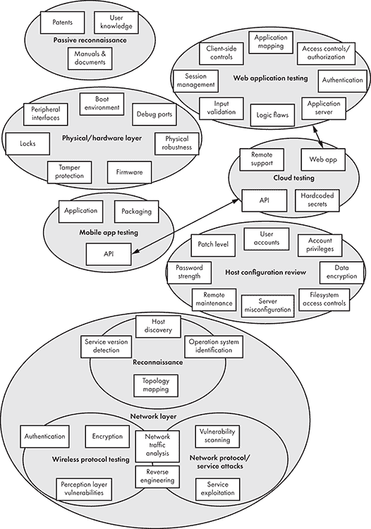
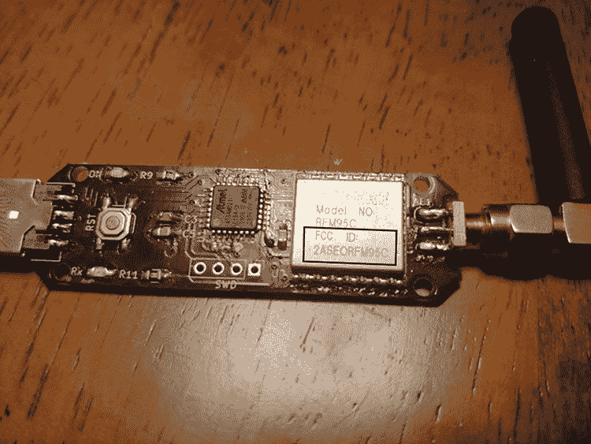
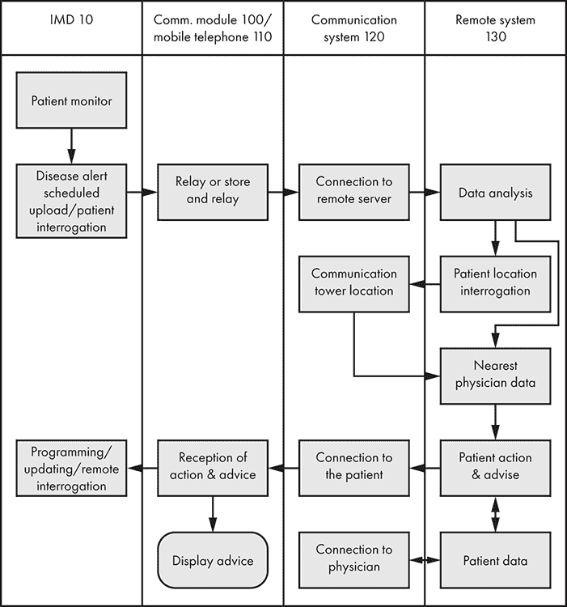
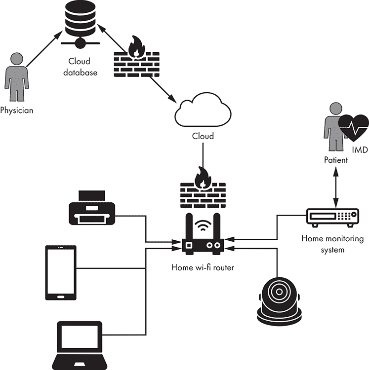

# 安全测试方法论

当你想要测试物联网系统的漏洞时，应该从哪里开始呢？如果攻击面足够小，比如只有一个控制监控摄像头的单一网页门户，那么规划安全测试可能会很简单。然而，即便如此，如果测试团队没有遵循一定的方法论，他们也可能会忽略应用中的关键点。

本章提供了在渗透测试时应遵循的一系列严格步骤。为此，我们将物联网攻击面分为多个概念层次，如图 3-1 所示。

图 3-1：安全评估中需要测试的概念层

当测试物联网系统时，你需要一个强大的评估方法论，因为它们通常由许多相互作用的组件组成。我们以一个连接到家庭监控设备的心脏起搏器为例。该监控设备可以通过 4G 连接将患者数据发送到云门户，以便临床医生检查心率异常。临床医生还可以使用编程器配置起搏器，编程器依赖于近场通信（NFC）设备和专有无线协议。这个系统有很多部分，每个部分都可能具有潜在的巨大攻击面，一个盲目、无序的安全评估很可能无法成功绘制出这些攻击面。为了使评估成功，我们将介绍被动侦察，并随后讨论测试物理层、网络层、Web 应用层、主机层、移动应用层和云层的方法。

## 被动侦察

*被动侦察*，也常被称为*开放源代码情报（OSINT）*，是指在不与系统直接通信的情况下收集目标数据的过程。它是任何评估的初步步骤之一；你应该始终执行这一步骤，以便了解大致情况。例如，你可能会下载并检查设备手册和芯片数据手册，浏览在线论坛和社交媒体，或采访用户和技术人员以获取信息。你还可以从由于*证书透明性*标准发布的 TLS 证书中收集内部主机名，证书透明性要求证书授权机构将其颁发的证书发布在公共日志记录中。

#### 手册和文档

系统手册可以提供关于设备内部工作原理的大量信息。你通常可以在设备供应商的官方网站上找到这些手册。如果这失败了，可以尝试通过 Google 的高级搜索查找包含设备名称的 PDF 文档，例如，在查询中添加“inurl:pdf”来查找相关文件。

令人惊讶的是，你可以在手册中找到如此多的重要信息。我们的经验表明，它们可以揭示默认的用户名和密码，这些信息通常仍然存在于生产环境中，系统及其组件的详细规格，网络和架构图，以及有助于识别薄弱环节的故障排除部分。

如果你已经确定了硬件上安装的某些芯片组，查找相关的*数据手册*（电子元件的手册）也是值得的，因为它们可能会列出用于调试的芯片组引脚（例如第七章中讨论的 JTAG 调试接口）。

另一个有用的资源是针对使用无线电通信的设备，FCC ID 在线数据库[`fccid.io/`](https://fccid.io/)。*FCC ID*是分配给在美国联邦通信委员会注册的设备的唯一标识符。所有在美国销售的无线发射设备必须拥有 FCC ID。通过搜索特定设备的 FCC ID，你可以找到有关无线操作频率（例如其强度）、设备内部照片、用户手册等信息。FCC ID 通常会刻印在电子组件或设备的外壳上（图 3-2）。

图 3-2：显示在 CatWAN USB 加密狗 RFM95C 芯片上的 FCC ID，我们将在第十三章中使用它进行 LoRa 黑客攻击。

#### 专利

专利可以提供关于某些设备内部工作原理的信息。尝试在[`patents.google.com/`](https://patents.google.com/)搜索供应商名称，看看会出现什么。例如，使用“medtronic bluetooth”关键词应该会找到一项 2004 年发布的关于可植入医疗设备（IMDs）之间通信协议的专利。

专利几乎总是包含流程图，这些图可以帮助你评估设备与其他系统之间的通信通道。在图 3-3 中，针对同一 IMD 的一个简单流程图展示了一个关键的攻击路径。

请注意，箭头进入和离开 IMD 列。远程系统的“患者操作与建议”动作可以启动与设备的连接。当你沿着箭头链条跟踪时，会注意到该操作也可以更新设备的编程，以更改可能会危及患者的设置。因此，远程系统带来了远程入侵的风险，无论是通过不安全的移动应用程序还是实际的远程系统（通常在云端实现）。

图 3-3：来自 Medtronic 专利的流程图显示，设备和远程系统之间可以通过手机进行双向通信。这突出了一个重要的攻击路径。

#### 用户知识

令人惊讶的是，您可以在社交媒体、在线论坛和聊天室中找到如此多的公开信息。您甚至可以利用亚马逊和 eBay 的评论作为知识来源。留意那些抱怨某个设备功能的用户；出现错误的行为有时可能表明潜在的漏洞。例如，您可能会发现有用户抱怨设备在触发一组条件后崩溃。这是一个值得调查的线索，因为它可能指向逻辑错误或由于特定输入导致的内存损坏漏洞。此外，许多用户会发布详细的产品评论，包括规格和拆解照片。

同时，检查 LinkedIn 和 Twitter 上的个人资料或帖子。为物联网系统制造商工作的工程师和 IT 人员可能会泄露一些技术信息的有趣片段。例如，如果某人发布说他们在某个特定的 CPU 架构方面有丰富的背景经验，那么该制造商的许多设备很可能都使用这种架构。如果另一个员工对某个特定框架进行抱怨（或赞扬，尽管这种情况较少发生），那么公司使用该框架开发软件的可能性也很大。

一般而言，每个物联网行业都会有一套专家，您可以向他们咨询有用的信息。例如，如果您正在评估一个电厂，询问操作员或技术人员他们的工作流程可能对确定潜在的攻击向量非常有价值。在医疗领域，护士通常是物联网系统的系统管理员和主要操作员。因此，他们通常对设备的内外情况有着丰富的了解，如果可能的话，您应该咨询他们。

## 物理层或硬件层

物联网设备中最重要的攻击向量之一就是硬件。如果攻击者能够获得系统的硬件组件，他们通常能够获得提升的权限，因为系统几乎总是会隐性地信任任何拥有物理访问权限的人。换句话说，如果一个专门的对手有物理访问您系统的权限，那么几乎可以认为游戏已经结束。假设最有动机的威胁行为者，比如由国家资助、拥有几乎无限时间和资源的对手，会有设备的物理副本可用。即使是专用系统，例如大型超声波机器，攻击者也可以通过在线市场、那些不安全处置设备的公司，甚至通过盗窃来获得硬件。他们甚至不需要设备的确切版本。通常，漏洞跨越了系统的多个代际。

硬件层的评估应包括对外设接口、启动环境、物理锁、篡改保护、固件、调试端口和物理鲁棒性的测试。

### 外设接口

*外围接口* 是允许您连接外部设备（如键盘、硬盘和网卡）的物理通信端口。检查是否启用了任何活动的 USB 端口或 PC 卡槽，以及它们是否支持启动。我们通过在设备上启动自己的操作系统，挂载未加密的文件系统，提取可破解的哈希值或密码，并在文件系统上安装自己的软件以覆盖技术安全控制，从而获得了对多种 x86 系统的管理访问权限。您还可以提取硬盘并读取或写入它们，即使没有访问可启动的 USB 端口，尽管这种技术不太方便。请注意，篡改硬件以提取硬盘可能会损坏组件。

USB 端口可能会成为攻击向量的另一个原因：一些设备，特别是基于 Windows 的设备，具有 *亭台模式*，该模式限制了用户界面。想象一下您用来提取现金的 ATM 机；即使在后台它可能运行的是 Windows XP 嵌入式操作系统，用户看到的也只是一个有限的图形界面，提供一组特定选项。试想，如果您能将 USB 键盘连接到设备的暴露端口上，您能做些什么？使用特定的键盘组合，例如 Ctrl-Alt-Delete 或 Windows 键，您可能能够逃脱亭台模式，直接访问系统的其余部分。

### 启动环境

对于使用传统 BIOS 的系统（通常是 x86 和 x64 平台），检查 BIOS 和启动加载程序是否受密码保护，以及首选的启动顺序是什么。如果系统首先从可移动介质启动，您可以无需更改 BIOS 设置即可启动自己的操作系统。此外，检查系统是否启用并优先考虑 *预启动执行环境（PXE）*，这是一种允许客户端通过网络启动的规范，利用 DHCP 和 TFTP 的组合。这为攻击者设置恶意网络启动服务器提供了空间。即使启动顺序已经安全配置并且所有设置都受到密码保护，您通常仍然可以通过将 BIOS 电池临时移除，来重置 BIOS 到默认的、干净且未保护的设置。如果系统具有统一可扩展固件接口（UEFI）安全启动，评估其实施情况。*UEFI 安全启动* 是一种安全标准，用于验证启动软件是否未被篡改（例如，未被 rootkit 攻击）。它通过检查 UEFI 固件驱动程序和操作系统的签名来实现这一点。

您还可能遇到可信执行环境（TEE）技术，例如 Arm 平台中的 TrustZone 或高通技术的安全启动功能，它们验证安全启动镜像。

### 锁定

检查设备是否受到某种锁的保护，如果是，检查锁是否容易被打开。同时，检查是否有适用于所有锁的通用钥匙，还是每个设备都有独立的钥匙。在我们的评估中，我们曾见到过同一制造商的所有设备都使用相同的钥匙，这使得锁变得毫无用处，因为世界上任何人都可以轻易获得这把钥匙。例如，我们发现一把钥匙可以打开整个产品线的柜子，进而获得药物输注泵系统配置的物理访问权限。

要评估锁，你需要一个开锁工具集，并且了解所用目标锁的类型。例如， tumbler 锁与电动锁的开启方式不同，如果电源关闭，电动锁可能无法打开或关闭。

### 篡改保护与检测

检查设备是否具有防篡改和篡改检测功能。例如，一种使设备篡改可见的方法是使用带有穿孔胶带的标签，打开后永久显示某种信息。其他防篡改保护措施包括熔丝、防篡改夹、封胶的特殊外壳或物理熔丝，当设备被拆解时可以擦除敏感内容。篡改检测机制会在检测到试图破坏设备完整性的行为时发出警报或创建日志文件。在对企业内部的物联网系统进行渗透测试时，检查篡改保护和检测尤其重要。许多威胁来自内部，由员工、承包商甚至前员工造成，因此，拥有篡改保护可以帮助识别任何故意被篡改的设备。攻击者将很难拆解防篡改设备。

### 固件

我们将在第九章详细讨论固件安全，因此这里不再展开。但请记住，未经许可访问固件可能会带来法律后果。如果你计划发布涉及访问固件或逆向工程固件中可执行文件的安全研究，这一点尤为重要。有关如何应对这一法律环境的信息，请参见第 12 页的“物联网黑客法律”。

### 调试接口

检查制造商可能用于简化开发、制造和调试的*调试、服务或测试点**接口*。你通常可以在嵌入式设备中找到这些接口，并可以利用它们来获得即时的 root 访问权限。如果没有通过调试端口与系统交互打开 root shell，我们可能就无法完全理解我们测试过的许多设备，因为没有其他方法可以访问和检查实时系统。这样做可能首先需要对这些调试接口使用的通信协议的内部工作有所了解，但最终的结果通常是值得的。最常见的调试接口类型包括 UART、JTAG、SPI 和 I2C。我们将在第七章和第八章中讨论这些接口。

### 物理稳健性

测试硬件物理特性可能带来的任何限制。例如，评估系统是否存在*电池耗尽攻击*，即攻击者过度负载设备，导致设备在短时间内耗尽电池，从而有效地造成拒绝服务。考虑到当这种攻击发生在植入式心脏起搏器上时的危险性，患者的生命就依赖于该设备。此类测试的另一种类型是*故障攻击*，即故意引入硬件故障，以破坏在敏感操作中的安全性。在我们最令人惊讶的成功之一中，当我们对嵌入式系统的印刷电路板（PCB）进行故障攻击时，使其启动过程掉入了一个根 Shell。此外，还可以尝试侧信道攻击，如*差分功率分析*，通过测量加密操作的功耗来推导出机密信息。

检查设备的物理特性也可以帮助你对其他安全特性的强度做出合理的猜测。例如，一个电池寿命长的小型设备可能在其网络通信中使用较弱的加密形式。原因是，强加密所需的处理能力会更快地消耗电池，而由于设备的体积限制，电池的容量也有限。

## 网络层

*网络层*包括所有直接或间接通过标准网络通信路径进行通信的组件，通常是最大的攻击向量。因此，我们将其拆分为更小的部分：侦察、网络协议与服务攻击、无线协议测试。

尽管本章涵盖的许多其他测试活动涉及网络，但我们在必要时为这些活动单独划分了章节。例如，web 应用评估就有自己的章节，因为它涉及的复杂性和大量的测试活动。

### 侦察

我们已经讨论了执行物联网设备被动侦察的一些步骤。在本节中，我们具体概述了网络的主动与被动侦察，这是任何网络攻击的第一步。被动侦察可能包括在网络上监听有用数据，而*主动侦察*（需要与目标交互的侦察）则需要直接查询设备。

对单个物联网设备的测试过程相对简单，因为只有一个 IP 地址需要扫描。但是，对于一个大型生态系统，如智能家居或带有医疗设备的医疗环境，网络侦察可能会更复杂。我们将涵盖主机发现、服务版本检测、操作系统识别和拓扑映射。

#### 主机发现

*主机发现*是通过使用多种技术探测网络上的哪些系统处于活动状态。这些技术包括发送互联网控制消息协议（ICMP）回显请求数据包，进行常见端口的 TCP/UDP 扫描，监听网络上的广播流量，或者如果主机位于同一 L2 段，则进行 ARP 请求扫描。（L2 指的是计算机网络的 OSI 模型中的第二层，它是数据链路层，负责通过物理层在同一网络段上的节点之间传输数据。以太网是一种常见的数据链路协议。）对于复杂的物联网系统，例如管理跨多个网络段的监控摄像头的服务器，重要的是不要依赖某一种特定的技术。相反，应该利用多种技术组合，以增加绕过防火墙或严格 VLAN（虚拟局域网）配置的机会。

在你进行物联网系统渗透测试时，如果你不知道测试系统的 IP 地址，这一步可能是最有用的。

#### 服务版本检测

在识别出活动主机后，需要确定它们上面所有的监听服务。从 TCP 和 UDP 端口扫描开始。然后，进行*横幅抓取*（连接到网络服务并读取其初始返回信息）和使用服务指纹识别工具进行探测，如 Amap 或 Nmap 的`-sV`选项。需要注意的是，一些服务，尤其是医疗设备上的服务，容易在简单的探测下崩溃。我们曾见过物联网系统仅仅因为我们使用 Nmap 的版本检测功能扫描它们而崩溃并重启。该扫描通过发送特别构造的数据包，以引发某些类型服务的响应，这些服务在你连接时通常不会发送任何信息。显然，这些数据包可能使一些敏感设备不稳定，因为这些设备在其网络服务上缺乏强大的输入清理功能，导致内存损坏和随之而来的崩溃。

#### 操作系统识别

你需要确定每个测试主机上运行的操作系统，以便稍后为其开发漏洞利用程序。至少要识别架构（例如，x86、x64 或 ARM）。理想情况下，你还需要识别操作系统的精确服务包级别（对于 Windows）和内核版本（对于 Linux 或 Unix 系统）。

你可以通过分析主机对特制的 TCP、UDP 和 ICMP 数据包的响应，来识别操作系统，这一过程称为*指纹识别*。这些响应会有所不同，因为不同操作系统在 TCP/IP 网络栈的实现上存在细微差异。例如，某些较旧的 Windows 系统对开放端口的`FIN`探测响应`FIN/ACK`数据包；其他系统响应`RST`，还有一些根本不响应。通过对这些响应进行统计分析，你可以为每个操作系统版本创建一个配置文件，然后使用这些配置文件在实际环境中进行识别。（欲了解更多信息，请访问 Nmap 文档中的“TCIP/IP 指纹识别方法”页面。）

服务扫描还可以帮助你进行操作系统指纹识别，因为许多服务在其横幅公告中公开了系统信息。Nmap 是进行这两项工作的优秀工具。但需要注意，对于某些敏感的物联网设备，操作系统指纹识别可能具有侵入性，且可能导致崩溃。

#### 拓扑映射

*拓扑映射*模拟了网络中不同系统之间的连接。当你需要测试整个设备和系统生态时，这一步非常适用，其中一些设备可能通过路由器和防火墙连接，而不一定处于同一 L3 段。（L3 指的是 OSI 计算机网络模型中的第三层，即网络层，负责数据包转发和路由。当数据通过路由器传输时，L3 层就会发挥作用。）创建被测试资产的网络图对于威胁建模非常有用：它帮助你理解攻击如何通过利用不同主机中的一连串漏洞，导致关键资产的泄露。图 3-4 展示了一个高层次的拓扑图。

图 3-4：一个简单的家庭网络拓扑图，包含了一个病人使用 IMD 的家庭监控设备

这个抽象的网络图展示了一个使用 IMD 的病人与家庭监控设备的通信。家庭设备依赖于本地 Wi-Fi 连接，将诊断数据发送到云端，医生可以定期监控这些数据，以便检测任何异常情况。

### 网络协议和服务攻击

网络协议和服务攻击包括以下几个阶段：漏洞扫描、网络流量分析、协议逆向工程和协议或服务利用。虽然你可以独立进行漏洞扫描，但其他阶段是相互依赖的。

#### 漏洞扫描

首先检查数据库，如国家漏洞数据库（NVD）或 VulnDB，查看暴露的网络服务中是否存在已知的漏洞。有时，系统非常过时，以至于自动化的漏洞扫描工具会生成大量的报告页面。你甚至可能能够在没有认证的情况下远程利用某些漏洞。为尽职调查起见，至少运行一个扫描工具，以快速识别简单的漏洞。如果你发现了严重的漏洞，比如远程代码执行，你可能能够获取设备的 shell，这将有助于你进行后续的评估。确保你始终在受控环境中扫描，并密切监控，以防发生无法预见的停机。

#### 网络流量分析

在安全评估的早期阶段，运行一个流量捕获工具，如 Wireshark 或 tcpdump，持续一段时间，以了解正在使用的通信协议。如果物联网系统涉及不同的交互组件，例如与其服务器相连的监控摄像头，或与电子健康记录系统（EHR）连接的药物输注泵，你应该能够捕获它们之间传输的任何网络流量。已知攻击，如 ARP 缓存中毒，通常可以在相同的 L3 段上奏效。

理想情况下，你还应将这些流量捕获工具直接运行在设备上，以捕获本地主机上的潜在进程间通信（IPC）流量。你可能会在嵌入式设备上运行这些网络工具时遇到更多困难，因为这些设备通常没有预装这些工具，而且没有简单的流程可以设置它们。不过，我们通常能够成功地交叉编译并安装像 tcpdump 这样的工具，即使是在非常受限的设备上，例如起搏器家庭监测系统。我们将在第六章中展示这一点。

在捕获了具有代表性的网络流量样本后，你可以开始分析它。确定是否存在不安全的通信通道，例如明文协议；已知的易受攻击协议，例如通用即插即用（UPnP）网络协议集；以及需要进一步检查或逆向工程的专有协议（在下一节中讨论）。

#### 逆向工程协议

你应该对发现的任何专有通信协议进行逆向工程。创建新的协议总是一个双刃剑；确实有一些系统需要它们自己的协议栈来提高性能、功能，甚至安全性。但是设计和实现一个强健的协议通常是一个非常复杂的任务。我们见过的许多物联网系统都利用了 TCP 或 UDP，并在其之上构建，通常使用某种变体的 XML、JSON 或其他结构化语言。在复杂的情况下，我们遇到了几乎没有公开信息的专有无线协议，类似于可植入起搏器中使用的协议。在这种情况下，从另一个角度来检查协议可能会更容易。例如，尝试调试与负责传输无线信号的驱动层通信的系统服务。这样，你不一定需要分析专有的无线协议。相反，你可能能够通过理解它上面一层的工作原理来弄明白它是如何工作的。

例如，在评估起搏器时，我们使用了这种技术。为此，我们利用了诸如 strace 等工具，这些工具附加到与驱动层通信的进程上。通过分析日志和*pcap*文件，我们在不进行无线信号分析或其他耗时方法（如傅里叶变换）的情况下，识别出了底层通信通道。*傅里叶变换*将信号分解成其组成频率。

#### 协议或服务利用

作为网络攻击的最后一步，实际上你应该通过编写一个证明概念程序来利用该协议或监听服务。关键是，你需要确定可利用的确切条件。这个漏洞能否每次都能复现？是否需要系统先处于某种状态？防火墙规则是否会阻止数据进出通信？成功利用后系统是否仍可使用？确保你能给出这些问题的确切答案。

### 无线协议测试

我们专门为无线协议测试分配了本章的一个完整部分，因为在物联网生态系统中，短程、中程和长程无线通信协议的普及。这个层次可以与其他文献中描述的*感知层*相重合，感知层包括像射频识别（RFID）、全球定位系统（GPS）和近场通信（NFC）等传感技术。

分析这些技术的过程与本章早期的“网络层‘网络流量分析’”和“逆向工程协议”活动有交集。分析和攻击无线协议通常需要专门的设备，包括某些支持注入的 Wi-Fi 芯片组，如 Atheros；蓝牙适配器，如 Ubertooth；以及软件定义无线电工具，如 HackRF 或 LimeSDR。

在这一阶段，你将测试与特定无线协议相关的攻击。例如，如果任何 IoT 组件使用 Wi-Fi，测试时需要关注关联攻击、任何使用有线等效隐私（WEP）的情况（这是一个红旗，因为它很容易破解）以及使用不安全的 Wi-Fi 保护访问（WPA/WPA2）实现并带有弱凭据的情况。WPA3 很快可能也会属于这一类别。在第 10 至第十三章中，我们将介绍这些协议的最重要攻击。对于自定义协议，你需要测试是否存在认证缺失（包括缺乏互相认证）以及缺乏加密和完整性校验，而这些问题我们不幸地经常在关键基础设施设备中看到。

## Web 应用评估

Web 应用，包括用于 IoT 系统的应用，是最容易的网络入口点之一，因为它们通常是外部可访问的，并且充满了各种漏洞。评估 Web 应用是一个广泛的话题，已有大量资源可以帮助你完成这项工作。因此，我们将专注于适用于 IoT 设备中遇到的 Web 应用的技术。事实上，它们与几乎任何其他现有 Web 应用并无显著区别，但嵌入式设备中的 Web 应用通常缺乏安全的软件开发生命周期，导致明显且已知的漏洞。Web 应用测试的资源包括*《Web 应用黑客手册》*以及所有 OWASP 项目，如其 Top 10 列表、应用安全验证标准（ASVS）项目和 OWASP 测试指南。

### 应用映射

要映射一个 Web 应用，首先需要探索网站的可见内容、隐藏内容和默认内容。识别数据输入点和隐藏字段，并列举所有参数。自动化的*蜘蛛工具*（逐页爬取网站的数据挖掘软件）可以帮助加速这个过程，但你也应该始终手动浏览。此外，你可以利用拦截代理进行*被动爬取*（在手动浏览时监控网页内容）以及*主动爬取*（使用先前发现的 URL 和嵌入 JavaScript 的 AJAX 请求作为起点，主动爬取网站）。

你可以通过尝试常见的文件或目录名称和扩展名来发现*隐藏内容*，或通常无法通过可访问的超链接到达的 Web 应用程序端点。请注意，这可能会产生大量噪音，因为所有这些请求会生成大量的网络流量。例如，DirBuster Web 爬虫工具中常见目录和文件名的中等大小列表包含 220,560 个条目。这意味着如果你使用它，它将至少发送 220,560 个 HTTP 请求到目标，以期发现隐藏的 URL。但不要忽视这一步，特别是在评估发生在受控环境中的情况下。我们经常在物联网设备中发现一些非常有趣的、通常未经身份验证的 Web 应用程序端点。例如，我们曾经在一款流行的监控摄像机型号上发现一个隐藏的 URL，允许你完全不进行身份验证就能拍照——这基本上允许攻击者远程监控摄像机所指向的任何内容！

同样重要的是要识别 Web 应用程序接收用户数据的入口点。大多数 Web 应用程序中的漏洞都是由于应用程序接收到来自未经身份验证的远程用户的未经信任的输入。你可以稍后利用这些入口点进行模糊测试（这是一种通过提供无效随机数据作为输入的自动化方式）并测试注入攻击。

### 客户端控制

你可能能够利用*客户端控制*，这些是任何由浏览器、厚客户端或移动应用程序处理的内容。客户端控制可能包括隐藏字段、Cookie 和 Java 小程序。它们也可能是 JavaScript、AJAX、ASP.NET ViewState、ActiveX、Flash 或 Silverlight 对象。例如，我们见过许多嵌入式设备上的 Web 应用程序在客户端执行用户身份验证，而攻击者总是可以绕过这些，因为用户可以控制客户端上发生的所有事情。这些设备使用了 JavaScript 或*.jar*、*.swf*、*.xap*文件，攻击者可以反编译并修改这些文件来达到自己的目的。

### 身份验证

查找应用程序身份验证机制中的漏洞。普遍的常识是，许多物联网系统预配置的凭证很弱，而且用户通常不会更改这些凭证。你可以通过参考手册或其他在线资源，甚至只是通过猜测来发现这些凭证。在测试物联网系统时，我们见过的凭证从常见的 admin/admin，到 a/a（是的，用户名：a，密码：a），再到根本没有身份验证。为了破解非默认密码，可以对所有身份验证端点进行字典攻击。*字典攻击*使用自动化工具通过测试字典中最常见的单词或泄露的常用密码列表来猜测密码。几乎每一份我们写的安全评估报告中都包括了“缺乏暴力破解保护”的发现，因为物联网嵌入式设备通常硬件资源有限，可能无法像 SaaS 应用程序那样保持状态。

另外，测试凭证的安全传输（通常包括未重定向到 HTTPS 的默认 HTTP 访问）；检查任何“忘记密码”和“记住我”功能；执行*用户名枚举*（猜测并列出有效用户）；并寻找*故障开放*条件，在这种情况下，身份验证失败，但由于某些异常，应用程序提供开放访问。

### 会话管理

*Web 应用会话*是与单个用户关联的一系列 HTTP 事务。会话管理，即跟踪这些 HTTP 事务的过程，可能会变得复杂，因此需要检查这些过程中的缺陷。检查是否使用了可预测的令牌、不安全的令牌传输以及在日志中泄露令牌。你还可能会发现会话过期不足、会话固定漏洞，以及*跨站请求伪造（CSRF）攻击*，你可以操纵已认证用户执行不需要的操作。

### 访问控制与授权

接下来，检查网站是否正确执行访问控制。*用户级别隔离*，即根据不同权限为用户提供访问不同数据或功能的权限，是物联网设备的常见特性。它也被称为*基于角色的访问控制*（*RBAC*）。这在复杂的医疗设备中尤其如此。例如，在电子健康记录（EHR）系统中，临床医生账户将拥有比护士账户更高的权限，后者可能只有只读权限。同样，摄像头系统将至少有一个管理员账户，其权限包括更改配置设置的能力，以及一个较低权限的只读账户，旨在允许设备操作员查看摄像头画面。但是，系统需要有适当的访问控制才能使其正常工作。我们曾见过这样的系统，只需知道正确的 URL 或 HTTP 请求，就可以从非特权账户请求特权操作，这也被称为*强制浏览*。如果系统支持多个账户，请测试所有权限边界。例如，访客账户是否可以访问仅管理员应使用的 Web 应用功能？访客账户是否可以访问由另一个授权框架管理的管理员 API？

### 输入验证

确保应用程序在所有数据输入点上都正确验证并清理用户输入。鉴于最常见的 Web 应用漏洞是注入攻击，其中用户可以将自己的代码作为用户输入提交到应用程序（请参阅 OWASP 的十大漏洞列表），此活动至关重要。测试应用程序的输入验证可能是一个非常漫长的过程。原因是它包括测试所有类型的注入攻击，包括 SQL 注入、跨站脚本攻击（XSS）、操作系统命令注入和 XML 外部实体（XXE）注入。

### 逻辑缺陷

检查由于逻辑漏洞而导致的漏洞。当 Web 应用程序具有多阶段过程时，一个操作必须跟随另一个操作，这个任务尤其重要。如果按错误顺序执行这些操作导致应用程序进入不小心且不希望的状态，则说明应用程序存在逻辑漏洞。通常，发现逻辑漏洞是一个手动过程，需要了解应用程序及其开发所面向的行业背景。

### 应用服务器

检查托管应用程序的服务器是否安全。如果将一个安全的 Web 应用程序托管在不安全的应用程序服务器上，那么保护实际应用程序的目的就无法实现。为了测试服务器的安全性，可以使用漏洞扫描器检查应用程序服务器的错误和公开漏洞。同时，检查是否存在反序列化攻击，测试任何 Web 应用程序防火墙的强度。此外，还需要测试服务器配置错误，如目录列表、默认内容和危险的 HTTP 方法。你还可以评估 SSL/TLS 的强度，检查弱加密算法、自签名证书及其他常见漏洞。

## 主机配置审查

*主机配置审查*过程是从获得本地访问权限后，评估系统内部的过程。例如，你可以从物联网系统的 Windows 服务器组件中的本地用户账户进行此审查。进入系统后，评估各种技术方面，包括用户账户、远程支持连接、文件系统访问控制、暴露的网络服务、不安全的服务器配置等。

### 用户账户

测试系统中用户账户的安全配置情况。这个步骤包括测试默认用户账户的存在性，并检查账户策略的强度。此类策略包括*密码历史*（是否以及何时可以重用旧密码）、*密码过期*（系统强制用户更改密码的频率）、以及*锁定机制*（用户输入错误凭证的次数，超过后账户将被锁定）。如果物联网设备属于企业网络，考虑公司的安全政策，确保账户一致性。例如，如果公司安全政策要求用户每六个月更改一次密码，检查所有账户是否符合该政策。理想情况下，如果系统允许你将账户与公司的 Active Directory 或 LDAP 服务集成，公司应该能够通过服务器以集中方式强制执行这些政策。

这个测试步骤可能听起来很平凡，但它却是最重要的步骤之一。攻击者往往会利用那些配置较弱、没有集中管理的用户账户，从而被忽视。在我们的评估中，我们经常发现本地用户账户的密码没有过期，并且与用户名相同。

### 密码强度

测试用户账户密码的安全性。密码强度很重要，因为攻击者可以通过自动化工具猜测弱密码。检查是否通过 Windows 的组策略或本地策略、以及基于 Linux 的系统中的可插拔认证模块（PAM）强制密码复杂度要求，需注意：认证要求不应影响业务流程。考虑以下场景：一个外科系统要求密码复杂度为 16 个字符，并在用户三次输入错误密码后将其锁定。如果外科医生或护士遇到紧急情况，而没有其他方式认证进入系统，这将导致灾难。在这种情况下，时间甚至是秒的差距，患者生命处于危险之中，必须确保安全措施不会带来负面影响。

### 账户权限

检查账户和服务是否遵循*最小权限原则*，换句话说，它们仅能访问所需的资源，而不会多于此。我们常见到软件配置不当，缺乏精细的权限分离。例如，通常主进程在不再需要时不会降低其提升的权限，或者系统让不同进程都以同一个账户运行。这些进程通常只需要访问一小部分资源，因此它们会拥有过多权限；一旦被攻击者入侵，就能完全控制系统。我们还经常发现一些简单的日志服务在 SYSTEM 或 root 权限下运行。高风险问题“权限过多的服务”几乎出现在我们编写的每一份安全评估报告中。

在 Windows 系统中，您可以使用*托管服务账户*来解决这个问题，这使得您能够隔离关键应用程序使用的域账户，并自动化其凭证管理。在 Linux 系统中，使用安全机制，如*能力（capabilities）*、*seccomp*（它白名单化系统调用）、*SELinux* 和 *AppArmor* 可以帮助限制进程权限并加强操作系统的安全性。此外，像 Kerberos、OpenLDAP 和 FreeIPA 这样的解决方案也可以帮助进行账户管理。

### 补丁级别

检查操作系统、应用程序和所有第三方库是否是最新的，并且有更新流程。补丁非常重要，复杂且常常被误解。检查过时的软件可能看起来像是一项常规任务（通常你可以通过使用漏洞扫描工具来自动化此过程），但几乎没有地方能够找到一个完全更新的生态系统。为了检测具有已知漏洞的开源组件，可以利用*软件组成分析*工具，这些工具会自动检查第三方代码中缺失的补丁。为了检测操作系统补丁的缺失，你可以依赖认证漏洞扫描，甚至手动检查它们。不要忘记检查供应商是否仍然支持物联网设备的 Windows 或 Linux 内核版本；你会经常发现它们不再支持。

补丁系统组件是信息安全行业的一大痛点，尤其是在物联网领域。其主要原因之一是，嵌入式设备天生更难以补丁，因为它们通常依赖于固定的复杂固件。另一个原因是，定期为某些系统（如 ATM 机）打补丁可能会变得极为昂贵，因为*停机时间*——客户无法访问系统的时间——以及所需的工作量。对于一些特殊用途的系统，如医疗设备，供应商必须首先进行严格的测试，才能发布任何新的补丁。你不想因为最新更新引起的浮动点错误，导致血液分析仪错误地显示肝炎阳性结果，对吧？那么给植入式起搏器打补丁又如何呢？更新应该涉及到生死攸关的情况（字面意思），才能证明有必要召集所有患者到医生办公室进行“修补”。

在我们的评估中，我们经常看到使用未打补丁的第三方软件，尽管核心组件可能是最新的。在 Windows 上常见的例子包括 Java、Adobe，甚至 Wireshark。在 Linux 设备上，常见的是发现过时的 OpenSSL 版本。有时安装的软件完全没有必要存在，最好是将其删除，而不是试图为其建立补丁流程。为什么服务器上需要安装 Adobe Flash 来与超声波设备接口呢？

### 远程维护

检查设备远程维护和支持连接的安全性。通常，组织不会将设备发送到供应商处进行补丁更新，而是直接联系设备供应商，让其技术人员远程连接到系统。攻击者有时会利用这些功能作为后门，从而获得管理访问权限。大多数远程连接方式并不安全。可以参考 Target 数据泄露事件，攻击者通过一个第三方空调公司渗透进了商店的主网络。

供应商可能会远程修补设备，因为通常没有好的方法及时为网络中的物联网设备安装补丁。由于一些设备敏感且复杂，公司的员工不能悄悄地开始安装补丁；总是存在它们在此过程中损坏的风险。如果设备在需要紧急使用时出现故障（例如医院中的 CT 扫描仪或电厂中的关键温度传感器），会发生什么？

评估时，不仅要检查远程支持软件（理想情况下通过逆向工程其二进制文件）及其通信渠道，还要评估远程维护的既定流程。该设施是否使用 24/7 连接？当供应商连接时是否进行双因素认证？是否有日志记录？

### 文件系统访问控制

检查本章前面提到的最小权限原则是否适用于关键文件和目录。通常，低权限用户可以读取和写入关键目录和文件（如服务可执行文件），从而允许轻松的权限提升攻击。非管理员用户是否真的需要对*C:\Program Files*具有写访问权限？是否有任何用户需要访问*/root*？我们曾评估过一台嵌入式设备，其中有五个以上的启动脚本可以被非 root 用户写入，使得具有本地访问权限的攻击者能够基本上以 root 身份运行自己的程序，从而完全控制系统。

### 数据加密

检查敏感数据是否已加密。首先确定最敏感的数据，例如*受保护的健康信息（PHI）*或*个人身份信息（PII）*。PHI 包括有关健康状况、医疗提供或支付的任何记录，而 PII 是任何可能识别特定个体的数据。通过检查系统配置中的加密原语，确保这些数据在静止状态下已加密。如果有人设法偷走了设备的磁盘，他们能读取这些数据吗？是否进行了全盘加密、数据库加密或任何形式的静态加密？加密的安全性如何？

### 服务器配置错误

配置错误的服务可能是存在安全隐患的服务。例如，仍然可以找到默认启用来宾用户访问的 FTP 服务器，允许攻击者匿名连接并读取或写入特定文件夹。我们曾发现一台 Oracle 企业管理器，作为 SYSTEM 用户运行，并通过默认凭据远程访问，允许攻击者通过滥用存储的 Java 过程执行操作系统命令。此漏洞使得攻击者能够通过网络完全破坏系统。

## 移动应用和云测试

测试与物联网系统相关的任何移动应用的安全性。如今，开发人员通常希望为所有事物创建 Android 和 iOS 应用，甚至是起搏器！你可以在第十四章了解更多关于移动应用安全测试的内容。此外，查阅 OWASP 移动应用前十大漏洞清单、移动安全测试指南和移动应用安全验证标准。

在最近的一次评估中，我们发现一个应用将 PHI 发送到云端，而医生或护士在操作设备时并未意识到这一点。虽然这不是技术性漏洞，但它仍然是一个重要的保密性违规，相关利益方应当了解。

同时，评估与物联网系统相关的任何云组件的安全态势。检查云与物联网组件之间的交互。特别关注云平台中的后端 API 和实现，包括但不限于 AWS、Azure 和 Google Cloud Platform。你通常会发现*不安全的直接对象引用*（*IDOR*）漏洞，它允许任何知道正确 URL 的人访问敏感数据。例如，AWS 有时允许攻击者通过与数据对象相关联的 URL 访问 S3 存储桶。

云测试中涉及的许多任务将与移动应用和网页应用评估重叠。在前一种情况下，原因是使用这些 API 的客户端通常是 Android 或 iOS 应用。在后一种情况下，原因是许多云组件基本上是 Web 服务。你还可以检查任何与云的远程维护和支持连接，正如第 50 页“主机配置审查”中提到的那样。

我们遇到了一系列与云相关的漏洞：硬编码的云令牌、嵌入在移动应用和固件二进制文件中的 API 密钥、缺乏 TLS 证书固定以及由于配置错误而将内部服务（如未认证的 Redis 缓存服务器或元数据服务）暴露给公众。请注意，进行任何云测试时需要得到云服务所有者的许可。

## 结论

我们中有几位曾在军方的网络防御部门服役。在那里，我们学到了尽职调查是信息安全中最重要的方面之一。遵循安全测试方法论对于避免忽略一些显而易见的案例非常重要。仅仅因为某些问题看起来过于简单或显而易见，就很容易错过那些“低垂的果实”。

本章概述了对物联网系统进行安全评估的测试方法。我们通过了被动侦察，然后描述并将物理、网络、Web 应用、主机、移动应用和云层分解成更小的部分。

请注意，本章涉及的概念层次并非绝对的；不同层次之间通常会有很大的重叠。例如，电池耗尽攻击可以作为物理层评估的一部分，因为电池是硬件。但它也可以作为网络层的一部分，因为攻击者可能通过组件的无线网络协议进行攻击。评估组件的列表也并不详尽，这也是为什么我们在适用时会推荐额外资源的原因。
