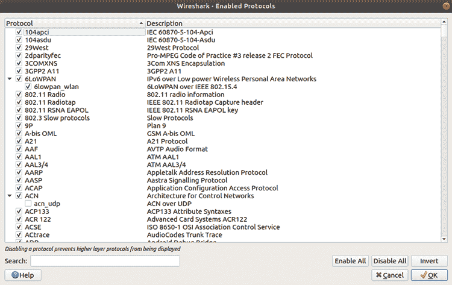
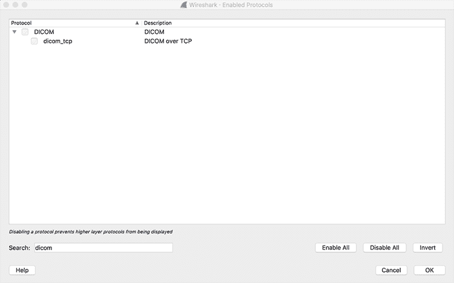
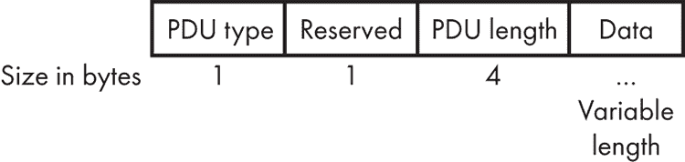
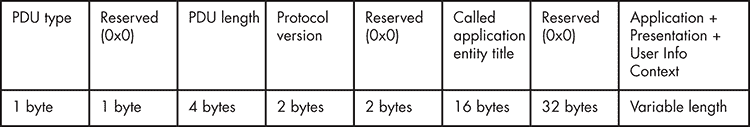
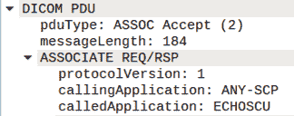
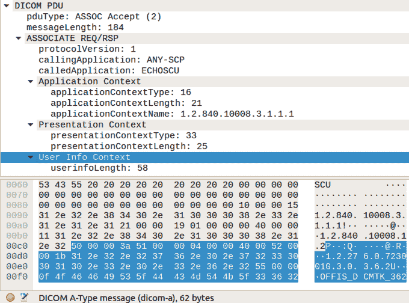

# 分析网络协议


协议分析对于任务如指纹识别、信息获取甚至漏洞利用都至关重要。但在物联网领域，你经常需要处理专有的、定制的或新的网络协议。这些协议可能会很具挑战性，因为即使你能够捕获到网络流量，像 Wireshark 这样的数据包分析工具往往无法识别你所发现的内容。有时，你可能需要编写新工具来与物联网设备进行通信。

本章中，我们解释了分析网络通信的过程，特别关注处理不常见协议时你将面临的挑战。我们首先介绍了一种执行陌生网络协议安全评估和实现自定义工具进行分析的方法。接下来，我们通过编写自己的协议解析器扩展了最流行的流量分析器 Wireshark。然后，我们为 Nmap 编写了自定义模块，以指纹识别甚至攻击任何敢于与你的道路相交的新网络协议。

本章中的示例以 DICOM 协议为目标，这是医疗设备和临床系统中最常见的协议之一，而不是一种不常见的协议。尽管如此，几乎没有安全工具支持 DICOM 协议，因此本章将帮助你处理将来可能遇到的任何不常见网络协议。

## 检查网络协议

当你处理不常见的协议时，最好根据一种方法论来分析它们。按照本节中描述的过程评估网络协议的安全性。我们尝试涵盖最重要的任务，包括信息收集、分析、原型制作和安全审计。

### 信息收集

在信息收集阶段，你将尽力找到所有可用的相关资源。但首先，查明该协议是否有良好的文档记录，方法是搜索该协议的官方和非官方文档。

#### 枚举和安装客户端

一旦你获得了文档，找到所有能够与该协议通信的客户端并安装它们。你可以使用这些客户端随意复制和生成流量。不同的客户端可能会对协议进行一些小的变动，因此请注意这些差异！此外，检查是否有程序员用不同的编程语言编写了实现。你找到的客户端和实现越多，找到更好文档和复制网络消息的机会就越大。

#### 发现依赖的协议

接下来，弄清楚该协议是否依赖于其他协议。例如，服务器消息块（SMB）协议通常与 TCP/IP 上的 NetBios（NBT）一起工作。如果你正在编写新工具，你需要了解协议的依赖关系，以便读取和理解消息，以及创建和发送新消息。确保弄清楚你的协议使用的是哪种传输协议。是 TCP 还是 UDP？还是其他协议：也许是 SCTP？

#### 确定协议的端口

找出协议的默认端口号以及协议是否会在其他端口上运行。识别默认端口及其是否可以更改是编写扫描器或信息收集工具时的有用信息。例如，如果我们编写了不准确的执行规则，Nmap 侦察脚本可能无法运行，而 Wireshark 可能无法使用正确的解码器。虽然这些问题有解决方法，但最好从一开始就拥有健全的执行规则。

#### 查找额外的文档

请访问 Wireshark 网站查找额外的文档或捕获样本。Wireshark 项目通常包括数据包捕获，是一个极好的信息来源。该项目使用维基（[`gitlab.com/wireshark/wireshark/-/wikis/home/`](https://gitlab.com/wireshark/wireshark/-/wikis/home/)）允许贡献者向每个页面添加新信息。

另外，注意哪些区域缺乏文档。您能否识别出描述不充分的功能？文档缺失可能会指向有趣的发现。

#### 测试 Wireshark 解码器

测试所有 Wireshark 解码器是否能正确地处理所使用的协议。Wireshark 能否正确地解析并读取协议消息中的所有字段？

为此，首先检查 Wireshark 是否有该协议的解码器，并且是否已启用。您可以通过点击**分析**▶**启用协议**来检查，如图 5-1 所示。



图 5-1：Wireshark 中的启用协议窗口

如果协议规范是公开的，检查所有字段是否正确定义。尤其是对于复杂的协议，解码器常常会有错误。如果发现任何错误，请特别留意它们。为了获得更多想法，可以查看分配给 Wireshark 解码器的常见漏洞与暴露（CVE）列表。

### 分析

在分析阶段，生成并重放流量，以了解协议的工作原理。目标是清楚地了解协议的整体结构，包括其传输层、消息和可用操作。

#### 获取网络流量副本

根据设备类型，有不同的方法来获取您需要分析的网络流量。有些设备可能直接支持代理配置！确定您是否需要进行主动或被动的网络流量嗅探。（您可以在 James Forshaw 的《攻击网络协议》[No Starch Press, 2018]中找到几个关于如何做的示例。）尽量为每个可用的使用场景生成流量，并尽可能多地生成流量。拥有不同的客户端有助于您了解现有实现中的差异和独特之处。

分析阶段的第一步应该是查看流量捕获并检查发送和接收的数据包。可能会出现一些显而易见的问题，因此在进行主动分析之前，进行此步骤是非常有用的。网站 [`gitlab.com/wireshark/wireshark/-/wikis/SampleCaptures/`](https://gitlab.com/wireshark/wireshark/-/wikis/SampleCaptures/) 是寻找公共捕获的一个优秀资源。

#### 使用 Wireshark 分析网络流量

如果 Wireshark 有一个可以解析你生成的流量的解析器，通过在“已启用协议”窗口中勾选其名称旁的复选框来启用它，如图 5-2 所示。



图 5-2：Wireshark 中“已启用协议”窗口中的禁用协议解析器

现在，尝试查找以下内容：

1.  **消息中的前几个字节。** 有时，初始连接握手或消息中的前几个字节是魔术字节，可以快速识别服务。

1.  **初始连接握手。** 这是任何协议的一个重要功能。通常在这一步，你可以了解协议的版本和支持的特性，包括加密等安全特性。复制此步骤还将帮助你开发扫描器，轻松地在网络上找到这些设备和服务。

1.  **协议中使用的任何 TCP/UDP 流和常见数据结构。** 有时，你会识别出明文字符串，或常见的数据结构，比如将长度附加到消息开头的数据包。

1.  **协议的字节序。** 一些协议使用混合字节序，如果没有提前识别，可能会导致问题。字节序在不同协议中差异很大，但它对于创建正确的数据包是必需的。

1.  **消息的结构。** 确定不同的头部和消息结构，以及如何初始化和关闭连接。

### 原型设计与工具开发

在分析完协议后，你可以开始 *原型设计*，或者将你从分析中收集到的笔记转化为实际的软件，以便用该协议与服务进行通信。原型将确认你是否正确理解了每种消息类型的数据包结构。在这个阶段，选择一种能够快速开发的编程语言非常重要。因此，我们倾向于使用动态类型脚本语言，如 Lua 或 Python。检查是否有可用的库和框架可以帮助加速开发。

如果 Wireshark 不支持该协议，可以开发一个解析器来帮助分析。我们将在本章稍后的“为 DICOM 协议开发 Lua Wireshark 解析器”一节中讨论这一过程。我们还将使用 Lua 来原型化 Nmap 脚本引擎模块，以与该服务进行通信。

### 执行安全评估

一旦你完成了分析，确认了关于协议的假设，并创建了一个与 DICOM 服务通信的工作原型，你需要评估协议的安全性。除了第三章中描述的一般安全评估过程外，还要检查以下关键点：

1.  **测试服务器和客户端伪装攻击。** 理想情况下，客户端和服务器应该相互验证，这是一个称为互相认证的过程。如果没有认证，可能会伪装成客户端或服务器。这种行为可能会产生严重后果；例如，我们曾经进行过一次客户端伪装攻击，伪装成一个药品库组件，并向药品输注泵注入恶意药品库。尽管两个端点通过传输层安全（TLS）通信，但这无法防止攻击，因为没有进行互认证。

1.  **模糊测试协议并检查洪水攻击。** 同时，尝试复制崩溃并识别漏洞。模糊测试是自动向系统提供格式错误的输入，最终目标是发现实现中的缺陷。大多数情况下，这会导致系统崩溃。协议越复杂，发现内存损坏漏洞的可能性越大。DICOM（本章稍后分析）就是一个完美的例子。由于其复杂性，有可能在不同的实现中发现缓冲区溢出和其他安全问题。在洪水攻击中，攻击者向系统发送大量请求，以耗尽系统资源，导致系统无法响应。典型的例子是 TCP SYN 洪水攻击，你可以通过 SYN cookies 来缓解该攻击。

1.  **检查加密和签名。** 数据是否保密？我们能否保证数据完整性？所使用的加密算法有多强大？我们曾见过一些供应商实现了自定义的加密算法，结果总是灾难性的。此外，许多网络协议并不要求任何数字签名，而数字签名可以提供消息认证、数据完整性和不可否认性。例如，DICOM 除非在安全协议（如传输层安全性 TLS）上使用，否则不会使用数字签名，而这也容易受到中间人攻击。

1.  **测试降级攻击。** 这些是针对协议的加密攻击，迫使系统使用质量较低、更不安全的操作模式（例如，发送明文数据）。例如，传输层安全协议/安全套接层（TLS/SSL）上的填充 Oracle 降级遗留加密（POODLE）攻击。在这种攻击中，中间人攻击者强迫客户端回退到 SSL 3.0，并利用设计缺陷窃取 cookies 或密码。

1.  **测试放大攻击。** 当协议具有响应比请求大得多的功能时，就会发生这种攻击，因为攻击者可以滥用这些功能造成服务拒绝攻击。一个例子是 mDNS 反射 DDoS 攻击，在这种攻击中，一些 mDNS 实现响应来自本地链路网络外部源的单播查询。我们将在第六章探讨 mDNS。

## 为 DICOM 协议开发 Lua Wireshark 解码器

本节向你展示如何编写一个可以与 Wireshark 一起使用的解码器。在审计物联网设备使用的网络协议时，理解通信方式、消息的构成以及涉及的功能、操作和安全机制至关重要。然后，我们可以开始修改数据流以寻找漏洞。为了编写解码器，我们将使用 Lua；它允许我们通过少量代码快速分析捕获的网络通信。通过贡献几行代码，我们将从查看信息块到查看可读的消息。

在这个练习中，我们将只关注处理 DICOM A 类型消息所需的函数子集（将在下一节讨论）。另一个需要注意的细节是，当使用 Lua 编写 Wireshark 解码器处理 TCP 时，数据包可能会被分段。此外，考虑到数据包重传、乱序错误或 Wireshark 配置限制了数据包大小（默认捕获数据包大小限制为 262,144 字节），我们可能会在一个 TCP 段中得到比一个消息更多或更少的数据。现在我们暂时忽略这个问题，专注于 A-ASSOCIATE 请求，当我们编写扫描器时，这足以识别 DICOM 服务。如果你想了解如何处理 TCP 分段，请查看本书材料中分发的完整示例文件 *orthanc.lua*，或者访问 [`nostarch.com/practical-iot-hacking/`](https://nostarch.com/practical-iot-hacking/)。

### 使用 Lua

Lua 是一种脚本语言，用于在许多重要的安全项目中创建可扩展或可脚本化的模块，例如 Nmap、Wireshark 以及像 LogRhythm 的 NetMon 这样的商业安全产品。你每天使用的一些产品可能就在运行 Lua。许多物联网设备也使用 Lua，因为它具有小巧的二进制文件和良好的 API 文档，使其易于与 C、C++、Erlang，甚至 Java 等其他语言一起使用，扩展项目。这使得 Lua 非常适合嵌入到应用程序中。你将学习如何在 Lua 中表示和处理数据，以及 Wireshark 和 Nmap 等流行软件如何使用 Lua 扩展其流量分析、网络发现和利用功能。

### 理解 DICOM 协议

DICOM 是由美国放射学会和国家电气制造商协会开发的非专有协议。它已成为传输、存储和处理医学影像信息的国际标准。尽管 DICOM 不是专有的，但它是许多医疗设备中实现的网络协议的一个典型例子，而传统的网络安全工具对其支持并不好。DICOM 通过 TCP/IP 进行的通信是双向的：客户端请求一个操作，服务器执行它，但如果需要，它们可以交换角色。在 DICOM 术语中，客户端称为服务调用用户（SCU），服务器称为服务调用提供者（SCP）。

在编写任何代码之前，让我们先检查一些重要的 DICOM 消息和协议结构。

#### C-ECHO 消息

*DICOM C-ECHO*消息交换关于调用和被调用应用程序、实体、版本、UID、名称和角色等信息。我们通常称它们为 DICOM *ping*，因为它们用于确定 DICOM 服务提供者是否在线。C-ECHO 消息使用多个*A 类型消息*，所以我们将在本节中寻找这些消息。C-ECHO 操作发送的第一个包是*A-ASSOCIATE 请求消息*，它足以识别一个 DICOM 服务提供者。从 A-ASSOCIATE 响应中，你可以获得关于该服务的信息。

#### A 类型协议数据单元（PDU）

在 C-ECHO 消息中使用了七种 A 类型消息：

+   **A-ASSOCIATE 请求（A-ASSOCIATE-RQ）：** 客户端发送的请求，用于建立 DICOM 连接

+   **A-ASSOCIATE 接受（A-ASSOCIATE-AC）：** 服务器发送的响应，用于接受 DICOM A-ASSOCIATE 请求

+   **A-ASSOCIATE 拒绝（A-ASSOCIATE-RJ）：** 服务器发送的响应，用于拒绝 DICOM A-ASSOCIATE 请求

+   **(P-DATA-TF)：** 服务器和客户端发送的数据包

+   **A-RELEASE 请求（A-RELEASE-RQ）：** 客户端发送的请求，用于关闭 DICOM 连接

+   **A-RELEASE 响应（A-RELEASE-RP PDU）：** 服务器发送的响应，用于确认 A-RELEASE 请求

+   **A-ASSOCIATE 中止（A-ABORT PDU）：** 服务器发送的响应，用于取消 A-ASSOCIATE 操作

这些 PDU 都以类似的包结构开始。第一部分是一个字节的无符号整数（Big Endian），表示 PDU 类型。第二部分是一个字节的保留区域，设置为 0x0。第三部分是 PDU 长度信息，一个四字节的无符号整数（Little Endian）。第四部分是一个可变长度的数据字段。图 5-3 展示了这个结构。



图 5-3：DICOM PDU 的结构

一旦我们了解了消息结构，就可以开始读取和解析 DICOM 消息。通过每个字段的大小，我们可以计算偏移量，在定义原型字段时用于分析和与 DICOM 服务进行通信。

### 生成 DICOM 流量

为了跟随这个练习，你需要设置一个 DICOM 服务器和客户端。*Orthanc* 是一个强大且开源的 DICOM 服务器，支持 Windows、Linux 和 macOS。将其安装到你的系统上，确保配置文件中启用了 `DicomServerEnabled` 标志，并运行 Orthanc 可执行文件。如果一切顺利，你应该会在 TCP 端口 4242（默认端口）上启动 DICOM 服务器。输入 `orthanc` 命令，可以看到以下描述配置选项的日志：

```
$ **./Orthanc**
<timestamp> main.cpp:1305] Orthanc version: 1.4.2
<timestamp> OrthancInitialization.cpp:216] Using the default Orthanc configuration
<timestamp> OrthancInitialization.cpp:1050] SQLite index directory: "XXX"
<timestamp> OrthancInitialization.cpp:1120] Storage directory: "XXX"
<timestamp> HttpClient.cpp:739] HTTPS will use the CA certificates from this file: ./orthancAndPluginsOSX.stable
<timestamp> LuaContext.cpp:103] Lua says: Lua toolbox installed
<timestamp> LuaContext.cpp:103] Lua says: Lua toolbox installed
<timestamp> ServerContext.cpp:299] Disk compression is disabled
<timestamp> ServerIndex.cpp:1449] No limit on the number of stored patients
<timestamp> ServerIndex.cpp:1466] No limit on the size of the storage area
<timestamp> ServerContext.cpp:164] Reloading the jobs from the last execution of Orthanc
<timestamp> JobsEngine.cpp:281] The jobs engine has started with 2 threads
<timestamp> main.cpp:848] DICOM server listening with AET ORTHANC on port: 4242
<timestamp> MongooseServer.cpp:1088] HTTP compression is enabled
<timestamp> MongooseServer.cpp:1002] HTTP server listening on port: 8042 (HTTPS encryption is disabled, remote access is not allowed)
<timestamp> main.cpp:667] Orthanc has started
```

如果你不想安装 Orthanc 来进行本教程，你可以在本书的在线资源或 Wireshark DICOM 数据包示例页面中找到示例数据包捕获文件。

### 在 Wireshark 中启用 Lua

在开始编写代码之前，确保你已经安装了 Lua 并在 Wireshark 安装中启用了它。你可以在“关于 Wireshark”窗口中检查它是否可用，如图 5-4 所示。


图 5-4：关于 Wireshark 窗口显示 Lua 已被支持

Lua 引擎默认是禁用的。要启用它，需要在 Wireshark 安装目录下的 *init.lua* 文件中将布尔变量 `disable_lua` 设置为 `false`：

```
disable_lua = false
```

在检查并启用 Lua 后，再次通过编写测试脚本并运行它来确认 Lua 支持是否正常工作，运行方式如下：

```
$ **tshark -X lua_script:<your Lua test script>**
```

如果我们在测试文件中包括一个简单的打印语句（例如 `print "Hello from Lua"`），我们应该会在捕获开始前看到输出。

```
$ **tshark -X lua_script:test.lua**
Hello from Lua
Capturing on 'ens33'
```

在 Windows 上，如果使用常规的打印语句，可能不会看到输出。但 `report_failure()` 函数会打开一个窗口，显示你的消息，因此这是一个不错的替代方案。

### 定义解码器

让我们使用 `Proto(name, description)` 函数定义新的协议解码器。如前所述，这个解码器将专门识别 DICOM A 型消息（前面列出的七种消息之一）：

```
dicom_protocol = Proto("dicom-a",  "DICOM A-Type message")
```

接下来，我们定义 Wireshark 中的头字段，以匹配前面讨论的 DICOM PDU 结构，借助 `ProtoField` 类：

```
1 pdu_type = ProtoField.uint8("dicom-a.pdu_type","pduType",base.DEC, {[1]="ASSOC Request",
 [2]="ASSOC Accept",
 [3]="ASSOC Reject",
 [4]="Data",
 [5]="RELEASE Request",
 [6]="RELEASE Response",
 [7]="ABORT"}) -- unsigned 8-bit integer
2 message_length = ProtoField.uint16("dicom-a.message_length", "messageLength", base.DEC) -- unsigned 16-bit integer
3 dicom_protocol.fields = {pdu_type, message_length}
```

我们使用这些 ProtoFields 将项目添加到解码树中。对于我们的解码器，我们会调用两次 `ProtoField`：第一次创建一个用于存储 PDU 类型 1 的单字节无符号整数，第二次创建一个用于存储消息长度 2 的两字节数据。注意我们为 PDU 类型分配了一个值表。Wireshark 将自动显示这些信息。然后，我们将协议解码器字段 3 设置为包含我们 ProtoFields 的 Lua 表。

### 定义主协议解码器函数

接下来，我们声明主协议解码器函数`dissector()`，它有三个参数：Wireshark 用来解码的缓冲区、数据包信息和显示协议信息的树形结构。

在这个 `dissector()` 函数中，我们将解码我们的协议，并将之前定义的 ProtoFields 添加到包含协议信息的树形结构中。

```
function dicom_protocol.dissector(buffer, pinfo, tree)
1  pinfo.cols.protocol = dicom_protocol.name
  local subtree = tree:add(dicom_protocol, buffer(), "DICOM PDU")
  subtree:add_le(pdu_type, buffer(0,1)) -- big endian
  subtree:add(message_length, buffer(2,4)) -- skip 1 byte
end
```

我们将 `protocol` 字段设置为我们在 `dicom_protocol.name` 中定义的协议名称 1。对于我们要添加的每一项，我们使用 `add_le()` 来处理大端数据，或者使用 `add()` 来处理小端数据，并配合 `ProtoField` 和要解码的缓冲区范围。

### 完善解码器

`DissectorTable` 保存协议的子解码器表，通过 Wireshark 的 Decode 对话框显示。

```
local tcp_port = DissectorTable.get("tcp.port")
tcp_port:add(4242, dicom_protocol)
```

要完成解码器，我们只需要将我们的解码器添加到 TCP 端口的 `DissectorTable` 中，端口号为 4242\。

列表 5-1 显示了解码器的完整代码。

```
dicom_protocol = Proto("dicom-a",  "DICOM A-Type message")
pdu_type = ProtoField.uint8("dicom-a.pdu_type", "pduType", base.DEC, {[1]="ASSOC Request", [2]="ASSOC Accept", [3]=”ASSOC Reject”, [4]=”Data”, [5]=”RELEASE Request”, [6]=”RELEASE Response”, [7]=”ABORT”})
message_length = ProtoField.uint16("dicom-a.message_length", "messageLength", base.DEC)

dicom_protocol.fields = {message_length, pdu_type} 1

function dicom_protocol.dissector(buffer, pinfo, tree)
  pinfo.cols.protocol = dicom_protocol.name
  local subtree = tree:add(dicom_protocol, buffer(), "DICOM PDU")
  subtree:add_le(pdu_type, buffer(0,1))
  subtree:add(message_length, buffer(2,4))
end

local tcp_port = DissectorTable.get("tcp.port")
tcp_port:add(4242, dicom_protocol)
```

列表 5-1：完成的 DICOM A 类型消息解码器

我们通过将 *.lua* 文件放入 Wireshark 的插件目录中并重新加载 Wireshark 来启用这个解码器。然后，当我们分析 DICOM 捕获时，我们应该看到在我们定义的 `tree:add()` 调用下，DICOM PDU 列中显示 `pduType` 字节和消息长度。图 5-5 展示了在 Wireshark 中的显示。你也可以使用我们定义的 `dicom-a.message_length` 和 `dicom-a.pdu_type` 过滤器 1 来过滤流量。


图 5-5：Wireshark 中 Lua 编写的 DICOM A 类型消息解码器

现在我们可以清楚地识别 DICOM 包中的 PDU 类型和消息长度。

## 构建 C-ECHO 请求解码器

当我们用新的解码器分析 C-ECHO 请求时，我们应该看到它由不同的 A 类型消息组成，如 图 5-5 所示。下一步是分析这些 DICOM 包中包含的数据。

为了展示我们如何在 Lua 解码器中处理字符串，让我们添加一些代码到解码器中，以解析 A-ASSOCIATE 消息。图 5-6 显示了 A-ASSOCIATE 请求的结构。



图 5-6：A-ASSOCIATE 请求的结构

注意到被叫和叫叫应用实体标题的 16 字节长度。*应用实体标题* 是标识服务提供者的标签。该消息还包括一个 32 字节长的保留部分，应该设置为 0x0，并且包含可变长度的项目，包括一个应用上下文项目、展示上下文项目和用户信息项目。

### 提取应用实体标题的字符串值

我们从提取消息的固定长度字段开始，包括叫叫和被叫应用实体标题的字符串值。这是有用的信息；通常，服务缺乏身份验证，因此，如果你有正确的应用实体标题，就可以连接并开始发出 DICOM 命令。我们可以通过以下代码为我们的 A-ASSOCIATE 请求消息定义新的 ProtoField 对象：

```
 protocol_version = ProtoField.uint8("dicom-a.protocol_version", "protocolVersion", base.DEC)
calling_application = ProtoField.string(1 "dicom-a.calling_app", 2 "callingApplication")
called_application = ProtoField.string("dicom-a.called_app", "calledApplication")
```

为了提取被叫和叫叫应用实体标题的字符串值，我们使用 ProtoField 的 `ProtoField.string` 函数。``我们传递给它一个用于过滤器 1 的名称、一个可选的名称用于在树形结构中显示 2、显示格式（`base.ASCII` 或 `base.UNICODE`），以及一个可选的描述字段.``

````### Populating the Dissector Function    After adding our new ProtoFields as fields to our protocol dissector, we need to add code to populate them in our dissector function, `dicom_protocol.dissector()`, so they’re included in the protocol display tree:    ``` 1 local pdu_id = buffer(0, 1):uint() -- Convert to unsigned int  if pdu_id == 1 or pdu_id == 2 then -- ASSOC-REQ (1) / ASSOC-RESP (2)     local assoc_tree = 2subtree:add(dicom_protocol, buffer(), "ASSOCIATE REQ/RSP")     assoc_tree:add(protocol_version, buffer(6, 2))     assoc_tree:add(calling_application, buffer(10, 16))     assoc_tree:add(called_application, buffer(26, 16)) end ```    Our dissector should add the extracted fields to a subtree in our protocol tree. To create a subtree, we call the `add()` function from our existing protocol tree 2. Now our simple dissector can identify PDU types, message lengths, the type of ASSOCIATE message 1, the protocol, the calling application, and the called application. Figure 5-7 shows the result.      Figure 5-7: Subtrees added to existing protocol trees      ### Parsing Variable-Length Fields    Now that we’ve identified and parsed the fixed-length sections, let’s parse the message’s variable-length fields. In DICOM, we use identifiers called *contexts* to store, represent, and negotiate different features. We’ll show you how to locate the three different types of contexts available: the Application Context, Presentation Contexts, and User Info Context, which have a variable number of item fields. But we won’t write code to parse the item contents.    For each of the contexts, we’ll add a subtree that displays the length of the context and the variable number of context items. Modify the main protocol dissector so it looks as follows:    ``` function dicom_protocol.dissector(buffer, pinfo, tree)   pinfo.cols.protocol = dicom_protocol.name   local subtree = tree:add(dicom_protocol, buffer(), "DICOM PDU")   local pkt_len = buffer(2, 4):uint()   local pdu_id = buffer(0, 1):uint()   subtree:add_le(pdu_type, buffer(0,1))   subtree:add(message_length, buffer(2,4))   if pdu_id == 1 or pdu_id == 2 then -- ASSOC-REQ (1) / ASSOC-RESP (2)     local assoc_tree = subtree:add(dicom_protocol, buffer(), "ASSOCIATE REQ/RSP")     assoc_tree:add(protocol_version, buffer(6, 2))     assoc_tree:add(calling_application, buffer(10, 16))     assoc_tree:add(called_application, buffer(26, 16))      --Extract Application Context 1     local context_variables_length = buffer(76,2):uint() 2     local app_context_tree = assoc_tree:add(dicom_protocol, buffer(74, context_variables_length + 4), "Application Context") 3     app_context_tree:add(app_context_type, buffer(74, 1))     app_context_tree:add(app_context_length, buffer(76, 2))     app_context_tree:add(app_context_name, buffer(78, context_variables_length))  --Extract Presentation Context(s) 4     local presentation_items_length = buffer(78 + context_variables_length + 2, 2):uint()     local presentation_context_tree = assoc_tree:add(dicom_protocol, buffer(78 + context_variables_length, presentation_items_length + 4), "Presentation Context")     presentation_context_tree:add(presentation_context_type, buffer(78 + context_variables_length, 1))     presentation_context_tree:add(presentation_context_length, buffer(78 + context_variables_length + 2, 2))  	    -- TODO: Extract Presentation Context Items	      --Extract User Info Context 5     local user_info_length = buffer(78 + context_variables_length + 2 + presentation_items_length + 2 + 2, 2):uint()     local userinfo_context_tree = assoc_tree:add(dicom_protocol, buffer(78 + context_variables_length + presentation_items_length + 4, user_info_length + 4), "User Info Context")     userinfo_context_tree:add(userinfo_length, buffer(78 + context_variables_length + 2 + presentation_items_length + 2 + 2, 2))      -- TODO: Extract User Info Context Items   end end ```    When working with network protocols, you’ll often find variable-length fields that require you to calculate offsets. It’s very important that you get the length values correct, because all offset calculations depend on them.    Keeping this in mind, we extract the Application Context 1, Presentation Contexts 4, and User Info Context 5. For each context, we extract the length of the context 2 and add a subtree for the information contained in that context 3. We add individual fields using the `add()` function and calculate the string offsets based on the length of the fields. We obtain all of this from the packet received using the `buffer()` function.    ### Testing the Dissector    After applying the changes referenced in “Parsing Variable-Length Fields,” make sure your DICOM packets are parsed correctly by checking the reported lengths. You should now see a subtree for each context (Figure 5-8). Note that because we provide a buffer range in our new subtrees, you can select them to highlight the corresponding section. Take a moment to verify that each context of the DICOM protocol is recognized as expected.      Figure 5-8: User Info Context is 58\. The highlighted message is 62 bytes (58 bytes of data, 1 byte for the type, 1 reserved byte, and 2 bytes for the size).      If you want more practice, we encourage you to add fields from the different contexts to the dissector. You can grab a DICOM packet capture from the Wireshark Packet Sample page, where we submitted a capture containing a DICOM ping. You’ll also find the full example, including TCP fragmentation, in this book’s online resources. Remember that you can reload the Lua scripts at any time to test your latest dissector without restarting Wireshark by clicking **Analyze**▶**Reload Lua plugins**.    ## Writing a DICOM Service Scanner for the Nmap Scripting Engine    Earlier in this chapter, you learned that DICOM has a ping-like utility called a C-Echo request formed by several A-type messages. You then wrote a Lua dissector to analyze these messages with Wireshark. Now you’ll use Lua to tackle another task: writing a DICOM *service scanner*. The scanner will identify DICOM service providers (DSP) remotely on networks to actively test their configurations and even launch attacks. Because Nmap is well known for its scanning capabilities and its scripting engine also runs in Lua, it’s the perfect tool for writing such a scanner.    For this exercise, we’ll focus on the subset of functions related to sending a partial C-ECHO request.    ### Writing an Nmap Scripting Engine Library for DICOM    We’ll begin by creating an Nmap Scripting Engine library for our DICOM-related code. We’ll use the library to store any functions used in socket creation and destruction, sending and receiving DICOM packets, and actions like associating and querying services.    Nmap already includes libraries to help you perform common input/output (I/O) operations, socket handling, and other tasks. Take a moment to review the library collection so you’ll know what’s already available. Read the documentation for these scripts and libraries at [`nmap.org/nsedoc/`](https://nmap.org/nsedoc/).    You can usually find Nmap Scripting Engine libraries in the *<installation directory>/nselib*/ folder. Locate this directory, and then create a file called *dicom.lua*. In this file, begin by declaring other standard Lua and Nmap Scripting Engine libraries used. Also, tell the environment the name of the new library:    ``` local nmap = require "nmap" local stdnse = require "stdnse" local string = require "string" local table = require "table" local nsedebug = require "nsedebug"  _ENV = stdnse.module("dicom", stdnse.seeall) ```    In this case, we’ll use four different libraries: two Nmap Scripting Engine libraries ( *nmap* and *stdnse*) and two standard Lua libraries (*string* and *table*). The Lua libraries *string* and *table* are, unsurprisingly, for string and table operations. We’ll mainly use the *nmap* library socket handling, and we’ll use *stdnse* for reading user-supplied arguments and printing debug statements when necessary. We’ll also use the helpful *nsedebug* library, which displays different data types in a human-readable form.    ### DICOM Codes and Constants    Now let’s define some constants to store the PDU codes, UUID values, and the minimum and maximum allowed size for packets. Doing so will allow you to write cleaner code that is easier to maintain. In Lua, we typically define constants in capital letters:    ``` local MIN_SIZE_ASSOC_REQ = 68 -- Min size of a ASSOCIATE req 1 local MAX_SIZE_PDU = 128000 -- Max size of any PDU local MIN_HEADER_LEN = 6 -- Min length of a DICOM heade local PDU_NAMES = {} local PDU_CODES = {} local UID_VALUES = {} -- Table for PDU names to codes 2 PDU_CODES = {    ASSOCIATE_REQUEST  = 0x01,   ASSOCIATE_ACCEPT   = 0x02,   ASSOCIATE_REJECT   = 0x03,  DATA               = 0x04,   RELEASE_REQUEST    = 0x05,   RELEASE_RESPONSE   = 0x06,   ABORT              = 0x07 } -- Table for UID names to values UID_VALUES = {   VERIFICATION_SOP = "1.2.840.10008.1.1", -- Verification SOP Class   APPLICATION_CONTEXT = "1.2.840.10008.3.1.1.1", -- DICOM Application Context Name   IMPLICIT_VR = "1.2.840.10008.1.2", -- Implicit VR Little Endian: Default Transfer Syntax for DICOM   FIND_QUERY = "1.2.840.10008.5.1.4.1.2.2.1" -- Study Root Query/Retrieve Information Model - FIND }  -- We store the names using their codes as keys for printing PDU type names for i, v in pairs(PDU_CODES) do   PDU_NAMES[v] = i end ```    Here we define constant values for common DICOM operation codes. We also define tables to represent different data classes through UIDs 2 and DICOM-specific packet lengths 1. Now we’re ready to start communicating with the service.    ### Writing Socket Creation and Destruction Functions    To send and receive data, we’ll use the Nmap Scripting Engine library *nmap*. Because socket creation and destruction are common operations, it’s a good idea to write functions for them inside our new library. Let’s write our first function, `dicom.start_connection()`, which creates a socket to the DICOM service:    ``` 1 --- -- start_connection(host, port) starts socket to DICOM service -- -- @param host Host object -- @param port Port table -- @return (status, socket) If status is true, the DICOM object holding the socket is returned. --                          If status is false, socket is the error message. --- function start_connection(host, port)   local dcm = {}   local status, err 2  dcm['socket'] = nmap.new_socket()    status, err = dcm['socket']:connect(host, port, "tcp")    if(status == false) then     return false, "DICOM: Failed to connect to service: " .. err   end   return true, dcm end ```    Note the *NSEdoc block format* at the beginning of the function 1. If you’re planning on submitting your script to the official Nmap repository, you must format it according to the rules described in the Nmap code standards page ([`secwiki.org/w/Nmap/Code_Standards`](https://secwiki.org/w/Nmap/Code_Standards)). Our new function, `dicom.start_connection(host, port)`, takes the host and port table containing the scanned service information, creates a table, and assigns a field named `‘socket’` to our newly created socket 2. We’ll omit the `close_connection` function for now to save space, because it’s a very similar process to starting a connection (you just make a call to `close()` instead of `connect()`). When the operation succeeds, the function returns the boolean `true` and the new DICOM object.    ### Defining Functions for Sending and Receiving DICOM Packets    Similarly, we create functions for sending and receiving DICOM packets:    ``` -- send(dcm, data) Sends DICOM packet over established socket -- -- @param dcm DICOM object -- @param data Data to send -- @return status True if data was sent correctly, otherwise false and error message is returned. function send(dcm, data)   local status, err   stdnse.debug2("DICOM: Sending DICOM packet (%d bytes)", #data)   if dcm["socket"] ~= nil then    1 status, err = dcm["socket"]:send(data)     if status == false then       return false, err     end   else     return false, "No socket available"   end   return true end  -- receive(dcm) Reads DICOM packets over an established socket -- -- @param dcm DICOM object -- @return (status, data) Returns data if status true, otherwise data is the error message. function receive(dcm)  2 local status, data = dcm["socket"]:receive()   if status == false then     return false, data   end   stdnse.debug2("DICOM: receive() read %d bytes", #data)   return true, data end ```    The `send(dcm, data)` and `receive(dcm)` functions use the Nmap socket functions `send()` and `receive()`, respectively. They access the connection handle stored in the `dcm['socket']` variable to read 2 and write DICOM packets 1 over the socket.    Note the `stdnse.debug[1-9]` calls, which are used to print debug statements when Nmap is running with the debugging flag (`-d`). In this case, using `stdnse.debug2()` will print when the debugging level is set to 2 or higher.    ### Creating DICOM Packet Headers    Now that we’ve set up the basic network I/O operations, let’s create the functions in charge of forming the DICOM messages. As mentioned previously, a DICOM PDU uses a header to indicate its type and length. In the Nmap Scripting Engine, we use strings to store the byte streams and the string functions `string.pack()` and `string.unpack()` to encode and retrieve the information, taking into account different formats and endianness. To use `string.pack()` and `string.unpack()`, you’ll need to become familiar with Lua’s format strings, because you’ll need to represent data in various formats. You can read about them at [`www.lua.org/manual/5.3/manual.html#6.4.2`](https://www.lua.org/manual/5.3/manual.html#6.4.2). Take a moment to learn the endianness notations and common conversions.    ``` --- -- pdu_header_encode(pdu_type, length) encodes the DICOM PDU header -- -- @param pdu_type PDU type as an unsigned integer -- @param length Length of the DICOM message -- @return (status, dcm) If status is true, the header is returned. --                       If status is false, dcm is the error message. --- function pdu_header_encode(pdu_type, length)   -- Some simple sanity checks, we do not check ranges to allow users to create malformed packets.   if not(type(pdu_type)) == "number" then 1     return false, "PDU Type must be an unsigned integer. Range:0-7"   end   if not(type(length)) == "number" then     return false, "Length must be an unsigned integer."   end    local header = string.pack("2<B >B I43",                             pdu_type, -- PDU Type ( 1 byte - unsigned integer in Big Endian )                             0,        -- Reserved section ( 1 byte that should be set to 0x0 )                             length)   -- PDU Length ( 4 bytes - unsigned integer in Little Endian)    if #header < MIN_HEADER_LEN then     return false, "Header must be at least 6 bytes. Something went wrong."   end   return true, header 4 end ```    The `pdu_header_encode()` function will encode the PDU type and length information. After doing some simple sanity checks 1, we define the `header` variable. To encode the byte stream according to the proper endianness and format, we use `string.pack()` and the format string `<B >B I4`, where `<B` represents a single byte in Big Endian 2, and `>B I4` represents a byte, followed by an unsigned integer of four bytes, in Little Endian 3. The function returns a boolean representing the operation status and the result 4.    ### Writing the A-ASSOCIATE Requests Message Contexts    Additionally, we need to write a function that sends and parses the A-ASSOCIATE requests and responses. As you saw earlier in this chapter, the A-ASSOCIATE request message contains different types of contexts: Application, Presentations, and User Info. Because this is a longer function, let’s break it into parts.    The Application Context explicitly defines the service elements and options. In DICOM, you’ll often see *Information Object Definitions* (*IODs*) that represent data objects managed through a central registry. You’ll find the full list of IODs at [`dicom.nema.org/dicom/2013/output/chtml/part06/chapter_A.html`](http://dicom.nema.org/dicom/2013/output/chtml/part06/chapter_A.html). We’ll be reading these IODs from the constant definitions we placed at the beginning of our library. Let’s start the DICOM connection and create the Application Context.    ``` --- -- associate(host, port) Attempts to associate to a DICOM Service Provider by sending an A-ASSOCIATE request. -- -- @param host Host object -- @param port Port object -- @return (status, dcm) If status is true, the DICOM object is returned. --                       If status is false, dcm is the error message. ---  function associate(host, port, calling_aet_arg, called_aet_arg)   local application_context = ""   local presentation_context = ""   local userinfo_context = ""    local status, dcm = start_connection(host, port)   if status == false then     return false, dcm   end    application_context = string.pack(">1B 2B 3I2 4c" .. #UID_VALUES["APPLICATION_CONTEXT"],                                     0x10, -- Item type (1 byte)                                     0x0,   -- Reserved ( 1 byte)                                     #UID_VALUES["APPLICATION_CONTEXT"], -- Length (2 bytes)                                     UID_VALUES["APPLICATION_CONTEXT"]) -- Application Context OID ```    An Application Context includes its type (one byte) 1, a reserved field (one byte) 2, the length of the context (two bytes) 3, and the value represented by OIDs 4. To represent this structure in Lua, we use the format string `B B I2 C[#length]`. We can omit the size value from strings of one byte.    We create the Presentation and User Info Contexts in a similar way. Here is the Presentation Context, which defines the Abstract and Transfer Syntax. The *Abstract Syntax* and *Transfer Syntax* are sets of rules for formatting and exchanging objects, and we represent them with IODs.    ``` presentation_context = string.pack(">B B I2 B B B B B B I2 c" .. #UID_VALUES["VERIFICATION_SOP"] .. "B B I2 c".. #UID_VALUES["IMPLICIT_VR"],                                     0x20, -- Presentation context type ( 1 byte )                                     0x0,  -- Reserved ( 1 byte )                                     0x2e,   -- Item Length ( 2 bytes )                                     0x1,  -- Presentation context id ( 1 byte )                                     0x0,0x0,0x0,  -- Reserved ( 3 bytes )                                     0x30, -- Abstract Syntax Tree ( 1 byte )                                     0x0,  -- Reserved ( 1 byte )                                     0x11,     -- Item Length ( 2 bytes )                                     UID_VALUES["VERIFICATION_SOP"],                                     0x40, -- Transfer Syntax ( 1 byte )                                     0x0,  -- Reserved ( 1 byte )                                     0x11,     -- Item Length ( 2 bytes )                                     UID_VALUES["IMPLICIT_VR"]) ```    Note that there can be several Presentation Contexts. Next, we define the User Info Context:    ```  local implementation_id = "1.2.276.0.7230010.3.0.3.6.2"   local implementation_version = "OFFIS_DCMTK_362"   userinfo_context = string.pack(">B B I2 B B I2 I4 B B I2 c" .. #implementation_id .. " B B I2 c".. #implementation_version,                                 0x50,    -- Type 0x50 (1 byte)                                 0x0,     -- Reserved ( 1 byte )                                 0x3a,    -- Length ( 2 bytes )                                 0x51,    -- Type 0x51 ( 1 byte)                                  0x0,     -- Reserved ( 1 byte)                                 0x04,     -- Length ( 2 bytes )                                 0x4000,   -- DATA ( 4 bytes )                                 0x52,    -- Type 0x52 (1 byte)                                 0x0,      -- Reserved (1 byte)                                 0x1b,    -- Length (2 bytes)                                 implementation_id, -- Impl. ID (#implementation_id bytes)                                 0x55,   -- Type 0x55 (1 byte)                                 0x0,     -- Reserved (1 byte)                                 #implementation_version,  -- Length (2 bytes)                                 implementation_version) ```    We now have three variables holding the contexts: `application_context`, `presentation_context`, and `userinfo_context`.    ### Reading Script Arguments in the Nmap Scripting Engine    We’ll append the contexts we just created to the header and A-ASSOCIATE request. To allow other scripts to pass arguments to our function and use different values for the calling and called application entity titles, we’ll offer two options: an optional argument or user supplied input. In the Nmap Scripting Engine, you can read script arguments supplied by `--script-args` using the Nmap Scripting Engine function `stdnse.get_script_args()`, as follows:    ``` local called_ae_title = called_aet_arg or stdnse.get_script_args("dicom.called_aet") or "ANY-SCP"   local calling_ae_title = calling_aet_arg or stdnse.get_script_args("dicom.calling_aet") or "NMAP-DICOM"   if #calling_ae_title > 16 or #called_ae_title > 16 then     return false, "Calling/Called AET field can't be longer than 16 bytes."   end ```    The structure that holds the application entity titles must be 16 bytes long, so we use `string.rep()` to fill in the rest of the buffer with spaces:    ```  --Fill the rest of buffer with %20   called_ae_title = called_ae_title .. string.rep(" ", 16 - #called_ae_title)   calling_ae_title = calling_ae_title .. string.rep(" ", 16 - #calling_ae_title) ```    Now we can define our own calling and called application entity titles using script arguments. We could also use script arguments to write a tool that attempts to guess the correct application entity as if we were brute forcing a password.    ### Defining the A-ASSOCIATE Request Structure    Let’s put our A-ASSOCIATE request together. We define its structure the same way we did in the contexts:    ```  -- ASSOCIATE request   local assoc_request = string.pack("1>I2 2I2 3c16 4c16 5c32 6c" .. application_context:len() .. " 7c" .. presentation_context:len() .. " 8c".. userinfo_context:len(),                                   0x1, -- Protocol version ( 2 bytes )                                   0x0, -- Reserved section ( 2 bytes that should be set to 0x0 )                                   called_ae_title, -- Called AE title ( 16 bytes)                                   calling_ae_title, -- Calling AE title ( 16 bytes)                                   0x0, -- Reserved section ( 32 bytes set to 0x0 )                                   application_context,                                   presentation_context,                                   userinfo_context) ```    We begin by specifying the protocol version (two bytes) 1, a reserved section (two bytes) 2, the called application entity title (16 bytes) 3, the calling application entity title (16 bytes) 4, another reserved section (32 bytes) 5, and the contexts we just created (`application` 6, `presentation` 7, and `userinfo` 8) .    Now our A-ASSOCIATE request is just missing its header. It’s time to use the `dicom.pdu_header_encode()` function we defined earlier to generate it:    ``` local status, header = pdu_header_encode(PDU_CODES["ASSOCIATE_REQUEST"], #assoc_request) 1    -- Something might be wrong with our header   if status == false then     return false, header   end  assoc_request = header .. assoc_request 2   stdnse.debug2("PDU len minus header:%d", #assoc_request-#header)   if #assoc_request < MIN_SIZE_ASSOC_REQ then     return false, string.format("ASSOCIATE request PDU must be at least %d bytes and we tried to send %d.", MIN_SIZE_ASSOC_REQ, #assoc_request)   end ```    We create a header 1 with the PDU type set to the A-ASSOCIATE request value and then append the message body 2. We also add some error-checking logic here.    Now we can send the complete A-ASSOCIATE request and read the response with some help from our previously defined functions for sending and reading DICOM packets:    ```  status, err = send(dcm, assoc_request)   if status == false then     return false, string.format("Couldn't send ASSOCIATE request:%s", err)   end   status, err = receive(dcm)   if status == false then     return false, string.format("Couldn't read ASSOCIATE response:%s", err)   end    if #err < MIN_SIZE_ASSOC_RESP  then     return false, "ASSOCIATE response too short."   end ```    Great! Next, we’ll need to detect the PDU type used to accept or reject the connection.    ### Parsing A-ASSOCIATE Responses    At this point, the only task left to do is parse the response with some help from `string.unpack()`. It’s similar to `string.pack()`, and we use format strings to define the structure to be read. In this case, we read the response type (one byte), the reserved field (one byte), the length (four bytes), and the protocol version (two bytes) corresponding to the format string `>B B I4 I2`:    ```  local resp_type, _, resp_length, resp_version = string.unpack(">B B I4 I2", err)   stdnse.debug1("PDU Type:%d Length:%d Protocol:%d", resp_type, resp_length, resp_version) ```    Then we check the response code to see if it matches the PDU code for ASSOCIATE acceptance or rejection:    ```  if resp_type == PDU_CODES["ASSOCIATE_ACCEPT"] then     stdnse.debug1("ASSOCIATE ACCEPT message found!")     return true, dcm   elseif resp_type == PDU_CODES["ASSOCIATE_REJECT"] then     stdnse.debug1("ASSOCIATE REJECT message found!")     return false, "ASSOCIATE REJECT received"   else     return false, "Unexpected response:" .. resp_type   end end -- end of function ```    If we receive an ASSOCIATE acceptance message, we’ll return true; otherwise, we’ll return false.    ### Writing the Final Script    Now that we’ve implemented a function to associate with the service, we create the script that loads the library and calls the `dicom.associate()` function:    ``` description = [[ Attempts to discover DICOM servers (DICOM Service Provider) through a partial C-ECHO request.  C-ECHO requests are commonly known as DICOM ping as they are used to test connectivity. Normally, a 'DICOM ping' is formed as follows: * Client -> A-ASSOCIATE request -> Server * Server -> A-ASSOCIATE ACCEPT/REJECT -> Client * Client -> C-ECHO request -> Server * Server -> C-ECHO response -> Client * Client -> A-RELEASE request -> Server * Server -> A-RELEASE response -> Client  For this script we only send the A-ASSOCIATE request and look for the success code in the response as it seems to be a reliable way of detecting a DICOM Service Provider. ]]  --- -- @usage nmap -p4242 --script dicom-ping <target> -- @usage nmap -sV --script dicom-ping <target> --  -- @output -- PORT     STATE SERVICE REASON -- 4242/tcp open  dicom   syn-ack -- |_dicom-ping: DICOM Service Provider discovered ---  author = "Paulino Calderon <calderon()calderonpale.com>" license = "Same as Nmap--See http://nmap.org/book/man-legal.html" categories = {"discovery", "default"}  local shortport = require "shortport" local dicom = require "dicom" local stdnse = require "stdnse" local nmap = require "nmap"  portrule = shortport.port_or_service({104, 2761, 2762, 4242, 11112}, "dicom", "tcp", "open")  action = function(host, port)   local dcm_conn_status, err = dicom.associate(host, port)   if dcm_conn_status == false then     stdnse.debug1("Association failed:%s", err)     if nmap.verbosity() > 1 then       return string.format("Association failed:%s", err)     else       return nil     end   end   -- We have confirmed it is DICOM, update the service name   port.version.name = "dicom"   nmap.set_port_version(host, port)    return "DICOM Service Provider discovered"  end ```    First, we fill in some required fields, such as a description, author, license, categories, and an execution rule. We declare the main function of the script with the name `action` as a Lua function. You can learn more about script formats by reading the official documentation ([`nmap.org/book/nse-script-format.html`](https://nmap.org/book/nse-script-format.html)) or by reviewing the collection of official scripts.    If the script finds a DICOM service, the script returns the following output:    ``` Nmap scan report for 127.0.0.1  PORT     STATE SERVICE REASON 4242/tcp open  dicom   syn-ack |_dicom-ping: DICOM Service Provider discovered Final times for host: srtt: 214 rttvar: 5000  to: 100000 ```    Otherwise, the script returns no output, because by default Nmap only shows information when it accurately detects a service.    ## Conclusion    In this chapter, you learned how to work with new network protocols and created tools for the most popular frameworks for network scanning (Nmap) and traffic analysis (Wireshark). You also learned how to perform common operations, such as creating common data structures, handling strings, and performing network I/O operations, to quickly prototype new network security tools in Lua. With this knowledge, you can tackle the challenges presented in this chapter (or new ones) to hone your Lua skills. In the constantly evolving IoT world, the ability to quickly write new network exploitation tools is very handy.    In addition, don’t forget to stick to a methodology when performing security assessments. The one presented in this chapter is only a starting point for understanding and detecting network protocol anomalies. Because the topic is very extensive, we couldn’t cover all common tasks related to protocol analysis, but we highly recommend *Attacking Network Protocols* by James Forshaw (No Starch Press, 2018).````
