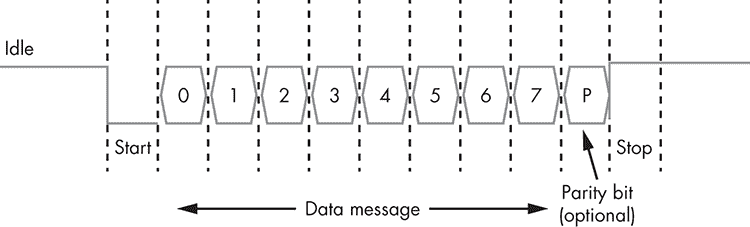
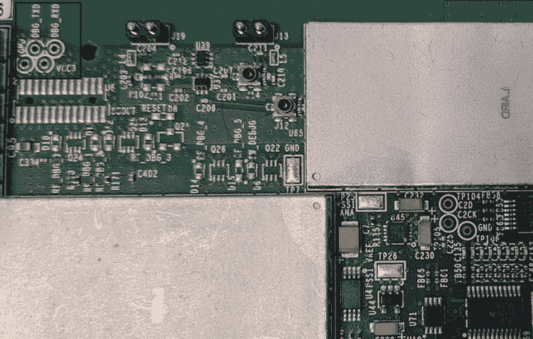
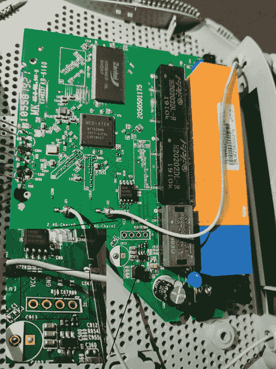
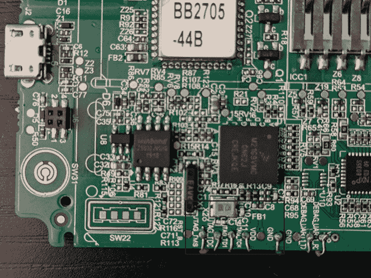
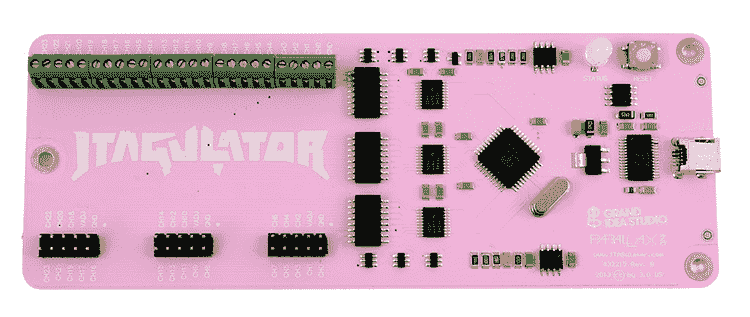
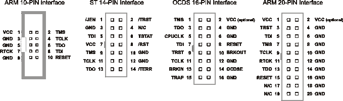
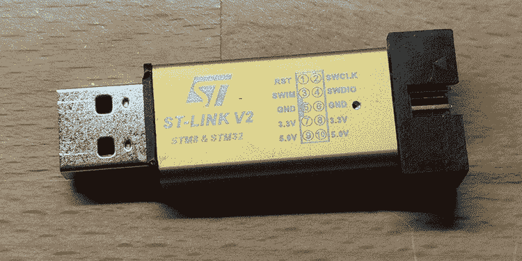
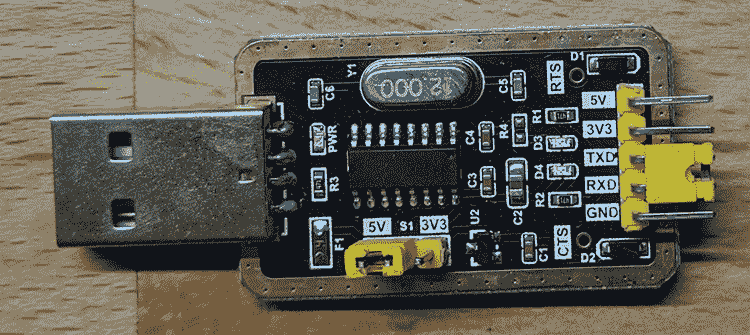
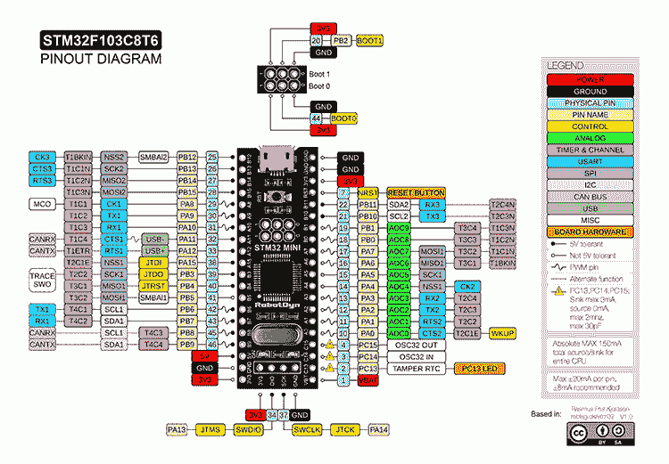

# 第七章：UART、JTAG 和 SWD 利用


如果你了解与系统电子组件直接交互的协议，你就可以在物理层面攻击 IoT 设备。*通用异步接收传输器（UART）* 是最简单的串行协议之一，其利用提供了获取 IoT 设备访问权限的最简单途径之一。供应商通常用它进行调试，这意味着你通常可以通过它获得 root 权限。为此，你需要一些专用的硬件工具；例如，攻击者通常通过使用万用表或逻辑分析仪来识别设备印刷电路板（PCB）上的 UART 引脚。然后，他们将 USB 转串口适配器连接到这些引脚，并从攻击工作站打开串行调试控制台。大多数情况下，如果你这样做，你将被直接进入 root shell。

*联合测试行动小组（JTAG）* 是一种工业标准（在 IEEE 1491.1 中定义），用于调试和测试日益复杂的 PCB。嵌入式设备上的 JTAG 接口允许我们读取和写入内存内容，包括转储整个固件，这意味着它是获得完全控制目标设备的一种方式。*串行线调试*（*SWD*）是一种非常相似、甚至比 JTAG 更简单的电气接口，我们也将在这里进行探讨。

本章的大部分内容将通过一个较长的实践演练进行讲解；你将编程、调试并利用微控制器，通过 UART 和 SWD 绕过其认证过程。但首先，我们将解释这些协议的内部工作原理，并展示如何使用硬件和软件工具识别 PCB 上的 UART 和 JTAG 引脚。

## UART

UART 是一种*串行*协议，这意味着它一次传输一个比特的数据。相比之下，*并行通信*协议通过多个通道同时传输数据。常见的串行协议包括 RS-232、I²C、SPI、CAN、以太网、HDMI、PCI Express 和 USB。

UART 比你可能遇到的许多协议更简单。为了同步通信，UART 的发送器和接收器必须就一个特定的波特率（每秒传输的比特数）达成一致。图 7-1 显示了 UART 数据包的格式。



图 7-1：UART 数据包格式

通常，在 UART 处于*空闲*状态时，线路保持高电平（逻辑 1）。然后，为了表示数据传输的开始，发送器向接收器发送一个*起始位*，此时信号保持低电平（逻辑 0）。接着，发送器发送五到八个*数据位*，包含实际的消息，之后是一个可选的奇偶校验位和一个或两个停止位（逻辑 1），具体取决于配置。用于错误检查的*奇偶校验位*在实际应用中很少见。*停止位*（或多个停止位）表示传输结束。

我们称最常见的配置为*8N1*：8 个数据位、无奇偶校验位和一个停止位。例如，如果我们想在 8N1 UART 配置中发送字符 C，或 ASCII 码 0x43，我们将发送以下位：`0`（起始位）；`0`、`1`、`0`、`0`、`0`、`0`、`1`、`1`（0x43 的二进制值）；以及`0`（停止位）。

### 与 UART 通信的硬件工具

你可以使用各种硬件工具与 UART 进行通信。一种简单的选择是 USB 到串口适配器，如我们在“通过 UART 和 SWD 黑客攻击设备”一节中使用的那种。其他选项包括配备 CP2102 或 PL2303 芯片的适配器。如果你是硬件黑客新手，我们建议你获取一款支持除 UART 以外的其他协议的多功能工具，例如 Bus Pirate、Adafruit FT232H、Shikra 或 Attify Badge。

你还可以在本书末尾的“物联网黑客工具”中找到工具列表及其描述，并附有购买链接。

### 确定 UART 端口

要通过 UART 攻击设备，首先需要定位其四个 UART 端口或连接器，通常以引脚或*焊盘*（镀层孔）的形式出现。术语*引脚图*指的是所有端口的图示。我们将在本书中交替使用这些术语。UART 引脚图包含四个端口：*TX（发送）*、*RX（接收）*、*Vcc（电压）*和*GND（地）*。首先打开设备的外壳并拆下 PCB。请注意，这可能会使你的保修失效。

这四个端口通常会彼此靠近。如果你运气好，甚至可能找到标明 TX 和 RX 端口的标记，如图 7-2 所示。在这种情况下，你可以相当确定这四个引脚就是 UART 引脚。



图 7-2：在圣裘德/雅培医疗 Merlin@home 发射器的 PCB 板上，UART 引脚清晰标记为 DBG_TXD 和 DBG_RXD。

在其他情况下，你可能会看到四个互相并排的通孔焊盘，如图 7-3 中 TP-Link 路由器的那样。这可能是因为厂商将 UART 头针从 PCB 上移除，这意味着你可能需要进行一些焊接操作来接触到它们，或者使用测试探针。（*测试探针*是连接电子测试设备和设备的物理设备，包括探针、电缆和终端连接器。我们将在第八章中展示一些测试探针的示例。）



图 7-3：TP-Link TL WR840N 路由器中的 PCB。在左下角，你可以看到放大的 PCB 部分，标有 UART 焊盘。

此外，请记住，某些设备通过编程通用输入输出（GPIO）引脚来模拟 UART 端口，如果板上没有足够的空间放置专用的硬件 UART 引脚。

当 UART 引脚没有像这里所示那样清晰标记时，通常可以通过两种方式在设备上识别它们：使用万用表或使用逻辑分析仪。*万用表*可用于测量电压、电流和电阻。进行硬件黑客操作时，拥有万用表非常重要，因为它可以用于多种用途。例如，我们通常用它来测试*通断性*。通断性测试在电路电阻足够低（低于几欧姆）时会发出蜂鸣声，表示万用表探头所接触的两个点之间存在连续路径。

虽然便宜的万用表可以完成工作，但如果您计划深入研究硬件黑客操作，我们建议您投资一款坚固且精确的万用表。真正的 RMS 万用表在测量交流电流时更加精确。图 7-4 展示了一款典型的万用表。


图 7-4：常见万用表。突出显示的是通断性测试模式，通常该模式有一个类似声波的图标（因为在检测到通断性时会发出蜂鸣声）。

要使用万用表识别 UART 引脚，首先确保设备已关闭电源。按照惯例，您应将黑色测试线连接到万用表的 COM 插孔。将红色测试线插入 VΩ 插孔。

首先识别 UART GND 引脚。将万用表旋钮转到通断性测试模式，通常该模式有一个类似声波的图标。它可能与一个或多个功能共享一个位置，通常是电阻。将黑色测试线的另一端放在任何接地的金属表面上（无论是测试的 PCB 一部分还是其他地方），该表面应有直接的导电路径连接到地面。

然后将红色探头放在您怀疑可能是 UART 引脚的每个端口上。当您听到万用表发出蜂鸣声时，说明您找到了 GND 引脚。请记住，设备可能有多个 GND 引脚，您可能找到的并不一定是 UART 引脚的一部分。

接下来识别 Vcc 引脚。将万用表旋钮转到直流电压模式，并设置为 20 V 电压。将万用表的黑色探头保持在接地表面上。将红色探头放在一个怀疑是 Vcc 引脚的焊盘上，然后打开设备。如果万用表测得恒定电压为 3.3 V 或 5 V，则说明您找到了 Vcc 引脚。如果得到其他电压，请将红色探头放到另一个端口，重新启动设备并再次测量电压。对每个端口都做同样的操作，直到找到 Vcc 引脚。

接下来，识别 TX 端口。将万用表模式设置为直流电压 20V 或以下，并将黑色探头保持在接地面上。将红色探头移至怀疑的焊盘，并对设备进行断电重启。如果电压在几秒钟内波动，随后稳定在 Vcc 值（无论是 3.3V 还是 5V），则很可能找到了 TX 端口。这种现象发生在设备启动时，设备会通过该 TX 端口发送串行数据用于调试。启动完成后，UART 线变为空闲状态。回顾图 7-1，我们知道空闲的 UART 线保持逻辑高电平，这意味着它具有 Vcc 值。

如果你已经识别了其他 UART 端口，那么附近的第四个引脚很可能就是 RX 端口。否则，你可以通过它的电压波动最小且所有 UART 引脚中电压值最低来识别它。

要更准确地识别 UART 引脚，可以使用*逻辑分析仪*，这是一种捕获和显示数字系统信号的设备。市面上有许多类型的逻辑分析仪，从较便宜的 HiLetgo 或 Open Workbench Logic Sniffer，到更专业的 Saleae 系列（图 7-5），后者支持更高的采样率并且更为稳健。

我们将在第 176 页的《使用逻辑分析仪识别 UART 引脚》一节中，详细介绍如何使用逻辑分析仪对目标设备进行测试。

### 识别 UART 波特率

接下来，你需要识别 UART 端口使用的波特率。否则，无法与设备进行通信。由于缺乏同步时钟，波特率是发射器和接收器同步交换数据的唯一方式。


图 7-5：Saleae 是一系列专业的逻辑分析仪。

识别正确波特率的最简单方法是观察 TX 引脚的输出，并尝试读取数据。如果接收到的数据不可读，切换到下一个可能的波特率，直到数据变得可读。你可以使用 USB 转串口适配器或像 Bus Pirate 这样的多功能设备，配合一个辅助脚本，例如 Craig Heffner 的*baudrate.py*（[`github.com/devttys0/baudrate/`](https://github.com/devttys0/baudrate/)），来帮助自动化这个过程。最常见的波特率有 9600、38400、19200、57600 和 115200，Heffner 的 Python 脚本默认会测试这些波特率。

## JTAG 和 SWD

与 UART 类似，IoT 嵌入式设备上的 JTAG 和 SWD 接口也可以作为获取设备控制权限的一种方式。在本节中，我们将介绍这些接口的基本概念，以及如何与它们进行通信。在第 168 页的《通过 UART 和 SWD 破解设备》一节中，我们将通过一个详细示例演示如何与 SWD 交互。

### JTAG

随着制造商开始生产更小、更密集的组件，高效地测试它们变得更加困难。工程师过去使用*针床*过程来测试硬件缺陷，在这种过程中，他们将电路板放置在一些固定装置上，这些装置与电路板的不同部分连接。当制造商开始使用多层电路板和球栅阵列封装时，这些固定装置无法再访问电路板上的所有节点。

*JTAG*通过引入一种更有效的替代方式——边界扫描，解决了这个问题：边界扫描分析了某些电路，包括每个引脚的嵌入式边界扫描单元和寄存器。通过利用这些边界扫描单元，工程师可以比以前更容易地测试电路板上某个点是否正确连接到另一个点。

#### 边界扫描命令

JTAG 标准定义了用于进行边界扫描的特定命令，包括以下内容：

+   *旁路*（BYPASS）允许你在不经过其他芯片的情况下测试特定的芯片。

+   *采样/预加载*（SAMPLE/PRELOAD）在设备处于正常工作模式时，采集进出设备的数据。

+   *外部测试*（EXTEST）设置并读取引脚状态。

设备必须支持这些命令才能被认为符合 JTAG 标准。设备也可能支持一些可选命令，如*IDCODE*（用于识别设备）和*INTEST*（用于设备的内部测试）等。在使用像 JTAGulator 这样的工具（稍后在“识别 JTAG 引脚”第 166 页中描述）来识别 JTAG 引脚时，你可能会遇到这些指令。

#### 测试访问端口

边界扫描包括对四线*测试访问端口（TAP）*的测试，这是一种通用端口，用于访问内置于组件中的 JTAG 测试支持功能。它使用一个 16 级有限状态机，在各个状态之间移动。请注意，JTAG 并未定义任何关于芯片输入或输出数据的协议。

TAP 使用以下五个信号：

1.  **测试时钟输入（TCK）** TCK 是定义 TAP 控制器每次执行一个操作（换句话说，即跳转到状态机中的下一个状态）频率的时钟。JTAG 标准并未规定时钟的速度，执行 JTAG 测试的设备可以自行确定。

1.  **测试模式选择（TMS）输入** TMS 控制有限状态机。在每个时钟脉冲上，设备的 JTAG TAP 控制器检查 TMS 引脚上的电压。如果电压低于某个阈值，则信号被认为是低电平并解释为 0；如果电压高于某个阈值，则信号被认为是高电平并解释为 1。

1.  **测试数据输入（TDI）** TDI 是将数据通过扫描单元发送到芯片的引脚。每个供应商负责定义该引脚的通信协议，因为 JTAG 并未定义这一点。在 TDI 上呈现的信号会在 TCK 的上升沿进行采样。

1.  **测试数据输出（TDO）** TDO 是将数据从芯片输出的引脚。根据标准，TDO 信号的状态变化应该仅在 TCK 的下降沿发生。

1.  **测试复位（TRST）输入** 可选的 TRST 用于将有限状态机重置为已知的良好状态。当信号为低电平（0）时，TRST 有效。或者，如果 TMS 保持为 1 五个连续的时钟周期，也会触发复位，方式与 TRST 引脚相同，这就是为什么 TRST 是可选的原因。

### SWD 的工作原理

SWD 是一个两引脚电气接口，工作方式与 JTAG 非常相似。JTAG 主要用于芯片和板卡测试，而 SWD 是为调试设计的 ARM 专用协议。由于 ARM 处理器在物联网世界中的广泛应用，SWD 变得越来越重要。如果你找到一个 SWD 接口，几乎总是可以完全控制该设备。

SWD 接口需要两个引脚：一个双向的*SWDIO*信号，相当于 JTAG 的 TDI 和 TDO 引脚，以及一个时钟*SWCLK*，它相当于 JTAG 中的 TCK。许多设备支持*串行线或 JTAG 调试端口（SWJ-DP）*，这是一个结合了 JTAG 和 SWD 接口的接口，允许你将 SWD 或 JTAG 探头连接到目标设备。

### 与 JTAG 和 SWD 通信的硬件工具

多种工具使我们能够与 JTAG 和 SWD 进行通信。流行的工具包括 Bus Blaster FT2232H 芯片，以及任何带有 FT232H 芯片的工具，如 Adafruit FT232H 扩展板、Shikra 或 Attify Badge。如果你给 Bus Pirate 加载特殊固件，它也可以支持 JTAG，但我们不推荐使用这个功能，因为它可能不稳定。Black Magic Probe 是一个专门用于 JTAG 和 SWD 破解的工具，内置 GNU 调试器（GDB）支持，这一点很有用，因为你不需要像*Open On-Chip Debugger (OpenOCD)*这样的中介程序（在第 171 页的“安装 OpenOCD”中有讨论）。作为一个专业的调试工具，*Segger J-Link Debug Probe*支持 JTAG、SWD，甚至 SPI，并且附带专有软件。如果你只想与 SWD 通信，可以使用像*ST-Link*编程器这样的工具，我们将在本章后面的“通过 UART 和 SWD 破解设备”中使用它，详见第 168 页。

你可以在“物联网破解工具”中找到更多工具、它们的描述以及链接。

### 确定 JTAG 引脚

有时 PCB 上会有标记指示 JTAG 接口的位置（见图 7-6）。但大多数时候你需要手动确定接口位置，以及哪些引脚对应四个信号（TDI、TDO、TCK 和 TMS）。



图 7-6：有时 JTAG 接口会在 PCB 上明显标出，如在这个移动销售点（POS）设备中，甚至每个 JTAG 引脚（TMS、TDO、TDI、TCK）都有标签。

你可以采取多种方法来识别目标设备上的 JTAG 引脚。最快但最昂贵的检测 JTAG 端口的方法是使用 *JTAGulator*，这是一种专门为此目的创建的设备（尽管它也可以检测 UART 引脚）。如图 7-7 所示，这个工具有 24 个通道，你可以将其连接到板子的引脚。它通过对这些引脚执行 IDCODE 和 BYPASS 边界扫描命令来进行暴力枚举，尝试每一种引脚的排列，并等待响应。如果收到响应，它会显示每个 JTAG 信号对应的通道，从而帮助你识别 JTAG 引脚。



图 7-7：JTAGulator（[`www.grandideastudio.com/jtagulator/`](http://www.grandideastudio.com/jtagulator/)）可以帮助你识别目标设备上的 JTAG 引脚。

要使用 JTAGulator，将其通过 USB 电缆连接到计算机，然后通过串口与其通信（例如，使用 Linux 上的 `screen` 工具）。你将在本章后面的“连接 USB 到串口适配器”一节中看到如何通过串口进行接口操作，详见第 178 页。你可以在 [`www.youtube.com/watch?v=uVIsbXzQOIU/`](https://www.youtube.com/watch?v=uVIsbXzQOIU/) 上观看 JTAGulator 的创作者 Joe Grand 的演示。

一种更便宜但速度较慢的识别 JTAG 引脚的方法是使用 *JTAGenum* 工具（[`github.com/cyphunk/JTAGenum/`](https://github.com/cyphunk/JTAGenum/)），该工具加载在一个兼容 Arduino 的微控制器上，比如 STM32F103 蓝黑色药丸设备，这些设备我们将在本章的“通过 UART 和 SWD 破解设备”一节（第 168 页）中进行攻击。使用 JTAGenum，你首先需要定义你用于枚举的探测设备的引脚。例如，对于 STM32 蓝药丸，我们选择了以下引脚（但你可以更改它们）：

```
#elif defined(STM32)       // STM32 bluepill, 
 byte       pins[] = {  10 ,  11 ,  12 ,  13 ,  14 ,  15 ,  16 ,  17, 18 , 19 , 21 , 22  };
```

你需要参考设备的引脚图，然后将这些引脚与目标设备上的测试点连接。接着，你需要将 JTAGenum Arduino 代码（[`github.com/cyphunk/JTAGenum/blob/master/JTAGenum.ino/`](https://github.com/cyphunk/JTAGenum/blob/master/JTAGenum.ino/)）刷入设备，并通过串口与设备通信（`s`命令将扫描 JTAG 组合）。

识别 JTAG 引脚的第三种方法是通过检查 PCB 上的引脚图（如图 7-8 所示）。在某些情况下，PCB 上可能会方便地提供 *Tag-Connect 接口*，这清楚地表明该板上也有 JTAG 连接器。你可以在 [`www.tag-connect.com/info/`](https://www.tag-connect.com/info/) 查看该接口的样子。此外，检查 PCB 上芯片的数据手册可能会揭示出指向 JTAG 接口的引脚图。



图 7-8：根据制造商（ARM、STMicroelectronics 或 Infineon 的 OCDS），在 PCB 上找到任何这些引脚接口都可以作为你正在处理 JTAG 连接器的良好指示。

## 通过 UART 和 SWD 破解设备

在本节中，我们将利用微控制器的 UART 和 SWD 接口来获取设备内存并绕过已闪存程序的认证例程。为了攻击设备，我们将使用两种工具：迷你 ST-Link 编程器和 USB 到串行适配器。

*迷你 ST-Link 编程器*（图 7-9）让我们通过 SWD 与目标设备进行交互。



图 7-9：迷你 ST-Link V2 编程器让我们通过 SWD 与 STM32 核心进行交互。

*USB 到串行适配器*（图 7-10）让我们通过计算机的 USB 端口与设备的 UART 引脚进行通信。该适配器是一个 *晶体管-晶体管逻辑（TTL）* 设备，意味着它使用 0 和 5 伏的电流分别表示 0 和 1。许多适配器使用 FT232R 芯片，你可以通过在线搜索 USB 到串行适配器轻松找到一个。



图 7-10：USB 到串行（TTL）适配器。此适配器还可以在 5V 和 3.3V 之间切换。

你需要至少十根 *跳线* 来通过引脚连接设备。我们还建议你购买一个 *面包板*，它是一个构建基座，可以用来稳固地固定黑色小药丸。你应该能在网上购买到这些硬件组件。我们特别选择这里使用的组件，因为它们易于找到且价格便宜。但如果你想要替代 ST-Link 编程器，可以使用 Bus Blaster，替代 USB 到串行适配器，可以使用 Bus Pirate。

对于软件，我们将使用 Arduino 编写我们要攻击的认证程序；我们将使用 OpenOCD 和 GDB 进行调试。以下章节将向你展示如何设置这个测试和调试环境。

### STM32F103C8T6（黑色小药丸）目标设备

STM32F103xx 是一个非常受欢迎且廉价的微控制器系列，广泛应用于工业、医疗和消费市场。它拥有一个 72 MHz 频率的 ARM Cortex-M3 32 位 RISC 核心，最多 1MB 的闪存，最多 96KB 的静态随机存取存储器（SRAM），以及丰富的 I/O 和外设接口。

该设备有两个版本，分别称为蓝色药丸和黑色药丸（根据板子的颜色）。我们将使用黑色药丸（STM32F103C8T6）作为目标设备。两个版本的主要区别在于，黑色药丸比蓝色药丸消耗更少的能量且更坚固。你可以轻松在线购买它。我们建议购买已经预焊接引脚头并且已经烧录了 Arduino 启动加载程序的板子。这样，你就不需要焊接引脚头，并且可以直接通过 USB 使用该设备。但在本次练习中，我们将向你展示如何在没有 Arduino 启动加载程序的情况下，将程序加载到黑色药丸上。

图 7-11 显示了设备的引脚图。请注意，尽管一些引脚支持 5V 电压，其他的则不支持；因此，我们只能向这些引脚提供最多 3.3V 的电压。如果你有兴趣进一步了解 STM32 微控制器的内部结构，可以参考 [`legacy.cs.indiana.edu/~geobrown/book.pdf`](https://legacy.cs.indiana.edu/~geobrown/book.pdf) 上的优秀资料。

确保不要将任何 5V 输出连接到黑色药丸板的 3.3V 引脚，否则你很可能会烧毁它们。



图 7-11：STM32F103C8T6（黑色药丸）引脚图

### 设置调试环境

我们将首先使用 *Arduino 集成开发环境（IDE）* 对目标设备进行编程。Arduino 是一个廉价、易于使用的开源电子平台，让你能够使用 Arduino 编程语言编程微控制器。其 IDE 包含一个代码编辑器用于编写代码；一个板子和库管理器；内建的功能来验证、编译和上传代码到 Arduino 板；以及一个串口监视器，用于显示硬件的输出。

#### 安装 Arduino 环境

你可以在 [`www.arduino.cc/en/Main/Software/`](https://www.arduino.cc/en/Main/Software/) 获取 Arduino IDE 的最新版本。对于本演示，我们将使用 Ubuntu 18.04.3 LTS 上的 1.8.9 版本，但你使用的操作系统不会影响安装。在 Linux 上，你可以手动下载包并按照 [`www.arduino.cc/en/guide/linux/`](https://www.arduino.cc/en/guide/linux/) 上的说明操作。或者，如果你使用的是基于 Debian 的发行版，如 Kali 或 Ubuntu，你可以在终端输入以下命令来安装所有所需的工具：

```
# apt-get install arduino
```

安装 IDE 后，从 GitHub 下载最新的 Arduino STM32 核心文件，将其安装到 Arduino 草图目录中的*hardware*文件夹，并运行 *udev rules* 安装脚本。

```
$ **wget https://github.com/rogerclarkmelbourne/Arduino_STM32/archive/master.zip**
$ **unzip master.zip**
$ **cp -r Arduino_STM32-master /home/***ithilgore***/Arduino/hardware/**
$ **cd /home/***ithilgore***/Arduino/hardware/Arduino_STM 32-master/tools/linux**
$ **./install.sh**
```

确保将 */home/* 后的用户名替换为你自己的用户名。

如果*hardware*文件夹不存在，创建它。要查找 Arduino 草图保存的位置，运行 Arduino IDE，方法是终端输入`arduino`或点击桌面上的 Arduino 图标。然后点击**文件**▶**首选项**，并记下**草图位置**的文件路径。在这个示例中，路径是*/home/<ithilgore>/Arduino*。

你还需要安装 32 位版本的`libusb-1.0`，如下所示，因为 Arduino STM32 捆绑的`st-link`工具依赖于它：

```
$ **sudo apt-get install libusb-1.0-0:i386**
```

此外，安装 Arduino SAM 板（Cortex-M3）。这些是 Cortex-M3 微控制器的核心。*核心*是低级 API，使特定的微控制器与 Arduino IDE 兼容。你可以通过在 Arduino IDE 中点击**工具**▶**开发板**▶**开发板管理器**来安装它们。然后搜索**SAM 板**。点击**安装**，选择应该出现的**Arduino SAM Boards (32-bit ARM Cortex-M3)**选项。我们使用的是版本 1.6.12\。

你还可以在[`github.com/rogerclarkmelbourne/Arduino_STM32/wiki/Installation/`](https://github.com/rogerclarkmelbourne/Arduino_STM32/wiki/Installation/)找到最新的 Arduino STM32 安装说明。

#### 安装 OpenOCD

*OpenOCD*是一个免费的开源测试工具，通过 GDB 提供对 ARM、MIPS 和 RISC-V 系统的 JTAG 和 SWD 访问。我们将使用它来调试黑色药丸。在 Linux 系统中安装它，可以输入以下命令：

```
$ **sudo apt-get install libtool autoconf texinfo libusb-dev libftdi-dev libusb-1.0**
$ **git clone git://git.code.sf.net/p/openocd/code openocd**
$ **cd openocd**
$ **./bootstrap**
$ **./configure --enable-maintainer-mode --disable-werror --enable-buspirate --enable-ftdi** 
$ **make**
$ **sudo make install**
```

请注意，你还需要安装`libusb-1.0`，它是启用对 Future Technology Devices International (FTDI)设备支持的必要工具。然后从源代码编译 OpenOCD。这使我们能够启用对 FTDI 设备和 Bus Pirate 工具的支持。

要了解更多关于 OpenOCD 的信息，请查阅它的详细用户手册，网址是[`openocd.org/doc/html/index.html`](http://openocd.org/doc/html/index.html)。

#### 安装 GNU 调试器

*GDB*是一个便携式调试器，运行在类 Unix 系统上。它支持许多目标处理器和编程语言。我们将使用 GDB 远程跟踪和修改目标程序的执行。

在 Ubuntu 上，你需要安装原版的`gdb`和`gdb-multiarch`，后者扩展了 GDB 对多种目标架构的支持，包括 ARM（黑色药丸的架构）。你可以通过在终端中输入以下命令来安装：

```
$ **sudo apt install gdb gdb-multiarch**
```

### 在 Arduino 中编写目标程序

现在我们将编写一个程序，在 Arduino 中将其加载到黑色药丸（black pill）并以此作为攻击目标。在实际测试中，你可能无法访问设备的源代码，但我们展示这个代码有两个目的。首先，你将了解 Arduino 代码是如何转换为二进制文件并上传到设备上的。其次，当我们使用 OpenOCD 和 GDB 进行调试时，你将看到汇编代码与原始源代码之间的对应关系。

该程序（列表 7-1）使用串行接口发送和接收数据。它通过检查密码来模拟身份验证过程。如果它收到正确的密码，它将打印 `ACCESS GRANTED`。否则，它会继续提示用户登录。

```
const byte bufsiz = 32; 1
char buf[bufsiz];
boolean new_data = false;
boolean start = true;

void setup() { 2
  delay(3000);
  Serial1.begin(9600);
}

void loop() { 3
  if (start == true) {
    Serial1.print("Login: ");
    start = false;
  }
  recv_data();
  if (new_data == true)
    validate();
}

void recv_data() { 4
  static byte i = 0;
 static char last_char;
  char end1 = '\n';
  char end2 = '\r';
  char rc;

  while (Serial1.available() > 0 && new_data == false) { 5
    rc = Serial1.read();       
    // skip next character if previous one was \r or \n and this one is \r or \n
    if ((rc == end1 || rc == end2) && (last_char == end2 || last_char == end1)) 6
      return;
    last_char = rc;

    if (rc != end1 && rc != end2) { 7
      buf[i++] = rc;
      if (i >= bufsiz)
        i = bufsiz - 1;
    } else { 8
      buf[i] = '\0'; // terminate the string
      i = 0;
      new_data = true;       
    }
  } 
}

void validate() { 9
  Serial1.println(buf);
  new_data = false;
  if (strcmp(buf, "sock-raw.org") == 0) a
    Serial1.println("ACCESS GRANTED");
  else {
    Serial1.println("Access Denied.");
    Serial1.print("Login: ");
  }
}
```

列表 7-1：用于 STM32F103 芯片的串行通信程序

我们首先定义了四个全局变量。1. `bufsiz` 变量保存字符数组 `buf` 的字节数，`buf` 存储通过串口从用户或与该端口交互的设备传输的字节。`new_data` 变量是一个布尔值，每当主程序循环接收到一行新的串行数据时，它变为 `true`。布尔变量 `start` 只有在主循环的第一次迭代时才为 `true`，因此它会打印第一次的“登录”提示。

`````````` The `setup()` function 2 is a built-in Arduino function that gets executed once when the program initializes. Inside this function, we initialize the serial interface (`Serial1.begin`) with``a baud rate of 9600 bits per second. Note that `Serial1` is different from `Serial`, `Serial2`, and `Serial3`, each of which corresponds to different UART pins on the black pill. The object `Serial1` corresponds to pins A9 and A10\.``   ````````` The `loop()` function 3 is another built-in Arduino function that gets called automatically after `setup()`, looping consecutively and executing the main program. It continuously calls `recv_data()`, which is responsible for receiving and validating serial data. When the program has finished receiving all bytes (which happens when `new_data` becomes `true`), `loop()` calls `validate()`, which checks whether the received bytes constitute the correct passphrase.    The `recv_data()` function 4 begins by defining two *static* variables (which means their value will be retained between every call of this function): `i` for iterating through the `buf` array and `last_char` for storing the last character we read from the serial port. The `while` loop 5 checks whether there are any bytes available for reading from the serial port (through `Serial1.available`), reads the next available byte with `Serial1.read`,``and checks whether the previously stored character (which is held in `last_char`) is a carriage return `‘\r’` or new line `‘\n’` 6. It does that so it can deal with devices that send a carriage return, new line, or both to terminate their lines when they send serial data. If the next byte doesn’t indicate the end of the line 7, we store the newly read byte `rc` in `buf` and increment the `i` counter by one. If `i` reaches the end of the buffer length, the program no longer stores any new bytes in the buffer. If the read byte signifies the end of the line 8, meaning the user on the serial interface most likely pressed ENTER, we null terminate the string in the array, reset the `i` counter, and set `new_data` to `true`.``   ```````` In that case, we call the `validate()` function 9, which prints the received line and compares it with the correct password a. If the password is correct, it prints `ACCESS GRANTED`. Otherwise, it prints `Access Denied` and prompts the user to try logging in again.    ### Flashing and Running the Arduino Program    Now upload the Arduino program to the black pill. This process varies slightly depending on whether or not you purchased the black pill with the Arduino bootloader preflashed, but we’ll walk through both methods. You could also upload the program using a third method: a serial adapter, which allows you to flash your own bootloader (such as [`github.com/rogerclarkmelbourne/STM32duino-bootloader/`](https://github.com/rogerclarkmelbourne/STM32duino-bootloader/)), but we won’t cover this process here; you’ll find multiple resources online for doing this.    Either way, we’ll use the ST-Link programmer and write the program to the main flash memory. Alternatively, you could write it to the embedded SRAM if you encounter any problems with writing it to flash. The main problem with that approach is that you’ll have to reupload the Arduino program every time you power cycle the device, because the SRAM content is volatile, which means it gets lost every time you power off the device.    #### Selecting the Boot Mode    To make sure you upload the program to the black pill’s flash memory, you’ll have to select the correct boot mode. STM32F10*xxx* devices have three different boot modes, which you can choose from using the *BOOT1* and *BOOT0* pins, as shown in Table 7-1. Reference the pinout diagram in Figure 7-11 to locate these two pins on the black pill.      Table 7-1: Boot Modes for the Black Pill and Other STM32F10*xxx* Microcontrollers       | **Boot mode selection pins** | **Boot mode** | **Aliasing** | | --- | --- | --- | | BOOT1 | BOOT0 |  |  | | x | 0 | Main flash memory | Selects the main flash memory as the boot space | | 0 | 1 | System memory | Selects the system memory as the boot space | | 1 | 1 | Embedded SRAM | Selects the embedded SRAM as the boot space |    Use the jumper pin that comes with the black pill to select the boot mode. A *jumper pin* is a set of small pins in a plastic box that creates an electrical connection between two pin headers (Figure 7-12). You can use the jumper pin to connect the boot mode selection pins to VDD (logical 1) or GND (logical 0).      Figure 7-12: A jumper pin, also known as a jumper shunt or shunt      Connect the jumper pin for both BOOT0 and BOOT1 of the black pill to the GND. If you wanted to write to SRAM, you would connect both to VDD.    #### Uploading the Program    To upload the program, first, make sure the jumpers for BOOT0 and BOOT1 are connected to the GND. Create a new file in the Arduino IDE, copy and paste the code from Listing 7-1 into it, and then save the file. We used the name *serial-simple*. Click **Tools**▶**Board** and select **Generic STM32F103C series** in the **STM32F1 Boards** section. Next, click **Tools**▶**Variant** and select **STM32F103C8 (20k RAM, 64k Flash)**, which should be the default option. Check that **Tools**▶**Upload method** is set to **STLink** and, ideally, that **Optimize** is set to **Debug (-g)**.This ensures that debug symbols appear in the final binary. Leave the rest of the options as-is.    If the black pill has the Arduino bootloader flashed, you can directly connect it to your computer via the USB cable without the ST-Link programmer. Then set the **Upload** method to **STM32duino bootloader** instead of **STLink**. But for learning purposes, we’ll use the ST-Link programmer, so you don’t need the bootloader preflashed.    To upload the program to the black pill, connect the ST-Link programmer to it. Use four jumper wires to link the SWCLK, SWDIO, GND, and 3.3 V pins of the ST-Link to the CLK, DIO, GND, 3.3 V pins of the black pill, respectively. These pins are located on the bottom part of the black pill’s pin header. Reference Figure 7-14 and Figure 7-15 to see what this looks like.    #### Using a Logic Analyzer to Identify the UART Pins    Next, identify the UART pins on the device. We showed you how to do this with a multimeter earlier in this chapter, but now we’ll use a logic analyzer to identify a UART TX pin. A TX pin transmits output, so it’s easy to recognize. You can use an inexpensive HiLetgo USB logic analyzer with eight channels for this exercise, because it’s compatible with the Saleae Logic software we’ll use. Download that software for your operating system from [`saleae.com/downloads/`](https://saleae.com/downloads/). (We used the Linux version in this example.) Then unzip the bundle to a local folder, browse to it in a terminal, and enter the following:    ``` $ **sudo ./Logic** ```    This command will open Saleae Logic’s graphic interface. Leave it open for now.    Make sure any system you’re testing is powered off when you connect the logic analyzer’s probes to it to avoid short-circuiting. In this case, because the black pill is powered by the ST-Link programmer, temporarily disconnect the programmer from your computer’s USB port. Remember that if you power off the black pill after uploading the Arduino code to the SRAM instead of the flash, you’ll have to reupload the code to the black pill.    Use a jumper wire to connect one of your logic analyzer’s GND pins to one of the black pill’s GND pins so they share a common ground. Next, use two more jumper wires to connect the logic analyzer’s CH0and CH1 channels (all channel pins should be labeled) to the black pill’s A9 and A10 pins. Connect the logic analyzer to a USB port on your computer.    In the Saleae interface, you should see at least a couple of channels in the left pane, each of which corresponds to one of the logic analyzer’s channel pins. You can always add more channels, if your logic analyzer supports them, so you can sample more pins at the same time. Add them by clicking the two arrows next to the green Start button to open the settings. You can then select how many channels you want to display by toggling the number next to each channel.    In the settings, change the **Speed (Sample Rate)** to 50 kS/s and the **Duration** to 20 seconds. As a rule, you should sample digital signals at least four times faster than their bandwidth. With serial communications, which are generally very slow, a 50 kS/s sampling rate is more than enough, although sampling faster than this does no harm. As for the duration, 20 seconds is enough time for the device to power on and start transmitting data.    Click the **Start** button to begin capturing the signals and immediately power on the black pill by connecting the ST-Link programmer to a USB port. The session will last for 20 seconds, but you can stop it at any time before then. If you don’t see any data on the channels, try power cycling the black pill while the session is on. At some point, you should see a signal coming from the channel corresponding to the A9 (TX) pin. Zoom in or out using your mouse wheel to inspect it more clearly.    To decode the data, click the **+** beside **Analyzers** in the Graphical User Interface (GUI)’s right pane, select **Async Serial**, choose the channel on which you’re reading the signal, and set the **Bit Rate** to 9600\. (The bit rate in this case is the same as the baud rate.) Note that when you don’t know the bit rate, you can select **Use Autobaud** and let the software work its magic to detect the right one. You should now see the `Login:` prompt from the Arduino program as a series of UART packets in the signal you just captured (Figure 7-13).      Figure 7-13: Decoding the UART data coming from the black pill’s TX pin using the Saleae Logic software. In the bottom right, you can see the `Login:` prompt that the Arduino program runs when the device boots.      Notice in Figure 7-13 how the device sends the letter “L,” which indicates the beginning of the login message. The communication starts with an idle line (at a logical 1 value). The black pill then sends a start bit with a logical 0 value, followed by the data bits, from least to most significant. In ASCII, the letter L is 0x4C, or 00110010 in binary, as you can see in the transmission. Finally, the black pill sends a stop bit (with a logical 1 value), before beginning the letter “o.”    We placed two timing markers (A1 and A2 in Figure 7-13) on either side of one random bit. *Timing markers* are annotations that you can use to measure the time elapsed between any two locations in your data. We measured a duration of 100 μs, which proves that the transmission has a baud rate of 9600 bits/sec. (One bit takes 1/9600 seconds to transmit, or 0.000104 seconds, which is roughly 100 μs.)    #### Connecting the USB to a Serial Adapter    To test the USB-to-serial adapter, let’s connect it to our computer. Some USB-to-serial adapters, including the one we used, come with a jumper pin preinstalled on the RX and TX pins (Figure 7-12). The jumper pin will short-circuit the RX and TX pin headers, creating a loop between them. This is useful for testing that the adapter works: connect it to your computer’s USB port and then open a terminal emulator program, such as `screen` or `minicom`, to that port. Try using the terminal emulator to send serial data to the connected devices. If you see the keystrokes echoed in the terminal, you know the adapter works. The reason is that your keyboard sends characters through the USB port to the adapter’s TX pin; because of the jumper, the characters get sent to the RX pin and then returned to the computer through the USB port.    Plug the adapter into your computer with the jumper pin in place, and then enter the following command to see which device file descriptor it was assigned to:    ``` $ **sudo dmesg**  … usb 1-2.1: FTDI USB Serial Device converter now attached to ttyUSB0 ```    Typically, it will be assigned to */dev/ttyUSB0* if you don’t have any other peripheral devices attached. Then start `screen` and pass it the file descriptor as an argument:    ``` $ **screen /dev/ttyUSB0** ```    To exit the screen session, press CTRL-A followed by **\**.    You can also provide the baud rate as a second argument. To find the current baud rate of the adapter, enter the following:    ``` $ **stty -F /dev/ttyUSB0** speed 9600 baud; line =0; … ```    This output shows that the adapter has a baud speed of 9600\.    Verify that the adapter is working and then remove the jumper pin, because we’ll need to connect the RX and TX pins to the black pill. Figure 7-14 shows the connections you have to make.    Connect the adapter’s RX pin to a TX pin on the black pill (pin A9, in this case). Then connect the adapter’s TX pin to the black pill’s RX pin (A10). Using A9 and A10 is important, because these pins correspond to the `Serial1` interface we used in the Arduino code.    The USB-to-serial adapter must have the same GND as the black pill, because the devices use GND as a point of reference for voltage levels. The Clear to Send (CTS) pin should be set to GND as well, because it’s considered active when low (meaning at a logic level of 0). If it weren’t connected to GND, it would float high, indicating that the adapter isn’t clear to send bytes to the black pill.      Figure 7-14: Pin connections between the black pill, ST-Link, USB-to-serial adapter, and laptop      #### Connecting to a Computer    Once you’ve connected the black pill, ST-Link, and USB-to-serial adapter, connect the ST-Link to a USB port on your computer. Then connect the adapter to a USB port. Figure 7-15 shows an example setup.    Now that the setup is ready, return to the Arduino IDE. Enable verbose output by clicking **File**▶**Preferences** and selecting the **Show verbose output during: compilation** checkbox. Then click **Sketch**▶**Upload** to compile the program and upload it to the black pill.      Figure 7-15: The black pill, ST-Link programmer, and USB-to-serial adapter are connected using jumper wires. Note that the black pill isn’t connected to any USB port; the ST-Link programmer powers it.      Because we enabled verbose output in the Arduino IDE, compiling and uploading the program should give you a lot of information about the process, including a temporary directory that stores the intermediate files necessary for compilation (Figure 7-16).      Figure 7-16: Verbose output from Arduino IDE when compiling and uploading the program. Highlighted is the temporary directory you’ll need.      On Linux, this directory typically looks like */tmp/arduino_build_336697*, where the last number is a random identifier (yours will obviously be different) that changes with new builds. When you compile your program, take note of this directory, because you’ll need it later.    At this point, open the serial monitor console by clicking **Tools**▶**Serial Monitor**. The *Serial Monitor* is a pop-up window that can send and receive UART data to and from the black pill. It has similar functionality to `screen`, used earlier, but it’s built into the Arduino IDE for convenience. Click **Tools**▶**Port** to make sure you’ve selected the USB port to which your USB-to-serial adapter is connected. Check that the Serial Monitor’s baud rate is 9600, like we specified in the code. You should then see the `Login:` prompt from our Arduino program. Enter some sample text to test the program. Figure 7-17 shows a sample session.    If you enter anything other than `sock-raw.org`, you should get the `Access Denied` message. Otherwise, you should get the `ACCESS GRANTED` message.      Figure 7-17: The Serial Monitor pop-up window in the Arduino IDE      ### Debugging the Target    Now it’s time for the main exercise: debugging and hacking the black pill. If you followed all of the previous steps, you should have a fully working debugging environment and the black pill should contain the Arduino program we wrote.    We’ll use OpenOCD to communicate with the black pill using SWD through the ST-Link programmer. We’ll leverage that connection to open a remote debugging session with GDB. Then, using GDB, we’ll walk through the program’s instructions and bypass its authentication check.    #### Running an OpenOCD Server    We’ll start OpenOCD as a server. We need OpenOCD to communicate with the black pill through SWD. To run it against the black pill’s STM32F103 core using the ST-Link, we have to specify the two relevant configuration files using the `-f` switch:    ``` $ **sudo openocd -f /usr/local/share/openocd/scripts/interface/stlink.cfg -f /usr/local/share/openocd/scripts/targets/stm32f1x.cfg**  [sudo] password for ithilgore:  Open On-Chip Debugger 0.10.0+dev-00936-g0a13ca1a (2019-10-06-12:35) Licensed under GNU GPL v2 For bug reports, read 	http://openocd.org/doc/doxygen/bugs.html Info : auto-selecting first available session transport "hla_swd". To override use 'transport select <transport>'. Info : The selected transport took over low-level target control. The results might differ compared to plain JTAG/SWD Info : Listening on port 6666 for tcl connections Info : Listening on port 4444 for telnet connections Info : clock speed 1000 kHz Info : STLINK V2J31S7 (API v2) VID:PID 0483:3748 Info : Target voltage: 3.218073 Info : stm32f1x.cpu: hardware has 6 breakpoints, 4 watchpoints Info : Listening on port 3333 for gdb connections ```    These configuration files help OpenOCD understand how to interact with the devices using JTAG and SWD. If you installed OpenOCD from source, as described earlier, these configuration files should be in */usr/local/share/openocd*. When you run the command, OpenOCD will start accepting local Telnet connections on TCP port 4444 and GDB connections on TCP port 3333.    At this point, we’ll connect to the OpenOCD session with Telnet and begin issuing some commands to the black pill over SWD. In another terminal, enter the following:    ``` $ **telnet localhost 4444** Trying 127.0.0.1... Connected to localhost. Escape character is '^]'. Open On-Chip Debugger > 1**reset init**  target halted due to debug-request, current mode: Thread  xPSR: 0x01000000 pc: 0x08000538 msp: 0x20005000 > 2**halt**  > 3**flash banks**  #0 : stm32f1x.flash (stm32f1x) at 0x08000000, size 0x00000000, buswidth 0, chipwidth 0 > 4**mdw 0x08000000 0x20**  0x08000000: 20005000 08000539 080009b1 080009b5 080009b9 080009bd 080009c1 08000e15  0x08000020: 08000e15 08000e15 08000e15 08000e15 08000e15 08000e15 08000e15 08000e35  0x08000040: 08000e15 08000e15 08000e15 08000e15 08000e15 08000e15 08000a11 08000a35  0x08000060: 08000a59 08000a7d 08000aa1 080008f1 08000909 08000921 0800093d 08000959  > 5**dump_image firmware-serial.bin 0x08000000 17812**  dumped 17812 bytes in 0.283650s (61.971 KiB/s) ```    The `reset init` command 1 halts the target and performs a hard reset, executing the *reset-init* script that is associated with the target device. This script is an event handler that performs tasks like setting up clocks and JTAG clock rates. You can find examples of these handlers if you inspect the *openocd/scripts/targets/*``` directory’s *.cfg* files. The `halt` command 2 sends a halt request for the target to halt and enter debug mode. The `flash banks` command 3 prints a one-line summary of each flash memory area that was specified in the OpenOCD *.cfg* file (in this case, *stm32f1x.cfg*). It printed the black pill’s main flash memory, which starts at the address `0x08000000`.`` This step is important, because it can help you identify which segment of memory to dump firmware from.`Note that sometimes the size value isn’t reported correctly. Consulting the datasheets remains the best resource for this step.` `` ```   ``````` `````` ````` We then send the 32-bit memory access command `mdw` 4, starting at that address, to read and display the first 32 bytes of flash memory. Finally, we dump the target’s memory from that address for `17812` bytes and save it into a file named *firmware-serial.bin* in our computer’s local directory 5. We got the number 17812 by inspecting the size of the Arduino program file loaded in the flash memory. To do this, issue the following command from the temporary Arduino build directory:    ``` /tmp/arduino_build_336697 $ **stat -c '%s' serial-simple.ino.bin**  17812 ```    You can then use tools like colordiff and xxd to see whether there are any differences between the *firmware-serial.bin* file that we dumped from the flash memory and the *serial-simple.ino.bin* file that we uploaded through the Arduino IDE. If you dumped the exact number of bytes as the size of the Arduino program, there should be no differences in the output of `colordiff`:    ``` $ **sudo apt install colordiff xxd** $ **colordiff -y <(xxd serial-simple.ino.bin) <(xxd firmware-serial.bin) | less** ```    We recommend you experiment with more OpenOCD commands; they’re all documented on its website. One useful command to try is the following:    ``` `` > `flash write_image erase custom_firmware.bin 0x08000000` `` ```    You can use it to flash new firmware.    #### Debugging with GDB    Let’s debug and alter the execution flow of the Arduino program using GDB. With the OpenOCD server already running, we can start a remote GDB session. To help us, we’ll use the *Executable and Linkable Format (ELF)* file created during the Arduino program compilation. The ELF file format is the standard file format for executable files, object code, shared libraries, and core dumps in Unix-like systems. In this case, it acts as an intermediate file during compilation.    Browse to the temporary directory returned during compilation. Make sure you change the random number part of the directory name to the one that you got from your own Arduino compilation. Then, assuming your Arduino program was named *serial-simple,* start a remote GDB session using `gdb-multiarch` with the arguments shown here:    ``` $ **cd /tmp/arduino_build_336697/** $ **gdb-multiarch** **-q** **--eval-command="target remote localhost:3333" serial-simple.ino.elf** Reading symbols from serial-simple.ino.elf...done. Remote debugging using localhost:3333 0x08000232 in loop () at /home/ithilgore/Arduino/serial-simple/serial-simple.ino:15 15       if (start == true) {  (gdb) ```    This command will open the GDB session and use the local ELF binary file (called *serial-simple.ino.elf*) created by Arduino during compilation for debug symbols. *Debug symbols* are primitive data types that allow debuggers to gain access to information, such as variables and function names, from the binary’s source code.    In that terminal, you can now issue GDB commands. Start by entering the `info functions` command to verify that the symbols have indeed been loaded:    ``` (gdb) **info functions** All defined functions:  File /home/ithilgore/Arduino/hardware/Arduino_STM32-master/STM32F1/cores/maple/HardwareSerial.cpp: HardwareSerial *HardwareSerial::HardwareSerial(usart_dev*, unsigned char, unsigned char); int HardwareSerial::available(); … File /home/ithilgore/Arduino/serial-simple/serial-simple.ino: void loop(); void recv_data(); void setup(); void validate(); … ```    Now let’s place a breakpoint on the `validate()` function, because the name implies that it does some sort of checking, which might be related to authentication.    ``` (gdb) **b****reak** **validate** Breakpoint 1 at 0x800015c: file /home/ithilgore/Arduino/serial-simple/serial-simple.ino, line 55. ```    Because the debugging information recorded in the ELF binary informs GDB about what source files were used to build it, we can use the `list` command to print parts of the program’s source. You’ll rarely have this convenience in real reverse engineering scenarios, where you’ll have to rely on the `disassemble` command, which shows the assembly code instead. Here is the output of both commands:    ```  (gdb) **l****ist** **validate****,** 55     void validate() { 56       Serial1.println(buf); 57       new_data = false; 58 59       if (strcmp(buf, "sock-raw.org") == 0) 60         Serial1.println("ACCESS GRANTED"); 61       else { 62         Serial1.println("Access Denied."); 63         Serial1.print("Login: "); 64       }  (gdb) **disas****semble** **validate** Dump of assembler code for function validate():    0x0800015c <+0>: push   {r3, lr}    0x0800015e <+2>: ldr    r1, [pc, #56] ; (0x8000198 <validate()+60>)    0x08000160 <+4>: ldr    r0, [pc, #56] ; (0x800019c <validate()+64>)    0x08000162 <+6>: bl     0x80006e4 <Print::println(char const*)>    0x08000166 <+10>: ldr    r3, [pc, #56] ; (0x80001a0 <validate()+68>)    0x08000168 <+12>: movs   r2, #0    0x0800016a <+14>: ldr    r0, [pc, #44] ; (0x8000198 <validate()+60>)    0x0800016c <+16>: ldr    r1, [pc, #52] ; (0x80001a4 <validate()+72>)    0x0800016e <+18>: strb   r2, [r3, #0]    0x08000170 <+20>: bl     0x8002de8 <strcmp>    0x08000174 <+24>: cbnz   r0, 0x8000182 <validate()+38>    0x08000176 <+26>: ldr    r0, [pc, #36] ; (0x800019c <validate()+64>) … ```    If you have only the assembly code, import the file (in this case *serial-simple.ino.elf*)into a decompiler like those that Ghidra or IDA Pro provide. This will help you tremendously, because it will translate the assembly code into C, which is much easier to read (Figure 7-18).      Figure 7-18: Using the decompiler in Ghidra to quickly read C code instead of assembly code      If you have only the *hex* file (for example, the *firmware-serial.bin*) as a result of dumping the firmware from the flash memory, you’ll first have to disassemble it using the ARM toolchain like this:    ``` $ **arm-none-eabi-objdump -D -b binary -marm -Mforce-thumb firmware-serial.bin > output.s** ```    The *output.s*`file will contain the assembly code.`   ````Next, let’s look at how we can bypass our target’s simple authentication process. Allow normal execution of the program to continue by issuing the `continue` command (or `c` for short):    ``` (gdb) **c****ontinue** Continuing. ```    The program is now waiting for serial input. Open the serial monitor from the Arduino IDE like we did on page 180, enter a sample password, like `test123`, and press ENTER. On the GDB terminal, you should see that the breakpoint for the `validate` function gets triggered. From then on, we’ll make GDB automatically display the next instruction to be executed each time the program stops by issuing the command `display/i $pc`. Then we’ll gradually step one machine instruction at a time using the `stepi` command until we reach the `strcmp` call. When we reach the `Print::println` call, we’ll use the `next` command to step over it, because it doesn’t concern us in this context (Listing 7-2).    ``` Breakpoint 1, validate () at /home/ithilgore/Arduino/serial-simple/serial-simple.ino:55 55     void validate() { (gdb) **display/i $pc**  1: x/i $pc => 0x800015c <validate()>:  push   {r3, lr} (gdb) **stepi** halted: PC: 0x0800015e 56         Serial1.println(buf); 3: x/i $pc => 0x800015e <validate()+2>:	ldr    r1, [pc, #56]	; (0x8000198 <validate()+60>) (gdb) **stepi** halted: PC: 0x08000160 0x08000160    56         Serial1.println(buf); 1: x/i $pc => 0x8000160 <validate()+4>:	ldr    r0, [pc, #56]	; (0x800019c <validate()+64>) (gdb) **stepi** halted: PC: 0x08000162 0x08000162    56         Serial1.println(buf); 1: x/i $pc => 0x8000162 <validate()+6>:	bl     0x80006e4 <Print::println(char const*)> (gdb) **next** halted: PC: 0x080006e4 57         new_data = false; 1: x/i $pc => 0x8000166 <validate()+10>:      ldr    r3, [pc, #56]	; (0x80001a0 <validate()+68>) (gdb) **stepi** halted: PC: 0x08000168 0x08000168    57         new_data = false; 1: x/i $pc => 0x8000168 <validate()+12>:      movs   r2, #0 (gdb) **stepi** halted: PC: 0x0800016a 59	     if (strcmp(buf, "sock-raw.org") == 0) 1: x/i $pc => 0x800016a <validate()+14>:ldr    r0, [pc, #44]	; (0x8000198 <validate()+60>) (gdb) **stepi** halted: PC: 0x0800016c 0x0800016c    59         if (strcmp(buf, "sock-raw.org") == 0) 1: x/i $pc => 0x800016c <validate()+16>:      ldr    r1, [pc, #52]	; (0x80001a4 <validate()+72>) (gdb) **stepi** halted: PC: 0x0800016e 57          new_data = false; 1: x/i $pc => 0x800016e <validate()+18>:	strb	r2, [r3, #0] (gdb) **stepi** halted: PC: 0x08000170 59          if (strcmp(buf, "sock-raw.org") == 0) 1: x/i $pc => 0x8000170 <validate()+20>:      bl     0x8002de8 <strcmp> (gdb) **x/s $r0**1 0x200008ae <buf>:    "test123" (gdb) **x/s $r1**2 0x8003a48:    "sock-raw.org" ```    Listing 7-2: Stepping through our program’s validate function in GDB    The last two GDB commands (`x/s $r0` 1 and `x/s $r1` 2) display the contents of the registers `r0` and `r1` as strings. These registers should hold the two arguments passed to the `strcmp()` Arduino function, because according to the ARM Procedure Call Standard (APCS), the first four arguments of any function are passed in the first four ARM registers `r0`, `r1`, `r2`, `r3`. That means the `r0` and `r1` registers hold the addresses of the string `test123` (which we supplied as a password) and the string of the valid password, `sock-raw.org`, against which it’s compared. You can display all the registers at any time in GDB by issuing the `info registers` command (or `i r` for short).    We can now bypass authentication in multiple ways. The easiest way is to set the value of `r0` to `sock-raw.org` right before execution reaches the `strcmp()` call. You can easily do that by issuing the following GDB command:    ``` set $r0=”sock-raw.org”  ```    Alternatively, if we didn’t know the correct passphrase’s string value, we could bypass the authentication by fooling the program into thinking that `strcmp()` had succeeded. To do that, we’ll change the return value of `strcmp()` right after it returns. Notice that `strcmp()` returns 0 if it succeeds.    We can change the return value using the `cbnz` command, which stands for *compare and branch on non-zero*. It checks the register in the left operand, and if it’s not zero, *branches*, or jumps, to the destination referenced in the right operand. In this case, the register is `r0` and it holds the return value of `strcmp()`:    ```  0x08000170 <+20>:	bl     0x8002de8 <strcmp>    0x08000174 <+24>:	cbnz   r0, 0x8000182 <validate()+38> ```    Now we’ll step inside the `strcmp()` function by issuing another `stepi` when we reach it. Then we can step out of it by issuing a `finish` command. Immediately before the `cbnz` command executes, we’ll change the `r0` value to `0`, which indicates that `strcmp()` was successful:    ``` (gdb) **stepi** halted: PC: 0x08002de8 0x08002de8 in strcmp () 3: x/i $pc => 0x8002de8 <strcmp>:      orr.w  r12, r0, r1  (gdb) **finish** Run till exit from #0  0x08002de8 in strcmp () 0x08000174 in validate () at /home/ithilgore/Arduino/serial-simple/serial-simple.ino:59 59	    if (strcmp(buf, "sock-raw.org") == 0) 3: x/i $pc => 0x8000174 <validate()+24>:      cbnz   r0, 0x8000182 <validate()+38> (gdb) **set $r0=0** (gdb) **x/x $r0** 0x0:   0x00 (gdb) **c** Continuing. ```    When we do this, our program won’t branch to the memory address 0x8000182\. Instead, it will continue by executing the instructions immediately after `cbnz`. If you now let the rest of the program run by issuing a `continue` command, you’ll see an `ACCESS GRANTED` message in the Arduino serial monitor, indicating that you successfully hacked the program!    There are even more ways to hack the program, but we’ll leave such experimentation as an exercise for you.    ## Conclusion    In this chapter, you learned how UART, JTAG, and SWD work and how you can exploit these protocols to gain complete access to a device. Most of the chapter walked through a practical exercise that used an STM32F103C8T6 (black pill) microcontroller as a target device. You learned how to code and flash a simple Arduino program that performs a very basic authentication routine through UART. Then you interfaced with the device using a USB-to-serial adapter. We leveraged an ST-Link programmer to access SWD on the target through OpenOCD and, finally, we used GDB to dynamically bypass the authentication function.    Exploiting UART—and especially JTAG and SWD—almost always means that you can gain complete access to the device, because these interfaces were designed to give manufacturers full debugging privileges for testing purposes. Learn how to leverage them to their fullest potential and your IoT hacking journey will become much more productive!```` ````` `````` ``````` ```````` ````````` ``````````
