# 8

SPI 和 I²C


本章向你介绍了*串行外设接口（SPI）*和*集成电路互联（I²C）*，这两种是物联网设备中常见的通信协议，这些设备使用微控制器和外设。如你在第七章中所学，有时仅仅连接像 UART 和 JTAG 这样的接口就能直接访问系统 shell，也许是制造商故意留下的。但是，如果设备的 JTAG 或 UART 接口需要身份验证呢？或者更糟的是，如果它们没有实现呢？在这些情况下，你仍然可能会找到像 SPI 和 I²C 这样的旧协议，它们内建于微控制器中。

在本章中，你将使用 SPI 从 EEPROM 和其他闪存芯片中提取数据，这些芯片通常包含固件和其他重要机密信息，如 API 密钥、私密密码短语和服务端点。你还将构建自己的 I²C 架构，然后练习嗅探并操控其串行通信，迫使外设执行某些操作。

## 与 SPI 和 I²C 通信的硬件

要与 SPI 和 I²C 通信，你需要一些特定的硬件。如果你愿意从电路板上拆卸芯片，你可以使用 EEPROM/闪存芯片的分路板或编程器（但这应该是最后的手段）。但如果你不想拆卸电路板上的任何东西，你可以使用测试钩夹或小外形集成电路（SOIC）夹，这些都便宜且方便。

本章的 SPI 项目中，你需要一个八针 SOIC 夹线电缆或钩形夹子来连接闪存芯片。SOIC 夹（图 8-1）可能比较难用，因为在将夹子连接到芯片时，你需要完美对齐引脚。对于一些人来说，钩形夹子可能会更合适。

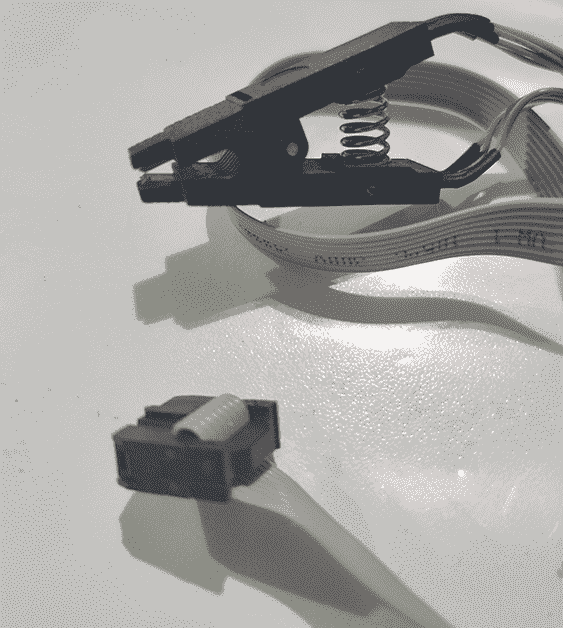

图 8-1：八针 SOIC 电缆

你还需要一个 USB 转串行接口。虽然你可以使用第七章中使用的适配器，但我们推荐使用*总线海盗*（[`dangerousprototypes.com/docs/Bus_Pirate`](http://dangerousprototypes.com/docs/Bus_Pirate)），这是一款强大的开源设备，支持多种协议。它内置了适用于物联网攻击的宏命令，包括 I²C 和许多其他协议的扫描和嗅探功能。你还可以尝试一些更昂贵的工具，它们可以解析 I²C 消息的更多格式，比如 Beagle（[`www.totalphase.com/products/beagle-i2cspi/`](https://www.totalphase.com/products/beagle-i2cspi/)）或 Aardvark（[`www.totalphase.com/products/aardvark-i2cspi/`](https://www.totalphase.com/products/aardvark-i2cspi/)）。在本章中，你将学习如何使用总线海盗的内置宏命令执行常见的攻击。

此外，要在本章后续进行 I²C 实验，你将需要一个 Arduino Uno ([`store.arduino.cc/usa/arduino-uno-rev3/`](https://store.arduino.cc/usa/arduino-uno-rev3/))，至少一个 BlinkM LED ([`www.sparkfun.com/products/8579/`](https://www.sparkfun.com/products/8579/))，一个面包板以及一些跳线。

你也可以使用帮助工具（如 Helping Hands）来帮助你固定多个硬件部件。它们的价格范围较广。有关工具的完整清单，以及它们的一些优缺点的描述，请参考《物联网黑客工具》一章。

## SPI

SPI 是一种在外设和微控制器之间传输数据的通信协议。它广泛应用于 Raspberry Pi 和 Arduino 等流行硬件，是一种 *同步通信协议*，这意味着它比 I²C 和 UART 传输数据更快。通常，它用于短距离通信场景，在那些读写速度至关重要的地方，比如以太网外设、LCD 显示器、SD 卡读卡器以及几乎所有物联网设备上的存储芯片。

### SPI 工作原理

SPI 使用四根线路来传输数据。在全双工模式下，当数据在两个方向上同时传输时，它依赖于控制器-外设架构。在这种架构中，作为 *控制器* 的设备生成并控制时钟，调节数据传输，所有作为 *外设* 的设备则监听并发送消息。SPI 使用以下四条线路（不包括地线）：

1.  **控制器输入，外设输出 (CIPO)** 用于外设向控制器发送的消息

1.  **控制器输出，外设输入 (COPI)** 用于控制器向外设发送的消息

1.  **串行时钟 (SCK)** 用于指示设备何时应该读取数据线的振荡信号

1.  **芯片选择 (CS)** 用于选择应该接收通信的外设

请注意，与 UART 不同，SPI 使用独立的线路来发送和接收数据（分别为 *COPI* 和 *CIPO*）。还要注意，实现 SPI 所需的硬件比 UART 更便宜、更简单，并且能够达到更高的数据传输速率。正因为这些原因，许多物联网领域使用的微控制器都支持 SPI。你可以在 [`learn.sparkfun.com/tutorials/serial-peripheral-interface-spi/all/.`](https://learn.sparkfun.com/tutorials/serial-peripheral-interface-spi/all/.) 上了解更多关于 SPI 实现的信息。

### 使用 SPI 转储 EEPROM 闪存芯片

闪存芯片通常包含设备的固件以及其他重要的机密信息，因此从中提取数据可能会发现有趣的安全问题，例如后门、加密密钥、秘密账户等。要定位物联网设备中的内存芯片，打开其外壳并取下 PCB。

#### 确定芯片和引脚

找到你设备的闪存芯片。经过安全加固的产品通常会删除设备上的芯片标签，但闪存芯片通常有 8 或 16 个引脚。你也可以通过查找微控制器的数据手册来找到芯片，就像我们在第七章中做的那样。数据手册应包含一张显示引脚配置和描述的图表。数据手册还可能包含确认芯片是否支持 SPI 的信息。其他信息，如协议版本、支持的速度和存储大小，在配置与 SPI 交互的工具时也非常有用。

一旦你识别出内存芯片，找到芯片一个角落上的小点，它标示了引脚 #1（见图 8-2）。

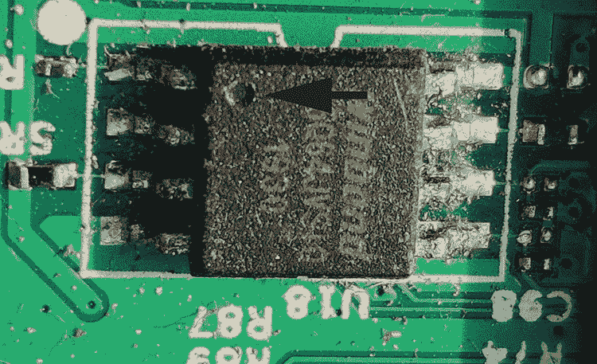

图 8-2: 闪存芯片

现在，将八引脚 SOIC 电缆的第一个引脚连接到引脚 #1。SOIC 夹具的第一个引脚通常与其他引脚颜色不同，便于识别。使用从数据手册中获取的引脚配置来正确对齐其余的 SOIC 垫片。图 8-3 显示了一个常见的对齐方式。例如，WinBond 25Q64 闪存芯片就使用这种对齐方式。

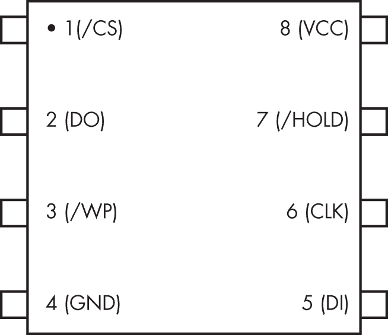

图 8-3: 内存芯片的引脚配置图

当你将 SOIC 夹具的所有部分连接到闪存芯片时，设置应该像图 8-4 所示。连接 SOIC 夹具时要小心，因为你很容易损坏引脚。

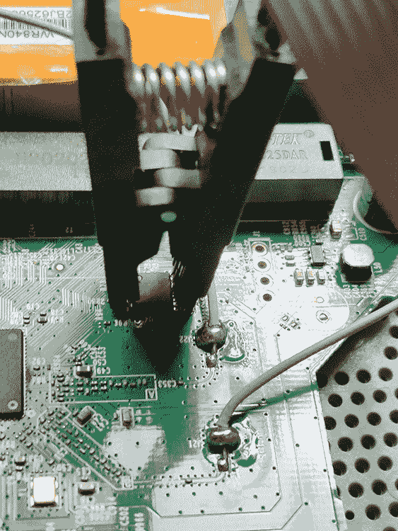

图 8-4: SOIC 夹具连接到闪存芯片

如果你在对齐垫片时遇到困难，测试钩夹（见图 8-5）也能派上用场；你可能会发现它们更容易连接。

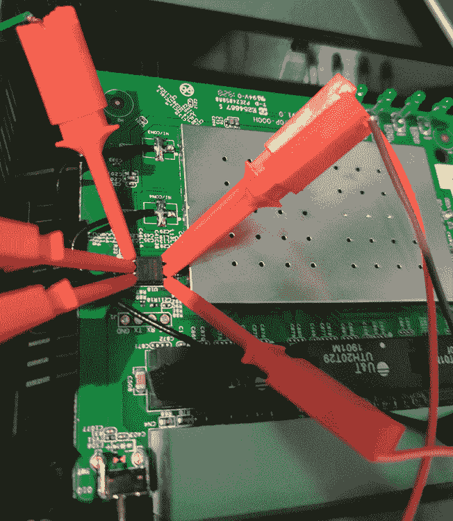

图 8-5: 钩夹连接到 SPI 引脚

#### 与 SPI 芯片通信

你需要一个 USB 到串行适配器来读取内存芯片的内容。我们在这个示例中使用总线海盗，但你也可以使用任何适配器，因为大多数适配器都支持读取操作。如果使用总线海盗，请确保将其固件升级到最新的稳定版本。

确保你正在提取内存的设备已关闭电源，然后进行连接。使用 SOIC 夹具连接总线海盗的引脚和芯片的引脚，如数据手册所示。例如，我们将按照表 8-1 中所示连接 WinBond 25Q64 芯片的引脚。

表 8-1: 引脚连接

| **设备/总线海盗** |
| --- |
| 引脚 #1 (CS) → CS |
| 引脚 #2 (DO) → CIPO (MISO) |
| 引脚 #4 (GND) → GND |
| 引脚 #5 (DI) → COPI (MOSI) |
| 引脚 #6 (CLK) → CLK |
| 引脚 #8 (VCC) → 3V3 |

当你完成连接时，连接应该像图 8-6 中所示。

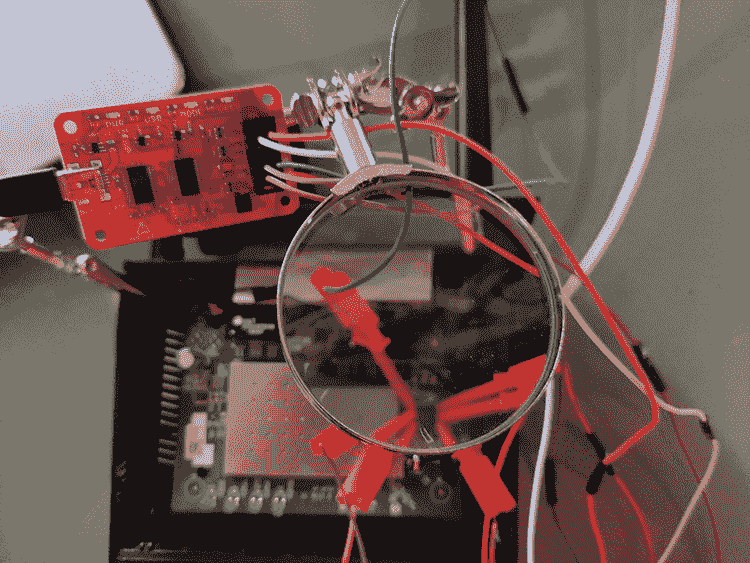

图 8-6: 总线海盗通过钩夹连接到 SPI 芯片。我们使用了帮助工具来固定不同的组件。

现在，在您将读取其存储器的设备关闭电源的情况下，将 Bus Pirate 的 USB 电缆连接到计算机上。您可以使用`flashrom` Linux 实用程序测试与 SPI 芯片的通信，该实用程序可以从[`flashrom.org/Flashrom`](https://flashrom.org/Flashrom)（或大多数包管理器）下载。以下命令将识别内存芯片组：

```
*#***flashrom -p buspirate_spi:dev=/dev/**`ttyUSB0`
```

确保您用 USB 到串行适配器分配的设备描述符替换`ttyUSB0`。通常会是类似于`ttyUSB`*<number>*的内容，并且您可以使用`ls /dev/tty*`命令查看系统上的描述符。该实用程序将识别 SPI 芯片或返回消息`未找到 EEPROM/闪存设备`。

#### 读取内存芯片内容

一旦与芯片建立了通信，您就可以执行读操作来获取其内容。使用以下`flashrom`命令发出读操作：

```
# **flashrom** **-p** **buspirate_****spi:dev****=/dev/**`ttyUSB0` **-r** **out.bin**
```

`-r`标志发出将内容保存在指定文件中的读操作。`-p`标志指定适配器的名称。在此上下文中，Bus Pirate 的名称是`buspirate_spi`，但如果您使用其他适配器，则应更改此名称。您应该看到类似以下的输出：

```
Found Winbond flash chip “W25Q64.V” (8192 kB, SPI).
Block protection is disabled.
Reading flash…
```

命令运行完成后，输出文件应与命令输出中列出的芯片存储大小匹配。对于这个芯片组，它是 8MB。

或者，您可以使用来自 libmpsse 的流行*spiflash.py*脚本获取芯片的内容。从[`github.com/devttys0/libmpsse/`](https://github.com/devttys0/libmpsse/)下载该库，这是由 devttys0 创建的，然后编译并安装它：

```
# **cd libmpsse**
# **./configure && make**
# **make install**
```

如果一切正常，您应该能够运行*spiflash.py*。为确保工具正确检测到芯片并且所有引脚连接正确，执行*spiflash.py*并查看输出中的芯片组名称。要提取存储在芯片中的内存，请输入以下命令：

```
# **spiflash.py -r** **out.bin** **-s** ***<size to read>*** 
```

例如，要读取 8MB，请运行以下命令：

```
# **spiflash.py -r** **out.bin** **-s $((0x800000))**
```

如果您不知道要提取的闪存存储器的大小，请选择一个足够大以容纳整个闪存内容的随机值。

现在您已提取了闪存，可以运行`strings`实用程序开始查看信息，或者使用 binwalk 等工具进行进一步分析。您可以在第九章了解更多有关固件安全测试的信息。

## I²C

发音为“I squared C”，*I²C*是一种用于低速设备的串行通信协议。菲利浦半导体在 1980 年代开发了 I²C，用于同一电路板上组件之间的通信，但您也可以在通过电缆连接的组件之间使用它。在物联网世界中，您经常会在微控制器、键盘和按钮等 I/O 接口、常见家庭和企业设备以及各种类型的传感器中找到它。至关重要的是，许多工业控制系统（ICS）中的传感器甚至使用 I²C，因此其利用非常重要。

该协议的主要优点是其简单性。与 SPI 使用的四条线路不同，I²C 具有两线接口。此外，该协议允许没有内置 I²C 支持的硬件通过通用 I/O 引脚使用 I²C。但由于其简单性，以及所有数据都通过同一总线传输，它也成为了一个容易被窃听或注入数据的目标。原因在于 IoT 设备之间共享同一 I²C 总线时，组件之间没有进行认证。

### I²C 工作原理

I²C 的简单性允许硬件交换数据，而无需严格的速度要求。该协议使用三条线路：串行数据线（SDA）用于传输数据，串行时钟线（SCL）用于确定数据何时读取，以及地线（GND）。SDA 和 SCL 线路连接到外设，它们是 *开漏驱动器*，意味着这两条线路需要连接到电阻器。（每条线路只需要一个电阻器，而不是每个外设一个。）电压从 1.8 V、3.3 V 和 5.0 V 不等，传输可以以四种不同的速度进行：100 kHz，即 I²C 规范中的初始速度；400 kHz，即快速模式；1 MHz，即高速模式；和 3.2 MHz，即超高速模式。

像 SPI 一样，I²C 使用控制器-外设配置。组件通过 SDA 线路逐位传输数据，按八位序列进行传输。控制器或多个控制器管理 SCL 线路。I²C 架构支持多个控制器和一个或多个外设，每个外设都有唯一的地址用于通信。表 8-2 显示了从控制器发送到外设的消息结构。

表 8-2：通过 SDA 发送到外设的 I²C 消息

| 启动 | I²C 地址（7 位或 10 位） | 读/写位 | ACK/NACK 位 | 数据（8 位） | ACK/NACK 位 | 数据（8 位） | 停止 |
| --- | --- | --- | --- | --- | --- | --- | --- |

控制器以启动条件开始每条消息，表示消息的开始。然后它发送外设的地址，通常为 7 位长，但也可以长达 10 位。这允许最多 128 个（如果使用 7 位地址）或 1024 个（如果使用 10 位地址）外设在同一总线上。控制器还会附加一个读/写位，指示执行何种操作。一个 ACK/NACK 位指示接下来数据段的类型。SPI 将实际数据分为八位序列，每个序列后跟一个 ACK/NACK 位。控制器通过发送停止条件来结束消息。有关协议的更多信息，请访问 [`www.i2c-bus.org/.`](https://www.i2c-bus.org/)

如前所述，I²C 协议支持多个控制器在同一总线上。这一点非常重要，因为通过连接到总线，我们可以充当另一个控制器，然后读取和发送数据到外设。在下一节中，我们将设置我们自己的 I²C 总线架构，以便可以实现这一目标。

### 设置控制器-外设 I²C 总线架构

为了演示如何嗅探 I²C 通信并向总线上的外设写入数据，让我们通过以下开源硬件的帮助设置一个经典的控制器-外设架构：

+   Arduino Uno 微控制器([`store.arduino.cc/usa/arduino-uno-rev3/`](https://store.arduino.cc/usa/arduino-uno-rev3/))*作为控制器。

+   一个或多个 BlinkM I²C 控制的 RGB LED（[`www.sparkfun.com/products/8579/`](https://www.sparkfun.com/products/8579/)）作为外设。你可以在[`thingm.com/products/blinkm/`](https://thingm.com/products/blinkm/)找到完整的 BlinkM 文档，包括其他编程方法的示例。

我们选择使用 Arduino Uno，因为它用于 SDA 和 SCL 的模拟引脚内置了电阻，因此我们不需要在电路中添加上拉电阻。同时，这也使我们能够使用 Arduino 的官方*Wire*库来管理 I²C 总线作为控制器，并向 I²C 外设发送命令。表 8-3 列出了支持 I²C 的 Arduino Uno 模拟引脚。

表 8-3：用于 I²C 通信的 Arduino Uno 引脚

| **Arduino 模拟引脚** | **I²C 引脚** |
| --- | --- |
| A2 | GND |
| A3 | PWR |
| A4 | SDA |
| A5 | SCL |

识别 Arduino Uno 上的 A2、A3、A4 和 A5 引脚，然后将公对公的杜邦线连接到它们，如图 8-7 所示。

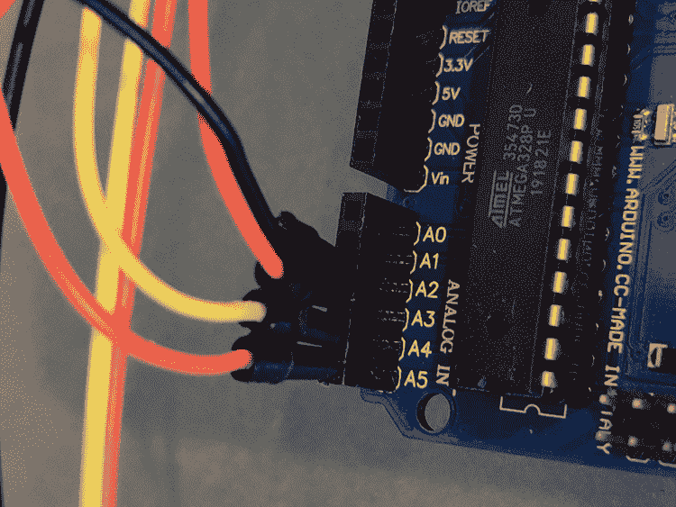

图 8-7：Arduino Uno 的模拟引脚位于右下角。

接下来，通过检查每个引脚顶部的标签，识别 BlinkM LED 上的 GND（-）、PWR（+）、SDA（d）和 SCL（c）引脚，如图 8-8 所示。

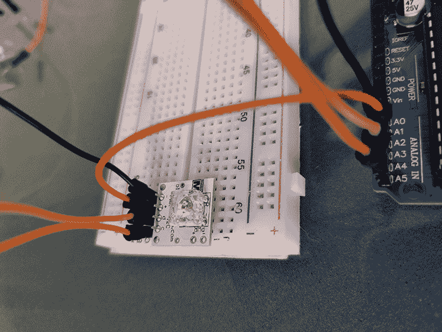

图 8-8：BlinkM 的 GND、PWR、数据和时钟引脚已清晰标注。

现在，使用面包板将 BlinkM LED 和电缆连接到 Arduino 上的相应引脚，如所述。

表 8-4：Arduino/BlinkM 连接

| **Arduino Uno/BlinkM RGB LED** |
| --- |
| 引脚 A2（GND）→ PWR - |
| 引脚 A3（PWR）→ PWR + |
| 引脚 A4（SDA）→ d（数据） |
| 引脚 A5（SCL）→ c（时钟） |

图 8-9 展示了这些连接。


图 8-9：我们可以在没有电阻的情况下连接 SDA 和 SCL，因为 Arduino 引脚包括内置电阻。

如果你有多个 I²C 外设，将它们连接到相同的 SDA 和 SCL 线路上。为 SDA 选择面包板上的一条线路，为 SCL 选择另一条线路；然后将设备连接到这些线路。例如，图 8-10 展示了两个连接的 BlinkM。相同类型的 BlinkM LED 默认情况下都配有相同的 I²C 地址（0x09），该地址是可编程的，如产品数据表中所示，数据表可在[`www.infinite-electronic.kr/datasheet/e0-COM-09000.pdf`](https://www.infinite-electronic.kr/datasheet/e0-COM-09000.pdf)获取。（这说明了为什么你应该始终查阅数据表，如果它可用；你找到的信息可能会帮助你节省反向工程的时间。在黑盒评估中，你可能不会那么幸运。）

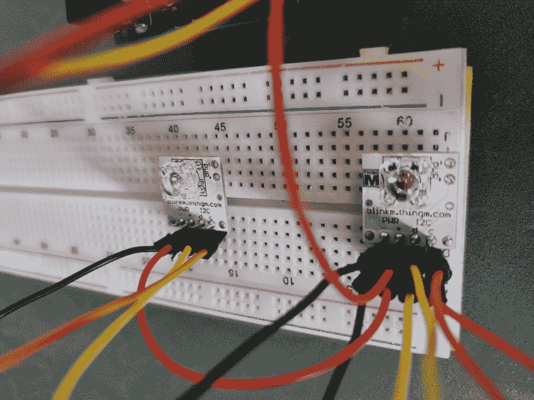

图 8-10：一个 I²C 总线最多支持 128 个带有 7 位地址的外设。

一旦你连接好控制器（Arduino）和外设（BlinkM LED），就可以编写程序让 Arduino 加入总线并向外设发送一些命令。我们将使用 Arduino IDE 来编写程序。有关 Arduino 的介绍以及安装说明，请参见第七章。在 IDE 中，通过点击**工具**▶**板子**▶**Arduino/Genuino UNO**来选择你使用的 Arduino 板子，然后上传清单 8-1 中的代码。

```
#include <Wire.h>

void setup() {
  1 pinMode(13, OUTPUT); //Disables Arduino LED
  pinMode(A3, OUTPUT); //Sets pin A3 as OUTPUT
  pinMode(A2, OUTPUT); //Sets pin A2 as OUTPUT
  digitalWrite(A3, HIGH); //A3 is PWR 
  digitalWrite(A2, LOW); //A2 is GND
  2 Wire.begin(); // Join I²C bus as the controller
}

byte x = 0; 

void loop() {
  3 Wire.beginTransmission(0x09);4 Wire.write('c'); 
  Wire.write(0xff); 
  Wire.write(0xc4); 
  5 Wire.endTransmission();

 x++;
  delay(5000);
} 
```

清单 8-1：将管理 BlinkM RGB LED 的 I²C 控制器代码

这段代码配置了 Arduino 引脚以进行 I²C 通信 1，作为控制器加入 I²C 总线 2，并通过循环定期向地址为 0x09 的外设发送消息 3。消息中包含点亮 LED 的命令 4。你可以在 BlinkM 的数据表中找到这些命令的详细描述。最后，代码发送一个 STOP 序列，表示消息的结束 5。

现在将 Arduino Uno 连接到计算机，以为电路供电并上传你的代码。BlinkM RGB LED 应接收命令并相应地闪烁（图 8-11）。

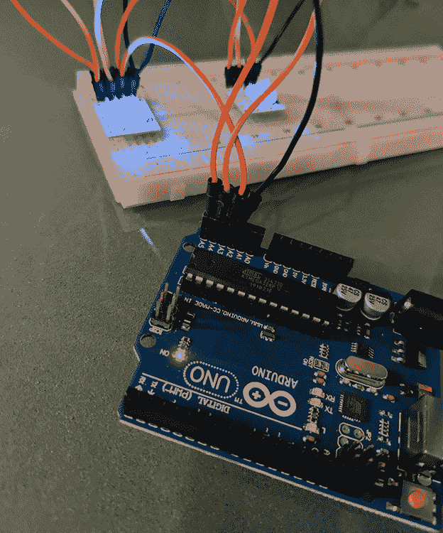

图 8-11：BlinkM LED 通过 I²C 接收来自 Arduino Uno 的信号

### 使用 Bus Pirate 攻击 I²C

让我们将 Bus Pirate 连接到 I²C 总线并开始嗅探通信。Bus Pirate 的固件内置了对 I²C 的支持。它还提供了一些有用的宏，供我们分析和攻击 I²C 通信。

我们将使用 Bus Pirate 上的以下引脚：COPI（MOSI），它对应于 I²C 的 SDA 引脚；CLK，它对应于 SCL 引脚；以及 GND。通过跳线将这三条线路从 Bus Pirate 连接到 I²C 总线（表 8-5）。

表 8-5：从 Bus Pirate 到 I²C 总线的连接

| **Bus Pirate/面包板** |
| --- |
| COPI (MOSI) → SDA |
| CLK → SCL |
| GND → GND |

一旦所有引脚都连接好，将总线 Pirate 插入计算机。要与其交互，您需要通过默认速度 115,200 波特率将其连接到串行通信（COM）端口。在 Linux 上，可以使用 `screen` 或 `minicom` 实用工具来完成此操作：

```
$ **screen /dev/**`ttyUSB0` **115200**
```

在 Windows 上，打开设备管理器查看 COM 端口号。然后使用 PuTTY，按照图 8-12 中的配置进行设置。

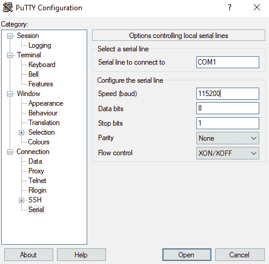

图 8-12：配置 PuTTY 以连接到总线 Pirate

设置完 PuTTY 配置后，点击 **Open**。此时，您应该已经建立了连接。

#### 检测 I²C 设备

要列举所有连接到总线的 I²C 设备，请使用总线 Pirate 的 *I*²*C* 库搜索整个地址空间。这将列出所有连接的 I²C 芯片，以及未记录的访问地址。我们首先使用 `m` 命令设置总线 Pirate 的模式：

```
I2C>**m**
1\. HiZ
2\. 1-WIRE
3\. UART
4\. I2C
5\. SPI
6\. 2WIRE
7\. 3WIRE
8\. LCD
9\. DIO
x. exit(without change)
```

选择 `4` 来选择 I²C 模式，然后设置所需的速度：

```
(1)>**4**
Set speed:
 1\. ~5KHz
 2\. ~50KHz
 3\. ~100KHz
 4\. ~400KHz

(1)>**4**
Ready
```

我们设置了 `4`**，**对应大约 400 kHz，即 I²C 快速速率，因为控制器 Arduino Uno 以该速度运行。

*I*²*C* 库支持两个宏。第一个是 *地址搜索宏*，它将自动尝试每个 I²C 地址。然后它会查找响应，以确定连接了多少外设，并检查是否可以使用其他地址，例如广播地址。通过输入 `(1)` 宏命令执行该宏：

```
I2C>**(****1)**
Searching I2C address space. Found devices at:
0x00(0x00 W) 0xFF(0x7F R)
```

此宏显示地址，后跟 7 位地址以及一个比特位，指示该地址是用于读取还是写入。在这种情况下，我们看到地址 0x00(W)，这是 BlinkM 广播地址，和 0x7F，属于 BlinkM LED。

#### 嗅探和发送消息

内置于总线 Pirate *I*²*C* 库中的第二个宏是嗅探器。此宏显示所有 `START/STOP` 序列、`ACK/NACK` 比特和通过 I²C 总线共享的数据。同样，我们需要将总线 Pirate 设置为 I²C 模式，选择速度，然后使用命令 `(2)` 执行第二个宏：

```
I2C>**(****2)**
Sniffer
Any key to exit
[0x12][0x12+0x63+]][0x12+0x63+0xFF+0xC4+][0x12+0x63+]][0x12+0x63+]][0x12+0x63+]][0x12+0x63+]][0x12+0x63+0xFF+0xC4+][0x12+0x63+0xFF+0xC4+][0x12+0xC6-0xFD-][0x12+0x63+0xFF+]]
```

捕获的数据以总线 Pirate 用于 I²C 的消息格式显示在屏幕上，允许我们复制并粘贴该消息以进行重播（如果需要）。表 8-6 显示了总线 Pirate 用于表示 I²C 字符的语法。

表 8-6：总线 Pirate 符号对应的 I²C 消息组件

| **I²C 字符** | **总线 Pirate 符号** |
| --- | --- |
| START 序列 | [ 或 { |
| STOP 序列 | ] 或 } |
| ACK | + |
| NACK | - |

通过将嗅探器数据与 Arduino Uno 发送的数据进行对比，验证嗅探器是否工作正常。

现在，要向总线上任何外设发送数据，可以直接在总线 Pirate 提示符中输入消息，或复制任何您想要重播的消息。我们可以看到更改颜色的命令结构，通过查看数据表，我们可以推断其结构。现在我们可以通过重播该命令来进行测试：

```
I2C>**[0x12+0x63+0xFF+0xC4+]**
I2C START BIT
WRITE: 0x12 NACK
WRITE: 0x63 NACK
WRITE: 0xFF NACK
WRITE: 0xC4 NACK
I2C STOP BIT
```

输出显示了你在总线上写入的序列比特和数据。分析你自己设备上的总线流量，以识别模式，然后尝试发送你自己的命令。如果你使用了本章中展示的 I²C 总线演示，可以在 BlinkM 的数据表中找到更多有效的命令。

重放此命令的风险相对较低；我们只是以模式闪烁灯光。但在现实世界的攻击中，你可以使用相同的技术来写入 MAC 地址、标志或出厂设置，包括序列号。采用与我们在这里使用的相同方法，你应该能够识别任何 IoT 设备上的 I²C 总线，然后分析组件之间的通信，以读取和发送你自己的数据。此外，由于该协议的简单性，几乎所有类型的设备都可能会使用它。

## 结论

本章中，你了解了两种在 IoT 设备硬件层面上最常见的协议：SPI 和 I²C。高速外设很可能实现 SPI，而 I²C 甚至可以在那些设计上没有嵌入 I²C 的微控制器中实现，原因在于它的简单性和低廉的硬件要求。我们讨论的技术和工具可以帮助你拆解设备并分析它们，以了解其功能并识别安全弱点。在本章中，我们使用了 Bus Pirate，这是许多用于与 SPI 和 I²C 交互的优秀工具之一。这个开源板卡对大多数 IoT 通信协议提供了强大的支持，包括内置宏来分析和攻击各种 IoT 设备。
