# 低功耗蓝牙


*低功耗蓝牙（BLE）* 是蓝牙无线技术的一种版本，物联网设备经常使用它，因为其低功耗消耗和比之前版本更简单的配对过程。但 BLE 也能保持相似，甚至更大的通信范围。你可以在各种设备中找到它，从常见的健康小工具，如智能手表或智能水瓶，到关键的医疗设备，如胰岛素泵和心脏起搏器。在工业环境中，你会看到它被应用在各种传感器、节点和网关中。它甚至被用于军事中，其中武器组件，如步枪瞄准镜，通过蓝牙远程操作。当然，这些设备已经被黑客攻击过。

这些设备使用蓝牙技术，利用该无线通信协议的简单性和稳健性，但这样做会增加设备的攻击面。在本章中，你将学习 BLE 通信的工作原理，探索与 BLE 设备通信的常见硬件和软件，并掌握有效识别和利用安全漏洞的技巧。你将使用 ESP32 开发板搭建实验室，并逐步完成为 BLE 专门设计的高级抓旗（CTF）练习的各个关卡。阅读完本章后，你应该能够应对该 CTF 实验室中的一些未解难题。

## BLE 工作原理

BLE 的功耗远低于传统蓝牙，但它能非常高效地传输少量数据。自蓝牙 4.0 规范发布以来，BLE 只使用 40 个频道，覆盖 2400 到 2483.5 MHz 的范围。相比之下，传统蓝牙使用该范围内的 79 个频道。

尽管每个应用都以不同的方式使用这项技术，但 BLE 设备最常见的通信方式是通过发送广告数据包。这些数据包，也被称为*信标*，将 BLE 设备的存在广播给其他附近的设备（图 11-1）。这些信标有时也会发送数据。

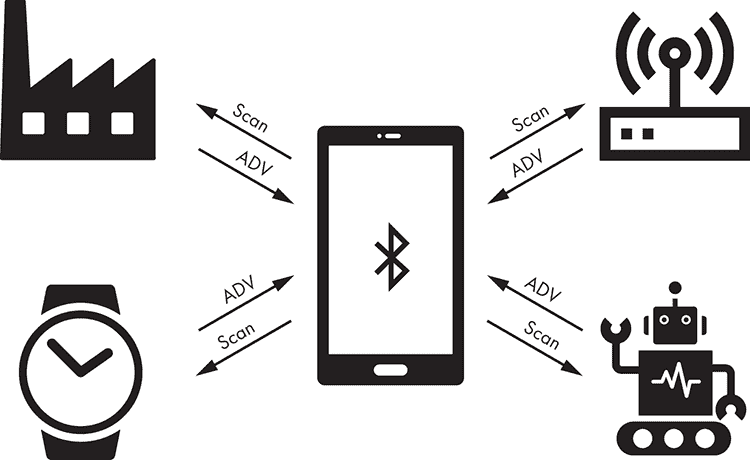

图 11-1：BLE 设备发送广告数据包以发起 SCAN 请求。

为了减少功耗，BLE 设备只在需要连接和交换数据时发送广告数据包；其他时间它们会进入休眠状态。监听设备，也叫做*中央设备*，可以对广告数据包做出响应，发送特定给广告设备的*SCAN 请求*。该扫描响应使用与广告数据包相同的结构，包含初始广告请求中未能包含的附加信息，例如完整的设备名称或厂商需要的其他信息。

图 11-2 展示了 BLE 的数据包结构。

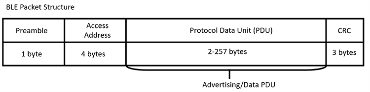

图 11-2：BLE 的数据包结构

前导字节用于同步频率，而四字节的访问地址是连接标识符，用于多个设备尝试在相同频道上建立连接的场景。接下来，协议数据单元（PDU）包含广告数据。PDU 有几种类型；最常用的是 ADV_NONCONN_IND 和 ADV_IND。如果设备不接受连接，它们使用 ADV_NONCONN_IND 类型的 PDU，只在广告数据包中传输数据。如果设备允许连接并且连接已建立，它们将停止发送广告数据包并使用 ADV_IND 类型。图 11-3 展示了 Wireshark 捕获中的 ADV_IND 数据包。

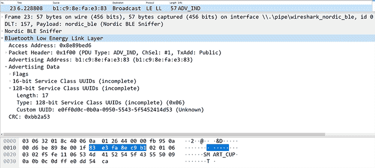

图 11-3：Wireshark 显示树，展示了类型为 ADV_IND 的 BLE 广告数据包

使用的数据包类型取决于 BLE 实现和项目要求。例如，你会在智能物联网设备中找到 ADV_IND 数据包，比如智能水瓶或手表，因为这些设备在执行进一步操作之前会先寻求与中央设备的连接。另一方面，你可能会在信标中找到 ADV_NONCONN_IND 数据包，用于检测物体与安装在各种设备中的传感器的接近程度。

### 通用访问配置文件与通用属性配置文件

所有 BLE 设备都有一个*通用访问配置文件 (GAP)*，它定义了设备如何连接到其他设备、与之通信并通过广播使自己可供发现。外设设备只能连接一个中央设备，而中央设备则可以连接到中央设备能够支持的多个外设设备。建立连接后，外设不再接受任何其他连接。对于每个连接，外设会间隔一定时间发送广告探测包，使用三种不同的频率，直到中央设备响应并且外设确认响应，表明它准备好开始连接。

*通用属性配置文件 (GATT)* 定义了设备应如何格式化和传输数据。当你分析一个 BLE 设备的攻击面时，通常会集中关注 GATT（或多个 GATT），因为这是设备功能被触发的方式，以及数据是如何存储、分组和修改的。GATT 列出了设备的特性、描述符和服务，以 16 位或 32 位值的形式展示在表格中。*特性*是中央设备与外设之间传输的数据值。这些特性可以有*描述符*，提供有关它们的附加信息。当特性与执行特定操作相关时，它们通常会被分组在服务中。*服务*可以包含多个特性，如图 11-4 所示。

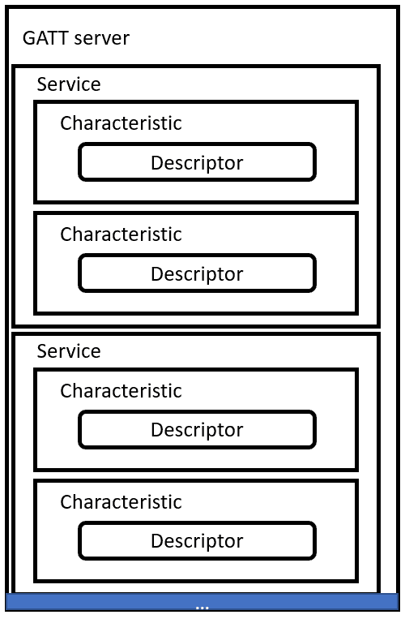

图 11-4：GATT 服务器结构由服务、特性和描述符组成。

## 使用 BLE

在本节中，我们将介绍与 BLE 设备通信所需的硬件和软件。我们将向你介绍可以用来建立 BLE 连接的硬件，以及与其他设备交互的软件。

### BLE 硬件

你可以选择各种硬件来与 BLE 交互。如果只是简单地发送和接收数据，集成接口或便宜的 BLE USB 加密狗可能就足够了。但如果要嗅探并进行低级协议破解，你需要更强大的设备。这些设备的价格差异很大；你可以在“物联网黑客工具”一节中找到与 BLE 交互的硬件清单。

在本章中，我们将使用 Espressif Systems 的 ESP32 WROOM 开发板（[`www.espressif.com/`](https://www.espressif.com/)），该开发板支持 2.4 GHz Wi-Fi 和 BLE（图 11-5）。

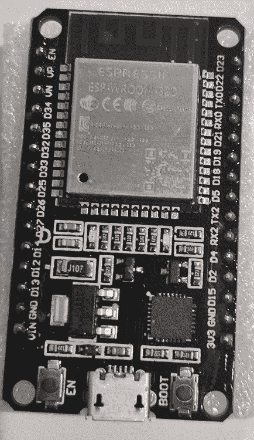

图 11-5：ESP32 WROOM 开发板

它具有嵌入式闪存，并且可以通过微型 USB 电缆进行编程和供电。它非常紧凑且价格实惠，天线范围对于其尺寸来说相当不错。你还可以为其他攻击编程它，比如对 Wi-Fi 的攻击。

### BlueZ

根据你使用的设备，你可能需要安装所需的固件或驱动程序，以便软件能够被识别并正常工作。在 Linux 中，你很可能会使用*BlueZ*，官方的蓝牙协议栈，尽管一些适配器如 Broadcom 或 Realtek 也有专有驱动程序。我们将在本节中介绍的工具都能与 BlueZ 即插即用。

如果你遇到 BlueZ 问题，请确保安装最新版本，访问[`www.bluez.org/download/`](http://www.bluez.org/download/)，因为你可能在使用 Linux 发行版的软件包管理器中预装的早期版本。

### 配置 BLE 接口

*Hciconfig* 是一个 Linux 工具，可以用来配置和测试你的 BLE 连接。如果你在没有任何参数的情况下运行 Hciconfig，你应该能够看到你的蓝牙接口。你还应该看到状态 `UP` 或 `DOWN`，表示蓝牙适配器接口是否启用：

```
# hciconfig
hci0:    Type: Primary  Bus: USB
         BD Address: 00:1A:7D:DA:71:13  ACL MTU: 310:10  SCO MTU: 64:8
         UP RUNNING 
         RX bytes:1280 acl:0 sco:0 events:66 errors:0
         TX bytes:3656 acl:0 sco:0 commands:50 errors:0
```

如果你没有看到你的接口，确保驱动程序已加载。在 Linux 系统中，内核模块名应该是 `bluetooth`。使用 `modprobe` 命令并加上 `-c` 选项查看模块配置：

```
# modprobe -c bluetooth
```

你还可以尝试通过以下命令关闭接口再重新启动：

```
# hciconfig hci0 down && hciconfig hci0 up
```

如果这样不行，尝试重置它：

```
# hciconfig hci0 reset
```

你还可以使用 `-a` 选项列出更多信息：

```
# hciconfig hci0 -a
hci0:    Type: Primary  Bus: USB
         BD Address: 00:1A:7D:DA:71:13  ACL MTU: 310:10  SCO MTU: 64:8
         UP RUNNING 
         RX bytes:17725 acl:0 sco:0 events:593 errors:0
         TX bytes:805 acl:0 sco:0 commands:72 errors:0
         Features: 0xff 0xff 0x8f 0xfe 0xdb 0xff 0x5b 0x87
         Packet type: DM1 DM3 DM5 DH1 DH3 DH5 HV1 HV2 HV3 
         Link policy: RSWITCH HOLD SNIFF PARK 
         Link mode: SLAVE ACCEPT 
         Name: 'CSR8510 A10'
         Class: 0x000000
         Service Classes: Unspecified
         Device Class: Miscellaneous, 
 HCI Version: 4.0 (0x6)  Revision: 0x22bb
         LMP Version: 4.0 (0x6)  Subversion: 0x22bb
         Manufacturer: Cambridge Silicon Radio (10)
```

## 发现设备并列出特征

如果一个支持 BLE 的物联网设备没有得到适当保护，你可以拦截、分析、修改并重新传输其通信数据，以操控该设备的操作。总体而言，评估具有 BLE 的物联网设备的安全性时，你应该遵循以下过程：

1.  发现 BLE 设备地址

1.  枚举 GATT 服务器

1.  通过列出的特征、服务和属性识别它们的功能。

1.  通过读写操作来操控设备功能。

现在我们使用两个工具：GATTTool 和 Bettercap，来逐步演示这些步骤。

### GATTTool

*GATTTool* 是 BlueZ 的一部分。你将主要使用它进行一些操作，例如与另一设备建立连接、列出该设备的特征以及读取和写入其属性。运行 GATTTool 不带任何参数，可以查看支持的操作列表。

GATTTool 可以通过 `-I` 选项启动交互式 shell。以下命令设置 BLE 适配器接口，以便你可以连接到设备并列出其特征：

```
# gatttool -i hci0 -I
```

在交互式 shell 中，使用 `connect` `<mac 地址>` 命令建立连接；然后通过 `characteristics` 子命令列出特征：

```
[                 ][LE]> **connect 24:62:AB:B1:A8:3E** 
Attempting to connect to A4:CF:12:6C:B3:76
Connection successful
[A4:CF:12:6C:B3:76][LE]> **characteristics**
handle: 0x0002, char properties: 0x20, char value handle: 0x0003, uuid: 00002a05-0000-1000-8000-00805f9b34fb
handle: 0x0015, char properties: 0x02, char value handle: 0x0016, uuid: 00002a00-0000-1000-8000-00805f9b34fb
…
handle: 0x0055, char properties: 0x02, char value handle: 0x0056, uuid: 0000ff17-0000-1000-8000-00805f9b34fb
[A4:CF:12:6C:B3:76][LE]> exit
```

现在，我们已经获取到描述 BLE 设备支持的数据和操作的句柄、值和服务。

让我们使用 Bettercap 来分析这些信息，这是一个更强大的工具，能够以人类可读的格式展示信息。

### Bettercap

*Bettercap* ([`www.bettercap.org/`](https://www.bettercap.org/)) 是一款扫描和攻击 2.4 GHz 频率设备的工具。它提供了一个友好的界面（甚至是 GUI）和可扩展的模块，用于执行 BLE 扫描和攻击的最常见任务，如监听广播包和执行读/写操作。此外，你还可以使用它进行 Wi-Fi、HID 和其他技术的攻击，例如中间人攻击或其他战术。

Bettercap 默认安装在 Kali 中，并且可以通过大多数 Linux 包管理器获得。你可以通过以下命令从 Docker 安装并运行它：

```
# docker pull bettercap/bettercap
# docker run -it --privileged --net=host bettercap/bettercap -h
```

要发现 BLE 启用的设备，启用 BLE 模块并使用 `ble.recon` 选项开始捕获信标。在加载 Bettercap 时，使用 `--eval` 选项调用它会自动执行 Bettercap 命令：

```
# bettercap --eval “ble.recon on”
Bettercap v2.24.1 (built for linux amd64 with go1.11.6) [type ‘help’ for a list of commands]
192.168.1.6/24 > 192.168.1.159 >> [16:25:39] [ble.device.new] new BLE device BLECTF detected as A4:CF:12:6C:B3:76  -46 dBm
192.168.1.6/24 > 192.168.1.159 >> [16:25:39] [ble.device.new] new BLE device BLE_CTF_SCORE detected as 24:62:AB:B1:AB:3E  -33 dBm
192.168.1.6/24 > 192.168.1.159 >> [16:25:39] [ble.device.new] new BLE device detected as 48:1A:76:61:57:BA (Apple, Inc.)  -69 dBm
```

你应该能看到每个接收到的 BLE 广播包的一行。这些信息应该包括设备名称和 MAC 地址，你将需要这些信息来与设备建立通信。

如果你使用 `eval` 选项启动了 Bettercap，你可以自动记录所有已发现的设备。然后，你可以方便地使用 `ble.show` 命令列出已发现的设备及其相关信息，如 MAC 地址、厂商和标志（图 11-6）。

```
>> **ble.show**
```

注意，`ble.show` 命令的输出包含信号强度（RSSI）、我们将用于连接设备的广播 MAC 地址以及厂商信息，这些可以帮助我们猜测设备类型。它还显示了支持的协议组合、连接状态以及最后接收到的信标时间戳。

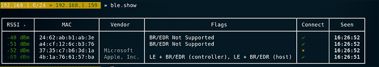

图 11-6：Bettercap 显示已发现的设备

### 枚举特征、服务和描述符

一旦我们识别出目标设备的 MAC 地址，就可以运行以下 Bettercap 命令。该命令会获得一个格式良好的表格，按服务将特性分组，显示其属性及可通过 GATT 访问的数据：

```
>> **ble.enum** `<mac addr>`
```

图 11-7 显示了结果表格。

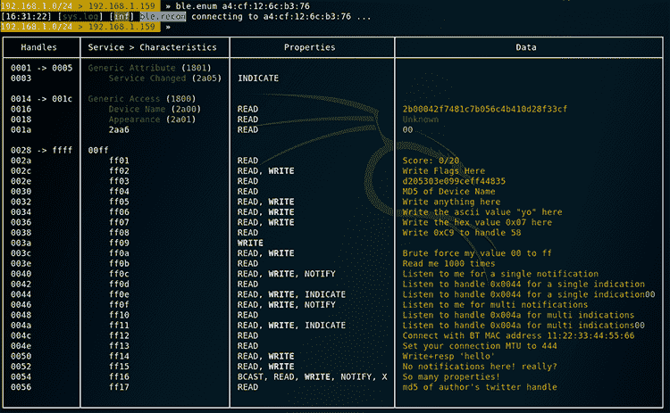

图 11-7：使用 Bettercap 枚举 GATT 服务器

在数据列中，我们可以看到这个 GATT 服务器是一个 CTF 仪表板，描述了不同的挑战，以及提交答案和检查分数的说明。

这是学习实际攻击的有趣方式。但在我们跳入解决一个挑战之前，确保你知道如何执行经典的读写操作。你将用这些操作进行侦察，并写入数据来改变设备的状态。当句柄允许这些操作时，WRITE 属性会被高亮显示；请密切注意支持这些操作的句柄，因为它们经常被配置错误。

### 读取和写入特性

在 BLE 中，UUID 唯一标识特性、服务和属性。一旦你知道某个特性的 UUID，就可以使用 `ble.write` Bettercap 命令向其写入数据：

```
>> **ble.write** `<MAC ADDR> <UUID> <HEX DATA>`
```

**你必须以十六进制格式发送所有数据。例如，要将单词“hello”写入特性 UUID ff06，你可以在 Bettercap 的交互式 shell 中发送以下命令：**

```
>> **ble.write** `<mac address of device>` **ff06 68656c6c6f**
```

你也可以使用 GATTTool 来读写数据。GATTTool 支持额外的输入格式来指定处理程序或 UUID。例如，要使用 GATTTool 发出 `write` 命令，而不是使用 Bettercap，可以使用以下命令：

```
# gatttool -i `<Bluetooth adapter interface>` **-b** `<MAC address of device>` **--char-write-req** `<characteristic handle> <value>`
```

现在，让我们用 GATTTool 来练习读取数据。从处理程序 0x16 获取设备名称。（这是协议预留的字段，用来表示设备名称。）

```
# gatttool -i <***Bluetooth adapter interface*****> -b <*****MAC address of device*****> --char-read -a 0x16**
# gatttool -b a4:cf:12:6c:b3:76 --char-read -a 0x16
Characteristic value/descriptor: 32 62 30 30 30 34 32 66 37 34 38 31 63 37 62 30 35 36 63 34 62 34 31 30 64 32 38 66 33 33 63 66
```

现在你可以发现设备，列出特性，并读写数据，尝试操控设备的功能。你已经准备好开始进行 BLE 黑客攻击了。

## BLE 黑客攻击

在本节中，我们将通过一个 CTF 来帮助你练习 BLE 黑客攻击：BLE CTF Infinity 项目（[`github.com/hackgnar/ble_ctf_infinity/`](https://github.com/hackgnar/ble_ctf_infinity/)）。解决 CTF 挑战需要使用基础和高级概念。这个 CTF 运行在 ESP32 WROOM 板上。

我们将使用 Bettercap 和 GATTTool，因为在某些任务中，一种工具往往比另一种工具更有效。通过解决这个 CTF 的实际挑战，你将学习如何探索未知设备，发现其功能并操控这些设备的状态。在继续之前，确保你已经按照 [`docs.espressif.com/projects/esp-idf/en/latest/get-started/`](https://docs.espressif.com/projects/esp-idf/en/latest/get-started/) 上的说明设置好你的开发环境和工具链。绝大多数步骤将按文档所述进行，但有一些我们稍后会提到的考虑事项。

### 设置 BLE CTF Infinity

为了构建 BLE CTF Infinity，我们建议使用 Linux 主机，因为 *make* 文件会对源代码执行一些额外的复制操作（如果你更喜欢在 Windows 上构建，可以自由编写 *CMakeLists.txt* 文件）。你需要的构建文件已包含在本书的资源中，地址为 [`nostarch.com/practical-iot-hacking/`](https://nostarch.com/practical-iot-hacking/)。要成功构建，你需要执行以下操作：

1.  在项目的 *root* 文件夹中创建一个名为 *main* 的空文件夹。

1.  执行 `make menuconfig`。确保你的串口设备已配置并启用蓝牙，并且编译器警告不会被视为错误。再次提醒，我们将为本书的构建提供 *sdkconfig* 文件。

1.  运行 `make codegen` 来运行 Python 脚本，该脚本将源文件复制到 *main* 文件夹中等操作。

1.  编辑文件 *main/flag_scoreboard.c*，并将变量 `string_total_flags[]` 从 `0` 更改为 `00`。

1.  运行 `make` 来构建 CTF，运行 `make flash` 来烧录板子。过程完成后，CTF 程序将自动启动。

一旦 CTF 启动，你应该能够在扫描时看到信标。另一种选择是通过与指定的串口（默认波特率为 115200）通信，并检查调试输出。

```
…
I (1059) BLE_CTF: create attribute table successfully, the number handle = 31

I (1059) BLE_CTF: SERVICE_START_EVT, status 0, service_handle 40
I (1069) BLE_CTF: advertising start successfully
```

### 入门

找到记分板，显示提交标志的句柄、导航挑战的句柄以及重置 CTF 的另一个句柄。然后使用你喜欢的工具列出特性（图 11-8）。

0030 句柄让你能够在挑战中进行导航。使用 Bettercap，将值 `0001` 写入该句柄以进入标志 #1：

```
>> **ble.write a4:cf:12:6c:b3:76 ff02 0001**
```

要使用 GATTTool 做同样的事情，请使用以下命令：

```
# gatttool -b a4:cf:12:6c:b3:76 --char-write-req -a 0x0030 -n 0001
```

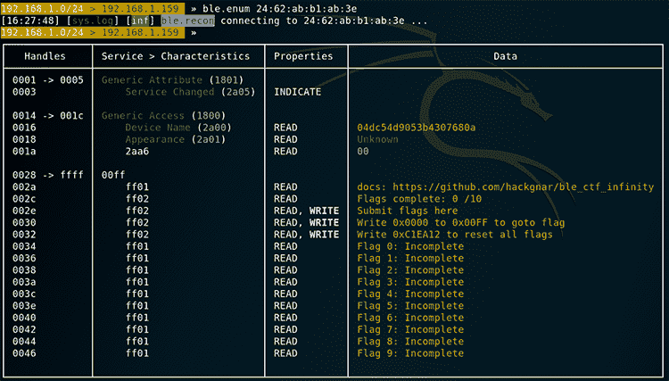

图 11-8：Bettercap 枚举 BLE CTF Infinity

一旦你写入了特性，信标名称将指示你正在查看 GATT 服务器上的标志 #1。例如，Bettercap 会显示类似以下的输出：

```
[ble.device.new] new BLE device FLAG_01 detected as A4:CF:12:6C:B3:76 -42 dBm
```

这将显示一个新的 GATT 表格，每个挑战一个。现在你已经熟悉了基本的导航，让我们回到记分板：

```
[a4:cf:12:6c:b3:76][LE]> **char-write-req 0x002e 0x1**
```

让我们从标志 #0 开始。通过将值 `0000` 写入 0x0030 句柄来导航到它：

```
# gatttool -b a4:cf:12:6c:b3:76 --char-write-req -a 0x0030 -n 0000
```

有趣的是，挑战 0 似乎仅仅是初始的 GATT 服务器显示记分板（图 11-9）。我们是不是错过了什么？

经过仔细观察，设备名称 04dc54d9053b4307680a 看起来像一个标志，对吧？让我们通过将设备名称作为答案提交到句柄 002e 来测试一下。请注意，如果使用 GATTTool，你需要以十六进制格式化它：

```
# gatttool -b a4:cf:12:6c:b3:76 --char-write-req -a 0x002e -n $(echo -n "04dc54d9053b4307680a"|xxd -ps)
Characteristic value was written successfully
```

当我们检查记分板时，我们看到它成功了，因为标志 0 显示为已完成。我们已经解决了第一个挑战。恭喜！

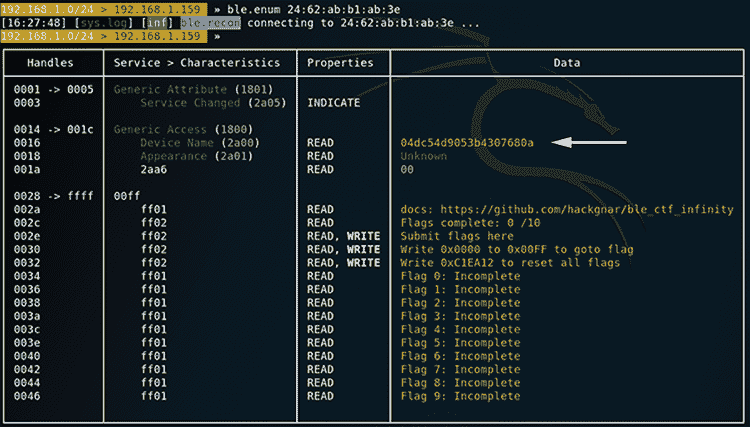

图 11-9：BLE CTF INFINITY 记分板的特性

### 标志 1：检查特性和描述符

现在使用以下命令导航到 FLAG_01：

```
# gatttool -b a4:cf:12:6c:b3:76 --char-write-req -a 0x0030 -n 0000
```

对于这个标志，我们再次从检查 GATT 表开始。让我们尝试使用 GATTTool 列出特征和描述符：

```
# gatttool -b a4:cf:12:6c:b3:76 -I
 [a4:cf:12:6c:b3:76][LE]> connect
Attempting to connect to a4:cf:12:6c:b3:76
Connection successful
[a4:cf:12:6c:b3:76][LE]> primary
attr handle: 0x0001, end grp handle: 0x0005 uuid: 00001801-0000-1000-8000-00805f9b34fb
attr handle: 0x0014, end grp handle: 0x001c uuid: 00001800-0000-1000-8000-00805f9b34fb
attr handle: 0x0028, end grp handle: 0xffff uuid: 000000ff-0000-1000-8000-00805f9b34fb
write-req   characteristics  
[a4:cf:12:6c:b3:76][LE]> char-read-hnd 0x0001
Characteristic value/descriptor: 01 18 
[a4:cf:12:6c:b3:76][LE]> char-read-hnd 0x0014
Characteristic value/descriptor: 00 18 
[a4:cf:12:6c:b3:76][LE]> char-read-hnd 0x0028
Characteristic value/descriptor: ff 00 
 [a4:cf:12:6c:b3:76][LE]> char-desc 
handle: 0x0001, uuid: 00002800-0000-1000-8000-00805f9b34fb
…
handle: 0x002e, uuid: 0000ff03-0000-1000-8000-00805f9b34fb
```

在检查每个描述符后，我们在句柄 0x002c 中发现一个类似标志的值。要读取句柄的描述符值，我们可以使用 `char-read-hnd` `<handle>` 命令，像这样：

```
**[a4:cf:12:6c:b3:76][LE]> char-read-hnd 0x002c**
Characteristic value/descriptor: 38 37 33 63 36 34 39 35 65 34 65 37 33 38 63 39 34 65 31 63
```

记住，输出是十六进制格式的，因此它对应的 ASCII 文本是 873c6495e4e738c94e1c。

我们找到了标志！返回到积分榜并提交新的标志，就像我们之前提交标志 0 一样：

```
# gatttool -b a4:cf:12:6c:b3:76 --char-write-req -a 0x002e -n $(echo -n "873c6495e4e738c94e1c"|xxd -ps)
Characteristic value was written successfully
```

我们也可以使用 bash 自动化发现这个标志。在这种情况下，我们将遍历各个处理程序以读取每个处理程序的值。我们可以轻松地将以下脚本重写为一个简单的模糊测试工具，它写入值而不是执行 `--char-read` 操作：

```
#!/bin/bash
for i in {1..46}
do
  VARX=`printf '%04x\n' $i`
  echo "Reading handle: $VARX"
  gatttool -b a4:cf:12:6c:b3:76 --char-read -a 0x$VARX
  sleep 5
done
```

当我们运行脚本时，我们应该从句柄中获取信息：

```
Reading handle: 0001
Characteristic value/descriptor: 01 18 
Reading handle: 0002
Characteristic value/descriptor: 20 03 00 05 2a 
…
Reading handle: 002e
Characteristic value/descriptor: 77 72 69 74 65 20 68 65 72 65 20 74 6f 20 67 6f 74 6f 20 74 6f 20 73 63 6f 72 65 62 6f 61 72 64
```

### 标志 2：身份验证

当你查看 FLAG_02 GATT 表时，你应该会在句柄 0x002c 上看到“身份验证不足”消息。你还应该在句柄 0x002a 上看到“使用 PIN 0000 连接”消息（图 11-10）。此挑战模拟了一种使用弱 PIN 码进行身份验证的设备。

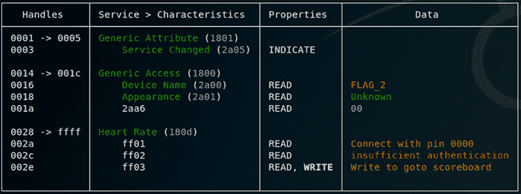

图 11-10：我们需要进行身份验证才能读取 002c 句柄。

提示表明我们需要建立一个安全连接才能读取受保护的 0x002c 句柄。为此，我们使用带有 `--sec-level=high` 选项的 GATTTool，该选项将连接的安全级别设置为高，并在读取值之前建立经过身份验证的加密连接（AES-CMAC 或 ECDHE）：

```
# gatttool --sec-level=high -b a4:cf:12:6c:b3:76 --char-read -a 0x002c
Characteristic value/descriptor: 35 64 36 39 36 63 64 66 35 33 61 39 31 36 63 30 61 39 38 64 
```

太棒了！这次，在将十六进制转换为 ASCII 后，我们得到标志 5d696cdf53a916c0a98d，而不是“身份验证不足”消息。回到积分榜并提交它，如之前所示：

```
# gatttool -b a4:cf:12:6c:b3:76 --char-write-req -a 0x002e -n $(echo -n "5d696cdf53a916c0a98d"|xxd -ps)
Characteristic value was written successfully
```

标志是正确的，如积分榜所示！我们已经解决了挑战 #2。

### 标志 3：伪造你的 MAC 地址

导航到 FLAG_03 并枚举其 GATT 服务器中的服务和特征。在句柄 0x002a 上会看到“使用 MAC 11:22:33:44:55:66 连接”消息（图 11-11）。这个挑战要求我们学习如何伪造连接的 MAC 地址来源来读取该句柄。

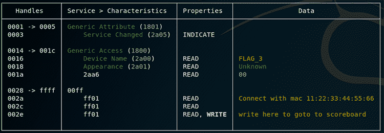

图 11-11：使用 Bettercap 查看 FLAG_3 特征

这意味着我们必须伪造真实的蓝牙 MAC 地址以获取标志。虽然你可以使用 Hciconfig 来发出改变 MAC 地址的命令，但`spooftooph` Linux 工具更易于使用，因为它不需要你发送原始命令。可以通过你喜欢的软件包管理器安装它，并运行以下命令将你的 MAC 地址设置为消息中提到的地址：

```
# spooftooph -i hci0 -a 11:22:33:44:55:66
Manufacturer:   Cambridge Silicon Radio (10)
Device address: 00:1A:7D:DA:71:13
New BD address: 11:22:33:44:55:66

Address changed
```

使用 `hciconfig` 验证你的新伪造 MAC 地址：

```
# hciconfig
hci0:   Type: Primary  Bus: USB
        BD Address: 11:22:33:44:55:66  ACL MTU: 310:10  SCO MTU: 64:8
        UP RUNNING 
        RX bytes:682 acl:0 sco:0 events:48 errors:0
        TX bytes:3408 acl:0 sco:0 commands:48 errors:0
```

使用 Bettercap 的 `ble.enum` 命令，再次查看此挑战的 GATT 服务器。这次，你应该在 0x002c 句柄上看到一个新的标志（图 11-12）。

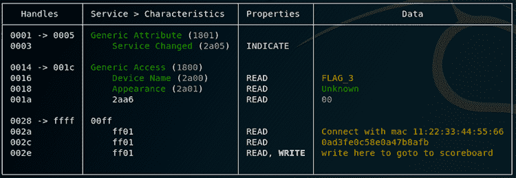

图 11-12：连接到目标 MAC 地址后显示的 FLAG_3。

返回到记分板并提交你的新旗帜：

```
# gatttool -b a4:cf:12:6c:b3:76 --char-write-req -a 0x002e -n $(echo -n "0ad3f30c58e0a47b8afb"|xxd -ps)
Characteristic value was written successfully
```

然后检查记分板，查看你更新后的得分（图 11-13）。

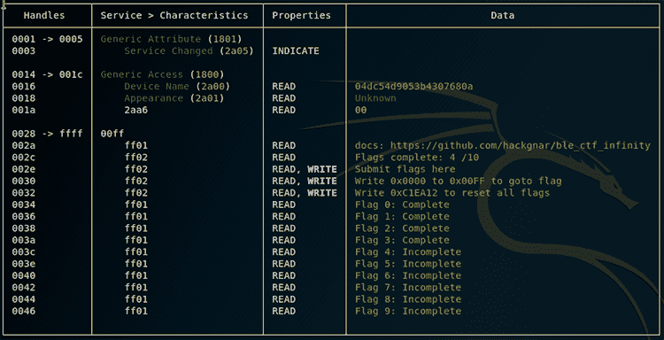

图 11-13：完成第一个挑战后的记分板

## 结论

在简要介绍完 BLE 黑客攻击后，我们希望能够激励你继续解决 CTF 挑战。它们将展示你在评估 BLE 启用设备时每天都需要处理的实际任务。我们展示了核心概念和一些最常见的攻击，但请记住，你也可以执行其他攻击，例如中间人攻击，特别是当设备未使用安全连接时。

目前存在许多特定协议实现的漏洞。对于每一个使用 BLE 的新应用程序或协议，程序员都有可能犯错，从而在其实现中引入安全漏洞。尽管新的蓝牙版本（5.0）现在已经推出，但采用过程仍然缓慢，因此在未来几年你仍会看到大量的 BLE 设备。**
