# 长距离无线电：LPWAN


*低功耗广域网（LPWAN）* 是一类无线、低功耗、广域网技术，专为低比特率的远程通信设计。这些网络的通信距离可以超过六英里，而且它们的功耗非常低，以至于电池可以持续长达 20 年。此外，整体技术成本相对较低。LPWAN 可以使用许可或非许可频率，并包括专有或开放标准协议。

LPWAN 技术在物联网系统中很常见，如智能城市、基础设施和物流。它们代替电缆使用，或在可能不安全直接将节点插入主网络的情况下使用。例如，在基础设施中，LPWAN 传感器常用于测量河流洪水水位或水管的压力。在物流中，传感器可能会报告冷藏单元内的温度，这些单元通常位于运输船或卡车的集装箱内。

本章我们重点介绍 LPWAN 无线技术中的一种主要技术——*Long Range (LoRa)*，因为它在多个国家非常流行，并且具有一个名为 LoRaWAN 的开放源代码规范。它用于多种关键用途，如铁路平交道口、入侵报警、工业控制系统（ICS）监测、自然灾害通信，甚至接收来自太空的消息。我们首先展示如何使用和编程简单设备来发送、接收和捕获 LoRa 无线电流量。然后，我们提高一个层次，向您展示如何解码 LoRaWAN 数据包，以及 LoRaWAN 网络是如何工作的。此外，我们还提供了对可能针对该技术进行的各种攻击的概述，并演示了一个比特翻转攻击。

## LPWAN、LoRa 和 LoRaWAN

LoRa 是三种主要 LPWAN 调制技术之一。另两种是 *Ultra Narrowband (UNB)* 和 *NarrowBand (NB-IoT)*。LoRa 是 *扩频*，这意味着设备在比原始信息的频率内容更大的带宽上传输信号；它使用的比特率范围从每个通道 0.3Kbps 到 50Kbps。*UNB* 使用非常窄的带宽，而 *NB-IoT* 则利用现有的蜂窝基础设施，如全球网络运营商 Sigfox，这是最大的参与者。这些不同的 LPWAN 技术提供了不同级别的安全性。它们中的大多数包括网络和设备或订阅者身份认证、身份保护、先进的标准加密（AES）、消息机密性和密钥配置。

当物联网行业的人们谈论 LoRa 时，他们通常是指 LoRa 和 LoRaWAN 的结合。*LoRa* 是由 Semtech 公司专利的专有调制方案，并授权给其他公司使用。在计算机网络的七层 OSI 模型中，LoRa 定义了物理层，涉及无线电接口，而 LoRaWAN 定义了其上的各个层次。LoRaWAN 是由 LoRa 联盟维护的开放标准，这个联盟是一个由 500 多个会员公司组成的非营利性协会。

LoRaWAN 网络由节点、网关和网络服务器组成（见图 13-1）。

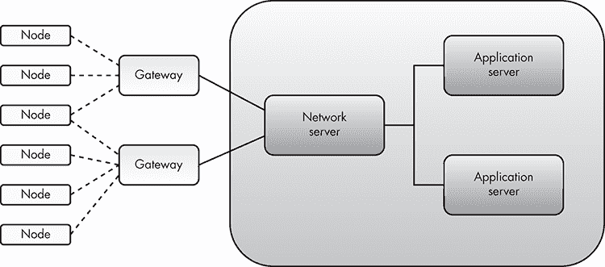

图 13-1：LoRaWAN 网络架构

*节点*是与网关使用 LoRaWAN 协议通信的小型、廉价设备。*网关*是稍大且更贵的设备，作为中介转发数据，在节点和网络服务器之间进行通信，这些设备通过任何标准的 IP 连接进行通信。（这种 IP 连接可以是蜂窝网络、Wi-Fi 等。）*网络服务器*有时会与*应用服务器*连接，当接收到来自节点的消息时，应用服务器会执行逻辑。例如，如果节点报告的温度值超过某个阈值，服务器可以向节点发送指令并采取适当的行动（例如，打开阀门）。LoRaWAN 网络采用*星型拓扑*，这意味着多个节点可以与一个或多个网关通信，而网关与一个网络服务器进行通信。

## 捕获 LoRa 流量

在本节中，我们将演示如何捕获 LoRa 流量。通过这个过程，你将学习如何使用 CircuitPython 编程语言并与简单的硬件工具互动。虽然有多种工具可以捕获 LoRa 信号，但我们选择了那些能够展示你在其他物联网黑客任务中可能使用的技术的工具。

在这个练习中，我们将使用三个组件：

1.  **LoStik** 一款开源 USB LoRa 设备（可从[`ronoth.com/lostik/`](https://ronoth.com/lostik/)购买）。LoStik 使用 Microchip 模块 RN2903（美国）或 RN2483（欧洲），具体取决于你所在的国际电信联盟（ITU）区域。请确保选择适合你区域的版本。

1.  **CatWAN USB Stick** 一款开源的 USB 设备，兼容 LoRa 和 LoRaWAN（可在[`electroniccats.com/store/catwan-usb-stick/`](https://electroniccats.com/store/catwan-usb-stick/)购买）。

1.  **Heltec LoRa 32** 一款用于 LoRa 的 ESP32 开发板 ([`heltec.org/project/wifi-lora-32/`](https://heltec.org/project/wifi-lora-32/))。ESP32 开发板是低成本、低功耗的微控制器。

我们将把 LoStik 设置为接收器，把 Heltec 开发板设置为发送器，然后让它们通过 LoRa 进行通信。接着，我们将配置 CatWAN USB Stick 作为嗅探器来捕获 LoRa 流量。

### 设置 Heltec LoRa 32 开发板

我们将首先使用 Arduino IDE 编程 Heltec 开发板。请返回第七章了解 Arduino 的简介。

如果你还没有安装 IDE，请先安装它，然后添加 Arduino-ESP32 的 Heltec 库。这些库将允许你使用 Arduino IDE 对 ESP32 开发板（如 Heltec LoRa 模块）进行编程。要完成安装，请点击 **File**▶**Preferences**▶**Settings**，然后点击 **Additional Boards Manager URLs** 按钮。在列表中添加以下 URL：[`resource.heltec.cn/download/package_heltec_esp32_index.json`](https://resource.heltec.cn/download/package_heltec_esp32_index.json)，然后点击 **OK**。接着点击 **ToolsBoardBoards Manager**。搜索 **Heltec ESP32**，点击应出现的 Heltec Automation 提供的 Heltec ESP32 Series Dev-boards 选项上的 **Install**。我们使用的是版本 0.0.2-rc1。**

**下一步是安装 *Heltec ESP32* 库。点击 **Sketch**▶**Include Library**▶**Manage Libraries**。然后搜索“Heltec ESP32”，点击 Heltec Automation 提供的 Heltec ESP32 Dev-Boards 选项上的 **Install**。我们使用的是版本 1.0.8。**

要查看库文件的保存位置，点击 **File**▶**Preferences**▶**Sketchbook location**。在 Linux 上，那里列出的目录通常是 */home/<username>/Arduino*，你应该能在该目录下找到名为 *libraries* 的子文件夹，其中包含像“Heltec ESP32 Dev Boards”这样的库。

你可能还需要安装 *UART 桥接 VCP 驱动程序*，以便在连接 Heltec 板到计算机时，Heltec 板能够显示为一个串行端口。你可以在 [`www.silabs.com/products/development-tools/software/usb-to-uart-bridge-vcp-drivers/`](https://www.silabs.com/products/development-tools/software/usb-to-uart-bridge-vcp-drivers/) 获取驱动程序。如果你使用的是 Linux，请确保选择与你正在运行的内核版本相匹配的驱动程序。发布说明中包括了如何编译内核模块的说明。

请注意，如果你以非 root 用户身份登录，可能需要将你的用户名添加到具有读写权限的 */dev/ttyACM* 和 */dev/ttyUSB* 特殊设备文件所在的组。你需要这样做，才能在 Arduino IDE 中访问串行监视器功能。打开终端并输入以下命令：

```
$ **ls -l /dev/ttyUSB***
crw-rw---- 1 root dialout 188, 0 Aug 31 21:21 /dev/ttyUSB0
```

这个输出意味着文件的组所有者是 *dialout*（你的发行版可能不同），因此你需要将你的用户名添加到该组：

```
$ **sudo usermod -a -G dialout** `<username>`
```

属于 dialout 组的用户可以完全直接访问系统上的串行端口。一旦将你的用户名添加到该组，你应该就能获得进行此步骤所需的访问权限。

#### 编程 Heltec 模块

要编程 Heltec 模块，我们将其连接到计算机的 USB 端口。确保你已经将可拆卸的天线连接到主模块上。否则，你可能会损坏开发板（图 13-2）。

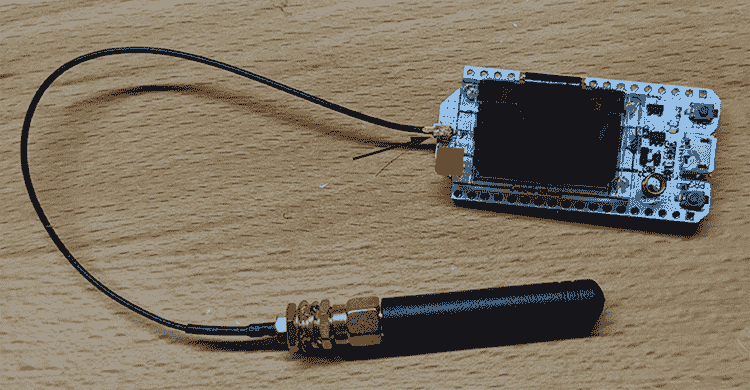

图 13-2：Heltec Wi-Fi LoRa 32 (V2) 基于 ESP32 和 SX127x，支持 Wi-Fi、BLE、LoRa 和 LoRaWAN。箭头指示了天线连接的位置。

在 Arduino IDE 中，点击 **工具**▶**开发板**▶**WiFi LoRa 32 (V2)**，如图 13-3 所示，选择开发板。

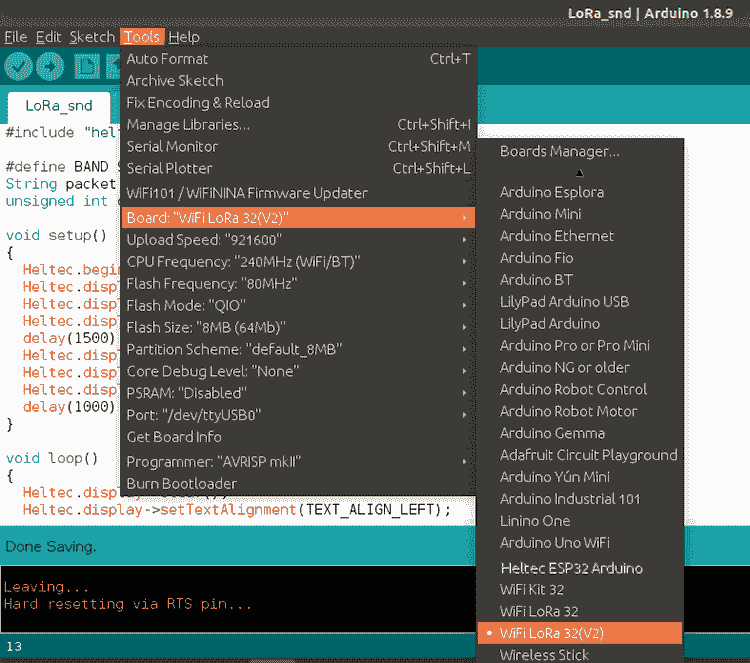

图 13-3：在 Arduino IDE 中选择正确的开发板：WiFi LoRa 32(V2)。

接下来，我们将开始编写 Arduino 程序，使 Heltec 模块作为 LoRa 数据包发送器。代码将配置 Heltec 模块的无线电，并循环发送简单的 LoRa 负载。点击 **文件**▶**新建**，然后将来自清单 13-1 的代码粘贴到文件中。

```
 #include "heltec.h" 
  #define BAND 915E6  
  String packet;
  unsigned int counter = 0;

  void setup() { 1
    Heltec.begin(true, true, true, true, BAND);
    Heltec.display->init();
    Heltec.display->flipScreenVertically();  
    Heltec.display->setFont(ArialMT_Plain_10);
    delay(1500);
    Heltec.display->clear();
    Heltec.display->drawString(0, 0, "Heltec.LoRa Initial success!");
    Heltec.display->display();
    delay(1000);
  }

  void loop() { 2
    Heltec.display->clear();
    Heltec.display->setTextAlignment(TEXT_ALIGN_LEFT);
    Heltec.display->setFont(ArialMT_Plain_10);
    Heltec.display->drawString(0, 0, "Sending packet: ");
    Heltec.display->drawString(90, 0, String(counter));
    Heltec.display->display();

    LoRa.beginPacket(); 3
    LoRa.disableCrc(); 4
    LoRa.setSpreadingFactor(7);
    LoRa.setTxPower(20, RF_PACONFIG_PASELECT_PABOOST);
    LoRa.print("Not so secret LoRa message ");
    LoRa.endPacket(); 5

    counter++; 6
    digitalWrite(LED, HIGH);   // turn the LED on (HIGH is the voltage level)
    delay(1000);                   
    digitalWrite(LED, LOW);    // turn the LED off by making the voltage LOW
    delay(1000);                
  }
```

清单 13-1：使 Heltec LoRa 模块作为基本 LoRa 数据包发送器的 Arduino 代码。

我们首先包含 Heltec 库，其中包含与开发板上的 OLED 显示屏和 SX127x LoRa 芯片进行接口的函数。我们使用的是 LoRa 的美国版本，因此我们将频率定义为 915 MHz。

我们调用 `setup()` 函数 1，记住，这个函数只会在 Arduino 程序开始时调用一次。在这里，我们用它来初始化 Heltec 模块及其 OLED 显示屏。`Heltec.begin` 中的四个布尔值启用开发板的显示屏；LoRa 无线电；串行接口，这样你就可以使用串行监视器查看设备输出，稍后会解释；以及 PABOOST（高功率发射器）。最后一个参数设置了用于传输信号的频率。`setup()` 中的其他命令初始化并设置 OLED 显示屏。

与 `setup()` 类似，`loop()` 函数 2 是一个内置的 Arduino 函数，它会无限循环执行，所以我们将主要逻辑放在这里。我们从打印字符串 `Sending packet:` 开始，每发送一个数据包后，OLED 显示屏上会显示一个计数器，用来跟踪我们发送了多少个 LoRa 数据包。

接下来，我们开始发送 LoRa 数据包 3 的过程。接下来的四个命令 4 配置 LoRa 无线电：它们禁用 LoRa 头部的 *循环冗余检查（CRC）*（默认情况下不使用 CRC），设置扩频因子为 7，设置最大传输功率为 20，并使用 *Heltec* 库中的 `LoRa.print()` 函数将实际负载添加到数据包中。*CRC* 是一种固定长度的错误检测值，帮助接收方检查数据包是否损坏。*扩频因子* 决定了 LoRa 数据包在空中的持续时间。SF7 是空中时间最短的，而 SF12 是最长的。每增加一级扩频因子，空中传输相同数据所需的时间就会翻倍。虽然较慢，但较高的扩频因子可以用来实现更长的传输距离。*传输功率* 是 LoRa 无线电产生的无线电频率能量的功率值，以瓦特为单位；其值越高，信号越强。然后，我们通过调用 `LoRa.endPacket()` 5 来发送数据包。

最后，我们增加数据包的 `counter` 并开启或关闭 Heltec 开发板上的 LED，以表示我们刚刚发送了另一个 LoRa 数据包 6。

为了更好地理解我们的 Arduino 程序，我们建议你阅读*Heltec ESP32 LoRa*库代码及 API 文档，地址为[`github.com/HelTecAutomation/Heltec_ESP32/tree/master/src/lora/`](https://github.com/HelTecAutomation/Heltec_ESP32/tree/master/src/lora/)。

#### 测试 LoRa 发送器

要尝试代码，请将其上传到 Heltec 板。确保你在 Arduino IDE 中选择了正确的端口。点击**Tools**▶**Port**，选择 Heltec 连接的 USB 端口。通常，这应该是*/dev/ttyUSB0*，或者在某些情况下是*/dev/ttyACM0*。

此时，你可以通过点击**Tools**▶**Serial Monitor**打开串行监视器控制台。我们已将大多数输出重定向到板子的 OLED 显示屏，因此在此练习中串行控制台并不那么必要。

然后点击**Sketch**▶**Upload**，这将编译、上传并运行板上的代码。你现在应该能在板子的屏幕上看到数据包计数器，如图 13-4 所示。

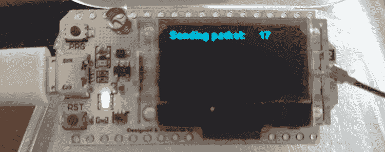

图 13-4：运行我们代码的 Heltec 板，显示当前发送的数据包数量

### 设置 LoStik

为了接收来自 Heltec 板的数据包，我们现在将 LoStik 设置为 LoRa 接收器（图 13-5）。我们使用了 LoStik 的 RN2903（美国）版本，适用于美国、加拿大和南美。我们建议你查阅 The Things Network 项目提供的以下地图，了解各国的 LoRaWAN（和 LoRa）频率规划与法规：[`www.thethingsnetwork.org/docs/lorawan/frequencies-by-country.html`](https://www.thethingsnetwork.org/docs/lorawan/frequencies-by-country.html)

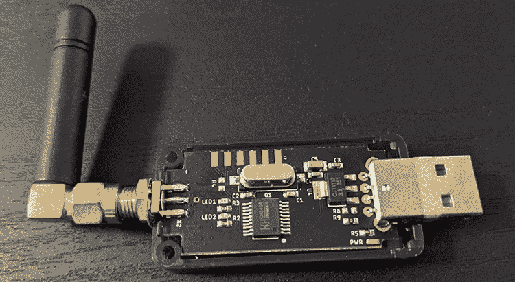

图 13-5：LoStik 有两个版本：Microchip 的 RN2903（美国）和 RN2483（欧洲）模块。确保为你的 ITU 区域选择正确的版本。

若要下载并尝试一些 LoStik 开发者提供的代码示例，你可以运行以下命令：

```
$ **git clone https://github.com/ronoth/LoStik.git**
```

若要运行示例，你需要 Python 3 以及`pyserial`包。你可以通过将`pip`包管理器指向*examples*目录中的*requirements.txt*文件来安装后者：

```
# pip install -r requirements.txt
```

当你将 LoStik 插入计算机时，输入以下命令查看它被分配到哪个设备文件描述符：

```
$ **sudo dmesg** 
…
usb 1-2.1: ch341-uart converter now attached to ttyUSB0
```

如果没有连接其他外部设备，它应该被分配为*/dev/ttyUSB0*。

#### 编写 LoRa 接收器代码

在文本编辑器（如 Vim）中，输入以下 Python 脚本，让 LoStik 充当基本的 LoRa 接收器。该代码将通过串行接口向 LoStik 中的 LoRa 无线电芯片（RN2903）发送配置命令，使其监听某些类型的 LoRa 流量并将接收到的数据包打印到终端。清单 13-2 展示了我们的代码。

```
 #!/usr/bin/env python3 1
  import time
  import sys
  import serial
  import argparse
  from serial.threaded import LineReader, ReaderThread

  parser = argparse.ArgumentParser(description='LoRa Radio mode receiver.') 2
  parser.add_argument('port', help="Serial port descriptor")
  args = parser.parse_args()

  class PrintLines(LineReader): 3
    def connection_made(self, transport): 4
      print("serial port connection made")
      self.transport = transport
      self.send_cmd('mac pause') 5
      self.send_cmd('radio set wdt 0')
      self.send_cmd('radio set crc off')
      self.send_cmd('radio set sf sf7')
      self.send_cmd('radio rx 0')

    def handle_line(self, data): 6
      if data == "ok" or data == 'busy':
        return
      if data == "radio_err":
        self.send_cmd('radio rx 0')
        return

 if 'radio_rx' in data: 7
        print(bytes.fromhex(data[10:]).decode('utf-8', errors='ignore'))
      else:
        print(data)
      time.sleep(.1)
      self.send_cmd('radio rx 0')

    def connection_lost(self, exc): 8
      if exc:
        print(exc)
      print("port closed")

    def send_cmd(self, cmd, delay=.5): 9
      self.transport.write(('%s\r\n' % cmd).encode('UTF-8'))
      time.sleep(delay)

  ser = serial.Serial(args.port, baudrate=57600) a
  with ReaderThread(ser, PrintLines) as protocol:
    while(1):
      pass
```

清单 13-2：一个 Python 脚本，让 LoStik 充当基本的 LoRa 接收器

这个 Python 脚本首先导入必要的模块 1，包括从 `pyserial` 包中导入的 `serial` 类 `LineReader` 和 `ReaderThread`。这两个类将帮助我们使用线程实现串口读取循环。接下来，我们设置一个非常基础的命令行参数解析器 2，通过它我们将串口的设备文件描述符（例如，*/dev/ttyUSB0*）作为唯一参数传递给我们的程序。我们定义了 `PrintLines`3，一个 `serial.threaded.LineReader` 的子类，``我们的 `ReaderThread` 对象将使用这个类。该类实现了程序的主要逻辑。我们在 `connection_made`4 中初始化所有 LoStik 无线电设置，因为它是在线程启动时被调用的。``

```````` The next five commands 5 configure the LoRa radio part of the RN2903 chip. These steps resemble the steps you took to configure the LoRa radio in the Heltec board. We advise you to read a detailed explanation of these commands in the “RN2903 LoRa Technology Module Command Reference User’s Guide” from Microchip ([`www.microchip.com/wwwproducts/en/RN2903`](https://www.microchip.com/wwwproducts/en/RN2903)). Let’s look at each command:    1.  `mac pause` Pauses the LoRaWAN stack functionality to allow you to configure the radio, so we start with this. 2.  `radio set wdt 0` Disables the *Watchdog Timer*, a mechanism that interrupts radio reception or transmission after a configured number of milliseconds have passed. 3.  `radio set crc off` Disables the CRC header in LoRa. The `off` setting is the most common setting. ``*   `radio set sf sf7` Sets the spreading factor. Valid parameters are *sf7*, *sf8*, *sf9*, *sf10*, *sf11*, or *sf12*. We set the spreading factor to sf7, because the Heltec LoRa 32 node, which acts as our sender, is in the same room as the receiver (remember that short distances require small spreading factors) and also has a spreading factor of 7\. The two spreading factors must match or else the sender and receiver might not be able to talk to each other.*   `radio rx 0` Puts the radio into continuous *Receive* mode, which means it will listen until it receives a packet.``   ``````` We then override function `handle_line` of `LineReader`6, which is called whenever the RN2903 chip receives a new line from the serial port. If the value of the line is `ok` or returns `busy`, we return to keep listening for new lines. If that line is a `radio_err` string, that probably means the Watchdog Timer sent an interrupt. The default value of the Watchdog Timer is 15,000 ms, which means that if 15 seconds have passed since the beginning of the transceiver reception without it receiving any data, the Watchdog Timer interrupts the radio and returns `radio_err`. If that happens, we call `radio rx 0` to set the radio into continuous Receive mode again. We previously disabled the Watchdog Timer in this script, but it’s good practice to handle this interrupt in any case.    If the line contains a `radio rx`7, then it contains a new packet from the LoRa radio receiver, in which case we try to decode the payload (everything from byte 10 onward, because bytes 0–9 of the data variable contain the string `"radio rx"`) as UTF-8, ignoring any errors (characters that can’t be decoded). Otherwise, we just print the whole line, because it will probably contain a reply from the LoStik to some command we sent to it. For example, if we send it a `radio get crc` command, it will reply with `on` or `off`, indicating whether or not the CRC is enabled.    We also override `connection_lost` 8,`` which is called when the serial port is closed or the reader loop otherwise terminates. We print the exception `exc` if it was terminated by an error. The function `send_cmd` 9`is just a wrapper that makes sure commands sent to the serial port have the proper format. It checks that the data is UTF-8 encoded and that the line ends with a carriage return and newline character.` ``   `````` ````` For our script’s main code a, we create a Serial object called `ser`, which takes the serial port’s file descriptor as an argument and sets the *baud rate* (how fast data is sent over the serial line). The RN2903 requires a rate of 57600\. We then create an infinite loop and initialize a `pyserial``ReaderThread` with our serial port instance and `PrintLines` class, starting our main logic.    #### Starting the LoRa Receiver    With the LoStik plugged into a USB port in our computer, we can start our LoRa receiver by entering this line:    ``` # ./lora_recv.py /dev/ttyUSB0 ```    We should now see the LoRa messages sent by the Heltec module:    ``` root@kali:~/lora# ./lora_recv.py /dev/ttyUSB0 serial port connection made 4294967245 Not so secret LoRa message Not so secret LoRa message Not so secret LoRa message Not so secret LoRa message Not so secret LoRa message ```    You should expect to see a new LoRa message of the same payload every few seconds, given how often the program calls the Heltec module loop.    ### Turning the CatWAN USB Stick into a LoRa Sniffer    Now let’s set up the device that will allow us to sniff this LoRa traffic. The CatWAN USB stick (Figure 13-6) uses a RFM95 chip, and you can dynamically configure it to use either 868 MHz (for the European Union) or 915 MHz (for the United States).  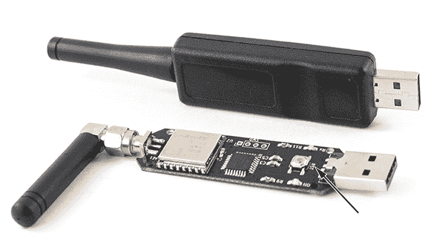    Figure 13-6: The CatWAN USB stick, which is compatible with LoRa and LoRaWAN, is based on the RFM95 transceiver. The arrow points to the reset (RST) button.      The stick comes with a plastic case, which you’ll have to remove to access the reset button. After you connect the stick to your computer, quickly press the reset button twice. A USB storage unit called USBSTICK should appear in the Windows File Explorer.    #### Setting Up CircuitPython    Download and install the latest version of Adafruit’sCircuitPython at [`circuitpython.org/board/catwan_usbstick/`](https://circuitpython.org/board/catwan_usbstick/). *CircuitPython* is an easy, open source language based on MicroPython, a version of Python optimized to run on microcontrollers. We used version 4.1.0\.    CatWAN uses a SAMD21 microcontroller, which has a bootloader that makes it easy to flash code onto it. It uses Microsoft’s *USB Flashing Format (UF2)*, which is a file format that is suitable for flashing microcontrollers using removable flash drives. This allows you to drag and drop the *UF2* file to the USBSTICK storage device. This action automatically flashes the bootloader. Then the device reboots and renames the drive to CIRCUITPY.    You’ll also need two CircuitPython libraries: *Adafruit CircuitPython RFM9x* and *Adafruit CircuitPython BusDevice*. You can find these at [`github.com/adafruit/Adafruit_CircuitPython_RFM9x/releases`](https://github.com/adafruit/Adafruit_CircuitPython_RFM9x/releases)and [`github.com/adafruit/Adafruit_CircuitPython_BusDevice/releases`](https://github.com/adafruit/Adafruit_CircuitPython_BusDevice/releases)*.* We installed these using *adafruit-circuitpython-rfm9x-4.x-mpy-1.1.6.zip* and *adafruit-circuitpython-bus-device-4.x-mpy-4.0.0.zip*. The 4.*x* number refers to the CircuitPython version; make sure these installations correspond with your installed version. You’ll have to unzip them and transfer the *.mp*y files to the CIRCUITPY drive. Note that the *bus* library needs the *.mpy* files to be in the *bus* library directory, as shown in Figure 13-7. The library files are placed inside the *lib* directory, and there is a subdirectory *adafruit_bus_device* for the `I2C` and `SPI` modules. The *code.py* file you’ll create resides in the USB volume drive’s very top (root) directory.  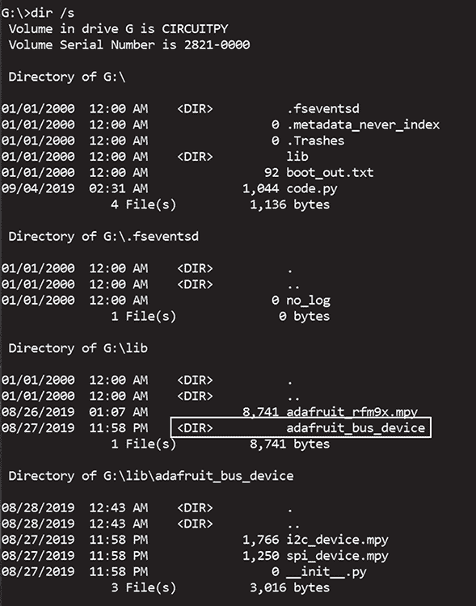    Figure 13-7: The CIRCUITPY drive’s directory structure.      Next, we’ll configure the Serial Monitor (with the same functionality as the Arduino Serial Monitor, explained earlier). For this, we used PuTTY on Windows, because it has worked much better than any other Windows-based terminal emulator that we tested. Once you have PuTTY on your system, identify the right COM port by opening your Windows Device Manager and navigating to **Ports (COM & LPT)** (Figure 13-8).  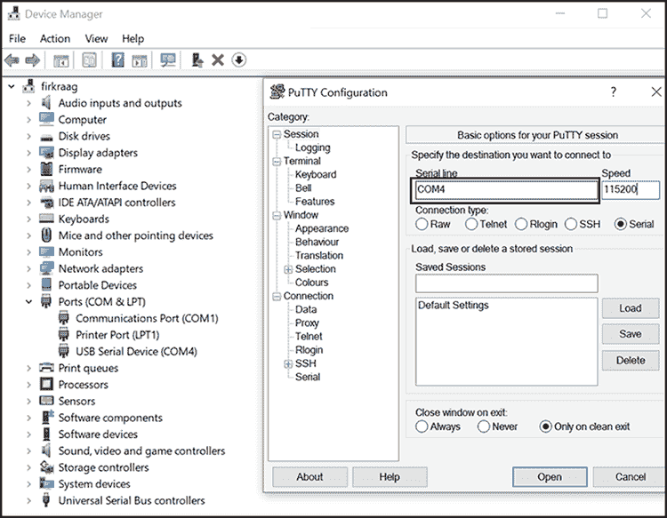    Figure 13-8: Configuring PuTTY to connect to the serial console on COM4, which we identified in the Device Manager as the port being used by the CatWAN stick. Your COM port might be different.      Unplug and replug the CatWAN stick into your computer to identify the correct COM port. Doing so works because you’ll see which COM port disappears in the Device Manager when you unplug it and reappears when you replug it. Next, in the **Session** tab, choose **Serial.** Enter the right COM port into the **Serial line** box, and change the baud rate to **115200**.    #### Writing the Sniffer    To write the CircuitPython code, we recommend that you use the MU editor ([`codewith.mu/)`](https://codewith.mu/)). Otherwise, the changes to the CIRCUITPY drive might not be saved correctly and in real time. When you first open MU, choose the **Adafruit CircuitPython** mode. You can also change the mode later using the Mode icon on the menu bar. Start a new file, enter the code from Listing 13-3, and save the file on the CIRCUITPY drive using the name *code.py*. Note that the filename is important, because CircuitPython will look for a code file named *code.txt*, *code.py*, *main.txt*,or *main.py* in that order.    When you first save the *code.py* file on the drive and each time you make changes to the code through the MU editor, MU automatically runs that version of the code on the CatWAN. You can monitor this execution using the serial console with PuTTY. Using the console, you can press CTRL-C to interrupt the program or CTRL-D to reload it.    The program is similar to the basic LoRa receiver we introduced with the LoStik. The main twist is that it continuously switches between spreading factors to increase the chances of listening to different types of LoRa traffic.    ```  import board   import busio   import digitalio   import adafruit_rfm9x    RADIO_FREQ_MHZ = 915.0 1   CS = digitalio.DigitalInOut(board.RFM9X_CS)   RESET = digitalio.DigitalInOut(board.RFM9X_RST)   spi = busio.SPI(board.SCK, MOSI=board.MOSI, MISO=board.MISO)   rfm9x = adafruit_rfm9x.RFM9x(spi, CS, RESET, RADIO_FREQ_MHZ) 2   rfm9x.spreading_factor = 7 3    print('Waiting for LoRa packets...')   i = 0   while True:     packet = rfm9x.receive(timeout=1.0, keep_listening=True, with_header=True) 4     if (i % 2) == 0:       rfm9x.spreading_factor = 7     else:       rfm9x.spreading_factor = 11     i = i + 1      if packet is None: 5       print('Nothing yet. Listening again...')     else:       print('Received (raw bytes): {0}'.format(packet))       try: 6         packet_text = str(packet, 'ascii')         print('Received (ASCII): {0}'.format(packet_text))       except UnicodeError:         print('packet contains non-ASCII characters')       rssi = rfm9x.rssi 7       print('Received signal strength: {0} dB'.format(rssi)) ```    Listing 13-3: CircuitPython code for the CatWAN USB stick to act as a basic LoRa sniffer    First, we import the necessary modules, as we would in Python. The `board` module contains board base pin names, which will vary from board to board. The `busio` module contains classes that support multiple serial protocols, including SPI, which CatWAN uses. The `digitalio` module provides access to basic digital I/O, and `adafruit_rmf9x` is our main interface to the RFM95 LoRa transceiver that CatWAN uses.    We set the radio frequency to 915 MHz 1, because we’re using the US version of CatWAN. Always make sure the frequency matches your module version. For example, change it to 868 MHz if you’re using the module’s EU version.    The rest of the commands set up the SPI bus connected to the radio, as well as the Chip Select (CS) and reset pins, leading up to the initialization of our `rfm9x` class 2. The SPI bus uses the CS pin, as explained in Chapter 5\. This class is defined in the `RFM95 CircuitPython` module at [`github.com/adafruit/Adafruit_CircuitPython_RFM9x/blob/master/adafruit_rfm9x.py`](https://github.com/adafruit/Adafruit_CircuitPython_RFM9x/blob/master/adafruit_rfm9x.py). It’s worth reading the source code to get a better understanding of how the class works under the hood.    The most important part of the initialization is setting the spreading factor 3. We start with SF7, but later inside the main loop, we’ll switch to other modes to increase our chances of sniffing all types of LoRa traffic. We then start polling the chip for new packets inside an infinite loop by calling `rfm9x.receive()`4 with the following arguments:    1.  `timeout = 1.0` This means the chip will wait for up to one second for a packet to be received and decoded. 2.  `keep_listening = True` This will make the chip enter listening mode after it receives a packet. Otherwise, it would fall back to idle mode and ignore any future reception. 3.  `with_header = True` This will return the four-byte LoRa header along with the packet. This is important, because when a LoRa packet uses the *implicit header mode*, the payload might be part of the header; if you don’t read it, you might miss part of the data.    Because we want the CatWAN to act as a LoRa sniffer, we need to continuously keep switching between spreading factors to increase our chances of capturing LoRa traffic from nodes that might be either too close or too far away. Switching between 7 and 11 accomplishes this to a large degree, but feel free to experiment with other or all values between 7 and 12\.    If `rfm9x.receive()` didn’t receive anything in `timeout` seconds, it returns `None` 5, then we print that to the serial console and we go back to the beginning of the loop. If we receive a packet, we print its raw bytes and then try to decode them to ASCII 6. Often, the packet might contain non-ASCII characters due to corruption or encryption, and we have to catch the `UnicodeError` exception or our program will quit with an error. Finally, we print the received signal strength of the last received message by reading our chip’s RSSI register using the `rfm9x.rssi()` function 7.    If you leave the serial console in PuTTY open, you should see the sniffed messages, as shown in Figure 13-9.  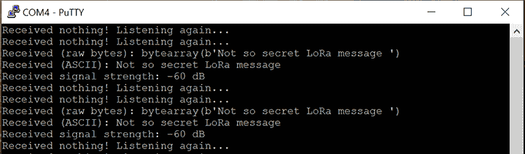    Figure 13-9: The serial console in PuTTY shows us the captured LoRa messages from the CatWAN stick.      ## Decoding the LoRaWAN Protocol    In this section, we’ll explore the LoRaWAN wireless protocol, which sits on top of LoRa. To better understand the protocol, we recommend that you read the official specification on the LoRa Alliance website at [`lora-alliance.org/lorawan-for-developers/`](https://lora-alliance.org/lorawan-for-developers/).    ### The LoRaWAN Packet Format    LoRaWAN defines the layers of the OSI model on top of LoRa (OSI layer 1). It mainly operates at the data link Medium Access Control (MAC) layer (OSI layer 2), although it includes some elements of the network layer (OSI layer 3). For example, the network layer covers tasks such as how nodes join LoRaWAN networks (covered in “Joining LoRaWAN Networks” on page 324), how packets are forwarded, and so on.    The LoRaWAN packet format further divides the network layer into MAC and application layers. Figure 13-10 shows these layers.  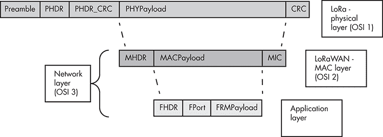    Figure 13-10: The LoRaWAN packet format      To understand how these three layers interact, you first need to understand the three AES 128-bit keys that LoRaWAN uses. The *NwkSKey* is a network session key that the node and the network server use to calculate and verify the Message Integrity Code (MIC) of all messages, ensuring data integrity. The *AppSKey* is an application session key that the end device and the application server (which can be the same entity as the network server) use to encrypt and decrypt the application layer payload. The *AppKey* (note there is no “s” here) is an application key known by the node and the application server and used for the *Over-the-Air Activation**(OTAA)* method, explained in “Joining LoRaWAN Networks” on page 324.    The LoRa physical layer defines the radio interface, modulation scheme, and an optional CRC for error detection. It also carries the payload for the MAC layer. It has the following parts:    1.  Preamble The radio preamble, which contains the synchronization function and defines the packet modulation scheme. The duration of the preamble is usually 12.25 Ts. 2.  PHDR The physical layer header, which contains information such as the payload length and whether the Physical Payload CRC is present. 3.  PHDR_CRC The CRC of the physical header (PHDR). The PHDR and PHDR_CRC are 20 bits in total. 4.  PHYPayload The physical layer payload, which contains the MAC frame. 5.  CRC The optional 16-bit CRC of the PHYPayload. Messages sent from a network server to a node never contain this field for performance reasons.    The LoRaWAN MAC layer defines the LoRaWAN message type and the MIC, and it carries the payload for the application layer above. It has the following parts:    1.  MHDR The *MAC header (MHDR)*, which specifies the message type (MType) of the frame format and the version of the LoRaWAN specification used. The three-bit MType specifies which of the six different MAC message types we have: Join-Request, Join-Accept, unconfirmed data up/down, and confirmed data up/down. Up refers to data traveling from the node to the network server, and down indicates data traveling in the opposite direction. 2.  MACPayload The MAC payload, which contains the application layer frame. For Join-Request (or Rejoin-Request) messages, the MAC payload has its own format and doesn’t carry the typical application layer payload. 3.  MIC The four-byte MIC, which ensures data integrity and prevents message forgery. It’s calculated over all fields in the message (msg = MHDR | FHDR | FPort | FRMPayload) using the NwkSKey. Keep in mind that in the case of Join-Request and Join-Accept messages, we calculate the MIC differently, because they’re a special type of MAC payload.    The application layer contains application-specific data and the *end-device address (DevAddr)* that uniquely identifies the node within the current network. It has the following parts:    1.  FHDR The frame header (FHDR), which contains the DevAddr, a frame control byte (FCtrl), a two-byte frame counter (FCnt), and zero to 15 bytes of frame options (FOpts). Note that FCnt increases every time a message is transmitted, and it’s used to prevent replay attacks. 2.  *FPort* The frame port, used to determine whether the message contains only MAC commands (for example a Join-Request) or application-specific data. 3.  FRMPayload The actual data (for example, a sensor’s temperature value). These data are encrypted using the AppSKey.    ### Joining LoRaWAN Networks    There are two ways for nodes to join a LoRaWAN network: OTAAand *Activation by Personalization (ABP).* We’ll discuss both methods in this section.    Note that in a LoRaWAN network architecture, the application server might be a separate component from the network server, but for simplicity reasons, we’ll assume that the same entity performs both functions. The official LoRaWAN specification makes the same assumption.    #### OTAA    In *OTAA*, nodes follow a join procedure before being able to send data to the network and application server. Figure 13-11 illustrates this procedure.  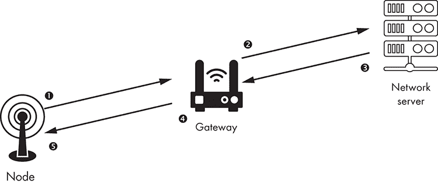    Figure 13-11: OTAA message flow      First, the LoRa node sends a *Join-Request*1 containing the *application identifier (AppEUI)*, a globally unique *end-device identifier (DevEUI)*, and a random value of two bytes (*DevNonce*). The message is signed (but not encrypted) using an AES-128 key specific to the node, called the *AppKey*.    The node calculates this signature—the MIC discussed in the previous section—as follows:    ``` cmac = aes128_cmac(AppKey, MHDR | AppEUI | DevEUI | DevNonce) MIC =  cmac[0..3] ```    The node uses a *Cipher-based Message Authentication Code**(CMAC)*, which is a keyed hash function based on a symmetric-key block cipher (AES-128 in this case). The node forms the message to be authenticated by concatenating the MHDR, AppEUI, DevEUI, and DevNonce. The `aes128_cmac` function generates a 128-bit message authentication code, and its first four bytes become the MIC, because the MIC can hold only four bytes.    Any gateway 2 that receives the Join-Request packet will forward it to its network. The gateway device doesn’t interfere with the message; it only acts as a relay.    The node doesn’t send the AppKey within the Join-Request. Because the network server knows the AppKey, it can recalculate the MIC based on the received MHDR, AppEUI, DevEUI, and DevNonce values in the message. If the end device didn’t have the correct AppKey, the MIC on the Join-Request won’t match the one calculated by the server and the server won’t validate the device.    If the MICs match, the device is deemed valid and the server then sends a *Join-Accept* response 3 containing a network identifier (NetID), a DevAddr, and an application nonce (AppNonce), as well as some network settings, such as a list of channel frequencies for the network. The server encrypts the Join-Accept using the AppKey. The server also calculates the two session keys, NwkSKey and AppSKey, as follows:    ``` NwkSKey = aes128_encrypt(AppKey, 0x01 | AppNonce | NetID | DevNonce | pad16)  AppSKey = aes128_encrypt(AppKey, 0x02 | AppNonce | NetID | DevNonce | pad16) ```    The server calculates both keys by AES-128–encrypting the concatenation of 0x01 (for the NwkSKey) or 0x02 (for the AppSKey), the AppNonce, the NetID, the DevNonce, and some padding of zero bytes so the total length of the key is a multiple of 16\. It uses the AppKey as the AES key.    The gateway with the strongest signal to the device forwards the Join-Accept response to the device 4. The node then 5 stores the NetID, DevAddr, and network settings and uses the AppNonce to generate the same session keys, NwkSKey and AppSKey, as the Network Server did, using the same formula. From then on, the node and the server use the NwkSKey and AppSKey to verify, encrypt, and decrypt the exchanged data.    #### ABP    In *ABP*, there is no Join-Request or Join-Accept procedure. Instead, the DevAddr and the two session keys, NwkSKey and AppSKey, are already hardcoded into the node. The network server has these values preregistered as well. Figure 13-12 shows how a node sends a message to the network server using ABP.  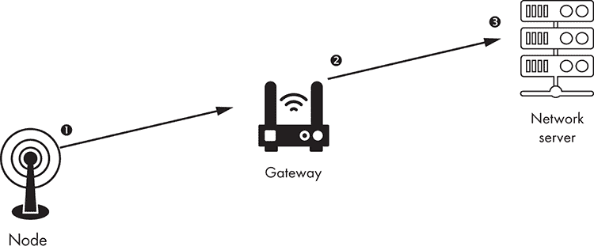    Figure 13-12: ABP message flow      The node 1 doesn’t need a DevEUI, AppEUI, or AppKey; it can start directly sending data messages to the network. The gateway 2, as usual, forwards the messages to the network server without paying attention to their content. The network server 3 is already preconfigured with the DevAddr, NwkSKey, and AppSKey, so it can verify and decrypt the messages sent by the node and then encrypt and send messages back to it.    ## Attacking LoRaWAN    An attacker could use many possible vectors to compromise LoRaWAN, depending on the network configuration and device deployment. In this section, we’ll discuss the following vectors: weaknesses in key generation and management, replay attacks, bit-flipping attacks, ACK spoofing, and application-specific vulnerabilities. We’ll show an example implementation of a bit-flipping attack but leave the rest for you to practice on your own. To work through some of the other attacks, you might need to acquire a LoRaWAN gateway and set up your own network and application server, which is beyond the scope of this chapter.    ### Bit-Flipping Attacks    A bit-flipping attack occurs when an attacker modifies a small part of the ciphertext in the encrypted application payload (the FRMPayload described in the previous section) without decrypting the packet and the server accepts the modified message. This portion might be a single bit or several. Either way, the impact of this attack depends on what value the attacker has changed; for example, if it’s a water pressure value from a sensor in a hydroelectric facility, the application server might erroneously open certain valves.    Two main scenarios could allow this attack to successfully take place:    *   The network and application server are different entities and communicate through an insecure channel. LoRaWAN doesn’t specify how the two servers should connect. This means that the integrity of the message gets checked on the network server only (using the NwkSKey). A man-in-the-middle attacker between the two servers could modify the ciphertext. Because the application server has only the AppSKey but not the NwkSKey, there’s no way to validate the packet’s integrity, so the server can’t know if it received a maliciously modified packet. *   If the network and application server are the same entity, the attack is possible if the server acts upon the FRMPayload, decrypting and using its value, before the server checks the MIC.    We’ll demonstrate how this attack would work by emulating it using the `lora-packet`*Node.js* library, which should also shed some light on how a LoRaWAN packet looks in practice. Node.js is an open source JavaScript runtime environment that lets you execute JavaScript code outside of a browser. Make sure you’ve installed Node.js before you begin. Installing `npm` through `apt-get` will also install Node.js.    Install the `npm` package manager, which you can use to install the *lora-packet* library. On Kali, you can use this command:    ``` # apt-get install npm ```    Then download the GitHub version of `lora-packet` from [`github.com/anthonykirby/lora-packet/`](https://github.com/anthonykirby/lora-packet/) or install it directly using `npm`:    ``` # npm install lora-packet ```    You can then run the code in Listing 13-4 as you would run any executable script. Copy it into a file, change its permissions to be executable with the `chmod a+x <script_name>.js` command, and run it in a terminal. The script creates a LoRaWAN packet and emulates the bit-flipping attack by altering a specific portion of it without first decrypting it.    ```  #!/usr/bin/env node 1   var lora_packet = require('lora-packet'); 2    var AppSKey = new Buffer('ec925802ae430ca77fd3dd73cb2cc588', 'hex'); 3   var packet = lora_packet.fromFields({ 4         MType: 'Unconfirmed Data Up', 5         DevAddr: new Buffer('01020304', 'hex'), // big-endian 6         FCtrl: {             ADR: false,             ACK: true,             ADRACKReq: false,             FPending: false         },       payload: 'RH:60', 7     }     , AppSKey     , new Buffer("44024241ed4ce9a68c6a8bc055233fd3", 'hex') // NwkSKey   );    console.log("original packet: \n" + packet); 8   var packet_bytes = packet.getPHYPayload().toString('hex');   console.log("hex: " + packet_bytes);   console.log("payload: " + lora_packet.decrypt(packet, AppSKey, null).toString());    var target = packet_bytes; 9   var index = 24;   target = target.substr(0, index) + '1' + target.substr(index + 1);    console.log("\nattacker modified packet"); a   var changed_packet = lora_packet.fromWire(new Buffer(target, 'hex'));   console.log("hex: " + changed_packet.getPHYPayload().toString('hex'));   console.log("payload: " + lora_packet.decrypt(changed_packet, AppSKey, null).toString()); ```    Listing 13-4: Demonstration of a bit-flipping attack on a LoRaWAN payload using the library *lora-packet*    We first write the `node` shebang 1 to indicate this code will be executed by the Node.js interpreter. We then import the `lora-packet` module 2 using the ``require directive and save it into the `lora_packet` object. The value of `AppSKey`3 doesn’t really matter for this exercise, but it has to be exactly 128 bits.``   ````We create a LoRa packet that will serve as the attacker’s target 4. The output of our script displays the packet fields, as well. The `MType` field 5 of the MHDR indicates that this is a data message coming from a node device without awaiting confirmation from the server. The four-byte `DevAddr`6 is part of the FHDR. The application layer `payload`7 is the value `RH:60`. RH stands for relative humidity, indicating this message is coming from an environmental sensor. This payload corresponds to the FRMPayload (shown in the output that follows), which we got by encrypting the original payload (`RH:60`) with the AppSKey. We then use the *lora-packet* library’s functions to print the packet fields in detail, its bytes in hexadecimal form, and the decrypted application payload 8.    Next, we perform the bit-flipping attack 9. We copy the packet bytes into the `target` variable, which is also how a man-in-the-middle attacker would capture the packet. Then we have to choose the position inside the packet where we should make the alteration. We chose position 24, which corresponds to the value of the RH—the integer part of the payload, after `RH:` (which is the string part). The attacker will normally have to guess the location of the data they want to alter unless they know the payload’s format beforehand.    We finally print the modified packet a, and as you can see in the following output, the decrypted payload now has the RH value of `0`.    ``` root@kali:~/lora# ./dec.js original packet:  Message Type = Data             PHYPayload = 400403020120010001EC49353984325C0ECB            ( PHYPayload = MHDR[1] | MACPayload[..] | MIC[4] )                   MHDR = 40             MACPayload = 0403020120010001EC49353984                    MIC = 325C0ECB            ( MACPayload = FHDR | FPort | FRMPayload )                   FHDR = 04030201200100                  FPort = 01             FRMPayload = EC49353984                  ( FHDR = DevAddr[4] | FCtrl[1] | FCnt[2] | FOpts[0..15] )                DevAddr = 01020304 (Big Endian)                  FCtrl = 20                   FCnt = 0001 (Big Endian)                  FOpts =             Message Type = Unconfirmed Data Up              Direction = up                   FCnt = 1              FCtrl.ACK = true              FCtrl.ADR = false  hex: **40**0403020120010001**ec49353984**325c0ecb payload: RH:60  attacker modified packet hex: 400403020120010001ec4935**1**984325c0ecb payload: RH:0 ```    Highlighted first, in the initial `hex` line, is the MHDR (`40`), and the next highlighted part (`ec49353984`) is the payload. After that is the MIC (`325c0ecb`). In the second `hex` line, which shows the attacker’s modified packet in hex, we highlight the part of the payload that was altered. Notice how the MIC hasn’t changed, because the attacker doesn’t know the NwkSKey to recalculate it.    ### Key Generation and Management    Many attacks can reveal the three LoRaWAN cryptographic keys. One of the reasons for this is that nodes might reside in insecure or uncontrolled physical locations; for example, temperature sensors at a farm or humidity sensors in outdoor facilities. This means that an attacker can steal the node, extract the keys (either the AppKey from OTAA activated nodes or the hardcoded NwkSKey and AppSKey from ABP ones) and then intercept or spoof messages from any other node that might use the same keys. An attacker might also apply techniques like *side-channel analysis*, where the attacker detects variations in power consumption or electromagnetic emissions during the AES encryption to figure out the key’s value.    The LoRaWAN specification explicitly states that each device should have a unique set of session keys. In OTAA nodes, this gets enforced because of the randomly generated AppNonce. But in ABP, node session key generation is left to developers, who might base it on static features of the nodes, like the DevAddr. This would allow attackers to predict the session keys if they reverse-engineered one node.    ### Replay Attacks    Normally, the proper use of the FCnt counters in the FHDR prevent replay attacks (discussed in Chapter 2). There are two frame counters: *FCntUp*, which is incremented every time a node transmits a message to the server, and *FCntDown*, which is incremented every time a server sends a message to a node. When a device joins a network, the frame counters are set to 0\. If a node or server receives a message with a FCnt that is less than the last recorded one, it ignores the message.    These frame counters prevent replay attacks, because if an attacker captures and replays a message, the message would have a FCnt that is less than or equal to the last recorded message that was received and thus would be ignored.    There are still two ways replay attacks could occur:    *   In OTAA and ABP activated nodes, each 16-bit frame counter will at some point reset to 0 when it reaches the highest possible value. If an attacker has captured messages in the last session (before the counter overflow), they can reuse any of the messages with larger counter values than the ones observed in the new session. *   In ABP activated nodes, when the end device is reset, the frame counter also resets to 0\. This means that, again, the attacker can reuse a message from an earlier session with a higher counter value than the last message sent. In OTAA nodes, this isn’t possible, because whenever the device resets, it has to generate new session keys (the NwkSKey and AppSKey), invalidating any previously captured messages.    A replay attack can have serious implications if an attacker can replay important messages, such as those that disable physical security systems (for example, burglar alarms). To prevent this scenario, you’d have to reissue new session keys whenever the frame counter overflows and use OTAA activation only.    ### Eavesdropping    Eavesdropping is the process of compromising the encryption method to decrypt all or part of the ciphertext. In some cases, it might be possible to decrypt the application payload by analyzing messages that have the same counter value. This can happen because of the use of AES in counter (CTR) mode and the frame counters being reset. After a counter reset, which occurs either as the result of integer overflow when the counter has reached the highest possible value or because the device reset (if it’s using ABP), the session keys will remain the same, so the key stream will be the same for the messages with the same counter value. Using a cryptanalysis method called crib dragging, it’s possible to then gradually guess parts of the plaintext. In *crib dragging*, an attacker drags a common set of characters across the ciphertext in the hope of revealing the original message.    ### ACK Spoofing    In the context of LoRaWAN, ACK spoofing is sending fake ACK messages to cause a denial-of-service attack. It’s possible because the ACK messages from the server to the nodes don’t indicate exactly which message they’re confirming. If a gateway has been compromised, it can capture the ACK messages from the server, selectively block some of them, and use the captured ACKs at a later stage to acknowledge newer messages from the node. The node has no way of knowing if an ACK is for the currently sent message or the messages before it.    ### Application-Specific Attacks    Application-specific attacks include any attacks that target the application server. The server should always sanitize incoming messages from nodes and consider all input as untrusted, because any node could be compromised. Servers might also be internet-facing, which increases the attack surface for more common attacks.    ## Conclusion    Although commonly used in smart cities, smart metering, logistics, and agriculture, LoRa, LoRaWAN, and other LPWAN technologies will unavoidably provide more attack vectors for compromising systems that rely on long-range communication. If you securely deploy your LoRa devices, configure them, and implement key management for nodes and servers, you can greatly limit this attack surface. You should handle all incoming data as untrusted, as well. Even as developers introduce improved specifications for these communication protocols, with enhancements that make their security stronger, new features can introduce vulnerabilities as well.```` ````` `````` ``````` ````````**
