# 14

攻击移动应用


如今，你可以使用手机控制家里几乎所有的设备。想象一下，今天是你和伴侣的约会之夜。你准备了晚餐，将其放入烤箱，并通过手机设置了烹饪指令，手机还会定期监控其进展。接着，你通过手机调整通风、加热和制冷系统。你还用手机设置电视播放一些背景音乐。（你三年前丢了电视遥控器，至今没再找过。）你还用一个应用调节 IoT 智能灯光的亮度。一切都很完美。

但如果你家中的一切都由手机控制，那么任何一位攻破你手机的人也能控制你的家。在本章中，我们概述了 IoT 伴随移动应用中常见的威胁和漏洞。然后，我们分析了两个故意存在安全漏洞的应用：iOS 平台的 OWASP iGoat 应用和 Android 平台的 InsecureBankV2 应用。

因为我们已接近本书的尾声，所以我们快速浏览了这些应用中包含的众多漏洞，同时引用了许多工具和分析方法。我们鼓励你自行深入探索每一个工具和技术。

## IoT 移动应用中的威胁

移动应用为 IoT 支持的世界带来了自身的威胁生态系统。在这一部分，我们将通过类似于第二章中的威胁建模方法，探讨移动应用带来的主要威胁，尤其是针对我们的 IoT 设备。

由于本章的主要目标并非设计威胁模型，我们不会对所识别的组件进行全面分析。相反，我们将审视与移动设备相关的一般威胁类别，并识别相关的漏洞。

### 将架构分解为组件

图 14-1 展示了 IoT 移动应用环境的基本组成部分。

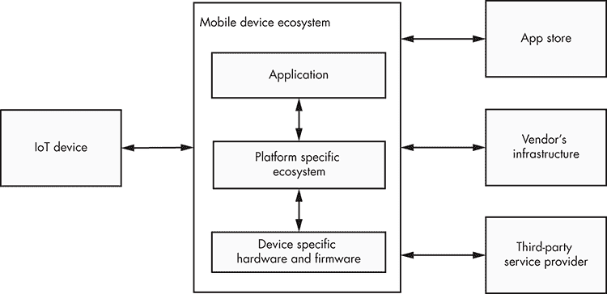

图 14-1：分解 IoT 伴随移动应用环境

我们将移动应用与平台特定的生态系统和硬件相关功能分开。我们还考虑了从应用商店安装 IoT 伴随移动应用的过程，应用与 IoT 设备的通信、供应商的基础设施，以及任何潜在的第三方服务提供商。

### 识别威胁

现在，我们将识别移动应用环境中的两种威胁：一般影响移动设备的威胁和专门影响 Android 与 iOS 环境的威胁。

#### 一般移动设备威胁

移动设备的主要特点是其便携性。您可以轻松携带手机到任何地方，因此它很容易丢失或被盗。即使人们偷窃手机是为了设备的价值，攻击者也可能从物联网伴侣应用的存储中获取敏感的个人数据。或者，他们可能尝试绕过应用中弱或损坏的身份验证控制，远程访问关联的物联网设备。若设备所有者仍然登录其物联网伴侣应用账户，这将大大简化攻击者的攻击过程。

此外，移动设备通常连接到不受信任的网络，例如咖啡馆和酒店房间中的随机 Wi-Fi 公共热点，这为各种网络攻击（如中间人攻击或网络嗅探）提供了机会。物联网伴侣应用通常设计为与供应商的基础设施、云服务和物联网设备进行网络连接。如果这些应用在不安全的网络中运行，攻击者可以窃取或篡改交换的数据。

该应用还可能作为物联网设备与供应商的 API、第三方提供商和云平台之间的桥梁。这些外部系统可能引入关于保护交换的敏感数据的新威胁。攻击者可以攻击和利用公开访问的服务或配置错误的基础设施组件，以获得远程访问并提取存储的数据。

安装应用的实际过程也可能容易受到攻击。并非所有物联网伴侣应用都来自官方的移动应用商店。许多移动设备允许您从第三方商店安装应用，或安装那些不一定由有效开发者证书签名的应用。攻击者利用这一问题分发包含恶意功能的假冒应用版本。

#### Android 和 iOS 威胁

现在让我们研究与 Android 和 iOS 平台相关的威胁。图 14-2 展示了这两个平台的生态系统。

这两个平台的软件包括三个层次：底层包含操作系统和与设备资源的接口；中间层由提供大部分 API 功能的库和应用框架组成；应用层则包含定制应用程序和一组系统应用程序。应用层负责让用户与移动设备进行交互。

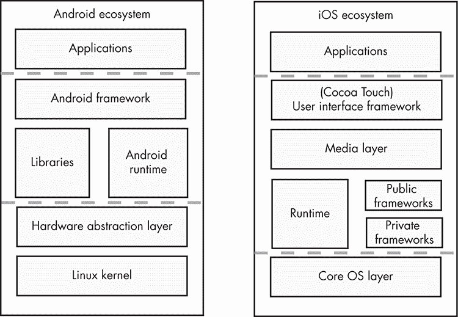

图 14-2：Android 和 iOS 生态系统

两个平台都为开发人员和用户提供了灵活性。例如，用户可能希望安装定制软件，如由不受信任的程序员开发的游戏和扩展程序。攻击者可以欺骗用户安装伪装成合法应用程序的恶意软件，这些应用程序可能以恶意方式与 IoT 配套应用程序进行交互。此外，这些平台提供了丰富的开发环境，但不谨慎或未经过培训的开发人员有时会因为不恰当地使用继承的设备特定安全控制，甚至在某些情况下禁用它们，从而未能保护敏感数据。

某些平台，如 Android，面临另一种威胁：运行该平台的不同设备数量。许多这些设备使用过时版本的操作系统，这些版本包含已知的漏洞，从而引发了*软件碎片化*问题。开发人员几乎不可能跟踪并缓解所有这些问题，也很难识别它们。此外，攻击者可以通过利用特定设备的不一致性，识别、针对并滥用保护不力的 IoT 配套应用程序。例如，涉及安全控制的 API，如指纹认证，可能由于硬件差异而无法始终如预期般工作。多家厂商为 Android 提供设备硬件，其规格和安全基准标准各不相同。这些厂商还负责维护并部署其自定义的*只读存储器（ROM）*，这加剧了碎片化问题。用户期望获得经过充分测试、强大且安全的软件，但开发人员却在一个不可预测的环境中建立在不太可靠的 API 上。

## Android 和 iOS 安全控制

Android 和 iOS 平台包括多个集成到其架构关键组件中的安全控制。图 14-3 总结了这些控制措施。

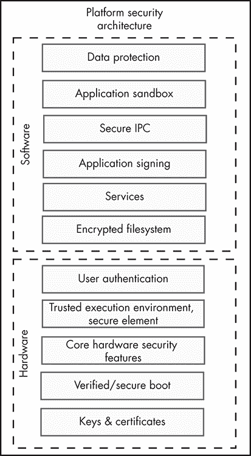

图 14-3：移动平台架构中的集成安全控制

以下章节将详细介绍这些控制措施。

### 数据保护与加密文件系统

为了保护应用程序和用户数据，这些平台必须请求涉及用户数据的不同平台组件之间的交互的同意，涉及的各方包括：用户（通过提示和通知）、开发人员（通过使用特定的 API 调用）以及平台（通过提供某些功能并确保系统按预期行为运行）。

为了保护静态数据，Android 和 iOS 使用*基于文件的加密（FBE）*和*全盘加密（FDE）*，而为了保护传输中的数据，这些平台可以加密所有传输。但这两种控制措施都由开发者通过使用提供的 API 中的适当参数来实现。在 Android 7.0 之前的版本不支持 FBE，而 4.4 之前的版本甚至不支持 FDE。在 iOS 平台上，即使设备正在改变状态（例如，设备启动或解锁，或者用户至少已通过身份验证一次），也可以实现文件加密。

### 应用沙箱、安全 IPC 和服务

Android 和 iOS 还会隔离平台组件。两个平台都使用 Unix 风格的权限，通过内核强制执行，以实现自主访问控制并形成应用沙箱。在 Android 上，每个应用作为其自己的用户运行，并拥有自己的 UID。系统进程和服务（包括电话、Wi-Fi 和蓝牙堆栈）也存在沙箱。Android 还具有强制访问控制，使用安全增强 Linux（SE-Linux）来规定每个进程或一组进程允许的操作。另一方面，所有 iOS 应用都作为相同的用户（名为“mobile”）运行，但每个应用都被隔离在一个类似于 Android 的沙箱中，只能访问其自己的文件系统部分。此外，iOS 内核禁止应用程序进行某些系统调用。两个平台都采用特定应用的权限风格方法，以允许安全的进程间通信和访问共享数据（Android 权限，iOS 权限）。这些权限在应用开发阶段声明，并在安装或执行时授予。两个平台还通过减少对驱动程序的访问或将驱动程序代码进行沙箱化，在内核层面实施类似的隔离。

### 应用签名

两个平台都使用应用签名来验证应用程序是否被篡改。经过批准的开发者必须在将应用提交到平台的官方应用商店之前生成这些签名，但签名验证算法的工作方式和验证时间存在差异。此外，Android 平台允许用户通过在应用设置中启用“未知来源”选项，安装任何开发者的应用。Android 设备厂商还会安装自己定制的应用商店，这些商店可能不一定遵守这一限制。相比之下，iOS 平台只允许你安装由授权组织的开发者创建的应用，使用企业证书，或者由设备拥有者创建的应用。

### 用户身份验证

两个平台都会对用户进行身份验证，通常基于知识因素（例如，通过请求 PIN 码、图案或用户定义的密码），使用生物识别技术（如指纹、虹膜扫描或面部识别），甚至使用行为学方法（比如在受信任的位置解锁设备或与受信任的设备配对）。身份验证控制通常涉及软件和硬件组件，尽管某些 Android 设备没有此类硬件组件。开发者可以通过 Android 平台框架提供的专用 API 调用来验证这些硬件的存在。在这两个平台上，开发者可以忽略平台提供的硬件支持的用户身份验证，或者在软件层面执行自定义的客户端身份验证控制，从而降低安全性表现。

### 隔离硬件组件和密钥管理

现代设备在硬件层面上隔离平台组件，以防止被破坏的内核完全控制硬件。它们通过使用隔离的硬件实现来保护某些与安全相关的功能，如密钥存储和操作。例如，它们可能会使用*受信平台模块*，这是一种专门用于执行固定加密操作的隔离硬件组件；*受信执行环境*，这是位于主处理器安全区域的可重编程组件；或单独的*防篡改硬件*，它与主处理器一起存在于离散的硬件中。为了支持金融交易，某些设备还具有一个安全元素，用于以 Java 小程序的形式执行代码，并且可以安全地托管机密数据。

一些设备厂商使用这些技术的定制实现。例如，最新的苹果设备使用*安全加密区*，这是一个独立的硬件组件，能够托管代码和数据并执行身份验证操作。最新的 Google 设备使用名为*Titan M*的防篡改硬件芯片，具备类似的功能。基于 ARM 的主芯片组支持名为*TrustZone*的受信执行环境，而基于 Intel 的主芯片组则支持名为*SGX*的环境。这些隔离硬件组件实现了平台的密钥存储功能。但开发者需要使用正确的 API 调用，才能安全地利用受信密钥存储。

### 已验证和安全启动

此外，这两个平台都使用在操作系统加载时经过验证的软件组件。*安全启动*验证设备的引导加载程序和某些隔离硬件实现的软件，启动硬件信任根。在基于 Android 的平台中，*Android 验证启动*负责验证软件组件，而在基于 iOS 的平台中，*SecureRom*则承担这一职责。

## 分析 iOS 应用

在本节中，我们将研究一个适用于 iOS 的开源移动应用：OWASP iGoat 项目（[`github.com/OWASP/igoat/`](https://github.com/OWASP/igoat/)）。尽管它不是一个物联网伴侣应用，但 iGoat 项目包含相同的业务逻辑，并使用许多物联网设备应用相似的功能。我们将专注于揭示可能存在于物联网伴侣应用中的漏洞。

iGoat 移动应用程序 (图 14-4) 包含一系列基于常见移动应用漏洞的挑战。用户可以导航到每个挑战并与故意设计为脆弱的组件进行交互，以提取隐藏的秘密标志或篡改应用程序的功能。

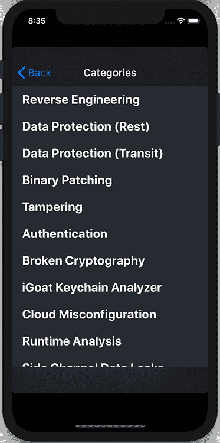

图 14-4：iGoat 移动应用中的类别

### 准备测试环境

要测试 iGoat，您需要一台 Apple 台式机或笔记本电脑，在 Xcode IDE 中设置 iOS 模拟器。您只能通过 Mac App Store 在 macOS 上安装 Xcode。您还应该使用 `xcode-select` 命令安装 Xcode 命令行工具：

```
$ **xcode-select --install**
```

现在，使用以下 `xcrun` 命令创建您的第一个模拟器，该命令允许您运行 Xcode 开发工具：

```
$ **xcrun simctl create simulator com.apple.CoreSimulator.SimDeviceType.iPhone-X com.apple.CoreSimulator.SimRuntime.iOS-12-2** 
```

第一个参数 `simctl` 允许您与 iOS 模拟器进行交互。`create` 参数创建一个新模拟器，名称由紧随其后的参数指定。最后两个参数指定设备类型，在我们的例子中是 iPhone X，以及 iOS 运行时版本，具体是 iOS 12.2。您可以通过打开 Xcode、点击 **Preferences** 选项，然后在 **Components** 标签中选择一个可用的 iOS 模拟器来安装其他 iOS 运行时（图 14-5）。

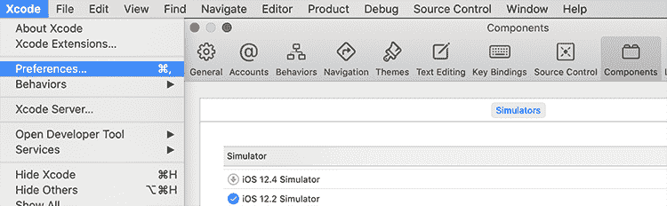

图 14-5：安装 iOS 运行时

使用以下命令启动并打开您的第一个模拟器：

```
$ **xcrun simctl boot <simulator identifier>** 
$ **/Applications/Xcode.app/Contents/Developer/Applications/Simulator.app/**
**Contents/MacOS/Simulator -CurrentDeviceUDID booted** 
```

接下来，使用 `git` 命令从仓库下载源代码，导航到 iGoat 应用程序文件夹，并使用 `xcodebuild` 命令为模拟设备编译该应用程序。然后，将生成的二进制文件安装到已启动的模拟器中：

```
$ **git clone https://github.com/OWASP/igoat**
$ **cd** **igoat****/IGoat**
$ **xcodebuild -project iGoat.xcodeproj -scheme iGoat -destination "****id****=****<simulator identifier>****"**
$ **xcrun simctl install  booted ~/Library/Developer/Xcode/DerivedData/**
**iGoat-<application identifier>/Build/Products/Debug-iphonesimulator/iGoat.app** 
```

您可以通过检查 `xcodebuild` 命令的最后几行，或者导航到 *~/Library/Developer/Xcode/DerivedData/* 文件夹来找到应用程序标识符。

### 提取和重新签名 IPA

如果您已经拥有用于测试的 iOS 设备，并且安装了您想要检查的应用程序，那么您需要以不同的方式提取该应用程序。所有 iOS 应用都存在于一个称为 *iOS 应用商店包（IPA）* 的归档文件中。过去，早期版本的 iTunes（直到 12.7.*x*）允许用户提取通过 App Store 获取的应用的 IPA。此外，在 iOS 8.3 之前的版本中，您可以使用像 iFunBox 或 iMazing 工具等软件从本地文件系统提取 IPA。但是这些不是官方方法，可能不支持最新的 iOS 平台。

相反，可以使用越狱设备从文件系统中提取应用的文件夹，或者尝试在在线仓库中查找其他用户已经解密的应用。例如，要从越狱设备中提取 *iGoat.app* 文件夹，可以进入 Applications 文件夹并搜索包含该应用的子文件夹：

```
$ **cd /var/containers/Bundle/Application/**
```

如果你通过 App Store 安装了应用，主二进制文件将会被加密。要从设备内存中解密 IPA，可以使用一个公开可用的工具，比如 Clutch（[`github.com/KJCracks/Clutch/`](http://github.com/KJCracks/Clutch/)）：

```
$ **clutch -d <bundle identifier>**
```

你可能也会有一个未为你的设备签名的 IPA，可能是软件供应商提供的，或者你已经通过之前提到的某种方式提取了这个 IPA。在这种情况下，安装到测试设备的最简单方法是使用像 Cydia Impactor（[`www.cydiaimpactor.com`](http://www.cydiaimpactor.com)*/*）或 node-applesign（[`github.com/nowsecure/node-applesign/`](https://github.com/nowsecure/node-applesign/)）这样的工具，使用个人的 Apple 开发者账号重新签名。这个方法通常用于安装像 unc0ver 这样的应用，它执行越狱功能。

### 静态分析

我们分析的第一步是检查创建的 IPA 档案文件。这个包实际上只是一个 ZIP 文件，因此可以通过以下命令解压缩它。

```
$ **unzip iGoat.ipa**
-- Payload/
---- iGoat.app/
------- 1Info.plist 
------- 2iGoat 
------- ...
```

解压后的文件夹中最重要的文件是 *信息属性列表文件*（名为 *Info.plist*1），这是一个结构化的文件，包含了应用的配置信息，还有一个与应用同名的可执行文件 2。你还会看到其他一些资源文件，它们存放在主应用的可执行文件外部。

打开信息属性列表文件。一个常见的可疑发现是注册的 URL Scheme 存在（图 14-6）。


图 14-6：信息属性列表文件中的注册 URL Scheme

*URL scheme* 主要允许用户从其他应用打开特定的应用界面。攻击者可能试图利用这些漏洞，通过让设备在加载该界面时在脆弱的应用中执行不需要的操作。我们稍后会在动态分析阶段测试这些 URL Scheme 是否存在此类漏洞。

#### 检查属性列表文件中的敏感数据

接下来，我们来看其余的属性列表文件（以 *.plist* 扩展名结尾的文件），这些文件存储序列化的对象，通常包含用户设置或其他敏感数据。例如，在 iGoat 应用中，*Credentials.plist* 文件包含与身份验证控制相关的敏感数据。你可以使用 Plutil 工具读取这个文件，它会将 *.plist* 文件转换为 XML 格式：

```` ``` $ **plutil -convert xml1 -o -** **Credentials.plist**  <?xml version="1.0" encoding="UTF-8"?> <plist version="1.0"> <string>Secret@123</string> <string>admin</string> </plist> ```    You can use the identified credentials to authenticate in the Data Protection (Rest) category’s Plist Storage challenge in the app functionalities.    #### Inspecting the Executable Binary for Memory Protections    Now we’ll inspect the executable binary and check whether it’s been compiled with the necessary memory protections. To do this, run the object file displaying tool (Otool), which is part of Xcode’s CLI developer tools package:    ``` $ **otool -l iGoat | grep -A 4 LC_ENCRYPTION_INFO**  cmd LC_ENCRYPTION_INFO  cmdsize 20 cryptoff 16384 cryptsize 3194880 1 cryptid 0  $ **otool -hv iGoat** magic 	    cputype cpusubtype  caps    filetype ncmds sizeofcmds      flags MH_MAGIC  ARM     V7          0x00    EXECUTE  35    4048            NOUNDEFS DYLDLINK TWOLEVEL WEAK_DEFINES BINDS_TO_WEAK 2 PIE  ```    First, we examine whether the binary has been encrypted in the App Store by investigating `cryptid` 1. If this flag is set to `1`, the binary is encrypted and you should attempt to decrypt it from the device memory using the approach described earlier in “Extracting and Re-Signing an IPA” on page 343\. We also check whether address space layout randomization is enabled by checking whether the PIE flag 2 exists in the binary’s header. *Address space layout randomization* is a technique that randomly arranges the memory address space positions of a process to prevent the exploitation of memory corruption vulnerabilities.    Using the same tool, check whether *stack-smashing protection* is enabled. Stack-smashing protection is a technique that detects memory corruption vulnerabilities by aborting a process’s execution if a secret value in the memory stack changes.    ``` $ **otool -I -v iGoat | grep stack** 0x002b75c8   478 ___stack_chk_fail 0x00314030   479 ___stack_chk_guard1 0x00314bf4   478 ___stack_chk_fail ```    The `__stack_chk_guard`1 flag indicates that stack-smashing protection is enabled.    Finally, check whether the app is using *Automatic Reference Counting (ARC)*, a feature that replaces traditional memory management by checking for symbols, such as `_objc_autorelease`, `_objc_storeStrong`, and `_objc_retain`:    ``` $ **otool -I -v iGoat | grep _objc_autorelease**  0x002b7f18   715 _objc_autorelease\ ```    The ARC mitigates memory-leak vulnerabilities, which occur when developers fail to free unnecessary allocated blocks and can lead to memory exhaustion issues. It automatically counts the references to the allocated memory blocks and marks blocks with no remaining references for deallocation.    #### Automating Static Analysis    You can also automate your static analysis of the application source code (if it’s available) and the generated binary. Automated static analyzers examine several possible code paths and report potential bugs that could be almost impossible to identify using manual inspection.    For example, you could use astatic analyzer like `llvm clang` to audit the app’s source code at compile time. This analyzer identifies a number of bug groups, including logic flaws (such as dereferencing null pointers, returning an address to stack-allocated memory, or using undefined results of business logic operations); memory management flaws (such as leaking objects and allocated memory and allocation overflows); dead store flaws (such as unused assignments and initializations); and API usage flaws originating from the incorrect use of the provided frameworks. It’s currently integrated in Xcode, and you can use it by adding the `analyze` parameter in the build command:    ``` $ **xcodebuild  analyze -project iGoat.xcodeproj -scheme iGoat -destination  "name=iPhone X"** ```    The analyzer bugs will appear in build log. You could use many other tools to automatically scan the application binary, such as the Mobile Security Framework (MobSF) tool ([`github.com/MobSF/Mobile-Security-Framework-MobSF/`](https://github.com/MobSF/Mobile-Security-Framework-MobSF/)).    ### Dynamic Analysis    In this section, we’ll execute the app in the simulated iOS device, test the device’s functionalities by submitting user input, and examine the app’s behavior within the device ecosystem. The easiest approach to this task is to manually examine how the app affects major device components, such as the filesystem and the keychain. This dynamic analysis can reveal insecure data storage and improper platform API usage issues.    #### Examining the iOS File Structure and Its Databases    Let’s navigate to the application folder in the simulated device to examine the file structure that iOS apps use. In iOS platforms, apps can only interact with directories inside the app’s sandbox directory. The sandbox directory contains the *Bundle container*, which is write-protected and contains the actual executable, and the *Data container*, which contains a number of subdirectories (such as *Documents*, *Library*, *SystemData*, and *tmp*) that the app uses to sort its data.    To access the simulated device filesystem, which serves as the root directory for the following sections of the chapter, enter the following command:    ``` $ **cd ~/Library/Developer/CoreSimulator/Devices/<simulator identifier>/** ```    Next, navigate to the *Documents* folder, which will initially be empty. To locate the application identifier, you can search for the iGoat app using the `find` command:    ``` $ **find . -name** *******iGoat******* ./data/Containers/Data/Application/<application id>/Library/Preferences/com.swaroop.iGoat.plist $ **cd data/Containers/Data/Application/<application id>/Documents** ```    The initially empty folder will be populated with files created dynamically by the application’s different functionalities. For example, by navigating to the Data Protection (Rest) category in the app functionalities, selecting the Core Data Storage challenge, and pressing the Start button, you’ll generate a number of files with the prefix [CoreData](http://CoreData). The challenge requires you to inspect those files and recover a pair of stored credentials.    You can also monitor the dynamically created files using the `fswatch` application, which you can install through one of the available third-party package managers in macOS, such as Homebrew ([`brew.sh/`](https://brew.sh/)) or MacPorts ([`www.macports.org/`](https://www.macports.org/)).    ``` $ **brew install fswatch** $ **fswatch -r ./** /Users/<username>/Library/Developer/CoreSimulator/Devices/<simulator identifier>/data/Containers/Data/Application/<application id> /Documents/CoreData.sqlite ```    Perform the installation by specifying the Homebrew package manager’s `brew` binary followed by the `install` parameter and the name of the requested package. Next, use the `fswatch` binary followed by the `-r` parameter to recursively monitor the subfolders and the target folder, which in our case is the current directory. The output will contain the full path of any created file.    We’ve already mentioned how to examine the contents of *.plist* files, so we’ll now focus on these *CoreData* files. Among other tasks, the *CoreData framework* abstracts the process of mapping objects to a store, making it easy for developers to save data on the device filesystem in a `sqlite` database format without having to manage the database directly. Using the `sqlite3` client, you can load the database, view the database tables, and read the contents of the `ZUSER` table, which contains sensitive data, such as user credentials:    ``` $ **sqlite3 CoreData.sqlite** sqlite> **.tables** ZTEST         ZUSER         Z_METADATA    Z_MODELCACHE  Z_PRIMARYKEY sqlite> select * from ZUSER ; 1|2|1|john@test.com|coredbpassword ```    You can use the identified credentials later to authenticate in the “Core Data Storage” challenge’s login form. Once you do so, you should receive a success message indicating the completion of the challenge.    A similar vulnerability existed in the SIMATIC WinCC OA Operator application for the iOS platform, which allowed users to control a Siemens SIMATIC WinCC OA facility (such as water supply facilities and power plants) easily via a mobile device. Attackers with physical access to the mobile device were able to read unencrypted data from the app’s directory ([`www.cvedetails.com/cve/CVE-2018-4847/`](https://www.cvedetails.com/cve/CVE-2018-4847/)).    #### Running a Debugger    It’s also possible to examine an application using a debugger. This technique would reveal the application’s inner workings, including the decryption of passwords or the generation of secrets. By examining these processes, we can usually intercept sensitive information compiled into the application binary and presented at runtime.    Locate the process identifier and attach a debugger, such as `gdb` or `lldb`. We’ll use `lldb` from the command line. It’s the default debugger in Xcode, and you can use it to debug C, Objective-C, and C++ programs. Enter the following to locate the process identifier and attach the `lldb`debugger.    ``` $ **ps -A | grep iGoat.app** 59843 ??         0:03.25 /..../iGoat.app/iGoat $ **lldb** (lldb) **process attach --pid 59843** Executable module set to "/Users/.../iGoat.app/iGoat". Architecture set to: x86_64h-apple-ios-. (lldb) **process continue** Process 59843 resuming ```    When you attach the debugger, the process pauses, so you’ll have to continue the execution by using the `process continue` command. Watch the output as you do so to locate interesting functions that perform security related operations. For example, the following function calculates the password you can use to authenticate in the Runtime Analysis category’s Private Photo Storage challenge in the app’s functionalities:    ``` - 1 (NSString *)thePw  {     char xored[] = {0x5e, 0x42, 0x56, 0x5a, 0x46, 0x53, 0x44, 0x59, 0x54, 0x55};     char key[] = "1234567890";     char pw[20] = {0};       for (int i = 0; i < sizeof(xored); i++) {         pw[i] = xored[i] ^ key[i%sizeof(key)];     }     return [NSString stringWithUTF8String:pw];  } ```    To understand what the function does, check the iGoat app’s source code, which you downloaded earlier using the `git` command. More precisely, look at the `thePw`1 function in the *iGoat/Personal Photo Storage/PersonalPhotoStorageVC.m* class.    It’s now possible to intentionally interrupt the software execution to this function using a breakpoint to read the calculated password from the app’s memory. To set a breakpoint, use the `b` command followed by the function name:    ``` (lldb) **b thePw**  Breakpoint 1: where = iGoat`-[PersonalPhotoStorageVC thePw] + 39 at PersonalPhotoStorageVC.m:60:10, address = 0x0000000109a791cs7 (lldb)  Process 59843 stopped * thread #1, queue = 'com.apple.main-thread', stop reason = breakpoint 1.1    ...    59  	- (NSString *)thePw{ -> 60  	    char xored[] = {0x5e, 0x42, 0x56, 0x5a, 0x46, 0x53, 0x44, 0x59, 0x54, 0x55};    61  	    char key[] = "1234567890";    62  	    char pw[20] = {0}; ```    After navigating to the corresponding functionality in the simulated app, the app should freeze and a message pointing to the execution step with an arrow should appear in the `lldb` window.    Now move to the following execution steps using the `step` command. Continue doing so until you reach the end of the function where the secret password gets decrypted:    ``` (lldb) **step**      frame #0: 0x0000000109a7926e iGoat`-PersonalPhotoStorageVC thePw at PersonalPhotoStorageVC.m:68:12    65  	        pw[i] = xored[i] ^ key[i%sizeof(key)];  66  	    }	     -> 68  	    return [NSString stringWithUTF8String:pw];     69  	}    71  	@e 1 (lldb) **print pw** 2 (char [20]) $0 =  "**opensesame**"  ```    Using the `print`1 command, you can retrieve the decrypted password 2. Learn more about the `lldb` debugger in *iOS Application Security* by David Thiel ([`nostarch.com/iossecurity/`](https://nostarch.com/iossecurity/)).    #### Reading Stored Cookies    Another not so obvious location in which mobile apps usually store sensitive information is the *Cookies* folder in the filesystem, which contains the HTTP cookies websites use to remember user information. IoT companion apps navigate to and render websites in WebView to present web content to end users. (A discussion of WebView is outside the scope of this chapter, but you can read more about it at the iOS and Android developer pages. We’ll also use WebView in an attack against a home treadmill in Chapter 15.) But many of these sites require user authentication to present personalized content, and as a result, they use HTTP cookies to track the active users’ HTTP sessions. We can search these cookies for authenticated user sessions that could allow us to impersonate the user on these websites and retrieve the personalized content.    The iOS platform stores these cookies in a binary format, often for long periods of time. We can use the BinaryCookieReader ([`github.com/as0ler/BinaryCookieReader/`](https://github.com/as0ler/BinaryCookieReader/)) tool to decode them in a readable form. To run it, navigate to the [Cookies](http://Cookies) folder, and then run this Binary Cookie Reader Python script:    ``` $ **cd data/Containers/Data/Application/<application-id>/Library/Cookies/** $ **python BinaryCookieReader/BinaryCookieReader.py** com.swaroop.iGoat.binarycookies  ...  Cookie : 1 sessionKey=dfr3kjsdf5jkjk420544kjkll; domain=www.github.com; path=/OWASP/iGoat;              expires=Tue, 09 May 2051; ```    The tool returns cookies that contain session keys for a website 1. You could use that data to authenticate in the Data Protection (Rest) category’s Cookie Storage challenge in the app functionalities.    You might also find sensitive data in the HTTP caches, which websites use to improve performance by reusing previously fetched resources. The app stores these resources in its */Library/Caches/* folder in a SQLite database named *Cache.db.* For example, you can solve the Data Protection (Rest) category’s Webkit Cache challenge in the app functionalities by retrieving the cached data from this file. Load the database and then retrieve the contents of the `cfurl_cache_receiver_data` table, which contains the cached HTTP responses:    ``` $ **cd data/Containers/Data/Application/<application-id>/Library/Caches/com.swaroop.iGoat/** $ **sqlite3 Cache.db** sqlite> **select * from cfurl_cache_receiver_data;** 1|0|<table border='1'><tr><td>key</td><td>**66435@J0hn**</td></tr></table> ```    A similar vulnerability affects the popular Hickory Smart app for iOS versions 01.01.07 and earlier; the app controls smart deadbolts. The app’s database was found to contain information that could allow attackers to remotely unlock doors and break into homes ([`cve.mitre.org/cgi-bin/cvename.cgi?name=CVE-2019-5633/`](https://cve.mitre.org/cgi-bin/cvename.cgi?name=CVE-2019-5633/)).    #### Inspecting Application Logs and Forcing the Device to Send Messages    Moving forward with our assessment, we can inspect the application logs to identify leaked debug strings that might help us to infer the application business logic. You can retrieve the logs through the Console app’s interface, which is preinstalled in macOS, as shown in Figure 14-7.      Figure 14-7: Exposed encryption password in iOS device logs      You can also retrieve them using the Xcrun tool:    ``` $ **`xcrun simctl spawn booted log stream > sim.log&`; open sim.log;** ```    The device logs contain an encryption key that you can use to authenticate in the Key Management category’s Random Key Generation challenge in the app functionalities. It seems that although the application correctly generated an encryption key for authentication purposes, this key was leaked in the logs, so an attacker with physical access to a computer and a paired device could obtain it.    A careful inspection of the logs while the other app functionalities are in use reveals that the app uses the URL scheme we identified on page 344 to send an internal message, as shown in Figure 14-8.  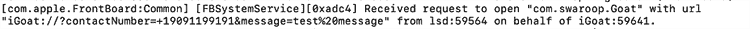    Figure 14-8: Exposed URL scheme parameters in iOS device logs      Let’s verify this behavior by using the `xcrun` command to open a URL with a similar structure in the simulator’s browser:    ``` $ **xcrun simctl openurl booted** **“iGoat://?contactNumber=+1000000&message=hacked”** ```    To exploit this vulnerability, we could create a fake HTML page that would load the URL when the browser renders the included HTML elements and then force the victim to send multiple unsolicited messages of this type. You can use the following HTML to conduct this attack when the user clicks the link. This attack would let you successfully pass the URL Scheme challenge in the app functionalities:    ``` <html> <a href="iGoat://?contactNumber=+1000000&message=hacked"/> click here</a> </html> ```    Figure 14-9 shows that we succeeded in sending a text message from the user’s phone.  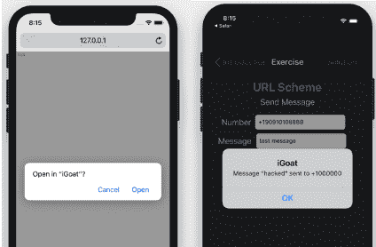    Figure 14-9: Abuse of the exposed URL scheme to force a victim to send SMS messages      This vulnerability could be extremely useful; in some cases, it could let you remotely control IoT devices that receive commands via text messages from authorized numbers. Smart car alarms often have this feature.    #### Application Snapshots    Another common way data gets leaked in iOS apps is through app screenshots. When the user selects the home button, iOS takes a screenshot of the app by default and stores it in the file system in cleartext. This screenshot can contain sensitive data, depending on the screen the user was viewing. You can replicate this issue in the Side Channel Data Leaks category’s Backgrounding challenge in the app functionalities.    Using the following commands, you can navigate to the application’s *Snapshots* folder, where you might find currently saved snapshots:    ``` $ **cd data/Containers/Data/Application/<application-id>/Library/Caches/Snapshots/com.swaroop.iGoat/** $ **open E6787662-8F9B-4257-A724-5BD79207E4F2\@3x.ktx** ```    #### Testing for Pasteboard and Predictive Text Engine Data Leaks    Additionally, iOS apps commonly suffer from pasteboard and predictive text engine data leaks. The *pasteboard* is a buffer that helps users share data between different application interfaces, or even between different applications, when they select a cut, copy, or duplicate operation from a system-provided menu. But this exact functionality might unintentionally disclose sensitive information, such as the user’s password, to third-party malicious apps that are monitoring this buffer, or to other users on a shared IoT device.    The *predictive text engine* stores words and sentences that a user types and then automatically suggests them the next time the user attempts to fill an input, improving the overall writing speed. But attackers can easily find this sensitive data in a jailbroken device’s filesystem by navigating to the following folder:    ``` $ **cd data/Library/Keyboard/en-dynamic.lm/** ```    Using this knowledge, you can easily solve the Side Channel Data Leaks category’s Keystroke Logging and the Cut-and-Paste challenges in the app functionalities.    The Huawei HiLink app for iOS contained an information-leak vulnerability of this type ([`www.cvedetails.com/cve/CVE-2017-2730/`](https://www.cvedetails.com/cve/CVE-2017-2730/)). The app works with many Huawei products, such as Huawei Mobile WiFi (E5 series), Huawei routers, Honor Cube, and Huawei home gateways. The vulnerability allowed attackers to collect user information about the iPhone model and firmware version and potentially track the vulnerable devices.    ### Injection Attacks    Although XSS injection is a very common vulnerability in web applications, it’s difficult to find in mobile apps. But you’ll sometimes see it in cases when an app uses WebView to present untrusted content. You can test such a case in the Injection Flaws category’s Cross Site Scripting challenge in the app functionalities by injecting a simple JavaScript payload between script tags in the provided input field (Figure 14-10).  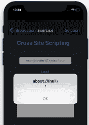    Figure 14-10: An XSS attack in the examined application      An adversary able to exploit an XSS vulnerability in WebView could access any sensitive information currently rendered, as well as the HTTP authentication cookies that might be in use. They could even tamper with the presented web page by adding customized phishing content, such as fake login forms. In addition, depending on the WebView configuration and the platform framework support, the attacker might also access local files, exploit other vulnerabilities in supported WebView plug-ins, or even perform requests to native function calls.    It might also be possible to perform a SQL injection attack on mobile apps. If the application uses the database to log usage statistics, the attack would most likely fail to alter the application flow. On the contrary, if the application uses the database for authentication or restricted content retrieval and a SQL injection vulnerability is present, we might be able to bypass that security mechanism. If we can modify data to make the application crash, we can turn the SQL injection into a denial-of-service attack. In the Injection Flaws category’s SQL Injection challenge in the app functionalities, you can use a SQL injection attack vector to retrieve unauthorized content using a malicious SQL payload.    Note that since iOS 11, the iPhone keyboard contains only a single quotation mark instead of the ASCII vertical apostrophe character. This omission might increase the difficulty of exploiting certain SQL vulnerabilities, which often require an apostrophe to create a valid statement. It’s still possible to disable this feature programmatically using the `smartQuotesType` property ([`developer.apple.com/documentation/uikit/uitextinputtraits/2865931-smartquotestype/`](https://developer.apple.com/documentation/uikit/uitextinputtraits/2865931-smartquotestype/)).    ### Keychain Storage    Many applications store secrets using the *keychain service API*, a platform-provided encrypted database. In the iOS simulator, you can obtain those secrets by opening a simple SQL database. You might need to use the `vacuum` command to merge the data from the SQLite system’s *Write-Ahead-Logging* mechanism. This popular mechanism is designed to provide durability to multiple database systems.    If the app is installed on a physical device, you’ll first need to jailbreak the device and then use a third-party tool to dump the keychain records. Possible tools include the Keychain Dumper ([`github.com/ptoomey3/Keychain-Dumper/`](https://github.com/ptoomey3/Keychain-Dumper/)), the IDB tool ([`www.idbtool.com/`](https://www.idbtool.com/)), and the Needle ([`github.com/FSecureLABS/needle/`](https://github.com/FSecureLABS/needle/)). In the iOS simulator, you could also use the iGoat Keychain Analyzer included in the iGoat app. This tool only works for the iGoat app.    Using the retrieved records, you can now solve the Data Protection (Rest) category’s Keychain Usage challenge in the app functionalities. You must first uncomment the `[self storeCredentialsInKeychain]` function call in the *iGoat/Key Chain/KeychainExerciseViewController.m* file to configure the application to use the keychain service API.    ### Binary Reversing    Developers usually hide secrets in the application source code’s business logic. Because the source code isn’t always available, we’ll examine the binary by reversing the assembly code. For this purpose, you could use an open source tool like Radare2 ([`rada.re/n/`](https://rada.re/n/)).    Before the examination, we have to *thin* the binary. Thinning the binary only isolates a specific architecture’s executable code. You can find versions of the iOS binary in either the MACH0 or FATMACH0 format, which includes ARM6, ARM7, and ARM64 executables. We only want to analyze one of these, the ARM64 executable, which you can easily extract using the `rabin2` command:    ``` $ **rabin2 -x iGoat**  iGoat.fat/iGoat.arm_32.0 created (23729776) iGoat.fat/iGoat.arm_64.1 created (24685984) ```    We can then load and perform an initial analysis on the binary using the `r2`command:    ``` $ **r2 -A iGoat.fat/iGoat.arm_64.1**  [x] Analyze all flags starting with sym. and entry0 (aa) [x] Analyze function calls (aac) ... [0x1000ed2dc]> 1 **fs**   6019 * classes    35 * functions   442 * imports   … ```    The analysis will associate names, called *flags*, with specific offsets in the binary, such as sections, functions, symbols, and strings. We can obtain a summary of these flags using the `fs` command 1 and get a more detailed list using the `fs; f` command.    Use the `iI` command to retrieve information regarding the binary:    ``` [0x1000ed2dc]> **iI~crypto** 1 crypto   false  [0x1000ed2dc]> **iI~canary** 2 canary   true  ```    Inspect the returned compilation flags. Those we see here indicate that the specific binary has been compiled with Stack Smashing Protection 2 but hasn’t been encrypted by Apple Store 1.    Because iOS apps are usually written in Objective-C, Swift, or C++, they store all symbolic information in the binary; you can load it using the *ojbc.pl* script included in the `Radare2` package. This script generates shell commands based on these symbols and the corresponding addresses that you can use to update the Radare2 database:    ``` $ **objc.pl iGoat.fat/iGoat.arm_64.1** f objc.NSString_oa_encodedURLString = 0x1002ea934 ```    Now that all the existing metadata has been loaded into the database, we can search for specific methods and use the `pdf` command to retrieve the assembly code:    ``` [0x003115c0]> **fs; f | grep Broken**  0x1001ac700 0 objc.BrokenCryptographyExerciseViewController_getPathForFilename 0x1001ac808 1 method.BrokenCryptographyExerciseViewController.viewDidLoad … [0x003115c0]> **pdf @method.BrokenCryptographyExerciseViewController.viewDidLoad**  | (fcn) sym.func.1001ac808 (aarch64) 568 |   sym.func.1001ac808 (int32_t arg4, int32_t arg2, char *arg1); | |||||||   ; var void *var_28h @ fp-0x28 | |||||||   ; var int32_t var_20h @ fp-0x20 | |||||||   ; var int32_t var_18h @ fp-0x18 ```    It’s also possible to use the `pdc`command to generate pseudocode and decompile the specific function. In this case, Radare2 automatically resolves and presents references to other functions or strings:    ``` [0x00321b8f]> **pdc @method.BrokenCryptographyExerciseViewController.viewDidLoad** function sym.func.1001ac808 () {     loc_0x1001ac808:          … x8 = x8 + 0xca8          //0x1003c1ca8 ; str.cstr.b_nkP_ssword123 ; (cstr 0x10036a5da) "b@nkP@ssword123"  ```    We can easily extract the hardcoded value `b@nkP@ssword123`, which you can use to authenticate in the Key Management category’s Hardcoded Keys challenge in the app functionalities.    Using a similar tactic, researchers found a vulnerability in earlier versions of the MyCar Controls mobile app ([`cve.mitre.org/cgi-bin/cvename.cgi?name=CVE-2019-9493/`](https://cve.mitre.org/cgi-bin/cvename.cgi?name=CVE-2019-9493/)). The app allows users to remotely start, stop, lock, and unlock their car. It contained hardcoded admin credentials.    ### Intercepting and Examining Network Traffic    Another important part of an iOS app assessment is to examine its network protocol and the requested server API calls. Most mobile apps primarily use the HTTP protocol, so we’ll focus on it here. To intercept the traffic, we’ll use the community version of Burp Proxy Suite, which initiates a web proxy server that sits as a man-in-the-middle between the mobile and destination web server. You can find it at [`portswigger.net/burp/`](https://portswigger.net/burp/).    To relay the traffic, you’ll need to perform a man-in-the-middle attack, which you can do in numerous ways. Because we’re just trying to analyze the app, not re-create a realistic attack, we’ll follow the easiest attack path: configuring an HTTP proxy on the device within the network settings. In a physical Apple device, you can set an HTTP proxy by navigating to the connected wireless network. Once there, alter the proxy option of the macOS system to the external IPv4 address where you’ll run Burp Proxy Suite using port 8080\. In the iOS simulator, set the global system proxy from the macOS network settings, making sure to set **Web Proxy (HTTP)** and **Secure Web Proxy (HTTPS)** to the same value.    After configuring the proxy settings on an Apple device, all the traffic will redirect to Burp Proxy Suite. For example, if we use the Authentication task in the iGoat app, we could capture the following HTTP request, which contains a username and password:    ``` GET /igoat/token?username=**donkey**&password=**hotey** HTTP/1.1 Host: localhost:8080 Accept: */* User-Agent: iGoat/1 CFNetwork/893.14 Darwin/17.2.0 Accept-Language: en-us Accept-Encoding: gzip, deflate Connection: close ```    If the app used SSL to protect the intermediate communication, we’d have to perform the extra step of installing a specially crafted SSL certificate authority (CA) to our testing environment. Burp Proxy Suite can automatically generate this CA for us. You can obtain it by navigating to the proxy’s IP address using a web browser and then clicking the **Certificate** link at the top right of the screen.    The Akerun Smart Lock Robot app for iOS ([`www.cvedetails.com/cve/CVE-2016-1148/`](https://www.cvedetails.com/cve/CVE-2016-1148/)) contained a similar issue. More precisely, researchers discovered that all application versions earlier than 1.2.4 don’t verify SSL certificates, allowing man-in-the-middle attackers to eavesdrop on encrypted communications with the smart lock device.    ### Avoiding Jailbreak Detection Using Dynamic Patching    In this section, we’ll tamper with the application code as it’s executed in the device memory and dynamically patch one of its security controls to circumvent it. We’ll target the control that performs the environment integrity check. To perform this attack, we’ll use the Frida instrumentation framework ([`frida.re/`](https://frida.re/)). You can install it as follows using the `pip` package manager for Python:    ``` $ **pip install frida-tools** ```    Next, locate the function or API call that performs the environment integrity check. Because the source code is available, we can easily spot the function call in the `iGoat/String Analysis/Method Swizzling/MethodSwizzlingExerciseController.m` class. This security check only works on physical devices, so you won’t see any difference when it’s active in the simulator:    ``` assert((NSStringFromSelector(_cmd) isEqualToString:@”fileExistsAtPath:”]); // Check for if this is a check for standard jailbreak detection files if ([path hasSuffix:@”Cydia.app”] ||     [path hasSuffix:@”bash”] ||     [path hasSuffix:@”MobileSubstrate.dylib”] ||     [path hasSuffix:@”sshd”] ||     [path hasSuffix:@”apt”])_ ```    By dynamically patching this function, we can force the return parameter to always be successful. Using the Frida framework, we create a file called *jailbreak.js* with code that does just that:    ``` 1 var hook = ObjC.classes.NSFileManager["- fileExistsAtPath:"]; 2 Interceptor.attach(hook.implementation, {         onLeave: function(retval) {         3 retval.replace(0x01);          },     }); ```    This Frida code starts by searching for the Objective-C function `fileExistsAtPath` from the `NSFileManager` class and returns a pointer to this function 1. Next, it attaches an interceptor to this function 2 that dynamically sets a callback named `onLeave`. This callback will execute at the end of the function, and it’s configured to always replace the original return value with `0x01` (the success code) 3.    Then we apply the patch by attaching the Frida tool to the corresponding application process:    ``` $ **frida -l jailbreak.js -p 59843** ```    You can find the exact Frida framework syntax for patching Objective-C methods in the online documentation at [`frida.re/docs/javascript-api/#objc/`](https://frida.re/docs/javascript-api/#objc/).    ### Avoiding Jailbreak Detection Using Static Patching    You could circumvent jailbreak detection using static patching, too. Let’s use Radare2 to examine the assembly and patch the binary code. For example, we can replace the comparison of the `fileExists` result with a statement that is always true. You can find the function `fetchButtonTapped` at *iGoat/String Analysis/Method Swizzling/MethodSwizzlingExerciseController.m*:    ``` -(IBAction)fetchButtonTapped:(id)sender {     ...     if (fileExists)          [self displayStatusMessage:@"This app is running on ...     else         [self displayStatusMessage:@"This app is not running on ... ```    Because we want to reinstall the patched version of the code in the simulator, we’ll work with the app’s *Debug-iphonesimulator* version, which is located in the Xcode-derived data folder we mentioned on page 343\. First, we open the binary in write mode using the -w parameter:    ``` $ **r2 -Aw ~/Library/Developer/Xcode/DerivedData/iGoat-<application-id>/Build/Products/Debug-iphonesimulator/iGoat.app/iGoat**  [0x003115c0]> **fs; f | grep fetchButtonTapped** 0x1000a7130 326 sym.public_int_MethodSwizzlingExerciseController::fetchButtonTapped_int 0x1000a7130 1 method.MethodSwizzlingExerciseController.fetchButtonTapped: 0x100364148 19 str.fetchButtonTapped: ```    This time, instead of requesting that Radare2 disassemble or decompile the app with the `pdf` and `pdc` commands, we’ll change to the graph view by using the `VV` command and then pressing **p** on the keyboard. This representation is easier for locating business logic switches:    ``` [0x1000ecf64]> **VV @ method.MethodSwizzlingExerciseController.fetchButtonTapped:**  ```    This command should open the graph view shown in Figure 14-11.      Figure 14-11: The Radare2 graph view representing the logic switch      An easy way to disable the comparison is by replacing the `je` command (opcode `0x0F84`) with the `jne` command (opcode `0x0F85`), which returns the exact opposite result. As a consequence, when the processor reaches this step, it will continue execution in the block and report that the device isn’t jailbroken.    Note that this version of the binary is designed for the iOS simulator. The binary for the iOS device would contain the equivalent ARM64 operation of `TBZ`.    Change the view by pressing **q** to quit the graph view and then pressing **p** to enter assembly mode. This allows us to get the address of the operation in the binary (you could also use `pd` directly):    ``` [0x003115c0]>**q**  [0x003115c0]>**p**  … 0x1000a7218      f645e701       test byte [var_19h], 1           < 0x1000a721c      0f8423000000   je 0x1000a7245 ... [0x1000f7100]> **wx 0f8523000000 @ 0x1000a721c** ```    Then we can re-sign and reinstall the app in the simulator:    ``` $ **/usr/bin/codesign --force --sign - --timestamp=none ~/Library/Developer/Xcode/DerivedData/iGoat-<application-id>/Build/Products/Debug-iphonesimulator/iGoat.app** replacing existing signature ```    If we were working on a physical device, we’d have to use one of the binary re-signing techniques to install the modified binary.    ## Analyzing Android Applications    In this section, we’ll analyze the insecure Android app InsecureBankV2\. Like iGoat, this isn’t an IoT companion app, but we’ll focus on vulnerabilities relevant to IoT devices.    ### Preparing the Test Environment    Android has no environment restrictions, and you can perform a successful assessment whether your operating system is running on Windows, macOS, or Linux. To set up the environment, install the Android Studio IDE ([`developer.android.com/studio/releases/`](https://developer.android.com/studio/releases/)). Alternatively, you can install the Android software development kit (SDK) and the Android SDK Platform Tools directly by downloading the ZIP files from the same website.    Start the included *Android Debug Bridge service*, which is the binary that interacts with Android devices and emulators, and identify the connected devices using the following command:    ``` $ **adb start-server** * daemon not running; starting now at tcp:5037 * daemon started successfully ```    Currently, no emulators or devices are connected to our host. We can easily create a new emulator using the Android Virtual Device (AVD) Manager, which is included in the Android Studio and the Android SDK tools. Access AVD, download the Android version you want, install it, name your emulator, run it, and you’re ready to go.    Now that we’ve created an emulator, let’s try to access it by running the following commands, which will list the devices connected to your system. These devices might be actual devices or emulators:    ``` $ **adb devices** emulator-5554	device  ```    Excellent, an emulator was detected. Now we’ll install the vulnerable Android app in the emulator. You can find InsecureBankV2 at [`github.com/dineshshetty/Android-InsecureBankv2/`](https://github.com/dineshshetty/Android-InsecureBankv2/). Android apps use a file format called the Android Package (APK). To install the InsecureBankV2 APK to our emulator device, navigate to your target application folder and then use the following command:    ``` $ **adb -s emulator-5554 install app.apk** Performing Streamed Install Success ```    You should now see the application’s icon in the simulator, indicating the installation succeeded. You should also run InsecureBankV2 AndroLab, a python2 backend server using the commands which can be found in the same GitHub repository.    ### Extracting an APK    In some cases, you might want to investigate a specific APK file separately from the rest of the Android device. To do this, use the following commands to extract an APK from a device (or emulator). Before extracting a package, we need to know its path. We can identify the path by listing the relevant packages:    ``` $ **adb shell** **pm list packages**  com.android.insecurebankv2 ```    Once we’ve identified the path, we extract the application by using the `adb pull` command:    ``` $ **adb shell pm path com.android.insecurebankv2**  package:/data/app/com.android.insecurebankv2-Jnf8pNgwy3QA_U5f-n_4jQ==/base.apk $ **adb pull /data/app/com.android.insecurebankv2-Jnf8pNgwy3QA_U5f-n_4jQ==/base.apk** : 1 file pulled. 111.6 MB/s (3462429 bytes in 0.030s) ```    This command extracts the APK to your host system’s current working directory.    ### Static Analysis    Let’s start with static analysis by examining the APK file, which you’ll first need to decompress. Use the `apktool` ([`ibotpeaches.github.io/Apktool/`](https://ibotpeaches.github.io/Apktool/)) to extract all the relevant information from the APK without losing any data:    ``` $ **apktool d app.apk**  I: Using Apktool 2.4.0 on app.apk I: Loading resource table... …. ```    One of the most important files in the APK is *AndroidManifest.xml*. The Android manifest is a binary-encoded file containing information such as the Activities used. *Activities,* in an Android app, are the screens in the application’s user interface. All Android apps have at least one Activity, and the name of the main one is included in the manifest file. This Activity executes when you launch the app.    In addition, the manifest file contains the permissions that the app requires, the supported Android versions, and *Exported* Activities, which might be prone to vulnerabilities, among other features. An Exported Activity is a user interface that components of different applications can launch.    The *classes.dex*file contains the application’s source code in a Dalvik Executable (DEX) file format. Inside the *META-INF* folder, you’ll find various metadata from the APK file. In the *res*folder, you’ll find compiled resources, and in the *assets* folder, you’ll find the application’s assets. We’ll devote most of our time to exploring *AndroidManifest.xml* and the DEX format files.    #### Automating Static Analysis    Let’s explore some tools that will help you perform static analysis. But be wary of basing your entire test on just automated tools, because they’re not perfect and you might miss a critical issue.    You can use Qark ([`github.com/linkedin/qark/`](https://github.com/linkedin/qark/)) to scan the source code and an application’s APK file. With the following command, we perform static analysis on the binary:    ``` $ **qark --apk path/to/my.apk** Decompiling sg/vantagepoint/a/a... ... Running scans... Finish writing report to /usr/local/lib/python3.7/site-packages/qark/report/report.html ... ```    This will take some time. Aside from Qark, you can use the MobSF tool mentioned earlier in this chapter.    ### Binary Reversing    The Qark tool you just ran reversed the binary to perform checks on it. Let’s try to do this manually. When you extracted files from the APK, you were provided with a bunch of DEX files containing compiled app code. Now we’ll translate this bytecode to make it more readable.    For this purpose, we’ll use the Dex2jartool ([`github.com/pxb1988/dex2jar/`](https://github.com/pxb1988/dex2jar/)) to convert the bytecode to a JAR file:    ``` $ **d2j-dex2jar.sh app.apk**  dex2jar app.apk -> ./app-dex2jar.jar ```    Another great tool for this purpose is Apkx([`github.com/b-mueller/apkx/`](https://github.com/b-mueller/apkx/)), which is a wrapper for different decompilers. Remember that even if one decompiler fails, another one might succeed.    Now we’ll use a JAR viewer to browse the APK source code and read it easily. A great tool for this purpose is JADX`(-gui)(`[`github.com/skylot/jadx/`](https://github.com/skylot/jadx/)). It basically attempts to decompile the APK and allows you to navigate through the decompiled code in highlighted text format. If given an already decompiled APK, it will skip the decompiling task.    You should see the app broken down into readable files for further analysis. Figure 14-12 shows the contents of one such file.  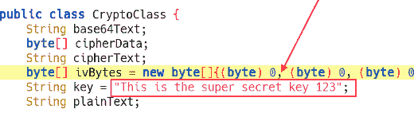    Figure 14-12: Contents of `CryptoClass` depicting the value of the variable key      In `CryptoClass`, we’ve already uncovered an issue: a hardcoded key. This key appears to be a secret for some cryptographic functions.    Researchers found a similar vulnerability in EPSON’s iPrint application version 6.6.3 ([`www.cvedetails.com/cve/CVE-2018-14901/`](https://www.cvedetails.com/cve/CVE-2018-14901/)), which allowed users to remotely control their printing devices. The app contained hardcoded API and Secret keys for the Dropbox, Box, Evernote, and OneDrive services.    ### Dynamic Analysis    Now we’ll move onto dynamic analysis. We’ll use Drozer, a tool that helps us test Android permissions and exported components ([`github.com/FSecureLABS/drozer/`](https://github.com/FSecureLABS/drozer/)). Note that Drozer has stopped being developed, but it’s still useful for simulating rogue applications. Let’s find more information about our application by issuing the following command:    ``` dz> **run app.package.info -a com.android.insecurebankv2** Package: com.android.insecurebankv2   Process Name: com.android.insecurebankv   Data Directory: /data/data/com.android.insecurebankv2   APK Path: /data/app/com.android.insecurebankv2-1.apk   UID: 10052   GID: [3003, 1028, 1015]   Uses Permissions:   - android.permission.INTERNET   - android.permission.WRITE_EXTERNAL_STORAGE   - android.permission.SEND_SMS   ... ```    Look at this high-level overview. From here, we can go a bit deeper by listing the app’s attack surface. This will provide us with enough information to identify Exported Activities, broadcast receivers, content providers, and services. All these components might be configured poorly and thus be prone to security vulnerabilities:    ``` dz> **run app.package.attacksurface com.android.insecurebankv2** Attack Surface: 1 5 activities exported  1 broadcast receivers exported 1 content providers exported 0 services exported ```    Even though this is a small app, it looks like it’s exporting various components, the majority of which are Activities 1.    #### Resetting User Passwords    Let’s take a closer look at the exported components: it’s possible these Activities don’t require special permissions to view:    ``` dz> **run app.activity.info -a com.android.insecurebankv2** Package: com.android.insecurebankv2 com.android.insecurebankv2.LoginActivity   Permission: null 1 com.android.insecurebankv2.PostLogin      Permission: null 2 com.android.insecurebankv2.DoTransfer      Permission: null 3 com.android.insecurebankv2.ViewStatement      Permission: null 4 com.android.insecurebankv2.ChangePassword      Permission: null ```    It looks like the Activities don’t have any permissions and third-party apps can trigger them.    By accessing the `PostLogin`1Activity, we can bypass the login screen, which looks like a win. Access that specific Activity through the Adb tool, as demonstrated here, or Drozer:    ``` $ **adb shell am start -n com.android.insecurebankv2/com.android.insecurebankv2.PostLogin** Starting: Intent { cmp=com.android.insecurebankv2/.PostLogin  ```    Next, we should either extract information from the system or manipulate it in some way. The `ViewStatement`3 Activity looks promising: we might be able to extract the user’s bank transfer statements without having to log in. The `DoTransfer`2and `ChangePassword`4 Activities are state-altering actions that probably have to communicate with the server-side component. Let’s try to change the user’s password:    ``` $ **adb shell am start -n com.android.insecurebankv2/com.android.insecurebankv2.ChangePassword**  Starting: Intent { cmp=com.android.insecurebankv2/.ChangePassword } ```    We trigger the `ChangePassword`Activity, set a new password, and press ENTER. Unfortunately, the attack won’t work. As you can see in the emulator, the username field is empty (Figure 14-13). But we were very close. It’s not possible to edit the username field through the UI, because the input is empty and disabled.  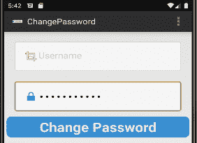    Figure 14-13: The `ChangePassword` Activity’s interface with the username field empty and disabled      Most likely, another Activity fills this field by triggering this Intent. By doing a quick search, you should be able to find the point at which this Activity gets triggered. Look at the following code. The Intent responsible for filling the username field creates a new Activity and then passes an extra parameter with the name `uname`. This must be the username.   ``` protected void changePasswd() {     Intent cP = new Intent(getApplicationContext(), ChangePassword.class);     cP.putExtra("uname", uname);      startActivity(cP); } ```    By issuing the following command, we start the `ChangePassword` Activity and provide the username as well:    ``` $ **adb shell am start -n com.android.insecurebankv2/com.android.insecurebankv2.ChangePassword**   **--es "uname" "dinesh"** Starting: Intent { cmp=com.android.insecurebankv2/.ChangePassword (has extras) } ```    You should see the username appear in the login form (Figure 14-14).  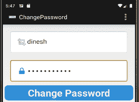    Figure 14-14: The `ChangePassword` Activity’s interface with the username field completed      Now that we’ve filled the username field, we can change the password successfully. We can attribute this vulnerability to the Exported Activity but mostly to the server-side component. If the password-reset functionality required the user to add their current password as well as the new one, this issue would have been avoided.    #### Triggering SMS Messages    Let’s continue our exploration of the InsecureBankV2 app. We might be able to uncover more interesting behavior.    ``` <receiver android:name="com.android.insecurebankv2.MyBroadCastReceiver" 1android:exported="true">    <intent-filter><action android:name="theBroadcast"/></intent-filter> </receiver> ```    While reviewing *AndroidManifest.xml*, we can see that the app exports one receiver 1. Depending on its functionality, it might be worth exploiting. By visiting the relevant file, we can see that this receiver requires two arguments, `phn` and `newpass`. Now we have all the necessary information that we need to trigger it:    ``` $ **adb shell am broadcast -a theBroadcast -n com.android.insecurebankv2/com.android.**  `insecurebankv2.MyBroadCastReceiver --es phonenumber 0 --es newpass test` Broadcasting: Intent { act=theBroadcast flg=0x400000 cmp=com.android.insecurebankv2/.MyBroadCastReceiver (has extras) } ```    If successful, you should receive an SMS message with your new password. As an attack, you could use this feature to send messages to premium services, causing the unsuspected victim to lose significant amounts of money.    #### Finding Secrets in the App Directory    There are many ways to store secrets in Android, some of which are secure enough. Others? Not so much. For example, it’s quite common for applications to store secrets inside their application directories. Even though this directory is private to the app, in a compromised or rooted device, all apps could access each other’s private folders. Let’s look at our app’s directory:    ``` $ **cat shared_prefs/mySharedPreferences.xml**  <map>     <string name="superSecurePassword">**DTrW2VXjSoFdg0e61fHxJg==&#10;**    </string>     <string name="EncryptedUsername">**ZGluZXNo&#13;&#10;**</string> </map> ```    The app appears to store user credentials inside the shared preferences folder. With a little bit of research, we can see that the key we discovered earlier in this chapter, located in the file *com.android.insecurebankv2.CryptoClass*, is the key used to encrypt that data. Combine this information and try to decrypt the data located in that file.    A similar issue existed in a popular IoT companion app, TP-Link Kasa and was discovered by M. Junior et al. ([`arxiv.org/pdf/1901.10062.pdf`](https://arxiv.org/pdf/1901.10062.pdf)). The app used a weak symmetric encryption function, the Caesar cipher, combined with a hardcoded seed to encrypt sensitive data. Also, researchers reported such a vulnerability in the Philips HealthSuite Health Android app, which was designed to allow you to retrieve key body measurements from a range of Philips connected health devices. The issue allowed an attacker with physical access to impact the confidentiality and integrity of the product ([`www.cvedetails.com/cve/CVE-2018-19001/`](https://www.cvedetails.com/cve/CVE-2018-19001/)).    #### Finding Secrets in Databases    Another low-hanging fruit to check for secret storing are the databases located in the very same directory. Very often, you’ll see secrets or even sensitive user information being stored unencrypted in local databases. By looking at the databases located in your application’s private storage, you might be able to pick up something interesting:    ``` generic_x86:/data/data/com.android.insecurebankv2 #$ **ls databases/**  mydb mydb-journal ```    Also always look for files stored outside the application’s private directory. It’s not unusual for applications to store data in the SD card, which is a space that all applications have read and write access to. You can easily spot these instances by searching for the function `getExtrenalStorageDirectory()`. We leave this search as an exercise for you to complete. Once you’ve completed it, you should have a hit; the application seems to be using this storage.    Now, navigate to the SD card directory:    ``` Generic_ x86:$ **cd /sdcard && ls**  Android DCIM Statements_dinesh.html  ```    The file *Statement_dinesh.html* is located in external storage and is accessible by any application installed on that device with external storage access.    Research from A. Bolshev and I. Yushkevich ([`ioactive.com/pdfs/SCADA-and-Mobile-Security-in-the-IoT-Era-Embedi-FINALab%20(1).pdf`](https://ioactive.com/pdfs/SCADA-and-Mobile-Security-in-the-IoT-Era-Embedi-FINALab%20(1).pdf)) has identified this type of vulnerability in undisclosed IoT apps that are designed to control SCADA systems. These apps used an old version of the Xamarin Engine, which stored Monodroid engine’s DLLs in the SD card, introducing a DLL hijack vulnerability.    ### Intercepting and Examining Network Traffic    To intercept and examine network traffic, you can use the same approach we used for iOS apps. Note that newer Android versions require repackaging the applications to use user-installed CAs. The same vulnerabilities in the network layer can exist on the Android platform. For example, researchers discovered one such vulnerability in the OhMiBod Remote app for Android ([`www.cvedetails.com/cve/CVE-2017-14487/`](https://www.cvedetails.com/cve/CVE-2017-14487/)). The vulnerability allowed remote attackers to impersonate users by monitoring network traffic and then tampering with fields such as the username, user ID, and token. The app remotely controls OhMiBod vibrators. A similar issue exists in the Vibease Wireless Remote Vibrator app, which allows you to remotely control Vibease vibrators ([`www.cvedetails.com/cve/CVE-2017-14486/).`](https://www.cvedetails.com/cve/CVE-2017-14486/).) The iRemoconWiFi app, designed to allow users to control a variety of consumer electronics, was also reported to not verify X.509 certificates from SSL servers ([`www.cvedetails.com/cve/CVE-2018-0553/`](https://www.cvedetails.com/cve/CVE-2018-0553/)).    ### Side-Channel Leaks    Side-channel leaks might occur through different components of an Android device—for instance, through tap jacking, cookies, the local cache, an application snapshot, excessive logging, a keyboard component, or even the accessibility feature. Many of these leaks affect both Android and iOS, like cookies, the local cache, excessive logging, and custom keyboard components.    An easy way to spot side-channel leaks is through excessive logging. Very often, you’ll see application logging information that developers should have removed when publishing the app. Using `adb logcat`,we can monitor our device’s operation for juicy information. An easy target for this process is the login process, as you can see in Figure 14-15, which shows an excerpt of the logs.  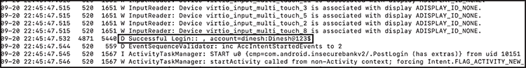    Figure 14-15: Account credentials exposed to the Android device logs      This is a good example of the information you can capture just from logging. Keep in mind that only privileged applications can gain access to this information.    E. Fernandes et al. recently discovered a similar side-channel leak issue in a popular IoT companion app for the IoT-enabled Schlage door lock ([`iotsecurity.eecs.umich.edu/img/Fernandes_SmartThingsSP16.pdf`](http://iotsecurity.eecs.umich.edu/img/Fernandes_SmartThingsSP16.pdf)). More precisely, the researchers found that the ZWave lock device handler, which communicates with the device hub that controls the door looks, creates a reporting event object that contains various data items, including the plaintext device pin. Any malicious app installed on the victim’s device could subscribe for such reporting event objects and steal the door lock pin.    ## Avoid Root Detection Using Static Patching    Let’s dive into the app’s source and identify any protection against rooted or emulated devices. We can easily identify these checks if we look for any reference to rooted devices, emulators, superuser applications, or even the ability to perform actions on restricted paths.    By looking for the word “root” or “emulator” on the app, we quickly identify the *com.android.insecureBankv2.PostLogin* file, which contains the functions `showRootStatus()` and `checkEmulatorStatus()`.    The first function detects whether the device is rooted, but it looks like the checks it performs aren’t very robust: it checks whether *Superuser.apk* is installed and whether the *su* binary exists in the filesystem. If we want to practice our binary patching skills, we can simply patch these functions and change the `if` switch statement.    To perform this change, we’ll use Baksmali ([`github.com/JesusFreke/smali/`](https://github.com/JesusFreke/smali/)), a tool that allows us to work in smali, a human-readable version of the Dalvik bytecode:    ``` $ **java -jar baksmali.jar -x classes.dex -o smaliClasses**  ```    Then we can change the two functions in the decompiled code:    ``` .method showRootStatus()V     ...         invoke-direct {p0, v2}, Lcom/android/insecurebankv2/PostLogin;->doesSuperuserApkExist(Ljava/lang/String;)Z  if-nez v2, 1 :**cond_f**      invoke-direct {p0}, Lcom/android/insecurebankv2/PostLogin;->doesSUexist()Z     if-eqz v2, 2 :**cond_1a**      ...    3 :cond_f      const-string v2, "Rooted Device!!"     ...    4 :cond_1a       const-string v2, "Device not Rooted!!"     ... .end method ```    The only task you need to do is alter the `if-nez`1 and `if-eqz`2 operations so they always go to `cond_1a`4instead of `cond_f`3. These conditional statements represent “if not equal to zero” and “if equal to zero.”    Finally, we compile the altered smali code into a *.dex* file:    ``` $ **java -jar smali.jar smaliClasses -o classes.dex**  ```    To install the app, we’ll first have to delete the existing metadata and archive it again into an APK with the correct alignment:    ``` $ **rm -rf META-INF/***  $ **zip -r app.apk ***  ```    Then we have to re-sign it with a custom keystore. The Zipalign tool, located in the Android SDK folder, can fix the alignment. Then Keytool and Jarsigner create a keystore and sign the APK. You’ll need the Java SDK to run these tools:    ``` $ **zipalign -v 4  app.apk app_aligned.apk**  $ **keytool -genkey -v -keystore debug.keystore -alias android -keyalg RSA -keysize 1024**  $ **jarsigner -verbose  -sigalg MD5withRSA  -digestalg SHA1 -storepass qwerty -keypass qwerty  -keystore debug.keystore  app_aligned.apk android**  ```    Once you’ve successfully executed these commands, the APK will be ready to install on your device. This APK will now operate on a rooted device, because we’ve bypassed its root detection mechanism by patching it.    ### Avoid Root Detection Using Dynamic Patching    A different approach for avoiding root detection is to bypass it dynamically at runtime with Frida. This way, we don’t have to change the naming of our binaries, which will probably break compatibility with other apps; nor will we have to go the extra mile of patching the binary, which is a rather time-consuming task.    We’ll use the following Frida script:    ``` Java.perform(function () { 1 var Main = Java.use('com.android.insecurebankv2.PostLogin');  2 Main.doesSUexist.implementation = function () {   3 return false; }; 4 Main.doesSuperuserApkExist.implementation = function (path) {      5 return false; }; }); ```    The script tries to find the *com.android.insecurebankv2.PostLogin* package 1 and then overrides the functions `doesSUexist()`2and `doesSuperuserApkExist()`4by simply returning a `false`value 35.    Using Frida requires either root access in the system or the addition of the Frida agent in the application as a shared library. If you’re working on the Android emulator, the easiest method is to download a non–Google Play AVD image. Once you have root privileges on your testing device, you can trigger the Frida script using the following command:    ``` $ **frida -U -f com.android.insecurebankv2 -l working/frida.js**  ```    ## Conclusion    In this chapter, we covered the Android and iOS platforms, examined the threat architecture for IoT companion apps, and discussed a number of the most common security issues you’ll encounter in your assessments. You can use this chapter as a reference guide: try to follow our methodology and replicate the attack vectors in the examined applications. But the analysis wasn’t exhaustive, and these projects have more vulnerabilities for you to find. Maybe you’ll find a different way to exploit them.    The OWASP Mobile Application Security Verification Standard (MASVS) provides a robust checklist of security controls and is described in the Mobile Security Testing Guide (MSTG) for both Android and iOS. There, you’ll also find a list of useful, up-to-date tools for mobile security testing. ````
