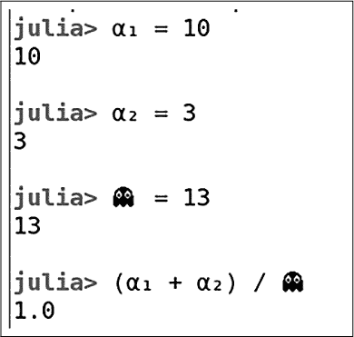
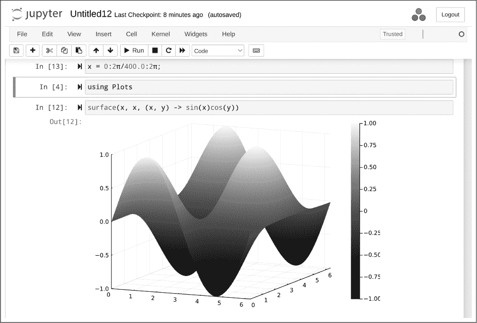
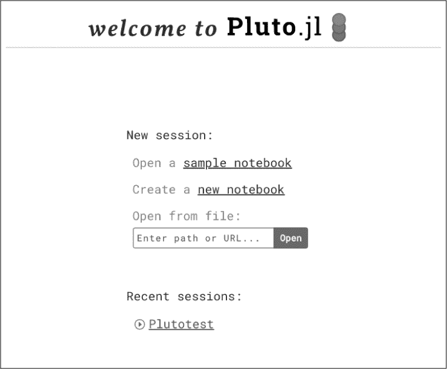
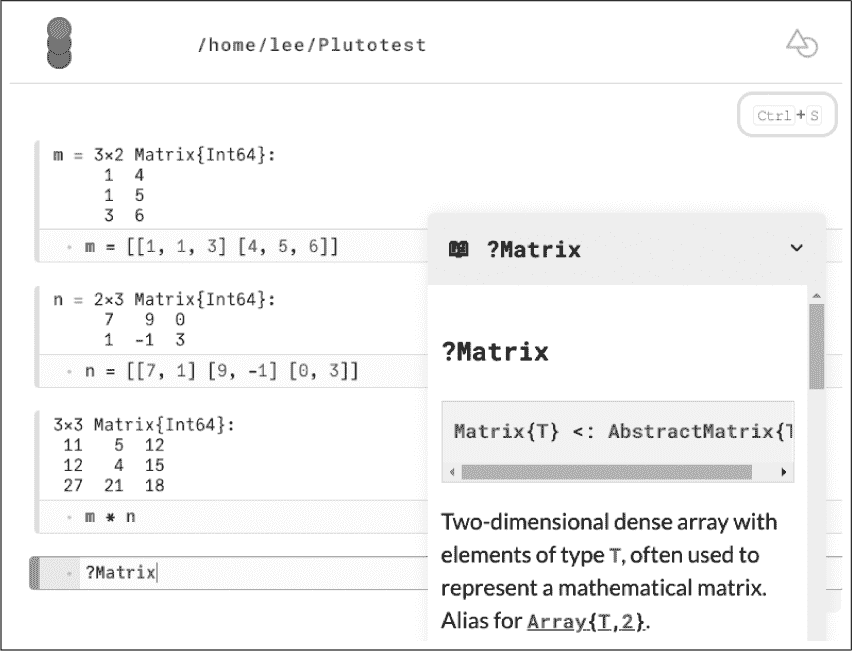
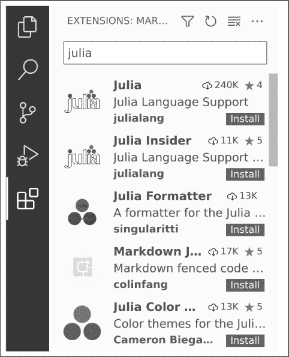
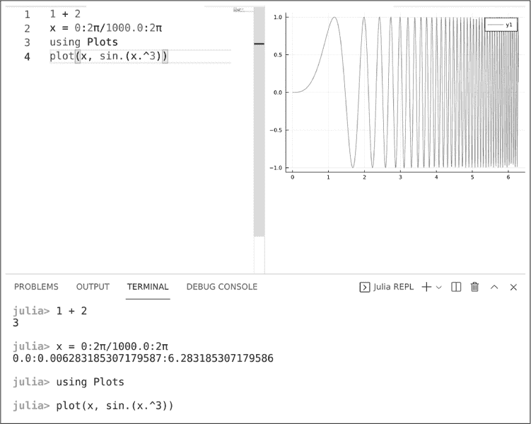

## **1

**开始使用**

*你不需要看到整个楼梯，只需迈出第一步。*

*—*马丁·路德·金博士


正如在介绍中提到的，要学习一门编程语言，光读书是不够的——即使是像本书这样优秀的书籍也不行。亲自实验和编写程序是至关重要的。在书中掌握一个关键概念或运行一个代码示例后，尝试构建代码的变体并运行它们。编写自己的变体将帮助你熟练掌握这门语言。

本章首先介绍如何在所有主要操作系统上安装 Julia，然后讨论各种类型的编码环境。我们将学习如何安装每种环境，并探索它们的独特功能、优缺点。

### **安装指南**

当然，要能够完成这些，你需要访问一个 Julia 系统。如果你已经配置好了运行 Julia 代码的环境，你可以安全地跳过这一整部分。如果没有，你可以跳过你不使用的操作系统的安装子章节，但你应该阅读其他所有内容。

#### ***硬件要求***

对于学习 Julia，几乎任何计算机都足够。它应该至少有 2GB 的 RAM，但拥有双倍内存将更加舒适。安装 Julia 大约需要 0.5GB 的空闲磁盘空间，但你应该至少预留 3GB 的额外空间，用于安装绘图和其他用途的包。

这些适中的要求足以用于学习语言，甚至可以进行许多实际计算，尽管对于大规模项目，你可能需要更强大的硬件。Julia 可用于各种规模的计算，它能高效地利用从笔记本电脑到 GPU 阵列处理器再到世界上最大的超级计算机等各种硬件（有关示例，请参见第 23 页的“进一步阅读”）。我已经在一台非常普通的笔记本电脑上运行了本书中的所有示例计算，因此本书中的所有代码应该可以在你使用的任何计算机上顺利运行。

Julia 可以在 Linux、FreeBSD、macOS 和 Windows 上运行。截止到写作时，Julia 在这些系统上完全受支持：

+   Linux 2.6.18+: x86-64（64 位）、i686（32 位）和 ARMv8（64 位）

+   FreeBSD 11.0+: x86-64（64 位）

+   macOS 10.9+: x86-64（64 位）

+   Windows 7+: x86-64（32 位和 64 位）

这些安装要求可能会发生变化，因此请查看[*https://julialang.org/downloads/*](https://julialang.org/downloads/)以获取最新信息。

Julia 还可以在一些未列出的系统版本和架构上运行，但其支持较弱，保证性较差，或可能功能受限。它还可以利用更多专用硬件——例如，我们将在后续章节中讨论的图形处理单元阵列处理器。

#### ***先决条件***

为了有效使用 Julia，你需要了解一些关于如何操作计算机的基础知识。你需要对终端和命令行有基本的了解：如何创建和更改目录（文件夹）、查看文件列表、查看硬盘上可用的存储空间以及删除文件。

每个操作系统都有各种图形化工具来完成这些任务，包括内置工具和第三方软件，但对于计算科学家来说，熟悉命令行并常规使用它是一个好主意。你很可能有一天会遇到远程计算环境，在这种情况下，命令行可能是与远程机器进行通信的唯一方式。

即使你的个人计算机使用的是其他操作系统，学习如何在 Linux 上执行这些基本任务也是个好主意，因为 Linux 在科学计算服务器中作为前端操作系统最为常见。如果你使用的是苹果设备，应该不会有问题，因为 macOS 的 BSD 派生终端中的基本命令几乎与 Linux 相同。如果你习惯了 Windows，可能需要学习一些转换，但这超出了本书的范围，而且你并不需要了解 Linux 方言就能在个人计算机上使用 Julia。

你还需要熟悉你系统上的一个编辑器，该编辑器能够将文件保存为纯文本格式。大多数程序员使用 Vim、Emacs 或更复杂的集成开发环境（IDE）——我们将在下一节进一步讨论这些选项。你可以使用任何你熟悉的编辑器，但图形化编辑器如 Word 并不是最佳选择。不过，如果你真的想使用这些程序，它们是可以工作的。只要确保将你的作品保存为纯文本文件，并使用等宽字体，这对编写代码更为合适。

#### ***Julia 版本***

大多数人，无论使用何种平台，都会从官方 Julia 网站下载[**https://julialang.org/downloads/**](https://julialang.org/downloads/)。无论你是在那里下载还是从其他地方获得，请记住，尽管 Julia 已经稳定了几年，但它仍在快速发展。在这个上下文中，*稳定*意味着你可以期待没有破坏性更改：你现在编写的程序，或者你使用任何版本的 Julia 从 v1.0 起写的程序，在未来升级 Julia 安装时依然可以正常工作，只有少数例外。然而，*快速发展*意味着你所安装的特定版本可能会带来显著差异。

关于语言实现本身，自从首次公开发布以来，Julia 团队在速度和响应性方面取得了持续的进展，这种进展很可能会继续下去，这也是推荐使用最新稳定语言版本的充分理由。关于生态系统，许多重要的软件包（即你可以在自己程序中使用的 Julia 代码库）也在快速进展，并且每个月都有新的软件包出现。较旧的 Julia 版本可能与重要软件包的新版本或更新版本不兼容。

在 Julia 网站的下载区，你会找到对应不同“发布版”或最近版本的 Julia 下载。大多数人最适合选择被标识为“当前稳定版”的下载。“即将发布版”是下一个稳定版的测试版本。它会有一些最近添加的新功能，但也可能会和一些软件包存在兼容性问题，且可能会出现一些小的 bug。根据你阅读本书的时间，“长期支持”版可能不包含本书使用的所有功能。通常，为了避免由于代码示例的行为不同而产生的混淆，确保你安装 Julia v1.6.0 或更高版本，并避免使用测试版。

#### ***安装***

本节包含了在所有可用的操作系统上安装 Julia 的各种选项的说明。你只需要关注适用于你的部分。

作为这些说明的替代方案，你可以在与其他下载链接相同的位置下载 Julia 的源代码。由于 Julia 是完全免费的开源软件，源代码始终可以供专家检查和自行编译。如果你希望在某个没有提供二进制文件的特殊系统上运行 Julia，这是唯一的选择。

##### **在 Linux 和 FreeBSD 上**

几乎每个 Linux 发行版都有自己的软件包管理系统：一种官方机制，用于安装程序并保持它们的更新。使用官方的软件包管理器有两个优势。首先，它是集成的，这意味着所有安装程序之间的依赖关系应该会自动解决，一切都能协同工作。第二个好处是安全性：官方仓库中的软件包通常都会经过审查，不太可能包含恶意代码。

不幸的是，将软件打包并纳入大多数 Linux 发行版的官方仓库需要相当长的时间。像 Julia 这样快速发展的项目通常不应通过包管理器进行安装。发行版的版本会远远落后于你可以直接从 Julia 项目获取的当前版本。对于某些采用滚动发布策略并保持包更新的 Linux 发行版来说，这个问题较小，但例如对于基于 Debian 的发行版来说，使用包管理器安装 Julia 不是一个好的选择。

出于这些原因，如果你使用的是 Linux，最好的策略是访问 Julia 下载页面 [*https://julialang.org/downloads/*](https://julialang.org/downloads/)。找到“当前稳定版本”标题，并在其下查找适合你机器架构的条目。大多数人需要下载“通用 Linux x86 64 位”版本。点击下载链接会将一个扩展名为 *.tar.gz* 的文件复制到你的计算机上，大小大约为 100MB 多一点。

大多数人的浏览器默认下载位置是在其主目录下的 *Downloads* 目录，但你的浏览器可能配置有所不同。找到下载位置后，你应该会看到刚刚下载的文件，名称类似 *julia-1.*X*.0-linux-x86_64.tar.gz*，这表示为 Linux 系统上的 x86 64 位架构构建的 Julia v1.*X*.0。双重扩展名表示这是一个压缩的 tar 文件。你可以使用一个命令来解压和解档文件（替换为实际下载的文件名）：

```
tar zxvf julia-1.X.0-linux-x86_64.tar.gz
```

`tar` 命令应该已经在任何正常的 Linux 系统中安装好了。输入此命令后，你应该会看到大约 2000 个文件的名称在终端中滚动，表示正在创建子目录并解压初始安装 Julia 所需的文件。除了一个文件外，你不需要直接处理这些文件。整个过程完成后，应该在一分钟内，你会得到一个新目录，名称来自压缩包的前缀。例如，针对 *julia-1.*X*.0-linux-x86_64.tar.gz* 下载文件，这个目录是 *julia-1.*X*.0*。安装过程会占用大约是 tar 文件四倍的空间，安装完成后，你可以删除该 tar 文件。

下一步是设置你的系统，使得在终端输入 `julia` 可以启动你刚刚安装的 Julia 程序。

要完成最后的安装步骤，首先通过输入`echo $PATH`检查你的路径。如果路径中列出了*/usr/local/bin*，则进入该目录。如果没有，但路径中有你想用来存放本地命令的其他目录，则进入该目录。否则，最好创建这样一个目录，可以是*/usr/local/bin*或其他目录。根据你的 Shell 类型，执行方法略有不同。对于最常见的 bash 及兼容 bash 的 Shell，在你的*.bash_profile*启动文件中添加以下行（该文件位于你的主目录中）：

```
PATH=/usr/local/bin:$PATH; export PATH
```

在你进入*/usr/local/bin*或选择的本地命令目录后，创建一个指向新 Julia 安装目录中*/bin/julia*文件的符号链接，并将其命名为*julia*。例如，命令如下：

```
ln -s $HOME/Downloads/julia/julia-1.X.0/bin/julia julia
```

创建链接时，你需要具备 root 权限，或者使用`sudo`。

你可以将下载的 Julia 安装文件保存在任何位置，但如果你将其移动，需要更新命令中设置的链接路径。

为了检查你新的 Julia 安装是否工作正常，打开一个新的 Shell 并输入`julia`。交互式提示符应该会出现，等待你输入第一行 Julia 代码。

##### **在 macOS 上**

你可以像安装其他应用程序一样在你的 Apple 电脑上安装 Julia。进入 Julia 下载页面，找到你需要的版本部分，点击表格中的 64 位链接。系统将下载一个普通的 macOS*.dmg*文件，并自动打开。你应该看到一个由红色、绿色和紫色圆圈排列成金字塔形状的 Julia 图标。按照惯例将其拖动到*应用程序*文件夹中。

当你双击这个图标时，终端应该会打开，并显示 Julia 的交互式提示符，准备接受你的第一个命令。

下一步是进行一些设置，以便你可以从终端命令行启动 Julia，而无需点击图标，这样以后会更加方便。这些准备工作还将允许你在不使用 REPL 的情况下运行已保存的 Julia 程序。

启用此行为需要两个步骤。如果 Julia 的交互式提示符仍在等待你输入，按下 CTRL-D 退出 REPL 或输入`exit()`。接下来，在 Shell 命令行中输入以下命令，以删除可能由以前的安装留下的任何`julia`命令：

```
rm -f /usr/local/bin/julia
```

然后输入以下命令（将 Julia-1.`X`.app 替换为你已安装的版本）：

```
ln -s /Applications/Julia-1.X.app/Contents/Resources/julia/bin/julia /usr/local/bin/julia
```

你也可以检查路径中其他地方是否存在`julia`命令，例如在`/usr/bin`目录下，并删除它们或将它们移出命令路径，以避免意外调用旧版本的可执行文件。

该命令创建了一个*符号链接*，指向存储在你*应用程序*文件夹深处的实际 Julia 二进制程序。现在你可以在任何终端中输入`julia`来启动交互式 Julia Shell 或运行 Julia 程序。

##### **在 Windows 上**

一些 Windows 安装中没有设置现代终端。你将需要这样的程序才能有效运行 Julia，并跟随本书中的示例。如果你尚未安装合适的终端，一个合理的选择是 Windows Terminal，这是一个可以从 Microsoft Store 获取的免费程序。在做任何事情之前，请安装这个终端或其他同样强大的程序，并确保你知道如何启动和使用它。

访问 Julia 下载页面，找到你所需版本的部分（见 第 5 页中的“Julia 版本”）。

如果你知道自己使用的是 64 位版本的 Windows，请点击 64 位下载链接。如果你使用的是 32 位版本或不确定系统架构，请点击 32 位链接。这将为你下载适用于两种架构的 Julia 安装包，但如果你确定可以使用 64 位版本，使用该版本会有一些优势。

这将下载一个 *.exe* 安装程序，接下来你应该运行它。它会告诉你安装目录；请务必记下该目录。

以下在终端中运行 Julia 的设置说明适用于最近版本的 Windows。如果你使用的是 Windows 8 或更早版本，可以在 Julia 下载页面找到具体的安装说明。

最新版本的安装程序提供了一个复选框来设置 Julia 路径。如果你的安装程序没有提供这个选项，或者你更喜欢自己选择路径，请按照以下步骤操作：

1.  按 **Windows 键-R** 打开 `Run`，输入以下命令打开系统变量窗口，以便编辑路径：

    ```
    rundll32 sysdm.cpl,EditEnvironmentVariables
    ```

1.  点击 **New** 并输入（或粘贴）安装程序告知你的路径（你应该已经复制了这些信息，对吧？）。如果你丢失了路径，可以在 *C:\Users\<your_username>\AppData\Local\Programs* 中查找一个名称中包含“julia”的程序。

1.  点击 **OK**，打开终端，输入 julia 测试你的设置。你应该会看到一个终端风格的 Julia 标志、简短的消息以及一个交互式提示，等待你输入第一行 Julia 代码。

另一个 Windows 上的选择是通过包管理器提供的。以流行的开源包管理器 Chocolately 为例，它可以安装一个相对较新的 Julia 版本。

##### **使用 Docker**

如果你了解 Docker，并且确信想通过 Docker 镜像安装 Julia，请阅读此部分。

如果是你，那么你很幸运，Julia 有一个社区支持的 Docker 版本。访问 [*https://hub.docker.com/_/julia*](https://hub.docker.com/_/julia)，该页面提供了关于使用 Julia 的镜像说明。我不会列出支持的系统和版本的详细信息，因为这些信息可能会频繁更改。该页面包含有关在你的机器上安装和使用 Julia 容器的最新信息。除此之外，本书中其他的所有内容同样适用于从 Docker 容器中运行的 Julia 和传统安装方式的 Julia。

#### ***隐私提示***

Julia 团队非常细心地指出了一个隐私问题，虽然这对大多数人来说不成问题，且在任何情况下大多数人都会理所当然地接受，但仍然值得一提。Julia 的包管理系统（我们将在后续章节中讨论）是基于你已连接互联网的前提下设计的，它会根据需要为你下载软件，帮助你完成任务。这意味着，不可避免地，你的 IP 地址、你下载的内容以及下载时间将被存储在某个服务器上，至少会存储一段时间。

### **Julia 编程环境**

安装了基本的 Julia 系统后，接下来我们来看看与其互动的各种方式。不同的与 Julia 对话的方法适用于不同的场景。而且，如果你有喜欢的编辑器或 IDE，本节将解释如何在不改变工作流程的情况下用 Julia 编程。

表 1-1 是接下来讨论的编程环境的简要表格，以及它们的主要优缺点：

**表 1-1：** 编程环境比较

| **环境** | **优点** | **缺点** |
| --- | --- | --- |
| REPL | 无需安装，快速，有用的模式 | 图形显示在单独的窗口中，输入重复 |
| 文本编辑器 | 文件组织，编辑方便，REPL 集成 | 无图形支持，交互性有限 |
| Jupyter | 大量社区支持，内嵌图形，交互性，支持多种语言，适合分享 | 组织结构差，无法版本控制，隐藏状态，浏览器文本输入 |
| Pluto | 内嵌图形，复杂的交互式控件，反应式且一致，完全支持 REPL，基于普通 Julia 文件 | 仅限 Julia，浏览器文本输入 |
| VS Code | 集成编辑器，REPL，图形支持，良好的语言支持 | 相较于 Vim 或 Emacs，作为编辑器功能较弱 |

让我们更详细地看看每种选项。

#### ***Julia REPL***

当你在终端输入 `julia` 时，你进入了 *REPL*，即 *读取-求值-打印循环*。你将看到一条欢迎信息，提示符从系统的 Shell 提示符变为 Julia 的提示符。

##### **REPL 模式**

REPL 有几种模式。初始模式下，提示符是 `julia>`，这是你将在 REPL 中花费大部分时间的正常模式。在这里，你可以输入任何 Julia 表达式，按下 ENTER，Julia 会打印出该表达式的结果。即使你还不懂 Julia，也可以试试看，确保一切正常运行。输入一个算术表达式，如 `1 + 1`，按下 ENTER 后，你应该能立刻看到结果。

如果你使用过 Python、Node、APL 或任何其他基于 REPL 的语言，这种操作模式对你来说应该很熟悉。与 Python 不同，Julia 是编译型语言，而非解释型。这一差异将在后续章节中影响你使用 REPL 的方式，但现在，你可以像使用其他 REPL 一样使用 Julia 的交互界面。

Julia REPL 的常规模式是一个功能强大的环境，内置了几个小技巧，可以让你的工作变得更加轻松。它有一个“粘贴模式”，可以让你粘贴从网页等地方复制的代码示例，通常这些代码示例会带有 `julia>` 提示符，并且代码与说明文字交织在一起。REPL 会知道只执行任何以 `julia>` 开头的行，前提是粘贴的第一行也以该提示符开头。（截至写作时，粘贴模式在 Windows 上无法使用。）

REPL 完全支持 readline。这意味着你可以使用上下箭头来回顾之前的命令，并在重新执行之前进行编辑。这个功能即使对于多行代码块（如函数定义）也能很好地工作。要搜索之前的命令，你可以按 CTRL-R 并输入命令中包含的文本。你的命令和代码历史会在 REPL 会话之间保存，因此你可以退出 REPL，第二天再回来时仍然可以通过箭头键回顾之前的命令。历史记录保存在你主目录下的 *.julia/logs/repl_history.jl* 文件中。该文件包含你输入的所有代码，甚至为每条记录加上时间戳，但它不会记录 Julia 返回的结果。

另一个有用的 REPL 模式是帮助模式。按 **?**，提示符会变为 `help?>`。输入任何 Julia 函数、数据类型、操作符或库，你将看到该项的格式化描述，通常还会附带一些有用的示例。

```
help?> Base
search: Base basename AbstractSet AbstractSlices Broadcast broadcast broadcast! AbstractString
AbstractDisplay

  Base

  The base library of Julia. Base is a module that contains basic functionality
  (the contents of base/). All modules implicitly contain using Base, since this is needed
  in the vast majority of cases.
```

稍后你将学习如何以一种方式记录你自己的函数，从而与 REPL 帮助系统连接。

REPL 还具有一个 shell 模式，通过按 `;` 激活，允许你在 REPL 会话中输入系统 shell 命令：

```
julia> ilj = "I love Julia"
"I love Julia"

# Enter ";" here to switch to shell mode.

shell> echo $ilj
I love Julia
```

我们可以使用 shell 模式来执行简单的命令。正如列表所示，我们可以插入 Julia 变量，但管道和重定向功能无法使用。

另一个你会经常使用的 REPL 模式是包管理模式，通过按 `]` 激活，我们将在第三章中探讨如何使用包和模块。现在，首先要知道的是，Julia 的包系统是语言和环境的一个重要组成部分，甚至已经内建于 REPL 中。Julia 开发者不需要与多个竞争的第三方包系统作斗争，也不需要面对一些其他语言中不可避免的“依赖地狱”问题。

要退出这些模式并返回到常规的（有时称为“Julian”）REPL 模式，请在光标处于起始位置时按 BACKSPACE 键。

TAB 在任何 REPL 模式下都可以生成上下文感知的补全。如果有唯一的补全，它会在光标处自动填入；否则，REPL 会展示一个选项列表给你选择。

##### **REPL 颜色**

为了帮助你了解自己处于哪种模式，REPL 会为每个提示符使用不同的颜色。颜色有助于在视觉上区分提示符与你输入的表达式及其结果。REPL 还会在某些类型的输出中使用颜色，例如帮助输出，用来区分关键词和变量等元素与普通文本。默认的颜色在使用黑色或深色背景的终端时效果良好，这是最流行的选择。然而，这些颜色在白色或非常浅的背景上容易看不清楚。在本书的插图中，我使用了这样的背景，因为它比我通常在电脑上使用的黑色背景打印效果更好。如果你使用浅色终端背景，或者仅仅希望外观与默认值不同，你可以编辑配置文件来更改任何 REPL 颜色。

在你的主目录中，你会找到一个名为*.julia*的目录（注意有一个点：在大多数人的 shell 配置中，除非你添加标志请求列出“隐藏文件”，否则使用常规命令时该目录通常不会列出，图形化文件管理工具可能会或可能不会默认显示该目录）。在*.julia*目录下，可能已经存在一个*config*目录；如果没有，请创建一个。进入*config*目录并编辑*startup.jl*文件（如果该文件不存在，则创建它）。将以下内容添加到*startup.jl*中：

```
function customize_colors(repl)
    repl.prompt_color = Base.text_colors[28]
    repl.help_color = Base.text_colors[178]
end

atreplinit(customize_colors)
```

你刚刚写了你的第一个 Julia 函数。Julia 每次启动 REPL 时都会运行*startup.jl*文件（*.jl*扩展名用于 Julia 程序）。这个函数简单地定义了两个变量：一个用于正常模式下提示符的颜色，另一个用于帮助模式下的颜色。方括号中的两个数字是 ANSI 颜色代码，现代大多数终端程序都能理解这些代码。我选择了两种在我的显示器上使用白色终端背景时效果良好的颜色。如果你想选择自己的颜色，可以通过在网上搜索“ANSI 颜色代码”来找到 256 种 ANSI 颜色及其代码表。我只重新定义了这两种颜色，因为其他默认颜色恰好合适。如果你想改变其他颜色，你也可以定义`repl.shell_color`、`repl.input_color`和`repl.answer_color`变量。

Julia 还理解几种颜色*名称*，但数量太少，无法提供理想的选择。

##### **Unicode 字符**

Julia 允许在变量名和其他标识符中使用 Unicode 字符。这意味着你可以在 Julia 程序中让公式看起来更像真实的数学公式，例如使用希腊字母和下标。有些人已经设置了他们的系统，以便轻松输入这些字符。即使你没有这样的设置，得益于 REPL 提供的 Unicode 输入模式，你仍然可以使用这些字符。如果你输入一个反斜杠（`\`），后跟一串 ASCII 字符，然后按下 TAB 键，接下来会发生三种情况之一。如果 REPL 识别该字符串为某个 Unicode 字符的代码，整个输入（包括反斜杠）将被该字符替换。如果你输入的代码是某个字符代码的开头，或者是多个可能代码中的一个，Tab 补全机制会以正常方式工作。如果 REPL 无法识别你输入的内容，它将不会做任何反应。

REPL 识别的 Unicode 字符代码的完整列表可以在 [*https://docs.julialang.org/en/v1/manual/unicode-input/*](https://docs.julialang.org/en/v1/manual/unicode-input/) 查找。熟悉 LaTeX 语法的人会高兴地知道，所有希腊字母和一些其他具有 LaTeX 命令的符号都在列表中，并且没有变化。例如，要在 REPL 中输入 *α*，只需输入 \alpha 然后按 TAB 键。还有更多内容——甚至包括大量的表情符号。

如果你想知道某个特定 Unicode 字符的 LaTeX 风格缩写，可能是你从文档中复制的字符，可以在 REPL 中进入帮助模式，粘贴该字符并按下 ENTER。如果该字符有缩写，帮助系统会告诉你它是什么。

图 1-1 展示了使用扩展字符集时的一些简单示例。



*图 1-1：在 REPL 中使用 Unicode*

这不仅仅是为了好玩。能够使用更多种类的字符，包括希腊字母和下标，让我们可以让代码更加简洁和富有表现力。

#### ****文本编辑器****

Julia 程序员通常使用文本编辑器，或是与 REPL 配合使用，或是作为补充。我将在这里介绍一些最常用的程序员编辑器的相关功能。如果你使用的是其他编辑器，务必搜索是否有特定于 Julia 的增强功能，无论是内置的，还是第三方插件形式的。这些增强功能通常包括语法高亮，有助于避免代码中的拼写错误，还可以包括更复杂的功能，如代码格式化和执行。

##### **Vim**

Vim 是一个非常优秀的编程编辑器，支持任何语言的开发，并且对 Julia 有很好的支持。我建议安装`julia-vim`插件，插件地址为[*https://github.com/JuliaEditorSupport/julia-vim*](https://github.com/JuliaEditorSupport/julia-vim)，在那里你还可以找到它的文档。该插件要求 Vim 版本为 7.4 或更高。为了最大程度地利用`julia-vim`，确保启用了内置的`matchit`插件，通过执行`:runtime macros/matchit.vim` Vim 命令来启用，它应该已经在你的 Vim 启动文件中。该插件增加了一个 Julia 文件类型，提供语法高亮并识别 Julia 语法的代码块结构。它通过允许你在输入`%`时跳转到函数定义或其他代码块的开始或结束，扩展了`matchit`的功能。你还可以像在 Vim 中操作其他文本对象一样，选择或删除代码块或代码块的主体。

该插件还模拟了 REPL 的 LaTeX 风格的 Unicode 字符输入。为此，它提供了两个选项：你可以让它等待你按下 TAB 键，就像 REPL 一样，或者它可以在看到一个字符（通常是空格）表示输入结束时立即展开输入（然而，实时模式不支持表情符号）。

对于最近版本的 NeoVim 或 Vim，另一个选择是安装 tree-sitter 的语言支持，它为编辑器增加了语法感知的高亮和其他功能。如果你使用的是 Vim 8.0 或更高版本（我强烈推荐使用该版本）或 NeoVim 分支，你可以直接与*任何* REPL 进行交互，包括 Julia REPL。所谓“交互”，是指你可以保持在一个包含 Julia 程序的编辑缓冲区内，并将选中的行、表达式或代码块直接发送到 REPL 执行。执行是异步进行的，所以你可以在 Julia 处理一个耗时的命令时继续编辑。与 REPL 的通信是双向的，因此你还可以将 REPL 中打印的结果发送回编辑缓冲区。以下说明适用于 Vim，但 NeoVim 用户应该能够将其适配到该程序中。

首先，安装`vim-sendtowindow`插件，插件地址为[*https://github.com/karoliskoncevicius/vim-sendtowindow*](https://github.com/karoliskoncevicius/vim-sendtowindow)。打开你选择的编辑缓冲区后，执行`:term julia` Vim 命令。如果你正确设置了`julia`命令（参见“安装”，位于第 6 页），一个新的 Vim 缓冲区应该会打开，Julia REPL 会在其中运行，并显示在编辑窗口下方。

现在，你可以在编辑窗口中选择任意文本，按空格键后再按 `j` 将其发送到 REPL。如果你希望使用其他快捷键来执行此操作，`vim-sendtowindow` 网页上有关于如何设置快捷键的说明。你还可以为将文本发送到右侧、左侧和上方定义快捷键，这对于从 REPL 发送文本，或者如果你喜欢将窗口垂直拆分时非常方便。`:term` 命令内置于 Vim，支持异步执行命令。该插件提供了在编辑和终端缓冲区之间便捷地发送文本的方式。`vim-sendtowindow` 的作者在其网站上维护了类似功能插件的列表。

使用早期版本的 Vim，也可以通过类似 `ScreenSend` 的插件实现类似的 REPL 交互，但在版本 8 中的 `term` 命令使 REPL 交互更加流畅且减少错误。

##### **Emacs**

Emacs 是一款功能强大的程序员编辑器，支持高级的 Julia 语言。Emacs 的官方 Julia 主要模式叫做 `julia-emacs`，该模式在 GitHub 上由 [*https://github.com/JuliaEditorSupport/julia-emacs*](https://github.com/JuliaEditorSupport/julia-emacs) 开发。Julia 语言的创造者是该项目的贡献者，这可能是该模式深度集成语言结构和语法的原因之一。安装后，Emacs 会使用各种颜色和字体样式显示 Julia 代码，以清晰地呈现其语法。同时，它还提供了对代码结构（如代码块）的导航和操作功能。

要安装 `julia-emacs`，首先启用 MELPA 仓库 ([*https://melpa.org*](https://melpa.org))，并在你的 Emacs 初始化文件中添加 (require 'julia-mode) 。对于大多数人来说，这个文件会位于家目录中的 *.emacs*。为了获得更顺畅的体验，你应该使用至少 24.1 版本的 Emacs。如果你的版本较早，建议升级以便更好地使用 Emacs 和 Julia。

Emacs 在与基于 REPL 的语言交互方面表现出色，Julia 也不例外。有几个专门用于 Julia 交互的次要模式。其中最受欢迎的是 `julia-repl`，同样在 GitHub 上开发，地址为 [*https://github.com/tpapp/julia-repl*](https://github.com/tpapp/julia-repl)。该模式设计用于与前述的 `julia-emacs` 配合使用，且你必须安装至少 25 版本的 Emacs。

要安装 `julia-repl`，请编辑你的 *.emacs* 初始化文件，并添加以下几行：

```
(add-to-list 'load-path path-to-julia-repl)
(require 'julia-repl)
(add-hook 'julia-mode-hook 'julia-repl-mode)
```

现在，你可以直接在 Emacs 中启动 Julia REPL。它将在 ANSI 终端中运行，支持完整的文本颜色和格式设置。有关键盘快捷键的表格可以在该模式的 GitHub 页面找到。你可以像往常一样将片段、整个代码块或整个缓冲区发送到 REPL 进行执行。此外，Julia 的内建知识允许该模式执行一些操作，比如列出一个函数的所有方法，理解这些操作会在阅读 第八章 后更加清晰。

#### ***Jupyter Notebooks***

你可以通过两种主要方式在网页浏览器中使用 Julia，这种方式被称为 *笔记本* 界面。较旧的方式是 Jupyter Notebook。Jupyter 在自由软件领域推广了笔记本概念，并广泛应用于 Julia、Python 和 R 社区。实际上，*Jupyter* 这个词是这三种编程语言名称的拼接。

如果你想使用或探索笔记本界面，而没有特别的理由使用 Jupyter，直接进入下一部分，了解 Pluto。Pluto 提供了与 Jupyter 相同风格的笔记本交互性，同时在概念上有所改进。对于那些需要使用 Jupyter 与他人合作、希望在相同的笔记本界面中使用其他语言（除了 Julia），或是希望探索现有 Jupyter Notebooks 的用户，本节旨在帮助你入门。

如果你已经在电脑上设置并运行 Jupyter，只需要安装 Julia 后端。在 Julia REPL 中，按 **]** 进入包管理模式（见 第 11 页）。确保你的设备已连接到互联网，然后输入 add IJulia 命令以下载并安装用于笔记本的 Julia 后端以及其依赖的包。这是一个相对较大的安装过程，需要一些时间，但 REPL 会通过动画显示下载进度和模块的预编译进度，时刻通知你。安装完成后，输入 jupyter notebook 无论是在单独的系统 shell 提示符下，还是使用 REPL shell 模式，都可以启动笔记本。

如果你还没有安装 Jupyter，完成之前描述的安装步骤后，在 Julia REPL 中输入以下命令：

```
using IJulia
notebook()
```

Julia 会询问是否通过 `Conda` 包安装 Jupyter。请选择肯定答案。此安装阶段应比 `IJulia` 安装更快，但仍可能需要一些时间。当软件准备好后，Julia 会在你的默认浏览器中打开一个窗口或标签页，展示 Jupyter 启动页面。要在未来的会话中启动 Jupyter，只需在 Julia REPL 中重复这些命令。

当 Jupyter Notebook 页面打开时，你会看到一个下拉列表，列出了已安装的内核或语言后端。选择 Julia 内核，一个新标签页或窗口将打开。在该页面中，你可以在“单元格”中输入 Julia 表达式。当光标位于单元格内时，按 CTRL-ENTER，Julia 将计算表达式并在其下方的输出单元格中打印结果。

因为我们在网页浏览器中，系统可以利用格式化文本和显示图形的能力。图 1-2 展示了我执行了几个单元格后的 Jupyter Notebook。



*图 1-2：在 Julia 中使用 Jupyter*

最后一单元是创建一个表面图的命令，该图会直接嵌入到页面中。

使用 Jupyter 时，你无需担心保存工作内容，因为它会频繁自动保存，如图 1-2 中页面顶部的提示所示。

分享你的工作非常简单，只需将笔记本的磁盘版发送给同事即可。所有内容都保存在一个文件中，包括图表和其他图像，默认情况下，这些图像是以 SVG 格式编码的。Jupyter Notebook 文件的扩展名为 *.ipynb*，并保存在你启动 REPL 的目录中。

如果你打算广泛使用 Jupyter，可以参考[详细文档](https://jupyter.org)，了解更多功能。

#### ***Pluto: 一个更好的笔记本***

Pluto 是一个基于网页浏览器的 Julia 笔记本界面，类似于 Jupyter。尽管它是一个较新的项目，但已经被一个庞大的社区广泛使用，并且相较于 Jupyter，它有着显著的优势。它唯一的缺点是仅支持 Julia，但这种专注使得 Pluto 比支持多内核的前端更能充分利用 Julia 的优势。

Pluto 除了依赖现代网页浏览器和 Julia 外，不需要其他任何东西。要安装它，按 `]` 进入 Julia REPL 的包管理模式，并执行添加 Pluto 的命令。下载和安装完成后，按 BACKSPACE 退出包管理模式，然后在 REPL 中执行以下代码：

```
using Pluto
Pluto.run()
```

在默认的网页浏览器中，将打开一个新窗口或标签页，显示 Pluto 欢迎页面，样式如图 1-3 所示。



*图 1-3：Pluto 欢迎页面*

在这里，你会看到打开一个新笔记本、继续现有笔记本工作或查看示例笔记本的链接。示例笔记本涵盖了各种主题，内容制作精良且富有教学意义。

Pluto 笔记本是一个网页，你可以在其中的“单元格”中输入 Julia 表达式。在单元格中光标处按 CTRL-ENTER 将使 Julia 执行该单元格中的代码以及所有依赖于它的单元格。例如，如果你在一个单元格中定义或重新定义了一个变量并执行了它，且有第二个单元格使用了该变量，Pluto 将在第一个单元格完成后执行第二个单元格。如果第三个单元格依赖于第二个单元格的结果，Pluto 将接着执行第三个单元格，依此类推。每次执行单元格后，其结果将显示在*输入单元格的上方*。你可以通过观察单元格左边的动态进度条，看到执行进度在单元格之间传递。

Pluto 通过计算页面上所有单元格的*依赖图*来决定执行顺序。使用依赖图意味着页面上显示的结果与它们排列的视觉顺序以及你决定执行单元格的顺序无关。你所看到的完全由单元格中的代码决定，因此你可以将你的笔记本分享给合作者，大家看到的都是相同且一致的笔记本。这是相较于其他笔记本的重大进步，例如 Jupyter，其中页面上显示的结果是单元格执行顺序的结果，甚至可能依赖于已经删除的单元格。

Pluto 的行为在某些方面类似于电子表格，并提供相同的实时、响应式体验。即使是像我这样的死忠终端用户，也喜欢在某些类型的探索性计算中使用 Pluto。它能够嵌入图形，并且正如我们将在后续章节中看到的那样，集成图形控件，如滑块和颜色选择器，为代码和数据实验提供了丰富的环境。

图 1-4 显示了一个包含简单矩阵计算的 Pluto 页面。我通过点击欢迎页面上的链接来创建这个页面并开始一个新的笔记本。Pluto 打开了一个新标签页，浏览器切换到了它，我在三个单元格中输入了表达式，并按 CTRL-ENTER 进行求值。



*图 1-4：Pluto 笔记本中的矩阵计算*

图 1-4 显示了 Pluto 界面的主要元素。顶部是笔记本文件的路径。在你输入路径之前，界面上会有提示信息邀请你填写。路径右侧是保存按钮，但只有在你更改文件位置并希望立即保存时才需要使用它。每次你执行一个单元格时，Pluto 会自动保存你的工作。

在前两个代码单元格中，我定义了两个小矩阵`m`和`n`，在第三个单元格中，我请求它们的矩阵乘积。（这预览了我们将在第二章中探索的数组操作。）请记住，在 Pluto 中，结果会显示在输入单元格的上方。

到目前为止，我们也可以在 REPL 中以相同的方式做这件事。这里的不同之处在于，如果我们改变 `m` 或 `n` 中的任何数字，并运行带有新定义的单元格，矩阵乘积会立即重新计算，并且修订后的结果会替换掉旧结果，用户无需做任何其他操作。在 REPL 中，我们必须重新输入 `m * n`，然后新结果会显示在下方，可能会把其他信息滚动出屏幕。

在 Pluto 中，由于显示的结果与它们在页面上出现的顺序无关，我们可以重新排列单元格，以提供良好的展示效果，而无需担心影响计算。我们可以将 Julia 表达式与使用 Markdown 或 HTML 格式化的文本结合起来，将笔记本转变为文章或实时解释文本。

在最后一个单元格中，我输入了一个问号（`?`），后跟一个数据类型的名称，`Matrix`。只要你输入问号并开始输入，实时帮助窗口就会打开，显示关于你已输入内容的文档。当你继续输入字母时，文档会随之变化，以反映你输入的内容，直到你看到你想要的内容为止。

帮助窗口会一直显示，提供关于你在任何单元格中输入内容的文档，无论你是否请求帮助。如果它变得分散注意力，可以点击小箭头将窗口收起。由于 Pluto 与 Julia 紧密集成，它还提供了其他便利功能，比如与 REPL 中一样的 Tab 补全功能。

支持笔记本页面的文本文件存储在你在顶部输入的位置，是一个普通的 Julia 模块文件。你可以将其导入到其他 Julia 程序中，直接编辑它，并进行版本控制。你并不被 Pluto 笔记本锁定，而是可以在其他 Julia 项目中使用你在那里开发的代码。

Pluto 是一种全新且创新的方式来开发程序并进行探索性计算，它使用起来非常有趣。即使你只是偶尔使用它，你也应该安装它，并熟悉其界面。关注 Pluto 的发展，查看更多文档，请访问 [*https://github.com/fonsp/Pluto.jl*](https://github.com/fonsp/Pluto.jl)。

#### ***集成开发环境***

通过安装各自部分中描述的插件，Vim 和 Emacs 都可以作为 Julia 的强大 IDE。传统的 IDE 对像 Julia 这样的语言并不像对 Java 或 C++ 这种冗长且仪式感十足的语言那样具有决定性的优势，在那些语言中，许多开发者认为它们是必不可少的。而编写 Julia 程序所需的，实际上只是一个文本编辑器。

然而，一些用户更喜欢使用“真实”的集成开发环境（IDE），或者已经习惯了某个 IDE。Julia 的 IDE 形势在本文写作时正处于变化之中。曾经由 Atom 编辑器的插件构成的 Juno 是 Julia 的官方 IDE，但目前已经停止开发。随着语言的发展，Juno 无法继续跟上脚步。Julia 的 IDE 开发已转向 Microsoft 的流行 IDE VS Code 的插件。

你可以从其 GitHub 仓库下载 VS Code，网址是[*https://github.com/microsoft/vscode*](https://github.com/microsoft/vscode)，并为你的系统进行编译。对于 Linux、macOS 或 Windows 用户，更快捷的方式是从 [*https://code.visualstudio.com/Download*](https://code.visualstudio.com/Download) 下载适当的安装包并按照系统的正常安装流程进行安装。微软还提供了品牌版本的二进制安装包，这些版本可能包含一些小的增强功能，并且是根据 Microsoft 产品许可证发布的。

安装完基础的 VS Code 程序后，你可以从 IDE 内部安装 Julia 插件。图 1-5 展示了如何操作。



*图 1-5：在 VS Code 中安装 Julia 插件*

截图显示了 VS Code 窗口的左侧区域，并且选择了扩展图标。我在顶部的扩展搜索框中输入了“Julia”，程序显示了与之匹配的公开扩展列表。当你执行此搜索时，列表可能会有所不同，但你要寻找的扩展名为“Julia”，在本例中位于列表顶部。点击蓝色的**安装**按钮进行下载和安装插件。

安装插件后，退出并重新启动 VS Code。如果你已按照“安装”部分的描述正确设置了路径，按下 CTRL-SHIFT-P（在 macOS 上为 CMD-SHIFT-P）打开命令窗口，执行 Julia: Start REPL 命令。此时，Julia REPL 应该会在窗口底部的一个面板中打开。它的行为与第 10 页上描述的正常 REPL 一样，所有 REPL 模式都可用，并且支持你自定义的颜色和其他设置。

除了直接在 REPL 中输入，你还可以打开现有文件或新文件进行编辑。Julia 代码具有语法高亮，并且提供了语法感知的命令，用于浏览代码并操作其结构。在编写本文时，[*https://www.julia-vscode.org/docs/stable/*](https://www.julia-vscode.org/docs/stable/) 上的文档大部分是空白页面，但我预计这种情况很快会得到改善。打开命令窗口，输入 `Julia:` 来发现 Julia 特有的命令，然后滚动浏览命令列表。如果你发现一个常用的命令，列表中会显示每个命令旁边的按钮，允许你为其定义键盘快捷键。

我建议为“将当前行或选中的内容发送到 REPL”命令定义一个快捷键。这样你可以将任何表达式或语句直接从编辑器发送到 REPL 执行。

如果你在 REPL 中执行绘图命令，绘图会出现在 VS Code 窗口内一个专用的面板中。图 1-6 显示了我的笔记本电脑上该窗口的主要部分，选用了 VS Code 三个外观选项中的浅色背景。



*图 1-6：在 VS Code 中使用 Julia 插件*

在上面的面板中，我正在编辑一个包含几行 Julia 代码的文件，并将其直接发送到下面面板中的 REPL。虽然你可能还不完全理解所有的语言语法，但你可能已经能大致了解这些表达式的预期输出。在尝试了一些算术操作来检查设置是否有效之后，我定义了一系列数字，并将其赋值给 `x` 变量，然后绘制了应用于列表中每个值的函数。在右上方，绘图窗口已出现。

### **建议**

由于工具的选择是个人偏好问题，我尝试提供足够的信息，介绍所有与 Julia 交互和编辑 Julia 程序的主要方式，以便你可以选择最适合自己的方法。如果你已经习惯使用 Vim、Emacs 或其他编程工具，你无需学习任何新东西或改变工作流程来使用 Julia。使用你熟悉的工具，因为 Julia 可以轻松适应它。

然而，如果你还没有决定使用特定的工具，我有一个建议。我建议你安装 Vim，并安装《文本编辑器》一节中描述的 Julia 专用插件（见 第 14 页）。Vim 需要一些时间来适应，但从长远来看是值得的，它是一个高效且灵活的编辑器，并且使得与 REPL 一起工作变得轻松。

如果你是 Vim 的新手，为了减轻同时学习新语言和陌生编辑器的负担，考虑在 Pluto 中操作并直接使用 REPL，同时花些时间适应新的编辑器。

请注意，这反映了我的个人偏好，你可能更喜欢不同的环境。例如，如果你觉得在基于浏览器的笔记本中工作很有吸引力，完全可以在 Pluto 中完成所有的 Julia 工作。我唯一不推荐的是坚持使用没有 REPL 或语言支持的原始编辑器，因为这样会在长期内拖慢你的进步。

**进一步阅读**

+   我的文章《科学家的 Linux 工具箱》在 *Linux Pro Magazine* 中刊登（[*https://www.linuxpromagazine.com/Issues/2020/241/Scientist-s-Toolbox*](https://www.linuxpromagazine.com/Issues/2020/241/Scientist-s-Toolbox)）提供了更多关于 Julia 和其他对在 Linux 上进行计算的科学家有用的软件的信息。

+   在《Pluto 简介》([*https://lwn.net/Articles/835930/*](https://lwn.net/Articles/835930/))中，我描述了 Pluto 笔记本的开发过程，给出了它的一些使用示例，并将其与流行的 Jupyter Notebook 界面进行了对比。

+   一个有用的 ANSI 颜色代码表可以在[*https://misc.flogisoft.com/_media/bash/colors_format/256_colors_bg.png*](https://misc.flogisoft.com/_media/bash/colors_format/256_colors_bg.png)上找到。

+   访问[*https://gitforwindows.org*](https://gitforwindows.org)，获取提供 Git、终端程序和其他一些便捷功能的 Windows 解决方案。
