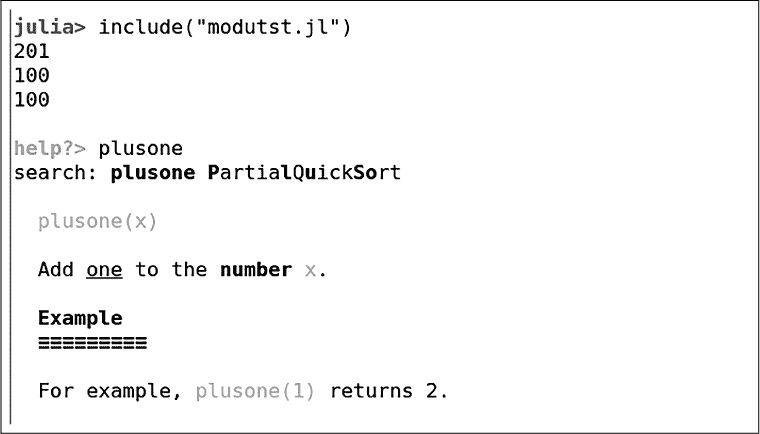
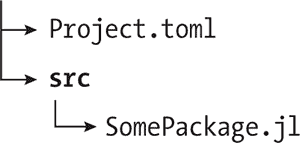

## 模块与包**

*有关包的信息和包本身同样重要。*

*—*FedEx 创始人弗雷德里克·W·史密斯


在前一章中，我提到过，Julia 程序是围绕一组函数组织的。这些函数是程序的动词，意味着它们描述了程序的功能。你可以在 REPL 或 Pluto 中度过一生，保存程序文件，仅使用函数、变量和数据类型定义。

但是，当你开始系统地开发基于之前工作的项目，或者希望其他人能够在他们的项目中使用你的代码时，你将希望利用 Julia 提供的结构来组织和共享你的程序。即使你从未重用或分发过自己的代码，你仍然会使用 Julia 标准库中的代码，使用其他官方 Julia 包中的代码，甚至可能使用其他研究者的代码。无论如何，熟悉 Julia 的模块和包系统至关重要。

### **模块**

Julia 程序员在 REPL 和程序文件中广泛使用模块，借用现有的绘图、解方程、提供网站服务以及无数其他活动的功能已经成了常规操作。然而，*创建*模块在 REPL 中并没有多大用处。你创建的模块将保存在文件中，随时准备根据需要使用。

#### ***理解命名空间***

*命名空间*是用于分组名称的方式，它将这些名称与其他组中存在的相同名称区分开来。我们需要命名空间，因为函数和变量可能在不同地方定义，但名称恰好相同，我们需要一种方法来明确我们所引用的是哪个对象。

当我们在 REPL 中定义一个对象时，我们可以稍后通过它的名称引用它。例如，在进行像`a = 1`这样的赋值操作后，变量`a`将返回`1`。我们说`a`是在*全局命名空间*中定义的。术语有所不同：有时它被称为*顶级命名空间*，有时称为*主命名空间*。无论如何，*当前命名空间*是我们正在使用的命名空间。

当我们需要引用在其他地方定义的对象时，我们有两种选择。我们可以通过它们的简单名称来调用它们，就好像它们在当前命名空间中定义过一样，或者我们可以通过像`SomeModule.a`这样的名称来引用它们。在后者的情况下，我们说`a`位于`SomeModule`命名空间中，我们使用了*限定名称*来引用它。

这两个名称`SomeModule.a`和`a`可以指代不同的对象——甚至可能是不同类型的对象。标识符`a`可能是我们在 REPL 中定义的一个变量，而`SomeModule.a`可能是`SomeModule`模块中定义的一个函数。在接下来的章节中，我们将学习如何从其他模块中引入对象，何时需要使用限定名称来引用它们。

#### ***使用已安装的模块***

Julia 安装时自带许多模块可供使用。特别是`Base`和`Core`这两个模块中的资源总是自动可用的，这也是为什么我们可以直接调用前一章中使用的函数，如`abs()`，而无需显式加载任何内容。这些基本函数大多位于`Base`模块中。`Base`还提供了一些基础功能，如`+`运算符，实际上也是一个函数。`Core`模块存在于更深层次，包含了一些基础构件，如`Int64`数据类型。虽然没有`Base`你无法做太多事情，但你可以安排不加载它。然而，`Core`模块对 Julia 的运行是必需的，因此不可省略。

*标准库*是一个总是与 Julia 一起安装的模块集合，但你需要显式加载它们才能使用。标准库中的模块提供了在各种计算中常用的功能，但这些功能的基础性不如算术运算符等。你在任何特定的程序中都不需要标准库中的所有模块，但一个典型的程序会使用其中几个模块。

你可以使用`using`或`import`语句加载模块中的资源。

**注意**

*大多数模块的名称首字母为大写，并采用“驼峰命名法”，例如* LinearAlgebra *模块来自标准库。虽然你可以在自己的项目中忽略这种命名约定（包括在《改变参数的函数》中解释的使用!符号，第 56 页），但遵循这些约定会让你的代码更容易被其他 Julia 程序员阅读。*

`using`语句提供对模块中所有内容的访问。它将模块创建者标记为导出的所有名称引入当前命名空间。因此，例如，在执行`using Plots`之后，我们可以直接使用`plot()`函数，如`plot(x -> x²)`。

然而，我们可以使用任何已知的名称，即使它没有被导出。Julia 没有秘密。只需将未导出的名称与模块名和点符号组合。例如，`Plots.surface(x, y, f)`无论`surface`是否被导出都能正常工作。在这种情况下，我们是在调用`Plots`命名空间中的`surface`。

另一种使用其他模块资源的方式是`import`语句。`import`和`using`的唯一区别在于我们如何使用名称。如果执行`import Plots`，则`Plots.surface(x, y, f)`将正常工作，但直接使用`surface(x, y, f)`则不行。`import`语句提供对模块中所有内容的访问，和`using`一样，但*不会在当前命名空间中提供*。你必须使用模块的命名空间。

你可以使用带有逗号分隔的模块列表的语句：`using *Module1, Module2, Module3*`。

为了展示`using`和`import`语句的区别，我们将使用两个来自标准库的模块：`LinearAlgebra`模块，它包含用于解线性方程组、求逆矩阵和其他线性代数操作的函数，以及`Random`模块，它提供随机数函数。

列表 3-1 使用了一些来自标准库的函数。

```
   using LinearAlgebra
   import Random

➊ function randexp()
       17
   end

   a = [1 1]
   b = [0 1]

➋ dot(a, b) |> println

➌ Random.randexp() |> println

➍ randexp() |> println
```

*列表 3-1：导入模块的两种方式*

前两行使得来自两个标准库模块的资源在程序的其他部分可用。`using`和`import`语句之间的区别在于我们如何引用这些资源。

`using LinearAlgebra`语句允许我们直接使用该模块中所有的*导出名称*。导出名称是那些出现在模块的`export`语句中的名称。我们可以直接使用`dot()`函数 ➋，它计算两个向量的点积，因为它是由`LinearAlgebra`导出的，而`using LinearAlgebra`语句将其引入当前命名空间。（[ *a*, *b* ]和[ *c*, *d* ]的点积是*ac*+*bd*。）我们也可以通过`LinearAlgebra.dot()`来引用这个函数；这两个名称指向相同的对象。

**注意**

*有时*，`import`和`using`语句会引起显著的延迟。Julia 正在预编译模块中的一些函数，以提高它们的使用效率。

另一种使用其他模块资源的方法涉及`import`语句，正如我们在第二行中使用的那样：`import Random`。`import`和`using`之间的唯一区别在于名称的使用。由于我们*导入了*`Random`，为了使用它的函数，我们必须在函数名前加上模块的名称 ➌。

如果我们使用`using`引入一个模块，并且程序中已经定义了该模块的一些名称，Julia 会打印一个警告。下一节将描述如何处理这个问题的其他方法。

当我们在多个模块中存在相同名称，或在导入的模块和程序中存在相同名称时，我们使用`import`语句。模块命名空间的使用将消除歧义。例如，我们的程序有我们自己的`randexp()`函数，它与`Random`模块中的函数不同。它返回`17`，这是我在编写函数时随机选择的，因此命名为`randexp`。

在定义`randexp()` ➊之后，我们定义了两个向量`a`和`b`。我们使用由`LinearAlgebra`导出的`dot()`函数计算它们的点积，并将其输出传递给`println()`以便我们查看结果。

下一行调用了`Random`中的`randexp()`函数并打印结果。这个函数从指数分布中随机选择一个数字。

最后，我们从程序的全局命名空间调用`randexp()` ➍并打印结果：`17`。

这是程序运行的一次输出：

```
1
0.11747991328811039
17
```

当你运行它时，第二个数字将会不同，因为它是随机生成的（请参阅第 307 页上的“Julia 中的随机数”）。

#### ***选择性导入和重命名***

到目前为止，我们已经看过两条 Julia 语句，每条语句都允许程序引用在其他地方定义的对象。两者都可以访问目标模块中的所有内容，但在引用模块对象的方式上有所不同。

我们可以在任意一条命令后添加更多控制选项来进行补充。

`as` 关键字允许我们为程序中的模块选择一个名称。如果我们将清单 3-1 中的第二行改为 `import Random as Rnd`，我们需要将使用它的那一行改为 `Rnd.randexp() |> println`。

我们可以在模块名后加上冒号，以将导入限制为仅指定的对象。可选地，我们可以使用 `as` 关键字将这些对象重命名为我们选择的名称。这些方法可以避免与现有名称发生冲突。以下是经过一些修改的清单 3-1：

```
   using LinearAlgebra
➊ import Random: randexp as rrexp

   function randexp()
       17
   end

   a = [1 1]
   b = [0 1]

   dot(a, b) |> println

➋ rrexp() |> println

   randexp() |> println
```

这个程序的结果与之前的版本相同，但 `import` 语句 ➊ 仅从 `Random` 导入 `randexp()` 函数，并将其重命名为 `rrexp()`。当我们调用它时 ➋，必须使用其别名，因为原始名称 `randexp()` 在当前环境中无法识别。

#### ***创建模块***

在 Julia 中，模块和文件之间没有直接关系，也没有文件名与模块名之间的关系。一个文件可以包含多个模块，而一个模块可以分布在多个文件中。

我们使用 `module` 关键字在程序文件中定义一个模块。它开始一个类似于块结构的内容，并以 `end` 关键字结束，但与第二章中描述的块不同。因为整个文件通常由一个模块的内容组成，所以惯用的风格是不对模块体进行缩进。这样做会导致大部分文件被无意义地缩进。另一个区别是作用域：在模块内定义的变量，但不在任何定义局部作用域的块内定义，都是模块的全局变量。每个模块都有自己的全局作用域，因此一个包含多个模块的文件会有多个这样的作用域。

举个例子，我们从一个简单的例子开始：清单 3-2 是一个小程序，包含两个模块，所有内容都在一个文件中。

```
   module M1
   export plusone
   plusone(x) = x + 1
   end

   module M2
   export minusone
   minusone(x) = x - 1
   end

➊ using .M1, .M2

   println(plusone(99))
   println(minusone(101))
```

*清单 3-2：一个包含两个模块的程序*

这个程序定义了两个模块，`M1` 和 `M2`。每个模块定义一个函数，并在 `export` 语句中列出它。通常，`export` 语句放在模块的顶部，但它们可以出现在任何地方。运行该程序会打印 `100` 两次。

`using`语句 ➊ 将两个模块的导出名称引入到文件的全局命名空间中。模块名称前的点表示我们引用的是*当前模块内*定义的模块。但是看起来我们并不在一个“当前模块”中：语句只是出现在文件的顶层。

在 Julia 中，我们总是在一个模块中。顶级模块如果我们没有自己命名，则默认叫做`Main`，所以`M1`和`M2`是`Main`模块中的模块。

如果我们使用的是`import`而非`using`，那么在调用函数时就必须提到模块命名空间。虽然在导入时需要使用点来表示*模块的位置*，但是其名称仍然是在`module`语句中给出的。例如，`plusone()`函数是`M1.plusone()`。

模块导入语句中的点，类似于在类 Unix 操作系统中目录名称中的使用，有着相似的意义。单个点表示当前的“目录”或模块，而双点则表示向上一级目录查找，即封装模块。

Listing 3-3 展示了一个示例。

```
   module M1
   export plusone
   plusone(x) = x + 1

➊ module M2
   export minusone
   minusone(x) = x - 1
➋ using ..M1
   println(plusone(200))
   end

   end

➌ using .M1, .M1.M2

   println(plusone(99))
   println(minusone(101))
```

*Listing 3-3：相对模块导入*

我们已将`M2`模块的定义移到`M1`内 ➊。在`M2`内，我们导入`M1` ➋，现在`M1`是一个*兄弟模块*：双点告诉 Julia 在查找`M1`之前要向上一级。此`using`语句之后，`plusone()`在`M2`内可用，因此我们可以在`println()`语句中直接调用它。

回到顶层，也就是`Main`模块，我们再次想要将`M1`和`M2`中导出的每个名称导入到全局命名空间中，但这次我们需要指定`M2`是在`M1`内 ➌。

这个程序打印出`201`，随后输出与 Listing 3-2 中的示例相同的内容。

如果我们仅仅想将文件的内容插入到当前文件中，我们使用`include()`语句，并给出文件路径作为字符串参数。这等同于将文件内容粘贴到`include()`语句所在的位置。它不会使用任何模块命名空间机制，而是将包含的文件中的对象引入到模块的命名空间中。使用文件包含功能，我们可以将大型模块拆分到不同的文件中，有助于保持代码的组织性。

#### ***使用文档字符串记录函数***

上一章描述了如何使用 REPL 的帮助系统来获取函数信息。我们可以为自己的函数编写文档，以便帮助系统提供格式化良好的信息。

在任何函数定义前面放置一个字符串字面量来进行文档注释，这样就创建了所谓的*文档字符串*。帮助系统以及其他任何 Julia 文档系统将会把这个字符串与函数关联起来，并在用户请求帮助时格式化并显示它。这里是一个有些傻的例子，我为 Listing 3-3 中的`plusone()`函数添加了一些帮助文本来进行文档注释：

```
module M1
export plusone
"""
    plusone(x)

Add _one_ to the **number** `x`.

# Example

For example, `plusone(1)` returns 2.
"""
plusone(x) = x + 1

module M2
--snip--
```

在这个例子中，我使用了第 45 页上解释的三引号字符串语法，方便地嵌入换行符和其他字符，而不需要转义它们。大多数帮助字符串都是这样写的。

**文档字符串中的 MARKDOWN**

文档系统理解一种版本的 Markdown 语法，并会相应地格式化输出。Markdown 是一种简化的文本标记系统，你可以使用下划线、双下划线和反引号分隔符来指定斜体、粗体和代码，星号也可以作为下划线的替代符。空白行开始新段落，文本前四个空格缩进表示代码块。以井号开头的行不是评论（如同 Julia 代码中的做法），而是作为标题：`# 标题`、`## 子标题`，依此类推。

这个例子展示了 Julia 社区使用的一些文档约定。帮助文本从函数签名开始，接着是对函数功能的命令式说明。之后可以添加更多解释和示例。

图 3-1 是一个 REPL 会话的截图，其中我包含了*modutst.jl* 文件。



*图 3-1：使用文档系统*

在 REPL 中，`println()` 语句被执行并产生先前显示的输出。我按了 `?` 进入帮助模式并输入了函数的名称。在显示名称的模糊搜索结果后，REPL 会呈现最可能的选择的文档字符串。终端 REPL 使用对比颜色并将代码以斜体和下划线呈现。其他环境可能使用不同的排版。

有关 Markdown 格式化的更多详细信息，请参见第 81 页的“进一步阅读”部分。

我们已经学会了如何使用点（.）引用当前文件中定义的模块，并通过 `include()` 扩展当前文件。之前，我们通过相同的 `using` 和 `import` 语句加载外部模块，但模块名前没有点。在那些情况下，Julia 以某种方式知道在哪里找到包含模块定义的文件，这也是下一节的主题。

### **包系统**

与 Julia 的包系统交互的最方便方式是使用 REPL 的包模式。按 `]` 进入该模式，按 BACKSPACE 退出该模式。

进入包模式后，再看看提示符。它看起来像 `(@v1.8) pkg>`，其中 `v1.8` 显示当前安装的 Julia 版本。括号内的部分告诉我们当前的*环境*是什么。我们总是在 REPL 中的某个环境中。环境是包模式应用其命令的项目。

当我们启动 REPL 时，我们位于默认项目中。我们在包管理器中的所有操作都适用于该环境，除非我们通过 `activate` 命令更改它。

输入 activate.可以将环境切换到当前目录，或者输入 activate path 将其切换到指定路径。简单的 activate 会切换到正在使用的 Julia 版本的默认环境。

#### ***如何添加和移除包***

最重要的包命令是`add`。要使用它，请在 REPL 的包模式中输入 add packageName。

`add`命令做两件事：如果请求的包尚未安装，它会下载并预编译最新的兼容版本；然后它会将该包记录为当前环境的依赖项。第二步确保项目中使用的包版本集可以始终被重现，无论是由作者在不同的计算机上执行，还是由同事执行。

我们必须`add`任何不在标准库中的包。这包括 Julia 生态系统中的绝大多数包，例如用于制作科学图形的`Plots`，或用于计时和性能分析的`BenchmarkTools`。

如果之前使用`add`安装的包不再需要，我们可以通过`rm` PackageName 命令将其移除，同样是在包模式下执行。

`rm`包模式命令会从项目的直接依赖列表中删除一个包，但不会立即从磁盘中删除任何文件。一个自动垃圾回收进程会定期运行，通过清除那些没有被任何其他已安装包依赖且超过 30 天未使用的包来回收磁盘空间。要立即回收磁盘空间，可以手动调用垃圾回收器。详细说明请参见包系统手册（见第 81 页的“进一步阅读”）。

#### ***加载路径***

当前环境会影响`using`和`import`查找包的位置，并定义包命令的默认位置。当执行像`using Plots`或`import Random`这样的语句时，Julia 会在一系列地方查找包，这些地方来源于一个名为`LOAD_PATH`的字符串向量。

我们可以请求 REPL 显示`LOAD_PATH`的默认初始值：

```
julia> LOAD_PATH
3-element Vector{String}:
 "@"
 "@v#.#"
 "@stdlib"
```

`LOAD_PATH`的内容显然不是文件路径。它们是包管理器翻译成系统和安装所需路径的符号。要查看翻译结果和路径的当前值，我们可以从`Base`调用`load_path()`函数：

```
julia> Base.load_path()
2-element Vector{String}:
 "/home/lee/.julia/environments/v1.8/Project.toml"
 "/home/lee/Downloads/julia/julia-1.8.1/share/julia/stdlib/v1.8"
```

我们已经提到过，`Base`包含我们几乎总是需要的函数，但并不是所有函数都被导出。像`load_path()`这样不常用的函数，需要通过`Base`命名空间来访问。

我当前的加载路径包含两个项。第一个是 Julia 在我安装时设置的一个目录，它对应于我的默认环境。当我在 REPL 中执行像`add Plots`这样的命令时，如果我没有使用`activate`命令切换环境，包管理器会将`Plots`包的当前版本作为*依赖项*添加到默认的*项目*中。它记录了该项目依赖于某个特定版本的`Plots`可用，并且`using Plots`将导入该版本的函数。这个路径是`LOAD_PATH`中第二个元素`"@v#.#"`的翻译。这个符号表示“默认环境”；注意它的结构类似于包模式中的提示符。

包管理器将这些直接依赖项，即通过`add`命令指定的依赖项，记录在*Project.toml*文件中。这个文件包含如下内容：

```
Plots = "91a5bcdd-55d7-5caf-9e0b-520d859cae80"
```

这一行显示了特定版本的`Plots`包，使用一个名为*UUID*的唯一标识符来指定，它是包含此文件的项目的依赖项——在本例中是与我安装的 v1.8 版本的 Julia 相关联的默认项目。

`Base.load_path()`返回的第二个路径来自`LOAD_PATH`的最后一个元素，它指向标准库。如前所述，标准库包含的是 Julia 安装的一部分模块，因此它们不需要通过`add`命令安装。我把我的安装保留在了浏览器下载文件夹中，所以标准库也就位于那里。

`LOAD_PATH`有三个元素，但在`Base.load_path()`的当前翻译中我们只看到两个。第一个元素，仅仅是`@`，指的是*当前环境*。Julia 会按照它们在`LOAD_PATH`中出现的顺序搜索包，因此它首先会搜索当前环境。要更改当前环境，执行`activate path`命令。

当前环境有两个用途：它在加载路径中排在最前面，因此包的导入将加载作为环境依赖项添加的版本（如果有的话），而包管理器的`add`命令会在那里插入一个依赖项。

环境实际上不过是文件系统中的一个地方，里面包含一个*Project.toml*文件和一个*Manifest.toml*文件。后者是环境的*依赖关系图*的列表：所有需要加载的包，以满足显式`add`命令添加的包的依赖关系，包含它们的 UUID、每个依赖项的依赖关系列表，依此类推。如果我们在一个没有现有环境的路径上使用`activate`命令，并执行一个或多个`add`命令，Julia 将在该路径下创建这两个文件，并用指定的包信息填充它们。

**注意**

*如果我们不能使用文件名* Project.toml *或* Manifest.toml *，因为它们与其他工具冲突，我们可以使用*JuliaProject.toml*和*JuliaManifest.toml*代替。如果 Julia 发现其中一个文件，它将使用该文件，并忽略没有*Julia*前缀的文件。*

环境不包含任何 Julia 代码，仅仅是一个依赖列表。它们可能记录了一组为特定目的而工作的模块。例如，在使用 Pluto 之后，我们会发现 Julia 在默认环境旁边创建了一个环境，其中的*Project.toml*和*Manifest.toml*文件包含了 Pluto 正常工作所需的模块列表。

#### ***包的本质***

我已经多次提到*包*，并且在 Julia 文档中，通常将这个术语与*模块*互换使用。现在，让我们精确定义这些概念之间的关系，并探讨包是如何与环境相关的。

包是与*Project.toml*文件相关联的 Julia 模块，该文件包含一些关键的资讯。包含模块的文件和*Project.toml*文件必须按照图 3-2 所示的方式在文件系统中排列。



*图 3-2：包的文件系统布局*

与*Project.toml*文件一同的是*src*目录，其中必须包含一个以包名命名的 Julia 程序文件。在这个文件中定义了一个与包同名的模块，在这个例子中是`module` `SomePackage`。如图 3-2 所示的结构通常会放置在一个同样以模块命名的目录中，在这个例子里是*SomePackage*，但这不是强制要求。

为了使这个排列符合包的要求，*Project.toml*文件必须提供包的名称、UUID、作者和版本号，格式如清单 3-4 所示。

```
name = "SomePackage"
uuid = "842ca1f4-56d0-4d49-a6c9-7b9c77404c7a"
authors = ["Ada Lovelace <ada.l@example.com>"]
version = "0.1.0"
```

*清单 3-4：一个包的*Project.toml* *文件*

`name`必须与*src/SomePackage.jl*中定义的模块名称匹配。如果我们拥有这两个文件，其中一个位于*src*目录中，那么我们就拥有了一个包。我们可以把包看作是一个包含模块的环境，并且*Project.toml*中包含这四个信息。在实践中，一旦我们通过在包环境中执行`add`命令添加依赖项，我们将会在*Project.toml*文件旁边也看到一个*Manifest.toml*文件，其中包含完整的依赖图。

我们可以在*.jl*文件中完成所有 Julia 开发，可能会使用`include()`将代码拆分为多个文件，并通过电子邮件将这些文件发送给同事分享我们的工作。许多 Julia 程序员仅仅做到这一点，并且不会去创建包。

#### ***包的好处***

在程序开发的探索性 REPL 阶段结束之后，如果是时候将你的代码保存在文件系统中，以便将来使用，可能是作为其他程序的资源，我建议你利用 Julia 的包系统。

它功能强大、易于使用，并且能够避免未来依赖冲突。大多数程序都使用标准库和其他包中的模块，所有这些都在特定版本的 Julia 上开发。当这些组件不断演化时，冲突的可能性也会出现，并且随着时间推移，使用大量外部资源的大型程序中，冲突是不可避免的。包系统记录了程序使用的所有资源的确切版本，这样你或其他人就可以在未来重现那个环境，并且程序始终可以正常工作。

在没有依赖管理的情况下，像 `using Plots` 这样的语句会导入在你运行程序的环境中使用的 `Plots` 的任何版本，包括你自己。你可能使用了一个功能，后来被包移除了，或者未来的版本可能引入一个错误，导致程序崩溃。没有包管理的情况下，你的程序加载的是不确定的代码，因为你并没有明确指定你所指的 `Plots` 是哪个版本。

包通常依赖于其他包。未来使用你程序的用户，如果遇到与 `Plots` 的冲突，可能会尝试通过使用不同版本来解决。然而那个版本会依赖于其他包的不同版本，其中一些包也会有它们自己的依赖关系。试图手动梳理包的依赖关系图，快速找到一个可行的版本集，最终变成了一项令人抓狂的任务。在没有良好包管理的语言中，这是一个常见的难题，因此有一个专有名词来形容它：*依赖地狱*。Julia 的包系统会自动管理依赖关系图。你可以在同一台机器上同时安装多个版本的 Julia 和任意数量的包而不会出现问题。如果你将程序保存在包中，你可以在不修改实际代码的情况下，升级它所导入模块的版本；如果新版本出现问题，你也可以根据需要降级。

如果你决定通过官方社区渠道分享你的程序，你必须使用包。官方的资源库是基于包和 Git 版本控制系统的，你可以通过 `add` 命令获取资源，这一点我将在《Julia 和 Git》的 第 77 页中详细讲解。

#### ***如何创建包***

创建包是很容易的。首先，我们导航到文件系统中希望存放包的目录，并启动 Julia REPL。我们可以使用任何目录，之后总是可以移动它。

**注意**

*我们不需要为了更改文件系统中的位置而重新启动一个新的 REPL 会话。为了在现有 REPL 会话中继续操作，我们可以在不退出 REPL 的情况下，使用两个 Julia 版本的熟悉的 Unix 命令* pwd *和* cd*在文件系统中移动。REPL 会维护当前目录的概念，这就是我们启动 REPL 时所给出的* julia *命令的路径，除非我们更改它，否则它将一直保持在那里。REPL 中的*pwd()*函数返回当前目录的完整路径名作为字符串。要更改目录，可以输入*cd(new_directory)*，将所需目标的名称替换进去。（该名称是由*pwd()*返回的字符串，因此必须用引号括起来。）*

在 REPL 中，按`]`进入包模式，然后执行`generate Floof`。这就是我们创建名为`Floof`的新包所需做的全部操作。

返回到系统命令行，或者使用 REPL 的 shell 模式，我们会找到一个名为*Floof*的新目录，在其中可以看到最小的包文件，如图 3-2 所示。Floof 的*Project.toml*文件将包含类似清单 3-4 的行，但会有*Floof*的名字和一个新的唯一 UUID。`authors`字段会根据我们的 Git 配置进行填充，如果我们没有安装 Git，它将为空（参见第 77 页的“Julia 和 Git”部分）。`generate`语句为我们创建的新包分配了版本号`0.1.0`，我们可以修改这个版本号。

进入*src*目录，*Floof.jl*文件包含以下内容：

```
module Floof

greet() = print("Hello World!")

end # module
```

这定义了一个名为`Floof`的小模块，其中包含一个函数`greet()`，用于向世界问候。Julia 设置了一个最小的包，其中一切都已就绪，以便我们开始开发我们的模块。我们暂时对这个文件做一个更改：在第一行后添加`export greet`语句。

让我们来尝试一下这个新的迷你包。首先，我们将不使用包系统来测试它：

```
   julia> include("/tmp/Floof/src/Floof.jl")
➊ Main.Floof

   julia> Floof.greet()
   Hello World!
   julia> using Floof
➋ ERROR: ArgumentError: Package Floof not found in current path

   julia> using .Floof

➌ julia> greet()
   Hello World!
```

我们将`Floof`包放在了*/tmp*目录中。在 REPL 中的第一个操作是直接`include`程序文件。这相当于将其直接粘贴到 REPL 中。`include()`语句的反馈 ➊ 确认了`Floof`已加载到`Main`模块中，`Main`总是顶层模块的名称。

现在我们可以通过引用它的命名空间来使用`Floof`模块中的任何内容。它只有一个组成部分，即`greet()`函数，当我们调用它时，它会按预期执行。

我们希望能够在不输入模块名称的情况下调用此函数，因此我们需要将它的名称导入到当前的命名空间中。我们尝试通过`using`语句来实现这一点，但 Julia 不允许我们这样做 ➋。在记得需要在本地模块前加上点后，一切按预期工作 ➌。（我省略了错误消息中的堆栈跟踪，以节省空间，通常我都会这样做。）

导入一个名称，无论是通过`using`还是`import`，如果没有点前缀，都会告诉 Julia 导入一个包而不是本地模块。这会唤醒包管理系统，系统会查询`LOAD_PATH`来搜索包。尽管`Floof`确实是一个包，但它不在`LOAD_PATH`中，默认情况下，`LOAD_PATH`包含已激活的环境、默认环境和标准库，顺序是这样的。由于我们没有激活任何环境，并且`Floof`包既不在标准库中也不在默认环境中，Julia 无法找到它。

如果我们决定将`greet()`导入全局命名空间，我们可以激活包含`Floof`模块的环境。但首先，我们应该退出并重启 REPL。否则，这次新的导入尝试将生成一个错误，抱怨与现有名称冲突。重新启动一个新的 REPL 后，我们可以这样做：

```
(@v1.8) pkg> activate /tmp/Floof
  Activating environment at `/tmp/Floof/Project.toml`

julia> using Floof

julia> greet()
Hello World!
(Floof) pkg> add Random
```

在使用其路径名激活`Floof`环境后，我们退出包管理模式。回到 REPL 的普通模式后，使用`using`将`Floof`的名称导入到全局命名空间中，简单地调用`greet()`即可调用该函数。这之所以有效，是因为我们编辑了*Floof.jl*并`export greet`。然后我们重新进入包管理模式——请注意提示符，现在它显示的是`Floof`环境。`add Random`命令将此包添加到`Floof`的依赖列表中，该包包含与随机数生成相关的工具。

我们可以手动将路径添加到`LOAD_PATH`：

```
julia> push!(LOAD_PATH, "/tmp/Floof/")
4-element Vector{String}:
 "@"
 "@v#.#"
 "@stdlib"
 "/tmp/Floof/"

julia> using Floof

julia> greet()
Hello World!
```

我们再次在一个新的 REPL 中执行此操作。包管理系统在`*LOAD_PATH*`的最后一个条目中找到了`Floof`；无论当前环境如何，它都会找到它。

`Floof`的*Project.toml*文件现在包含了两行额外的内容。以下是执行`add Random`后其内容：

```
name = "Floof"
uuid = "fdb9266c-3340-4b10-958f-2cb27e4e2988"
authors = ["Lee <lee@example.com>"]
version = "0.1.0"

[deps]
Random = "9a3f8284-a2c9-5f02-9a11-845980a1fd5c"
```

在`[deps]`标签之后的行将记录每个我们通过`add`语句手动添加的依赖项。

一个新的*Manifest.toml*文件与*Project.toml*文件一起出现，内容如下：

```
# This file is machine-generated - editing it directly is not advised

[[Random]]
deps = ["Serialization"]
uuid = "9a3f8284-a2c9-5f02-9a11-845980a1fd5c"

[[Serialization]]
uuid = "9e88b42a-f829-5b0c-bbe9-9e923198166b"
```

Manifest 文件用于记录包或环境的依赖关系图。对于每个手动添加的依赖项，系统会查找它的依赖项，以及所有这些依赖项的依赖项，依此类推，直到找到所有依赖项。每个依赖项都是另一个包；所有这些包以及它们之间的所有依赖关系构成了依赖关系图。正如你所想象的，Manifest 文件可能会变得相当大，但这个文件并不大，因为`Random`显然只有一个依赖项，一个名为`Serialization`的包，而`Serialization`没有任何依赖项。

现在我们有了自己的包，我们应该能够像添加`Random`和`Plots`等其他包一样，将其作为依赖项添加到其他包和环境中：

```
(Floof) pkg> activate
  Activating environment at `~/.julia/environments/v1.8/Project.toml`

(@v1.8) pkg> add /tmp/Floof
ERROR: Did not find a git repository at `/tmp/Floof`
```

首先，我们使用不带参数的`activate`语句返回默认环境。我们尝试将`Floof`添加到该环境中，但包管理器报告未找到名为*git repository*的内容。

#### ***Julia 和 Git***

Git 是一个*版本控制系统*：一个帮助你跟踪工作随时间变化的程序。此外，Git 还侧重于协作，尽管它对单独创作者也非常有用。

Git 独立于 Julia，但自 2005 年由 Linux 的创始人 Linus Torvalds 创建以来，它在所有版本控制系统中的优越性已导致其在自由软件社区几乎形成了垄断。Julia 是这个社区的一部分，Git 是该语言及其包开发的一个重要组成部分。

如果你还没有安装 Git，并且希望在不暂停安装 Git 和学习如何使用它的情况下继续学习 Julia，可以暂时跳过本节内容。你随时可以回来。请参阅 第 81 页 的“进一步阅读”部分，里面有一个很好的学习资源链接。此外，还有许多关于 Git 的文章和几本书。

我建议在你的个人代码库变得庞大之前安装 Git 并在项目中使用它。花费一些时间和精力熟悉一些基本操作，回报是巨大的。你将能够回到程序的过去状态，记录更改，创建程序的不同版本来尝试新想法，并在准备好时将这些想法合并到主开发线中。

如果你已经在使用旧版的版本控制系统，可以继续使用。然而，如果你想将自己的 Julia 程序贡献给社区，你就必须使用 Git。正如我们接下来要看到的，Git 也是在个人机器上将自己的包作为依赖项添加到自己的项目和环境中所必需的，即使你不分享程序，这也是你可能会做的事情。

如在 第 73 页 的“如何创建包”中所示，当我们尝试 `add` 我的 `Floof` 包时，Julia 报错了。包管理系统在我们将包放入 Git 仓库之前，不允许我们添加包。依赖管理，包管理系统的目的，不仅跟踪包本身，还跟踪包的版本。Julia 的包管理系统与 Git 一起工作来跟踪这些版本。本节其余部分假设 Git 已安装。

为了让包管理系统处理 `Floof`，我们必须将其放入 Git 仓库并进行初始提交。在 */tmp/Floof* 目录中，我们在系统 shell 中执行 git init 来创建仓库，然后执行 git add. 和 git commit -m "开始仓库" 来开始跟踪内容。

回到 Julia 的 REPL，我们再次尝试：

```
(@v1.8) pkg> add /tmp/Floof
    Updating git-repo `/tmp/Floof`
   Resolving package versions...
    Updating `~/.julia/environments/v1.8/Project.toml`
  [fdb9266c] + Floof v0.1.0 `/tmp/Floof#master`
    Updating `~/.julia/environments/v1.8/Manifest.toml`
  [fdb9266c] + Floof v0.1.0 `/tmp/Floof#master`

(@v1.8) pkg> status
      Status `~/.julia/environments/v1.8/Project.toml`
  [336ed68f] CSV v0.8.4
  [31c24e10] Distributions v0.24.15
  [fdb9266c] Floof v0.1.0 `/tmp/Floof#master`
  [23fbe1c1] Latexify v0.14.12
  [91a5bcdd] Plots v1.10.6
  [c3e4b0f8] Pluto v0.15.1
```

这次成功了：包管理器回应称已将 `Floof` 添加到 *Project.toml* 和 *Manifest.toml* 文件中。方括号中的字符串是包管理器为该版本的 `Floof` 分配的 UUID 的初始部分。`#master` 字符串表示 Git 中的分支名称。

`status`包命令返回当前环境中所有已添加依赖项的列表（而不是整个依赖关系图），我们可以看到`Floof`在其中。

如果我们想要移除一个依赖项——比如`Floof`——我们可以在包模式下输入`rm Floof`：注意，在移除包时，我们只使用包名，而不是文件系统中的完整路径。这不会对我们的文件做任何修改；它只是将`Floof`从*Project.toml*文件中移除。然而，它可能不会从*Manifest.toml*中移除，因为它可能作为其他包的依赖项列在那里。

如果你已经将你的程序做成了一个 Julia 包并使用 Git 进行版本控制，那么当有一天你觉得这个包对更广泛的用户群有用时，你可以请求将它纳入官方仓库。如果你完成了这一步，世界上任何地方的 Julia 用户只需要在他们的包 REPL 中输入`add` `*YourPackage*`，就能使用并在你的工作基础上进行扩展。共享和协作是 Julia 的 DNA 的一部分。第九章和第十二章展示了如何将多个包组合起来创建新功能的几个有趣示例。

#### ***包版本与 Git 提交之间的关系***

我们已经看到如何在包提示符下请求`status`来查看依赖项列表和它们 UUID 的缩写，以及如何在*Manifest.toml*文件中查看完整的 UUID。我们可能知道 Git 使用唯一的哈希值来标识提交，但如果我们使用`git log`检查项目的哈希值，我们不会看到类似 Julia UUID 的内容。

下面是默认环境中*Manifest.toml*的相关部分，该文件位于用户主目录的*.julia/environments/v1.8/Manifest.toml*中：

```
[[Floof]]
deps = ["Random"]
git-tree-sha1 = "478b184e365f8d114ab757e18c6ab060fc590920"
repo-rev = "master"
repo-url = "/tmp/Floof"
uuid = "fdb9266c-3340-4b10-958f-2cb27e4e2988"
version = "0.1.0"
```

`Random`被列为依赖项，因为我们之前已经将它`add`到项目中。在最后两行中，我们可以看到完整的 UUID 和包管理系统分配的初始版本。在此之前，我们可以看到 Git 的路径和分支名称。更高处，我们看到了一个叫做`git-tree-sha1`的东西，它是一个 Git 哈希值，但它不是我们在输入`git log`时默认看到的提交哈希值。在`Floof`的目录中，如果我们带上选项输入此命令，我们可以看到更多信息：

```
bash> git log --pretty=raw

commit 460ef22bb5c86863d07493e36be791977acd62e7
tree 478b184e365f8d114ab757e18c6ab060fc590920
author Lee <lee@example.com> 1630788711 -0600
committer Lee <lee@example.com> 1630788711 -0600

    make a repo
```

记录在*Manifest.toml*中的哈希值是*树哈希*。大多数 Git 用户并不了解这个哈希值，因为它很少用于其他用途。树哈希编码了提交中所有被跟踪文件的实际内容。Julia 的包管理器使用树哈希，而不是提交哈希，因为树哈希更可靠。Git 提供了强大的命令，如`rebase`，允许用户重写提交历史。如果发生冲突并且某些内容被破坏，理想情况下，我们希望能够识别参与程序的实际文件内容。在实践中，为了从*Manifest.toml*中识别一个提交，我们需要请求 Git 提供原始提交日志，并搜索树哈希。

#### ***版本更新和固定***

另一个重要的包系统命令是 `update` `*PackageName*`。执行此操作可以将 `*PackageName*` 的最新版本安装到环境中。Julia 会检查注册表中是否有新版本，如果有，它会下载并预编译该版本。如果 `*PackageName*` 有任何依赖项，Julia 会检查它们的版本是否与已安装的版本匹配，并下载和预编译发生变化的部分。它会遍历整个依赖图，确保我们拥有一个一致的环境，无需我们采取进一步的操作。

如果 `*PackageName*` 是我们本地开发的项目，`update` 命令会使包管理器检查其 Git 仓库。如果 Git 日志中记录的跟踪分支的 `HEAD` 树哈希发生了变化，Julia 会将新版本安装到环境中并进行预编译。*Manifest.toml* 文件会包含新的树哈希。如果我们编辑了源文件但尚未进行新的 Git 提交，包管理器将不会采取任何操作。即使我们更改了 `*PackageName*` 的 *Project.toml* 文件中的版本号，也不会导致 Julia 采取任何措施。包管理器只关注树哈希。这意味着，例如，如果我们将 Git 版本软重置为早期的提交，再在 Julia 中执行 `update`，包管理器将回到 `HEAD` 当前指向的版本，从 Git 仓库中提取文件，而不是从我们的工作区提取。

更新（`update`）可能会导致冲突，即两个包的当前版本无法兼容。可以使用包管理器中的 `pin` 命令强制将特定包固定在某个版本。有时候，这是解决冲突的唯一方法，直到 bug 被修复。

`pin` 的三种用法分别是：`pin` `*PackageName*`，将 `*PackageName*` 固定在当前版本；`pin` `*PackageName*@2.4.2`，在本例中将 `*PackageName*` 固定在版本 2.4.2；以及 `pin` `*PackageName=UUID*`，使用包的 UUID 来标识版本，而不是使用版本号。

#### ***如何查找公共包***

我们如何发现是否有一个 Julia 包能够帮助我们编写程序呢？最有效的方式可能是通过网络搜索与我们类似的项目或问题，尤其是使用 Julia——这种方法会迅速揭示出最受欢迎的相关包。当然，如果有一个相关的社区，向在同一领域工作的人请教是非常宝贵的。在 Julia Discourse 论坛上提问几乎肯定会得到有用的回复，除非我们的项目非常小众或深奥。

由于几乎所有公共 Julia 包的开发都在 GitHub 上进行，因此这是直接搜索解决方案的地方，特别是如果之前提到的方法没有找到合适的解决方案，或者我们的项目有特定的需求，如开发的时效性。

有几个网站似乎提供了搜索包的方法，但除了错误和过时的信息，以及更糟的界面外，什么也没有提供。搜索 GitHub 的最佳策略是使用语言限定符。例如，在项目搜索框中输入`phylogenetics language:Julia`，这样就能搜索到标题或关键词中提到“phylogenetics”并且用 Julia（也可能是其他语言）编写的项目。这是有效的，因为 Julia 包是用 Julia 编写的，且这是必要的，因为 Julia 包通常没有“Julia”关键词，所以如果只使用它作为搜索词，会错过很多项目。

关键是，我们可以根据多个标准对结果列表进行排序，包括最后更新时间和项目的“星标”数量。尽管后者与互联网流行度和游戏化有不愉快的联系，但实际上是一个有用的代理，可以帮助我们发现被广泛使用的包，这些包更可能有价值，并且会有一个社区支持它们。

GitHub 上的各个项目页面将包含其 README 文件的渲染，其中的内容从一些晦涩的短语到包含截图和动画的完整介绍和教程不等。README 有时会包含指向进一步文档的链接；如果没有链接，可以点击项目的文档徽章之一，但不能保证它会链接到实际的文档。缺乏文档并不是一个好迹象，但可能有语言或其他原因导致文档缺失。我们始终可以查看源代码，所有源代码都可以通过 GitHub 点击获取。Julia 代码异常易读，显然它是任何包操作的最终真相来源。

在发现我们想尝试的包后，是时候回到 REPL 并将其`add`到我们的项目中了。我们可以通过使用包的名称，轻松地在官方注册表中添加 GitHub 项目`JuliaRegistries/General`中列出的包。在可能不太常见的情况下，如果我们想添加一个不在通用注册表中的公共项目，我们可以使用它的 URL 来添加。在包模式下，我们输入

```
add https://github.com/developer/projectname
```

例如，要添加开发者`developer`的项目`projectname`。这仅在我们指向一个包含*Project.toml*或*JuliaProject.toml*文件的有效 Julia 项目时有效。添加项目后，它将在我们的*Manifest.toml*文件中显示，并带有额外的`repo-url`字段。

### **结论**

本章描述了使用 Julia 有效编程的一些基本要素，并使其他人能够将我们的程序纳入他们的工作中。编程很少是孤立进行的。如果你的问题的某部分解决方案就像`import`一样触手可及，那么就没有必要重新发明轮子。在后续章节中，我们将进一步扩展这些思想，探索结合多个包资源的更强大方法。但首先，在下一章中，我们将探讨一个几乎所有科学 Julia 程序员都会使用的基础包，并深入研究绘图系统。

**进一步阅读**

+   关于文档字符串的更多细节，主要对包开发者有兴趣，可以在[*https://docs.julialang.org/en/v1/manual/documentation/*](https://docs.julialang.org/en/v1/manual/documentation/)找到。

+   在编写文档字符串时，您可能需要了解更多关于 Markdown 语法的知识：[*https://www.markdownguide.org/basic-syntax*](https://www.markdownguide.org/basic-syntax)。

+   *.toml* 文件扩展名代表“Tom's Obvious, Minimal Language”，由 Tom Preston-Werner 设计：[*https://github.com/toml-lang/toml*](https://github.com/toml-lang/toml)。

+   关于如何入门 Git 的好资源是[*https://git-scm.com*](https://git-scm.com)。

+   关于包系统的详细信息，包括如何将你的创作提交到官方仓库或*注册表*的说明，请访问[*https://pkgdocs.julialang.org/*](https://pkgdocs.julialang.org/)。

+   包系统的总结，以及我第一次为公共包贡献的冒险，可以在[*https://lwn.net/Articles/871490/*](https://lwn.net/Articles/871490/)找到。

+   有关工作流程的技巧，请访问[*https://docs.julialang.org/en/v1/manual/workflow-tips/*](https://docs.julialang.org/en/v1/manual/workflow-tips/)。
