## **绘图系统**

*没有什么比一个模糊概念的清晰图像更糟糕的了。*

—安塞尔·亚当斯


本章介绍了 Julia 中可视化这一庞大而丰富的主题。图形和图表在科学传播中的作用，与文字和方程式同样重要。Julia 的绘图生态系统丰富且强大；你将能够在不离开语言的情况下，解决任何类型的可视化挑战。将计算和其可视化放在一个程序中，简化了探索和报告结果的过程。

在 Julia 中，绘图是一个快速发展的热点。这大多数时候是件好事，因为这意味着新的功能和包会定期出现。然而，缺点是包之间的冲突发生率高于平均水平，文档不完整，而且存在 bug，尤其是绘图常常需要依赖外部图形库来加剧这些问题。考虑到这一点，本章只讨论那些看起来稳定和成熟的包。这里的示例应该能在长时间内有效。我避免讨论一些仍然存在太多问题的潜在有用包。

### **Plots**

Julia 的主要、也是某种意义上的“官方”绘图包是`Plots`。本书后面会探讨其他图形方法，但本章主要讲解 Julia 可视化宇宙核心中的包。

`Plots`不在标准库中，因此我们需要通过包管理器安装它，使用命令 `add Plots`。初次安装会花费一些时间，因为`Plots`有许多依赖项，所有这些依赖项都需要被（自动）安装。这个包的预编译需要几分钟时间。

`Plots`是为编程语言提供绘图能力的独特方法。它通常被描述为一个绘图*元包*，因为`Plots`本身并不进行实际绘图。相反，它通过调用不同的*后端*来协调可视化的创建。

### **后端系统**

后端是实际绘制图形的包。每个后端都有其特定的优缺点，适用于不同类型的应用。`Plots`的工作是提供一个统一的接口，连接所有后端，并通过一定的智能将我们的绘图调用转换成后端可以理解的形式。它试图弄清楚我们的意图，并生成我们想要的图形。

使用绘图元包的优势在于，我们可以在程序中更换后端，而无需更改绘图命令。在研究过程中，我们可能希望让一个仿真代码直接在终端中生成粗略图，或者生成可以用鼠标旋转的 3D 图。后来，我们可能希望再次运行仿真，但这次将高质量的图表保存到磁盘上。通过`Plots`系统，我们只需更改一行选择不同后端的代码即可实现这一点。

一些`Plots`的后端在我们安装包时会自动安装，但我们需要手动安装其他一些后端，作为单独的包（这些可能会发生变化，但当我们尝试使用某个后端时，会提示我们安装缺失的后端）。当我们`add``Plots`包时，一个总是随之安装的后端是默认后端。最近，默认后端是`GR`，它是一个相当快速且功能丰富的绘图引擎。要查看可用后端的列表，可以在 REPL 中执行`backends()`函数。要查看当前激活的后端，可以执行`backend()`函数。

要激活一个后端，我们使用`backends()`返回的适当名称来构建一个函数并简单地调用它。如果它已安装，函数将通过确认包的名称来响应。如果没有，我们将收到一条错误消息，解释我们需要`add`它。

下面是显示该过程的部分 REPL 会话：

```
   julia> using Plots

➊ julia> backends()
   10-element Vector{Symbol}:
    :pyplot
    :unicodeplots
    :plotly
    :plotlyjs
    :gr
    :pgfplo
    :pgfplotsx
    :inspectdr
    :hdf5
    :gaston

➋ julia> backend()
   Plots.GRBackend()

➌ julia> unicodeplots()
   Plots.UnicodePlotsBackend()

   julia> hdf5()
   ERROR: ArgumentError: Package HDF5 not found in current path:
   - Run `import Pkg; Pkg.add("HDF5")` to install the HDF5 package.

➍ (@v1.6) pkg> add HDF5
      Resolving package versions...
       Updating `~/.julia/environments/v1.6/Project.toml`
     [f67ccb44] + HDF5 v0.15.6
     No Changes to `~/.julia/environments/v1.6/Manifest.toml`

   julia> hdf5()
   Plots.HDF5Backend()

   julia> backend()
   Plots.HDF5Backend()
```

请求可用后端 ➊ 返回一个`Symbol`类型的`Vector`列表，符号前有冒号。在第 167 页的“符号与元编程”部分将解释`Symbol`数据类型，但现在，可以将其视为字符串。

请求当前后端 ➋ 返回`Plots.GRBackend()`。每个后端的多个名称有些令人困惑，因为用于引用包的首字母大写形式与用于激活它的小写形式不同。`backend()`返回的形式没有被用于任何操作。

下一步是将`UnicodePlots`设为当前后端 ➌；操作已确认。然后我们改变主意，决定使用 HDF5 进行绘图，但我们尝试切换到它时出现错误，因为它不在加载路径中。显然，我们从未将其添加到环境中。在将 HDF5 以包模式添加 ➍ 后，我们切换到它并调用`backend()`进行确认。

包管理系统并不将各种后端视为`Plots`的依赖项。这是一个故意的选择，目的是避免用户在安装`Plots`时不得不安装所有后端，因为后端非常多，大多数用户只需要一个较小的子集。然而，这也会导致偶尔的不兼容，因为`Plots`及其各种后端在发展过程中，包管理系统无法自动同步它们。如果某些功能不起作用，尽量尝试切换到另一个后端；如果不行，可以在网络上搜索或查阅第 121 页中的“进一步阅读”资源，找到解决方案。

### **与 Plots 的交互模式**

如果你在 Pluto 中跟随操作，可以在新的单元格中输入每个绘图命令，并在页面中嵌入一系列图形。如果你使用的是 REPL，每个图形应该重用第一次打开的显示窗口，替换现有的图形。如果你想关闭该窗口，可以使用`closeall()`语句。使用窗口管理器关闭时，有时会导致 REPL 中的错误，这是一个已知的 bug。

如果你在程序文件中保存绘图命令，可能会注意到运行时没有任何输出。首先，你需要在程序中插入`gui()`语句，放在你希望显示当前图形状态的位置。然而，这样创建的图形窗口在程序退出时会消失，可能会快得让你根本没时间看到窗口。你需要让程序暂停，直到你欣赏完图形。一个方法是在`gui()`后直接插入`readline()`语句。这个语句会在终端等待输入。当你准备好关闭图形窗口时，只需按下回车键，它就会消失，程序继续执行。

### **二维图形**

*2D 图形*一词指的是涉及两个变量之间映射的各种可视化方式。基本类型是*线形图*，它以曲线或一组曲线的形式显示单个变量的函数，其中通常独立变量由水平 x 轴表示，因变量由垂直 y 轴表示，在矩形坐标系中。*极坐标图*将角度映射到从某个原点到达的距离，采用极坐标系。第三种常见类型是*参数图*，其中两个变量依赖于第三个变量，称为参数。这三种基本类型，以及条形图、饼图、散点图等其他变种，统称为*二维图形*，它们都由`Plots`包提供的`plot()`函数处理，并且所有后端都能理解。

本节中的示例可以使用任何后端，但我建议在执行`using Plots`时保持默认设置。这将始终是一个相对稳定且高效的引擎，可以在使用 REPL 时在新窗口中显示彩色图形，或者在使用 Pluto 或 VS Code 时直接在页面上显示。在本章中的所有示例中，假设都使用了`using Plots`。

`plot()`函数接受各种类型的参数，正如之前提到的，它通常会按预期执行。它返回一个图形对象形式的结果。在 REPL、Pluto 这样的笔记本界面，或其他交互式环境中，它会立即显示该图形，除非我们通过在调用后加上分号来抑制输出。我们也可以稍后通过调用`gui()`或者将图形对象存储在变量中并直接评估它来显示图形。

#### ***从向量绘图***

我们可以使用单个`Vector`参数来调用这个函数：

```
julia> gr()
Plots.GRBackend()

julia> plot([0, 3, 1, 4, 1])
```

这将按顺序绘制`Vector`中的数字，并与一个给出其索引的自变量进行比较。图 4-1 显示了这个图。

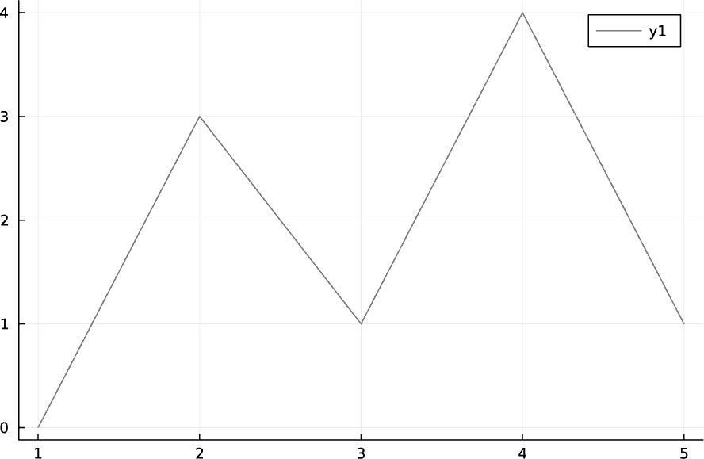

*图 4-1：绘制单个向量的图*

我们得到一个图例，目前它的信息量不大。我们稍后会学习如何调整图例，并改变图表的其他方面，但首先让我们看一下使用`plot()`的不同方法。

**注意**

*我为本章的所有示例创建了灰度版本，以便打印，但每个绘图命令的原始彩色输出可以通过本书的补充网站获得，网址是* [`julia.lee-phillips.org`](https://julia.lee-phillips.org)*。*

第二种形式提供了*x*和*y*变量，使用两个`Vector`：

```
julia> plot([0, 0.13, 0.38, 0.88, 1.88], [0, 3, 1, 4, 1])
```

结果（图 4-2）显示相同的*y*值在不同的水平位置上绘制。

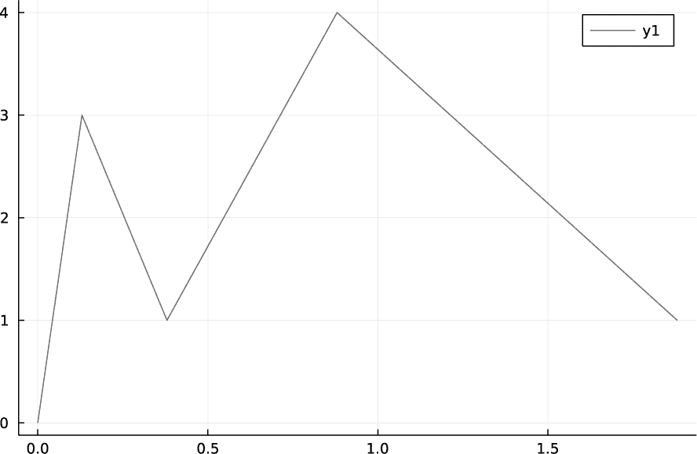

*图 4-2：绘制一个向量与另一个向量的关系图*

#### ***绘制函数***

要绘制一个函数，我们可以将一个向量作为第一个参数，第二个向量通过将函数广播到第一个参数上来创建（参见第 51 页中的“广播”部分）：

```
julia> f(x) = sin(1/x)
f (generic function with 1 method)

julia> x = π/1000:π/1000:π
0.0031415926535897933:0.0031415926535897933:3.14

julia> plot(x, f.(x))
```

在这个例子中，我们首先使用简洁的一行函数定义语法创建一个函数`f()`。接下来我们定义一个范围并将其存储在 x 中；该范围排除了`0`，以避免出现奇点。`plot()`命令有两个`Vector`参数，如之前所示。该范围被实例化为一个`Vector`，`f()`后的点符号将该函数广播到`x`上，返回一个用于因变量的`Vector`。图 4-3 显示了结果。

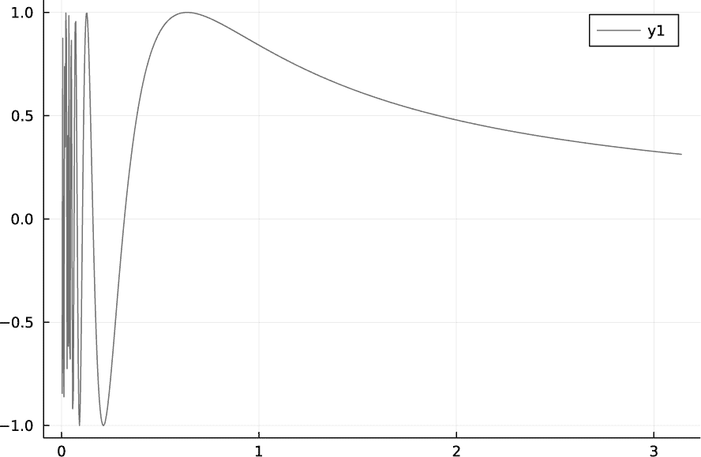

*图 4-3：一个在向量上广播的函数图*

我们可以看到，随着我们接近原点，图形变得不准确，π`/1000`的分辨率无法跟上该区域内快速的振荡变化。

`plot()`函数及其相关函数提供了一个方便的简写方式。我们可以不必显式创建一个广播表达式作为第二个参数，而只需写出函数的名称，或构造一个匿名函数。`plot()`函数会将我们指定的函数广播到我们在第一个参数中传入的自变量向量上。

换句话说，我们可以将`plot(x, f.(x))`简化为`plot(x, f)`。如果我们没有事先定义`f()`，我们可以直接插入一个匿名函数，写作`plot(x, s -> sin(1/s))`。这三种调用`plot()`的方法是等价的。

我们甚至可以省略自变量，只提供函数名或匿名函数。在这种情况下，`plot()`会为我们绘制函数，自动选择自变量的位置并处理奇异点。我们可以使用第二和第三个参数为水平轴提供一个默认值范围，从–5 到 5。如果我们在第一个参数中使用一个函数的`Vector`，我们将获得所有函数在同一坐标轴上的图。使用相同的`f`定义，执行`plot([sin, cos, f], -π, π)`将生成图 4-4。


*图 4-4：绘制三个函数*

在这个`plot()`的用法中，我们提供了函数的名称。我们并没有*调用*这些函数，因此省略了括号。绘图是匿名函数的常见应用（详见第 51 页的“创建匿名函数”）。它们的目的是：将一个函数作为参数传递给另一个函数，在此例中是`plot()`。

#### ***绘制向量的向量或函数***

如果我们在前两个参数位置提供向量的向量，`plot()`会依次循环这两个参数，必要时重复使用元素。例如，如果我们调用`plot([x1, x2], [y1, y2])`，我们将得到`y1`与`x1`，以及`y2`与`x2`的图，两个图会显示在同一坐标轴上。但如果我们调用`plot(x1, [y1, y2])`，我们将得到`y1`与`x1`，以及`y2`与`x1`的图。如果我们调用`plot([x1, x2], y1)`，我们会看到`y1`与`x1`，以及`y1`与`x2`的图。

如果我们使用水平拼接，结果也会相同；换句话说，`plot([x1, x2], [y1, y2])`和`plot([x1 x2], [y1 y2])`会产生相同的图。当传入`Matrix`类型的参数时，`plot()`按列绘制。我们甚至可以调用`plot([x1, x2], [y1 y2])`，将一个向量的向量与矩阵混合，`plot()`会明白我们的意思，并绘制与前两个示例相同的图。

如果我们使用*垂直*拼接，我们将简单地创建更长的向量。我们可以用它来绘制不同范围内的不同函数：

```
julia> x = 0:5π/1000:5π
julia> plot([x; 5π .+ x], [sin.(x); -exp.(-x .* 0.2) .* sin.(x)])
```

在这个例子中，我们将`x`向量与右移 5π的自己拼接，并将结果作为自变量。然后，我们将绘制一个`sin`函数，它与相同的函数相乘并与衰减指数相结合（注意始终使用广播符号）。图 4-5 展示了结果。

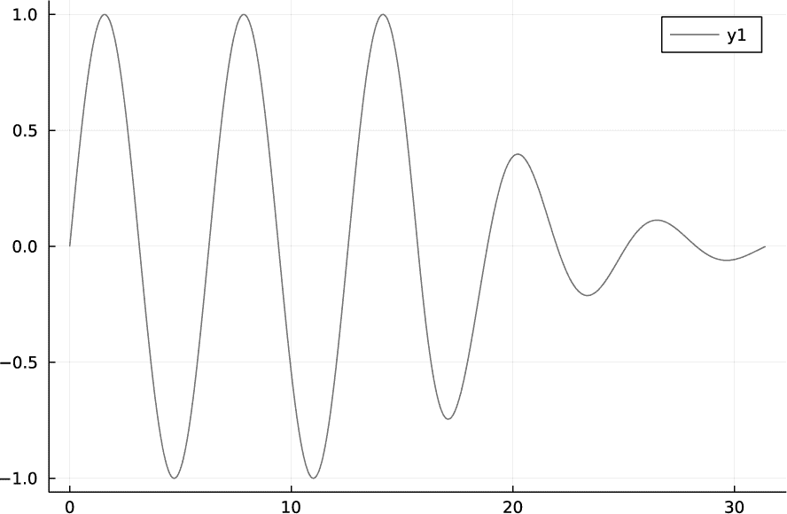

*图 4-5：连接向量以模拟阻尼振荡*

该图可以解释为最初没有摩擦的振荡，在*x* = 5π时施加了阻尼。

#### ***显示与变换***

我之前提到过，在程序文件中，我们通过调用`gui()`来显示图形。那么，`gui()`函数是如何知道显示哪个图形的呢？绘图系统在全局命名空间中维护一个*当前图形*，以及与图形显示相关的其他设置和状态。这在交互式绘图中非常方便，因为它允许我们通过变更当前图形来逐步调整和添加内容。`plot()`的变更版本是`plot!()`，符合约定（请参见第 56 页中的“变更其参数的函数”部分）。

使用变更操作，我们可以通过这三行代码生成图 4-4：

```
julia> plot(sin, -π, π)

julia> plot!(cos)

julia> plot!(f)
```

`plot!()`函数保持首次调用时设定的范围。我们可以使用该函数的变更形式，除了添加曲线外，还能改变图形的许多其他方面。

`plot()`和`plot!()`函数返回图形对象，我们可以将它们赋值给变量。我们在 REPL 或笔记本中调用这些函数时看到图形，是因为 Julia 在交互式环境中，每当从表达式返回图形对象时，会自动调用`gui()`。如果我们将某些图形赋值给变量，每次想查看其中一个时，只需在 REPL 中输入其名称并按下回车键即可。在程序文件中，我们可以将图形对象作为参数传递给`gui()`。

如果我们将一个图形对象作为`plot!()`的第一个参数，它将变更该图形，而不是当前图形。例如，如果我们执行`ps = plot(sin)`，则`ps`是`sin()`函数的图形。调用`plot!(ps, cos)`将执行两件事：它将变更`ps`，向其中添加一条`cos()`曲线，并返回结果，因此修改后的图形将出现在屏幕上。使用不变更版本的`plot()`进行相同的调用，将显示包含两条曲线的图形，但不会修改`ps`。

我们可以将任意数量的图形对象作为参数传递给`plot()`，它会自动将它们排列成一个网格。有关如何更精确地控制这种排列，请参见第 117 页中的“布局”部分。

这个 REPL 会话创建了几个图形，然后将它们组合起来：

```
julia> parabola = plot(x -> x²);

julia> ps = plot(sin, 0, 2π);

julia> plot!(ps, cos);

julia> plot(ps, plot(f), plot(s -> s³), parabola)
```

所有的行都以分号结尾，除了最后一行，在这里我们希望看到图形。首先，我们将变量`parabola`赋值为一个表示抛物线的图形对象，该图形对象是通过匿名函数构建的。此时变量的值是一个数据类型，表示一个完整的图形，包含坐标轴、刻度线等内容。我们没有指定范围，因此抛物线会从-5 到 5 绘制。

然后我们将`ps`赋值为`sin`函数的图形，这次设置了从 0 到 2π的范围。

接下来，我们决定让`ps`也包含一条`cos`曲线，因此我们进行了更改；`plot!()`将保持现有的范围。

最后一行生成了图 4-6 中显示的图形。

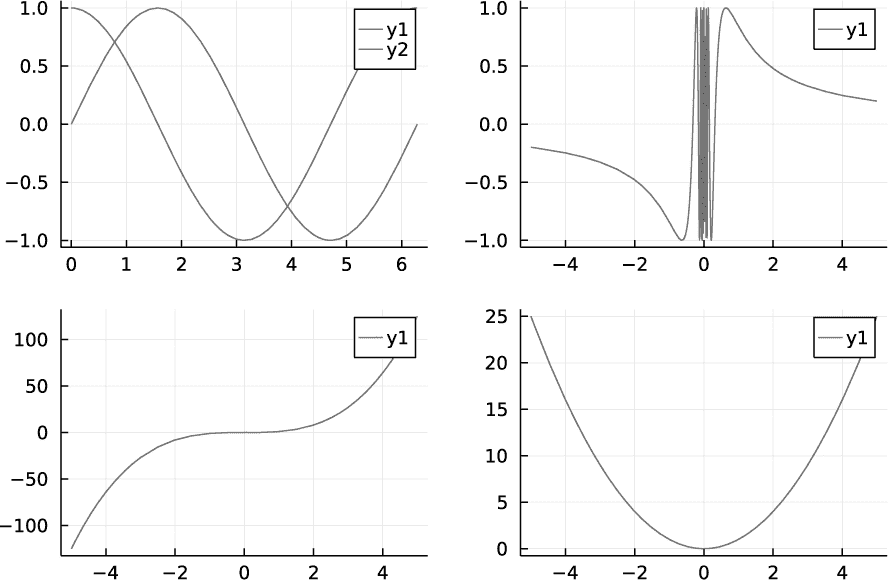

*图 4-6：绘制四个图形对象*

我们通过四个绘图对象参数调用 `plot()`。第一个和最后一个是两个绘图变量，第二个是直接通过 `plot()` 函数在之前的 `f` 函数上创建的绘图对象，第三个使用匿名函数。

#### ***创建参数化图***

平面中的参数化图也被归类为二维图，因为有一个自变量，现在称为 *参数*。在这种类型的图中，*x* 和 *y* 都依赖于参数。如果我们将两个都是函数的参数传递给 `plot()`，它会识别出这是一个参数化图的签名，并生成一个图形，其中 *x* 的依赖关系由第一个函数给出，*y* 的依赖关系由第二个函数给出（通常，*x* 被绘制在横轴上，*y* 被绘制在纵轴上）。我们必须通过两个附加参数来指定参数的定义域；然而，与非参数函数绘图时不同，这里没有默认值。

参数化绘图使我们能够渲染各种复杂的形状，如圆和螺旋线，如 图 4-7 所示。

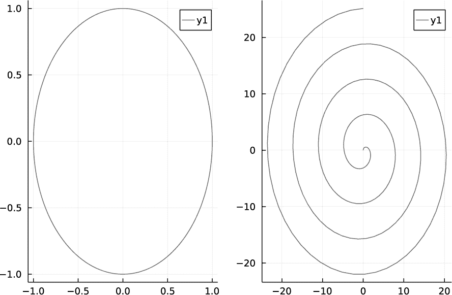

*图 4-7：两个参数化图*

左侧的图形通过调用 `circle = plot(sin, cos, 0, 2`π`)` 创建，右侧的螺旋线通过 `spiral = plot(r -> r*sin(r), r -> r*cos(r), 0, 8`π`)` 创建。我们通过调用 `plot(circle, spiral)` 绘制复合图形。

与常规函数绘图一样，自变量（在这里是参数）可以是隐式的，正如我们绘制圆形时使用的调用。当要绘制的函数过于复杂，无法允许这种情况时，如螺旋线示例所示，我们必须使用一个虚拟变量，在本例中我们命名为 `r`。

#### ***制作极坐标图***

极坐标图使用常规的极坐标系，而不是矩形坐标系。自变量是角度，从水平轴开始逆时针测量，因变量是距离原点的距离。

图 4-8 显示了两个简单的极坐标图。`plot()` 函数呈现坐标网格，以反映极坐标几何的对称性。

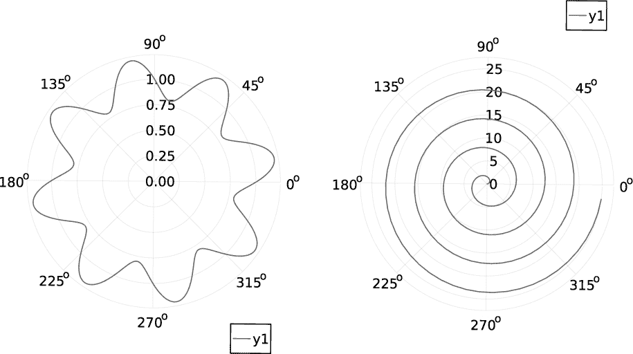

*图 4-8：两个极坐标图*

我们通过 `plot(0:2`π`/500:2`π`, t -> 1 + 0.2*sin(8t); proj=:polar)` 创建了左侧的图形，通过 `plot(0:8`π`/200:8`π`, t -> t; proj=:polar)` 创建了右侧的螺旋线。这些调用中的第一个参数是角度坐标数组，第二个参数是将角度映射到距离原点的函数，使用 `t` 作为虚拟变量。参数 `proj=:polar` 告诉 `plot()` 生成极坐标图。这是一个关键字参数，正如在 第 96 页 的“可选和关键字参数”部分所解释的那样。

#### ***制作散点图***

到目前为止，我们看到的二维图形通过一组点绘制了一条连续的线。有时我们需要绘制一组点或其他标记，每个标记位于特定的(*x*, *y*)位置：*散点图*。`scatter()`函数与`plot()`函数的工作方式相同，但它绘制的是点集而不是曲线。

作为一个示例应用，假设我们想要可视化迭代映射的输出：


这个简单的映射产生了多种迷人的模式，且依赖于*a*的关系是不可预测的。Julia 版本如下：

```
julia> function ginger(x, y, a)
           x2 = 1.0 - y + a*abs(x)
           y2 = x
           x2, y2
       end
```

我将它命名为映射的常见别名：*姜饼人*。

我们将值的序列存储在两个向量`x`和`y`中，初始化为起始坐标，并迭代 4000 次：

```
julia> x = [20.0]; y = [9.0];
julia> for i in 1:4000
        ➊ x2, y2 = ginger(x[end], y[end], 1.76)
           push!(x, x2)
           push!(y, y2)
       end
```

该列表使用了一种*解构*形式➊。`ginger()`函数返回一个元组，其第一个成员存储在`x2`中，第二个成员存储在`y2`中。

运行这个循环后，我们可以通过散点图查看`x`和`y`的内容。调用`scatter(x, y; ms=0.5, legend=false)`会生成图 4-9 所示的图形。

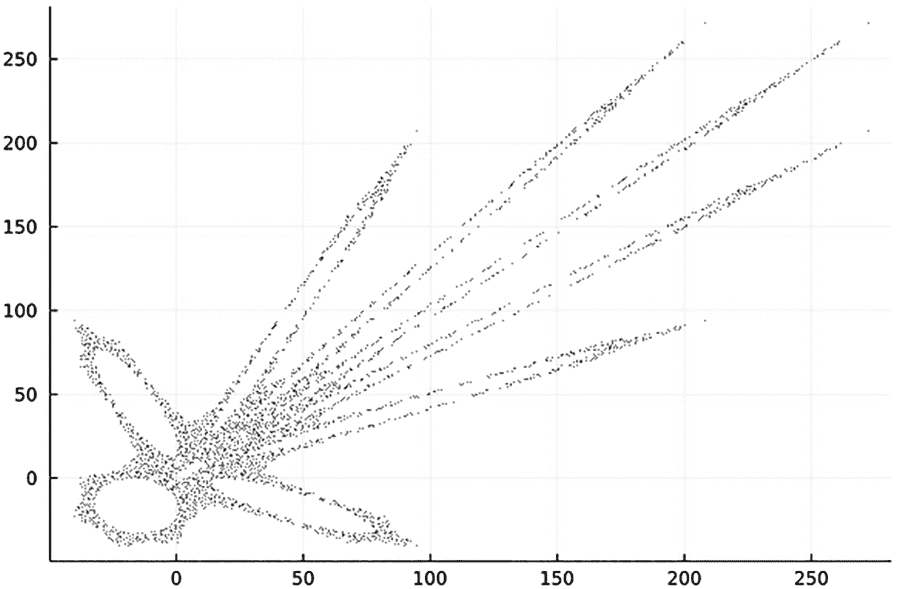

*图 4-9：姜饼人迭代映射*

在对`scatter()`的调用中，`x`和`y`参数后，我们在分号后添加了新内容。这两个*可选关键字参数*影响图形的外观，详细内容将在下一节中解释。

### **可选和关键字参数**

在函数定义中，我们可以为参数提供默认值。这样做使这些参数变为*可选*，因为用户可以不使用它们就调用函数：

```
julia> g(x, y=2) = x + y
g (generic function with 2 methods)

julia> g(4)
6

julia> g(4, 9)
13
```

在这个例子中，`g()`的定义包括了`y`的默认值`2`。如果我们调用它时没有第二个参数，它将返回`x + 2`。当我们提供第二个参数时，它将使用该参数。

到目前为止，我们已经学习了如何定义和调用带有*位置参数*的函数。无论这些参数是否可选，值的分配是根据我们在调用函数时在参数列表中的顺序来确定的。

Julia 也有*关键字参数*，这些参数通过名称而非位置来识别。与其他一些语言不同，在定义函数时，我们必须区分位置参数和关键字参数；我们用分号分隔它们，正如这个例子所示：

```
   julia> p(x; y=2) = x + y
   p (generic function with 1 method)

➊ julia> p(4)
   6

   julia> p(4, 5)
   ERROR: MethodError: no method matching p(::Int64, ::Int64)
   Closest candidates are:
     p(::Any; y) at REPL[346]:1

   julia> p(4; y=5)
   9
```

在这里，我们定义了`p()`，它有一个位置参数和一个名为`y`的关键字参数，默认值为`2`。我们可以省略关键字参数➊调用`p()`，因为默认值使其成为可选项。如果我们提供两个位置参数，将会返回一个错误，因为该函数只接受一个位置参数。确保理解`g()`和`p()`函数的区别：它们仅在函数签名上有所不同。

**注意**

*在调用函数时，我们可以选择使用逗号代替分号，因为没有歧义的可能；然而，在函数定义中，分号是必需的。*

`Plots`生态系统中的绘图函数使用位置参数来传递数据或函数，使用关键字参数来设置绘图选项。由于所有绘图选项都有默认值，直到现在我们都没有必要使用它们。

### **基础绘图设置**

要调整绘图的外观，我们使用关键字参数。使用`Plots`包创建的可视化包含四个组件，每个组件都有一组适用的设置。

这四个组件是*绘图*、*子图*、*轴*和*系列*。绘图可以包含子图，而每个子图又可以包含轴或系列。

整体插图被称为绘图；它包含其他子图，若有多个子图，则类似于图 4-6。如总体标题和背景色这类设置适用于整个绘图。

在一个绘图中，每个子图可以有自己的标题、背景色、边距以及其他许多设置。

实际的曲线或其他函数或数据的可视化是系列，子图可以包含多个系列。

每个子图包含一个轴对象。其设置决定了是否在坐标轴上绘制箭头、刻度标签的颜色、坐标轴上的数字等内容。

在大多数情况下，我们只需要使用合适的关键字来设置我们可视化的*属性*，然后绘图系统会在合适的地方应用它。但在设计复杂的可视化时，我们有时需要针对特定组件进行调整。

官方绘图系统文档在[*https://docs.juliaplots.org/stable/*](https://docs.juliaplots.org/stable/)中包含了所有组件的完整属性列表，以及哪些属性被哪些后端支持。以下列表提供了最重要的属性，并举例说明它们的效果：

#### **标题**

+   总体标题: `plot_title`

+   子图标题: `title`

+   图例标题: `legendtitle`

#### **其他标签**

+   图例文本: `label`

+   图例存在与位置: `legend`

+   轴标签: `[x,y]guide`

+   在任意位置标注: `annotation=(x, y, "Text")`

#### **字体颜色**

+   总体标题: `plot_titlefontcolor`

+   子图标题: `titlefontcolor`

+   图例: `legendfontcolor`

+   轴标签: `[x,y]guidefontcolor`

#### **区域颜色**

+   边距区域: `background_outside`

+   仅绘制图形区域: `background_inside`

#### **曲线**

+   线条颜色: `lc`

+   线条宽度: `lw`

+   线条样式: `ls`

#### **散点图**

+   标记形状: `shape`

+   标记颜色: `mc`

+   标记大小: `ms`

#### **等高线图**

+   为等高线添加标签（布尔值）: `clabels`

+   等高线等级: `levels`

#### **轴与刻度**

+   反转轴（布尔值）: `[x,y]flip`

+   刻度标签旋转: `[x,y]rotation`

+   绘制轴线: `showaxis [x,y]ticks`

+   框架样式: `framestyle`

#### **网格**

+   绘制网格（布尔值）: `grid`

+   网格线透明度: `gridalpha [0,1]`

+   网格线样式: `gridstyle`

#### **坐标系统**

+   使用极坐标: `:proj=polar`

#### **尺寸与边距**

+   子图的边距: `[left,right,top,bottom]margin`

+   总体绘图大小: `sizes(a, b)`（单位：像素）

+   子图纵横比：`ratio`

这些列表中的每个关键字都有一组缩写和替代拼写，所有这些都在官方文档中列出。我为每个案例选择了一个版本；它并不总是最简短的替代方案，而是一个设计上便于记忆并避免混淆的选择。

其中一些设置的目的，在我们稍后讨论之前可能不太明确，但我已经将它们都列在这里，供大家方便参考。

#### ***字体属性***

要形成设置字体属性（如字体大小或字体家族）的关键字，可以查找前面列出的字体颜色设置对应的名称，并用所需的属性（如 `fontsize` 或 `fontfamily`）替换 `fontcolor`。例如，要使图表标题的字体大小为 30pt，可以使用设置 `plot_titlefontsize=30`。

字体*家族*取决于使用的后端类型。GR 后端的字体列表请参见 [*https://gr-framework.org/fonts.html*](https://gr-framework.org/fonts.html)。一些常用的字体家族（也可能在其他后端中可用）包括 Times（Roman、Italic、Bold）、Courier、Bookman、DejaVu Sans 和 Computer Modern。将设置作为字符串提供。如果我们设置 `fontfamily` 属性，它将应用于图表上的所有或大多数文本。例如，为了让刻度线、坐标轴标签和其他注释使用 Computer Modern 字体，但标题使用 Times 字体，我们可以使用 `plot(...; fontfamily="Computer Modern", legendfontfamily="Times")`。

如果我们修改一个包含子图的图表，并且我们正在添加或更改适用于子图的属性，那么我们必须指定要修改的子图，除非我们希望更改应用于所有子图。这就是 `subplot` 关键字的作用。将其设置为整数，索引 `plot()` 语句中按顺序出现的子图。例如，对于两个并排显示的图表 `plot(p1, p2)`，我们可以通过 `plot`!(`; xguide` `="Time", subplot=2)`) 在 `p2` 的横轴上添加标签。如果没有 `subplot` 关键字，两个图表都会得到标签。

#### ***框架样式***

`framestyle` 设置决定了坐标轴的类型。图 4-10 展示了六种可能的选择。

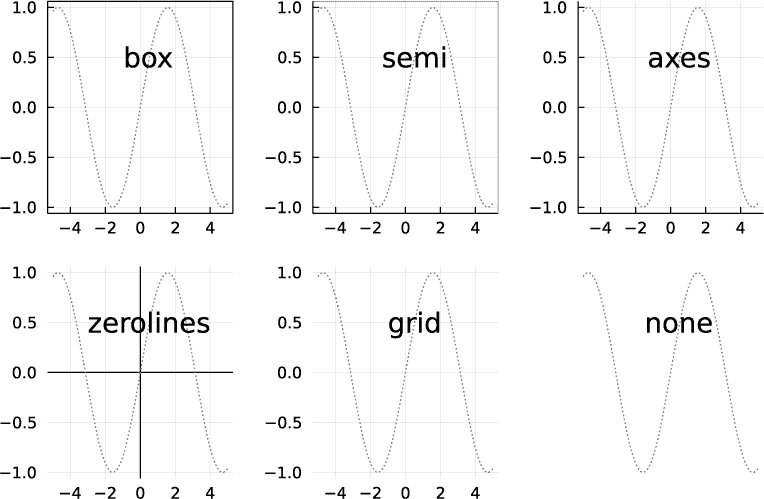

*图 4-10：六种可能的框架样式*

我们将属性设置为图表中显示的符号版本。例如，要获取左下角的样式，我们可以使用设置 `framestyle=:zerolines`。

### **处理绘图设置**

现在我们可以理解 `scatter(x, y; ms=0.5, legend=false)` 的调用，它生成了图 4-9。在前两个位置参数之后，表示要绘制的点的数组，我们看到一个分号，表示关键字参数的开始。第一个设置了较小的标记大小，第二个关闭了图例。

让我们使用“基础绘图设置”中列出的一些基本属性组合，来解决一些其他的可视化问题。第 98 页。

#### ***宽高比和标题字体大小***

以下程序创建一个简单的图表，包含两个子图，分别显示圆形和抛物线：

```
julia> p1 = plot(sin, cos, 0, 2π; title="A Circle", ratio=1,
                 grid=false, ticks=false, legend=false)

julia> p2 = plot(x -> x², -1, 1; title="A Parabola",
                 gridalpha=0.4, gridstyle=:dot, legend=false)

julia> plot(p1, p2; plot_title="Two Shapes", plot_titlefontsize=20)
```

在这里，我们使用`ratio`关键字在第一行设置宽高比。你可能已经注意到，在图 4-7 中本应是圆形的图像被渲染成了一个非圆形的椭圆。Julia 图表的默认大小不是正方形，而是横向比纵向长，因此圆形被横向拉伸。如果这很重要（如本例中所示），我们可以使用`ratio`来解决这个问题。我们还关闭了该图的网格和刻度。

大多数后端的默认网格比较轻，所以我们通过增加抛物线图中的`gridalpha`值使其更加突出。默认值为`0.1`。

最后一行创建了一个组合图，设置了比默认值稍大的整体标题。图 4-11 展示了结果。

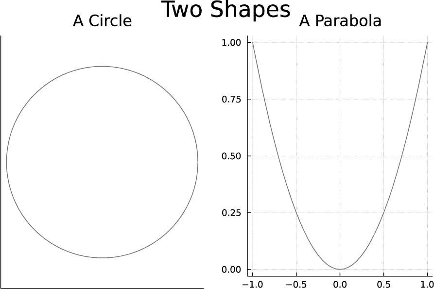

*图 4-11：包含两个子图的图表*

为了在两个子图之间增加间距，我们可以例如为左侧子图设置`rightmargin`。在设置边距之前，使用`Plots .PlotMeasures`命令，它允许我们在边距设置中使用实际尺寸；例如，`rightmargin=10mm`。其他可用的单位包括`inch`、`cm`、`px`和`*pt*`。

**注意**

*plot_title*是绘图系统中的一个新功能，它的实现还不完整。如果我们选择更大的标题字体，标题将与子图标题重叠，而且没有直接的方法解决这个问题。

#### ***标签和图例位置***

在下一个示例中，让我们绘制*x*^(*n*)在一些*n*值下的图表：

```
julia> plot()

julia> for n = 1:5
           plot!(x -> x^n; lw=3, ls=:auto, label=n)
       end

julia> plot!(; legend=:topleft, legendtitle="Exponent")
```

首先，我们使用一个空的`plot()`命令清除任何现有的图表，然后针对每个函数依次更新空白图表。由于`for`循环没有返回结果，因此我们在循环后的最终调用之前看不到任何内容，最终调用仅仅是进行了一些图表设置。在绘图语句中，`label`设置定义了与该图表相关的图例文本。它期望的是一个字符串（或符号），但可以将整数`n`转换为字符串。`lw`设置使线条比默认值更粗。`ls`设置用于设置线条样式。它可以取值`:auto`、`:solid`、`:dash`、`:dot`、`:dashdot`或`:dashdotdot`。这里使用的选项`:auto`会循环使用其他五种样式，如果图表有超过五条曲线，则重复使用样式。当我们无法使用颜色时，这是一个适合打印的好选择。图 4-12 展示了结果。

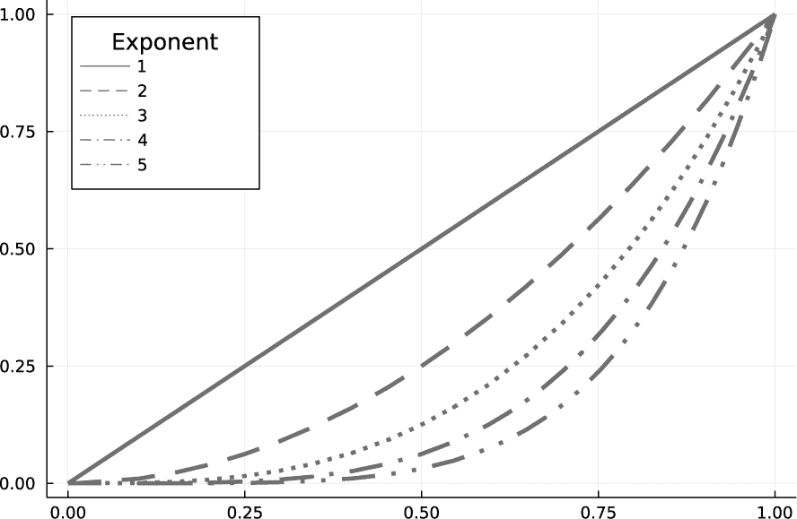

*图 4-12：五种线条样式*

最后的`plot()`语句设置了`legend`，将图例放置在图表的左上角。我们可以使用其他类似的定位符号，也可以在前面加上`outer`，将图例放置在坐标轴外部。为了更精确的定位，我们可以使用`(x, y)`元组来指定图例框的坐标。最后，我们可以设置`legend=false`来省略图例。

#### ***LaTeX 标题与数据驱动的标签位置***

让我们用不同的标签样式绘制相同的函数。我们将使用注释将每个指数的标签放置在对应曲线的顶部，如示例 4-1 所示。

```
julia> plot()

julia> for n = 1:5
           xlabel = (0.2 + 0.12n)
        ➊ ylabel = xlabel^n
           plot!(x -> x^n; lw=3, ls=:auto,
                      annotation=(xlabel, ylabel, n),
                      annotationfontsize=25)
       end

julia> using LaTeXStrings

julia> plot!(; legend=false, xguide="x", yguide="y", guidefontsize=18,
        ➋ title=L"x^n \textrm{~labeled~by~}n", titlefontsize=30)
```

*示例 4-1：使用计算得到的标签和 LaTeX 标题*

在这里，我们为循环中的五个标签计算坐标。x 坐标随着指数的增大向右增加，以便将标签分开，避免重叠。标签的 y 坐标 ➊ 是与我们绘制的曲线相同的 *x* 函数，以确保它们精确地位于所标记的曲线上。

`annotation` 设置中的 `n` 是一个包含整数的变量，原本应该是一个 `String`，但 `plot()` 函数会帮我们转换它。

然后我们导入一个之前没见过的包：`LaTeXStrings`（注意大小写），它让我们可以在图表标题和注释中使用 LaTeX 语法写数学公式。即使是非 LaTeX 用户，有时也可能需要在图表中展示公式，而 LaTeX 的数学语法简单直观。在第 121 页的“进一步阅读”中可以找到相关指南的链接。导入这个包之后，我们可以在任何字符串前加上 `L`，将其转化为 LaTeX 字符串。在可以排版的环境中，比如图表中，Julia 会适当地排版该字符串。整个字符串都会被放入 LaTeX 数学模式，其中所有字母都被视为数学符号。因此，如果我们需要一些普通文本，如这个例子中的 ➋，我们必须用 LaTeX 命令将其包裹起来，强制排版为普通文本。在这些文本片段中，用波浪号（`~`）表示空格。图 4-13 中展示了这个 REPL 会话的结果。

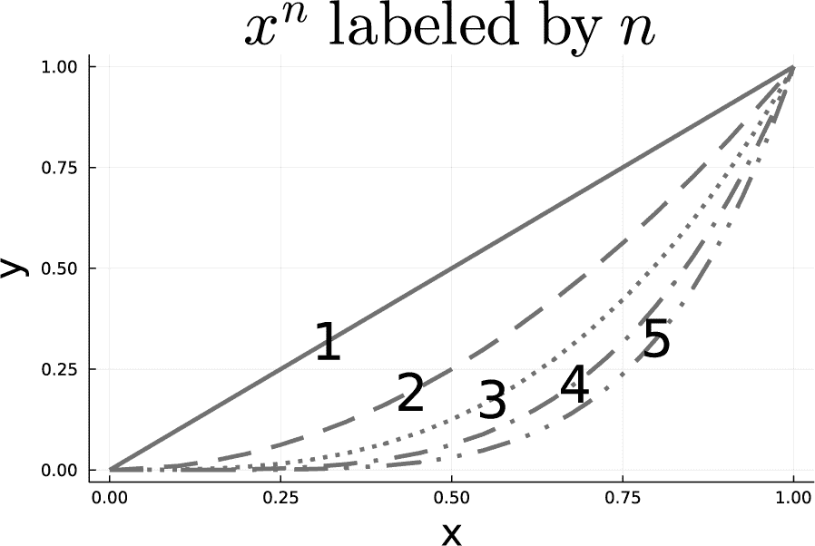

*图 4-13：使用计算得到的标签和 LaTeX 标题*

除了单个图表元素的设置外，还有两个设置会产生更大范围的变化。`thickness_scaling` 设置非常适用于创建一个在演示中更易阅读的图表版本。它会加粗所有元素，包括刻度标签。它还会影响图表的边距，并可能改变图表元素的位置。将值设置在 1 和 1.7 之间可以得到较好的效果。使用小于 1 的值则会创建一个较瘦的图表版本。

#### ***回归线***

`smooth` 设置会通过线性回归为图上的每条曲线或数据集绘制最佳拟合线。

让我们回到姜饼地图，并使用相同的初始条件，计算 20,000 次迭代，设置 *a* = 1*.*6，再次将结果存储在 `x` 和 `y Vector` 中。我们将绘制两个子图。第一个是类似图 4-9 的散点图，但会添加一条回归线，显示点的平均方向。第二个图将绘制前 100 个 `x` 值与迭代次数的关系，并显示一条回归线，展示距离原点逐渐增大的趋势：

```
   julia> sc = scatter(x, y; smooth=true, ms=1, legend=false,
                       xguide="x", yguide="y", guidefontsize=18)

   julia> pl = plot(x[1:100]; smooth=true, legend=false)

➊ julia> pl = plot!(x[1:100]; lc=:lightgray, legend=false,
                     xguide="iteration", yguide="x", guidefontsize=18)

   julia> plot(sc, pl, plot_title="Gingerbread map with a = 1.6",
               plot_titlefontsize=22)
```

首先，我们像之前一样创建姜饼地图的散点图，使用`smooth=true`设置添加趋势线，并将结果赋值给`sc`。然后，我们绘制初始的 100 个*x*值，同样添加趋势线。将这两个子图一起绘制并加上标题，就得到了图 4-14。

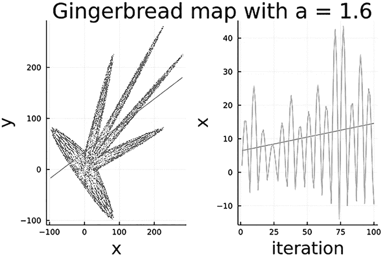

*图 4-14：姜饼地图的趋势*

与之前一样，`plot_title`属性为两个图表创建一个总标题。我们希望绘制的曲线和计算的趋势线有不同的样式，但没有为此提供设置，因此我们采用了一个技巧，使用不同样式的曲线进行叠加绘制，但没有趋势线➊。

### **保存图表**

当你准备将创作保存到磁盘时，调用`savefig(p, path)`，其中 p 是保存可视化内容的变量，path 是你希望存储图像文件的位置。路径中的文件名扩展名决定了格式，但不同的后端支持不同类型的图像。PDF 和 PNG 格式应该始终可用，SVG 也被广泛支持。

如果省略`p`，则默认保存当前图表。一种常见的工作流程是反复修改图表，直到满意为止，然后调用`savefig(path)`。

### **细节插图**

插图是一个小图，位于较大图的框架内。它通常用于提供外部图部分的放大视图。Julia 的绘图系统内置了一个创建这种细节插图的函数，叫做`lens!()`。它仅以变更形式存在，因为插图只有在现有图的基础上才有意义。

`lens!()`的第一个参数是现有图表，或者省略以表示当前图表。接下来的两个参数是定义要放大的矩形区域的向量。必需的参数`inset`指定哪个子图需要插图以及插图的位置和大小。图 4-15 中的示意图展示了如何使用这些参数。

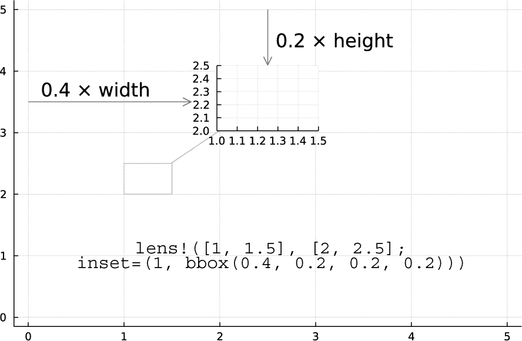

*图 4-15：如何制作插图*

图 4-15 使用一个带网格的空白图进行说明。注释“width”和“height”指的是外部图的宽度和高度。创建插图的完整命令显示在图的底部附近。

作为`lens!()`的应用，我构建了另一个姜饼地图的实例，这次设置*α* = 1*.*4，并进行了 100,000 次迭代，以产生更多细节。接下来的两行首先创建散点图，然后添加插图：

```
scatter(x, y; ms=0.1, legend=false)

lens!([-26, -22], [31, 38];
      inset=(1, bbox(0.1, 0, 0.3, 0.3)),
   ➊ ticks=false, framestyle=:box, subplot=2,
      linecolor=:green, linestyle=:dot)
```

在调用`lens!()`时，设置➊用于`ticks`和`Framestyle`应用于插图，而`linecolor`和`linestyle`设置应用于绘制放大镜，后者标示出扩展区域。全框架样式是插图的一个不错选择。

图 4-16 展示了结果。我使用插图图放大了姜饼地图的一个角落，显示其中的点模式。

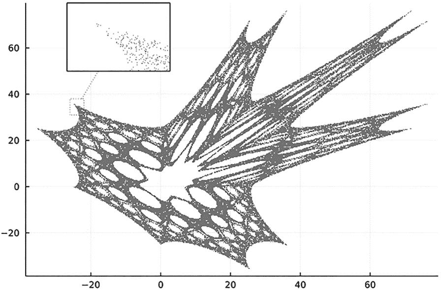

*图 4-16：使用细节插图放大姜饼地图的一部分*

在创建插图的调用中，`subplot=2`设置确保其他图形设置仅适用于插图，这使得插图成为第二个子图。通过引用子图的编号，如果需要，我们还可以在插图中创建另一个插图。

### **3D 图形**

几种类型的图形用来可视化依赖于两个独立变量的量。当使用矩形坐标时，依赖变量通常称为*z*，而两个独立变量称为*x*和*y*。表示这种关系的三种常见方式是：表面图、热图或等高线图。最有效的方式取决于数据的性质以及我们试图阐明的特征。

#### ***表面图***

在通过`using Plots`导入绘图包后，我们可以使用几个 3D 绘图函数。对于*表面图*，我们使用`surface()`函数来创建一个 2D 表面嵌入在 3D 空间中的透视渲染图，表面的高度和着色表示*z*值。

这里是一些适用于表面图的额外设置：

+   绘制色条：`colorbar`（`true` 或 `false`）

+   表面不透明度：`fillalpha`

+   视角：`camera`（方位角，仰角）（以度为单位）

+   色条标题：`cbtitle`

+   表面调色板：`c`

让我们将这些设置应用于绘制两个变量的高斯分布的表面图。在定义一个从-1 到 1 的*x*向量后，我们可以使用匿名函数语法绘制表面，代码如下：

```
surface(x, x, (x, y) -> exp(-(0.05x² + y²)/.1);
        fillalpha=0.5, camera=(45, 50), c=[Gray(0), Gray(0.8)],
        xrotation=45, yrotation=-45)
```

我们使用小于 1 的 alpha 值以便能够看到表面，并且旋转了轴标签，使它们更容易阅读，避免在坐标轴交汇处发生重叠。图 4-17 展示了表面图。

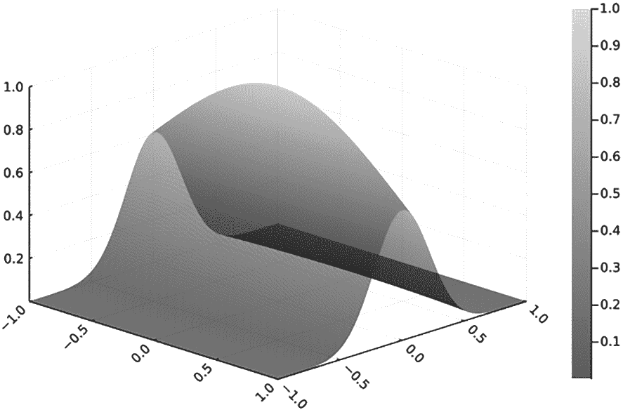

*图 4-17：表面图*

`c`设置定义了用于给表面着色的调色板。有几种方法可以定义调色板；之前使用的那种，通过`Vector`中的多个颜色进行平滑插值来创建调色板。`Gray(0)`为黑色，`Gray(1)`为白色，依此类推。我们还可以通过`RGB(r, g, b)`定义颜色，其中`r`、`g`和`b`分别是红、绿和蓝的分量，范围从`0`（没有）到`1`（完全饱和）。有 600 多种颜色名称作为符号可用，包括易记的名称如`:red`和`:blue`，以及没有实际意义的名称如`:seashell3`和`:oldlace`。

我们可以提供一个符号来指定预定义调色板的名称，而不是提供一个颜色的 `Vector`，预定义调色板有很多可以在 [*https://docs.juliaplots.org/latest/generated/colorschemes/*](https://docs.juliaplots.org/latest/generated/colorschemes/) 中找到。常用的名称有 `:blues` 或 `:grays`，它们使用相同的色调并调整饱和度和亮度，但还有许多可供选择，适用于特殊用途。

#### ***热图***

热图也可视化将两个自变量映射到一个因变量，但自变量的值通过颜色或灰度值表示。该调用类似于表面图，但使用 `heatmap()` 函数：

```
heatmap(x, x, (x, y) -> exp(-(0.05x² + y²)/.1);
               c=:grays)
```

此调用创建了在 图 4-18 中显示的热图。

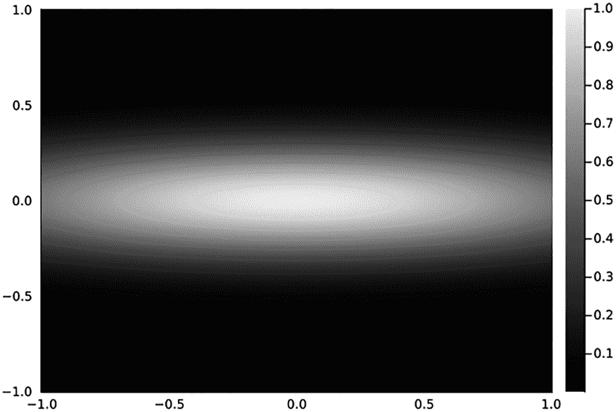

*图 4-18：二维高斯热图*

热图的颜色调色板与表面图相同。

#### ***等高线图***

等高线图类似于热图，但它们使用等高线而非颜色来表示自变量的值。以下是一些与等高线图特定相关的重要属性：

+   等高线数量或特定的等高线级别：`levels`（整数或级别向量）

+   绘制等高线标签（布尔值）：`clabels`

+   填充等高线之间的区域（布尔值）：`fill`

如果我们为 `levels` 提供一个整数，Julia 将绘制相应数量的等高线。如果我们还将 `clabels` 设置为 `true`，它将使用表示的值为等高线添加标签。不幸的是，这些数值标签通常打印出过多的数字，导致标签重叠。如果我们将 `levels` 设置为一个数字 `Vector`，则图形将在这些指定值处绘制等高线，并且它们的标签将使用与 `levels` 相同的精度。以下示例展示了如何使用 `levels` 和 `clabels`：

```
contour(x, x, (x, y) -> exp(-(0.05x² + y²)/.1);
               clabels=true, levels=[0.1, 0.3, 0.5, 0.7, 0.9, 1.0],
               colorbar=false, framestyle=:box)
```

这个调用使用相同的 `x` 向量，并绘制与图表 4-17 (ch04.xhtml#ch4fig17) 和图表 4-18 (ch04.xhtml#ch4fig18) 中的表面图和热图示例相同的函数。结果如图 4-19 所示，标签精度为一位数字。

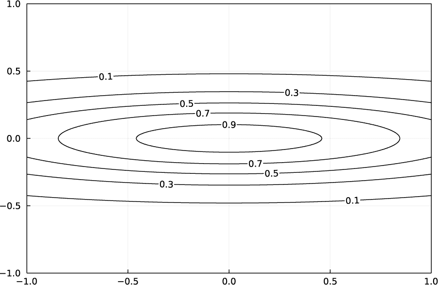

*图 4-19：带标签的等高线图*

`:box framestyle` 与等高线图非常配合。去除颜色条也是一个好主意。我们可以通过设置 `c` 来为线条上色，但这并不总是适用于每个后端。如果发现颜色溢出到等高线中，可以通过 `c=:black` 来修复。

`:dot` 等线条样式有效，但 `:auto` 无效。

**注意**

*当使用某些后端（包括*GR*）并手动设置等高线级别时，必须包括一个大于或等于数据最大值的级别，否则图形将无法正确绘制。*

当 `fill` 属性设置为 `true` 时，会在等高线之间填充颜色，从而形成一种带有等高线的离散热图。`c` 属性定义这些颜色的调色板。`contourf()` 函数是 `contour()` 的别名，且 `fill=true`。

让我们重复之前的等高线图（图 4-19），但这次保留颜色条，开启 `fill`，并使用灰度调色板：

```
contour(x, x, (x, y) -> exp(-(0.05x² + y²)/.1);
               clabels=true, levels=[0.1, 0.3, 0.5, 0.7, 0.9, 1.0],
               fill=true, c=[Gray(0.4), :white])
```

图 4-20 显示了填充等高线图。

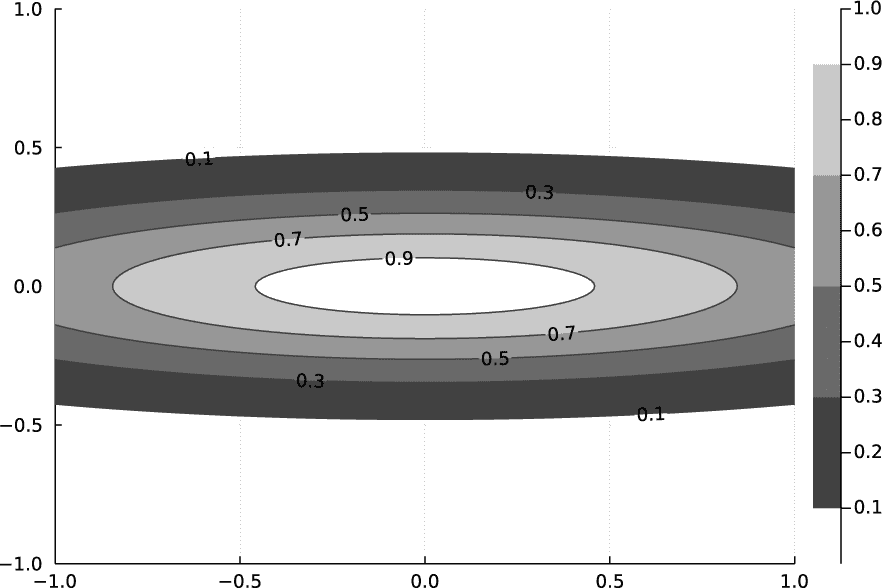

*图 4-20：填充等高线图*

在这种情况下，同时拥有等高线标签和颜色条有些多余，因为它们传达的是相同的信息，但这可能会使图表更易于解读。科学可视化的艺术就在于创造一个既直观清晰又定量精确的结果。

#### ***3D 参数化图***

3D 参数化图与 2D 中的工作方式相同，但它们在 3D 空间中绘制路径，单个参数的三个函数分别给出 x、y 和 z 坐标。与 2D 参数化图不同，我们必须提供三个向量，而且它不适用于函数。以下是一个示例：

```
julia> t = 0:2π/100:2π;

julia> xp = sin.(3 .* t);

julia> yp = cos.(3 .* t);

julia> zp = t .* 0.2

julia> plot(xp, yp, zp; lw=3, gridalpha=0.4, camera=(30, 50))
```

`plot()` 函数在接收到三个向量作为位置参数时知道该怎么做，生成的 3D 参数化图如 图 4-21 所示。

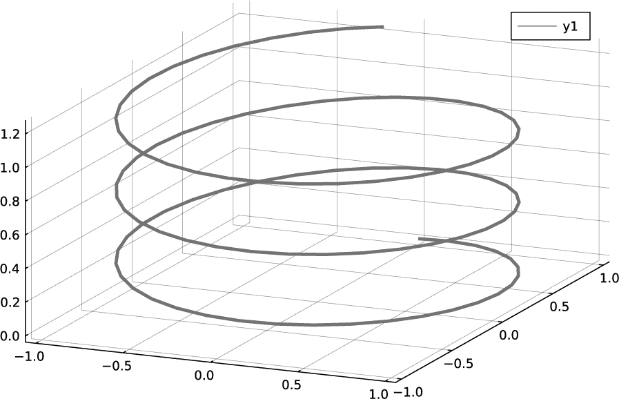

*图 4-21：3D 参数化图示例*

我们可以像处理普通的 2D 图一样使用线条属性，并像处理表面图一样设置相机角度。

#### ***向量图***

向量场将空间中的每个点映射到一个向量，这个向量可以用箭头表示。`Plots` 包提供了通过 `quiver()` 函数创建的向量图。它的前两个参数是 `x` 和 `y Vector`，它们包含了向量起点的坐标。从这些坐标到向量端点的位移存储在另外两个 `Vector` 中，放在一个 `Tuple` 中，并分配给一个同名的关键字参数 `quiver`。

以下示例演示了如何使用 `quiver()`：

```
julia> xc = 0:.3:π;

julia> yc = sin.(xc);

julia> quiver(xc, yc; quiver=(xc .- π/2, yc .- 0.25), lw=3)
```

这三行代码生成了 图 4-22 中的向量图。

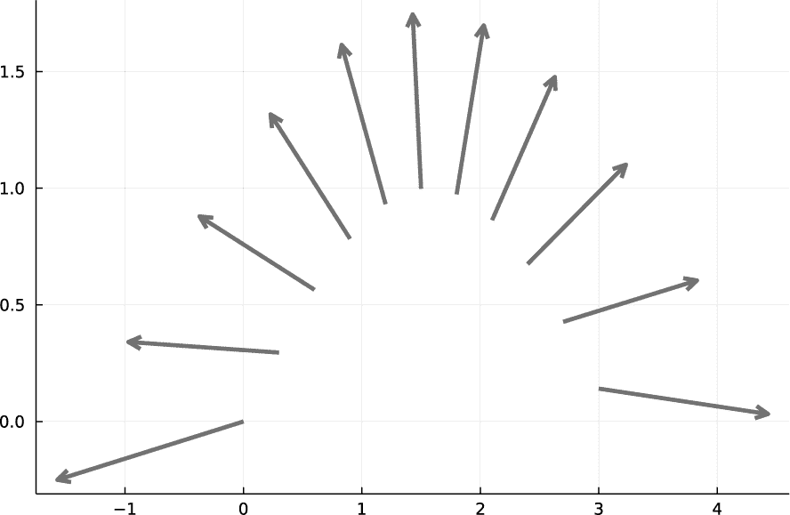

*图 4-22：使用* quiver() 的向量图

`quiver()` 函数接受所有曲线属性；在这里我们设置线条宽度以获得更粗的箭头。

#### ***3D 散点图***

`Plots` 可以将散点图扩展到三维。可视化某个量的 3D 分布的一种方法是绘制一个常规的 3D 网格标记，同时将某个标记属性（如大小或不透明度）设置为该量的函数。首先，我们需要通过创建 `x`、`y` 和 `z` 向量来建立网格：

```
x = []; y = []; z = [];

for i in 0:20, j in 0:20, k in 0:20
    push!(x, i/10 - 1)
    push!(y, j/10 - 1)
    push!(z, k/10 - 1)
end
```

这将创建从 -1 到 1 的坐标数组。

让我们想象一个行星位于网格的中心。我们可以通过首先定义一个势能函数，然后使用它来设置标记大小，从而绘制由于行星产生的引力势的形状：

```
pot(x, y, z) = 1 / sqrt(x² + y² + z²)
scatter(x, y, z;  ms=min.(pot.(x, y, z), 5), ma=0.4, legend=false)
```

在行星附近，势能变得很大，因此我们需要使用 `min()` 函数限制标记的大小。实际上，在 (0, 0, 0) 处，它会变得无限大，但 Julia 会优雅地处理这个问题。结果如 图 4-23 所示。

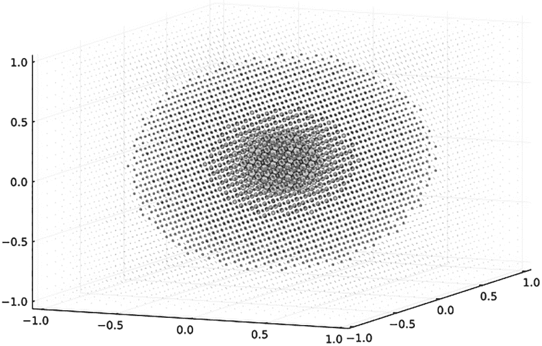

*图 4-23：一个 3D 散点图*

我们设置了透明度，以便能够看到标记的背后。这是我们在 2D 中使用的相同`scatter()`函数，但如果我们提供三个位置参数，Julia 会知道该怎么做。

### **有用的后端**

当前的默认后端`GR`有一个优点，就是速度快，且能够生成大多数基本类别的可视化图形。

还有一些其他后端可供特定用途使用，但大多数都需要我们在包管理器中`add`后才能使用。

#### ***UnicodePlots***

`unicodeplots`后端直接在终端中绘图。它适合快速查看一些数据，用字符进行绘制。我们也可以用它生成图形，然后粘贴到电子邮件中，但显然它不适合用于生成出版用的图形，而且不能保存图形。

要在终端快速绘图，首先在包模式下执行`add UnicodePlots`，然后调用`unicodeplots()`来激活后端。

`unicodeplots`后端不支持所有的绘图类型。它可以绘制 2D 图形，包括散点图，但不能绘制等高线或表面图。不过，`unicodeplots`可以在终端中呈现彩色热力图。

#### ***PyPlot***

`pyplot`后端使用 Python 的 Matplotlib，因此对于已经熟悉该系统的人来说，它可能是一个不错的选择。尽管有时可能会稍慢，但在某些情况下，它能够生成比默认后端更好的图形。

#### ***PlotlyJS***

使用`plotlyjs`后端，我们可以为网页创建交互式图表。将图形保存为*.html*文件扩展名时，会创建一个包含 HTML 片段的文件，我们可以将其粘贴到网页中。该片段加载一些第三方 JavaScript，提供用于平移、缩放以及对于 3D 图形，旋转 3D 空间的交互控件。其他交互形式会根据图形类型适当变化。二维图形在用户悬停在曲线上时显示数据值，而表面图则在鼠标指针的*z*值处绘制等高线。

绘图并不算非常快速，尽管结果看起来不错，交互也非常流畅。使用`plotlyjs`的等高线图比使用`GR`要好，特别是对于彩色等高线，但线宽或线型的属性没有效果，手动设置的等级也不起作用。

在 REPL 中绘图时，每个图形都会弹出一个独立的窗口，使用与 HTML 文件中相同的 JavaScript 交互性。

#### ***PGFPlots 和 PGFPlotsX***

我不会多说这些，因为它们只对那些安装了 LaTeX 并且对 LaTeX 图形系统 PGFPlots 有一定了解的人有用。使用这些系统的人应该知道有两个 Julia 接口可以使用。两个版本的区别在于，`PGFPlotsX` 的语法更接近 LaTeX 中直接使用的语法。通过 `PGFPlots`，我们可以制作出难以通过其他方式实现的极其出色的可视化。对于那些不熟悉该系统的 LaTeX 用户，可能需要了解一下。这个后端确实依赖于 LaTeX 安装——这是一个不容小觑的要求。

#### ***HDF5***

HDF5 代表分层数据格式，第 5 版。这个后端不会直接显示图表；它的目的是将数据和图表一起打包成 HDF 文件。对于任何在研究中使用 HDF 的人来说，这个包是必不可少的，但其他人则不会用到它。

该后端不仅可以写入 HDF 文件，还可以将其读入 Julia 会话，配合其他 `Plots` 后端进行显示。

#### ***Gaston***

`Gaston` 是 gnuplot 的接口，依赖于 gnuplot 的安装。这个后端对那些已经在使用这个古老且强大的图形程序的人来说会很有兴趣。

`Gaston` 既快速又强大，因为 gnuplot 快速且强大。如果你经常需要绘制其他后端无法处理的复杂 3D 图，或者需要更精细的控制来制作用于出版的图表，那么安装 gnuplot 并与 `Gaston` 一起使用可能是最佳选择。

### **布局**

在本章前面我们看到，`plot()` 函数会将图形排列成一个网格，如果传入多个图表对象。有时我们需要对插图中的子图布局进行更多控制。在这种情况下，我们可以使用 `Layout` 系统。

绘图包将图表组合成更大插图的方法是该系统的一大亮点。考虑到它所允许的复杂性，它的使用却非常直观。

在接下来的演示中，`Vector s` 包含六个图表，每个图表显示一个突出的数字，从 1 到 6。这样可以清楚地看到布局引擎如何定位每个图表。

如果你想跟着一起操作，你需要创建自己的 `s` 向量，包含你选择的图表。

#### ***制作简单的矩形布局***

要将默认的方形网格布局替换为不同的矩形排列，只需将所需的行数和列数作为元组赋值给 `layout` 属性：

```
plot(s[1], s[2], s[3], s[4]; layout=(1, 4))
```

如图 4-24 所示，这个调用通过一行四列的方式排列图表。

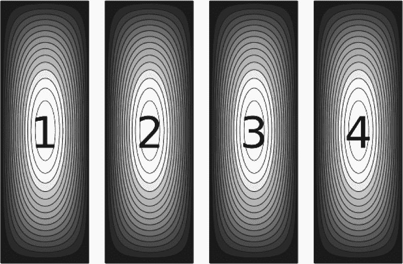

*图 4-24：一行布局*

布局元组中隐含的图表数量必须与子图的数量完全匹配。在这种情况下，默认值相当于 `layout=(2, 2)`。

#### ***使用 grid()***

之前示例中的简单布局使所有子图的大小相同。要控制行和列的高度和宽度，可以使用 `grid()` 函数，如下例所示：

```
plot(s[1], s[2], s[3], s[4];
     layout=grid(2, 2; widths=(0.2, 0.8), heights=(0.7, 0.3)))
```

这个调用创建了图 4-25 中的布局。我们可以省略 `height` 或 `width` 中的任意一个规格，以便在该方向上获得相等的长度。

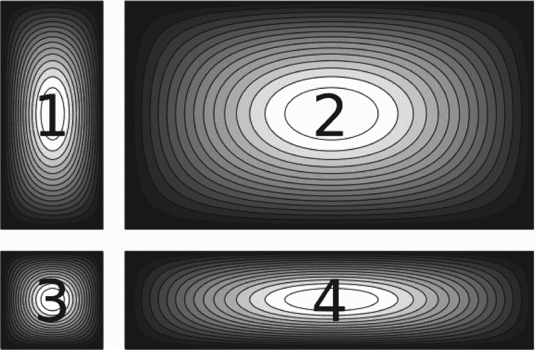

*图 4-25：使用* grid() *函数的布局*

使用 `grid()` 时，维度的总和可以小于 1，这将简单地留下空白空间，但总和不应大于 1。

#### ***使用 @layout 创建复杂布局***

我们可以创建任意复杂度的布局。下一级需要使用 `@layout` 宏。我们尚未看到宏，它将在“宏”一章中介绍，参见第 170 页。现在，我将展示如何使用这个特定的宏来创建图表布局。在我们对语言有了更多了解后，会更好地理解其背后的工作原理。

`@layout` 宏创建的布局遵循我们提供给宏的矩阵形状。我们使用空格来水平排列子图，使用换行符或分号来垂直排列子图，就像构建实际的矩阵一样。然而，这些 `@layout` 矩阵不需要具有匹配的维度。如以下示例所示，行可以包含不同数量的元素。我使用 `a` 来表示一个子图，但我们可以使用任何标识符。它们没有特定含义，因为布局引擎只会按照我们在 `plot()` 函数中提供的顺序使用这些图。以下是宏的一个简单使用示例：

```
plot(s[1], s[2], s[3], s[4], s[5], s[6];
     layout =  @layout [ a a a
                          a a
                           a   ] )
```

图 4-26 展示了最终的布局。观察子图的排列如何遵循宏中使用的 `a` 占位符的排列。

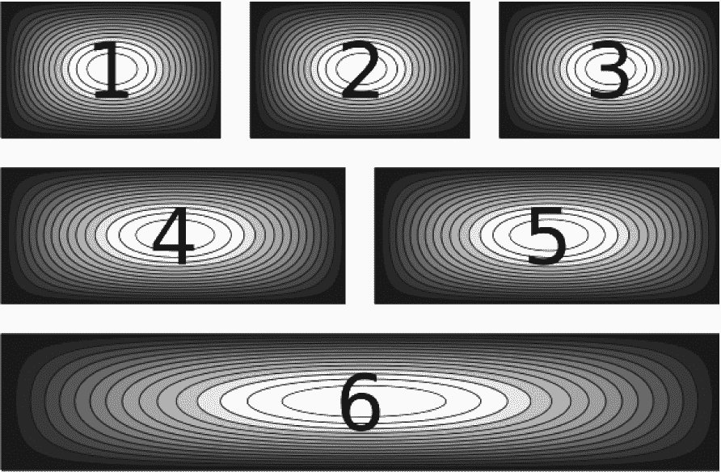

*图 4-26：使用 @layout 宏*

以这种形式使用 `@layout` 宏会使子图分配的空间相等。要更改它们的高度或宽度，可以使用以下示例中的符号：

```
plot(s[1], s[2], s[3], s[4], s[5], s[6];
     layout =  @layout [ a a a
                          a{0.68w} a
                            a{0.5h} ])
```

花括号内的规格是宽度或高度，占整个图表的比例。这个调用创建了图 4-27 中的布局。

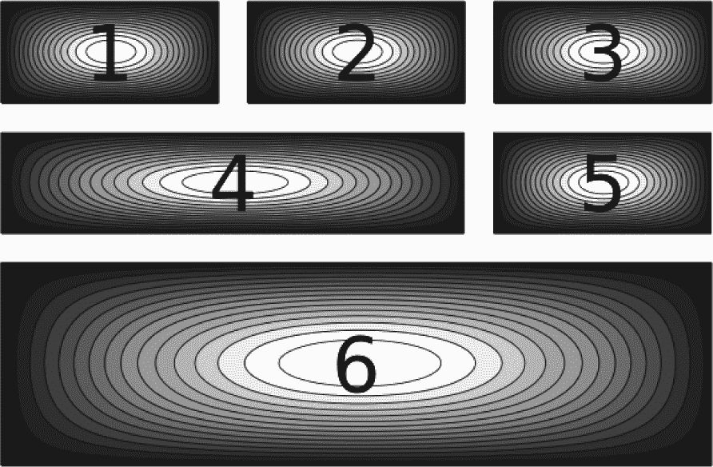

*图 4-27：使用 @layout 宏与维度规格*

我们可以通过在 `@layout` 参数中使用 `grid()` 调用来实现更大的布局灵活性，如以下示例所示：

```
plot(s[1], s[2], s[3], s[4], s[5], s[6];
     layout=@layout [ grid(2, 2) a{0.3w}
                            b{0.2h} ])
```

传递给 `@layout` 宏的子图数量必须等于传递给 `plots()` 的位置参数中的数量。这里的 `grid(2, 2)` 调用表示四个子图，剩余的两个由 `a` 和 `b` 表示。图 4-28 展示了结果。

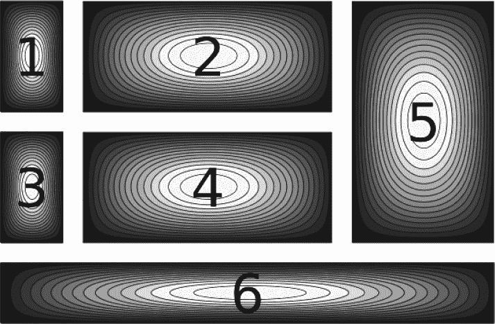

*图 4-28：在布局中使用子网格*

在第 106 页中，“Detail Insets”解释了如何创建放大主图部分的插图。我们可以使用那里使用的`inset`和`subplot`属性来制作任何类型的插图，不仅仅是使用`lens!()`，并且可以将其与任何布局结合使用。

在前一个示例中创建布局后，我们可以通过以下调用将插图添加到该布局中：

```
plot!(x -> sin(7x); inset=bbox(0.2, 0.2, 0.3, 0.3), subplot=7,
      background_inside=RGBA(1, 1, 1, 0.3), lw=5, framestyle=:box,
      legend=false, lc=:black)
```

`inset`属性被设置为一个`bbox`。由于我们没有为其提供位置参数，`bbox`的参数将使得图表相对于整个布局进行定位，而不是相对于某个特定的子图。`subplot=7`设置将插图变成一个新的子图，这是确保该功能按预期工作的必要条件，因为布局已经包含了六个子图。`RGBA`与我们之前看到的`RGB`类似，但有一个额外的参数用于透明度。

图 4-29 展示了添加插图后的结果。

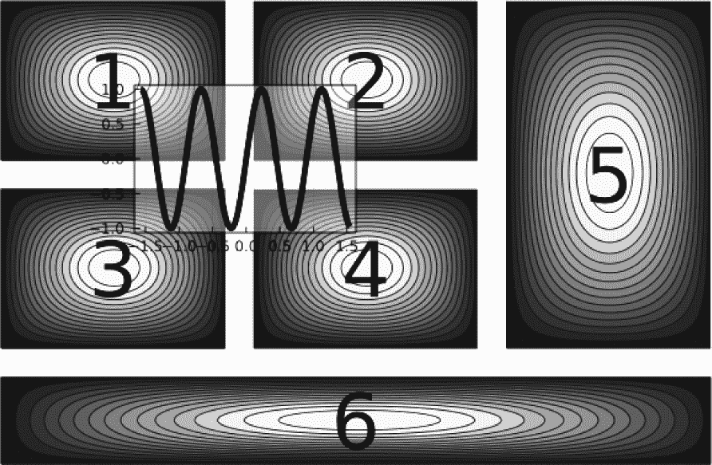

*图 4-29：向布局添加浮动插图*

### **结论**

本章涵盖了你在大多数科学图形中需要使用的`Plots`包的所有内容：主要的图形类型、镜头和注释、如何自定义外观以及如何布置图形集合形成复合图。在第七章中，我们将学习如何制作动画，并探索一些创建图表的包，而在第八章中，我们将重新审视绘图系统，学习绘图配方。

**进一步阅读**

+   `Plots`包的官方参考可以在[*https://docs.juliaplots.org/latest/*](https://docs.juliaplots.org/latest/)找到。

+   这是你可以找到关于`Plots`的视频链接，视频由其创作者提供：[*http://www.breloff.com/plots-video*](http://www.breloff.com/plots-video)。

+   要获取关于制作出版质量图表的有用指南，请访问[*https://nextjournal.com/leandromartinez98/tips-to-create-beautiful-publication-quality-plots-in-julia*](https://nextjournal.com/leandromartinez98/tips-to-create-beautiful-publication-quality-plots-in-julia)。

+   更多关于 HDF5 格式的信息可以在[*https://www.hdfgroup.org/solutions/hdf5*](https://www.hdfgroup.org/solutions/hdf5)找到。

+   关于如何在 Julia 中使用 HDF5 文件的文档可在[*https://juliaio.github.io/HDF5.jl/stable/*](https://juliaio.github.io/HDF5.jl/stable/)找到。

+   要了解更多关于预定义调色板的信息，请访问[*https://docs.juliaplots.org/latest/generated/colorschemes/*](https://docs.juliaplots.org/latest/generated/colorschemes/)。

+   `Gaston`总部位于[*https://mbaz.github.io/Gaston.jl/stable*](https://mbaz.github.io/Gaston.jl/stable)，并且包含了精心挑选的插图。

+   相关信息和 gnuplot 软件的下载可在[*http://gnuplot.info*](http://gnuplot.info)找到。

+   LaTeX 数学语法的基础知识可以在 [*https://www.cs.princeton.edu/courses/archive/spr10/cos433/Latex/latex-guide.pdf*](https://www.cs.princeton.edu/courses/archive/spr10/cos433/Latex/latex-guide.pdf) 中找到（见第七部分）。

+   关于 Julia 封装器的文档，可以通过强大的*plotly.js*交互式绘图系统获取，文档位于 `plotlyjs` 包中：[*https://plotly.com/julia/*](https://plotly.com/julia/)。
