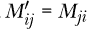

## 第六章：集合**

*我不想属于任何接受我作为成员的俱乐部。*

—归因于格劳乔·马克思


*集合*是一个作为容器的数据结构。它包含的值称为其*元素*。Julia 的集合通过它们可以包含的内容、是否可变、元素的访问方式、内容是否有序以及其他几个特征来区分。

我们已经使用过数组、字符串和其他类型的 Julia 容器。在本章中，我们将进一步了解这些集合，并接触一些新的集合类型。

### **控制循环执行**

在 Julia 中，循环和集合之间有着密切的关系。例如，`for`循环依赖于一个集合或可迭代对象，循环会逐一访问其中的元素。

我们已经知道如何使用`while`和`for`语句块来编写循环。在本节中，我们将探讨如何通过`break`和`continue`语句进一步控制循环的执行，并学习如何使用*推导式*编写简洁的循环，这是一种创建集合的简洁方法。

#### ***break 语句***

有时我们需要根据某个条件结束一个循环，并阻止它达到“正常”的终止状态。这就是`break`命令的用途，它可以终止`while`和`for`循环。

例如，以下循环会重复要求用户输入一个数字并打印其平方根：

```
while true
    println("Enter a number, or 0 to quit.")
    x = readline()
    x = parse(Float64, x)
    if x ≤ 0
     ➊ break
    end
 ➋ println("The square root is ", sqrt(x))
end
```

`while`条件是`true`，这个条件永远不会改变，因此，如果没有`break`语句 ➊，循环会一直运行下去，直到用户输入`0`（或负数）时终止。这是一个常见的模式，当我们希望循环永远执行，直到由某个条件中断。

`readline()`语句从终端读取一行输入，当用户按下 ENTER 时终止，并将结果存储到一个字符串变量中。我们需要将这个字符串解释为数字，这就是`parse()`函数为我们做的事情。`parse()`的第一个参数指定要将字符串转换成哪种数据类型。`println()`函数的多参数版本会将它的参数连接起来，并根据需要将数字转换为字符串➋。

`break`语句也可以终止`for`循环。在下面的示例中，我们遍历一个向量中的数字，并在遇到完美平方数时停止：

```
n = [12, 53, 19, 64, 16, 8]

for x in n
    if round( √x ) == √x
        println("Found a perfect square in the list: ", x)
        break
    end
end
```

当这个代码运行时，它会打印出以下内容：

```
Found a perfect square in the list: 64
```

一个数字是完美平方数，如果它的平方根是一个整数。代码通过将该数字的平方根与`round()`函数四舍五入后的相同值进行比较来测试这一点。由于`round()`函数会将数字四舍五入到最近的整数，因此，如果数字本身已经是整数，它们的值就会相同。当找到第一个完美平方数时，`break`语句终止循环，所以我们不会看到 16。

#### ***continue 语句***

`continue` 语句跳过当前循环迭代中的进一步处理，直接进入下一次迭代。该程序打印出前 100 个质数（我们将跳过输出部分）：

```
for n in 1:100
    possibly_prime = true
    x = 2
    while x ≤ √n
     ➊ if n % x == 0
            possibly_prime = false
            break
        end
        x += 1
    end
    if !possibly_prime
     ➋ continue
    else
        println(n)
    end
end
```

程序通过检查每个整数的平方根以内的整数除数来测试前 100 个整数。如果 *x* 是 *n* 的除数，那么当我们计算 *n*/*x* 时将没有余数；这就是 `n % x == 0` 检查的内容 ➊。如果找到一个除数，`n` 就不是质数，因此我们设置一个标志并 `break` 出 `while` 循环。在外部的 `for` 循环中，如果当前的 `n` 不是质数，我们希望 `continue` ➋ 到下一个 `n`，但如果是质数则打印它。

### **推导式与生成器**

我们通常可以更简洁地使用 *数组推导式* 来编写创建数组的 `for` 循环。作为一个简单的例子，假设我们需要一个 `Vector`，包含前五个完美的平方数。我们可以通过一个 `for` 循环来构建它，如下面的 REPL 会话列表所示，但首先我们需要初始化一个空的 `Vector`：

```
julia> xs = [];

julia> for x in 1:5
           push!(xs, x²)
       end

julia> xs
5-element Vector{Any}:
  1
  4
  9
 16
 25
```

我们可以通过一个数组推导式来完成相同的任务：

```
julia> xs = [x² for x in 1:5]
5-element Vector{Int64}:
  1
  4
  9
 16
 25
```

我们不需要初始化 `xs` 向量，因为推导式在一步中创建并填充它。这些示例中的结果类型不同，这是我们将在 第八章 中探讨的主题。

数组推导式通常包含两部分，分别由关键字 `for` 分隔。第一部分是一个涉及虚拟变量的表达式，在此为 `x`。第二部分，从 `for` 开始，形式与熟悉的 `for` 循环的第一行相同，并使用第一部分中的虚拟变量。第一部分成为隐式循环的主体，每次迭代时将一个新元素添加到结果数组中。

推导式创建的数组将具有与其第二部分容器相同的形状。请考虑以下例子：

```
julia> [2x for x in [1 2
                     3 4]]
2×2 Matrix{Int64}:
 2  4
 6  8
```

在这里，由于容器遍历的是一个 2×2 矩阵，因此结果的形状也是这个矩阵。

数组推导式可以包含任意数量的隐式循环。结果的形状取决于循环是由 `for` 还是逗号分隔的。以下示例说明了这两种可能性：

```
julia> [x * y for x in 1:3 for y in 1:3]
9-element Vector{Int64}:
 1
 2
 3
 2
 4
 6
 3
 6
 9

julia> [x * y for x in 1:3, y in 1:3]
3×3 Matrix{Int64}:
 1  2  3
 2  4  6
 3  6  9
```

在第一种情况下，结果是一个 `Vector`，这正是我们从两个嵌套的 `for` 循环中预期的结果。第二种情况，使用逗号分隔隐式循环，产生一个 `Matrix`。我们可以通过添加更多逗号分隔的循环子句，将其扩展到任意维度。

请考虑以下示例，确定乘法表中哪些偶数能被 7 整除：

```
julia> [x * y for x in 1:9, y in 1:9
       if x * y % 2 == 0 &&
       x * y % 7 == 0] |> unique
4-element Vector{Int64}:
 14
 28
 42
 56
```

推导式末尾的 `if` 语句过滤结果；推导式的最终结果是一个 `Vector`。这个例子依赖于操作顺序以避免不必要的括号：乘法的优先级高于（绑定得更紧密）模运算符 `%`。我们将推导式的结果传递给 `unique()` 函数，该函数会从集合中移除重复项。

*生成器表达式*的形式与数组推导相同，但没有包围的方括号。它创建的是一个迭代器，而不是一个已填充的数组。我们可以遍历或迭代这个对象，以一次使用它的一个成员，但它几乎不占用任何内存。这样它应该让你想起范围表达式及其与向量的关系。

在实际操作中，我们有时需要将生成器表达式括起来以避免歧义，就像其他表达式一样。这种情况出现在以下示例中，我们在其中创建了一个生成器版本的乘法表：

```
julia> multiplication_generator = (x * y for x in 1:9, y in 1:9)
```

我们需要括号，因为这里有一个双重`for`循环。如果没有它们，Julia 就无法将其识别为生成器表达式。

现在我们可以像以前一样提取表中能被 7 整除的偶数：

```
julia> [n for n in multiplication_generator
       if n % 2 == 0 && n % 7 == 0]
       |> unique
4-element Vector{Int64}:
 14
 28
 42
 56
```

如果表格很大，而不仅仅是 9×9，使用生成器而不是填充数组将节省大量内存。我们始终可以使用`collect()`从迭代器中生成已实现的表格。

### **更多连接字符串的方法**

在 Julia 中，字符串是一个集合。它的元素是字符。我们第一次在“字符串和字符”部分遇到`String`类型，见于第 44 页，在这里我们将探索你可以对字符串执行的最重要操作。

我们已经看到如何使用`*`运算符或使用`join()`函数将多个字符串连接成一个字符串。我们还可以使用`string()`函数，它将任何数量的字面量字符串和字符串值变量连接成一个更大的`String`：

```
julia> comma_space = ", ";

julia> string("Hello", comma_space, "François")
"Hello, François"
```

由于`comma_space`是一个字符串，`string()`函数简单地将它与我们提供的其他字符串连接起来。如果它是其他类型的对象，例如数字，只要该对象有字符串表示，调用仍然有效。在这种情况下，函数首先将其转换为字符串，然后进行连接。

`repeat()`函数将一个字符串与自身连接指定的次数：

```
julia> repeat("ABC ", 5)
"ABC ABC ABC ABC ABC "
```

在这个例子中，新字符串是由“ABC”重复五次组成的，正如第二个参数所指定的那样。

我们还可以使用这个函数创建数组，正如我们在“repeat()函数”中看到的那样，见于第 139 页。

### **非标准字符串字面量**

*字符串字面量*是像`"abc"`这样的表达式，直接表示一个`String`。Julia 支持多种*非标准*字符串字面量，通过在字符串字面量前加上一个关键字，前缀指定表达式表示的是什么类型的特殊用途字符串。这些对象的意义超出了它们作为字符串的存在。

我们已经遇到过其中一个对象的例子。在《LaTeX 标题和标签定位》一书的 第 103 页 中，我们描述了如何使用 LaTeX 字符串作为图表标签。这些字符串以大写字母 `L` 为前缀，如 `L"e^{i`π`} + 1 = 0"`。当绘图程序看到普通字符串作为标签时，字符串会原样打印在图表上，但如果标签是 LaTeX 字符串，程序会知道打印其经过 LaTeX 处理后的形式。LaTeX 字符串在 `LaTeXStrings` 包中定义。一些非标准字符串文字在它们自己的包中定义，使用前需要导入，而其他一些则是内建的。

在幕后，非标准字符串文字是作为宏实现的（参见《宏》一节，在 第 170 页）。宏的名称是字符串文字的标签，后面跟着 `_str`。换句话说，实现 LaTeX 字符串的宏名称是 `@L_str`。要在 REPL 中查看非标准字符串文字的文档，我们可以输入 `?@L_str` 或 `?L""`（对于 LaTeX 字符串）。

#### ***原始字符串***

一个有用的内建非标准字符串文字是 *原始字符串*，通过在前面加上 `raw` 来表示。大多数非标准字符串的关键字是单个字母，但 `raw` 是一个例外。原始字符串用于按字面意思表示某些字符序列，在标准字符串中它们会被解释为控制字符或其他内容。例如，通常情况下，`\t` 序列在打印字符串时会被转换为 TAB 字符，但在原始字符串中，它会按字面意思被解释：

```
julia> print(raw"a\tb")
a\tb
julia> print("a\tb")
a       b
```

在第二个打印命令中，未转义的 TAB 字符被呈现为一个水平空格。

因此，在原始字符串中，反斜杠会按字面意思解释，唯一的例外是——它们仍然需要用来转义双引号：

```
julia> print("I said, \"No\".")
I said, "No".
julia> print(raw"I said, \"No\".")
I said, "No".
```

如果在原始字符串中出现反斜杠，除非它紧跟在双引号之前，否则它会被按字面意思解释。

#### ***语义版本字符串***

软件版本发布的版本通过类似 v1.7.1\. 的标签来标识。不同的项目使用不同的版本标签系统，其中一种系统被称为 *语义版本控制*。字符串中的字段表示主版本和次版本号，另外还可以包含其他版本信息。有关详细规范的链接，请参见《进一步阅读》一节，在 第 151 页。

在语义版本字符串前加上 `v`。我们可以比较版本并提取字段的数值，这些数值以十六进制数形式返回，前面带有 `0x`：

```
julia> v"1.6.1" < v"1.6.2"
true

julia> version = v"1.7.2"
v"1.7.2"

julia> version.major, version.minor, version.patch
(0x00000001, 0x00000007, 0x00000002)
```

Julia 项目本身使用这个方案的扩展版来编号语言和包的发布版本，因此语义版本字符串已内建于语言中。

#### ***字节数组字面量***

在字符串前添加`b`会创建一个*字节数组字面量*：一系列无符号的 8 位整数，表示字符串中字符的 UTF-8 编码顺序。如在第 44 页的“字符串与字符”中所述，字符可以占用 1 到 4 个字节。下面是将一个三字符字符串转换为字节数组的示例：

```
julia> b"a2∑"
4-element Base.CodeUnits{UInt8, String}:
 0x61
 0x32
 0xce
 0xa3
```

字符`a`和`2`各自由一个字节表示，但字符`∑`占用了两个字节。

我们可以在 REPL 中输入大写的西格玛字符，以了解更多关于它的信息：

```
julia> '∑'
'∑': Unicode U+03A3 (category Lu: Letter, uppercase)
```

响应告诉我们，`03A3`是字符的 Unicode*代码点*。代码点是一个单一的、可能较大的十六进制整数，唯一标识该 Unicode 字符。

**注意**

*Unicode 字符在打印时可能不对应一个单独的字符。一些字符与一个或多个邻近字符结合，形成重音符号或连字。*

我们可以直接在字符串中使用代码点，使用转义码`\u`，它们会被转换为所代表的字符：

```
julia> "a2\u03a3"
"a2∑"
```

为了避免转换，我们可以转义反斜杠或使用原始字符串。

### **字符串查找与替换**

`replace()`函数用另一个子字符串替换指定的子字符串。它可以接受任意数量的替换，按从左到右的顺序应用，但有一个前提条件，即每个字符只能经历一次替换。以下示例展示了语法以及前提条件的影响：

```
julia> s = "abc"
"abc"

julia> replace(s, "b" => "XX", "c" => "Z")
"aXXZ"

julia> replace(s, "c" => "Z", "Z" => "WWW")
"abZ"
```

该条款意味着最后一个例子中的第一个替换中的`"Z"`不会被替换成`"WWW"`。

**注意**

*字符串中的多重替换* replace() *函数首次出现在 Julia v1.7 中。如果你使用的是早期版本，可以按照此处描述的使用* replace() *函数，但只能进行一次替换。*

`occursin()`函数测试子字符串是否存在于字符串中：

```
julia> occursin("abc", "abcdef")
true

julia> occursin("abc", "abCdef")
false
```

它测试第二个参数中是否存在第一个参数给定的字符串，并且是区分大小写的。

`occursin()`函数延续了其他函数的传统，如`iseven()`，用于测试条件并返回`true`或`false`（请参见第 163 页的“filter() 操作符”）。

`findfirst()`和`findlast()`函数分别查找一个字符或字符串在另一个字符串中的位置。如果我们要求某个字符的位置，这些函数会返回其首次或最后一次出现的索引：

```
julia> findfirst('a', "abcabc")
1

julia> findlast('a', "abcabc")
4
```

如果我们在第一个参数中提供的是一个字符串，而不是一个字符，函数将返回一个范围，给出字符串在第二个字符串中的位置：

```
julia> findfirst("abc", "abcabc")
1:3

julia> findlast("abc", "abcabc")
4:6
```

如果我们要查找的字符或字符串在第二个字符串中不存在，这些函数会返回`nothing`。

`findnext()`函数行为类似，但它接受一个第三个参数，用于指定搜索开始的位置：

```
   q = "To be or not to be, that is the question"
   i = 0
   locations = []

➊ while i != nothing
       i = findnext('e', q, i + 1)
       push!(locations, i)
   end

print("""The letter "e" was found at locations """,
             join(locations[1:end-1], ", ", " and "), ".")
```

这展示了`join()`的第三个可选位置参数，它会替代第二个参数给定的分隔符，插入到最后两个元素之间。

当我们运行这个程序时，它会打印：

```
The letter "e" was found at locations 5, 18, 31 and 35.
```

如果 `findnext()` 或其他字符串搜索函数没有找到它们要找的内容，它们会返回“什么也没有”，或者更具体地说，返回一个叫做 `nothing` 的特殊值。我们在 `while` 条件中 ➊ 利用了这一点，当找不到更多的 `e` 字符时结束循环。

本节中描述的所有搜索和替换函数也可以与正则表达式一起使用。Julia 使用 Perl 兼容的正则表达式；有关语法的链接，请参阅《进一步阅读》部分，见 第 151 页。

要定义正则表达式，我们使用带有 `r` 关键字的非标准字符串字面量。例如，`r"A.*B"` 是一个正则表达式，匹配 `A` 后跟任意数量的字符，最后是 `B`。

这里是一个简单的正则表达式示例，用来删除特定字符对之间的所有内容：

```
julia> s = "abc<ABC>def"
"abc<ABC>def"

julia> replace(s, r"<.*>" => "")
"abcdef"
```

正则表达式中的括号片段成为我们可以在替换文本中使用转义整数引用的目标。这些整数按照括号片段的顺序排列，所以第一个片段用 `\1` 引用，以此类推。在普通字符串中，这些转义的整数会被解释为控制字符；因此，Julia 为此目的提供了另一种非标准字符串字面量，使用 `s` 关键字：

```
julia> replace(s, r"(.*)<(.*)>(.*)" => s"\1\3, \2")
"abcdef, ABC"
```

这个替换操作将带有定界符的字符串移动到末尾，前面加上一些标点符号，而不是删除尖括号之间的字符串。

### **字符串插值**

Julia 高兴地借鉴了其他语言的好点子。Perl 不仅有强大的正则表达式，还具有方便的 *字符串插值* 语法，你也可以在 Julia 中使用。

当我们想将变量或表达式的值插入到字符串中时，我们使用字符串插值。插值语法告诉 Julia 创建这些值的字符串表示，并将它们放置在更大的字符串中。插值让我们避免了凌乱的字符串连接序列，取而代之的是更整洁的代码：

```
julia> function name_length()
           println("Hi. What's your name?")
        ➊ name = readline()
        ➋ println("Hello, $name. Your name has $(length(name)) letters.")
       end
name_length (generic function with 1 method)

julia> name_length()
Hi. What's your name?
Emily
Hello, Emily. Your name has 5 letters.
```

这个例子演示了两种类型的字符串插值，都在 `println()` 调用的参数中 ➋。在用户输入的名称被存储在变量 `name` 中 ➊ 后，我们可以通过字符串插值来访问它的值。要插入变量的值，只需在美元符号（`$`）后面使用它的名称。要插入另一种类型的表达式，将其放在 `$` 后面的括号内。我们这样做是为了插入用户名称的长度 ➋。

我们可以将任何表达式插入到字符串中。如果我们想排除空格（因为它们不是字母）来计算名称的长度，我们可以使用如下方式：

```
println("Hello, $name. Your name has $(length(replace(name, " " => ""))) letters.")
```

如果你需要实际的美元符号，可以用反斜杠转义：`\$`。自然地，`raw` 字符串不会参与插值过程。

### **附加集合类型**

本节描述了其他类型的集合，它们都是日常 Julia 编程的一部分：字典、集合、结构体和具名元组。

#### ***字典***

Julia 的`Dict`类型类似于 Python 中的字典或 Bash 中的关联数组。它是一个一维集合，像向量一样，但通过*键*而不是位置进行索引。列表 5-1 展示了初始化字典的两种方式之一。

```
julia> bd = Dict("one"=>1, "two"=>2)
Dict{String, Int64} with 2 entries:
  "two" => 2
  "one" => 1
```

*列表 5-1：从键值对创建字典*

在这个初始化之后，新字典包含了两个键值对。这个字典中的每个键恰好是它所索引的数字的名称。

除了将键值对作为单独的参数提供外，我们还可以提供任何可迭代对象，当迭代时，它会生成键值对。例如，我们可以通过`Dict(["one"=>1; "two"=>2])`从列表 5-1 初始化字典。

字典中的键和值可以是任何类型。在`bd`中，两个键都是字符串，且它们指向的值是整数。

索引字典的语法与索引向量相同，但索引是键而不是位置：

```
julia> bd["one"]
1

julia> bd[2]
ERROR: KeyError: key 2 not found
```

我们使用两个键值对初始化了`bd`字典；由于 2 不是其中的键，我们尝试用 2 来索引字典时会产生错误。

`keys(bd)`函数返回`bd`中键的列表；相应的`values()`函数返回值的列表。

`Dict`中的键必须是唯一的。如果我们定义一个已经存在的键，后面的定义将替换掉现有的：

```
julia> bd["one"] = 9;

julia> bd
Dict{String, Int64} with 2 entries:
  "two" => 2
  "one" => 9
```

在第一行中我们重新使用了`"one"`键。显示字典时，可以看到新值已替换了之前的值。

初始化字典的另一种方式是向`Dict()`传递一个单一的参数。该参数可以是任何生成元组的可迭代对象；每个元组生成一个键值对：

```
julia> Dict([("one", 1) ("two", 2)])
Dict{String, Int64} with 2 entries:
  "two" => 2
  "one" => 1
```

注意，字典按看似随机的顺序打印出来。这是正常现象，因为字典是*无序*的集合，不像向量。

#### ***集合***

Julia 的`Set`数据类型实现了数学集合的许多属性。Julia 中的集合是通过其中包含的元素来定义的。元素没有顺序，并且集合不能被索引。如果你添加一个已经存在的元素，集合不会改变，因为它已经包含该元素，而且每个元素只能出现一次。

让我们定义两个简单的集合，用来说明我们可以在集合上执行的一些操作：

```
julia> s1 = Set(1:5)
Set{Int64} with 5 elements:
  5
  4
  2
  3
  1

julia> s2 = Set(4:8)
Set{Int64} with 5 elements:
  5
  4
  6
  7
  8
```

`Set()`函数接受任何可迭代对象，并初始化集合。集合的成员会按任意顺序列出，因为在集合中顺序是没有意义的。

让我们来查看我们刚刚创建的两个集合的交集和并集：

```
julia> intersect(s1, s2)
Set{Int64} with 2 elements:
  5
  4

julia> union(s1, s2)
Set{Int64} with 8 elements:
  5
  4
  6
  7
  2
  8
  3
  1
```

两个示例中的结果也是集合。交集是两个集合中共有的元素，而并集是出现在任一集合中的元素。

我们可以使用`issubset()`函数来测试集合之间的子集关系，该函数有一个 Unicode 同义词，也可以作为二元操作符使用：

```
   julia> issubset(4:7, s2)
   true

   julia> 4:7 ⊆ s2
   true

➊ julia> 4:7 ⊇ s2
   false
```

要创建子集或超集 ➊ 字符，可以分别输入 \subseteq 或 \supseteq，然后按 TAB 键。函数将 `4:7` 范围自动转换为一个集合，并告诉我们 `Set(4:7)` 是 `s2` 的子集，因为前者的每个成员都是后者的成员。

我们可以使用 `setdiff()` 函数找到两个集合之间的*差集*，即一个集合中不在另一个集合中的元素：

```
julia> s1
Set{Int64} with 5 elements:
  5
  4
  2
  3
  1

julia> setdiff(s1, 3:5)
Set{Int64} with 2 elements:
  2
  1
```

结果显示我们在从 `s1` 中移除 3、4 和 5 后剩下的部分。

该函数的变异形式将第二个集合的成员从第一个集合中移除。要向集合中添加新元素，可以使用 `push!()`：

```
julia> push!(s1, 999);

julia> setdiff!(s1, 1:3)
Set{Int64} with 3 elements:
  5
  4
  999
```

在这个例子中，首先我们使用成员 999 扩展 `s1`，然后移除 `Set(1:3)` 中的元素。

#### ***结构体***

`struct` 是一组命名值的集合，这些值在一个标识符下打包在一起。例如，列表 5-2 创建了一个结构体，用来保存标识网页的两条信息。

```
julia> struct Website
           url
           title
       end

julia> google = Website("https://google.com", "google")
Website("https://google.com", "google")
```

*列表 5-2：定义一个结构体*

首先我们定义一个新的结构体，叫做 `Website`，然后创建一个名为 `google` 的变量，用于存储一个具有特定 `url` 和 `title` 值的 `Website` 实例。

常规的风格是将结构体的名称首字母大写。结构体的名称作为一个*构造函数*，用来创建具有该结构体类型的*复合对象*。因此，定义一个结构体就等于通过向语言中添加新类型来扩展 Julia。通过 `typeof(google)` 请求 Julia 获取 `google` 的类型时，将返回 `Website`。有关用户自定义类型的更多信息，请参见 第 234 页的“用户定义类型”部分。

我们可以使用*属性符号*来引用复合对象的字段，例如结构体和命名元组（下文会描述）：

```
julia> google.title
"google"

julia> google.title = "Google"
ERROR: setfield!: immutable struct of type Website cannot be changed
```

发现我们忘记了将网站标题大写后，我们尝试修正它，但 Julia 不允许修改，因为结构体默认是不可变的。

我们可以通过重新定义 `google` 来修复我们的错误，但如果我们计划经常变更 `Website` 对象，我们可以将其定义为*可变结构体*：

```
julia> mutable struct MutableWebsite
           url
           title
       end

julia> google = MutableWebsite("https://google.com", "google")
MutableWebsite("https://google.com", "google")

julia> google.title = "Google"
"Google"
```

现在我们可以随时更改 `google` 的字段值。

#### ***命名元组***

命名元组就像是 Julia 的普通 `Tuple`，只是我们可以给它的值命名：

```
julia> nt = (a=1, b=2, c=3);

julia> nt.c
3
```

现在我们有了一个新的命名元组，叫做 `nt`，它有三个字段，分别叫做 `a`、`b` 和 `c`。如本例所示，我们使用属性符号从命名元组中提取值，就像使用结构体一样。

命名元组是不可变的，就像（不可变的）结构体和普通元组一样：

```
julia> nt.a = 17
ERROR: setfield!: immutable struct of type NamedTuple cannot be changed
```

尝试给不可变数据类型的字段赋值是不允许的。

元组和命名元组与函数参数列表密切相关，正如我们将在“函数及其参数”部分（第 154 页）中探讨的那样。

### **使用函数初始化数组**

Julia 提供了一些函数来初始化数组。使用这些函数通常比我们之前一直在使用的字面量数组定义更方便简洁。

#### ***repeat() 函数***

`repeat()`函数沿着你提供的参数所对应的每个维度重复一个数组指定的次数：

```
julia> repeat(['a' 'b' '|'], 4, 3)
4×9 Matrix{Char}:
 'a'  'b'  '|'  'a'  'b'  '|'  'a'  'b'  '|'
 'a'  'b'  '|'  'a'  'b'  '|'  'a'  'b'  '|'
 'a'  'b'  '|'  'a'  'b'  '|'  'a'  'b'  '|'
 'a'  'b'  '|'  'a'  'b'  '|'  'a'  'b'  '|'
```

在这个例子中，单行数组`['a' 'b' '|']`的元素在第一（列）方向上复制了四次，在第二（行）方向上复制了三次。

我们已经在《更多字符串连接方法》一节中遇到过`repeat()`，它是一个复制字符串的函数，出现在第 128 页。

#### ***fill()函数***

`fill()`函数接受其第一个参数提供的值，并创建一个由后续参数指定形状的数组，用该值填充它。列表 5-3 展示了它是如何工作的。

```
julia> XY = fill(['X' 'Y'], 3, 4)
3×4 Matrix{Matrix{Char}}:
 ['X' 'Y']  ['X' 'Y']  ['X' 'Y']  ['X' 'Y']
 ['X' 'Y']  ['X' 'Y']  ['X' 'Y']  ['X' 'Y']
 ['X' 'Y']  ['X' 'Y']  ['X' 'Y']  ['X' 'Y']
```

*列表 5-3：填充数组*

这里，值`['X' 'Y']`用于填充一个 3×4 的数组。与`repeat()`不同，`fill()`可以接受作为元组的维度以及单独的参数，因此我们可以将上述写作`fill(['X' 'Y'], (3, 4))`。

`repeat()`和`fill()`之间最重要的区别是，前者将第一个参数中提供的数组元素连接成所请求的形状，而后者则连接整个数组本身。这可以通过刚才展示的两个示例的结果看到。

#### ***fill()和 repeat()函数的可变性***

让我们尝试修改在列表 5-3 中定义的矩阵`XY`的一个元素。我们会尝试把右上角的`'X'`改成`'O'`：

```
julia> XY[1, 4][1] = 'O';

julia> XY
3×4 Matrix{Matrix{Char}}:
 ['O' 'Y']  ['O' 'Y']  ['O' 'Y']  ['O' 'Y']
 ['O' 'Y']  ['O' 'Y']  ['O' 'Y']  ['O' 'Y']
 ['O' 'Y']  ['O' 'Y']  ['O' 'Y']  ['O' 'Y']
```

结果对许多首次遇到它的人来说是令人惊讶的。在改变`XY`的一个元素时，我们改变了所有元素。这是因为`fill()`并不会将它的第一个参数*复制*到结果中的多个位置。`XY`的每个元素都是相同的一行矩阵；这里的输出显示了变异这个矩阵后的结果。

如果我们不是变异元素，而是*替换*它，事情就会有所不同：

```
julia> XY = fill(['X' 'Y'], 3, 4);

julia> XY[1, 4] = ['O' 'Y'];

julia> XY
3×4 Matrix{Matrix{Char}}:
 ['X' 'Y']  ['X' 'Y']  ['X' 'Y']  ['O' 'Y']
 ['X' 'Y']  ['X' 'Y']  ['X' 'Y']  ['X' 'Y']
 ['X' 'Y']  ['X' 'Y']  ['X' 'Y']  ['X' 'Y']
```

现在`XY`包含了两个不同的矩阵，其中一个出现了 11 次。

如果我们在额外的一对方括号内放入第一个参数，使用`repeat()`时会观察到完全相同的行为：

```
julia> XY = repeat([['X' 'Y']], 3, 4);
```

这样，在`repeat()`提取第一个参数的内容并将它们连接起来后，我们仍然得到了一个数组的数组。

为了得到一个*不同*的数组，而不是`fill()`构造的指向单一数组的引用数组，我们可以使用列表推导式：

```
julia> xy = [['X' 'Y'] for i in 1:3, j in 1:4]
3×4 Matrix{Matrix{Char}}:
 ['X' 'Y']  ['X' 'Y']  ['X' 'Y']  ['X' 'Y']
 ['X' 'Y']  ['X' 'Y']  ['X' 'Y']  ['X' 'Y']
 ['X' 'Y']  ['X' 'Y']  ['X' 'Y']  ['X' 'Y']

julia> xy[1, 4][1] = 'O';

julia> xy
3×4 Matrix{Matrix{Char}}:
 ['X' 'Y']  ['X' 'Y']  ['X' 'Y']  ['O' 'Y']
 ['X' 'Y']  ['X' 'Y']  ['X' 'Y']  ['X' 'Y']
 ['X' 'Y']  ['X' 'Y']  ['X' 'Y']  ['X' 'Y']
```

现在修改其中一个数组不会影响`xy`的其他元素，因为每个元素都是独立的数组。

#### ***zeros()和 ones()函数***

`zeros()`和`ones()`函数是`fill()`的特例，它们的第一个参数分别是 0.0 或 1.0。像`fill()`一样，它们接受元组或单独的数字作为维度：

```
julia> zeros(4, 5)
4×5 Matrix{Float64}:
 0.0  0.0  0.0  0.0  0.0
 0.0  0.0  0.0  0.0  0.0
 0.0  0.0  0.0  0.0  0.0
 0.0  0.0  0.0  0.0  0.0
```

`zeros()`函数创建一个 4×5 的矩阵，并用 0.0 填充它。

当我们需要初始化一个将通过直接索引填充的浮动点数数组时，使用`zeros()`或`ones()`是常见的做法。这种方法比使用`push!()`逐步增大数组更快，因为编译器知道数组的初始大小，因此不需要重新分配内存。然而，如果你事先不知道数组的大小，并且不想为数组未使用的内存分配空间，`push!()`可能是更好的选择。

#### ***reshape() 函数***

你可以使用`reshape()`将数组转换为新形状：

```
julia> a1 = collect(1:6);

julia> a2  = reshape(a1, (3, 2))
3×2 Matrix{Int64}:
 1  4
 2  5
 3  6

julia> reshape(a1, 2, 2)
ERROR: DimensionMismatch("new dimensions (2, 2) must
       be consistent with array size 6")
```

前两个示例展示了如何使用`reshape()`：将数组作为第一个参数传入，并将其新的维度以元组形式或作为一系列单独的参数传入。最后一个示例会产生错误，因为`reshape()`不会改变元素的总数。

`reshape()`函数不会创建一个新的数组，而是返回原始数组并将其重新塑形。你可以看到这种影响，当你修改数组的任一形态时：

```
julia> a1[5] = 0;

julia> a2
3×2 Matrix{Int64}:
 1  4
 2  0
 3  6
```

修改`a1`的第五个元素也会修改`a2`的第五个元素，其中元素始终按列主序排列。

`reshape()`的行为应让你联想到《标量索引》一节中第 38 页的相关内容：数组在计算机的一维内存中是连续存储的，这反映在它们的标量索引中。我们在程序中使用的数组的多维形式是一种抽象，如果没有这些抽象，算法在代码中表达起来将更加繁琐。

### **在数值算法中常用的数组操作**

数组是科学和数值计算中最重要的数据类型之一，仅次于数字。我们的算法通常表现为对向量、矩阵和更高维数组的一系列变换和操作。Julia 强大的数组处理能力帮助我们通过对整个数组的高层操作来表达这些计算，而不是通过对其元素的冗长循环。当我们能使用这种编程风格时，它在概念上更清晰，也更不容易出错。本节概述了在科学代码中反复出现的几种数组操作。

#### ***常规拼接***

我们已经讨论过分号作为沿第一个维度进行拼接的运算符，正如这个示例所示：

```
julia> m = [[1 2]; [3 4]]
2×2 Matrix{Int64}:
 1  2
 3  4
```

作为替代方法，我们可以将单个分号替换为换行符，使输入的格式类似于 Julia 在 REPL 中打印矩阵的方式。

**注意**

*本节中描述的重复分号的用法是在 Julia v1.7 引入的。在早期版本中，重复的分号被视为单个分号。*

一系列的*n*个分号会沿着第*n*个维度进行拼接，并根据需要添加新维度，因此两个分号会沿第二个维度拼接，这也是空格拼接的方式：

```
julia> m = [[1 2];; [3 4]]
1×4 Matrix{Int64}:
 1  2  3  4

julia> m = [[1 2] [3 4]]
1×4 Matrix{Int64}:
 1  2  3  4
```

这两个例子执行相同的操作：`[1 2]` 与 `[3 4]` 在第二维（即列）上连接，增加了列数。

使用三个分号可以创建一个新的第三维度，并沿其连接：

```
julia> m = [[1 2];;; [3 4]]
1×2×2 Array{Int64, 3}:
[:, :, 1] =
 1  2

[:, :, 2] =
 3  4
```

在这个例子中，`[3 4]` 数组被放置在 `[1 2]` 数组的“上面”，这种操作有时称为创建一个新的 *平面*。

#### ***逻辑索引***

Julia 可以通过其 `BitArray` 数据类型以空间高效的方式存储布尔值数组。在 `BitArray` 中，或者其子类型 `BitVector` 和 `BitMatrix` 中，`true` 和 `false` 分别由 1 和 0 表示。这些逻辑数组用于索引操作，它们充当过滤器，选择与 1 对应位置的元素，并排除与 0 对应位置的元素。在用于索引时，被索引的数组和 `BitArray` 必须具有相同的元素数量。

我们创建一个 `BitArray`，通过逻辑条件将其广播到一个数组中。例如，下面的代码创建了一个 `BitArray`，选择 `1:9` 中能被 3 整除的元素：

```
julia> s3 = (1:9) .% 3 .== 0
9-element BitVector:
 0
 0
 1
 0
 0
 1
 0
 0
 1
```

为了返回结果，Julia 将范围表达式实例化为一个数组。每个当除以 3 后余数为零的位置用 `1` 表示，其他位置用 `0` 表示。

我们将 `BitArray` 分配给一个变量，这样可以在其他表达式中使用它。我们可以直接在 `1:9` 范围上使用它：

```
julia> (1:9)[s3]
3-element Vector{Int64}:
 3
 6
 9
```

`s3` 中的 1 选择了 `1:9` 中能被 3 整除的元素。

我们还可以用它从任何包含九个元素的集合中选择每第三个元素：

```
julia> ('a':'i')[s3]
3-element Vector{Char}:
 'c': ASCII/Unicode U+0063 (category Ll: Letter, lowercase)
 'f': ASCII/Unicode U+0066 (category Ll: Letter, lowercase)
 'i': ASCII/Unicode U+0069 (category Ll: Letter, lowercase)
```

虽然我们正在索引的集合和 `BitArray` 必须具有相同数量的元素，但如果 `BitArray` 是 `BitVector` 类型，集合可以具有任意形状；否则，数组和 `BitArray` 必须具有相同的形状。

这是一个使用 `BitArray` 索引的例子，也叫做逻辑索引，它是一种简洁的方式，打印出 [1, 100] 范围内所有能被 17 整除的整数：

```
julia> (1:100)[(1:100) .% 17 .== 0]
5-element Vector{Int64}:
 17
 34
 51
 68
 85
```

这里唯一的区别是我们在一步操作中创建比特索引并在索引表达式中使用它，而不是将其存储在变量中以便后续使用。

#### ***伴随矩阵和转置矩阵***

矩阵的转置是通过将矩阵沿其对角线翻转形成的矩阵，因此 ，其中 *M^'* 是 *M* 的转置。矩阵的伴随矩阵是通过取其转置并将每个元素替换为其共轭复数得到的（这一术语与线性算子的伴随概念一致，如果矩阵被视为通过常规矩阵乘法应用于向量的线性变换）。

要将包含实数的矩阵 `MR` 沿其对角线翻转，我们可以使用三种表示法：`MR'`，`adjoint(MR)`，或 `permutedims(MR)`。Listing 5-4 显示它们都会给出相同的结果。

```
julia> MR = [[1 2]; [3 4]]
2×2 Matrix{Int64}:
 1  2
 3  4

julia> MR'
2×2 adjoint(::Matrix{Int64}) with eltype Int64:
 1  3
 2  4

julia> MR' == adjoint(MR) == permutedims(MR)
true
```

*Listing 5-4: 矩阵伴随表示法*

由于 `MR` 的元素是其自身的共轭复数，因此它的伴随矩阵就是其转置矩阵。

然而，如果矩阵的元素几乎是其他任何类型，`adjoint()`和`permutedims()`通常会给出不同的结果；`'`运算符是`adjoint()`的同义词。`permutedims()`函数仅在对角线周围翻转矩阵，不做其他处理，正如这里所示，而`adjoint()`则做同样的翻转，称为*转置*，但还会对每个元素取复共轭。这个操作也被称为*厄米共轭*。考虑这个例子：

```
julia> M = [[1+im 2+2im]; [3+3im 4+4im]]
2×2 Matrix{Complex{Int64}}:
 1+1im  2+2im
 3+3im  4+4im

julia> M'
2×2 adjoint(::Matrix{Complex{Int64}}) with eltype Complex{Int64}:
 1-1im  3-3im
 2-2im  4-4im
```

矩阵像之前一样被翻转，但现在每个元素都被其复共轭所替代。请注意，我们不能对非数值矩阵使用`adjoint()`函数，因为在这些矩阵中，元素的复共轭没有意义。

除了`adjoint()`和`permutedims()`，我们还有`transpose()`函数：

```
julia> Mt = transpose(M)
2×2 transpose(::Matrix{Complex{Int64}}) with eltype Complex{Int64}:
 1+1im  3+3im
 2+2im  4+4im
```

结果看起来像是对`M`进行了简单的转置，没有进行复共轭处理，但这正是`permutedims()`应该做的。那么，为什么我们有两个看起来做同样事情的函数呢？

`adjoint()`和`transpose()`函数一方面，`permutedims()`另一方面，表现得非常不同。前两个函数是递归的：如果`M`的元素本身是矩阵，`adjoint()`和`transpose()`会先对`M`进行操作，然后对`M`的元素进行操作，依此类推，一直处理下去。相比之下，`permutedims()`只是翻转`M`并停止。

第二个区别在于，像`reshape()`一样，`adjoint()`和`transpose()`返回的是相同数组的不同形式，因此对结果进行修改会修改原始数组，这与`permutedims()`不同，后者返回一个新数组。

通常来说，要翻转数值表格，我们使用`permutedims()`函数。其他两个函数则用于更专业的线性代数应用。

`conj()`函数，它对一个数字进行完全的共轭，可以通过使用点操作符广播到数组的每个元素。然而，和大多数其他数学函数不同，它在数组上逐元素操作，而不会进行广播：

```
julia> conj(M)
2×2 Matrix{Complex{Int64}}:
 1-1im  2-2im
 3-3im  4-4im
```

在这里，我们已经对每个元素进行了复共轭操作，以转换矩阵。

#### ***矩阵乘法***

乘法运算符（`*`）在给定一对矩阵或一个矩阵和一个向量时执行矩阵乘法。举个例子，我们将创建一个旋转矩阵并进行矩阵乘法，以旋转一个向量：

```
julia> a = π/2
1.5707963267948966

julia> RM = [[cos(a) -sin(a)]; [sin(a) cos(a)]];

julia> RM * [1, 0]
2-element Vector{Float64}:
 6.123233995736766e-17
 1.0
```

精确结果应该是`[0, 1]`：单位向量指向“右侧”，当其逆时针旋转π/2 弧度时的旋转结果。我们得到的答案是浮点数运算中的舍入误差。

对于矩阵、线性方程组及相关领域的深入工作，你应该导入`LinearAlgebra`包，我们将在《线性代数包》一节中访问它，见第 399 页。这个包有一个计算矩阵*逆*的函数，但我们也可以通过直观的符号在不导入包的情况下计算矩阵逆：

```
julia> MR^-1
2×2 Matrix{Float64}:
 -2.0   1.0
  1.5  -0.5

julia> MR^-1 * MR
2×2 Matrix{Float64}:
 1.0          0.0
 2.22045e-16  1.0
```

在这个例子中，我们使用了在列表 5-4 中定义的矩阵 `MR`。将一个矩阵与其逆矩阵相乘（矩阵乘法）应该得到单位矩阵（对角线为 1，其它位置为 0），这是我们通过浮点数舍入误差所得到的结果。

### **枚举和合并**

Julia 提供了多个函数，常见于现代高级编程语言，用于枚举和合并数组。前者指的是将集合的索引与元素关联，而后者则指的是将两个集合按元素逐一连接。本节中的所有函数都返回迭代器，这些迭代器可以是元组集合的迭代器，也可以是键值对集合的迭代器。

#### ***enumerate() 函数***

`enumerate()` 函数接受一个集合，并返回一个迭代器，该迭代器生成一个元组集合，每个元组包含迭代的编号作为第一个元素，以及从集合中获取的成员作为第二个元素。列表 5-5 显示了元组集合与原始集合的形状相同。

```
julia> collect(enumerate([10 20; 30 40]))
2×2 Matrix{Tuple{Int64, Int64}}:
 (1, 10)  (3, 20)
 (2, 30)  (4, 40)
```

*列表 5-5：使用 enumerate()*

由于 `enumerate()` 返回的是一个迭代器，我们需要使用 `collect()` 来查看它。与范围（ranges）和由生成器（参见第 125 页的“推导式与生成器”）创建的其它迭代器一样，这些迭代器几乎不占用空间，直到我们使用它们来循环遍历集合，或使用 `collect()` 函数将它们转化为实际的数组。

列表 5-5 中 `collect()` 返回的数组按照传递给 `enumerate()` 的参数排列，迭代编号（即元组的第一个元素）反映了数组遍历时的列主序。

`enumerate()` 返回的迭代编号并不保证是数组的合法索引。即使它们是合法的，也不一定能返回其所索引的元素。换句话说，如果 `enumerate(A)` 返回的某个元组是 `(i, e)`，那么 `A[i]` 可能会出错。如果没有出错，也有可能 `A[i]` 不等于 `e`。

在数字数组的情况下，比如在列表 5-5 中，元组的第一个元素 *可以* 用作数组的标量索引，而 `enumerate()` 有时也会用于这个目的。

一个不能将迭代编号用作索引的例子涉及到我们的老朋友 François：

```
julia> for letter in enumerate("François")
           println("Letter number $(letter[1]) is $(letter[2]).")
       end
Letter number 1 is F.
Letter number 2 is r.
Letter number 3 is a.
Letter number 4 is n.
Letter number 5 is ç.
Letter number 6 is o.
Letter number 7 is i.
Letter number 8 is s.
```

迭代编号告诉我们每个字符在字符串中出现的位置，但正如我们在第 44 页的“字符串与字符”一节中看到的，并非所有字符位置都是合法的索引：

```
julia> "François"[5]
'ç': Unicode U+00E7 (category Ll: Letter, lowercase)

julia> "François"[6]
ERROR: StringIndexError: invalid index [6], valid nearby indices [5]=>'ç', [7]=>'o'
```

总结一下，不要将迭代编号与索引混淆。

#### ***pairs() 函数***

`pairs()` 函数与 `enumerate()` 类似，唯一不同的是它创建的是键值对的迭代器，而不是元组的迭代器：

```
julia> collect(pairs("François"))
8-element Vector{Pair{Int64, Char}}:
 1 => 'F'
 2 => 'r'
 3 => 'a'
 4 => 'n'
 5 => 'ç'
 7 => 'o'
 8 => 'i'
 9 => 's'
```

`pairs()` 返回的索引是集合的合法索引，而不是像 `enumerate()` 那样的迭代编号。

`enumerate()`返回的迭代器中的对象是元组；`pairs()`返回的迭代器中的对象是键值对。这些键值对有自己的数据类型：`Pair`。如果`p`是一个`Pair`，我们可以通过`p.first`访问它的键，通过`p.second`访问它的值。因此，如果我们需要一个指向我们法国朋友名字的索引向量，可以通过以下方式获得：

```
julia> [p.first for p in pairs("François")]
8-element Vector{Int64}:
 1
 2
 3
 4
 5
 7
 8
 9
```

我们可以通过构造函数`Pair(9, 's')`来创建一个`Pair`，或者使用`=>`运算符，例如`9 => 's'`。

在清单 5-1 中，我们从一系列直接输入的键值对创建了一个字典。每个字面量的键值对都是一个`Pair`；这里还有另一种构造字典的方法：

```
julia> p1 = "one" => 1
"one" => 1

julia> p2 = Pair("two", 2)
"two" => 2

julia> Dict([p1, p2]) == Dict("one"=>1, "two"=>2)
true
```

我们使用`=>`运算符创建`p1`，并使用`Pair()`构造函数创建`p2`。将它们传递给`Dict()`函数，创建与清单 5-1 中相同的字典。

字典是一个无序的`Pair`集合。遍历字典会依次返回每个`Pair`，但顺序是不可预测的：

```
julia> Dict(pairs("François"))
Dict{Int64, Char} with 8 entries:
  5 => 'ç'
  4 => 'n'
  7 => 'o'
  2 => 'r'
  9 => 's'
  8 => 'i'
  3 => 'a'
  1 => 'F'
```

#### ***zip() 函数***

`zip()`函数接受任意数量的集合，并返回一个迭代器，该迭代器合并了各个集合的元素，形成一个包含元组的集合。

当传入的集合具有相同的形状时，返回的迭代器也将具有该形状：

```
julia> zip([1 2; 3 4], ['a' 'b'; 'c' 'd']) |> collect
2×2 Matrix{Tuple{Int64, Char}}:
 (1, 'a')  (2, 'b')
 (3, 'c')  (4, 'd')
```

每个集合的第一个元素被配对在一起，接着是第二个元素，依此类推。在这种`zip()`用法中，参数的形状必须匹配。

如果其中一个集合是列表，另一个集合可以具有任何形状。列表中的元素与另一个集合的元素按照列主序进行配对：

```
julia> zip([1, 2, 3, 4], ['a' 'b'; 'c' 'd']) |> collect
4-element Vector{Tuple{Int64, Char}}:
 (1, 'a')
 (2, 'c')
 (3, 'b')
 (4, 'd')
```

这里，一个一维列表与一个 2×2 矩阵进行配对；每个都包含四个元素。

使用向量时，元素的数量不必匹配；`zip()`会继续直到元素耗尽：

```
julia> zip(1:3, ['a' 'b'; 'c' 'd']) |> collect
3-element Vector{Tuple{Int64, Char}}:
 (1, 'a')
 (2, 'c')
 (3, 'b')

julia> zip(1:5, ['a' 'b'; 'c' 'd']) |> collect
4-element Vector{Tuple{Int64, Char}}:
 (1, 'a')
 (2, 'c')
 (3, 'b')
 (4, 'd')
```

在第一个示例中，三元素向量在 2×2 矩阵的元素耗尽之前已经耗尽。在第二个示例中，第二个参数在我们用完`1:5`中的所有元素之前就已耗尽。

### **结论**

Julia 是一个相对“庞大”的语言：它有大量的语法和数据类型。这些特性是有目的的，它们有助于提升 Julia 的强大功能和便利性。幸运的是，你并不需要在每个程序中都使用语言中的所有内容。在本章中，我们遇到了一些新的语法，它使得处理集合更加简洁和直观。在下一章，我们将探索一些新的概念，为 Julia 程序员提供更高的灵活性和控制力。

**进一步阅读**

+   语义版本控制的规范可以在[*https://semver.org*](https://semver.org)找到。

+   欲了解更多关于 Perl 兼容正则表达式的信息，请访问[*http://www.pcre.org*](http://www.pcre.org)。
