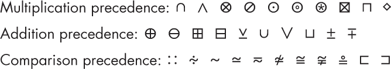
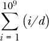

## **函数、元编程与错误**

*一开始的小错误，最终会变成一个大错误。*

— 托马斯·阿奎那


在本章中，我们将探讨三大主题，这些主题在编写程序时能提供更大的能力、控制力和灵活性。我们将更深入地研究函数这一核心主题，并进一步探讨函数参数和高阶函数。我们将看到元编程和宏如何让我们创建新的语法，并以大多数编程语言无法做到的方式扭曲 Julia 来满足我们的需求。最后，我们将看到如何控制错误系统，并利用它来操控程序的执行。

### **函数及其参数**

在第四章，我们学习了函数的定位参数和关键字参数。本节将扩展我们对函数的知识，并学习提供额外参数的其他方式。

#### ***关键字参数的简洁语法***

关键字参数通常具有反映其用途的名称，这意味着在调用函数时，使用变量作为某些关键字参数时，这些变量的名称通常与函数定义中的名称相同。如果我们在定义这些变量时就考虑到了它们最终在调用函数中的用途，这种情况发生的可能性更大。

在这种情况下，我们的函数调用看起来像这样：

```
somefunction(pos1, pos2; keyword1=keyword1, keyword2=keyword2)
```

Julia 提供了一种语法选项，可以减少这种视觉噪音和不必要的输入。我们可以用以下方式替代之前的调用：

```
somefunction(pos1, pos2; keyword1, struct.keyword2)
```

如示例所示，我们可以使用与关键字同名的变量，或者具有匹配关键字名称属性的复合对象。

#### ***展开与吸取操作符***

`...` 操作符（三个点）根据上下文可以是 *splat* 或 *slurp*。当我们向函数提供参数时，我们可以使用 *splat*，而在定义函数时，我们可以使用 *slurp*。

##### **展开操作符**

假设我们编写一个函数，接收三个参数并将它们加在一起：

```
   julia> function addthree(a, b, c)
              return a + b + c
          end;

   julia> addthree(1, 2, 3)
   6

   julia> v3 = [1, 2, 3];

   julia> addthree(v3)
➊ ERROR: MethodError: no method matching addthree(::Vector{Int64})
```

当我们提供三个参数时，正如函数定义所要求的，结果会返回和它们的和。然而，如果这三个值是向量的一部分，当我们将向量作为参数传递给函数时，会发生错误➊。这是因为函数的定义没有包含接受单个 `Vector` 参数的方法；唯一的选项是传递三个独立的值。

我们可以通过将 `v3` 中的值提取到三个独立的变量中，然后将这些变量传递给 `addthree()` 来处理这种情况，但由于这种情况经常发生，Julia 提供了一种更简单的方法，通过一个由三个点组成的操作符，称为 *splat*：

```
julia> addthree(v3...)
6
```

这里，展开操作符会解包集合中的值，并将它们作为独立参数传递给被调用的函数。

列表 6-1 展示了我们如何使用命名元组展开存储的关键字参数。

```
   julia> function addthreeWithCoefficients(a, b, c; f1=1, f2=1, f3=1)
              return f1 * a + f2 * b + f3 * c
          end;

   julia> coeffs = (f1=100, f2=10)
   (f1 = 100, f2 = 10)

➊ julia> addthreeWithCoefficients(1, 2, 3; coeffs...)
   123
```

*列表 6-1：展开一个命名元组*

在这个例子中，我们创建了一个新函数`addthreeWithCoefficients()`，它接受三个关键字参数`f1`、`f2`和`f3`，并在返回和之前先将位置参数乘以它们。然后我们创建一个命名元组`coeffs`，它有两个与两个关键字参数匹配的属性。当我们用命名元组➊应用 splat 时，`f1`和`f2`会从元组的相应属性中获得值。`f3`在元组中不存在，所以它会获得默认值 1。

尽管结构体也有属性，但我们不能像在命名元组或普通元组中那样对结构体进行 splat 操作。这一限制与我们无法像遍历命名元组或普通元组那样遍历结构体有关。

然而，字典只要关键字名称作为符号出现，依然有效：

```
julia> csd = Dict(:f1=>100, :f2=>10);

julia> addthreeWithCoefficients(1, 2, 3; csd...)
123
```

这里字典的键`:f1`和`:f2`对应于清单 6-1 中函数定义中的参数`f1`和`f2`。

##### **Slurping**

在函数定义中，三个点表示*slurp*操作符。Slurping 是一种与 splatting 相反的操作：它不是将一个集合解包成单独的参数，而是将任意数量的单独参数打包成一个可迭代对象。如果我们希望一个函数接受未知数量或可变数量的位置参数，我们可以使用 slurping：

```
julia> function addonlythreeWithNote(a, b, c, more...)
           if length(more) > 0
               println("Ignoring $(length(more)) additional arguments.")
           end
           return a + b + c
       end;

julia> addonlythreeWithNote(1, 2, 3, 99, 100, 101)
Ignoring 3 additional arguments.
6
```

`addonlythreeWithNote()`函数返回我们提供的前三个参数的和，就像`addthree()`函数一样。然而，这个版本接受任意数量的额外参数，并将它们打包成一个名为`more`的元组。

我们还可以对关键字参数进行 slurp。下面这个例子中的函数对作为位置参数传入的字符串进行两个可选测试。如果它得到一个名为`palindrome`的关键字，它会测试该字符串是否为回文；如果它得到一个名为`onlyascii`的关键字，它会使用`isascii()`函数检查字符串中是否有非 ASCII 字符：

```
julia> function examine_string(s; checks...)
           if :palindrome in keys(checks)
               if s == reverse(s)
                   println("\"$s\" is a palindrome.")
               end
           end
           if :onlyascii in keys(checks)
               if isascii(s)
                   println("\"$s\" contains only ASCII characters.")
               else
                   println("\"$s\" contains non-ASCII characters.")
               end
           end
       end;

➊ julia> examine_string("step on no pets"; kw1=17, palindrome=1, onlyascii=1)
"step on no pets" is a palindrome.
"step on no pets" contains only ASCII characters.

julia> examine_string("step on no pets"; palindrome=1)
"step on no pets" is a palindrome.
```

因为我们在定义`examine_string()`函数时使用了 slurping 来处理关键字参数，所以即使传入额外的参数➊也无关紧要；它们会被忽略。由于我们在函数定义中为关键字参数提供了默认值，因此即使某些关键字参数缺失，也没有问题。最后，由于程序只检查关键字参数是否存在，传入调用中的值是任意的。

我们也可以像之前一样调用函数并传入一个 splat 值。不同之处在于，我们传入的对象可能包含多余的关键字，但不会引发错误。下面是一个例子：

```
julia> kws = Dict(:palindrome => 1, :anyOtherKeyword => 17)
julia> examine_string("step on no pets"; kws...)
"step on no pets" is a palindrome.
```

使用“slurped”关键字参数定义函数对于用户来说非常方便。例如，`Plots` 包中的一些函数就是以这种方式工作的。我们可以使用它们不需要的关键字来调用它们；它们会使用自己能处理的关键字，忽略其他的。这种情况可能出现在 REPL 中，如果我们使用一个包含关键字列表的绘图函数创建了一个图表，然后决定使用另一个函数。我们可以按上箭头键，改变函数名，而不必查看文档来确认它是否理解我们之前使用的所有关键字。

Julia 还允许向此类函数提供关键字参数的另一种方式。我们可以以 `:kw=>value` 的形式单独列出它们，关键字以符号出现，或者我们可以展开一个字典，但字典的所有键必须是符号。

#### ***解构***

*解构* 是指将一个元组的值解包为具有单一赋值的命名变量：

```
julia> x, y = (3, 4);

julia> x
3

julia> y
4
```

这个功能在解包来自函数的元组返回值时尤其方便。如前所述，只要省略括号不会引起歧义，元组就不需要写括号，所以我们可以像 `x, y = 3, 4` 这样编写示例中的赋值。

列表 6-2 展示了另一种解构方式，它从结构体中解包关键字参数，使用以下语法：

```
julia> (; url, title) = google
Website("https://google.com", "google")

julia> url
"https://google.com"

julia> title
"google"
```

*列表 6-2：解构一个结构体*

在这个示例中，来自 列表 5-2 的 `google` 定义生效。在这种类型的解构中，赋值左侧的变量名必须与右侧复合类型的字段名匹配。

**注意**

*从 Julia v1.7 开始，结构体的关键字解构被首次引入。在早期版本中，* (; a, b) *是语法错误。*

这种解构方式的实用性可能不会立即显现。毕竟，没有这种特殊语法，我们仍然可以做到这一点：

```
julia> url, title = google.url, google.title
```

它与 列表 6-2 中的形式相比并没有更多的冗长，并且具有相同的效果。

然而，这种解构语法的一个优势在于它为定义接受从结构体中提取的关键字参数的函数提供了一种简洁的方式。在以下示例中，我们首先定义一个具有三个字段的结构体，并从该结构体创建一个对象：

```
   julia> struct Fco
              f1
              f2
              f3
          end

   julia> someco = Fco(100, 10, 1)
   Fco(100, 10, 1)

➊ julia> function addthreeWithCoefficients(a, b, c, (; f1, f2, f3))
              return f1 * a + f2 * b + f3 * c
          end;

   julia> addthreeWithCoefficients(1, 2, 3, someco)
   123
```

然后，我们创建了一个与 Listing 6-1 ➊ 中创建的 `addthreeWithCoefficients()` 函数不同的版本。这个版本没有使用关键字参数的列表，而是使用了一个第四个位置参数，具有结构体解构的语法。当我们调用该函数并将复合对象作为第四个位置参数传入时，函数会执行赋值 `(; f1, f2, f3) = someco`。参考 Listing 6-2 中的语法，我们可以看到这将把 100 赋值给 `f1`，10 赋值给 `f2`，1 赋值给 `f3`。作为参数传递的结构体可能包含函数没有解构的字段，因为解构语法并不要求解构所有字段。

#### ***运算符也是函数***

Julia 中的二元运算符，如 `*` 和 `+`，也叫做 *中缀运算符*，是两个参数的函数。每个运算符都有一个更明确的函数形式：

```
julia> +(1, 2, 3)
6

julia> *(8, 2)
16
```

在第一个示例中，`+` 函数对参数 1、2 和 3 进行操作，将它们相加并返回 6。中缀运算符的函数形式在我们有多个参数时可以更加简洁。

由于二元运算符是函数，我们可以将它们作为参数传递给高阶函数（有关示例，请参见 Listing 6-5）。

在涉及中缀运算符的表达式中，操作顺序或运算符的 *优先级规则* 决定了结果。例如，表达式 `3 + 2 * 5` 计算结果为 `13`，因为乘法先于加法执行。

在使用运算符的函数形式时，没有优先级规则，因为函数应用的语法使得操作顺序变得明确。例如，表达式 `3 + 2 * 5` 相当于 `+(3, *(2, 5))`。语法显示乘法先于加法执行。

Julia 允许我们使用某些字符来定义自己的二元运算符。如果我们创建一个函数并将其中一个字符作为其名称，我们就可以在中缀位置使用该函数。

然而，我们不能从任何字符创建中缀运算符。Julia 解释器的源代码提供了可用字符的完整列表（请参阅 第 187 页 的“进一步阅读”）。该源代码还通过将字符分组到具有相同优先级的类中，标明了每个字符的优先级。在决定中缀运算符的符号时，仅仅挑选一个看起来合适的符号是不够的。我们必须决定该运算符如何融入优先级层级，并选择合适组中的符号。

三个主要的优先级组是乘法、加法和比较。 Figure 6-1 显示了每个组的几个字符示例。



*Figure 6-1: 一些运算符字符*

比较运算符在这三种类型中优先级最低，因此表达式 `2 * 3 + 2 > 7` 相当于 `((2 * 3) + 2) > 7`，并返回 `true`。

让我们使用这些字符中的一个来创建一个新的中缀操作符，将减法的概念扩展到计算两个向量之间的欧几里得距离。我们希望它与加法和减法操作符具有相同的优先级，因此我们会选择一个看起来与减法有关的符号（在 REPL 中输入 `\boxminus` 后按 TAB 键以输入该函数的名称）。

```
julia> function ⊟(a, b)
           return sqrt((b[1] - a[1])² +
                       (b[2] - a[2])²)
       end;
```

**注意**

*要学习任何其他特殊字符的快捷键，请在进入帮助模式后粘贴它。*

在这个定义之后，我们有了一个新的函数，名称是单个字符。

由于该字符在允许用作中缀操作符的字符列表中，它应该能够正常工作：

```
julia> v1 = [0, 1];

julia> v2 = [1, 0];

julia> v1 ⊟ v2
1.4142135623730951
```

这个结果是正确的。

让我们在一个包含更高优先级运算的表达式中使用新操作符，检查它是否遵循所需的优先级规则：

```
julia> 3 .* v1 ⊟ 4 .* v2
5.0
```

乘法运算是在向量减法之前进行的，正如预期的那样（结果可能会让你想起高中三角学中的 3-4-5 直角三角形）。

我们可以通过点前缀将自己创建的中缀操作符转换为广播版本，就像内置操作符一样：

```
julia> v1a = [v1, v1, v1]
3-element Vector{Vector{Int64}}:
 [0, 1]
 [0, 1]
 [0, 1]

julia> v2a = [v1, v2, [0, 0]]
3-element Vector{Vector{Int64}}:
 [0, 1]
 [1, 0]
 [0, 0]

julia> v2a .⊟ v1a
3-element Vector{Float64}:
 0.0
 1.4142135623730951
 1.0
```

广播操作将我们的函数应用于这对向量（向量的向量）中所有相应的元素。结果是一个包含每对相应向量之间欧几里得距离的向量。

#### ***映射、过滤和归约操作符***

*高阶函数*是一个接受一个或多个函数作为其参数的函数。通常，它们要么将函数转换为其他函数，要么将它们应用于作为进一步参数提供的数据。三个操作符`map()`、`filter()`和`reduce()`是高阶函数，它们将提供的函数应用于集合。

##### **map() 操作符**

`map()`操作符对集合的每个元素应用一个函数，并返回另一个集合：

```
julia> double(x) = 2x
double (generic function with 1 method)

julia> map(double, [2 3; 4 5])
2×2 Matrix{Int64}:
 4   6
 8  10
```

这里`map()`对矩阵的每个元素单独应用`double()`，返回一个与矩阵形状相同的结果。

对于中缀操作符，`map`在所有提供的集合的相应元素之间应用它：

```
julia> map(+, [2 3], [4 5], [6 7])
1×2 Matrix{Int64}:
 12  15
```

结果的形状与`map()`操作的集合相同。结果的第一个元素是将`+`运算应用于所有集合的第一个元素；第二个元素 15 是 3 + 5 + 7。

理解`map()`的关键是理解`zip()`，因为`map()`操作符通过`zip()`将我们提供的数组的元素结合在一起：

```
julia> map(+, 20:10:40, [2 3; 4 5])
3-element Vector{Int64}:
 22
 34
 43

julia> map(+, 20:10:90, [2 3; 4 5])
4-element Vector{Int64}:
 22
 34
 43
 55
```

在这些示例中，`map()`在列主序的情况下，对向量和 2×2 矩阵的元素应用了`+`操作符。在这两种情况下，它都会在其中一个集合的元素用完时停止。

在某些情况下，`map()`返回的结果与使用点操作符的等效广播相同。之前`double()`的映射本可以这样写：

```
julia> double.([2 3; 4 5])
2×2 Matrix{Int64}:
 4   6
 8  10
```

然而，映射（mapping）和广播（broadcasting）并不相同。在中缀操作符的情况下，我们可以清楚地看到这一点：

```
julia> [20 30] .+ [2 3; 4 5]
2×2 Matrix{Int64}:
 22  33
 24  35
```

在这个例子中，左侧的数组形状与右侧的数组不同。然而，它的形状与右侧数组的*行*形状相匹配。广播操作符`.+`将数组`[20 30]`扩展或广播到另一个数组的行上。

如果我们将左侧数组改为单列而不是单行，它将会在另一个数组的列上进行广播：

```
julia> [20, 30] .+ [2 3; 4 5]
2×2 Matrix{Int64}:
 22  23
 34  35
```

通过检查本节中的例子，应该能清楚地区分映射和广播。与广播不同，`map()`并不是对整个数组进行操作，而是逐个元素地进行操作，并在背后使用`zip()`。在这个最后的例子中，使用`map()`会得到一个不同的结果：

```
julia> map(+, [20, 30], [2 3; 4 5])
2-element Vector{Int64}:
 22
 34
```

最后一个参数的`[3, 5]`列从未被使用，因为`map()`在到达该位置之前就已经没有元素可用。

##### **filter() 操作符**

`filter()`操作符接受一个由一个变量组成的函数作为第一个参数；这个函数应该返回`true`或`false`。它将这个函数应用到第二个参数的每个元素上，第二个参数应该是一个集合。它返回一个新的集合，包含那些函数返回`false`的元素被*过滤*掉或删除。

与`map()`一样，清单 6-3 展示了`filter()`如何常与匿名函数一起使用。

```
julia> filter(x -> x % 17 == 0, 1:100)
5-element Vector{Int64}:
 17
 34
 51
 68
 85
```

*清单 6-3：使用 filter() 和匿名函数*

这里我们创建了一个包含从 1 到 100 之间能被 17 整除的整数的列表。

Julia 提供了一些可以方便地与`filter()`一起使用的测试函数，比如`isodd()`、`iseven()`、`isfinite()`和`isfile()`，它们分别回答由函数名所指示的问题。

`isascii()`函数告诉你一个字符是否属于旧的 ASCII 字符集；我们可以在字符串上使用它来过滤掉非 ASCII 字符：

```
julia> filter(isascii, "François")
"Franois"
```

我们返回了一个字符串，其中“ç”被过滤掉。我们还可以反转条件，通过`filter(!isascii, "François")`过滤掉 ASCII 字符，返回`"ç"`。

##### **reduce() 操作符**

我们已经多次使用了`sum()`函数。它将数组中的所有数字相加，最终返回一个单一的数字。`reduce()`高阶函数将这一概念进行了概括。它将一个由两个变量组成的函数（作为第一个参数）应用到一个集合（作为第二个参数）上。

让我们考虑一个例子，帮助理解它的工作原理。如果没有`sum()`函数，我们可以用`reduce()`来代替。我们可以通过`sum([1, 2, 3])`计算和`1 + 2 + 3`，也可以用`reduce(+, [1, 2, 3])`来做同样的事情。

我们可以在`reduce()`中使用任何二元操作符或任何由两个变量组成的函数。例如，清单 6-4 展示了一个将第一个参数除以第二个参数的函数，并在`reduce()`中使用它。

```
julia> q(a, b) = a/b
q (generic function with 1 method)

julia> reduce(q, 1:3)
0.16666666666666666

julia> (1/2)/3
0.16666666666666666
```

*清单 6-4：reduce() 函数*

最后一行展示了`reduce()`如何在元素之间插入函数，逐步累积结果。

然而，使用除法进行归约引入了一个复杂性。虽然`+`和`*`运算符是*结合的*，但除法和减法不是。结合性意味着我们如何分组并不重要：`(1 + 2) + 3`和`1 + (2 + 3)`给出的结果是相同的。除法并不满足结合律：`1/(2/3)`等于 1.5。

**注意**

*事实上，加法和乘法在对实数（以及数学领域中的其他数系）进行运算时是结合的，但在应用于计算机中的浮点数时，它们并不真正满足结合律。尽管结合的数值效果，即(*a *+* b*) +* c* 和* a *+ (*b *+* c*) 之间的差异通常很小，但当数值精度或可重复性很重要时，最好使用接下来我们将介绍的折叠操作符。*

在函数或运算符不满足结合律的情况下，使用`reduce()`的结果是未定义的：我们不能假设它是从左到右进行的。在这种情况下，我们应该使用`foldl()`或`foldr()`，它们的工作方式与`reduce()`相似，但分别从左或从右进行结合：

```
julia> foldl(q, 1:3)
0.16666666666666666

julia> foldr(q, 1:3)
1.5
```

示例 6-5 展示了`reduce()`操作符如何接受关键字参数`dims`来沿指定维度进行归约，而`foldl()`或`foldr()`则不接受该参数。

```
julia> reduce(+, [1 2; 10 20]; dims=2)
2×1 Matrix{Int64}:
  3
 30

julia> reduce(+, [1 2; 10 20]; dims=1)
1×2 Matrix{Int64}:
 11  22
```

*示例 6-5：沿指定维度进行归约*

这里`dims=1`导致沿着行进行归约，而`dims=2`则沿着列进行归约。如果我们省略`dims`参数，结果是对所有元素进行归约，得到单一数字 33。

所有三个归约函数都接受另一个关键字参数，用作在遇到空集合时的默认值。这个参数叫做`init`：

```
julia> reduce(+, []; init=0)
0
```

在这个例子中，当遇到空集合`[]`时，`reduce()`返回指定的值 0。

如果归约函数遇到空集合，并且没有默认的中立元素，并且也没有提供`init`参数，则会返回错误。一些归约函数*可能*会在集合不为空时使用`init`的值作为归约的起始值，但这种行为在正式上没有明确规定，未来这些函数的实现可能会有所变化。因此，为了确保结果正确，当`init`存在时，它应该是所应用操作的正确*中立元素*。对于加法来说，这个元素是 0，对于乘法来说，中立元素是 1。

一些归约操作在程序中出现得非常频繁，以至于 Julia 为它们提供了专门的版本。我们已经见过`sum()`；`prod()`类似，但执行的是乘法而不是加法：

```
julia> prod(1:7)
5040

julia> factorial(7)
5040
```

这个例子中的第一个表达式将 1 到 7 之间的所有整数相乘；由于这是 7!的定义，因此第二个表达式返回相同的结果。

`maximum()`和`minimum()`归约函数找到集合中的最大或最小元素：

```
julia> maximum(sin.(1:.01:2π))
0.9999996829318346

julia> minimum(sin.(1:.01:2π))
-0.999997146387718
```

在这个例子中，我们通过对一个区间应用`sin()`函数来创建集合。

`any()` 和 `all()` 减少测试会对集合应用一个测试：

```
julia> any(iseven, 3:2:11)
false

julia> all(isodd, 3:2:11)
true
```

这两个操作回答了以下问题：集合中的 *任何* 或 *所有* 元素是否满足第一个参数中的测试？

##### **mapreduce() 函数**

强大的 `mapreduce()` 函数正如其名字所示：它结合了 `map()` 和 `reduce()`。例如，下面是两种加总前 100 个平方数的方式：

```
julia> mapreduce(x -> x², +, 1:100)
338350

julia> reduce(+, map(x -> x², 1:100))
338350
```

第二种方法准确地展示了 `mapreduce()` 调用的作用。然而，几乎总是最好使用 `mapreduce()` 而不是组合 `map()` 和 `reduce()`，因为前者使用的内存更少，速度更快；随着集合的增大，效率的提升显著。主要原因是，组合 `map()` 和 `reduce()` 会创建一个中间集合来进行归约，而 `mapreduce()` 一次性完成计算，无需分配集合。

### **do 块**

Julia 中的许多函数将函数作为第一个参数，而我们通常希望提供一个匿名函数，因为我们不需要在其他地方重用该函数。我们已经在 `plot()` 和相关绘图函数中看到了这一点，以及本章中描述的映射和归约函数。

使用 `x -> ...` 语法构造匿名函数可能繁琐或不可能。例如，我们可能希望它包含循环或 `if` 块。在这种情况下，我们可以先创建一个命名函数，再将其传递给高阶函数，但 Julia 提供了另一种方法。

`do` 块是一种仅用于创建匿名函数的函数定义块。该函数作为紧接着 `do` 块前的函数调用的第一个参数被插入。

让我们回顾一下使用 `q()` 函数的归约，请参见列表 6-4。如果从集合中取出的任何分母为 0，则归约将返回 `Inf`。但如果我们只想跳过这些分母呢？

```
julia> foldl(q, 3:-1:0)
Inf

julia> foldl(3:-1:0) do x, y
           if y == 0
               return x
           else
               return x/y
           end
       end
1.5
```

`do` 块定义了一个匿名函数，接受两个变量，返回第一个变量除以第二个变量，并处理 0 除数的特殊情况。调用 `foldl()` 看起来不对，因为它只传递了一个参数，但由 `do` 块定义的函数作为缺失的第一个参数被插入。

### **符号与元编程**

我们在几个地方使用过 `Symbol` 类型，例如在绘图函数中设置属性时，但直到现在我们才对 Julia 中的符号是什么进行彻底讨论。

要理解符号的含义，我们必须引入 Julia 中的 *元编程* 概念。元编程是指一种语言设施和相关技术的通用类别，用于编写能够检查自己、修改自己，甚至修改或添加语言语法的代码。在本节中，我们将介绍基本概念，并将其应用于下一节中描述的代码转换程序，称为 *宏*。

科学代码通常不使用太多的元编程。然而，Julia 及其许多包提供了一些不可或缺的宏，例如我们在 第 118 页 中使用的 `@layout` 宏。即使你从未自己编写过宏，了解它们如何工作仍然是值得的。在 Julia 编程中，经常使用少量的不可或缺的宏，因此，能够智能地使用它们并在出现问题时进行调试是非常重要的。

#### ***表达式对象***

Julia 具有操作 Julia 代码的能力。这是因为 Julia 代码本身可以作为一种数据类型来表示，语言可以对其进行操作，就像它对数字、字符串和数组进行操作一样。这个数据类型被称为 `Expr`。具有这种数据类型的对象被称为 `Expr` 对象或 *表达式对象*。表达式对象不同于 *表达式*，后者是返回结果的语言形式，例如 `3 * 5`。

表达式对象通常涉及 Julia 的 `Symbol`。我们可以通过在名称前加上冒号来创建一个 `Symbol`，就像我们在绘图时使用的 `:red` 这样的属性一样。我们也可以通过 `Symbol()` 函数将字符串转换为符号，例如：`Symbol("red") == :red`。

我们还可以通过在冒号后面加上括号中的表达式来构造表达式对象。再强调一下：`3 * 5` 是一个表达式，而 `:(3 * 5)` 是一个表达式对象。如果我们在 REPL 中输入 `3 * 5`，Julia 会评估该表达式并返回 `15`。如果我们输入 `:(3 * 5)` 或任何其他表达式对象，它会直接返回我们输入的内容。

为了评估 `Expr` 对象所表示的表达式（即括号内的部分），我们使用 `eval()` 函数。如果我们在 REPL 中输入 `eval(:(3 * 5))`，Julia 会返回 `15`。

**注意**

*我们可以使用* Meta.parse() *将字符串转换为表达式*——例如，*Meta.parse("3 * 5")* 返回* :(3 * 5)*。

有时将整个表达式对象放在一行上不太方便。Julia 有一个名为 `quote` 的块，用于定义此类对象：

```
julia> ex = quote
           a = 3
           a + 2
       end;

julia> typeof(ex)
Expr

julia> a
ERROR: UndefVarError: a not defined

julia> eval(ex)
5

julia> a
3
```

示例中的赋值语句将 `quote` 块的结果赋值给 `ex`。由于 `quote` 块创建了表达式对象，因此 `ex` 的类型就是这种类型，正如我们在下一行中确认的那样。评估该表达式会执行块中的操作，接下来的两行验证了这一点。

这个块的名称来源于*引号*的概念，它意味着将一个表达式转换为表达式对象，无论是通过使用 `:(...)` 来包围一个表达式，还是使用 `quote` 块来完成。

在英语中，有时我们需要区分*使用*一个单词或表达式和*谈论*这个单词或表达式。我们通过将我们讨论的术语放在引号中来实现这一点。在 Julia 中，引号有相同的作用。我们将表达式加上引号，这样就可以把它作为表达式来处理；表达式对象就是被引号包围的表达式。

大多数语言没有办法自我描述。所有能够做到这一点的语言，如 Julia、所有的 Lisp 语言和 Elixir，都有一种引用表达式的方式。

#### ***表达式对象插值***

我们可以像在字符串中插值一样，将值插入到表达式对象中。作为一个简单的例子，定义一个变量并创建两个表达式对象，一个使用该变量，另一个使用该变量的插值值：

```
julia> w = 3
3

julia> ex = :(w * 5)
:(w * 5)

julia> ey = :($w * 5)
:(3 * 5)
```

在 `ey` 的定义中，`w` 的值在表达式对象创建时就被插入到其中。表达式对象 `ex` 则包含了*变量* `w`。在更改 `w` 的值之前和之后对这些表达式对象应用 `eval()`，可以明确看出它们的后果：

```
julia> eval(ex)
15

julia> eval(ey)
15

julia> w = 4
4

julia> eval(ex)
20

julia> eval(ey)
15
```

改变 `w` 所赋的值不会改变 `ey` 的计算结果，因为该表达式并不包含 `w` 作为变量。相反，它使用的是 `w` 的*值*进行定义。

仅凭这些简单的元编程工具，我们已经能够执行一整类没有它们就无法完成的编程技巧。例如，假设我们想要创建一个函数，给定一个字符串和一个值，创建一个由字符串命名的变量并将值赋给它。列表 6-6 展示了一个执行此任务的函数。

```
mkvar(s, v) = eval(:($(Symbol(s)) = $v))
```

*列表 6-6：将表达式对象付诸实践*

`mkvar()` 函数将 `s` 字符串转换为一个 `Symbol`。然后，它创建一个表达式对象，将该符号的插值值赋给 `v` 的值。最后，它对该表达式对象应用 `eval()`。这个 `eval()` 的结果是一个新变量，它的名称与提供的字符串 `s` 相同，并且值为 `v`。

这是它的实际应用：

```
julia> mkvar("Arthur", 42);

julia> Arthur
42
```

这种功能需要元编程。特别是，我们不能做 `"Arthur" = 42`，因为我们不能将值赋给一个字符串。

前面的例子清楚地表明了符号到底是什么：它们是 Julia 在表达式对象中表示变量的方式。换句话说，符号是 Julia 自我表示变量的方式。正如我们所展示的，它们也经常被用作关键字参数和其他用途，但这种用法是与它们的基本身份无关的。符号之所以流行，正是因为它们比字符串更高效。

`mkvar()` 函数不仅仅是一个魔术技巧。它所处理的字符串可能来自，例如，从文件中读取的一个数据表的标题。在这种情况下，`mkvar()` 或类似的东西可以根据这些标题创建变量，并将它们赋值给下面的对应数据列。我们将在第十章中探索这些思想的应用。

### **宏**

*宏* 是一个接受表达式、符号和字面量作为参数并返回表达式对象的函数。该表达式对象会在运行时自动求值。

宏与我们到目前为止学习的其他函数之间有一个至关重要的区别，包括操作表达式对象的函数。函数在运行时评估，使用当前全局变量的值。

与此不同，宏的处理发生在程序运行之前的一个单独的编译阶段。宏返回的表达式对象被插入到代码中的宏位置并通过`eval()`执行。这个特性使我们可以使用宏来改变或添加语言的语法。

#### ***如何创建宏***

以下是我们在列表 6-6 中定义的`mkvar()`函数的宏版本：

```
   julia> macro mkvarmacro(s, v)
              ss = Symbol(s)
           ➊ return esc(:($ss = $v))
          end
   @mkvarmacro (macro with 1 method)

➋ julia> @mkvarmacro "color" 17
   17

   julia> color
   17
```

通常，为了避免与调用上下文中的名称发生冲突，宏会将其包含的所有变量的名称改为私有版本。如果我们希望这些变量在使用宏时仍然引用同名的全局变量，可以使用`esc()` ➊来绕过私有命名过程。这就是这种情况，因为这个宏的目的是从我们提供的字符串创建一个变量并为其赋值。

我们通过在宏的名称前加上`@`符号来调用宏 ➋。提供参数的语法比函数更灵活。我们可以像这个例子一样，用空格将参数单独列出，或者将用逗号分隔的参数列表放在括号内，就像我们对待函数那样：`@mkvarmacro("color", 17)`。如果参数是字面量数组，我们可以省略空格和括号，直接调用宏，例如：`@macroname[1 2 3]`。

一旦调用宏，带有插值的`Expr`对象`($ss = $v)`被评估，字面量`color`替代`ss`，`17`替代`v`，因此 17 被赋值给变量`color`。

作为我们如何使用宏为 Julia 添加新语法的示例，假设我们不喜欢在`while`循环中使用`end`关键字。在列表 6-7 中，我们将创建一个简单的宏，接受一个条件和一个循环体，不需要`end`。我们不能重复使用`while`关键字，所以我们将宏命名为`@during`。

```
macro during(condition, body)
    return quote
        while $condition
         ➊ $(esc(body))
        end
    end
end
```

*列表 6-7：使用宏创建新的语法*

我们使用`esc()`函数 ➊是因为我们希望循环体能够使用宏外部定义的变量。

以下是如何使用这个宏：

```
julia> i = 0
0

julia> @during i < 10 (println(i²); i+=1)
0
1
4
9
16
25
36
49
64
81

julia> i
10
```

最后两行显示宏确实引用了全局作用域中的变量`i`。

利用我们新的能力，我们可以发明一种语言中不存在的循环。让我们创建一个“until”循环，直到满足某个条件才重复执行一个代码块。这和`while`循环的工作方式相同，只是条件*不*满足时继续执行，而在条件满足时停止。基于这个思路，我们的新宏只是对列表 6-7 中的宏进行简单的修改：

```
macro until(condition, body)
    return quote
        while !$condition
            $(esc(body))
        end
    end
end
```

让我们在 REPL 中测试一下，看看它是否按预期工作：

```
julia> i = 0
0

julia> @until i == 11 (println(i³); i+=1)
0
1
8
27
64
125
216
343
512
729
1000
```

我们的`@until`循环按预期工作，将`i`递增直到`i == 11`。

编写宏本质上比编写普通函数要困难一些，部分原因是需要跟踪引用级别和自我引用。幸运的是，你永远不需要编写一个宏来执行科学计算或数值工作。然而，如果你发现自己经常重复写“模板”代码，而且这些重复的代码不能通过普通函数表达出来，那么宏的代码编写能力就能帮你节省一些工作。

#### ***有用的宏***

尽管你可能永远不会编写自己的宏，但你会经常使用它们。标准库和许多包通过各种宏提供有用的功能。本节概述了几种常用的宏供一般使用。

##### **广播宏**

我们已经描述了 Julia 的点运算符如何扩展函数和运算符，使其对整个数组进行逐元素操作（详见“广播”章节，第 51 页）。我们经常需要编写长表达式，其中所有或大多数函数都需要对它们的数组参数进行广播。广播宏使我们无需在这样的表达式中到处加点符号——例如：

```
julia> r = 1:10

julia> [r (@. exp(r) > r⁴) (exp.(r) .> r.⁴)]
10×2 BitMatrix:
  1  1  1
  2  0  0
  3  0  0
  4  0  0
  5  0  0
  6  0  0
  7  0  0
  8  0  0
  9  1  1
 10  1  1
```

这个例子构建了一个三列矩阵，展示了指数函数何时大于其参数的四次方（`exp(x)` 是 Julia 中的 *e*^(*x*) 函数）。第二列是通过广播宏构造的表达式，而第三列是具有相同意义的表达式，但使用了显式的点运算符。这两列是相同的。

要从宏的自动广播中排除某个函数，只需在其前面加上美元符号（`$`）。例如，这里是前 10 个平方的和：

```
julia> sum((1:10).²)
385
```

`sum()` 函数，它对数组中的所有数字求和，通常没有点操作符，因为它是作用于整个数组，而不是逐个元素。

如果我们使用广播宏重写该表达式，我们应该将 `sum()` 排除在自动点运算之外：

```
julia> @. $sum((1:10)²)
385
```

如果没有前缀美元符号，`sum()` 将会对每个元素单独应用；然而，这并不是我们想要的，因为当 `n` 是一个单独的数字时，`sum(n)` 就等于 `n`。

##### **@chain 宏**

`@chain` 宏是一个更方便的替代管道操作符（`|>`），用于通过一系列表达式转换数据。管道操作符有一些局限性，例如，它仅与具有单一参数的函数配合使用。`@chain` 宏是 Julia 生态系统中几种创建更灵活管道机制的方式之一。

首先，让我们通过一个简单的示例来看看内置管道的语法：

```
julia> "hello" |> uppercase |> reverse
"OLLEH"
```

我们已经通过两个函数将字符串 `"hello"` 进行了转换。

假设我们想继续管道，添加`occursin()`作为第三个函数，检查字符串`"OL"`是否出现在结果中。`occursin()`函数将要查找的字符串作为*第二*个参数，因此没有显而易见的方式将其扩展到管道中使用。

我们可以使用`@chain`宏代替管道操作符来完成这个任务：

```
julia> @chain "hello" begin
           uppercase
           reverse
        ➊ occursin("OL", _)
       end
true
```

`@chain`宏通过一系列表达式创建一个管道，而无需使用任何额外的运算符。它可以处理任意数量参数的函数。默认情况下，每个表达式的结果会传入下一个函数的第一个参数。如果要将结果插入到非第一个位置的参数中，可以用下划线➊标记该位置。

##### **@time 宏**

`@time`宏会告诉我们计算消耗了多少机器时间，并提供一些关于内存分配的信息：

```
julia> @time sum((1:1e8).²)
  0.661141 seconds (2 allocations: 762.940 MiB, 1.01% gc time)
3.333333383333333e23
```

首先，REPL 会打印一行关于所使用资源的信息，然后是计算结果。

**注意**

*@time*宏对于大致了解时间消耗很有帮助，但对于更系统的基准测试或分析，我建议导入*BenchmarkTools*包，并使用*@btime*宏和其中的其他工具。*BenchmarkTools*宏可以多次运行一个表达式并取平均值，分离运行时间和编译时间等。

##### **性能宏**

Julia 提供了几个宏，可以用来改变编译器的行为，有时能导致代码更高效。这些宏需要小心使用，因为它们的使用并非没有风险。本节讨论的两个宏在某些情况下可以显著加速程序；在其他情况下，它们几乎没有效果。通常需要通过实验来确定它们是否能带来任何好处。这两个宏以及类似的策略应该在性能调优的最后阶段进行探索。在算法或程序开发过程中，尝试这种优化可能会成为一种适得其反的干扰。

通常，编译器会检查我们的索引表达式，以确保我们不会索引不存在的数组元素。如果我们索引超出数组末尾，或者使用非正索引，则会返回`BoundsError`。在某些例程中，这种边界检查可能会影响性能。如果我们确定某段代码中不会出现索引错误，可以使用`@inbounds`宏指示编译器跳过该位置的边界检查：

```
x = (1:1e6).²; s = 0
@inbounds for i in 1:2:1000
    s += x[i]
end
```

`for`循环开始时的`@inbounds`指令告诉编译器在循环期间不必担心`x[i]`会成为非法访问。我们负责确保`i`保持在`x`的边界内。

在最新版本的 Julia 中，`inbounds`的效用大大减少；在 1.8 版本之后使用它已经没有什么好的理由。然而，我们会在许多现有代码中遇到它，因此了解它的作用非常重要。

**注意**

*一个常见的错误是尝试用`1:length(A)`生成数组 A 的索引*。这并不能为每种类型的数组创建合法的索引，如果在`@inbounds`部分中使用它来访问 A，可能会导致静默的越界错误。我们应该使用*eachindex(A)*，它总是返回一个合法索引的迭代器来访问 A*。

正如本章前面提到的，浮点数的加法和乘法不是可交换的：结果可能依赖于我们加法或乘法的顺序。因此，Julia 编译器通常会按我们写出的顺序执行算术运算，即使改变操作数的顺序或重写表达式成“实数等价物”可能会更高效。这样做可以确保在不同版本的编译器上运行程序时，所有的算术运算都按照相同的顺序进行，从而得到相同的数值结果。

在结果的最后几个小数位不重要的情况下，我们可以通过允许编译器重新排列我们的表达式来牺牲部分可重现性，从而获得更高的速度。这一指令由`@fastmath`宏提供：

```
julia> const d = 1.0045338347428372e6
1.0045338347428372e6

julia> @time sum(i/d for i in 1:1e9)
  5.248617 seconds
4.9774331456739935e11

julia> @time @fastmath sum(i/d for i in 1:1e9)
  3.856526 seconds
4.977433145673994e11
```

在这里，我们进行了相同的求和操作



两次计算，第二次使用`@fastmath`指令。我们的表达式不必要地进行了额外的十亿次除法运算。对于`@fastmath`，一个显而易见的优化是将常量*d*提取出来。这个宏能让我们获得约 26%的加速。同时，它也稍微改变了结果的最后两位数字。两个结果都不算更“正确”。这是一个例子，说明浮点数运算如何依赖于计算的细节。

##### **字符串格式化宏**

`Printf`包提供了两个宏，用于使用 C 风格的格式说明符格式化字符串，这些格式说明符已经成为多个编程语言的事实标准。以下示例展示了宏如何使我们的代码更加简洁，让我们在不使用括号和逗号的情况下列出要格式化的变量：

```
julia> using Printf

julia> @printf "10! is about %.2e and √2 is approximately %.4f" factorial(10) √2
10! is about 3.63e+06 and √2 is approximately 1.4142
```

格式说明符是字符串中以`%`开头的片段，小数点后的数字决定了结果中小数点后打印的数字位数。关于所有格式说明符的列表和语法指南，请参见第 187 页的“进一步阅读”。

这个宏的伴侣是`sprintf`，它的行为相同，但返回格式化后的字符串作为结果，而不是直接打印。使用`sprintf`可以将生成的字符串存储在变量中。

##### **信息宏**

有几个宏始终可用，它们提供有关调用它们的环境的信息。`@__MODULE__`、`@__DIR__`、`@__FILE__` 和 `@__LINE__` 宏分别返回它们被调用的模块、目录、文件路径和行号。这些宏在调试、编写构建脚本、代码格式化、测试和其他用途时非常有用。（这一段中的每个宏名称前后都带有双下划线。）

调试宏时的一个重要工具是名为 `@macroexpand` 的宏。只需将其加到宏调用前，它就会展示宏在每个变量和引用上使用的内容。

### **错误处理**

像大多数现代编程语言一样，Julia 提供了处理、操作和创建错误（也称为 *异常*）的方法。到目前为止，我们在本书中已经看到许多错误的例子：它们出现在 REPL 会话中或在运行程序时，当 Julia 遇到无法继续计算的情况时。这些情况包括调用函数时传入了不被接受的参数、数组越界、使用未定义的名称等。每一个错误都是为了展示语言的某个特性，但在实际使用中，我们遇到错误通常是因为出现了意外情况，或者发生了需要防范的事情。

在本节中，我们将探讨如何处理错误以及将其纳入程序流程控制的一些方法。Julia 的类型系统和函数调度方法（在第八章中讨论）提供了一种更清晰的方式来完成其他语言中依赖于异常处理的部分内容。由于这些更符合 Julia 风格的技术能够让编译器进行更多优化，因此应该优先使用。然而，某些情况下，本节中描述的方法仍然是完成编程任务的最便捷方式。

#### ***错误类型***

Julia 使用大约 25 种不同类型的异常。有些异常很少发生，而有些则是我们希望它们能更少发生的。以下是最常见的异常：

```
julia> 1 + "1"
ERROR: MethodError: no method matching +(::Int64, ::String)

julia> [1, 2, 3][4]
ERROR: BoundsError:
  attempt to access 3-element Vector{Int64} at index [4]

julia> notdefined
ERROR: UndefVarError: notdefined not defined

julia> 'abc'
ERROR: syntax: character literal contains multiple characters

julia> [1 2] * [3 4 5] ➊
ERROR: DimensionMismatch:
  matrix A has dimensions (1,2), matrix B has dimensions (1,3)

julia> log(-1)
ERROR: DomainError with -1.0:
log will only return a complex result if called with a complex argument.
Try log(Complex(x)).

julia> 1 ÷ 0 ➋
ERROR: DivideError: integer division error

julia> Int(2.1) ➌
ERROR: InexactError: Int64(2.1)

julia> Dict(["a" => 1, "b" => 2])["c"]
ERROR: KeyError: key "c" not found

julia> factorial(55)
ERROR: OverflowError: 55 is too large to look up in the table;
consider using `factorial(big(55))` instead ➍

julia> "François"[6]
ERROR: StringIndexError: invalid index [6], valid nearby indices [5]=>'ç', [7]=>'o'
```

紧跟在 `ERROR:` 之后的标识符是错误的名称。它通常会跟随一些解释，有时甚至还会提供一些建议。

大多数错误信息都能自解释。`MethodError` 表示某人尝试调用一个函数，但传入了该函数不支持的参数类型。像 `+` 这样的运算符是以中缀语法书写的函数。（有关方法和错误信息含义的更多信息，请参见第 230 页中的“创建多个方法”部分。）

当 `*` 运算符应用于数组时，它执行矩阵乘法，这要求第一个参数的第二维与第二个参数的第一维匹配 ➊。

我们可以用浮点数 0 进行除法，这会得到`Inf`或`-Inf`，意味着我们可以做`1/0`，因为`/`运算符会转换为浮点数。然而，使用整数除法运算符（`÷`）除以 0 会导致`DivideError` ➋。

如果我们尝试进行会丢失信息的数值类型转换，结果将是`InexactError` ➌。

普通整数类型的大小不足以存储`factorial(55)`的结果，但正如错误消息后面建议的那样 ➍，我们可以使用另一种类型的数字。我们将在《'大'数字与无理类型》一节中详细讨论`big`类型，参见第 216 页。

#### ***调用栈***

假设我们有一系列函数调用，其中一个函数调用第二个函数，第二个函数调用第三个函数，以此类推。当这一链中的最后一个函数完成工作时，编译器需要知道接下来该做什么。为了知道下一个指令是什么，编译器需要跟踪“我们是如何到达这里的”。这些信息，包括函数调用链的详细情况，称为*调用栈*。它通常构成错误消息中较长的部分，我通常为了节省空间在本书的示例中省略它们。

**注意**

*实际上，编译器在可能的情况下会通过“内联”优化嵌套函数调用。这种优化会将嵌套调用替换为直接将被调用函数的代码插入调用函数中。但调用栈这一逻辑概念仍然存在，错误报告打印出这一逻辑栈，并标明任何内联的情况。*

为了演示调用栈如何工作，列表 6-8 设置了一系列五个函数，每个函数都定义为按顺序调用下一个函数，最后一个调用`log()`函数。

```
function a(n)
    b(n)
end

function b(n)
    n -= 1
    c(n)
end

function c(n)
    n -= 1
    d(n)
end

function d(n)
    n -= 1
    e(n)
end

function e(n)
    return log(n)
end
```

*列表 6-8：一系列函数调用*

函数`a()`调用`b()`，传递参数`n`。函数`b()`将该参数递减并调用`c()`，传递新的值，接着`c()`同样调用`d()`。最后，`e()`调用`log(n)`，此时`n`比原始`n`小了 3。

列表 6-9 显示了多次调用`a()`。

```
julia> a(5)
0.6931471805599453

julia> a(2)
ERROR: DomainError with -1.0:
log will only return a complex result if called with a
complex argument. Try log(Complex(x)).
Stacktrace:
  [1] throw_complex_domainerror(f::Symbol, x::Float64)
    @ Base.Math ./math.jl:33
  [2] _log(x::Float64, base::Val{:e}, func::Symbol)
    @ Base.Math ./special/log.jl:292
  [3] log
    @ ./special/log.jl:257 [inlined]
  [4] log
    @ ./math.jl:1350 [inlined]
  [5] e
    @ ./REPL[215]:2 [inlined]
  [6] d
    @ ./REPL[214]:3 [inlined]
  [7] c
    @ ./REPL[213]:3 [inlined]
  [8] b
    @ ./REPL[212]:3 [inlined]
  [9] a(n::Int64)
    @ Main ./REPL[211]:2
 [10] top-level scope
    @ REPL[217]:1
```

*列表 6-9：错误发生时的调用栈*

首先我们调用`a(5)`，这最终会调用`log(5-3)`，即`log(2)`，并返回预期的结果。当我们调用`a(2)`时，结果是`log(2-3)`，即`log(-1)`，尝试对负数取对数会产生预期的`DomainError`。接下来是堆栈跟踪：它提供了出错时调用栈的相关信息。这些数据，可能比这个人工示例要长得多，是调试的有力助手，帮助我们了解导致错误的程序状态。

方括号中的数字是 REPL 中打印的追踪信息的一部分，显示了函数调用的顺序，从最近的错误发生处开始，并逐步向上显示调用链。第一个条目是实际处理错误的函数，接着是日志函数本身，然后是我们的函数 `e()` 直到 `a()`。最后一个条目告知我们 `a()` 是从 REPL 中调用的。堆栈追踪还告诉我们哪些函数是编译器内联的。

#### ***try...catch 块***

我们可以通过拦截错误来避免它们直接停止程序的运行。在 Julia 中，我们使用 `try`...`catch` 块来处理错误，它与 `if` 块一样是一种控制流程的方式。以下是一个示例：

```
function friendly_log(n)
    try
        return log(n)
    catch oops
        if oops isa DomainError
            @warn "you may have supplied a negative number: $n"
         ➊ @info "Trying with $(-n)."
            log(-n)
        elseif oops isa MethodError
         ➋ @error "please supply a positive number."
        end
    end
end
```

`friendly_log()` 函数在内置的 `log()` 函数中封装了一些错误处理。普通的 `log()` 函数会拒绝负数参数，并抛出 `DomainError`，但这个版本会使用参数的绝对值再次尝试，并警告用户它正在做什么。`try` 部分包含我们希望拦截错误的代码；`catch` 部分拦截这些错误，并可选择将错误本身赋值给变量，这里是 `oops`。在 `catch` 块中，我们放置一个普通的 `if` 块，使用 `isa` 来测试错误的类型（“实践中的类型”部分在 第 214 页 中详细解释了 `isa` 和类型）。如果 `oops` 恰好是 `DomainError`，则 `@warn` 宏会向终端打印警告信息，之后我们使用 `@info` 宏发出另一个消息，解释程序如何修改有问题的参数 ➊。接着我们使用修改后的参数调用 `log()`。

如果错误不是 `DomainError`，而是 `MethodError`，那么参数存在其他问题。在这种情况下，我们不知道该怎么办，程序应该停止。`@error` 宏 ➋ 会打印一条错误消息，*然后程序继续运行*。由于没有其他操作，程序将退出。`@error` 宏和 `@warn` 宏一样，仅仅打印格式化的消息；这两个宏并不会创建错误条件，也不会影响程序的流程。在彩色设备上，警告信息以黄色显示，错误信息以红色显示，并且两者都会尝试指示问题发生的程序位置。`@info` 宏生成的消息会以蓝色显示在 REPL 中，并且不包含程序位置。这三种宏都是 Julia 日志系统的一部分。有关如何使用这些日志信息的更多内容，请参阅“进一步阅读”部分中的文档链接，在 第 187 页 中了解更多信息。

由于我们在 `catch` 块中“处理”了错误，它们不会停止程序的运行，也不会导致堆栈追踪的生成：

```
julia> function call_fl(n)
           friendly_log(n)
       end

julia> call_fl(-3)
 Warning: you may have supplied a negative number: -3
 @ Main REPL[222]:6
[ Info: Trying with 3.
1.0986122886681098
```

如果我们没有在 `catch` 块中拦截错误，它将像上一节中那样导致堆栈追踪，并且 `call_fl()` 会成为调用堆栈的一部分。

#### ***使用 throw()***

REPL 的帮助模式解释了`throw()`将一个对象作为异常抛出。大多数 Julia 教程将其描述为程序员用来创建错误的一种方式。这两种描述都是正确的，但它们仅仅讲述了部分内容。在深入了解`throw()`的强大功能之前，让我们来看一个简单的例子，说明我们可能需要在没有错误的情况下主动创建一个错误。

##### **创建错误**

`log()`函数允许我们以 0 作为参数调用它，并返回`-Inf`作为结果。假设我们想要一个不允许 0 作为参数的对数函数，因为我们希望从结果中排除无穷大值。`finite_log()`函数就是实现这一目标的一种方式：

```
function finite_log(n)
    if n == 0
        throw(DomainError(n, "please supply a positive argument; log(0) = -Inf."))
    end
    return log(n)
end
```

一个`if`语句块检查输入是否为 0，如果是，它会调用`throw()`。`throw()`的参数是一个转化为函数的错误名称；Julia 的每个错误都有一个与之关联的函数，用于构造该错误。`finite_log()`函数如果接收到 0 作为参数，则会引发`DomainError`。我们可以引发任何我们想要的错误，但因为这里的目的是排除某个值在域中的存在，使用`DomainError`是合理的：

```
julia> finite_log(2)
0.6931471805599453

julia> finite_log(0)
ERROR: DomainError with 0:
please supply a positive argument; log(0) = -Inf.
Stacktrace:
 [1] finite_log(n::Int64)
   @ Main ./REPL[230]:3
 [2] top-level scope
   @ REPL[234]:1

julia> log(0)
-Inf
```

在这里，`finite_log()`的行为类似于`log()`，除非它接收到 0，在这种情况下，它会因`DomainError`而停止执行。我们在`throw()`中包含的消息将与错误消息一起打印出来。

大多数错误构造函数都接受用于包含在错误消息中的信息参数。要查看允许的参数，可以向 REPL 提问：

```
help?> DomainError
search: DomainError

  DomainError(val)
  DomainError(val, msg)

  The argument val to a function or constructor is outside the valid domain.
```

文档告知我们有两个版本，一个只包含引发错误的值，另一个版本则像我们使用的那样，包含一个解释性消息。

##### **将 throw()与 try...catch 块结合使用**

将`throw()`与`try`...`catch`块结合使用，能够释放其全部潜力。二者结合后，创造了一种新的流程控制形式，允许我们将*任何值*传递给调用堆栈，直到它被`catch`拦截，此时我们可以终止程序或执行其他操作。

作为例子，清单 6-10 修改了清单 6-8 中的函数链。

```
function a(n)
    try
        b(n)
    catch oops
        if oops[1] == 0
            @warn "$(oops[2]) Attempted to call log(0) = Inf."
        else
            @error "$(oops[2]) Attempted to call log($(oops[1]))."
        end
    end
end

function b(n)
    n -= 1
    c(n)
end

function c(n)
    n -= 1
    d(n)
end

function d(n)
    n -= 1
    e(n)
end

function e(n)
    if n < 0
     ➊ throw((n, "Got a negative number."))
    elseif n == 0
        throw((0, "Got 0."))
    end
    return log(n)
end
```

*清单 6-10：抛出和捕获*

首先看看`e()`函数，我们在原本唯一一行的上方添加了一个`if`语句块。在尝试计算对数之前，它会检查参数`n`。如果这个参数不是正数，它会调用`throw()`，并传入一个`Tuple`作为参数➊。无论哪种情况，元组的第一个元素是`n`，第二个元素是一个字符串。`throw()`函数将这个元组传递给调用堆栈，并在不尝试计算对数的情况下从`e()`返回。如果`n == 0`，我们将发送一个不同的消息到调用堆栈。

`throw()`发送的消息会在函数调用之间传递，直到它被`try`...`catch`块在函数`a()`中拦截。`catch`语句将该消息（在这种情况下是一个`Tuple`）赋值给变量`oops`，然后在`if`语句块中进行检查，打印出适当的警告或错误消息。

下面是它的实际应用：

```
julia> a(5)
0.6931471805599453

julia> a(3)
 Warning: Got 0\. Attempted to call log(0) = Inf.
 @ Main REPL[1]:6

julia> a(2)
 Error: Got a negative number. Attempted to call log(-1).
 @ Main REPL[1]:8
```

这与清单 6-9 中显示的错误报告有着显著的不同。这里我们没有看到调用栈，只是看到了在`try...catch`块中构造的消息。`throw()...catch`机制允许我们将消息“越过”调用栈中的任何数量的函数，直接传递给第一个准备好接受适当`catch`语句的函数。清单 6-9 中没有`catch`来拦截错误，因此 Julia 停止了程序并打印了完整的调用栈供我们诊断使用。

#### ***finally 子句***

`try...catch` 块可以选择性地以 `finally` 子句结尾，该子句在程序退出之前执行。我们通常用它来做“清理”工作，比如释放外部资源或文件句柄，这些资源或句柄在出现错误时可能处于不确定的状态。

让我们给清单 6-10 中的`a()`添加一个`finally`子句：

```
function a(n)
    try
        b(n)
    catch oops
        if oops[1] == 0
            @warn "$(oops[2]) Attempted to call log(0) = Inf."
        else
            @error "$(oops[2]) Attempted to call log($(oops[1]))."
        end
    finally
        @info "Calculation completed with input n = $n."
    end
end
```

像之前一样调用它，我们将看到以下内容：

```
julia> a(5)
[ Info: Calculation completed with input n = 5.
0.6931471805599453

julia> a(2)
 Error: Got a negative number. Attempted to call log(-1).
 @ Main REPL[11]:8
 Info: Calculation completed with input n = 2.
```

这个例子展示了无论是否捕获到消息，`finally`子句总是会被执行。

### **结论**

通过本章讨论的更高级语言特性，我们已经达到了更高水平的 Julia 掌握。我们现在更加准备好处理[第二部分中的详细应用，在那里我们将看到如何应用我们的技能解决多个领域中的问题。

**进一步阅读**

+   包含用于中缀运算符的字符列表及其优先级的源代码，请访问[*https://github.com/JuliaLang/julia/blob/master/src/julia-parser.scm*](https://github.com/JuliaLang/julia/blob/master/src/julia-parser.scm)。

+   要了解更多关于页面表格化 C 格式说明符的信息，请访问[*https://web.archive.org/web/20220127135451/https://www.journaldev.com/35137/format-specifiers-in-c*](https://web.archive.org/web/20220127135451/https://www.journaldev.com/35137/format-specifiers-in-c)。

+   你可以阅读 Stefan Karpinski 对符号究竟是什么的精妙解释，见于[*https://stackoverflow.com/a/23482257*](https://stackoverflow.com/a/23482257)。

+   关于日志系统以及`@info`、`@warn`和`@error`宏的进一步使用文档，请访问[*https://docs.julialang.org/en/v1/stdlib/Logging/*](https://docs.julialang.org/en/v1/stdlib/Logging/)。
