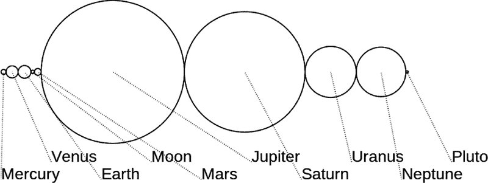
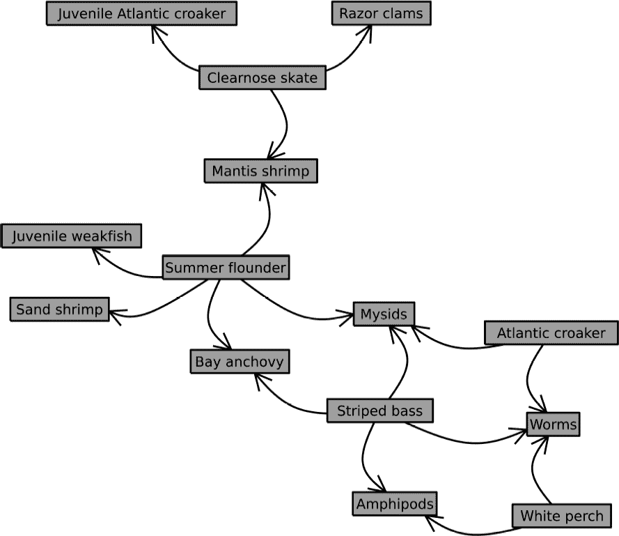
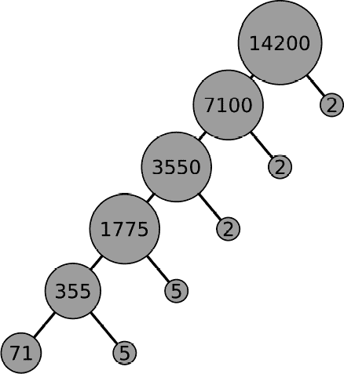
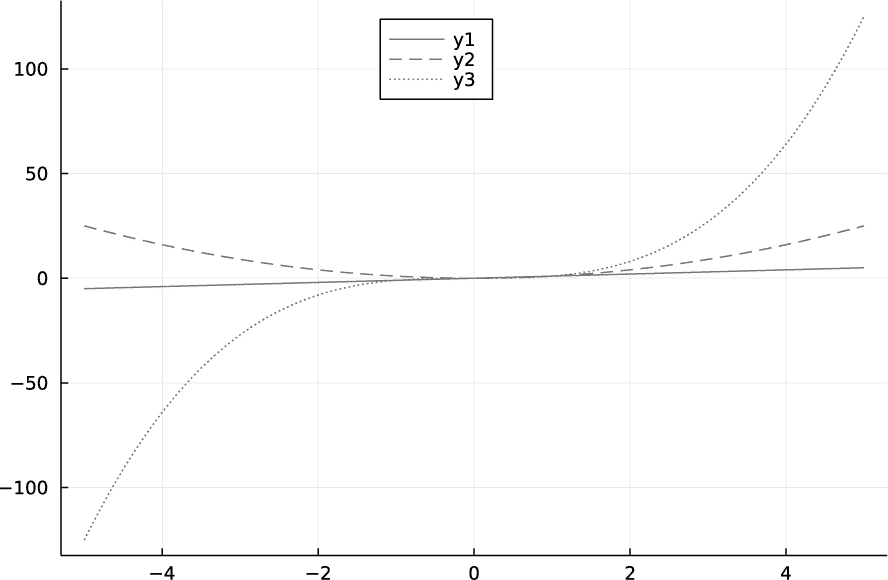
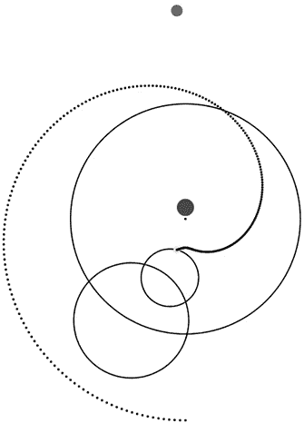
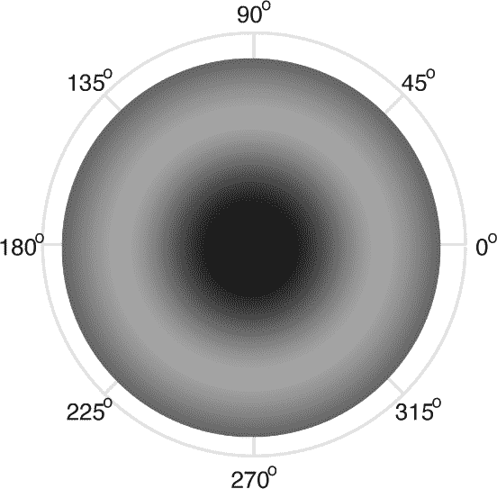
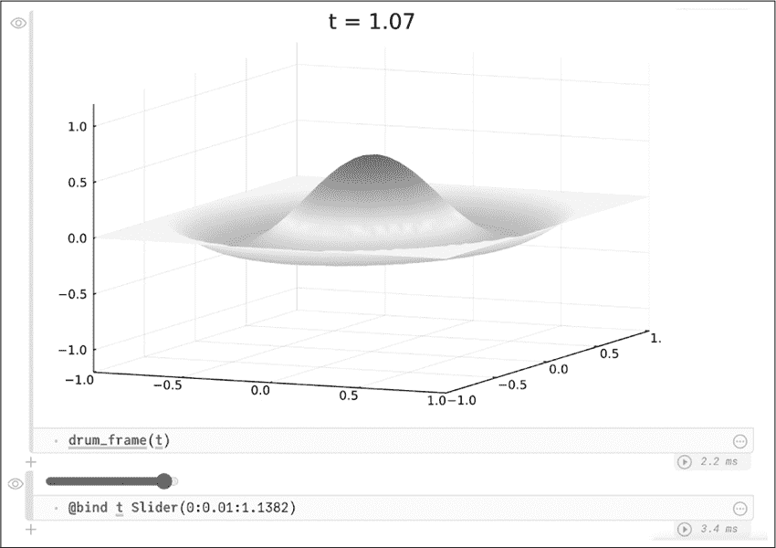

## **图表和动画**

*告诉我，Steed，一切都是按比例的吗？*

—Mrs. Peel


图表是科学交流和教育的重要形式。本章讨论的图表类型不同于我们在第四章中处理的数据或数学函数图表。在这个上下文中，*图表*指的是数学结构的插图、实验设置的图示、描述算法或处理流程的流程图，以及类似的图形描述。

动画现在常常作为科学论文的附加材料，在线提供以展示模拟结果。它们也是教育中一个宝贵的工具，并在科学和数学交流中有着广泛的应用。在本章中，我们将探索几个可以帮助你创建各种类型图表和动画的 Julia 包。

### **使用 Luxor 绘制图表**

`Luxor` 包非常复杂且高度通用，可以让你创建几乎任何类型的图表。要安装它，请在包管理器中输入添加 Luxor。

该包采用命令式风格逐步构建图形。你输入一系列命令来操作全局状态，每个命令都可能为图形添加某些元素。每个绘图命令的效果取决于执行时的状态。例如，要画一个蓝色圆圈，首先将颜色设置为蓝色，然后输入画圆命令，命令参数包括位置、大小以及是否需要“描边”（画出轮廓）或填充。轮廓或填充将使用当前设置的颜色。每个元素——圆圈、多边形、线条、文本或其他各种对象——都需要单独的命令，并且颜色、样式、不透明度等设置是在每个命令执行前全局设定的。

通过一个具体的例子，假设我们创建一个简单的图表（见图 7-1），展示太阳系行星的相对大小，按它们距离太阳的顺序排列。



*图 7-1：行星的相对大小*

清单 7-1 显示了完整的 REPL 会话，该会话创建了图 7-1 中的图示。

```
   julia> using \captionlst{Luxor}

➊ julia> planet_diameters = [4879 12104 12756 ;;
    3475 6792 142984 120536 51118 49528 2370];

   julia> planet_names = ["Mercury", "Venus", "Earth", "Moon",
    "Mars", "Jupiter", "Saturn", "Uranus", "Neptune", "Pluto"];

   julia> dimenx = 1000;

   julia> dimeny =  500;

➋ julia> @png begin
              dscale = 500.0
            ➌ origin(Point(planet_diameters[1]/(2*dscale), dimeny/2))
              ledge = 0.0
              diameter = 0
            ➍ fontface("Liberation Sans")
               fontsize(32)
               for i in 1:10
                   ledge += diameter/2.0
                   name = planet_names[i]
                   diameter = planet_diameters[i]/dscale
                 ➎ ledge += diameter/2.0
                    setcolor("black")
                    setdash("solid")
                    circle(Point(ledge , 0), diameter/2.0, :stroke)
                    txtstart = Point(100*(i-1), 180 + 35*(i%2))
                    text(planet_names[i], txtstart)
                    setcolor("blue")
                 ➏ setdash("dot")
                    line(txtstart, Point(ledge, 0), :stroke)
              end
       ➐ end dimenx dimeny "planets.png"
```

*清单 7-1：使用* Luxor *创建太阳系图表*

程序从 NASA 网站获取行星的直径，这些直径单位是公里（请参阅第 211 页中的“进一步阅读”）。当从 NASA 表格中复制并粘贴数据时，数字是以空格分隔的。这会创建一个 `1\times10` 数组（包括地球的月球和冥王星），这没问题；我们只需要一个可以遍历的列表。

行尾的双分号➊将数组的字面量输入分为两行（这个特性是在 Julia v1.7 中添加的）。虽然空格和双分号都表示沿第二维度的连接，但通常你不能在一个字面量数组定义中混合使用它们。这里的用法是一个特例，仅为此目的使用。

两个变量`dimenx`和`dimeny`保存了我们图表的尺寸。`Luxor`中的尺寸单位是点（points），每个点是 1/72 英寸。

`Luxor`提供了几个宏来方便地设置绘图环境。`@png`宏➋初始化 PNG 插图，定义坐标系统的原点为图片的中心，并在代码块结束时显示结果➐。在最后的`end`语句之后，我们给出图像的尺寸和文件名（虽然可以省略，但通常不建议）。默认尺寸为 600×600，默认文件名为*luxor-drawing-*，后跟时间戳和文件扩展名。随着绘图代码的不断发展，这可能会在磁盘上产生大量文件，因此你可能希望指定一个文件名，该文件名在每次运行时会被覆盖。文件扩展名是可选的，如果省略，`Luxor`会自动提供一个。

我们需要一个缩放因子来处理较大的行星直径，这个因子被赋值给`dscale`。

该宏将坐标系统的原点设置为图表的中心，使用我们的变量，它会是`(dimenx/2, dimeny/2)`。如果我们在*x*方向上设置原点➌，使得第一个行星的左边缘从左边界开始，代码会更加整洁。

我发现，在我的系统中，如果我没有设置`fontface` ➍，输出中会出现难看的位图字体。这个特定的字体可能在你的系统上不存在，所以你可以根据需要进行调整。如果请求一个`Luxor`找不到的字体，它会继续运行并进行替代。

当前圆心的 x 坐标被赋值给`ledge`，该值会被更新两次➎，每个行星都会增加：一次是增加前一个行星的半径，另一次是增加即将绘制的行星的半径。最终结果是一系列相切的圆。

在打印每个标签之前，颜色被设置为蓝色，虚线样式设置为点线➏。与本章其他图表一样，你可以在在线补充资料中找到彩色版本，链接为 [*https://julia.lee-phillips.org*](https://julia.lee-phillips.org)。

如果你在 REPL 中运行示例 7-1 中的代码，当你运行代码时，默认的图像查看应用程序会打开一个窗口，显示图表文件。REPL 会一直停顿，直到你退出该应用程序。如果你在 Pluto 或 Jupyter 中运行该代码，图表将嵌入到代码下方的单元格中。

宏的其他选项包括`@svg`和`@pdf`，它们分别创建这两种类型的文件。然而，PDF 文件无法嵌入到笔记本中。

除了线条、圆形和文本，`Luxor`还提供了用于绘制其他几何形状的命令，甚至可以绘制如圆的切线等几何构造。（有关手册的链接，请参见第七章中的“进一步阅读”部分。）

### **图形包**

只要有足够的耐心，你就可以使用`Luxor`创建任何类型的图表。然而，通常对于特定的标准类型图表，使用专门的包会更容易。

本节内容讨论的是数学意义上的图和其可视化。*图*这个词通常与第四章中讨论的绘图类型同义使用，但对于数学家而言，图是由节点通过边连接起来的集合，这就是我们在这里讨论的图的类型。这种类型的图用于表示各种各样的系统。每当你有一组对象，通过网络中的关系连接起来时，你就有了一个图。例如，植物或动物的分类、计算机程序中的调用位置、句子的语法结构、组织结构图以及小说中人物之间的关系，都是图的例子。在这样的图中，物体（组织的一部分或小说中的人物）被称为*节点*，节点之间的连接被称为*边*。

Julia 的`Graphs`包包含了生成多种类型图表的函数。它依赖于`Plots`和`GraphRecipes`来实际绘制表示图形的图像。我们在第四章中已经熟悉了第一个包；第二个包则是一个*绘图配方*集合，它通过`Plots`绘制图形。配方机制允许用户和包的作者扩展`Plots`，使其能够可视化新的数据类型或生成新的图表类型。要理解这些配方如何工作，我们需要了解更多关于类型系统的内容，因此在第八章中的“绘图配方”部分对配方进行了介绍。

作为`Graphs`包的介绍，我们将构建一个程序，用于创建一个关于位于美国东部切萨皮克湾的 14 个物种之间的捕食–被捕食关系的图表：

```
using Plots
using Graphs
using GraphRecipes

creatures = ["Striped bass", "Atlantic croaker", "White perch",
             "Summer flounder", "Clearnose skate", "Bay anchovy",
             "Worms", "Mysids", "Amphipods", "Juvenile weakfish",
             "Sand shrimp", "Mantis shrimp", "Razor clams",
             "Juvenile Atlantic croaker"]

foodchain = SimpleDiGraph(14)
```

首先，我们导入三个必要的库（`Plots`、`Graphs`和`Graph` `Recipes`），并创建一个包含生物名称的向量。这些名称将成为图表中的标签，并且还将作为图中节点的参考。

目前程序的最后一行创建了一个空的*有向图*，包含 14 个节点（`Graphs.jl`称之为“顶点”）。有向图是指边有方向，通常通过箭头表示。在这个例子中，边的方向代表了哪个生物吃了哪个生物。在*无向图*中，边只是表示连接，没有层级关系。

下一步是向`foodchain`添加表示捕食者-猎物关系的边。`add_edge!(foodchain, a, b)`函数通过在图的第一个参数中添加一条从节点`a`到节点`b`的边来修改图。这正是我们想要的，但不太方便，因为`a`和`b`需要是整数，代表列表中节点的顺序。为了输入这些参数，我们需要为每个关系遍历`creatures`列表。例如，要输入一条表示条纹鲈鱼吃蠕虫的边，我们必须调用`add_edge!(foodchain, 1, 7)`。

让我们通过定义一个字典和一个函数来使这个过程更方便，这样我们就可以通过名称来引用生物：

```
food_dict = Dict([creatures[i] => i for i in 1:14])

function ↪(predator, prey)
    add_edge!(foodchain, food_dict[predator], food_dict[prey])
end
```

`food_dict`字典将每个生物字符串与其在列表中的顺序关联，以便于引用。新的函数允许我们通过命名捕食者及其猎物来添加边。我们为这个函数使用了一个可以作为中缀运算符的名称（参见“运算符也是函数”章节，见第 159 页）。这个字符的 REPL 快捷键（和 LaTeX 命令）是`\hookrightarrow`。

在引入钩形箭头函数后，我们可以列出一组来自切萨皮克湾生态研究的捕食者-猎物关系：

```
"Striped bass" ↪ "Worms"
"Striped bass" ↪ "Amphipods"
"Striped bass" ↪ "Mysids"
"Striped bass" ↪ "Bay anchovy"
"Atlantic croaker" ↪ "Mysids"
"Atlantic croaker" ↪ "Worms"
"White perch" ↪ "Worms"
"White perch" ↪ "Amphipods"
"Summer flounder" ↪ "Bay anchovy"
"Summer flounder" ↪ "Mysids"
"Summer flounder" ↪ "Juvenile weakfish"
"Summer flounder" ↪ "Sand shrimp"
"Summer flounder" ↪ "Mantis shrimp"
"Clearnose skate" ↪ "Mantis shrimp"
"Clearnose skate" ↪ "Razor clams"
"Clearnose skate" ↪ "Juvenile Atlantic croaker"

graphplot(foodchain; names=creatures, nodeshape=:rect, fontsize=5,
          nodesize=0.14, method=:stress)
```

`add_edge!()`函数通过添加边来修改`foodchain`图形。最后一次调用生成了如图 7-2 所示的插图。在图中，箭头指向从捕食者到猎物，反映了我们定义的边的方向。



*图 7-2：切萨皮克湾的捕食者-猎物食物网*

如果你运行这个程序，你会发现你的图看起来有所不同。实际上，每次运行时，图的布局都会有所不同，尽管*结构*始终相同——相同的生物被相同的捕食者吃掉。这是因为节点和边的排列存在随机因素。事实上，我运行了这个程序大约五次才得到了我喜欢的结果。有些生成的图表效果较差，节点重叠。

调用`graphplot()`时的最后一个参数`method`选择了图形布局的算法：即通过决定节点的位置来将结构转化为图像。`stress`算法通过尽量使节点之间的距离差异最大化，从而实现这一点，衡量的标准是距离理论最优值的偏差。随机因素出现在算法通过变形一个随机的初始状态来找到这个最大值。

#### ***邻接矩阵***

在内部，通过调用`add_edge!()`建立的边的列表会转换成一个*邻接矩阵*。我们可以看到邻接矩阵，如清单 7-2 所示。

```
julia> foodchain_matrix = adjacency_matrix(foodchain)
14×14 SparseArrays.SparseMatrixCSC{Int64, Int64} with 16 stored entries:
 . . . . .  1  1  1  1 . . . . .
 . . . . . .  1  1 . . . . . .
 . . . . . .  1 .  1 . . . . .
 . . . . .  1 .  1 .  1  1  1 . .
 . . . . . . . . . . .  1  1  1
 . . . . . . . . . . . . . .
 . . . . . . . . . . . . . .
 . . . . . . . . . . . . . .
 . . . . . . . . . . . . . .
 . . . . . . . . . . . . . .
 . . . . . . . . . . . . . .
 . . . . . . . . . . . . . .
 . . . . . . . . . . . . . .
 . . . . . . . . . . . . . .
```

*清单 7-2：邻接矩阵是一个稀疏数组。*

结果作为一个*稀疏数组*返回，它是`SparseArrays`包中定义的一种数据类型，`Graphs`包会自动加载这个包。稀疏数组的行为类似于普通数组，但它特别适用于当只有一小部分元素被定义时的高效处理。REPL 将它们显示为示例 7-2 所示，未定义的位置用点表示。

邻接矩阵的元素设置为 1，以记录图中边的存在。例如，`foodchain_matrix[1, 6]` 为 1，因为从节点 1 到节点 6 有一条边（由“条纹鲈鱼”↪“海湾鳀”建立）。邻接矩阵编码了图的结构，因此包含了图的完整定义，因为图与其结构是等价的。我们可以通过调用`graphplot(foodchain_matrix)`来绘制图；其余的参数仅提供一些细节信息，例如用于标记节点的名称，以便显示。如果邻接矩阵是对称的（`M[i, j]` `== M[j, i]`），它表示一个无向图。否则，如在食物链示例中，它表示一个有向图，`graphplot()`将使用箭头而不是简单的线条来绘制它。在绘制图之前，邻接矩阵必须至少有一个非零元素，或者至少用`add_edge!()`定义一条边。

该包使用稀疏矩阵以提高效率，但如果我们像下一个示例中那样直接构造邻接矩阵，我们也可以选择使用普通矩阵。在这种情况下，0 元素表示没有边，而非零元素表示边的位置。

#### ***因子树***

在冒着唤起高中代数课糟糕回忆的风险下，我们的下一个示例（见示例 7-3）将是一个绘制因子树的程序：因子树是显示一个数字不断被分解成更小因子的图形，最终显示它的唯一素因子。它将展示如何通过构造邻接矩阵来构建图，并提供一个具有树形结构的无向图示例。以下是生成因子树的完整程序。

```
using Primes: factor
using Plots
using Graphs
using GraphRecipes
function factree(n)
 ➊ factors = factor(Vector, n)
    lf = length(factors)
    if lf == 1
        println("$n is prime.")
     ➋ return
    end
    names = [n; n ÷ factors[1]; factors[1]]
    for f in factors[2:end-1]
        push!(names, names[end-1] ÷ f, f)
    end
    nel = length(names)
 ➌ a = zeros(nel, nel)
    println("Prime factors: $factors")
    j = 1; i = 1
    a[1, 2] = 1
    a[1, 3] = 1
    for i in 2:2:nel-3
        a[i, i+2] = 1
        a[i, i+3] = 1
    end
    graphplot(a;
              nodeshape=:circle,
           ➍ nodesize=0.12 + log10(n) * .01,
              axis_buffer=0.3,
              curves=false,
              color=:black,
              linewidth=2,
              names=names,
              fontsize=10,
           ➎ method=:buchheim)
end
```

*示例 7-3：创建因子树的程序*

新的导入是程序的第一行，它为我们引入了 `factor()` 函数 ➊，该函数返回其参数的素因数。该程序仅适用于大于 1 的整数 `n`。传递给 `factor()` 的第一个参数要求其返回一个向量结果，这是构建因子树所需的形式。默认情况下，返回的是一种专用类型，列出因子及其多重性。如果只有一个因子，`n` 就是一个素数，因此程序立即停止 ➋，并宣布原因。程序继续遍历素数列表，进行除法运算并将结果拼接到 `names` 向量中。接着，我们初始化邻接矩阵 `a` ➌ 并记录每对因子及其乘积在树上的链接。最终调用 `graphplot()` 时，将邻接矩阵作为第一个参数；关键字参数设置插图的详细信息。`nodesize` 参数设置圆圈的额外大小，以容纳标签所需的空间。扩大圆圈的算法并没有完全成功地使其足够大，因此我们添加了与标签中数字个数成比例的额外部分 ➍。调用 `factree(14200)` 会生成图 7-3。



*图 7-3：数字 14,200 的因子树*

该包提供了两种布局方法来创建树状图。`:tree` 方法有效，但结果略显自由形式。`:buchheim` 方法 ➎ 产生了图 7-3 所示的规则树。尽管素因数分解是唯一的，但导致其结果的因子树以及程序的结果可能并非唯一。

### **使用 Javis 制作动画**

广泛使用的 `Javis` 包是制作几乎任何类型动画图表的好选择。它构建在 `Luxor` 之上（参见第 190 页的“使用 Luxor 绘图”），这意味着你可以基于对该包的了解来创建动画。一个 `Javis` 程序通过 `Luxor` 的绘图命令创建对象，并通过一系列直观的调用将它们转换为视频，操作包括旋转、平移或沿路径移动它们，同时在时间上改变形状参数。

#### ***闭包***

为了有效使用 `Javis`，了解一种称为 *闭包* 的编程技巧是有帮助的。对于熟练的程序员，若知道如何使用闭包，可以直接跳过这一部分。

闭包是由另一个函数创建并返回的函数。我们将返回的函数称为 *内函数*，而创建它的函数称为 *外函数*。大多数现代编程语言都允许程序员创建闭包，但有些语言比其他语言更方便。由于 Julia 具有词法作用域和方便的函数定义语法，它使得闭包既简单又直观。

闭包的关键在于，内部函数可以访问在外部函数中定义的变量。我们说它们是*封闭的*，因此得名。外部函数成为一个函数工厂，返回一个其行为取决于传递给外部函数的参数，但可能具有完全不同函数签名的函数。

列表 7-4 展示了一个简单的闭包示例，我们很快会发现它有一个有用的应用。

```
function power(n)
    return function(x)
        x^n
    end
end
```

*列表 7-4：定义一个闭包*

通过这个定义，当我们调用`power(5)`时，我们得到一个单变量的函数，它将该变量提升到第五次方并返回结果。换句话说，如果我们这样定义两个函数：

```
p = power(5)

q = x -> x⁵
```

然后`p`和`q`具有相同的行为：

```
julia> p(4) == q(4) == 1024
true
```

函数`power()`返回的是匿名函数，但我们可以像对待其他函数一样将其分配给变量，这里是`p`。

现在`power()`是一个函数工厂，它生成将其参数提升到任何期望指数的函数。正如在“绘图函数”部分中提到的，在第 88 页的`plot()`函数版本中，`Plots`包接受单变量函数的简单名称进行绘图。我们可以在不提及变量或定义数组的情况下绘制这些函数。

似乎这种便利性无法被用于绘制依赖于除了自变量之外的其他参数的函数，因此我们需要使用命名函数或匿名函数语法来将这些函数传递给`plot()`。例如，如果我们想绘制`f(x, n) = x^n`，我们不能仅仅调用`plot(f)`，因为`f()`需要两个参数，但如果`n`已经定义，我们可以调用`plot((x) -> x^n)`。闭包是传递匿名函数的替代方法，适用于此类情况。

一旦我们定义了列表 7-4 中的闭包，我们就可以进行以下绘图调用：

```
plot([power(1), power(2), power(3)]; legend=:top)
```

这会生成图 7-4 中的图。



*图 7-4：使用闭包绘图*

这个绘图示例只是闭包的一种应用。它们是生成捕获定义时状态的函数的强大技术。

#### ***外循环动画***

使用`Javis`的模式是定义生成每个要动画化的对象的函数，然后调用一系列引用这些对象并使其动画化的语句，改变它们的位置或其他属性。

**注意**

*由于* Javis *是基于* Luxor *构建的，因此它导入* Luxor *本身，并重新导出该包的函数。结果是，包含* using Javis *的程序不得同时包含* using Luxor *，因为这会导致名称冲突。如果你已经在 REPL 中使用过* Luxor *，你必须在使用* Javis *之前重新启动 REPL。*

创建对象的函数使用一个或多个`Luxor`函数来绘制圆形、线条、文本或其他通过`Luxor`提供的图形实体，并可以选择性地返回有关该对象的信息，以便在动画调用中使用。

`Luxor`文档描述了三种将对象创建函数传递给动画函数的方法。我们将学习另一种基于闭包的方法，它更通用，并且能生成更简洁、易读的代码。

本示例的目标是创建一个程序，生成以托勒密风格展示太阳系模型的动画。该古代宇宙学模型将地球置于宇宙的中心，并解释了行星的观测现象，认为行星的运动是由于它们的圆形轨道，而这些轨道本身又环绕着更大的轨道。这些圆形轨道被称为*本轮*；任何一颗行星的运动都可以通过一个或多个本轮来建模，最终形成一个围绕一个略微偏离地球的点的大圆，偏离的距离称为*偏心率*。

为了构建程序，我们将从创建行星和轨道的函数开始。这是一个行星的函数：

```
function planet(radius=15, color="green"; action = :fill, p=0)
    return function(video, object, frame)
        sethue(color)
        circle(p, radius, action)
        return p
    end
end
```

这是一个闭包。对`planet()`的调用返回一个接受三个位置参数的函数，并根据传递给`planet()`的原始参数，而不是传递给返回函数的参数，绘制一个具有特定半径、颜色和位置的圆形。

这种间接性是必要的，因为执行动画的`Javis`函数期望函数作为它们的第一个也是唯一必需的参数。它们不接受形状作为参数，而是接受一个绘制形状的函数。它们将三个值`(video, object, frame)`传递给这个函数：分别表示视频、正在动画化的对象和帧号的整数数据类型。该函数可以使用它们中的任何一个，或者像`planet()`创建的函数那样，不使用它们。

闭包返回圆形的位置。如果其他动画函数需要知道该位置（如我们的视频中所示），我们必须这样做。

绘制轨道的函数几乎是相同的：

```
function orbit(radius, color="orchid1"; p=O)
    return function(video, object, frame)
        sethue(color)
        circle(p, radius, :stroke)
        return p
    end
end
```

轨道将有轮廓，但不会填充颜色。

使用这两个函数，我们可以绘制可动画化的行星和轨道，这几乎是我们所需的全部。但也希望能够展示行星在太阳系中的漂移如何转化为其相对于恒星的观测位置随时间的变化。我们将通过行星位置在水平方向上的投影来近似这种运动。`Javis`提供的`pos()`函数返回对象的位置，并具有方便的`x`和`y`字段来提取相应的坐标。

以下函数接受一个对象并绘制另一个与其共享水平方向坐标、接近视频顶部的圆形：

```
function observed_position(orbiter; radius=10, color="orangered")
    return function(video, object, frame)
        sethue(color)
     ➊ y = 0 - video.height/2 + 50
        x = pos(orbiter).x
        circle(Point(x, y), radius, :fill)
    end
end
```

这里，`observed_position()`使用了`video`参数的`height`字段 ➊，这是动画函数自动提供的。

我们还想绘制一个对象：在空间中可视化行星轨迹的曲线。我们将把这条路径记录为一个全局`positions`向量中的一系列点。在每一帧中，函数会将新位置添加到向量中，并绘制一系列小圆圈来描绘轨迹：

```
function track!(positions, orbiter)
    return function(video, object, frame)
        sethue("cadetblue1")
        push!(positions, pos(orbiter))
        circle.(positions, 2, :fill)
    end
end
```

我们还需要一个绘图函数，这是几乎所有`Javis`动画中都需要用到的，用于定义背景：

```
function ground(args...)
    background("black")
    sethue("white")
end
```

这个`ground()`定义创建了一个带黑色背景的绘图画布，并使用白色作为默认的绘图颜色。

有了每个对象的绘制函数后，我们可以创建动画：

```
using Javis

function epicycles(inputcycles; eccentricity=0.1, file=nothing)
    box = 200
    eccentricity *= -box
    cycles = [(box*s, f) for (s,f) in inputcycles[1:end-1]]
    R = sum(c[1] for c in cycles)
    # Some encoders require a multiple of 2:
    box_length = 1.5*(2box + R) ÷ 2 * 2
 ➊ solar_system = Video(box_length, box_length)
    positions = []
 ➋ Background(1:500, ground)
    earth = Object(planet(), Point(0, eccentricity))
    origin = Object(planet(2, "white"))
    inner_orbit = Object(orbit(box))
    for (radius, frequency) in cycles
        outer_orbit = Object(orbit(radius), Point(0, box))
        box += radius
     ➌ act!(outer_orbit, Action(anim_rotate_around(frequency * 2π, inner_orbit)))
        inner_orbit = outer_orbit
    end
    wanderer = Object(planet(6, "bisque"), Point(0, box))
    act!(wanderer, Action(anim_rotate_around(inputcycles[end] * 2π,
         inner_orbit)))
 ➍ Object(track!(positions, wanderer))
    Object(observed_position(wanderer))
    if file == nothing
     ➎ render(solar_system; liveview=true)
    else
        render(solar_system; pathname=file, framerate=30)
    end
end
```

`epicycles()`函数接受一个必需的位置参数`inputcycles`，其形式为`[(s1, f1), (s2, f2), ..., fp]`。每一对`(s, f)`表示一个外循环的大小`s`，是主轨道半径的一个分数，轨道频率为`f`。这里的频率指的是在动画过程中完成的循环次数。最终的`fp`是行星的频率。

在进行一些计算后，根据视频的整体大小来缩放轨道，并根据用户输入的外循环调整大小，我们得出了所有`Javis`动画所需的一个语句 ➊：定义`Video`及其尺寸。

第一个动画命令 ➋ 为前 500 帧设置了要绘制的背景。接下来的三个动画命令是对`Object()`的调用；这是`Javis`命令，用于将图形元素放置到背景上。`Object()`函数接受一个帧范围作为第一个参数，但会使用最近的`Background()`或`Object()`命令提供的范围作为默认值。`Javis`是一个命令式系统，维护着一个动画语句适用的状态，其中包含当前的`Video`和帧范围。

接下来，我们有一个循环，它为每个传入的外循环添加轨道。`act!()`函数 ➌ 是我们在`Javis`中创建大多数类型运动的方式。它的第一个参数是我们想要动画化的对象，第二个参数是定义运动的函数。这个程序中使用的唯一运动是`anim_rotate_around()`，它接受一个角度（以弧度为单位）和一个成为旋转中心的对象。外循环模型中的复杂复合运动容易构建，因为旋转的对象本身也可以处于运动状态。

最后的两个`Object()`调用 ➍ 创建了追踪行星路径的轨迹和显示其大致观测位置的投影。尽管这些是动画对象，但它们不需要`act!()`调用，因为它们是参考其他动画对象定义的。

`epicycles()`函数还接受两个可选的关键字参数。`eccentricity`给出地球偏离主轨道中心的位移。如果提供了`file`，程序会创建一个视频文件并保存在指定位置；如果没有，它将在交互式查看器中显示结果。

举个例子，要制作一个动画，让一个行星在电影中转一圈，同时有两个外圈分别绕行两圈和三圈，第一个外圈的直径是轨道直径的一半，第二个外圈的直径是第一个的二分之一，可以使用以下调用：

```
epicycles([(0.5, 2), (0.25, 3), 1]; file="ptolemaic.mp4")
```

这个调用会将渲染后的动画保存为 MP4 文件。

视图类型取决于编码环境。在 REPL 中，`Javis` 会打开一个窗口，带有控制按钮，用于逐步或拖动动画帧。在 Pluto 笔记本中，帧以水平列表的形式出现，并带有滚动条。在使用笔记本时，修改渲染调用，将 `liveview=false` ➎，会将动画 GIF 直接嵌入到笔记本中。`Javis` 包可以将动画保存为 GIF 或 MP4 文件；选择由文件扩展名控制。由于 GIF 文件可能变得非常大，MP4 格式是一个不错的选择；然而，无论哪种格式，与 `liveview` 选项相比，都需要显著的渲染时间，而 `liveview` 非常快速。

图 7-5 显示了渲染视频中的一帧。（请访问本书的在线补充材料 [*https://julia.lee-phillips.org*](https://julia.lee-phillips.org) 获取完整视频。）



*图 7-5：使用* Javis 创建的动画中的一帧

我们能够仅通过一种类型的运动 `anim_rotate_around()` 来创建这个可视化效果。要让一个对象围绕其原点旋转，调用是 `anim_rotate()`。

通过将它们作为参数传递给 `Action()`，我们可以创建以下一些其他的运动：

appear() **和** disappear() 接受 `:fade`、`:scale` 和 `:fade_line_width` 等任何参数，并通过改变指定的属性使对象出现或消失。使用 `:draw_text` 可以使文本出现，带有打字效果。

follow_path() 使一个对象沿着一系列点的路径移动。

anim_scale() 缩小或放大一个对象。

anim_translate() 沿直线移动一个对象。

change() 改变对象的任何属性。

### **使用 Reel 创建动画**

`Reel` 包与 `Javis` 类似，也用于创建动画，但用途不同。虽然 `Javis` 通过编程描述对象及其运动来轻松创建动画，`Reel` 则让我们可以根据一个参数（通常是时间）从任何创建图像的函数生成视频。

我们使用`Reel`中导出的一个名为`roll()`的函数，将其传递一个有两个位置参数的图像创建函数：我们想要的视频时长`duration`和每秒帧数`fps`。这两个位置参数分别是时间`t`和时间步长`dt`；`roll()`计算这两个参数，设置`dt = duration/fps`，并将其传递给函数，每次调用时更新`t`。它返回一个视频对象，我们可以通过调用`write()`将其转换为 GIF 或 MP4 文件。让一个函数接受`t`和`dt`并创建所需的视频帧是我们的责任。

**注意**

*Reel*包更新不频繁，可能无法在每个计算环境中正常工作。一个替代方案是最近版本的*Plots*包，它只生成 GIF，但非常简单和方便。有关* @animate *和* @gif *宏的文档，请参见第 211 页中的“进一步阅读”。

清单 7-5 计算了一个轴对称模式的鼓膜振动位移，并创建了一个以热图形式可视化运动的视频。

```
   using SpecialFunctions
   using Plots
   using Reel
   R = 1.0 # Drum radius
   z2 = 5.52008 # 2nd zero of J0
   λ2 = z2/R
   c = 1
   A = 1; B = 1

   function vibe(r; t=0)
       if r > R
           return 0
       else
        ➊ return (A * cos(c*λ2*t) + B * sin(c*λ2*t)) * besselj0(λ2*r)
       end
   end
   r = 0:R/100:R
   theta = 0:2π/100:2π
➋ function drum_frame(t, dt)
       heatmap(theta, r, (theta, r) ->
           vibe(r; t=t); colorbar=false, clim=(-1, 1),
           c=:curl, proj=:polar, ticks=[], size=(100, 100))
   end
   drum_video = roll(drum_frame, fps=30, duration=2)
   write("drum_video.mp4", drum_video)
```

*清单 7-5：圆形鼓膜振动动画*

首先，我们导入了三个包。振动的圆形鼓膜具有由贝塞尔函数描述的径向依赖，贝塞尔函数来自`SpecialFunctions`包。我们使用`Plots`中的绘图函数来创建电影帧，然后使用`Reel`将动画拼接在一起。

在定义了解决方案的几个常量后，我们定义了`vibe()`函数，该函数接受径向坐标和一个关键字参数`t`，并返回该时间和坐标下的解。来自`SpecialFunctions`包的贝塞尔函数*J*[0]被命名为`besselj0()` ➊。

接下来的两行定义了绘图所需的坐标数组。极坐标系在这种圆形几何中最为自然：`r`是径向坐标，`theta`是角坐标。我们需要将绘图函数包装在一个接受`t`和`dt`的函数中，以便`roll()`能够生成动画帧。对于这个应用，我们并没有用到`dt`，但该函数仍然需要接受两个参数。对`heatmap()`的调用使用了`:curl`色谱，该色谱在 0 附近有一条细白色区域，帮助我们看到节点线并清晰地区分正负区域。`proj`参数选择了极坐标几何。

图 7-6 展示了结果动画中的一帧。（完整视频请参见在线补充材料[*https://julia.lee-phillips.org*](https://julia.lee-phillips.org)。）



*图 7-6：振动鼓膜动画中的一帧*

在使用`roll()`函数创建视频后，我们使用`write()`将结果保存到文件。文件扩展名指定视频格式；另外两种选择是 GIF 和 WEBM。

`write()` 函数是 Julia 用于写入数据到文件的标准函数。`Reel` 包定义了它的一个版本，当第二个参数是一个 `Reel` 视频时，它会将视频转换为请求的格式。第八章 解释了这是如何实现的，以及如何通过参数类型来激活自定义版本的函数。

### **Pluto 中的交互式可视化**

Pluto 笔记本（参见 第 17 页 的“Pluto：一个更好的笔记本”）通过其 `@bind` 宏提供了一种创建交互式动画的简便方法。这个宏将任何标准 HTML 输入控件的输出绑定到 Julia 变量。当我们执行包含 `@bind` 宏调用的单元格时，Pluto 会在该单元格的输出区域创建控件。当用户操作该控件时，Pluto 会即时更新绑定到该控件的变量值。由于笔记本的反应式特性，任何依赖该值的单元格都会自动重新执行。如果这些单元格生成图表或其他可视化内容，图形会根据用户的交互进行更新。HTML 中的输入控件包括滑块、数值或文本输入框、文件选择器、颜色选择器、复选框、选择菜单等。

我们不需要实际编写任何 HTML（或了解它的知识），感谢 `PlutoUI` 包，它为 HTML 输入控件提供了一个方便的 Julia 接口。然而，对于 HTML 专家，仍然支持直接使用网页的标记语言。甚至可以使用 JavaScript 创建自定义控件。有关更多信息和 `PlutoUI` 文档，请参见 第 211 页的“进一步阅读”部分。

让我们看几个例子，展示如何使用 `@bind` 宏与 `PlutoUI` 控件。以下示例使用了浏览器的日期选择小部件：

```
@bind some_date DateField()
```

这个命令将用户选择的日期分配给 `some_date`，它将具有 Julia 的 `Dates.DateTime` 数据类型。

这个示例使用了 HTML 的复选框：

```
@bind a_setting CheckBox()
```

这里，`a_setting` 变成了一个 `Boolean`：如果用户点击了框框，则为`true`，否则为`false`。

以下示例使用了 HTML 文本框：

```
@bind label TextField()
```

这个调用会将用户在文本框中输入的内容作为 `String` 类型分配给变量 `label`。

还有许多其他的函数。所有这些函数都接受一个 `default` 关键字参数，有些还接受其他参数。例如，`TextField()` 接受一个可选的元组参数；如果提供该参数，它会根据元组的第一个和第二个元素创建一个多行 `textarea`，指定列数和行数。

作为交互式可视化的一个示例，让我们回到 列表 7-5 中的振动鼓面问题。目标是创建一个包含鼓面图形的笔记本，用户可以通过操作滑块在时间轴上进行移动。

我们将对列表 7-5 中的代码做一些小的修改。首先，我们需要一个额外的导入，`using PlutoUI`，以便能够使用 HTML 小部件，而不需要导入 `Reel`。

`vibe()` 函数无需修改，但我们将改变绘图函数，改为绘制曲面图而不是热图，并在标题中显示时间。`Plots` 中的 `surface()` 函数不支持极坐标，因此我们需要使用 `x` 和 `y` 并手动进行转换：

```
function drum_frame(t)
    surface(x, y, (x, y) ->
        vibe(sqrt(x² + y²); t=t); colorbar=false, clim=(-1, 1),
        c=:curl, zrange=(-1.2, 1.2), title="t = $t")
end
```

我们希望交互性能够响应迅速，因此我们将通过使用更粗的网格来牺牲一些绘图的流畅度：

```
x = -1:0.05:1
y = -1:0.05:1
```

我们并不是在制作电影，因此不需要列表 7-5 中的最后两行。为了创建笔记本，我们在 REPL 中导入 `Pluto` 并执行 `Pluto.run()`，这将打开默认浏览器中的新标签页，显示 Pluto 起始页面。点击链接创建一个新笔记本后，我们可以将所有这些变量和函数定义输入到单元格中。最后一个单元格将包含以下代码：

```
@bind t Slider(0:0.01:1.1382)
```

作为参数提供的范围将成为滑块的起始值、步长和结束值。结束值是一个完整振动周期的时间。

书中的图片无法传达使用笔记本的体验。要体验这一点，最好的方法就是亲自尝试。不过，图 7-7 展示了绘图和滑块的屏幕截图。



*图 7-7：在 Pluto 笔记本中的振动鼓面*

交互式 Pluto 笔记本是创建说明文档和教育材料的强大工具。由于它们以文本文件的形式存储，因此至少可以轻松与其他 Julia 用户分享。

### **结论**

本章中我们探索的包使得创建各种各样的图表和动画变得简单。这些工具对 Julia 用户社区大有裨益，因为很多科学家和工程师（他们是 Julia 受众的一个重要群体）也是教师、会议演讲者和在线教育材料的创作者。所有这些活动都因手头有构建说明性可视化的工具而得到提升。能够在 Julia 中创建复杂的可视化非常重要：因为这些可视化往往需要我们已经在 Julia 程序中执行的计算。实际上，它们通常是这些计算结果传播的一部分。像 `Luxor` 和 `Javis` 这样的包让我们不必依赖外部程序，也避免了陷入另一个“二语言问题”。

在下一章中，我们将回到语言本身，学习类型系统。这是掌握 Julia 所需的最后一块拼图；掌握它将解锁新的编程能力。

**进一步阅读**

+   视频和彩图可在在线补充材料中查看，网址是 [*https://julia.lee-phillips.org*](https://julia.lee-phillips.org)。

+   `Luxor` 文档可以在 [*http://juliagraphics.github.io/Luxor.jl/stable/*](http://juliagraphics.github.io/Luxor.jl/stable/) 查阅。

+   `Javis` 文档可以在 [*https://juliaanimators.github.io/Javis.jl/stable/*](https://juliaanimators.github.io/Javis.jl/stable/) 查阅。

+   关于 `GraphRecipes` 属性，包括完整的布局算法列表，请访问 [*https://docs.juliaplots.org/stable/generated/graph_attributes/*](https://docs.juliaplots.org/stable/generated/graph_attributes/)。

+   提供不同图形布局算法的 `NetworkLayout` 包文档，可以看到各种布局策略的有趣动画，文档地址为 [*https://juliagraphs.org/NetworkLayout.jl/stable/*](https://juliagraphs.org/NetworkLayout.jl/stable/)。

+   关于如何使用 `@gif` 和 `@animate` 宏的详细信息，请访问 [*https://docs.juliaplots.org/latest/animations/*](https://docs.juliaplots.org/latest/animations/)。

+   有关如何使用 JavaScript 为 Pluto 创建自定义界面组件的教程，请访问 [*https://cotangent.dev/how-to-make-custom-pluto-ui-components/*](https://cotangent.dev/how-to-make-custom-pluto-ui-components/)。

+   Pluto 的创始人在这个视频中讲解了如何使用 JavaScript 创建自定义交互：[*https://www.youtube.com/watch?v=SAC_RCjyRRs*](https://www.youtube.com/watch?v=SAC_RCjyRRs)。

+   有关 `PlutoUI` 中可用函数的文档，请访问 [*https://docs.juliahub.com/PlutoUI/*](https://docs.juliahub.com/PlutoUI/)。
