## 第九章：类型系统**

**面向对象编程是一个极其糟糕的想法，只有在加利福尼亚才能诞生。**

—埃兹格·迪克斯特拉


到目前为止，我们已经使用并创建了很多函数。我们可以将函数看作是 Julia 语言中的动词。正如在自然语言中，动词作用于名词一样，Julia 中的名词包括数字、集合、字符串以及其他类型的实例。

到目前为止，我们在学习过程中遇到了许多数据类型：不同种类的数字、字符串、字符，以及像数组和映射这样的集合。尽管我们的重点并不是类型，但在谈论 Julia 编程时，无法不提及它们。Julia 的特别之处在于，它允许我们在不指定变量类型的情况下创建非常快速的代码，这与其他快速语言（如 Fortran（其中类型规格可以是隐式的）和 C）不同。然而，要有效地编写 Julia 程序，还是需要了解它的类型系统。这样做的主要原因是，Julia 程序是围绕函数和方法组织的，依赖于其分发系统，而该系统依赖于参数类型。其次，了解类型有助于我们编写更高效的程序。本章将涵盖这两个方面的问题。

### **实践中的类型**

与其深入探讨类型系统的抽象理论，不如从实际的角度来看待类型。

要找出任何值的类型，Julia 提供了 `typeof()` 函数：

```
   julia> typeof(17)
   Int64

   julia> typeof(17.0)
   Float64

   julia> typeof(17//1)
➊ Rational{Int64}

   julia> typeof("7")
   String

   julia> typeof('7')
   Char
```

我们已经讨论过字符串和字符之间的区别，以及单引号和双引号的相关区别；然而，理解各种数值类型同样很重要。例如，`17`、`17//1` 和 `17.0` 具有相同的值，但它们是不同类型的对象，它们的行为可能不同。它们类型的差异反映了这一现实。

在报告有理数类型时使用的花括号 ➊ 表明这是一个 *参数化类型*，我们将在“参数化类型”一节中（第 248 页）回到这个话题。现在，理解这是由 `Int64` 组成的 `Rational` 类型就足够了。

浮动小数点字面量的类型是 `Float64`，这意味着它是一个浮动小数，或者说是带有小数点的数字，并且它被存储在一个 64 位的内存段中。这 64 位被分配如下：1 位表示符号，11 位表示指数，52 位表示“分数”。`Float64` 的最大绝对值大约是 10³⁰⁰，并且它具有 17 位有效数字，或者说是小数点后 16 位的精度。（这与观察结果一致，即表示一个十进制数字需要三个二进制数字。）我们可以通过 `Printf` 包提供的 `@printf` 宏来看到这一点：

```
julia> using Printf

julia> @printf "%.16f" 1/3
0.3333333333333333

julia> @printf "%.17f" 1/3
0.33333333333333331

julia> @printf "%.18f" 1/3
0.333333333333333315
```

如果我们请求超过 16 位的数字，将会显示错误的数字。

如果我们使用精度较低的浮点类型，将会看到更多不正确的数字：

```
julia> @printf "%.16f" Float32(1/3)
0.3333333432674408
julia> @printf "%.16f" Float16(1/3)
0.3332519531250000
```

这里我们将类型名称作为函数来将它们的参数转换为命名类型。如果不进行类型转换，像`1/3`这样的表达式在大多数系统上默认是`Float64`类型。

在典型系统上，默认的整数类型`Int64`的范围是*−*2⁶³到 2⁶³ *−* 1，其中一个位用于符号位。

Julia 提供了内建函数，用于查找每种数值类型所能表示的最大值和最小值：

```
julia> typemax(Int32)
2147483647

julia> typemin(Int32)
-2147483648

julia> typemax(Int16)
32767

julia> typemin(Int16)
-32768
```

但如果我们询问浮点数，`typemax()`和`typemin()`并不太有用：

```
julia> typemax(Float64)
Inf

julia> typemax(Float16)
Inf16

julia> Inf64 === Inf
true
```

显然，无穷大是一个浮点数，而 Julia 为每种浮点数大小提供了无穷大。这是自洽的：因为没有什么比无穷大更大，所以如果`Inf16`是`Float16`，它必须是最大可能的`Float16`。

Julia 还有另一个函数可以在这里提供帮助：

```
julia> floatmax(Float64)
1.7976931348623157e308

julia> floatmin(Float64)
2.2250738585072014e-308

julia> floatmax(Float16)
Float16(6.55e4)

julia> floatmin(Float16)
Float16(6.104e-5)
```

函数`floatmax()`和`floatmin()`分别返回所请求类型的最大*有限*浮点数和最小正浮点数。

通常，我们应该在程序中使用这些*原生类型*进行算术运算，因为它们是最有效的选择。如果需要，而且可能的话，我们可以使用更小的数字来节省空间——例如`Int16`——并且我们可以使用`Int128`来获取更大的整数。然而，如果原生类型不能满足我们的需求，通常是因为我们需要大量的精度——换句话说，很多位数字——来进行计算。这是下一节的主题。

要检查某个值是否具有特定类型，可以使用`isa()`函数。我们可以将其用作普通函数或在中缀位置使用：

```
julia> isa(17, Int64)
true

julia> 17 isa Number
true

julia> 17 isa String
false
```

这个函数返回一个布尔值。前两个调用返回`true`，因为`17`既是`Int64`也是`Number`。前者意味着后者（参见第 222 页的“类型层次结构”）。

#### ***“大”与无理类型***

Julia 使得使用精度根据需要增长的类型进行*任意精度算术运算*变得简单：这些类型的数字位数可以无限增加。使用这些类型的算术运算比使用原生类型的正常计算要慢，但对于某些任务，它是唯一的选择。

##### **任意精度**

作为需要任意精度类型的一个简单示例，假设我们想要绘制阶乘函数。这就是通常用感叹号表示的函数：

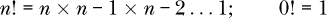

对应的 Julia 函数是`factorial(n)`。该函数增长得非常快：

```
julia> factorial(20)
2432902008176640000

julia> factorial(21)
ERROR: OverflowError: 21 is too large to look up in the table;
       consider using `factorial(big(21))` instead
```

这显示了 20 是可以适应`Int64`的最大阶乘。如果我们使用`Int128`，可以达到 33!，但如果我们想要更大呢？

错误信息提供了一个线索。`big()`函数将其参数转换为具有无限大小和精度的对应类型。对于整数，这叫做`BigInt`，而对于浮点数则是`BigFloat`。

让我们使用`BigInt`来绘制阶乘函数：

```
julia> plot(factorial.(big.(1:50)), yscale=:log10,
               legend=:topleft, label="Factorial")
```

这里我们绘制的是最大到 50!，这远远超出了本地整数能表示的范围。图 8-1 展示了结果。

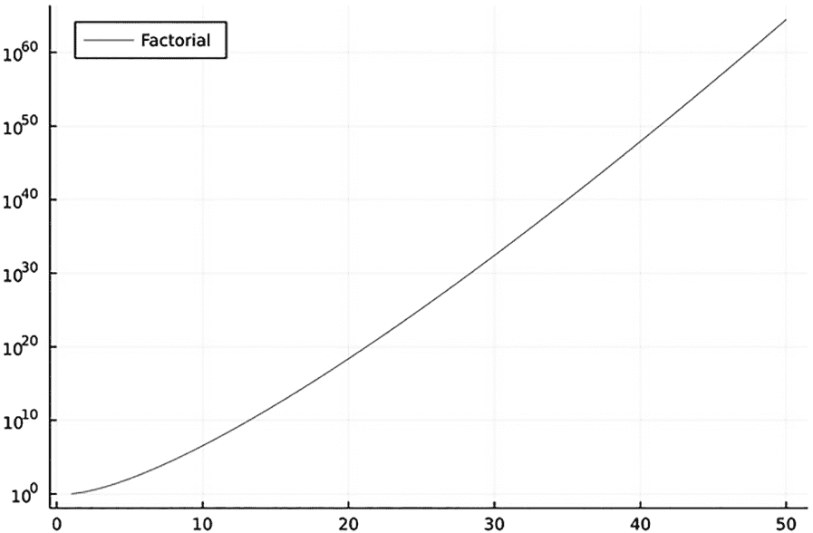

*图 8-1：使用 BigInt 计算的阶乘函数*

我们将在“阶乘”一节中重新讨论阶乘，参考 第 312 页，其中它作为排列 *n* 个对象的方式数量出现。

`BigFloat` 类型也提供无限的大小。它的默认精度是 256，约为 80 位有效数字。我们可以使用 `setprecision()` 函数将 `BigFloat` 的精度设置为任何需要的值：

```
julia> big(1.0)/3
0.333333333333333333333333333333333333333333333333
  3333333333333333333333333333348

julia> setprecision(512);

julia> big(1.0)/3
0.3333333333333333333333333333333333333333333333333
  3333333333333333333333333333333333333333333333333
  3333333333333333333333333333333333333333333333333
  333333346
```

要检索精度，我们可以使用 `precision()` 函数，传入我们要查询的类型：

```
julia> precision(big(1.0))
512

julia> precision(float(1.0))
53
```

`BigInt` 类型的数字所使用的位数会根据需要增加，因此它没有像浮点数那样固定的精度概念。

##### **无理数**

Julia 的一个独特属性是存在 *无理数类型*：

```
julia> π
π = 3.1415926535897...

julia> typeof(π)
Irrational{:π}
```

希腊字母 π 所表示的数字打印时附带三个点，提示我们这只是故事的一部分。虽然它看起来像一个浮点数，但它的类型并非 `Float64`，而是一个新的类型：`Irrational`。这是因为在 Julia 中，π 表示的*不是*浮点数，而是圆周率与直径的比值的*精确值*。这三个点提醒我们，展示的数字仅仅是这个无限、不重复序列的前几位。

Julia 会根据需要计算并展示更多数字：

```
julia> big(π)
3.1415926535897932384626433832795028841971693993751
  05820974944592307816406286198
```

该数字不会以尾部点的形式显示，因为它不再是精确值的表示，而是对精确值的近似。

还有其他几个无理数被内建到 Julia 中；其中最重要的无理数是 *e*，自然对数的底数。要插入该字符，可以输入 Unicode 码点 212F（Script Small E），在 REPL 中输入 \euler 并按 TAB 键：

```
   julia> e
   e = 2.7182818284590...

   julia> big(e)
➊ 2.7182818284590452353602874713526624977572470936999
     59574966967627724076630353555

   julia> log(e)
➋ 1

   julia> log(2.71828182845904)
   0.9999999999999981

   julia> log(2.718281828459045)
   1.0
```

就像π一样，Julia 用三个点显示 *e* 的值，表示它正在展示一个精确值的部分数字。

我们可以通过将 *e* 转换为 `BigFloat` 来查看它的任何所需精度的近似值 ➊。根据定义，*e* 的自然对数的值恰好是整数 1 ➋，但如果我们取 *e* 的近似值的对数，我们将得到一个近似值，或者说是浮点数结果。

#### ***类型提升***

在对不同数值类型的混合进行算术运算时，Julia 会根据需要默默地 *提升* 类型：

```
julia> 1 + 1
2

julia> 1 + 1.0
2.0
```

两个整数相加时没有理由离开整数领域，因此结果也是一个 `Int64`。但是，如果其中一个数字是 `Float64`，另一个数字会被提升到该类型，结果的类型也将是该类型。

Julia 不会将非数值类型提升为数字：

```
julia> 1 + "1"
ERROR: MethodError: no method matching +(::Int64, ::String)
```

它对类型和提升的处理方式因此类似于 Python，而不同于 JavaScript。

`promote()`函数可以接受任意数量的数字参数，并返回一个元组（可能）将其中的一些参数提升为必要的共同类型，以便它们可以在后续的计算中使用，而无需再次提升。它执行的提升操作与进行算术运算时自动执行的提升操作相同：

```
julia> promote(big(2.0), 3.5, 3.4)
(2.0, 3.5, 3.3999999999999999111821580299874767661
 09466552734375)

julia> typeof(promote(big(2.0), 3.5, 3.4))
Tuple{BigFloat, BigFloat, BigFloat}

julia> typeof(promote(2, 3.5, 3.4))
Tuple{Float64, Float64, Float64}
```

第一行中的提升展示了某些数字（如 2.0、3.5）具有精确的二进制表示，而其他一些数字（如 3.4）则没有。接下来的两个命令示例展示了`promote()`如何将其参数转换为共同类型。

#### ***集合***

Julia 在 REPL 中打印集合的类型时，比打印简单的数字类型更频繁，因此我们已经看到更多前者：

```
   julia> [1 2]
   1×2 Matrix{Int64}:
    1  2

   julia> [1.0; 2]
   2-element Vector{Float64}:
    1.0
    2.0

   julia> [[1 2];;; [3 4]]
➊ 1×2×2 Array{Int64, 3}:
   [:, :, 1] =
    1  2

   [:, :, 2] =
    3  4
```

Julia 打印集合的类型（`Matrix`、`Vector`或`Array`）及其维度。`Vector`是一维的，`Matrix`是二维的。对于更通用的`Array`类型，Julia 会打印一个整数，显示维度数：这里是一个三维数组➊。

它还会显示集合元素的类型，并在花括号内显示。我们可以使用`eltype()`函数单独提取这些信息：

```
   julia> eltype([1 2])
   Int64

   julia> eltype([1.0 2])
   Float64

   julia> eltype([1.0 "2"])
➊ Any

   julia> [1.0 "2"]
   1×2 Matrix{Any}:
    1.0  "2"
```

在第一个示例中，结果`Int64`是数组中两个元素的类型。第二个示例展示了 Julia 如何在可能的情况下提升数字类型，以创建同质数组，这样可以更高效地进行计算。然而，当遇到无法进行提升的类型时➊，元素类型会变成`Any`：这个类型字面意思是任何类型。

这些结果遵循`promote()`函数的行为：

```
julia> promote(1.0, 2)
(1.0, 2.0)

julia> promote(1.0, "2")
ERROR: promotion of types Float64 and String failed to change any arguments
```

如果元素可以提升为一个共同类型，则该类型会被用作集合的`eltype`；否则，使用`Any`类型。

集合类型`Vector`、`Matrix`和`Array`有一些共同的行为：例如，它们都可以被索引。然而，并非所有集合类型都有这种特性。`Set`类型没有顺序，因此无法进行索引。这三个集合类型之所以共享某些行为，是因为它们是更通用类型的特殊情况，这一概念我们将在下一节中探讨。

#### ***类型层次结构***

Julia 中的所有类型都是*子类型*，它们的*超类型*则是某个类型的上级。唯一没有严格超类型的类型是`Any`类型，它是自己的超类型。超类型和子类型的概念与行为的继承相关，类型层次结构的配置在应用于特定情况时通常是直观的。例如，我们期望任何种类的数字都会支持某种加法运算。尽管不同种类的数字的加法含义可能有所不同——例如复数加法是实数加法的一种推广——但当我们遇到`Number`类型的子类型时，我们可以确信，至少`+`运算符是为它定义的。

如清单 8-1 所示，`supertype()` 函数在提供一个类型时，返回它的超类型。

```
julia> typeof(17)
Int64

julia> supertype(Int64)
Signed

julia> supertype(Signed)
Integer

julia> supertype(Integer)
Real

julia> supertype(Real)
Number

julia> supertype(Number)
Any

julia> supertype(Any)
Any
```

*清单 8-1：向上遍历类型层次结构*

`typeof()` 函数返回字面值或变量的类型。我们实际进行计算的类型，如 `Float64` 和 `Int64`，被称为*具体类型*。具体类型是类型树的叶子节点；它们不能互相作为子类型。

清单 8-1 展示了一系列对 `supertype()` 的调用，用于找出默认整数类型 `Int64` 在类型层次结构中的位置。像 `Int64` 这样的具体类型所继承的所有类型都是*抽象类型*。抽象类型，如 `Number`，的作用仅仅是创建类型树中的节点，以便定义方法。这些抽象类型及其构成的类型层次结构，并不是为了使事情更加复杂，而是为了让 Julia 程序员的工作更加轻松。由于类型树的存在，我们可以在理想的抽象层次上定义函数和方法，正如我们将在《函数和方法：多重分发》一章的第 229 页中看到的那样。

清单 8-1 的最后两行显示，`Number` 位于数值类型层次结构的顶部，而它的超类型 `Any` 是整个层次结构的根，正如最后一行所示，`Any` 还是它自己的超类型。

通过多次调用 `supertype()`，我们可以探索更多的类型树。清单 8-2 展示了对清单 7-3 程序的修改，用于可视化它的一部分。

```
using Plots
using Graphs
using GraphRecipes

sometypes = [Any, Complex, Float64, Int64, Number, Signed,
             Irrational, AbstractFloat, Real,
             AbstractIrrational, Integer, String, Char,
             AbstractString, AbstractChar, Rational,
             Int32, Vector, DenseVector, AbstractVector,
             Array, DenseArray, AbstractArray]

type_tree = SimpleDiGraph(length(sometypes))

for t in sometypes[2:end]
 ➊ add_edge!(type_tree, indexin([supertype(t)], sometypes)[1],
              indexin([t], sometypes)[1])
end

graphplot(type_tree; names=[string(t) for t in sometypes], nodeshape=:rect,
          fontsize=4, nodesize=0.17, nodecolor=:white, method=:buchheim)
```

*清单 8-2：可视化部分类型层次结构*

我们已经在 `sometypes` 向量中收集了一些主要的数值类型。这些是 Julia 及其标准库提供的类型的子集，更多类型定义在各种包中。

清单 8-2 使用 `supertype()` 函数来创建树图的边 ➊，将每个类型与其超类型连接。图 8-2 展示了结果。

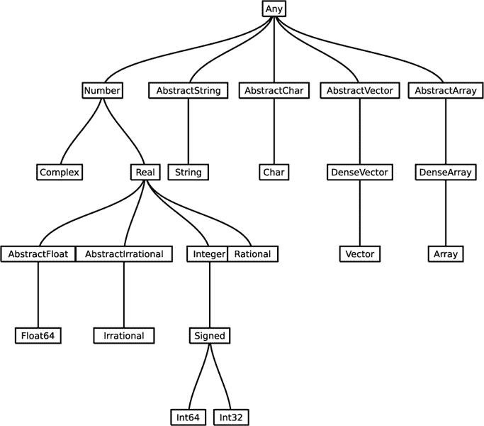

*图 8-2：几种类型之间的关系*

图 8-2 清晰地显示了 `Any` 是树的根，并提醒我们，例如，字符和字符串是不同的类型。但它也模糊了一些关系，比如某些类型是其他类型的别名。这是我们将在本章后面（参见“类型别名”章节，位于第 247 页）进一步探讨的内容。

另外两个方便探索类型层次结构的函数是 `subtypes()`，它返回作为参数传入的类型的所有*直接*子类型的向量，以及 `supertypes()`：

```
julia> supertypes(Irrational)
(Irrational, AbstractIrrational, Real, Number, Any)
```

这个例子展示了 `supertypes()` 返回一个元组，包含传入的类型及其所有的超类型。

#### ***类型断言和声明***

现在我们知道如何发现任何变量的类型以及任何类型的超类型。有时，我们还需要告诉 Julia 一个变量是某种特定类型（*类型声明*），或者一个表达式的值应该具有指定的类型（*类型断言*）。`::` 操作符根据其所在的位置执行其中的任一操作。

##### **类型断言**

有时在我们的程序中，我们会遇到一个需要确保某个特定表达式的值具有某种类型的情况。如果不是，我们希望生成一个错误，这个错误可以被处理或者允许程序终止。

Julia 中最简单的表达式是字面值。让我们以 `17` 作为第一个示例：

```
julia> 17::Number
17

julia> 17::Integer
17

julia> 17::Int64
17

julia> 17::String
ERROR: TypeError: in typeassert, expected String, got a value of type Int64
```

第一行是对 `17` 具有 `Number` 类型的断言，显然它是正确的。带有类型断言的表达式如果断言为真，则返回该表达式的值，因此这里 Julia 只是返回 `17`。接下来的两行也是正确的断言。如果类型断言指定了表达式类型的任何超类型，那么这个断言就为真。

最后的类型断言返回错误，因为 `17` 既不是 `String` 类型，也不是 `String` 类型的子类型。

这里有一个示例，展示了我们如何在程序中使用类型断言：

```
function greetings()
    println("Who are you?")
    yourname = readline();
    greeting = ("Hello, " * yourname * ".")
 ➊ return greeting::String
end
```

程序向用户提问，使用 `readline()` 接收回复，并将其与其他两个字符串连接以构造问候语，然后返回结果。我们使用了类型断言 ➊ 来确保函数返回的类型符合预期。

##### **类型声明**

我们也使用 `::` 操作符进行类型声明。它的含义取决于它在语句中的位置。

我们可以通过两种方式声明一个变量具有特定类型。第一种方式是通过声明来补充常规的赋值语句，如下所示：

```
julia> a::Int16 = 17
17

julia> typeof(a)
Int16
```

这里赋值和类型声明是同时发生的。

**注意**

*Julia v1.8 是第一个允许全局变量类型声明的版本；这使得在 REPL 中工作更加方便。在早期版本中，所有类型声明必须出现在局部作用域中。*

一旦我们声明了变量的类型，就已经确定了：

```
julia> a = "Paris"
ERROR: MethodError: Cannot `convert` an object
  of type String to an object of type Int16

julia> a::Int32 = 17
ERROR: cannot set type for global a. It already
  has a value or is already set to a different type.
```

正如这个示例所示，尝试将错误类型的值赋给已声明的变量，或显式地改变其类型，将导致错误。

赋值给 `a` 的任何值必须可以转换为 `a` 的类型 `Int16`：

```
julia> a = 32767
32767

julia> a = 32768
ERROR: InexactError: trunc(Int16, 32768)
```

第二次赋值失败是因为 32,768 大于 `Int16` 所能容纳的最大值，即 2¹⁵−1 = 32,767，这个值由 `typemax(Int16)` 返回。

Listing 8-3 显示了声明类型的另一种方式：作为 `local` 或 `global` 定义的一部分。

```
julia> global gf::Float64

julia> gf = 17
17

julia> gf
17.0 ➊

julia> typeof(gf)
Float64

julia> gf = "London"
ERROR: MethodError: Cannot `convert` an object
  of type String to an object of type Float64 ➋

julia> function weather_report(raining)
           if !(raining isa Bool) ➌
               println("Please tell us if it's raining with \"true\" or \"false\".")
               return
           else
               if raining
                   n = ""
               else
                   n = "not "
               end
               local gf::String ➍
               gf = "London"
               return("It is $(n)raining in $gf today.")
           end
        end
weather_report (generic function with 1 method)
```

*Listing 8-3：类型声明*

我们定义 `gf` 为全局变量，并且类型为 `Float64`。Julia 似乎允许我们将一个字面量整数赋值给它，但它已经在赋值过程中将该值转换为 `Float64` ➊。因为没有办法将字面量字符串转换为 `Float64`，我们尝试将一个字符串赋值给变量时失败了 ➋。

我们可以在函数内使用相同名称的局部变量，并声明为局部变量➍；这个局部变量与全局变量 `gf` 没有任何关系。函数 `weather_report()` 期望从用户那里得到一个 `Bool` 类型的值（`true` 或 `false`），并用它来构建一个关于天气的句子。它使用 `isa` 操作符来检查是否收到了正确的类型 ➌。

以下这个简短的程序演示了类型声明的一个重要行为：

```
function type_dec_demo()
    a = 17
    println("a = $a and has the type $(typeof(a)).")
    local a::Int16
end
```

运行这个函数会产生以下输出：

```
a = 17 and has the type Int16.
```

打印 `a` 类型的那一行出现在类型声明的*之前*；那么为什么 `a` 已经是一个 `Int16` 类型了呢？毕竟，在 REPL 中会发生这样的情况：

```
julia> a = 17
17

julia> typeof(a)
Int64
```

这个输出是我们预期的，因为 `Int64` 类型是 64 位机器上原生的整数类型，而 64 位架构是最常见的架构。解释是，作用域块中的类型声明（在本例中是函数定义）强制整个块内类型不可更改。声明可以在块的任何位置出现。

如果没有声明，一个变量*可以*在块内通过算术运算改变类型：

```
function changing_type_demo()
    a = 17
    println("a = $a and has the type $(typeof(a)).")
    a = a + 1.0
    println("a = $a and has the type $(typeof(a)).")
end
```

这个函数会产生如下输出：

```
a = 17 and has the type Int64.
a = 18.0 and has the type Float64.
```

允许这种情况发生可能会影响性能，关于这一点我们将在“消除类型不稳定性”一节中讨论，详见 page 242。

`::` 操作符还可以声明函数返回值的类型。例如，我们可以像这样修改 Listing 8-3 中 `weather_report()` 定义的第一行：

```
function weather_report(raining)::String
```

这条语句声明函数必须返回一个 `String` 类型的值。

这种声明的目的与变量的类型声明相同：它们从不强制要求，通常也不需要，但在某些情况下，它们可以为编译器提供额外的信息，从而帮助提高性能。我们将在“性能优化”一节中看到一些例子，详见 page 242。当我们使用函数构造表达式时，知道每个函数调用返回的类型是很有帮助的；在函数定义中使用类型声明有助于编写正确且高效的程序。

### **函数和方法：多重分派**

当我们在 REPL 中定义一个函数时，如果没有错误，我们会看到类似我们在 Listing 8-3 中看到的消息：

```
weather_report (generic function with 1 method)
```

一个通用函数由它的名称定义，在本例中是 `weather_report()`。每个通用函数可以有任意数量的*方法*与之关联，这些方法通过它们的方法*签名*来区分。签名是定义方法时，放在括号内的部分。到目前为止，这些签名包含了位置参数和关键字参数的名称及其默认值（如果有的话）。如果我们使用不同的参数集合重新定义 `weather_report()`，我们就创建了一个第二个方法。

`::`运算符的另一个用法是在方法签名中，用来指定方法参数应具有的类型。如果两个方法的定义具有相同的参数，但其中任何一个类型规范不同，那么即便签名其他部分相同，它们也定义了不同的方法。

当编译器看到函数调用时，它会调用最匹配传入参数的最具体的定义。这里我们看到我们在《类型层次结构》一章中学到的抽象类型的真正用途，在第 222 页中提到过。其他条件相同的情况下，为某个参数定义了特定类型的方法，比为该参数的超类型定义的方法更具体。

为了确定调用哪个方法，编译器会检查*所有*的参数。这个方法选择过程，或称为*分派*，因此被称为*多重分派*。它是编程语言中一个不常见但并非独特的特性，也是 Julia 强大和成功的一个主要原因。

相比之下，面向对象语言仅根据方法的第一个参数进行分派，这个参数通常隐式地作为方法所属的对象提供，并在程序中通过像`this`或`self`这样的变量表示。

函数式语言根本没有真正的分派机制。所有的特殊化都必须以在一个大函数中的替代代码路径的形式出现。

Julia 的多重分派范式意味着它既不是面向对象语言，也不是函数式语言，而是比它们更通用、更灵活的一种语言。

#### ***创建多个方法***

我们对`weather_report()`的定义包括了一个检查，确保传入的参数是正确类型，并在参数不符时采取措施，这一检查通过`if`语句块实现。我们可以通过重新启动 REPL 并将`weather_report()`的定义替换为两个具有不同签名的其他方法来消除这个检查。

```
julia> function weather_report(raining::Bool)
           if raining
               n = ""
           else
               n = "not "
           end
           gf = "London"
           println("It is $(n)raining in $gf today.")
        end

weather_report (generic function with 1 method)

julia> function weather_report(raining)
           println("Please tell us if it's raining with \"true\" or \"false\".")
           return
       end

weather_report (generic function with 2 methods)
```

在第一次定义之后，REPL 会回复与之前相同的消息，但在第二次定义后，我们会被告知`weather_report()`现在有两个方法。这两个方法的唯一区别在于，第一个方法的签名为单个参数`raining`指定了类型，而第二个没有。没有类型指定意味着编译器会接受任何类型的参数，或者换句话说，会接受`Any`类型。规则是编译器会始终选择最具体的方法来匹配提供的参数。如果我们传递一个`Bool`值（`true`或`false`），第一个方法会被选择，因为它比第二个方法更具体，因为`Bool`是`Any`的子类型。任何其他类型都会调用第二个方法，并要求传递`true`或`false`。

让我们验证这两个方法是否按预期工作：

```
julia> weather_report(true)
It is raining in London today.

julia> weather_report(17)
"Please tell us if it's raining with "true" or "false"."
```

这种创建一组方法的技术，而不是将大量类型检查代码塞进一个更大的函数，是 Julia 的更地道做法，有助于更好地组织项目，便于维护和扩展。

假设我们希望通过让程序能够评论用户提供的城市天气来扩展功能。多重分派的强大功能使我们能够简单地添加另一个方法，而无需更改我们已经编写的任何内容：

```
julia> function weather_report(raining::Bool, city::String)
           if raining
               n = ""
           else
               n = "not "
           end
               println("It is $(n)raining in $city today.")
       end

weather_report (generic function with 3 methods)

julia> weather_report(true, "Tegucigalpa")
It is raining in Tegucigalpa today.
```

如果我们尝试使用与任何现有方法的签名不匹配的参数调用`weather_report()`，我们会收到一条错误消息：

```
julia> weather_report(true, 17)
ERROR: MethodError: no method matching weather_report(::Bool, ::Int64)
Closest candidates are:
  weather_report(::Bool) at REPL[1]:1
  weather_report(::Bool, ::String) at REPL[7]:1
  weather_report(::Any) at REPL[4]:1
```

错误消息告诉我们`weather_report()`的所有方法都没有正确的签名，并列出了一些可用的方法，展示了可以用于其参数的类型。如果我们尝试添加两种不能相加的东西，例如`1 + "1"`，我们会收到类似的错误，但错误消息中提到的三种或更多的方法只是`+`运算符定义的 200 多种方法中的一小部分。要查看为任何函数定义的所有方法的列表，可以调用`methods()`：

```
julia> methods(weather_report)
# 3 methods for generic function "weather_report":
[1] weather_report(raining::Bool) in Main at REPL[1]:1
[2] weather_report(raining::Bool, city::String) in Main at REPL[7]:1
[3] weather_report(raining) in Main at REPL[4]:1
```

在这里，我们看到我们为`weather_report()`定义的方法列表及其方法签名。

#### ***通过新方法扩展内置函数***

假设我们有一个程序，它从文件或用户输入中读取数字，并将它们加到现有的数字上。读取的值将是字符串，程序必须将它们转换为数字，然后才能执行加法操作。Listing 8-4 展示了这种情况，我们可能决定通过向`+`添加一个方法来自动完成转换，从而省略显式转换步骤。

```
import Base.+
function +(a::Number, b::String)
    if Meta.parse(b) isa Number
        return a + Meta.parse(b)
    else
        return a
    end
end
```

*Listing 8-4：通过新方法扩展加法*

我们不允许扩展某些基本函数，例如`+`，除非我们首先显式地导入它们，这在第一行中完成。定义此方法后，当尝试将字符串与数字相加时，它将被分派，这通常会导致`MethodError`。如果`String`参数可以解析为`Number`，则该数字会与第一个参数相加，方法返回结果。如果不能，方法将简单地返回第一个参数。这个方法定义是抽象类型在签名中使用的一个示例。它适用于第一个参数的任何数字类型，而无需为`Number`的每个子类型编写定义。

让我们检查一下这个方法是否按预期工作：

```
julia> 1 + "16"
17

julia> 1 + "16.0"
17.0

julia> 1 + "sixteen"
1

julia> 1//2 + "3"
7//2

julia> π + "1"
4.141592653589793
```

我们通过扩展其中一个基本运算符的行为，向语言中添加了新特性。多重分派使我们能够做到这一点，而无需更改任何现有的方法。

**不要做海盗**

我们绝不会将像在清单 8-4 中定义的方法放入公共包中。这是因为我们对新方法定义中的“+”函数和数据类型不负责。导入我们包的某人可能会遇到冲突或意外行为。语言扩展的强大能力伴随着巨大的责任：违反这一期望被称为*类型盗用*。如果我们想公开我们的这个方法，我们有三个选择：给它起个别的名字，而不是“+”；让它作用于我们自己的类似字符串的数据类型；或者在 GitHub 上提交一个 Pull Request，要求将其包含到`Base`中。最后一个选项将为“+”增添一个新方法，除了当前的 207 个方法之外，所有 Julia 用户都将自动受益于我们的创作。

专门化方法不仅对创建新行为有用，有时它们是为了效率而创建的。例如，矩阵乘法或矩阵求逆等操作会产生数学上定义明确的结果（当结果存在时）；然而，对于具有特定属性的矩阵，计算该结果的专门算法可能比通用算法更高效。`SparseArrays`包（参见第 196 页中的《邻接矩阵》）提供了用于这些矩阵操作的方法，当其中一个或两个参数是稀疏数组时，这些方法会更高效。多重派发会自动选择理想的方法，当矩阵操作符传递稀疏数组时，无需用户干预。

尽管我们可以创建新的方法来做任何想做的事情，但合理的做法是让这些方法的行为在概念上与它们所属的通用函数的目的或意义相关。`+`的 200 多个方法中的每一个都与加法的概念有关，正如我们在这里定义的新方法一样。多重派发应该被视为一种代码组织的范式，而不是混乱的许可证。语言本身并不强制执行这一原则，这取决于程序员的自律。

#### ***理解联合类型和<:运算符***

有时，在构造方法时，单一的抽象类型对我们的用途来说不够通用。在这种情况下，我们可以使用`Union{}`声明一个参数可以是多个类型中的任何一个。这个操作符接受一个类型列表并构造一个新类型，包含所有这些类型。任何属于列表中类型的值都属于这个新联合类型。而且，任何是列表中某个类型的子类型的类型，也是该联合类型的子类型。

`<:` 中缀运算符是一个类型测试，如果其左侧的类型是右侧类型的子类型，则返回`true`。这个例子演示了联合类型的创建和`<:`运算符的使用：

```
julia> 17 isa Union{Number, String}
true

julia> Real <: Union{Number, String}
true
```

因为`17`是一个`Number`，所以第一个表达式返回`true`。

假设我们要编写一个作用于实数（而非整数）的函数：具有小数点的数字。我们可能会考虑在函数签名中使用类型声明，如`n::AbstractFloat`，这将包含所有具体的浮动类型，如`Float64`和`Float32`。然而，查看图 8-2 提醒我们，这个声明会排除任何作为`Irrational`提供的数字。如果用户将字面量π作为参数传入，结果将是一个`MethodError`。我们可以使用联合类型来处理这种情况：`n::Union{AbstractFloat, Irrational}`。根据函数的目的，我们还可以考虑将`Rational`添加到联合类型中。

### **用户自定义类型**

就像我们可以为自己的目的创建动词（函数和方法）一样，我们也可以创建自己的名词（数据类型）。在 Julia 中，用户自定义类型的目的是与类型的主要目的相同：围绕方法组织项目，这些方法可以根据其参数的类型进行分发。

#### ***创建抽象类型***

有时，我们不仅仅是往类型树中添加一个叶子，而是希望添加一个分支，然后创建作为叶子附加到该分支的类型。正如我们之前提到的，这些分支是*抽象*类型，我们可以通过`abstract type`声明来创建自己的抽象类型。作为示例，下面是如何创建一个从`Number`类型派生的新抽象类型：

```
julia> abstract type MyNumber <: Number end
```

执行此语句后，新的`MyNumber`类型将成为现有抽象类型`Number`的子类型（回想一下，具体类型不能被子类化）。

如果新的类型是全新的，并且不会与现有类型共享方法，那么它无需继承任何现有类型。然而，如果它是新的数字、字符串或其他现有类型的一种，最好将其适当地放入类型层次结构中。这样，现有方法（例如作用于`Number`类型的方法）将能够处理新的数字子类型。

#### ***创建组合类型***

创建新抽象类型的目的是能够将新类型定义为其子类型，这些子类型实际承载值，并在计算中被操作。这些新类型可以直接从`Any`类型派生，也可以从我们创建的抽象类型派生。

在几乎所有情况下，这些新类型将是*组合类型*，在`struct`块中定义：

```
struct EarthLocation
    latitude::Float64
    longitude::Float64
    timezone::String
end
```

组合类型通常有多个字段（但也可以只有一个）。新的`EarthLocation`类型旨在通过纬度和经度表示地球上的一个位置，并包括一个表示该位置时区的字段。字段上的类型声明是可选的；没有声明的字段将是`Any`类型。

以下代码创建了一个具有此类型的变量：

```
julia> NYC = EarthLocation(40.7128, -74.006, "ET")

julia> typeof(NYC)
EarthLocation
```

这个由 Julia 创建的函数，名称与类型相同，称为*构造函数*。如第二次交互所示，它创建了`EarthLocation`类型的值。

我们可以使用属性符号访问复合类型的字段值：

```
julia> NYC.latitude
40.7128

julia> NYC.timezone
"ET"
```

字段是按照它们在类型定义中出现的顺序赋值的。

由于构造函数是一个函数，我们可以为其定义多个方法。这里是一个处理调用者提供坐标但没有时区的情况的方法：

```
julia> EarthLocation(a, b) = EarthLocation(a, b, "Unknown")
EarthLocation

julia> someplace = EarthLocation(59.45607, -135.316681)
EarthLocation(59.45607, -135.316681, "Unknown")

julia> someplace.timezone
"Unknown"
```

当调用者只使用两个参数时，分派的方法调用原始方法，并将 `"Unknown"` 作为时区传入。这个方法本可以做任何事情，但如果将其命名为 `EarthLocation` 类型的构造函数，并且让它返回除该类型实例之外的东西，就会造成混淆。正如在“参数类型”章节的 第 248 页 中提到的，我们应该利用类型系统和多重分派来使代码更易于理解，而不是相反。

假设我们决定使用不同的约定来记录时区，并尝试对现有变量做一些修改：

```
julia> NYC.timezone = "America/New_York"
ERROR: setfield!: immutable struct of type EarthLocation cannot be changed
```

Julia 对于似乎是合理尝试给 `NYC` 的某个字段赋新值的操作。默认情况下，复合类型是不可变的，这使得编译器在某些情况下能够生成更高效的代码。如果程序需要可以改变字段值的类型，我们需要显式地使用 `mutable` 关键字来定义我们的类型：

```
mutable struct MutableEarthLocation
    latitude::Float64
    longitude::Float64
    timezone::String
end
```

使用这个定义，我们可以修改 `MutableEarthLocation` 类型的变量：

```
julia> NYC = MutableEarthLocation(40.7128, -74.006, "ET")
MutableEarthLocation(40.7128, -74.006, "ET")

julia> NYC.timezone = "US/Eastern"
"US/Eastern"

julia> NYC
MutableEarthLocation(40.7128, -74.006, "US/Eastern")
```

我们可以随意更改可变复合类型的字段值。然而，当没有必要这样做时，比如当类型表示一个不应被修改的永久对象时，通常最好在定义时不使用 `mutable` 关键字。

#### ***使用复合类型***

让我们探索一个简单的例子，展示创建自定义类型及其操作方法的有用性。我们的想法是定义几种表示圆形的类型。它们会有所不同，但因为它们都表示圆形，所以会有一些共性。我们计划编写一些针对这两种圆形类型的专用方法，至少有一个方法应该适用于这两种类型（如果我们将来扩展项目，可能适用于更多类型）。这种情况需要创建一个抽象类型来表示一般的圆形，从中派生每种复合圆形类型：

```
abstract type Circle end
```

如果我们不关心圆的位置，我们可以完全通过它的半径来定义它。考虑到这一点，我们定义我们的第一个复合圆形类型，只有一个字段：

```
struct FloatingCircle <: Circle
    r::Real
end
```

这里 `r` 代表圆的半径，可以是任意 `Real` 数字。`FloatingCircle` 类型是我们抽象 `Circle` 类型的一个子类型：

```
julia> supertypes(FloatingCircle)
(FloatingCircle, Circle, Any)
```

我们下一个圆形类型还包含关于形状在空间中的位置的信息：

```
struct PositionedCircle <: Circle
    x::Real
    y::Real
    r::Real
end
```

当然，`PositionedCircle` 也被定义为 `Circle` 的一个子类型。实数 `x` 和 `y` 用于表示其圆心的坐标。抽象的 `Circle` 类型现在有了两个子类型：

```
julia> subtypes(Circle)
2-element Vector{Any}:
 FloatingCircle
 PositionedCircle
```

到目前为止，我们所做的可能是一个几何计算包的开端。

假设下一步是编写一个计算圆面积的函数。这个面积与圆的位置无关，仅与其半径有关。因此，它应该接受抽象`Circle`类型的任何子类型，以及我们将来可能创建的任何子类型：

```
function circle_area(c::Circle)
    return π * c.r²
end
```

`circle_area()`函数的签名要求其参数类型必须是`Circle`的子类型。如果是，它将具有半径，按惯例，我们在所有圆形复合类型中将其称为`r`：

```
   julia> c1 = FloatingCircle(1)
   FloatingCircle(1)

   julia> c1.r
   1

➊ julia> circle_area(c1)
   3.141592653589793

   julia> c2 = PositionedCircle(2, 2, 1)
   PositionedCircle(2, 2, 1)

   julia> c2.x, c2.y
   (2, 2)

   julia> c2.r
   1

➋ julia> circle_area(c2)
   3.141592653589793

   julia> circle_area(17)
   ERROR: MethodError: no method matching circle_area(::Int64)
```

在确认新函数正确计算了`FloatingCircle`类型 ➊ 和`PositionedCircle`类型 ➋ 的面积之后，我们忘记了`circle_area()`只处理`Circle`的子类型，并尝试传入一个数字，这导致了`MethodError`错误。

让我们在这个几何项目中添加一个功能：一个例程，接受两个圆，并告诉我们第二个圆是否完全位于第一个圆内。

```
function is_inside(c1::PositionedCircle, c2::PositionedCircle)
    d = sqrt((c2.x - c1.x)² + (c2.y - c1.y)²)
    return d + c2.r < c1.r # true if c2 is inside c1
end
```

该函数通过使用圆心的 x 坐标和 y 坐标计算两个圆之间的距离，然后检查其中一个是否完全包含在另一个圆内，通过它们的半径来判断。当然，圆形“包含”另一个圆的概念只有在我们知道圆的位置时才有意义，因此新函数只接受`PositionedCircle`类型，并且只会有一个方法。

让我们试试：

```
julia> a = PositionedCircle(2, 2, 2)
PositionedCircle(2, 2, 2)

julia> b = PositionedCircle(1, 1, 0.5)
PositionedCircle(1, 1, 0.5)

julia> is_inside(a, b)
true

julia> c = PositionedCircle(3, 3, 1)
PositionedCircle(3, 3, 1)

julia> is_inside(a, c)
false
```

它似乎在工作，但为了确保，我们最好画个图。我们可以使用`Luxor`在一个类似于示例 7-1 的程序中绘制我们的三个圆：

```
using Luxor
@pdf begin
    origin(Point(30, 30))
 ➊ scale(100, 100)
    fontsize(0.32)
    fontface("Liberation Sans")
    setdash("solid")
    setcolor("black")
    circle(Point(2, 2), 2, :stroke)
    text("a", Point(1, 3))
    setcolor("blue")
    circle(Point(1, 1), 0.5, :stroke)
    text("b", Point(1, 1))
    setcolor("green")
    circle(Point(3, 3), 1, :stroke)
    text("c", Point(3, 3))
end 500 500 "circles.pdf"
```

`Luxor`包使用点作为长度单位，因此我们将尺寸 ➊ 扩展，以便制作出合理大小的插图。圆圈上的标签与我们之前为它们命名时使用的名称相同。图 8-3 展示了该程序创建的图示，我们可以看到`is_inside()`函数正确地计算了“包含”关系。

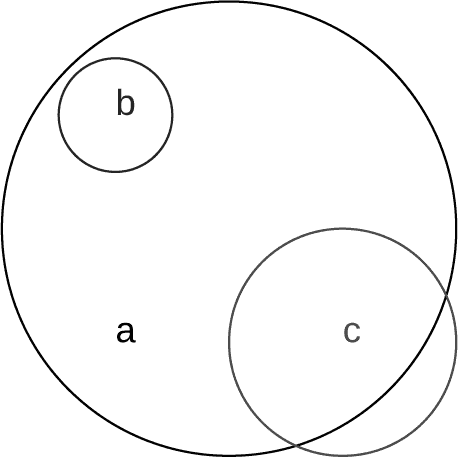

*图 8-3：圆 b 在圆 a 内，但圆 c 不在其中。*

我们知道如何强制要求用户定义类型的构造函数中使用的类型。但如果我们想限制传递给构造函数的允许值该怎么办呢？以下是如何创建一个类似我们`FloatingCircle`类型的类型，要求半径为正数：

```
struct ReasonableCircle <: Circle
    r::Real
 ➊ ReasonableCircle(r) =
        if r >= 0
            new(r)
        else
            @error("It's not reasonable to make a circle with a negative radius.")
        end
end

julia> ReasonableCircle(-12)
 Error: It's not reasonable to make a circle with a negative radius.
 @ Main REPL[4]:7

julia> ReasonableCircle(12).r
12
```

与函数类似，传递给参数的值的约束必须在函数体内进行强制。在函数体内 ➊ 的方法被称为*内构造函数*；我们之前使用的其他构造函数被称为*外构造函数*。`new()`函数用于创建实例，仅在内构造函数内使用。

那些有过类基础的面向对象语言（如 Python）经验的人，在尝试理解 Julia 中的用户自定义复合类型时，有时会暂时处于不利地位。当面对一个新概念时，我们通常会倾向于将其与我们熟悉的概念联系起来。Julia 中的复合类型并不是类；Julia 没有类，显然也没有类继承。在面向对象语言中，下一步通常是定义作为类一部分的方法：名词和动词被绑定在一起。而更加灵活的多重分发范式则将名词和动词解耦。Julia 程序员可以自由地编写作用于任何类型组合的方法，并且可以随意创建新类型，没有任何摩擦。

#### ***使用 Base.@kwdef 定义结构体***

定义复合类型的默认方法还有些不足。其主要缺点是它创建的构造函数要求程序员记住类型字段在定义中的顺序。`Base.@kwdef`宏通过创建可以使用字段名的构造函数来改进这个限制。为了便于重复使用，可以导入这个宏并重新命名为：`import Base.@kwdef as @kwdef`。

让我们通过引入一个新的类型表示椭圆，来扩展我们的几何学包，如示例 8-5 所示。这次我们将使用`@kwdef`。

```
@kwdef struct Ellipse
    axis1::Real = 1
    axis2::Real = 1
end
```

*示例 8-5：使用* @kwdef *定义一个* Ellipse *类型*

这个定义展示了`@kwdef`的第二个便利功能：我们可以为字段提供默认值。我们还可以选择使用`@kwdef mutable struct`定义一个可变的结构体。

让我们创建一个椭圆并将其赋值给一个变量：

```
julia> oval = Ellipse(axis2=2.6)
Ellipse(1, 2.6)

julia> oval.axis1, oval.axis2
(1, 2.6)
```

这个示例展示了如何为类型的关键词参数提供一个子集，未提供的参数将使用默认值。与函数类似，类型定义中没有默认值的任何关键词参数在使用构造函数时必须提供。另外，与函数类似，我们不能混合使用位置参数和关键词参数：

```
julia> Ellipse(2, 3)
Ellipse(2, 3)

julia> Ellipse(2, axis2=3)
ERROR: MethodError: no method matching Ellipse(::Int64; axis2=3)
```

由于在定义复合类型时使用`@kwdef`没有缺点，因此通常使用它非常方便。

由于 Julia 的 JIT 编译器与类型系统的工作方式，使用用户自定义类型进行计算与使用原生类型一样快。我们可以在更高的抽象层次上工作，创建一组自然符合我们问题对象的类型，而不必在性能上做出妥协。

### **性能提示**

在科学编程中，速度和效率通常是非常重要的关注点。虽然 Julia 通常可以在不需要极端专业知识或了解内部机制的情况下生成高效的代码，但良好的性能有时仍然依赖于对编译过程的理解。

我在本书的多个地方讨论了与性能相关的话题。在这里，我们将专门了解几个与类型相关的问题。

#### ***消除类型不稳定性***

*类型稳定性*也许是 Julia 中与性能相关的最重要概念。它的核心原则是，函数的返回值类型应该根据传递给函数的参数类型来预测。返回类型不应依赖于参数的*值*。其次，函数内部使用的局部变量类型也不应发生变化。

假设我们想要编写一个除法函数，当分母为`0`时返回`0`，而不是`Inf`，清单 8-6 展示了一种编写此类函数的方法。

```
function safe_divide(a, b)
    if b == 0
        return 0
    else
        return a/b
    end
end
```

*清单 8-6：此函数需要改进。*

它似乎确实按预期工作：

```
julia> safe_divide(1, 2)
0.5

julia> safe_divide(1, 0)
0
```

然而，细心的程序员可能会注意到，在第一个例子中，函数返回的是`Float64`，而在第二个例子中返回的是`Int64`：

```
julia> typeof(safe_divide(1, 2))
Float64

julia> typeof(safe_divide(1, 0))
Int64
```

两种情况下参数的类型都是整数，但结果的类型取决于它们的值。这种类型不稳定性可能并不重要。然而，一个潜在的问题在于，某一天我们可能会把`safe_divide()`函数提取到其他程序中使用，而它不同的返回类型可能会影响性能。

在更复杂的函数中，类型不稳定性可能不那么明显。在性能或内存消耗让我们怀疑某个函数可能存在此类问题时，Julia 提供了一个方便的工具来查找类型不稳定性：`@code_warntype`宏。我们可以在`safe_divide()`函数上使用它：

```
julia> @code_warntype safe_divide(1, 2)
MethodInstance for safe_divide(::Int64, ::Int64)
  from safe_divide(a, b) in Main at REPL[7]:1
Arguments
  #self#::Core.Const(safe_divide)
  a::Int64
  b::Int64
Body::Union{Float64, Int64}
1 - %1 = (b == 0)::Bool
--      goto #3 if not %1
2 -      return 0
3 - %4 = (a / b)::Float64
--      return %4
```

这是在 REPL 中可用的多个宏和函数之一，用于显示 Julia 函数的翻译版本。`@code_warntype`宏打印出一个*降级形式*的代码：这是一种将计算表示为更小操作集的形式。它是代码转换的四个阶段之一，从我们的 Julia 源代码开始，最终生成特定于我们运行的处理器的机器代码。这种降级形式类似于发送给编译器的版本，但它包含了我们可以在调试性能问题时检查的类型信息。除此之外，它并不特别有用，也不适合日常人类使用。

当在 REPL 中打印时，表示可能存在类型稳定性问题的类型信息会以红色显示，我已将其转为粗体以便在书中打印。粗体部分表明返回类型可能是`Float64`或`Int64`：换句话说，它并不由输入参数的类型决定。这是一个类型不稳定函数的标志。

幸运的是，这种情况有一个简单的修复方法：

```
function safe_divide2(a, b)
    if b == 0
     ➊ return 0.0
    else
        return a/b
    end
end
```

由于`a/b`总是一个浮动数值，即使`a`和`b`是整数，我们可以通过将整数`0`替换为`0.0` ➊，确保函数始终返回浮动数值。

为了确认我们是否解决了类型不稳定性问题，让我们再次使用`@code_warntype`：

```
   julia> @code_warntype safe_divide2(1, 2)
   MethodInstance for safe_divide2(::Int64, ::Int64)
     from safe_divide2(a, b) in Main at REPL[5]:1
   Arguments
     #self#::Core.Const(safe_divide2)
     a::Int64
     b::Int64
➊ Body::Float64
   1 - %1 = (b == 0)::Bool
   --      goto #3 if not %1
   2 -      return 0.0
   3 - %4 = (a / b)::Float64
   --      return %4
```

这次没有红色（加粗）警告，宏确认➊返回类型始终是`Float64`。

**注意**

*@code_warntype 的输出*通常还包括与*Nothing*类型联合的黄色警告，Nothing 类型表示函数没有返回结果。这些通常不被认为是类型不稳定。

我们还可以通过使用类型声明定义该函数来修正这个类型稳定性问题：

```
function safe_divide_typed(a, b)::Float64
    if b == 0
        return 0
    else
        return a/b
    end
end
```

这个版本在调用时，`b = 0`会将返回值转换为`0.0`。它将始终返回`Float64`；`@code_warntype`将验证其类型稳定性。

尽管`@code_warntype`返回的代码形式可能很难解析，但用它来扫描类型稳定性问题其实很简单。

#### ***避免更改变量类型***

让我们写一个函数，使用莱布尼茨求和公式来近似π：

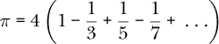

这种方法并不是获取π的好方法，因为它收敛得很慢，但它对我们的演示很有用。该函数的一个版本可能是：

```
function leibπ(N)
    s = 0
    for n in 1:N
        s += (-1)^(n+1) * 1/(2n-1)
    end
    return 4.0s
end
```

这按预期工作；图 8-4 显示它的输出逐渐收敛到正确的π值。

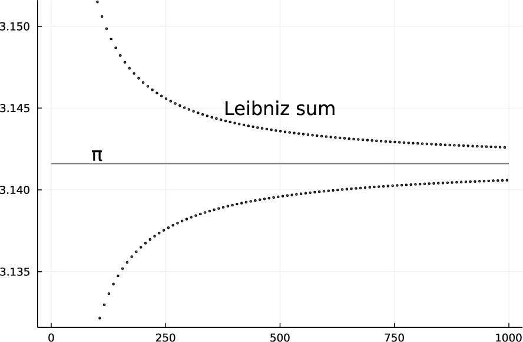

*图 8-4：莱布尼茨求和公式对π的近似值*

这个函数显然不属于之前提到的类型不稳定的情况：无论传递什么数字作为参数，输出始终是`Float64`。

然而，查看`@code_warntype`的输出会发现一个问题：

```
julia> @code_warntype leibπ(100)
MethodInstance for leibπ(::Int64)
  from leibπ(N) in Main at REPL[33]:1
Arguments
  #self#::Core.Const(leibπ)
  N::Int64
Locals
  @_3::Union{Nothing, Tuple{Int64, Int64}}
  s::Union{Float64, Int64}
  n::Int64
Body::Float64
1 -       (s = 0)
|   %2  = (1:N)::Core.PartialStruct(UnitRange{Int64}, Any[Core.Const(1), Int64])
|         (@_3 = Base.iterate(%2))
|   %4  = (@_3 === nothing)::Bool
|   %5  = Base.not_int(%4)::Bool
--       goto #4 if not %5
2   %7  = @_3::Tuple{Int64, Int64}
|         (n = Core.getfield(%7, 1))
|   %9  = Core.getfield(%7, 2)::Int64
|   %10 = s::Union{Float64, Int64}
|   %11 = (n + 1)::Int64
|   %12 = ((-1) ^ %11)::Int64
|   %13 = (%12 * 1)::Int64
|   %14 = (2 * n)::Int64
|   %15 = (%14 - 1)::Int64
|   %16 = (%13 / %15)::Float64
|         (s = %10 + %16)
|         (@_3 = Base.iterate(%2, %9))
|   %19 = (@_3 === nothing)::Bool
|   %20 = Base.not_int(%19)::Bool
--       goto #4 if not %20
3 -       goto #2
4   %23 = (4.0 * s)::Float64
--       return %23
```

再次出现的警告以加粗字体显示。它们告知我们，局部变量`s`是`Float64`和`Int64`类型的联合体，而不是单一的数值类型。这是因为我们将它初始化为字面整数`0`，但在循环中使用时，导致 Julia 将其提升为浮动类型。

更改局部变量的类型可能会导致编译器无法充分优化我们的代码。这是一个常见的错误，因为初始化变量并在`for`循环中使用它们的模式是日常操作。当这样做时，我们应该小心使用适合循环中算术运算的类型来初始化这些变量。

这个问题也很容易修复：

```
function leibπ2(N)
 ➊ s = 0.0
    for n in 1:N
        s += (-1)^(n+1) * 1/(2n-1)
    end
    return 4.0s
end
```

如之前所述，我们只需将`0`替换为`0.0` ➊。我不会在这里重复（大多数是冗余的）输出，但使用`@code_warntype`检查显示警告已经消失。

### **类型别名**

多种类型有替代名称，称为*类型别名*。使用别名是为了方便；它们通常是更短的名称，或者省略了机器指针大小的表示。例如，在 64 位计算机上，`Int`是`Int64`的另一个名称或别名，但在 32 位机器上，`Int`表示`Int32`：

```
julia> typeof(17)
Int64

julia> 17 isa Int
true

julia> Int === Int64
true
```

这表明，至少在我的计算机上，`Int`是`Int64`的另一个名称。

我们可以创建自己的类型别名：

```
julia> const F64 = Float64
Float64

julia> typeof(3.14)
Float64

julia> 3.14 isa F64
true
```

这里我们为默认的浮动点类型创建了一个替代名称。定义之后，我们可以将`F64`和`Float64`互换使用。

定义类型别名为`const`并不是必须的，但这样做是有意义的，因为它们是不会改变的某些事物的额外名称。

### **参数化类型**

参数化类型是由多个组成部分构成的类型，这些组成部分本身可以是几种可能类型中的任何一种。参数是随着组成部分类型变化而变化的变量。

示例 8-7 展示了我们已经遇到的一个参数化类型——用于复数的类型。

```
   julia> typeof(2 + 2im)
   Complex{Int64}

   julia> typeof(2.0 + 2.0im)
   ComplexF64 (alias for Complex{Float64})

   julia> typeof(2.0 + 2im)
➊ ComplexF64 (alias for Complex{Float64})

   julia> typeof(1//2 + 1//2im)
   Complex{Rational{Int64}}
```

*示例 8-7：一些复数的类型*

类型名称中的花括号（`{}`）表示我们正在处理*参数化类型*。在第一行中，我们请求的是一个使用整数字面量表示每个系数的复数类型。响应表明该复数是`Complex`类型，且参数为`Int64`；这个参数即系数的类型。

第二行告诉我们类似的信息，但这次复数具有浮点系数。此外，我们还了解了该类型的别名。

花括号内只有一个参数，表明两个系数必须具有相同的类型。这个确实成立；将浮点数和整数混合会导致整数系数自动转换为`Float64`系数 ➊。

在最后一个示例中，我们创建了一个具有`Rational`系数的复数。这次参数本身就是一个参数化类型。有理数可以由任何整数组成。`Rational{Int64}`表示分子和分母是`Int64`类型，而不是例如`Int32`类型。

集合类型，如`Array`，被定义为参数化类型，因为它们可以包含不同类型的元素：

```
   julia> typeof([1,2])
   Vector{Int64} (alias for Array{Int64, 1})

   julia> supertype(Vector)
➊ DenseVector (alias for DenseArray{T, 1} where T)

   julia> supertype(DenseVector)
   AbstractVector (alias for AbstractArray{T, 1} where T)
```

别名的使用在集合类型中很常见，如这些示例所示。我们看到，`Array`是一个参数化类型，有两个参数：第一个是数组元素的类型，第二个是维度的数量。

`where`关键字创建了一个`UnionAll`类型，它是许多类型的联合，每个类型通过将特定类型分配给类型变量`T`来定义。一个例子是`AbstractArray{T, 1}`，其中`T`表示一个抽象类型，它是`AbstractArray{Int64, 1}`、`AbstractArray{Float64, 1}`等的联合。

我们可以创建自己的参数化类型，原因与我们创建任何类型的原因相同：通过类型系统和多重分派来组织我们的方法。

让我们回顾一下示例 8-5 中的`Ellipse`类型，并将其转化为一个参数化版本：

```
@kwdef struct CEllipse{T}
    axis1::T
    axis2::T
end
```

现在，字段可以是任何类型，只要它们都是相同的类型：

```
julia> e1 = CEllipse(12.0, 17.0)
CEllipse{Float64}(12.0, 17.0)

julia> e2 = CEllipse(12.0, "Snails")
ERROR: MethodError: no method matching CEllipse(::Float64, ::String)
Closest candidates are:
  CEllipse(::T, ::T) where T at REPL[67]:2

julia> e2 = CEllipse("Clams", "Snails")
CEllipse{String}("Clams", "Snails")
```

在定义了一个新的 `CEllipse` 后，REPL 会告诉我们类型，并将 `Float64` 代入参数 `T`。我们尝试给字段设置两种不同类型失败了，因为它们在类型定义中都是 `T`。`T` 可以是任何类型，但定义要求两条坐标轴具有相同类型，因此最终的示例被接受。但是，坐标轴是任意字符串的椭圆意味着什么呢？这由我们自己决定。我们在为自己的目的创建类型，以组织我们的项目。如果我们希望限制 `CEllipse` 类型的坐标轴只能是数值类型，可以使用子类型操作符：

```
@kwdef struct CEllipse{T<:Number}
    axis1::T
    axis2::T
end
```

在定义这个结构体之前，如果我们在 REPL 中工作，并且之前的 `CEllipse` 定义仍然有效，我们必须开始一个新的会话。另一种选择是给它起一个不同的名字。

现在，一个 `CEllipse` 可以有两条相同类型的坐标轴，而且这个类型可以是任何类型，只要它是 `Number` 的子类型：

```
julia> e2 = CEllipse("Clams", "Snails")
ERROR: MethodError: no method matching CEllipse(::String, ::String)

julia> e2 = CEllipse(1//3, 1//5)
CEllipse{Rational{Int64}}(1//3, 1//5)
```

由于我们将 `T` 定义为 `Number` 的子类型，而不是更具体的 `Real` 的子类型，因此我们允许具有复数坐标轴的椭圆的可能性。在某些情况下，我们计算椭圆属性的函数需要专门处理这种情况。举个例子，我们写一个返回椭圆偏心率的函数。这是一个衡量椭圆拉长程度的指标，其中偏心率为 0 时是圆形。如果 *a* 是两轴中较长的，*b* 是较短的，那么偏心率由以下公式给出：

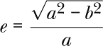

下面是将此公式直接转化为 Julia 函数的例子：

```
function eccentricity(e::CEllipse{<:Real})
    a = max(e.axis1, e.axis2)
    b = min(e.axis1, e.axis2)
    return sqrt(a² - b²)/a
end
```

这个定义适用于实数坐标轴，因此，为了确保该函数仅接受此类椭圆，它的类型参数指定了 `Real` 的子类型。

我们可以将具有复数坐标轴的椭圆视为位于复平面内。只要确保它们的坐标轴是垂直的，我们就可以这样定义椭圆。

让我们为我们的偏心率函数编写一个处理这些椭圆的方法：

```
function eccentricity(e::CEllipse{<:Complex})
    a = max(abs(e.axis1), abs(e.axis2))
    b = min(abs(e.axis1), abs(e.axis2))
    return sqrt(abs(a)² - abs(b)²)/abs(a)
end
```

`abs()` 函数在接收一个复数时返回它的长度。我们在类型参数位置使用 `<:` 操作符来包含所有可能的复数类型。

我们对具有复坐标轴的椭圆了解得更多：不仅是它们的偏心率，还有它们的方向。图 8-5 显示了复平面中的椭圆。

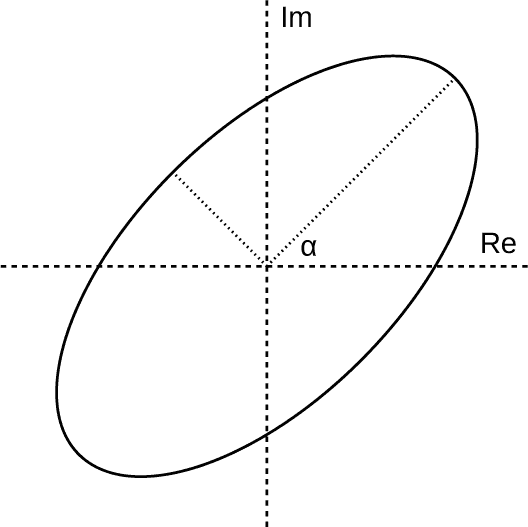

*图 8-5：复平面中的椭圆*

它的坐标轴，由虚线表示，是 2 + 2*i* 和 *−*1 + *i*。我们将定义其方向为主轴（较长轴）与实轴之间的角度，如图中所示的 *α*。

这是生成图 8-5 插图的程序：

```
using Luxor
@pdf begin
    scale(100, 100)
    fontsize(0.22)
    fontface("Liberation Sans")
    setdash("dash") # Coordinate axes
    line(Point(-2, 0), Point(2, 0), :stroke)
    line(Point(0, -2), Point(0, 2), :stroke)
    text("Re", Point(1.6, -0.1))
    text("Im", Point(0.1, -1.8))
    setdash("dot") # Ellipse axes
    line(Point(0, 0), Point(sqrt(2), -sqrt(2)), :stroke)
    line(Point(0, 0), Point(-1/sqrt(2), -1/sqrt(2)), :stroke)
    text("α", Point(0.25, -0.08))
    setdash("solid") # The ellipse
    rotate(-π/4)
    ellipse(0, 0, 4, 2, :stroke)
end 500 500 "ellipse.pdf"
```

请记住，在 `Luxor` 中，垂直坐标是从上到下的，方向与数学图表中的常规方向相反。

这个函数计算具有复数坐标轴的椭圆的方向：

```
function orientation(e::CEllipse{<:Complex})
    if abs(e.axis1) > abs(e.axis2)
        a = e.axis1
    else
        a = e.axis2
    end
    return angle(a)
end
```

由于无法为仅由实数长度给定的椭圆轴定义方向，`orientation()`函数将只有这一种方法。`angle()`函数返回一个复数的相位角；它等价于`atan(imag(a)/real(a))`。

让我们定义一个具有复数轴的椭圆，并计算其偏心率和方向：

```
julia> e45 = CEllipse(2 + 2im, -1 + im)
CEllipse{Complex{Int64}}(2 + 2im, -1 + 1im)

julia> eccentricity(e45)
0.8660254037844387

julia> orientation(e45)
0.7853981633974483

julia> orientation(e45) |> rad2deg
45.0
```

这个椭圆对应于图 8-5。`orientation()`函数以弧度为单位返回结果，因此为了更加直观，我们在最终表达式中将其转换为度数。

参数化类型使得 Julia 的强大类型系统更加灵活和富有表现力。像类型系统的其他部分一样，我们在自己的程序中不必使用任何参数化类型，但稍微使用一些可以大大帮助代码的组织、重用和效率提升。最后，了解基本的参数化类型对于理解 Julia 向我们传递的消息和信息，以及阅读语言和包的文档至关重要。

### **绘图配方**

作为程序、模块甚至包的作者，我们应该期望定期创建自己的数据类型。在 Julia 中使用自定义数据类型不会产生性能惩罚，而且它们对于编写简洁、结构良好的代码以及充分利用多重分派至关重要。

在本书的第二部分中，我们将探索来自 Julia 科学生态系统的各种包。这些包中的许多定义了一种或多种数据类型，用来描述它们所操作的对象。这些对象包括音频信号、微分方程的解、图像、带有不确定性的测量、包含互动生物的完整环境、生物本身等等。我们将发现，使用第四章中的绘图命令，我们可以直接可视化这些数据结构，而无需做任何预处理。那么，`Plots`是如何知道如何处理这些不同的数据类型的呢？

可视化是科学计算的重要组成部分。绘图*配方*系统是我们将数据类型与 Julia 的绘图系统连接起来的方式，也就是我们教它如何处理和显示我们自定义的对象。在我们第二部分中使用的科学包的作者们并不需要修改`Plots`包中的代码，而`Plots`包也无需了解这些新的数据类型。绘图配方将数据转换插入到绘图*管道*中，使得现有的绘图函数能够像处理常见的数字数组一样处理我们的数据类型。

结果是，我们的程序用户只需对新数据类型调用`plot()`、`scatter()`或其他绘图函数，就能得到合理的可视化表示。我们还可以为更复杂的可视化定义全新的绘图函数。

我们需要一个具体的应用场景来清楚地说明绘图食谱的操作。假设我们正在创建一个与天气相关的程序，并为表示每日气温和降雨数据创建一些简单的数据类型：

```
import Base.@kwdef as @kwdef
using Dates

@kwdef struct TempExtremes
    tempunit::String = "°C"
 ➊ temps::Vector{Tuple{Float64, Float64}}
end

@kwdef struct WeatherData
    temps::TempExtremes
    rainfall::Vector{Float64}
end

@kwdef struct WeatherReport
    notes::String
    location::Tuple{Float64, Float64}
    data::WeatherData
    start::Dates.Date
end
```

假设我们的气温数据以每天两个测量值的形式提供，分别表示当天的最低和最高气温。我们将把这些测量值存储在一个包含元组的向量➊中，每个元组代表一天，包含气温极值。这个元组的向量以及一个保存气温单位的字符串将被打包在`TempExtremes`数据类型中。

该数据类型与另一种名为`WeatherData`的数据类型中的降雨量测量向量一起处理。

第三种数据类型，`WeatherReport`，包含`WeatherData`以及一些备注、用于标记测量位置的经纬度对和记录测量序列开始日期的日期。

接下来，我们创建这三种数据类型的实例，以便绘制图表：

```
tmin = randn(60) .+ 15.0
tmax = tmin .+ abs.(randn(60) .+ 3.0)
td = TempExtremes(temps=collect(zip(tmin, tmax)))
wd = WeatherData(rainfall=abs.(randn(60) .* 5.0 .+ 4), temps=td)
wr = WeatherReport(notes="Rainfall and temperature extremes",
                   location=(-72.03, 45.47),
                   data=wd, start=Date(1856, 12, 31))
```

`randn()`函数生成正态分布的（参见第 323 页的“正态分布”）虚假随机气温和降雨数据。我们之前导入了`Date`模块，这样我们就可以使用其数据类型来定义一个起始日期。

#### ***绘图管道***

食谱系统由一系列四种食谱种类组成，这些种类会按顺序在绘图管道中处理，如列表 8-8 所示。

```
user recipes:
    user types => user types, numerical arrays

type recipes:
    user types => numerical arrays

plot recipes:
    numerical arrays => series
        and
    series => series

series recipes:
    numerical arrays => series
        and
    series => series
```

*列表 8-8：绘图管道*

每种食谱类型都会转换其输入，并将结果传递到管道中的下一阶段；这些转换在食谱名称后面进行标识。内置的绘图函数通常知道如何绘制数字数组，因此绘图食谱必须将我们的自定义类型转换为普通数组。前两种食谱类型，用户食谱和类型食谱，可以执行这一操作。最后两种食谱类型则接收数字数组并生成*系列*，这是表示单个向量的绘图组件，这些向量可能来自矩阵的列（在一维情况下）。

用户和绘图食谱还可以创建布局并设置整体绘图属性。我们不需要定义每一个食谱，通常也不会在任何特定的绘图任务中使用所有食谱。对于我们*已经*定义的食谱，可以单独使用它们，或者作为管道的一部分用于不同的目的。在本讨论中，我们将从管道的末尾开始，一步步向前推进，定义食谱。在这个过程中，每个示例食谱都会在我们直接调用时执行某些操作，将信息传递给先前定义的食谱，以生成图表。

#### ***系列食谱***

我们使用 `@recipe` 宏定义配方，该宏由 `RecipesBase` 包导出。该宏装饰一个函数定义，其中函数的名称是任意的。函数的签名决定了创建的配方类型。在以下列出的例子中，我们创建了两个系列配方。签名由类型以及三个额外的位置参数 `x`、`y` 和 `z` 组成，这告诉管道这些是系列配方。与往常一样，关键字参数不是用于分派的函数签名的一部分。参考 Listing 8-8，我们可以看到这些配方将接受数值数组并创建系列：

```
using RecipesBase

@recipe function f(::Type{Val{:ebxbox}}, x, y, z; cycle=7)
    if cycle <= 2; cycle = 7; end
    ymin = similar(y)
    ymax = similar(y)
    yave = similar(y)
 ➊ seriestype := :line
    for m = 1:cycle:length(y)
        nxt = min(m+cycle-1, length(y))
        ymin[m] = ymax[m] = yave[m] = NaN
        ymin[m+1:nxt] .= minimum(y[m:nxt])
        ymax[m+1:nxt] .= maximum(y[m:nxt])
        yave[m+1:nxt] .= sum(y[m:nxt]) / (nxt - m + 1)
    end
 ➋ @series begin
        y := ymax
     ➌ linecolor --> "#ff000049"
        linewidth --> 6
    end
    @series begin
        y := ymin
        linecolor --> "#0000ff49"
        linewidth --> 6
    end

    @series begin
        y := yave
        linecolor --> "#66666649"
        linewidth --> 6
    end
end

@recipe function f(::Type{Val{:temprange}}, x, y, z)
    seriestype := :line
    legend := false
    if plotattributes[:series_plotindex] == 1
     ➍ merge!(plotattributes[:extra_kwargs], Dict(:nextfr => y[:]))
        linecolor := :blue
        linewidth := 3
    elseif plotattributes[:series_plotindex] == 2
        fillrange := plotattributes[:extra_kwargs][:nextfr]
        linecolor := :red
        linewidth := 3
        fillcolor := "#45f19655"
    else
        x := []
        y := []
    end
    ()
end
```

要定义配方，我们只需要导入 `RecipesBase`。这非常重要，因为它意味着包可以在不依赖庞大的 `Plots` 包的情况下定义绘图行为。`RecipesBase` 很小，仅包含大约 400 行 Julia 代码。

使用 `@recipe` 宏定义的绘图配方使用了几种特殊的语法便利。`:=` 操作符 ➊ 在 `plotattributes` 字典中进行设置，该字典包含如线条颜色等属性—即所有绘图选项。在这里，我们将属性字典中的 `seriestype` 设置为 `:line`。这是默认的系列类型，它在绘制的点之间创建一条连续的线。另一个选项是 `:scatter`，用于绘制单个标记。实际上，熟悉的 `scatter()` 函数是 `plot(; seriestype=:scatter)` 的简写。

`-->` 操作符 ➌ 也在 `plotattributes` 字典中进行设置，但在这种情况下，它会推迟到管道中先前通过关键字参数做出的设置。从某种意义上说，这些设置是可选的，而我们使用 `:=` 做的设置对构建中的系列来说是重要的。

接下来是一个 `for` 循环，它将输入的 `y` 向量分成 `cycle` 元素的段，并计算每个段的极值和平均值。它在每个段后插入 `NaN` 来分隔这些段，以便在图中显示。

接下来是三个由 `@series` 宏 ➋ 前缀的代码块。每个 `@series` 块都会为图形创建一个新的系列。在本例中，由于我们在块外设置了 `seriestype` 为 `:line`，每个系列都将是一个 `:line` 系列，但通常它们可以是不同的类型。它们还可以创建一个 `Plots` 不认识的系列类型，在这种情况下，管道会将数据传递给定义新系列的配方。如果有多个系列配方，数据会依次通过每个配方，直到某个配方创建出一个后端能够识别的系列类型。

下一个配方设计用于接受*Ｎ*×2 矩阵。它将绘制两个列，每列作为线条，第一列为蓝色，第二列为红色。它将使用`fillrange`属性填充这两条线之间的区域。这提出了一个小问题，因为我们需要引用第一列来定义绘制第二列时的`fillrange`，但是管道对于输入数据中的每一列都会重新开始。然而，我们可以通过引用属性字典中的`:series_plotindex`键来知道当前处理的是哪一列。传递不同列之间信息的一种方法是将其塞入属性字典中的`:extra_kwargs`条目➍。我们将新属性命名为`:nextfr`。

虽然我们心里有之前定义的天气数据类型，但这些配方并不知晓这些数据类型。像所有系列配方一样，它们可以绘制任何数字数组。对于实际绘图，我们需要导入`Plots`：

```
using Plots

@shorthands temprange
@shorthands ebxbox

tl = [t[1] for t in wd.temps.temps]
th = [t[2] for t in wd.temps.temps]

temprange([tl th])

ebxbox(wd.rainfall)
plot!(wd.rainfall)
```

`@shorthands`宏由`RecipesBase`提供，它获取配方函数签名中的名称，并生成可以直接调用的函数名称，用于绘制图表。对于每一个，它都会生成两个函数，一个用于创建新图表，另一个用于向现有图表添加内容，就像`plot()`和`plot!()`一样。

在将`wd`中的温度数据转换为矩阵后，我们可以直接对其使用简写，创建图 8-6。

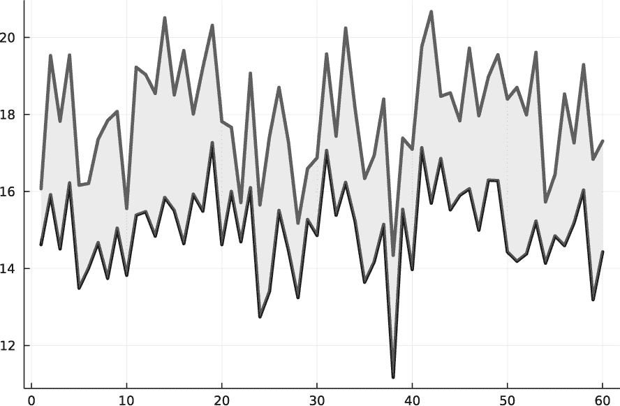

*图 8-6：由系列配方创建的填充范围*图

对于图 8-7，我们对降水量向量调用`ebxbox()`。它只绘制极值和均值条，因此我们使用`plot!()`添加该向量的常规图表。

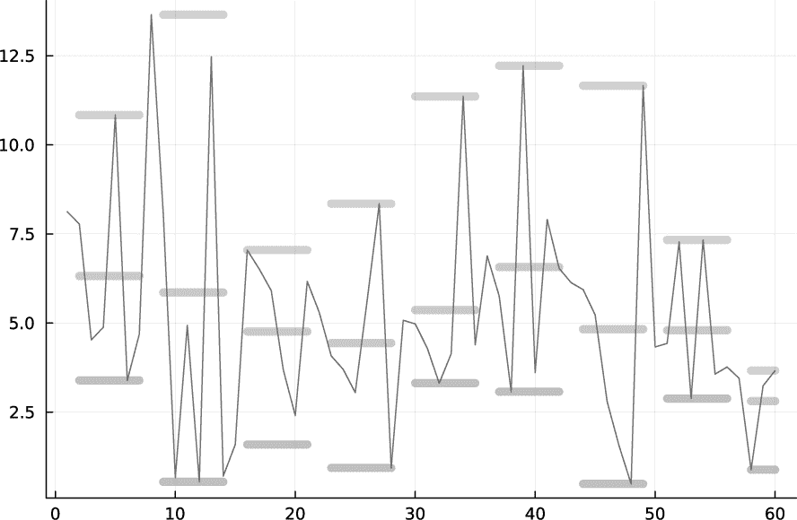

*图 8-7：使用*ebxbox*系列配方的图表*

我们可以在其他程序中使用这些系列配方，也可以作为其他管道中的组件。

#### ***绘图配方***

一种称为*绘图配方*的配方（不要与通用概念混淆）也会将系列转换为其他系列或将数值数据转换为系列，和系列配方一样，但它可以创建包含子图和其他元素的完整可视化。像所有配方一样，它由其特定的函数签名来标识：

```
@recipe function f(::Type{Val{:weatherplot}}, plt::AbstractPlot; cycle=7)
    frames = get(plotattributes, :frames, 1)
    if frames > 1 layout := (2, 1) end
 ➊ cycle := cycle
    legend := false
    @series begin
     ➋ if frames > 1
            subplot := 1
            xguide := ""
            ylabel := "Temperature (°C)"
        end
     ➌ seriestype := :temprange
    end
    if plotattributes[:series_plotindex] == 3
        @series begin
            if frames > 1 subplot := 2 end
            seriestype := :ebxbox
        end
        @series begin
            if frames > 1
                subplot := 2
                title := ""
                ylabel := "Rainfall (mm)"
            else
                ylabel := "Rainfall (mm) / Temperature (°C)"
            end
            seriestype := :line
            linecolor := :aqua
            linewidth := 3
            linestyle := :dot
        end
    end
end
```

该配方接收*Ｎ*×3 矩阵形式的输入数据。它使用我们为此目的发明的`frames`属性来决定是将所有系列放置在一个图中，还是使用两个子图➋，一个显示温度，另一个显示降水量。（与系列配方的情况一样，这个配方对我们的天气相关数据类型一无所知，因此我们也可以将其重新用于绘制其他类型的数据。）

`cycle`变量设置用于计算输入数据中第三列的极值和平均值的段长度，我们打算将其用于降水量数据。我们为此关键字参数使用 7 作为默认值，表示每周汇总。然而，如果我们在直接调用配方时或在管道的上游提供该参数，我们会通过从`plotattributes`字典中读取其值来覆盖默认值 ➊。

三个`@series`块处理前两列，包含最低和最高温度，以及第三列中的降水量。温度的`@series`块将系列类型设置为`temprange` ➌，除非我们已经为其定义了系列配方，否则该设置不起作用，正如我们之前所做的那样。

因此，这个配方的目的是使用我们在系列配方中定义的可视化效果，创建一个带有一个或两个子图的图表，并且根据情况设置适当的标签。我们也可以直接调用它，如清单 8-9 所示。

```
@shorthands weatherplot

weatherplot([tl th wd.rainfall])
```

*清单 8-9：使用数组数据调用绘图配方*

但我们现在先搁置这个问题。

#### ***类型配方***

回到清单 8-8，我们可以看到*类型配方*是管道中第一个可以接受用户自定义类型的配方。它们是最简单的一类配方。它们的任务很简单：将用户类型转换为可以直接由`Plots`中的函数绘制的数值数组，或者可以输入到管道中的后续步骤。

以下清单定义了两个类型配方；它们通过其特定的函数签名被识别为类型配方：

```
@recipe function f(::Type{TempExtremes}, v::TempExtremes)
    tmin = [t[1] for t in v.temps]
    tmax = [t[2] for t in v.temps]
    [tmin tmax]
end

@recipe function f(::Type{WeatherData}, wdt::WeatherData)
    tmin = [t[1] for t in wdt.temps.temps]
    tmax = [t[2] for t in wdt.temps.temps]
    [tmin tmax wdt.rainfall]
end
```

第一个配方获取先前定义的`*TempExtremes*`类型的实例，并返回一个包含两列的矩阵；第二个配方将`WeatherData`转换为一个三列矩阵。

定义了这些配方后，我们现在可以直接通过调用`plot(td)`或`plot(wd)`来绘制这两种类型中的任意一种。如果这样做，我们将得到简单的折线图：第一次调用得到两列数据，第二次调用得到三列数据，如图 8-8 所示。

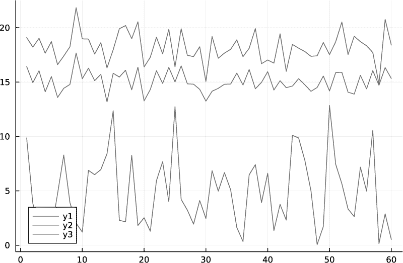

*图 8-8：直接从类型配方绘图*

我们调用`plot(wd)`来生成图 8-8。前两条线是温度极值，底部的线是降水量。

如果我们改为调用`weatherplot(wd)`，我们将得到与清单 8-9 中调用的结果完全相同的图，因为类型配方将`wd`转换为一个三列矩阵。图 8-9 显示了结果。


*图 8-9：在由类型配方转换的用户数据上调用的绘图配方*

在这里，绘图配方将两种类型的可视化效果（在系列配方中定义）组装到一个图表中，并在垂直轴上添加标签。由于我们没有定义`frames`，因此会得到默认的单帧。

#### ***用户配方***

现在我们已经登上了管道的顶端。*用户配方*不仅接受单一的用户类型，还可以接受任何类型的组合，每种不同的签名都会创建一种新的分发方法。它们可以发出数组数据或其他类型的数据，但如果它们发出的是数组数据以外的类型，我们必须定义一个类型配方来转换它们。

以下是一个用户配方的例子：

```
@recipe function f(wr::WeatherReport; frames=1)
    title := wr.notes
    frames := frames
    xlabel --> "Days from $(wr.start)"
    @series begin
        seriestype := :weatherplot
        wr.data
    end
end
```

管道会将其视为一个用户配方，因为它的签名。它接受一个 `WeatherReport` 数据类型的实例，从其 `notes` 字段创建标题，并通过引用 `start` 字段构造 x 轴的有用标签。它有一个单独的 `@series` 块，向其中传递 `data` 字段。被调用的系列是绘图配方 `weatherplot`，但 `data` 字段不是数组，它是 `WeatherData`。管道中的下一个步骤是类型配方，它处理任何类型的转换。这里，`WeatherData` 实例被转换成一个三列矩阵，并传递给 `weatherplot` 配方，后者可选地设置子图并将矩阵列传递给系列配方。调用 `plot(wr; frames=2)` 会调用这个配方并创建图 8-10。

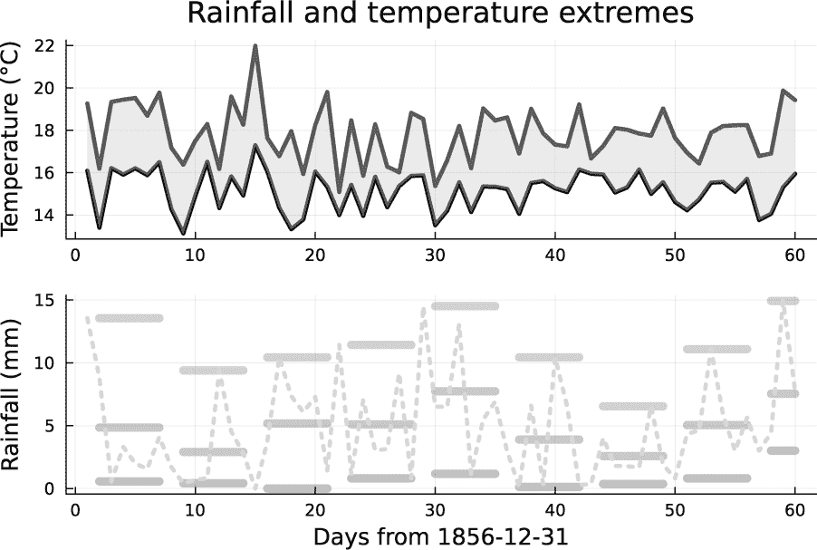

*图 8-10：调用用户配方的结果*

定义用户配方教会了 `plot()` 函数如何处理新数据类型。正如我们在本节中所看到的，我们可以在管道的任何点进入，得到不同的结果，或者将这些配方作为不同管道的一部分，重复使用来处理不同类型的数据。

#### ***@userplot 宏***

`RecipesBase` 包还导出了 `@userplot` 宏，这对于定义可视化非常方便，无需定义新的数据类型：

```
using SpecialFunctions

@userplot Risep

@recipe function f(carray::Risep)
    seriestype := :line
 ➊ x, y = carray.args
    @series begin
        label := "Real part"
        linestyle := :solid
        x, real.(y)
    end
    @series begin
        label := "Imaginary part"
        linestyle := :dot
        x, imag.(y)
    end
end

xc = 0.01:0.001:0.1
risep(xc, expint.(1im, xc); lw=2)
```

导入后的第一行创建了一个新类型，并使用其小写名称作为简写。我们使用该类型的名称定义的用户配方通过简写名称来调用。在配方内部，我们可以通过 `args` 属性 ➊ 访问绘图数据。当我们需要为现有类型的特定可视化定义一个简写名称时，`@userplot` 宏非常有用。在这种情况下，我们希望通过分离复数的实部和虚部来绘制复数，这可能比 `plot()` 默认的处理方式更有用。在定义了配方之后，我们可以直接使用其名称来调用它，如最后一行所示。`expint()` 函数是来自 `SpecialFunctions` 包的指数积分，按其第一个参数进行参数化。此处的参数将实数映射到复数。结果显示在图 8-11 中。

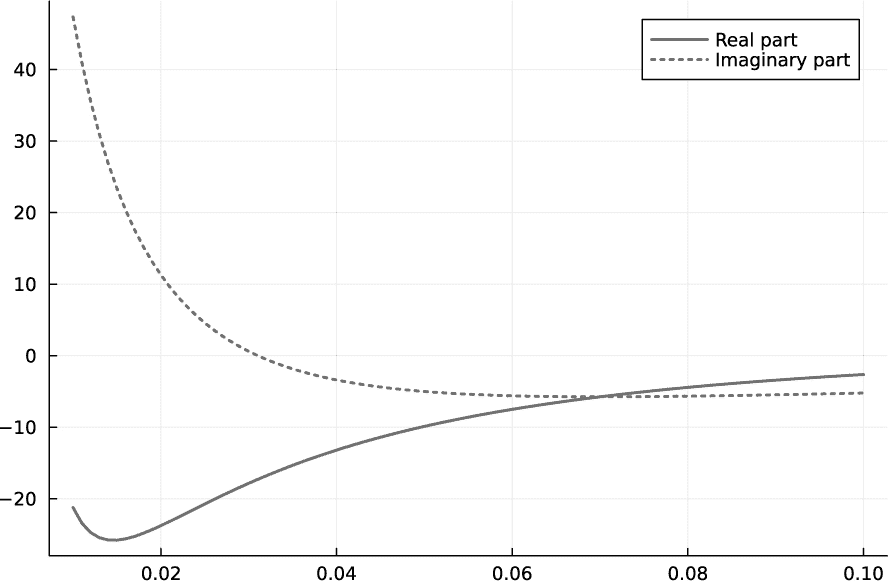

*图 8-11：使用 @userplot 渲染复数向量*

我们还可以使用 `@userplot` 宏，通过使用类型别名或子类型，为用户定义的类型创建替代的可视化。

### **结论**

通过对类型系统最重要实践方面的概述，我们对 Julia 语言的介绍已告一段落。本章以及前面的章节中的思想将在第二部分的章节中得到具体应用，我们将在那里利用 Julia 来解决各个领域中的实际问题。

然而，本书将语言学习与应用部分的划分并不是严格的。在前面的章节中，我们已经看到了一些有用的应用，而在第二部分的章节中，我们将介绍各种编程技巧和 Julia 特性，并在实际应用和解决问题的背景下更好地理解它们。

**进一步阅读**

+   关于一种类型不稳定形式对性能影响的详细信息，请访问[*https://docs.julialang.org/en/v1/manual/performance-tips/#Avoid-changing-the-type-of-a-variable*](https://docs.julialang.org/en/v1/manual/performance-tips/#Avoid-changing-the-type-of-a-variable)。

+   Dr. Chris Rackauckas 讲解了动态分派在以下情况下如何带来净收益：[ *https://discourse.julialang.org/t/why-type-instability/4013/8*](https://discourse.julialang.org/t/why-type-instability/4013/8)。这是一个类型不稳定性有益的案例。

+   关于 π 在 Julia 中的有趣信息，请访问[*https://julialang.org/blog/2017/03/piday/*](https://julialang.org/blog/2017/03/piday/)。

+   我尝试通过扩展的食谱类比来解释多重分派的文章可以在[*https://arstechnica.com/science/2020/10/the-unreasonable-effectiveness-of-the-julia-programming-language/*](https://arstechnica.com/science/2020/10/the-unreasonable-effectiveness-of-the-julia-programming-language/)找到。

+   关于优化和类型系统的详细教程，请访问[*https://huijzer.xyz/posts/inference/*](https://huijzer.xyz/posts/inference/)。

+   这里有一个用于类型层次结构可视化的包：[ *https://github.com/claytonpbarrows/D3TypeTrees.jl*](https://github.com/claytonpbarrows/D3TypeTrees.jl)。

+   另一种查找和修复类型不稳定性的方法是由`Cthulhu`包提供的：[ *https://docs.juliahub.com/Cthulhu/Dqimq/2.7.5/*](https://docs.juliahub.com/Cthulhu/Dqimq/2.7.5/)。
