## 第十章：**9  

物理学**

*物理学不是宗教。如果它是宗教，我们就更容易筹集资金了。*

—利昂·M·莱德曼


Julia 是进行各种物理计算的出色平台。它的语法特性，例如使用数学符号的能力和简洁的数组操作，使其成为编程物理算法的自然选择。Julia 的执行速度使其成为仅有的几种用于最具挑战性的大规模模拟的语言之一（其他的都是低级的、静态编译的语言）。Julia 的物理生态系统包括一些最先进的软件包。最后，Julia 独特的能力是将来自不同软件包的函数和数据类型混合搭配，创造出新的功能，这在物理计算中尤其强大，正如我们将在本章中详细看到的。

我们从介绍两个通用软件包开始，这些软件包用于处理单位和误差。这两个软件包在任何物理项目中都可能是有用的。在第一部分，我们将花一些时间研究如何生成包含轴标签中的排版单位的出版质量图表的各种选项。然后我们将转向具体的计算，首先使用一个流体动力学软件包，然后使用一个通用的微分方程求解器。有关每个主要软件包的 URL，请参见第 304 页中的“进一步阅读”。

### **通过 Unitful 将物理单位引入计算机**

在计算机上执行物理计算的传统方法是将物理量表示为浮点数，对这些数字进行一系列算术运算，然后再将结果解释为物理量。由于物理量通常不仅仅是数字，而是具有*维度*的，我们需要手动跟踪与这些量相关联的*单位*，通常通过代码注释来提醒我们这些单位是什么。

**注意**

*维度*是一个基本的物理概念，涵盖了可以被测量的东西，比如质量或时间。*单位*是衡量一个维度的具体方式。维度是普遍存在的，但有不同的单位系统。例如，对于长度维度，一些常见的单位是厘米（cm）、米（m），或者如果我们生活在美国，可能是英寸或美式足球场。

换句话说，程序中出现的数字的物理意义并不是这些量本身的一部分，而是隐含的。这可能并不令人惊讶，因为这可能导致混淆和错误。1999 年，NASA 因为两个不同的承包商分别参与设计，并且他们的工程程序使用了不同的单位系统，导致失去了一个航天器。

在传统的物理学语言中，如 Fortran，通常无法直接解决这个问题。但在 Julia 中，由于其先进的类型系统，我们不局限于无量纲数值的集合；我们可以与包含单位的更丰富的对象进行计算。

导入 `Unitful` 包后，我们可以使用非标准字符串文字（见 第 128 页 中的“非标准字符串文字”）并以 `u` 前缀引用许多常见的物理单位：

```
julia> using Unitful

julia> u"1m" + u"1cm"
101//100 m

julia> u"1.0m" + u"1cm"
1.01 m

julia> u"1.0m/1s"
1.0 m s^-1
```

在这里，我们将米和厘米相加，得到的结果是一个表示米数的有理数。该包在可能的情况下返回有理数结果，以保持执行精确转换的能力。但是，正如第二个例子所示，我们可以通过提供浮点系数来强制转换为浮点结果。第三个例子展示了我们如何在字符串文字中构造表达式。

你可以在源代码中的 GitHub 仓库的 *src/pkgdefaults.jl* 文件中找到完整的单位列表，但大多数单位遵循常见的物理学约定。每次引用单位时使用字符串文字语法可能会显得繁琐，因此我们可以将单位分配给自己的变量，以便减少输入并使代码更易读：

```
julia> m = u"m";

julia> 1m + u"1km"
1001 m
```

我们将一米加到一公里，展示了如何将自定义变量与字符串文字结合使用。结果是 1,001 米。

我们可以通过包提供的另一个函数将字符串解析为 `Unitful` 表达式（在写作时没有文档）：

```
julia> earth_accel = "9.8m/s²";

julia> kg_weight_earth = uparse("kg * " * earth_accel)
9.8 kg m s^-2
```

在这里，我们使用 `uparse()` 将一个由表示质量的字符串和另一个表示地球表面重力加速度的字符串连接起来，转换为一个表示质量重量的单位表达式。单位表达式在 REPL 中的形式本身不是可以通过 `uconvert()` 转换的合法字符串。例如，我们需要在第二行的字符串中包含乘法运算符。

#### ***使用 Unitful 类型***

我们可以通过导入 `DefaultSymbols` 子模块来访问大量标准 SI 单位，而不是一个个地定义它们。然而，这种做法会将大量名称添加到我们的命名空间中，因此如果我们只使用少数单位，可能不是一个好主意：

```
julia> using Unitful.DefaultSymbols

julia> minute = u"minute"

julia> 2s + 1minute
62 s
```

这里我们将 2 秒加到 1 分钟，结果是 62 秒。`DefaultSymbols` 子模块提供了 `s` 单位，但我们需要定义 `minute`，因为它不是 SI 单位。我们通过并列的方式使用 Julia 的乘法语法；这个表达式与 `2 * s + 1minute` 是相同的。然而，这些变量必须附加到算术表达式中的数值系数上；`2 * s + minute` 会导致 `MethodError`。

我们可以通过这两个表达式的类型找到该错误的原因：

```
julia> typeof(1minute)
Quantity{Int64, T, Unitful.FreeUnits{(minute,), T, nothing}}

julia> typeof(minute)
Unitful.FreeUnits{(minute,), T, nothing}
```

`1minute`的类型（与`1 * minute`的类型相同）是`Quantity`，而`minute`的类型是`FreeUnits`。这两种类型都在包中定义。`Unitful`包定义了接受`Quantity`类型参数的加法和其他算术运算方法，但不接受`FreeUnits`类型的参数。

这些类型包含作为粗体 Unicode 字符出现的参数。`Unitful`包使用这些字符来表示维度，因此这些类型规范告诉我们，`minute`单位具有时间维度，用`**T**`表示。

`minute`类型和其他单位是抽象类型（见第 222 页的“类型层次结构”），而诸如`1minute`这样的量化单位类型是具体类型。为了获得更好的性能，我们应该使用具体类型进行计算，并定义只包含具体类型字段的自定义类型。

#### ***剥离和转换单位***

有时我们需要从计算结果中去除单位——例如，当将结果传递给一个无法理解单位的函数时。我们可以通过`convert()`函数来做到这一点：

```
julia> convert(Float64, u"1m/100cm")
1.0
```

结果的类型是`Float64`。`Unitful`计算返回的结果可能并不总是我们预期的，因此当我们需要一个简单数字时，应使用`convert()`：

```
julia> u"1m / 100cm"
0.01 m cm^-1

julia> typeof(u"1m/100cm")
Quantity{Float64, NoDims, Unitful.FreeUnits{(cm^-1, m), NoDims, nothing}}
```

这里我们将一个长度除以另一个长度，因此结果应该是简单的数字 1.0（因为长度相等），且没有维度。实际结果等同于此，但它以一个模糊的形式表达。检查结果的类型，我们发现它是具体的`Unitful`类型`Quantity`，其类型参数表示它没有维度。

如果我们在分子和分母中使用相同的字面单位，我们会得到一个更接近我们预期的结果：

```
julia> u"1m / 2m"
0.5

julia> typeof(u"1m / 2m")
Float64
```

进一步的例子表明，`Unitful`在保留我们在表达式中使用的单位时是一致的，而不是进行物理学家可能认为显而易见的转换：

```
julia> u"1m * 1m"
1 m²

julia> u"1m * 100cm"
100 cm m
```

这两个输入表达式意味着相同的事情，但会产生以不同方式表达的等效结果。

`Unitful`中的`upreferred()`函数将表达式转换为使用标准单位集的形式。用户可以建立首选的单位系统，但默认行为是使用常规的 SI 单位：

```
julia> u"1m * 100cm" |> upreferred
1//1 m²
```

除了使用`convert()`转换为数字外，我们还可以使用`Unitful`中的`uconvert()`来进行单位之间的转换：

```
julia> uconvert(u"J", u"1erg")
1//10000000 J

julia> uconvert(u"kg", u"2slug")
29.187805874412728 kg
```

该函数的第一个参数是要转换到的单位，第二个参数是要转换的表达式。在第一个示例中，我们将能量从 ergs 转换为 joules。由于这两者是由精确比例关系相关的公制单位，`uconvert()`使用有理数系数提供答案。第二个示例是将美国的质量单位 slug 转换为千克，后者是物理学中使用的标准 SI 单位。转换因子是一个浮动的浮点数。

列表 9-1 展示了另一种方法，通过 `ustrip()` 提取 `Unitful` 表达式中的纯数字部分。

```
julia> vi = 17u"m/s"
17 m s^-1

julia> vf = 17.0u"m/s"
17.0 m s^-1

julia> ustrip(v), ustrip(vf)
(17, 17.0)
```

*列表 9-1：使用* ustrip() *去除单位*

`ustrip()` 函数在表达式中保留数值类型。

为了从 `Unitful` 表达式中提取单位，包提供了 `unit()` 函数，如 列表 9-2 所示。

```
julia> unit(vi)
m s^-1
```

*列表 9-2：使用* unit() *提取单位*

我们将在“带单位的绘图”部分的 第 276 页 中找到 `ustrip()` 和 `unit()` 的应用。

#### ***排版单位***

使用 `UnitfulLatexify` 包，我们可以将 `Unitful` 表达式转化为 LaTeX 排版的数学公式：可以是可以直接放入研究论文中的 LaTeX 源代码，也可以是渲染后的图像。以下是一个简单的例子：

```
julia> using Unitful, Latexify, UnitfulLatexify

julia> 9.8u"m/s²" |> latexify
L"$9.8\;\mathrm{m}\,\mathrm{s}^{-2}$"
```

`latexify()` 函数将地球重力加速度的 `Unitful` 表达式转换为 LaTeX 字符串。我们在 列表 4-1 中遇到过 LaTeX 字符串，当时我们用它来为图表生成标题。`UnitfulLatexify` 包结合了 `Latexify` 中的 LaTeX 能力与 `Unitful`，这就是为什么我们需要导入这三个包，就像在本示例开始时那样。

在 REPL 或其他非图形化环境中使用时，`latexify()` 生成准备好可以复制并粘贴到文档中的 LaTeX 标记。我们也可以通过将结果传递给 `render()` 函数，创建一个 PDF 图像。为了做到这一点，你需要安装外部程序 `LuaLaTeX`，它是标准 LaTeX 安装的一部分。如果该程序可用，`render()` 会使用它来排版 LaTeX 字符串，并立即通过默认的 PDF 查看器显示它。`render()` 过程会在你的临时目录中留下每个渲染表达式的文件，这是需要注意的地方。

在图形化环境中使用 `UnitfulLatexify` 时，比如在 Pluto 笔记本中，输出会以 LaTeX 的形式进行渲染，而不是 LaTeX 源代码。在大多数环境中，排版使用的是内建引擎，而不是外部程序，因此不需要额外的安装。例如，Pluto 使用 MathJax，这是一个用于 LaTeX 数学排版的 JavaScript 库。

图 9-1 显示了一个包含牛顿第二定律的 Pluto 会话。

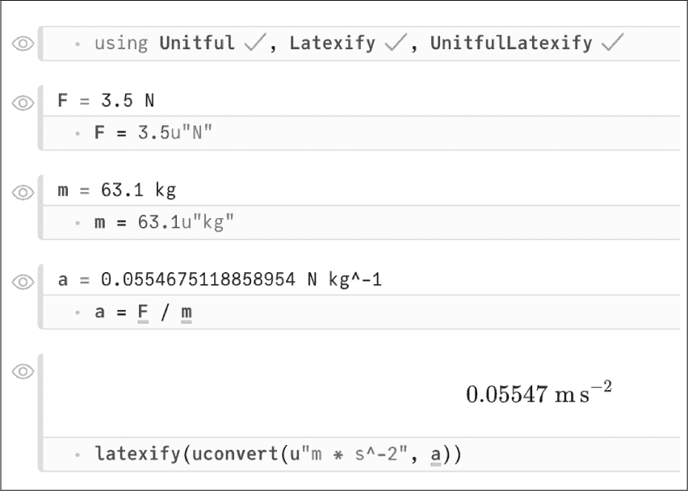

*图 9-1：在* Pluto *中使用* UnitfulLatexify

在 图 9-1 中的最后一个单元格，我们将加速度转换为更常见的单位组合，并将结果传递给 `latexify()`。排版版本作为结果出现。MathJax 提供了一个上下文菜单，当右键单击结果时，可以访问 LaTeX 源代码。

如果不喜欢在单位表达式中使用负指数，我们可以传递 `permode` 关键字，告诉 `latexify()` 使用其他样式。以下是一个例子，展示了默认选项和 `permode` 的两个选项：

```
julia> a = 0.0571u"m/s²"

julia> """
       a = $(latexify(a))

       or

       $(latexify(a; permode=:frac))

       or

       $(latexify(a; permode=:slash))

       """ |> println
a = $0.0571\;\mathrm{m}\,\mathrm{s}^{-2}$

or

$0.0571\;\frac{\mathrm{m}}{\mathrm{s}^{2}}$

or

$0.0571\;\mathrm{m}\,/\,\mathrm{s}^{2}$
```

这个例子使用了现有的`a`定义。`:frac`选项使用 LaTeX 分数，而不是负指数，`:slash`选项使用斜杠，通常对于内联数学更为合适。

将上一个列表中的输出粘贴到本书的 LaTeX 源代码中会显示渲染结果：

a = 0.0571 m s^(−2)

或者

0.0571 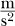

或者

0.0571 m/s²

我们可以使用`set_default(permode=:slash)`命令更改渲染单位的默认模式。

#### ***带单位的绘图***

列表 9-3 展示了`Plots`如何处理`Unitful`量。

```
julia> using Plots, Unitful
julia> mass = 6.3u"kg";
julia> velocity = (0:0.05:1)u"m/s";
julia> KE = mass .* velocity.² ./ 2;
julia> plot(velocity, KE; xlabel="Velocity", ylabel="KE",
       lw=3, legend=:topleft, label="Kinetic Energy")
```

*列表 9-3：带单位的* Unitful *数组绘图*

在这里，我们导入`Plots`，这是我们绘图所需的库，以及`Unitful`，用来处理单位。在定义了质量（以千克为单位）和一系列速度（以米每秒为单位）之后，我们根据动能公式（动能 = 1/2 质量 × 速度²）创建了一个动能数组`KE`。这个新包赋予`Plots`中的绘图函数处理带单位的量的能力，并自动将单位附加到轴标签上。图 9-2 展示了`plot()`语句的结果。

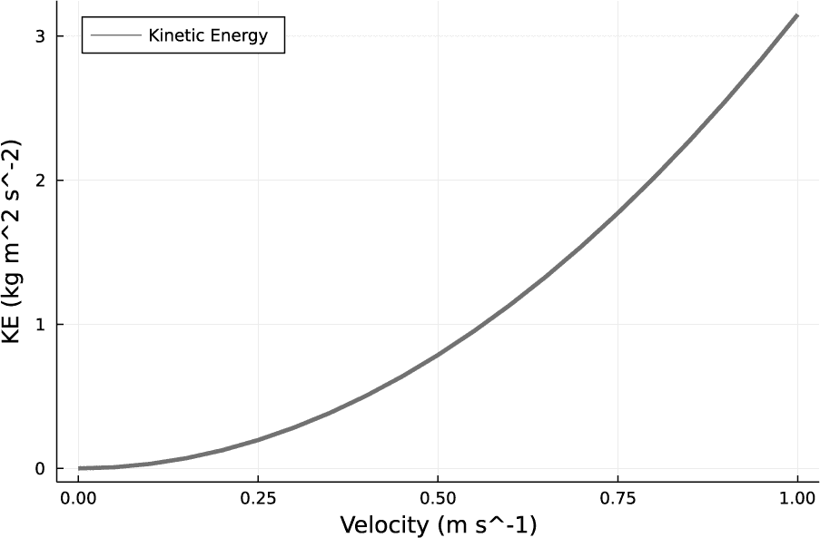

*图 9-2：* 列表 9-3 *生成的图表*

我在这个例子中没有更改能量单位，但更常见的物理学用法是使用`uconvert()`将其转换为焦耳，这可以在绘图调用之前或在`plot()`内部进行。

我们能够使用相同的`plot()`调用创建这个图表，正如我们可能用来绘制存储在没有单位的数值数组中的相同量。`Plots`中的所有绘图函数，如`scatter()`和`surface()`，都可以处理`Unitful`数组，并生成类似的轴标签。

#### ***为出版制作图表***

然而，在尝试制作高质量的出版图表时，我们会遇到一些不足之处。虽然`Plots`旨在为各种后端创建统一的接口，但每个绘图引擎的工作方式有所不同，每个引擎都有独特的功能和局限性。

当我们进行最终调整以准备图表用于出版时，这些后端之间的差异变得更加明显。例如，标签和注释中的排版细节在这一阶段变得非常重要。图 9-2 是使用`GR`后端创建的，正如在“有用的后端”部分所提到的第 115 页，该后端在写作时是默认后端，且快速且功能强大。

图 9-2 可能已经可以接受，但为了出版，我们可能需要改进其图表标签的外观，特别是让单位符号看起来像常规的数学符号。正如我们在“基于数据的 LaTeX 标题和标签定位”一节中，在 第 103 页看到的那样，我们可以在图表注释中使用带有数学内容的 LaTeX 符号。这同样适用于我们已经导入的包中的单位自动标签：

```
julia> using Plots, Unitful, Latexify, UnitfulLatexify

julia> plot(velocity, KE; xlabel="\\textrm{Velocity}",
       ylabel="\\textrm{KE}", unitformat=latexroundunitlabel)
```

这个示例重复了 清单 9-3 中的绘图命令，但做了一些修改，创建了用于绘图标签的 LaTeX 字符串。`unitformat` 关键字通过 `latexify()` 处理单位注释，值 `latexroundunitlabel` 保留了单位周围的括号。由于这会将整个标签放入 LaTeX 字符串中，因此我们还需要将标签中的非数学部分用 LaTeX 命令包裹起来，以将它们设置为常规文本，而非数学公式。

##### **GR 后端**

这种方法的结果在很大程度上依赖于我们使用的后端。显然，只有在后端能够处理 LaTeX 字符串时，使用 LaTeX 字符串才有意义。尽管默认的 `GR` 后端可以解释 LaTeX，但其结果并不总是令人满意。这个引擎包含了自己的 LaTeX 处理版本，通常会产生质量较差的排版，且字间距不准确。不过，`GR` 中的 LaTeX 引擎目前正在开发中，因此其性能可能会有所提高。

大多数情况下，标签的高质量排版需要通过外部 TeX 引擎处理，这通常涉及如 TeXLive 之类的 TeX 安装。由于许多物理学家和其他科学家已经安装了这样的 TeX 系统，我们将继续考虑那些能够利用该安装的选项。

##### **Gaston 后端**

Gnuplot 可以选择性地编译支持 `tikz` 终端，这会将图形保存为包含 TikZ 命令的文本文件。（TikZ 是一种图形语言，通常包含在大多数完整的 TeX 安装中。）这些文件通过 LaTeX 处理，并且可以包含 TeX 或 LaTeX 标记，用于图形上的注释。结果的质量非常高，字体和样式与图形所在的文档一致。不幸的是，在写作时，使用 gnuplot 的 `Gaston` 后端并不完全支持 `tikz` 终端，因此这个选项目前不可用。不过，它正在被开发中，一旦我们能够将 `Gaston` 与 `tikz` 一起使用，它将成为用于复杂图形出版或需要最佳排版质量时的最佳选择。

##### **PGFPlotsX 后端**

另一个可以利用 LaTeX 字符串的后端是 `PGFPlotsX`，它通过 `pgfplotsx()` 函数调用。该后端通过调用 LuaLaTeX TeX 引擎来创建图形，而 LuaLaTeX 是大多数 TeX 安装包中都包含的，包括 TeXLive。由于 LuaLaTeX 负责排版，因此标签的质量达到 TeX 级别。因此，这个后端是发布高质量图表的绝佳选择。如果图表包含大量元素（例如在大型散点图中），`Gaston` 可能仍然是未来处理复杂图形的最佳选择，因为通过 LuaLaTeX 处理的速度可能比通过 gnuplot 要慢得多。

##### **手动处理单位**

不幸的是，`PGFPlotsX` 与 `Unitful` 兼容性不佳，没有考虑到 TeX 处理。这一限制提供了一个展示不同方式绘制 `Unitful` 数量并用单位标签轴的机会——这种方法让我们完全控制细节。

以下代码包含了一个函数的定义，该函数接受两个 `Unitful` 数组进行绘图，并带有用于标签的关键字参数：

```
using Plots, LaTeXStrings, Latexify, UnitfulLatexify

function plot_with_units(ux, uy; xl="", yl="", label="",
                         legend=:topleft, plotfile="plotfile")

    set_default(permode=:slash)
    x = ustrip(ux); y = ustrip(uy)
 ➊ xlabel = L"$\textrm{%$xl}$ (%$(latexify(unit(eltype(ux)))))"
    ylabel = L"$\textrm{%$yl}$ (%$(latexify(unit(eltype(uy)))))"

    plot(x, y; xlabel, ylabel, lw=2, label, legend)
 ➋ savefig(plotfile * ".tex")
    savefig(plotfile * ".pdf")

end
```

使用 `ustrip()` 和 `unit()` 函数（见清单 9-1 和 9-2），这段代码将数组与其关联的单位分离，绘制数值部分，并使用单位部分通过 `LaTeXStrings` 包构建标签。

为了将值插入到 `LaTeXStrings` 字符串中，我们需要使用两个字符 `%$` 而不是简单的 `$` ➊。在从数组中提取单位时，我们需要数组元素的单位，这就是为什么在标签分配中出现了 `eltype()` 的原因。该函数会保存图形的独立 PDF 版本以及其 TeX 版本 ➋，以便将其包含在 LaTeX 文档中。

选择所需的后端后，我们调用该函数以默认名称创建 *.pdf* 和 *.tex* 文件：

```
pgfplotsx()
plot_with_units(velocity, KE; xl="Velocity", yl="K. E.")
```

图 9-3 显示了结果。

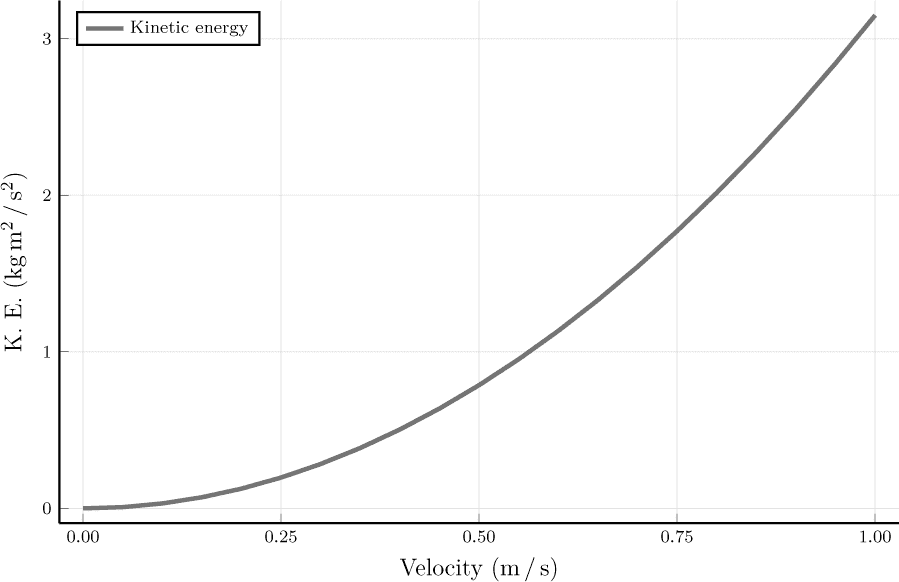

*图 9-3：A* PGFPlotsX *绘图与排版单位标签*

LuaTeX 排版提供了图 9-3 中标签的优异质量。

### **测量中的误差传播**

在前一节中，我们探讨了一个扩展数字概念以包括物理单位的包。在这里，我们将遇到 `Measurements`，这是另一个定义类似数字对象的包，适用于物理学或几乎所有经验科学中的计算。

`Measurements` 包允许我们为数字附加不确定性。所讨论的数字必须能够转换为浮点数，因此我们可以直接为 `Float64` 数字、整数和 `Irrational` 数量附加不确定性。（如果我们真的需要，还可以通过为其实部和虚部附加误差来创建带有不确定性的复数。）`Measurements` 包定义了一种新的数据类型，叫做 `Measurement{T}`，其中 `T` 可以是任何大小的浮点数。我们可以对 `Measurement` 类型执行浮点数允许的任何算术运算，误差或不确定性将使用标准线性误差传播理论传播到结果中。

以下是创建 `Measurement` 类型实例的一些例子：

```
   julia> using Measurements

   julia> 92 ± 3
   92.0 ± 3.0

   julia> typeof(ans)
   Measurement{Float64}

➊ julia> 92.0f0 ± 3
   92.0 ± 3.0

   julia> typeof(ans)
   Measurement{Float64}

   julia> 92.0f0 ± 3f0
   92.0 ± 3.0

   julia> typeof(ans)
   Measurement{Float32}

   julia> big(1227.0) ± 2
   1227.0 ± 2.0

   julia> typeof(ans)
   Measurement{BigFloat}
```

我们使用科学家熟悉的符号表示法来创建 `Measurement` 对象。我们可以在 REPL 中输入 `\pm` 操作符并按下 TAB 键，或者使用操作系统的特殊字符输入法来输入 `±` 符号。

在 REPL 中，`ans` 变量保存最近返回的结果。由于 `Measurement` 对象只有一个类型参数，因此基本数字和误差必须是相同的类型。正如 `typeof()` 调用所示，`Measurements` 根据需要提升较小的类型；`f0` 后缀是输入 32 位浮点字面量的一种方式 ➊。

该包智能地处理有效数字：

```
julia> π ± 0.001
3.1416 ± 0.001

julia> π ± 0.01
3.142 ± 0.01
```

被误差影响而变得不重要的数字不会被打印出来。

在 REPL 中打印结果时，包仅显示误差的两个有效数字，以保持整洁：

```
julia> m1 = 2.20394232 ± 0.00343
2.2039 ± 0.0034

julia> Measurements.value(m1)
2.20394232

julia> Measurements.uncertainty(m1)
0.00343
```

然而，它在内部仍然保留完整的值用于计算。我们可以使用 `value()` 和 `uncertainty()` 函数访问这些组件，正如这里所示，由于这些函数没有被导出，我们需要用包的命名空间来限定。

科学家们常常使用另一种方便的表示法，通过在最终有效数字后面加上括号中的误差来表示不确定性。`Measurements` 包也理解这种表示法：

```
julia> emass = measurement("9.1093837015(28)e-31")
9.1093837015e-31 ± 2.8e-40
```

为了使用这种表示法，我们需要使用 `measurement()` 函数并将参数作为字符串提供。我们还可以将 `measurement()` 用作 `±` 操作符的替代方法：

```
julia> m1 = measurement(20394232, 0.00343)
2.0394232e7 ± 0.0034
```

算术运算会正确传播误差：

```
julia> emass
9.1093837015e-31 ± 2.8e-40

julia> 2emass
1.8218767403e-30 ± 5.6e-40

julia> emass + emass
1.8218767403e-30 ± 5.6e-40

julia> emass/2
4.5546918508e-31 ± 1.4e-40

julia> emass/2emass
0.5 ± 0.0
```

所有这些例子都按照预期对量和它们的误差执行算术运算。更有趣的是最后一个例子，其中 `Measurements` 识别了一个没有误差的比率。该包保持了相关和独立测量的概念，这在其文档中有详细说明。请参阅 第 304 页的“进一步阅读”获取网址。

回到 示例 9-3 的例子，我们可以通过两种方式为 `Unitful` 中的质量值添加不确定性：

```
julia> using Measurements, Unitful

julia> mass = 6.3u"kg" ± 0.5u"kg"
6.3 ± 0.5 kg

julia> mass = 6.3u"kg"; mass = (1 ± 0.5/6.3) * mass
6.3 ± 0.5 kg
```

这个例子展示了 `Measurements` 和 `Unitful` 包如何协同工作，创建同时带有单位和不确定性的量。

让我们继续使用来自 示例 9-3 的例子，使用这个新的 `mass` 值：

```
julia> using Plots

julia> velocity = (0:0.05:1)u"m/s";

julia> KE = mass .* velocity.² ./ 2;

julia> plot(velocity, uconvert.(u"J", KE); xlabel="Velocity", ylabel="K.E.",
       lw=2, legend=:topleft, label="Kinetic energy")
```

尽管与之前一样，`velocity` 没有附带不确定性，但 `mass` 有；因此，`KE` 也应该包含不确定性。

图 9-4 显示了结果。

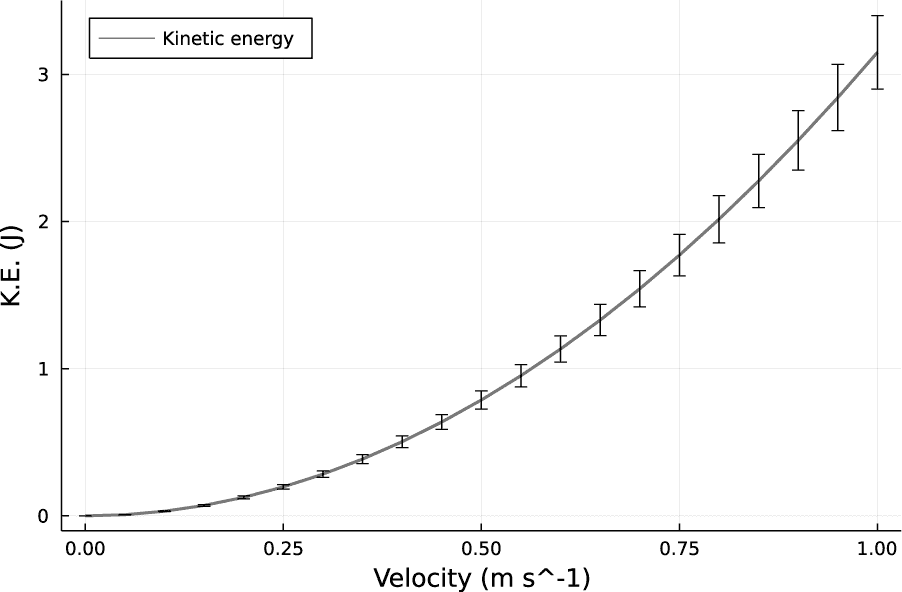

*图 9-4：带单位和误差的绘图*

图 9-4 显示了如前所述的带单位的 `Unitful` 数组图，其中坐标轴已标明单位。图中还显示了误差条，展示了动能增加时误差如何增加。我们不需要修改 `plot()` 函数的调用。某种程度上，绘图的量类型触发了绘图函数同时使用单位标签和误差条。我们在 `Plots` 中的其他绘图函数（如 `scatter()` 或 `surface()`）也会表现出相同的行为。

### **流体动力学与 Oceananigans**

`Oceananigans` 流体动力学仿真包，顾名思义，特别适用于海洋物理学。它提供了一个仿真构建工具包，可以包含温度和盐度变化、地球自转、风力等的影响。其默认设置通常表现良好，但足够灵活，用户可以指定几种可用的求解方法。它内置了各种物理模型，包括线性状态方程，但也很容易替换为用户自定义的其他模型。

#### ***物理系统***

我们打算模拟地球引力场中的二维流体层。流体层底部的温度高于顶部。这种来自底部的加热会产生对流运动，正如云层或炉子上的锅中所见。

**注意**

Oceananigans *依赖于标准库中的一些已编译的二进制文件。如果 Oceananigans 的预编译失败，并且你正在使用最近或测试版的 Julia，可以尝试使用之前的 Julia 版本（前一个主版本号）。*

底部和顶部的仿真边界是不可穿透且自由滑移的，这意味着流体可以在其上滑动。在水平方向上，我们施加了周期性边界条件，要求解答在左右边界之间进行环绕并保持一致。水平方向是 *x* 轴，垂直方向是 *z* 轴。我们将流体初始设为静止，并且对温度差异所产生的运动模式感兴趣。

图 9-5 显示了仿真系统的设置。灰色区域代表流体，粗黑色水平线表示恒温边界。

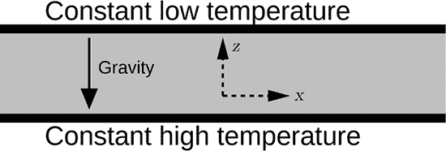

*图 9-5：仿真框*

创建此图表的 `Luxor` 程序（见 第 190 页的“使用 Luxor 绘图”）可以在在线补充资料的物理学部分找到，网址为 [*https://julia.lee-phillips.org*](https://julia.lee-phillips.org)。

一个流体动力学模拟包含许多部分，我们需要分别构建它们，然后才能开始计算。在接下来的小节中，我们将定义计算网格、边界条件、扩散模型和状态方程，并按此顺序建立边界条件和流体动力学模型。所有部分就绪后，我们将运行`Oceananigans`模拟并可视化结果。

#### ***网格***

为了构建一个`Oceananigans`模拟，我们将使用该软件包导出的函数来定义其各个组件，然后使用`model()`函数定义一个模型，并将组件作为参数传递。对于这个例子，我们将使用一个`grid`，一个指定流体状态方程的`buoyancy`模型，一组边界条件，粘度和热扩散率的系数（流体的物理属性），以及流体内部的温度初始条件。我们不会包括地球自转、盐度或风的影响，但这些因素可以在其他`Oceananigans`模型中使用。

网格由其计算`size`（每个方向上有多少网格点）、`extent`（这些方向所表示的物理长度）以及其`topology`（`Oceananigans`用于表示每个方向上的边界条件的术语）定义。对于我们的问题，我们这样定义网格：

```
julia> using Oceananigans

julia> grid = RectilinearGrid(size=(256, 32);
              topology=(Periodic, Flat, Bounded),
              extent=(256, 32))
 256×1×32 RectilinearGrid{Float64, Periodic, Flat, Bounded} on CPU with 3×0×3 halo
|-- Periodic x ∈ [0.0, 256.0)     regularly spaced with Δx=1.0
|-- Flat y
-- Bounded  z ∈ [-32.0, 0.0]      regularly spaced with Δz=1.0
```

`Oceananigans`提供的`RectilinearGrid()`函数构建网格，这是该软件包中定义的多种数据类型之一。我们将网格赋值给我们自己的变量`grid`，以便在创建模型时使用。我们本可以为这个变量选择任何名称，但`grid`是模型构建函数接受的相关关键字参数的名称；为我们自己的变量使用相同的名称会使一切保持整洁。

在`topology`关键字参数中，我们列出了在*x*、*y*和*z*方向上的边界条件，其中*z*方向指向上方。边界条件`Flat`意味着我们没有使用（在这种情况下）*y*方向。这个调用定义了一个二维的*x*–*z*网格，其中*x*方向是周期性边界，*z*方向是不可穿透的边界。`Oceananigans`使用千克-米-秒单位制。因为我们将`extent`设置为等于`size`，所以网格间距在每个方向上为一个单位长度，给我们提供了一个宽 256 米、高 32 米的流体层。

如示例所示，`Oceananigans`在 REPL 中有用于表示其数据类型的有用形式，总结了我们检查时需要的关键信息。这里的输出为我们提供了网格参数和边界条件的摘要。

#### ***边界条件***

我们将任何物理变量的边界条件定义为单独的组件，最终也会传递给`model()`。我们希望在上下边界上施加常数温度值；`Oceananigans`使用`FieldBoundaryConditions()`函数设置这种类型的边界条件，因为它设置了在这种情况下温度场的边界条件。我们可以使用`Oceananigans`提供的`top`和`bottom`的便捷定义，它们具有直观的含义（还有`north`、`south`、`east`和`west`，但在这个问题中我们不需要用到它们）：

```
julia> bc = FieldBoundaryConditions(
               top=ValueBoundaryCondition(1.0),
               bottom=ValueBoundaryCondition(20.0))
Oceananigans.FieldBoundaryConditions, with boundary conditions
|-- west: DefaultBoundaryCondition (FluxBoundaryCondition: Nothing)
|-- east: DefaultBoundaryCondition (FluxBoundaryCondition: Nothing)
|-- south: DefaultBoundaryCondition (FluxBoundaryCondition: Nothing)
|-- north: DefaultBoundaryCondition (FluxBoundaryCondition: Nothing)
|-- bottom: ValueBoundaryCondition: 20.0
|-- top: ValueBoundaryCondition: 1.0
-- immersed: DefaultBoundaryCondition (FluxBoundaryCondition: Nothing)
```

`immersed`边界指的是存在于流体体积内部的边界，但我们不使用这个边界，也不使用其他任何复杂的选项，比如定义的梯度或通量。我们使用的`ValueBoundaryCondition`设置了在指定边界上某个变量的常数值。

#### ***扩散率***

我们需要为描述流体材料属性的两个常数赋值，这是问题定义的一部分。粘度系数(*ν*)决定了流体的“稠密”程度，热扩散率(*κ*)决定了它传导热量的速率。这些值通过`closure`关键词传递给模型，并可以通过`ScalarDiffusivity()`函数进行设置：

```
julia> closure = ScalarDiffusivity(ν=0.05, κ=0.01)
```

粘度的符号是希腊字母*nu*，而热扩散率的符号是*kappa*。像所有希腊字母一样，我们可以在它们的名称前加上反斜杠，然后按 TAB 键在 REPL 中输入它们。

#### ***状态方程***

状态方程是一个函数，用于描述流体在任何点的密度如何依赖于该点的温度和盐度（在`Oceananigans`模型中，通常假设*不可压缩性*意味着密度不依赖于压力）。我们的模型是无盐的，但当流体变热时，它会变得更轻。这就是流体会运动的原因，较轻的部分会上升，而较重的部分则会下沉，受到重力的驱动。

`model()`函数期望关键词`buoyancy`，所以我们也会使用它：

```
julia> buoyancy = SeawaterBuoyancy(equation_of_state=
                  LinearEquationOfState(thermal_expansion=0.01,
                  haline_contraction=0))
SeawaterBuoyancy{Float64}:
|-- gravitational_acceleration: 9.80665
-- equation of state: LinearEquationOfState(thermal_expansion=0.01, haline_contraction=0.0)
```

`Oceananigans`提供了许多其他选项，包括定义我们自己的状态方程的能力，但我们会保持模型的简单性。`SeawaterBuoyancy`组件通过将重力（此处给出的默认地球值）与密度变化相结合来处理浮力。由于我们不关心盐度效应，我们将`haline_contraction`设置为 0（“haline”实际上是海洋学家用来表示盐度的同义词）。

#### ***模型与初始条件***

现在我们已经设置好了所有的组成部分，我们可以将它们结合成一个*模型*，这是`Oceananigans`定义计算问题的术语，包括所有的物理内容、网格和边界条件：

```
julia> model = NonhydrostaticModel(;
                  grid, buoyancy, closure,
                  boundary_conditions=(T=bc,), tracers=(:T, :S))
NonhydrostaticModel{CPU, RectilinearGrid}(time = 0 seconds, iteration = 0)
|-- grid: 256×1×32 RectilinearGrid{Float64, Periodic, Flat, Bounded}
 ➊ on CPU with 3×0×3 halo
|-- timestepper: QuasiAdamsBashforth2TimeStepper
|-- tracers: (T, S)
|-- closure: ScalarDiffusivity{ExplicitTimeDiscretization}
    (ν=0.05, κ=(T=0.01, S=0.01))
|-- buoyancy: SeawaterBuoyancy with g=9.80665 and
    LinearEquationOfState(thermal_expansion=0.01, haline_contraction=0.0)
    with -ĝ = ZDirection
-- coriolis: Nothing
```

该包打印了结果的简洁摘要，包括提醒一些我们未使用的特性（但并非所有），比如地球自转产生的科里奥利力。

`NonhydrostaticModel()` 函数使用适合我们问题的近似方法来创建模型。`Oceananigans` 提供了其他几种选择，包括模拟表面波的静力学模型。

我们使用了“关键字参数简洁语法”中解释的简化形式，详见第 154 页。

我们的边界条件 `bc` 并不指向任何特定的物理变量；它仅仅是在边界上定义一个常数场值。分配给 `boundary_conditions` 的命名元组会在 `T` 上强制执行这些条件，`T` 是 `Oceananigans` 中用于表示温度的变量。

打印结果提到的 CPU ➊，意味着该模型适用于“普通”机器架构。另一种选择是使用 GPU（图形处理单元）进行计算。`halo` 指的是数值算法用来强制执行边界条件或其他约束的物理网格外的几个点。

最后的关键字参数 `tracers` 告诉模型在流体中跟踪温度和盐度等标量场的输送。尽管我们的状态方程意味着它不会产生任何影响，但我们仍然需要包括 `:S`。

我们模型中由下方加热的流体层在物理上是*不稳定*的，这意味着对其初始静止状态的一个小扰动将被放大，并发展成一种具有持续运动的状态，这种运动由温度差和引力场驱动。我们要研究的正是这种不稳定性的发展。我们需要加入小的扰动，否则，即使系统不稳定，它也永远不会移动。

`set!()` 函数让我们可以在任何字段上创建所需的初始条件。我们将使用它在整个流体体积中对温度场添加一个小的随机扰动：

```
julia> tper(x, y, z) = 0.1 * rand()
tper (generic function with 1 method)

julia> set!(model; T = tper)
```

该函数的拼写中有一个感叹号，提醒我们它会修改其参数：它会就地更改 `T` 字段，也会更改模型。

#### ***仿真***

接下来，我们需要使用 `Simulation()` 函数创建一个*仿真*。这个对象将接收模型作为位置参数，并接收时间步长和停止计算时间的关键字参数。它会跟踪仿真时间和墙钟时间的经过情况，以及所有物理场的状态。这使得我们可以在请求的开始时间之后继续仿真，保存仿真进度到文件，并检索字段进行检查和绘图。

```
julia> simulation = Simulation(model; Δt=0.01, stop_time=1800)
Simulation of NonhydrostaticModel{CPU, RectilinearGrid}(time = 0 seconds, iteration = 0)
|-- Next time step: 10 ms
|-- Elapsed wall time: 0 seconds
|-- Wall time per iteration: NaN years
|-- Stop time: 30 minutes
|-- Stop iteration : Inf
|-- Wall time limit: Inf
|-- Callbacks: OrderedDict with 4 entries:
|   |-- stop_time_exceeded => Callback of stop_time_exceeded on IterationInterval(1)
|   |-- stop_iteration_exceeded => Callback of stop_iteration_exceeded on IterationInterval(1)
|   |-- wall_time_limit_exceeded => Callback of wall_time_limit_exceeded on IterationInterval(1)
|    -- nan_checker => Callback of NaNChecker for u on IterationInterval(100)
|-- Output writers: OrderedDict with no entries
-- Diagnostics: OrderedDict with no entries
```

这是一个简单的调用，因为 `model` 已经包含了问题的所有细节。我们会得到仿真各种选项的摘要，大部分我们并没有使用。如果你想在 REPL 中使用*时间间隔的增量*，输入 \Delta 并按 TAB 键。

在运行模拟之前，让我们安排在定期的时间间隔内将速度和温度字段存储到磁盘上，这样我们就可以查看它们随时间的发展（如果不这样做，我们只能看到模拟的最终状态），如列表 9-4 所示。

```
julia> simulation.output_writers[:velocities] =
              JLD2OutputWriter(model, model.velocities,
              filename="conv4.jld2", schedule=TimeInterval(1))
 JLD2OutputWriter scheduled on TimeInterval(1 second):
|-- filepath: ./conv4.jld2
|-- 3 outputs: (u, v, w)
|-- array type: Array{Float32}
|-- including: [:grid, :coriolis, :buoyancy, :closure]
-- max filesize: Inf YiB

julia> simulation.output_writers[:tracers] =
              JLD2OutputWriter(model, model.tracers,
              filename="conv4T.jld2", schedule=TimeInterval(1))
 JLD2OutputWriter scheduled on TimeInterval(1 second):
|-- filepath: ./conv4T.jld2
|-- 2 outputs: (T, S)
|-- array type: Array{Float32}
|-- including: [:grid, :coriolis, :buoyancy, :closure]
-- max filesize: Inf YiB
```

*列表 9-4：设置输出写入器*

将元素添加到 `simulation` 的 `output_writers` 属性中会导致它定期存储结果。`JLD2OutputWriter` 使用 `JLD2` 文件格式，这是将多个 Julia 数据结构存储在一个文件中的紧凑方式。它是广泛应用于计算科学中的 `HDF5` 格式的一个版本。`schedule` 每秒进行一次数据转储，使用我们的时间步长，这将是每 100 步一次。结果中的信息显示将保存哪些量：`T` 和 `S` 分别是温度和盐度。

这样，我们就准备好运行计算了：

```
julia> run!(simulation)
 Info: Initializing simulation...
[ Info:     ... simulation initialization complete (6.850 ms)
[ Info: Executing initial time step...
[ Info:     ... initial time step complete (80.507 ms).
```

REPL 在计算达到最终时间步之前不会有任何输出，在此情况下，通常需要几个小时才能在个人计算机上完成。计算完成后，它会指示计算结束并返回交互式提示。[第十五章探讨了通过并行处理加速此类计算的方法。

#### ***结果***

当一个 `Oceananigans` 模拟结束时，字段的最终状态（此例中为速度分量和温度）作为 `model` 的属性可用。列表 9-5 展示了如何检索它们。

```
julia> using Plots

julia> uF = model.velocities.u;

julia> TF = model.tracers.T;

julia> heatmap(interior(TF, 1:grid.Nx, 1, 1:grid.Nz)';
               aspect_ratio=1, yrange=(0, 1.5grid.Nz))
```

*列表 9-5：检查模拟结果*

速度和温度字段是模型的属性。`heatmap()` 调用将绘制二维温度场，但首先我们需要使用 `interior()` 函数将其转换为数组。此函数将 `Oceananigans` 字段转换为数值数组，并去除 `halo` 点。它的参数，在要转换的字段之后，是三个方向上网格的范围；我们输入 `1` 来表示未使用的坐标。在设置 `yrange` 时，我们访问了字段的另一个属性，即网格形状。数组后面的撇号会将其转置，以便它呈现出自然的方向，带有垂直的重力。

我们通常会先运行几个时间步的模拟，并以这种方式检查字段，然后再进行长时间的计算，以确保我们正确设置了模拟。如果我们想在经过更多时间步后再查看一次，可以这样做：

```
julia> simulation.stop_time+=10;

julia> run!(simulation);
```

这些命令将模拟推进额外的 10 个时间步，之后我们可以重复列表 9-5 中的步骤，看看进展如何。

现在返回到存储在文件中的量，如列表 9-4 所示，列表 9-6 展示了如何检索字段的整个历史。

```
julia> uF = FieldTimeSeries("conv4.jld2", "u")
256×1×32×1030 FieldTimeSeries{InMemory} located at
    (Face, Center, Center) on CPU
|-- grid: 256×1×32 RectilinearGrid{Float64, Periodic, Flat, Bounded}
    on CPU with 3×0×3 halo
|-- indices: (1:256, 1:1, 1:32)
-- data: 256×1×32×1030 OffsetArray(::Array{Float64, 4},
    1:256, 1:1, 1:32, 1:1030) with eltype Float64 with
 indices 1:256×1:1×1:32×1:1030
    -- max=7.66057, min=-7.88889, mean=2.79295e-11
```

*列表 9-6：从 JLD2 文件中检索字段*

结果的摘要显示，`FieldTimeSeries` 的维度为 256×1×32×1,030，这意味着它定义在一个 2D 的 256×32 网格上，并在 1,030 个时间步长中演化。

在这个调用之后，整个 *x* 速度场及其各种属性都可以方便地访问。数据结构 `uF` 本身几乎不占用任何空间：

```
julia> sizeof(uF)
544
```

`sizeof()` 函数返回其参数所占用的存储空间（以字节为单位）。实际数据占用的空间为 256 × 32 × 1,030 × 8 = 67,502,080 字节。

我们可以绘制任何时间步长的水平速度场：

```
julia> using Printf

julia> i = 50;

julia> h50 = heatmap(interior(uF[i], 1:grid.Nx, 1, 1:grid.Nz)';
               aspect_ratio=1, yrange=(0, 1.5grid.Nz),
               colorbar=:false, ylabel="z",
               annotations=[
                  (0, uF.grid.Nz+15,
                    text("Horizontal velocity at timestep $i", 12, :left)),
                  (0, uF.grid.Nz+5,
                    text((@sprintf "Max = %.3g" maximum(uF[i])), 8, :left)),
                  (100, uF.grid.Nz+5,
                    text((@sprintf "Min = %.3g" minimum(uF[i])), 8, :left))],
                  grid=false, axis=false)
```

我们在清单 9-5 中的版本上添加了一些标注，使用从字段中读取的属性对图形进行注解。为时间步长 100 和 500 创建类似的图形，给最后一个添加 `xlabel`，然后使用 `plot(h50, h100, h500; layout=(3, 1))` 将它们组合起来，生成图 9-6 中的图形。

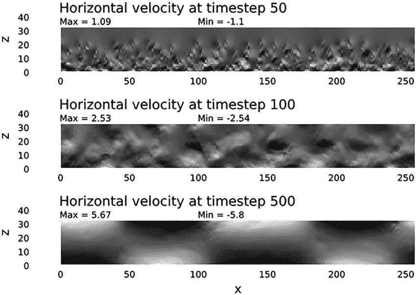

*图 9-6：Oceananigans 仿真结果*

系统展现了所谓的*湍流对流*状态；观察从随机性中出现的大尺度秩序及其与湍流流动的持久共存非常有趣。

为了制作仿真的动画，我们需要在相等的时间间隔生成图形，并将它们拼接成一个视频文件。我们的仿真使用了常量时间步长，因此在这种情况下，相等的时间间隔意味着相等的时间步长数量。然而，这并不总是如此。`Oceananigans` 提供了自动调整时间步长的选项，我们可能会在不同的阶段进行仿真，使用不同大小的 Δ*t*。因此，拥有一个根据 *时间* 创建图形的函数非常方便。由于给定的时间可能不对应于任何特定的存储字段，可能会落在两个连续数据存储之间，我们需要一个函数来确定最接近请求时间的存储字段。清单 9-7 中的 Julia 程序获取仿真输出并生成指定持续时间的动画。

```
using Oceananigans, Reel, Plots

function heatmap_at_time(F, time, fmin, fmax, duration)
    ts = F.times
    time = time * ts[end]/duration
    i = indexin(minimum(abs.(ts .- time)), abs.(ts .- time))[1] ➊
    xr = yr = zr = 1
    if F.grid.Nx > 1
        xr = 1:F.grid.Nx
    end
    if F.grid.Ny > 1
        yr = 1:F.grid.Ny
    end
    if F.grid.Nz > 1
        zr = 1:F.grid.Nz
    end
    heatmap(interior(F[i], xr, yr, zr)'; aspect_ratio=1, yrange=(0, 1.5F.grid.Nz),
            clim=(fmin, fmax)) ➋
end

uF = FieldTimeSeries("conv4.jld2", "u")
const fmin = 0.5minimum(uF) ➌
const fmax = 0.5maximum(uF)
const duration = 30

function plotframe(t, dt)
    heatmap_at_time(uF, t, fmin, fmax, duration)
end

uMovie = roll(plotframe; fps=30, duration)

write("uMovie.mp4", uMovie)
```

*清单 9-7：创建一个 Oceananigans 仿真动画*

`heatmap_at_time()` 函数完成了所需的操作，在其参数中最接近的时间点创建了热力图。在这个函数中，`F` 是通过调用 `FieldTimeSeries()` 获取的字段，如清单 9-6 所示。它利用了这些对象的 `times` 属性，该属性是一个数组，包含了该字段被保存的所有时间点。索引 `i` 保存了与提供的 `time` ➊ 最接近的时间点对应的数据。当制作热力图动画时，我们希望每一帧中的值到颜色的映射保持一致，因此我们对 `heatmap()` 的调用使用了 `clim` 关键字 ➋。

有了这个功能，我们可以使用在第 206 页的“使用 Reel 制作动画”中介绍的`Reel`包来创建动画。为了使用该包，我们需要定义一个关于时间`t`的函数，并使用（未使用的）`dt`，该函数返回与`t`相对应的绘图：`plotframe()`函数。脚本中的三个常数 ➌ 设置了基于数据和动画总时长的调色板限制。调色板限制经过缩放，使得在运行的初期可以看到更多细节，但我们可以根据感兴趣的特征进行调整。

**注意**

*查看在线补充内容，了解生成的动画，以及图表的全彩图版，链接见* [`julia.lee-phillips.org`](https://julia.lee-phillips.org) *。*

最后的调用将动画保存为 MP4 文件。`Reel`支持的其他选项包括`gif`和`webm`。要创建这些文件类型，我们只需使用适当的文件扩展名。

### **使用 DifferentialEquations 求解微分方程**

自 18 世纪以来，微分方程一直是物理科学和工程学，以及其他科学定量分析的语言。Julia 的`DifferentialEquations`包是一个强大、先进的工具，用于使用多种方法求解许多类型的微分方程。它还结合了关于机器学习的最新研究，以选择解决给定方程的最佳方法。

本节通过解决一个示例问题介绍了如何使用`DifferentialEquations`。有兴趣的读者可以深入查阅其详细文档获取更多信息（请参阅第 304 页的“进一步阅读”）。

#### ***定义物理问题及其微分方程***

作为示例，我们来研究摆锤问题。图 9-7 展示了问题的图示，并定义了弦长(*L*)和角度(*θ*)。


*图 9-7：摆锤系统*

我们从竖直参考线开始逆时针测量*θ*，该线在图中为虚线，重力加速度指向下方。

**注意**

*生成该图表的* Luxor *程序可在在线补充内容的物理章节代码部分找到，链接见* [`julia.lee-phillips.org`](https://julia.lee-phillips.org)*。*

通过对摆锤摆球（图中的黑色圆圈）上的力进行简单分析，并应用牛顿第二定律，得到微分方程

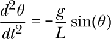

这是在任何基础通用物理教材中得出的。在这里，*t*是时间，*g*是重力加速度。通常的下一步是将问题限制在小角度（≲ 5°）范围内，此时 sin(*θ*) ≈ *θ*，并求解得到简谐运动的差分方程。我们将使用`DifferentialEquations`包数值求解“精确的”摆动方程。我们将能够检查任何初始*θ*的解，直到π弧度。

该包处理一阶方程组，这意味着差分方程仅限于未知函数的一阶导数。因此，为了处理摆动方程，我们首先需要将其转化为两个耦合的一阶方程的形式。这一步也是许多解析解法的一部分。我们可以通过定义一个新变量轻松进行：

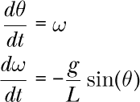

现在我们要求解两个随时间变化的函数，角度*θ*(*t*)和角速度*ω*(*t*)。

#### ***设置问题***

将数学问题转化为`DifferentialEquations`能处理的形式的第一步是定义一个有四个位置参数的 Julia 函数：

du   解的导数数组

u   解函数的数组

p   参数数组

t   时间

列表 9-8 是摆动问题的版本。

```
function pendulum!(du, u, p, t)
    L, g = p
    θ, ω = u
    du[1] = ω
    du[2] = -g/L * sin(θ)
end
```

*列表 9-8：摆动方程的 Julia 版本*

这是一个变异函数，如感叹号所示，因为随着计算的进行，解算引擎会变异`u`和`du`数组来存储结果。这里通过解构数组`p`来设置`L`和`g`，而θ和ω则从数组`u`中读取。`DifferentialEquations`中的求解器会在构建解的过程中反复调用`pendulum!()`，并传入`p`、`t`以及正在发展的解数组。

#### ***求解方程组***

为了计算解，我们首先定义计算问题，然后将该问题传递给`solve()`函数。计算问题的组成部分包括参数数组、初始条件、我们希望得到解的时间范围，以及定义待求解差分方程的函数，在这个例子中是`pendulum!()`。其他选项包括要使用的数值方法，但在这个简单的例子中我们将不指定这些选项。该包通常会很好地选择最适合我们所提供方程性质的解法。列表 9-9 显示了问题的设置和初始化。

```
using DifferentialEquations

p = [1.0, 9.8]
 #    L    g   <- Parameters

u0 = [deg2rad(5), 0]
 #    θ    ω   <- Initial conditions

tspan = (0, 20)

prob = ODEProblem(pendulum!, u0, tspan, p)
sol5d = solve(prob)
```

*列表 9-9：使用* DifferentialEquations *求解差分方程*

本节中来自`DifferentialEquations`包的唯一两个函数是`ODEProblem()`和`solve()`。`ODEProblem()`接受四个位置参数：定义方程系统的函数、初始条件数组、时间跨度和参数数组。我们在清单 9-8 中定义了该函数，这里定义了其他三个参数。允许求解器将参数作为参数传递，使得生成具有不同参数范围的解集变得方便。

`ODEProblem()`返回的结果包含了所有函数的完整解（在这个例子中是两个），并将它们打包成包中定义的数据类型。这个数据类型设计用于便于检查和绘制解，它包含了计算的函数，以及关于问题和计算的其他信息。

#### ***检查解***

对于小角度，摆动问题的解析解为：

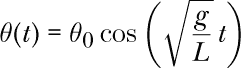

其中*θ*[0]是初始角度。清单 9-9 中的初始条件设置了摆动处于静止状态，起始角度为 5°，因此小角度近似应该有效。

由于我们知道解析解，我们可以将数值结果与之进行对比。清单 9-10 展示了如何将两者绘制在一起。

```
using Plots

plot(sol5d; idxs=1, lw=4, lc=:lightgrey, label="Numeric",
     legend=:outerright, title="Pendulum at θ0 = 5°")

L, g = p

plot!(t -> u0[1]*cos(sqrt(g/L)*t); xrange=(0, 20),
      ls=:dash, lc=:black, label="Analytic")
```

*清单 9-10：求解小角度情况*

第一个`plot()`调用只使用一个数据参数，即解本身，在清单 9-9 中被赋值给`sol5d`。这既不是数组，也不是函数，但`plot()`似乎知道如何显示它。第一个关键字参数`idxs`请求绘制（在本例中）第一个函数*θ*。`idxs`在`Plots`包的文档中没有出现，实际上在该包中并没有定义。因此，除非我们首先导入`DifferentialEquations`，否则它没有任何效果。

如图 9-8 所示，该图使我们确信我们已经正确设置了问题，且数值解法是有效的。

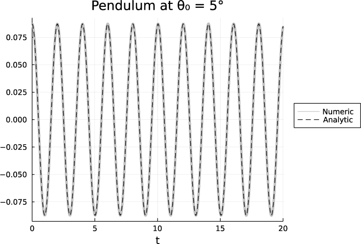

*图 9-8：检查摆动方程的小角度解*

像我们这里所做的那样绘制解，并不仅仅是直接绘制解数组。它还会在计算值之间进行插值，以生成平滑的图形。在这个例子中，解只包含 83 个数据点，如果直接绘制，将生成一个粗糙的图表。

尽管解对象不是数组，但该包定义了索引方法，方便提取数据。如果我们确实需要访问未插值的解数据，可以通过索引获取。在这里，`sol5d[1, :]`返回第一个变量*θ*的 83 个数据点，而`sol5d[2, :]`返回第二个变量*ω*的 83 个数据点。要获取这些值定义的时间，我们可以使用一个属性：`sol5d.t`。

将解对象作为函数使用时，会返回插值结果，插值时间作为参数传入。（我们在本节中使用的是时间，但在其他问题中，独立变量可能是其他内容。）`sol5d(1.3)`函数调用返回一个包含两个元素的`Vector`，每个元素对应一个变量，插值到时间 1.3。 这些函数也接受范围和数组，因此`sol5d(0:0.1:1)`返回在 0 到 1 之间 11 个时刻的插值解数据。要提取这些时刻的角度变量，我们可以调用`sol5d(0:0.1:1)[1, :]`。通过使用解对象的函数形式来控制插值的密度，在绘制例如散点图时非常有帮助，因为我们需要控制绘制点的密度。

解的结果如何依赖于初始角度？通过重新定义`u0`以尝试两个较大的初始角度，并按照清单 9-10 的方式生成两个新的解，我们得到了如图 9-9 所示的结果。

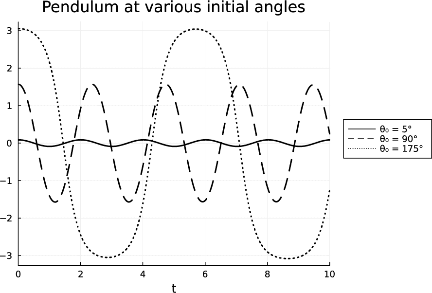

*图 9-9：具有较大初始角度的摆*

当初始角度为 90°时，摆绳最初水平，解的形状近似为正弦波，但其频率比小角度情况下低大约 25%。当初始角度为 175°时，周期几乎是小角度周期的三倍，解明显远离正弦波形。在生成图 9-9 时，我们通过传递另一个由`DifferentialEquations`定义的关键字`tspan=(0, 10)`给`plot()`来限制自变量的范围。

#### ***定义时间依赖参数***

通过将`p`数组中的一个或多个常数参数替换为时间的函数，我们可以研究系统对时间依赖参数的响应。通过这种方式，我们可以在微分方程中包含非齐次项、强迫函数和时间变化的参数。

让我们来看看如果在摆动时稳定地拉动绳子会发生什么。我们将从 45°开始，计算 10 秒内的解，将常数`L`替换为一个线性递减的时间函数：

```
tspan = (0, 10)
u0 = [π/4, 0]
Lt(t) = 1 - 0.999t/10
```

我们需要创建一个稍微不同版本的`pendulum()`函数，如清单 9-11 所示，该版本可以使用时间变化的摆绳长度。

```
function pendulum2!(du, u, p, t)
    L, g = p
    θ, ω = u
    du[1] = ω
 ➊ du[2] = -g/L(t) * sin(θ)
end
```

*清单 9-11：具有时间依赖的 L 的摆函数*

我们对之前的函数所做的唯一更改是将`L`替换为`L(t)` ➊。接下来的步骤和之前一样。`ODEProblem()`函数需要一个新的参数数组，见清单 9-12，用于传递给`pendulum2()`。

```
p = [Lt, 9.8]
prob = ODEProblem(pendulum2!, u0, tspan, p)
solLt = solve(prob)
```

*清单 9-12：使用时间变化的 L 获得数值解*

将问题推广到包括时变参数的方式简化了`微分方程`中参数传递方法的优势。结果，在图 9-10 中，显示了随着角速度（*ω*）的增加，周期和幅度稳步减小。

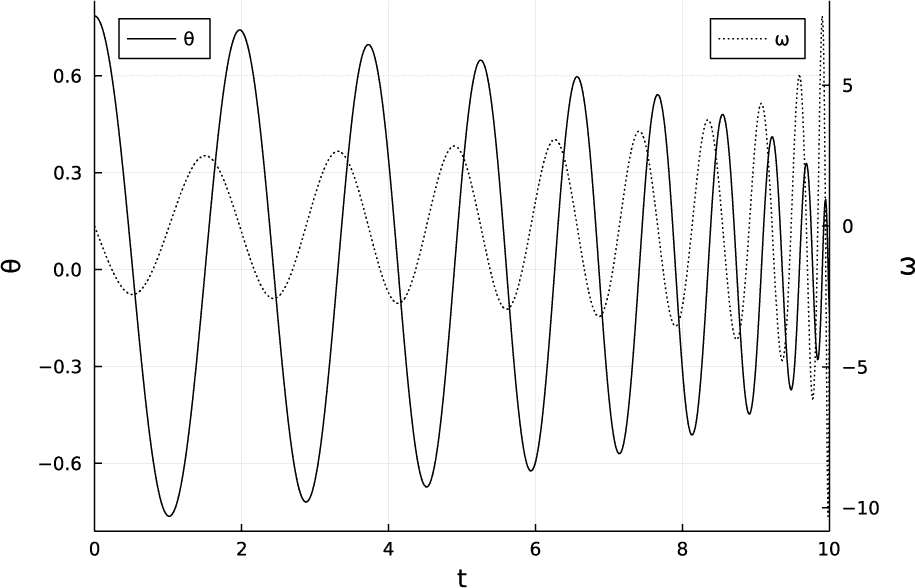

*图 9-10：摆钟上拉绳子的动作*

我们通过以下调用生成图 9-10：

```
plot(solLt; idxs=1, label="θ", legend=:topleft, ylabel="θ",
  ➊ right_margin=13mm)
plot!(twinx(), solLt; idxs=2, label="ω", legend=:topright,
      ylabel="ω", ls=:dot)
```

在`plot!()`的调用中，第一个参数`twinx()`创建了一个子图重叠，分享第一个图的水平轴并绘制一个新的垂直轴；我们使用它是为了让两条曲线不必共享同一个比例尺。右侧需要额外的空间➊来为第二个垂直轴上的标签留出位置。这个边距设置需要导入`Plots.PlotMeasures`，正如在第 101 页“与图表设置一起工作”中解释的那样。

#### ***参数不稳定性***

一个孩子在操场上“推动”秋千使其摆动，实际上是在利用*参数不稳定性*。这种不稳定性的驱动因素是摆钟绳子有效长度的周期性变化。线性理论（我们在本节中正在攻克的微分方程的小角度版本）告诉我们，当驱动力频率是摆钟固有频率的两倍时，就会发生共振，利用我们的*L* = 1，可以得到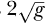。如果绳子的长度在这个频率下做正弦扰动，小幅度振荡的幅度会指数级增长。

由于我们知道如何将任何时变函数*L*(*t*)插入到数值解中，因此我们可以研究摆钟对超出小角度近似的参数激励的响应。我们将从一个小的初始角度开始，跟踪其演化一段较长的时间，并定义一个新的时间函数来表示绳子的长度：

```
const g = 9.8
tspan = (0, 400)
u0 = [π/32, 0]
Lt(t) =  1.0 + 0.1*cos(2*sqrt(g)*t)
```

`Lt(t)`将按照参数共振的频率，将名义上 1 米的长度扰动 10%。

我们的工作与之前完全相同，只是做了一些调整。我们使用`pendulum2()`，它在清单 9-11 中定义，并像清单 9-12 中那样设置问题。调整之处在于，我们需要向求解函数提供一个关键字参数：

```
solLt = solve(prob; reltol=1e-5)
```

`reltol`参数根据需要调整自适应时间步进，以限制局部误差达到我们提供的值。它的默认值为 0.001，这导致一个看起来有些可疑的解，因为它并不完全是周期性的。我生成了`reltol` = 1e–4、1e–5 和 1e–6 的解。1e–4 的解看起来合理，但 1e–5 的解略有不同。由于`reltol` = 1e–6 的解与 1e–5 的解几乎相同，因此它们可能是准确的。图 9-11 显示了*θ*与时间的关系图。

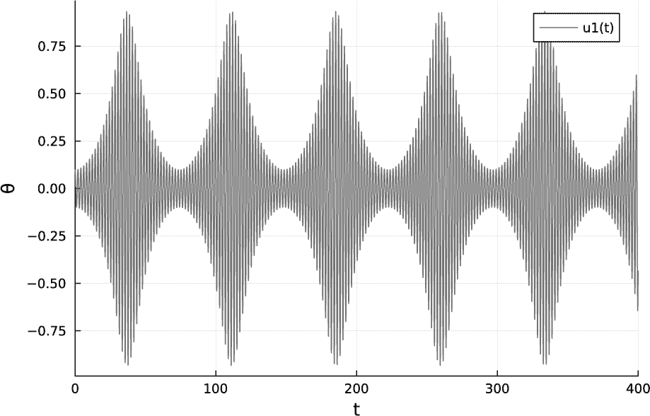

*图 9-11：有限角度摆钟的参数不稳定性*

最初，振幅呈指数增长，符合线性理论的预测。但我们从之前的解中知道，摆的频率随着振幅的增大而减小；因此，它会持续地与强迫函数失去共振，振幅回落到接近初始值。到那个时候，它会更接近共振，振幅再次呈指数增长。正如解所示，这个过程会重复发生。

#### ***结合微分方程与测量***

假设我们想通过实验验证我们的摆动解决方案的预测。在设置初始角度时会存在一些误差。如果我们估计这个不确定度为一度，我们可能会考虑这样陈述初始条件（请参见第 280 页的“测量误差传播”）：

```
using Measurements

u0 = [π/2 ± deg2rad(1), 0]
```

函数 `deg2rad()` 将角度从度转换为弧度。

我们可以像之前一样继续操作，重复列表 9-8 和 9-9 中展示的过程。现在，*θ*(*t*)的解的图像如图 9-12 所示。


*图 9-12：结合* 微分方程 *与* 测量

尽管我们没有告诉 `plot()` 函数任何有关绘制误差条的内容，但它们还是出现在了图表中。图表显示了角位置的误差如何随着时间的推移平均增长。然而，误差并不是单调增长的。当精确解和误差范围的极限解恰好同相时，误差会减小。

我们生成解并在图 9-12 中绘制它，具体过程如下：

```
prob = ODEProblem(pendulum!, u0, tspan, p)

solM = solve(prob)

plot(solM(0:0.1:5)[1, :]; legend=false, lw=2, ylabel="θ", xlabel="t")
```

由于 `DifferentialEquations` 在解的每个点上都附加了误差，包括在绘制图形时插值的点，我们必须使用在第 297 页的“检查解”部分描述的技术来限制绘制的点的数量；否则，图表会因为误差条过于密集而无法解释。

### **结论**

尽管我们在本章中详细探讨了几个物理包，但实际上我们只是略微触及了它们的表面。然而，我希望这里的介绍足以帮助你评估本章中探讨的任何包是否适合你的项目，并向你展示如何开始使用它们。

本章的另一个目的是作为 Julia 及其生态系统强大功能的介绍。在多个示例中，我们能够在不做任何特别安排的情况下，将两个或三个包的功能结合起来。我们制作了包含单位的图表和排版表达式，看到它们被合理地处理。我们将一个常微分方程求解器的输出传递给另一个包中的绘图函数，它提取了相关数据并进行了绘制。我们在初始条件中带有误差估计的情况下求解常微分方程，并且误差被正确地传播到解中。我们绘制了*这个*结果，仿佛是魔法一样，解中显示了误差条。

我们编写了脚本和程序，结合了五个包的功能，以不同的组合方式，将它们赋予了作者未曾设想或计划的能力。这些包中的大多数是没有任何关于其他包知识的情况下编写的。作者们以通用的方式编写了这些代码，使得 Julia 的类型系统和多重分派方法能够使其功能与其他包中定义的数据类型兼容。

Julia 最初吸引了人们的注意，因为它是一种像高级解释型语言一样容易上手并能高效工作的语言，同时也足够快速，能满足最严苛的科学工作需求：“像 Python 一样简单，像 Fortran 一样快速。” Julia 在科学领域日益受到青睐的第二个原因是，它能够将不同包的功能无缝结合，而不需要应用程序员额外的工作。Julia 的创建者和包的作者们将这一特性称为包的 *可组合性*，类似于函数组合的概念。

**进一步阅读**

+   GitHub 社区 “Julia 的物理生态系统” ([*https://juliaphysics.github.io/latest/ecosystem/*](https://juliaphysics.github.io/latest/ecosystem/)) 维护了一个便捷的与所有物理领域相关的包列表，并包括与数学和绘图相关的包。

+   `Unitful` 包可在 [*https://github.com/PainterQubits/Unitful.jl*](https://github.com/PainterQubits/Unitful.jl) 找到。

+   详情请见 [*https://www.simscale.com/blog/2017/12/nasa-mars-climate-orbiter-metric/*](https://www.simscale.com/blog/2017/12/nasa-mars-climate-orbiter-metric/)，了解单位混淆如何摧毁了火星气候轨道器。

+   `UnitfulLatexify` 的文档位于 [*https://gustaphe.github.io/UnitfulLatexify.jl/dev/*](https://gustaphe.github.io/UnitfulLatexify.jl/dev/)。

+   `Measurements` 包位于 [*https://github.com/JuliaPhysics/Measurements.jl*](https://github.com/JuliaPhysics/Measurements.jl)。

+   若要开始使用 `Oceananigans`，请参见 [*https://clima.github.io/OceananigansDocumentation/stable/quick_start/*](https://clima.github.io/OceananigansDocumentation/stable/quick_start/)。

+   `DifferentialEquations.jl`的文档可以在[*https://diffeq.sciml.ai/stable/*](https://diffeq.sciml.ai/stable/)查阅。

+   本章节的动画、彩色图像和补充代码可在[*https://julia.lee-phillips.org*](https://julia.lee-phillips.org)找到。

+   你可以在[*https://lwn.net/Articles/835930/*](https://lwn.net/Articles/835930/)和[*https://lwn.net/Articles/834571/*](https://lwn.net/Articles/834571/)找到`DifferentialEquations.jl`使用的简单示例。

+   摆的参数不稳定性在视频[*https://www.youtube.com/watch?v=dGE_LQXy6c0*](https://www.youtube.com/watch?v=dGE_LQXy6c0)中展示。

+   一般谐振子参数共振的理论在[*https://www.lehman.edu/faculty/dgaranin/Mechanics/Parametric_resonance.pdf*](https://www.lehman.edu/faculty/dgaranin/Mechanics/Parametric_resonance.pdf)中进行了讨论。
