## 统计学**

*这个世界的真正逻辑是概率微积分。*

—詹姆斯·克拉克·麦克斯韦


本书的许多读者可能会跳过第二部分中的一个或多个章节。例如，一位生物学家可能对物理应用不感兴趣。但是*这一*特定章节对每个人都有帮助，因为迟早所有科学家都必须面对统计学这一主题。

任何进行实验的人都知道，实验数据的处理和分析是统计方法和概念的直接应用。每台科学计算器都配有用于计算一组数字的均值和标准差的按钮。在本章中，你将学习如何应用 Julia 及其统计库来操作、绘制和分析各种数据。与统计学领域的标准语言 R 相比，Julia 通常更快、更灵活、更可扩展且更强大。但如果你已经在使用 R 程序，我会解释如何在 Julia 环境中使用它们。

概率和分布的概念在物理学中无处不在，从经典的统计力学理论到量子理论，其中概率扮演着基础性角色。而统计学及其在概率语言中的基础，在科学中几乎无处不在，即使在实验和观察之外也是如此。本章中的一个详细例子涉及生物学中的概率建模：这些思想在分析实验和物理学之外的应用。

### **概率**

我们这里没有足够的篇幅讲解完整的概率和统计课程，但幸运的是，我们可以在没有详细数学推导的情况下做我们需要做的一切。几乎所有科学家都对这一学科的基本概念和方法有所了解，但我不会假设读者有任何特别的知识。

要理解和使用统计学，我们首先需要清楚地掌握*概率*。在我们的应用中，我们可以把概率理解为一个介于 0 和 1 之间的数（包括 0 和 1），它表示某事件发生的可能性。概率为 0 意味着该事件不可能发生，而概率为 1 意味着该事件必然发生。其他任何概率可以被解释为在大量实验中该事件发生的频率或比例。例如，如果我们说抛硬币时正面朝上的概率是 1/2，这意味着如果你抛硬币很多次，硬币正面朝上的次数与总抛掷次数的比例将接近 0.5。

大量的“多次”到底是多少次？我们真正的意思是这里有一个极限

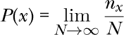

这只是说，当我们做更多实验时，观察到事件*x*的次数*n*[*x*]，除以实验总次数*N*，将越来越接近某个特定比例。我们称这个比例为概率。在概率论中，*实验*指的是一个过程，例如掷硬币或掷骰子。

前面一段描述了概率的一种特定观点，叫做*频率解释*。当然也有其他方式来看待概率及其含义，但从某种意义上来说，它们都是等价的。频率解释是实用的，能够很好地服务于我们的目的，而且是大多数人在需要明确理解概率实际含义时所想到的方式。有关该主题的更正式的探讨，请参见 359 页中的“进一步阅读”。

我们通常希望在计算机程序中模拟某些事件，这些事件应当以某些概率发生。这可能是系统模拟的一部分，比如模拟气体分子在盒子里碰撞，我们可能希望用随机的位置和速度来初始化这些分子，或者它可能是统计检验的一部分。但这就提出了一个问题：如果概率代表机会，即某种随机过程的结果，而我们计算机内部的过程（我们当然希望如此）是确定性的，那么我们如何利用计算机生成随机事件呢？

就本书中的例子而言，我们实际上并不希望我们的随机事件是随机的，因为我们可能希望重复模拟或者检查在改变计算方法后是否会得到相同的结果。我们需要能够重复特定的“随机”事件序列。这看起来似乎是一个矛盾。如果我们知道结果会是什么，它就不可能是随机的。

我们在程序中生成的随机数被称为*pseudorandom*（伪随机）数。它们看起来像是随机数的序列，满足某些随机性测试，并且遵循给定的*分布*（接下来会解释）。然而，本质上它们并不真正是随机的。再次强调，我们并不是真的希望它们是完全随机的。

除非我们确实需要。在某些密码学应用中，我们确实需要真正的、不可预测的随机数。因为不法分子知道各种生成伪随机数的算法，能够预测这些序列可能会导致破解密码系统。为了这样的用途，计算机安全系统利用计算机上任何可用的真实不可预测性来源（称为*熵源*）。这些来源可以是键盘上按键时间生成的存储数据。例如，熵的寻找促使了一些创意的解决方案，比如对着熔岩灯墙拍照。

Julia 实际上提供了一种方法，可以利用操作系统提供的熵。然而，在本书中，我们并不关心密码学，而是关注科学，所以我们希望我们的随机数并不那么随机，我们将使用 Julia 的伪随机数生成器。接下来的章节中，我会遵循常见做法，将这些伪随机数称为“随机数”。

### **Julia 中的随机数**

Julia 有用于生成各种数值类型的随机数的函数，甚至包括复数。基本的随机数生成器是`Base`的一部分，因此你可以在不需要`import`语句的情况下直接使用它们。

**注意**

*我之前提到过，使用伪随机数的一个原因是我们在开发代码时可以重复一个随机数序列。然而，这种序列的可重复性并不能保证永远有效。特定函数返回的随机序列可能在升级 Julia 后发生变化，因此你不能长期依赖它进行代码开发。如果你需要长期可复现的数字序列，请参见第 359 页的“进一步阅读”。*

最简单的用法是调用`rand()`，它会返回一个在区间 0, 1)内均匀分布的随机`Float64`。这意味着数字可能等于 0，但会小于 1，并且区间内的所有数字都是等可能的。

我们可以通过生成一堆随机数并用散点图绘制它们来检查`rand()`函数是否按预期工作。我们可以通过多次调用`rand()`，将其返回的值存储在数组中，并绘制该数组来实现。但`rand()`使这一过程变得更简单：如果我们传递一个整数参数，它会按要求返回一个随机值数组，其长度由参数决定。如果我们传递多个参数，它会返回一个更高维的数组。[列表 10-1 中的小程序将一个长度为 10⁵的数组填充随机浮点数，并通过散点图可视化它们的分布。

```
using Plots

ra = rand(100000)
scatter(ra, markersize=1, label=nothing)
```

*列表 10-1：测试随机数生成*

在结果图中，如图 10-1 所示，每个 10⁵个数字由一个小点表示。所有数字都位于正确的区间内，并且它们似乎是随机且均匀分布的，正如它们应该的那样。像这样的图表是一个有用的视觉检查，用来确保伪随机数生成器行为正常，并且没有在数值分布中引入任何不需要的模式。

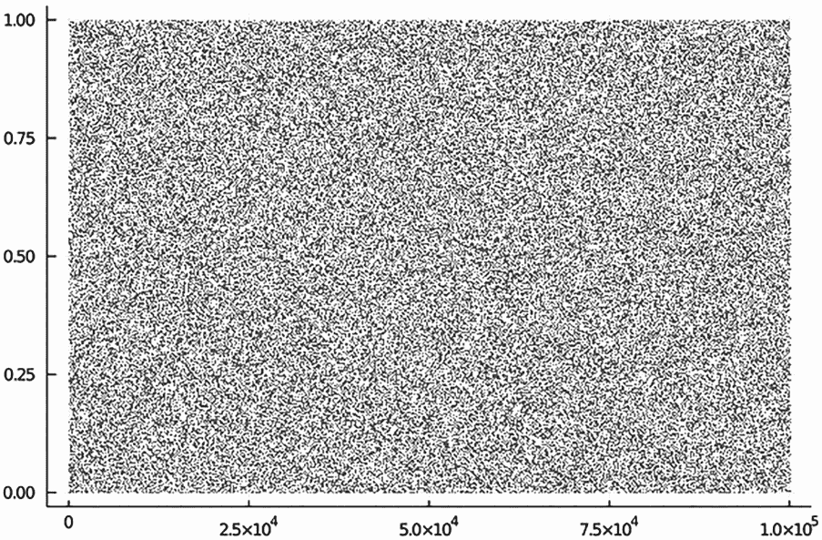

*图 10-1：均匀分布的随机浮点数*

要获取随机整数或其他类型（而不是浮点数），只需将类型作为参数传递即可。调用`rand(Int)`（与`rand(Int64)`相同）将返回一个在该类型所定义的最小和最大整数范围内的随机整数。然而，这在应用程序中很少是你想要的。你可能希望得到一个在某个特定范围内的随机整数，这个范围与你的问题相关。在这种情况下，只需将范围作为参数传递：例如，`rand(1:6)`表示掷骰子。

事实上，该参数也可以是元组或列表，`rand()`会从中随机选择一个元素，且每个元素的选择概率相等。你甚至可以像这样做：`rand([1, 3, "abc"])`，并随机得到`1`、`3`或字符串`"abc"`，每个的概率都是 1/3。如果你传入一个字符串，它会被视为字符集合，返回一个随机字符。

简单的`rand()`调用在模拟中非常有用，特别是当你希望某些事件按特定概率发生时。如果事件发生的概率是`P`，那么在代码中你将看到类似以下的内容，这是一种让某件事以指定概率发生的方式：

```
if P > rand()
    event()
end
```

调用`rand()`有效，因为它会生成在区间[0, 1)内*均匀分布*的随机数。想象一下，反复把飞镖投向一个边长为一米的正方形飞镖板（假设它会随机落在板上的某个位置）。从长远来看，飞镖将有 90%的时间落在最右边的 90 厘米范围内。`rand()`函数就像是那个飞镖。

请记住，从长远来看，你无法依赖 Julia 的随机数函数生成的特定序列能够重复，因此在调试代码或开发算法时，你需要知道如何在短期内做到这一点。当你更改某些你认为不应该改变结果的部分时，你通常会希望重新运行程序。如果程序使用了随机数，而且序列是真正不可预测的，这种测试就变得不可能了。

通过将一个*种子*传递给随机数生成器，你可以生成一系列高质量的伪随机数，并且在程序的后续运行中重复相同的序列。为了做到这一点，你需要导入`Random`包，因为你将需要使用至少一个不在`Base`中的函数。但`Random`还有一些其他的有用功能，稍后你会看到。

以下是展示基本过程的三行代码：

```
using Random

rgen = MersenneTwister(7654);
rand(rgen)
```

导入 `Random` 后，`MersenneTwister()` 函数，即一个随机数生成算法，就可以使用了。这个名字来自于该函数所在的数学库。它的参数，在这个例子中是 `7654`，被称为 *种子*。种子的目的是生成一个特定的序列，如果需要，我们可以重复使用该序列。`rand()` 函数，以及 Julia 中的所有其他随机数函数，都接受一个可选的第一个参数，用于指定使用的生成器实例。如前所述，每次调用 `rand()` 时，我们都会得到一个 0 到 1 之间的随机数。但现在，我们可以通过重新初始化 `rgen` 并使用相同的种子，随时重新启动序列。我们可以通过简单地更改种子来生成一个不同的、不可预测的序列。除了最简单的使用情况外，你应该始终指定一个生成器，并为其提供一个种子，而不是像我们在前一个示例中那样使用更简单的 `rand()` 形式。

### **Monty Hall 问题**

生成随机数的能力为有趣的模拟开辟了广阔的可能性。首先，让我们考虑一下 *Monty Hall 问题*，它以长期主持游戏节目 *Let's Make a Deal* 的 Monty 为名。这个问题在统计学课堂上常常引发激烈的辩论，甚至经验丰富的数学家，甚至统计学家，常常也会犯错——或者他们曾经会犯错，直到这个问题变得有名。对我们来说，这将作为一个例子，展示如何通过概率计算机模拟验证我们认为已经通过分析方法计算出的结果。模拟可以为那些难度较大的概率问题提供额外的信心，因为在这些问题中，分析计算很容易出现偏差。

想象一下有三扇门。 behind one is a prize, say, a fancy car, and behind the other two are joke prizes. Monty often used goats for these “loser” prizes. You want the car. Monty asks you to choose a door. He knows where everything is, but you know nothing.

假设你选择了门 #1。 在揭示门后面是什么之前，Monty 打开了另一个门，比如门 #3，露出了一个山羊。他给你机会，如果你愿意的话，可以换到门 #2。

问题来了：你应该坚持原来的选择，还是换到门 #2？这有关系吗？

正确答案是你应该换门。然而，许多人最初的直觉是，换不换都没有区别。毕竟，现在有两扇门可以选择：门 #1 和门 #2。它们应该有相等的机会通向奖品，所以这就像抛硬币：正面或反面是一样可能的。

然而，这种思维是错误的。最初，你的选择是赢家的概率是 1/3。大家对此都同意。这意味着奖品在*其他门之一*的概率是 2/3。由于奖品一定在某个地方，所以总概率必须加起来等于 1。这些初始概率仍然成立。门#1 是赢家的概率仍然是 1/3。而其他门成为赢家的概率依然是 2/3。但是现在，“其他门”这一组只包含门#2，因为蒙提已经排除了门#3。你应该切换选择，将你的获胜概率从 1/3 提高到 2/3。

这种分析只是解决问题的众多方法之一，但它们都（如果做得正确）会得出相同的结论。然而，在这个时候，许多人仍然持怀疑态度。有时，实际上进行实验可以说服那些不相信数学的人。

以下程序就执行了这样的实验——一个使用随机过程的简单模拟示例：

```
   N = 3000

   stay = zeros(Int32, N)
   switch = zeros(Int32, N)

   for game in 1:N
       prize = rand(1:3)
       choice = rand(1:3)
       if choice == prize
           stay[game] = 1
       end
   end

   for game in 1:N
       prize = rand(1:3)
       choice = rand(1:3)
       if choice != prize
           switch[game] = 1
       end
   end

➊ stayra = [sum(stay[1:i]) / i for i in 1:N]
   switchra = [sum(switch[1:i]) / i  for i in 1:N]

   using Plots

   plot(1:N, [stayra, switchra, ones(N)*1/3, ones(N)*2/3],
        label=["Stay" "Switch" "" ""])
   annotate!(2700, 1/3 + 0.05, "1/3")
   annotate!(2700, 2/3 + 0.05, "2/3")
```

这个程序玩`N`次游戏，其中`N`设为 3,000。它将胜负记录存储在两个数组中，一个是玩家保持初始选择的 3,000 次游戏记录，另一个是玩家决定切换的回合记录。数组初始化为全 0。如果玩家在第`game`局获胜，则该数组元素会变为 1。

两个数组➊保存了每种策略的运行平均值，这是通过列表推导式定义的。这些就是我们要查看的数组。

图 10-2 中的图表显示，从长远来看，切换策略获胜的概率为 2/3，而固执地坚持初始选择的玩家仅获胜 1/3 的时间。

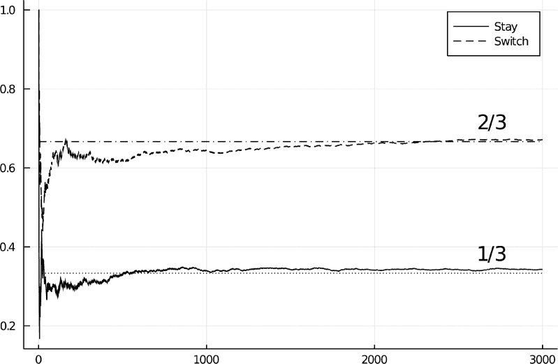

*图 10-2：两种蒙提霍尔策略*

如果我们记住概率的频率解释的含义，这些比例与论点一致：从长远来看，事件（在本例中是获胜）的比率与总实验次数的比率应该接近概率。请注意，如果你自己运行这段代码，图表可能会略有不同，因为你会得到不同的随机数序列，但*长期行为*应该是相同的。

### **计数**

在概率之后，统计学中下一个最重要的概念是*计数*，也叫做*组合数学*。计数与回答一个事件有多少种发生方式相关。如果你投掷一对骰子，骰子上的两个数字加起来等于六的方式有多少种？如果队伍中有 30 人，那么有多少种可能的九人棒球队？

在计算机上模拟涉及概率的系统时，为了正确计算各种事件的概率，我们通常会*计数*某个事件发生的方式数，并除以所有可能性中的总数。如果所有方式的可能性相等，这就给出了概率。

在掷骰子的例子中，得到和为六的方式有 10 种，所以概率是 10/36。

在处理概率问题时，另外两个计数概念经常出现，通常在其他地方也会用到：*排列*（通过阶乘计算）和*组合*（涉及二项式系数）。

#### ***阶乘***

第一个计数概念是*排列*：排列一组物体的不同方式的数量。如果你有八个*拼字游戏*字母牌，每个字母都不同，那么你能从中组成多少种不同的八个字母的字符串呢？

答案是 8 × 7 × 6 × 5 × 4 × 3 × 2 × 1 = 40, 320。

这是一个快速的论证，展示为什么这个是正确的：选择第一个字母牌有八种方式；一旦选定了第一个字母牌，选择下一个字母牌有七种方式；依此类推。这个模式出现得非常频繁，以至于我们为它赋予了一个特殊的名称和数学符号，它叫做*阶乘*，在这种情况下写作 8!。Julia 也有一个内置函数处理它，但由于 `!` 被用于其他目的，我们需要把它写为：`factorial(8)`。

阶乘函数增长得非常快，因此在 `factorial(20)` 以上，你需要将参数作为 `BigInt` 提供，并且返回值也是 `BigInt`。阶乘增长的速度有多快？标准的 52 张扑克牌的排列方式的数量远大于宇宙中的星星数量。它大到一个程度，以至于洗牌后，你手中的扑克牌排列几乎不可能在世界历史上曾经出现过。

#### ***二项式系数***

我们将要使用的第二个组合概念是*二项式系数*。这个概念在许多数学场合都会出现，Julia 中有一个内置函数 `binomial()` 用于处理它。在计数的上下文中，二项式系数回答的是前面提到的棒球队问题。如果有 30 个可用的球员，那么组成九人小队的方式数量可以写作：

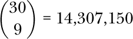

棒球问题通过 `binomial(30, 9)` 计算。涉及二项式系数的这些问题的组合学术语是*组合*。

请参阅第 359 页的“进一步阅读”，了解更多关于二项式系数的细节：为什么它们这样命名，如何通过阶乘计算它们，以及它们与其他数学领域的联系。

### **流行病建模**

现在我们有足够的工具来进行一个重要的计算。清单 10-2 是一个模拟，模拟了感染在人群中的传播。这类似于流行病学家用来进行计算实验的模型，研究不同的 COVID-19 传播情景。这个模型相较于那些稍显简化，因为我的目的是展示目前章节中的工具和思想的应用。有关现在研究中使用的类似模型，请参阅“进一步阅读”。

```
   using Plots
   using Printf
   using JLD
   worldgrad = cgrad([:blue, :red, :black, :green], [0.25, 0.50, 0.75],
               categorical=true)
   n = 16
➊ initial = Dict("infected"=>0.5, "isolated"=>0.15)
   transition = Dict("infected"=>0.05, "dead"=>0.1, "dud"=>7)
   include("plotworld.jl")
   """Simulate pandemic growth.
       n: length of side of world array;
       initial: starting proportions of infected and isolated subpopulations;
       transition: probabilities of infection and of death after dud days of
                   infection;
       days: number of days before stopping;
       seeding: selects spatially random or centered initial distribution of
                infected individuals;
       plotmode: display or save plots of simulation while running, or save
                 only the final state.
   """
   function pandemic(n::Int, initial, transition, days::Int; seeding=:normal,
                     plotmode=:display)
       noi = [] # Number of infected people
       nod = [] # Number of dead people
       function finish()
           if plotmode == :last
               plotfilename = @sprintf "%d.png" days
               savefig(plotworld(world, noi, nod, worldgrad), plotfilename);
           end
           @save "pandata.jld" world noi nod
       end
       function nif(I, J) # Number of infected neighbors of an uninfected cell
           return sum(world[I-1:I+1,J-1:J+1] .== infected)
       end
       tpi = zeros(8)
    ➋ for N in 1:8
          tp = 0
          for i in 1:N
              tp += (-1)^(i-1)*binomial(N, i)*transition["infected"]^i
          end
          tpi[N] = tp # The total probability of infection with N infected neighbors
      end
      ok::Int32 = 1
      infected::Int32 = 2
      dead::Int32 = 3
      isolated::Int32 = 4
      world = fill(ok, n, n)
      if seeding == :normal
          world[rand(n, n) .< initial["infected"]] .= infected
      end
      world[rand(n, n) .< initial["isolated"]] .= isolated
      if seeding == :center
          world[n ÷ 2, n ÷ 2] = infected
      end
   ➌ next = copy(world)
   ➍ aoi = fill(0, n, n) # Age of infection
      dud = transition["dud"]
      for day in 1:days
          for j in 2:n-1 for i in 2:n-1
              if world[i, j] == ok
                  if nif(i, j) > 0
                      if tpi[nif(i, j)] >= rand()
                          next[i, j] = infected
                          aoi[i, j] = day
                      end
                  end
              end
              if (world[i, j] == infected) && ((day - aoi[i, j]) == dud)
                  if rand() < transition["dead"]
                      next[i, j] = dead
                  end
              end
          end; end
          world = copy(next)
       ➎ push!(noi, sum(world[2:n-1, 2:n-1] .== infected))
          push!(nod, sum(world[2:n-1, 2:n-1] .== dead))
       ➏ if day > 4dud
              if noi[end] == noi[end - dud] && nod[end] == nod[end - dud]
                  return finish()
              end
          end
          if plotmode == :save
              plotfilename = @sprintf "%05d.png" day
              savefig(plotworld(world, noi, nod, worldgrad), plotfilename);
          elseif plotmode == :display
              display(plotworld(world, noi, nod, worldgrad))
          end
      end
      finish()
  end
  days = 2000
  pandemic(n, initial, transition, days; seeding=:normal, plotmode=:display)
```

*列表 10-2：一场大流行模拟*

该策略是将人口表示为一个方阵。每个单元格代表一个人，并且可以处于四种可能的状态之一：`infected`、`dead`、`isolated` 或 `ok`。一个 `isolated` 的人无法变为 `infected`。一个 `ok` 的人没有被感染，但可能会感染。一个 `infected` 的人在经过一定天数（或迭代次数）后可能会死亡，这个天数由 `dud` 参数赋值；如果此人活过了这一阶段，则达到了不死之身。一个 `dead` 的人不再具有传染性。因此，如果一个 `ok` 的人被 `dead` 或 `isolated` 的人包围，那么他将永远不会被感染（处于“保护”状态）。死亡和隔离能防止疾病的传播。

模拟是通过概率初始化的，用以建立起起始状态和其演变过程。`day = 1` 时的状态是通过 `initial` 字典中的概率来设置的 ➊。在每一次迭代中，根据 `transition` 字典中的概率以及字典中的 `dud` 值（它表示在疾病可能致命之前，个体需要感染多少天）来更新每个人的状态。

人口矩阵被称为 `world`，其边长存储在 `n` 中。不要太字面理解矩阵几何结构。它并不假设人们在某一地点静止不动，直到疾病发展完毕。矩阵 `world` 代表的是接触网络，而不是空间排列。

在导入一些你之前见过的库并包含一个绘图函数文件后（我们稍后会介绍），`pandemic()` 函数被定义出来，这个函数执行实际的计算。该函数接收两个关键字参数：`seeding` 应该是 `:normal` 或 `:center`。在前者的情况下，感染是随机播种的，根据 `initial["infected"]` 来进行；但如果 `seeding` 设置为 `:center`，则会在世界的中心放置一个感染个体。

第二个关键字 `plotmode` 控制是否创建每日的图表，如果创建，图表是显示出来还是保存到文件中。在计算结束时，调用 `finish()` 函数，如果 `plotmode` = `:last`，该函数会保存最终状态的图表。此函数还使用 `@save` 宏将 `world` 以及感染和死亡历史保存到一个 *.jld* 文件中（该功能在第九章中介绍）。

在每次迭代中，程序必须决定对于每个 `ok` 的人，是否将其状态更改为 `infected`。这个决定是随机的，基于每天每个感染邻居的感染概率（在 `transition["infected"]` 中给出）以及感染邻居的数量。

但是，我们需要小心。两个感染者邻居的感染概率并不是单个感染邻居概率的两倍。我们需要减去同时被两个邻居感染的概率。这里我们不会全面讨论概率论中事件组合的内容，但你很可能能轻松理解为什么我们不能简单地将这些概率相加。

假设你在掷两个硬币，并想要找出至少有一个正面的概率。你知道，单个硬币正面的概率是 1/2。如果你将这两个概率相加，你得到的总概率是 1。但这显然不对，因为这意味着正面一定会出现，而你知道两枚硬币出现两个反面的可能性也很大。正确的计算应该减去两个正面同时出现的概率：1/2 + 1/2 *–* 1/4 = 3/4。在长时间内，你至少会得到一个正面的概率是四分之三。此时，如果你有任何疑问，你已经处于一个良好的位置，可以编写一个简单的 Julia 程序来验证这一点。

硬币问题正好对应于你与两个感染者接触，感染的概率 = 1/2。在网格上，每个人最多可以有八个邻居。这比两个邻居的情况要复杂一些，但思想是一样的。对于每一个新邻居，你需要增加该邻居导致的感染概率，但要减去它与其他邻居之间所有可能的组合。*组合*这个词暗示着我们可能需要使用二项式系数，事实上，确实需要。若一个邻居的感染概率为*p*，*n*个邻居的总感染概率公式为：

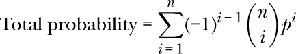

请参见第 359 页的“进一步阅读”，了解有关此公式及相关问题的更多信息。这个概率已经为所有可能的邻居数量`1:8`进行了预计算，结果存储在`tpi`➋数组中。

在每次迭代的计算开始之前，有必要先复制`world`数组，在程序中将其命名为`next` ➌。我们更新`next`中的单元格，然后将其复制回`world`。如果直接在`world`上更新，单元格将根据邻居单元格中部分更新的信息进行过渡，这将导致不一致。因此，需要进行`copy`，正如我们在前面的章节中遇到的那样，因为简单地使用`next = world`会创建对数组的第二个引用，而不是实际的复制。

数组`aoi`初始化为 0➍；它将记录每个人感染的`day`，以便在适当的时候应用生存概率。

在考虑了前述内容后，随后的循环将在天数的循环内进行人员遍历，应该不言自明。在矩阵扫描后，我们将`push!()` ➎ 当前感染和死亡人数的新值分别推送到向量`noi`和`nod`中。Julia 简洁明了的语法通过对二进制数组求和来计算这些总数。

在这里以及前面的 `world` 循环中，程序仅处理`2:n-1`范围内的元素，而不是整个数组，以实现边界条件。通过将边界上的一行或一列“冻结”，更新逻辑简化了，例如，计算每个人感染邻居数量的表达式对于每个非冻结的人来说是相同的。

像物理问题一样，边界条件还有其他可能性。边缘上的人们可以根据邻居数量的减少来更新，但这样做可能会引入伪影。周期性边界条件是另一种可能性，在这种条件下，邻居关系会绕过矩阵并连接到对面一侧。任何选择在某种程度上都是任意的。

条件块 ➏ 会检查计算是否已经达到了稳态。如果已经达到了稳态，就没有必要继续计算，随后会调用清理操作。程序的最后一行通过调用`pandemic()`来启动计算。

这个简单的算法可以产生有趣的行为，并且可以用来探索诸如封锁遵守对感染传播的影响，以及更高的致死率如何减缓疫情增长等问题。

图 10-3 展示了一个 512×512 的模拟输出，初始和过渡概率如下：

```
initial = Dict("infected"=>0.001, "isolated"=>0.5)
transition = Dict("infected"=>0.08, "dead"=>0.25, "dud"=>5)
```

模拟在进行 1,064 次迭代后停止，达到了稳态。图中的标注意味着由于他人的隔离和死亡率的作用，有 5.48% 的人群免受感染。

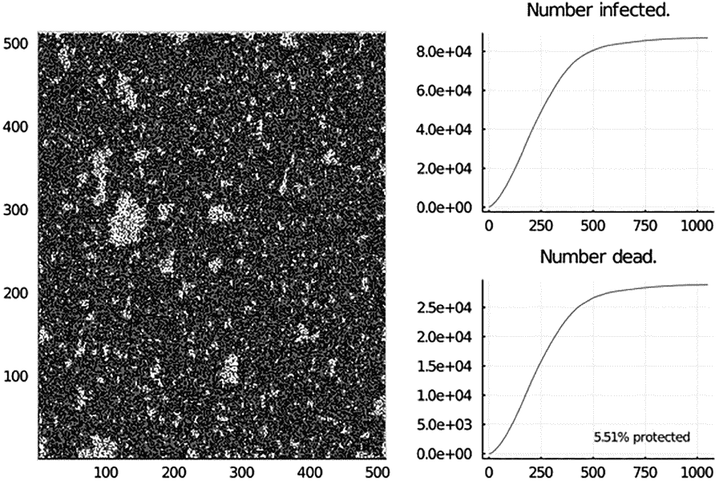

*图 10-3：疫情模拟中的稳态*

请访问本书的补充网站（[*https://julia.lee-phillips.org*](https://julia.lee-phillips.org)），查看彩色版本的图表和类似模拟的动画。在打印的灰度版中，热图中最深的颜色代表死亡或感染的人，白色代表那些保持免疫的人群，中间的颜色表示被隔离的人。

清单 10-3 展示了一个简单的函数，该函数计算保护百分比并绘制如图 10-3 所示的图表。

```
using Plots
using Printf
"""Plot a heatmap of the current state of the pandemic with the histories
of the number of infected and dead people; calculate and display the
proportion of people protected from infection."""
function plotworld(world, noi, nod, worldgrad)
    ok::Int32 = 1
    day = length(noi)
    protected = sum(world[2:n-1, 2:n-1] .== ok) / n² * 100
 ➊ prot = @sprintf("%.2f%% protected", protected)
    p1 = heatmap(1:n, 1:n, world, c=worldgrad, clims=(1, 4), legend=nothing);
    p2 = plot(1:day, noi, label=nothing, yformatter=y -> @sprintf("%.1e", y),
              titlefontsize=10);
    p3 = plot(1:day, nod, label=nothing, annotate=
              (0.7day, 0.1nod[end], text(prot, :blue, 7)), yformatter=
               y -> @sprintf("%.1e", y), titlefontsize=10);
 ➋ layout=@layout [a{0.6w} grid(2, 1)];
    return plot(p1, p2, p3, layout=layout,
                title=["" "Number infected." "Number dead."]);
end
```

*清单 10-3：疫情可视化*

`plotworld()`函数使用`@sprintf`宏 ➊，该宏在“字符串格式化宏”一节中介绍，第 177 页，用于格式化变量`protected`和 y 轴标签进行显示。在创建了三个图并将其存储在`p1`、`p2`和`p3`中后，`@layout`宏，在“使用@layout 创建复杂布局”一节中介绍，第 118 页，将它们 ➋ 安排成一个模拟结果的汇总展示。

### **常见统计函数**

Julia 提供了计算所有常见统计参数的函数，以及用于数据统计可视化的特殊绘图函数。

Julia 统计包正在进行一些重组，因此可能有些内容不在你预期的位置。本节描述了在写作时这些包的位置，但当你实际尝试时，可能会发现某些函数已经移动。

如果你在分析任何类型的数据，你将大量使用本节描述的至少部分函数，其中大多数位于`Statistics`包中，该包是 Julia 标准库的一部分。在本章的其余部分，我假设你已经使用`using Statistics`命令导入了该包。

该包提供了总结数据集的基本函数，利用统计参数来进行描述。对于*均值*，或算术平均值，使用`mean(data)`，其中这里和下面的数据是一些观察值的向量。

对于*中位数*，即数据中的中间值，使用`median(data)`。如果数据点数目为偶数，则没有一个数据点是中间值。在这种情况下，`median()`返回两个中间值的均值：

```
julia> median([1, 2, 3])
2.0

julia> median([1, 2, 3, 4])
2.5
```

在写作时，`Statistics`包不包含*众数*函数。众数是最常见的值，或者是连续分布的最大值（如果存在）。从这个概念出发，产生了*bimodal*和*multimodal*这两个术语，用来描述具有多个局部最大值的分布。图 10-4 中的身高分布就是一个双峰分布的例子。

如果你需要一个众数函数，你可以从另一个名为`StatsBase`的包中导入它，你需要先`add`该包。`StatsBase`包含一些不常用的统计函数，这些函数不在标准的`Statistics`包中，但你可以只导入计划使用的那些。如果你只需要将众数函数添加到工具箱中，可以输入`import` `StatsBase.mode`。

下面是几个示例，展示了`mode()`函数的行为：

```
julia> mode([1, 3, 2, 9, 9])
9

julia> mode([1, 3, 2, 9, 9, 4, 4])
9

julia> mode([1, 3, 2, 9])
1
```

如果有多个众数，函数返回第一个众数。因此，如果每个值仅出现一次，它们都是众数，所以函数返回第一个值。

标准`Statistics`包包含大多数其他基本统计函数，包括以下内容：

std  标准差

stdm  具有指定均值的标准差

var  方差

varm  具有指定均值的方差

cor  皮尔逊相关系数

cov  协方差

中位数  (最大值 + 最小值) / 2

分位数  分位数

这些命令适用于向量或数据对，操作方式与预期一致。此外，`cor()`函数可以接受一个矩阵并返回一个相关矩阵，`cov()`函数也可以以类似方式工作。

`mean()`函数接受一个可选的第一个参数，它可以是一个一元运算符或一个单一数值变量的函数。然后该函数会将运算符或函数映射到数据向量上，再计算均值。如果需要对数据进行缩放或其他处理，这样做会很方便，但对于简单向量的情况，它给出的结果与将函数广播到数组上的结果相同。

```
julia> mean([1, 2, 3])
2.0

julia> mean(x -> 2x, [1, 2, 3])
4.0

julia> mean(2 .* [1, 2, 3])
4.0
```

统计学中使用标准差和方差有两个版本。`var()`函数默认使用的公式是

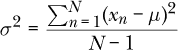

其中*μ*是均值，*x*[*n*] 是单个数据点，*N*是数据点的总数，*σ*²是*样本方差*，即应用了贝塞尔修正的方差。标准差`std()`只是其正平方根。

为了计算*总体方差*和*总体标准差*，需要将关键字参数`corrected`设置为`false`，然后传递给这两个函数中的任意一个。这将把公式中的 1/(*N –* 1) 项替换为 1/*N*。解释这个修正的来源会让我们进入统计理论的深奥领域，但对于大多数用途而言，默认值是你想要的，而且无论如何对于合理大的*N*来说几乎没有区别。

无论是哪种情况，标准差都是一个衡量观察值或理论分布的平均距离的度量。它告诉我们分布的“分散程度”。

### **分布**

我们已经看过了几个例子，展示了如何利用简单的、均匀分布的随机数做很多事情。然而，并非所有随机现象都是均匀分布的。大多数自然现象显示的是其他类型的分布。

假设我们考虑某个特定城市成年人的身高。显然，你不会期望发现一个身高 7 英尺的成年人和发现一个身高接近平均值的成年人有相同的概率：身高并不是均匀分布的。如果你绘制一个图表，将横坐标划分为例如每 2 英寸为一个区间，并收集一部分居民的身高数据，你就可以绘制出每个区间内的身高数量。收集了大量测量数据后，这个图表将开始看起来像一条平滑的曲线，类似于图 10-4。它有两个峰值，因为男性的平均身高略高于女性，并且它显示出身高接近平均值的人比非常高或非常矮的人要多。

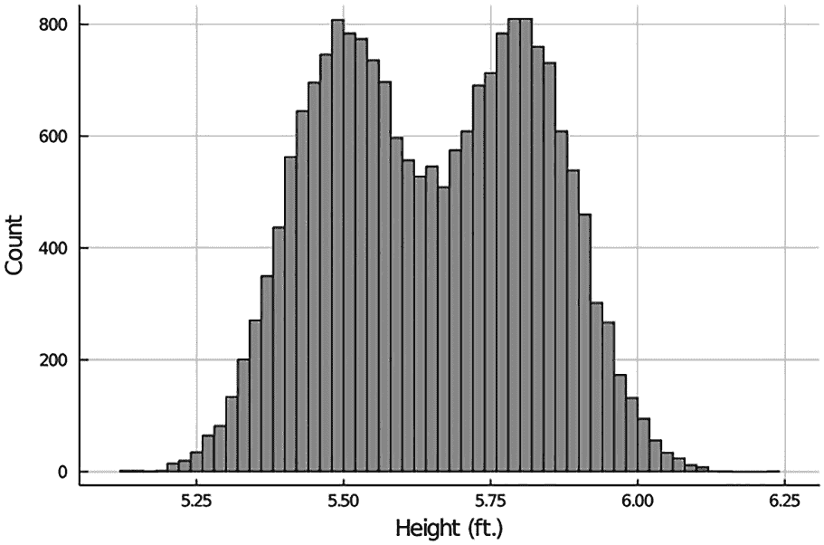

*图 10-4：成年人口身高的可能直方图*

这种类型的图叫做*直方图*；它是表示*分布*的一种方式。概率分布是统计学中最核心的数学对象，就像概率在概率论中自然地形成了核心概念一样。分布简单地告诉你数据中有多少，或者数据中有多少比例落在不同的区间内。作为实际数据的描述，它被称为*经验分布*，而如果它来自一个模型，则是*理论分布*。

你可以这样理解统计学：概率告诉我们某件事情发生的可能性，而概率论的数学让我们进一步阐明这一点，告诉我们事件组合发生的可能性，并回答相关问题。统计学则恰恰相反：它从观察开始，系统地推断出导致这些观察结果的概率。有了这些概率，我们可以对未来的观察做出预测。

Julia 提供了多个包和大量函数来帮助进行统计分析，包括用于统计绘图的函数。要生成如图 10-4 所示的直方图，只需在`using Plots`之后调用`histogram(data, bins = 100)`。此调用中的`data`是实际的观测数据系列；`bins`告诉程序使用该数量的区间来构建直方图。对于每个区间，它会统计`data`中的观测值数量，并在适当的高度绘制矩形。每个矩形的面积表示其覆盖的水平轴区间中的观测值数量。请注意，选择不同的区间数可能会生成非常不同的图形；有些选择会比其他选择更好地反映底层分布。如果你省略了`bins`参数，`histogram()`函数会尝试选择“最佳”值，使用来自统计理论的公式，这些公式旨在最准确地表示数据。但这个公式并不总是完美有效，因此谨慎的科学家或统计学家会始终关注绘制的数据的性质，并在必要时手动干预。

#### ***正态分布***

考虑本章前面提到的`rand()`函数。由于它生成的浮点数在 0 到 1 的区间内等概率地出现，因此它返回的数字的平均值应该是 0.5。这个数字大于 0.5 的概率和小于 0.5 的概率是一样的。

这意味着，如果你多次调用`rand()`并计算结果的平均值，你应该得到一个接近 0.5 的值：`mean(rand(1000))`应该大约是 0.5。我刚才做了一次，得到的结果是 0.49869515604579906。直观上，你可能会预期，如果使用小于 1000 的数字，平均值更可能远离 0.5，这种预期是正确的。

但即使使用 1,000 个数字，均值也很少能恰好为 0.5。因为（除非你重置了种子）每次你都会得到一组不同的随机数，所以每次的均值也会不同。你知道，这些数字在 0, 1)之间均匀分布。如果你多次调用`mean(rand(1000))`，这些*均值*将如何分布呢？

你知道它们不可能均匀分布，因为它们更可能接近 0.5 而不是远离它。那么，*均值*的分布究竟是什么样的呢？

让我们写一个小程序来找出答案。即使是那些学过统计学并知道预期结果的人，也可能会发现[列表 10-4 中的数值实验很有趣。

```
using Plots
using Statistics
N = 10000
averages = zeros(N)
for i in 1:N
    averages[i] = mean(rand(1000))
end
histogram(averages, label="Empirical")
```

*列表 10-4：探索均值的分布*

这个程序是对 1,000 个随机数的 `N` 个均值的直接计算。为了查看这些均值如何分布，我们使用本章早些时候介绍的`histogram()`绘图函数。这个函数的目的正是展示分布。`"Empirical"`标签表示该直方图是数值实验的结果。图 10-5 展示了结果。

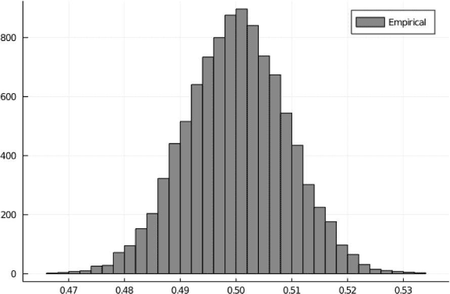

*图 10-5：均匀随机数的均值分布*

显然，均值的分布不是均匀的。正如我们预期的那样，均值接近 0.5 的情况更为频繁。

事实上，基于概率论中的一个核心结果，我们可以预测这个分布的精确数学形式。它应该是

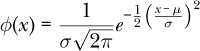

其中 *x* 是我们正在描述分布的随机变量，*σ* 是标准差，*μ* 是均值。

这是著名的*正态分布*方程，也叫*高斯分布*。它描述了程序中的经验分布吗？我们不需要将方程转换为代码来找出答案。这个分布如此关键，以至于它被包含在了统计工作中第二重要的 Julia 包 `Distributions` 中。

一旦你将这个包导入到命名空间中，`Normal(μ, σ)`函数将创建一个均值为 μ、标准差为 σ 的正态分布。你可以通过使用`rand()`函数从中进行采样来与分布交互。例如，如果你创建一个均值为 10、标准差为 2 的正态分布 `d = Normal(10, 2)`，你可以用`rand(d, 10)`从中抽取 10 个样本。如果没有显式提供分布，如我们之前所做的那样，调用`rand()`默认使用均匀分布。

查看图示的经验分布是否符合正态分布的预测的一种方法是，从正态分布中抽取一个较大的样本，并将其直方图与之前的直方图进行比较。为了使图表更易于查看，我们可以通过在正态`plot()`命令中使用不同类型的直方图显示，例如提供`:scatterhist`系列类型，而不是试图在同一图表中绘制两个`histogram()`图形。将清单 10-5 中的四行代码添加到清单 10-4 中的程序中，能实现我们想要的图形对比。

```
using Distributions
σ = std(averages)
nd = Normal(0.5, σ)
plot!(rand(nd, 10000), seriestype=:scatterhist, label="Normal sample")
```

*清单 10-5：从正态分布中抽样*

图 10-6 表明这两个分布非常接近，正如理论预测的那样。

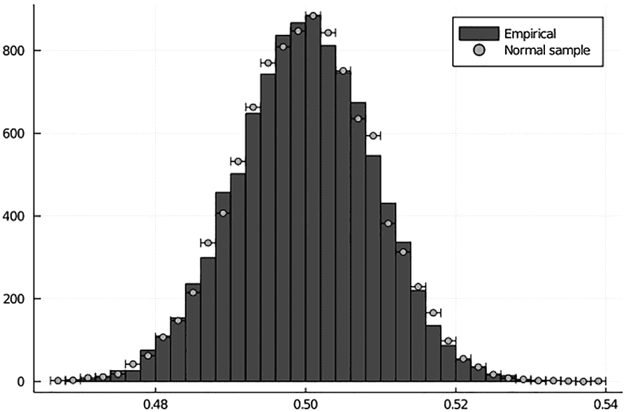

*图 10-6：比较经验分布与理论分布*

请注意，为了直接比较两个直方图，它们必须具有相同的箱宽，或者都进行归一化处理。在这些示例中，我允许程序自动计算箱宽，知道对于相似的分布，宽度应该是相同的。

`Distributions` 包提供了许多概率分布，除了正态分布外，还包括许多用于使用这些分布的函数以及其他统计工具。

#### ***概率密度函数***

其中一个工具是 `pdf()`，即*概率密度函数*。该函数通过以下方式描述分布：如果你对某个区间内的概率密度函数进行积分，结果就是观察值落在该区间内的概率。换句话说，观察值落在*a*和*b*之间的概率，就是分布曲线在*a*和*b*之间的面积。

通常，当我们提到分布的图形时，我们指的是其概率密度函数的图形。整个分布的积分必须存在，并且等于 1，因为任何观察值必定会落在可能值的范围内。

所有的 `histogram()` 绘图类型都有一个可选的 `normalize` 关键字参数，设置为 `true` 后，直方图将显示概率而非原始计数——例如：

```
   histogram(averages, label="Empirical", normalize=true)
   plot!(rand(nd, 10000), seriestype=:scatterhist, label="Normal sample",
         normalize=true)
➊ plot!(0.46:0.001:0.54, pdf.(nd, 0.46:0.001:0.54), lw=5, label="Normal PDF")
```

那三行代码重复了在图 10-6 中绘制的两个直方图的图形，但进行了归一化处理。现在，直方图矩形的面积，如在图 10-7 中所示，代表的是概率而不是原始计数。新的曲线是正态分布的概率密度函数的图像➊，其均值和标准差与样本相同。这是*ϕ*方程的图形，显示在图 10-5 之后。图 10-7 展示了它如何准确预测清单 10-4 中的数值实验结果。

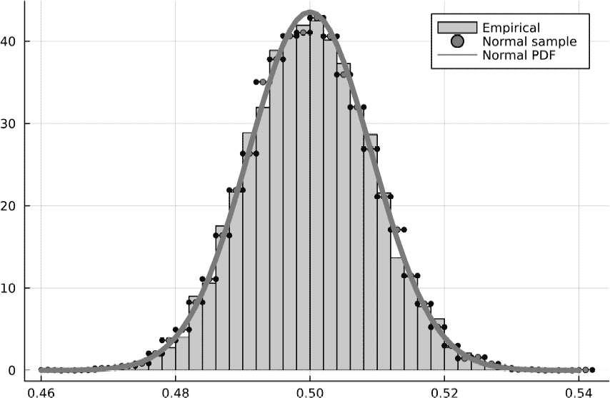

*图 10-7：添加概率密度函数*

由于正态分布的重要性，Julia 提供了另一个类似于 `rand()` 的函数，它返回的是正态分布的随机数，而不是均匀分布的随机数。`randn()` 函数是 `Base` 的一部分，因此你无需进行 `import`。它返回单个数字或数组，数据服从均值为 0，标准差为 1 的正态分布。

让我们使用 `randn()` 重复 清单 10-1 中的绘图：

```
using Plots
ra = randn(100000)
scatter(ra, markersize=1, label=nothing)
```

唯一的区别是使用 `randn()` 代替 `rand()`。 图 10-8 显示了结果。如同 图 10-1，每个 10⁵ 个数字都由一个小点表示，但现在这些点并不是均匀分布的。

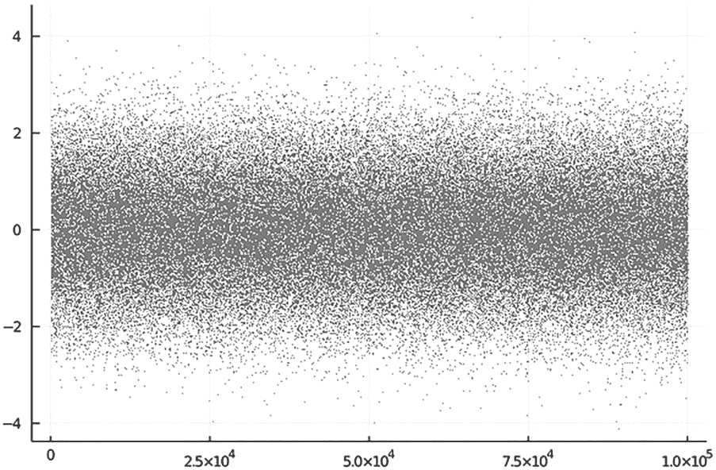

*图 10-8：正态分布的随机浮动数*

相反，它们在纵轴上的值集中在 0 附近，随着距离 0（其分布的均值）越来越远，它们的密度变得越来越稀疏。

### **处理数据**

到目前为止，本章中的所有“数据”要么是虚构的，要么是通过数值伪随机过程收集的结果。如果你正在使用 Julia 进行统计分析，很有可能你已经有了一些实际的、真实的数据需要分析。

在本节中，我们将探讨 Julia 处理中实际数据的最重要方法。我们将查看一种在处理实际数据时非常有用的数据类型，学习如何读取最常见的数据文件类型，如何使用数据框来查看和分析这些数据，以及如何利用 Julia 的统计包来理解和可视化数值信息。

#### ***缺失值***

有一个不常见的数据类型我在 第八章 中没有提到，因为我打算在这一章介绍。它是一个叫做 `Missing` 的单例类型，用来表示缺失值。

想象你有一个传感器，应该定期记录水箱内的温度。不幸的是，它偶尔会未能记录一个测量值。这些失败的记录被记录为 0，但这个数字远远超出了可能的测量范围，因此这些失败的记录不能被误认为是实际温度。在实验结束时，你会有两个向量，或者说是一个矩阵的两列，一个是测量时间，另一个是温度。在分析这些数据时，你不希望将虚假的零温度包含在分析中，因为那样会扭曲你的计算。你希望有一个比简单删除失败读取值更好的解决方案，因为那样会创建一个错误的记录，显示实验中实际上发生的情况，并且为了保持时间和温度向量的长度一致，可能需要删除时间向量中的相应条目，从而导致时间序列中出现间隙。

`Missing`类型为这类问题及其他问题提供了一个解决方案——例如，在数据科学中，缺失值的概念就来源于此。它具有一些看似奇特的特性，这些特性在清单 10-6 中得到了体现，这是一个在 REPL 中探索`Missing`类型算术运算的会话。

```
julia> m = missing
missing

julia> 3m
missing

julia> 3 + m
missing

julia> missing/3
missing

julia> missing/0
missing

julia> missing + missing
missing

julia> typeof(m)
Missing
```

*清单 10-6：缺失值的算术属性*

从清单 10-6 中我们看到，对`missing`值进行算术运算会得到`missing`结果，即使是除以 0 时也是如此。

通常，`missing`值并不是单独存在的，而是数据集合的一部分。清单 10-7 是一个小函数，它创建一个数组，将其中的一些值替换为`missing`值，并绘制结果。

```
using Plots
function plotmissing()
    a::Vector{Union{Missing, Float64}} = sin.(0:0.03:2π) .+ rand(210)/4
    a[49:54] .= missing
    plot(a, legend=nothing, linewidth=3)
end
```

*清单 10-7：为绘图创建缺失数据*

我们需要声明数组，以便能够接受`missing`值以及浮动点数。如果我们省略此声明，当我们尝试将`missing`赋值给数组中的任何位置时，编译器会报错，因为它已经将数组定义为`Vector{Float64}`。

图 10-9 中的图表显示，`Plots`知道如何处理缺失数据。

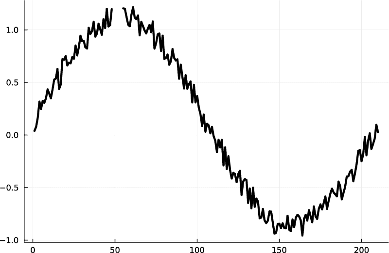

*图 10-9：处理缺失数据的绘图*

默认情况下，它会在缺失值处留下一个空白。

##### **处理缺失值的函数**

Julia 提供了几个方便处理`missing`值的函数。为了说明它们的作用，假设我们有一个数组`a`，其中包含一些数字和一些`missing`元素：

```
a = [1, missing, 2, 3, missing, 4]
```

如果你想得到数组中*数字*的总和，你可能会尝试`sum(a)`，但是如果你参考清单 10-6，你会看到，由于将数字加到`missing`值上会得到`missing`，因此`sum()`操作的最终结果也会是`missing`。在这里，Julia 的`skipmissing()`函数恰好解决了这个问题，它的作用正如其名：

```
julia> sum(skipmissing(a))
10
```

`skipmissing()`函数是内置于`Base`中的，它返回一个迭代器：

```
for i in skipmissing(a)
    println(i)
end
```

如果你运行那个循环，你会看到这个结果：

```
1
2
3
4
```

如果你需要创建一个去除`missing`值的新数组，可以使用`collect(skipmissing(a))`。

如果你想要创建一个数组，将某个特定的值替换掉原数组中的`missing`值，那么可以使用`coalesce()`函数：

```
julia> coalesce.(a, NaN)
6-element Vector{Real}:
   1
 NaN
   2
   3
 NaN
   4
```

注意我们如何需要使用点操作符将`coalesce()`应用于向量的所有元素，以及返回的数组类型不再是带有`missing`的`Union`类型。

如果你有一个分析数据的程序，并且希望使其具有处理包含`missing`元素的数据集合的能力，那么`skipmissing()`函数会让这个任务相对简单。你可能只需要用`skipmissing()`替换你数据数组中的相关部分。

然而，你可能更喜欢一种不让代码充斥着大量`skipmissing()`调用的方法。你可以利用 Julia 的多重派发定义你自己的`sum()`方法，或者对任何其他处理数据数组的函数，按照自己的喜好处理`missing`元素。如果你在每次`sum()`数据数组时（并且记住第八章关于类型窃取的警告），都希望忽略`missing`值并将数值加在一起，你可以这样定义一个方法：

```
import Base.sum
function sum(a::AbstractArray{Union{Missing, Int64}})
    return sum(skipmissing(a))
end
```

这个例子适用于整数，但很容易修改为适用于其他数值类型。

`ismissing()`函数返回`true`，如果其参数是`missing`，否则返回`false`。它通常比在数据表达式中与`Missing`类型进行比较更具表现力。

`Missings`包提供了一些用于处理这种数据类型的便捷函数。这个包不在标准库中，因此你需要使用`add`和`import`来导入它。

任何使用`missing`值的人可能会感激这个包中的两个函数。如 Listing 10-7 所示，定义一个既能容纳所需数值类型又能容纳可选值的向量有点繁琐——更重要的是，你可能会有一个数值数组，需要将其转换为一种允许你添加`missing`值的类型。以下是一个小的 REPL 会话，展示如何使用`Missings`包中的`allowmissing()`函数，它解决了这两个问题：

```
julia> import Missings
julia> a = rand(4)
julia> a = Missings.allowmissing(a)
julia> a[3] = missing;
julia> a
4-element Vector{Union{Missing, Float64}}:
 0.6225362617934931
 0.4473340385496267
  missing
 0.5062746637386624
```

你可以使用`Missings.disallowmissing()`将`Vector{Union{Missing, Float64}}`类型转换回纯浮点数类型，但首先你必须将其中的`missing`值去除。

##### **带有 Missing 值的逻辑**

在离开 Julia 的`Missing`数据类型话题之前，我们来看看它在逻辑表达式中的表现。我们通常认为逻辑值操作遵循二值（布尔）逻辑，其中唯一可能的值是`true`和`false`，这是在《逻辑》一节中回顾的内容，见第 31 页。`missing`值扩展了布尔逻辑的世界，加入了第三种真值状态，这既不是`true`也不是`false`，而是未确定的。在 Julia 中，`missing`类型与按位与（`&`）、按位或（`|`）、按位异或（`xor`）、相等（`==`）和取反（`!`）一起，形成了三值逻辑系统。

逻辑表达式的结果可以是`true`、`false`或`missing`。以下列表展示了系统的工作方式，经过思考后，条目应该是直观易懂的。例如，`true | missing`的结果是`true`，因为结果将是`true`，*无论第二个操作数的真值如何*。而`true & missing`的结果必须是`missing`，因为它将*依赖*第二个操作数的真值，而第二个操作数的真值是未确定的。

true | missing   `true`

true & missing   `true`

false | missing   `missing`

false & missing   `false`

xor(true, missing)   `missing`

xor(false, missing)   `missing`

!missing   `missing`

missing == missing   `missing`

missing === missing   `true`

由于`missing == missing`的真值取决于缺失项的值，它本身也是`missing`。然而，由于`missing`是一个单例类型，因此它的所有实例都是相同的对象；因此，`missing === missing`必须为`true`。

#### ***CSV 文件***

中等大小的数据通常以逗号分隔值（CSV）文件的形式出现。这些是由逗号分隔的文本文件，且可选择包含描述性标题。它们有一个显著的优点，即人类可读，并且可以使用所有 Linux 命令行工具进行处理。但是它们也有缺点，通常占用比必要更多的空间，比二进制表示效率低，而且在转换为文本后可能无法忠实地表示原始值。由于这些原因，这种格式可能不是存储物理模拟输出的最佳选择。然而，CSV 可能是分发通常称为“统计数据”的最常见格式，例如我们稍后将探讨的人口数据或疫情数据。

你可能会想编写自己的程序来读取 CSV 文件、解析它们并将其转换为某种 Julia 数据结构。如果你已经读到这本书的这一部分，你肯定能够做到这一点。然而，除了作为练习，最好抗拒这种诱惑。

对于实际工作，使用`CSV`包是一个更好的选择，我们需要在包管理器中`添加`这个包。这个包可以处理任何分隔符，除了逗号外，还包括流行的制表符分隔文件格式以及任何你可能遇到的自定义格式。它甚至能够在许多情况下自动识别文件使用的分隔符。这个分隔符不必仅限于单个字符；它也可以是一个字符串。`CSV`包可以处理与数据混合的注释、列标题以及你可能遇到的其他内容。它可以从磁盘读取文件，或者在给定 URL 的情况下从互联网上获取文件。它可以处理任何格式的日期，并将标签转换为更适合编程的形式。也许最重要的是，它将文本信息转换为 Julia 数据类型，并能进一步转换为几种不同的类似表格的数据格式，这些格式专为统计工作而设计，便于操作。

#### ***数据框***

这些类似表格的数据结构中最重要的是`dataframe`，它由`DataFrames`包提供，我们同样需要`添加`这个包。事实上，由 CSV 读取文件后返回的数据结构并不是最方便进行探索的，因此通常的做法是立即将其转换为`dataframe`。

`dataframe` 是一个值的表格，类似于矩阵，但具有为数据探索设计的附加功能。除了 `dataframe` 数据类型外，`DataFrames` 包还导出了几个用于操作数据框的函数。此外，许多你已经熟悉的 Julia 函数也有方法扩展其功能，以适应 `dataframe`。

最有用的理解方式是将 `dataframe` 看作是一个由列拼接而成的集合。每一列都有一个唯一的名称。可以通过整数索引、字符串形式的名称或符号形式的名称来引用某一列。在你检查、绘制或操作数据时，实际上是在处理 `dataframe` 的列。

**注意**

*我们将数据框视为用于数据分析和可视化的一组列。然而，大多数在集合上操作的 Julia 函数将数据框视为一组行。有关此主题的详细内容，请参阅 第 359 页的“进一步阅读”部分。*

让我们通过一个实际的、通常杂乱无章的数据示例来深入理解。通过对这些数据的处理，我们将使之前关于数据框的讨论更具实际意义，并介绍从野外来源中整理数据的重要函数。

让我们来看一组来自约翰霍普金斯大学系统科学与工程中心（CSSE）维护的 COVID-19 数据库的数据（[*https://github.com/CSSEGISandData/COVID-19*](https://github.com/CSSEGISandData/COVID-19)）。这些数据以 CSV 文件的形式提供，使用逗号作为分隔符。第一行包含描述每一列数据的标题，但这些标题的格式会使得后续在 Julia 中的操作变得不便。第一个问题是，一些标题是包含空格的国家或地区名称。第二个问题是，一些标题是日期，但这些日期的格式需要我们特别注意，以确保它们能够正确解析。

**注意**

*本示例中使用的数据文件可以在在线资源区找到，文件名为* time_series_covid19_confirmed_global.csv*。CSSE 数据随着时间的推移而增长，因此，本节中展示的某些图表在使用约翰霍普金斯大学未来版本的文件时可能会变得难以处理。*

幸运的是，`CSV` 包中的文件读取功能能够处理这两种常见问题。列表 10-8 展示了读取 CSV 文件并立即将其转换为 `dataframe` 的操作指令。

```
using CSV, DataFrames
covdat = CSV.File("time_series_covid19_confirmed_global.csv";
    normalizenames=true) |> DataFrame
```

*列表 10-8：读取 CSV 文件*

`normalizenames` 选项会将列名中的空格和其他难以处理的字符替换为下划线，并执行任何其他必要的转换，使标题文本成为合法的 Julia 标识符。`dateformat` 关键字参数应该是显而易见的。

`CSV.File()`的第一个参数是磁盘上文件的名称，我之前已经下载并保存了该文件。另一种选择是传递文件的 URL。`CSV.File()`将识别这一点，并自动通过互联网下载数据。日期格式是通过检查文件来确定的，文件的第一行包含列标题，内容如下所示：

```
Province/State,Country/Region,Lat,Long,1/22/20,1/23/20,1/24/20,...
```

总共有 432 列。在清单 10-8 中的第二个命令的结尾部分，将`CSV.File()`对象转换为`DataFrame`对象，并将其存储在变量`covdat`中。如果在 REPL 中执行此操作，Julia 会打印出数据框的截断表示形式。图 10-10 展示了这种情况。特定情况下，我将 REPL 窗口缩小，以便更好地适应页面。

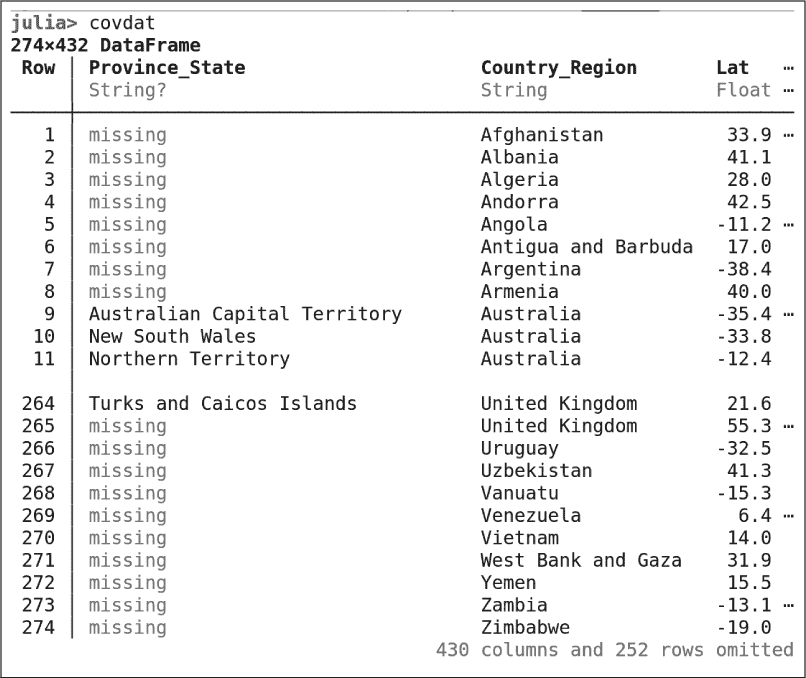

*图 10-10：REPL 中数据框的表示*

显示内容表明省略了多少信息，显示的列名称以及它们包含的数据类型。数据类型后面的问号表示某些值可能是`missing`。以下是`missing`数据类型的典型用法：文件中的大多数国家没有列出省份，但少数有。缺失的数据在原始 CSV 文件中通过缺失的数字表示……缺失。

数据框在 REPL 中的精美显示是通过`show()`实现的，通常是隐式进行的。对数据框进行`print()`操作会将整个数据框打印出来，没有漂亮的格式或类型信息，通常这不是你想要的。除此之外，`show()`还可以创建 HTML 和 LaTeX 版本，并控制数据框显示的其他方面。请参考 REPL 帮助以了解详细信息。

##### **@df 宏**

在本章余下的部分，我们将广泛使用在`StatsPlots`包中找到的一个宏，名为`@df`。它之所以是`StatsPlots`的一部分，是因为它特别有效于简化从数据框生成绘图命令，但它的使用并不限于`plot()`命令。从现在开始，假定使用以下命令：

```
using StatsPlots, Statistics
```

`@df`宏做的是宏最擅长的事情：它重写代码，使我们的程序更容易编写和阅读。这个宏的唯一作用就是：它将表达式中的符号替换为作为第一个参数出现的数据框的列。这个简单的表达式重写足以使这个宏非常受欢迎，因为它让程序员不必在表达式中多次重复数据框的名称。考虑以下示例：

```
julia> @df covdat print((minimum(:_1_1_21), maximum(:_1_1_21), mean(:_1_1_21)))
(0, 20252310, 306902.8576642336)
```

在这个表达式中，符号`:_1_1_21`每次出现时都会被转换为`covdat._1_1_21`。宏后面的参数必须是一个块或函数调用，因此，如果不将结果包裹在`print()`函数中，上面的代码会失败。

由于在使用`@df`宏时，`Symbol`会转换为数据框的列，因此我们需要一些语法来指示何时应该保留`Symbol`不变——例如，如果列名和用于其他目的的符号之间发生冲突。该宏提供了“`^()`”包装器来处理这些冲突。例如，如果数据框中恰好有一个名为“topleft”的列，您需要在绘图命令中使用语法`legend=^(:topleft)`将图例放置在西北方向。

##### **索引和筛选数据框**

数据框可以使用我们应用于矩阵的相同方法进行索引和筛选。然而，数据框提供了一些额外的索引方法，让我们能够利用其命名列。

本章仅包括我认为在大多数情况下最有用的索引和筛选方法。除此之外，还有几个包提供宏和函数，提供更多选择和转换数据框信息的方式。它们的目的是为某些常见任务提供更简化的语法，这些包可以非常方便。然而，大多数包仍处于某种变化之中。与本书中的大多数章节一样，我尽量将自己限制在那些已经稳定的方法上——这些方法你可以学会一次，并永远使用。

数据框中的项目可以使用熟悉的整数索引形式提取。以下是一些示例：

```
➊ julia> covdat[3, 2]
  "Algeria"

➋ julia> covdat[3:6, 2]
   4-element Vector{String}:
   "Algeria"
   "Andorra"
   "Angola"
   "Antigua and Barbuda"

➌ julia> covdat[1, 2:4]
   DataFrameRow
   Row | Country_Region  Lat       Long
       | String          Float64?  Float64?
  ------------------------------------------
     1 | Afghanistan      33.9391     67.71
```

注意结果的数据类型如何取决于我们如何索引数据框。如果我们请求一个元素➊，我们会返回一个单一值，在这种情况下是一个字符串。如果我们请求一个范围的行在单一列中➋，我们会得到一个`Vector`。最后，如果我们按水平方向提取数据，通过索引一个单独的行和一系列列➌，我们会得到一个我们之前未见过的数据类型：`DataFrameRow`。

让我们请求 Julia 提供一个行范围和列范围：

```
julia> covdat[266:268, 2:4]
3×3 DataFrame
 Row | Country_Region  Lat       Long
     | String          Float64?  Float64?
------------------------------------------
   1 | Uruguay         -32.5228  -55.7658
   2 | Uzbekistan       41.3775   64.5853
   3 | Vanuatu         -15.3767  166.959
```

我们得到的是一个更小的数据框。还有什么可能呢？

我们不必计算索引来引用列，而可以使用它们的名称，如示例 10-9 所示。

```
julia> covdat[272:end, [:Country_Region, :Lat, :Long, :_1_22_21]]
3×4 DataFrame
 Row | Country_Region  Lat       Long      _1_22_21
     | String          Float64?  Float64?  Int64
----------------------------------------------------
   1 | Yemen            15.5527   48.5164      2118
   2 | Zambia          -13.1339   27.8493     43333
   3 | Zimbabwe        -19.0154   29.1549     30523
```

*示例 10-9：按名称选择列*

我们使用`Symbol`来索引数据框的列。对于每个列标题，会创建一个具有相同名称的`Symbol`以便于索引。我们也可以使用列名的字符串版本，如示例 10-9 所示，但使用`Symbol`更加高效。这也是在读取数据时使用`normalizenames`的原因之一：包含空格的标题将无法成为有效的`Symbol`名称，我们将不得不使用字符串版本。示例 10-9 展示了最后三个国家、它们的纬度和经度，以及 2021 年 1 月 22 日的 COVID 病例数。

纬度和经度列的标题旁边打印了数据类型，并且带有问号。这意味着该表格中某个国家或省份的纬度或经度值缺失。为了查看这些国家或省份，我们需要找到数据表中`：Lat`或`：Long`值为`missing`的*行*。要从数据框中选择符合某个条件的行，我们可以使用`filter()`函数（详见第 163 页的《filter()操作符》）。`DataFrame`包扩展了`filter()`函数，使其可以作用于数据框，过滤行并返回一个新的数据框。以下代码行过滤了我们的 COVID 数据框，寻找缺失纬度或经度的行：

```
filter(r -> (r.Lat === missing) || (r.Long ===  missing), covdat)

1×432 DataFrame
 Row | Province_State          Country_Region  Lat       Long     ...
     | String?                 String          Float64?  Float64? ...
-------------------------------------------------------------------
   1 | Repatriated Travellers  Canada          missing   missing  ...
                                                428 columns omitted
```

结果是一个包含单行的 dataframe，其中 `Repatriated Travellers` 代替了省份名，显示了一个奇怪的符号。

与其使用`filter()`函数，你也可以使用位掩码索引或任何其他适用于普通数组的技术，得到相同的结果。

请注意，在刚才展示的例子中，我们是如何通过直接使用列名作为纯文本来指定过滤的列的。这是另一种索引形式，适用于过滤表达式。我们还可以使用这种语法从数据框中选择列，并将其转换为`Vector`：

```
julia> covdat.Country_Region
274-element Vector{String}:
 "Afghanistan"
 "Albania"
 "Algeria"
 "Andorra"
 :
 "Yemen"
 "Zambia"
 "Zimbabwe"
```

由于选择列会返回`Vector`，我们可以使用这种索引形式来绘制图表：

```
using Plots
plot(covdat.Country_Region, covdat._1_1_21; xrotation=40,
     label="Cases on 1JAN2021", legend=:topleft)
```

这里没有什么神秘的。我们只是从数据框中提取了两个向量，并按常规方式绘制了它们，得到的结果如图 10-11 所示。

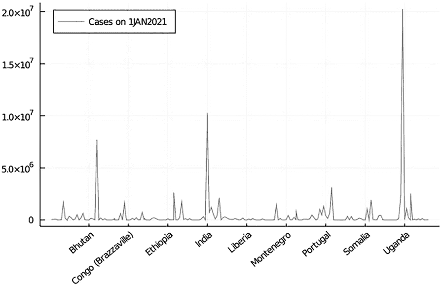

*图 10-11: 病例与国家*

然而，这个图并不理想。它展示了某个特定日期的病例分布情况，但横轴几乎没有意义，因为没有足够的空间容纳数百个国家标签。也许与其试图一次性绘制所有数据，不如绘制一些有意义的子集。我们可以通过刚刚学到的过滤机制，限制可视化仅显示病例较多的国家。此外，我们还可以切换到柱状图，这对于这种数据类型是更合适的可视化方式：

```
covhc = filter(r -> r._1_1_21 > 2*10⁶, covdat)
@df covhc bar(:Country_Region, :_1_1_21; xrotation=40,
     label="Cases on 1JAN2021", legend=:topleft)
```

现在我们得到了一些有用的东西：2021 年元旦时，病例超过两百万的国家的图表，见图 10-12。

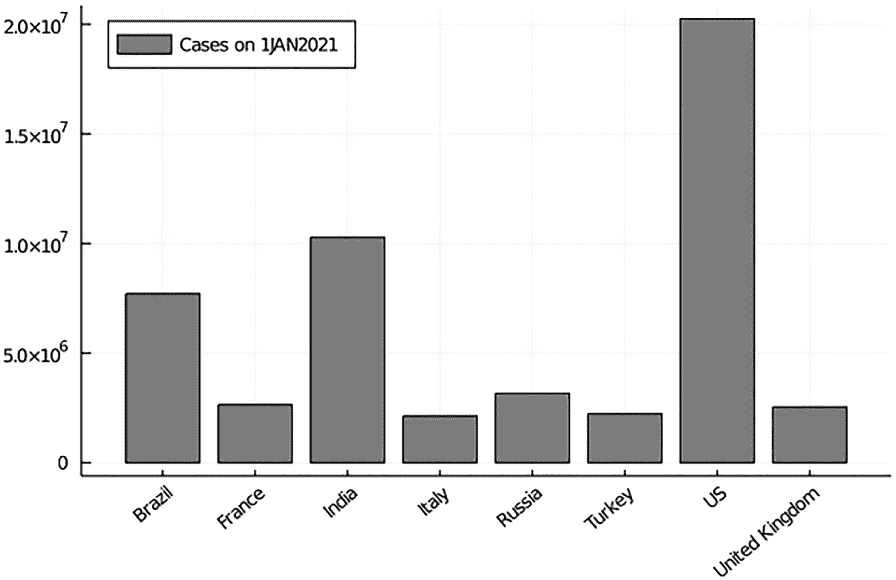

*图 10-12: 超过两百万病例的国家*

在之前的索引命令中，我们使用了整数索引来选择列，虽然有效，但需要我们计算到感兴趣的第一列。而且，这样做之所以方便，是因为我们知道我们想要的列一直延伸到最后，这简化了索引表达式。

允许我们直接使用列名的另一种方法是`Between()`函数。选择日期列的等效表达式为：

```
covdat[1, Between(:_1_22_20, end)]
```

这个操作可以很容易地修改，以选择任何闭区间的列。

另一种选择是`Not()`函数。这里是一个返回与之前相同`DataFrameRow`的选择：

```
covdat[1, Not([:Country_Region, :Province_State, :Lat, :Long])]
```

排除掉已列出的列后，剩下的就是我们想要的：日期列。

我们还可以使用正则表达式来选择列，应用于它们的标题名称。这里是另一种做相同选择的方法，返回相同的`DataFrameRow`：

```
covdat[1, r"_2"]
```

有时，这是选择数据最方便的方式。例如，如果我们只想提取 2021 年 2 月的阿富汗数据，可以直接写`covdat[1, r"_2_\d*_21"]`。

那么，如果我们想要创建一个包含所有日期列*并且*例如包含`Country_Region`列（但不包括其他列）的`DataFrameRow`呢？我们目前看到的索引方法并不方便实现这一点，尽管你可能能通过某些技巧来获得想要的结果。不过，其实无需做复杂的处理，因为我们可以使用`Cols()`函数。以下几行展示了四种不同的使用该函数的方法，以获得一个类似于我们之前使用多种技术创建的`DataFrameRow`，但加入了`Country_Region`列：

```
covdat[1, Cols(:Country_Region, r"_1")]
covdat[1, Cols("Country_Region", r"_1")]
covdat[1, Cols(2, r"_1")]
covdat[1, Cols(2, 5:end)]
```

如我们所见，`Cols()`函数允许你使用数字索引、正则表达式或列名（可以是符号或字符串）来选择单个列或列范围。它还可以重新排列列。以下示例将`covdat`数据框中的纬度和经度列移到最后：

```
covdat[:, Cols(1:2, r"_", :Lat, :Long)]
```

有了这些，我们就拥有了一个足够强大的工具箱，能够处理我们在工作中可能遇到的大多数数据框的索引、选择和重排操作。

##### **修改数据框**

索引表达式`covdat[:, :Country_Region]`和`covdat.Country_Region`似乎都返回一个与名为`covdat`的数据框的`Country_Region`列内容相同的`Vector`。然而，它们并不完全相同：

```
julia> covdat[:, :Country_Region] == covdat.Country_Region
true

julia> covdat[:, :Country_Region] === covdat.Country_Region
false
```

这告诉我们，尽管左右两边包含相同的值，但它们不是同一个对象。语法`dataframe[:, :col]`会创建列的*副本*并将其作为`Vector`返回。但`covdat.Country_Region`是对列的*引用*。如果你有选择的话，避免做不必要的副本，因为这会变慢并消耗内存。而且，如果你想通过赋值给单个元素来修改某列，你必须使用引用而非副本，正如示例 10-10 中所示。

```
julia> covdat.Country_Region[1] = "Disneyworld"
"Disneyworld"

julia> covdat
274×432 DataFrame
 Row | Province_State  Country_Region      Lat       Long    ...
     | String?         String              Float64?  Float64 ...
--------------------------------------------------------------
   1 | missing         Disneyworld          33.9391   67.71  ...
   2 | missing         Albania              41.1533   20.168
  :  |       :                 :              :         :
 274 | missing         Zimbabwe            -19.0154   29.154
                              429 columns and 271 rows omitted
```

*示例 10-10：修改数据框*

这里使用的直接点符号语法仅在使用字面量列名时有效，而不是用持有列名的变量。如果你使用变量来存储列名，必须使用方括号。不过，这并不意味着你必须创建列的副本。另一种语法允许你使用方括号通过变量引用列，而无需创建副本：`dataframe[!`, var`]`与`dataframe.columnname`的效果相同（如果 var 被设置为`"columnname"`）。

例如，命令`covdat[:, c][1] = "Disneyworld"`对原始数据框没有影响。然而，示例 10-10 中的赋值也可以写成

```
covdat[!, :Country_Region][1] = "Disneyworld"
```

这将改变数据框。感叹号的含义可以通过其在“变更参数的函数”一章中的使用得到暗示，参见第 56 页。

##### **转置数据框**

数据框使得绘制或操作数据列变得方便。但假设，使用`covdat`数据框中的数据，你想绘制多个国家的病例时间历史。对于每个国家，其时间序列是从第五列开始的该国对应的*行*部分。我们从之前的索引部分知道，我们可以从数据框中提取行，而且提取的结果不是`Vector`，而是`DataFrameRow`。这意味着，对于绘图，我们需要将结果转换为`Vector`。下面是将这些内容整合起来，用于绘制美国 COVID 病例时间历史的一个方法：

```
using Chain
@chain covdat begin
    filter(r -> r.Country_Region == "US", _)[1, 5:end]
    Vector()
    plot(names(covdat)[5:end], _, xrotation=45, legend=:topleft,
         label="US cases", lw=3)
end
```

我偷偷加了一个你之前没有见过的函数：`names()`返回数据框中列的名称，形式是一个包含字符串的`Vector`，因此它正是我们用来生成有意义的 x 轴刻度标签所需的。

该列表使用了在《@chain 宏》一章中介绍的`@chain`宏，参见第 174 页。管道语法在处理数据框中的数据时非常流行，因为这一过程本质上涉及一系列转换。这个代码片段将生成所需的时间线图，见图 10-13。

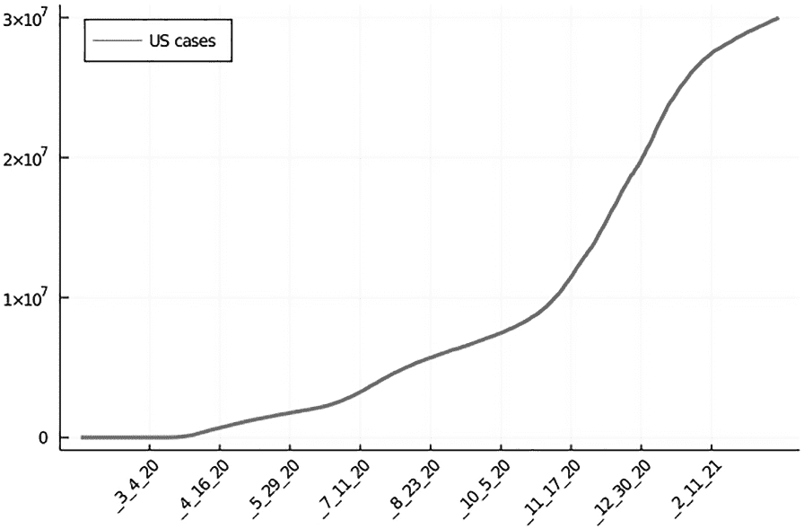

*图 10-13：美国病例与日期的关系*

现在，为了比较不同的国家，我只需要重复绘图管道，使用`plot!()`来添加新的曲线，并替换感兴趣的国家名称。

你可能会想，仅仅为了绘制一行数据，需要输入这么多内容，可能会让交互式工作变得有点繁琐。再次强调，所有这些输入是必要的，因为数据框的设计初衷是将其作为列集来处理，因此绘制行数据违背了这一设计思路。如果先将数据框翻转一下，使得行变成列，代码会更容易编写和理解。选择要绘制的数据将更直接，并且会以`Vector`的形式呈现，可以立即绘制，避免了转换的需要。

我们希望得到的是一系列不同国家的列，每列包含该国的病例数数据。如果我们有这样的数据框架，我们可以直接绘制任何国家的病例数历史图。我们还希望有一个包含日期标签的列，用于绘图。其他列可以省略。我们不打算在这些图表或后续分析中使用纬度和经度信息，但它们将保留在原始的`covdat`数据框架中，如果需要的话。我们只是创建一个新的数据框架作为工具，以便更方便地探索数据。

然而，在继续之前，我们需要处理一些国家名称出现多次的问题，因为其中一些与多个`Province_State`条目一起列出。如果这些国家名称要成为列标题，它们必须是唯一的。稍后我们会学习如何整合这些数据，但现在，我们可以简单地删除带有省份的行，仅保留主要国家条目：

```
covmc = covdat[ismissing.(covdat.Province_State), :]
```

删除了麻烦的行后，我们现在可以安全地交换行和列了。这听起来像是我们需要对数据框架进行转置；然而，`transpose()`函数（我们在处理矩阵时熟悉并喜爱的那个）在这里无法使用。幸运的是，`DataFrame`包提供了一个专门用于此目的的函数。我们在《伴随矩阵与转置》一章中（见第 144 页）了解了`permutedims()`函数，它是一种广义的转置操作。`DataFrames`包扩展了此函数以处理`DataFrame`数据框架；下面是如何使用它的方式：

```
covmc = covmc[:, Not([:Province_State, :Lat, :Long])]
cdcn = permutedims(covmc, 1, "d")
```

在第一行，我们删除了不需要的列。转置操作发生在第二行，其中`permutedims()`的第一个参数是需要转置的数据框架，第二个参数选择原数据框架中用作转置后数据框架列名的列，第三个参数是新列的名称，列内容将由原数据框架的列名组成。由于我们删除了`Province_State`列，`covmc`的第一列现在是`Country_Region`，因此该列中的国家名称被用作新的列标题。我们可以使用任何类型的选择器来指定旋转的列，因此我们也可以这样写：

```
cdcn = permutedims(covmc, :Country_Region, "d")
```

我们的新数据框架`cdcn`如图 10-14 所示。

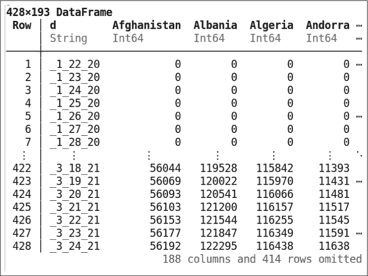

*图 10-14：REPL 中的* cdcn *数据框架*

我们刚转置的数据框架有一个问题：一些列标题现在包含了空格。你在图 10-14 中看到的小片段里看不出这些空格，但我们知道它们存在：

```
julia> [c for c in covdat.Country_Region if contains(c, " ")]
46-element Vector{String}:
 "Antigua and Barbuda"
 "Bosnia and Herzegovina"
 "Burkina Faso"
 "Cabo Verde"
 :
 "United Kingdom"
 "United Kingdom"
 "West Bank and Gaza"
```

这不是一个严重的问题，但正如你现在所知道的，合法的符号名称更加方便，有助于编写更简洁、更高效的代码。

`rename!()`函数会原地修改数据框的列名（因此会有变更警告）。它有多个方法；我们将使用的方法是将函数作为第一个参数，数据框作为第二个参数。提供的函数会分别应用到每个列上。清单 10-11 中的命令将`cdcn`数据框的列名中的空格替换为下划线。

```
rename!(x -> replace(x, " " => "_"), cdcn)
```

*清单 10-11：重命名数据框的列*

成功了吗？让我们看一眼数据框架中的相关部分：

```
julia> cdcn[:, r"^Un"]
428×2 DataFrame
 Row | United_Arab_Emirates   United_Kingdom
     | Int64                  Int64
--------------------------------------------
   1 |                    0                0
   2 |                    0                0
  :                       :                :
 428 |               446594          4312908
```

现在，我们可以轻松地绘制选定国家的时间依赖性病例数：

```
@df cdcn plot(:d, [:Zambia :Albania :Afghanistan]; xrotation=35,
              legend=:topleft, lw=3, ls=[:solid :dash :dot])
```

来自`StatsPlots`的`@df`宏在这里非常有用，因为命令通过`Symbol`引用了多个列；如果没有它，我们每次都需要提及数据框架的名称。此`plot()`命令生成了图 10-15 中的图形。

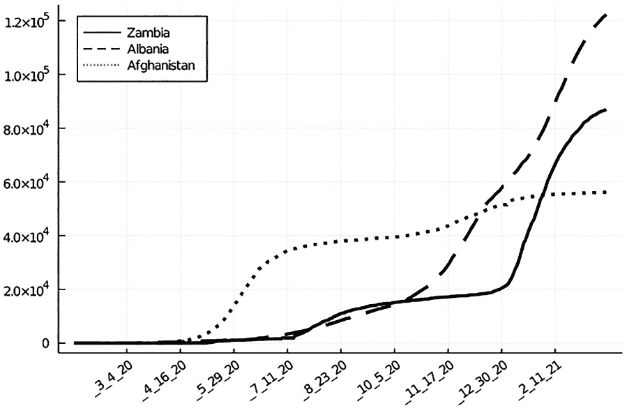

*图 10-15：三个国家病例数的时间线*

在`@df`宏调用中的`plot()`命令里，`cols()`函数（注意是小写）可以用来选择一个数值范围的列，使用`cols(a:b)`，选择所有列使用`cols()`，或者选择存储在变量中的`Symbol`名称的列，使用`c = :thecol`和`cols(c)`。

**注意**

*记住，* Cols*（大写 C）用于在方括号内选择列，是* DataFrames.jl*的一部分，而* cols*（小写）是一个用于`@df`宏的工具函数，由* StatsPlots.jl*提供。

有了我们现在掌握的所有工具，我们可以做的不仅仅是绘制随机选择的国家。一个可能有趣的任务是绘制那些在数据集中任何一天的病例数超过某个特定水平的国家。下面是使用`@df`宏和`cols()`函数来实现这一目标的一种方法：

```
sc = [Symbol(c) for c in names(cdcn)[2:end] if maximum(cdcn[:, c]) > 3*10⁶]
@df cdcn plot(:d, cols(sc); xrotation=35, lw=2, legend=:topleft, ls=:auto)
```

策略是将相关列收集为一个`Symbol`数组，这样我们可以在`plot()`语句中使用`cols()`来选择它们。图 10-16 显示了结果。

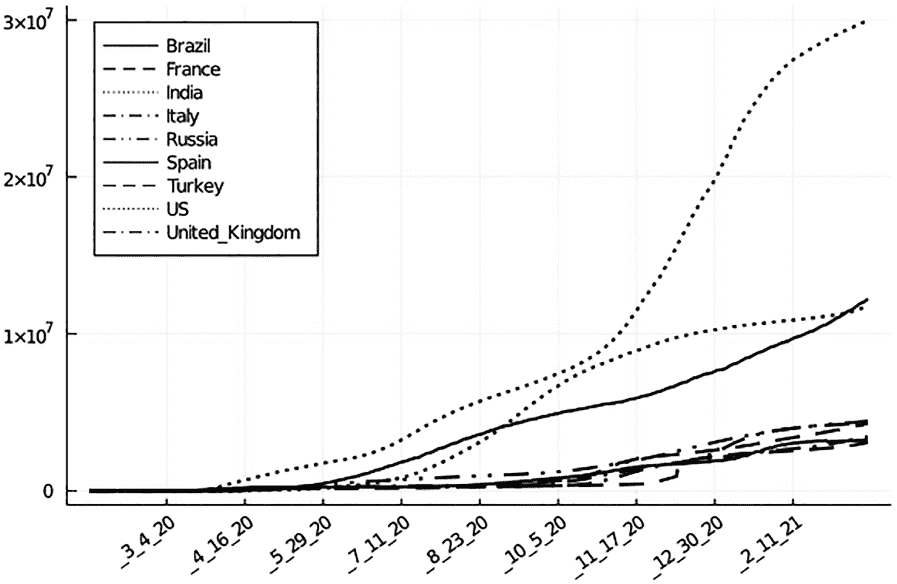

*图 10-16：病例数大的国家*

`StatsPlots`将用于绘图的标识列的符号转化为字符串，提供了一个有用的图例。

##### **汇总数据框**

`DataFrames`提供的另一个有用功能是`combine`函数。它允许我们将一个函数映射到一组列上，创建一个新的数据框，作为现有数据框的摘要。例如，假设我们想要一个表格，包含每个国家看到的最大病例数。`combine()`函数使得这一任务变得简单：

```
julia> combine(cdcn, 2:190 .=> maximum)
1×189 DataFrame
 Row | Afghanistan_maximum  Albania_maximum  Algeria_maximum ...
     | Int64                Int64            Int64           ...
--------------------------------------------------------------
   1 |               56192           122295           116438 ...
                                           186 columns omitted
```

对于第二个参数中定义的列范围内的每个列，`combine()`都会对其内容应用`maximum()`函数。

`combine()`函数通过附加函数的名称来创建新的列名。如果你希望保留原始列名，可以将`renamecols = false`传递给它。

这些数据很适合制作另一个柱状图，但如果将其转置成一个国家列和一个最大值列会更方便。我们现在知道如何做到这一点，但缺少了一步：我们需要添加一列来存放新的列名。清单 10-12 结合了我们已经学到的方法，首先制作了一个名为`cdmp`的排列数据框，然后在最后一行中，仅将具有最大工作量的行复制到另一个数据框`cdmpc`中。

```
cdmax = combine(cdcn, 2:190 .=> maximum, renamecols=false)
cdmax[!, :Country] = ["Maximum"]
cdmp = permutedims(cdmax, :Country)
cdmpc = cdmp[cdmp.Maximum .> 2*10⁶, :]
```

*清单 10-12：绘制最大工作量图*

执行完清单 10-12 中的代码后，`cdmpc`看起来是这样的：

```
14×2 DataFrame
 Row | Country          Maximum
     | String           Int64
--------------------------------
   1 | Argentina         2269877
   2 | Brazil           12220011
  :  |       :             :
  13 | US               30010928
  14 | United_Kingdom    4312908
                 10 rows  omitted
```

你会看到，在本数据集中覆盖的时间段内，只有 14 个国家的工作量超过了两百万。现在我们可以通过这个简单的命令制作柱状图：

```
bar(cdmpc.Country, cdmpc.Maximum, xrotation=45, label=nothing,
    title="Countries with highest maximum caseloads")
```

这会生成图表图 10-17。

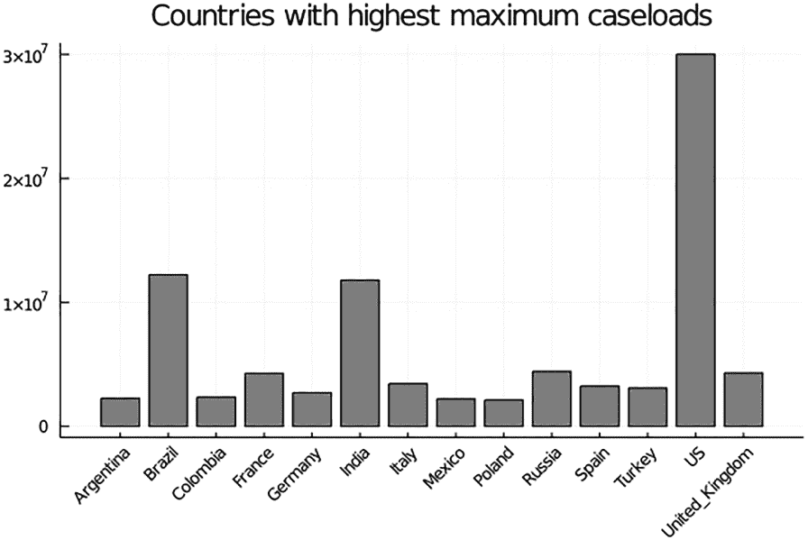

*图 10-17：最高的最大工作量*

对数据框中的数据进行汇总统计是如此常见，以至于有一个函数可以为我们执行上述工作，但了解如何“手动”操作也是很有用的，以防你需要一些它没有提供的功能。这个函数叫做`describe()`，它是这样工作的：

```
julia> describe(cdcn, :max; cols=Not(:d))
189×2 DataFrame
 Row | variable             max
     | Symbol               Int64
------------------------------------
   1 | Afghanistan            56192
   2 | Albania               122295
   3 | Algeria               116438
   4 | Andorra                11638
   5 | Angola                 21836
   6 | Antigua_and_Barbuda     1080
  :  |          :              :
 184 | Venezuela             153315
 185 | Vietnam                 2576
 186 | West_Bank_and_Gaza    230076
 187 | Yemen                   3703
 188 | Zambia                 86993
 189 | Zimbabwe               36749
                    177 rows omitted
```

这样确实更容易！默认情况下，`describe()`会返回一个包含均值和中位数的`DataFrame`，但这些对于这些时间线来说没有意义，所以我们通过传递一个符号`:max`来限制计算的统计量，选择我们想要的那个。该函数还可以计算其他汇总统计信息，如标准差，并自动跳过`missing`值。如果需要，它甚至可以报告每列中`missing`值的数量。

##### **分组数据框**

之前我们丢弃了一些数据，即对于存在此类条目的几个国家，删除了附加的省份数据。正如之前所承诺的，我们现在将找到一种方法来包含这些信息。

假设我们不关心查看各个省份的数据，而是想要将属于每个国家的所有省份的数据加起来，只看总病例数。这样比直接删除这些数据更有意义。做这种事情最方便的方法是使用*分组数据框*的概念，以及一个新的数据类型`GroupedDataFrame`。

`GroupedDataFrame`类似于一个数据框的向量。向量中的每个数据框都是通过将具有相同值的行合并在一起从源数据框中创建的。在我们的例子中，我们将按`Country_Region`进行分组。大多数`GroupedDataFrame`的成员将只有一行，因为大多数国家仅出现一次。但那些多次出现的国家（因为它们有`Province_State`值）将产生`GroupedDataFrame`成员，并且每个成员有一行对应每个`Province_State`。

一个小问题是，`GroupedDataFrame`的成员实际上不是数据框，而是具有一种叫做`SubDataFrame`的新数据类型；然而，这种区别通常并不重要。

以下将按照国家对`covdat`数据框进行分组：

```
cvgp = groupby(covdat, :Country_Region)
```

现在，`cvgp`是一个`GroupedDataFrame`。让我们在 REPL 中检查它：

```
➊ julia> length(cvgp)
   192

➋ julia> length(covdat.Country_Region) - length(cvgp)
   82

➌ julia> cvgp[1]
   1×432 SubDataFrame
    Row | Province_State  Country_Region  Lat       Long      _ ...
        | String?         String          Float64?  Float64?  I ...
   --------------------------------------------------------------
      1 | missing         Afghanistan      33.9391     67.71    ...
                                              428 columns omitted

➍ julia> cvgp[183]
   12×432 SubDataFrame
    Row | Province_State                     Country_Region  La ...
        | String?                            String          Fl ...
   --------------------------------------------------------------
      1 | Anguilla                           United Kingdom   1 ...
      2 | Bermuda                            United Kingdom   3
     :  |                 :                        :
     12 | missing                            United Kingdom   5
                                   430 columns and 9 rows omitted
```

该分组数据框有 192 个成员 ➊，这告诉我们数据中包含了多少个不同的国家（记住，其中一个是`回国旅客`）。

从总行数中减去该值➋，我们可以得知有 82 个国家列出了省份。

查看`cvgp`的个别成员 ➌ ➍ 确认这些是专门针对单个国家的数据框。下一步是将每个日期所有省份的病例数汇总起来，这样每个国家的数字将包含所有其省份的病例数。这就是`combine()`函数的作用。当我介绍`combine()`时，我们将它用于数据框，但当它应用于分组数据框时，它正好满足我们的需求，针对每个组成员分别在选定列上应用指定函数，然后返回一个普通的`DataFrame`作为结果。

首先，我们需要一个数组来保存要汇总的列，即日期列，然后我们可以使用`combine()`将它们合并。我们将结果存储在一个新变量中：

```
dcols = cdcn.d
cvsm = combine(cvgp, dcols .=> sum, renamecols=false)
```

现在，`cvsm`具有与原始`covdat`相同的结构，但只有 192 行，每行代表一个国家。和以前一样，准备好这个数据框的转置将非常方便：

```
cvsp = permutedims(cvsm, :Country_Region, "d")
```

和以前一样，最好对列名进行规范化（去除空格）。在对`cvsp`执行列表 10-11 中的程序之后，我们得到了一个适合绘图的数据框。

现在比较法国的时间线变得容易了，既有包括领土的，也有不包括领土的：

```
@df cvsp plot(:d, :France; xrotation=35, label="France with territories", legend=:topleft)
@df cdcn plot!(:d, :France; xrotation=35, label="France minus territories", legend=:topleft,
               ls=:dash)
```

图 10-18 展示了结果。

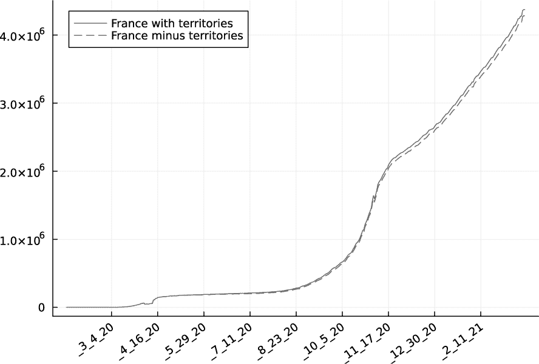

*图 10-18：法国病例数量的时间历史*

在大多数情况下，包含`Province_State`列几乎不会影响图表。

### **多变量数据**

之前的示例都处理了时间线：在不同国家中，单一数量（此处为感染人数）作为日期的函数。另一种数据形式涉及多个事件在不同地方或不同人群中发生的频率。图 10-4 展示了这种数据形式的一个简单例子，其中事件是身高观察，人口群体为男性和女性。

当你拥有多个变量的数据时，可以使用统计方法来寻找它们之间的关联，但始终记住“相关性不代表因果关系”。但是，关联可以提示你值得进一步探讨，而**缺乏**关联可能有助于排除某些假设。

在（虚构的）男性和女性身高的例子中，如果我们还从相同的受试者那里获得了收入水平或年龄的数据，我们可以寻找它们之间的关联。富裕的人是否更高？随着年龄增长，身高的增加何时会趋于平稳？Julia 的 `DataFrame` 结合其便捷的统计功能和 `StatsPlots` 提供的可视化，使得这种数据探索变得相对简单且愉快。

我从美国人口普查局维护的数据中编译了我们的第二个数据文件（[*https://www.census.gov*](https://www.census.gov)）。该数据文件可以在补充网站 [*https://julia.lee-phillips.org*](https://julia.lee-phillips.org) 上获取，文件名为 *census.dat*。该文件是制表符分隔值格式，第一行是列标题，注释行以井号（#）开头。数据包括 2011 年美国各县在多个类别中报告的犯罪绝对数字，另外还有每个县的总人口和未完成高中学业的未成年人的百分比列。注释行给出了各州和全国的总数。以下是该文件 3,143 行中的前九行：

```
Areaname    Larceny Murder  MVTheft Robbery MinorsNHI   EstimatedPop
##UNITED STATES 6384687 16107   1196608 405471  10.8    295753151
##ALABAMA   97640   308 10796   5636    7.8 4545049
Autauga, AL 1149    0   112 28  8   47870
Baldwin, AL 1973    5   137 37  11.3    162564
Barbour, AL 64  0   7   1   7.8 29452
Bibb, AL    144 0   18  3   8\.  21375
Blount, AL  558 0   134 6   11.8    55035
Bullock, AL 54  0   0   3   7.9 10975
```

显然，我们首先需要做的是使用 `CSV` 包来读取该文件并将其存储在数据框中。`CSV.File` 函数会自动检测到使用制表符作为分隔符，并且识别出第一行为标题行，但我们仍然需要告诉它注释行的情况：

```
cbc = CSV.File("census.dat", comment="#") |> DataFrame
cbc = cbc[cbc.EstimatedPop .!= 0, :]
```

第二行删除了任何人口为零的行（共有三行）。由于我们计划将绝对数除以人口以转换为比率，因此需要删除这些行。下面是转换的过程：

```
for c in 2:5
    cbc[!, c] = cbc[!, c] ./ cbc[!, 7]
end
```

到此为止，我们的数据框看起来是这样的：

```
julia> cbc
3143×7 DataFrame
  Row | Areaname        Larceny      Murder      MVTheft      Robber ...
      | String          Float64      Float64     Float64      Float6 ...
----------------------------------------------------------------------
    1 | Autauga, AL     0.0240025    0.0         0.00233967   0.0005 ...
    2 | Baldwin, AL     0.0121368    3.07571e-5  0.000842745  0.0002
    3 | Barbour, AL     0.00217303   0.0         0.000237675  3.3953
    4 | Bibb, AL        0.00673684   0.0         0.000842105  0.0001
    5 | Blount, AL      0.010139     0.0         0.00243481   0.0001 ...
    6 | Bullock, AL     0.00492027   0.0         0.0          0.0002
    7 | Butler, AL      0.0227653    9.83381e-5  0.00108172   0.0007
    8 | Calhoun, AL     0.0256511    4.46106e-5  0.00215915   0.0014
  :   |       :              :           :            :            :
 3137 | Sheridan, WY    0.0167767    0.0         0.000921795  3.6871 ...
 3138 | Sublette, WY    0.0387191    0.0         0.00262009   0.0
 3139 | Sweetwater, WY  0.0296249    2.68341e-5  0.00262974   0.0001
 3140 | Teton, WY       0.0197487    0.0         0.00149925   0.0001
 3141 | Uinta, WY       0.0283567    0.0         0.00190417   0.0002 ...
 3142 | Washakie, WY    0.00425093   0.0         0.000128816  0.0
 3143 | Weston, WY      0.0122008    0.0         0.0          0.0001
                                       3 columns and 3128 rows omitted
```

某一特定犯罪类别，比如盗窃，在各个县的分布情况如何？它们都是一样的吗？一个县的盗窃率异常高的可能性有多大？我们可以通过直方图来回答这些问题，下面的命令可以帮助我们生成直方图：

```
@df cbc histogram(:Larceny; legend=nothing)
```

在许多从数据框中提取数据的命令中，`@df` 宏可以节省一些输入时间并使代码更易于阅读。直方图，如 图 10-19 所示，表明大约 400 个县在报告年份内没有任何盗窃案件，而大多数县的比率（总数除以人口）低于 2%。超过该比率后，分布稳步下降且相对迅速。

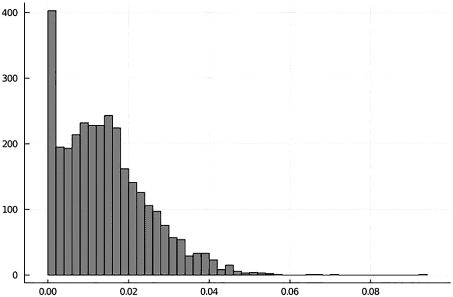

*图 10-19：盗窃案的直方图*

设置好数据框后，在 REPL 中探索这些数据变得非常简单（以下假设 `Statistics` 已经被导入）：

```
julia> mean(cbc.Larceny)
0.014305068778810368

julia> @df cbc cor(:Murder, :Larceny)
0.29993876295850447

julia> @df cbc cor(:MVTheft, :Larceny)
0.6528140798664165
```

平均盗窃率大约是 1.4%。这种犯罪与其他犯罪的关联如何？与谋杀的相关性较弱，意味着知道一个县的盗窃率高并不能告诉你该县的谋杀率如何。然而，与车辆盗窃的相关性显著：盗窃率高的县通常是更容易发生汽车被盗的地方。这可能并不令人惊讶，但在我们认真对待之前，应该记住，`Statistics`包的`cor()`函数计算出来的相关系数是皮尔逊系数，假设这两个变量之间存在线性关系。那么，这两个犯罪类别之间真有这种线性关系吗？回答这个问题的方式是通过散点图：

```
@df cbc scatter(:MVTheft, :Larceny; legend=nothing, markersize=2,
    opacity=0.3, xlabel="Motor vehicle theft", ylabel="Larceny",
    xrange=[0, 0.015])
```

从图 10-20 看，似乎这两个比率之间至少存在一种大致的线性关系，因此相关系数是有意义的。

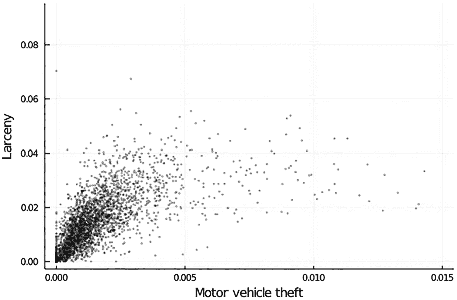

*图 10-20：盗窃与机动车盗窃散点图*

在绘制包含大量数据点的散点图时，使用较小的标记大小并结合较低的不透明度是有效的。其理念是，可能会存在重叠较多的区域。使用小且透明的点可以使任何位置的点密度在图像密度上得以体现。如果使用不透明或较大的点，一旦标记开始相互遮挡，就无法区分适中和高密度区域。

这一思路通过`StatsPlots`包中的`histogram2d()`绘图函数变得更加系统化。顾名思义，它接受两个变量并创建一个二维直方图。结果类似于散点图，但平面被分成多个单元格，单元格的颜色根据其包含的点数来确定。以下是其工作原理：

```
@df cbc histogram2d(:MVTheft, :Larceny; xlabel="Motor vehicle theft",
                    ylabel="Larceny", xrange=[0, 0.015])
```

和普通的直方图一样，如果自动计算的结果不理想，我们可以调整箱子的数量，但在这种情况下，算法已经做得很好。图 10-21 中展示的结果传达了与图 10-20 中散点图相似的信息，但现在我们可以通过颜色图读取案例数量。

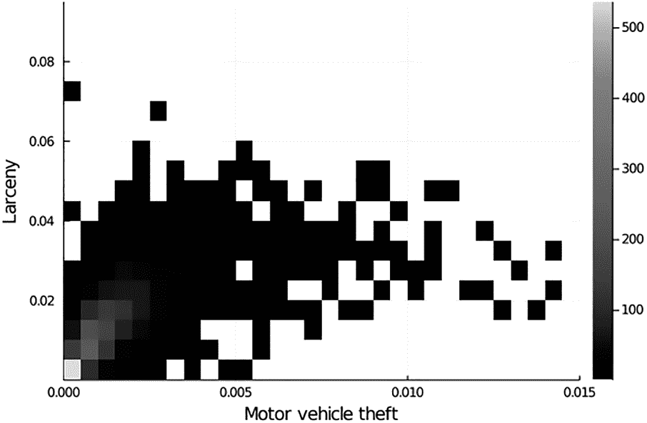

*图 10-21：两类犯罪的二维直方图*

我们之前遇到的`describe()`函数对于快速了解这种类型的数据非常有用。通过删除不感兴趣的部分，结果可以更加简洁：

```
julia> describe(cbc, :mean, :max, :nmissing)[2:end,:]
6×4 DataFrame
 Row | variable      mean         max           nmissing
     | Symbol        ...Union     Any           Int64
--------------------------------------------------------
   1 | Larceny       0.0143051    0.0925926            0
   2 | Murder        3.01897e-5   0.000539374          0
   3 | MVTheft       0.00156298   0.0231045            0
   4 | Robbery       0.000357696  0.00987096           0
   5 | MinorsNHI     11.5316      42.9                 0
   6 | EstimatedPop  94099.0      9803912              0
```

描述表中的最后一列告诉我们没有缺失值。使用复合数据类型的原因是，摘要数据框中包含了一行县名，我们通过索引表达式将其去除，因此这些列实际上包含了数字和字符串的混合。

你可以将图 10-21 中的二维直方图与每个变量的常规一维直方图结合起来，使用`StatsPlots`中的`marginalhist()`方法：

```
@df cbc marginalhist(:MVTheft, :Larceny; xlabel="Motor vehicle theft",
                     ylabel="Larceny")
```

结果如图 10-22 所示，是两个分布的同时可视化效果。

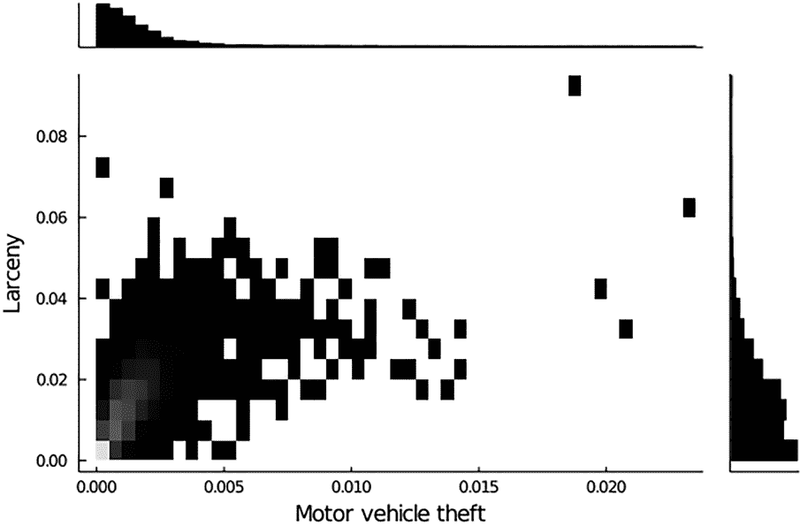

*图 10-22：说明边际直方图绘图方法*

`StatsPlots`包还有一个技巧。它可以将我们已经看到的部分图表组合成一个复合可视化，几乎一眼就能从中识别出变量之间的关联和模式。通过`corrplot()`方法可以实现这一点，如下所示：

```
@df cbc corrplot([:MinorsNHI :MVTheft :Robbery]; fillcolor=cgrad(),
                 xrotation=40)
```

我们选择了三个变量进行分析；你可以一次性查看所有内容，或者选择任何其他包含超过两个类别的子集。需要包含`fillcolor`参数是一个 bug，可能在你阅读本文时已经修复，因此你可以尝试省略它。它控制二维直方图中使用的调色板，正如你之前看到的，常规的`histogram2d`图不需要它来获取默认的颜色。

图 10-23 展示了结果。

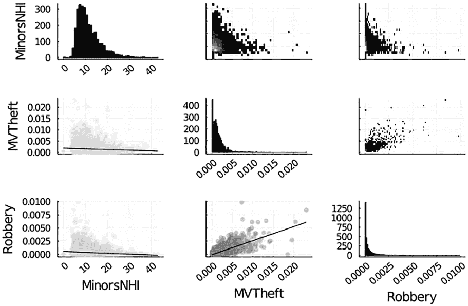

*图 10-23：相关性图*

该方法生成一个图表矩阵，比较第一个参数中提供的数组向量中所有可能的变量对组合。该图表矩阵的对角线上（两个变量相同的地方）是常规的、一维直方图；对角线以上，我们看到所有三种可能的二维直方图；对角线以下，我们有所有的散点图，使用透明点显示。作为额外功能，散点图还包括通过点绘制的回归（最佳拟合）线，标记颜色反映了相关类型：正相关用蓝色表示，缺乏相关性用黄色表示，负相关用红色表示。这是一个强大的可视化工具，承载了丰富的信息。快速浏览可以告诉我们，未完成中学教育与车辆盗窃或抢劫率无关，但这两种犯罪类型是彼此相关的。

### **其他包**

本节简要介绍了几种统计学相关的工具，读者如果对统计学感兴趣，可以了解这些工具。更多资源请参见第 359 页中的“进一步阅读”部分。

#### ***JuliaDB 用于核心外数据集***

数据框（Dataframe）是强大的数据类型，但它们适用于适合存储在内存中的数据结构。对于无法完全装入内存的数据，更好的选择是`JuliaDB`，它专门设计用于高效处理这种“核心外”数据集。

#### ***RCall 用于与 R 交互***

R 编程语言是一个历史悠久的统计分析语言和系统。像 Julia 一样，R 是自由软件，并且拥有大量忠实用户。然而，它并不是一个好的通用编程语言，对于某些类型的计算，它的速度可能会比较慢。如果你正在启动一个新项目，并且没有一个多年来自己开发的 R 代码库，我建议你使用 Julia 来满足你的统计需求。Julia 已经有一个庞大且强大的统计包生态系统，而且每天都有更多的包被添加进来。如果你的分析程序需要在大数据上快速运行，Julia 不会让你失望。它能够在 GPU 和其他多处理器硬件上运行，并且其编译后的代码效率高，这意味着你不需要重写程序以便扩展。

然而，如果你已经投入了时间和精力编写 R 例程，并希望继续使用它们，你不需要重写它们。你可以在 Julia 中直接或与之结合使用它们。`RCall` 包提供了多个宏，用于与 R 例程和数据结构互操作，还提供了一个特殊的 REPL 模式，允许在 Julia 会话中直接与 R 交互。事实上，一旦你键入 `using RCall`，一个 R 进程便会在后台启动。它会定位你的 R 安装，并且甚至可以为你安装 R。

#### ***P-hacking***

对于计算 p 值和进行其他分析，从而助长科学中的复制危机，`HypothesisTests` 包在 [*https://github.com/JuliaStats/HypothesisTests.jl*](https://github.com/JuliaStats/HypothesisTests.jl) 是无价的。

### **结论**

统计学的概念和技术跨越了所有科学学科。Julia 通过其统计包，将大量的探索和分析能力呈现在我们手中。与 `Plots` 包的良好集成使得可视化变得快速且简单。尽管像 R 这样的系统已经成为统计分析的标准，并提供一些 Julia 包尚未构建的功能，但后者发展迅速。Julia 相对于这些久经考验的工作马有一些优势：语言的开发简便性使得添加缺失功能变得更容易，Julia 的高效性使得你无需在面对大数据或计算密集型分析时将代码重写为更快的语言。

我们将在下一章中，模拟进化的章节里，再次回顾本章介绍的一些概念，在 第十三章 中，我们将探索使用概率编程技术来对模型进行推断。

**进一步阅读**

+   有关熔岩灯熵项目的详细信息，请参见 [*https://blog.cloudflare.com/randomness-101-lavarand-in-production/*](https://blog.cloudflare.com/randomness-101-lavarand-in-production/)。

+   本章中的流行病模拟实现了一个简化的模型，类似于广泛使用的 COVID-19 模型，该模型由[*https://github.com/mrc-ide/covid-sim*](https://github.com/mrc-ide/covid-sim)开发。

+   本章中流行病模拟所使用的事件组合公式来源于 William Feller 的概率论经典著作《An Introduction to Probability Theory and Its Applications》第一卷（Wiley 1968）的第四章。

+   旨在长期稳定性的替代随机数生成器，可以在[*https://github.com/JuliaRandom/StableRNGs.jl*](https://github.com/JuliaRandom/StableRNGs.jl)获取。如果你希望你的程序在未来的 Julia 版本及其包中使用相同的伪随机序列，你可能会想使用它。

+   `RCall`包的主页位于[*https://github.com/JuliaInterop/RCall.jl*](https://github.com/JuliaInterop/RCall.jl)。

+   一个经常更新的 Julia 统计学和机器学习包列表，附带简短描述，可以在[*https://github.com/JuliaStats*](https://github.com/JuliaStats)找到。

+   请观看 Juan Klopper 的这段 20 分钟教程视频，了解如何在 Julia 中进行统计学介绍：[*https://www.youtube.com/watch?v=xbsr46Dw8hg*](https://www.youtube.com/watch?v=xbsr46Dw8hg)。

+   Yoni Nazarathy 和 Hayden Klok 合著的教科书，介绍如何使用 Julia 做统计学、数据科学和机器学习，可以在[*https://statisticswithjulia.org*](https://statisticswithjulia.org)找到。

+   `JuliaDB`包的主页位于[*https://juliadb.juliadata.org/latest/out_of_core/*](https://juliadb.juliadata.org/latest/out_of_core/)。

+   关于数据框作为行集合的更多信息，请参考[*https://bkamins.github.io/julialang/2023/02/24/dfrows.html*](https://bkamins.github.io/julialang/2023/02/24/dfrows.html)。
