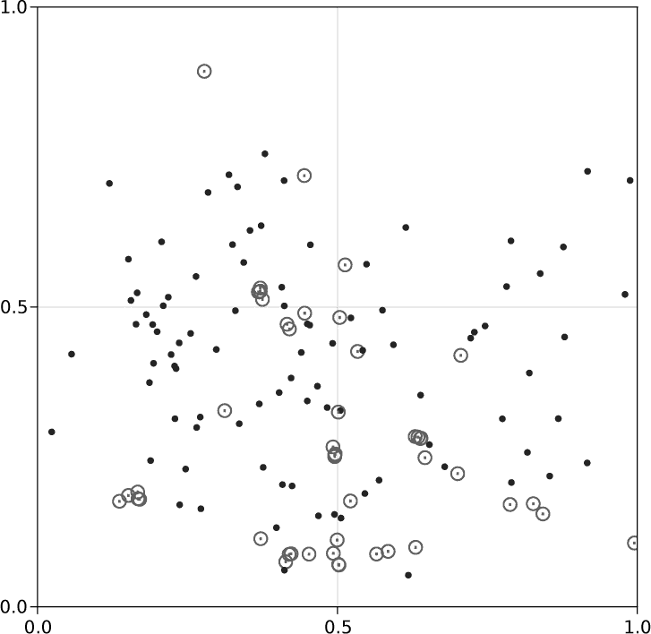
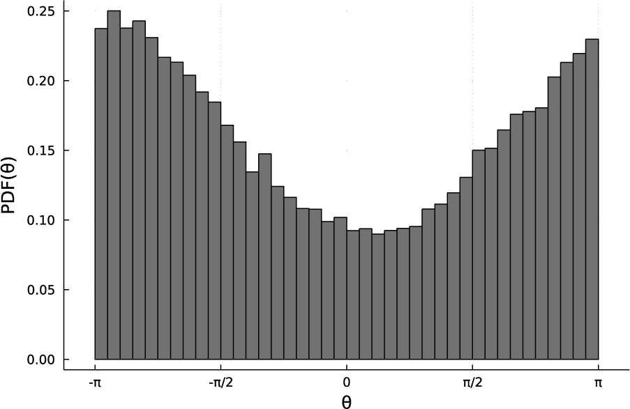
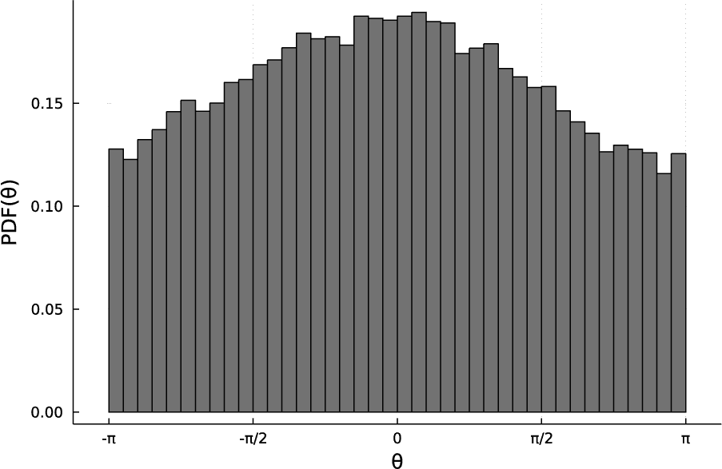
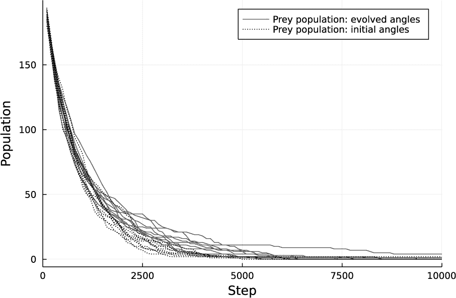

## 第十二章：生物学**

*现代生物学正越来越成为信息技术的一个分支。*

—理查德·道金斯


正如道金斯教授所指出的，计算已经成为生物学许多领域中的核心工具。这或许是不可避免的，因为进化是生物学的核心组织原则，而进化通过被称为 DNA 的数字存储设备的形式传递信息。

Julia 周围的生物学生态系统非常复杂，涵盖面广，且增长迅速。该语言及其包在生物学和医学研究的许多领域中得到了应用，涵盖了工业界和学术界。

本章首先简要概述了 Julia 生物学领域的概况，然后直接进入模拟进化的详细案例研究。

### **Julia 生物学生态系统**

生物信息学已成为生物学的一个主要子领域，其特点是使用计算机。它主要处理蛋白质序列的分析和操作，因此具有很强的计算语言学特征。BioJulia GitHub 组织为浏览这一大规模包集提供了一个起点。它包括了许多其他模块，用于处理生物信息学家多年来开发的各种文件类型。

要发现 bioinformatics 组织之外的其他 Julia 包，我们可以转向“如何查找公共包”一节中描述的常规 GitHub 搜索方法（参见第 80 页）。这些包中的许多并没有包含像“biology”这样的通用标签，因此你可以使用像 *系统发育学* 或 *生态学* 这样的关键词进行集中搜索，从而更轻松地找到它们。

`Pumas` 药物建模与仿真工具包作为 Julia 在医学和生物学领域的一个重大成功值得特别提及。`Pumas` 被大公司和研究团队用来开发和测试药物。其 GitHub 页面包含了丰富的文档和教程链接。

许多 Julia 生物学包被创建来与统计学、方程求解或其他在数学生物学中有用的领域的其他包一起使用。例如，`EvolutionaryModelingTools` 就与 `DifferentialEquations` 包协作（参见第 302 页中的“将 DifferentialEquations 与测量结合”），提供宏来帮助设置使用 Gillespie 算法（攻击随机微分方程的一种方法）进行传染病传播模型和类似结构问题的仿真。

### **使用基于代理的建模模拟进化**

*基于代理的建模 (ABM)* 是一种模拟技术，通过一群计算实体——*代理*——彼此与环境进行交互，遵循一组*规则*。这些代理可以是生命形式、车辆或更抽象的事物，如信息。规则可以依赖于时间、代理之间的距离、它们的运动、代理附近环境的状态，或者我们能想象的几乎任何其他因素。代理可能会移动、存储数据、死亡并诞生。环境本身也可能发生变化。

研究人员已使用 ABM 模拟交通流、传染病的进展、社会动物的集体行为、舆论的传播等等。请参见第 380 页中的“进一步阅读”，获取一些关于这种方法的背景信息链接，以及本节所使用的主要包的文档。

我们的项目将模拟自然选择过程中的进化，模拟一个由两种简单生物组成的种群，这些生物代表捕食者和猎物。我们将看到，当猎物生物允许从父母那里继承它们的“基因”时，它们如何进化得更擅长躲避捕食者。这种进化源于遗传特征的随机突变，加上捕食者从吃掉不善于躲避的猎物开始施加的选择压力，迫使它们在繁殖前被捕食。

`Agents`包提供了一个框架，用于各种 ABM 计算。它处理低级别的细节，如计算代理的运动、执行边界条件和查找邻居，从而使我们能够专注于在较高层次上编程代理交互的规则。

代理所处的空间可以是一个连续的物理空间（我们在这里使用的空间）；一个网格空间，代理只能占据离散的位置；一个更抽象的树形空间，其中代理并不物理存在，而是存在于树状数据结构中；甚至是一个基于实际道路地图定义的空间，使用 OpenStreetMap 数据。这个空间可以变成一个环境，包含空间和时间变化的条件，影响代理的行为。

这些代理具有位置、速度属性以及唯一的 ID。我们还可以赋予它们任何适合我们模拟的数据结构。我们可以基于代理之间的接近程度、时间或环境条件来创建或销毁代理，或者更改它们的任何属性。代理的接近性——最近的邻居或在给定半径内的邻居——可以通过简单的函数调用返回。

任何特定项目通常只会使用`Agents`的一个小子集功能，本节的项目也不例外。

### **模拟问题概述**

我们的宇宙将包含两种类型的生物：捕食者和猎物。每种类型都有简单的行为。捕食者追赶猎物。如果捕食者成功接近目标，它会从模拟中消失，被追捕者吞噬。捕食者从所有处于其探测范围内的猎物中选择目标，但它们很有礼貌：如果同伴已经追捕某个猎物，它们不会再追赶那个猎物。捕食者只有一个速度，稍微快于猎物的速度。它们在追赶猎物时会转向目标，但它们的高速度被有限的灵活性所抵消：它们每次模拟步骤只能转动一定的最大角度。像某些实际的捕食者物种一样，我们的模拟捕食者会调整它们的繁殖率，以保持捕食者种群与猎物种群的比例。

猎物按照一组角度在固定的时间间隔内转弯；每个猎物有自己的一组角度。当它到达列表的末尾时，它会回到列表的顶部。猎物不会对捕食者做出反应，它们只是按照预定的角度转弯四处奔跑。可以想象，它们的环境充满了均匀分布的食物，因为一个属性（在程序中称为`mojo`）在每一步都会增加一个固定的量。如果猎物在不被吃掉的情况下成功地积累了一定数量的`mojo`，它就会繁殖。繁殖是致命的；这个生物会被两个后代所取代。每个后代继承其父母的角度列表，并带有一些随机突变。

区分不同猎物个体的唯一特性，除了它们的位置和速度，就是角度列表。我们以一个随机列表初始化这些代理，列表中的角度均匀分布在–*π*到*π*之间。某些转弯列表由于偶然的原因，可能比其他列表更适合让代理生存得更久，因为它们会使捕食者由于有限的灵活性而更难以抓住猎物。这些代理更有可能繁殖，正如它们的后代一样。通过突变，这些后代中的一些可能比其他后代更有可能生存下来并繁殖。我们希望观察到猎物种群中角度分布的演化，以及由于这种选择压力，避免被捕食的能力的平均提高。

上述内容是该项目的结构和目标概述。在接下来的几个部分，我们将按照在完整程序中出现的顺序，将所有的模拟组件拼接在一起，完整程序方便地汇总在本章节的网页补充材料中，网址为[*https://julia.lee-phillips.org*](https://julia.lee-phillips.org)。在将这些思想转化为程序时，我们需要将一切具体化。例如，我们决定让角度列表包含八个元素。这些细节在一定范围内是任意的，读者可以尝试更改其中的全部或部分，甚至可能改进此处描述的实验。

### **捕食者和猎物代理**

`Agents` 包提供了一个便捷的宏来定义我们的代理：

```
using Agents, StatsBase, JLD2, Random

@agent Prey ContinuousAgent{2} begin
    mojo::Float64
    moves::Vector{Float64}
end

@agent Predator ContinuousAgent{2} begin
    victim::Int64
end
```

首先，我们导入所需的包。除了`Agents`，我们还需要`StatsBase`来创建角度分布的直方图，`JLD2`来保存和加载模拟数据（参见列表 9-4，第 289 页），以及`Random`用于生成随机数（参见《Julia 中的随机数》第 307 页）。

`@agent`宏将代理定义为复合类型。在执行列表中的宏后，我们有了一种名为`Prey`的代理类型，和另一种名为`Predator`的代理类型。`ContinuousAgent{2}`表示这些代理将在一个连续的二维空间中生活，其中它们的位置由一个包含两个浮点数的元组定义。

每个`Prey`实例都拥有两个属性：`mojo`，它是一个浮动值，用来决定猎物何时准备好繁殖；以及`moves`，它是一个角度向量，决定猎物在环境中盲目徘徊时的路径。

捕食者只有一个属性：`victim`，它是捕食者正在追逐的猎物的 ID。如果该值为 0，则捕食者静止不动，等待潜在猎物进入其范围。

#### ***定义模型行为的常量***

决定模型行为的某些参数在一系列常量中定义，如列表 11-1 所示。我们可以修改这些常量，以便在不同条件下进行进化实验，而无需更改程序。这些常量被声明为`const`，我们应当对所有全局变量应用此声明，以提高性能。一般来说，程序不应使用非`const`的全局变量。

```
const NPrey = 16 # Number of Prey agents
const NPred = 8 # Number of Predator agents
const PPR = 0.5 # Predator/prey ratio
const M = 8  # Number of turns
const SBT = 100 # Steps between turns
const TAD = 0.2 # Target acquisition distance
const KD = 0.01 # Kill distance
const LS = 2 # Litter size
const MIPS = 0.1 # Mojo increase per step
const MNFR = 50.0 # Mojo needed for reproduction
const SPEEDR = 1.5 # Ratio (predator speed)/(prey speed)
const LAA = π/128 # Limit of angular agility
const dt = 0.001
const SEED = 43
const rng = Random.MersenneTwister(SEED)
const LF = open("logfile", "a+") # Logfile
const LI = 100 # Log interval
```

*列表 11-1：定义模型的常量*

捕食者种群会在每一步进行调整，以保持`PPR`，根据需要增加捕食者，若比例超过 5%则会消除部分捕食者。

参数`M`是代表猎物基因组的角度向量的长度。猎物将在直线前进`SBT`步，然后转向角度向量中的下一个角度。

如果捕食者与猎物的距离小于`TAD`，它就能“看到”猎物。它开始追赶它所看到的第一个猎物，且该猎物尚未被其他捕食者追赶。如果捕食者成功地将与目标的距离缩小到`KD`以内，则目标被消灭。

当一个猎物生殖时，它会用`LS`后代替代自己。

猎物在跑步时不断进食，每一步都增加`MIPS`的`mojo`值。`mojo`实际上只是衡量一个生物存活时间的指标。当猎物的`mojo`值达到`MNFR`时，它就会繁殖。

捕食者的直线速度是猎物速度的`SPEEDR`倍。捕食者的转弯能力受到`LAA`的限制。它会朝猎物的方向转向，每一步调整一次航向，但每次转向的角度不超过`LAA`弧度。

`Agents`集成例程（一个简单的欧拉步进）使用`dt`作为时间步长。这个常量作为代理速度的总体尺度。

为了能够使用相同的随机数序列重复仿真，并在需要时创建仿真集，我们将使用一个可控的随机数生成器（详见“Julia 中的随机数”第 307 页）。这就是`SEED`和`rng`的用途。此外，当传递一个`rng`时，`rand()`函数的效率会更高，尽管这种问题在一些早期版本的 Julia 和`Random`包中比现在更为严重。

#### ***实用函数***

我们希望有一些函数使得控制捕食者的方向和改变猎物方向的代码更加简洁：

```
function vnorm(v)
    v ./ sqrt(v[1]² + v[2]²)
end

function angle_between(a, b)
    atan(b[2], b[1]) - atan(a[2], a[1])
end

function turn(v, θ)
    M = [cos(θ) -sin(θ); sin(θ) cos(θ)]
    M * [v...]
end
```

我们需要对速度向量进行归一化处理，也就是将它们的长度调整为单位长度。这正是`vnorm()`的作用。`angle_between()`函数返回两个向量之间的角度。捕食者需要这个函数来计算在追捕猎物时该怎么转向。转向，无论是捕食者还是猎物，都依赖于`turn()`，该函数在给定一个起始向量和角度后，会返回经过该角度旋转后的向量。

此外，我们还需要一个函数来变异`moves`表格。如果没有这个函数，进化过程就不会发生：

```
function rmutate!(moves, nms)
    for ms in rand(rng, 1:M, nms) # nms random mutation sites
        θ = moves[ms] + (2rand(rng) - 1) * π/4
        # Keep within ±π:
        if abs(θ) < 1π
            moves[ms] = θ
        else
            moves[ms] = (θ - sign(θ) * 2.0π) % 2.0π
        end
    end
end
```

这个函数会对表格中指定数量的角度进行随机变化，变化量是一个均匀分布在–*π*/4 到*π*/4 之间的角度。

#### ***模型初始化***

每个`Agents`仿真除了需要代理本身外，还需要三种数据结构：

```
arena = ContinuousSpace((1, 1); periodic=true)
properties = Dict(:stepno => 0, :total_step => 0)
model = ABM(Union{Prey, Predator}, arena; properties)
```

`arena`是代理生活和互动的空间。我们的空间将是连续的，坐标范围从 0 到 1，并且每个维度都采用周期性边界条件。这使得空间变得无限——一个代理跑到右边界时会重新出现在左边界。

`properties`是一个与整个仿真相关的数量字典。在我们的仿真中，我们用它来跟踪已过的步骤数。为了跟踪何时是猎物转弯的时间，我们使用`stepno`，并在每一步时增加`total_step`。前者可以从后者中推导出来，但在从保存的状态重新启动仿真时，维护两个计数器会很方便。我们将这两个计数器初始化为 0。

有了这两个对象，我们可以初始化`model`，它维护整个仿真状态。检查点和重启仿真仅需要将`model`保存到磁盘。它的构造函数的两个位置参数分别是代理类型和空间。如果我们只有一种类型的代理，调用的方式将像`ABM(Prey, arena; properties)`，例如。

我们选择`properties`作为属性字典的名称，因为该名称在模型构造函数中用作关键字，这使得调用`ABM`更加简洁（参见“关键字参数的简洁语法”在第 154 页）。

**注意**

*在写作时使用的* Agents *版本中，在这种方式下构建模型后，我们会收到一个警告。消息警告我们在使用代理类型的* Union *时可能会出现效率低下的问题。这是一个正在进行中的开发领域，警告可能会在未来版本中消失。除非我们使用超过三种代理类型，否则这个效率问题实际上并不会成为问题。*

定义了`model`后，我们可以通过添加代理来初始化它：

```
for i in 1:NPrey # Initialize Prey agents
    vel = vnorm(Tuple(rand(model.rng, 2).-0.5))
 ➊ moves = π*(2rand(model.rng, M) .- 1)
    add_agent!(Prey, model, vel, 0.0, moves)
end

for i in 1:NPred # Initialize Predator agents
    add_agent!(Predator, model, (0.0, 0.0), 0)
end
```

`add_agent!()`函数的命名使用了感叹号，提醒我们它会修改其中一个参数：它通过向`model`中添加代理来改变它。此函数在`arena`中随机位置创建一个代理。它期望第一个参数为代理类型，第二个为模型，第三个参数为一个元组，指定代理的初始*x*和*y*速度。第三个位置之后的其他位置参数将传递给代理构造函数。因此，在第一次循环中，每个`add_agent!()`调用都会使用`Prey(0.0, moves)`创建一个`Prey`实例。初始的`mojo`设置为 0，起始角度向量随机设置 ➊。

### **从模型中提取信息的函数**

让我们看一些接受`model`作为参数并返回其当前状态的短小实用函数。我们将在计算中使用其中一些函数，并用其他的来提取数据，之后在分析结果时存储并使用它们。

首先，我们需要一些函数来返回系统中所有猎物或捕食者的向量：

```
function preys(model)
    [a for a in allagents(model) if a isa Prey]
end

function predators(model)
    [a for a in allagents(model) if a isa Predator]
end
```

在列表推导式内部，我们使用了`allagents()`函数，它创建了一个迭代器，用于遍历模型中的代理。

以下这些富有提示性的函数只是调用了前面展示的函数，并返回代理向量的长度：

```
function number_of_predators(model)
    length(predators(model))
end

function number_of_preys(model)
    length(preys(model))
end
```

由于捕食者之间不会争夺猎物，它们需要知道潜在的猎物是否已经被追捕：

```
function being_chased(model)
    [a.victim for a in predators(model)]
end
```

该函数返回一个包含所有被某些捕食者标记为受害者的猎物生物 `ID` 的向量。为了判断潜在的猎物是否已经被追捕，捕食者会检查其 `ID` 是否在该列表中。

如前所述，我们期望角度向量会发生变化。了解这一过程的一个方法是观察群体中角度分布的演变（有关分布概念的概述，请参见 第 321 页的“分布”）。

以下函数收集所有捕食者的 `moves` 向量中的所有角度，并返回一个 `Histogram` 数据结构，表示将分布划分为 40 个相等的桶。然后，我们可以在不同的时间步对结果进行归一化并绘制图表，以分析仿真的一个方面：

```
function moves_dist_data(model)
    moves_data = [m.moves for m in preys(model)]
    all_angles = [i for a in moves_data for i in a]
    fit(Histogram, all_angles, -π:2π/40:π)
end
```

这个函数及其对 `fit()` 和 `Histogram` 数据结构的使用，是我们导入 `StatsBase` 包的原因。第二行中的推导式模式，带有两个 `for` 循环，是扁平化一组集合的常见方法。

#### ***通过仿真步进***

`agent_step!()` 和 `model_step!()` 函数是任何 `Agents` 仿真中的核心。在每个时间步，`agent_step!()` 函数会在 *调度器* 选中代理时更新该代理。这个更新可以包括移动代理、改变其速度、修改其属性值，或者对单个代理应用其他任何合理的变化。调度器是计算的一个组成部分，负责选择哪些代理需要更新以及更新的顺序。在大多数 `Agents` 仿真中，我们可以不指定顺序；允许调度器以任意顺序更新代理是最快的选择。

在 `agent_step!()` 函数之后（默认情况下）是 `model_step!()` 函数，该函数会执行对整个模型的更新。这包括需要访问整个代理群体的更新内容，例如那些寻找邻近代理的更新。

`agent_step!()` 函数是必需的，但 `model_step!()` 是可选的；我们的计算同时使用了这两者。此外，如果计算需要，也可以在 `agent_step!()` 之前执行 `model_step!()`。

##### **代理步进**

以下是更新捕食者和 `猎物` 代理的整个函数：

```
function agent_step!(agent, model)
    move_agent!(agent, model, dt)
    if agent isa Predator && agent.victim > 0
        if agent.victim in keys(model.agents)
            if euclidean_distance(agent, model[agent.victim], model) < KD
                kill_agent!(model[agent.victim], model)
                agent.victim = 0
                agent.vel = (0.0, 0.0) # Time to rest a bit ➊
            else
                θp = angle_between(agent.vel,
                     get_direction(agent.pos, model[agent.victim].pos, model))
                θf = min(abs(θp), LAA) * sign(θp) ➋
                agent.vel = Tuple(turn(agent.vel, θf))
            end
        else
            agent.victim = 0 # Already gone
        end
    end
    victims = being_chased(model)
    if agent isa Predator && agent.victim == 0
        food = [a for a in nearby_agents(agent, model, TAD)
                if (a isa Prey && !(a in victims))]
        if !isempty(food)
            agent.victim = food[1].id
            append!(victims, food[1].id)
           agent.vel = SPEEDR .* vnorm(get_direction(agent.pos, food[1].pos, model)) ➌
        end
    end
    if agent isa Prey
        if agent.mojo >= MNFR # Reproduce: add LS new Preys at my position
            for c in 1:LS
                child = add_agent!(agent.pos, Prey, model,
                                   vnorm(Tuple(rand(model.rng, 2).-0.5)), 0, agent.moves)
                rmutate!(child.moves, 2)
            end
            kill_agent!(agent, model) # Reproduction is fatal ➍
        end
        if model.stepno == 0
            vel = turn(agent.vel, agent.moves[1])
            agent.vel = Tuple(vel) ➎
            agent.moves = circshift(agent.moves, -1)
        end
        agent.mojo += MIPS # I eat as I run
    end
end
```

`agent_step!()` 函数（可以命名为任何名称，但我们使用了传统名称）必须接受 `agent` 和 `model` 作为参数。调度器会依次将每个代理传递给该函数，随着它对代理的轮流操作。

第一行通过时间步 `dt` 确定的量来移动代理。

然后我们消除任何被捕食者追逐的`Prey`代理，这里的“被捕获”意味着它们之间的距离小于`KD`。我们使用包内的`euclidean_distance()`函数来衡量这个距离。

吃完饭后，捕食者静止不动➊，等待另一只猎物进入攻击范围。

如果猎物距离太远无法吃掉，我们通过转向继续追逐。第一步是找到捕食者速度向量与捕食者与猎物位置之间的向量之间的当前角度。幸运的是，`Agents`包提供了一个专门的函数：`get_direction()`。调用此函数时，我们使用了`model`的两个附加特性：一个代理的位置元组可以通过`agent.pos`获得，`model[i]`返回具有`ID i`的代理。虽然`model`不是数组，但`Agents`包定义了一个`getindex()`方法来支持这一点。在将转向角度限制到捕食者的灵活性，即常数`LAA`之后，我们更新它的速度。

然后我们检查是否有任何足够接近的可追捕猎物：任何距离`TAD`以内且尚未被追逐的`Prey`代理。如果找到了，我们将捕食者的速度向量指向猎物，再次使用`get_direction()` ➌。

转向猎物时，我们首先检查它们是否积累了足够的`mojo`以进行繁殖。那些有足够`mojo`的会繁殖出`LS`个副本，然后这些副本会发生突变。我们使用`kill_agent!()`函数 ➍杀死父体，这是`Agents`包的一部分。

当需要转向时，我们使用`turn()`函数旋转速度。由于该包使用元组来存储代理的速度，我们需要将结果转换为`Tuple` ➎。

转向后，我们使用一个首次使用的函数`circshift()`来旋转代理的私人转向表，这个函数可以旋转数组。这个调用将`moves`向量向左旋转，使其第二个元素成为第一个，第一个元素成为最后一个。结果是猎物会重复做`moves`中存储的`M`次转向（如果它足够活跃的话）。

##### **模型步进**

在调度器更新所有代理后，它调用此函数，并将模型作为参数传递：

```
function model_step!(model)
    model.stepno = (model.stepno + 1) % SBT
    model.total_step += 1

    # Maintain predator/prey ratio:
    predators_pop = length(predators(model))
    prey_pop = length(preys(model))
    if predators_pop/prey_pop < PPR
        for i in 1:Int(round(PPR*prey_pop - predators_pop))
            add_agent!(Predator, model, (0.0, 0.0), 0)
        end
    end
    if predators_pop/prey_pop > 1.05PPR
        for i in 1:Int(round(predators_pop - PPR*prey_pop))
         ➊ kill_agent!(random_agent(model, a -> a isa Predator), model)
        end
    end
    # Logging and checkpointing:
    if model.total_step % LI == 0
        write(LF, "$(model.total_step), $prey_pop, $predators_pop \n")
        flush(LF)
    end
end
```

首先我们增加`model_step`，使用模算术来保持长度为`SBT`的循环；然后我们增加总步数。由于`total_step`及其其他属性与模型一起存储，我们可以通过使用`JLD2`保存并重新加载模型来进行检查点并无缝重启仿真，同时`total_step`将跟踪运行了多久。

我们通过根据需要添加或移除捕食者来保持指定的捕食者/猎物比（`PPR`）。`Agents`中的`add_agent()`函数在随机位置添加一个代理。参数列表中的元组是其初始速度，后续的参数传递给代理构造函数。在这个例子中，只有一个这样的参数：初始的`victim`属性被设置为 0。

我们通过将一个随机代理传递给`kill_agent()`来移除代理，使用`random_agent()`函数➊。这个`Agents`函数在其可选的第二个参数中接收一个函数，该函数表示潜在被删除的代理必须满足的条件。

最后，例程维护一个日志文件，每`LI`步写入一次记录。我们通过`flush()`调用日志文件，以便在仿真运行时查看它。如果没有这个调用，文件可能直到计算结束后才会写入。

#### ***运行仿真***

`run!()`函数是`Agents`的基本设施，用于逐步执行模型， 如 Listing 11-2 所示。它的四个位置参数是模型、用于更新代理的函数、用于更新模型的可选函数以及步骤总数。

```
function evolve!(model, nruns, nsteps_per_run)
    for run in 1:nruns
        adf, mdf = run!(model, agent_step!, model_step!, nsteps_per_run;
                        adata=[:mojo],
                        mdata=[:total_step, number_of_predators,
                               number_of_preys, moves_dist_data])

        jldsave("mdf$run"; mdf)
        jldsave("model$run"; model)
    end
end

evolve!(model, 10, 1000)
```

*Listing 11-2：运行仿真*

它返回两个数据框（参见“CSV 文件”在第 332 页）：一个用于代理，另一个用于模型。`adata`关键字参数是一个包含代理数据的数据向量，`mdata`关键字参数则用于模型数据框。这些数量可以是代理或模型的属性，变成符号，或者是`model`的函数。在`mdata`的值中，我们使用了三个我们在此基础上定义的函数：我们正在跟踪两个种群规模和角度分布。

我们将`run!()`封装在一个函数中，该函数调用它`nruns`次，每次让它运行模型`nsteps_per_run`步，并使用`JLD2`中的保存函数将模型数据框和整个模型存储到磁盘上。

为了从磁盘加载模型的保存版本，我们可以输入

```
mode = load(filepath, "model")
```

其中，字符串参数指定了从文件中加载的变量。

#### ***可视化系统行为***

获取模型在任何时刻的快照，或创建其进展的动画，最方便的方式是使用`InteractiveDynamics`包提供的两个函数，这需要单独导入：

```
julia> using InteractiveDynamics, CairoMakie
```

我们还需要导入`Makie`库，因为`InteractiveDynamics`使用它进行绘图。`Makie`是一个图形框架，基本上与当前的标准`Plots`类似。

在我们计划为包含两种代理类型的模型创建可视化时，让我们创建将代理类型映射到两种不同颜色和形状的函数：

```
function agent_color(agent)
   if agent isa Prey
       return :blue
   end
   if agent isa Predator && agent.victim > 0
       return :red
   end
   return :green
end

function agent_shape(agent)
   if agent isa Prey
       return '•'
   end
   return '⊙'
end
```

当这些函数一起使用时，它们将使猎物以蓝色点表示，捕食者以圆圈内有点的形式表示。追逐中的捕食者为红色，而静止的捕食者则为绿色。

在使用`run!()`将模型演化到任意步骤后，我们可以通过以下调用创建并保存其状态的图片：

```
julia> fig, _ = abmplot(model; ac=agent_color, as=20, am=agent_shape)
julia> save("model_snapshot.pdf", fig)
```

绘图函数`abmplot()`返回两个值，我们只需要第一个。代理的颜色（`ac`）和形状（`am`）使用我们之前定义的函数，我们将代理的标记大小（`as`）设置为在可视化中效果较好的值。图 11-1 显示了第 10,000 步后的结果。



*图 11-1：第 10,000 步的模型配置*

在图 11-1 中所示的时刻，总共有 139 个代理。此时没有任何捕食者处于空闲状态，因此它们全部以相同的颜色渲染。

我们还可以使用`abmvideo()`创建模型的动画，这个函数同样由`InteractiveDynamics`提供。它实际上是运行模型，从第二个参数提供的初始状态开始，通过我们提供给`run!()`的相同步骤函数进行演化：

```
julia> abmvideo("arena.mp4", model, agent_step!, model_step!;
         ac=agent_color, am=agent_shape,
         frames=500, framerate=30)
```

运行将在`frames`关键字参数中给定的步数后停止，并将视频文件保存为第一个参数给定的名称。我们可以像在`abmplot()`中一样使用常量或函数来表示代理的形状和颜色。你可以在本章的在线补充中查看使用这种方法制作的动画。

动画是验证 ABM 仿真是否按预期工作的优秀工具，尤其是在动态行为有趣时，可以用来传达结果。然而，使用`abmvideo()`运行模型要比使用`run!()`慢得多，因为除了模型计算之外，该函数还会在每个步骤使用`abmplot()`渲染图像，并且会组装一个视频文件。因此，对于长时间运行的代理仿真，策略可能是先用`run!()`运行计算，然后将某些步骤渲染为动画。这种策略需要定期保存模型，就像我们在`agent_step!()`示例中所做的那样，以便我们可以从多个已保存的状态开始。

关于`abmvideo()`还需要注意两个额外的特性：它没有像`run!()`那样使用感叹号作为名称的一部分，尽管它会改变模型；并且它不能像`run!()`那样直接生成数据框。我们可以通过将数据记录放入`model_step!()`来绕过这个问题，就像我们在示例中使用日志记录所做的那样。无论如何，这是一种更灵活的方法，因为它让我们可以更好地控制记录的数据。例如，我们可能决定不在每一步都向数据框中添加一行。

`CairoMakie` 图形库适用于制作高质量的图表和动画，并保存为文件。为了更及时的反馈，我们可以导入`GLMakie`。如果两者都已导入，调用`GLMakie.activate!()`和`CairoMakie.activate!()`可以在它们之间切换。当`GLMakie`处于活动状态时，`abmplot()`和`abmvideo()`在使用 REPL 时会打开一个专用的图形窗口，或者它们可以将图形插入到计算笔记本中。

### **分析结果**

在列表 11-2 中运行仿真时，会在每个时间步长存储捕食者角度表中的角度分布。这些角度最初是均匀分布的，所以如果分布随时间变化，我们就知道某种形式的进化正在发生。种群的角度分布并不能告诉我们其所有特征，但如果我们达到一个分布停止变化的点，这表明种群可能已经在捕食者施加的选择压力下达到了某种最优状态。

我们可以通过从模型数据框中提取`moves_dist_data`来绘制任意一步的分布直方图。第 20 次运行的数据框如下所示：

```
julia> mdf20 = load("mdf20", "mdf")
1001×5 DataFrame
  Row | step   total_step  number_of_predators  number_of_preys  moves_dist_data
      | Int64  Int64       Int64                Int64            ...Histogram
----------------------------------------------------------------------------------------------
    1 |     0       19000                 1787             3447  Histogram{Int64, 1, Tuple...
    2 |     1       19001                 1787             3444  Histogram{Int64, 1, Tuple...
    3 |     2       19002                 1787             3438  Histogram{Int64, 1, Tuple...
    4 |     3       19003                 1787             3434  Histogram{Int64, 1, Tuple...
  :   |   :        :                :                  :                         :
  999 |   998       19998                 2559             5075  Histogram{Int64, 1, Tuple...
 1000 |   999       19999                 2559             5072  Histogram{Int64, 1, Tuple...
 1001 |  1000       20000                 2559             5069  Histogram{Int64, 1, Tuple...
```

下面是调用绘制直方图的代码，来自此数据框的最后一行：

```
julia> using LinearAlgebra, Plots

julia> Plots.plot(normalize(mdf20.moves_dist_data[end], mode=:pdf);
                  xticks=([-π:π/2:π;], ["-π", "-π/2", "0", "π/2", "π"]),
                  legend=false, xlabel="θ", ylabel="PDF(θ)")
```

我们需要`LinearAlgebra`包来使用`normalize()`函数，它将原始计数的直方图重新缩放为可以解释为概率密度函数的形式（请参见第 325 页的“概率密度函数”）。这使得我们能够直接比较不同大小种群的分布。在这一阶段，数据框中可以读取到有 5,069 个`Prey`代理，并且比较早期的分布显示，分布似乎已经收敛到图 11-2 所示的形态。



*图 11-2：进化后的角度分布*

一些反思揭示了为何猎物生物可能进化出了这样的分布。捕食者比猎物显著更快（`SPEEDR` `= 1.5`），但它们的灵活性极为有限：`LAA =` π`/128`，这意味着它们在任何一步骤中最多只能转动 1.4°。如果猎物试图沿直线奔跑，捕食者很可能会在它们有机会繁殖之前抓住它们。这个事实导致了分布在接近 0°时出现明显的下降。在接近 180°的大转弯处，猎物能争取到最多的时间，这就是我们在分布中找到峰值的地方。

如果这个想法是正确的，即猎物已经“学会”避免具有这些特定属性的捕食者，那么具有不同属性的捕食者物种应该会导致不同的角度分布。

为了验证这个观点，我们只需要改变`LAA`和`SPEEDR`常量，并重新运行模拟。在尝试了`SPEEDR = 1.05`和`LAA = π/16`后，我们观察到在 13,000 步后，得到如图 11-3 所示的分布。



*图 11-3：进化后的角度分布，捕食者更慢但更灵活*

这个结果与之前的明显不同，并且有一个直观的解释。这些捕食者的速度仅比猎物快 5%，因此猎物通常能够在接近直线的路径上生存足够长的时间以进行繁殖。尽管捕食者很慢，但它们比之前模拟中的捕食者要灵活得多，能够在每一步中转动 11.25°，因此做出许多大幅度转弯的猎物更容易被捕获。因此，我们看到的分布在 0°附近有一个宽阔的峰值，并且在较大角度时逐渐下降。

分布演化具有启发性，但我们需要确认一个观点：猎物是否已经进化得更擅长避开捕食者。我们通过将进化后的种群与具有均匀角度分布的未进化种群进行比较来验证这一想法，这些种群的`moves`表格中的角度分布是均匀的。由于我们使用了种子随机数生成器，我们可以通过多次运行模拟并调整`SEED`来创建不同种群的集合。

一个种群在特定类型捕食者环境中的生存能力被称为其*适应度*。我们模型中的捕食者类型由两个参数定义：`SPEEDR`和`LAA`，即它们的速度和灵活性。

为了测试初始未进化种群的适应度，我们从 200 个`Prey`（猎物）代理和 100 个`Predator`（捕食者）代理开始，并关闭`Prey`代理的繁殖能力。在这种情况下，猎物种群应该会呈现大致指数衰减，最终趋于零。我们进行这个实验 10 次。

为了测试进化后种群的适应度，我们在模拟运行 20,000 步后加载模型，并从中提取 200 个`Prey`代理的随机样本。我们将该样本放入竞技场，与 100 个捕食者一起观察种群衰减过程，重复此实验 10 次。每次实验使用不同的随机种子，因此每次得到的随机样本都会不同。

图 11-4 显示了结果：进化后的种群明显表现得比初始种群要好。



*图 11-4：适应度比较*

当然，进化后的种群也会灭绝，因为没有繁殖能力。但比较结果表明，图 11-2 所示的急转弯策略是有效的，因为这个种群衰减得较慢。

### **结论**

在本章中，我展示了一个完整的、详细的研究问题示例：我们首先对是否可以模拟自然选择作用于种群的特定属性产生了好奇。然后，我们通过设计一个情景使问题变得具体，其中行为通过八个数字的列表来编码。接下来，我们构建了一个模拟，捕捉了我们想要研究的机制，并观察到模拟显示出种群的进化，显然趋向某个最优解。最后，我们测试了进化后的种群，发现其确实具有更强的适应性。

`Agents`包以及 Julia 的表现力和高效性，大大简化了从初步假设到可验证、定量且易于可视化结果的路径。在一个统一的交互环境中尝试多种情境并分析和查看结果，同时不牺牲性能，对于研究人员来说是前所未有的福音。

**进一步阅读**

+   有关 BioJulia（Julia 语言的生物信息学基础设施）的更多信息，请访问[*https://biojulia.dev*](https://biojulia.dev)。

+   文章“Julia for Biologists”概述了该语言在生物学中的应用：[ *https://arxiv.org/abs/2109.09973*](https://arxiv.org/abs/2109.09973)。

+   `Agents.jl`的更多详细信息，请访问[*https://juliadynamics.github.io/Agents.jl/stable/*](https://juliadynamics.github.io/Agents.jl/stable/)。

+   在这里观看关于`Agents.jl`的视频：[ *https://youtu.be/Iaco6v6TVXk*](https://youtu.be/Iaco6v6TVXk)。

+   有关人工生命领域的详细调研，请访问[*https://www.ais.uni-bonn.de/SS09/skript_artif_life_pfeifer_unizh.pdf*](https://www.ais.uni-bonn.de/SS09/skript_artif_life_pfeifer_unizh.pdf)。

+   关于人工生命模拟的有趣轶事，请访问[*https://direct.mit.edu/artl/article/26/2/274/93255/The-Surprising-Creativity-of-Digital-Evolution-A*](https://direct.mit.edu/artl/article/26/2/274/93255/The-Surprising-Creativity-of-Digital-Evolution-A)。
