## **12

**数学**

*乌尔姆的人们是数学家。*

—阿尔伯特·爱因斯坦的出生地乌尔姆的座右铭


在本章中，我们将探讨几个用于符号和数值数学的 Julia 包。符号数学软件可以取代繁琐的笔算，或者替代那些需要长时间查阅积分表的夜晚，使用自动化的数学表达式运算。数值包包括线性代数、方程求解和相关领域的模块。这两类包有大量的重叠，它们对应用数学家，或者潜在地对任何在研究中使用数学的人来说，都是一种福音。

### **符号数学**

这一类软件有时被称为*计算机代数*，但它包含所有类型的自动符号运算，如代数和三角简化；泰勒级数的生成；极限、导数和积分的计算；以及更专门的领域，如代数数论。

符号数学软件区别于我们更熟悉的计算机和数学的交集，它能够将数学作为数学来处理，而不仅仅是执行算术运算。我们将包含变量的表达式输入给它，它返回重新写过的表达式，或者是问题的解答，结果是以这些变量的形式给出，而不是数字。

#### ***符号-数值建模与 Symbolics***

本节介绍了`Symbolics`，它被描述为一种符号建模语言和数值符号软件。这些描述旨在表明`Symbolics`强调符号计算和数值计算之间的协同作用，并且设计时考虑了效率。`Symbolics`并不具备完整计算机代数系统的所有功能——例如，它不能计算不定积分。但它具有其他独特的功能。例如，它可以将普通的 Julia 函数转换为符号函数，并且可以将一个 Julia `Symbolics`程序转换为 C 程序。`Symbolics`完全用 Julia 编写，这意味着在处理符号表达式时，我们可以调用语言的任何部分。`Symbolics`是`ModelingToolkit`包的关键部分，后者是一个用于自动并行化科学机器学习的框架。

要将名称设定为符号变量，如清单 12-1 所示，最方便的方法是使用`Symbolics`包提供的宏。

```
@variables a b c φ z;
 5-element Vector{Num}:
 a
 b
 c
 φ
 z
```

*清单 12-1：声明* 符号 *变量*

在调用这个宏之后，我们可以像使用数学表达式中的变量一样使用这五个提到的变量。它们的类型是`Num`，并且与`Real`类型有很多相似的行为，但它们具有额外的能力，我们接下来会探讨。

让我们像在《矩阵乘法》一节中一样创建一个旋转矩阵，参见第 146 页：

```
RM = [cos(φ) -sin(φ); sin(φ) cos(φ)]
```

由于φ是一个`Symbolics`变量，这个矩阵是一个`Symbolics`表达式。

让我们看看如果我们像在第五章中使用“常规”旋转矩阵那样，尝试用矩阵乘法旋转一个向量，会发生什么：

```
julia> RM * [1, 0]
2-element Vector{Num}:
 cos(φ)
 sin(φ)

julia> RM * [0, 1]
2-element Vector{Num}:
 -sin(φ)
  cos(φ)

julia> RM * [1, 1]
2-element Vector{Num}:
 cos(φ) - sin(φ)
 cos(φ) + sin(φ)

julia> RM * [0.5, 0]
2-element Vector{Num}:
 0.5cos(φ)
 0.5sin(φ)

julia> RM * [0.5, 0.6]
2-element Vector{Num}:
 0.5cos(φ) - 0.6sin(φ)
 0.5sin(φ) + 0.6cos(φ)
```

在每种情况下，矩阵乘法返回一个准确的结果，适用于任何值的φ。`*`操作符能够作用于`Symbolics`表达式，像处理数字矩阵一样执行矩阵乘法。这是 Julia 包的组合性另一个例子。大多数数组和数值操作符及函数将以我们预期的方式处理`Symbolics`表达式。

要计算数值结果，我们可以使用`substitute()`函数：

```
julia> substitute(RM * [1, 0], Dict(φ => π/2))
2-element Vector{Num}:
 6.123233995736766e-17
 1.0
```

结果与“矩阵乘法”中在第 146 页的结果完全相同。

`substitute()`函数的第一个参数是一个`Symbolics`表达式，第二个参数是一个替换字典。得到的表达式不总是像我们预期的那样简化：

```
julia> ex = a²*z² + a⁴*z⁴;

julia> substitute(ex, Dict(a => sqrt(b)))
(z²)*(sqrt(b)²) + (z⁴)*(sqrt(b)⁴)

julia> substitute(ex, Dict(a => b^(1//2)))
b*(z²) + (b^(2//1))*(z⁴)
```

这里我们有一个多项式，尝试通过变量替换将其写成稍微简单的形式。我们第一次尝试失败了，因为`Symbolics`似乎不知道例如`sqrt(b)² = b`。在第二次尝试时，我们运气更好。

`Symbolics`能够自动简化涉及变量乘法或除法的表达式，尤其是带有整数次幂的变量：

```
julia> z³ * z⁵
z⁸

julia> a⁵/a³
a²
```

它还带有一个`simplify()`函数，但它的功能有限——甚至不能进行文档中提到的简化。正如前面提到的，`Symbolics`的重点是高效的数值-符号建模。我们总是可以转向`SymPy`，在下一节中将进行探讨，来对表达式进行非平凡的简化，然后将其结果用于`Symbolics`程序中。

##### **一个例子：贝塞尔函数**

作为`Symbolics`的实际应用示例，假设我们需要计算各种阶数的第一类贝塞尔函数及其一些导数。这些函数在物理学和工程学中广泛出现。在第 7-5 节的第 206 页中，我们使用了贝塞尔函数来表示振动鼓面形状，并通过`SpecialFunctions`包访问了它。

为了实现我们自己的贝塞尔函数，记作*J**m*，其中*m*是阶数，我们可以转向其著名的级数表示法：


在示例 12-2 中展示了一个实现此表示法的 Julia 函数，它接受`x`、`m`和若干项（因为我们不能计算无限项）作为参数，我们称这些为`N`。

```
function Jm(x, m::Int, N)
    s = 0
    for k in N:-1:0
        s += (-1)^k * x^(2k + m) / (2^(2k + m)*factorial(k)*factorial(k + m))
    end
    return s
end
```

*示例 12-2：使用级数展开计算贝塞尔函数*

这个函数将返回通过使用级数中的`N`项计算的*J**m*的值。因为它使用的是普通整数，而不是`big`整数，所以我们只能在`N` < 19 的情况下使用它（见第 216 页的“‘Big’ 和无理类型”）。保持九项已经足够在区间 0 ≤ *x* ≤ 6 内进行极其准确的近似。

我们的小函数`Jm()`在需要知道不同`x`值下的*J**m*的数值时非常有用，特别是如果我们不熟悉`Special` `Functions`包的话。如果我们碰巧需要不同导数的*J**m*的值，我们可以使用某种有限差分方案来计算它们，通过在两个或多个紧密相邻的`x`值处调用`Jm(x, m, N)`来计算导数。然而，这些方法固有的数值误差会随着导数阶数的增加而积累，并且反复评估`Jm(x, m, N)`也会增加计算成本。让我们看看如何通过使用`Symbolics`的方式巧妙地解决这两个问题。

如果我们为`x`、`m`和`N`提供数值并调用`Jm(x, m, N)`，我们会得到一个数值，即在`x`处的*m*阶贝塞尔函数的近似值。清单 12-3 展示了当我们为`x`提供一个`Symbolics`变量名称时会得到什么结果，而不是一个数值。

```
julia> J19 = Jm(z, 1, 9)
(1//1917756584755200)*(z¹⁷) + (1//1474560)*(z⁹) +
(1//29727129600)*(z¹³) + (1//384)*(z⁵) + (1//2)*z -
(1//176947200)*(z¹¹) - (1//18432)*(z⁷) - (1//6658877030400)*(z¹⁵) -
(1//690392370511872000)*(z¹⁹) - (1//16)*(z³)
```

*清单 12-3：一个* Symbolics *表达式近似* J*1*

在清单 12-1 中，我们创建了`Symbolics`变量`z`，以及其他一些变量。当我们将`z`传递给`Jm()`时，它会返回生成的级数展开式的九项，使用`m` = 1 和`N` = 9，并且顺序是随机的。我们将这个`Symbolics`表达式赋值给变量`J19`。我们可以通过替换来获取这个表达式的数值：

```
julia> substitute(J19, Dict(z => 1.2))
0.4982890575672154

julia> Jm(1.2, 1, 9)
0.4982890575672155
```

最后一位的数值差异是由于运算顺序的不同造成的。清单 12-2 中展示的策略是先将级数中的小项加总，然后再加上大项，这样应该能更加准确。

作为组合 Julia 包功能的另一个例子，我们可以使用`Latexify`来渲染`Symbolics`表达式的 LaTeX 版本：

```
julia> using Latexify

julia> latexify(J19)
L"\begin{equation}
\frac{1}{1917756584755200} z^{17} + \frac{1}{1474560} z^{9} - [etc.]
\end{equation}
"
```

将生成的 LaTeX 字符串的内容（并添加一些换行符）复制并粘贴到本书的源文件中（该书使用 LaTeX 排版），我们可以看到渲染后的表达式：

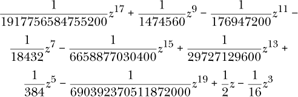

这里展示的过程，即将一个普通的 Julia 函数重新利用来生成一个`Symbolics`表达式，有时被称为*追踪*。只有那些在某种意义上是确定性的函数才能被追踪。在我们`Jm()`函数的例子中，这意味着我们可以为`x`提供一个`Symbolics`变量，但不能为项数`N`提供一个变量。对于`N`，我们必须提供一个整数。如果我们尝试为第三个位置参数提供一个`Symbolics`变量，我们会得到一个晦涩的错误信息：

```
julia> Jm(z, 1, a)
ERROR: TypeError: non-boolean (Num) used in boolean context
```

我们没有在函数签名中强制要求 `N` 为整数，正如我们对 `m` 所做的那样，是为了展示这种行为。

尝试在使用 `Symbolics` 变量表示项数时跟踪 `Jm()` 的问题在于循环限制是未知的：应该返回什么表达式？我们只能追踪那些基于输入生成完全确定表达式的函数。在此列出的特定错误信息表明我们遇到了这个问题。

##### **贝塞尔函数的求导**

由于我们已经拥有了在 Listing 12-2 中生成的*J*1 的*解析*表达式，我们可以推导出其任何阶的解析导数，从而得到 d^(*p*)*J*[1]/d*z*^(*p*)，即第 *p* 阶导数。由于 `J19` 仅是一个多项式，这个过程虽然简单，但仍然繁琐且容易出错。

`Symbolics` 可以帮助我们减轻手动求导的负担：

```
julia> Differential(z)(J19) |> expand_derivatives
(1//2) + (13//29727129600)*(z¹²) + (17//1917756584755200)*(z¹⁶) +
(5//384)*(z⁴) + (1//163840)*(z⁸) - (19//690392370511872000)*(z¹⁸) -
(11//176947200)*(z¹⁰) - (3//16)*(z²) - (7//18432)*(z⁶) - (1//443925135360)*(z¹⁴)
```

这里我们使用 `Differential()` 函数。`Differential(t)` 返回另一个函数，该函数计算 `Symbolics` 表达式对 `t` 的导数。为了实际看到这一操作的结果，我们需要将其传递给 `expand_derivatives()`。结果是多项式 `J19` 的正确求导，其项的顺序可能是随机的。

如前所述，我们可以反复应用 `Differential()` 来生成任何阶数的导数，而不必担心有限差分误差的积累。让我们来看一下贝塞尔函数的前 10 个导数：

```
   julia> using Plots, LaTeXStrings

   julia> dnJ19 = [Differential(z)(J19) |> expand_derivatives];

➊ julia> for ord in 2:10
              push!(dnJ19, Differential(z)(dnJ19[ord-1]) |> expand_derivatives)
          end

   julia> plot(J19; lw=2, xrange=(0, 6), yrange=(-0.6, 0.6), legend=false,
               xlabel=L"x", ylabel=L"J_1, J_1^\prime, J_1^{\prime\prime}, ...")

➋ julia> for ord in 1:10
              plot!(dnJ19[ord]; linestyle=:auto)
              gui()
          end
```

我们打算绘制导数，因此首先导入 `Plots`，并且为了在轴标签中显示排版数学，导入 `LaTeXStrings`。我们按照之前的方法计算贝塞尔函数的导数，并将结果放入一个向量中。在循环 ➊ 中，我们反复应用导数运算符来生成前 10 个导数。我们通过绘制 *J*1 来设置图表，使用 LaTeX 字符串作为标签，然后在循环 ➋ 中遍历导数向量的元素，将每个导数添加到可视化中。图 12-1 显示了结果。

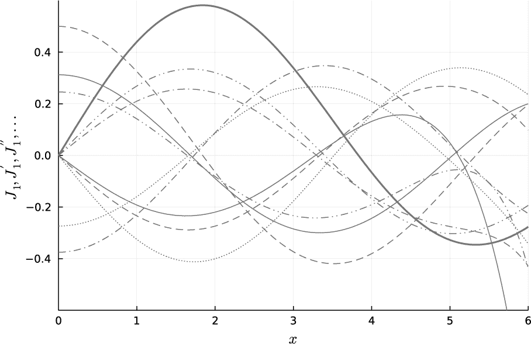

*图 12-1：*J*1 的前 10 个导数*

粗实线表示 *J*1。`linestyle=auto` 关键字参数传递给 `plot!()` 会生成一系列具有不同虚线模式的线条，使用默认的线条厚度进行绘制。这些是 10 个导数。

我们能够直接绘制这些 `Symbolics` 表达式，而不需要设置数值变量的向量或手动进行数值替换，这是组合性的另一个例子。`Plots` 包在编写时并不知道（未来的）`Symbolics` 包，但它能以自然的方式处理 `Symbolics` 表达式。

#### ***使用 SymPy 和 Pluto 进行数学运算***

对于更通用的符号数学，`SymPy`可能是目前最好的可用软件包。这个软件包是一个 Julia 封装器，基于功能强大的同名 Python 库，因此它的性能受到 Python 限制；然而，对于通常使用此类软件包的工作，原始速度通常不是一个关键因素。

**注意**

*为了从 Julia 使用* SymPy *，在一些系统和配置下，仅需在 Julia 的包模式中执行* add SymPy *，然后执行* using SymPy* 就足够了。在其他系统中，我们需要在 Julia 之外安装 Python 的* SymPy *库（可能还需要安装 Python 本身）。例如，在 Linux 上（大多数发行版中常常自带 Python），我们可以在终端执行* pip3 install sympy *。然而，由于 Python 世界中没有官方的库安装方法或解决依赖关系的标准方式，因此无法提供适用于所有人的命令。本节的其余部分假设你已经在 Julia 环境中成功执行了* add SymPy *和* using SymPy*。

`SymPy` 可以在任何这样的环境中使用，并且能够很好地在终端 REPL 中渲染数学符号。然而，从 Pluto 使用时，体验更加愉悦，我们将使用来自该环境的示例。在 Pluto 中，数学会自动渲染为 LaTeX，因此结果立即以美观的排版公式形式显示，并嵌入在笔记本中。Pluto 使用 MathJax 进行数学渲染。右键点击任何显示的表达式，会弹出一个上下文菜单，提供多个选项，其中最重要的选项是将创建表达式的 LaTeX 命令复制到剪贴板。

Pluto 是 `SymPy` 的天然平台，另一个原因是，当使用计算机代数库时，我们通常处于发现或探索模式，或者将 Julia 与 `SymPy` 作为计算器使用，而不是开发一个大型程序。Pluto 的反应式特性非常适合这种交互模式（参见 第 17 页中的“Pluto: 一个更好的笔记本”）。由于 Pluto 的依赖图，我们可以知道在任何时候，笔记本中显示的所有方程式彼此一致，而 Jupyter 则无法做到这一点。

使用 Pluto 的能力是我们可能更倾向于从 Julia 中使用 `SymPy` 而不是直接使用 Python 的原因之一。另一个原因是 `SymPy` 提供的函数和数据结构封装为 Julia 程序员提供了更熟悉的接口，并简化了与其他 Julia 程序和库的互操作性。然而，从某种意义上讲，这种封装并不完全。`SymPy` 的用户将遇到 Python 类方法语法的残留，比如在调用 `sol.rhs()` 时，表示解 `sol` 的右侧。

由于 Pluto 是一个强大（且有趣）的`SymPy`使用环境，本节中的示例将采用 Pluto 会话的截图形式（参见第一章了解如何启动 Pluto 笔记本会话）。

图 12-2 展示了会话的开始。

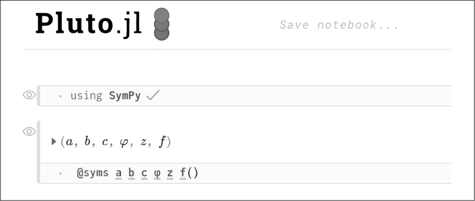

*图 12-2：在 Pluto 中启动* SymPy *会话*

导入包后，我们使用`@syms`宏将一些变量定义为`SymPy`符号名称。这与在`Symbolics`包中使用的`@variables`宏有相同的目的。将其中一个名称输入为`f()`，就会把`f`定义为一个符号函数名称，我们可以在定义微分方程时作为未知数使用（我们稍后会讨论这一点）。

##### **使用 SymPy 进行代数运算**

`SymPy`可以进行代数简化、展开及其逆操作——因式分解，如图 12-3 所示。


*图 12-3：简化、展开和因式分解*

在图 12-3 中的输入单元格里，某些字符下方微妙的下划线标明了它们是`SymPy`符号——这是界面的一项精妙改进。

为了解决代数方程组，我们可以将方程放入一个向量中，并使用`solve()`函数，传入这个向量作为参数，如图 12-4 所示。

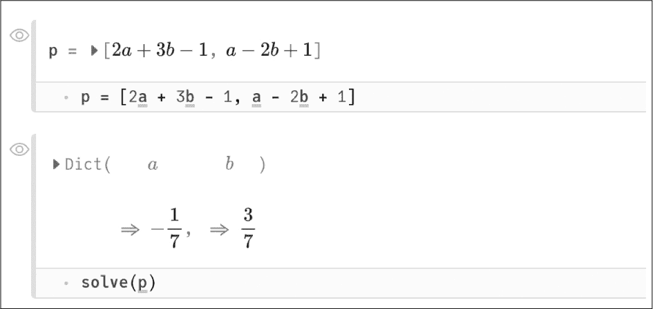

*图 12-4：求解方程组*

向量`p`包含了两个方程，右边为 0，因此，`p`代表以下的方程组：

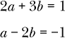

调用`solve()`的结果是解*a* = *–*1/7, *b* = 3/7。

##### **使用 SymPy 进行数值解法**

我们的例子涉及线性方程，但`SymPy`也能处理更高阶的多项式、有理方程等，并能找到复杂和多个解。我们还可以使用它的内建数值求解器，在没有符号解的情况下也能找到解。

举个例子，假设我们感兴趣的是`a`的值，使得：

sin(*a*) + log(*a*) = 1

尝试将这个问题交给符号求解器只会得到一个错误消息，表示`SymPy`没有针对其解析解的算法。这是一个需要近似数值求解器的任务。

智能数值解法要求我们至少在寻找解的区域及其附近，理解方程的行为。一个好的第一步是查看方程的图形，如图 12-5 所示。

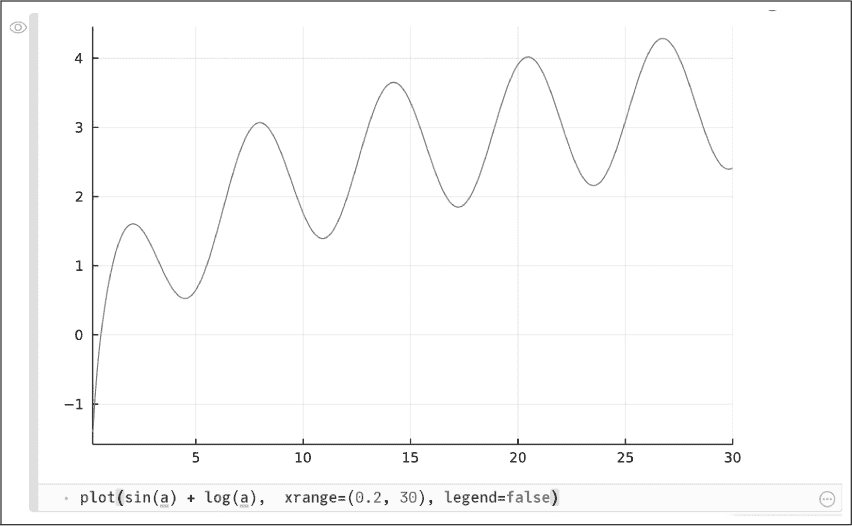

*图 12-5：寻找数值解的第一步*

这里我们绘制了方程的左边，曲线与水平线 1 的交点显示了我们可以期待解的位置。通过观察图形，可以看到有三个解，分别位于`a =` 1、3 和 5 附近。

`SymPy`的数值求解器是`nsolve()`函数。它的第一个参数是符号表达式，第二个参数是该表达式的根的初值。通过调用该函数三次并提供三个近似根，我们可以获得三个精确解，如图 12-6 所示。

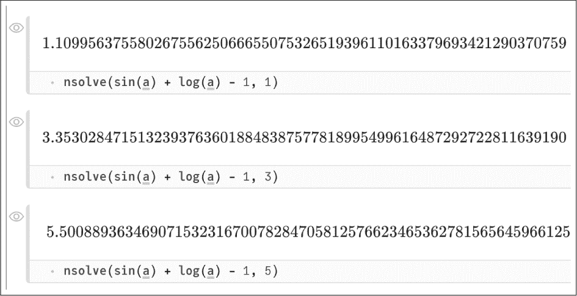

*图 12-6：数值根求解*

##### **与 SymPy 的结合**

`SymPy`掌握微积分，它可以大幅替代复杂的积分表。我们将使用该包来计算高斯分布的无穷积分和定积分（参见第 323 页的“正态分布”）。我们可以通过`integrate()`函数一步完成这些积分的求解，也可以将问题分为两个阶段。第一阶段是定义*未求值*的积分表达式，如图 12-7 所示。

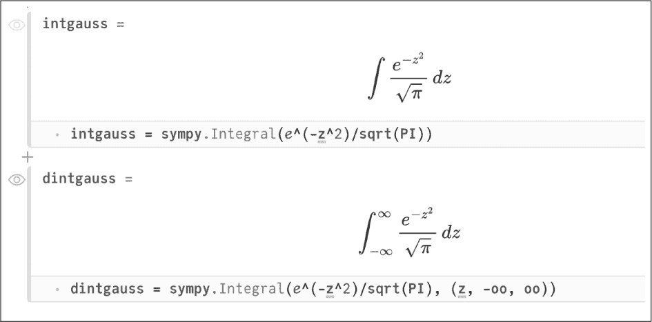

*图 12-7：未求值的积分*

我们使用`sympy.Integral()`函数创建一个未求值的积分，由于该函数没有被包裹导出，所以需要使用命名空间前缀。在这个例子中，积分符号下的表达式只有一个自变量，但如果有多个自变量，我们会将积分变量作为第二个参数传入（无论如何，这样的传入方法效果相同）。在定积分版本中，第二个参数是一个元组，包含了积分变量和上下限。这里的*e*是欧拉数，可以通过输入\euler 并按 TAB 键，或者直接输入 Unicode 字符来输入。我们使用双`o`来表示符号无穷大，使用`PI`来表示符号π——这与无理数 Julia 中的π不同，两者不可互换：如果我们使用π而不是`PI`，前者将被转换为π的近似值，且在随后的计算中，π的因子将无法相互抵消。

创建这些中间表达式而不是一步积分的原因有很多。我们可能希望将这些未求值的积分用于其他计算，或者我们可能仅仅希望检查它们的排版形式，确保我们正确地输入了它们——这种检查方法使用传统的数学符号比使用即便是极为清晰的计算机语言要更为容易。

为了求解这些积分，我们将它们传递给`doit()`函数，如图 12-8 所示。

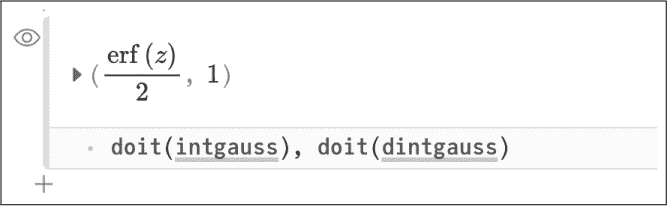

*图 12-8：求解积分*

高斯函数的无穷积分（反导数）不能用基本初等函数的封闭形式表达。它被定义为*误差函数*，缩写为 erf(*z*)。这是大多数强大计算代数系统内置的数学知识，`SymPy`也不例外。积分中的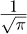因子使结果归一化，以便整个区间的定积分为 1。通过这种归一化，积分被视为概率密度函数，定积分从*a*到*b*即为观测值落在该区间内的概率。

##### **使用 SymPy 求解微分方程**

`SymPy`还可以解微分方程。为了呼应我们关于贝塞尔函数的小主题，回顾一下这些应用数学中的基本函数是如何通过微分方程的解得出的。图 12-9 展示了一个特定的示例，演示了如何在`SymPy`中定义微分方程。

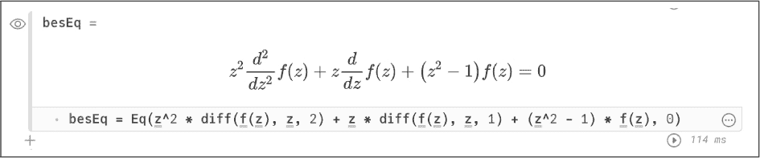

*图 12-9：贝塞尔方程*

图 12-9 展示了一级贝塞尔函数微分方程的构造。我们使用`Eq()`函数定义该方程，该函数将方程的左侧和右侧作为两个参数。在定义中，我们使用了符号微分算子：`diff(f(z), z, n)`是*f*（*z*）关于*z*的*n*阶导数。正因为如此，我们在图 12-2 中将`f()`定义为符号函数。

为了求解微分方程，我们使用`SymPy`的`dsolve()`函数，该函数将要求解的方程和要求解的函数作为前两个参数传入。但由于边界条件对于确定我们感兴趣的解至关重要，`dsolve()`还会将一个边界条件的字典作为关键字参数`ics`的值传入。我们可以在该字典中指定特定点的值或导数；在这里，我们只需要一个简单的条件来排除在原点奇异的另一个贝塞尔函数。图 12-10 展示了生成感兴趣解的调用。

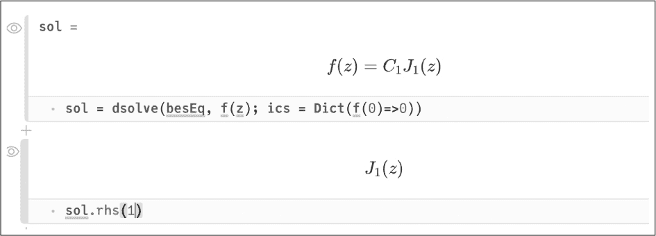

*图 12-10：求解微分方程*

图 12-10 显示了`SymPy`使用贝塞尔函数的常规表示法（在 Pluto 中；在 REPL 中则直接显示名称）。带有给定边界条件的解直到乘法常数未确定，`SymPy`将其命名为*C*[1]。图 12-10 中的第二个单元格展示了如何提取解的`rhs`（右侧），并为常数指定一个值，在本例中为 1。我们可以使用`rhs`来绘制解，如图 12-11 所示。

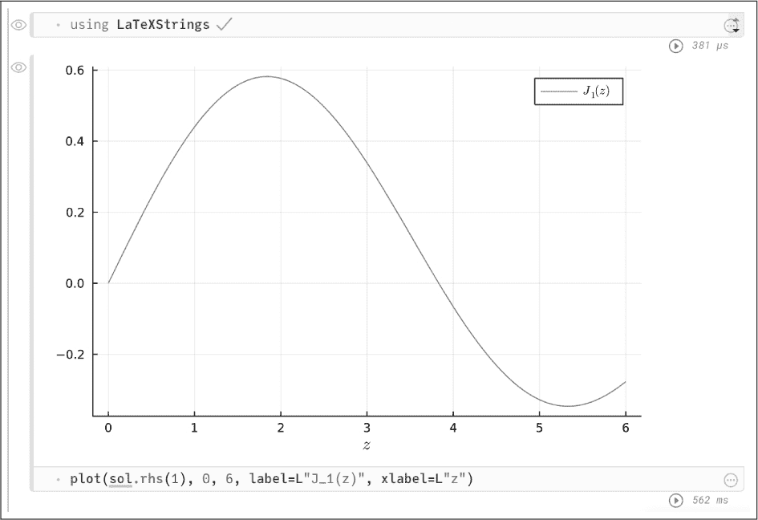

*图 12-11：绘制贝塞尔方程的解*

图 12-11 中显示的曲线与图 12-1 中通过其他方法计算的贝塞尔函数一致。

### **线性代数**

正如 L. Fox 教授在他的 1965 年教材《*数值线性代数导论*》中所说，约 75%的科学计算，完全或部分地涉及数值线性代数。不论当前的比例如何，线性代数始终是任何依赖计算机帮助解决科学、数学或工程问题的事业中的核心部分。其根本原因在于，数值线性代数的核心问题——解线性方程组，在建模各种系统时反复出现——这些系统不仅仅是行为真正线性的，还有那些在某些参数范围内可以线性建模的系统。例如，某个偏微分方程组常常可以在某个初始条件或控制参数的小范围内通过一个线性代数系统来近似。

#### ***视图***

在使用矩阵（或其他形状的数组）进行计算时，我们常常使用视图。在 Julia 中，*视图*是指向数组一部分的引用，我们可以创建并操作它而无需复制任何数据；对视图的修改会影响原始数组。

我们可以使用`@view`或`@views`宏创建视图。第一种方法紧跟在我们想要转换为视图的数组表达式之前，而第二种方法则会将整个表达式或代码块中的所有切片操作转换为视图：

```
   julia> R = rand(5, 5)
   5×5 Matrix{Float64}:
    0.957982  0.206423  0.00489974  0.0881235  0.708827
    0.301785  0.107707  0.524776    0.83413    0.771915
    0.049844  0.031097  0.22972     0.415245   0.735899
    0.438108  0.57943   0.144575    0.131095   0.103629
    0.473649  0.237991  0.148043    0.0351828  0.724837

   julia> row1Rview = @view R[1, :]
   5-element view(::Matrix{Float64}, 1, :) with eltype Float64:
    0.9579822727773696
    0.20642276219972644
    0.004899741566674942
    0.0881235008776815
    0.7088267041115207

➊ julia> row1Rview .= 17;

➋ julia> R
   5×5 Matrix{Float64}:
    17.0       17.0       17.0       17.0        17.0
     0.301785   0.107707   0.524776   0.83413     0.771915
     0.049844   0.031097   0.22972    0.415245    0.735899
     0.438108   0.57943    0.144575   0.131095    0.103629
     0.473649   0.237991   0.148043   0.0351828   0.724837

   julia> @views row1RviewAgain = R[1, :];

   julia> row1RviewAgain === row1Rview
   true
```

在创建了随机矩阵`R`的第一行视图后，我们将其中所有元素设置为 17 ➊。由于修改视图会修改原始数组，因此`R`的第一行被修改了 ➋。我们使用`@views`宏创建了相同的视图，并通过最后的表达式验证了这些视图确实是相同的。

之前使用的切片语法，如果没有`@view`或`@views`宏，会创建一个新数组，其中包含`R`第一行数据的*副本*。修改副本不会对原始数组产生任何影响。

什么时候我们应该使用副本，什么时候应该使用视图？答案取决于我们打算对数据结构进行的计算模式。在这个例子中，由于数组是按列优先存储的，操作一行数据会使用不连续的内存访问。如果在提取该行后我们反复使用它，那么创建副本所消耗的时间可能是值得的。然而，如果数组很大，副本将消耗大量内存，而使用视图可以避免这一点。副本使用更多内存，但可能会导致更快的代码。对于本段开头提出的问题，并没有普遍适用的答案。是否更好使用视图或副本，取决于涉及的数组大小以及我们如何使用这些数据。

#### ***线性代数实例***

让我们来看一个简单的示例问题。考虑 方程 12.1 中展示的 2×2 系统。

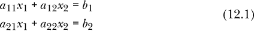

在这个方程组中，*x*[1] 和 *x*[2] 是我们最终要求解的未知数；*a*[*xx*]s 是数值系数，其索引表示它们在系统中的位置。系统的右侧由两个数字 *b*[1] 和 *b*[2] 组成。

为了应用数值线性代数的相关工具，我们将遵循通用约定，将系统更紧凑地表示为：

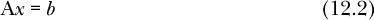

其中 A 是矩阵

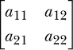

*x* 是向量 [*x*[1], *x*[2]]，*b* 是向量 [*b*[1], *b*[2]]。A 和 *x* 的并列表示通常的矩阵乘法。

方程 12.2 的形式表明，我们可以通过某种方式除以 A 来求解 *x*，这确实是对的。由于这是关于 *数值* 线性代数的章节，在 方程 12.3 中，让我们尝试用实际数字代替 方程 12.1 中的符号：

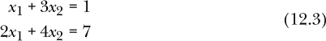

这个方程式可能有解，也可能没有解，对于 *x*[1] 和 *x*[2]。为了尝试通过数值方法求解，我们将定义一个 Julia 矩阵和一个右侧向量，分别对应 方程 12.2 中的 A 和 *b*，如 清单 12-4 所示。

```
julia> A = [1 3; 2 4]
2×2 Matrix{Int64}:
 1  3
 2  4

julia> b = [1, 7]
2-element Vector{Int64}:
 1
 7
```

*清单 12-4：一个小的线性系统*

此时，如果我们能够理解除以矩阵的概念，那么我们就可以通过将 `b` 除以 `A` 来计算解。事实上，这将是我们解决 清单 12-4 中方程组的第一种方法。

当然，我们熟悉 `/` 运算符用于除法。Julia 提供了一个“反向”版本，称为 *左除运算符*，直到现在我们还没有机会使用它：

```
julia> 1 / 3 == 3 \ 1
true
```

Julia 的 `Base` 扩展了左除运算符，使其可以作用于矩阵，计算矩阵的逆并执行矩阵乘法。结果应该是包含解的列数组：

```
julia> A \ b
2-element Vector{Float64}:
  8.5
 -2.5
```

这确实是解，我们可以立即验证：

```
julia> A * [8.5, -2.5]
2-element Vector{Float64}:
 1.0
 7.0
```

结果是 `b`，如 清单 12-4 中所定义。

如前所述，`A \ b` 的含义是矩阵 `A` 的 *逆* 与 `b` 的矩阵乘法：

```
julia> inv(A) * b
2-element Vector{Float64}:
  8.5
 -2.5

julia> inv(A) == A^-1
true
```

第二个输入表达式展示了另一种表示矩阵逆的方式。

尽管这就是 `\` 运算符的正式含义，但我们绝不应该使用 `inv()` 来求解方程组，而应该使用 `A \ b` 这样的表达式。这是因为左除运算符使用最有效的算法来求解系统，而这可能并不涉及计算矩阵的逆。

矩阵的逆定义为 A^(−1) A 和 AA^(−1) 都等于 *单位矩阵*，该矩阵与 A 形状相同，主对角线上是 1.0，其他位置是 0.0：

```
julia> A * inv(A)
2×2 Matrix{Float64}:
 1.0  0.0
 0.0  1.0
```

单位矩阵通常表示为 I，之所以这样称呼，是因为它在矩阵乘法下是单位元素：

```
julia> I22 = A * inv(A);
julia> I22 * A == A * I22 == A
true
```

一般来说，矩阵乘法不是交换的，但乘以单位矩阵和矩阵与其逆矩阵相乘是交换的。

#### ***LinearAlgebra 包***

本节中的示例目前不需要导入任何包，因为`inv()`和矩阵扩展`\`是`Base`的一部分。要进一步操作，我们需要导入`LinearAlgebra`包，它是标准库的一部分，因此导入速度很快，无需下载。本节中的其余代码示例假设你已经执行了`using LinearAlgebra`。

`LinearAlgebra`包可以执行矩阵的所有标准操作。我们将使用我们的小矩阵`A`来演示。首先是迹和行列式：

```
julia> tr(A) # Trace of A
5

julia> det(A) # Determinant of A
-2.0
```

接下来，计算特征值和特征向量（A*x* = *λx*，如果*x*是 A 的特征向量，*λ*是其特征值）：

```
julia> eigvecs(A) # Eigenvectors
2×2 Matrix{Float64}:
 -0.909377  -0.565767
  0.415974  -0.824565

julia> eigvals(A) # Eigenvalues
2-element Vector{Float64}:
 -0.3722813232690143
  5.372281323269014
```

第*n*个特征向量/特征值对是`eigvecs()`返回的矩阵的第*n*列，以及`eigvals()`返回的向量的第*n*个元素。我们可以检查`LinearAlgebra`函数是否返回正确的值：

```
julia> evec1 = eigvecs(A)[:,1];

julia> eval1 = eigvals(A)[1];

julia> A * evec1  - evec1 * eval1
2-element Vector{Float64}:
  0.0
 -5.551115123125783e-17
```

在这里，我们已为第一个特征向量及其特征值分配了名称；我们应该看到`A * evec1`等于`eval1 * evec1`。比较最终表达式中的两个值，我们可以看到它们在浮点精度范围内是相同的。

#### ***专门的矩阵类型***

线性代数例程，如`eigvals()`等，旨在调度一个算法，该算法利用参与矩阵的对称性或其他属性。例程会检查传递给它们的矩阵参数的相关属性，以选择最有效的求解方法。例如，`eigvals()`函数使用`issymmetric()`函数检查实矩阵的对称性，并使用`ishermitian()`检查复矩阵的厄米性。

在选择高效算法时，矩阵的属性非常重要，包括矩阵是否是对称的、带状的、三角形的、厄米的、稀疏的（参见第 196 页的“邻接矩阵”），或对角矩阵。每种矩阵类型都有一个相关的 Julia 类型。我们可以通过使用适当的函数创建视图，将一般矩阵转换为这些更具体的类型。例如，`Symmetric(M)`创建一个对称矩阵`M`的视图。我们可能希望这样做，以便将结果传递给线性代数函数，确保它选择最佳算法，以防它没有检测到矩阵的特征。

为了了解这一切是如何工作的，我们来看看`eigvals()`函数的行为。首先，我们为时间研究创建一个适中的大矩阵，如清单 12-5 所示。

```
julia> N = 3000;

julia> G = rand(N, N);

julia> sG = (G + G') / maximum(G + G');
```

*清单 12-5：创建一个随机的对称矩阵*

最后的赋值通过将`G`逐元素与其转置相加，创建一个对称矩阵。我们将以几种方式计算`G`的特征值，如列表 12-6 所示。我们不关心结果，但我们关心时间测量。

```
   julia> using BenchmarkTools

   julia> @btime eigvals(G);
     24.044 s (20 allocations: 69.58 MiB)

   julia> @btime eigvals(sG);
     4.612 s (14 allocations: 69.74 MiB)

➊ julia> SsG = Symmetric(sG);

   julia> SsG == sG
   true

   julia> typeof(SsG)
   Symmetric{Float64, Matrix{Float64}}

➋ julia> @btime eigvals(SsG);
     4.481 s (14 allocations: 69.74 MiB)
```

*列表 12-6：计算特征值的时间测量*

前两个时间测量展示了`eigvals()`函数如何利用矩阵的对称性显著减少计算时间。我们还创建了`sG`的`Symmetric`视图 ➊，它包含与原始矩阵相同的值，但类型不同。在这种情况下，使用`SsG`不会影响计算时间 ➋，因为`eigvals()`已经检测到`sG`是对称的。我们也可以要求`eigvals()`计算`eigvals(Symmetric(G))`，它会像计算实际对称矩阵的特征值一样快速地完成。但在这种情况下，计算出的特征值不是`G`的特征值，因为`G`不是对称的。

`eigvals()`和`eigvecs()`函数检查对称或厄米特（hermitian）参数，但不检查其他性质。我们可以通过计算上三角矩阵的特征值来演示这一点：一个在对角线下方元素为零的矩阵。首先，我们需要构造用于测试的矩阵：

```
   julia> N = 3000;

   julia> G = rand(N, N);

➊ julia> UTt = UpperTriangular(G);

   julia> typeof(UTt)
   UpperTriangular{Float64, Matrix{Float64}}

   julia> UT = Matrix(UTt);

   julia> typeof(UT)
   Matrix{Float64} (alias for Array{Float64, 2})

➋ julia> UT == UTt
   true
```

在再次创建随机矩阵`G`后，我们创建了该矩阵的`UpperTriangular`视图并将其赋值给`UTt` ➊。然后我们将其转换为基础`Matrix`类型并赋值给`UT`。这是创建一个恰好是上三角矩阵的完整矩阵的便捷方法。这两个对象包含相同的元素 ➋，但类型不同。`UTt`的类型告诉`LinearAlgebra`函数它是上三角矩阵，因此如果有可用的专门化算法，它们可以利用这一点。`eigvals()`就是这些函数之一：

```
julia> @btime eigvals(UT);
  119.571 ms (18 allocations: 69.53 MiB)

julia> @btime eigvals(UTt);
  35.905 μs (2 allocations: 23.48 KiB)
```

计算 3000 个特征值的时间远远短于一个没有结构的矩阵（列表 12-6），因为`UT`中有许多零。`eigvals()`在处理矩阵的`UpperTriangular`视图时所需的时间大幅减少（注意`@btime`返回的时间单位），内存需求也减少了。这些矩阵的元素完全相同，计算出的特征值也相同（只是返回顺序不同）。然而，`UpperTriangular`类型所携带的信息向`eigvals()`传递了矩阵的结构信息，而这些信息可以帮助它选择比通用算法更高效的算法。

这个故事的寓意是，我们应该向任何`LinearAlgebra`函数传递尽可能最具信息量的视图。

#### ***方程求解与 factorize()***

矩阵的*分解*类似于数字的分解，是一系列矩阵，当这些矩阵（矩阵）相乘时，得到原始矩阵。矩阵分解通常是求解矩阵方程（线性方程组）的早期步骤，它是通过左除操作符——标准的求解此类系统的函数——来完成的。分解过程通常是计算解时最耗时的部分，而在分解完成后，计算通常会迅速进行。由于许多问题涉及使用不同的*b*向量反复求解方程 12.2 的形式，如果我们能一次性完成分解，将计算这一部分分离出来，就能节省大量时间。这正是`LinearAlgebra`函数`factorize()`所能实现的：

```
julia> N = 8000;

julia> G = rand(N, N);

julia> g = rand(N);

julia> fG = factorize(G);

julia> @btime G \ g;
  10.073 s (6 allocations: 488.40 MiB)

julia> @btime fG \ g;
  37.942 ms (2 allocations: 62.55 KiB)
```

在这里，我们看到使用预分解矩阵求解方程组的速度约为 200 倍，且所需的内存仅为使用未分解矩阵时的一小部分。然而，调用`factorize()`本身所需的时间与计算`G \ g`的时间差不多。优势在于，我们可以在后续的问题中，针对仅有右侧向量不同的情况，廉价地利用`fG`来获得解。

用视图告诉`\`关于矩阵属性并没有帮助，就像在`eigvals()`中那样：

```
julia> g = rand(3000)

julia> @btime sG \ g;
  504.239 ms (6 allocations: 68.71 MiB)

julia> @btime SsG \ g;
  556.492 ms (8 allocations: 70.18 MiB)

julia> fSsG = factorize(SsG);

julia> @btime fSsG \ g;
  6.161 ms (2 allocations: 23.48 KiB)
```

这里同样，尽管`Symmetric`视图并没有帮助，但我们发现使用分解后的矩阵时，计算速度显著提升，所需的内存也大大减少。

### **结论**

本章涵盖了两个重要话题，我认为这些话题对科学家、工程师和其他 Julia 技术用户普遍有用。

使用符号数学包对每个人来说都有潜在的价值，我与多位学生和研究人员的讨论使我确信，许多人并不知道计算机可以计算积分和导数、符号求解方程、进行其他真正的数学操作——不仅仅是算术。打开这扇门会带来许多可能性，特别是当符号方法和数值方法结合时，正如`Symbolics`包所鼓励的那样。

当然，线性代数是计算机应用中的一个广泛传统领域，我们这里只是浅尝辄止。Julia 在这个领域的计算特别方便。BLAS（基本线性代数子程序）和 LAPACK 是数值线性代数的核心 Fortran 库，大多数编程语言的线性代数能力就是对这些经过优化的例程集合的接口。Julia 在几个方面不同寻常：BLAS 和 LAPACK 正在用纯 Julia 重写，这是一个持续进行的项目，并且通过`libblastrampoline`包，Julia 提供了独特的能力，可以在运行时动态切换 BLAS 实现。

**进一步阅读**

+   有关符号数学的更多详情，请参见[*https://lwn.net/Articles/710537/*](https://lwn.net/Articles/710537/)。

+   `Symbolics.jl`的文档可以在[*https://symbolics.juliasymbolics.org/stable/*](https://symbolics.juliasymbolics.org/stable/)找到。

+   OSCAR 是一个计算代数包，涵盖了代数、几何和数论：[ *https://oscar.computeralgebra.de*](https://oscar.computeralgebra.de)。

+   若要查看具有特殊对称性和结构的矩阵列表，请访问[*https://docs.julialang.org/en/v1/stdlib/LinearAlgebra/#Special-matrices*](https://docs.julialang.org/en/v1/stdlib/LinearAlgebra/#Special-matrices)。

+   `libblastrampoline`可以在[*https://github.com/JuliaLinearAlgebra/libblastrampoline*](https://github.com/JuliaLinearAlgebra/libblastrampoline)找到。

+   最近开发的`LinearSolve`包提供了一个统一的接口，用于选择不同的线性方程求解器：[*https://github.com/SciML/LinearSolve.jl*](https://github.com/SciML/LinearSolve.jl)。
