## 科学机器学习**

*眼睛的困惑有两种类型，源于两种原因，要么是从光中出来，要么是进入光中。*

—苏格拉底


本章的主题是通过计算解决科学问题的一种相对较新的方法。科学机器学习（SciML）领域的许多最新发展发生在 Julia 生态系统内，由使用 Julia 进行科学研究的研究人员主导。关于如何将这些新技术应用于非机器学习专家能够理解的形式的解释，公开的资料相对较少。我希望通过选择一些简单但具体的例子来填补这一空白，从而澄清其中的概念，让读者能够将其应用于各种问题。

科学机器学习并非传统的机器学习。*机器学习（ML）*是人工智能的一个分支，计算机通过练习大量数据（通常在人类监督下）自我训练，识别模式并进行分类。机器学习技术应用于诸如检测欺诈性金融交易或预测你下一个想看什么电影等问题。训练取代了传统的具体模型或算法编程。

*SciML*从机器学习中提取了几个关键技术，并将其应用于不同类别的问题。在 SciML 中，我们假设我们研究的系统由一个特定的模型描述，通常以一组微分方程表示。然而，模型中的某些参数或其他方面是未知的。如果我们有关于系统行为的数据，SciML 技术可以帮助我们高效地推断这些未知参数的值。

### **物理问题中的自动微分**

结合统计学和概率论的概念，SciML 借用了*自动微分*技术，这一点对于机器学习和科学机器学习都至关重要。传统上，微分是微积分中的一个数学过程，用于找到曲线（在一维中）或曲面（在二维或更多维度中）的斜率。我们称曲面的导数为*梯度*，它涉及处理多个变量。如果你的厨房水槽安装得当，那么其表面的负梯度在每个点都指向排水口，这样当你拔掉塞子时，所有的水都会排出去，不会留下任何水坑。

自动微分是通过编程语言计算函数的导数或梯度，而不是使用数学符号表示。编写的函数可以是数学表达式的直接翻译。通常，当表达式很复杂时，其解析导数会涉及许多项，并且通过传统方式计算会非常昂贵。自动微分可以更快。我们甚至可以使用自动微分计算没有解析形式的梯度：被微分的函数可以包含几乎任何计算，包括那些无法用数学符号表示的计算。自动微分不是数值微分；它不是有限差分计算。它也不是符号微分，正如在第十二章中探讨的那样。它应用了微积分知识，如链式法则，以及特定函数的导数和数值技术，从而高效、准确地进行微分。

机器学习（ML）使用自动微分来引导其模型朝着正确的解的方向发展，并且在 SciML 的机制中以类似的方式使用它。我们还可以显式地使用它来高效地计算数学模型中的导数，正如在第 408 页的“从势能计算力”一节中所示。

#### ***使用 ForwardDiff 进行微分***

我们可以在本章中通过`ForwardDiff`包中的`derivative()`函数来满足自动微分的需求，我假设以下示例中已导入该包。其使用方法很简单：我们提供一个函数和一个值，`ForwardDiff.derivative()`将返回在提供的值处求得的该函数的导数：

```
julia> ForwardDiff.derivative(sin, 0.0)
1.0
```

结果是正确的：sin(*x*) 的导数是 cos(*x*)，而 cos(0) = 1。

`ForwardDiff.derivative()`函数也可以处理在 Julia 中定义的函数，这些函数可能包含几乎任何类型的计算：

```
julia> function fdst(x)
           (x - floor(x))² / ceil(x)
       end
fdst (generic function with 1 method)

julia> plot(fdst, 0, 5; label="fdst(x)", xlabel="x", lw=2);

julia> plot!(x -> ForwardDiff.derivative(fdst, x); label="fdst'(x)", lw=2, ls=:dash)
```

`floor()`和`ceil()`函数将它们的参数四舍五入到最接近的小或大的整数。示例中定义的`fdst()`函数不是我们能在导数表中查找的，也不能使用微积分的常规方法来处理，但 Julia 的自动微分例程能够正确地计算其导数。图 13-1 展示了结果。

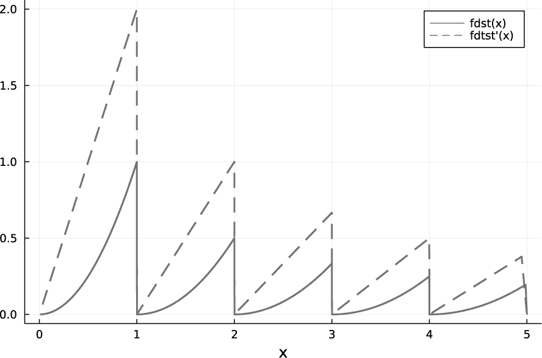

*图 13-1：一个奇怪函数的自动微分*

在图 13-1 中，图例使用了一个撇号来表示导数。虚线表示自动微分函数的结果，它不受不连续点存在的困扰。

#### ***从势能计算力***

在物理学中，作用在物体上的力是其势能的负梯度。如果势能仅依赖于一个变量，那么它就是该变量的导数的负值。让我们重新审视第九章中的有限角度摆问题。

列表 13-1 为了方便起见，将问题总结在一个地方。

```
   using ForwardDiff
   using DifferentialEquations
   const L = 1.0
   const g = 9.8
   const m = 1.0

➊ function ppot(θ)
       return m*g*L*(1-cos(θ))
   end

   function pendulum!(du, u, p, t)
       L, g = p
       θ, ω = u
       du[1] = ω
    ➋ du[2] = -ForwardDiff.derivative(ppot, u[1])/m
   end

   function pendulumF!(du, u, p, t)
       L, g = p
       θ, ω = u
       du[1] = ω
       du[2] = -g/L * sin(θ)
   end
   p = [L, g] #  <- Parameters

   u0 = [deg2rad(175), 0]
              #  θ   ω  <- Initial conditions

   tspan = (0, 20)

   prob = ODEProblem(pendulum!, u0, tspan, p)
   probF = ODEProblem(pendulumF!, u0, tspan, p)

➌ sol5d = solve(prob)
   sol5dF = solve(probF)
```

*列表 13-1：重新审视有限角度摆*

列表 13-1 还包含了一些额外的内容：`ppot()` 函数，它给出了摆的重力势能，作为高度 ➊ 的函数。`pendulum!()` 函数现在使用自动微分来计算势能的（负）导数 ➋，从而推导出力，而不是直接使用力函数。第二个函数 `pendulumF!()` 像之前一样，使用力函数来设置问题。我们像在第九章中那样继续进行，但我们得到了两个数值解：一次使用势能 ➌，另一次使用力。

图 13-2 比较了两种解法。

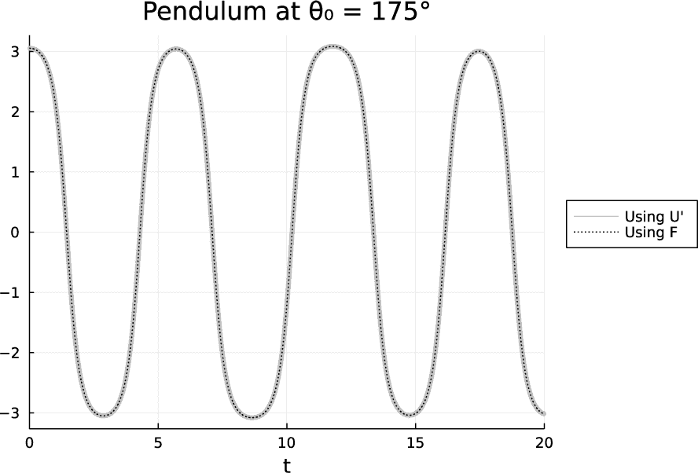

*图 13-2：两种方式计算的有限角度摆*

这两个解完全一致。显然，解决这个问题并不需要使用 `ForwardDiff` 包，但我们这样做是为了验证它是否按预期工作。在应用新技术时，首先在一个相对简单并且已知解的问题上进行测试非常重要，这样可以增强我们对如何使用它的信心，并确认我们理解它是如何工作的。

物理学家通常更倾向于从势能的角度而不是力的角度进行思考，因此在进行数值实验时，我们更可能尝试不同的势能而不是直接调整力函数。拥有一个能够为我们微分势能的解法程序，比每次迭代时都推导一个新的力场更为方便。而且，我们所处理的势能函数比从中推导出的力函数要简单。这在下一个例子中也是如此。

假设我们发现了一种新粒子，其势能在短距离时强烈排斥，在特定距离处有一个势阱，且在较长距离时势能呈弱排斥。这个势能

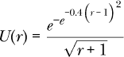

其中 *r* 是粒子与势能有这些性质的距离，如图 13-3 所示。

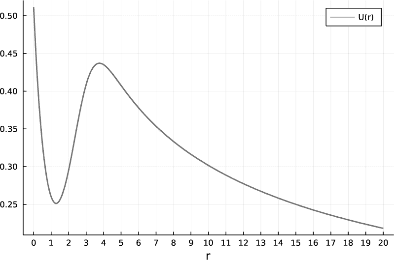

*图 13-3：一个假想粒子的势能*

图 13-3 显示了 *r* ≈ 1.3 处的势阱。这个位置是一个交互粒子可以被困住的地方，如果它没有足够的能量逃脱。

系统将包含两个这样的粒子，固定在 *r* = 0 和 *r* = 20 处。我们将把一个运动粒子放置在它们之间，并使用单位使其质量为 1。 图 13-4 显示了这两个固定粒子的合成势能。

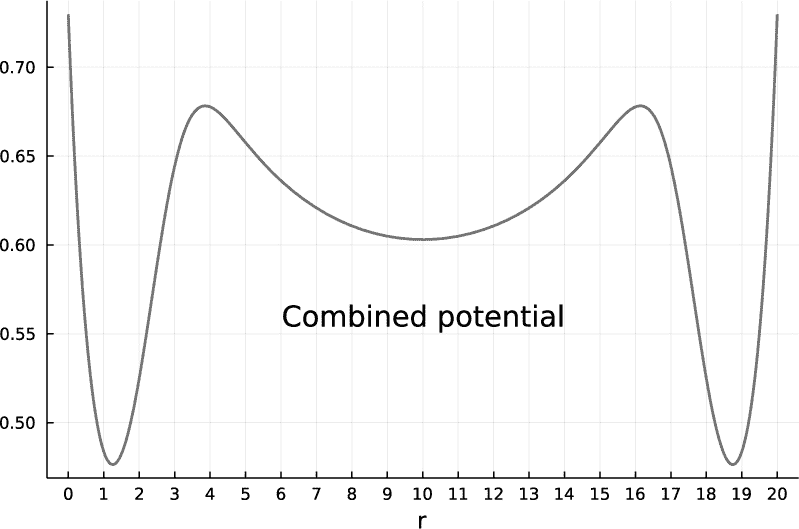

*图 13-4：两个虚拟粒子的总势能*

我们将在系统中插入一个移动粒子，位置为*r* = 5*.*0，初速度为 0.2035\。这个正向速度使得粒子在*t* = 0 时开始向右运动。如果初速度为零，它将在以*x* = 10 为中心的浅势阱中振荡，范围在*x* = 5 和*x* = 15 之间。其特定的初速度刚好提供足够的能量让粒子克服位于*x* = 16 附近的势能山丘。

在清单 13-2 中，我们按照在清单 13-1 中重新审视的摆问题的方法进行处理。

```
   using DifferentialEquations
   using ForwardDiff

   U(r) = exp(-(exp((-0.4*(r-1)²))))/sqrt(r+1)

   function particle!(du, u, p, t)
       x1, x2 = p
       r, v = u
       du[1] = v
    ➊ du[2] = -ForwardDiff.derivative(U, abs(r - x1)) +
                ForwardDiff.derivative(U, abs(r - x2))
   end

➋ p = [0.0, 20.0]
➌ u0 = [5.0, 0.2035]

   tspan = (0, 650)

   prob = ODEProblem(particle!, u0, tspan, p)
   sol = solve(prob)
```

*清单 13-2：求解两个虚拟粒子之间的运动*

我们通过对势能函数应用自动微分来推导力，这个势能函数是两个固定粒子贡献的总和 ➊，我们在每个粒子的位置上评估导数。`p`数组保存这两个粒子的位置 ➋，`u0`数组包含移动粒子的初始位置和初速度 ➌。在确定了解决方案的时间跨度后，我们定义了常微分方程（ODE）问题，并像之前一样将其解保存在`sol`中。

第一次尝试的解如图 13-5 所示，展示了移动粒子的位置与时间的关系。

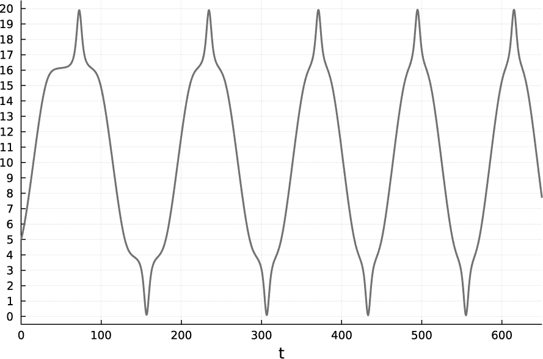

*图 13-5：一个不准确的解*

我们按照第九章中解释的方法，从解中提取位置变量。

科学家应始终对所谓的数值解进行批判性审视。我们的第一反应应该是根据我们对问题行为的了解，检查求解器的输出。在这种情况下，我们知道解应该是周期性的，因为问题的定义中没有任何因素能增加或移除能量。图 13-5 中的结果显然不是准确的周期性。

`DifferentialEquations`包提供了许多解法选项，并暴露了多个参数以便调整求解器的行为。请参见第 427 页中的“进一步阅读”部分，了解文档相关部分的链接。由于在清单 13-2 中设置的微分方程并不复杂，我们可以继续使用默认的求解器。准确性问题很可能是由于势能和初始速度的性质所致，正如前面提到的，初始速度接近一个临界值，这个临界值决定了粒子是否能克服局部势能的最大值。这表明，仅仅应用误差界限可能就足够了。`reltol`参数作为关键字参数传递给`solve()`函数，用于根据需要调整自适应时间步长，以将局部误差限制在我们指定的值内，如第 300 页中“参数不稳定性”部分所述。其默认值为 0.001，这对于此问题来说可能不够严格。初始速度的微小变化对粒子的运动有很大影响。如果我们尝试使用`sol = solve(prob; reltol=1e-6)`重新计算，我们将得到图 13-6 中所示的解。

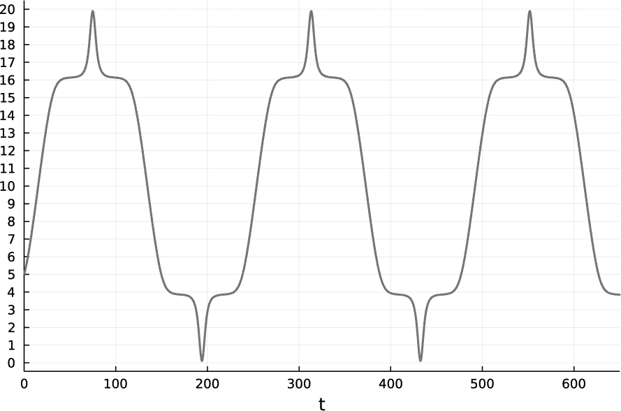

*图 13-6：一个精确的解*

新的解似乎是准确的周期性解。此外，进一步减小`reltol`并不会改变解，这为我们提供了一些安慰，证明解已经收敛到正确的答案。

U 的导数恰好是

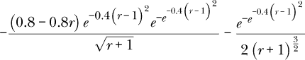

直接处理起来可能会更麻烦一些。

### **概率编程**

本节通过多个示例介绍了`Turing`包。这个包可以帮助我们根据观察到的效果推断可能的原因。我们假设读者已经对第十章中讨论的几个概念有一定的了解——特别是概率和概率分布。理解这些概念对于理解`Turing`的输出和解释其结果是必要的。

#### ***硬币公正性测试***

这个简单的例子介绍了使用`Turing`进行概率编程的基本概念和程序。

假设我们抛一枚硬币*L*次，并观察到得到*Nheads*次正面。我们想评估我们观察到的结果是否表明这枚硬币是*公平的*，其中*公平*意味着正面朝上的概率是 1/2，或者非常接近 1/2。这正是概率编程所声称能够回答的类型的问题：给定一个效果或一组观察结果，原因是什么？在这里，效果是正面朝上的比例，原因是正面朝上的概率。

**注意**

*我意识到前述简短分析可能并不令所有人满意，但我希望避免陷入形而上学的讨论。我们观察到的实际原因将是硬币的物理构造细节和投掷方法。正面朝上的概率代表了这些无数未知细节的累积效应的总结；将原因描述为概率反映了我们知识的局限性。*

使用`Turing`的第一步是构建一个概率模型，描述问题中每个随机变量的概率分布。对于某些变量，这些分布是未知的，在这种情况下，我们需要假设一个合理的分布，如均匀分布或正态分布，涵盖所有可能的值，可能以我们认为最可能的值为中心。对于其他变量，问题的描述暗示了一种特定的分布，这种分布通常由观察结果或某些其他变量的值来参数化。

在这个例子中，我们有一个未知的随机变量，*Pheads*。我们假设它可以取 0 到 1 之间的任何值，且服从均匀分布。这个假设意味着我们对硬币的性质没有任何先验信念。如果我们有理由认为它几乎肯定是公平的，我们可以假设它服从均值为 1/2、方差较小的正态分布。

在`Turing`模型中，我们使用`~`操作符表示关于随机变量分布的假设。我们对正面朝上的概率分布的假设形式为`Pheads ~ Uniform(0, 1)`。`Uniform()`函数来自`Distributions.jl`，该包会自动被`Turing`导入（有关“Distributions”的详细信息，请参见第 321 页）。

列表 13-3 展示了完整的`Turing`模型。

```
julia> using Turing, StatsPlots

julia> @model function coin(Nheads, L)
           Pheads ~ Uniform(0, 1)
        ➊ Nheads ~ Binomial(L, Pheads)
       end;
```

*列表 13-3：一个简单的概率程序*

在导入`Turing`和`StatsPlots`（它们对可视化输出非常有用）之后，我们使用`Turing`中的`@model`宏来定义模型。我们可以对`@model`所作用的函数进行任何我们想要的调用；该宏理解`~`操作符，并将该函数转换为`Turing`模型。

输入是观察到的正面朝上的次数和`L`，即总共的投掷次数。如前所述，我们假设`Pheads`（我们要推断的量）服从均匀分布。当我们投掷硬币`L`次时，观察到的正面朝上的次数是一个随机变量，我们知道它遵循由`L`和`Pheads` ➊ 参数化的二项分布（有关简要介绍，请参见第 427 页中的“进一步阅读”）。

为了大致理解`Turing`如何通过归纳过程从观测值推断模型中的未知数（在本例中是`Pheads`），我们可以设想如何手动进行这一过程。对于这里的简单问题，我们可以从 0 到 1 选择一系列`Pheads`值，可以是确定性的，也可以是随机的，可能会使用`rand()`。对于每个`Pheads`值，我们可以计算其二项分布的期望值或均值。最接近观测值`Nheads`的期望值就是我们推断出的`Pheads`值。

这个推断过程会相当高效，因为我们有一个简单的公式可以计算二项分布的均值。如果我们处理的是不太容易求解的分布，包括那些依赖于多个参数、每个参数有自己分布的情况，那么提取期望值的唯一方法就是通过从分布中采样的数值实验。如《Julia 中的随机数》一文中在第 307 页所指出的，`rand()`函数允许我们直接从分布中采样。然而，正如我们很快会看到的，一个更现实的问题可能涉及成千上万的随机变量和分布。从每个分布中进行简单采样将花费极其漫长的时间。

这就是`Turing`所解决的问题。它允许我们只需告诉它概率分布是什么，然后它高效地从中采样，根据需要计算期望值，并报告结果以及它们的不确定性和误差估计。我们不会深入探讨`Turing`是如何实现这一壮举的，只是提到它实现了马尔可夫链蒙特卡洛（MCMC）采样技术，想要研究理论背景的读者可以以此为起点。

为了让`Turing`生成关于其推断的报告，我们可以使用它的`sample()`函数发出一个命令：

```
julia> flips = sample(coin(60, 100), SMC(), 1000)
```

这里的`coin()`是清单 13-3 中的模型函数。它的参数包括正面朝上的次数和投掷的总次数——在这个例子中是 100 次投掷中的 60 次正面朝上。下一个参数从`Turing`包中提供的几种采样策略中选择一个。`SMC`的首字母代表顺序蒙特卡洛（Sequential Monte Carlo），它在简单问题上表现良好。选择哪种采样器可能需要通过反复试验来决定；不同的采样器适用于不同的问题。（有关`Turing`采样器文档的链接，请参见第 427 页的“进一步阅读”。）最后一个参数`1000`是进行采样实验的次数。每次实验都会生成一个`Pheads`的估计值，而`Turing`会报告这些估计值的均值，即最可能的值，如清单 13-4 所示。

```
Chains MCMC chain (1000×3×1 Array{Float64, 3}):

Log evidence      = -4.5014682572661195
Iterations        = 1:1:1000
Number of chains  = 1
Samples per chain = 1000
Wall duration     = 12.73 seconds
Compute duration  = 12.73 seconds
parameters        = Pheads
internals         = lp, weight

Summary Statistics
  parameters      mean       std   naive_se      mcse        ess      rhat   ess_per_sec
      Symbol   Float64   Float64    Float64   Float64    Float64   Float64       Float64

      Pheads    0.6024    0.0460     0.0015    0.0023   410.5088    1.0002       32.2499

Quantiles
  parameters      2.5%     25.0%     50.0%     75.0%     97.5%
      Symbol   Float64   Float64   Float64   Float64   Float64

      Pheads    0.5058    0.5719    0.6092    0.6319    0.6862
```

*清单 13-4：来自* Turing 的报告

该报告在我笔记本电脑上经过 12.73 秒后生成，包含了大量信息，但只有少数几个数字对我们至关重要。在`Summary Statistics`下，`Symbol`是我们想要推断值的随机变量：在这个例子中，只有`Pheads`。`Turing`对`Pheads`的最佳猜测是 0.6024。另一个需要注意的数字是`rhat`，在这个例子中为 1.0002。如果这个数字远离 1.0，则抽样过程未能正确收敛，我们需要尝试不同的抽样器或更改传递给抽样器的控制参数（如果抽样器接受参数的话）。

现在我们可以考虑解决本节标题中暗示的问题：硬币是否公平？我们可以通过查看从抽样过程中得出的 1,000 个`Pheads`推断值的分布来获得一些见解。`histogram()`函数（请参见第 321 页的“分布”）通过简单调用`histogram(flips; normalize=true)`，借助`Turing`和`StatsPlots`包，获得了绘制此分布的能力。我们将在同一图表上绘制直方图，并叠加一个正态分布曲线，使用如下代码：

```
julia> histogram(flips; normalize=true)
julia> plot!(Normal(0.6024, 0.0460); lw=2)
```

正态分布中的参数，如第二行所示，是从列表 13-4 中的报告中提取的均值和标准差。图 13-7 展示了结果，我们可以看到，从`Turing`获得的抽样分布是对正态分布的良好近似，并且与其报告的参数相符。

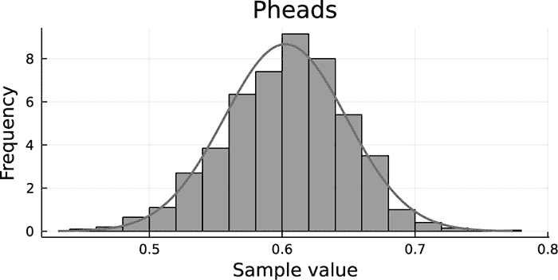

*图 13-7：Pheads 推断的分布*

为什么`Pheads`的均值分布应该是正态分布？毕竟，我们在模型中将`Pheads`设置为均匀分布。答案是，图 13-7 中的分布是随机变量`Pheads`的*均值*分布。正如在第 323 页的“正态分布”中所展示的（使用相同的均匀分布），均值的分布将是正态分布（高斯分布）。无论变量本身的底层分布是什么，这都成立，这是概率论中的一个重要定理，也是正态分布普遍存在的根本原因。

在检查了抽样结果之后，我们可以应用任何标准来决定硬币是否公平。尽管硬币正面朝上的概率最可能值非常接近 0.6，这强烈暗示我们有一枚偏的硬币，但*也有可能*这枚硬币是公平的。我们可以直接从归一化的直方图中估算`Pheads`为 1/2 的概率。横轴上围绕 0.5 的两个条形的面积大约是(0.52 - 0.48) × 0.8 = 0.32，这意味着硬币公平的概率为 3.2%。0.8 的值是通过目测估计这两个相关区间的平均高度得到的。我们还可以从正态分布中计算出这一点：

```
julia> cdf(Normal(0.6024, 0.0460), 0.52) - cdf(Normal(0.6024, 0.0460), 0.48)
0.032725277247186525
```

`cdf()`函数，表示*累积分布函数*，返回从负无穷大到第二个参数指定值的第一个参数所提供分布的积分。因此，要提取一个随机变量在分布控制下位于两个值之间的概率，我们只需从两次调用`cdf()`的结果中相减即可。3.3%的值与我们从直方图中得到的同一区间的估计结果非常一致。

这枚硬币公平的概率只有 3.3%。这是否足够强的证据来证明它存在偏差？那由我们来决定。

将硬币投掷 100 次为它的不公平特性提供了相当强的证据。直观上我们理解，如果我们只投掷了 10 次，并且恰好观察到 6 次正面朝上，那并不足以作为硬币不公平的有力证据。同样，若在投掷 1,000 次硬币后观察到 600 次正面朝上，那就是一个相当具有说服力的结论。

我们可以通过调用`sample()`两次，并将结果直接传递给`histogram()`来查看这两种情况的结果：

```
julia> histogram(sample(coin(6, 10), SMC(), 1000); normalize=:probability, fc=:lightgray)
julia> histogram!(sample(coin(600, 1000), SMC(), 1000); normalize=:probability, fc=:gray)
```

这是一个快速比较分布的方法，当我们不关心详细报告时，可以使用这个方法。

**注意**

*因为* sample() *返回的结果部分通过随机采样生成，所以每次的细节都会有所不同。运行本节代码的每个人都将观察到略有不同的分布和均值，尽管总体结论应该保持不变。在一个重要的问题中，一个好的做法是进行多次采样实验，尝试不同的采样器，并可能在模型中某些关于假设分布的细节上做些许变化。*

图 13-8 展示了结果。


*图 13-8：弱证据与强证据*

更浅的直方图，显示了 10 次投掷的推断结果，明显表明我们没有证据表明硬币存在偏差。`Pheads`为 1/2 的可能性和为 6/10 的可能性几乎相等。然而，使用 1,000 次投掷的观察结果则没有歧义：在那次实验中，600 次正面朝上使得硬币公平的可能性几乎为零。第二个直方图上较深的灰色覆盖层显示了围绕`Pheads` = 0.6 的窄分布。

#### ***从系列观察推断模型参数***

在大多数概率编程的应用中，科学家们关注的是推断一系列随时间变化的观察结果背后的原因，而不仅仅是一个单一的数字。我们可以通过将前一部分的方法扩展到处理时间序列，将每个时刻收集的数据视为围绕某个预测值的独立测量，并考虑每个时刻的分布。只要我们能够将其表达为 Julia 函数，这些值可以是几乎任何类型模型的预测结果。

##### **一个简单的数学模型**

为了展示这种方法，我们首先考虑拟合一对参数的问题，这一参数对我们假设为一系列观测的原因。模型是一个正弦函数，两个未知参数分别是其振幅 `A` 和频率 `f`，如 Listing 13-5 所示。

```
const t = 0:π/50:4π;
A0 = 3.4; f0 = 2.7;
data = A0*sin.(f0*t) + 0.5 .* randn(length(t));

@model function wave(data)
    f ~ Uniform(0, 3)
    A ~ Uniform(0, 4)
 ➊ prediction = A*sin.(f*t)
    for i in eachindex(t)
     ➋ data[i] ~ Normal(prediction[i], 0.5)
    end
end;
```

*Listing 13-5：作为模型的未知频率和振幅的正弦函数*

在定义一系列时间后，我们为 `A`（振幅）和 `f`（频率）参数选择值。我们使用这些值生成一些包含正态分布误差的模拟观测数据，并将其存储在 `data` 中。我们的计划是假装我们不知道 `A` 和 `f` 的值，并使用数据以及假设的正弦波依赖关系来推断它们的值。

在模型中，我们预先假设频率和振幅的分布是均匀的，这些分布为它们的可能值设定了限制。对于每一组可能的值，我们有一个预测 ➊，即由此得到的时间序列。我们认为传递给模型的数据是一组物理测量值，因此我们假设每个时间点的观测值是围绕该时刻的“真实”（预测）值正态分布的，标准差为 0.5 ➋。

通过采样进行推断的过程与前一节相同。然而，`SMC` 采样器似乎在这一类问题上效果不佳。`MH` 采样器（即梅特罗波利斯-海斯廷斯采样器）在此类问题上表现得更加可靠，而且速度也相当快，但在其他问题中表现较差。（如前所述，我们可能需要尝试多种采样算法及其输入参数。）Listing 13-6 显示了采样命令及其截断输出。

```
julia> wavesample = sample(wave(data), MH(), 1000)
Chains MCMC chain (1000×3×1 Array{Float64, 3}):

Iterations        = 1:1:1000
Number of chains  = 1
Samples per chain = 1000
Wall duration     = 0.92 seconds
Compute duration  = 0.92 seconds
parameters        = f, A
internals         = lp

Summary Statistics
  parameters      mean       std   naive_se      mcse       ess      rhat   ess_per_sec
      Symbol   Float64   Float64    Float64   Float64   Float64   Float64       Float64

           f    2.6876    0.0247     0.0008    0.0039    8.9062    1.1077        9.7230
           A    3.4323    0.3867     0.0122    0.0681    2.5378    2.1700        2.7706
```

*Listing 13-6：推断参数值*

采样器在不到一秒的时间内返回了合理的结果。这一点令人印象深刻，因为算法在采样两个参数 1,000 次并使用 200 个数据点（每个数据点都有其自身的分布）时，能够推断出 `A` 和 `f` 的最终分布及其期望值。

让我们通过将返回的 `A` 和 `f` 的均值与模拟数据以及我们知道的真实解进行叠加，来可视化推断出的解：

```
julia> plot(t, A0*sin.(f0*t); lw=2, legend=false, ylabel="A(t)", xlabel="t")
julia> plot!(t, data)
julia> A1 = 3.4323; f1 = 2.6876;
julia> plot!(t, A1*sin.(f1*t); ls=:dot)
```

在前两行中，我们用粗线绘制了模型，细线绘制了带噪声的数据。最后的绘图命令使用 `A` 和 `f` 的推断值绘制了一个正弦波，线条为虚线。Figure 13-9 显示了合并后的图表。

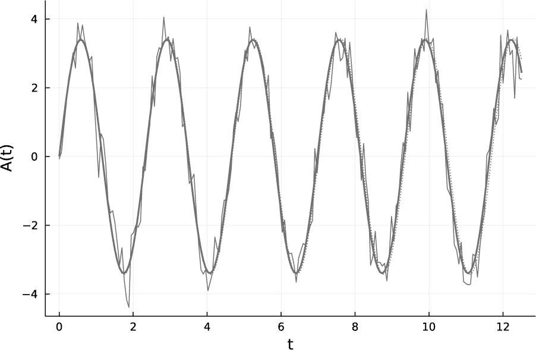

*Figure 13-9：从带噪声的数据中恢复的模型参数*

Figure 13-9 显示了如何从噪声观测中恢复正确的信号。模型的周期性特征意味着，推断的频率中的微小误差会导致曲线在后续时间进一步发散。

##### **常微分方程模型**

用于生成预测的模型不必是已知的函数；它可以是一组微分方程。这是可能的，因为`Turing`和`DifferentialEquations`是可组合的，这是 Julia 类型系统的另一个优势。两者的结合极其强大，为研究开辟了新的领域。在科学中，我们的模型通常以微分方程的形式出现，这些方程大致编码了我们关于系统如何运作的假设。系统的某些细节可能仍然作为参数存在，其值可能是未知的，或者部分已知的。使用“从系列观察中推断模型参数”中概述的一般程序，进行概率编程（见第 419 页），允许我们推断这些参数最可能的值，并定量检查我们假定的模型表现如何。

例如，我们可能测量了一颗炮弹的轨迹，并认为其轨迹受牛顿运动定律、重力和空气阻力的作用。但我们可能不知道地球上的重力加速度或炮弹在大气中的阻力系数。假设我们的微分方程是正确的，我们可以使用`Turing`和`DifferentialEquations`从观察到的轨迹中推断出这两个数值的值，然后将它们代回模型中，看看我们是否能够重现数据。这种方法消除了大量的试错过程，并且使我们能够在模型的变体之间流畅地迭代。

回到第九章中的参数不稳定性问题，我们来反向推理：假设我们知道有一个钟摆处于重力场中，且绳长在变化，我们知道重力、钟摆质量和绳子的平均长度，但频率和振幅是未知的。我们假设定义这种振荡的函数是 sin(*t*)，其中，像之前一样，*t*表示时间。

这个例子将展示如何通过反向推理从关于钟摆行为的数据出发，估算驱动频率和振幅，前提是我们假设数据背后有一个基础的物理模型。天真地，我们可能通过多次求解微分方程，使用第九章中的技术，并尝试不同的未知参数值，直到找到一个足够接近数据的解。但这个过程在计算上非常昂贵，并且可能无法系统地了解最终结果的不确定性。

清单 13-7 展示了通过`Differential` `Equations`包求解的问题设置，便于参考，这里组合自清单 9-8 和 9-9。

```
   using DifferentialEquations

   function pendulum!(du, u, p, t)
       L, g = p
       θ, ω = u
       du[1] = ω
       du[2] = -g/L(t) * sin(θ)
   end

➊ g = 9.8; A = 0.2; f = 0.97
   L(t) = 1.0 + A * cos(f*2*sqrt(g)*t)
   p = [L, g]

   u0 = [deg2rad(5), 0]
   #  θ   ω  <- Initial conditions

   tspan = (0, 80)

   sol = solve(ODEProblem(pendulum!, u0, tspan, p); saveat=0.1)
```

*清单 13-7：参数驱动的钟摆*

在这个例子中，驱动频率被设定为比参数共振频率小 3 个百分点➊。

在我们继续使用`Turing`处理这个问题之前，先来看一下变化`f`和`A`值如何影响结果。首先，我们将绘制在共振状态和稍微“失谐”的 0.95 共振频率下的解：

```
g = 9.8; A = 0.2; f = 1.0
L(t) = 1.0 + A * cos(f*2*sqrt(g)*t)
p = [L, g]
plot(solve(ODEProblem(pendulum!, u0, tspan, p)); idxs=1,
     legend=false, ylabel="A(t)")

f = 0.95
L(t) = 1.0 + A * cos(f*2*sqrt(g)*t)
p = [L, g]
plot!(solve(ODEProblem(pendulum!, u0, tspan, p)); idxs=1, lw=2)

annotate!(40, 1, ("Thin line:\nparametric forcing at resonance", 8))
annotate!(40, -0.5, ("Thick line:\n5% detuning", 8))
```

图 13-10 展示了这两个解。

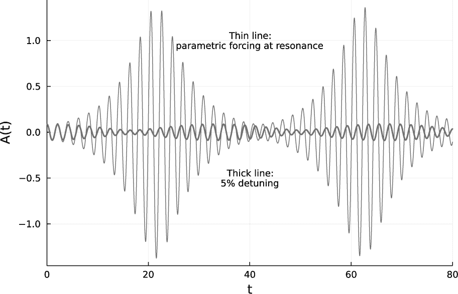

*图 13-10：在两个驱动频率下的参数驱动摆*

如图 13-10 所示，解对驱动频率非常敏感。

改变驱动振幅也会对解产生较大的影响。图 13-11 展示了在相同频率下，两个不同驱动振幅的效果。

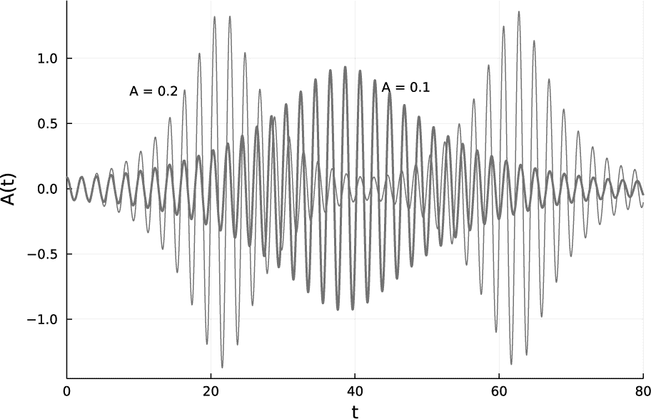

*图 13-11：在两个驱动振幅下的参数驱动摆*

仅仅改变驱动振幅就会改变包络振幅、包络时间尺度和响应频率。

当我们比较这些解时，可以看到振幅和频率是相互依赖的。从响应中推断任一驱动参数并非一件简单的事。让我们看看使用`Turing`的概率编程能在这个问题上做得怎样。首先，我们将定义一个模型，其中`A`和`f`在合理区间内均匀分布：

```
using Turing

@model function pdpen(observation)
    A ~ Uniform(0.0, 0.3)
    f ~ Uniform(0.9, 1.1)
    g = 9.8
    L(t) = 1.0 + A * cos(2*f*sqrt(g)*t)
    p = [L, g]
    prediction = Array(solve(ODEProblem(pendulum!, u0, tspan, p); saveat=0.1))[1, :]
    mstd = 0.1 * maximum(abs.(prediction))
    for i in eachindex(prediction)
        observation[i] ~ Normal(prediction[i], mstd)
    end
end
```

如同简单的正弦波模型一样，我们将根据给定的`A`和`f`值，从`DifferentialEquations`返回的解中生成一些带噪声的模拟数据，然后使用`Turing`模型尝试从数据中推断出这些数值。以下列出的程序展示了这个过程，针对一小组`A`和`f`的值进行计算，并绘制推断的数值与已知值的对比图：

```
plot(; xrange=(0, 0.3), yrange=(0.9, 1.1), legend=false,
       xlabel="A", ylabel="f")
for A in range(0.02, 0.25; length=3)
    for f in range(0.95, 1.05; length=3)
     ➊ L(t) = 1.0 + A * cos(2*f*sqrt(g)*t)
        p = [L, g]
     ➋ sol = solve(ODEProblem(pendulum!, u0, tspan, p); saveat=0.1)
        mstd = 0.1 * maximum(abs.(Array(sol)[1, :]))
        observation = Array(sol)[1, :] + mstd * randn(length(sol))
     ➌ psamples = sample(pdpen(observation), MH(), 3000)
        scatter!([A], [f]; mc=:lightgray, ms=9)
        scatter!([mean(psamples[:A])], [mean(psamples[:f])];
                 xerror=std(psamples[:A]), yerror=std(psamples[:f]),
                 mc=:black, shape=:hexagon, ms=9)
    end
end
plot!()
```

对于每一对`A,f`值，程序定义了一个驱动力函数➊，并从微分方程中生成了解➋。我们告诉求解器在定期的间隔点保存解的结果，使用`saveat`关键字参数，并将模拟噪声的幅度调整到解的幅度。这个解的目的是生成模拟的带噪声观察数据，然后我们将这些数据提供给采样器➌。接下来的命令将在图中的`A`-`f`平面上标出对应真实`A`和`f`值的标记。然后，我们会为推断出的值加上误差条，误差条的值取自`sample()`返回的分布的标准差。

我们可以通过索引参数名称来访问单独参数的采样结果，`psamples[:A]`是采样器生成的分布中所有 3,000 个`A`值的数组。这个数组的均值就是其期望值（也是在 REPL 中打印的报告中的值）。`std()`函数计算数组的标准差，返回的数值与报告中`std`下的数值一致。

图 13-12 展示了结果。

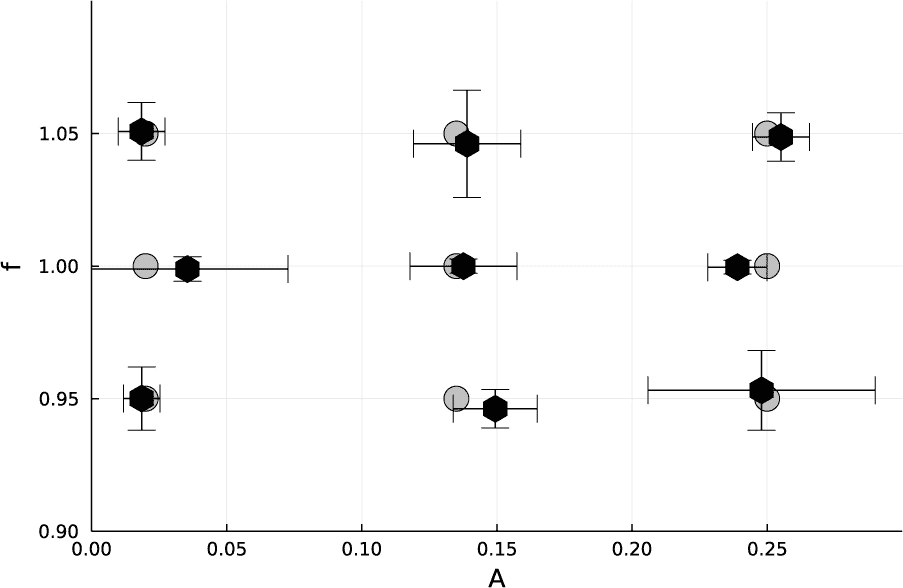

*图 13-12：在参数摆中的强迫参数推断*

使用 3,000 个样本时，实验运行得很顺利；然而，使用 1,000 个样本时，同一程序的表现明显较差。图 13-12 显示，每个推断值都在其报告的标准偏差范围内是正确的，而且这些误差大部分都很小。尽管这个问题复杂且敏感，`Turing`和`DifferentialEquations`还是能够协同工作，验证模型的忠实性并准确地推导出正确的模型参数。毫无疑问，经过进一步调整采样方法，我们可以进一步改善结果。

### **结论**

科学机器学习领域正在快速发展，并取得令人瞩目的进展。正如我所写的，Julia 用户完全可以利用该领域的最新研究，因为这些研究已在 SciML 生态系统的软件包中得到了应用。科学机器学习选取了机器学习中一些可以有效应用于科学和工程问题的技术。对整个领域的概述本身就是一本书。在本章中，我们探讨了一些核心思想，并将其应用于一些尽管本身具有趣味性，但足够简单的问题，以免过多的附带细节掩盖 SciML 机制的工作。这些思想和技术可以应用于所有定量科学领域。这是一个值得关注的激动人心的领域。无论它走向何方，都会不可避免地成为计算科学的支柱。

**进一步阅读**

+   请参阅 Christopher Rackauckas 的《科学机器学习（Scientific ML）的基本工具》一书，了解现有开源工具的介绍：[*http://www.stochasticlifestyle.com/the-essential-tools-of-scientific-machine-learning-scientific-ml/*](http://www.stochasticlifestyle.com/the-essential-tools-of-scientific-machine-learning-scientific-ml/)。

+   关于自动微分的扎实数学介绍可以在[*http://www.ams.org/publicoutreach/feature-column/fc-2017-12*](http://www.ams.org/publicoutreach/feature-column/fc-2017-12)找到。

+   这里是 Julia SciML 文档的汇总：[*https://docs.sciml.ai/*](https://docs.sciml.ai/)。

+   要了解`Differential` `Equations.jl`包的各种求解器选项，请访问[*https://docs.sciml.ai/DiffEqDocs/stable/basics/common_solver_opts/*](https://docs.sciml.ai/DiffEqDocs/stable/basics/common_solver_opts/)。

+   关于二项分布的详细信息可以在[*https://www.itl.nist.gov/div898/handbook/eda/section3/eda366i.htm*](https://www.itl.nist.gov/div898/handbook/eda/section3/eda366i.htm)找到。

+   `Turing`包的文档可以在[*https://turinglang.org/dev/docs/using-turing/get-started*](https://turinglang.org/dev/docs/using-turing/get-started)找到。

+   要了解如何使用`Turing`，请访问[*https://turinglang.org/dev/docs/using-turing/guide*](https://turinglang.org/dev/docs/using-turing/guide)。
