## **14**

**信号与图像处理**

*我在高中学习了拉丁语，并且我当时在阅读西塞罗的作品。这个信号花了几千年才传到我这里。不过，我仍然对他所说的内容感兴趣。*

—Seth Shostak


本章包含了来自信号和图像处理问题的示例。这两个学科通常被认为与不相关的研究领域相关：信号处理吸引音频或电子工程师，而图像处理则与生物学家和天文学家相关。然而，它们是紧密相连的，因为它们使用许多相同的技术，并且相关的工具有着相同的数学基础。对于许多用途，我们可以把图像看作只是一个二维信号，并应用类似的算法来进行转换、平滑、滤波等，将单一的时间维度扩展到两个（或三个）空间维度。

我们首先将研究一维信号，考虑独立坐标表示时间的常见情况。之后，我们将探索 Julia 的图像处理包。

### **时间中的信号**

声音以时变的气压形式传入我们的耳朵，我们将其存储为幅度与时间的记录，其中幅度可能代表压力的直接测量，或是通过我们的测量设备将其转换为电压或其他某种量。我们将通过在 Julia 中处理来自自然的声音来探讨信号处理。

#### ***探索声音样本***

我们现实生活中的声音是濒危的铁锈小型仙人掌猫头鹰（*Glaucidium brasilianum cactorum*）的叫声，它是亚利桑那州的本土物种。我在[*http://www.naturesongs.com/falcstri.html#cobo*](http://www.naturesongs.com/falcstri.html#cobo) 找到了这个声音样本，并将其保存为文件名为 *cfpo1.wav* 的磁盘文件。这个样本是一个 WAV 文件：一种常见的音频文件格式，几乎任何音乐播放或声音编辑软件、在任何操作系统下都能播放。听这个样本可以听到一个叫声，由一个简短的、中等偏高音的发声组成，大约每秒重复三次，总共持续约 12 秒。

**注意**

*WAV 文件常被错误地描述为“无压缩”的音频。它们包含的音频数据几乎总是使用少数几种无损压缩算法进行压缩（类似于 ZIP 文件压缩工具所使用的压缩）。它们占用的空间比使用感知编码器（例如 MP3 文件所用的压缩方式）压缩的同一声音要大得多，但这种文件对于科学信号处理和分析没有用处。*

在 Linux 终端中，我们可以使用 `file` 命令获取有关文件的一些信息：

```
$ file cfpo1.wav
cfpo1.wav: RIFF (little-endian) data, WAVE audio, Microsoft PCM, 8 bit, mono 8000 Hz
```

输出反映了最常见的文件格式；数据采用小端格式，因为 WAV 格式是在微软发明的。第三个子句指定了压缩算法；Microsoft PCM 是最常见的格式。其余输出表示样本以 8 位精度保存，每个点提供 2⁸ = 256 个可用的幅度级别，并且我们有一个以每秒 8,000 次采样的通道。

回到 Julia REPL，我们来读取样本，将其赋值给 `cfpo`，并绘制波形：

```
julia> using SignalAnalysis, SignalAnalysis.Units, Plots

julia> cfpo = signal("cfpo1.wav");

julia> plot(cfpo)
```

首先，我们导入两个便捷的信号分析包。本节的所有其他示例都假设使用了这一 `using` 语句。`SignalAnalysis.Units` 包提供了时间和频率单位的缩写，并提供了一种便捷的基于时间的索引形式，我们稍后将使用它。

`signal()` 函数有很多方法。当传入一个字符串时，它会加载指定的文件，并将数据打包成包中定义的类型。`SignalAnalysis` 包还扩展了 `Plots`，使其能够直接绘制信号。图 14-1 显示了猫头鹰叫声的波形。

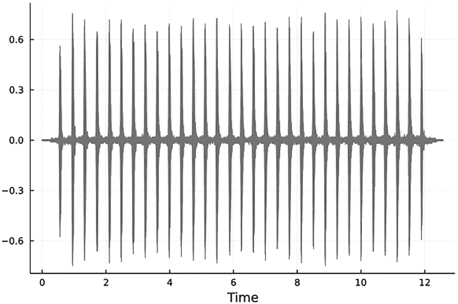

*图 14-1：仙人掌铁锈小猫头鹰的叫声*

由于声音样本包含 100,558 个元素，绘图不是即时的。图表配方使用采样率信息来创建正确的时间轴，并对轴进行标注。`signal()` 函数将 8 位样本重新缩放为 `Float64` 数字，范围从 -1.0 到 1.0。

`SignalAnalysis` 包提供了几个用于提取信号信息的函数。以下是其中最重要的几个：

```
julia> framerate(cfpo)
8000.0f0

julia> nframes(cfpo)
100558

julia> duration(cfpo)
12.56975f0
```

`nframes` 这个术语指的是样本数，而 `duration()` 则报告信号的时长（单位为秒）。

图 14-1 清晰地展示了猫头鹰叫声的每秒三声啼叫结构，但我们无法判断猫头鹰在唱什么音符。让我们放大一下：

```
julia> one_chirp = plot(cfpo[2.05:2.25s]);

julia> chirp_zoomed = plot(cfpo[2.1:2.11s]);

julia> plot(one_chirp, chirp_zoomed; layout=(2, 1))
```

前两个绘图语句利用了 `SignalAnalysis` 包所提供的便捷基于时间的索引功能。它让我们无需在信号数据的时间和索引号之间进行转换。该索引仅适用于秒，并且仅适用于浮动范围。要访问两秒时的单帧数据，我们可以写作 `cfpo[2.0:2.0s]`。

图 14-2 显示了组合图：信号的两个不同尺度的两个片段。图表配方总是从 `t = 0` 开始标记图表，但我们始终可以定义 `xticks` 来引用原始时间区间（如果需要）。

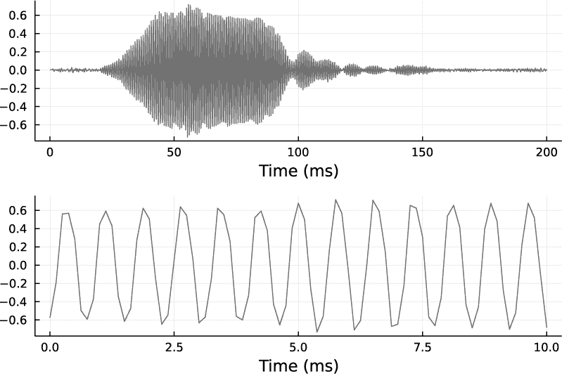

*图 14-2：猫头鹰叫声的两个放大片段*

图 14-2 中的底部图位于其中一个啁啾信号的中间，并且被足够放大，以便我们轻松数出周期。在 2.5 毫秒的时间内大约有 3.25 个周期（从 *t* = 5.0 毫秒开始数，波形的峰值恰好与网格线对齐，到 *t* = 7.5 毫秒），这对应的频率是 3.25/2.5e–3 = 1,300.0 Hz，非常接近音乐音符 E[6]。

#### ***频率分析***

*分析* 这个词的一个含义是将某物分解为组成部分。我们将对信号进行两种频率分析。第一种类型将信号（振幅对时间的函数）转化为振幅对频率的函数。这就是傅里叶变换的目的，它假设信号是周期性的，并将其分析为周期函数的和（正弦波和余弦波的不同振幅，或不同相位和振幅的正弦余弦，或者是复指数函数——这些都是等效的表示）。作为频率之和的表示就是信号的*频谱*。第二种类型将时间和频率信息结合成*频谱图*。在这里，我们不再假设信号是周期性的。频谱图展示了信号频谱随时间变化的情况。

`SignalAnalysis` 包提供了几种绘图例程，可以用来可视化这两种类型的频率分析。`psd()` 函数绘制了信号的*功率谱密度*，这是基于其傅里叶变换的。它在应用于周期信号时，解释起来比较直观，这也很好地描述了猫头鹰的叫声：

```
julia> psd(cfpo; xticks=0:100:4000, xrot=90, lw=2)
```

由于 `psd()` 使用了 `Plots` 包，我们可以提供熟悉的关键字参数。图 14-3 显示了频谱。

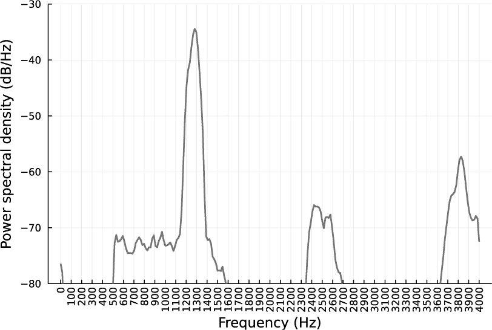

*图 14-3：猫头鹰叫声的傅里叶频谱*

频谱在接近 1,300 Hz 的位置有一个峰值，这与我们通过数周期得到的估计一致。我们还可以看到接近第二和第三谐波的峰值（1,300 Hz 的两倍和三倍）。

如 图 14-3 所示，显示图像是有用的分析和诊断工具，但它们并不能完全传达所研究信号的特性。我们可以看到信号以 1,300 Hz 为主频，有两个强的泛音，但没有呈现出快速的断奏效果。

为了进行更全面的分析，我们转向频谱图。`SignalAnalysis` 包也提供了一个函数，可以轻松创建这些可视化图像：

```
julia> specgram(cfpo; c=:grayC)
```

图 14-4 包含了频谱图，并清楚地显示了信号中能量的频率分布：1,300 Hz 附近的强分量和两个较低振幅的高阶谐波。我们还可以看到时间结构；大约每秒三次重复的啁啾声音非常明显。

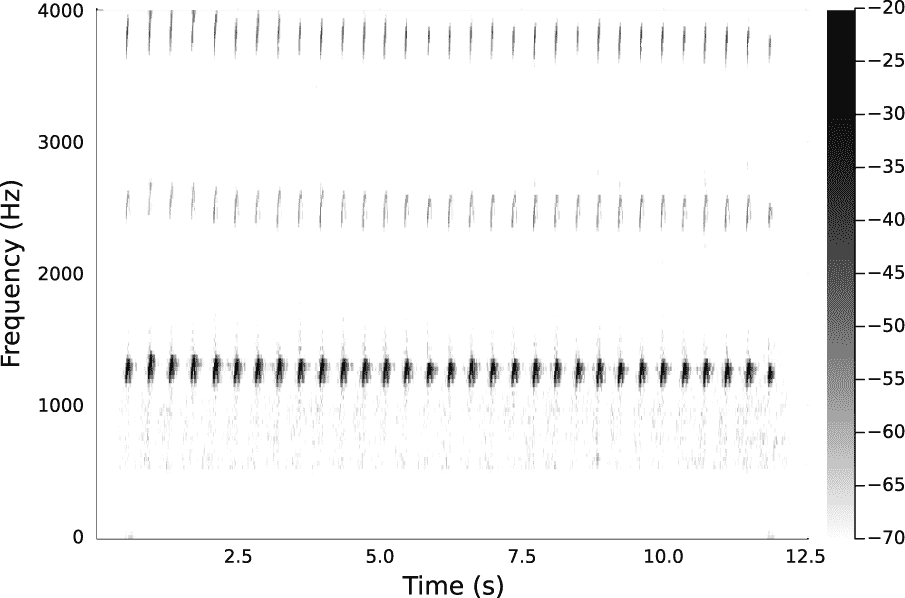

*图 14-4：猫头鹰叫声的频谱图*

声谱图使用傅里叶变换和*窗口*在信号上滑动来计算其演变过程中的频谱，从而生成一个结合了频率和时间信息的可视化图。对于除周期信号外的任何信号，它们比`psd()`类型的图更具信息量。实际的傅里叶变换例程，如`psd()`使用的那些，也使用了窗口函数，但目的是消除信号边缘不可避免的断点以及由此产生的伪高频分量的“泄漏”。

**注意**

*本节介绍了信号分析的最快和最便捷的方法，重点是获取大多数科学家感兴趣的可视化效果。如果需要更多控制，或直接获取频谱数据，请导入* DSP.jl *包。* SignalAnalysis *包封装了许多其例程，但导入* DSP *包可访问其各种傅里叶变换窗口的定义，以及其他可以通过关键字参数调用的细节，这些都能在更高级别的* SignalAnalysis *例程（如* psd() *）中使用。*

现在我们已经介绍了两种检查信号频谱的方法，在下一节中，我们将探讨通过改变频谱来转换信号的方法。

#### ***滤波***

在信号处理的上下文中，*滤波器*是一个电路、设备，或在我们的情况下是一个计算，能够衰减信号中某些频率。最常见的例子可能是扬声器中的分频电路，它将高频信号传送给高音扬声器，将低频信号传送给低音扬声器。

滤波器在经验科学中也很重要——例如，用于减少测量中的噪声。假设有一个传感器记录水道深度的变化。我们可能有兴趣测量潮汐的影响，检测任何长期的平均深度变化。这些变化发生在小时或更长的时间尺度上。然而，测量将被风、天气和经过的船只造成的更快速变化污染。通过使用滤波器，我们可以通过去除比每小时一次的周期更快的频率，来消除信号中的无关数据。

上一段建议的策略称为*低通*滤波器，因为它衰减高于指定截止频率的频率，并允许低于截止频率的频率通过。*高通*滤波器的一个例子就是指向扬声器高音扬声器的分频电路。

另一种在科学仪器中常见的滤波类型是*陷波*滤波器：它衰减接近目标频率的信号。陷波滤波器对于消除通过信号通过的仪器中 60 Hz 或 50 Hz 电源噪声非常有用（但只有在信号不包含接近电源频率的信息时才有效）。

*带通*滤波器会衰减目标频率周围狭窄频带以外的信号。

##### **使用 fir() 创建滤波器**

`SignalAnalysis`包使得构建这些类型的滤波器并将其应用于信号变得容易。在每种情况下，我们从`fir()`函数开始构建滤波器。其基本用法包括三个位置参数和一个名为`fs`的可选关键字参数，表示信号的采样频率。

第一个参数是一个整数*抽头*的数量，与描述滤波器的多项式中保留的项数相关。基本上，更多的抽头使得滤波器更加选择性，响应更加平滑。第二和第三个参数是未滤波频率范围的下限和上限。如果我们提供`fs`关键字，我们将这些参数以`Hz`、`kHz`或来自`SignalAnalysis.Units`的其他单位提供。例如，清单 14-1 展示了如何制作一个过滤掉 2,000 Hz 以上频率的低通滤波器。

```
lpf = fir(127, 0, 2kHz; fs=8kHz);
```

*清单 14-1：构造低通滤波器*

该示例创建了一个 127 抽头的滤波器，这是一个典型值。

低通滤波器的下限为 0，如本示例所示。要创建一个高通滤波器，我们将`nothing`作为上限传递。

`SignalAnalysis`包提供了一个绘图函数，用于可视化通过`fir()`创建的滤波器。要查看先前定义的`lpf`滤波器的频率响应图，我们只需输入：

```
julia> plotfreqresp(lpf; fs=8000)
```

这将生成图 14-5 中所示的图形。

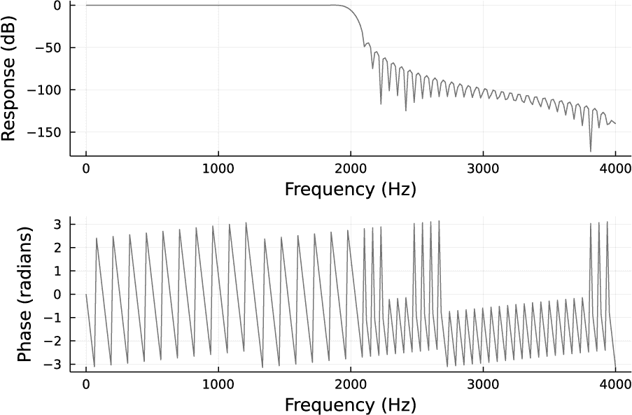

*图 14-5：低通滤波器的频率响应*

图 14-5 中的顶部图表显示了在将滤波器应用于信号时，水平轴上给定的频率分量会被降低的程度。单位为 dB（分贝），这是信号处理中常用的单位。图 14-5 显示，直到接近 2,000 Hz 时，频率没有变化，信号迅速衰减。对于普通声音，20 dB 的减少会有效地使其应用到的频率分量静音；因此，滤波器响应中低于–50 dB 的振荡对声音没有可听的影响。

底部图表显示了滤波器所产生的相位变化。这些变化通常是听不见的，但根据对滤波信号的使用计划，它们可能相关，也可能无关。

**注意**

*为了更详细地控制滤波器特性，我们可以导入* DSP.jl *并使用* method *关键字传递给* fir() *，并使用* [`docs.juliadsp.org/stable/filters/`](https://docs.juliadsp.org/stable/filters/) *中描述的滤波器构造方法之一。*

频率响应图中的 dB 值直接加到信号的`psd()`图中显示的频率分量峰值，这些峰值也以 dB 显示。为了计算信号本身的幅度变化，我们使用公式：


其中，*V*是输入信号中成分的振幅，*V*[*f*]是滤波后的振幅。因此，6 dB 的减少意味着振幅减半：

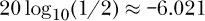

为了观察更大的抽头值的效果，我们可以制作两个额外的低通滤波器，具有相同的频率范围，但有更多的抽头：

```
lpf_255 = fir(255, 0, 2kHz; fs=8kHz);
lpf_1027 = fir(1027, 0, 2kHz; fs=8kHz);
```

更高的抽头数会产生更接近理想响应的滤波器，如 Figure 14-6 所示。

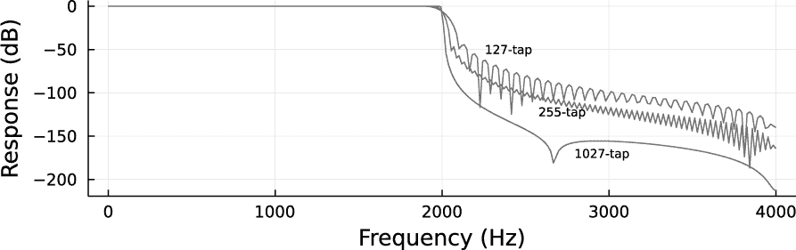

*Figure 14-6: 使用不同抽头数的低通滤波器*

尽管使用更高的抽头数会产生具有更锐利截止的更干净滤波器，但它会导致计算开销增加。对于我们的示例（使用中等长度的存储信号）来说，增加的计算时间没有影响，但在实时滤波的情况下，这可能是一个需要考虑的问题。

##### **应用滤波器**

要对信号进行滤波，我们可以使用`sfilt()`函数：

```
julia> cfpo_lp = sfilt(lpf, cfpo);
```

这将 Listing 14-1 中定义的低通滤波器应用于猫头鹰样本，并将结果（一个新的信号）赋值给`cfpo_lp`。使用`psd()`绘制滤波信号的功率谱，展示了滤波效果（见 Figure 14-7）。

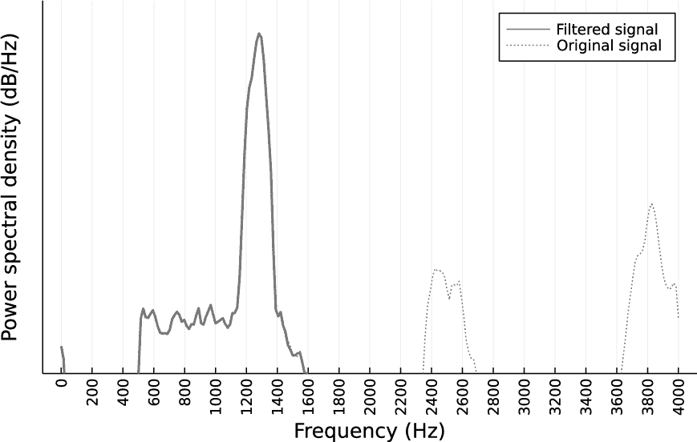

*Figure 14-7: 滤波后的猫头鹰叫声*

此图使用虚线显示原始的未滤波谱图，使用较粗的实线显示滤波后的谱图。低通截止频率 2 kHz 以下的频谱未受到影响，而所有高于此频率的部分已被消除。

我们使用以下命令创建 Figure 14-7：

```
julia> using Plots.PlotMeasures

julia> psd(cfpo_lp; lw=2, label="Filtered signal", legend=true)

julia> psd!(cfpo; ls=:dot, ticks=0:200:4000, xrot=90, label="Original signal",
            legend=true, margin=5mm)
```

在向`psd()`绘图时需要重复某些关键字参数，因为绘图公式会重置它们。

Figure 14-8 中的滤波信号的频谱图还显示了第二和第三谐波的消除，同时保持了信号的其他部分。

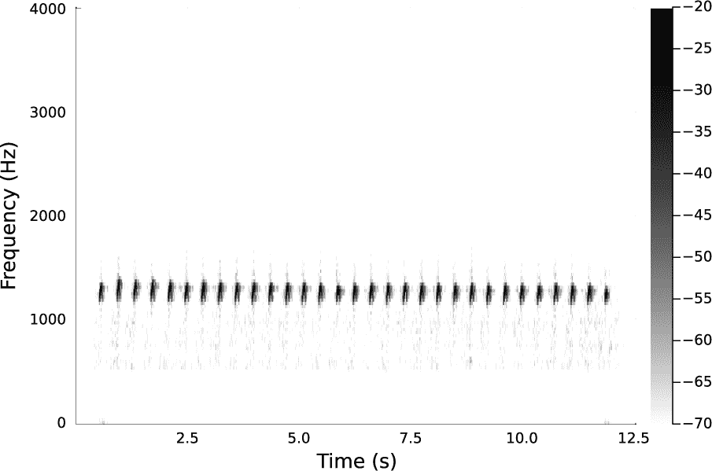

*Figure 14-8: 滤波后猫头鹰叫声的频谱图*

##### **合成信号**

为了确保我们定量地理解信号分析和滤波，我们从一个由已知频率成分合成的信号开始。`signal()`的另一种方法是通过一个正常的向量创建一个包含采样率信息的信号。在 Listing 14-2 中，我们创建了一个由两个正弦波叠加而成的向量，表示采样率为 8 kHz 的 1,000 Hz 和 2,050 Hz 两种频率成分的数据。然后，我们将数据打包成一个信号。

```
julia> sin1000_2050 = signal(sin.((0.0:1.0/8000:1.0)*2π*1000)  .+
                             0.5 .*  sin.((0.0:1.0/8000:1.0)*2π*2050), 8000);
```

*Listing 14-2: 创建合成信号*

我们将结果赋值给`sin1000_2050`。`signal()`的第二个参数指定采样率。2,050 Hz 处的成分的振幅是 1,000 Hz 处成分的一半。功率谱应该显示两个峰值，较高频率的峰值比低频率的峰值低 6 dB。Figure 14-9 展示了 Listing 14-3 的结果。

```
julia> psd(sin1000_2050; xrange=(500, 2500), xticks=600:100:2500,
           xminorticks=2, yticks=-61:3:-02, xrot=45, margin=5mm)
```

*Listing 14-3: 合成信号的频谱*

因为信号包含嵌入的采样率信息，`psd()`能够正确地缩放图谱。

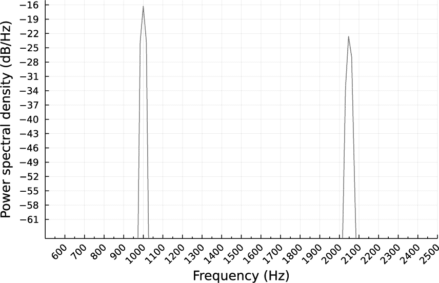

*图 14-9：合成信号的频谱，具有两个频率分量*

图 14-9 显示了功率谱，其中两个窄峰分别出现在我们指定的位置，并且它们的幅度差为正确的 6 dB。

现在让我们来测量滤波的效果。我们将使用在清单 14-1 中定义的`lpf`滤波器，但首先我们需要在其截止频率附近更仔细地观察它：

```
julia> plotfreqresp(lpf; fs=8000, xrange=(1800, 2100), yrange=(-50, 1),
                    yticks=0:-4:-50, xticks=1800:50:2100, right_margin=5mm)
```

图 14-10 中的滤波器响应扩展图（省略了相位响应）显示，滤波器应该将 2,050 Hz 分量减少 16 dB。

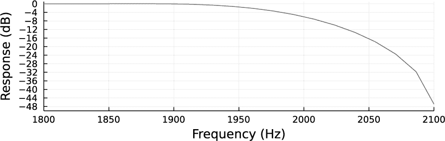

*图 14-10：低通滤波器的截止区域*

我们可以通过将滤波后的信号的功率谱叠加到清单 14-3 中创建的图谱上，检查滤波器是否按预期工作：

```
julia> psd!(sfilt(lpf, sin1000_2050), xrange=(500, 2500), xticks=600:100:2500,
            xminorticks=2, yticks=-61:3:-02, xrot=45, margin=5mm)
```

图 14-11 显示，高频峰值被减少了 16 dB，而低频峰值保持不变。

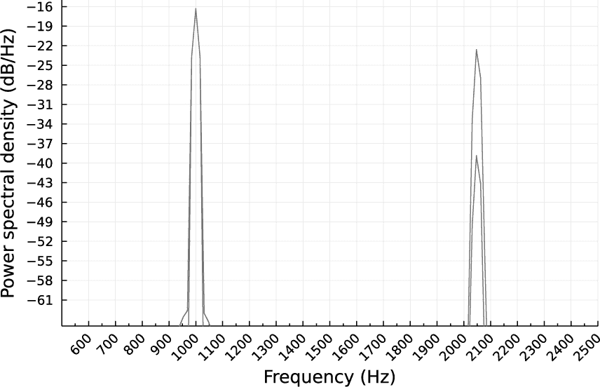

*图 14-11：滤波后的合成信号的功率谱*

这个小练习展示了滤波器具有可预测的效果，改变了频谱而没有引入伪影。

##### **保存信号**

我们可以使用`signal()`函数从磁盘读取 WAV 文件到信号中，但将信号保存为 WAV 文件需要导入`WAV.jl`包：

```
julia> using WAV
julia> wavwrite(cfpo_lp, "cfpo_lp.wav"; compression=WAVE_FORMAT_PCM, nbits=8)
```

关键字参数选择一个压缩格式和词大小，这些与各种软件兼容。在调用`wavwrite()`后，磁盘上将生成一个名为*cfpo_lp.wav*的 WAV 文件。

如果我们想将`sin1000_2050`信号保存为 WAV 文件，首先需要将其缩放到单位幅度：

```
julia> scaled = sin1000_2050 ./ maximum(sin1000_2050)
```

然后我们像之前一样使用`wavwrite()`保存它，并使用任何音频软件播放它。

### **图像处理**

让我们考虑一个在医学和实验室生物学中常见的图像解释任务：在显微镜下拍摄的血液样本照片中，有多少个血细胞？传统的“血细胞计数”方法是手动列举细胞，这是一项繁琐且容易出错的过程。我们将看看如何使用 Julia 中的各种图像处理技术来自动化这个过程。结果将是一个更快速、更准确的计数，不需要繁重的体力劳动。然而，我们在这里研究的技术不仅限于血细胞计数。我们可以将其应用于从细菌计数到分析卫星侦察的所有任务。

#### ***加载与转换图像***

命令`using Images`导入了文件和图像输入输出函数，包括对大多数图像类型的优化例程：

```
julia> using Images

julia> frog_blood = load("frogBloodoriginal.jpg");
```

导入后，简单的`load()`命令将文件读取为图像，在 Julia 中，图像是一个像素数组。

在使用笔记本，如 Pluto 时，图像操作的结果以图像的形式显示；在终端 REPL 中，它们以类似其他数组的方式显示。对于 REPL 中的图形图像显示，`ImageView`包提供了`imshow()`函数。`imshow()`打开的窗口具有一些 GUI 功能，其中最有用的是在鼠标指针移动到图像上时显示像素地址和颜色值。

图像可以是数字矩阵或像素类型。有几种像素类型，但我们将使用的是`RGB`和`Gray`像素。由于我们从彩色图片中加载了`frog_blood`图像，它是一个`RGB`（红-绿-蓝）像素的数组：

```
julia> eltype(frog_blood)
RGB{N0f8}
```

这显然是一个参数化类型（参见第 248 页的“参数化类型”）。参数`N0f8`是另一个（参数化）类型，它将无符号 8 位整数映射到范围为`[0.0, 1.0]`的浮点数。`frog_blood`的一个元素如下所示：

```
julia> frog_blood[1, 1]
RGB{N0f8}(0.361,0.008,0.384)
```

这将是紫色：几乎相等的红色和蓝色量，几乎没有绿色。

如果我们想用纯绿色替换极左上角的像素，可以执行以下操作：

```
frog_blood[1, 1] = RGB{N0f8}(0.0, 1.0, 0.0)
```

然而，我们不会这么做。

我们可以通过将`Gray()`作为转换函数广播到图像数组，将彩色图像转换为灰度版本：

```
frog_blood_gs = Gray.(frog_blood);
save("frog_blood_gs.jpg", frog_blood_gs)
save("frog_blood_gs.png", frog_blood_gs)
```

该代码片段还展示了如何将图像保存到文件中。`save()`函数将图像数据转换为由文件名扩展名指定的文件格式。这里我们保存了两种版本的相同图像，一种是*.jpg*文件，另一种是*.png*文件。

图 14-12 展示了灰度化图像。

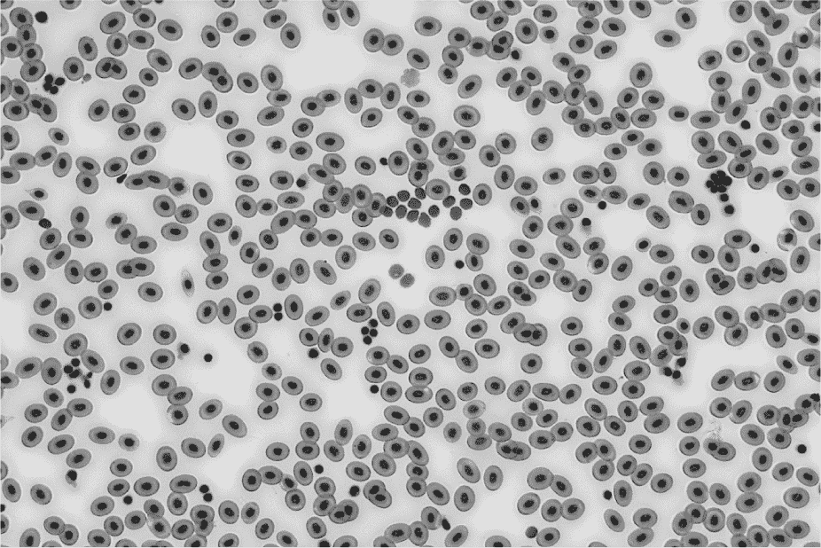

*图 14-12：青蛙血液图像转为灰度图像。原始图像由 Wayne Large 提供（CC BY-ND 2.0）。可从* [`flic.kr/p/cBDUEG`](https://flic.kr/p/cBDUEG) 获取。

其他有用的颜色转换函数包括`red()`、`green()`和`blue()`，它们从`RGB`像素中提取指定的颜色通道，当然也可以广播到整个图像，将其分离为各个颜色通道。

为了比较两张或多张图像的不同版本，可能是为了直观查看某个转换或处理步骤的效果，`mosaicview()`函数非常有用：

```
julia> imshow(mosaicview(red.(frog_blood), green.(frog_blood),
              blue.(frog_blood), frog_blood_gs; ncol=2, npad=6))
```

该命令创建四个图像，显示原始`frog_blood`图像的三个颜色通道和合成的灰度版本，将它们按网格排列并显示。如果在笔记本中工作，我们不需要`imshow()`调用。`ncol`参数指定图像网格中的列数（也有`nrows`可用），`npad`参数在图像之间添加指定数量的像素边框。

图 14-13 展示了`mosaicview()`的输出。

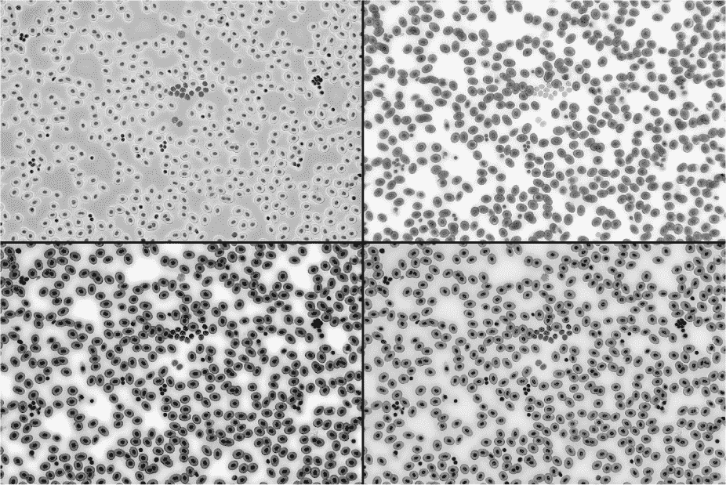

*图 14-13：青蛙血液图像的红色、绿色、蓝色和所有通道（从上到下，左到右）*

原始图像，包含所有颜色通道，位于右下角。

#### ***使用面积分数计数细胞***

我们第一次尝试自动计数血细胞将使用`ImageBinarization`包。这个包包含了一些用于将图像分为“前景”和“背景”的算法，将前景染成纯黑色，背景染成纯白色。换句话说，原始图像中的每个像素都会根据调用的算法结果被分配为 0.0 或 1.0。该包的文档展示了各种算法在不同类型图像上的结果示例。

目标是生成一张尽可能将血细胞与其他所有物体分离的图像。这个二值图像将成为进一步分析的良好起点。通过图 14-13 所示的颜色分离，我们已经在这方面取得了一些进展。底部的蓝色通道似乎增强了（较大的）红细胞与其他颗粒之间的对比度。我们不会直接对原始彩色图像进行二值化，而是从蓝色通道开始：

```
julia> using ImageBinarization

julia> frog_blood_blue = blue.(frog_blood);

julia> frog_blood_b1 = binarize(frog_blood_blue, Intermodes())
```

`binarize()`函数将图像作为第一个参数，二值化算法的名称作为第二个参数，并返回二值化后的图像。文档描述了`Intermodes`算法的详细信息。就我们的目的而言，它能够很好地检测出与背景对比明显的离散结构，如细胞。

图 14-14 展示了二值化后的图像。

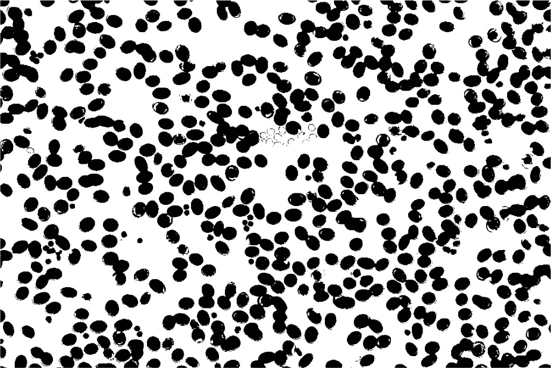

*图 14-14：青蛙血液幻灯片经过二值化后的蓝色通道*

我们将使用这张图像作为血细胞计数的基础。

如果我们知道图像中血细胞的平均面积，就可以将其除以所有血细胞所占的总面积，从而估算细胞的数量。细胞似乎大致呈椭圆形（在这个二维图像中）。

在`imshow()`窗口中使用 GUI 时，我使用像素读数来测量四个典型细胞的长轴和短轴长度，长轴为 26.8 像素，短轴为 24.5 像素。使用*A* = *πr*[1]*r*[2]计算椭圆面积，其中*r*[1]和*r*[2]是椭圆的半径，四个面积的平均值为 511.3 平方像素。

使用二值化图像来计算总的血细胞比例非常简单。在`frog_blood_b1`中，细胞是黑色的，像素值为 0，背景是白色的，像素值为 1。因此，细胞的总数为`sum(1 .- frog_blood_b1)`，其值为 255,029.0。将此结果除以平均细胞面积得到 499 个细胞。

#### ***通过识别特征计数细胞***

我们可以通过利用搜索图像中特定形状特征的算法，改进上一节中的估计。霍夫变换（有关背景知识，请参见第 465 页的“进一步阅读”部分）就是这样一类可以专门用于各种形状的算法。我们假设以下示例中已经导入了`ImageFeatures`包，它提供了检测直线和圆形的实现。由于我们需要检测的特征类似于圆形，因此我们将使用`hough_circle_gradient()`函数，这是霍夫变换在圆形上的一种实现。

在应用算法之前，我们将处理图像，以使其任务更容易，并产生更准确的结果。图像中的一个问题是，我们想要计数的细胞不是圆形的，而是拉长的。虽然霍夫变换有针对椭圆形的实现，但`ImageFeatures`包中尚未提供此功能。另一个问题是，许多细胞是接触的，还有一些是重叠的。霍夫变换可以处理接触和重叠的圆形，但它对清晰分开的形状效果更好。

大自然在第二个问题上提供了一些帮助：每个细胞都有一个核，在图像中清晰可见。即使血细胞接触或重叠，它们的细胞核依然分开。如果我们能从图像中去除除了细胞核以外的大部分内容，我们就可以通过计数细胞核来得到血细胞数量。

我们很幸运：细胞核的颜色使它们在图像中与其他部分容易区分。这可能不容易通过肉眼察觉，但通过将鼠标光标放在`imshow()`窗口中的细胞核上，并与其他位置进行比较，我们可以看到，细胞核的绿色值接近 0，同时红色值大于 0.2。我们可以通过其他方式确认这一点——例如，通过沿图像中的直线绘制三个颜色分量。

以下的数组推导式通过逐个像素地从原始图像创建新图像，它保留细胞核颜色范围内的像素不变，同时将其他像素变为白色：

```
julia> nuclei = Gray.([(green(e) < 0.1) & (red(e) > 0.2) ? e :
                RGB{N0f8}(1.0, 1.0, 1.0) for e in frog_blood]);
```

我们还将结果转换为灰度图像，以便进一步处理和打印。图 14-15 显示了结果。

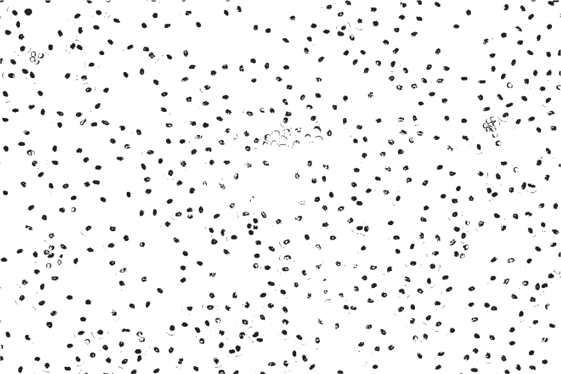

*图 14-15：通过颜色隔离的青蛙血细胞核*

我们已经很好地隔离了细胞核，并去除了部分不是血细胞的颗粒。

图 14-15 是圆形检测算法的一个很好的候选者，但我们首先必须完成两个初步步骤。`hough_circle_gradient()`函数并不作用于实际图像，而是作用于*边缘*和*相位*的映射。边缘映射是边缘检测算法的输出，将图像转换为基本上是描绘其形状的线条。相位映射是从边缘映射计算出的角度矩阵，给出每个梯度点的方向，角度范围从*–π*到π。

`canny()`函数是一个出色的边缘检测器：

```
julia> edges = canny(nuclei, (0.15, 0.0))
```

它的第二个参数是一个阈值元组，用于定义从输入图像（必须是灰度图像）中检测到的边缘。我通过反复试验得到了这些值，目标是捕获细胞核的边缘，同时忽略大多数白细胞和其他颗粒的散射。图 14-16 显示了`canny()`函数的输出。

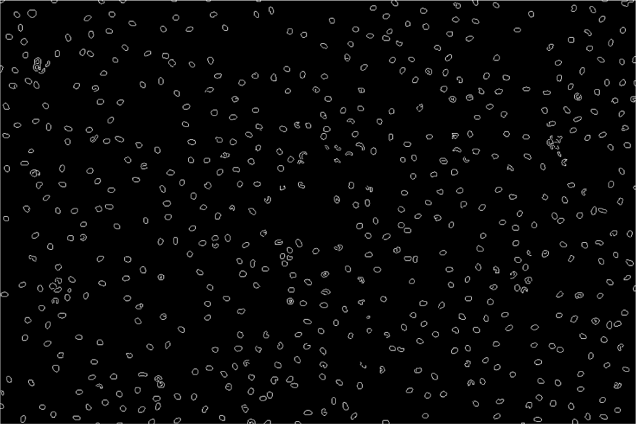

*图 14-16：细胞核图像的边缘检测*

这是一个相当干净的结果，正是我们所追求的。

相位计算本身需要两步——首先是计算梯度图，然后从中推导出相位：

```
julia> dx, dy = imgradients(edges, KernelFactors.ando5);

julia> phases = phase(dx, dy);
```

在计算了边缘和相位之后，我们可以运行霍夫变换：

```
julia> centers, radii = hough_circle_gradient(edges, phases, 1:5; min_dist=20);
```

在这个调用之后，`centers`包含一个索引向量，给出每个圆形的位置，`radii`包含它们对应的半径向量。任何一个向量的长度都表示检测到的圆形数量。在这种情况下，长度为 534，与我们之前得出的 499 个血细胞的估计值相吻合。

`hough_circle_gradient()`的第三个参数给出了圆形半径允许的范围，单位是像素。`min_dist`关键字参数是圆心之间的最小允许距离。

为了查看圆形拟合的效果，以及我们应该对 534 个血细胞估计的信心程度如何，我们可以使用`centers`数组直接在原始图像上绘制出`hough_circle_gradient()`函数认为应该出现的圆形位置：

```
julia> using ImageDraw

julia> for p in centers
           draw!(frog_blood, CirclePointRadius(p, 15; thickness=8, fill=false))
       end
```

`draw!()`函数由`ImageDraw`提供，通过在其第一个参数上绘制形状来修改该参数，默认颜色为白色。第二个参数中的`CirclePointRadius()`在点`p`处创建一个半径为 15 的圆；`fill=false`会创建一个开放的圆，其边界厚度由`thickness`关键字控制。

图 14-17 显示了将圆形绘制在（灰度版本的）原始图像上的结果。

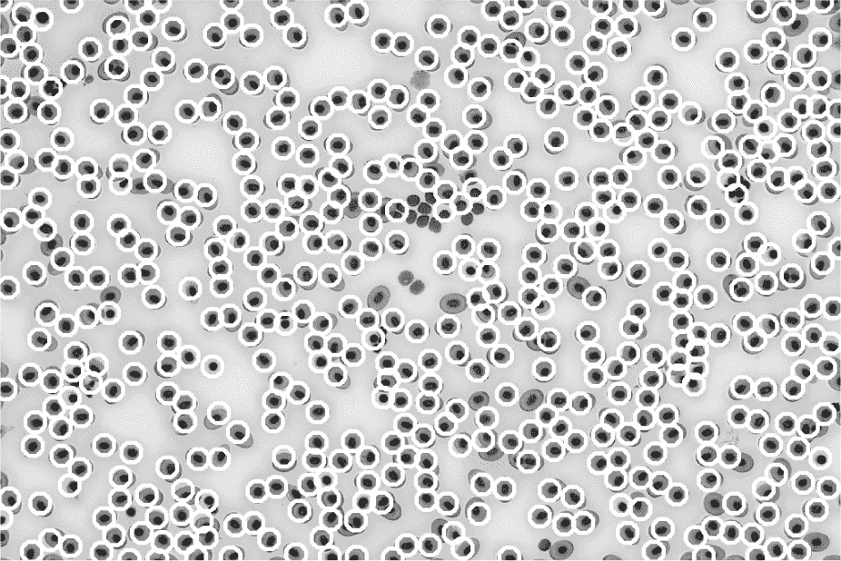

*图 14-17：霍夫变换检测到的圆形*

图 14-17 显示了霍夫变换的良好效果。几乎每个血细胞都被标记为一个圆形，其他大多数物体被忽略。虽然有少量漏检和误检，但整体上 534 个血细胞的数量相当准确。

本节描述的图像处理管道对于自动化血液计数非常实用，尽管需要根据不同类型的样本、不同的染色方式等调整具体参数。与手动计数相比，这种方法要快得多，可能也更准确。

#### ***应用高级数组概念***

由于图像本质上是一个数组，Julia 提供的各种高级数组概念可以使其操作更加方便和简洁。本节探讨了处理数组的技巧，虽然我们在多个包中看到了它们的应用，但我们直到现在才直接使用它们。在图像处理的上下文中，使用这些技巧变得更容易理解。

##### **视图**

*视图* 是对另一个数组或另一个数组部分的引用。另一个数组被称为*父数组*。视图是一种虚拟数组，几乎不占用内存：它与父数组共享内存，因此修改一个会同时修改另一个。

**注意**

*在创建视图后，修改父数组的形状是危险的。对视图的后续操作可能会导致越界内存访问或段错误。*

为了了解视图的工作原理，我们将创建一个中灰色值的小网格，并创建一个视图指向网格中的每个其他元素：

```
   julia> rgi = rand(Float64, (10, 10)) .* 0.2 .+ 0.4;

   julia> checkers = @view rgi[1:2:end, 1:2:end];

   julia> size(checkers)
   (5, 5)

➊ julia> checkers .= 0.0;

   julia> black_squares = heatmap(rgi; c=:grays, clim=(0.0, 1.0), colorbar=false);

   julia> checkers .= 1.0;

   julia> white_squares = heatmap(rgi; c=:grays, clim=(0.0, 1.0), colorbar=false);

   julia> plot(black_squares, white_squares)
```

第二行展示了如何使用 `@view` 宏创建视图。通过选择父数组的交替方格来定义 `checkers` 视图，形成一个棋盘模式。它的大小是父数组的一半。在将所有元素设置为 0.0 ➊ 后，父数组中的相应元素也被修改。我们可以反复更改视图中的元素值，这些更新会反映在父数组中。图 14-18 显示了结果。

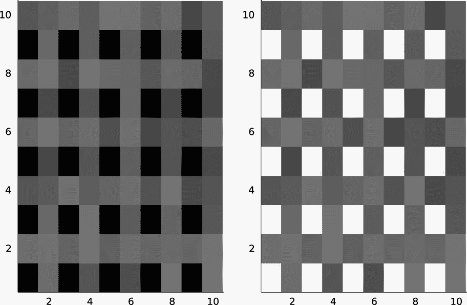

*图 14-18：使用视图创建的模式*

这个例子展示了视图如何简化某些表达式。它们也作为内存节约的工具非常有用。如果计算过程中使用了数组的部分内容作为中间容器，而我们在最终结果中不需要这些容器，我们可以通过使用视图来避免为这些临时结构分配内存。

举个例子，这里有两个版本的小函数，它们返回数组中交替元素和的差值：

```
function odd_even_difference(a::AbstractArray)
    return sum(a[begin:2:end]) - sum(a[begin+1:2:end])
end

function odd_even_difference2(a::AbstractArray)
 ➊ return @views sum(a[begin:2:end]) - sum(a[begin+1:2:end])
end

julia> using BenchmarkTools

julia> @btime odd_even_difference(rand(Int(1e7)));
  96.716 ms (6 allocations: 152.59 MiB)

julia> @btime odd_even_difference2(rand(Int(1e7)));
  62.116 ms (2 allocations: 76.29 MiB)
```

`@views` 宏 ➊ 将表达式右侧的所有切片操作转换为视图操作。程序的第一个版本创建了两个数组，并计算了奇数和偶数索引元素的和。第二个版本执行相同的计算，但通过创建视图而不是新数组来完成。计时结果显示，使用视图将内存消耗减少了一半，同时运行时间也减少了三分之一。通过在可能的情况下使用视图来避免不必要的数组复制，是一种简单的优化方法。

##### **轴数组**

使用`AxisArrays`包，我们可以为数组维度和轴命名，给数组加上单位，并享受更灵活的索引方式。数据框（见“数据框”章节中的第 333 页）也允许我们为行和列命名，但仅限于二维。

以下例子展示了如何为矩阵的行和列命名：

```
julia> using AxisArrays

julia> ae = AxisArray(reshape(1:100, 10, 10); row='a':'j', col='A':'J')
2-dimensional AxisArray{Int64,2,...} with axes:
    :row, 'a':1:'j'
    :col, 'A':1:'J'
And data, a 10×10 reshape(::UnitRange{Int64}, 10, 10) with eltype Int64:
  1  11  21  31  41  51  61  71  81   91
  2  12  22  32  42  52  62  72  82   92
  3  13  23  33  43  53  63  73  83   93
  4  14  24  34  44  54  64  74  84   94
  5  15  25  35  45  55  65  75  85   95
  6  16  26  36  46  56  66  76  86   96
  7  17  27  37  47  57  67  77  87   97
  8  18  28  38  48  58  68  78  88   98
  9  19  29  39  49  59  69  79  89   99
 10  20  30  40  50  60  70  80  90  100
```

使用这个定义，我们可以使用我们习惯的数字索引，或者使用我们为轴命名的名称，或者两者混合：

```
   julia> ae['a', 'B']
   11

   julia> ae[1, 2] == ae['a', 2] == ae[1, 'B']
   true

➊ julia> ae['a':'c', 'B':'D']
   2-dimensional AxisArray{Int64,2,...} with axes:
       :row, ['a', 'b', 'c']
       :col, ['B', 'C', 'D']
   And data, a 3×3 Matrix{Int64}:
    11  21  31
    12  22  32
    13  23  33

➋ julia> ae[col=2, row=1]
   11
```

这个例子展示了我们可以像使用数字索引一样，使用我们自定义的名称进行切片 ➊，并且如果我们使用维度的名称，我们可以以任意顺序提供索引 ➋。我们在这里使用`row`和`col`，它们在索引表达式内定义；它们在括号外并不存在作为变量。

下一个例子展示了如何将单位纳入数组定义中：

```
julia> using Unitful

julia> mm = u"mm";

julia> cm = u"cm";

julia> rgin = AxisArray(rand(Float64, (10, 10)) .* 0.2 .+ 0.4,
                 Axis{:y}(0mm:1mm:9mm), Axis{:x}(0cm:1cm:9cm));

julia> rgin[x=3, y=2] == rgin[1mm, 2cm] == rgin[2, 3] == rgin[x=2cm, y=1mm] ==
       rgin[2, 2cm]
true
```

这展示了`Axis{}()`构造函数的使用，并且在最后一行展示了我们可以以不同的方式对数组进行索引，包括混合使用数字索引和单位索引。

我们可以使用省略号，它来自自动导入的`EllipsisNotation`包，来表示单位范围：

```
julia> rgin[1mm .. 2mm, 1cm .. 3cm] == rgin[1mm .. 2.3mm, 10mm .. 30mm]
true
```

这展示了维度范围的两个特性。我们可以使用等效的单位，这里使用 10 毫米=1 厘米，并且区间的端点不需要恰好位于数组的某个元素上。需要注意的是，索引是向*下*取整，而不是取最接近的元素。

让我们通过定义一个长度范围的矩形，绘制它并将其涂成白色，然后绘制结果数组：

```
julia> rgin[2mm .. 7.2mm, 3cm .. 4.9cm] .= 1.0;

julia> heatmap(rgin; c=:grays, clim=(0.0, 1.0), colorbar=false, ratio=1,
        xticks=(1:10, ["$(i)mm" for i in 0:9]),
        yticks=(1:10, ["$(i)cm" for i in 0:9]),
        xrange=(0, 11))
```

绘图命令是自定义标签刻度的一个例子。图 14-19 展示了`rgin`的新状态。

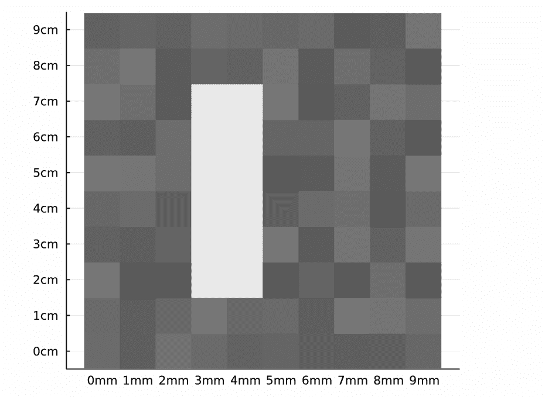

*图 14-19：我们通过指定物理长度来绘制这个白色矩形。*

直接使用物理尺寸来索引数组，让我们不再需要不断地在整数索引和它们在模型中代表的量之间进行转换，无论是通过思维还是编程方式。

##### **偏移数组（OffsetArrays）**

有经验的 Python 或 C 开发者在第一次接触 Julia 时，常常会抱怨其基于 1 的索引，而老一辈的 Fortran 开发者知道这其实是更好的选择。前者可能会高兴地发现，在 Julia 中，和 Fortran 一样，我们可以使数组从任何位置开始。

**不要假设 1 基索引**

假设传递给函数的数组是基于 1 的索引，这会是公共包中的偶发错误源。`OffsetArrays`的存在就是我们之前提醒不要通过以下方式迭代数组的原因：

```
for i = 1:length(A) # Do not do this.
    # ...expressions with A[i]...
```

代替使用`eachindex(A)`或其他生成合法索引的构造。不过还有一个原因：使用`eachindex()`会为某些类型的数组生成更高效的内存访问。

`OffsetArrays`包提供了多种创建`OffsetArray`的方法。我们可以使用`OffsetArray()`函数，传入源数组和每个维度的*偏移量*作为位置参数。一个维度的偏移量是其索引从正常位置的偏移程度。偏移量为 0 表示没有偏移，偏移量为-2 表示该维度的索引从-1 开始，到比其长度少 2 的位置结束。为了说明`OffsetArray`的工作原理，我们将再次使用我们的随机灰度矩阵：

```
julia> using OffsetArrays, Random

julia> rgen = MersenneTwister(7654);

julia> rgi = rand(rgen, Float64, (10, 10)) .* 0.2 .+ 0.4;

julia> rgi_offset = OffsetArray(rgi, -3, 2);

julia> rgi[1, 1]
0.5447560977385423

julia> rgi_offset[-2, 3]
0.5447560977385423
```

在这个示例中，我们使用了一个带有种子的随机数生成器（详见 第 307 页的《Julia 中的随机数》），这样读者在尝试这些命令时，结果将是相同的。`rgi_offset`的`(-2, 3)`位置对应于`rgi`的`(1, 1)`位置。

使用`OffsetArray()`创建的这是一个视图，而不是原始数组的副本，正如代码清单 14-4 中所示。

```
julia> rgi_offset[-2, 3] = 0.0
0.0

julia> rgi[1, 1]
0.0
```

*代码清单 14-4：* OffsetArrays *是视图*。

由于这两个数组共享内存，修改`rgi_offset`会同时修改`rgi`。当然，如果需要，我们可以使用`copy()`创建一个新数组：

```
julia> rgi_offset_copy = copy(OffsetArray(rgi, -3, 2));

julia> rgi_offset_copy[-2, 3] = 1.0
1.0

julia> rgi[1, 1]
0.0
```

将数组的部分区域涂成白色，说明范围与之前一样有效，考虑了偏移量：

```
julia> rgi_offset[0:5, 8:11] .= 1.0;
```

图 14-20 显示了数组的图像，其中黑色元素设置在代码清单 14-4 中，白色矩形设置在本示例中。热图的绘制网格以元素为中心，因此我们可以检查哪些元素发生了变化，以验证我们是否理解了索引范围。

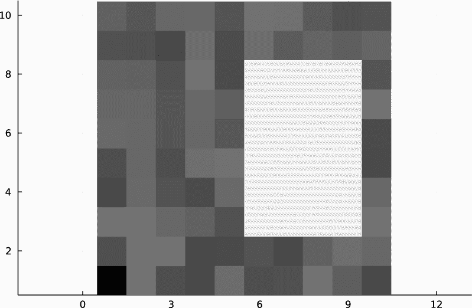

*图 14-20：白色矩形被定义为一个* OffsetArray。

使用`heatmap()`绘图时，除非我们明确提供坐标向量，否则它与`OffsetArrays`无法正常工作。换句话说，我们可以调用`heatmap(rgi)`，但必须使用`heatmap(1:10, 1:10, rgi_offset)`来防止绘图例程混淆。在这种情况下，这两个调用会产生相同的图像，因为这两个数组共享内存。

`OffsetArray()`提供了另一种语法，使用索引范围而不是单一偏移量。当从现有数组中提取子集时，这种方法很方便：

```
julia> passage = Float64.(Gray.(load("titanPassage.jpg")));

julia> passage = reverse(passage; dims=1);

julia> middle_passage = OffsetArray(passage[300:600, 400:700], 300:600, 400:700); ➊

julia> passage[300:600, 400:700] .= 0.0;

julia> passage[350:550, 450:650] = middle_passage[350:550, 450:650]; ➋
```

首先，我们加载一张彩色照片，将其转换为灰度图像，然后转化为浮点数组，并将结果赋值给`passage`。由于我们计划使用`heatmap()`来检查这些图像，我们为方便起见将图像垂直翻转，以抵消垂直轴方向的影响。

使用`OffsetArray()`，我们提取图像的一个方形部分并将其赋值给`middle_passage`➊。这一行展示了另一种建立偏移索引的方法：我们不使用单一的整数偏移量，而是提供一个索引数组的范围。我们选择这些索引与提取子图像时使用的索引相同，以便提取部分中的像素与原始图像中相同索引的像素对应。这种技术极大地简化了我们想要保持数组与子数组之间一致性的程序，消除了不断转换索引的需求。`middle_passage`矩阵是一个新的数组，而不是视图，因为索引范围会创建一个副本。

下一行将我们提取的方形区域涂成黑色。

在最后一行中，我们用提取自图像的一部分替换了黑色方块的部分➋。由于两个数组中的索引范围是相同的，替换后的图像部分将与原始部分完全对应。结果是图像的一部分被一个黑色框架包围，其他部分未做任何更改，正如图 14-21 所示。

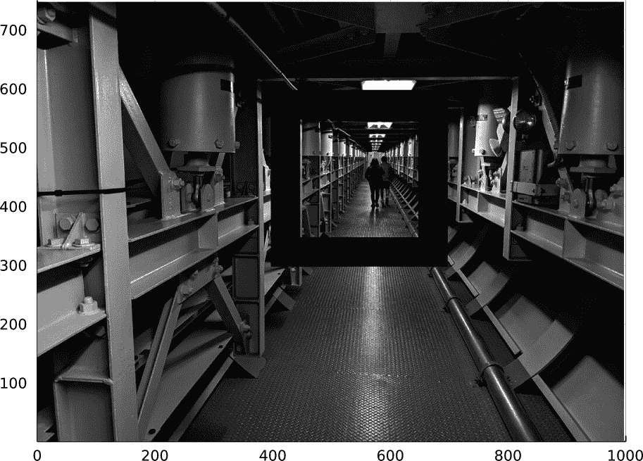

*图 14-21:* OffsetArrays *使许多图像操作变得更简单。原始照片由 Lee Phillips 在 Titan 导弹设施内拍摄（CC BY-ND 2.0）。*

使用偏移索引使得这段代码更容易编写和阅读，也更不容易出错。使用常规数组时，我们将不得不添加执行数组运算的代码行来转换大图像和提取图像之间的像素范围，或者从各个部分构建框架。

`OffsetArrays`包提供了另外两种自动构建数组偏移量的方法，这两种方法在图像处理中非常方便。我们可以创建一个以数组中心为中心的`OffsetArray`：

```
   julia> passage = Float64.(Gray.(load("titanPassage.jpg")));

➊ julia> OffsetArrays.center(passage)
   (375, 500)

   julia> passage[375, 500]
   0.25098039215686274

➋ julia> passage_centered = OffsetArrays.centered(passage);

   julia> passage_centered[0, 0]
   0.25098039215686274
```

`center()`函数➊来自`OffsetArrays`，它返回数组中心的索引（如果数组在某一维度上元素数量为奇数，它会向下取整）。该包的`centered()`函数➋创建一个以索引`[0, 0]`为中心的`OffsetArray`。由于存在命名冲突，我们通常需要用包名来限定这些函数名。

将索引空间的中心设置在数组的中心对于常见的情况非常有帮助，在这种情况下，数组表示的是物理空间中的某个量，或是时空中的某个量，我们通常使用以中心为原点的坐标系。这里是另一个视觉示例，其中将`[0, 0]`点置于图像的中心简化了计算：

```
julia> dmax = minimum(size(passage_centered))/2

julia> for j in eachindex(passage_centered[1, :]),
           i in eachindex(passage_centered[:, 1])
           passage_centered[i, j] *= max(0.0, 1.0 - sqrt(i² + j²)/dmax)
       end
```

我们将`dmax`设置为从中心到较短维度边缘的距离。然后，我们将每个像素乘以一个关于距离中心递减的函数。图 14-22 展示了结果，一个向边缘逐渐变暗的居中圆形框架。

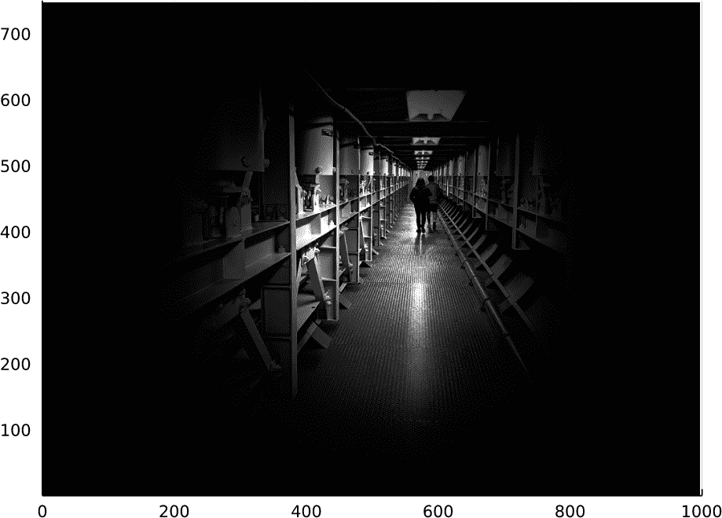

*图 14-22:* OffsetArrays *使得引用数组的中心变得容易。*

使用居中的`OffsetArray`简化了代码，使我们无需编写通常需要的索引运算来引用数组的中心。

##### **笛卡尔索引**

Julia 的*笛卡尔索引*是一个强大的工具，可以大大简化与数组相关的各种计算。Julia 内置的两个相关类型是`CartesianIndex`和`CartesianIndices`。`CartesianIndex`表示数组中任意大小元素的地址。`CartesianIndices`是跨越数组中任意维度的矩形区域的迭代器。

为了更加具体，也方便我们查看图示，我们将重点关注二维数组，如 Listing 14-5 所示。

```
julia> ci = CartesianIndex(1, 1)
CartesianIndex(1, 1)

julia> collect(5ci:8ci)
4×4 Matrix{CartesianIndex{2}}:
 CartesianIndex(5, 5)  CartesianIndex(5, 6)  CartesianIndex(5, 7)  CartesianIndex(5, 8)
 CartesianIndex(6, 5)  CartesianIndex(6, 6)  CartesianIndex(6, 7)  CartesianIndex(6, 8)
 CartesianIndex(7, 5)  CartesianIndex(7, 6)  CartesianIndex(7, 7)  CartesianIndex(7, 8)
 CartesianIndex(8, 5)  CartesianIndex(8, 6)  CartesianIndex(8, 7)  CartesianIndex(8, 8)
```

*Listing 14-5: 遍历* CartesianIndices

这个例子展示了如何使用`CartesianIndices`简化对矩形区域的迭代。首先，我们将与索引`[1, 1]`对应的`CartesianIndex`赋值给`ci`。然后，我们从`CartesianIndex(5, 5)`（表示为`5ci`）迭代到`8ci`，并使用`collect()`来实例化迭代过程，以便我们检查它。关键在于，线性迭代是如何扩展成对两个维度的嵌套迭代的，覆盖了两个角落`[5, 5]`和`[8, 8]`之间的矩形区域。我们可以在任何数量的维度中使用这种类型的迭代：

```
julia> collect(CartesianIndex(1, 1, 1):CartesianIndex(3, 3, 3))
3×3×3 Array{CartesianIndex{3}, 3}:
[:, :, 1] =
 CartesianIndex(1, 1, 1)  CartesianIndex(1, 2, 1)  CartesianIndex(1, 3, 1)
 CartesianIndex(2, 1, 1)  CartesianIndex(2, 2, 1)  CartesianIndex(2, 3, 1)
 CartesianIndex(3, 1, 1)  CartesianIndex(3, 2, 1)  CartesianIndex(3, 3, 1)

[:, :, 2] =
 CartesianIndex(1, 1, 2)  CartesianIndex(1, 2, 2)  CartesianIndex(1, 3, 2)
 CartesianIndex(2, 1, 2)  CartesianIndex(2, 2, 2)  CartesianIndex(2, 3, 2)
 CartesianIndex(3, 1, 2)  CartesianIndex(3, 2, 2)  CartesianIndex(3, 3, 2)

[:, :, 3] =
 CartesianIndex(1, 1, 3)  CartesianIndex(1, 2, 3)  CartesianIndex(1, 3, 3)
 CartesianIndex(2, 1, 3)  CartesianIndex(2, 2, 3)  CartesianIndex(2, 3, 3)
 CartesianIndex(3, 1, 3)  CartesianIndex(3, 2, 3)  CartesianIndex(3, 3, 3)
```

这里的迭代代表一个立方体。如果没有`CartesianIndices`，我们需要将其写成三个嵌套循环，但这里它只是一个简单的范围表达式。

事实上，`CartesianIndices`比这些例子展示的更为通用。它们不必代表连续的矩形区域：

```
julia> collect(CartesianIndex(1, 1):CartesianIndex(2, 2):CartesianIndex(5, 5))
3×3 Matrix{CartesianIndex{2}}:
 CartesianIndex(1, 1)  CartesianIndex(1, 3)  CartesianIndex(1, 5)
 CartesianIndex(3, 1)  CartesianIndex(3, 3)  CartesianIndex(3, 5)
 CartesianIndex(5, 1)  CartesianIndex(5, 3)  CartesianIndex(5, 5)
```

它们的实用性在于紧凑地表示嵌套迭代，并构造“可移植”的索引范围，我们可以在不同的数组中使用。Listing 14-6 阐明了这个思想。

```
julia> by2 = CartesianIndex(1, 1):CartesianIndex(2, 2):CartesianIndex(5, 5)
CartesianIndices((1:2:5, 1:2:5))

julia> reshape(1:100, 10, 10)[by2]
3×3 Matrix{Int64}:
 1  21  41
 3  23  43
 5  25  45
```

*Listing 14-6: 使用* CartesianIndices *构造“可移植”索引范围*

这里我们将一个`CartesianIndices`迭代器赋值给`by2`，然后用它从一个 10×10 矩阵中提取了九个不连续的元素。这个例子还展示了一种更简洁的定义迭代器的方法，这种方法是根据第一行返回结果的形式得到的：

```
julia> CartesianIndices((1:3, 1:3, 1:3)) ==
       CartesianIndex(1, 1, 1):CartesianIndex(3, 3, 3)
true
```

为了帮助可视化`CartesianIndices`，我们将从一个 100×100 版本的随机灰度矩阵开始，并通过遍历`ci`的倍数，在矩阵中选择一个矩形区域，定义见 Listing 14-6：

```
julia> rgi = rand(rgen, Float64, (100, 100)) .* 0.2 .+ 0.4;

julia> rgi[5ci:20ci] .= 0.0;
```

Figure 14-23 展示了这对`rgi`的作用。

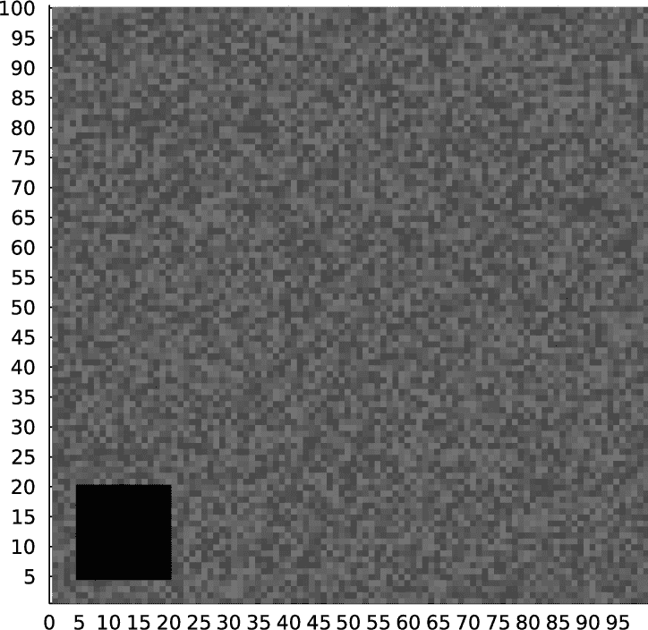

*Figure 14-23: 用* CartesianIndices *定义矩形区域*

Julia 的`CartesianIndices`为我们提供了一种定义矩形区域的方法，我们可以在该区域上执行直接的算术运算，例如将其移动到数组周围的不同位置。这种“移动窗口”在我们之前使用的快速傅里叶变换和声谱图函数中后台运作。这也是在网格上求解偏微分方程的一个重要部分，这是计算科学中的一项主要工作。那些有经验在传统语言如 Fortran 中编写此类模板操作的人，知道这个过程有多么棘手。在这里，我们将这一思想应用于一张照片，通过滑动一个方形窗口在图像上来创建一个模糊的、像素平均化的版本：

```
   julia> monk = Float64.(load("monk-mintons-1947.jpg"));

➊ julia> average_monk = similar(monk);

   julia> cim = CartesianIndices(monk);

   julia> ws = 1; # Window size

➋ julia> c1 = CartesianIndex(ws, ws);

   julia> for i in cim
              n = s = 0.0
              for j in max(first(cim), i - c1):min(last(cim), i + c1)
                  n += 1
                  s += monk[j]
              end
          average_monk[i] = s/n
          end
```

加载图像后，我们使用`similar()` ➊初始化一个数组，用来保存平均化后的版本，该函数会复制一个大小和类型相同的数组。我们将使用`cim`变量来遍历整个原始图像。移动方形窗口的大小被赋值给`ws`，它用于定义窗口的范围➋。`for`循环遍历原图中的每个点，将其替换为以该点为中心的方形窗口内所有像素的平均值。

`max()`和`min()`调用的目的是处理边界区域，在这些区域中，移动窗口会扩展超出矩阵的边界。这之所以可行，是因为`max()`和`min()`如何处理`CartesianIndex`类型：

```
julia> max(CartesianIndex(3, 4), CartesianIndex(-2, 9))
CartesianIndex(3, 9)

julia> min(CartesianIndex(3, 4), CartesianIndex(-2, 9))
CartesianIndex(-2, 4)
```

这些函数返回一个新的`CartesianIndex`，其中每个维度的索引都被单独最大化或最小化；因此，我们只需要参考原始数组的角落，以确保没有索引分量过大或过小。

这些函数在元组（tuple）上有不同的作用：

```
julia> max((3, 4), (-2, 9))
(3, 4)
```

在这里，元组（或向量）按其第一个元素排序，返回值始终是其中一个参数。

图 14-24 展示了原图以及经过 1、4 和 8 像素平均化后的结果。

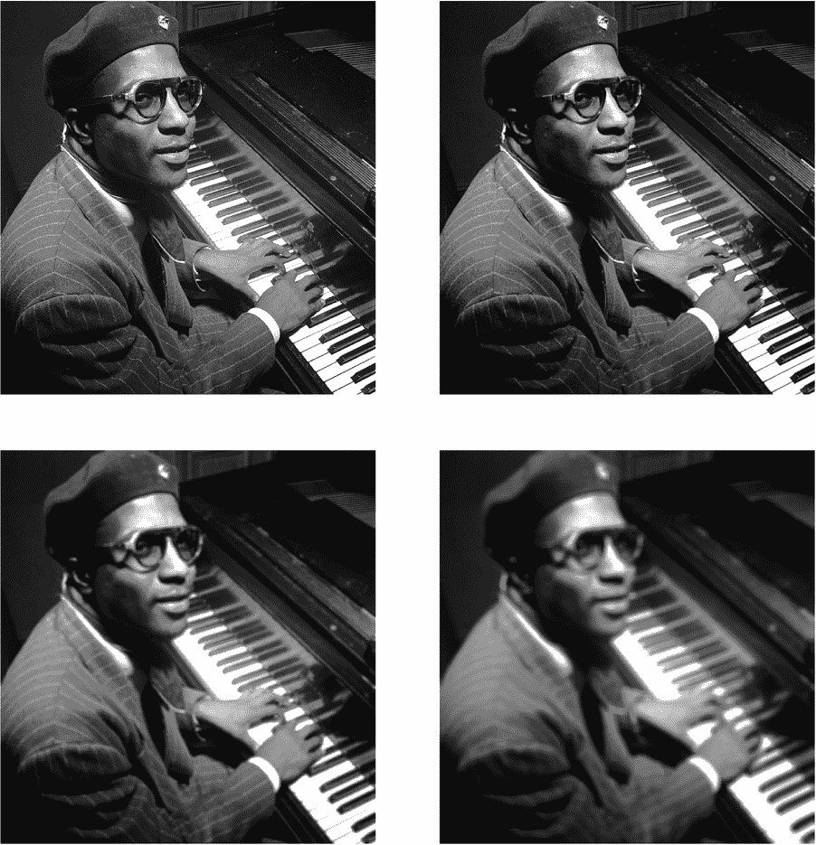

*图 14-24：西奥诺留斯·蒙克，1947 年。原图和经过 1、4 和 8 像素平滑处理后的图像，从左到右、从上到下。照片由威廉·戈特利布拍摄（公有领域*，[`hdl.loc.gov/loc.music/gottlieb.06191`](http://hdl.loc.gov/loc.music/gottlieb.06191))。

结果是原图逐渐变得更加柔和，这是简单的低通滤波的结果。

我们可以使用类似的方法创建一个缩小的图像——例如，在每个维度上缩小一倍：

```
julia> smaller_monk = zeros(size(monk) .÷ 2);
julia> cism = CartesianIndices(smaller_monk);
julia> c1 = CartesianIndex(1, 1)
julia> for i in cism
           n = s = 0.0
        ➊ for j in max(first(cim), 2i - c1):min(last(cim), 2i + c1)
               n += 1
               s += monk[j]
           end
       smaller_monk[i] = s/n
       end
```

在初始化一个大小为原图一半的数组来存放缩小版图像后，我们创建一个覆盖该数组的`CartesianIndices`迭代器，并将其赋值给`cism`。外层循环遍历这个较小的数组，并将其每个元素设置为对应位置在原图中相邻像素的平均值。索引➊之所以如此，是因为对于缩小版图像中的位置`[i, j]`，在原图中的对应位置是`[2i, 2j]`。

图 14-25 展示了原图与减少版的对比。


*图 14-25：钢琴四手联弹：通过像素平均化缩减图像*

当然，我们也可以使用`original[1:2:dy, 1:2:dx]`快速创建一个缩减图像，但像素平均化会带来更好的结果，特别是在斜线的表现上。专业的图像缩减算法通常采用更大的窗口，采样方法也比这个例子中的简单算术平均更复杂。

### **结论**

在本章中，我们分析和处理了来自声音和图像的物理世界中的伪影。我们探索了信号和图像处理包中的各种工具，也发现，Julia 强大的数组处理功能使得困难的任务变得简单，让我们能够编写简短而简单的程序来完成复杂的工作。

**进一步阅读**

+   `SignalAnalysis.jl` 的文档可以在 [*https://org-arl.github.io/SignalAnalysis.jl/stable/*](https://org-arl.github.io/SignalAnalysis.jl/stable/) 查阅。

+   有关 WAV 文件格式的详细信息，请访问 [*https://docs.fileformat.com/audio/wav/*](https://docs.fileformat.com/audio/wav/)。

+   JuliaImages 是查找各种 Julia 图像处理包及其文档的起点：[*https://juliaimages.org/stable*](https://juliaimages.org/stable)。

+   关于霍夫变换的背景知识，请访问 [*https://homepages.inf.ed.ac.uk/rbf/HIPR2/hough.htm*](https://homepages.inf.ed.ac.uk/rbf/HIPR2/hough.htm)。

+   笛卡尔指标……它们有什么用？Tim Holy 解释道：[*https://julialang.org/blog/2016/02/iteration/*](https://julialang.org/blog/2016/02/iteration/)。这篇文章启发了本章中使用的图像缩减方法。
