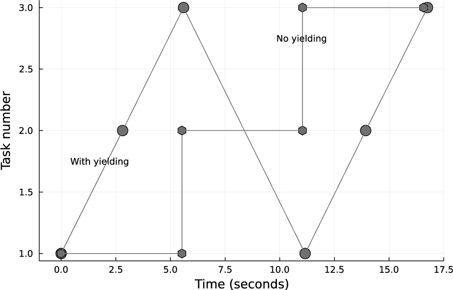

## **15**

**并行处理**

*如果一头牛无法完成工作，他们不会尝试养更大的一头牛，而是使用两头牛。*

—格蕾丝·霍普


并行处理是一类计算策略，我们将一个问题分解成若干部分，并用不同的计算机或单台计算机上的不同处理单元来解决每个部分——或者两者的组合。本章讨论的是*真正的并行处理*，即不同的计算同时进行，以及*并发处理*，即我们要求计算机同时做几件事，但它可能需要在它们之间交替执行。

虽然编写有效的并行程序可能很棘手，但 Julia 在尽可能简化并行和并发处理方面做了大量工作。同一个程序可能在并行或仅仅并发的方式下运行，这取决于机器资源，但 Julia 的抽象使我们可以编写一个版本的程序，在不同的运行时环境中都能发挥作用。

本章将概述如何利用 Julia 内建的功能和几个便利的包来实现主要的并发范式。

### **并发范式**

从程序员的角度来看，一个自然的区分是*多线程*和*多进程*，这是本章的主要划分。这个领域存在一些术语不一致的问题。我们使用多线程来指代旨在实现单台机器上多个 CPU 核心并行执行的编程。*核心*是 CPU 芯片中的处理单元。每个核心都配备有自己的资源，比如缓存和算术逻辑单元，并可以独立执行指令，尽管它可能与其他核心共享一些资源。如果某人将多线程程序运行在只有一个核心的计算机上，那么不会发生并行处理，但当我们编写程序时，这并不需要担心。如果我们正确编写代码，它将在多核机器上运行得更快。

我们使用多进程编程来指代一种编程风格，在这种风格中，我们启动可以由单台计算机上的不同进程或多台计算机（或两者）执行的任务。

这两种编程风格之间最重要的区别在于内存访问：多线程程序中的所有线程都可以访问相同的内存池，而多进程程序中的进程则有各自独立的内存区域。

### **多线程**

本节讨论通过将工作划分为多个*任务*来加速单个进程中的工作。由于所有这些任务都存在于同一进程中，因此它们都可以访问相同的内存空间。任务是 Julia 并行和并发处理的基本概念。它是一个离散的工作单元，通常是一个函数调用，由*调度器*分配给特定的线程。任务本质上是异步的；一旦启动，它们将在分配的线程上继续执行，直到完成或通过让出给调度器而自行挂起。然而，我们可以通过多种方式同步和协调任务的生命周期。

**注意**

*你可能已经在不知情的情况下使用 Julia 进行并行计算。许多线性代数例程，包括由*运算符*调度的矩阵乘法，运行多线程 BLAS（基本线性代数子程序）例程，这些例程自动利用所有 CPU 核心，对用户是透明的。你可以通过在 REPL 中执行矩阵乘法并关注你的 CPU 监控工具来验证这一点。*

当我们进入 Julia REPL 或使用`julia`命令运行存储在磁盘上的程序时，我们有几个可用的命令行选项。除非使用`-t`选项，否则 Julia 只使用一个线程（因此，也只使用一个 CPU 核心），无论其运行的硬件配置如何。

要允许 Julia 使用所有可用的线程，请使用`-t auto`参数。在这种情况下，所有“可用”的线程将是机器上的所有*逻辑*线程。这通常不是最优选择。更好的选择是使用`-t` n，其中 n 是*物理*核心的数量。例如，流行的 Intel Core 处理器通过一种称为*超线程*的技术为每个物理核心提供两个逻辑核心。超线程可能会带来从适度加速到实际减速的效果，这取决于计算类型。

在 Linux 上，我们可以在系统命令行使用`lscpu`命令获取关于 CPU 的信息。例如，如果输出包含以下几行

```
Thread(s) per core:              2
Core(s) per socket:              2
Socket(s):                       1
```

那么该机器总共有两个物理计算核心和通过超线程提供的四个逻辑线程。我们通常需要实验才能发现`-t` n（在这种情况下，`-t 2`）或`-t auto`哪个能带来更好的结果。

在程序中或 REPL 中，我们可以通过以下命令检查可用线程的数量

```
Threads.nthreads()
```

它报告了正在使用的总数，但无法区分其中多少是真正的核心。

使用多个线程，我们可以通过将任务分配到多个 CPU 核心上同时运行，从而加速程序，无论是自动的还是通过应用不同级别的控制。

#### ***使用折叠实现简单多线程***

启动任务的一种自动方式是使用 `Folds` 包，它提供了 `map()`、`sum()`、`maximum()`、`minimum()`、`reduce()`、`collect()` 等多个函数的多线程版本。这些函数的使用非常简单，比如将 `sum()` 替换为 `Folds.sum()`。并行化函数会负责在所有可用线程之间分配工作。

作为一个例子，Listing 15-1 展示了在一个数组上并行化计算一个开销较大的函数。

```
julia> using BenchmarkTools, Folds

julia> f(x) = sum([exp(1/i²) for i in 1:x]);

julia> time_serial = @belapsed map(f, 100_000:105_000)
13.989536582

julia> time_parallel = @belapsed Folds.map(f, 100_000:105_000)
7.606663313

julia> time_parallel / time_serial
0.5437394776026614

julia> Threads.nthreads()
2
```

*Listing 15-1: 使用* Folds.jl *实现简单的并行化*

`@belapsed` 宏是 `BenchmarkTools` 的一部分。像我们之前使用过的 `@btime` 宏一样，它会反复运行任务并报告资源利用率的平均值。这个版本在我们仅需获取消耗的 CPU 时间时特别方便。

`map()` 的并行化版本将每个线程分配到 5,001 个数字的循环中的大致相等部分。理想情况下，总的计算时间应该是 1/*N*，其中 *N* 是线程的数量。在后台，它会创建任务，每个任务处理循环中的一部分，然后将它们分配给可用线程；它可能使用两个任务，或者更多。它还会同步计算，在所有任务完成后才返回结果。

这个 REPL 会话是通过 `-t 2` 标志启动的。结果显示，使用并行版本的计算时间仅略高于串行计算的一半。由于我们在两个（物理）线程上运行，结果显示了几乎理想的并行加速效果。

然而，我们并不总是这么幸运。并行化计算是否有帮助、会造成负面影响或没有效果，取决于设置和管理任务集的开销与分配工作所带来的好处之间的权衡。这种效果受到每个数组元素的计算成本、数组的大小以及内存访问模式的影响。在较小的数组上执行相同的计算时，使用串行 `map()` 会得到更好的结果：

```
julia> time_serial = @belapsed map(f, 1:41)
2.4464e-5

julia> time_parallel = @belapsed Folds.map(f, 1:41)
2.5466e-5
```

在这里，使用单个处理器的计算实际上比试图并行化短计算要快。成功的并行计算需要大量的测试。我们需要确保能够充分利用硬件，并且在多个核心上运行的结果与串行运行的结果是相同的，除了浮点数计算重排序可能在某些程序中导致的微小数值差异。

#### ***使用 @threads 进行手动多线程***

`Folds` 包是本节讨论的手动多线程的高级接口。手动操作需要更多的注意，但它可以提供额外的控制，这在某些情况下是我们所需要的。

##### **Threads.@threads**

Julia 中进行多线程的主要工具是 `Threads.@threads` 宏，它是 `Base` 的一部分，因此始终可用。为了并行运行一个循环，我们只需在循环前加上这个宏。作为介绍，Listing 15-2 解决了与上一节相同的问题。

```
julia> f(x) = sum([exp(1/i²) for i in 1:x]);

julia> time_serial = @belapsed for x in 100_000:105_000
           r = f(x)
       end
13.933373843

julia> time_parallel = @belapsed Threads.@threads for x in 100_000:105_000
           r = f(x)
       end
7.507556971
```

*清单 15-2：计时线程循环*

显然，`@threads`版本的表现与`Folds`包中的包装器相似。

`@threads`宏通过将循环划分为*N*个段落并将每个段落分配给一个独立的任务来工作。调度器将这些任务分配给可用的线程。通常*N*是线程数的小倍数，所以如果我们有两个核心并且使用了`-t 2`标志，`@threads`可能会将 5001 个元素的循环分成两个或四个大致相等的循环。

`@threads`循环是同步的，意味着计算不会在循环结束之前继续，直到所有任务完成。循环的不同部分，因此不同的任务，可能需要不同的时间。如果这个时间差异很大，一些线程将会闲置，等待其他线程赶上。这就是为什么，如前所述，当所有迭代的计算时间大致相同时，这种多线程风格的表现最好。

与其丢弃结果，不如尝试将所有的`f(x)`加在一起：

```
function sumf_serial(n)
    s = 0.0
    for x in 1:n
        s += f(x)
    end
    s
end

function sumf_parallel(n)
    s = 0.0
    Threads.@threads for x in 1:n
        s += f(x)
    end
    s
end

julia> sumf_serial(1000)
502900.5422006599

julia> sumf_parallel(1000)
376606.37463883933

julia> sumf_parallel(1000)
376453.03112871706
```

并行结果不仅与串行结果不同，而且似乎我们在不同的并行程序运行中会得到不同的答案。我们哪里做错了？

##### **原子理论**

问题出现在我们在并行循环中更新`s`时。多个独立的线程尝试访问并写入相同的标量变量时，产生了*竞争条件*，这是一个冲突，其结果取决于操作顺序，而程序无法控制。由于时序的不同，基于操作系统在运行期间执行的其他任务等未知因素的影响，我们可能从不同的运行中得到不同的结果。当更新数组位置时没有问题，因为在多线程循环中，数组将被分配到不同的线程中，没有线程会干扰其他线程的数据。

Julia 提供了几种在多线程执行期间保护标量的策略。一种方法是使用*原子变量*，如清单 15-3 所示。

```
function sumf_parallel_locked(n)
    s = Threads.Atomic{Float64}(0);
    Threads.@threads for x in 1:n
        Threads.atomic_add!(s, f(x))
    end
    s[]
end

julia> sumf_parallel_locked(1000)
502900.5422006605
```

*清单 15-3：使用原子变量*

我们已经使用内建的`Threads.Atomic`声明将`s`初始化为原子变量。它仅允许简单类型：各种浮动数、整数和`Bool`类型。我们通过一小组为此目的设计的函数来更新原子变量，所有函数都在`Threads`命名空间下。除了`Threads.atomic_add!()`，我们还可以使用`atomic_sub!()`进行减法、几个逻辑操作符、`atomic_xchg!()`用于将变量设置为新值，等等。我们通过程序最后一行中看起来有点奇怪的语法来访问原子变量的值。

结果接近串行结果，因此原子变量解决了这个问题。结果虽然接近，但不完全相同：它们在最后几位小数上有所不同。一系列浮点操作的结果可能取决于它们的顺序，而顺序在串行和并行运行之间以及在不同线程数的并行运行之间会有所变化。如果我们在循环中反向计数运行串行代码，我们也会得到一个稍微不同的结果：

```
function sumf_serial_reversed(n)
    s = 0.0
    for x in n:-1:1
        s += f(x)
    end
    s
end

julia> sumf_serial_reversed(1000)
502900.5422006606
```

这些答案中最低有效位的细微变化是正常且可以预期的，数值分析人员在比较并行化程序在不同计算机上运行时的结果时，必须对这些变化保持警觉，因为不同的计算机可能有不同数量的核心。

我们还可以使用不同的策略得到正确的求和结果：

```
function sumf_parallel2(n)
    s = zeros(Threads.nthreads())
    Threads.@threads for x in 1:n
     ➊ s[Threads.threadid()] += f(x)
    end
    sum(s)
end

julia> sumf_parallel2(1000)
502900.5422006605
```

本质上，我们为每个线程提供了其私有的求和变量副本，并在最后将所有副本相加。我们使用 `Threads.nthreads()` 创建一个与线程数相同长度的向量。在每个线程中，`Threads.threadid()` 返回该线程的唯一整数标识符。我们使用这个标识符来索引求和数组 ➊，确保每个线程仅更新属于它的元素。最后一行的求和结果应该与程序的其他版本中的标量 `s` 相同。

使用数组代替原子变量的技术可能更快，因为在一个线程被允许读取或更新原子变量之前，它必须等待直到任何其他线程释放它。使用数组避免了这种*锁定*和随之而来的等待时间。然而，它为新数组使用了稍微更多的内存。

#### ***启动和同步任务***

我们在前两节中描述的技巧通过将工作分配给任务并在后台启动它们来实现并行化。在这里，我们将学习如何控制任务的启动和同步。

##### **使用线程启动任务.@spawn**

我们也可以像 Listing 15-4 中展示的那样，使用 `Threads.@spawn` 宏手动启动任务。

```
function sumf_atomic(f)
    s = Threads.Atomic{Float64}(0.0);
 ➊ @sync for x in 100_000:105_000
        Threads.@spawn Threads.atomic_add!(s, f(x))
    end
return s
end

julia> @belapsed s = sumf_atomic(f)
8.101242794

julia> s = sumf_atomic(f);

julia> s[]
5.126145395914207e8
```

*Listing 15-4: 引入任务启动*

由于 `@belapsed` 和 `BenchmarkTools` 中的其他基准测试工具会多次运行代码，我们将计时代码放入函数中，以确保在每次试验运行时原子变量都会被初始化。

`@sync` 宏 ➊ 适用于任何代码块，而不仅仅是 `for` 循环。它同步所有在代码块的词法作用域内启动的任务，这意味着其 `end` 语句后的语句会等待直到所有任务完成。在 Listing 15-4 中，`@sync` 确保当我们访问 `s[]` 时，它会有最终值，并且计时结果包括所有任务完成的时间。

Listing 15-4 中的代码块是 Listing 15-3 中函数的一个版本，使用了手动启动的任务。通常，循环

```
Threads.@threads for i in 1:N
    something
end
```

与语义等效

```
@sync for i in 1:N
    Threads.@spawn something
end
```

但是它们的实现是不同的，正如前面提到的，`Threads` `.@threads`是*粗粒度*的，将循环划分为少量的任务。手动启动的版本会为每次循环迭代创建一个新任务。

这两个例子的时序几乎相同，表明在 Julia 中启动任务几乎没有开销；我们可以启动成千上万的任务，性能损失几乎可以忽略不计。如果我们将使用任务的程序移到拥有更多核心的机器上，它应该能够更快运行，而且我们不需要做任何修改。

**注意**

*在本章中，我们在顶层对裸循环进行了多次计时，以便比较不同并发和并行方法的效果，并尽可能少的代码行。在开发一个真正的程序时，所有的计时研究应该放在函数中，最好是在模块中。许多编译器优化仅对函数中的代码有效。*

##### **同步**

使用`Folds.map()`或`@threads`可以帮助我们同步任务。但是，如果我们手动使用`Threads.@spawn`启动任务，我们无法知道在程序的某个特定时刻哪些任务已经完成。这就是为什么 Listing 15-4 中的程序需要`@sync`宏的原因。

以下示例说明了如果我们忽略同步，可能会发生什么情况：

```
W = zeros(5);

for i in 1:5
    Threads.@spawn (sleep(1); W[i] = i)
end
println(W)
```

如果我们运行这个程序，我们会看到如下输出：

```
[0.0, 0.0, 0.0, 0.0, 0.0]
```

每次循环迭代都会启动一个任务，改变全局数组，向其中的某个位置写入数据。然而，在循环结束时，数组`W`似乎没有发生变化。

每个`@spawn`都会发送一个任务来执行工作，循环会立即继续到下一次迭代。虽然每个被启动的任务都会受到`sleep()`调用引入的内建延迟，但整个循环几乎是瞬间完成的。然后我们执行循环后面的语句，打印出`W`的值，此时它还没有被写入。

如果我们想要等待循环结束时所有在其中启动的任务完成，以便`W`得到更新，我们可以使用`@sync`宏：

```
W = zeros(5);

@sync for i in 1:5
    Threads.@spawn (sleep(1); W[i] = i)
end
println(W)
```

当我们运行这个程序时，我们看到：

```
[1.0, 2.0, 3.0, 4.0, 5.0]
```

我们可以选择不对所有任务进行同步，而是等待某些任务完成，让其他任务继续执行：

```
W = zeros(5);

jobs = Vector{Any}(undef, 5);

for i in 1:5
    jobs[i] = Threads.@spawn (sleep(i); W[i] = i)
end
wait(jobs[2])
println(W)
```

我们初始化一个`jobs`向量来存储每次调用`@spawn`返回的值。这些是`Task`，一种数据类型，用来存储关于异步任务的信息。`wait()`函数会暂停执行，直到其参数准备好。我们稍微修改循环，每次迭代等待`i`秒，这样每个任务所需的时间都会比上一个任务更长。第二个任务完成后，下一条指令，打印`W`，会被执行。

程序会输出如下内容：

```
[1.0, 2.0, 0.0, 0.0, 0.0]
```

我们可以看到，当`println()`语句被执行时，`W`的前两个元素被修改了，但其余的任务仍然在运行（处于睡眠状态）。

另一个有用的同步函数是`fetch()`。像`wait()`一样，它接收一个`Task`作为参数，并等待任务完成：

```
W = zeros(5);

jobs = Vector{Any}(undef, 5);

for i in 1:5
    jobs[i] = Threads.@spawn (sleep(i); W[i] = i)
end
job2 = fetch(jobs[2])
println(W)
println(job2)
```

该函数打印出如下输出：

```
[1.0, 2.0, 0.0, 0.0, 0.0]
2
```

由于赋值操作返回的是被赋的值，执行 `W[2] = 2` 的任务返回 2，并通过调用 `fetch()` 将其赋值给 `job2`。此时 `W` 的状态是第二个任务完成后的状态。

##### **让出**

在调度器将任务分配到所有可用线程后，任何剩余的生成任务都会进入*队列*，等待它们运行的时机。它们必须等到其中一个正在运行的任务完成或*让出*其位置。这个系统被称为*协作式多任务*，它是 Julia 通常应用于任务调度的模型。一些操作会导致任务自动让出。最重要的操作包括等待 I/O 和休眠。但如果程序涉及多个执行长时间计算的任务，那么我们的任务就是手动拆分计算并插入`yield()`，以便为其他任务提供运行的机会，*除非*我们不介意每个线程等待它上面每个昂贵任务的完成（这可能是可以接受的）。

清单 15-5 包含两个函数，它们各自执行相同的繁琐任务，应用在清单 15-1 中定义的 `f(x)`，对一系列数字进行操作。这两个函数的区别在于，第一个函数一次性完成所有工作，而第二个函数将范围分成两个部分，并在中间调用 `yield()`。`yield()` 函数告诉调度器可以挂起该任务，并从队列中运行下一个任务（如果有任务在等待）。该任务完成后，挂起的任务将恢复运行。

```
function task_timer(n)
    push!(times, (n, time()))
    map(f, 100_000:102_000)
    push!(times, (n, time()))
end

function task_yield_timer(n)
    push!(times, (n, time()))
    map(f, 100_000:101_000)
    yield()
    map(f, 101_000:102_000)
    push!(times, (n, time()))
end
```

*清单 15-5：插入让出机会*

这些函数假设存在一个名为 `times` 的全局数组。它们将调用 `time()` 的结果与整数 `n`（表示任务标识符）一起放入一个元组，并在任务开始时和返回之前将其放到该数组的末尾。`time()` 函数返回系统时间（以秒为单位，精度可达到微秒）。其值并不重要，但我们可以通过两次调用 `time()` 之间的差值，来了解两段代码之间经过了多少时间，这是一个非常准确的衡量中间计算所需时间的方法。

清单 15-6 使用第一个函数生成三个任务，并记录保存的时间，然后使用包含 `yield()` 调用的修改函数执行相同的操作。

```
times = []
@sync for n in 1:3
    Threads.@spawn task_timer(n)
end
times_noyield = times[:]

times = []
@sync for n in 1:3
    Threads.@spawn task_yield_timer(n)
end
times_yield = times[:]
```

*清单 15-6：测试让出的效果*

图 15-1 绘制了任务编号与每个线程生成循环开始后的*经过*时间的关系图，实验是在单个线程上进行的。



*图 15-1：协作式和自私任务的时间*

从图 15-1 中我们可以看到，每个完整的循环大约需要 5.5 秒。实验中使用让步（圆圈）表明每个任务完成一半循环后，允许队列中的下一个任务运行。直到所有后续任务完成它们的第一半并让步后，它才会恢复。没有让步的实验（六边形）中，每个任务都独占线程直到完成。

在只有一个线程活动时，任务操作的顺序是可以预测的。而且，使用一个线程时，无法通过任务让步或任何任务重排来缩短所有计算完成的时间；我们无法从中获得免费的时间。然而，在较轻任务与耗时任务混合的情况下，允许后者让步将让我们更早获得轻任务的结果，这在某些程序中是非常可取的。当有多个线程可用时，让步可以给调度器一个机会，在各线程之间迁移任务，使它们都保持忙碌，并可能增加总的吞吐量。这个任务重排的过程称为*负载均衡*。

### **多处理**

如果我们决定沿用 Grace Hopper 在本章开头使用的比喻，我们可以说，前一部分讨论的多线程就像将一队牛车连在一起拉动一大车货物，而本部分讨论的多处理则可以比作将负载分成多个独立的车厢，让每头牛以自己的节奏拉动各自的车厢。

多处理和分布式计算是紧密相关的概念，这两个术语通常可以互换使用。这种计算方式将工作划分为多个拥有自己内存空间的*进程*。这些进程可以共享单台计算机上的资源，或者在多个联网计算机上共享资源。Julia 的抽象使得我们可以编写一次多进程程序，并在各种环境中运行它。

由于各个进程无法访问相同的内存，它们需要的数据必须被复制并发送给它们，可能通过网络传输。因此，分布式计算最适合处理小数据上的耗时任务，特别是在计算资源通过像互联网这样的慢速网络进行通信时。

在集群上运行使用多处理将工作分配到多个处理器，通常这些处理器通过更高带宽的网络进行通信，再结合前一部分中的多线程技术，以便充分利用每个节点。

多处理基于与前述多线程相同的异步任务概念。它增加了进程的概念以及在多个进程中生成任务的可能性。它允许我们自动或通过控制单个任务来完成这一操作，且程序接口与我们在多线程中探索过的接口类似。

#### ***使用 pmap 轻松实现多处理***

要以多进程模式启动 Julia REPL 或运行时，请使用`-p`标志。与`-t`标志一样，通常最合理的做法是请求与可用硬件线程数相等的进程数。在一台具有两个核心的机器上，使用`julia -p2`启动 Julia。这将创建两个*工作进程*，它们可以接收任务。在这种情况下，我们将有三个进程：两个工作进程和执行进程，如果我们是交互式工作，REPL 将在其中运行。我们可以通过自动分配任务给工作进程或指定进程编号来分配任务。

使用`-p2`标志时，每个进程将是单线程的，每个进程将在双核机器的各自线程上运行。我们还可以使用`-p2 -t2`标志，这将创建两个工作进程，每个进程可以访问两个线程。这样我们就可以选择在任意进程上生成任务，并且在每个任务中运行多线程或多进程的循环。此时，可能会觉得选项太多，很难决定使用哪种策略。一种合理的方法是，按照下一节描述的机制，在每台远程机器上启动一个工作进程，并使用`-t auto`标志。这种策略允许每台联网机器使用其所有可用线程进行共享内存并行计算，帮助避免不必要的数据移动。

使用`-p`标志启动 Julia 会自动执行相当于`using Distributed`的操作，加载提供多进程工具的标准库包。我们可以通过`Distributed`提供的`nworkers()`来获取可用进程的数量。`Distributed`中一个有用的工具是`pmap()`，它是`map()`的分布式版本，如示例 15-7 所示。

```
➊ julia> @everywhere f(x) = sum([exp(1/i²) for i in 1:x]);

   julia> time_serial = @belapsed map(f, 100_000:105_000)
   13.934491874

   julia> time_mp = @belapsed pmap(f, 100_000:105_000)
   7.944081133
```

*示例 15-7：分布式映射*

由于每个进程都有自己的内存，我们必须将所有函数定义的副本提供给工作进程。这就是`@everywhere`宏的作用➊。我们还需要用`@everywhere`装饰模块导入、常量定义以及工作进程需要使用的其他所有内容。

一旦所有工作进程都有了`f()`函数的副本，我们就可以使用`pmap()`重新进行示例 15-1 中的计时测试。它的工作方式类似于`Folds.map()`，但是它不是通过在当前进程中生成多个线程来协调同步计算，而是在多个进程中生成任务。如果我们按照前面的建议，以物理核心数为工作进程数启动 Julia，通常`pmap()`启动的每个进程将占用其自己的硬件线程，`pmap()`将以一种尽量平衡负载的方式将任务分配给进程，因此也会分配给线程。

#### ***使用机器文件进行网络连接***

Julia 使得在一组网络连接的计算机上进行多进程操作几乎和在单台计算机上操作一样简单。第一步是创建一个文本文件，文件中包含我们希望参与计算的机器的网络地址及其他一些细节。相关机器必须已安装 Julia，并且应包含与我们运行控制程序的路径相同的目录路径。我们需要对每台机器有免密码`ssh`访问权限。省略一些可选的细节后，*机器文件*每行包含一台机器，格式如下：

```
n*host:port
```

这里，n 是要在主机上启动的工作进程数量，主机可以是控制计算机可以解析的 IP 地址或主机名。`:`端口部分是可选的，仅在使用非标准`ssh`端口（22 以外的端口）时需要。

在这个例子中，我将两台计算机放入一个名为*machines*的机器文件中。以下是完整的文件内容：

```
2*tc
2*pluton:86
```

两个主机名通过我在*/etc/hosts*文件中的条目解析成它们的 IP 地址。我也可以直接使用 IP 地址。名为`tc`的计算机在我家，而`pluton`是一台我主要用来提供我为这次练习起草的 Pluto 笔记本的服务器，它距离约 1,200 英里。它监听端口 86 以接收`ssh`连接，而`tc`使用标准端口。机器文件指定每台机器将使用两个工作进程。

要启动一个同时使用这些远程资源以及在运行 REPL 的机器上使用两个工作进程的 REPL，我们执行

```
julia -p2 --machine-file=machines
```

省略其他选项，例如指定项目目录。

经过一段短暂的延迟后，我们得到了 REPL 提示符。此时，位于两台远程计算机上的 Julia 工作进程正在运行，并等待接收任务。让我们检查一下每台机器是否都在监听：

```
julia> pmap(_ -> run(`hostname`), 1:6)
      From worker 4:    tc
      From worker 3:    sp3
      From worker 2:    sp3
      From worker 5:    pluton
      From worker 6:    pluton
      From worker 7:    tc
6-element Vector{Base.Process}:
 Process(`hostname`, ProcessExited(0))
 Process(`hostname`, ProcessExited(0))
 Process(`hostname`, ProcessExited(0))
 Process(`hostname`, ProcessExited(0))
 Process(`hostname`, ProcessExited(0))
 Process(`hostname`, ProcessExited(0))
```

主机`sp3`是运行 REPL 的笔记本电脑。我们使用`pmap()`启动六个进程，要求每个进程运行系统命令`hostname`。并不能保证它们会均等分配，如这个例子中所示，或者每台机器都会接收到任务——但在这个例子中，六个任务已经足够。使用`run()`可以提供一份报告，标明哪个工作进程 ID 被分配到哪台机器。如果我们只需要来自 shell 命令的输出，可以使用`readchomp()`代替`run()`。

工作进程的编号范围从 2 到 7，因为进程 1 是 REPL 进程。我们可以随时获取工作进程的列表，方法是：

```
julia> workers()
6-element Vector{Int64}:
 2
 3
 4
 5
 6
 7
```

让我们在我们的三台计算机网络上重复 Listing 15-7 中的计时，如 Listing 15-8 所示。

```
julia> @belapsed pmap(f, 100_000:105_000)
5.255985404
```

*Listing 15-8: 在一组计算机网络上进行分布式映射*

机器`pluton`和`tc`每台都有两个 CPU 核心，因此我们已经将可用于计算的核心数增加了三倍。我们确实观察到加速效果，但比在本地机器上执行计算时只快了约 50%。通过互联网计算会产生显著的开销。监视远程机器的 CPU 使用情况时，发现`tc`的两个 CPU 核心在计算过程中都处于活动状态，利用率约为 70%，而`pluton`的两个核心几乎处于静止状态。实验中，`pluton`的 ping 时间约是`tc`的 50 倍，正如我们根据它们的相对距离所预期的那样。显然，Julia 的调度程序将更多的工作单位分配给了距离较近的计算机，同时等待从远程机器接收响应。

#### ***手动使用@spawnat***

`@spawnat`宏与`@spawn`一样会启动一个异步任务，但它是在工作进程上执行的。我们可以通过使用`@spawnat :any`来决定哪个进程接收任务，或者通过`@spawnat n`来指定某个特定进程。该宏是`Distributed`的一部分，因此如果我们使用`-p`标志启动 Julia，它将始终可用。

让我们通过使用宏来检查它是否按照预期工作，要求每台机器报告其主机名：

```
for p in 2:7
    @spawnat p @info "Process $(myid()) is running on $(readchomp(`hostname`))"
end
```

`myid()`函数返回调用它的进程的进程号。运行程序时，输出如下信息：

```
From worker 3:     Info: Process 3 is running on sp3
From worker 2:    [ Info: Process 2 is running on sp3
From worker 4:    [ Info: Process 4 is running on tc
From worker 7:    [ Info: Process 7 is running on tc
From worker 5:    [ Info: Process 5 is running on pluton
From worker 6:    [ Info: Process 6 is running on pluton
```

在[示例 15-8 中，我们观察到在三台计算机的网络上运行`pmap()`时取得了适度的加速。示例 15-9 展示了如果我们尝试使用手动生成版本的循环时会发生什么情况。

```
@sync for x in 100_000:105_000
    @spawnat :any r = f(x)
end
```

*示例 15-9：启动过多的分布式进程*

我们会观察到非常糟糕的性能，甚至比在单个线程上执行计算还要差。这是因为，与`pmap()`将循环转化为粗粒度并发不同，这个手动多进程的循环会在少数几个进程上启动成千上万的任务。每个任务都需要进行进程间通信来进行管理，这远远超过了并发带来的任何收益。这个情况与示例 15-4 中的版本不同，因为在那个版本中，精细粒度的循环表现与粗粒度的循环一样好，因为在那种情况下，所有计算都在一个进程内完成。创建进程内的任务非常便宜，但进程间通信则不是；因此，`@spawnat`最好用于少量昂贵的任务，这些任务不需要大量的数据复制。

#### ***使用@distributed 进行多进程线程计算***

与`Threads.@threads`宏类似的多进程类比是`@distributed`宏。前者将一个循环划分为在本地机器或进程的可用线程上执行的粗粒度任务集合，而后者则将一个循环划分为跨进程（可能是在网络中的多台机器）执行的粗粒度任务集合。

示例 15-10 展示了示例 15-2 中使用线程的循环的`@distributed`版本。

```
julia> @belapsed @sync @distributed for x in 100_000:105_000
           r = f(x)
       end
3.668112229
```

*Listing 15-10: 使用* @distributed

我在我的三台机器的小型网络上执行了这个计时测试，每台机器有两个 CPU 核心。这是我们迄今为止在这个循环中获得的最佳时间。我们需要在使用 `@distributed` 时使用 `@sync` 宏，而不像 `Threads.@threads`，它始终会同步。（即使我们没有使用计算结果，省略 `@sync` 会使计时变得没有意义，因为在这种情况下，循环会在生成任务后立即返回。）

一个常见的模式是将循环每次迭代的结果结合起来，就像我们在 Listing 15-4 中做的那样，使用原子变量。如果我们在 `@distributed` 宏和 `for` 关键字之间插入一个函数，该宏将收集每次迭代的结果，使用该函数进行归约，并返回将每个进程的归约结果结合起来的最终结果。由于返回最终结果意味着同步，我们可以在提供归约函数时省略 `@sync`：

```
julia> @distributed (+) for x in 100_000:105_000
           r = f(x)
       end
 5.126145395914206e8
```

该循环等同于

```
sum(pmap(f, 100_000:105_000))
```

它还会自动在多个进程之间执行归约操作。

为什么 Listing 15-10 中的循环比 Listing 15-8 中显示的 `pmap()` 版本更快？两种方法都在相同的机器上执行相同的计算。正如我们所知，当我们通过并发来提升性能时，必须分析程序中的工作负载。此处的循环是对 5,001 次函数评估的处理，这些评估既不复杂，也不非常昂贵（在本地机器上，`f(105_000)` 需要 2.77 毫秒来评估）。默认情况下，`pmap()` 为循环的每次迭代生成一个新任务。调度程序将尝试通过将这些任务分配给各种进程来进行负载平衡。通过并发带来的加速部分被调度和进程间通信的开销所抵消。考虑到这些因素，`pmap()` 在没有额外调优参数的情况下，最适合少量昂贵任务，而这种情况并不适用于本示例。

相比之下，`@distributed` 循环的粗粒度并发在这种情况下效果很好，因为它处理了大量相对轻量的任务。生成的任务大大减少，更多的计算时间被用于计算，进程间通信和调度开销较少。

在多线程示例中，粗粒度的 `Threads.@threads` 版本和精细粒度的 `Folds.map()` 版本之间几乎没有性能差异。这是因为在那种情况下没有进程间通信，生成任务非常快。

我们可以通过 `batch_size` 关键字参数告诉 `pmap()` 将循环分解成更大的块：

```
julia> @belapsed pmap(f, 100_000:105_000; batch_size=1000)
4.370967232

julia> @belapsed pmap(f, 100_000:105_000; batch_size=2501)
3.746921853
```

`batch_size` 的默认值为 1，意味着每次迭代会生成一个任务。若 `batch_size` 为 n，则将循环分割成长度 *最多为* n 的片段，并将每个循环片段作为独立任务发送给工作进程。示例表明，我们可以通过将工作分成两半来使 `pmap()` 达到与 `@distributed` 循环相似的性能。

### **Julia 中的并发总结**

任何针对大规模高性能计算的程序都可能会利用多进程和多线程的组合。前者允许程序将工作分配到超级计算机集群的节点上，而后者则利用每个节点上的多个核心。因此，Julia 程序通常会使用如 `-p`、`-t` 以及 `--machine-file` 的启动标志组合来运行。

Julia 的抽象使我们能够编写一个版本的程序，该程序可以在单线程上运行得很快，在多核硬件上运行得更快，甚至在计算机网络上运行得更快。然而，为了获得最佳性能，我们无法避免需要仔细考虑程序中的计算模式，并使 Julia 的调度器和操作系统能够最大限度地利用硬件。

表 15-1 是我们在本章中探讨的并行和分布式处理的主要工具的高度简化总结。

**表 15-1：** 多线程和分布式处理

| **模型** | **线程（共享内存）** | **分布式（私有内存）** |
| --- | --- | --- |
| **启动** | `julia -t n` | `julia -p n` |
| **循环** | `Threads.@threads for` | `@distributed for` |
| **映射** | `Folds.map()` | `pmap()` |
| **启动任务** | `Threads.@spawn` | `@spawnat (p` 或 `:any)` |

在调整程序的并行化之前，我们应力求实现最佳的单线程性能，方法是应用前几章中讨论的优化原则。其中最重要的包括类型稳定性、正确的内存访问顺序以及对全局变量的谨慎使用。然而，比这些常见陷阱更为重要的是选择合适的算法，这个话题超出了本书的范围。

### **结论**

Julia 中的并发主题庞大且复杂，单独就能写一本同样大小的书。在掌握本章内容之后，接下来的兴趣点可能是使用 *共享数组*，这允许使用共享内存进行多进程编程；*GPU 编程*，它使用图形处理单元作为数组处理器；以及在 Julia 中使用 *消息传递接口（MPI）* 库，这是 Fortran 程序中用于高性能科学计算的流行工具。“进一步阅读”部分包含了所有这些主题的起点链接。

**进一步阅读**

+   `Folds` 包可以在[*https://github.com/JuliaFolds/Folds.jl*](https://github.com/JuliaFolds/Folds.jl)找到。

+   《Julia 中数据并行的简要介绍》由 `Folds.jl` 的作者 Takafumi Arakaki 撰写，尤其值得关注，因为 `Folds` 的文档较少：[*https://juliafolds.github.io/data-parallelism/tutorials/quick-introduction/*](https://juliafolds.github.io/data-parallelism/tutorials/quick-introduction/)。

+   关于 Julia 性能优化的一般技巧，请参考[*https://docs.julialang.org/en/v1/manual/performance-tips/*](https://docs.julialang.org/en/v1/manual/performance-tips/)。

+   有关共享数组的文档，请访问[*https://docs.julialang.org/en/v1/stdlib/SharedArrays/*](https://docs.julialang.org/en/v1/stdlib/SharedArrays/)。

+   JuliaGPU GitHub 组织 ([*https://juliagpu.org*](https://juliagpu.org)) 为实现或能够利用图形处理单元进行并行化的 Julia 包提供支持。

+   使用 Julia 进行 GPU 编程的示例，请参考[*https://enccs.se/news/2022/07/julia-for-hpc*](https://enccs.se/news/2022/07/julia-for-hpc)。

+   JuliaParallel GitHub 组织托管了多个用于 Julia 并行计算的包，包括 `MPI` 包 ([*https://github.com/JuliaParallel/MPI.jl*](https://github.com/JuliaParallel/MPI.jl)) 和 `ClusterManagers` 包 ([*https://github.com/JuliaParallel/ClusterManagers.jl*](https://github.com/JuliaParallel/ClusterManagers.jl))，用于管理高性能计算集群上的作业调度器，如 Slurm。
