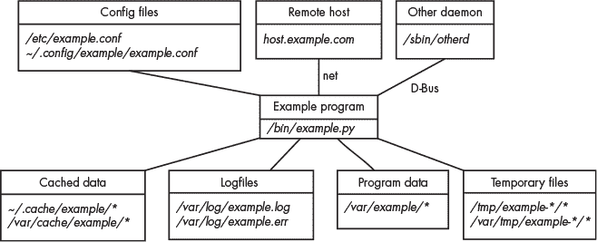

## **简介**


欢迎阅读《实用 Linux 取证：数字调查员指南》。本书涵盖了多种方法和技术，用于查找和分析现代 Linux 系统中的数字证据。在数字取证调查员中，*Linux 取证*可能有两种含义。其一，指使用 Linux 作为数字取证平台，执行对任何目标系统（可能是 Windows、Mac、Linux 或其他操作系统）的获取或分析。然而，在本书中，Linux 取证是指将 Linux 系统作为调查目标进行分析或检查（与使用的平台或工具无关）。

我将重点介绍在各种 Linux 发行版（distro）中发现的常见证据，并在法医调查的背景下分析它们。本书中描述的法医分析方法与使用的工具无关，适用于 FTK、X-Ways、EnCase 或任何其他法医分析工具套件的用户。我在示例和插图中使用的工具通常是基于 Linux 的，但这些概念完全与工具无关。

### **我为什么写这本书**

从某种程度上讲，这本书是我第一本书《实用法医成像》（No Starch Press，2016 年）的逻辑延续。在对系统进行法医获取并安全地保存驱动器镜像后，分析是典型数字取证调查中进行的下一步。此书深入探讨了分析 Linux 系统法医镜像的技术细节。

市面上有许多关于 Windows 甚至 Mac 取证分析的书籍，但很少有书籍专注于将 Linux 系统作为调查目标的分析。更少有书籍专门讨论现代 Linux 安装的事后（死盘）分析。我常常听到社区中的数字取证调查员越来越多地说：“我们开始在实验室接收到更多的 Linux 镜像，但我们不太清楚应该找什么。”这样的评论来自于私营部门（企业）和公共部门（执法机关）的法医实验室。本书旨在提供一个资源，解决这一日益增长的兴趣领域。它将帮助法医调查员查找和提取 Linux 系统中的数字证据，重建过去的活动，得出逻辑结论，并撰写全面的法医证据分析报告。

写这本书的另一个原因是出于个人兴趣和动机，更好地理解现代 Linux 系统的内部结构。在过去的十年里，Linux 发行版的重大进展改变了 Linux 取证分析的方式。我在瑞士伯尔尼应用科技大学教授数字取证和 Linux 课程，写这本书帮助我保持对这些话题的最新了解。

最后，我写这本书是因为做技术研究和写作对我来说既有趣又充满乐趣。写作对我作为作者来说是一个学习过程，我发现自己不断填补那些自己没有意识到的知识空白。

#### ***本书的独特性***

本书作为数字取证调查人员使用任何取证分析平台或工具的指南而编写。并不要求使用 Linux 作为平台或使用基于 Linux 的工具。即使是使用 Windows 或 Mac 上的商业数字取证分析工具的人，只要这些工具支持 Linux 工件的分析，本书也能作为有用的资源。

本书与 Linux 发行版无关。没有偏向任何特定的发行版，所有示例中使用了最流行的 Linux 发行版。本书中的研究、测试和示例主要基于四个 Linux 发行版家族及其衍生版本：Debian（包括 Ubuntu）、Fedora（包括 Red Hat）、SUSE 和 Arch Linux。这四个发行版是目前使用的绝大多数 Linux 系统的基础，也是本书的核心内容。只要可能，我会尽量描述与发行版无关且在大多数 Linux 发行版中一致的概念。然而，许多取证工件是特定于发行版的，仍然需要进行解释。这些内容也有涉及，但不会过于详细。

本书同样与架构无关。这里的概念适用于安装在任何 CPU 架构或硬件系统上的 Linux 系统。所提供的示例倾向于聚焦于 64 位 x86 PC（Intel 和 AMD）平台，并额外提到 ARM 架构的 Raspberry Pi 系统。如果某些硬件特性影响了数字取证过程，我可能会提到。

本书的另一个方面是讨论具有各种用途和目的的 Linux 系统。我涉及了对 Linux 服务器系统和 Linux 桌面系统的调查方法。假设了广泛的可扩展性，分析技术适用于从小型嵌入式 Linux 系统和 Raspberry Pi 到大型服务器集群和基于 Linux 的主机系统。

本书的假设是我们正在对磁盘镜像进行事后取证分析，也称为 *死盘* 取证。许多书籍讨论了使用命令对运行中的 Linux 系统进行事件响应和分析，而本书不涉及运行中的系统，假设已经以取证合规的方式获取了磁盘镜像，或者磁盘已安全地连接到带有取证写保护器的检查机上。尽管如此，本书中的所有内容在事件响应的活跃系统上下文中也同样适用。

本书避免深入探讨边缘或罕见的主题。在某些情况下，可能会提到一些冷门话题并提供参考，但重点仍然是覆盖最流行的 Linux 发行版、硬件架构和系统应用。

本书尽力保持技术上的非政治性和非宗教性。在社区中，常常会有关于哪种技术更好或更差，哪些许可证是好是坏，哪些科技公司是利他还是邪恶等强烈的观点。我特意避免称赞或批评任何特定的技术或公司，并且只在与数字取证相关时才提供个人意见。

这种多因素的结合使得本书在数字取证书籍市场中独具特色，尤其是在涉及取证分析 Linux 系统的主题中。

#### ***Linux 取证分析场景***

对目标系统进行取证分析的动机多种多样。我们可以将计算机系统的取证分析分为两大类：*受害者*和*犯罪者*。

在受害者的情况下，分析通常涉及网络攻击、入侵和在线社会工程事件。这些系统由受害者拥有，通常自愿提供给取证调查员。例如：

+   被技术性利用漏洞或配置错误侵入或攻击的服务器

+   使用被盗凭证未经授权访问服务器

+   被恶意软件攻击的客户桌面，通常是用户点击恶意链接或下载恶意可执行文件和脚本所导致的

+   受社会工程学欺骗，被迫执行本不该做的行为的受害者

+   被胁迫或勒索而执行本不该做的行为的用户

+   需要作为受害组织更大规模调查一部分进行分析的计算机系统

在所有这些场景中，可以找到数字痕迹，帮助重建过去的事件或提供不当行为的证据。

在犯罪者的情况下，分析通常涉及由执法机关或公司调查与事件响应团队扣押的计算机系统。这些系统可能是由涉嫌恶意或犯罪活动的犯罪者拥有、管理或操作的。一些例子包括：

+   用于托管钓鱼网站或分发恶意软件的服务器

+   用于管理僵尸网络的指挥与控制服务器

+   滥用其访问权限从事恶意活动或违反组织政策的用户

+   用于进行非法活动的桌面系统，如持有或分发非法物品、犯罪黑客行为，或运营非法地下论坛（卡片盗用、儿童剥削等）

+   需要作为更大范围刑事调查一部分进行分析的计算机系统（有组织犯罪、毒品、恐怖主义等）

+   需要作为更大规模民事调查一部分进行分析的计算机系统（例如诉讼或电子发现）

在所有这些场景中，都可以找到数字痕迹，这些痕迹有助于重建过去的事件或提供不当行为的证据。

当 Linux 系统被执法机关合法扣押、被拥有系统的组织扣押，或由受害者自愿提供时，系统可以进行法医成像，然后由数字取证调查员进行分析。Linux 已经成为服务器系统、物联网（IoT）以及其他嵌入式设备的常见平台，且 Linux 在桌面上的使用也在增长。随着 Linux 使用量的增加，受害者和施害者的系统数量也将增加，这些系统需要进行法医分析。

在某些情况下，尤其是当人们被错误指控或是无辜的、受到怀疑时，法医分析活动也可能提供无罪的证据。

### **目标读者及先决条件**

我写这本书时有一个特定的受众群体。它主要面向那些擅长执行 Windows、Mac 和移动取证的数字取证从业人员，并希望在 Linux 领域获得更多知识的读者。取证检查员需要了解基本的 Linux 概念，知道在哪里找到法医证据，并了解如何解读收集到的证据。这并不意味着检查员必须掌握 Linux 的使用（尽管掌握它有帮助）；他们只需要知道要寻找什么以及如何从找到的证据中得出结论。

#### ***谁应该阅读本书？***

本书将直接惠及在私人和公共部门数字取证实验室工作的人员，他们负责对计算机系统（包括 Linux）进行法医检查。此书特别面向日益增长的取证从业者群体，包括事件响应团队成员、大型组织中的计算机取证调查员、来自法律、审计和咨询公司的取证及电子发现技术人员，以及来自执法机构的传统取证从业人员。虽然本书主要面向那些希望提升 Linux 知识的经验丰富的数字取证调查员，但其他群体也将受益。

想要学习数字取证分析和调查技术的经验丰富的 Unix 和 Linux 管理员也会从本书中受益。这些人可能是希望转行进入数字取证领域的系统管理员，或者是希望利用数字取证方法提升故障排除技能的管理员。

安全专业人员也会发现本书有用。与默认 Linux 安装相关的信息安全风险可能需要进行评估，从而导致基于安全的更改。这可能包括减少系统上存储的信息量，以保护机密性。相反，法医准备要求可能会导致增加系统上记录或保存的信息量。

隐私倡导者可能会发现本书有帮助，因为它突出了在默认 Linux 系统上存储的个人和私密信息的数量和位置。人们可以利用本书来减少个人信息的暴露，并提高系统的隐私性（这可能会导致功能或便利性的丧失）。

Linux 应用和发行版开发者也可能会发现本书有用。书中展示了默认配置中的潜在隐私和安全问题，这有助于开发者创建更安全的默认设置，保护用户。

每本数字取证书籍的一个不幸副作用是，罪犯也对取证界的工作感兴趣。恶意行为者寻找新的方法来利用系统并破坏安全，包括取证分析技术。在本书中，我会在相关内容中提到反取证的话题。取证检查员应当意识到可能被用来操控或销毁证据的反取证技术。

#### ***前提知识***

获取本书最大收益所需的前提知识可以用两种方式描述：

+   具有数字取证知识但对 Linux 了解有限的人

+   具有 Linux 知识但对数字取证了解有限的人

具有 Windows 或 Mac 系统数字取证分析经验的人将学会如何将这些技能转移到 Linux 系统上。熟悉数字取证分析将使学习 Linux 的新领域变得更容易。

具有 Linux 系统经验的人，特别是在故障排除和调试方面的经验，将学会如何将这些技能应用于数字取证分析。熟悉 Linux 将使学习新的数字取证概念变得更容易。

无论您的背景是取证还是 Linux，都期望您理解基本的操作系统概念。这包括对启动、系统初始化、日志记录、进程、存储、软件安装等的基本理解。对任何操作系统的某些专业知识应足以理解适用于所有操作系统（包括 Linux）的通用原理。

#### ***所需的取证工具和平台***

执行这里描述的分析技术时，可以使用任何功能齐全的数字取证工具包。行业中常见的商业工具包括 EnCase、FTK、X-Ways 等。这些工具都可以用于执行 Linux 分析工作。

拥有一个基于 Linux 的分析系统并非必需，但在某些情况下可能更方便。书中展示的大多数例子都使用 Linux 系统上的 Linux 工具进行演示。

本书不涉及如何查找、下载、编译或安装各种工具或 Linux 发行版。如果你有一台相对较新的机器（在本书出版日期前一年）并且安装了最近的 Linux 发行版，示例应该能够毫无问题地运行。所使用的某些工具不是标准（默认）Linux 发行版的一部分，但可以通过互联网搜索引擎或在 GitHub、GitLab 等在线平台上轻松找到。在大多数情况下，我会提供在线资源的参考链接。

### **范围与组织**

本节描述了本书的范围、如何组织本书以及各个部分的结构。

#### ***内容范围***

这是一本关于死后数字取证分析的书，意味着包含数字证据的驱动器镜像已经以取证上可靠的方式（例如通过使用写保护器）被安全保存，并且准备好进行检查。检查过程包括识别驱动器内容的各个方面、搜索特定内容、提取证据痕迹、解读信息、重建过去的事件，并全面理解驱动器的内容。这项分析活动将帮助调查人员得出结论并撰写关于特定案件或事件的取证报告。

这本书的广泛范围是 Linux 的“现代”方面。在我的*现代 Linux*课程中，学生们经常问“现代”在这个语境中是什么意思。我不希望我的课程基于转换过来的 Unix 材料，而是想专注于 Linux 独有的方面。Linux 有 Unix 的基础，但在许多方面也与 Unix 有了显著的区别。最根本的（也是最具争议的）例子就是 systemd，它在今天大多数 Linux 发行版中都有使用，并且在本书中有详细介绍。根据我对现代 Linux 的定义，其他涵盖的主题包括：UEFI 启动、像 cgroups 和 namespaces 这样的新内核特性、D-Bus 通信、Wayland 以及*([freedesktop.org](http://freedesktop.org))*的标准、像 btrfs 这样的新文件系统、像 WireGuard 这样的新加密协议、滚动发布模型、通用软件打包，以及与最新 Linux 发行版相关的其他新话题。

有些话题过于庞大、过于多样或过于冷门，无法纳入本书。在这种情况下，我会简要描述该话题，并提供一些进一步获取信息的指引。例如，Linux 备份分析。备份解决方案种类繁多，写关于所有备份的内容可能会占据本书相当大一部分。另一个例子是 Android 取证。尽管 Android 基于 Linux，但它是一个庞大的话题，完全可以单独成书（事实上，现在市面上有许多 Android 取证的书籍）。还有很多专为嵌入式系统和特定硬件（机器人、汽车、医疗等）设计的高度定制化 Linux 发行版。这些定制和专业系统可能会在本书中提到，但详细的覆盖内容不在本书的范围内。

编写一本关于自由和开源软件（FOSS）的书籍具有挑战性，因为一切都在迅速变化。当本书上市时，很可能会有一些新主题没有被包括在内，或者我所写的某些主题已经不再相关。最大的变化往往与 Linux 发行版相关，因此我尽可能集中讲解与发行版无关的主题。总体来说，我涵盖了那些预计在未来几年内不会发生重大变化的稳定话题。

本书的内容并不详尽，肯定缺少一些数字取证的资料。自由和开源软件（FOSS）社区强调选择，而选择意味着有太多不同的可能性无法在一本书中囊括。出于实际需要，本书重点介绍了最受欢迎的技术和 Linux 发行版。较少流行、不常见或边缘的技术则未包含在范围之内。不过，本书展示的数字取证分析原理通常可以应用于那些未被涵盖的技术。

本书的目标不是教人们如何使用 Linux，而是教人们在数字取证中应寻找哪些信息。你不需要成为 Linux 专家，本书依然对你有用。

#### ***书籍组织和结构***

我花了很多时间思考如何组织本书。它需要对不熟悉该话题的人既全面又易于理解。从目录中也需要很明显地看出，这本书是一本取证书，而非一本 Linux 书。因此，结构不应像一本普通的 Linux 书。

组织本书的最明显方式是按 Linux 技术（启动过程、存储、网络等）将章节和部分分组。每个部分深入探讨不同的 Linux 子系统，最终形成的结构类似于大多数 Linux 技术书籍。这种结构对那些已经掌握一些 Linux 知识，并且确切知道自己在数字取证中要寻找哪些信息的人非常有用。

另一个组织本书的方法是按典型取证检查的时间顺序进行组织。这里详细介绍了典型取证分析的每个步骤，但重点是 Linux。这种结构与大多数计算机取证书籍的结构相似，这些书籍通常集中在 Microsoft Windows 的分析上（可能是当今计算机取证工作的主要方向）。这是我部分想要的内容，但它仍然非常集中于用户桌面。我希望本书能对分析各种 Linux 发行版、桌面系统、服务器系统和嵌入式 Linux 系统有所帮助。

组织本书的最全面和系统的方法是侧重于文件系统的布局，并描述文件系统树的每个目录及其相关的取证文物。这种自下而上的方法将详尽地覆盖操作系统存储的每个部分，非常适合一本用于事后分析的书籍。然而，这种结构更像是一本词典，而不是一本旨在教授和解释概念的书籍。

我选择了三种方法的结合。章节和部分按 Linux 技术组织，按高层次进行分组。子部分则按数字取证分析任务和目标组织。我尽量涵盖 Linux 文件系统在取证子部分中的所有相关领域。附录还列出了书中涵盖的文件，并简要评论了它们的取证相关性。

这本书分为若干章节，涵盖了 Linux 系统的广泛主题。这些章节又细分为若干部分，每部分讨论每个主题领域的主要组成部分。各部分进一步细分为子部分，详细介绍了具体的取证分析技术。大多数子部分遵循一种常见的格式，以一系列段落呈现。第一段提供对正在研究的技术主题的介绍或概述，有时会提供历史背景。第二段解释可以提取哪些信息，以及这些信息在取证调查中的作用和重要性。后续的段落展示了示例，并解释如何分析这些信息并将其提取为数字证据。最后一段可能会提到与证据完整性和可靠性相关的任何警告、陷阱、附加提示和注意事项。

本书从数字取证的一般概述开始，我介绍了这一主题的历史和演变，并提到了塑造该领域的重要事件。我特别强调了为了能够在法庭上使用的数字证据所需要遵循的标准。本书力求做到国际化，并独立于地区管辖区，因为越来越多的刑事调查跨越国界，涉及多个司法管辖区。本书还介绍了现代 Linux 系统，包括其历史、文化以及构成“现代”Linux 系统的所有组件。在提供了这一双重基础后，本书的其余部分专注于 Linux 系统的取证分析。

在全书中，我尝试展示如何将洛卡尔交换原理应用于 Linux 系统分析。埃德蒙·洛卡尔是一位法国刑事调查员，他提出在犯罪发生时，犯罪分子和犯罪现场都会交换证据。这个原理同样适用于数字犯罪现场、电子设备和在线连接。

数字取证书籍通常会有一个单独的章节专门讨论加密话题。然而，今天的加密技术已经无处不在，成为每个计算子系统的一部分。本书将加密话题融入到每个相关章节，而不是单独作为一个章节进行讨论。不过，文件系统章节确实有一个专门的部分讨论存储加密。

本书并非按时间顺序列出步骤，而是更像是一本按照技术领域分组的任务指南。本书也被设计为一本参考书，因此你不需要从头到尾阅读（除了前两章概览部分）。某些章节假设读者已经具备前面章节的一些知识和理解，但会标注有帮助的适当参考。

我在每一章的各个部分开始时，都会简要介绍该主题背后的技术，接着从数字取证的角度提出问题和评论。我描述调查员可能会发现的潜在证据，并提供该证据的位置指引。我展示了如何提取和分析证据，并提供了解释这些证据的技巧。我还会评论挑战、风险、注意事项及其他潜在的陷阱，并根据我作为取证调查员的经验提供警示和建议。

#### ***章节概览***

本节简要总结了本书的每一章内容。

**第一章：数字取证概述** 本章向读者介绍数字取证。描述了数字取证的历史，并展望了未来几十年的发展。讨论了当前的趋势和挑战，重点是数字取证分析。涵盖了计算机取证分析的基本原则和行业最佳实践。

**第二章：Linux 概述** 本章提供了现代 Linux 系统的技术概述，描述了 Unix 的历史及其影响，Linux 发行版的发展，以及 Linux 桌面的演变。还介绍了主要的 Linux 发行版家族以及构成现代 Linux 系统的组件。本章最后讲解了取证分析部分，与第一章结合，构成了本书的基础。

**第三章：来自存储设备和文件系统的证据** 本章介绍了驱动器的初步分析，从分区表、卷管理到 RAID 系统。讨论了三种最常见的 Linux 文件系统（ext4、xfs 和 btrfs）的取证信息，并从取证角度描述了 Linux 交换系统，包括休眠分区的分析。还涵盖了各种文件系统加密形式。

**第四章：Linux 文件的目录布局和取证分析** 本章描述了典型 Linux 系统中已安装文件和目录的层次结构。还讨论了使用取证哈希集来过滤或识别文件。解释了在 Linux 下发现的不同文件类型的分析，包括 POSIX 文件类型、应用程序文件类型和 Linux 可执行文件。还涉及了文件元数据和内容的分析。本章最后讨论了崩溃数据和内存核心转储的内容。

**第五章：调查来自 Linux 日志的证据** 本章专门讲解了如何理解日志文件以及寻找日志证据的地方。还讨论了 Linux 系统上不同的日志记录系统，包括传统的 syslog、systemd 日志以及由守护进程或应用程序生成的日志。还解释了内核环形缓冲区和 Linux 审计系统。

**第六章：重构系统引导和初始化过程** 一个典型系统的生命周期从启动到正常运行再到关机。这里我们分析引导加载程序，然后是内核初始化和关联的初始 RAM 磁盘。详细描述了 systemd（init）启动过程及系统的其他操作方面。同时，还解释了 systemd 和 D-Bus 按需服务激活的分析。本章最后涉及物理环境和电源话题，包括睡眠、休眠和关机，以及寻找人类物理接近系统的证据。

**第七章：已安装软件包的检查** 本章是唯一一个针对不同 Linux 发行版有单独章节的章节。它描述了安装过程、已安装软件包的分析、软件包格式以及软件包捆绑。还涉及了 Linux 发行版、版本、发布和补丁级别的识别。

**第八章：识别网络配置遗留信息** Linux 的网络子系统包括接口硬件、DNS 解析和网络管理器。关于无线网络的部分涵盖了可能包含历史信息的 Wi-Fi、WWAN 和蓝牙遗留信息。本章还涵盖了网络安全，包括日益流行的 WireGuard VPN 系统、新的 nftables 防火墙（它正在取代 iptables）以及识别代理设置。

**第九章：时间与位置的法医分析** 本章描述了 Linux 系统在国际和区域方面的分析。内容包括 Linux 时间格式、时区以及进行法医时间线重建所需的其他时间戳信息。还解释了语言和键盘布局分析。还描述了 Linux 地理位置服务，用于重建系统的物理位置——特别是像笔记本电脑这样的移动系统。

**第十章：重建用户桌面和登录活动** 本章的重点是用户登录、Shell 和 Linux 桌面。它解释了 Linux 窗口系统，如 X11 和 Wayland，以及桌面环境如 GNOME、KDE 等。它还涵盖了人类用户活动和常见的桌面遗留信息（这些在检查 Windows 或 Mac 系统时是众所周知的）。例如缩略图、回收站、书签、最近文档、密码钱包和桌面搜索等遗留信息都有解释。本章最后讨论了用户网络活动，如远程登录、远程桌面、网络共享驱动器和云账户。

**第十一章：附加外设设备的法医痕迹** 本章涵盖了 USB、Thunderbolt 和 PCI 附加外设设备的痕迹。它解释了如何解读日志中发现的证据，以确定何时以及什么设备被连接。详细描述了 Linux 打印系统和 SANE 扫描的法医分析，重点是恢复历史遗留信息。本章还描述了视频会议系统所需的 Video4Linux 系统。最后，本章对附加存储设备进行了检查。

**后记** 在这里，我为 Linux 数字取证调查员提供一些最终的思考。我根据我作为数字取证调查员的个人经验，给大家留下了一些提示、建议和鼓励。

**附录：数字取证调查人员的文件/目录列表** 该资源提供了本书涵盖的文件和目录的表格。旨在作为一个参考，允许调查人员快速查找特定的文件或目录，并找到与数字取证相关性的简短描述。这是一个活动的附录，我的网站上提供了更新版本：*[`digitalforensics.ch/linux/`](https://digitalforensics.ch/linux/)*。非常感谢 No Starch Press 允许我维护这个附录的独立版本。

### **约定与格式**

互联网提供大量的资源，如博客、视频和网站。这些资源的质量、准确性和完整性可能很好，但也可能很差，甚至完全错误。在可能的情况下，我将引导读者查阅本书以外的权威信息源。进行数字取证调查时，准确的信息至关重要。权威来源通常包括软件的原始开发者（文档、源代码、支持论坛）、标准机构（如 RFC 和*freedesktop.org*）、同行评审的科学研究（如*DFRWS*和《数字调查》期刊）、以及专业技术书籍（如 No Starch Press 的许多书籍）。

我经常会引用标准的 Linux 文档，或者称为手册页的文档，这些文档随大多数 Linux 软件包提供。这些也被称为*man 页*，并与节号一起显示，如：systemd(1)。查看带有节号的 man 页的 Linux shell 命令如下：`man 1 systemd`。

本书遵循特定的风格和约定。每章都涵盖 Linux 取证分析的不同方面。每个章节内的各个部分通常提供一组命令行任务及其相应的输出和解释。子节可能提供任务的不同变体或特定工具的进一步特性。然而，这些仅为举例说明。重点不在于如何使用 Linux 工具，任何取证分析工具都应能复制这些结果。

代码示例、命令和命令输出显示在等宽字体中，类似于计算机终端屏幕上看到的内容。省略号符号（`...`）用于剪切命令输出中与示例传达的消息无关的部分，有助于简化示例并提高清晰度。文件和目录名称显示为*斜体字体*。

在书中，文件内容、代码和命令输出示例中，我会使用*pc1*来指代正在分析的系统的主机名。如果显示了 Linux 用户名，我称其为*sam*（代表 Samantha 或 Samuel）。这些名字没有特别的含义，除了它们都很简短且不容易与其他示例输出混淆（没有重复的词）。

在计算机书籍行业中，通常会将代码块和命令输出中的时间戳更改为书籍发布后未来的某个时间点，从而使内容看起来更新。与我的前一本书一样，我认为讨论法医证据完整性时，操作书中提供的证据（通过将时间戳提前）是不合适的。此外，改变示例中的可见日期可能会导致编码数据中的日期不一致，或导致法医时间线出现错误。某个工具的输出在稍后的时间执行时可能也会有所不同。我希望避免这些不一致的风险。你在本书中看到的所有命令输出都反映了实际的测试和研究输出，包括原始日期和时间戳。除了用`...`剪辑掉不太相关的部分，并将主机和用户名更名为*pc1*或*sam*，命令输出没有任何改变。

我将调查员或检查员的工作站称为*分析主机*或*检查主机*。我将正在分析的磁盘或镜像称为*目标驱动器*、*嫌疑驱动器*或*证据驱动器*。这些术语可以互换使用。

书中还使用了一些其他术语，可以互换使用。*磁盘*、*驱动器*、*镜像*、*介质*和*存储*在泛指时常常可以互换使用。*法医调查员*、*检查员*和*分析员*在书中使用，指的是使用检查主机进行各种法医任务的人（即你）。*成像*和*获取*是可以互换使用的，但故意排除了*复制*一词，以避免与常规的文件复制（这不是法医过程的一部分）混淆。

本书的末尾或章节末尾没有提供参考书目。所有引用都作为脚注包含在引用它们的页面底部，或直接在文本中提及。

#### ***格式化与展示***

文件内容、代码、命令和命令输出以等宽字体显示，与书本其余文本区分开来。如果显示了一个 shell 命令示例，它会以粗体显示。在某些情况下，这可能是你可以在自己的分析机器上输入的命令；在其他情况下，这只是为演示目的而使用我的测试系统（并不打算让你输入）。以下是输入命令的一些示例：

```
$ tool.sh > ~/file.txt
$ tool.sh < ~/file.txt
$ tool.sh | othertool.sh
```

下面是文件内容的示例：

```
system_cache_dir=/var/cache/example/
user_cache_dir=~/.cache/example/
...
activity_log=/var/log/example.log
error_log=/var/log/example.err
...
system_config=/etc/example.conf
user_config=~/.config/example/example.conf
...
```

对于不太熟悉 Linux 的读者来说，在目录路径名中显示的波浪号（~/）始终表示用户的主目录。因此，*~/file.txt* 等同于 */home/sam/file.txt*（其中 *sam* 是系统上的普通用户帐户）。显示目录名时，末尾会有一个斜杠（/）。

#### ***数据流图***

法证分析涉及定位证据的痕迹并重建过去的活动。为了实现这一目标，我们必须了解有趣数据（潜在证据）流动和存储的位置。本书中使用的图表展示了程序、守护进程、主机或其他数据处理系统（通过网络）之间的数据流动。从法证证据角度看，有趣的文件和目录也显示在图表中。

图 1 展示了一个虚构的系统，用来解释本书中使用的图表。方框表示有趣数据（文件、程序和其他机器）的源头或目的地。线条表示相关数据流动（读取/接收或写入/发送）。



*图 1：示例数据流图*

在本示例系统中，程序（*example.py*）位于图表的核心位置。一个远程主机和一个守护进程在交换数据（守护进程是在后台运行的程序）。还有配置文件、日志文件、临时文件和缓存数据。

在某些图表中，我可能会包含箭头来指示流动的方向，而不仅仅是关联。在某些图表中，我可能会有一个框表示简化视图，由多个程序组成（当其他细节不重要时，进行抽象化处理）。

本书中的图表并不打算是完整的。它们仅展示了在特定章节背景下从数字取证角度有趣的组件。使用这样的图表有助于可视化 Linux 系统上潜在法证证据的位置。

编写本书非常有趣，希望你阅读时也能感受到。对于法证调查人员和安全事件响应人员，希望你们能学到如何分析 Linux 系统的知识。对于 Linux 工程师和爱好者，希望这本书能帮助你们利用数字取证调查来进行故障排除和调试。
