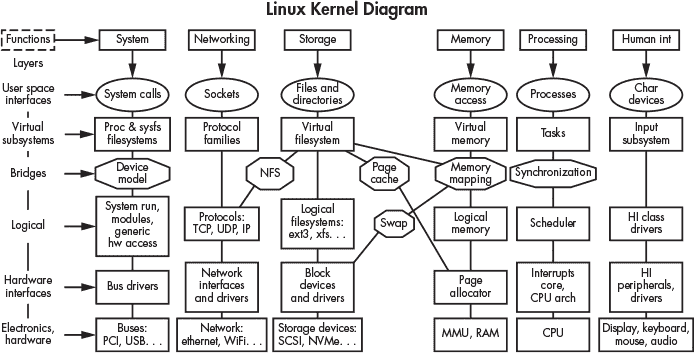

## **2

LINUX 概述


本章为数字取证调查员提供 Linux 的概述。它描述了 Linux 的历史，包括 Unix 的重要性和影响，并确立了本书中使用的“现代 Linux”定义。我将解释 Linux 内核、设备、systemd 和命令行 shell 的作用。还将提供 shell 和命令行基础的示例，并对各种桌面环境进行简要介绍，回顾流行 Linux 发行版的诞生与演变。本章最后重点讨论应用于 Linux 系统的数字取证，特别是与其他操作系统（如 Windows 或 macOS）的取证分析的比较。

### Linux 的历史

理解操作系统的历史根源有助于解释导致现代 Linux 系统的设计决策和原理。软件开发，包括操作系统软件，基本上是一个渐进的过程。自从 Linus Torvalds 首次宣布 Linux 以来，Linux 一直在不断发展，但 Linux 背后的核心思想和哲学早在几十年前就已经开始。

#### *Unix 根源*

Linux 的创建与发展以及相关的 GNU 工具深受 Unix 的影响，许多 Linux 的概念和哲学直接来源于 Unix。为了理解 Unix 的根源及其与 Linux 的相似性，了解 Unix 历史非常有帮助。

Unix 的早期构思源于美国麻省理工学院（MIT）、通用电气公司（General Electric）和贝尔电话实验室（Bell Telephone Labs）之间的联合研究项目。该小组原本正在开发 Multics（多路复用信息和计算服务）时分操作系统，但在 1969 年春季，贝尔电话实验室撤回了参与，导致其研究人员开始寻找其他项目。那时正好有一台数字设备公司（DEC）生产的 PDP-7 小型计算机可用，Ken Thompson 在 1969 年夏天开发了包括文件系统、内核、shell、编辑器和汇编器在内的基本系统组件。这个初步实现（还未命名）是用汇编语言编写的，旨在比 Multics 更简单。Dennis Ritchie 和其他几位开发者加入了早期的开发工作，创建了一个可运行的系统。1970 年，“Unix”这个名字被创造出来，戏谑地指代一个“阉割版的 Multics”。Unix 系统在贝尔实验室内的兴趣逐渐增长，1970 年夏季提出的创建文本处理系统的提案为购买一台 PDP-11 计算机提供了理由。

最早的 Unix 版本是用汇编语言编写的，这种语言难以理解，且仅能在特定硬件上运行。Dennis Ritchie 创造了 C 编程语言，这是一种更易于编程的高级语言，可以被编译成适用于任何硬件架构的机器代码。内核和工具被重写为 C 语言，这使得 Unix 变得“可移植”，意味着它可以被编译并运行在任何具有 C 编译器的机器上。1974 年，Ken Thompson 和 Dennis Ritchie 向计算机协会（ACM）提交了一篇描述 Unix 系统的论文^(1)。这篇论文只有 11 页，描述了 Unix 的基本设计原则和操作方式。文件系统是 Unix 的核心组件，所有东西，包括硬件设备，都可以作为一个文件在层级树中访问。论文描述了 shell、文件重定向、管道概念、以及二进制文件和 shell 脚本的执行。

发布 Unix 论文引起了学术界的关注，并且包括源代码在内的 Unix 免费副本被提供给大学用于研究目的（只需支付运费和分发介质费用——类似于后来的 Linux 发行版）。学术研究人员进一步的研究与开发推动了 Unix 的发展，伯克利加利福尼亚大学的 Bill Joy 发布了一个版本的 Unix，称为伯克利软件发行版（Berkeley Software Distribution，简称 BSD）。随着时间的推移，BSD 增加了广泛的网络硬件支持和 ARPANET（后来成为我们今天所知的互联网）的 TCP/IP 协议。网络连接和 BSD 对 TCP/IP 的免费实现引起了大学的兴趣，尤其是那些希望连接到早期互联网的学校。BSD 开始成为一个由全球学术界和世界各地的研究人员与学生共同驱动的操作系统。原始的 BSD 开发者之一，Kirk McKusick，曾发表过一个名为《BSD 的叙事历史》（多个版本可在 YouTube 上观看）的演讲。

在 Unix 之前，销售计算机产品需要开发硬件并编写操作系统（两者都是专有的）。随着 Unix 的普及，构建专有计算机的公司开始使用 Unix 作为操作系统。

一大波 Unix 系统涌入市场，包括 Silicon Graphics 的 Irix、DEC 的 Ultrix、Sun Microsystems 的 SunOS 和 Solaris、IBM 的 AIX、HP 的 UX 等等。针对普通 PC 的 Unix 软件版本也已推出，包括微软的 Xenix、Santa Cruz Operation（SCO）Unix、Univel Unixware 等等。这种商业化导致了 Unix 许可问题，并引发了数十年的法律纷争，首先是 BSD 与 AT&T 之间的纠纷，后来是 SCO、Novell 和 IBM 之间的纠纷。

商业化的普及导致了许多不同的 Unix“版本”，因为每个公司都推出了专有的修改以获得竞争优势。Unix 开始变得碎片化和不兼容，促使了 POSIX、The Open Group 的单一 Unix 规范、通用桌面环境（CDE）等标准的诞生。

今天，Unix 仍然出现在企业计算环境中。史蒂夫·乔布斯决定在 NeXT 计算机上使用 Unix，并且这一决策被作为 Apple OS X Macintosh 操作系统的基础，后来也被用于 Apple 的 iOS 移动设备。

商业 Unix 的高昂成本促使了为爱好者、学生、研究人员等创造免费的替代方案。两个流行的免费 Unix 类系统替代品是 386BSD 和 Minix。一系列文章在*《Dr. Dobb’s Journal》*中描述了基于 BSD Unix 最后一次免费发布版本的 386BSD 系统。两个用户社区为 386BSD 编写补丁，并最终形成了 FreeBSD 和 NetBSD，这两个系统至今仍在积极开发中。

Minix 是由安德鲁·塔南鲍姆开发的 Unix 克隆系统，用于大学的教学和研究。最初它旨在取代 AT&T Unix，塔南鲍姆曾用它来教授操作系统课程。Minix 至今仍在积极开发中，并且在 Linux 的创建过程中发挥了重要作用。

1983 年，理查德·斯托曼创建了 GNU 项目，并使用递归缩写“GNU’s Not Unix！”命名该项目。GNU 的目标是创建一个完整的类 Unix 自由操作系统，包括内核和用户空间。到了 1990 年代初，用户空间工具基本完成，唯一缺失的就是内核。这个缺失的部分即将由芬兰的一名年轻学生完成。

不同的 Unix 系统、Unix 克隆和其他类 Unix 系统都共享相同的*Unix 哲学*。从本质上讲，这种哲学鼓励程序员创建能够做一件事且做得很好的小程序，并且这些程序能够相互作用。自由和开源软件往往遵循这一哲学，而这一哲学同样可以（或应该）应用于编写数字取证软件。例如，The Sleuth Kit（TSK）是一个由许多小工具组成的取证工具包，每个工具执行一个特定任务，一个工具的输出可以作为另一个工具的输入。商业软件往往是相反的，通常意味着庞大的单体工具，这些工具试图做所有事情，并出于竞争原因避免互操作性（尽管 API 正在变得越来越普遍）。

#### *早期的 Linux 系统*

Linus Torvalds 在赫尔辛基大学学习时创建了 Linux。他希望有一个与 Minix 不同许可的替代品，并且他更倾向于单体内核设计（与偏好微内核的 Tanenbaum 相对）。他于 1991 年开始编写自己的内核，使用 Minix 作为开发平台。几个月后，他在 Minix 新闻组中提到这一项目并请求反馈。几周后，他发布了一份公告，提供了一个包含代码的 FTP 网站，并呼吁大家参与贡献：^(2)

```
From: (Linus Benedict Torvalds)
Newsgroups: comp.os.minix
Subject: Free minix-like kernel sources for 386-AT
Date: 5 Oct 91 05:41:06 GMT
Organization: University of Helsinki

Do you pine for the nice days of minix-1.1, when men were men and
wrote their own device drivers? Are you without a nice project and
just dying to cut your teeth on a OS you can try to modify for your
needs? Are you finding it frustrating when everything works on minix?
No more allnighters to get a nifty program working? Then this post
might be just for you :-)
...
I can (well, almost) hear you asking yourselves "why?". Hurd will be
out in a year (or two, or next month, who knows), and I've already got
minix. This is a program for hackers by a hacker. I've enjouyed doing
it, and somebody might enjoy looking at it and even modifying it for
their own needs. It is still small enough to understand, use and
modify, and I'm looking forward to any comments you might have. I'm
also interested in hearing from anybody who has written any of the
utilities/library functions for minix. If your efforts are freely
distributable (under copyright or even public domain), I'd like to
hear from you, so I can add them to the system.
...
Drop me a line if you are willing to let me use your code.
Linus
```

Linus Torvalds 创建了 Linux 内核，该内核采纳了 Unix 的概念和哲学。构建 Linux 需要 GNU 工具，如 C 编译器。其他 GNU 工具，如 shell，则是实际使用操作系统所必需的。围绕这一项目，形成了一个充满好奇和兴奋的开发者社区，他们为项目贡献补丁并在不同硬件上测试代码。到 1994 年，第一个被认为足够成熟的内核版本 1.0 发布。Linux 内核的开发不断演变，支持多处理器并移植到其他 CPU 架构。开发者们在为各种硬件设备提供支持（专有且未记录的硬件仍然是一个挑战）方面不断努力。这个充满热情的社区在 Linus Torvalds 的指导下，持续开发并改进我们今天使用的 Linux 内核。

#### *早期桌面环境*

在 Unix 的早期，图形终端（如 Tektronix 4010 系列）是由计算机辅助设计（CAD）等图形程序使用的独立设备。图形终端不像今天的图形用户界面（GUI）那样是用户界面的一部分。到了 1980 年代中期，许多实验性和专有的窗口系统和桌面系统已可使用，但 X 窗口系统的引入改变了用户与计算机交互的方式。

1984 年，麻省理工学院（MIT）推出了开放标准 X，经过几年快速发展（发布了 11 个版本），X11 于 1987 年发布。它为图形程序（X11 客户端）提供了一个标准协议，使其能够在屏幕上显示（X11 服务器）。X11 协议可以集成到应用程序中，并能够在任何 X11 服务器上显示窗口，甚至通过网络进行显示。X11 在生产图形工作站的商业 Unix 供应商中得到了广泛采用。由于工作站的构建涉及到图形硬件的开发，X11 服务器通常是操作系统的专有组件。

自由的类 Unix 操作系统需要一个免费的 X11 服务器来支持普通的 PC 图形卡。在 1992 年，XFree86 项目应运而生，填补了这一空白，使得在运行 BSD 和 Linux 的 PC 上开发自由的 X11 桌面成为可能。2004 年，[X.Org](http://X.Org) 基金会（* [`x.org/`](https://x.org/)*）成立，并从 XFree86 中分叉出了一个 X11 的参考实现。XFree86 开发者之间的许可更改和分歧导致 [X.Org](http://X.Org) 成为事实上的 Linux X11 实现标准。^(3)

X11 仅仅是一个协议标准，它并不提供窗口管理或桌面环境。为了管理 X11 窗口，需要一个单独的窗口管理器。*窗口管理器*（只是另一个 X11 客户端应用程序）使用 X11 协议，并负责基本的窗口功能，如调整大小、移动和最小化。窗口管理器还提供窗口装饰、标题栏、按钮和其他图形界面功能。多个窗口管理器的出现为 Linux 发行版提供了选择。在最早的 Linux 发行版中，常用的窗口管理器是 TWM 和 FVWM。如需了解经典窗口管理器的更多信息，请参阅 *[`www.xwinman.org/`](http://www.xwinman.org/)*。

X11 应用程序使用图形 *小部件* 构建菜单、按钮、滚动条、工具栏等。这些小部件赋予应用程序独特的外观和感觉。开发者可以自由创建自己的小部件，但大多数开发者使用系统自带的库。早期的小部件工具包包括 Athena、OPEN LOOK 和 Motif。X11 桌面应用程序可以使用任何图形小部件的风格；没有强制的系统级标准，这可能导致每个应用程序使用不同工具包时，桌面外观不一致。如今，Linux 上最常用的两个工具包是 GTK（用于 GNOME）和 Qt（用于 KDE）。

然而，单单拥有窗口管理器和小部件工具包还不足以提供用户所期待的完整桌面体验。还需要为应用启动器、回收站、壁纸、主题、面板以及其他现代计算机桌面中常见的元素提供功能。Unix 社区创建了 CDE，提供一个标准的、功能齐全的桌面环境，且不依赖于厂商。这最初并不是开放的，因此自由和开源社区开发了自己的桌面标准（XDG 和 *[freedesktop.org](http://freedesktop.org)*）。

### 现代 Linux 系统

Linux 内核和 Linux 发行版已经不再仅仅是基础的 Unix 克隆。许多新技术已独立于 Unix 为 Linux 开发。许多传统的技术也在较新的 Linux 版本中被替代。这些技术进步帮助区分了传统 Linux 和现代 Linux。

本书不涉及传统 Unix 和早期 Linux 系统的取证分析话题，而是集中在现代 Linux 系统组件的取证分析。接下来的部分为那些不太熟悉现代 Linux 系统的人提供这些新或不同组件的概述。

#### *硬件*

在取证环境下分析 Linux 系统时，你需要尽可能准确地确定自系统安装以来，系统中物理安装或连接了哪些硬件。内核管理硬件设备，并在日志中留下已添加或移除硬件的痕迹。

内部设备可能集成在主板上（板载），插入 PCI Express 插槽（包括 M.2 插槽），插入 SATA 接口，或连接到主板上的其他针脚块。需要识别的内部硬件组件示例可能包括：

+   主板（描述主板本身）

+   板载设备（集成到主板）

+   PCI Express 设备（显卡和其他 PCIe 卡）

+   内部驱动器（SATA 或 NVMe）

+   网络设备（无线或有线）

Linux 在主板更换（升级）为另一块主板时不需要重新安装，因此可能会识别到不止一块主板。主板的物理检查还可能包括读取 NVRAM 来分析 UEFI 变量和其他 BIOS 信息。

另一个内部接口是高级配置和电源接口（ACPI），该接口的开发目的是使操作系统能够控制系统和组件的各种电源管理方面。Linux 支持 ACPI 接口，并通常通过 systemd 或 acpid 守护进程管理事件。

外部硬件组件通常通过 USB、Thunderbolt、DisplayPort、HDMI 或其他外部连接器连接。需要识别的外部硬件组件或外设示例可能包括：

+   外部存储介质

+   鼠标和键盘

+   显示器

+   打印机和扫描仪

+   网络摄像头、相机和视频设备

+   音频设备

+   移动设备

+   任何其他外部外设

从取证获取的磁盘镜像中识别硬件将依赖于日志、配置文件和其他持久数据中的痕迹。对扣押硬件的物理检查应与取证镜像中发现的痕迹相符。

#### *内核*

内核是 Linux 系统的核心。它提供用户程序（称为 *用户空间* 或 *用户域*）与硬件之间的接口。内核能够检测何时有硬件被连接或移除，并使这些变化对系统的其他部分可见。总体而言，内核负责许多任务，包括以下内容：

+   内存、CPU 和进程管理

+   硬件设备驱动程序

+   文件系统和存储

+   网络硬件和协议

+   安全策略执行

+   人机接口和外设

图 2-1 显示了 Linux 内核及其子系统的架构概览。^(4)



*图 2-1：Linux 内核架构（修改自* [`github.com/makelinux/linux_kernel_map/`](https://github.com/makelinux/linux_kernel_map/)*)*

多年来，内核已经获得了许多新功能。使用 cgroups 和 namespaces 执行进程高级隔离的能力为容器奠定了基础。像 btrfs 这样的新文件系统专门为 Linux 系统设计。btrfs 文件系统将以前在单独组件（如 RAID 或 LVM）中找到的存储功能合并，提供快照、子卷和其他卷管理功能。像 nftables 这样的新防火墙技术正在以更快、更高效的操作和更简洁的规则集取代传统的 iptables。像 WireGuard 这样的新 VPN 技术是对老化的 IPsec 和 OpenVPN 标准的更简单替代方案。

内核由引导加载程序在系统启动时执行。引导加载程序技术已经从传统的 MBR（BIOS 执行零扇区）过渡到更先进的 UEFI（固件使用 GPT 分区、UEFI 二进制文件和 EFI 变量）。在运行过程中，内核可以动态地更改和配置，并且可以通过可加载内核模块添加更多功能。当系统关闭时，内核是最后停止运行的部分。

本书将从数字取证调查的角度，覆盖所有这些新的技术。

#### *设备*

Linux 设备是一个特殊文件，通常位于 */dev/* 目录下，提供对内核中设备驱动程序的访问。内核中的设备驱动程序与物理硬件组件接口，或创建伪设备。设备文件可以创建为 *块设备* 或 *字符设备* 类型。块设备以块（缓冲区块）的形式传输数据，字符设备以连续流（无缓冲区）的形式传输数据。Linux 存储设备（硬盘、SSD 等）通常是块设备。

大多数 Linux 法医工具设计用于直接在法医获取的镜像文件上操作。然而，许多有用的故障排除、调试和诊断工具仅在 Linux 设备文件上操作。在这些情况下，嫌疑驱动器需要连接到分析系统，并使用写保护器，或者可以使用循环设备。Linux 可以将常规文件与特殊的循环设备关联，该设备表现得像一个物理连接的驱动器，从而使得可以使用通常只在设备上操作的工具访问法医镜像文件。

你可以使用 `losetup` 工具来创建循环设备。在这个例子中，为一个法医获取的图像文件命名为 *image.raw* 的文件创建了一个循环设备：

```
$ sudo losetup --find --read-only --partscan --show image.raw
/dev/loop0
$ ls /dev/loop0* 
/dev/loop0 /dev/loop0p1 /dev/loop0p2
```

`sudo`命令以特权用户（root）身份执行`losetup`。前两个标志告诉`losetup`将镜像文件映射到下一个可用的环回设备（*/dev/loop0*），并且是只读方式。最后两个标志指示内核扫描镜像的分区表，并在完成时显示环回设备的名称（*/dev/loop0*）。

以下的`ls`命令显示了创建的分区环回设备（`loop0p1`和`loop0p2`）。你可以使用常规的取证工具查看*/dev/loop0*上的分区表，具体如下：

```
$ sudo fdisk -l /dev/loop0
Disk /dev/loop0: 20 GiB, 21474836480 bytes, 41943040 sectors
Units: sectors of 1 * 512 = 512 bytes
Sector size (logical/physical): 512 bytes / 512 bytes
I/O size (minimum/optimal): 512 bytes / 512 bytes
Disklabel type: dos
Disk identifier: 0xce7b65de

Device        Boot     Start       End   Sectors   Size Id Type
/dev/loop0p1            2048  24188109  24186062  11.5G 83 Linux
/dev/loop0p2        24188110  41929649  17741540   8.5G 82 Linux swap / Solaris
```

这里的`fdisk`^(5)命令像正常连接的驱动器一样读取设备，并显示镜像文件的分区表。任何可以操作块设备的工具也应能以这种方式访问镜像文件。

本书中展示的示例使用了多种工具和技术。每个工具可能需要以不同的方式访问驱动器、取证镜像文件，甚至是挂载的文件系统。为了避免混淆，接下来的示例中我将使用以下命名方案：

***image.raw*** 一个通过取证方式获取的原始镜像文件（使用扇区偏移量来表示文件系统）

***partimageX.raw*** 单独提取的分区镜像文件，仅包含分区内容（通常是文件系统）

***/dev/sda*** 一个块设备（在*/dev/*中），物理连接或使用环回（`losetup`）

***/dev/loopX*** 与取证镜像文件相关联的块设备

***/evidence/*** 一个路径，指向嫌疑人/受害者驱动器的挂载文件系统

如果路径前没有斜杠（/），文件和目录的路径是相对于当前工作目录的。

#### *Systemd*

本书中你会发现很多关于 systemd 的内容。*Systemd* 是一个初始化系统（称为*init*）、系统管理器和服务管理器。在流行的 Linux 发行版中，systemd 已成为内核和用户空间之间的事实上的系统层。systemd 有命令用于启动和停止后台程序（称为守护进程或服务）、关机和重启系统、查看日志、检查服务状态以及系统的整体状态。你可以编辑不同的 systemd 文本文件（单元文件和配置文件）来自定义系统行为。systemd 基本上管理着从初始启动到关闭的整个系统运行，位于内核之外。

systemd 引入 Linux 社区时并非没有争议，它涉及从传统的 Unix sysvinit 初始化系统过渡。本书详细介绍了 systemd，因为它已经被所有主要的 Linux 发行版采用。从数字取证的角度来看，systemd 提供了许多取证证据和痕迹，可能对调查有兴趣。

systemd 项目有详细的文档，并且几乎所有 systemd 相关的内容都有 man 页面。作为起点，可以查看 systemd(1)的 man 页面，或者在 Linux 命令行中输入 apropos systemd。

systemd 的引入引起了一个根本性的变化，转向使用按需激活来启动守护进程，而不是在启动时显式启动守护进程。这既发生在系统层面，也发生在用户层面。在用户层面，许多后台程序不再需要通过登录 Shell 脚本启动，因为这些程序现在会在需要时自动启动。这主要是出于性能考虑，但启动和停止程序时产生的附加日志条目在法医重建过去的活动时可能非常有用。

#### *命令行*

Shell 是一个程序，提供命令行解释器，用于与用户（输入命令）或 Shell 脚本（从文件运行命令）交互。Shell 在用户空间中运行，由系统或已登录的用户执行。这与桌面环境中图形化的 Shell 是不同的。Shell 和相关概念直接源自 Unix。

在 Linux 中最常见的 Shell 是 *Bash（Bourne-again shell）*。^(6) 用户可以更改默认的 Shell，且有许多可供选择的 Shell。今天，zsh 和 fish 是两个受欢迎的选择。zsh Shell 高度可定制，是一些高级用户的最爱。fish Shell 则更多地为舒适的人机交互设计。Shell 只是一个可以执行的普通程序（您甚至可以从当前的 Shell 中运行另一个 Shell）。

现代桌面用户可能永远不需要使用 Shell 提示符。要与 Shell 交互，您需要登录到控制台（本地或通过 SSH 远程）或在桌面环境中打开终端模拟器。一旦您有了一个 Shell（通常是一个美元符号后跟一个光标），就可以输入命令。

Shell 命令可以是 Shell 程序本身的一部分（内建命令），也可以是您想要运行的程序的名称。您可以通过在命令后添加标志或参数来指定配置信息，还可以设置环境变量来配置 Shell。

最强大的 Shell 概念是管道和重定向。管道允许将一个程序的输出直接发送到另一个程序的输入。重定向允许程序从文件获取输入并将输出发送到文件。Shell 提供了所有这些功能；它不需要集成到每个程序中（这也是前面提到的 Unix 哲学的一部分）。

将程序和文件连接在一起的命令行符号如下：

>     将程序的数据发送到文件中（如果需要则创建文件）

>>    将程序的数据附加到文件中（如果需要则创建文件）

<     将文件中的数据发送到程序

|     将一个程序的数据发送到另一个程序

这里有一些示例，展示了在命令行中使用程序和文件进行管道和重定向的操作：

```
$ program < file
$ program > file
$ program >> file
$ program1 | program2
$ program1 | program2 | program3
$ program1 < file1 | program2 | program3 > file2
```

前三个示例展示了一个程序使用文件的输入和输出运行。接下来的两个示例展示了一个程序将输出发送到另一个程序（或多个程序）。你也可以在命令行中使用多个管道和重定向进行串联。在最后一个示例中，文件 1 中的数据被重定向到程序 1，程序 1 的输出被传输到程序 2，程序 2 的输出传输到程序 3，最后，程序 3 的输出被重定向到文件 2。

从数字取证的角度来看，shell（命令行界面）非常有趣，因为它可以保存用户输入的命令历史。shell 历史的取证分析将在后面的章节中讨论。

#### *现代桌面环境*

现代 Linux 桌面环境要么建立在 X11 及窗口管理器之上（如前面章节所讨论），要么与 Wayland 合成器集成。桌面环境（有时称为 DEs 或桌面外壳）提供应用程序启动器、垃圾桶、壁纸、主题、面板等功能。当前最常用的桌面环境是 GNOME 和 KDE。其他流行的桌面环境包括 MATE、Cinnamon、Xfce、LXDE 和 Enlightenment。每个环境提供不同的外观和体验。

为了提供桌面环境之间的基础互操作性，形成了一套社区标准。这些标准被称为*跨桌面组（XDG）规范*。更多详细信息，请参阅* [`www.freedesktop.org/`](https://www.freedesktop.org/)*上的规范页面。

一些具有文档化规范的功能，通过标准化桌面环境间的互操作性，包含以下内容：

+   自动启动应用程序

+   默认应用程序

+   垃圾桶或回收站

+   桌面书签或最近文件

+   剪贴板管理

+   缩略图

+   桌面托盘

+   状态通知

+   密码管理器

显然，这个列表对于数字取证检查员也很有意义，后续章节会讨论。

为了减轻新用户的学习曲线，最初的计算机桌面试图复制物理桌面，这种方法被称为*桌面隐喻*。这包括重叠窗口（像重叠的纸张）、文件夹图标（像纸文件夹）等。近年来，趋势是逐步摆脱传统的桌面隐喻，转向具有不同表现的桌面外壳，使用如平铺、标签页或全屏窗口等功能。

当前的趋势是用 Wayland 取代基于 X11 的桌面环境。Wayland 协议是从零开始开发的，旨在现代化 Linux 图形，消除未使用的功能，并更好地利用本地硬件。

X11 的设计目标之一是网络化。如果一个站点有一个强大的中央 Unix 服务器和分布式 X11 终端（今天称为瘦客户端），用户可以在中央机器上运行程序，但将其显示在终端的屏幕上。由于强大的客户端机器、客户端/服务器应用程序和远程桌面协议，X11 的这一功能今天基本上已经过时。Wayland 放弃了对单个窗口集成网络支持的功能。

X11 存在安全问题。一旦客户端应用程序能够使用 X11 服务器，它就被认为是可信的。客户端随后被授权浏览桌面的其余部分，观察其他窗口的内容并截取键盘输入。这就是屏幕截图程序、远程屏幕共享和可编程快捷键程序的工作原理。Wayland 在设计时考虑了安全性，并且不信任应用程序。

安装图形化桌面环境对于 Linux 服务器来说是可选的。服务器可以使用显示器和基于文本的控制台进行 Shell 访问。甚至显示器也是可选的，在这种情况下，服务器处于 *headless* 模式，登录必须通过网络进行。

### Linux 发行版

严格来说，只有 Linux 内核才是实际的操作系统。系统的其余部分，如 Shell、工具、GUI、软件包等，并不是 Linux。那些内容可能是 Linux 发行版的一部分，但 Linux 技术上仅指内核。

然而，从实际角度来看，人们用 *Linux* 这个术语来指代的不仅仅是内核，更多的是将 Linux 视为一种发行版（或称“distro”）。本节描述了 Linux 发行版的崛起。

#### *Linux 发行版的演变*

最初，基于 Linux 内核构建系统需要大量的技术知识。这意味着需要从 FTP 站点下载源代码（包括内核和其他程序），解压、在 Minix 系统上编译，并手动将文件复制到目标文件系统。配置是通过文本编辑器（如 vi）手动完成的。更新和补丁也是手动完成的（重复上述过程）。这种安排对开发者和黑客来说没问题，但对普通用户来说并不合适。^(7)

最早的 Linux 系统需要大量手动的技术工作来安装和维护。在 Linux 发行版普及之前，几乎一切都是手动过程。为了填补这一空白，Linux 发行版应运而生。发行版的发明使得人们可以更容易地安装、配置和维护基于 Linux 的系统。到 1992 年底，已经有了两个完整且功能齐全的 Linux 发行版。加拿大的 Peter MacDonald 创建了 Softlanding Linux System（SLS），加利福尼亚州伯克利的 Adam Richter 创建了 Yggdrasil Linux。一旦发行版让 Linux 更容易安装，它就开始在内核开发者社区之外变得更受欢迎。随着时间的推移，发行版提供的功能变得足够重要，能够实现商业盈利。

目前组成一个发行版的典型组件包括：

+   启动介质（用于 CD、DVD 或 USB 闪存驱动器的 ISO 镜像）

+   安装脚本和工具

+   软件包管理系统

+   预编译的软件包（从源代码编译是可选的）

+   配置管理

+   预配置的桌面环境

+   文档（在线或印刷版）

+   更新和安全公告

+   支持论坛和用户邮件列表

+   发行版的哲学、愿景、使命或风格

发行版可能有定期的发布日期，遵循传统的软件生命周期模型。然而，更新的模型是*滚动发布*，这意味着没有固定的版本或发布日期。软件包不断更新，发布版本与您上次更新的时间相关联。这个系统可能带来不稳定的风险，但用户无需等待即可获取最新的软件。

Linux 发行版可以是非盈利或商业性质。像 Debian、Arch、Slackware 或 Gentoo 这样的非盈利发行版通常是免费和开源的，由志愿者维护。然而，服务器硬件、网络基础设施和网络带宽仍然需要资金，因此项目团队通常通过募捐或销售周边产品（T 恤、咖啡杯、贴纸等）来筹集资金。

商业发行版如 SUSE、Red Hat 或 Ubuntu（Canonical）有员工并且是正规的盈利公司。根据 GPL 许可证，商业公司不能销售 Linux 软件；然而，它们可以通过发行介质、订阅、服务和支持来赚钱。许多商业发行版也有独立的免费发行版（例如 openSUSE 和 Fedora），它们作为即将发布的商业版本的测试平台。

许多发行版是基于其他发行版的，并仅仅增加了额外的软件、定制和配置。例如，Ubuntu 基于 Debian，CentOS Stream 基于 Red Hat Enterprise Linux，Manjaro 基于 Arch Linux。某些发行版甚至是基于其他发行版的发行版。例如，Linux Mint 基于 Ubuntu，而 Ubuntu 又基于 Debian。

还有许多特种发行版，通常基于其他发行版，但为特定用途构建。例如，Raspian 是为 Raspberry Pi 硬件设计的发行版，Kali Linux 用于渗透测试和法医分析，Tails 专为隐私和匿名性设计，Android 专为移动设备设计。

知道你正在分析的是哪个发行版非常重要，因为每个发行版的法医痕迹略有不同。以下章节描述了最常见的发行版。请参阅 Distrowatch 获取当前流行 Linux 发行版的列表 (*[`distrowatch.com/`](https://distrowatch.com/)*).

#### *基于 Debian 的发行版*

Ian Murdock 在 1993 年作为普渡大学的学生时启动了 Debian Linux。Debian 最初是由于 Murdock 对 SLS Linux 的不满而创建的，并发展成了最受欢迎的发行版之一。

Debian 分发版维护三个版本：

**Stable** 最新的生产版本，推荐用于一般用途

**Testing** 下一个正在测试和完善的发行候选版本

**Unstable** 当前的开发快照（始终使用代号*Sid*）

Debian 的发布代号取自《玩具总动员》电影中的角色，并分配给主要版本号。新的主要版本大约每两年发布一次。小版本更新或*点发布*每几个月进行一次，包含安全性和错误修复。

Debian 注重自由，并与 GNU 项目紧密对接（文档甚至将 Debian 称为“GNU/Linux”）。Debian 有着完善的文档政策、标准、指南和一份社会契约，阐明了项目的哲学。

许多基于 Debian 的发行版是为非技术用户开发的。这些发行版易于安装和使用，桌面环境与 Windows 和 macOS 相当（我将在以下列表中介绍其中的一些）。

Ubuntu 一直是 Linux 新手使用的较为流行的基于 Debian 的发行版。它有服务器版和桌面版。Ubuntu 根据使用的桌面环境有多个版本：

**Ubuntu** 使用 GNOME 桌面环境（主要发行版）

**Kubuntu** 使用 KDE 桌面环境

**Xubuntu** 使用 Xfce 桌面环境

**Lubuntu** 使用 LXDE 桌面环境

底层操作系统仍然是 Ubuntu（并基于 Debian），但每种版本的图形界面有所不同。

Linux Mint 也基于 Ubuntu（其中一个版本基于 Debian），旨在看起来优雅并且易于使用，采用传统的桌面隐喻。它有几个版本：

**Mint Cinnamon** 基于 Ubuntu，使用 GNOME 3

**Mint MATE** 基于 Ubuntu，使用 GNOME 2

**Mint Xfce** 基于 Ubuntu，使用 Xfce

**Linux Mint Debian Edition (LMDE)** 基于 Debian，使用 GNOME 3

Raspberry Pi 配备了名为 Raspian 的 Debian 版本。它设计得非常轻量，并与 Raspberry Pi 硬件集成。

#### *基于 SUSE 的发行版*

1992 年，Roland Dyroff、Thomas Fehr、Burchard Steinbild 和 Hubert Mantel 成立了德国公司 SUSE。SUSE 是 *Software und System-Entwicklung* 的缩写，意为“软件与系统开发”。SUSE 最初销售 SLS Linux 的德文版，但在 1994 年为德国市场推出了自己的 SUSE Linux 发行版。几年后，它扩展到欧洲其他地区，随后向全球推广。如今，它被称为 SUSE Software Solutions Germany GmbH，已成为一家独立公司。OpenSUSE 是 SUSE Linux 的免费社区版，由 SUSE 和其他组织提供赞助。

SUSE Linux 的商业版和社区版如下：

**SUSE Linux Enterprise Server (SLES)** 商业产品

**SUSE Linux Enterprise Desktop (SLED)** 商业产品

**openSUSE Leap** 定期发布版本

**openSUSE Tumbleweed** 定期发布版本

尽管 SUSE 传统上专注于 KDE 桌面，但它也提供 GNOME 和其他桌面版本。SUSE 在德语地区以及欧洲其他地区具有强大的影响力。

#### *基于 Red Hat 的发行版*

Red Hat Linux（既是公司也是 Linux 发行版）由 Marc Ewing 于 1994 年创建。它有自己的软件包管理器（称为 *pm*）和安装程序。另一个由加拿大人 Bob Young 经营的小公司管理产品的分发。两家公司合并，后来成为我们今天所知的 Red Hat。Red Hat 是一个广为人知的品牌（主要是因为其股票市场 IPO 的媒体报道），但实际上它是基于 Fedora 发行版的。Fedora 是 Red Hat 的社区发行版，Fedora 的发布版本成为 Red Hat 商业产品的一部分。

有多个 Linux 发行版与 Red Hat 相关联：

**Fedora** 工作站和服务器版本

**Fedora Spins** 带有替代桌面的 Fedora 工作站

**Fedora Rawhide** 滚动发布开发版本

**Red Hat 企业 Linux (RHEL)** 从 Fedora 构建的商业产品

**CentOS Stream** 基于 RHEL 的社区滚动发布发行版

默认的 Fedora 和 RHEL 桌面使用 GNOME。Red Hat 的开发者在开发其他发行版使用的各种标准方面处于领先地位，例如 systemd、PulseAudio 和各种 GNOME 组件。

#### *基于 Arch 的发行版*

Arch Linux 由加拿大人 Judd Vinet 于 2001 年开发，首个版本于 2002 年发布。Arch 是一个非商业的 Linux 发行版。

Arch 是最早的滚动发布发行版之一。Arch Linux 的安装和配置基于命令行（安装 ISO 引导到根 shell，并等待命令），用户需要按照 Arch Wiki 上的指引安装各种组件。每个组件必须单独安装。

Arch 的简洁安装过程对于新手 Linux 用户来说较为困难，但市场上对滚动发布的需求很大。Manjaro Linux 解决了这两个问题。

需要，因为它基于 Arch 并且有一个友好的图形化安装过程。Manjaro Linux 安装后就是一个完全可操作的系统。

#### *其他发行版*

本书主要涵盖了基于 Debian、Fedora、SUSE 和 Arch 的发行版的取证分析。这四个发行版是大多数 Linux 安装的基础。

其他独立的 Linux 发行版也有活跃的用户和开发者社区；例如：

**Gentoo** 一个使用脚本从源代码编译包的发行版

**Devuan** 是一个不使用 systemd 的 Debian 分支

**Solus** 是一个注重美学外观并使用 Budgie 桌面的发行版

**Slackware** 一个始于 1993 年的发行版，旨在做到“类 Unix”

你可以通过本书中描述的方法对所有这些发行版进行取证分析。唯一的差异将在于特定发行版的区域，特别是安装程序和包管理器。此外，一些发行版的初始化过程可能有所不同，可能使用传统的 Unix sysvinit。

**注意**

*顺便提一下，我想强调一下 Linux From Scratch（LFS）。LFS 不是一个传统的发行版，而是一本书或操作手册。该书描述了直接从不同开发者处下载包、编译并安装源代码以及手动配置系统的过程。任何计划从事 Linux 技术工作的人员都应当至少安装一次 LFS 系统，因为这样可以获得丰富的学习体验。更多信息可以在* [`linuxfromscratch.org/`](https://linuxfromscratch.org/)*.* 

### Linux 系统的取证分析

对 Linux 系统进行取证检查与对 Windows 或 macOS 系统的检查有很多相似之处。所有三者中常见的一些取证任务包括：

+   分区表分析（DOS 或 GPT）

+   重建启动过程

+   理解用户的桌面活动

+   寻找照片和视频目录

+   寻找最近的文档

+   尝试从文件系统或垃圾箱/回收站恢复已删除的文件

+   构建时间轴以重建事件

+   分析缩略图图像、剪贴板数据和桌面信息

+   识别使用的应用程序

+   查找配置文件、日志和缓存

+   分析已安装的软件

主要的操作系统差异在于硬盘镜像中取证痕迹的位置和格式。Linux 文件系统不同，文件位置不同，文件格式也可能不同。

**注意**

*在对 Linux 系统进行数字取证检查时，可以直接在取证分析工作站上挂载可疑的文件系统。然而，任何存在于可疑系统上的符号链接可能指向调查人员自己系统上的文件和目录。*

与 Windows 或 macOS 相比，检查 Linux 系统也有几个优势。Linux 发行版使用的专有工具较少，且倾向于使用开放文件格式，并且在许多情况下使用纯文本文件。此外，许多免费的开源工具可用于执行分析。许多这些工具都包含在操作系统中，旨在用于故障排除、调试、数据转换或数据恢复。

我写这本书是希望许多法医检查员会在 Windows 或可能是 macOS 上使用商业法医工具。不幸的是，商业法医工具在某些 Linux 分析领域存在不足。在这些情况下，使用 Linux 分析系统具有优势且值得推荐。

本书中的示例使用 Linux 工具，但仅用于说明存在的法医证据。你也可以使用其他法医工具，包括大多数法医实验室使用的商业工具，提取或发现这些相同的证据。本书中使用 Linux 工具并不意味着它们更好或值得推荐（尽管有时确实没有等效的商业工具）。它们只是不同而已。所有法医检查员或法医实验室都有自己的工具和平台选择，选择最适合他们的工具。

本书其余部分概述的法医过程在概念上与 Windows 或 macOS 上的相同。细节不同，但解释这些细节正是本书的目的。
