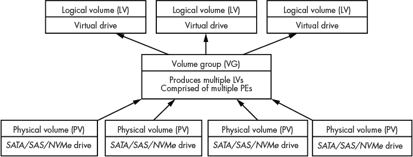
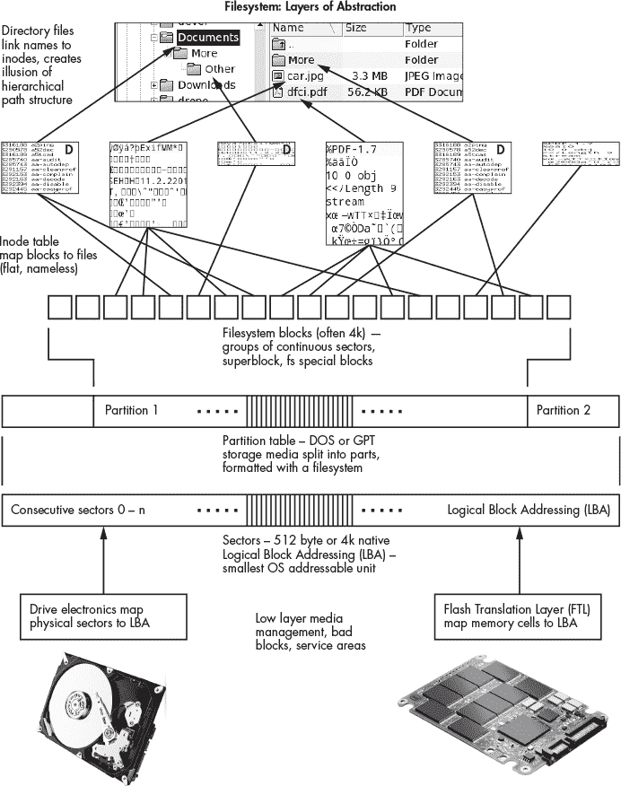
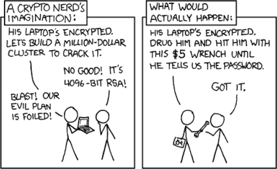

## **3

来自存储设备和文件系统的**证据**


本章重点讲解 Linux 存储的取证分析，包括分区表、卷管理和 RAID、文件系统、交换分区和休眠、以及磁盘加密。每个领域都有 Linux 特有的取证痕迹，我们可以进行分析。你可能能够使用商业取证工具执行本章中展示的大部分活动，但为了说明问题，本章中的示例使用了 Linux 工具。

在对计算机系统的存储进行取证分析时，第一步是精确识别驱动器上的内容。我们必须理解布局、格式、版本和配置。在对驱动器内容有了高层次的了解后，我们可以开始寻找其他有趣的取证痕迹和数据进行检查或提取。

本章所示的文件系统取证分析相较于学术研究论文和其他数字取证文献，描述的层次较高。在这里，我将描述文件和文件系统元数据以及对取证调查有用的信息。我会展示如何列出和提取文件，探讨恢复已删除文件和空白区的可能性。预计被分析的文件系统处于（相对）一致的状态，工具能够解析文件系统数据结构。损坏严重、部分擦除或被覆盖的文件系统需要不同的分析方法，这涉及手动将扇区或块重新组合成文件进行恢复以及其他低级别的分析技术。这种级别的调查超出了本书的预期深度。对于更深入的文件系统分析资源，我推荐 Brian Carrier 的《文件系统取证分析》。

本章的“文件系统取证分析”部分首先介绍了所有类 Unix 文件系统共有的结构，接着详细讲解了在 Linux 中最常用的文件系统：ext4、xfs 和 btrfs。这三个文件系统部分的结构如下：

+   历史、概述和特点

+   如何查找和识别文件系统

+   文件系统元数据中的取证痕迹（超级块）

+   文件元数据中的取证痕迹（inode）

+   列出和提取文件

+   其他独特特点

分析示例使用了 The Sleuth Kit（TSK），以及各项目团队提供的调试和故障排除工具，和各种自由与开源社区项目。我使用了支持 btrfs 和 xfs 的 TSK 补丁版本进行一些分析示例。

本章中的示例使用命名约定*image.raw*表示完整的磁盘镜像，*partimage.raw*表示分区的镜像（包含文件系统）。使用分区镜像的示例在指定了分区偏移量的情况下，也可以用于完整的磁盘镜像。某些工具仅能与设备一起使用，而不能与法医镜像文件一起使用。在这种情况下，会创建与镜像文件关联的回环设备。

我们即将结束文件系统法医学的“黄金时代”。在磁性旋转硬盘上，当删除的文件被取消链接并且块被取消分配时，数据仍然保留在物理磁盘扇区中。法医工具可以“神奇地”恢复这些已删除的文件和部分覆盖的文件碎片。然而，今天的 SSD 支持操作系统发送的 TRIM 和 DISCARD 命令，这些命令指示 SSD 固件擦除未使用的块（出于性能和效率的原因）。此外，闪存转换层（FTL）将有缺陷的内存块映射到存储的超额配置区域，这些区域无法通过标准硬件接口（SATA、SAS 或 NVMe）访问。因此，一些传统的法医技术在恢复数据时变得不太有效。像*chip-off*这样的恢复技术，需要将内存芯片拆焊，执行此操作需要特殊的设备和训练。本章介绍了仍然可以通过软件工具恢复已删除文件的技术。

### 存储布局与卷管理分析

本节描述了如何识别存储介质上的 Linux 分区和卷。我将展示如何重建或重新组合可能包含文件系统的卷，并突出对调查有意义的信息痕迹。

#### *分区表分析*

典型的存储介质采用定义的分区方案进行组织。常见的分区方案包括：

+   DOS/MBR（原始 PC 分区方案）

+   GPT

+   BSD

+   Sun (vtoc)

+   APM（苹果分区图）

+   无（没有分区方案，文件系统从扇区零开始）

DOS 曾是多年来最流行的分区方案，但 GPT 正在变得越来越常见。

分区通过分区表定义，^(1)该表提供了诸如分区类型、大小、偏移量等信息。Linux 系统通常将硬盘划分为多个分区，以创建独立的文件系统。常见的分区可能包含以下内容：

| **/** | 操作系统安装和根挂载 |
| --- | --- |
| **ESP** | 用于 UEFI 引导的 EFI 系统分区（FAT） |
| **swap** | 用于分页、交换和休眠 |
| ***/boot/*** | 引导加载程序信息、内核和初始内存盘 |
| ***/usr/*** | 有时用于系统文件的只读文件系统 |
| ***/var/*** | 有时用于存储可变或更改的系统数据 |
| ***/home/*** | 用户的主目录 |

默认的分区和文件系统布局因 Linux 发行版而异，用户在安装过程中有机会自定义该布局。

从数字取证的角度来看，我们需要识别分区方案，分析分区表，并寻找可能的分区间隙。对 DOS 和 GPT^(2)分区表的分析与已安装的操作系统无关。所有商业取证工具都可以分析 Linux 系统分区表。我们将重点讨论与 Linux 特定的痕迹。

DOS 分区表条目为分区类型分配了一个字节。没有权威的标准组织定义 DOS 分区类型；然而，一个社区努力维护已知分区类型的列表，网址为*[`www.win.tue.nl/~aeb/partitions/partition_types-1.html`](https://www.win.tue.nl/~aeb/partitions/partition_types-1.html)*（UEFI 规范甚至链接到该网站）。你可能会发现一些常见的 Linux 分区类型，包括：

| **0x83** | Linux |
| --- | --- |
| **0x85** | Linux 扩展 |
| **0x82** | Linux swap |
| **0x8E** | Linux LV |
| **0xE8** | LUKS（Linux 统一密钥设置） |
| **0xFD** | Linux RAID 自动 |

0x 前缀表示分区类型以十六进制格式表示。Linux 安装通常有一个或多个*主分区*，这是传统的分区表条目。还可能存在一个*扩展*分区（类型为 0x05 或 0x85），其中包含其他*逻辑*分区。^(3)

GPT 分区表条目为分区 GUID 分配了 16 个字节。UEFI 规范中指出：“操作系统厂商需要生成自己的分区类型 GUID 来标识他们的分区类型。”Linux 可发现分区规范（*[`systemd.io/DISCOVERABLE_PARTITIONS/`](https://systemd.io/DISCOVERABLE_PARTITIONS/)）定义了几种 Linux GUID 分区类型，但并不完整。有关列出已知 GUID 的`systemd-id128` `show`命令，请参见 systemd-id128(1)手册页。你可能会在 GPT 分区方案中发现一些 Linux GPT 分区类型，包括：

| **Linux swap** | 0657FD6D-A4AB-43C4-84E5-0933C84B4F4F |
| --- | --- |
| **Linux 文件系统** | 0FC63DAF-8483-4772-8E79-3D69D8477DE4 |
| **Linux 根目录（x86-64）** | 4F68BCE3-E8CD-4DB1-96E7-FBCAF984B709 |
| **Linux RAID** | A19D880F-05FC-4D3B-A006-743F0F84911E |
| **Linux LVM** | E6D6D379-F507-44C2-A23C-238F2A3DF928 |
| **Linux LUKS** | CA7D7CCB-63ED-4C53-861C-1742536059CC |

不要将分区类型的标准定义 GUID 与特定分区或文件系统的随机生成的 GUID 混淆。

在取证检查过程中，DOS 或 GPT 分区类型可能指示内容。但需要注意，用户可以定义任何他们想要的分区类型，然后创建一个完全不同的文件系统。分区类型作为各种工具的指示符使用，但不能保证它一定正确。如果分区类型不正确且具有误导性，可能是试图隐藏或模糊信息（类似于通过更改文件扩展名来隐藏文件类型）。

在 Linux 系统中，检测到的分区会出现在*/dev/*目录中。这个目录是一个挂载的伪目录，在运行中的系统中存在。在事后取证检查中，这个目录将为空，但设备名称可能仍然会在日志中、配置文件中或文件系统中的其他地方找到。这里提供了存储设备（包括分区）的简要回顾。

在 Linux 中最常见的存储驱动器是 SATA、SAS、NVMe 和 SD 卡。这些块设备在运行中的系统的*/dev/*目录中表示如下：

+   */dev/sda*, */dev/sdb*, */dev/sdc*, . . .

+   */dev/nvme0n1*, */dev/nvme1n1*, . . .

+   */dev/mmcblk0*, *mmcblk1*, . . .

每个驱动器都有一个设备文件。SATA 和 SAS 驱动器按字母顺序表示（sda, sdb, sdc, . . .）。NVMe 驱动器按数字表示；第一个数字是驱动器，第二个*n*数字是命名空间。^(4) SD 卡也按数字表示（mmcblk0, mmcblk1, . . .）。

如果 Linux 系统在某个驱动器上检测到分区，将会创建额外的设备文件来表示这些分区。命名约定通常会在驱动器名后添加一个额外的数字，或者在字母后加上*p*和一个数字，例如：

+   */dev/sda1*, */dev/sda2*, */dev/sda3*, . . .

+   */dev/nvme0n1p1*, */dev/nvme0n1p2*, . . .

+   */dev/mmcblk0p1*, */dev/mmcblk0p2*, . . .

如果商业工具无法正确分析 Linux 分区表，或者你需要更多的分析结果，可以使用一些 Linux 工具，包括`mmls`（来自 TSK）和`disktype`。

这是 TSK 的`mmls`命令输出的 Manjaro Linux 分区表示例：

```
$ mmls image.raw
DOS Partition Table
Offset Sector: 0
Units are in 512-byte sectors

       Slot   Start       End         Length      Description
000:   Meta   0000000000  0000000000  0000000001  Primary Table (#0)
001: -------  0000000000  0000002047  0000002048  Unallocated
002: 000:000  0000002048  0024188109  0024186062  Linux (0x83)
003: 000:001  0024188110  0041929649  0017741540  Linux Swap / Solaris x86 (0x82)
004: -------  0041929650  0041943039  0000013390  Unallocated
```

`mmls`工具列出了不同的“槽”，它们可以是分区元数据、未分配的区域（包括分区间隙）和实际分区。分区的起始、结束位置和长度以 512 字节扇区为单位显示。这个示例呈现了一个传统的 DOS 分区方案，一个位于 2048 扇区的 Linux 分区（0x83），紧接着是一个交换分区。最后的 13390 个扇区没有分配给任何分区。

**注意**

*小心使用单位。一些工具使用扇区，其他工具使用字节。*

接下来，我们来看一个 Linux Mint 分区表的`disktype`输出示例：

```
   # disktype /dev/sda

   --- /dev/sda
   Block device, size 111.8 GiB (120034123776 bytes)
   DOS/MBR partition map
➊ Partition 1: 111.8 GiB (120034123264 bytes, 234441647 sectors from 1)
     Type 0xEE (EFI GPT protective)
   GPT partition map, 128 entries
     Disk size 111.8 GiB (120034123776 bytes, 234441648 sectors)
     Disk GUID 11549728-F37C-C943-9EA7-A3F9F9A8D071
   Partition 1: 512 MiB (536870912 bytes, 1048576 sectors from 2048)
  ➋ Type EFI System (FAT) (GUID 28732AC1-1FF8-D211-BA4B-00A0C93EC93B)
     Partition Name "EFI System Partition"
     Partition GUID EB66AA4C-4840-1E44-A777-78B47EC4936A
     FAT32 file system (hints score 5 of 5)
       Volume size 511.0 MiB (535805952 bytes, 130812 clusters of 4 KiB)
   Partition 2: 111.3 GiB (119495720960 bytes, 233390080 sectors from 1050624)
     Type Unknown (GUID AF3DC60F-8384-7247-8E79-3D69D8477DE4)
  ➌ Partition Name ""
     Partition GUID A6EC4415-231A-114F-9AAD-623C90548A03
     Ext4 file system
       UUID 9997B65C-FF58-4FDF-82A3-F057B6C17BB6 (DCE, v4)
       Last mounted at "/"
       Volume size 111.3 GiB (119495720960 bytes, 29173760 blocks of 4 KiB)
   Partition 3: unused
```

在这个输出中，GPT 分区显示为➊，带有保护 MBR（`类型` `0xEE`）。分区 1 是 EFI FAT 分区➋，并且 UUID（`GUID`）已识别。分区 2 的 UUID➌未被`disktype`识别，但它检测到了文件系统并显示了一些相关信息。

工具呈现的 GPT UUID 格式可能会有所不同，显示的格式也可能与磁盘上存储的格式不同。例如，这里是 Linux GPT 分区类型`0FC63DAF-8483-4772-8E79-3D69D8477DE4`通过几种不同工具显示的结果：

fdisk/gdisk `0FC63DAF-8483-4772-8E79-3D69D8477DE4`

disktype `AF3DC60F-8384-7247-8E79-3D69D8477DE4`

hexedit `AF 3D C6 0F 83 84 72 47 8E 79 3D 69 D8 47 7D E4`

xxd `af3d c60f 8384 7247 8e79 3d69 d847 7de4`

GPT UUID 具有定义的结构，其中一部分以小端格式存储在磁盘上。UEFI 规范（附录 A）详细描述了 EFI GUID 格式（*[`uefi.org/sites/default/files/resources/UEFI_Spec_2_8_final.pdf`](https://uefi.org/sites/default/files/resources/UEFI_Spec_2_8_final.pdf)*）。某些工具（例如 `disktype` 或十六进制转储工具）可能会显示写入磁盘的原始字节，而不是将这些字节解释为 GPT UUID。

#### *逻辑卷管理器*

现代操作系统提供了卷管理功能，用于组织和管理物理驱动器的组合，允许创建包含分区和文件系统的逻辑（虚拟）驱动器的灵活性。卷管理可以是一个独立的子系统，例如 *逻辑卷管理器（LVM）*，也可以像 btrfs 或 zfs 一样直接构建在文件系统中。

本节中的示例涵盖了一个简化的 LVM 设置，只有一个物理存储设备。这足以分析许多默认在一块硬盘上安装 LVM 的发行版。涉及多个驱动器的更复杂场景将需要支持 LVM 卷的取证工具，或者需要能够访问和组装 LVM 卷的 Linux 取证分析机器。如果文件系统以单个磁盘上的扇区线性序列写入并且已知文件系统的起始偏移量，那么即使没有 LVM 支持，也可以使用取证工具。

Linux 环境中最常见的卷管理器是 LVM。 图 3-1 显示了高层次的架构。



*图 3-1：逻辑卷管理器*

LVM 系统有几个关键概念：

**物理卷（PV）** 物理存储设备（SATA、SAS 和 NVMe 驱动器）

**卷组（VG）** 由一组 PV 创建

**逻辑卷（LV）** VG 内的虚拟存储设备

**物理扩展（PEs）** PV 中连续扇区的序列

**逻辑扩展（LEs）** LV 中连续扇区的序列

在 LVM 的上下文中，扩展（extent）类似于传统文件系统的块，并且在创建时有一个固定的大小。典型的默认 LVM 扩展大小为 8192 个扇区（4MB），并且用于 PEs 和 LEs。LVM 还可以为逻辑卷提供冗余和条带化。

使用分区表并非 LVM 所必需，PVs 可以直接在裸磁盘上创建，无需分区。当使用分区时，LVM 会有一个分区条目类型，指示物理驱动器是 PV。对于 DOS 分区方案，LVM 分区代码是 `0x8E`。对于 GPT，LVM 分区的 UUID 是 `E6D6D379-F507-44C2-A23C-238F2A3DF928`（某些工具可能会以其在磁盘上存储的顺序显示字节：`D3 79 E6 D6 F5 07 44 C2` `3C A2 8F 23 3D 2A 28 F9`）。以下是一个分区表示例：

```
$ sudo mmls /dev/sdc
DOS Partition Table
Offset Sector: 0
Units are in 512-byte sectors

     Slot     Start       End         Length      Description
000: Meta     0000000000  0000000000  0000000001  Primary Table (#0)
001: -------  0000000000  0000002047  0000002048  Unallocated
002: 000:000  0000002048  0002099199  0002097152  Linux (0x83)
003: 000:001  0002099200  0117231407  0115132208  Linux Logical Volume Manager (0x8e)
```

在此示例中，`mmls` 显示了一个 DOS 分区表，并且在扇区 2099200 处检测到一个 LVM 分区，占用了大部分驱动器。

关于 PV 的信息写入到 LVM 分区第二个扇区（扇区 1）的 32 字节标签头中。此标签包含：

+   LVM ID 字符串为 `LABELONE`（8 字节）

+   此标签所在分区的扇区（8 字节）

+   此扇区其余部分的 CRC 校验和（4 字节）

+   内容开始的字节偏移量（4 字节）

+   LVM 类型字符串为 `LVM2 001`（8 字节）

+   PV UUID（16 字节）

这是在 LVM 分区的开始（第二个扇区）处 LVM 标签的十六进制转储示例：

```
40100200  4C 41 42 45 4C 4F 4E 45 01 00 00 00 00 00 00 00 LABELONE........
40100210  53 BF 78 2F 20 00 00 00 4C 56 4D 32 20 30 30 31 S.x/ ...LVM2 001
40100220  55 77 37 73 73 53 4A 61 50 36 67 43 44 42 4D 61 Uw7ssSJaP6gCDBMa
40100230  51 32 4A 57 39 32 71 6F 66 71 59 47 56 57 6F 68 Q2JW92qofqYGVWoh
...
```

您需要安装 lvm2 软件包来管理 LVM 卷。它包含多个工具，可帮助执行连接 LVM 驱动器的取证分析，包括描述 LVM 系统的 lvm(8) 手册页。

LVM 工具在设备上操作，而不是普通文件。要在 Linux 取证分析工作站上检查 LVM 设置，嫌疑驱动器必须通过写保护器连接，或作为只读获取的镜像文件关联到一个循环设备（请参阅 第二章 中的“设备”小节）。在这些示例中，嫌疑 LVM 驱动器是取证分析机器上的 */dev/sdc* 设备。

`pvdisplay` 工具提供有关 PV 的信息。`--foreign` 标志包括通常会被跳过的卷，`--readonly` 直接从磁盘读取数据（忽略内核设备映射驱动程序）：

```
$ sudo pvdisplay --maps --foreign --readonly
  --- Physical volume ---
  PV Name               /dev/sdc2
  VG Name               mydisks
  PV Size               <54.90 GiB / not usable <4.90 MiB
  Allocatable           yes
  PE Size               4.00 MiB
  Total PE              14053
  Free PE               1
  Allocated PE          14052
  PV UUID               Uw7ssS-JaP6-gCDB-MaQ2-JW92-qofq-YGVWoh

  --- Physical Segments ---
...
  Physical extent 1024 to 14051:
    Logical volume     /dev/mydisks/root
    Logical extents    0 to 13027
...
```

此输出显示有关单个物理卷（`sdc2`）的信息，包括 PE 大小、卷中 PE 的数量以及扩展的详细信息。LVM UUID 不是标准的十六进制格式；相反，它们是随机生成的字符串，包含 0–9、a–z 和 A–Z 字符。

您可以使用 `lvdisplay` 工具查询有关逻辑卷的信息。`--maps` 标志提供有关段和扩展的附加详细信息：

```
$ sudo lvdisplay --maps --foreign --readonly
...
   --- Logical volume ---
   LV Path                /dev/mydisks/root
   LV Name                root
   VG Name                mydisks
   LV UUID                uecfOf-3E0x-ohgP-IHyh-QPac-IaKl-HU1FMn
   LV Write Access        read/write
➊ LV Creation host, time pc1, 2020-12-02 20:45:45 +0100
   LV Size                50.89 GiB
   Current LE             13028
   Segments               1
   Allocation             inherit
   Read ahead sectors     auto

   --- Segments ---
   Logical extents 0 to 13027:
  ➋ Type                linear
     Physical volume     /dev/sdc2
     Physical extents    1024 to 14051
```

`Type linear` 这一行 ➋ 表示卷在磁盘上以连续扇区的序列存在（类似于 LBA）。在线性单磁盘配置中，我们只需要找到文件系统起始位置的偏移量，然后可以使用不支持 LVM 的取证工具对其进行操作。从取证的角度来看，另一个有趣的方面是创建逻辑卷的主机名和卷的创建时间戳 ➊。

有关扩展的信息帮助我们找到（计算）文件系统的第一个扇区。上面的分区表（`mmls` 输出）显示 LVM 分区从扇区 2099200 开始。第一个 PE 距离 LVM 分区的起始位置 2048 个扇区。^(5) `pvdisplay` 输出显示 LVM 扩展大小为 8192 个扇区（`PE Size 4.00 MiB`），而 `lvdisplay` 输出显示根卷从第 1024 个扩展开始。通过这些信息，我们可以确定文件系统的扇区偏移量：

2099200 + 2048 + (8192 * 1024) = 10489856

对于线性单磁盘 LVM 系统，其中文件系统存储为连续的扇区序列，我们可以使用标准的取证工具，通过使用来自物理驱动器开头的这个扇区偏移量。以下是一个使用 TSK 的示例：

```
$ sudo fsstat -o 10489856 /dev/sdc
FILE SYSTEM INFORMATION
--------------------------------------------
File System Type: Ext4
Volume Name:
Volume ID: 6d0edeac50c97b979148918692af1e0b
...
```

TSK 命令 `fsstat` 提供有关文件系统的信息。在这个例子中，在 LVM 分区内计算出的偏移量处找到了一个 ext4 文件系统。计算文件系统起始位置的替代方法是通过工具（如 `gpart`）彻底搜索文件系统的起始位置。你可以使用 `vgdisplay` 和 `pvs` 命令，并带有一个或多个 `-v` 标志，以获取有关卷组和物理卷的详细信息。

LVM 还具有执行 *写时复制（CoW）* 快照的能力。这从取证角度来看非常有趣，因为卷的快照可能来自以前的某个时刻。在运行的系统中，可以将卷“冻结”在快照中进行分析或甚至获取。

#### *Linux 软件 RAID*

在企业计算的早期，人们发现可以将多组硬盘配置为并行工作，从而提高可靠性和性能。这个概念被称为 *冗余独立磁盘阵列*，或 *RAID*。^(6) 用来描述 RAID 配置的术语有很多。*镜像*指的是两个互为镜像的磁盘。*条带化*指的是将数据条带分布在多个磁盘上以提高性能（可以同时从多个磁盘读取和写入）。*奇偶校验*是计算机科学中的术语，指用于错误检测和/或修正的额外数据位。

RAID 有不同的级别，描述了多个磁盘如何协同工作：

**RAID** 为了性能而条带化，无冗余

**RAID1** 镜像磁盘以提供冗余，容量为一半，但最多可以有一半的磁盘故障

**RAID2,3,4,5** 带奇偶校验的变体，允许一个磁盘发生故障

**RAID6** 双重奇偶校验，允许最多两个磁盘发生故障

**RAID10** 镜像和条带化（“1 + 0”），以实现最大的冗余性和性能

**JBOD** “仅仅是磁盘的一堆” 连接的磁盘，没有冗余和性能，但最大容量

组织根据成本、性能和可靠性的平衡来选择 RAID 级别。

一些商业取证工具可能支持重新组装和分析 Linux RAID 系统。如果不支持，可以将取证镜像传输到 Linux 机器上进行分析。我的上一部书《*实用取证镜像*》（No Starch Press，2016）解释了如何创建各种 RAID 系统的取证镜像，包括 Linux。在本节中，我们假设各个驱动器已被取证获取，并且作为只读镜像文件提供，或直接连接到分析系统，并配有写入阻断器。确保磁盘或镜像为只读非常重要，否则分析系统可能会自动检测 RAID 分区，并尝试重新组装、重新同步或重建 RAID。

在 Linux 中，RAID 功能可以通过`md`（多设备驱动程序，或 Linux 软件 RAID）、LVM 或内建的文件系统提供（例如，btrfs 和 zfs 具有集成的 RAID 功能）。

最常用的 RAID 方法（本章重点介绍）是 Linux 软件 RAID 或`md`。这个内核模块从配置的磁盘阵列中生成一个元设备。你可以使用`mdadm`用户空间工具来配置和管理 RAID。接下来的部分描述了在典型的`md` RAID 系统中找到的取证证据。有关`md`设备的更多信息，请参见 md(4)手册页。

用于 RAID 的磁盘可能具有标准 Linux RAID 分区类型的分区表。对于 GPT 分区表，Linux RAID 的 GUID 是`A19D880F-05FC-4D3B-A006-743F0F84911E`（或在磁盘上写入的字节为`0F889DA1-FC05-3B4D-A006-743F0F84911E`）。

对于 DOS/MBR 分区表，Linux RAID 的分区类型是 0xFD。取证工具将会在每个属于 RAID 系统的磁盘上找到这些分区。

来自 Linux RAID 系统的每个设备都有一个*超级块*（不要与文件系统超级块混淆，它们是不同的），该块包含有关设备和阵列的信息。现代 Linux RAID 设备上`md`超级块的默认位置是从分区开始的八个扇区。我们可以通过魔术字符串 0xA92B4EFC 来识别它。你可以使用十六进制编辑器或`mdadm`命令来查看这个超级块信息，方法如下：

```
   # mdadm --examine /dev/sda1
   /dev/sda1:
             Magic : a92b4efc
           Version : 1.2
       Feature Map : 0x0
➊ Array UUID : 1412eafa:0d1524a6:dc378ce0:8361e245
           ➋ Name : My Big Storage
  ➌ Creation Time : Sun Nov 22 13:48:35 2020
        Raid Level : raid5
      Raid Devices : 3

    Avail Dev Size : 30270751 (14.43 GiB 15.50 GB)
        Array Size : 30270464 (28.87 GiB 31.00 GB)
     Used Dev Size : 30270464 (14.43 GiB 15.50 GB)
       Data Offset : 18432 sectors
      Super Offset : 8 sectors
      Unused Space : before=18280 sectors, after=287 sectors
             State : clean
    ➍ Device UUID : 79fde003:dbf203d5:521a3be5:6072caa6

    ➎ Update Time : Sun Nov 22 14:02:44 2020
     Bad Block Log : 512 entries available at offset 136 sectors
          Checksum : 8f6317ee - correct
            Events : 4

            Layout : left-symmetric
        Chunk Size : 512K

       Device Role : Active device 0
       Array State : AAA ('A' == active, '.' == missing, 'R' == replacing)
```

这个输出包含了几个可能在取证检查中有用的证据。`Array UUID` ➊将标识整个 RAID 系统，每个属于此 RAID 的磁盘（包括以前更换的磁盘）将在其超级块中拥有相同的 UUID 字符串。`Name`（`My Big Storage`） ➋可以由管理员指定或自动生成。`Device UUID` ➍唯一标识单个磁盘。创建时间戳 ➌ 表示阵列的创建日期（新更换的磁盘将继承原始阵列的创建日期）。`Update Time` ➎表示由于某些文件系统事件，超级块最后一次更新的时间。

阵列中的磁盘可能不是所有都具有相同的大小。在取证检查中，这可能是重要的。在这个例子中，三个设备各自使用 15.5GB 来生成一个 31GB 的 RAID5 阵列。然而，这里显示的设备（sdc）大小为 123.6GB：

```
# mdadm --examine /dev/sdc1
/dev/sdc1:
...
 Avail Dev Size : 241434463 (115.12 GiB 123.61 GB)
     Array Size : 30270464 (28.87 GiB 31.00 GB)
 Used Dev Size : 30270464 (14.43 GiB 15.50 GB)
   Data Offset : 18432 sectors
...
```

这个示例中的设备比阵列中的其他成员要大得多，这表明这个驱动器上有超过 100GB 的未触碰数据。可以对这个区域进行取证检查，以查找以前存储的数据。

阵列设备通常呈现为`/dev/md#`、`/dev/md/#`或`/dev/md/`*NAME*的形式，系统管理员可以在创建时指定`#`或*NAME*。这些 Linux 内核设备仅在运行系统上存在，但在事后取证检查中，它们可能会出现在日志中；例如：

```
Nov 22 11:48:08 pc1 kernel: md/raid:md0: Disk failure on sdc1, disabling device.
                            md/raid:md0: Operation continuing on 2 devices.
...
Nov 22 12:00:54 pc1 kernel: md: recovery of RAID array md0
```

在这里，一个 RAID5 系统中的硬盘出现故障，内核生成了一条信息，随后保存到了日志中。在故障硬盘被替换后，内核生成了有关恢复的消息。

内核应该在启动时自动扫描并识别 Linux RAID 设备。然而，它们也可以在单独的配置文件中定义。在检查 RAID 系统时，检查 */etc/mdadm.conf* 文件（或 */etc/mdadm.conf.d/* 目录中的文件）中是否有未注释的 `DEVICE` 或 `ARRAY` 行。有关更多信息，请参阅 mdadm.conf(5) 手册页。

如果先前故障的硬盘能够被物理定位，它们仍然可能是可读取的。故障或更换的硬盘包含了某一时刻的数据快照，并可能与取证调查相关。

传统 RAID 在企业 IT 环境中的未来正受到多个因素的影响。大容量商品硬盘（截至目前，18TB 硬盘已经可用）需要更多时间来重新同步和重建。在某些情况下，这可能需要数天才能完成，具体取决于硬盘的大小和速度。现在，逐渐转向使用廉价 PC 集群（类似于 PC 的 RAID）来实现性能和冗余的数据复制。使用 SSD 代替旋转磁盘也降低了故障风险（没有移动的机械部件）。

### 文件系统取证分析

本节介绍了所有 Unix 类文件系统通用的文件系统概念。分析示例使用 TSK 进行说明，但所有技术都应该能够使用流行的商业数字取证工具进行实现。Linux 支持数十种文件系统，本文展示的分析方法可以应用于其中大多数文件系统。

#### *Linux 文件系统概念*

文件系统的概念在 Unix 和 Linux 中是核心和基础。当 Ken Thompson 开始创建 Unix 的第一个版本时，他首先设计了文件系统，并发展出了“所有事物皆文件”的概念。这个想法使得通过文件系统树中的文件可以访问一切，包括硬件设备、进程、内核数据结构、网络、进程间通信，当然，还有常规的文件和目录。

POSIX 描述的基本文件类型将在下一章中讨论，包含常规文件、目录、符号链接、命名管道、设备和套接字。当我在本章中提到文件类型时，我指的是 Unix 文件系统和 POSIX 文件类型，而不是应用程序文件类型，如图像、视频或办公文档。

硬盘驱动器和 SSD 配备了集成电子设备，创建了一个连续扇区序列的抽象（逻辑块访问，简称 LBA）。硬盘上的分区可能包含文件系统，这些文件系统位于从零扇区开始的已知偏移位置。一个文件系统使用一组连续的扇区来形成一个块（通常为 4KB 大小）。一个或多个块（不一定是连续的）形成文件的数据内容。

每个文件都会被分配一个编号（在文件系统中唯一），称为*inode*。分配给每个文件的块以及其他元数据（权限、时间戳等）都存储在*inode 表*中。文件名并不在 inode 中定义，而是作为条目列在*目录文件*中。这些目录条目将文件名链接到 inode，创建了一个虚拟的文件系统树结构。熟悉的完整文件“路径”（*/some/path/file.txt*）并不存储在任何地方，而是通过遍历文件和根目录（/）之间链接的目录文件名来计算得出的。

块和 inode 的分配状态存储在位图中，并在文件创建或删除时更新。图 3-2 展示了这些抽象层次。



*图 3-2：文件系统抽象。（这是一个简化视图，不包括块组、冗余、可扩展性及其他特殊功能。）*

传统的文件系统是在旋转的磁性盘片时代设计的，当时磁头通过机械臂进行读取/写入操作。性能优化和故障容错是必要的，通常通过在磁盘上将块和 inode 分组来实现。

一些原始文件系统设计决策（例如，与机械旋转盘片和寻址驱动头相关的性能优化）在 SSD 中是多余的，但它们今天仍然存在。现代文件系统具有额外的功能，如日志记录，以确保在崩溃事件中数据的一致性，或者它们使用*扩展*（一系列连续块）来替代单个分配块的列表。此外，每个文件系统可能都有自己独特的功能和属性，这些功能和属性在数字取证环境中可能会很有意思（例如，ext4 文件系统有最后挂载时间戳和路径）。

网络文件系统（NFS、CIFS/Samba 等）、FUSE 和伪文件系统（*/proc/*、*/sys/* 等）具有类似于其他文件系统的树/文件表示。然而，这些内容超出了本书的范围，因为它们无法像物理存储一样进行事后分析。

Unix 和 Linux 世界中的大多数文件系统遵循相同的一般设计概念，这使得将相同的数字取证分析方法应用于多个文件系统变得更加容易。

#### *Linux 文件系统中的取证痕迹*

文件系统分析的第一步是确定正在检查的是哪个文件系统。如前所述，分区表可以提供一些线索，但分区类型的正确性并不是一个要求；因此，需要一种更可靠的方法。

大多数文件系统可以通过文件系统开头的几个字节来识别，这些字节被称为 *魔术字符串* 或 *签名*。如果你的取证工具无法自动确定文件系统，你可以手动搜索这个签名（例如，使用 TSK 的 `sigfind` 命令）。文件系统的规范定义了这个魔术数。你还可以使用其他工具，如 `disktype` 或 TSK 的 `fsstat` 来识别文件系统。如果已知的魔术字符串位于分区中的预期偏移位置，那么它是文件系统存在的良好指示。

*超级块* 是描述整体文件系统的文件系统元数据。根据文件系统的不同，它可能包含与取证相关的项目，包括：

+   系统所有者指定的标签或卷名称

+   唯一标识符（UUID/GUID）

+   时间戳（文件系统创建、最后挂载、最后写入和最后检查）

+   块的大小和数量（有助于识别卷剩余空间）

+   挂载次数和最后的挂载点

+   其他文件系统特性和配置

大多数取证工具，包括 `fsstat`，都会显示这些信息。文件系统通常附带调试和故障排除工具，这些工具可能会显示更多技术信息。

inode 结构也依赖于文件系统，并定义每个文件可用的元数据。这可能包含与取证相关的项目，包括：

+   POSIX 文件类型

+   权限和所有权

+   多个时间戳（众所周知的 MACB，可能还有其他）

+   大小和块（表示文件剩余空间的可能性）

+   其他标志和属性

查找文件系统 inode 结构信息的最权威地方是该项目本身的开发者文档或实现的源代码。

其他取证数据与存储内容有关。了解驱动器上有内容的区域可以帮助检查人员进行恢复和提取。一些驱动器上的定义和取证兴趣区域包括：

**扇区** 驱动器上最小的可访问单元

**块** 一组连续的扇区，是文件系统上最小的可访问单元

**扩展** 一组连续的文件系统块（大小可变）

**已分配块** 已分配给文件的文件系统块

**未分配块** 未分配给文件的文件系统块（可能包含已删除文件的数据）

当文件被删除时，它会被取消链接，inode 和关联的数据块会被标记为未分配并且可以重新使用。在磁盘驱动器上，已删除文件的数据会继续存在于盘片上，直到这些块被覆盖，这意味着数据可以通过取证工具恢复。在 SSD 上，操作系统可能会发送一个命令（TRIM 或 DISCARD）到驱动器固件，指示它擦除数据，为下一次写入做准备。^(7) 这减少了从 SSD 的未分配区域恢复已删除数据的可能性。

*间隙*或*间隙空间*是取证中用来描述驱动器上额外未使用区域的术语，这些区域理论上可以存储数据：

**卷间隙** 文件系统末尾和分区末尾之间的区域

**文件间隙** 文件末尾和块末尾之间的区域

**RAM 或内存间隙** 文件末尾和扇区末尾之间的区域

**分区间隙** 驱动器上不属于任何已定义分区的区域（可能是已删除的分区）

现在，操作系统在处理丢弃数据时更加谨慎。TRIM 和 DISCARD 命令用于擦除 SSD 存储单元，4KB 原生扇区（最小可寻址单元）大小与文件系统块大小相同。这些因素导致间隙空间作为证据来源的效用降低。

#### *列出并提取数据*

文件系统取证分析的一部分是能够恢复文件（包括已删除的文件）和恢复文件片段（间隙或未分配区域）。这是每个计算机取证工具包的正常功能。让我们通过使用 TSK 来查看一些小例子。

首先，让我们检查扇区、块、inode 和文件名之间的关系。这些示例使用基本的数学或 TSK 工具来回答以下问题：

+   我知道驱动器的扇区。文件系统块是什么？`(扇区 - 分区偏移) * 扇区大小 / 块大小`

+   我知道文件系统块。它位于哪个扇区？`(块 * 块大小 / 扇区大小) + 分区偏移`

+   这个文件系统块（123）是否已分配？`blkstat partimage.raw 123`

+   我知道一个已分配的块（456）。它的 inode 是什么？`ifind -d 456 partimage.raw`

+   我知道一个文件的 inode。显示文件的元数据（和使用的块）：`istat partimage.raw 789`

+   我知道一个文件的 inode。文件名是什么？`ffind partimage.raw 789`

+   我知道文件名。它的 inode 是什么？`ifind -n "hello.txt" partimage.raw`

**注意**

*确保你使用的是正确的单位！根据工具的不同，单位可以是字节、扇区或块。*

TSK 有用于分析驱动器镜像和文件系统的工具。在使用文件系统分析工具时，需要知道文件系统的位置。文件系统取证工具可以从分区设备文件（*/dev/sda1*）或提取的分区镜像（*partimage.raw*）读取数据，或者通过为附加驱动器或驱动器镜像文件指定扇区偏移（通常使用`-o`标志）。

我们可以使用 TSK 的`fls`工具列出文件系统上所有已知的文件（包括已删除的文件）。在以下示例中，`-r`标志递归列出所有目录中的文件，`-p`显示完整路径（`-l`标志将包含时间戳、大小和所有权信息）。

```
$ fls -r -p partimage.raw
...
r/r 262172:   etc/hosts
d/d 131074:   var/cache
...
r/r 1050321:  usr/share/zoneinfo/Europe/Vaduz
r/r 1050321:  usr/share/zoneinfo/Europe/Zurich
...
r/r * 136931(realloc): var/cache/ldconfig/aux-cache~
r/r 136931:   var/cache/ldconfig/aux-cache
...
V/V 1179649:  $OrphanFiles
-/r * 655694: $OrphanFiles/OrphanFile-655694
...
```

这个命令在我的测试系统上找到了超过 45,000 个文件，我挑选了一些例子来解释输出。更多信息请参见 TSK 维基（*[`github.com/sleuthkit/sleuthkit/wiki/fls/`](https://github.com/sleuthkit/sleuthkit/wiki/fls/)*）。第一列（`r/r`，`d/d`，等等）表示从目录条目和 inode 中识别出的文件类型。例如，*/etc/hosts*是一个常规文件（`r`），输出显示为`r/r`。第一个`r`是从*/etc/*目录条目确定的，第二个`r`是从*/etc/hosts*元数据（inode）中确定的。与 Linux 相关的^(8)文件类型在 TSK 维基中有文档说明，下面展示了：

| r/r | 常规文件 |
| --- | --- |
| d/d | 目录 |
| c/c | 字符设备 |
| b/b | 块设备 |
| l/l | 符号链接 |
| p/p | 命名 FIFO |
| h/h | 套接字 |

斜杠两边的破折号（`-/-`）表示未知的文件类型（即无法在目录条目或 inode 中找到）。文件类型后面的数字表示 inode 编号。注意，两个文件可能共享相同的 inode（*Vaduz*和*Zurich*）。这些是硬链接文件。星号（`*`）表示已删除的文件。如果一个文件被删除并且 inode 编号被重新使用（重新分配）给一个新文件，则会显示`(realloc)`（这也可能发生在文件重命名时）。如果文件被删除且没有文件名信息（只有 inode 数据），它将在 TSK 的*$OrphanFiles*虚拟目录中列出。TSK 可能会显示附加信息，文件或目录类型为`v/v`或`V/V`，但这些名称是虚拟的，并不存在于正在分析的文件系统中。用于*$OrphanFiles*虚拟目录的 inode 编号来源于最大 inode 数加一。

我们还可以使用 TSK 命令从文件系统中提取内容。以下是一些示例：

+   基于 inode 编号提取文件（使用`-s`包括空闲空间）：`icat partimage.raw 1234`

+   基于文件名提取文件（使用`-s`包括空闲空间）：`fcat hello.txt /dev/sda1`

+   提取文件系统块（带偏移量和块数量）：`blkcat partimage.raw 56789 1`

+   提取所有未分配的文件系统块：`blkls partimage.raw`

+   提取所有文件的空闲空间（来自已分配的块）：`blkls -s partimage.raw`

+   使用`dd`提取一个驱动器扇区（增加`count`提取更多扇区）：`dd if=image.raw skip=12345 count=1`

始终将提取的输出通过管道或重定向到程序或文件（使用`|`或`>`），否则你会弄乱你的 shell/终端，甚至可能执行不需要的命令。

为了便于参考，我已将所有 TSK 命令按分析或提取功能分组，见下表：

+   法医图像：`img_cat`，`img_stat`

+   分区：`mmcat`，`mmls`，`mmstat`

+   文件系统信息：`fsstat`，`pstat`

+   文件系统块：`blkcalc`，`blkcat`，`blkls`，`blkstat`

+   文件名：`fcat`，`ffind`，`fls`，`fiwalk`

+   inode：`icat`，`ifind`，`ils`，`istat`

+   时间线：`mactime`，`tsk_gettimes`

+   搜索和排序：`sigfind`，`sorter`，`srch_strings`，`tsk_comparedir`，`tsk_loaddb`，`tsk_recover`，`hfind`

+   文件系统日志：`jcat`，`jls`，`usnjls`

你可以在 man 页中找到更多信息。（Debian 项目有一些额外的 man 页，这些并未包含在 TSK 软件包中。）

大多数商业取证工具都会执行这些任务。如前所述，对于不受支持的文件系统，替代方案是文件系统开发者通常提供的调试和故障排除工具。这些将在接下来的 ext4、btrfs 和 xfs 部分中使用。

### ext4 分析

Linux 文件系统中最古老且最流行的之一是 *扩展文件系统*，或称 *ext*。每个现代 Linux 发行版都支持 ext4，并且许多发行版在安装过程中将其指定为默认文件系统。由于 ext（2、3 和 4）的普及，许多商业取证工具支持 ext4。TSK（和 Autopsy）支持它，还有许多其他 ext4 故障排除、调试和数据恢复工具可用。

Ext4 是一个可扩展的文件系统，支持日志记录，基于扩展，并支持目录级加密。更多信息请参见 ext4(5) man 页。

与其他流行的 Linux 文件系统相比，ext4 在超级块中包含更多可能在调查中有用的取证信息。然而，它也在删除过程中消除了更多的信息痕迹，这使得恢复删除文件变得更加困难。

#### *文件系统元数据：超级块*

超级块从文件系统开始的字节偏移量 1024（0x400）处开始。ext2、ext3 和 ext4 的魔术字符串是 0xEF53（三个版本都相同）。魔术字符串的位置位于超级块的字节偏移量 56（0x38）处，因此，它距离文件系统开始的字节偏移量为 1080（0x438）。它以小端字节序写入磁盘：

```
00000438: 53ef S.
```

ext4 超级块包含时间戳、唯一标识符、特性和描述性信息，这些在取证检查中可能非常有用。例如：

+   文件系统创建时间戳

+   文件系统上次挂载时间戳

+   文件系统上次检查时间戳（`fsck`）

+   超级块上次写入时间戳

+   用户指定的卷名称或标签（最大 16 个字符）

+   唯一的卷 UUID

+   创建操作系统：如果不是 Linux，可能表示其他操作系统参与了（0 = Linux，3 = FreeBSD）

+   上次挂载的目录：如果这不是标准位置，用户可能在系统上手动创建了挂载点

+   自上次 `fsck` 后挂载的次数：对于外部驱动器，这可能是文件系统使用频率的指示器

+   文件系统生命周期内写入的 KiB 数量：这可以提供文件系统过去“忙碌”程度的线索

在某些情况下（例如数据盗窃），文件系统生命周期中写入的 KiB 数量可能很有趣，尤其是在大量文件被复制到外部媒体时。如果写入的总字节数与所有文件的总大小相同，则表示文件系统没有用于其他任何用途。如果驱动器具有 SMART 功能，可以使用*Total LBAs Written*属性来比较驱动器上的数据量与驱动器生命周期内写入的数据量（类似的分析也可以通过*Total LBAs Read*属性进行）。

商业法医工具应该支持 ext4 超级块的分析；否则可以使用`fsstat`。`dumpe2fs`工具（`e2fsprogs`软件包的一部分）也会显示有关超级块的详细信息。在这个示例中，使用的是一个分区的法医镜像（*partimage.raw*），`-h`标志指定了超级块的头部信息：

```
$ dumpe2fs -h partimage.raw
dumpe2fs 1.46.2 (28-Feb-2021)
Filesystem volume name:  TooManySecrets
Last mounted on:         /run/media/sam/TooManySecrets
Filesystem UUID:         7de10bcf-a377-4800-b6ad-2938bf0c08a7
Filesystem magic number: 0xEF53
...
Filesystem OS type:      Linux
Inode count:             483328
Block count:             1933312
...
Filesystem created:      Sat Mar 13 07:42:13 2021
Last mount time:         Sat Mar 13 08:33:42 2021
Last write time:         Sat Mar 13 08:33:42 2021
Mount count:             16
Maximum mount count:     -1
Last checked:            Sat Mar 13 07:42:13 2021
...
```

输出中已删除一些记录，以突出可能在法医调查中有用的文物。如果用户指定了卷名称（`TooManySecrets`），它可能提供对内容的描述（从用户的角度来看）。`Last mounted on:`记录显示了文件系统最后挂载的目录。在法医调查中，这对于外部驱动器尤其有意义，因为它可以将驱动器与某个 Linux 系统上的挂载点或用户关联。挂载点可以由用户手动创建，或由磁盘管理器临时创建。在前面的示例中，文件系统最后挂载在*/run/media/sam/TooManySecrets*，这表明用户 Sam 可能通过磁盘管理器在他们的桌面系统上挂载了它。^(9) 有关超级块结构的权威文档，请参见 *[`www.kernel.org/doc/html/latest/filesystems/ext4/globals.html`](https://www.kernel.org/doc/html/latest/filesystems/ext4/globals.html)*。

TSK 的`fsstat`工具也可以显示超级块信息，但比`dumpe2fs`的显示内容要少一些；例如：

```
$ fsstat partimage.raw
FILE SYSTEM INFORMATION
--------------------------------------------
File System Type: Ext4
Volume Name: TooManySecrets
Volume ID: a7080cbf3829adb64877a3cf0be17d

Last Written at: 2021-03-13 08:33:42 (CET)
Last Checked at: 2021-03-13 07:42:13 (CET)

Last Mounted at: 2021-03-13 08:33:42 (CET)
Unmounted properly
Last mounted on: /run/media/sam/TooManySecrets

Source OS: Linux
...
```

完整的输出将描述块组和分配信息。在许多法医检查中，块分配信息并不是得出调查结论所必需的（但仍可以在法医报告的附录中提供）。

注意`dumpe2fs`的`Filesystem UUID`和`fsstat`的`Volume ID`是同一个十六进制字符串的不同表示方式。

#### *文件元数据：Inodes*

ext4 中的 inode 结构文档化良好，具有许多从数字取证角度来看很有趣的字段。

文件大小和块数是指定的。这些通常不会完全相同，除非文件大小是块大小的整数倍。任何位于文件最后一个块末尾的超出部分数据都被称为文件松弛区。

额外的标志被指定在 inode 中。例如，0x80 的标志表示文件访问时间不应更新。0x800 的标志表示 inode 块已加密。^(10)

文件模式定义了权限（所有者、组和其他的读、写、执行权限）和特殊位（SetUID、SetGID 和粘滞位）。模式还指定了文件类型（常规文件、目录、符号链接、FIFO、套接字以及字符设备和块设备）。

扩展属性（如 ACL）不存储在 inode 中，而是存储在一个单独的数据块中。inode 有指向该数据块的指针。

文件所有权由所有者（UID）和组（GID）定义。最初这是 16 位，最多允许 65,535 个用户和组。后来分别为 UID 和 GID 分配了两个额外的字节（但存储在 inode 的不同位置），使得 UID 和 GID 变为 32 位。

五个时间戳（M、A、C、B 和 D）存储在 ext4 的 inode 中：

+   最后数据修改时间（`mtime`）

+   最后访问时间（`atime`）

+   最后 inode 修改时间（`ctime`）

+   创建时间（`crtime`，有时称为“出生”时间戳）

+   删除时间

删除时间戳仅在 inode 从已分配变为未分配时设置。

历史上，时间戳是 32 位长，包含从 1970 年 1 月 1 日到 2038 年 1 月 19 日之间的秒数。现代系统需要更高的分辨率（纳秒），并且需要超越 2038 年。为了解决这个问题，ext4 为每个时间戳添加了额外的四个字节。这额外的 32 位被分为两部分，2 位表示 2038 年之后的时间，30 位提供更高的分辨率（更精确的时间）。

你可以使用 TSK 的`istat`工具查看 ext4 inode 信息：

```
$ istat partimage.raw 262172
inode: 262172
Allocated
Group: 32
Generation Id: 3186738182
uid / gid: 0 / 0
mode: rrw-r--r--
Flags: Extents,
size: 139
num of links: 1

Inode Times:
Accessed:       2020-03-11 11:12:37.626666598 (CET)
File Modified:  2020-03-11 11:12:34.483333261 (CET)
Inode Modified: 2020-03-11 11:12:34.483333261 (CET)
File Created:   2020-03-11 11:03:19.903333268 (CET)

Direct Blocks:
1081899
```

该输出显示了 inode 的状态（`已分配`）、所有权和权限、四个时间戳以及使用的块。

另外，我们可以使用`debugfs`（`e2fsprogs`的一部分）来获取更多信息。以下是使用已删除文件的示例。`-R`标志表示*请求*，而不是*只读*（默认是只读），`"stat <136939>"`参数请求获取 inode 136939 的 stat 信息，命令作用于取证映像文件*partimage.raw*：

```
$ debugfs -R "stat <136939>" partimage.raw
debugfs 1.45.6 (20-Mar-2020)
Inode: 136939  Type: regular  Mode: 0000  Flags: 0x80000
Generation: 166965863  Version: 0x00000000:00000001
User:     0  Group:    0   Project:     0   Size: 0
File ACL: 0
Links: 0  Blockcount: 0
Fragment: Address: 0  Number: 0  Size: 0
 ctime: 0x5e68c4bb:04c4b400 -- Wed Mar 11 12:00:11 2020
 atime: 0x5e68c4ba:9a2d66ac -- Wed Mar 11 12:00:10 2020
 mtime: 0x5e68c4ba:9a2d66ac -- Wed Mar 11 12:00:10 2020
crtime: 0x5e68c4ba:9a2d66ac -- Wed Mar 11 12:00:10 2020
 dtime: 0x5e68c4bb:(04c4b400) -- Wed Mar 11 12:00:11 2020
Size of extra inode fields: 32
Inode checksum: 0x95521a7d
EXTENTS:
```

这是一个已删除文件的 inode，包含五个时间戳，包括删除时间。请注意，`EXTENTS:` 行之后没有块信息。当文件在 ext4 上被删除时，先前使用的块会从未使用的 inode 中移除。这意味着使用一些传统的取证技术可能无法恢复文件。

#### *列出并提取文件*

上一节使用 TSK 在 ext4 上列出和提取文件的示例，因此我将在这里提供另一种方法。`debugfs`工具可以完成 TSK 能做的大部分事情；例如：

+   列出目录内容，包括已删除的文件（非递归）：`debugfs -R "ls -drl" partimage.raw`

+   通过指定 inode 提取文件内容（类似于`icat`）：`debugfs -R "cat <14>" partimage.raw`

+   提取 i 节点元数据（类似于 `istat`）：`debugfs -R "stat <14>" partimage.raw`

+   提取 i 节点元数据作为十六进制转储（类似于 `istat`，但为原始数据）：`debugfs -R "inode_dump <14>" partimage.raw`

`<14>` 符号表示一个 i 节点（本示例中为 14）。也可以指定文件路径：

```
$ debugfs -R "ls -drl /Documents" partimage.raw
debugfs 1.45.6 (20-Mar-2020)
     12   40750 (2)      0   0  4096 30-Nov-2020 22:35 .
      2   40755 (2)      0   0  4096 30-Nov-2020 22:39 ..
     13  100640 (1)      0   0    91 30-Nov-2020 22:35 evilplan.txt
```

输出显示包含 i 节点、大小、时间戳和文件名的文件列表。

`debugfs` 输出可以在终端中显示，或者重定向到取证分析机器上的文件中。这里，前面示例中的文件（`evilplan.txt`）正在通过 `debugfs` 显示：

```
$ debugfs -R "cat <13>" partimage.raw
debugfs 1.45.6 (20-Mar-2020)

this is the master plan to destroy all copies of powerpoint.exe across the
entire company.
```

文件的内容被发送到终端（`stdout`），并可以重定向到文件或通过管道传送给程序。`debugfs` 版本字符串会显示在终端上，但不会添加到文件中或发送给程序（这是 `stderr` 输出）。

ext4 的另一个对取证检查员很有意思的特性是加密子目录。我们将在本章结束时探讨 ext4 子目录的识别和解密。

ext4 规范已发布在内核文档网站上，网址为 *[`www.kernel.org/doc/html/latest/filesystems/ext4/index.html`](https://www.kernel.org/doc/html/latest/filesystems/ext4/index.html)*。

有关数字取证的更多信息，也有多篇关于 ext4 取证的研究论文：

+   Kevin D. Fairbanks，"Ext4 在数字取证中的分析"， *[`www.sciencedirect.com/science/article/pii/S1742287612000357/`](https://www.sciencedirect.com/science/article/pii/S1742287612000357/)*。

+   Thomas Göbel 和 Harald Baier，"Ext4 中的反取证：基于时间戳的数据隐藏的保密性和可用性"， *[`www.sciencedirect.com/science/article/pii/S174228761830046X/`](https://www.sciencedirect.com/science/article/pii/S174228761830046X/)*。

+   Andreas Dewald 和 Sabine Seufert，"AFEIC：高级取证 Ext4 i 节点雕刻"， *[`dfrws.org/presentation/afeic-advanced-forensic-ext4-inode-carving/`](https://dfrws.org/presentation/afeic-advanced-forensic-ext4-inode-carving/)*。

### btrfs 分析

Chris Mason 最初在 Oracle 工作时开发了 btrfs，并于 2007 年在 Linux 内核邮件列表（LKML）上发布。那时，Linux 社区需要一种比逐渐老化的 ext3 更强大的文件系统，出于种种原因，ReiserFS 和 zfs 在当时并不是可行的选择。从那时起，btrfs 成为 Linux 内核的主线部分，并逐渐获得了更广泛的应用。如今，SUSE 和 Fedora 将 btrfs 作为默认文件系统，Facebook 在内部使用它，像 Synology 这样的存储公司也依赖它。

btrfs 的众多现代特性之一是多设备管理、子卷和 CoW 快照。由于这些特性，btrfs 不需要像 LVM 那样的独立卷管理层。今天，btrfs 正在积极开发，新增的功能列在 btrfs 官方主页 *[`btrfs.wiki.kernel.org/index.php/Main_Page`](https://btrfs.wiki.kernel.org/index.php/Main_Page)*。

截至目前，数字取证工具对 btrfs 的支持较差。大多数主要的取证分析套件不支持 btrfs，即使是 TSK 目前也没有对 btrfs 的支持。GitHub 上有几个针对 TSK btrfs 支持的实验性和研究实现，包括一个较旧的 TSK 拉取请求以添加支持（*[`github.com/basicmaster/sleuthkit/`](https://github.com/basicmaster/sleuthkit/)*)，以及一个独立工具，它使用 TSK 库并模仿 TSK 命令（*[`github.com/shujianyang/btrForensics/`](https://github.com/shujianyang/btrForensics/)*）。这些工具可能适用于你的 btrfs 文件系统，也可能不适用，所以请自行承担使用风险。

在本节中，我们将使用来自 btrfs 项目团队（`btrfs-progs`软件包）的工具组合，以及 Fraunhofer FKIE 在 2018 年 DFRWS USA 会议上发布的研究成果（*[`www.sciencedirect.com/science/article/pii/S1742287618301993/`](https://www.sciencedirect.com/science/article/pii/S1742287618301993/)*）。你可以从*[`github.com/fkie-cad/sleuthkit/`](https://github.com/fkie-cad/sleuthkit/)*下载一个带有 btrfs 支持补丁的 TSK 分支版本。

本节中展示的示例使用了多种工具和技术。每个工具可能需要不同的访问方式来访问 btrfs 文件系统。为了避免混淆，以下是示例中使用的设备、文件和目录名称：

***image.raw*** 一份法医采集的原始镜像文件（使用文件系统的扇区偏移）

***partimage(X).raw*** 单独提取的分区镜像文件，仅包含文件系统

***/dev/loopX*** 一个块设备（在*/dev/*中）物理连接或使用回环设备（`losetup`）

***/evidence/*** 一个挂载的 btrfs 文件系统的路径

***pool/* 或 *poolm/*** 一个包含一个或多个 btrfs 分区镜像文件的池目录

文件和目录的路径被认为是相对于当前工作目录的。

#### *文件系统元数据：超级块*

可以通过超级块中的魔术字符串来识别 btrfs 文件系统。主 btrfs 超级块位于文件系统起始位置的字节偏移量 65536（0x10000）。在 512 字节扇区的硬盘上，这将是分区起始位置的第 128 个扇区。用于识别 btrfs 文件系统的 8 字节魔术字符串是`_BHRfS_M`，并且在这里展示了它的十六进制表示：

```
5F 42 48 52 66 53 5F 4D _BHRfS_M
```

这个魔术字符串位于超级块的字节偏移量 64（0x40），即从包含文件系统的分区起始位置的字节偏移量 65600（0x10040）。在所有磁盘扇区中搜索该魔术字符串可能会揭示超级块的镜像副本或其他 btrfs 文件系统以供分析。

Fraunhofer FKIE TSK fork 向文件系统命令添加了几个新的标志。预计 btrfs 分区的法医镜像会在一个池目录中找到（在以下示例中称为`pool/`），并通过`-P`标志指定。在这个示例中，使用`fsstat`输出超级块，其中包含几个法医关注的项目：

```
   $ fsstat -P pool/
➊ Label:                   My Stuff
➋ File system UUID:        EA920473-EC49-4F1A-A037-90258D453DB6
   Root tree root address:  5406720
   Chunk tree root address: 1048576
   Log tree root address:   0
➌ Generation:              20
   Chunk root generation:   11
   Total bytes:             4293898240
   Number of devices:       1

➍ Device UUID:             22D40FDB-C768-4623-BCBB-338AC0744EC7
   Device ID:               1
➎ Device total bytes:      4293898240
➏ Device total bytes used: 457179136

   Total size: 3GB
   Used size: 38MB

➐ The following subvolumes or snapshots are found:
   256       Documents
   257       Videos
   259       .snapshot
   260       Confidential
```

用户可以选择一个标签➊（最多 256 个字符），这可能是调查中的一个有用的痕迹。第一个 UUID ➋是 btrfs 文件系统的唯一标识符，第二个 UUID ➍是 btrfs 驱动器设备的唯一标识符。驱动器的总容量➎与已使用的容量➏一起显示。这些字节总数应该与在检查过程中收集的其他容量痕迹相关联（例如，分区表）。`Generation` ➌随着新更改的更新，文件系统知道哪个副本（在所有冗余副本中）是最新的。最后，显示一个子卷和快照的列表➐（这些在下面的单独部分中有描述）。

btrfs 命令`btrfs inspect-internal dump-super partimage.raw`提供相同的信息，并且还包含一些额外的统计数据和标志（对于大多数法医调查来说，这些信息不太有用）。`btrfs inspect-internal`命令可以分析有关文件系统的多种低级技术特征以及如何在驱动器上存储这些结构。有关更多信息，请参见 btrfs-inspect-internal(8)手册页。与 ext4 不同，btrfs 超级块不包含任何时间戳。

#### *文件元数据：Inodes*

btrfs inode 结构在[ kernel.org](http://kernel.org)网站上有文档说明（* [`btrfs.wiki.kernel.org/index.php/Data_Structures#btrfs_inode_ref`](https://btrfs.wiki.kernel.org/index.php/Data_Structures#btrfs_inode_ref) *）。与 ext4 和 xfs 不同，btrfs inode 包含最少的信息，并将一些关于文件的信息推送到不同的树形结构中。btrfs inode 的内容包括以下信息：

generation    变更增量计数器

transid    事务 ID

size    文件大小（以字节为单位）

nbytes    分配块的大小（以字节为单位）（目录为 0）

nlink    链接数

uid    文件所有者

gid    文件组

mode    权限

rdev    如果 inode 是设备，包含主设备号/次设备号

flags    inode 标志（列在下一段）

sequence    用于 NFS 兼容性（初始化为 0，每次`mtime`值更改时递增）

atime    最后访问时间戳

ctime    最后 inode 变更时间戳

mtime    最后文件内容变更时间戳

otime    inode 创建时间戳（文件创建时间）

这些项大多数是熟悉的，并且可以在其他文件系统中找到。NFS 兼容性序列号在每次内容更改时递增（`mtime`）。在调查中，知道一个文件被修改了多少次（或修改得很少）可能很有趣。它还可能指示文件或目录过去的修改“忙碌”程度，或者与其他文件相比的变化情况。

inode 标志^(11)提供了施加于文件的附加属性。btrfs 文档在 inode 结构中定义了以下标志：

NODATASUM    不对该 inode 执行校验和操作

NODATACOW    当引用计数为 1 时，不对该 inode 上的数据扩展执行写时复制（CoW）

READONLY    Inode 是只读的，无论 Unix 权限或所有权如何（被`IMMUTABLE`所取代）

NOCOMPRESS    不压缩该 inode

PREALLOC    Inode 包含预分配的扩展

SYNC    对该 inode 的操作将同步执行

IMMUTABLE    Inode 是只读的，无论 Unix 权限或所有权如何

APPEND    Inode 为追加只用

NODUMP    该 inode 不会成为使用`dump(8)`程序转储的候选项

NOATIME    不更新`atime`（最后访问时间戳）

DIRSYNC    目录操作将同步执行

COMPRESS    该 inode 启用了压缩

`NOATIME`属性可能会影响取证分析，因为最后访问的时间戳不再由内核设置。

转储 btrfs 中文件的完整 inode 信息取决于取证工具的支持。例如，Fraunhofer FKIE 的`istat`工具显示最少的信息（`-P`标志将在下一节中解释）：

```
$ istat -P pool/ 257
Inode number: 257
Size: 29
Name: secret.txt

Directory Entry Times(local);
Created time:  Sun Nov 29 16:55:34 2020
Access time:   Sun Nov 29 16:56:41 2020
Modified time: Sun Nov 29 16:55:25 2020
```

这种细节级别可能对某些调查来说已经足够。若需要更多详细信息，btrfs 的`inspect-internal`命令提供了更多信息：

```
$ btrfs inspect-internal dump-tree pool/partimage.raw
...
   item 8 key (257 INODE_ITEM 0) itemoff 15721 itemsize 160
           generation 10 transid 12 size 29 nbytes 29
           block group 0 mode 100640 links 1 uid 1000 gid 1000 rdev 0
           sequence 15 flags 0x0(none)
           atime 1606665401.870699900 (2020-11-29 16:56:41)
           ctime 1606665334.900190664 (2020-11-29 16:55:34)
           mtime 1606665325.786787936 (2020-11-29 16:55:25)
           otime 1606665325.786787936 (2020-11-29 16:55:25)
   item 9 key (257 INODE_REF 256) itemoff 15701 itemsize 20
           index 4 namelen 10 name: secret.txt
...
```

此命令转储整个文件系统的元数据。如果已知 inode 号，可以搜索命令输出中的 inode 项。这里找到了 inode 257，并显示了完整的 inode 结构。

根据文件和对象数量，使用 btrfs 的`inspect-internal`命令转储整个元数据可能会产生大量输出。如果预计进行多个搜索或更复杂的分析，可能会更容易将输出保存到单独的文件中。

#### *多个设备和子卷*

UUID 在 btrfs 中广泛用于组成文件系统的不同对象。GPT 也使用 UUID 来表示各种存储组件。为了帮助解释差异并在解释标识的内容时提供清晰度，以下列出了其中一些唯一的 UUID：

+   每个 GPT 设备的 UUID（具有 GPT 分区的驱动器）

+   每个 GPT 分区的 UUID（PARTUUID）

+   每个 btrfs 文件系统的 UUID

+   每个 btrfs 设备的 UUID（属于 btrfs 文件系统的驱动器，UUID_SUB）

+   每个 btrfs 子卷或快照的 UUID

这些独特的 UUID 可以作为写作取证报告时的标识符，或者在与其他证据来源关联时使用。了解 UUID 在分析包含多个设备的 btrfs 系统时非常重要。

btrfs 的设计目标之一是卷管理，一个单一的 btrfs 文件系统可以跨多个物理设备创建。“配置文件”定义了数据和元数据在设备之间的复制方式（如 RAID 级别等）。有关创建 btrfs 文件系统的更多信息，请参阅 mkfs.btrfs(8)手册页。

zfs 的开发人员在描述多个设备时使用术语*pool*。Fraunhofer btrfs 补丁用于 TSK 时，也采用了相同的术语，并提供了`pls`命令列出保存到池目录中的镜像集合的池信息。其他 TSK 命令包括用于指定池目录（`-P`）、事务/生成编号（`-T`）以及操作的子卷（`-S`）的标志。在这个示例中，我们的取证分析机器上的*poolm/*目录包含了从三块硬盘中法证获取的多个分区镜像文件：

```
   $ ls poolm/
   partimage1.raw partimage2.raw partimage3.raw
   $ pls poolm/
➊ FSID:              CB9EC8A5-8A79-40E8-9DDB-2A54D9CB67A9
➋ System chunks:     RAID1 (1/1)
   Metadata chunks:   RAID1 (1/1)
   Data chunks:       Single (1/1)
➌ Number of devices: 3 (3 detected)
   -------------------------------------------------
➍ ID:                  1
   GUID:               2179D1FD-F94B-4CB7-873D-26CE05B41662

   ID:                  2
   GUID:               0F784A29-B752-46C4-8DBC-C8E2455C7A13

   ID:                  3
   GUID:               31C19872-9707-490D-9267-07B499C5BD06
   ...
```

此输出显示了文件系统的 UUID ➊、文件系统中设备的数量 ➌、使用的配置文件（如`RAID1`） ➋，以及每个 btrfs 设备的 UUID（或 GUID） ➍。这里显示的设备 UUID 是 btrfs 文件系统的一部分，不同于 GPT 分区表中的 UUID。

子卷是 btrfs 的一项功能，它将文件系统划分为可以具有各自特征的独立逻辑部分。子卷在块/区段层面并没有被隔离，数据块/区段可以在子卷之间共享。这也是快照功能实现的方式。上一节展示了描述超级块的`fsstat`示例，还列出了文件系统中的子卷：

```
$ fsstat -P pool/
...
The following subvolumes or snapshots are found:
256       Documents
257       Videos
259       .snapshot
260       Confidential
```

子卷有一个 ID 号和它们自己的 UUID。在文件和目录级别，子卷可以像独立的文件系统一样进行分析（文件甚至在子卷之间具有唯一的 inode）。但在更低的层次，位于不同子卷中的文件可能会共享块/区段。

在某些情况下，您可能希望将 btrfs 文件系统挂载到检查机器上。这样做的原因可能包括使用文件管理工具浏览、使用应用程序（查看器和办公程序）或运行仅在挂载目录上操作的额外 btrfs 分析命令。为了说明这一点，我们将通过两步过程将单个分区镜像（`pool/partimage.raw`）挂载到证据目录（`/evidence/`）：

```
$ sudo losetup -f --show -r pool/partimage.raw
/dev/loop0
$ sudo mount -o ro,subvol=/ /dev/loop0 /evidence/
```

第一个命令创建了一个与分区镜像文件相关联的只读`loop0`设备。第二个命令将`loop0`设备以只读模式挂载到*/evidence/*目录下。我们明确指定了 btrfs 根子卷，以确保不会使用其他默认子卷。现在，我们可以安全地使用挂载的*/evidence/*目录进行进一步的内容分析。

btrfs `subvolume`命令也可以列出文件系统中的子卷和快照。此命令使用的是挂载文件系统：

```
$ sudo btrfs subvolume list /evidence/
ID 256 gen 19 top level 5 path Documents
ID 257 gen 12 top level 5 path Videos
ID 259 gen 13 top level 5 path .snapshot
ID 260 gen 19 top level 256 path Documents/Confidential
```

每个子卷都有一个 ID（在`stat`或`ls -i`中也显示为 inode 号）。显示了递增的生成号。字符串`top level`指的是父子卷的 ID，这里的路径是相对于挂载文件系统根目录的（在此案例中是*/evidence/*）。

btrfs `subvolume`命令可以显示特定子卷的更多信息。此示例显示了`Documents`子卷的元数据：

```
$ sudo btrfs subvolume show /evidence/Documents/
Documents
        Name:               Documents
        UUID:               77e546f8-9864-c844-9edb-733da662cb6c
        Parent UUID:        -
        Received UUID:      -
        Creation time:      2020-11-29 16:53:56 +0100
        Subvolume ID:       256
        Generation:         19
        Gen at creation:    7
        Parent ID:          5
        Top level ID:       5
        Flags:              -
        Snapshot(s):
```

这里显示了子卷的 UUID，以及其创建时间戳和其他标志。如果子卷有任何快照，它们也会被列出。

快照是 btrfs 的一大亮点。它们利用 CoW 功能，在特定时间点创建子卷的快照。原始子卷保持不变，继续可用，并且创建了一个包含快照的新子卷。快照可以设置为只读，通常用于执行备份或将系统恢复到先前的时间点。它们也可以用于冻结文件系统，进行某些类型的实时取证分析（对于 btrfs，这是在文件级别，而不是块/扇区级别）。快照在取证分析中很有趣，因为它们可能包含文件的历史版本。分析快照中的文件与分析任何其他子卷中的文件相同。例如，你可以使用 btrfs `subvolume`命令找到快照创建时间戳，如前所示：

```
$ sudo btrfs subvolume show /evidence/.snapshot/
.snapshot
        Name:              .snapshot
        UUID:              57912eb8-30f9-1948-b68e-742f15d9408a
...
        Creation time:     2020-11-29 16:58:28 +0100
...
```

快照中未更改的文件与原始子卷共享相同的底层块，这些文件来自于快照所拍摄的原始子卷。

#### *列出并提取文件*

一个具有完整 btrfs 支持的取证工具应该能够以常规方式浏览、检查和提取文件。与其他文件系统的主要区别是子卷。在检查单独的文件和目录时，每个子卷必须被视为一个独立的文件系统（尽管底层块可能会共享）。

截至本文撰写时，TSK 中尚未支持 btrfs；然而，Fraunhofer FKIE 文件系统工具具有基本的（实验性）支持。以下是一些示例：

```
$ fls -P pool/
r/r 257:   secret.txt
$ fls -P pool/ -S .snapshot
r/r 257:   secret.txt
$ fls -P pool/ -S Documents
r/r 257:   report.pdf
$ fls -P pool/ -S Videos
r/r 257:   phiberoptik.mkv
```

`fls`命令与`-P`标志一起使用，用于列出在 btrfs *pool/*目录中的镜像文件。`-S`标志用于指定子卷，包括快照。巧合的是，在这个示例中，不同子卷中的 inode 号是相同的。这是因为每个子卷维护自己的 inode 表。

文件可以使用`icat`提取，并使用相同的`-P`和`-S`标志，指定 inode 号：

```
$ icat -P pool/ 257
The new password is "canada101"
$ icat -P pool/ -S .snapshot 257
The password is "canada99"
$ icat -P pool/ -S Documents 257 > report.pdf
$ icat -P pool/ -S Videos 257 > phiberoptik.mkv
```

从`icat`提取的文件会输出到屏幕上，或重定向到文件中。然后，文件内容可以在本地取证分析机上进行检查。

`undelete-btrfs` 工具 (*[`github.com/danthem/undelete-btrfs/`](https://github.com/danthem/undelete-btrfs/)*) 尝试恢复 btrfs 文件系统上已删除的文件。这个工具是一个 shell 脚本，使用 `btrfs restore` 和 `btrfs-find-root` 命令来搜索和提取已删除的文件。使用时请自行承担风险。

理论上，对 btrfs 文件系统的取证分析可能会提高恢复已删除或先前写入数据的可能性。CoW（写时复制）哲学避免覆盖旧数据，倾向于创建新的块/扩展，并更新对这些磁盘区域的引用。显式创建的快照会生成包含之前内容和元数据的文件和目录的历史视图。最终，执行此类分析的取证工具将进入市场并进入自由开源社区。在此之前，可能需要更多关于 btrfs 取证分析的学术研究。

### xfs 分析

Silicon Graphics（SGI）最初在 1990 年代初期为 SGI IRIX UNIX 开发了 xfs 文件系统。2000 年，SGI 在 GNU 通用公共许可证（GPL）下发布了 xfs，并随后将其移植到 Linux。之后，xfs 被正式合并进主线内核，如今被每个主要的 Linux 发行版所支持。它甚至是 Red Hat Enterprise Linux 的默认文件系统。xfs wiki 是关于 xfs 的最权威信息来源 (*[`xfs.wiki.kernel.org/`](https://xfs.wiki.kernel.org/)*)。

与 ext4 相比，xfs 的取证工具支持较弱。AccessData Imager 在 4.3 版本说明中提到了对其的支持，而截至目前，只有 X-Ways Forensics 看起来具有完整支持。即使是 TSK（截至目前）也不支持它，尽管 GitHub 上有多个关于社区贡献的 xfs 支持的拉取请求。这个部分中的一些示例使用了 Andrey Labunets 的 xfs TSK 补丁（见 *[`github.com/isciurus/sleuthkit.git/`](https://github.com/isciurus/sleuthkit.git/)*）。

xfs 开发者提供了 `xfs_db` 和 `xfs_info` 等工具，用于调试和故障排除 xfs 文件系统，它们提供了进行 xfs 文件系统取证检查所需的大部分功能。有关更多信息，请参阅 xfs_info(8) 和 xfs_db(8) 手册页。

#### *文件系统元数据：超级块*

xfs 有着良好的文档支持，并且可以分析文件系统数据结构，寻找可能对取证调查有价值的痕迹。xfs(5) 手册页提供了 xfs 挂载选项、布局和各种属性的良好介绍。xfs 的数据结构在 *XFS 算法与数据结构* 文档中有详细定义 (*[`mirrors.edge.kernel.org/pub/linux/utils/fs/xfs/docs/xfs_filesystem_structure.pdf`](https://mirrors.edge.kernel.org/pub/linux/utils/fs/xfs/docs/xfs_filesystem_structure.pdf)*)。

你可以通过超级块中的魔法字符串来识别 xfs 文件系统：

```
0x58465342      XFSB
```

这个超块魔术字符串位于文件系统第一个扇区的开始处。xfs 文件系统的不同区域定义了超过 50 个魔术字符串（或魔术数字）（参见 *XFS 算法与数据结构* 第七章）。

你可以使用 `xfs_db` 工具来打印超块的元数据信息。在下一个示例中，`-r` 标志确保操作是只读的，两个 `-c` 标志是打印超块所需的命令，*partimage.raw* 是取证图像文件：

```
$ xfs_db -r -c sb -c print partimage.raw
magicnum = 0x58465342
blocksize = 4096
dblocks = 524288
...
uuid = 75493c5d-3ceb-441b-bdee-205e5548c8c3
logstart = 262150
...
fname = "Super Secret"
...
```

xfs 超块的大部分内容由标志、统计信息、块计数等组成；然而，从取证的角度来看，某些信息是非常有趣的。块大小和总块数（`dblocks`）与文件系统所在分区的大小进行比较非常有意义。`UUID` 是一个唯一的标识字符串。如果定义了 12 个字符的标签或文件系统名称（`fname`），它由系统所有者指定，并且在调查中可能具有重要意义。有关创建 xfs 文件系统时各种设置的更多信息，请参阅 mkfs.xfs(8) 手册页。

带有 xfs 补丁的 TSK 的 `fsstat` 命令还提供了超块中文件系统信息的摘要：

```
$ fsstat partimage.raw
FILE SYSTEM INFORMATION
--------------------------------------------
File System Type: XFS
Volume Name: Super Secret

Volume ID: 75493c5d-3ceb-441b-bdee-205e5548c8c3
Version: V5,NLINK,ALIGN,DIRV2,LOGV2,EXTFLG,MOREBITS,ATTR2,LAZYSBCOUNT,
PROJID32BIT,CRC,FTYPE
Features Compat: 0
Features Read-Only Compat: 5
Read Only Compat Features: Free inode B+tree, Reference count B+tree,
Features Incompat: 3
InCompat Features: Directory file type, Sparse inodes,
CRC: 3543349244
...
```

`fsstat` 输出比 `xfs_db` 输出更具描述性，但提供了相同的信息。

xfs 超块是紧凑的（一个扇区），不像其他文件系统那样存储时间戳、最后挂载点等详细信息。

#### *文件元数据：Inodes*

xfs 文件系统与其他类 Unix 文件系统有相同的 inode 概念。inode 包含元数据，并知道与磁盘上的文件相关联的块（或范围）。(inode 结构在 *XFS 算法与数据结构* 第七章中定义。)

`xfs_db` 命令可以列出给定文件 inode 编号的元数据。在下一个示例中，参数 `"inode 133"` 用引号括起来，因为命令与 inode 编号之间有空格。打印参数和分区镜像文件与之前的示例相同：

```
   $ xfs_db -r -c "inode 133" -c print partimage.raw
   core.magic = 0x494e
➊ core.mode = 0100640
   core.version = 3
   core.format = 2 (extents)
   core.nlinkv2 = 1
   core.onlink = 0
   core.projid_lo = 0
   core.projid_hi = 0
➋ core.uid = 0
   core.gid = 0
   core.flushiter = 0
➌ core.atime.sec = Mon Nov 30 19:57:54 2020
   core.atime.nsec = 894778100
➍ core.mtime.sec = Mon Nov 30 19:57:54 2020
   core.mtime.nsec = 898113100
➎ core.ctime.sec = Mon Nov 30 19:57:54 2020
   core.ctime.nsec = 898113100
   core.size = 1363426
   core.nblocks = 333
   ...
   core.immutable = 0
   core.append = 0
   core.sync = 0
   core.noatime = 0
   core.nodump = 0
   ...
   core.gen = 1845361178
   ...
➏ v3.crtime.sec = Mon Nov 30 19:57:54 2020
   v3.crtime.nsec = 894778100
   v3.inumber = 133
➐ v3.uuid = 75493c5d-3ceb-441b-bdee-205e5548c8c3
   ...
```

该示例输出列出了 inode 133 的文件元数据。可以找到四个时间戳：最后访问时间 ➌（`atime`），最后内容修改时间 ➍（`mtime`），最后元数据更改时间 ➎（`ctime`），以及创建时间戳 ➏（`crtime`，在 xfs 版本 3 中新增）。文件所有权 ➋（`uid`/`gid`），权限 ➊（`mode`），以及其他属性也会显示。UUID ➐ 是指向超块的引用，并不是文件或 inode 的唯一标识。

带有 xfs 补丁的 TSK 的 `istat` 命令以不同的格式显示类似的信息：

```
$ istat partimage.raw 133
Inode: 133
Allocated
uid / gid: 0 / 0
mode: rrw-r-----
Flags:
size: 1363426
num of links: 1

Inode Times:
Accessed:       2020-11-30 19:57:54.894778100 (CET)
File Modified:  2020-11-30 19:57:54.898113100 (CET)
Inode Modified: 2020-11-30 19:57:54.898113100 (CET)
File Created:   2020-11-30 19:57:54.894778100 (CET)

Direct Blocks:
24 25 26 27 28 29 30 31
32 33 34 35 36 37 38 39
...
```

格式化输出中包含了文件所使用的已分配块的列表。

#### *列出并提取文件*

这里的示例与之前的 TSK 示例相同，已包括在内以供参考。带有 xfs 补丁的 TSK 的 `fls` 命令以通常的 `fls` 方式提供 xfs 文件系统的文件列表：

```
$ fls -pr partimage.raw
d/d 131:      Documents
r/r 132:      Documents/passwords.txt
r/r 133:      report.pdf
d/d 1048704:  Other Stuff
```

`-l` 标志也可以用来列出文件大小、所有权和时间戳。每个文件和目录的 inode 号也会列出。

可以使用 inode 号从取证镜像中提取文件，方法如下：

```
$ icat partimage.raw 132
The new password is "Supercalifragilisticexpialidocious"
$ icat partimage.raw 133 > report.pdf
```

在第一个示例中，输出显示在终端中。第二个示例显示提取的数据被重定向到取证分析机上的文件。

Xfs 还具有日志（journal）系统。对日志及其他低级分析的研究超出了本书的范围。如需进一步了解如何进行 xfs 取证，请参阅 Hal Pomeranz 撰写的五部分博客文章系列： *[`righteousit.wordpress.com/2018/05/21/xfs-part-1-superblock/`](https://righteousit.wordpress.com/2018/05/21/xfs-part-1-superblock/)*。

其他与 xfs 取证相关的项目可在 GitHub 上找到，如 *[`github.com/ianka/xfs_undelete/`](https://github.com/ianka/xfs_undelete/)* 和 *[`github.com/aivanoffff/xfs_untruncate/`](https://github.com/aivanoffff/xfs_untruncate/)*。这些可能与您的取证镜像兼容，也可能不兼容；使用时请自行承担风险。

### Linux 交换分析

对交换区和休眠状态的取证分析属于内存取证的范畴。这些话题之所以出现在此，是因为它们涉及已写入持久存储并可以进行事后取证分析的内存数据。在本节中，您将了解交换区域的使用方式，识别它们在硬盘上的位置，并理解它们可能包含的取证痕迹。

#### *识别和分析交换区域*

自计算机诞生以来，内存管理一直是一个挑战。计算机具有有限的高速易失性存储（RAM），当内存满时，系统要么崩溃，要么采用一些技术来清理内存。其中一种技术是将部分内存暂时保存到磁盘（磁盘容量远大于内存）中，在需要时从磁盘中读取。这一过程由内核管理，称为 *交换*。当内存满时，系统会将运行时的内存页面写入磁盘上的特殊区域，并在稍后重新读取。如果内存和交换空间都满了，系统会使用内存不足（OOM）杀手，根据评分启发式选择进程进行终止以释放内存。除非内核配置为对每个被终止的进程进行核心转储（`sysctl vm.oom_dump_tasks`），否则没有任何数据会保存到磁盘上进行取证分析。

在 Linux 下，交换区域可以是磁盘上的一个专用分区，也可以是文件系统上的一个文件。大多数 Linux 发行版使用单独的专用交换分区。Linux 交换分区的 DOS/MBR 分区类型是 0x82\。在 GPT 系统上，Linux 交换分区的 GUID 是 0657FD6D-A4AB-43C4-84E5-0933C84B4F4F。这些分区的大小通常大于或等于系统内存的大小。

必须告知内核使用哪些交换区域，通常在启动时通过读取*/etc/fstab*文件或通过 systemd 交换单元文件来完成。*fstab*文件将包含每个使用的交换分区的单独一行（通常只有一个，但也可以有多个）。接下来的三个示例来自*fstab*，用于配置交换。

```
UUID=3f054075-6bd4-41c2-a03d-adc75dfcd26d none swap defaults 0 0
/dev/nvme0n1p3 none swap defaults 0 0
/swapfile none swap sw 0 0
```

前两行显示通过 UUID 和设备文件标识的交换分区。第三个示例显示了使用常规文件作为交换的方式。可以提取这些分区进行检查，或者使用从分区表中确定的扇区偏移量进行原地分析。当使用文件作为交换时，可以从镜像中复制或提取该文件进行分析。

交换分区也可以通过 systemd 进行配置。以**.swap**结尾的 systemd 单元文件包含设置交换设备或文件所需的信息，例如：

```
# cat /etc/systemd/system/swapfile.swap
[Swap]
What=/swapfile
# ls -lh /swapfile
-rw------- 1 root root 1.0G 23\. Nov 06:24 /swapfile
```

这个简单的两行交换单元文件指向根目录中的一个 1GB 交换文件，名为*swapfile*。系统启动时将把该文件添加为交换文件。有关更多细节，请参见 systemd.swap(5)手册页。

如果需要额外的交换空间，或者如果文件优先于分区，系统管理员可以创建一个具有所需大小的文件并将其指定为交换文件。交换文件没有标准的命名规范，尽管一些发行版和许多教程使用*swapfile*作为文件名。交换文件也没有标准的位置，但通常在根目录（/）下。

你可以通过位于字节偏移量 4086（0xFF6）处的 10 个字符的签名字符串来识别交换分区（或文件）：

```
00000ff6: 5357 4150 5350 4143 4532 SWAPSPACE2
```

该签名字符串为`SWAPSPACE2`或`SWAP-SPACE`，表示该分区或文件已被设置为交换使用（通过`mkswap`命令）。

Linux 的`file`命令也可以用来识别交换文件并提供基本信息：^(12)

```
# file swapfile
swapfile: Linux swap file, 4k page size, little endian, version 1, size 359674
pages, 0 bad pages, no label, UUID=7ed18640-0569-43af-998b-aabf4446d71d
```

系统管理员可以生成一个 16 个字符的标签。UUID 是随机生成的，应该是唯一的。

若要在单独的分析机器上分析交换，交换分区可以通过`dd`或等效命令从驱动器获取到取证镜像文件中，交换文件可以直接复制。交换分区或文件可能包含来自进程的内存碎片，这些进程曾临时被交换到磁盘。

本书中的内存分析范围仅限于识别、搜索和雕刻，这些操作可以揭示许多有趣的伪影。例如，使用`bulk_extractor`（*[`forensicswiki.xyz/wiki/index.php?title=Bulk_extractor`](https://forensicswiki.xyz/wiki/index.php?title=Bulk_extractor)*)进行字符串雕刻将提取以下内容：

+   信用卡号码和轨道 2 信息

+   域名

+   电子邮件地址

+   IP 地址

+   以太网 MAC 地址

+   URLs

+   电话号码

+   媒体文件（照片和视频）的 EXIF 数据

+   自定义指定的正则表达式字符串

除了为字符串进行雕刻，我们还可以为文件进行雕刻。标准雕刻工具（例如`foremost`）可用于尝试从交换分区中提取文件或文件碎片。

#### *休眠*

现在大多数个人计算机都有能力将各种硬件组件或整个系统挂起到省电模式中。这通常通过 ACPI 接口完成，并由各种用户空间工具进行控制。

如果交换分区或文件的大小大于或等于系统物理内存的大小，物理内存可以被挂起到磁盘进行休眠。通过将内存的全部内容保存到磁盘（在交换分区中），操作系统可以被停止并关闭计算机电源。当计算机重新启动时，启动加载程序会运行并启动内核。如果内核发现系统处于挂起（休眠）状态，它将启动恢复过程以恢复系统的上次运行状态。还有其他省电模式，但从取证角度来看，这种模式特别有趣，因为内存的全部内容都被保存到磁盘上，并且可以进行分析。

启动加载程序可以将`resume=`参数传递给内核，并指定分区设备，如*/dev/sdaX*或 UUID。该参数告诉内核去哪里查找可能的休眠映像。例如：

```
resume=UUID=327edf54-00e6-46fb-b08d-00250972d02a
```

`resume=`参数指示内核搜索 UUID 为`327edf54-00e6-46fb-b08d-00250972d02a`的块设备，并检查是否应从休眠状态恢复。

如果在字节偏移量 4086（0xFF6）处发现字符串`S1SUSPEND`，则交换分区（或文件）包含休眠内存映像：

```
00000ff6: 5331 5355 5350 454e 4400 S1SUSPEND.
```

该偏移量与前一节中关于常规交换分区提到的偏移量相同。当系统进入休眠状态时，字符串`SWAPSPACE2`（或`SWAP-SPACE`）将被`S1SUSPEND`覆盖，并在系统启动并从休眠状态恢复时恢复。可以使用基本的取证工具或十六进制编辑器检查获取的映像中是否存在此字符串。

`file`命令也可用于检查交换文件或交换分区的取证映像，以查看系统是否处于休眠状态：

```
$ file swapfile
swapfile: Linux swap file, 4k page size, little endian, version 1, size 359674 pages,
0 bad pages, no label, UUID=7ed18640-0569-43af-998b-aabf4446d71d, with SWSUSP1 image
```

文件输出末尾的`with SWSUSP1 image`字符串表示该文件包含一个休眠映像。

带有完整内存转储的休眠交换分区包含大量信息，其中一些信息是敏感的（例如密码、密钥等）。2005 年，提出了一个内核补丁，用于实现加密休眠（它包含了编译标志`SWSUSP_ENCRYPT`）。该补丁在不久后被删除，因为解密密钥以未加密形式存储在磁盘上，而且一些内核开发者对此表示反对。^(13) 社区建议改用基于`dm-crypt`的加密方法，如 Linux 统一密钥设置（LUKS）。某些安装可能会使用 LUKS 加密交换分区，这些分区必须在分析之前先进行解密。在 LUKS 的情况下，分区是在块层加密的，使用`cryptsetup`在分析机器上进行解密（假设密钥可用）将揭示休眠内容。（LUKS 的解密将在下一节描述）

前一节中描述的相同的刻录技术也可以用于休眠镜像。搜索加密密钥也可能会产生有趣的结果。

研究已经针对交换和休眠镜像中压缩的使用进行了探索，这可能限制了从文件或分区中轻松提取的内容。更多信息请参见 *[`www.cs.uno.edu/~golden/Papers/DFRWS2014-1.pdf`](https://www.cs.uno.edu/~golden/Papers/DFRWS2014-1.pdf)*。

### 分析文件系统加密

加密传统上是数字取证社区面临的最大挑战。加密的重点是限制对数据的访问，而取证的重点是获取数据的访问权限。这一根本冲突仍未解决，并持续受到讨论。

加密存储信息已成为一种常见做法。加密可以在多个层次上进行：

+   应用程序文件加密：受保护的 PDF、办公文档等

+   单个文件容器：GPG，加密 zip

+   目录：eCryptfs, fscrypt

+   卷：TrueCrypt/Veracrypt

+   块设备：Linux LUKS，Microsoft Bitlocker，Apple FileVault

+   驱动硬件：OPAL/SED（自加密驱动）

本节重点介绍三种 Linux 加密技术：LUKS、eCryptfs 和 fscrypt（前身为 ext4 目录加密）。Linux 还有其他文件和文件系统加密系统，但由于它们要么不特定于 Linux，要么过于冷门且很少使用，因此不在此讨论。

解密受保护的数据需要密码/短语或加密密钥的副本（字符串或密钥文件）。取证挑战在于找到解密密钥。已知一些密码/密钥恢复的方法（其中一些显然不是取证社区使用的方法），包括：

+   使用字典攻击进行暴力破解，寻找简单的密码

+   使用 GPU 集群进行暴力破解，快速进行全面的密码搜索

+   密码分析（数学弱点，减少密钥空间）

+   寻找先前保存、书写或传输的密码

+   在多个账户或设备之间重用密码

+   法律要求在法庭上提供密码

+   合作系统所有者或密码的同伙

+   企业环境中的密钥备份/托管

+   设备漏洞、漏洞或后门

+   键盘记录器或键盘可视性（高清摄像机或望远镜）

+   彩虹表：预计算的加密哈希表

+   从内存中提取密钥：PCI 总线 DMA 攻击、休眠

+   网络流量中的中间人攻击

+   社会工程学

+   强制或无意的生物识别身份盗窃

+   折磨、勒索、胁迫或其他恶意手段（见图 3-3）

尝试技术性密码/密钥恢复的 Linux 工具包括 John the Ripper、Hashcat 和 Bulk_Extractor。



*图 3-3：XKCD 关于 ISO 8601（* [`xkcd.com/538/`](https://xkcd.com/538/)）*

本节解释了加密是如何工作的，如何识别加密的使用以及如何提取加密卷或目录的元数据。也解释了解密，假设密钥已知。

#### *LUKS 全盘加密*

LUKS^(14)是一种加密存储的标准格式。规范见* [`gitlab.com/cryptsetup/cryptsetup/`](https://gitlab.com/cryptsetup/cryptsetup/)*，参考实现是`cryptsetup`软件包。有关更多信息，请参见 cryptsetup(8)手册。如果你的商业取证软件不支持 LUKS 卷的分析和解密，你可以在 Linux 分析机器上检查取证镜像。

LUKS 卷可以在有或没有分区表的驱动器上创建。DOS 分区类型^(15)为 0xE8，GPT GUID 分区类型^(16)为 CA7D7CCB-63ED-4C53-861C-1742536059CC，专门用于 LUKS 卷。如果使用这些分区类型，可能表示存在 LUKS 卷。但是，要注意并非所有工具都能识别这些分区类型（例如`fdisk`中显示为`unknown`），而且 LUKS 分区有时会使用标准（通用）Linux 分区类型创建。

启动时，Linux 系统将读取*/etc/crypttab*文件来设置加密文件系统。分析此文件非常有用，因为它显示了加密内容、密码来源及其他选项。*crypttab*文件包含四个字段：

名称    将在*/dev/mapper/*中出现的块设备名称

设备    加密卷的 UUID 或设备

密码    密码源，可以是密钥文件或手动输入（“`none`”或“`-`”表示手动输入）

选项    有关加密算法、配置和其他行为的信息

以下是来自*/etc/crypttab*的示例行，这些行加密了根目录和交换分区：

```
#  <name>  <device>  <password>  <options>
root-crypt UUID=2505567a-9e27-4efe-a4d5-15ad146c258b none luks,discard
swap-crypt /dev/sda7 /dev/urandom swap
```

在这里，`swap-crypt` 和 `root-crypt` 将是 */dev/mapper/* 中的解密设备。系统会要求输入 root（`none`）的密码，交换分区密码会随机生成。*crypttab* 文件也可能存在于 initramfs 中。一些管理员希望在不输入密码的情况下重启服务器，因此他们可能会把密钥文件隐藏在某个地方。这个文件也可能存在于备份中。

一个 LUKS 卷可以通过一个初始的六字节魔法字符串和一个两字节的版本字符串（版本 1 或 2）来识别，如下所示：

```
4C55 4B53 BABE 0001 LUKS....
4C55 4B53 BABE 0002 LUKS....
```

如果怀疑是 LUKS 分区，但在正常的分区表中找不到，可以使用这个（魔法）十六进制字符串作为搜索模式。有效的搜索结果应当从驱动器扇区的开头开始。

LUKS 内核模块在块层对数据进行加密，低于文件系统层。加密的 LUKS 分区有一个头部，描述了所使用的算法、密钥插槽、唯一标识符（UUID）、用户指定的标签以及其他信息。你可以通过使用 `cryptsetup luksDump` 命令提取 LUKS 卷的头部，方法是使用附加的设备（使用写保护器）或原始取证镜像文件；例如：

```
# cryptsetup luksDump /dev/sdb1
LUKS header information
Version:        2
Epoch:          5
Metadata area:  16384 [bytes]
Keyslots area:  16744448 [bytes]
UUID:           246143fb-a3ec-4f2e-b865-c3a3affab880
Label:          My secret docs
Subsystem:      (no subsystem)
Flags:          (no flags)

Data segments:
  0: crypt
        offset: 16777216 [bytes]

        length: (whole device)
        cipher: aes-xts-plain64
        sector: 512 [bytes]

Keyslots:
 1: luks2
       Key:        512 bits
       Priority:   normal
       Cipher:     aes-xts-plain64
       Cipher key: 512 bits
       PBKDF:      argon2i
       Time cost:  4
       Memory:     964454
       Threads:    4
       Salt:       8a 96 06 13 38 5b 61 80 c3 59 75 87 f7 31 43 87
                  54 dd 32 8c ea c0 b2 8b e5 bc 77 23 11 fb e9 34
       AF stripes: 4000
       AF hash:    sha256
       Area offset:290816 [bytes]
       Area length:258048 [bytes]
       Digest ID:  0
Tokens:
Digests:
  0: pbkdf2
        Hash:       sha256
        Iterations: 110890
        Salt:       74 a3 81 df d7 f0 f5 0d d9 c6 3d d8 98 5a 16 11
                   7c c2 ea cb 06 7f e9 b1 37 0b 66 24 3c 69 e1 ce
        Digest:    17 ad cb 13 16 f2 cd e5 d8 ea 49 d7 a4 89 bc e0
                  00 a0 60 e8 95 6b e1 e2 19 4b e7 07 24 f4 73 cb
```

LUKS 头部不包含任何指示创建时间或最后使用时间的时间戳。如果指定了标签，在调查中可能会有用。标签是由用户定义的文本字段，可能包含加密内容的描述。密钥插槽从取证角度来看也可能很重要。一个 LUKS 卷最多可以有八个密钥，即最多八个不同的密码，可以尝试进行恢复。

创建 LUKS 头部的备份副本是一种推荐的做法，副本可能已经存在。如果在备份时使用了不同的（可能已知的）密码，它们可能提供访问加密 LUKS 数据的权限。`cryptsetup` 工具提供了 `luksHeaderBackup` 和 `luksHeaderRestore` 子命令，用于创建和恢复 LUKS 头部备份。也可以使用 `dd` 来创建此备份，因为它仅包含直到数据段偏移（在本例中为 16,777,216 字节或 32,768 个扇区）的原始字节副本。

要在 Linux 分析机器上解密 LUKS 卷，取证镜像必须作为块设备访问（`cryptsetup` 不能解锁常规文件）。`luksOpen` 子命令创建一个新设备，并提供访问解密卷的权限：

```
# cryptsetup luksOpen --readonly /dev/sdb1 evidence
Enter passphrase for /dev/sdb1:
# fsstat /dev/mapper/evidence
FILE SYSTEM INFORMATION
--------------------------------------------
File System Type: Ext4
Volume Name:
Volume ID: 6c7ed3581ee94d952d4d120dd29718d2

Last Written at: 2020-11-20 07:14:14 (CET)
Last Checked at: 2020-11-20 07:13:52 (CET)
...
```

创建一个新的块设备 */dev/mapper/evidence*，其中包含解密后的 LUKS 卷内容。在这个示例中，揭示了一个 ext4 文件系统。即使设备应该使用写保护器保护，出于谨慎考虑，也可以添加 `--readonly`。可以使用 `luksClose` 子命令删除设备（`cryptsetup luksClose evidence`）。

密码破解工具 John the Ripper 当前支持尝试恢复 LUKS 版本 1 的密码（请查看 *[`github.com/openwall/john/`](https://github.com/openwall/john/)* 中的最新源代码，查看是否已添加对版本 2 的支持）。一些安装可能仍在使用 LUKS 版本 1。

新的 `systemd-homed` 默认使用 LUKS 来加密主目录。截至本文撰写时，`systemd-homed` 是新提出的并且尚未广泛使用。本节展示的分析技术应适用于任何 LUKS 加密的卷。

#### *eCryptfs 加密目录*

在安装过程中，一些 Linux 发行版提供加密用户主目录或子目录的选项（而不是像 LUKS 那样进行全盘加密）。

直到最近，eCryptfs 是最常见的基于目录的加密系统，使用堆叠文件系统实现。其他基于目录的系统包括 EncFS 和 cryptfs（基于 ext4 的内建目录加密）。本节讨论的是 eCryptfs。eCryptfs 的未来尚不明确。一些发行版已弃用 eCryptfs，Debian 已因与 systemd 不兼容而将其移除。

一个 eCryptfs 系统有三个主要的目录组件：加密目录树（通常是一个名为 *.Private/* 的隐藏目录），解密目录树的挂载点，以及一个隐藏目录用于存放密码短语和各种状态文件（通常名为 *.ecryptfs/*，并与 *.Private/* 在同一目录下）。

当用于加密整个主目录时，一些发行版将每个用户的 *.Private/* 和 *.ecryptfs/* 放在单独的 */home/.ecryptfs/* 目录中。正常的用户主目录位置随后被用作解密目录的挂载点。在这个来自 Linux Mint 的示例中，这三个目录属于用户 Sam：

```
/home/.ecryptfs/sam/.ecryptfs/
/home/.ecryptfs/sam/.Private/
/home/sam/
```

第一个目录包含用户 Sam 的密码短语文件和其他信息。第二个目录包含用户 Sam 的加密文件和目录。最后一个目录是 eCryptfs 系统使用的挂载点，提供对用户主目录的解密访问。

在某些情况下，用户可能希望仅加密其主目录的子目录，而不是加密整个目录。以下 eCryptfs 目录结构是一个典型配置：

```
/home/sam/.ecryptfs/
/home/sam/.Private/
/home/sam/Private/
```

在这里，*.ecryptfs/* 隐藏目录包含密码短语和支持文件，*.Private/* 是一个包含加密文件的隐藏目录，而 *Private/* 是解密文件所在的挂载点。在进行取证检查时，搜索任何名为 *.ecryptfs* 的目录可以指示 eCryptfs 已被使用。*Private.mnt* 文件指示解密挂载点的位置。

文件和目录名也被加密，以隐藏文件类型或内容的信息。以下是一个加密文件名的示例 (*secrets.txt*)：

```
ECRYPTFS_FNEK_ENCRYPTED.FWb.MkIpyP2LoUSd698zVj.LP4tIzB6lyLWDy1vKIhPz8WBMAYFCpelfHU--
```

在进行取证检查时，搜索以 `ECRYPTFS_FNEK_ENCRYPTED.*` 为前缀的文件可以揭示 eCryptfs 已被使用。

内容和文件名已加密，但有一些元数据可能对调查有用。这里我们比较加密文件和解密文件的 stat 输出（来自 inode 的信息）：

```
   $ stat Private/secrets.txt
     File: Private/secrets.txt
  ➊ Size: 18     Blocks: 24     IO Block: 4096  regular file
   Device: 47h/71d Inode: 33866440  Links: 1
   Access: (0640/-rw-r-----) Uid: ( 1000/   sam)  Gid: ( 1000/   ➋ sam)
➌ Access: 2020-11-21 10:14:56.092400513 +0100
   Modify: 2020-11-21 09:14:45.430398866 +0100
   Change: 2020-11-21 14:27:43.233570339 +0100
    Birth: -
   ...
   $ stat .Private/ECRYPTFS_FNEK_ENCRYPTED.FWb.MkIpyP2LoUSd698zVj.
   LP4tIzB6lyLWDy1vKIhPz8WBMAYFCpelfHU--
   File: .Private/ECRYPTFS_FNEK_ENCRYPTED.FWb.MkIpyP2LoUSd698zVj.
   LP4tIzB6lyLWDy1vKIhPz8WBMAYFCpelfHU--
 ➊ Size: 12288     Blocks: 24     IO Block: 4096  regular file
  Device: 1bh/27d Inode: 33866440  Links: 1
  Access: (0640/-rw-r-----) Uid: ( 1000/   sam)  Gid: ( 1000/   ➋ sam)
➌ Access: 2020-11-21 10:14:56.092400513 +0100
   Modify: 2020-11-21 09:14:45.430398866 +0100
   Change: 2020-11-21 14:27:43.233570339 +0100
    Birth: 2020-11-21 09:14:45.430398866 +0100
```

加密文件与其解密文件具有相同的时间戳 ➌、权限和所有权 ➋。文件大小 ➊ 不同，加密文件的大小至少为 12,288 字节。挂载后，加密文件和解密文件显示相同的 inode 号（尽管它们位于不同的挂载文件系统中）。

解密文件仅在运行中的系统上挂载时可用。要访问解密内容（假设已知密码短语），可以将加密目录复制到分析系统并解密。为此，安装 `ecryptfs-utils` 软件包，复制三个目录（*.ecryptfs/*、*.Private/* 和 *Private/*），然后运行 ecryptfs-mount-private。系统会请求输入密码短语，然后将挂载解密目录（*Private/*）。可以使用 inode 号来匹配对应的加密和解密文件（`ecryptfs-find` 工具也可以做到这一点）。

要卸载（使加密文件不可用），运行 `ecryptfs-umount` `-private` 命令。有关解密的替代位置和方法，请参见 mount.ecryptfs_private(1) 手册页。

一个 eCryptfs 目录关联着两个密码：*挂载密码短语* 和 *包装密码短语*。默认情况下，挂载密码短语是一个随机生成的 32 字符十六进制字符串，用户可能被要求保存它以备不时之需（如果忘记了他们的包装密码短语）。该挂载密码短语被提供给内核，以便挂载和解密文件。包装密码短语保护挂载密码短语，并由用户选择，用户可以在不影响加密文件的情况下更改它。包装密码短语通常与用户的登录密码相同。

在法医检查中，成功找到这个备份密码短语可能允许访问加密文件。如果发现了挂载密码短语，则可以使用 `ecryptfs-wrap-passphrase` 命令设置新的包装密码短语。然后可以使用这个新设置的密码短语来挂载 eCryptfs 目录。

作为最后的手段，密码破解工具 John the Ripper 支持尝试恢复 eCryptfs 密码。在以下示例中，我们首先从 eCryptfs 包装密码短语文件中提取信息，并将其保存为 John the Ripper 可以理解的格式。然后我们运行 john 进行破解：

```
$ ecryptfs2john.py .ecryptfs/wrapped-passphrase > ecryptfs.john
$ john ecryptfs.john
Using default input encoding: UTF-8
Loaded 1 password hash (eCryptfs [SHA512 128/128 AVX 2x])
Will run 4 OpenMP threads
Proceeding with single, rules:Single
Press 'q' or Ctrl-C to abort, almost any other key for status
Almost done: Processing the remaining buffered candidate passwords, if any.
Proceeding with wordlist:/usr/share/john/password.lst
canada           (wrapped-passphrase)
1g 0:00:01:35 DONE 2/3 (2020-11-20 15:57) 0.01049g/s 128.9p/s 128.9c/s
128.9C/s 123456..maggie
Use the "--show" option to display all of the cracked passwords reliably
Session completed.
```

经过一番数据计算和词汇表暴力破解后，John the Ripper 发现 ecryptfs 密码是 `canada`。

#### *Fscrypt 和 Ext4 目录加密*

Linux 内核提供了在文件系统级别（与 LUKS 的块级别相对）使用 fscrypt 加密文件和目录的能力。最初，这是 ext4 的一部分，但它已被抽象化，以支持其他文件系统（例如 F2FS）。该内核 API 如下所述： *[`www.kernel.org/doc/html/latest/filesystems/fscrypt.html`](https://www.kernel.org/doc/html/latest/filesystems/fscrypt.html)*。你可以使用像 `fscrypt` 或 `fscryptctl` 这样的用户空间工具来设置内核并对指定目录进行加锁和解锁加密。

可以在多个地方找到 fscrypt 使用的证据。ext4 文件系统会显示出指示 fscrypt 功能可用的痕迹：

```
$ dumpe2fs -h partimage.raw
...
Filesystem features:      has_journal ext_attr resize_inode dir_index filetype
needs_recovery extent 64bit flex_bg encrypt sparse_super large_file huge_file
dir_nlink extra_isize metadata_csum
...
```

注意超级块输出中的 `encrypt` 特性。fscrypt 的支持通常默认情况下不会启用（主要是为了向后兼容）。如果启用了它，这并不意味着正在使用 fscrypt 加密；然而，它表明它已被显式启用，这意味着应进一步检查。

一些 fscrypt 用户空间工具可能会在系统上创建痕迹。例如，Google 的 fscrypt (*[`github.com/google/fscrypt/`](https://github.com/google/fscrypt/)* ) 创建了一个配置文件 */etc/fscrypt.conf* 和一个隐藏目录 */.fscrypt/*，位于文件系统的根目录中。搜索这些文件表明使用了 fscrypt 功能。另一个（可能的）指示符是存在长且晦涩的文件名，这些文件名无法复制。以下输出分别显示了一个 fscrypt 目录的加锁和解锁状态：

```
$ ls KEEPOUT/
GpJCNtGVcwD7bkNVer7dWV8aTlb8gt2PP3,pG23vDQtRTldW1zpS7D
OWmj3cUXuNmIMZN6VP+qiE8DgR0ZZAXwVynF5ftvSaBBmayI9dq3HA
...
$ ls KEEPOUT/
report.doc video.mpeg
```

与 eCryptfs 不同，加密文件不能复制到分析机器上。没有密钥，文件系统无法访问这些文件：

```
$ cp KEEPOUT/* /evidence/
cp: cannot open 'KEEPOUT/GpJCNtGVcwD7bkNVer7dWV8aTlb8gt2PP3,pG23vDQtRTldW1zpS7D'
for reading: Required key not available
cp: cannot open 'KEEPOUT/OWmj3cUXuNmIMZN6VP+qiE8DgR0ZZAXwVynF5ftvSaBBmayI9dq3HA'
for reading: Required key not available
```

只有在整个文件系统在取证分析机器上可访问且内核中已配置加密的情况下，才能解密访问该目录。用于加密目录的用户空间工具也必须安装在分析机器上。如果知道密码短语，则可以访问加密目录。应比较取证分析机器和嫌疑驱动器上的文件*/etc/fscrypt.conf*，该文件可能需要被复制（它包含配置信息）。

以下示例显示了使用 `fscrypt` 工具访问 ext4 文件系统中加密目录上的证据：

```
# mount /dev/sdb /evidence/
# fscrypt unlock /evidence/KEEPOUT/
Enter custom passphrase for protector "sam":
"/evidence/KEEPOUT/" is now unlocked and ready for use.
```

第一行中，ext4 分区挂载在 */evidence/*（这仍然是一个正常的文件系统；这里没有异常）。第二行中，`fscrypt unlock` 命令指定了加密目录并请求密码短语。所需的密钥信息存储在驱动器根目录下的 *.fscrypt/* 目录中，但需要密码短语来解密它。

元数据在 fscrypt 下是未加密的。无论目录是加锁还是解锁，inode 信息（使用 `stat` 或 `istat`）都是相同的。时间戳、所有权、权限等信息都可见，即使目录是加密的（加锁）。

### 总结

在本章中，我已经解释了存储的法医分析。你已经学会了检查磁盘布局和分区表、RAID 和 LVM。三种最流行的 Linux 文件系统已经被解释，重点是分析和恢复有价值的法医证据。显然，社区的法医工具开发在某些领域存在不足，但这是一个正在发展中的研究领域，随着时间的推移将逐渐成熟。
