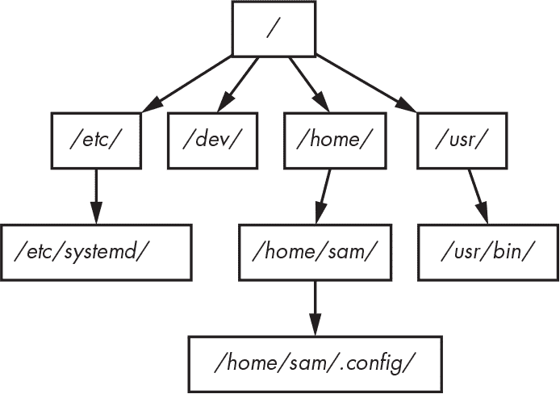
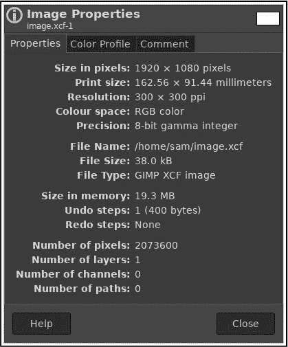
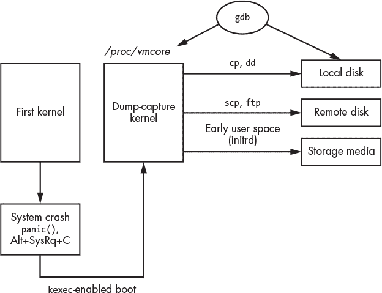

# 第四章：**Linux 文件的目录布局与法医分析**


上一章描述了存储和文件系统的法医分析，这些是创建层次文件树幻象的低级构建模块。本章重点讨论该文件树的布局，详细查看各个文件，并识别数字法医检查员感兴趣的特定区域。

### Linux 目录布局

在对 Linux 系统进行法医检查时，了解磁盘上文件和目录的组织结构可以帮助调查员快速定位感兴趣的区域和证据，忽略那些不太可能包含证据的区域。

Linux 采用了传统 Unix 的树状结构，从 *根* 目录开始，根目录由正斜杠（/）表示。额外的文件系统可以通过挂载（mount）附加到树中任何子目录下，这些文件系统可以位于本地存储或远程网络服务器上。

原始的 Unix 系统将文件系统层次结构组织为不同的目录，用以区分可执行程序、共享库、配置文件、设备、文档、用户目录等内容。^(1) 如今，Linux 系统仍然使用那些目录的原始名称。

#### *文件系统层次结构*

这个层次树的顶部称为根目录，或者 */*（不要与根用户的主目录 */root/* 混淆）。所有的子目录、挂载的存储媒体、挂载的网络共享或其他挂载的虚拟文件系统都被附加到这个“倒立”的树下，如 图 4-1 所示。这个过程被称为 *挂载* 文件系统，而文件系统挂载的目录（通常为空）称为 *挂载点*。PC DOS 世界的区别在于，附加的文件系统（无论是本地的还是远程的）都是通过独立的驱动器字母（A:、B:、...、Z:）来表示的。



*图 4-1：文件系统树结构*

POSIX 和 Open Group UNIX 标准并未为 Unix 厂商定义一个详细的目录布局^(2)。Unix 系统和 Linux 发行版在 hier(7) 或 hier(5) 手册页中记录了它们的目录层次结构。Linux 社区开发了 *文件系统层次标准（FHS）*^(3)，以鼓励发行版之间采用统一的布局。现代的 Linux 系统也有一个 file-hierarchy(7) 手册页，其中包含与 systemd 相关的额外信息。本节其余部分将描述 Linux 中常用的各个顶级目录及其与法医分析的相关性。

##### /boot/ 和 efi/

*/boot/* 和 *efi/* 目录^(4) 包含用于启动系统的文件。启动配置（内核参数等）可以在这里找到。当前和之前的内核文件也可以在此找到，以及初始的 ramfs，它们可以被检查。在 EFI 系统中，EFI 分区（一个 FAT 文件系统）通常挂载在 */boot/* 目录内。应当检查任何非标准或非默认的文件，这些文件可能已经被添加到 */boot/* 和 *efi/* 目录中。第六章关于 Linux 系统初始化的取证分析会详细描述这些目录。

##### /etc

*/etc/* 目录是系统范围配置文件和其他数据的传统位置。大多数这些文件都是可以直接检查的纯文本文件。配置文件可能有一个对应的目录，使用 *.d* 扩展名，用于存放作为配置一部分的附加文件^(5)。这些文件的创建和修改时间戳可能在调查中非常有用，因为它们显示了特定配置文件何时被添加或更改。此外，用户在 */home/* 目录下的用户特定配置文件可能会覆盖系统范围的 */etc/* 文件。此处常常可以发现与发行版或软件默认设置不同的情况，这些偏差可能对取证有价值。发行版的默认文件副本有时会存放在 */usr/share/factory/etc/** 目录中，可以与 */etc/* 目录中的文件进行比较。当一些发行版对 */etc/* 中的配置文件进行升级时，可能会创建旧文件的备份副本，或者将新文件添加带有扩展名（例如 Arch 的 Pacman 使用 **.pacnew*）。本书中会更详细地解释 */etc/* 目录中的各种文件。

##### /srv

*/srv/* 目录用于服务器应用程序内容，例如 FTP 或 HTTP 文件。这个目录在检查时可以查看是否包含已发布或通过网络可访问的文件。许多发行版没有使用此目录，因此它可能是空的。

##### /tmp/

*/tmp/* 目录用于存储临时文件。根据发行版或系统配置，这些文件可能会定期删除或在启动时删除。在某些 Linux 发行版中，*/tmp/* 的内容可能会存储在 RAM 中，使用 tmpfs 虚拟内存文件系统。在取证镜像中，使用 tmpfs 挂载 */tmp/* 的系统可能会为空。有关系统如何管理临时文件的更多信息，请参见 systemd-tmpfiles(8) 手册页，关于虚拟内存文件系统的更多细节，请参见 tmpfs(5) 手册页。

##### /run/

*/run/* 目录是一个 tmpfs 挂载的目录，位于 RAM 中，在取证镜像中通常是空的。在运行中的系统中，这个目录包含运行时信息，如 PID 文件、锁文件、systemd 运行时配置等。可能会在日志或配置文件中发现对 */run/* 目录中文件和目录的引用。

##### /home/ 和 /root

*/home/* 目录是用户主目录的默认位置。用户的主目录包含该用户创建或下载的文件，包括配置文件、缓存、数据、文档、媒体、桌面内容以及其他该用户拥有的文件。*/etc/skel/* 目录（可能仅包含隐藏的“.”文件）包含新创建的 */home/* 目录的默认内容。root 用户的主目录通常是根文件系统中的 */root/*。这是故意这样设计的，以便即使 */home/* 没有挂载，root 仍然可以登录。这些主目录对于法医调查员来说非常重要，因为它们提供了关于系统人类用户的信息。如果法医镜像中的 */home/* 目录为空，可能意味着用户的主目录挂载自另一个文件系统或通过网络挂载。用户主目录的创建（出生）时间戳可能指示用户帐户首次添加的时间。第十章详细介绍了 */home/* 目录的内容。

##### /bin/, /sbin/, /usr/bin/, 和 /usr/sbin/

可执行程序的标准位置是 */bin/*、*/sbin/*、*/usr/bin/* 和 */usr/sbin/*。这些目录最初是为了区分不同组的程序：供用户、管理员、启动过程或单独挂载的文件系统使用。今天，*/bin/* 和 */sbin/* 通常会符号链接到 */usr/* 中相应的目录，有时 */bin/*、*/sbin/* 和 */usr/sbin/* 甚至会符号链接到一个包含所有程序的单一 */usr/bin/* 目录。在检查挂载到你自己 Linux 分析机上的可疑驱动器中的符号链接目录时要小心，这些符号链接可能指向你自己的目录，而非可疑驱动器。

##### /lib/ 和 /usr/lib/

*/lib/* 目录在今天的大多数 Linux 系统中通常是符号链接到 */usr/lib/*。该目录包含共享库代码（也适用于多个平台）、内核模块、编程环境的支持（头文件）等。*/lib/* 目录还包含许多软件包的默认配置文件。

##### /usr/

*/usr/* 目录包含系统大部分静态的只读数据。这包括二进制文件、库、文档等。大多数 Linux 系统会将 */bin/*、*/sbin/* 和 */lib/* 符号链接到 */usr/* 子目录中的相应目录。此处的文件，如果不是任何已安装包的一部分，可能具有法医调查意义，因为它们是在正常软件安装过程中之外添加的。这些文件可能是具有 root 权限的用户手动安装的文件，或者是恶意行为者放置的未授权文件。

##### /var/

*/var/* 目录包含变化中的系统数据（可变的），并且通常在重启后保持持久性。*/var/* 下面的子目录从取证的角度来看尤其有趣，因为它们包含日志、缓存、历史数据、持久化的临时文件、邮件和打印子系统等内容。本书的一个重要部分涉及 */var/* 目录中的文件和目录。

##### /dev/、/sys/ 和 /proc/

Linux 还有几个其他的 tmpfs 和伪文件系统，这些文件系统在系统运行时看起来包含文件，包括 */dev/*、*/sys/* 和 */proc/*。这些目录提供设备或内核数据结构的表示，但内容实际上并不存在于普通文件系统中。在检查取证镜像时，这些目录可能为空。有关更多详细信息，请参见 procfs(5) 和 sysfs(5) 手册页。

##### /media/

*/media/* 目录用于存放动态创建的挂载点，用于挂载外部可移动存储设备，如 CD-ROM 或 USB 驱动器。在检查取证镜像时，这个目录可能为空。日志、文件系统元数据或其他持久数据中的 */media/* 引用可能提供关于用户附加（挂载）外部存储设备的信息。

##### /opt/

*/opt/* 目录包含附加包，这些包通常按供应商名称或包名称分组。这些包可能会创建一个自包含的目录树来组织它们自己的文件（例如，*bin/*、*etc/* 和其他常见子目录）。

##### /lost+found/

每个文件系统的根目录下可能会存在一个 */lost+found/* 目录。如果运行文件系统修复（使用 `fsck` 命令），并且发现一个没有父目录的文件，那么该文件（有时称为 *孤儿文件*）将被放入 */lost+found/* 目录中，以便进行恢复。这些文件没有原始名称，因为包含文件名的目录未知或丢失。

##### ./ 和 ../

每个目录中都有两个隐藏的子目录（./ 和 ../）。单个点（.）表示当前目录，双点（..）表示父目录。在树的顶部，这两个文件也存在，并且都表示根目录（/）（并且具有相同的 inode 编号）。从低级文件系统的角度来看，这些点文件用于将目录与其父目录链接，创建出层级树的假象。

#### *用户主目录*

法医调查通常涉及对人类用户活动的分析（其中用户可能是受害者或嫌疑人）。Linux 系统上的所有用户都有一个主目录，在该目录中他们可以保存文件和文档、自定义环境、存储持久和缓存数据，并保留历史数据（例如浏览器 cookie、shell 历史或电子邮件）。用户的主目录包含大量潜在的证据，调查人员可以利用这些证据重建过去的事件和活动。用户主目录的位置在 */etc/passwd* 文件中定义，通常默认位于 */home/* 目录下，并以用户的用户名命名（例如，*/home/sam/*）。用户的主目录也可以用波浪号（`~`）简写，供命令行或文档中使用。

##### 隐藏点文件和 XDG 基础目录

通常的做法是将用户配置数据保存在以点（`.`）开头的隐藏文件和目录中，并且这些文件和目录的名称通常与被配置的程序相同。以下是一些常见的保存在主目录中隐藏文件里的信息示例：

***.bash_history*** 用户输入的 shell 命令历史

***.lesshst*** `less` 命令的搜索历史

***.viminfo*** 搜索和命令历史，以及 vim 编辑过的文件痕迹

***.wget-hsts*** `wget` 访问过的主机列表^(6)，带时间戳

***.forward*** 包含自动转发的电子邮件地址的文件

***.apvlvinfo*** 使用 apvlv PDF 查看器查看的 PDF 历史

对于更复杂的用户配置、缓存、历史和持久数据，某个应用程序可能会创建一个专用的隐藏目录，包含多个文件和子目录来组织数据。以下是一些例子：

***.ssh/*** 安全外壳配置、密钥和访问过的已知主机列表

***.gnupg/*** GPG 配置、密钥以及其他人添加的公钥

***.thunderbird/*** 电子邮件和日历账户，以及用于离线访问的同步电子邮件和日历内容

***.mozilla/*** Firefox 配置、cookie、书签、浏览历史和插件

***.zoom/*** Zoom 配置、日志、通话历史和共享数据

***.john/*** John the Ripper 密码破解历史和已发现的密码

***.ICAClient/*** Citrix 客户端配置、缓存、日志及其他数据

任何软件包的开发者都可以自由选择保存什么内容以及保存在哪里。虽然使用隐藏文件和目录来存储信息并不是必需的，但它已经成为一种常见的做法。

随着时间推移，典型用户的主目录中的点文件数量变得庞大，这促使了标准化的需求。前 X 桌面组（今天称为 [freedesktop.org](http://freedesktop.org)）创建了 *XDG 基目录规范* (*[`www.freedesktop.org/wiki/Specifications/basedir-spec/`](https://www.freedesktop.org/wiki/Specifications/basedir-spec/)*)，该规范定义了用于存储用户特定数据的标准位置。^7 该规范定义了操作系统和应用程序可以使用的环境变量和默认位置，而不是在用户的主目录中创建自己的专有文件和目录。这些位置环境变量和相关的默认位置是：

+   数据文件：`$XDG_DATA_HOME` 或默认的 *~/.local/share/*

+   配置文件：`$XDG_CONFIG_HOME` 或默认的 *~/.config/*

+   非必要的缓存数据：`$XDG_CACHE_HOME` 或默认的 *~/.cache*

+   运行时文件：`$XDG_RUNTIME_DIR` 或通常是 */run/user/*UID（其中 *UID* 是用户的数字 ID）

此外，规范定义了两个搜索变量，`$XDG_DATA_DIRS` 和 `$XDG_CONFIG_DIRS`，它们包含额外配置的路径（通常是为了包含系统范围的，或 Flatpak 和 snap 目录）。*/run/* 目录挂载在一个基于临时 RAM 文件系统（tmpfs）的文件系统上，因此用户的运行时文件仅在系统运行且用户已登录时存在。在检查法医镜像时，*/run/* 目录将为空。

##### 用户应用程序和系统信息的位置

在进行事后法医分析时，数据、配置和缓存目录包含了关于应用程序和系统组件的大量信息，这些信息与用户的活动有关。本书的其余部分会详细描述这些位置，但让我们来看一些示例。

将数据放置在 *~/.cache/* 目录中的程序预计这些数据可能会被删除。它被认为是“非必要的”，但会在时间上和跨登录会话与重启之间保持持久性。任何程序都可以在 *~/.cache/* 中创建文件或目录，用于存储出于性能和效率原因的数据。

以下是一些信息的示例以及可能保存它们的程序：

+   浏览器缓存 HTML、图片、JavaScript 和安全浏览信息

+   存在一个用于网页图标的单独目录

+   软件中心缓存文件列表、图片、评分和信息

+   一些邮件客户端存储缓存的电子邮件和日历

+   包管理器保存下载的软件包

+   程序存储缩略图、图片和专辑封面

+   窗口管理器和桌面环境保存会话信息和日志

+   一些程序将 *.cache* 作为自动保存打开文件的位置

+   临时屏幕截图数据

+   其他由程序为提高性能或效率而存储的缓存数据

*~/.cache/*目录存储可以重新下载、在本地生成或以其他方式恢复和重新创建的任何内容。这些文件包含关于系统和不同应用程序使用的信息。创建和修改时间戳可能有助于重建过去活动的时间线。

用户的*~/.config/*目录本应只包含配置数据，但许多应用程序开发人员也将其用于其他用途，如历史记录和缓存信息。*~/.config/*中的文件可能以**rc*结尾，或具有*.conf*、*.ini*、*.xml*、*.yaml*等配置格式的扩展名。此处找到的大多数文件是普通文本文件，可以使用任何文本编辑器或查看器轻松查看。

在某些情况下，配置信息存储在数据库中，需要提取。由于这是自由和开源的世界，通常会有工具和规范来帮助分析这些数据库。一些存储在*~/.config/*目录中的数据示例包括：

+   应用程序的常规配置（不包括数据）

+   桌面工件（垃圾、会话配置、自动启动和 dconf）

+   应用程序扩展和插件

+   包含唯一标识符和许可证数据的文件

+   一些浏览器的 Cookies

+   应用程序状态数据（首次运行、初始欢迎横幅）

+   用户账户和远程服务器的配置

+   通信应用程序（Wire、Jitsi）日志、持久性和缓存

+   在*mimeapps.list*文件中指定的默认应用程序

+   程序存储的任何其他任意配置数据

除了来自应用程序的常规配置数据外，*~/.config/*目录在搜索用户名、电子邮件地址和主机名方面也很有意思，这些信息可能表明远程连接和活动。在某些情况下，您还可以在用户配置文件中找到密码或密码哈希。

*~/.local/share/*目录用于存储应用程序积累或生成的持久数据。此处保存的数据示例包括：

+   发行版特定的配置

+   图形登录会话配置

+   桌面特定配置

+   桌面捆绑应用程序（阅读器、笔记、文件管理器等）

+   常见的共享缩略图

+   桌面回收站

+   一些浏览器的 Cookies

+   一些应用程序的日历和联系人数据库

+   最近使用的文件和位置（**.xbel*文件）

+   Snap 和 Flatpak 应用程序信息

+   KDE 的 Baloo 文件索引和搜索

+   GNOME 的跟踪文件索引和搜索

+   秘密钥匙环和密码钱包

+   剪贴板管理器数据

+   Xorg 日志

+   程序存储的任何其他持久数据

大多数发行版和应用程序开始遵循 XDG 规范，因此为取证调查人员提供了常见的感兴趣文物位置。然而，一些应用程序并没有正确地遵循 XDG 基础目录规范，或者根本没有遵循。这可能是历史原因、向后兼容性，或其他原因。Arch Linux 的维基维护了一个列表 (*[`wiki.archlinux.org/index.php/XDG_Base_Directory`](https://wiki.archlinux.org/index.php/XDG_Base_Directory)*)，列出了应用程序与 XDG 基础目录规范的兼容性。如你所见，每个应用程序都可以自由选择保存什么、如何保存以及保存在哪里。即使在不同的桌面环境和发行版之间，只有 XDG 基础目录是统一的，但这也不是强制性的要求。在分析用户的主目录时，务必检查 */home/* 和 XDG 基础目录中的每个隐藏文件和目录。

独立于应用程序，XDG 标准建议在用户的 */home/* 目录中，根据类别存储用户文件的常见目录列表。这些目录在 */etc/xdg/user-dirs.defaults* 中定义，如果这些目录不存在，它们可能会在登录时创建：

+   *Desktop/*

+   *Downloads/*

+   *模板/*

+   *Public/*

+   *Documents/*

+   *Music/*

+   *Pictures/*

+   *Videos/*

*Desktop/* 目录用于存放将在用户桌面上显示的文件，*Downloads/* 目录是应用程序保存下载文件的默认位置。应用程序（如办公套件）引用 *Templates/* 目录，在用户创建新文档时建议模板文件。*Public/* 目录可以作为其他用户（通常在本地局域网内）访问文件的开放共享。其余目录不言自明，相关应用程序可以使用这些目录作为存储文档和媒体文件的默认位置。

这些目录名称根据本地语言的设置而创建。例如，在我的德语测试系统上，以下文件夹对应英文名称：*Schreibtisch/*，*Vorlagen/*，*Downloads/*，*Öffentlich/*，*Dokumente/*，*Musik/*，*Bilder/*，和 *Videos/*。

*~/下载/* 目录可能值得分析。当一些浏览器开始下载文件时，它们会创建一个临时文件，然后在下载完成后将其移动到正确的文件名（Firefox 使用 **.part* 作为临时文件）。这意味着出生时间戳（`crtime`）表示下载开始的时间，而内容的最后修改时间戳（`mtime`）表示下载完成的时间。因为我们知道文件的大小，我们甚至可以计算出当时通过网络连接下载的近似速度。

这里，一个 7GB 的 DVD 下载从 8:51 开始，9:12 完成：

```
$ stat ~/Downloads/rhel-8.1-x86_64-dvd.iso
...
  Size: 7851737088Blocks: 15335432  IO Block: 4096  regular file
...
Modify: 2020-03-26 09:12:47.604143584 +0100
...
Birth: 2020-03-26 08:51:10.849591860 +0100
```

知道文件下载的开始和结束时间在取证调查中可能非常有用，特别是在重建用户活动时间线时。

本书并不专注于 Linux 应用分析，因此这些示例简短且不完整。某些文件和目录（例如*.ssh*和*.gnupg*）在本书的其他地方有更详细的介绍。此处展示的其他示例说明了存储在 Linux 系统上的应用数据的常用位置和内容。有关单个应用程序的取证分析技巧的良好信息来源包括《法医科学国际》期刊的*数字调查*，DFRWS 大会和*[`www.ForensicFocus.com/`](https://www.ForensicFocus.com/)*。

#### *Linux 的哈希集和 NSRL*

数字取证中常用的一种识别文件的方法是使用加密哈希值（MD5、SHA-1 等）来创建唯一的指纹或签名。你可以从软件包或其他已知的文件集合中创建加密哈希值列表。这些已知文件哈希值的列表被称为*哈希集*或*哈希数据库*。在数字取证中，哈希集通常用于忽略无关文件或识别特别重要的文件。

在用哈希集忽略无关文件时，可以减少需要检查的文件数量。例如，如果调查人员只对创建、修改或下载的文件感兴趣，而不涉及操作系统的安装文件，他们可以使用哈希集过滤掉已知属于该操作系统的文件。在取证分析中，通常会忽略的已知文件示例包括：

+   操作系统及其所有支持文件

+   设备驱动程序

+   应用软件

+   公司生成的标准服务器或客户端安装的哈希集

哈希集只识别文件的内容，而不是文件系统上已安装文件的元数据。时间戳、权限、所有权等是文件系统的一部分，不包括在哈希集中。

在识别特别重要的文件时，调查人员使用哈希集来搜索取证磁盘镜像中是否存在这些文件。例如，如果调查人员有一份涉及某个特定网络攻击的文件哈希列表，他们可以专门搜索受影响的机器是否存在这些文件。在取证分析中，通常需要关注的已知文件包括：

+   妥协指示器（IOCs），可能包括恶意软件组件的哈希值

+   某些分类的软件（例如键盘记录器或比特币挖矿程序）

+   已知的非法材料（这些哈希集通常仅供执法机关使用）

+   在企业环境中已知的泄露或敏感文件

哈希集还用于通过将安装的文件与预期的供应商提供的哈希值进行比较，来查找修改过的或植入木马的二进制可执行文件。

你可以在多个地方找到已知文件的哈希集。安全社区经常分享 IOC 和安全相关的哈希集，网络安全公司将其作为威胁情报数据流出售。执法机构分享非法材料的哈希集，这些哈希集仅供其他警方取证实验室使用。大型公司可能会创建内部开发的软件包或标准服务器/客户端安装的哈希集。

NIST 维护国家软件参考库（NSRL），^(8)这是一个已知软件包的集合。NIST 提供 NSRL 哈希集的免费下载 (*[`www.nsrl.nist.gov/`](http://www.nsrl.nist.gov/)*)。NSRL 哈希集是一个压缩文件列表，包含哈希值、文件名、产品和其他信息；例如：

```
"000C89BD70552E6C782A4754536778B027764E14","0D3DD34D8302ADE18EC8152A32A4D934",
"7A810F52","gnome-print-devel-0.25-9.i386.rpm",244527,2317,"Linux",""
...
"001A5E31B73C8FA39EFC67179C7D5FA5210F32D8","49A2465EDC058C975C0546E7DA07CEE",
"E93AF649","CNN01B9X.GPD",83533,8762,"Vista",""
```

NSRL 数据集的格式定义见 *[`www.nist.gov/system/files/data-formats-of-the-nsrl-reference-data-set-16.pdf/`](https://www.nist.gov/system/files/data-formats-of-the-nsrl-reference-data-set-16.pdf/)*。

哈希集也作为商业产品提供。这些通常包括 NSRL 哈希集、可以从商业产品中提取的额外哈希（未包含在 NSRL 中）以及其他来源。一个流行的例子是 *[`www.hashsets.com/`](https://www.hashsets.com/)*，它提供增补 NSRL 数据的哈希集订阅。

大多数数字取证软件（包括像 Autopsy 和 The Sleuth Kit 这样的免费开源工具）支持在分析中包含和排除哈希集。

维护 Linux 系统和自由及开源软件（FOSS）的一致性哈希集会带来一些困难。以下是几个例子：

+   类似 Arch Linux 这样的滚动发行版会每天更新。

+   有些软件包是从源代码编译的，可能会生成仅与安装系统相关的文件。

+   有些软件运行安装脚本，这些脚本可能会生成仅与安装系统相关的文件。

+   许多不同的 Linux 发行版提供自己的软件仓库，这些仓库不断变化和更新（请参见 *[`distrowatch.com/`](https://distrowatch.com/)*）。

+   Linux 用户可能直接从开发者处下载软件，然后手动编译和安装到他们自己的系统中。

这种动态的变化和开发环境使得维护哈希集变得更加困难。相比之下，商业软件供应商有明确的软件发布周期和产品包。

大多数开源软件开发者提供源代码的哈希值或 GPG 签名以验证完整性。但这些哈希值是针对源代码的，而不是编译后的二进制文件。大多数 Linux 发行版会提供已编译的二进制软件包的哈希值或 GPG 签名，甚至有些会包含每个单独文件的哈希值（请参见第七章有关软件安装的更多信息）。

### Linux 文件类型和识别

*文件类型* 这个词组有两种含义。在低层文件系统的上下文中，它指的是 Unix 或 POSIX 文件类型。在高层应用的上下文中，它指的是文件内容类型。在进行取证检查时，理解这个区别非常重要。此外，“隐藏”文件（通常只是普通文件，并非真正隐藏）可以为调查提供重要信息。

#### *POSIX 文件类型*

Linux 是按照 Unix 的“凡事皆文件”哲学开发的。为了实现这一概念，需要特殊的文件类型来扩展功能，超越普通文件和目录。Linux 采纳了 POSIX 标准定义的七种基本文件类型，允许将特殊对象表示为文件。这些文件类型包括：

+   普通文件

+   目录

+   符号链接

+   命名管道或 FIFO

+   块特殊文件

+   字符特殊文件

+   套接字

在 Linux 系统中，每个“文件”都被分类为这些类型之一，可以通过 `ls -l` 或 `file` 命令（以及其他命令）来确定。理解这些文件类型之间的区别对取证调查人员来说非常重要，因为并非所有文件都与数据存储有关（并可能包含证据）。有些文件提供对硬件设备的访问，或促进程序之间数据的流动。理解这一系统行为有助于重构过去的事件，并定位存储在其他位置的潜在证据。让我们更详细地看看这七种文件类型：

**普通文件** 普通文件就是字面意思：一个包含数据的文件，如文本、图片、视频、办公文档、可执行程序、数据库、加密数据或任何其他通常存储在文件中的内容。普通文件中的数据存储在存储介质的文件系统块中。

**目录文件** 这些是特殊的文件，包含目录内容的列表，包括文件名及其对应的 inode。它们允许文件和目录以树形结构进行层次化组织。然而，这只是一个抽象，因为在低层次上，文件块可以位于驱动器的任何位置。目录也叫做文件夹，通常通过 `mkdir` 等命令创建。

**符号链接** 这种类型的文件表示指向另一个文件的指针（类似于 Windows 中的 LNK 文件，但没有附加的元数据）。符号链接是一个小文件，包含另一个文件的路径和名称（根据文件系统的不同，这些信息可能存储在链接的 inode 中）。符号链接文件的大小与它指向的文件名的长度相同。符号链接允许指向不存在的文件，从取证的角度来看这可能很有趣。这表明某个文件曾经存在过，或曾经在一个挂载的文件系统中。符号链接也叫做 symlink，可以通过 `ln -s` 命令创建。

**字符设备和块设备特殊文件** 这些文件通过设备驱动程序或内核模块提供对硬件设备（和伪设备）的访问。它们通常位于*/dev/*目录中。现代 Linux 系统会动态创建和删除这些文件，但也可以通过`mknod`命令手动创建。块设备通常用于访问存储介质，可以进行缓冲、缓存或其他抽象。字符设备和块设备特殊文件都通过在设备文件创建时指定的主设备号和次设备号与设备关联。使用`ls -l`或`stat`命令可以识别主设备号和次设备号。要查看运行中的 Linux 系统分配的主设备号和次设备号，可以查看*/sys/dev/block/*和*/sys/dev/char/*目录。可以使用`lsblk`命令列出块设备。字符或块文件的文件大小为零字节。

**命名管道或 FIFO** 这些文件提供单向的进程间通信，允许两个程序之间的数据传输。一个程序写入管道，可以将数据传输到另一个正在从同一管道读取的程序。`mkfifo`或`mknod`命令用于创建管道。管道的文件大小为零字节。

**套接字文件** 这些文件也提供进程间通信，具有双向功能，多个程序可以同时使用它们。它们通常由提供本地服务的守护进程创建（而不是使用 TCP/IP 套接字），并在退出时被删除。套接字文件也可以通过 systemd 套接字激活来创建。

为什么硬链接不在这个文件类型列表中？硬链接不被视为一种文件类型。*硬链接* 只是与现有 inode（inode 代表实际文件，如第三章所述）关联的附加文件名。

*稀疏文件* 本身并不是一种文件类型，而是文件系统的一项特性，允许包含连续零序列的常规文件以紧凑的形式写入磁盘。

在进行死后取证分析时，检查不同的文件类型时，请注意以下几点：

+   块设备和字符设备特殊文件会在系统运行时动态创建（和删除），这些文件位于*/dev/*或*/sys/*目录下。在进行取证检查时，这些目录可能是空的。

+   命名管道（FIFO）和套接字不会包含任何数据（写入它们的任何内容都将被另一个运行中的进程接收）。程序或守护进程退出时，也可以将管道或套接字文件从文件系统中删除。

+   符号链接不要求指向一个已存在的文件。链接文件将包含一个文件名，但它指向的文件可能存在，也可能不存在。

**注意**

*如果你有一个直接挂载到 Linux 分析工作站的可疑 Linux 系统的取证镜像，分析中的驱动器上的符号链接可能指向你自己分析机器上的文件和目录*。确保你始终分析的是预定的文件系统。*

#### *魔术字符串和文件扩展名*

POSIX 中对*常规文件*的定义是指文件系统中的一种文件类型，但该常规文件的内容可以是文本、图片、视频、办公文档、可执行程序、数据库、加密文件或任何其他内容。文件内容也被称为文件类型，但这是在应用层面上的。识别常规文件的应用文件类型有多种方法。本节中使用的*文件类型*一词指的是应用文件类型，而非 POSIX 文件类型。

*魔术字符串*、*魔术类型*、*魔术签名*或*魔术字节*这些术语都指的是文件开头的一串字节。Linux shell 和文件管理器使用魔术字符串来识别文件类型，并选择哪个程序来运行该文件。这些字符串通常是文件格式的一部分，很难恶意修改或移除而不破坏功能。你可以使用 Linux 的 `file` 命令来确定文件类型（`file -l` 列出大约 3,000 种支持的类型）。取证挖掘工具也使用魔术字符串来帮助识别可以从非结构化数据中提取的文件。有关魔术字符串和 Linux 的更多信息，请参阅 file(1) 和 magic(5) 手册页。更多关于取证挖掘的信息，请参见 第三章。

文件扩展名通常用于指示文件的内容。例如，文件名以*.pdf*、*.docx* 或 *.odt* 结尾的文件很可能是办公文档，而以*.jpg*、*.png* 或 *.gif* 结尾的文件可能是图片，等等。应用程序使用这些文件扩展名来决定如何打开特定的文件。例如，电子邮件客户端使用它们来打开附件，网页浏览器用于下载，文件管理器用于文件打开请求，等等。文件扩展名的简便性有时被滥用，通过更改文件扩展名来隐藏文件内容。例如，恶意软件可能试图隐藏可执行文件，企业数据盗窃可能涉及尝试隐藏办公文档，而持有非法材料的人可能会尝试隐藏媒体文件的存在。尽管使用现代取证软件可以轻松检测到这一点，但它仍然是常见的现象。

与 Windows 环境不同，在 Linux 中，一个文件有多个扩展名是常见的，这通常表示对文件（或一组文件）进行了多个操作。例如，*files.tar.gz* 表示一个已被压缩（扩展名为*.gz*）的归档文件（扩展名为*.tar*）。另一个例子，*files.tar.gz.md5* 表示一个包含已压缩归档文件 MD5 哈希值的文件。在检查 Linux 环境时，数字取证软件必须了解如何处理具有多个扩展名的文件。

#### *隐藏文件*

Linux 使用 Unix 命名约定来处理隐藏文件。隐藏文件只是以点（.）开头的正常文件或目录名。以点开头的文件告知程序，它们不需要在目录列表中显示该文件。使用初始点来隐藏文件的做法有点偶然。早期版本的`ls`命令被编写成忽略“.”和“..”目录文件，但最终忽略了任何以点开头的文件。从那时起，开发者便开始使用它来隐藏一些通常用户不需要看到的配置文件。

使用点（.）作为文件名前缀来隐藏文件并不是真正的隐藏。隐藏机制不是像内核或文件系统标志这样的技术手段。这只是一个命名惯例，程序和应用程序可能会使用它（如果它们愿意）来过滤文件的显示。大多数程序，特别是文件管理器，都提供了显示隐藏文件的选项。在使用取证工具进行分析时，隐藏文件表现为正常文件（因为它们本来就是正常文件）。你无需采取额外步骤来“取消隐藏”它们。试图通过将点放在不寻常的位置来隐藏文件和目录，可能表明有可疑活动。

另一种隐藏文件的方法是通过打开文件然后删除它而不关闭。这样会删除文件名的目录条目（即文件被解除链接），但 inode 会一直保持分配状态，直到文件被关闭。这种文件隐藏方法不会在重启后持续有效，也不会在持有文件打开的进程崩溃时有效。文件系统取证工具应能找到没有文件名的 inode（例如，Sleuth Kit 的`ils -O`或`-p`）。

恶意代码有可能隐藏文件。像`ls`这样的程序的木马版本可以被修补，以防显示某些文件名或目录。恶意的内核模块或 rootkit 也可以拦截文件操作，防止查看或访问特定文件。内核模块 rootkit 还可以隐藏进程、套接字以及内核模块本身（可以在 GitHub 或其他公共源代码库上搜索 Linux rootkit）。

文件的简单隐藏也可以通过文件系统权限实现。通过将文件放置在只读的目录中，可以将其隐藏不让其他用户访问。没有读取权限的用户将无法读取该目录的内容，从而有效地将文件名隐藏起来。

使用木马二进制文件、rootkit 或文件系统权限来隐藏文件，仅在运行中的系统上有效。在进行离线死后取证分析时，这些文件应该呈现为正常文件，而不会被隐藏。此外，了解哪些用户曾访问过文件和目录可能对调查非常重要。

关于文件隐藏的部分至少应该提到*隐写术*。有多种工具可用于使用隐写术隐藏文件，其中许多工具可以在 Linux 下编译并运行。由于这些工具并不特定于 Linux 系统，因此它们超出了本书的讨论范围。

### Linux 文件分析

分析 Linux 系统上的文件内容通常比在更封闭的环境中更容易。文件格式通常是开放的并且文档完善。许多文件，特别是配置文件，都是简单的 ASCII 文本文件。极少有文件格式是 Linux 专有的。

#### *应用程序元数据*

在数字取证中，文件元数据可以指代存储在文件系统 inode 中的元数据，也可以指代存储在文件内容中的元数据。本节重点讨论后者。

在 Linux 系统上找到的应用程序的元数据通常比在封闭环境中找到的更容易分析。常见的开放文件格式文档完善，取证工具也对其支持良好。运行在 Linux 系统上的应用程序（以及一般的自由开源软件）使用的文件可分为几类：

+   开放标准（例如，JPEG 图像）

+   专有格式，但被开源开发者逆向工程（例如，许多 Microsoft 文件格式）

+   由开源应用程序开发者定义，但特定于该应用程序（一个很好的例子是 GIMP 的 XCF 文件格式）

+   特定于 Linux 发行版（例如，Red Hat 的 RPM 软件包文件）

+   特定于常见的 Linux 系统组件（例如，systemd 的日志格式）

开源和 Linux 特定格式在 Linux 取证中尤为重要。

从 Linux 特定的文件中提取元数据可能需要使用 Linux 分析机器来获得最佳结果（即使商业取证工具声称支持该功能）。通常，Linux 软件包会包含用于故障排除、修复、数据提取、转换和查询的工具。你可以使用这些工具（通常是简单的命令行工具）来提取元数据和内容。要找到使用 Linux 工具显示文件元数据的方法，最好的信息来源是该工具的 man 页。

在许多情况下，你还可以使用应用程序本身（在文件的只读副本上）来检查元数据。例如，图 4-2 展示了一个 GIMP 对话框，显示了 XCF 文件的元数据。



*图 4-2：GIMP 对话框显示 XCF 文件的元数据*

像 GitHub 或 GitLab 这样的源代码仓库通常提供一些小工具，用于从开放格式中提取元数据。这些工具可能是由学生、爱好者、专业程序员，甚至公司编写的。它们可能提供准确或不准确的结果，我建议将结果与其他类似工具进行比较。

如果其他方法都失败了，查看应用程序的源代码可能会有所帮助。文件格式可能在头文件或随源代码软件包提供的文档中有所说明。例如，查看*/usr/include/*.h*的内容，你将会发现许多文件格式（其中还有其他内容）。了解文件格式的数据结构可以帮助你编写工具，或者可能使用十六进制编辑器从特定文件中提取或解码元数据。

#### *内容分析*

如前节所述，在 Linux 环境中找到的文件往往是开放的并且有详细文档说明。因此，可以很容易地编写工具来检查文件内容。通常，你可以使用为数据恢复、数据导出或转换为其他格式开发的工具，或者使用简单的文件读取器来检查文件内容。

如果文件格式未知，可以使用 `file` 命令尝试识别文件内容。如果没有专门用于该文件的工具，可以尝试使用 `strings` 命令提取文件中包含的人类可读字符字符串。有关更多信息，请参见 file(1) 和 strings(1) 手册页。

从文件中提取内容的另一种可能性，特别是复合文件（包含其他嵌入文件），是使用标准的取证切割工具。这些工具可能会提取出对调查人员有用的文件或文件片段。

在 Linux 系统上找到的一些文件是备份或归档文件。传统的（但仍然常见）示例包括 *tar*、*cpio* 和 *dump*。一些更现代的 Linux 备份解决方案包括 *duplicity* 和 *timeshift*。常见的 Linux 企业备份系统有 Bacula 和 Amanda。本书的范围不包括备份解决方案的法医分析。然而，备份可以是一个很好的证据来源，甚至备份索引数据库也会包含过去备份的文件名和目录列表，通常还会附带时间戳（例如，tar 增量备份使用 *.snar* 文件）。

解密文件的内容始终是数字取证调查人员面临的挑战。即使加密格式是开放的并且有文档说明，数据仍然无法访问，除非恢复加密密钥。你在 Linux 系统中可能遇到的一些加密文件格式包括：

+   使用 GnuPG 加密的电子邮件

+   应用程序内建的加密（办公文档：PDF、DOC 等）

+   GnuPG 加密的文件

+   加密的 ZIP 文件

+   类似 Veracrypt 的加密文件容器

在大多数情况下，Linux 系统上本地文件将具有可识别和已文档化的格式，提供查看元数据的工具，以及用于查看或提取其内容的工具。专有文件格式可能有开源工具，但这些通常是通过志愿者的反向工程最佳努力得到的。

#### *可执行文件*

当高级编程代码（人类可读）被编译为机器代码（CPU 可读）时，它会以 *可执行* 文件格式存储（操作系统可读）。这种格式为操作系统提供了加载代码到内存、设置各种内容（如与其他代码库的动态链接）并运行程序所需的所有信息。Linux 使用从 Unix 获取的 *可执行与可链接格式（ELF）* 文件。ELF 可执行文件可以通过前四个字节中的魔法字符串来识别：

```
7F 45 4C 46  .ELF
```

有多种工具可以提供关于 Linux 系统中 ELF 文件的信息。`file`命令提供了可执行文件的基本摘要：

```
$ file /bin/mplayer
/bin/mplayer: ELF 64-bit LSB pie executable, x86-64, version 1
(SYSV), dynamically linked, interpreter /lib64/ld-linux-x86-64.so.2,
BuildID[sha1]=d216175c8528f418051d5d8fb1196f322b461ef2,
for GNU/Linux 3.2.0, stripped
```

在取证工作中，分析可执行文件时存在几个感兴趣的领域。在恶意软件的情况下，没有源代码可用，必须对可执行文件进行反向工程，以准确理解其功能。此过程涉及将二进制文件反汇编和反编译为人类可读的代码，这种方法称为*静态分析*。另一种方法称为*动态分析*，涉及在带有调试和跟踪工具的沙盒中运行代码，以理解实时行为。在传统的计算机取证调查（非恶意软件）中，重点是来自可执行文件的元数据。反向工程可执行文件超出了本书的范围，但本节探讨了对调查有用的元数据。

一些可执行格式（如 MS-Windows PE/COFF）在文件中嵌入了一个时间戳，指示二进制文件构建的时间。ELF 格式不定义构建时间戳，但使用 GCC 编译的 Linux 可执行文件包含一个称为*构建 ID*（可选，但默认）的唯一标识符。构建 ID 是可执行文件中部分代码的 SHA-1 哈希，大多数 ELF 分析工具可以提取它。`file`命令（如前面的示例所示）显示了`build-id`（`BuildID[sha1]=`），而`readelf`命令可以显示它，如下所示：

```
$ readelf -n /bin/mplayer

Displaying notes found in: .note.gnu.build-id
  Owner                Data size Description
  GNU                  0x00000014NT_GNU_BUILD_ID (unique build ID bitstring)
    Build ID: d216175c8528f418051d5d8fb1196f322b461ef2
...
```

此 ID 对于编译代码版本和构建环境是唯一的，但在分析构建 ID 时，请注意以下内容：

+   无论是否剥离了二进制文件（删除了符号信息），构建 ID 都将相同。

+   它在不同机器上并不总是唯一。两个相同版本的 Linux 安装编译相同版本的代码可能生成相同的构建 ID。

+   可以删除此字符串或恶意修改它，并且没有有效性检查。

+   在一个中央位置编译然后复制到多台机器的可执行文件将具有相同的构建 ID。

在某些情况下，此构建 ID 对于链接在多台计算机上找到的可执行文件可能会有用，但在其他情况下，它可能没有或者价值不大。

其他工具（如`pax-utils`包中的`dumpelf`，`objdump`和`readelf`）提供关于 ELF 可执行文件内部结构的信息，包括文件的不同头部和部分。`objdump`的`-d`命令还提供了机器代码的反汇编输出。

知道在运行时动态链接到可执行文件中的其他文件是对调查人员也很有趣。通常可以使用`ldd`命令来检查，如下所示：

```
$ ldd /bin/mplayer
    linux-vdso.so.1 (0x00007fffe56c9000)
    libncursesw.so.6 => /usr/lib/libncursesw.so.6 (0x00007f111253e000)
    libsmbclient.so.0 => /usr/lib/libsmbclient.so.0 (0x00007f1112514000)
    libpng16.so.16 => /usr/lib/libpng16.so.16 (0x00007f11124dc000)
    libz.so.1 => /usr/lib/libz.so.1 (0x00007f11124c2000)
    libmng.so.2 => /usr/lib/libmng.so.2 (0x00007f1112252000)
    libjpeg.so.8 => /usr/lib/libjpeg.so.8 (0x00007f11121bb000)
    libgif.so.7 => /usr/lib/libgif.so.7 (0x00007f11121ae000)
    libasound.so.2 => /usr/lib/libasound.so.2 (0x00007f11120d3000)
...
```

但是，如果您正在分析可疑文件（可能是恶意软件），不建议使用`ldd`。man 页面明确指出“绝不能对不受信任的可执行文件使用`ldd`，因为这可能导致执行任意代码。”查找所需的共享对象的安全替代方法是`objdump`工具，如下所示：

```
$ objdump -p /bin/mplayer |grep NEEDED
  NEEDED           libncursesw.so.6
  NEEDED           libsmbclient.so.0
  NEEDED           libpng16.so.16
  NEEDED           libz.so.1
  NEEDED           libmng.so.2
  NEEDED           libjpeg.so.8
  NEEDED           libgif.so.7
  NEEDED           libasound.so.2
...
```

这里展示的示例来自流行的 64 位 x86（Intel/AMD）架构，但 Linux 内核支持多达几十种不同的 CPU 架构。在计算的最顶端（大型主机和超级计算机）和最低端（树莓派和物联网嵌入式系统）使用的其他 CPU 可能差异很大。以下是树莓派的一个示例`file`输出：

```
$ file /usr/bin/mplayer
/usr/bin/mplayer: ELF 32-bit LSB executable, ARM, EABI5 version 1 (SYSV),
dynamically linked, interpreter /lib/ld-linux-armhf.so.3, for GNU/Linux 3.2.0,
BuildID[sha1]=bef918434bc5966b5bd7002c028773d3fc7d3c67, stripped
```

Linux 架构可以是 32 位或 64 位、大端或小端，并且支持多种 CPU 指令集（如 x86、ARM、PPC、Sparc 等）。了解架构对于使用法医工具至关重要。除非工具能够自动检测这些架构特征，否则可能需要手动告知工具这些特征，以便生成合理且准确的结果。

### 崩溃与核心转储

计算机会崩溃，软件会崩溃。通常这些事件令人不安，特别是当数据丢失时。但对于法医检查员而言，这些事件可能是好事，因为崩溃过程中，易失性内存数据可能会被保留。崩溃的内核、崩溃的进程以及保存到本地磁盘的其他应用程序崩溃数据可能具有潜在的法医价值。

当计算机或程序崩溃时，它们可能会尝试将崩溃数据保存到本地磁盘，以便程序员进行调试分析。在某些情况下，这些文件甚至会被上传到开发者的服务器进行分析。这些崩溃数据文件中保存的某些信息可能包含对调查有用的法医痕迹。

内核崩溃、进程崩溃以及更高层次的应用程序和发行版特定崩溃使用不同的处理机制。在这些情况下，与法医调查相关的数据可能会被保存。

内存转储的法医分析可能指的是从内存转储文件中恢复内容信息的痕迹，或者理解代码执行和转储的原因。理解代码执行通常用于恶意软件分析和技术利用（如栈溢出、缓冲区溢出等）。分析此类攻击涉及静态和动态代码分析、逆向工程、反编译和反汇编。此类分析需要深入了解 C 语言、汇编语言和 Linux 内存管理。所有这些概念都超出了本书的范围（事实上，这个话题本身就足以填满一本书）。在这里，我们将探讨内存转储的表面分析和基本字符串信息的提取。

#### *进程核心转储*

当 Linux 程序执行时，进程驻留在内存中并一直运行，直到完成、因信号（kill）终止或崩溃。当进程崩溃时，系统可以被配置为将内存映像或核心文件保存到磁盘以供调试使用。这被称为*核心转储*或*转储核心*。让我们来看一下如何在法医上下文中查找核心文件并进行检查。

传统上，崩溃进程的保存核心文件会写入一个名为 core 或*core.*PID 的文件，其中*PID*是数字进程 ID。后来的内核使用模板来创建*core.**文件名。这些核心文件被保存在它们崩溃时所在的同一目录（如果该目录可写），并且属于崩溃进程的用户 ID。你可以通过在文件系统中搜索所有名为*core*、*core.*PID 或*core.**（如果使用了模板）的文件，来找到系统的核心文件。有关核心文件和模板的更多信息，请参阅 core(5)手册页。

如果由 systemd 管理，可能需要安装单独的`systemd-coredump`包，核心文件将保存到一个单一的目录*/var/lib/systemd/coredump/*。在这里，核心转储被发送到`systemd-coredump`程序，该程序将其记录在日志中并保存核心文件（参见 systemd-coredump(8)手册页）。你可以使用`coredumpctl`命令列出在嫌疑机器的日志中找到的 systemd 核心转储。更多信息请参见 coredumpctl(1)和 coredump.conf(5)手册页。

以下示例显示了来自离线日志文件的一行核心转储日志：

```
$ coredumpctl --file user-1000.journal
TIME                      PID  UID  GID SIG COREFILE EXE
...
Thu 2020-11-12 13:36:48 CET ➊ 157004   1000 1000 11 ➋ present  /usr/bin/mousepad
...
```

在这里，我们看到可用的（`present` ➋）核心转储的列表，包括时间和关于崩溃程序（`mousepad`）的信息，这些信息在本示例中使用。

通过指定此列表中某个特定崩溃的 PID（`157004` ➊），我们可以查看更多信息和回溯：

```
  $ coredumpctl info 157004 --file user-1000.journal
           PID: 157004 (mousepad)
           UID: 1000 (sam)
           GID: 1000 (sam)
        Signal: 11 (SEGV)
     Timestamp: Thu 2020-11-12 13:36:48 CET (4 days ago)
  Command Line: mousepad
    Executable: /usr/bin/mousepad ➊ 
 Control Group: /user.slice/user-1000.slice/session-3.scope
          Unit: session-3.scope
         Slice: user-1000.slice
       Session: 3
     Owner UID: 1000 (sam)
       Boot ID: 3813c142df4b494fb95aaed7f2f6fab3
    Machine ID: 9ea4c1fdd84f44b2b4cbf3dcf6aee195
      Hostname: pc1
       Storage: /var/lib/systemd/coredump/core.mousepad.1000.
3813c142df4b494fb95aaed7f2f6fab3.157004.1605184608000000.zst ➋ 
       Message: Process 157004 (mousepad) of user 1000 dumped core.

                Stack trace of thread 157004:
                #0 0x00007fca48c0746f __poll (libc.so.6 + 0xf546f)
                #1 0x00007fca48da375f n/a (libglib-2.0.so.0 + 0xa675f)
                #2 0x00007fca48d4ee63 g_main_loop_run (libglib-2.0.so.0 + 0x51e63)
                #3 0x00007fca493944ff gtk_main (libgtk-3.so.0 + 0x1e14ff)
                #4 0x0000564f2caff1a2 n/a (mousepad + 0x111a2)
                #5 0x00007fca48b3a152 __libc_start_main (libc.so.6 + 0x28152)
                #6 0x0000564f2caff39e n/a (mousepad + 0x1139e)
...
```

在这个示例中，`mousepad`应用程序 ➊（一个图形化文本编辑器）发生了核心转储，`systemd-coredump`记录了输出并保存了核心文件 ➋。

核心文件被保存到*/var/lib/systemd/coredump/*目录，并可以被复制到法医分析机。文件名以`core.`开头，后面跟着程序名（`mousepad`）、数字用户 ID（`1000`）、启动 ID、PID、时间戳，最后是一个扩展名，表示所用的压缩格式：

```
core.mousepad.1000.3813c142df4b494fb95aaed7f2f6fab3.157004.1605184608000000.zst
```

根据发行版或配置，压缩格式可能是*zst*、*lz4*，或者其他 systemd 支持的算法。

你可以使用像`zstdcat`或`lz4cat`这样的工具解压核心文件的内容。以下是一个示例的 Shell 管道，其中核心文件被解压，并且字符串被提取到分页器中以便手动分析：

```
$ zstdcat core.mousepad.1000.3813c142df4b494fb95aaed7f2f6fab3.157004.16051846
08000000.zst|strings|less
...
The file contains secret info!!!
...
SHELL=/bin/bash
SESSION_MANAGER=local/pc1:@/tmp/.ICE-unix/3055,unix/pc1:/tmp/.ICE-unix/3055
WINDOWID=123731982
COLORTERM=truecolor
...
```

这个`zstdcat`和字符串示例的输出包含了从核心转储中提取的所有人类可读字符串，包括环境变量，甚至是崩溃时在编辑器中输入的未保存文本。程序的核心转储将包含它在崩溃时内存中的所有数据。

像`bulk_extractor`这样的工具可以分析核心文件，寻找常见的搜索字符串，并且创建一个可能的密码字典，这些密码可能以不安全的方式存储在内存中。你可以使用这个字典配合密码恢复程序，尝试解密发现的任何加密文件。你还可以在解压后的核心转储中进行法医雕刻，寻找文件或文件碎片（图像、HTML 等）。

你还可以使用调试器，如 `gdb`，进一步分析可执行代码。

#### *应用程序和发行版特定的崩溃数据*

崩溃信息有助于开发人员调试和修复软件中的问题。崩溃报告系统（可以选择加入或退出）可以监控本地崩溃事件，并将数据发送到开发者服务器进行分析。

Linux 发行版可以有自己的系统崩溃报告机制。桌面环境可以有特定于其库工具包的崩溃报告，应用程序可以实现自己的崩溃报告机制。让我们看几个例子。

Fedora 和 Red Hat 发行版使用 `abrt`（自动化错误报告工具）。`abrtd` 守护进程监视崩溃事件并采取适当的行动，这可能包括通知用户或上传到发行版维护者管理的服务器。`abrt` 系统使用插件，能够监控多种类型的崩溃，如进程核心转储、Python、Java、Xorg 等。在法医检查期间，你可以检查几个目录，查找 `abrt` 处理的崩溃数据，如 */var/spool/abrt/*、*/var/spool/abrt-upload/* 和 */var/tmp/abrt/*。

输出内容根据崩溃信息的来源不同而有所不同。以下是存储在 */var/spool/abrt/* 中的核心转储崩溃数据示例：

```
# ls /var/spool/abrt/ccpp-2020-11-12-13\:53\:24.586354-1425/
abrt_version    dso_list         os_info          proc_pid_status
analyzer        environ          os_release       pwd
architecture    executable       package          reason
cgroup          hostname         pid              rootdir 
cmdline         journald_cursor  pkg_arch         runlevel
component       kernel           pkg_epoch        time
core_backtrace  last_occurrence  pkg_fingerprint  type
coredump        limits           pkg_name         uid
count           maps             pkg_release      username
cpuinfo         mountinfo        pkg_vendor       uuid
crash_function  open_fds         pkg_version
```

这些文件中的每一个都包含关于崩溃进程的一些信息，包括崩溃原因、打开的文件、环境变量和其他数据。`abrt` 系统是 `systemd-coredump` 的竞争者，作为核心转储处理程序。

`abrt` 的活动也会记录在 systemd 日志中：

```
Nov 12 13:53:25 pc1 abrt-notification[1393908]: Process 1425 (geoclue) crashed in __poll()
```

你可以在 */etc/abrt/** 目录中找到 abrt 系统的配置、操作和插件。更多细节，请参见 abrt(1) 和 abrtd(8) 手册页。abrt 系统有几个手册页，描述系统的各个部分（从 Fedora/Red Hat Linux shell 输入 apropos abrt 可查看列表）。权威的在线文档可以在 *[`abrt.readthedocs.io/en/latest/`](https://abrt.readthedocs.io/en/latest/)* 查阅。

基于 Ubuntu 的系统有一个名为 Whoopsie 的守护进程（将数据发送到名为 Daisy 的服务器）和一个名为 `apport` 的处理系统。`apport` 程序可以管理来自核心转储、Python、包管理器等的崩溃数据（更多信息，请参见 *[`wiki.ubuntu.com/Apport/`](https://wiki.ubuntu.com/Apport/)*）。

当进程崩溃时，核心转储被发送到 `apport` 程序，后者生成报告并将其保存在 */var/crash/* 中。`whoopsie` 守护进程监视此目录中的新崩溃数据。

在 Ubuntu 上，你可以在日志中以及专用日志文件 */var/log/apport.log* 中找到崩溃证据，如下所示：

```
$ cat /var/log/apport.log
ERROR: apport (pid 30944) Fri Nov 13 08:25:21 2020: called for pid 26501, signal 11,
 core limit 0, dump mode 1
ERROR: apport (pid 30944) Fri Nov 13 08:25:21 2020: executable: /usr/sbin/cups-browsed
 (command line "/usr/sbin/cups-browsed")
```

崩溃报告是一个位于 */var/crash/* 目录中的普通文本文件：

```
# cat /var/crash/_usr_sbin_cups-browsed.0.crash
ProblemType: Crash
Architecture: amd64
Date: Fri Nov 13 08:25:21 2020
DistroRelease: Ubuntu 18.04
ExecutablePath: /usr/sbin/cups-browsed
ExecutableTimestamp: 1557413338
ProcCmdline: /usr/sbin/cups-browsed
ProcCwd: /
ProcEnviron:
 LANG=en_US.UTF-8
 LC_ADDRESS=de_CH.UTF-8
 LC_IDENTIFICATION=de_CH.UTF-8
 LC_MEASUREMENT=de_CH.UTF-8
 LC_MONETARY=de_CH.UTF-8
 LC_NAME=de_CH.UTF-8
 LC_NUMERIC=de_CH.UTF-8
 LC_PAPER=de_CH.UTF-8
 LC_TELEPHONE=de_CH.UTF-8
 LC_TIME=de_CH.UTF-8
...
```

本报告包含有关崩溃的各种信息，包括 base64 编码的核心转储数据。一个唯一的标识符存储在*/var/lib/whoopsie/whoopsie-id*文件中。它是 BIOS DMI UUID 的 SHA-512 哈希值（通过`dmidecode`可以找到）。该字符串被发送到 Ubuntu（Canonical）服务器，用于在它们的日志和统计信息中区分不同的机器。

桌面环境可能会自行处理崩溃的应用程序。例如，您可以通过库调用启动 KDE 崩溃处理程序。

将崩溃信息保存到以*.kcrash*扩展名结尾的文件中。这也可以从`drkonqi`生成一个崩溃弹出窗口，供桌面用户使用（Dr. Konqi 类似于 Windows 中的 Dr. Watson）。有关 KCrash 和`drkonqi`的更多信息，请参见 *[`api.kde.org/frameworks/kcrash/html/namespaceKCrash.html`](https://api.kde.org/frameworks/kcrash/html/namespaceKCrash.html)* 和 *[`github.com/KDE/drkonqi/`](https://github.com/KDE/drkonqi/)*。GNOME 也有类似的功能，使用`bug-buddy`。`abrt`崩溃系统也可以支持 GNOME 应用程序。

发行版可能会实现自己的崩溃和错误报告机制。例如，`mintreport`会在*/tmp/mintreport*中创建有关检测到的问题的报告文件。这些文件包含系统信息（*/tmp/mintreport/inxi*）和一组报告子目录（*/tmp/mintreport/reports/**）。这些目录分别包含不同的报告，形式为 Python 脚本（**/MintReportInfo.py*）。有关`inxi`信息收集工具的更多信息，请参阅 inxi(1)手册页。

崩溃报告不仅由系统或桌面环境管理，应用程序也可以生成它们。这些信息通常由用户运行的应用程序进程保存在用户的主目录中。例如，Firefox 会将崩溃数据保存在*~/.mozilla/firefox/Crash Reports/*子目录中。该目录包含有关报告配置的信息（*crashreporter.ini*），一个包含上次崩溃时间的文件（*LastCrash*），以及待处理的报告。报告包含应用程序（例如此示例中的 Firefox）保存的信息。其他应用程序可能会管理自己的崩溃日志，并将数据保存在用户主目录中的 XDG 基础目录（*.cache/*、*.local/share/*和*.config/*）中。

#### *内核崩溃*

正如我们在上一节中看到的，当一个进程崩溃时，只有该进程受到影响。但当 Linux 内核（包括内核模块）崩溃时，整个系统都会受到影响。内核崩溃可能表现为 panic 或 oops。*panic*是内核无法继续执行并将停止或重新启动系统的状态。*oops*将错误信息记录到环形缓冲区（该信息可能会被日志或 syslog 捕获并保存），系统将继续运行。系统在 oops 后的稳定性取决于错误的性质，重启可能仍然是一个好主意。

内核可能在以下情况下崩溃：

+   内核代码中的 bug（包括驱动程序或模块）

+   严重的资源耗尽（内存不足）

+   硬件故障

+   影响或针对内核的恶意活动

你可以在 systemd 日志中找到带有`Oops`编号的内核 oops，例如这样：

```
[178123.292445] Oops: 0002 [#1] SMP NOPTI
```

内核 oops 的输出与内核警告信息类似。以下是系统 d 日志中观察到的一条内核警告示例：

```
Sep 28 10:45:20 pc1 kernel: ------------[ cut here ]------------
Sep 28 10:45:20 pc1 kernel: WARNING: CPU: 0 PID: 384 at drivers/gpu/drm/amd/amdgpu/../display/
dc/calcs/dcn_calcs.c:1452 dcn_bw_update_from_pplib.cold+0x73/0x9c [amdgpu] ➊ 
Sep 28 10:45:20 pc1 kernel: Modules linked in: amd64_edac_mod(-) nls_iso8859_1 nls_cp437 amdgpu
(+) vfat iwlmvm fat mac80211 edac_mce_amd kvm_amd snd_hda_codec_realtek ccp gpu_sched ttm ...
Sep 28 10:45:20 pc1 kernel: ➋ CPU: 0 PID: 384 Comm: systemd-udevd Not tainted 5.3.1
-arch1-1-ARCH #1 ➌ 
Sep 28 10:45:20 pc1 kernel: Hardware name: To Be Filled By O.E.M. To Be Filled By O.E.M./X570
Phantom Gaming X, BIOS P2.00 08/21/2019 ➍ 
...
Sep 28 10:45:20 pc1 kernel: Call Trace: ➎ 
Sep 28 10:45:20 pc1 kernel: dcn10_create_resource_pool+0x9a5/0xa50 [amdgpu]
Sep 28 10:45:20 pc1 kernel: dc_create_resource_pool+0x1e9/0x200 [amdgpu]
Sep 28 10:45:20 pc1 kernel: dc_create+0x243/0x6b0 [amdgpu]
...
Sep 28 10:45:20 pc1 kernel: entry_SYSCALL_64_after_hwframe+0x44/0xa9
Sep 28 10:45:20 pc1 kernel: RIP: 0033:0x7fa80119fb3e
Sep 28 10:45:20 pc1 kernel: Code: 48 8b 0d 55 f3 0b 00 f7 d8 64 89 01 48 83 c8 ff c3 66 2e 0f
1f 84 00 00 00 00 00 90 f3 0f 1e fa 49 89 ca b8 af 00 00 00 0f 05 <48> 3d 01 f0 ff ff 73 01 c3
48 8b 0d 22 f3 0b 00 f7 d8 64 89 01 48
Sep 28 10:45:20 pc1 kernel: RSP: 002b:00007ffe3b6751a8 EFLAGS: 00000246 ORIG_RAX:
 00000000000000af
Sep 28 10:45:20 pc1 kernel: RAX: ffffffffffffffda RBX: 000055a6ec0954b0 RCX: 00007fa80119fb3e
Sep 28 10:45:20 pc1 kernel: RDX: 00007fa800df284d RSI: 000000000084e3b9 RDI: 000055a6eca85cd0
Sep 28 10:45:20 pc1 kernel: RBP: 00007fa800df284d R08: 000000000000005f R09: 000055a6ec0bfc20
Sep 28 10:45:20 pc1 kernel: R10: 000055a6ec08f010 R11: 0000000000000246 R12: 000055a6eca85cd0
Sep 28 10:45:20 pc1 kernel: R13: 000055a6ec0c7e40 R14: 0000000000020000 R15: 000055a6ec0954b0
Sep 28 10:45:20 pc1 kernel: ---[ end trace f37f56c2921e5305 ]---
```

这表明`amdgpu`内核模块存在问题➊，但问题不严重到导致内核崩溃。内核将警告信息记录到日志中，包括 CPU 信息➋、内核信息➌、硬件信息➍和回溯信息➎。除了日志条目外，这个内核警告没有在磁盘上写入任何崩溃转储数据。内核设置`kernel` `.panic_on_oops`可以指示内核在发生 oops 时立即崩溃（并可能重启）。

下面是内核 panic 输出到控制台的示例：

```
# echo c > /proc/sysrq-trigger
[12421482.414400] sysrq: Trigger a crash
[12421482.415167] Kernel panic - not syncing: sysrq triggered crash
[12421482.416357] CPU: 1 PID: 16002 Comm: bash Not tainted 5.6.0-2-amd64 #1 Deb1
[12421482.417971] Hardware name: QEMU Standard PC (Q35 + ICH9, 2009), BIOS rel-4
[12421482.420203] Call Trace:
[12421482.420761] dump_stack+0x66/0x90
[12421482.421492] panic+0x101/0x2d7
[12421482.422167] ? printk+0x58/0x6f
[12421482.422846] sysrq_handle_crash+0x11/0x20
[12421482.423701] __handle_sysrq.cold+0x43/0x101
[12421482.424601] write_sysrq_trigger+0x24/0x40
[12421482.425475] proc_reg_write+0x3c/0x60
[12421482.426263] vfs_write+0xb6/0x1a0
[12421482.426990] ksys_write+0x5f/0xe0
[12421482.427711] do_syscall_64+0x52/0x180
[12421482.428497] entry_SYSCALL_64_after_hwframe+0x44/0xa9
[12421482.429542] RIP: 0033:0x7fe70e280504
[12421482.430306] Code: 00 f7 d8 64 89 02 48 c7 c0 ff ff ff ff eb b3 0f 1f 80 03
[12421482.433997] RSP: 002b:00007ffe237f32f8 EFLAGS: 00000246 ORIG_RAX: 00000001
[12421482.435525] RAX: ffffffffffffffda RBX: 0000000000000002 RCX: 00007fe70e284
[12421482.436999] RDX: 0000000000000002 RSI: 00005617e0219790 RDI: 0000000000001
[12421482.438441] RBP: 00005617e0219790 R08: 000000000000000a R09: 00007fe70e310
[12421482.439869] R10: 000000000000000a R11: 0000000000000246 R12: 00007fe70e350
[12421482.441310] R13: 0000000000000002 R14: 00007fe70e34d760 R15: 0000000000002
[12421482.443202] Kernel Offset: 0x1b000000 from 0xffffffff81000000 (relocation)
[12421482.445325] ---[ end Kernel panic - not syncing: sysrq triggered crash ]--
```

在这个例子中，panic 是故意生成的（`echo c > /proc/sysrq` `-trigger`），并导致系统立即停止。日志中没有崩溃的证据，因为内核在写入任何信息之前就崩溃了。

在对 Linux 系统进行事后法医检查时，我们会寻找崩溃的证据以及任何可能从崩溃中保存的数据。这些数据可能会揭示崩溃的原因（例如堆栈跟踪、可分析的代码等），并且可以通过法医方法从内存镜像中提取文件碎片和字符串。

运行中的内核驻留在易失性内存中。当内核发生 panic 并停止或重启时，这部分内存会丢失。为了调试目的，内核开发者创建了方法来在内核 panic 时保存内存内容。我们可以将这些方法作为一种法医准备，并配置它们以将内核内存保存为数字证据。

从崩溃的内核中保存数据是一个“先有鸡还是先有蛋”的问题。你需要一个正常运行的内核来保存数据，但崩溃的内核不一定是可用的。`kdump`和`pstore`两种软件方法试图解决这个问题，并在内核崩溃后保留信息。一些硬件设备还使用 DMA 通过 PCI 或雷电接口转储内存，但这些方法并非 Linux 特有，因此这里不作详细介绍。

`pstore` 方法（如果启用）会保存崩溃时的追踪信息和 `dmesg` 信息，供重启后检索。多个 `pstore` “后端”可以在崩溃后持续保存信息。主板固件上的存储可以使用 EFI 变量或 ACPI 错误序列化实现。数据也可以存储在重启后保持不变的 RAM 保留区域，并且可以使用本地块设备（分区或磁盘）。如果存储空间有限，只有崩溃的回溯信息或 `dmesg` 的尾部会被保存。在运行的系统中，可以在 */sys/fs/pstore/* 中找到这些信息（对于 EFI，这是对应变量在 */sys/firmware/efi/efivars/* 中的解压表示）。最近版本的 systemd（从版本 243 开始）包括了 `systemd-pstore` 服务，该服务将 `pstore` 数据复制到磁盘，并清除固件存储，以便可以再次使用。它被存储在 */var/lib/systemd/pstore/* 中，并应在检查时查看。如果可用，您可以单独读取可疑机器的主板的 EFI 变量和数据。

`kdump` 方法使用一个在启动时加载的第二个内核，当第一个内核发生崩溃时，尝试恢复第一个内核的内存。执行控制交给功能性第二内核，该内核通过 `kexec`（属于 `kexec-tools` 软件包的一部分）引导，并带有一个独立的 initrd，能够将完整的内存镜像保存到预定义位置。图 4-3 是这个过程的视觉描述。^(9)



*图 4-3：使用* kdump 保存内核镜像

保存内核内存镜像和其他来自 `kdump` 的信息的常见位置是 */var/crash/*。例如，Ubuntu 系统的 `kdump` 崩溃目录会创建一个带时间戳的子目录，结构如下：

```
# ls -lh /var/crash/202011150957/
total 612M
-rw------- 1 root whoopsie 69K Nov 15 09:59 dmesg.202011150957
-rw------- 1 root whoopsie 612M Nov 15 09:59 dump.202011150957
```

在这个例子中，*/var/crash/202011150957/* 目录包含 `dmesg` 输出的文件（文本文件）和压缩的内核转储文件，所有文件的文件名中都有时间戳。其他发行版可能会使用 *vmcore* 作为文件名。

*/var/crash/* 中的内核转储镜像很可能是压缩的。如果要使用雕刻工具、字符串工具或十六进制编辑器处理该镜像，必须先将其解压。您可以将转储文件复制到分析系统，并使用 `makedumpfile` 命令将其解压：

```
$ makedumpfile -d 0 dump.202011150957 raw-dump.202011150957
Copying data        : [100.0 %] \      eta: 0s

The dumpfile is saved to raw-dump.202011150957.

makedumpfile Completed.
```

在这里，生成的文件大小大致与待检查系统的物理 RAM 大小相同（假设在转储时包含了所有内存页面）。

`kdump`方法用于调试，并不一定保存整个内存镜像。开发人员主要关心内核代码和堆栈跟踪信息，而`makedumpfile`命令可能会配置为排除某些内存页面。然而，取证检查员关注的是完整性，包括所有进程的数据和内容，甚至是未使用的内存。在为证据目的（即取证准备）设置`kdump`时，可以配置`makedumpfile`保存整个内存镜像（使用`makedumpfile`标志`-d 0`）。有关如何更改内核转储文件生成方式的说明，请参阅 makedumpfile(8)和 makedumpfile.conf(5)手册页。

你可以使用取证雕刻工具（用于字符串或文件碎片）、`gdb`这样的调试器，或`Volatility`这样的内存取证工具来分析未压缩的转储文件。以下是你可以通过雕刻技术获取的一些信息示例：

+   文件和文件碎片

+   媒体文件中的 EXIF 数据

+   信用卡号码和磁道 2 信息

+   域名

+   电子邮件地址

+   IP 地址

+   以太网 MAC 地址

+   URL

+   电话号码

+   自定义指定的正则表达式字符串

以下是调试器和内存取证工具可以提取的一些信息示例：

+   进程列表

+   ARP 表（MAC 地址及其关联的 IP 地址）

+   打开的文件

+   网络接口

+   网络连接

+   已加载的内核模块

+   基于内存的 Bash 历史

+   可疑进程

+   缓存的 TrueCrypt 密码

使用`gdb`或`Volatility`进行的完整内存分析超出了本书的范围。然而，这里提供了足够的信息，帮助你识别如果它们存储在磁盘上的完整内核内存转储。一本名为*Linux 内核崩溃手册*（* [`www.dedoimedo.com/computers/www.dedoimedo.com-crash-book.pdf`](https://www.dedoimedo.com/computers/www.dedoimedo.com-crash-book.pdf) *）的免费书籍更详细地描述了内核崩溃。

### 总结

本章介绍了典型 Linux 系统的起源和当前目录布局，重点突出了对取证调查人员感兴趣的领域。还描述了创建哈希集和 NSRL（国家软件参考库）时的挑战，尤其是对于自由和开源软件。在阅读本章之后，你应该能够识别 Linux 文件类型，并理解文件系统中的 POSIX 文件类型和应用程序内容文件类型之间的区别。此外，本章还提供了文件元数据和内容的分析，包括隐藏文件、可执行文件和包含内存转储的文件。现在你应该具备基础知识，以探索用户空间的遗留物，如日志、软件安装和其他用户生成的活动。
