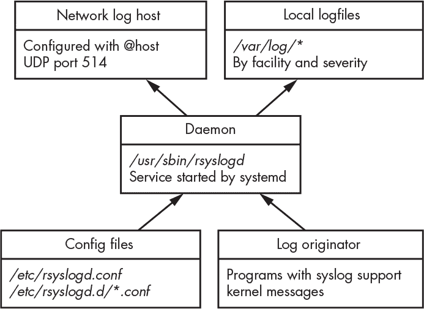
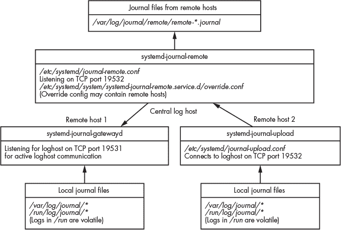
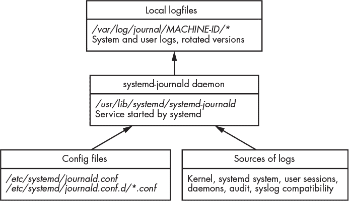
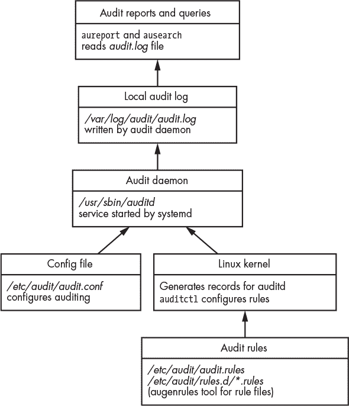

## **5

**正在调查来自 Linux 日志的证据**


计算机术语*log*源自古代水手用来测量船只航行速度的一种技术。一个绑着长绳的木块被扔到船后面水中，绳子上定期间隔着结点，水手们在船只远离漂浮的木块时，数着这些结点的数量。通过计数一定时间内经过的结点数量，他们可以计算船只的速度。定期测量的船速被记录在船只的“日志本”或日志中。

随着时间的推移，*log*一词开始代表各种记录的周期性测量或事件。日志本仍然被组织用来记录进入建筑物的访客、货物的交付以及其他需要书面历史记录的活动。计算机登录和注销的概念被创造出来以控制和记录用户活动。早期的分时计算机系统非常昂贵，需要跟踪不同用户消耗的计算资源。随着存储容量和处理能力的成本下降，日志记录的使用扩展到几乎所有现代计算机系统的部分。这些丰富的日志活动是数字证据的重要来源，有助于取证调查人员重建过去的事件和活动。

### 传统 Syslog

在 Unix 及类 Unix 操作系统（如 Linux）上的传统日志系统是*syslog*。Syslog 最初是为了 sendmail 软件包在 1980 年代初编写的，之后成为 IT 基础设施的事实标准日志系统。

Syslog 通常作为一个守护进程（也称为收集器）来实现，监听来自多个源的日志消息，如通过网络套接字（UDP 端口 514）到达的包、局部命名管道或 syslog 库调用（见图 5-1）。



*图 5-1：传统 syslog 架构（rsyslog）*

syslog 架构和网络协议在 RFC 5424 中有定义。Linux 发行版历史上包含了几种 syslog 实现，用于本地系统日志记录，最常见的是*rsyslog*。

#### *Syslog 功能、严重性和优先级*

syslog 标准定义了消息的格式以及日志条目的几个特征。这些特征包括*功能*、*严重性*和*优先级*。

消息功能允许根据子系统对日志进行分类。RFC 5424 文档列出了 24 种 syslog 消息功能。rsyslog .conf(5)手册页和 Linux *syslog.h*头文件定义了它们，如下所示：

```
0  kern: kernel messages
1  user: random user-level messages
2  mail: mail system
3  daemon: system daemons
4  auth: security/authorization messages
5  syslog: messages generated internally by syslogd
6  lpr: line printer subsystem
7  news: network news subsystem (obsolete)
8  uucp: UUCP subsystem (obsolete)
9  cron: clock daemon
10 authpriv (auth-priv): security/authorization messages
11 ftp: FTP daemon
12 reserved
13 reserved
14 reserved
15 reserved
16 local0: reserved for local use
17 local1: reserved for local use
18 local2: reserved for local use
19 local3: reserved for local use
20 local4: reserved for local use
21 local5: reserved for local use
22 local6: reserved for local use
23 local7: reserved for local use
```

其中一些功能代码，如`news`（Usenet）或`uucp`（Unix 到 Unix 复制），已经过时，可能会被系统管理员在本地站点显式重新定义。最后八个“本地”功能专门为本地站点保留，供根据需要使用。

一个名为 `mark` 的内部设施通常独立于 syslog 标准实现。如果使用，syslog 守护进程会生成带有时间戳的 `mark` 日志条目，并在预定的时间间隔内记录。这些标记表明，在没有收到日志的时间段内，日志子系统仍然在正常工作。在取证检查中，这些标记是潜在的活动缺失指示器，可能是调查中的有用信息。

有八个严重性级别，其中零是最严重的。最高的数字会生成最多的信息量，通常在故障排除或调试时根据需要启用。严重性级别可以表示为数字值或文本标签。级别在这里列出，并附有简短或替代的名称和描述：

```
0 emergency (emerg or panic): system is unusable
1 alert (alert): action must be taken immediately
2 critical (crit): critical conditions
3 error (err): error conditions
4 warning (warn): warning conditions
5 notice (notice): normal but significant condition
6 informational (info): informational messages
7 debug (debug): debug-level messages
```

从取证准备的角度来看，这些严重性级别非常重要。如果某个特定的 syslog 生成组件面临更高的风险或怀疑，或者有正在进行的事件，可以暂时改变日志的严重性级别，以增加日志的详细程度。一些工具和文档可能会在提到严重性时使用“优先级”一词。

syslog 消息的优先级，或称 *PRI* 值，是根据设施和严重性计算得出的（方法是将设施乘以八，然后加上严重性）。syslog 守护进程可以使用优先级数字来决定如何处理消息。这些决定包括保存位置和文件、过滤、转发到哪些主机等。

#### *Syslog 配置*

本地 syslog 守护进程的配置在取证调查中非常重要。配置文件条目（包括默认值和管理员自定义内容）指引调查员日志存放的位置、记录了哪些严重性级别以及涉及了哪些其他日志主机。常见的 syslog 守护进程配置文件位置有：

+   */etc/syslog.conf*

+   */etc/rsyslog.conf*

+   */etc/rsyslog.d/*.conf*

+   */etc/syslog-ng.conf*

+   */etc/syslog-ng/**

这些是纯文本文件，任何文本编辑器都可以读取。这里的示例包括 BSD syslog、rsyslog 和 syslog-ng 实现。

配置文件定义了守护进程管理的日志的位置和内容。典型的 syslog 配置行有两个字段：选择器和操作。*选择器* 字段由设施和严重性（用点分隔）组成。*操作* 字段定义了日志与选择器匹配时的目标或其他操作。以下是一个 rsyslog 配置文件的示例：

```
#*.debug    /var/log/debug
kern.*      /var/log/kern.log
mail.err    /var/log/mail.err
*.info      @loghost
```

第一行被注释掉，通常用于在需要时进行调试。第二行将所有内核日志发送到*/var/log/kern.log*，不论其严重性如何。第三行将所有严重性为*error*或更高的邮件日志发送到*/var/log/mail.err*日志文件。这些文件保存在本地，可以轻松定位和检查。最后一行将所有日志消息（任何设施）中严重性为*info*或更高的发送到网络上的另一台主机。`@`表示网络目标，`loghost`是中央日志记录基础设施。

网络目标对于调查特别有趣，因为它们表示来自非本地日志数据源的数据，这些数据可以被收集和检查。如果相同的日志同时存储在本地和远程日志主机上，那么如果数据不匹配，关联可能会变得很有趣。数据不匹配可能表示其中一条日志被恶意修改。

在 Linux 系统中，*/var/log/* 目录是保存日志的最常见位置。然而，当大量日志数据被写入时，这些纯文本文件在可扩展性、性能和可靠性方面面临挑战。企业 IT 环境仍然使用通过网络传输的 syslog 协议，但消息通常会保存到高性能数据库或专门设计用于管理日志的系统中（Splunk 是一个常见的例子）。这些数据库对于调查人员来说是一个宝贵的信息来源，并能加速快速的迭代调查过程。相比于数据库日志系统，超大的基于文本的日志文件在查询（`grep`）关键字时可能需要更长时间。

#### *分析 Syslog 消息*

通过网络传输的 syslog 消息不一定与保存到文件中的对应消息完全相同。例如，某些字段可能不会被保存（这取决于 syslog 配置）。

带有内建 syslog 支持的程序，也称为*源程序*，使用编程库或外部程序在本地系统上生成 syslog 消息。实现 syslog 的程序可以自由选择每条消息的任意设施和严重性等级。^(1)

为了说明这一点，我们来看看`logger`^(2)工具，它用于生成 syslog 消息：

```
$ logger -p auth.emerg "OMG we've been hacked!"
```

这个示例中的 syslog 消息可以在网络中观察到。当被`tcpdump`捕获并解码时，它看起来是这样的：

```
21:56:32.635903 IP (tos 0x0, ttl 64, id 12483, offset 0, flags [DF],
proto UDP (17), length 80)
    pc1.42661 > loghost.syslog: SYSLOG, length: 52
        Facility auth (4), Severity emergency (0)
        Msg: Nov 2 21:56:32 pc1 sam: OMG we've been hacked!
```

根据 syslog 守护进程的配置，原始 syslog 消息中的某些信息（如严重性或设施）可能不会被存储到目标日志文件中。例如，典型的 rsyslog 配置将如下所示地记录前面示例中的 syslog 消息：

```
Nov 2 21:56:32 pc1 sam: OMG we've been hacked!
```

在这里，严重级别和设施不会在本地记录；但是，syslog 守护进程在接收到消息时会了解这些信息，并可能使用这些信息来选择日志的目的地。在`loghost`上，UDP 端口号（尤其是源端口）也不会被记录，除非站点正在记录防火墙流量或使用 netflow 日志记录。

大多数 syslog 系统默认记录一些标准项。以下是 rsyslog 生成的典型日志条目的示例：

```
Nov 2 10:19:11 pc1 dhclient[18842]: DHCPACK of 10.0.11.227 from 10.0.11.1
```

这条日志行包含了时间戳、本地主机名，以及生成消息的程序及其进程 ID（方括号内），随后是程序生成的消息。在这个例子中，`dhclient`程序（PID 18842）正在记录一个 DHCP 确认消息，其中包含计算机的本地 IP 地址（10.0.11.227）和 DHCP 服务器的 IP 地址（10.0.11.1）。

大多数 Linux 系统使用日志轮换来管理随着时间推移而增长的日志文件的保留。较旧的日志文件可能会被重命名、压缩，甚至删除。常用的管理工具是 logrotate，它通过一组配置文件来管理日志的保留和轮换。默认的配置文件是*/etc/logrotate.conf*，但软件包安装时可能会提供自己的 logrotate 配置并将其保存在*/etc/logrotate.d/*中。在法医检查过程中，检查日志文件如何以及是否进行了轮换和保留是非常有用的。logrotate 软件包可以管理任何日志文件，而不仅仅是 syslog 生成的日志。

法医检查员应该意识到，syslog 消息存在一些安全问题，这些问题可能会影响结果日志的证据价值。因此，所有日志都应谨慎分析：

+   程序可以根据需要生成任何设施和严重级别的消息。

+   通过网络发送的 syslog 消息是无状态的、不加密的，并且基于 UDP，这意味着它们可能在传输过程中被伪造或篡改。

+   Syslog 不会检测或管理丢失的数据包。如果发送的消息过多或网络不稳定，某些消息可能会丢失，导致日志不完整。

+   基于文本的日志文件可能会被恶意篡改或删除。

最终，信任日志和 syslog 消息需要评估并接受完整性和准确性的风险。

一些 Linux 发行版已经开始转向使用 systemd 日志系统进行日志记录，并且不再安装 syslog 守护进程。很可能，桌面 Linux 系统上本地安装的 syslog 守护进程将逐渐失去流行，但在服务器环境中，syslog 将继续作为基于网络的日志记录的事实标准。

### Systemd Journal

过时的 syslog 系统的不足导致了许多安全性和可用性方面的增强。这些增强功能中的许多已经作为非标准功能添加到现有的 syslog 守护进程中，但在 Linux 发行版中并未得到广泛使用。systemd 日志是从零开始开发的，作为一种替代的日志系统，具备了 syslog 中缺失的额外功能。

#### *Systemd 日志功能和组件*

systemd 日志的设计目标和决策是为传统日志系统中已有的功能添加新特性，并集成先前作为单独守护进程或程序运行的各种组件。systemd 日志功能包括：

+   与 systemd 紧密集成

+   捕获并记录守护进程的 `stderr` 和 `stdout`

+   日志条目被压缩并以数据库格式存储

+   使用前向安全封装（FSS）实现内建完整性

+   每个条目的额外受信任元数据字段

+   日志文件压缩和轮换

+   日志消息速率限制

引入 FSS 和受信字段后，开发人员更加关注日志的完整性和可信度。从数字取证的角度来看，这一点既有趣又有用，因为它增强了证据的可靠性。

日志提供了将消息传输到另一个日志主机（中央日志基础设施）的网络功能，类似于传统日志系统，但有一些增强功能：

+   基于 TCP 的有状态已建立会话（解决了 UDP 的丢包问题）

+   用于保密性和隐私的加密传输（HTTPS）

+   认证连接以防止欺骗和未经授权的消息

+   当 `loghost` 不可用时的消息排队（无丢失消息）

+   使用 FSS 签名数据以确保消息的完整性

+   主动或被动消息传递模式

这些网络功能允许构建一个更安全的日志基础设施，重点关注完整性和完整性。syslog 的一个重大问题是基于 UDP 的无状态数据包传输。使用 systemd 日志后，日志传输的可靠性和完整性得到了保障。

如果使用了日志的网络功能，请检查 */etc/systemd/journal-upload.conf* 文件中的 `"URL="` 参数，该参数包含了中央日志主机的主机名。这是一个法医证据，可能指示日志存在于其他位置，并且对于日志不持久的系统来说，可能非常重要。

图 5-2 显示了 systemd 日志网络的架构组件图。



*图 5-2：Systemd 日志网络*

有关日志网络功能的更多信息，请参阅 systemd-journal-remote(8)、systemd-journal-gatewayd(8) 和 systemd-journal-upload(8) 的手册页。尽管这些功能具有创新性，并大大改善了传统日志记录，但它们是特定于 systemd 的，且在 Linux 社区之外并不兼容或广为人知。

#### *Systemd 日志配置*

理解 systemd 日志的配置有助于我们评估在系统上寻找法医证据的潜力。日志作为一个普通的 Linux 守护进程（见 图 5-3），名为 systemd-journald，且表现得相当稳定。

在 systemd-journald(8) 手册页中有详细记录。你可以通过检查 systemd 单元文件（*systemd-journald.service*）来查看日志守护进程在启动时的 *enable* 状态。



*图 5-3：Systemd 日志守护进程*

systemd 日志有多个配置参数，用于定义其操作的各个方面（详细描述见 journald.conf(5) 手册页）。日志的常见配置文件位置如下：

+   */etc/systemd/journald.conf*

+   */etc/systemd/journald.conf.d/*.conf*

+   */usr/lib/systemd/journald.conf.d/*.conf*

配置文件通过 `"Storage="` 参数指定日志是易失性还是持久化的。如果配置为持久化，日志将以二进制格式存储在 */var/log/journal/* 中。如果配置为易失性，它们将存储在 */run/log/journal/* 中，并且只在系统运行时存在；在系统关闭后，无法进行事后法医分析。如果设置了 `"ForwardToSyslog=` `yes"`，日志将被发送到本地机器的传统 syslog 系统，并存储在本地日志文件（*/var/log/*）中，或者可能会被转发到中央日志主机。

在具有持久化日志的系统中，*/var/log/journal/* 目录包含一个以机器 ID 命名的子目录（该 ID 在 */etc/machine-id* 中可以找到），该目录包含本地日志文件。用于标识日志文件的魔数是初始字节序列 0x4C504B5348485248 或 LPKSHHRH。

日志文件包含系统日志和用户日志。系统日志由系统服务和内核生成。用户日志由用户登录会话（shell 或桌面）和用户执行的各种程序生成。用户可以读取自己的日志，但不允许直接修改或写入这些日志。

这是一个机器 ID 为 `506578466b474f6e88ec` `fbd783475780` 的系统示例，以及相应的包含日志文件的目录：

```
$ ls /var/log/journal/506578466b474f6e88ecfbd783475780
user-1001@0005aa24f4aa649b-46435710c1877997.journal~
user-1001@dd54beccfb52461d894b914a4114a8f2-00000000000006a8-0005a1d176b61cce.journal
system@e29c14a0a5fc46929ec601deeabd2204-0000000000000001-00059e3713757a5a.journal
user-1001@dd54beccfb52461d894b914a4114a8f2-0000000000000966-0005a1d17821abe4.journal
system@e29c14a0a5fc46929ec601deeabd2204-000000000000189c-00059e37774baedd.journal
user-1001.journal
system.journal
```

正常的日志文件扩展名是 **.journal*。如果系统崩溃或发生了非正常关机，或者日志文件被损坏，文件名将以波浪号（**.journal~*）结尾。当前正在使用的日志文件，或者“在线”的日志文件，其文件名为 *system.journal* 和 *user-UID.journal*（其中 UID 是用户的数字 ID）。已被归档或转存为“离线”的日志文件，其文件名在原始名称后会加上 *@* 和一个唯一的字符串。这个 *@* 和 *.journal* 之间的唯一字符串被分为三部分，用来描述日志文件的内容。

让我们分析一个长日志文件名的组成，如下例所示：

```
/var/log/journal/506578466b474f6e88ecfbd783475780/system@e29c14a0a
5fc46929ec601deeabd2204-000000000000189c-00059e37774baedd.journal
```

解构后的部分如下：

/var/log/journal/ 持久化日志文件的位置（路径）

506578466b474f6e88ecfbd783475780/ 机器 ID 目录

system@ 表示已归档的系统日志文件

e29c14a0a5fc46929ec601deeabd2204 序列号

-000000000000189c 文件中的第一个序列号

-00059e37774baedd 第一个日志条目的十六进制时间戳

.journal 表示一个 systemd 日志文件

十六进制时间戳表示第一个日志条目添加到日志时的时间。对于熟悉的秒级纪元，将此时间戳转换为十进制并去掉最后六位数字。

如果系统通过网络接收来自其他主机的日志（通过 `systemd-journal-upload` 或 `systemd-journal-gatewayd`），则可能存在一个 *remote/* 目录，其中包含每个远程主机的日志。这些日志的文件名将类似于 *remote-*HOSTNAME*.journal*。

日志记录了 systemd 启动过程，并跟踪单元文件的启动和停止，直到系统关闭。Linux 系统保持一个唯一的 128 位启动 ID，可以在运行中的系统中找到（路径： */proc/sys/kernel/random/boot_id*）。启动 ID 是内核在每次启动时随机生成的，它作为特定启动时段（从启动到关机/重启）的唯一标识符。启动 ID 被记录在日志中，并用于区分启动之间的时间段（例如，`journalctl --list-boots`）以及显示自上次启动以来的日志（例如，`journalctl -b`）。这些 journalctl 选项也可以应用于文件或目录进行离线分析。如果在某个特定的启动期间发生了已知的恶意活动，启动 ID 在法医检查时可能会很有用。

#### *日志文件内容分析*

如果没有商业法医工具支持日志文件，你可以将日志文件复制到另一台 Linux 分析机上，并使用 `journalctl` 命令进行分析。这个命令允许你列出日志内容，搜索日志，列出单独的启动期，查看额外的日志元数据（特定于 journald），查看程序的 `stderr` 和 `stdout`，导出到其他格式等。

在将所需的日志文件或整个日志目录复制到分析机器后，你可以使用 `journalctl` 的文件和目录标志来指定要分析的日志文件位置：

```
$ journalctl --file <filename>
$ journalctl --directory <directory>
```

指定文件时仅对该单个文件进行操作。指定目录时会对该目录中的所有有效日志文件进行操作。

每个日志文件包含一个头部，里面有关于自身的元数据，可以通过使用 `journalctl` 的 `--header` 标志来查看；例如：

```
$ journalctl --file system.journal --header
File path: system.journal
File ID: f2c1cd76540c42c09ef789278dfe28a8
Machine ID: 974c6ed5a3364c2ab862300387aa3402
Boot ID: e08a206411044788aff51a5c6a631c8f
Sequential number ID: f2c1cd76540c42c09ef789278dfe28a8
State: ONLINE
Compatible flags:
Incompatible flags: COMPRESSED-ZSTD KEYED-HASH
Header size: 256
Arena size: 8388352
Data hash table size: 233016
Field hash table size: 333
Rotate suggested: no
Head sequential number: 1 (1)
Tail sequential number: 1716 (6b4)
Head realtime timestamp: Thu 2020-11-05 08:42:14 CET (5b3573c04ac60)
Tail realtime timestamp: Thu 2020-11-05 10:12:05 CET (5b3587d636f56)
Tail monotonic timestamp: 1h 29min 53.805s (1417ef08e)
Objects: 6631
Entry objects: 1501
Data objects: 3786
Data hash table fill: 1.6%
Field objects: 85
Field hash table fill: 25.5%
Tag objects: 0
Entry array objects: 1257
Deepest field hash chain: 2
Deepest data hash chain: 1
Disk usage: 8.0M
```

输出提供了日志文件的技术描述，覆盖时间段的时间戳（头部和尾部），日志条目数（`Entry` `objects`）以及其他统计信息。你可以在这里找到更多关于日志文件格式的信息：^(3) *[`systemd.io/JOURNAL_FILE_FORMAT/`](https://systemd.io/JOURNAL_FILE_FORMAT/)*。

以下示例使用 `journalctl` 命令列出了特定日志文件的基本内容：

```
$ journalctl --file system.journal
-- Logs begin at Thu 2020-11-05 08:42:14 CET, end at Thu 2020-11-05 10:12:05 CET. --
Nov 05 08:42:14 pc1 kernel: microcode: microcode updated early to revision 0xd6,
date = 2020-04-27
Nov 05 08:42:14 pc1 kernel: Linux version 5.9.3-arch1-1 (linux@archlinux) (gcc (GCC)
10.2.0, GNU ld (GNU Binutils) 2.35.1) #1 SMP PREEMPT Sun, 01 Nov 2020 12:58:59 +0000
Nov 05 08:42:14 pc1 kernel: Command line: BOOT_IMAGE=/boot/vmlinuz-linux root=
UID=efbfc8dd-8107-4833-9b95-5b11a1b96875 rw loglevel=3 quiet pcie_aspm=off
i915.enable_dpcd_backlight=1
...
Nov 05 10:11:53 pc1 kernel: usb 2-1: Product: USB Flash Drive
Nov 05 10:11:53 pc1 kernel: usb 2-1: Manufacturer: Philips
Nov 05 10:11:53 pc1 kernel: usb 2-1: SerialNumber: 070852A521943F19
Nov 05 10:11:53 pc1 kernel: usb-storage 2-1:1.0: USB Mass Storage device detected
...
Nov 05 10:12:05 pc1 sudo[10400]:   sam : TTY=pts/5 ; PWD=/home/sam/test ; USER=root ;
COMMAND=/usr/bin/cp /etc/shadow .
Nov 05 10:12:05 pc1 sudo[10400]: pam_unix(sudo:session): session opened for user
root(uid=0) by (uid=0)
...
```

在此示例中，system.journal 是正在分析的文件名。第一行是信息性内容，表示输出中包含的时间段。部分输出来自内核，类似于 dmesg 命令的输出。其他行类似于 syslog，从时间戳、主机名、守护进程名称以及方括号中的进程 ID 开始，最后以日志消息结束。journalctl 命令也可能添加其他信息性行，如 -- Reboot --，表示启动周期的结束（并开始新的启动 ID）。

每条日志条目都有与日志消息一起存储的特定元数据。可以使用详细输出（`-o verbose`）参数对日志条目进行完整提取。以下是来自 OpenSSH 守护进程的详细日志条目：

```
$ journalctl --file system.journal -o verbose
...
Thu 2020-11-05 08:42:16.224466 CET [s=f2c1cd76540c42c09ef789278dfe28a8;i=4a9;
b=e08a206411044788aff51a5c6a631c8f;m=41d525;t=5b3573c2653ed;x=a1434bf47ce8597d]
    PRIORITY=6
    _BOOT_ID=e08a206411044788aff51a5c6a631c8f
    _MACHINE_ID=974c6ed5a3364c2ab862300387aa3402
    _HOSTNAME=pc1
    _UID=0
    _GID=0
    _SYSTEMD_SLICE=system.slice
    SYSLOG_FACILITY=4
    _CAP_EFFECTIVE=1ffffffffff
    _TRANSPORT=syslog
    SYSLOG_TIMESTAMP=Nov 5 08:42:16
    SYSLOG_IDENTIFIER=sshd
    SYSLOG_PID=397
    _PID=397
    _COMM=sshd
    _EXE=/usr/bin/sshd
    _CMDLINE=sshd: /usr/bin/sshd -D [listener] 0 of 10-100 startups
    _SYSTEMD_CGROUP=/system.slice/sshd.service
    _SYSTEMD_UNIT=sshd.service
    _SYSTEMD_INVOCATION_ID=7a91ff16d2af40298a9573ca544eb594
    MESSAGE=Server listening on :: port 22.
    _SOURCE_REALTIME_TIMESTAMP=1604562136224466
...
```

该输出提供了结构化的信息，包括唯一标识符、systemd 信息、syslog 的 `FACILITY` 和 `PRIORITY`（严重性）、生成日志消息的进程等。systemd.journal-fields(7) 手册页面描述了日志条目的字段。

日志文件以二进制格式保存，该格式是公开和有文档记录的。`journalctl` 工具可用于对日志文件执行各种检查任务，但某些取证调查人员可能更倾向于将日志内容导出为其他格式进行分析。两种有用的输出格式是 *export* 和 *json*。export 格式类似于详细格式，每个条目之间用空行分隔（这在技术上是二进制格式，但大部分是可读文本）。*json* 输出将日志条目生成为 JSON 格式，方便脚本编写或导入其他分析工具。以下是创建 *.json* 和 *.export* 文件、包含完整日志文件内容的两个命令行示例：

```
$ journalctl --file system.journal -o json > system.journal.json
$ journalctl --file system.journal -o export > system.journal.export
```

创建的新文件为 *system.journal.json* 和 *system.journal.export*，其他（非 Linux）工具可以轻松读取这些文件。另一种输出格式是 *.json-pretty*，它以更易读的方式生成 JSON 格式。

搜索日志文件是通过在 *FIELD*`=`*VALUE* 的形式中包含匹配参数来完成的，但需要指定您要搜索的确切值。这种搜索方式对于提取特定服务的日志非常有用。例如，要提取来自 `sshd.service` 单元的所有日志：

```
$ journalctl --file system.journal _SYSTEMD_UNIT=sshd.service
-- Logs begin at Thu 2020-11-05 08:42:14 CET, end at Thu 2020-11-05 10:12:05 CET. --
Nov 05 08:42:16 pc1 sshd[397]: Server listening on 0.0.0.0 port 22.
Nov 05 08:42:16 pc1 sshd[397]: Server listening on :: port 22.
...
```

正则表达式（regex）可以与 --grep= 参数一起使用，但它们只能搜索消息字段，而不能搜索日志元数据。对于取证调查人员来说，搜索语法并不十分灵活，可能更容易将日志导出为其他格式，然后使用像 grep 或其他文本搜索工具这样的熟悉工具进行分析。

值得一提的是，systemd 日志可以记录守护进程和其他单元文件的 `stdout` 和 `stderr`。在传统的 syslog 中，这些信息通常会丢失，因为守护进程启动时会与控制终端分离。Systemd 保留了这些输出并将其保存到日志中。您可以通过指定 `stdout` 传输来列出这些输出：

```
$ journalctl --file user-1000.journal _TRANSPORT=stdout
```

传输指定了日志条目是如何被日志接收的。还有其他传输方式，如 syslog、内核、审计等。这些传输方式在 systemd.journal-fields(7) 手册页中有详细说明。

如果日志文件包含 FSS 信息，可以使用`--verify`标志检查其完整性。在以下示例中，检查了一个日志文件，`PASS`表示文件完整性已验证：

```
$ journalctl --file system.journal --verify
PASS: system.journal
```

如果日志文件已被篡改，它将无法通过验证：

```
$ journalctl --file user-1002.journal --verify
38fcc0: Invalid hash (afd71703ce7ebaf8 vs.49235fef33e0854e
38fcc0: Invalid object contents: Bad message
File corruption detected at user-1002.journal:38fcc0 (of 8388608 bytes, 44%).
FAIL: user-1002.journal (Bad message)
```

在此示例中，FSS 完整性在日志文件的字节偏移量 0x38fcc0 处失败，日志条目被恶意修改。如果一个日志文件在多个地方被篡改，验证将在首次篡改处失败。

在调查发生在已知时间窗口内的事件时，从明确的时间范围中提取日志是很有用的。`journalctl`命令可以使用两个标志：`-S`（自）和`-U`（直到）提取指定时间范围内的日志。所有自`-S`时间点开始到`-U`时间点（不包括该时间点）之前的日志都会被提取。

以下两个示例来自一台 Linux 取证分析机器，其中日志文件已被复制到证据目录以供使用`journalctl`命令进行检查：

```
$ journalctl --directory ./evidence -S 2020-11-01 -U 2020-11-03
$ journalctl --file ./evidence/system.journal -S "2020-11-05 08:00:00" -U "2020-11-05 09:00:00"
```

在第一个示例中，指定了包含日志文件的目录，并提取了 11 月 1 日和 11 月 2 日的日志。第二个示例指定了一个更精确的时间范围，并提取了 11 月 5 日上午 8 点到 9 点之间的日志。请参阅 journalctl(1) 手册页，了解其他时间和日期字符串的变体。

systemd 日志机制的新特性与取证准备性的预期高度一致。systemd 日志提供了日志完整性和可靠性，这些都是数字取证中的基本概念。

### 其他应用程序和守护进程日志

程序并不要求使用 syslog 或 systemd 日志。守护进程或应用程序可能有一个完全忽略系统提供的日志机制的独立日志系统。守护进程或应用程序也可能使用 syslog 或日志，但使用非标准的设施或严重性以及它们自己的消息格式。

#### *自定义日志记录到 Syslog 或 Systemd 日志*

Syslog 提供了一个 C 库函数，供程序生成 syslog 消息。Systemd 提供了一个 API，供程序提交日志条目到日志中。开发人员可以自由使用这些，而不是开发自己的日志子系统。然而，消息的设施、严重性和格式都是由开发人员决定的。这种自由可能导致程序之间有各种各样的日志配置。

在以下示例中，每个程序使用不同的 syslog 设施和严重性来记录类似的操作：  

```
mail.warning: postfix/smtps/smtpd[14605]: ➊ warning: unknown[10.0.6.4]: SASL LOGIN
 authentication failed: UGFzc3dvcmQ6
...
auth.info sshd[16323]: ➋ Failed password for invalid user fred from 10.0.2.5 port 48932 ssh2
...
authpriv.notice: auth: pam_unix(dovecot:auth): ➌ authentication failure; logname= uid=0
 euid=0 tty=dovecot ruser=sam rhost=10.0.3.8
...
daemon.info: danted[30614]: ➍ info: block(1): tcp/accept ]: 10.0.2.5.56130 10.0.2.6.1080:
 error after reading 3 bytes in 0 seconds: client offered no acceptable authentication method
```

这些日志描述了来自邮件服务器（`postfix`）➊、安全外壳（`sshd`）➋、IMAP 服务器（`dovecot` 使用 `pam`）➌ 和 SOCKS 代理（`danted`）➍ 的登录失败情况。它们使用了不同的设施（`mail`、`auth`、`authpriv`、`daemon`），并且使用了不同的严重性（`warning`、`info`、`notice`）。在某些情况下，额外的日志可能包含关于同一事件在不同设施或严重性下的更多信息。法医检查员不应假设所有类似的日志事件都会使用相同的设施或严重性，而应预期会有一些变动。  

守护进程可以选择将日志记录到自定义或用户定义的设施中。这通常在守护进程的配置中定义，或者通过编译的默认值来设置。例如：  

```
local2.notice: pppd[645]: CHAP authentication succeeded
local5.info: TCSD[1848]: TrouSerS trousers 0.3.13: TCSD up and running.
local7.info: apache2[16455]: ssl: 'AH01991: SSL input filter read failed.'
```

在这个例子中，`pppd` 守护进程使用 `local2` 作为设施，管理 TPM 的 `tcsd` 守护进程使用 `local5`，而 Apache 网络服务器（`apache2`）配置为使用 `local7`。守护进程可以选择任何它们想要的设施，系统管理员可以选择将日志记录配置到所需的设施。  

当调查进行中或攻击正在进行时，可能需要额外的日志记录（可能是暂时性的）。如果涉及潜在嫌疑人或受害者的风险增加，可以选择性地增加日志记录，以支持数字法医证据的收集。例如，考虑以下可以使用选择性增强日志记录的潜在实体：  

+   一个特定的用户或用户组

+   一个地理区域或特定位置  

+   一个特定的服务器或服务器组  

+   一个 IP 地址或 IP 范围  

+   系统上运行的特定软件组件（守护进程）  

大多数守护进程提供配置选项来增加日志记录的详细程度。有些守护进程提供非常细致的选择性日志记录功能。例如，Postfix 配置指令允许为特定的 IP 地址或域名列表增加日志记录：  

```
debug_peer_level = 3
debug_peer_list = 10.0.1.99
```

在此示例中，选择了单个 IP 地址进行增强日志记录，使用 Postfix 的内部调试级别（使用级别 3 而不是默认的 2）。每个守护进程的配置文档将描述详细、调试或其他选择性日志记录调整的可能性。  

如前所述，通过 systemd 启动的守护进程的 `stdout` 和 `stderr` 将被捕获并记录到日志中，这从法医准备的角度也非常有用。如果守护进程允许向控制台输出详细信息或调试信息，则可以在事件或调查期间临时启用。  

#### *独立服务器应用程序日志*  

应用程序通常会管理自己的日志文件，而不使用像 syslog 或 systemd 日志这样的本地日志系统。在这些情况下，日志通常会存储在单独的日志文件或日志目录中，通常位于 */var/log/* 目录下。  

较大的应用程序可能足够复杂，需要为不同的子系统和组件创建多个独立的日志文件。这可能包括以下内容的单独日志文件：

+   应用程序技术错误

+   用户身份验证（登录、注销等）

+   应用程序用户交易（如 Web 访问、会话、购买等）

+   安全违规和警报

+   轮换或归档日志

Apache 网络服务器就是一个很好的例子。它通常会有一个独立的目录，比如 */var/log/apache2/* 或 */var/log/httpd/*。该目录的内容可能包括以下日志：

+   一般 Web 访问 (*access.log*)

+   单个虚拟主机的 Web 访问

+   单个 Web 应用程序的 Web 访问

+   守护进程错误 (*error.log*)

+   SSL 错误日志

应用程序通常会在其配置文件中指定日志位置、内容和详细程度。如果日志位置不明显，取证检查员应检查这些日志位置。

一些应用程序的安装可能完全包含在文件系统的特定目录中，并且应用程序可能使用该目录来存储日志以及其他应用程序文件。这种设置通常出现在可能自包含于一个目录中的 Web 应用程序中。例如：

Nextcloud 托管平台和 Roundcube Webmail 应用程序具有以下应用程序日志：

+   *nextcloud/data/nextcloud.log*

+   *nextcloud/data/updater.log*

+   *nextcloud/data/audit.log*

+   *roundcube/logs/sendmail.log*

+   *roundcube/logs/errors.log*

请记住，这些日志是除了 Web 服务器访问和错误日志（如 Apache、Nginx 等）之外生成的。对于 Web 应用程序，取证检查员可能会在多个地方找到与特定应用程序、事件或事故相关的日志。

一些应用程序可能将日志存储在数据库中，而不是文本文件中。这些数据库可以是完整的数据库服务，如 MySQL 或 Postgres，或者是像 SQLite 这样的本地数据库文件。

与系统上安装的程序相关的另一个有趣的日志是 *alternatives* 日志。alternatives 系统最初为 Debian 开发，用于允许安装多个并行版本的相似程序。多个发行版已经采用了 alternatives 机制。`update-alternatives` 脚本管理位于 */etc/alternatives/* 目录中的指向通用或替代应用程序名称的符号链接。例如，创建多个符号链接以提供 `vi` 程序的替代：

```
$ ls -gfo /usr/bin/vi /etc/alternatives/vi /usr/bin/vim.basic
lrwxrwxrwx 1      20 Aug 3 14:27 /usr/bin/vi -> /etc/alternatives/vi
lrwxrwxrwx 1      18 Nov 8 11:19 /etc/alternatives/vi -> /usr/bin/vim.basic
-rwxr-xr-x 1 2675336 Oct 13 17:49 /usr/bin/vim.basic
```

*/etc/alternatives/* 符号链接的时间戳表示上次更改的时间。此信息也记录在 *alternatives.log* 文件中：

```
$ cat /var/log/alternatives.log
...
update-alternatives 2020-11-08 11:19:06: link group vi updated to point to /usr/bin/vim.basic
...
```

这是一个系统范围的方法，用于分配默认应用程序（类似于桌面用户的 XDG 默认设置），并有助于构建系统中使用了哪些程序的整体图景。有关更多信息，请参阅 `update-alternatives(1)` 手册页^(4)。

在进行法医检查时，要特别注意错误日志。错误消息揭示了异常和可疑活动，有助于重建过去的事件。在调查入侵时，事件发生之前出现的错误消息可能表明攻击前的侦察或之前的失败尝试。

#### *独立用户应用程序日志*

当用户登录到 Linux 系统时，系统的各个组件（如登录、pam、显示管理器等）会创建标准日志。在用户登录到他们的桌面或 shell 后，进一步的日志也可能会保存在特定于该用户的位置。

systemd 日志将特定于用户登录会话的持久日志保存在*/var/log/journal/*MACHINE-ID*/*user-UID*.journal*中，其中*UID*是用户的数字 ID。这个日志（以及旋转的实例）包含了一个人登录会话的活动痕迹，其中可能包括以下信息：

+   达到的 systemd 目标和启动的用户服务

+   Dbus-daemon 激活的服务和其他活动

+   像 gnupg、polkit 等代理

+   来自子系统的消息，比如 pulseaudio 和蓝牙

+   来自桌面环境的日志，如 GNOME

+   权限提升，如`sudo`或`pkexec`

用户日志文件的格式与系统日志文件相同，你可以使用`journalctl`工具来分析它们（在本章前面有描述）。

其他日志可能会在程序由用户运行时被保存。这些程序日志的存储位置必须位于用户可写的目录中，这通常意味着它们会存储在用户的主目录下。持久日志最常见的存放位置是符合 XDG 基础目录标准的地方，如*~/.local/share/*APP*/**或*~/.config/*APP*/**（其中*APP*是生成用户日志的应用程序）。

以下示例展示了一个存储在*~/.config/*中的 Jitsi 视频聊天应用程序日志，其中包含错误消息：

```
$ cat ~/.config/Jitsi\ Meet/logs/main.log
[2020-10-17 15:20:16.679] [warn] APPIMAGE env is not defined, current
 application is not an AppImage
...
[2020-10-17 16:03:19.045] [warn] APPIMAGE env is not defined, current
 application is not an AppImage
...
[2020-10-21 20:52:19.348] [warn] APPIMAGE env is not defined, current
 application is not an AppImage
```

这里显示的良性警告消息是在每次 Jitsi 应用程序启动时生成的。对于法医调查员来说，这些消息的内容可能并不有趣，但时间戳表明了每次视频聊天程序启动的时间。像这样的琐碎错误在重建过去的事件时可能是有价值的。

一些程序忽略 XDG 标准，在用户主目录的根目录下创建隐藏的文件和目录。例如，Zoom 视频聊天应用程序会创建一个*~/.zoom/log/*目录，其中包含一个日志文件：

```
$ cat ~/.zoom/logs/zoom_stdout_stderr.log
ZoomLauncher started.
cmd line: zoommtg://zoom.us/join?action=join&confno=...
...
```

这个 Zoom 日志包含了大量信息，包括使用过的历史会议 ID。

临时或非持久性日志也可能位于*~/.local/cache/* APP*/**中，因为这个缓存目录是为可以删除的数据而设计的。

在这个例子中，`libvirt`系统用于管理用户的 KVM/QEMU 虚拟机，并为每台机器创建一个日志目录，其中包含每台机器的日志文件：

```
$ cat ~/.cache/libvirt/qemu/log/pc1.log
2020-09-24 06:57:35.099+0000: starting up libvirt version: 6.5.0, qemu version: 5.1.0,
kernel: 5.8.10-arch1-1, hostname: pc1.localdomain
LC_ALL=C \
PATH=:/bin:/sbin:/usr/bin:/usr/sbin:/usr/local/bin:/usr/local/sbin:/home/sam/script \
HOME=/home/sam \
USER=sam \
LOGNAME=sam \
XDG_CACHE_HOME=/home/sam/.config/libvirt/qemu/lib/domain-1-linux/.cache \
QEMU_AUDIO_DRV=spice \
/bin/qemu-system-x86_64 \
...
```

在用户主目录中搜索 **.log* 文件或名为“log”的目录将生成一个初步的文件列表以供分析。Linux 应用程序可以生成大量日志和持久数据，这些数据会在用户运行各种程序时保存。

单个应用程序日志的分析超出了本书的范围，但值得一提的是，许多流行的应用程序会在用户的主目录中存储大量关于过去使用的信息。这些信息通常包含已打开的文件历史、远程主机连接、与其他人的通信、使用时间戳、访问的设备等。

#### *Plymouth 启动画面日志*

在启动过程中，大多数桌面发行版使用 Plymouth 系统在系统启动时显示图形化的启动画面。按下 ESC 键可以切换到控制台输出。非图形化服务器也可以使用 Plymouth 在系统启动时提供可见的输出。输出会为每个组件提供带有绿色 `[ OK ]` 或红色 `[FAILED]` 消息的颜色状态指示器。

这个 Plymouth 控制台输出通常保存在 */var/log/boot.log* 文件中；例如：

```
$ cat /var/log/boot.log
...
[ OK ] Started Update UTMP about System Boot/Shutdown.
[ OK ] Started Raise network interfaces.
[ OK ] Started Network Time Synchronization.
[ OK ] Reached target System Time Synchronized.
[ OK ] Reached target System Initialization.
[ OK ] Started Daily Cleanup of Temporary Directories.
[ OK ] Listening on D-Bus System Message Bus Socket.
[ OK ] Listening on Avahi mDNS/DNS-SD Stack Activation Socket.
[ OK ] Started Daily apt download activities.
[ OK ] Started Daily rotation of log files.
[ OK ] Started Daily apt upgrade and clean activities.
[ OK ] Started Daily man-db regeneration.
[ OK ] Reached target Timers.
[ OK ] Listening on triggerhappy.socket.
[ OK ] Reached target Sockets.
[ OK ] Reached target Basic System.
...
```

这个文件包含了生成颜色指示器所需的转义代码。即使你的分析工具警告它是一个二进制文件，它也是安全查看的。

启动过程中失败的组件也会出现在启动日志中：

```
$ cat /var/log/boot.log
...
[FAILED] Failed to start dnss daemon.
See 'systemctl status dnss.service' for details.
[ OK ] Started Simple Network Management Protocol (SNMP) Daemon..
[FAILED] Failed to start nftables.
See 'systemctl status nftables.service' for details.
...
```

启动日志的轮换版本也可能存在于 */var/log/* 目录中。

这个启动日志在取证调查中可能很有趣。它展示了上次启动期间事件的顺序，并可能提供有用的错误信息。例如，前面的错误信息表明 Linux 防火墙规则（`nftables`）未能启动。如果这是一次系统入侵调查，这可能是一个关键的线索。

### 内核和审计日志

迄今为止描述的日志是由用户空间程序、守护进程和应用程序生成的。Linux 内核也会从内核空间生成日志信息，这些信息在取证调查中可能非常有用。本节将解释内核生成的消息的目的、它们的位置以及如何分析它们。

Linux 审计系统由许多用户空间工具和守护进程组成，用于配置审计，但审计和日志记录活动是在运行中的内核中执行的。这就是将其与内核日志机制一起包含在此的原因。防火墙日志也是由内核生成的，并且会很好地适应这一部分，但该主题在第八章关于 Linux 网络取证分析中有所覆盖。

#### *内核环形缓冲区*

Linux 内核有一个循环缓冲区，其中包含由内核和内核模块生成的消息。这个缓冲区是固定大小的，一旦填满，它将保持满并开始用任何新的条目覆盖最旧的条目，这意味着内核日志会随着新消息的写入而不断丢失。用户空间的守护进程需要捕获并处理生成的事件。内核为系统守护进程如 systemd-journald 和 rsyslogd 提供了*/dev/kmsg*和*/proc/kmsg*，使它们可以读取新生成的内核消息。这些消息然后根据日志守护进程的配置被保存或转发。

`dmesg`命令用于在运行中的系统上显示当前的环形缓冲区内容，但在死后取证检查中没有用处。环形缓冲区仅存在于内存中，但我们可以在写入到文件系统的日志中找到它的痕迹。在启动过程中，内核在任何日志守护进程启动之前开始将消息保存到环形缓冲区。一旦这些守护进程（如 systemd-journald、rsyslogd 等）启动，它们就可以读取所有当前的内核日志并开始监控新的日志。

通常，syslog 守护进程会将内核事件记录到*/var/log/kern.log*文件中。该日志的旋转版本可能包括*kern.log.1*、*kern.log.2.gz*等。格式与其他 syslog 文件类似。例如，从 Raspberry Pi 的 rsyslogd 压缩旋转日志中保存的内核日志如下所示：

```
$ zless /var/log/kern.log.2.gz
Aug 12 06:17:04 raspberrypi kernel: [  0.000000] Booting Linux on physical CPU 0x0
Aug 12 06:17:04 raspberrypi kernel: [  0.000000] Linux version 4.19.97-v7l+ (dom@buildbot) ...
Aug 12 06:17:04 raspberrypi kernel: [  0.000000] CPU: ARMv7 Processor [410fd083] revision 3
(ARMv7), cr=30c5383d
Aug 12 06:17:04 raspberrypi kernel: [  0.000000] CPU: div instructions available: patching
division code
Aug 12 06:17:04 raspberrypi kernel: [  0.000000] CPU: PIPT / VIPT nonaliasing data cache,
PIPT instruction cache
Aug 12 06:17:04 raspberrypi kernel: [  0.000000] OF: fdt: Machine model: Raspberry Pi 4
Model B Rev 1.1
...
```

rsyslogd 守护进程有一个名为`imklog`的模块，负责管理内核事件的日志记录，通常配置在*/etc/rsyslog.conf*文件中。

Systemd 将内核日志与其他内容一起存储在日志中。要查看来自日志文件的内核日志，可以添加-k 标志，如下所示：

```
$ journalctl --file system.journal -k
-- Logs begin at Thu 2020-11-05 08:42:14 CET, end at Thu 2020-11-05 10:12:05 CET. --
Nov 05 08:42:14 pc1 kernel: microcode: microcode updated early to revision 0xd6, date =
 2020-04-27
Nov 05 08:42:14 pc1 kernel: Linux version 5.9.3-arch1-1 (linux@archlinux) (gcc (GCC)
 10.2.0, GNU ld (GNU Binutils) 2.35.1) #1 SMP PREEMPT Sun, 01 Nov 2020 12:58:59 +0000
Nov 05 08:42:14 pc1 kernel: Command line: BOOT_IMAGE=/boot/vmlinuz-linux root=UUID=efbfc8dd
-8107-4833-9b95-5b11a1b96875 rw loglevel=3 quiet pcie_aspm=off i915.enable_dpcd_backlight=1
...
```

*/etc/systemd/journald.conf*中有一个参数（`ReadKMsg=`），它启用从*/dev/kmsg*处理内核消息（这是默认设置）。

对于取证检查员来说，内核消息非常重要，它们有助于重建系统在启动时和系统运行期间（直到关机）硬件组件的状态。在此期间（由启动 ID 标识），可以看到已连接、已断开和已修改的硬件设备（包括制造商详情）的记录。此外，还可以找到有关各种内核子系统的信息，如网络、文件系统、虚拟设备等。你可以在内核日志中找到的一些信息示例如下：

+   CPU 特性和微代码

+   内核版本和内核命令行

+   物理内存和内存映射

+   BIOS 和主板详细信息

+   ACPI 信息

+   安全启动和 TPM

+   PCI 总线和设备

+   USB 集线器和设备

+   以太网接口和网络协议

+   存储设备（SATA、NVMe 等）

+   防火墙日志（已阻止或已接受的包）

+   审计日志

+   错误和安全警报

让我们来看一些在取证调查中有趣的内核消息示例，或者可能引发有关消息存在的问题。

在这个示例中，提供了关于特定主板的信息：

```
Aug 16 12:19:20 localhost kernel: DMI: System manufacturer System Product
 Name/RAMPAGE IV BLACK EDITION, BIOS 0602 02/26/2014
```

在这里，我们可以确定主板是华硕的 Republic of Gamers 型号，当前的固件（BIOS）版本也已显示。主板型号可能提供一些系统用途的提示（如游戏主机、服务器、办公电脑等）。固件版本可能在检查与安全相关的漏洞时有所帮助。

新连接的硬件将生成类似以下的内核日志：

```
Nov 08 15:16:07 pc1 kernel: usb 1-1: new full-speed USB device number 19 using xhci_hcd
Nov 08 15:16:08 pc1 kernel: usb 1-1: New USB device found, idVendor=1f6f, idProduct=0023,
 bcdDevice=67.59
Nov 08 15:16:08 pc1 kernel: usb 1-1: New USB device strings: Mfr=1, Product=2, SerialNumber=3
Nov 08 15:16:08 pc1 kernel: usb 1-1: Product: Jawbone
Nov 08 15:16:08 pc1 kernel: usb 1-1: Manufacturer: Aliph
Nov 08 15:16:08 pc1 kernel: usb 1-1: SerialNumber: Jawbone_00213C67C898
```

在这里，外部扬声器被插入系统。这条日志信息将一件特定硬件与机器在特定时间点关联起来，并表明一个人曾在物理上靠近以插入 USB 线缆。

以下是关于网络接口模式的示例内核消息：

```
Nov 2 22:29:57 pc1 kernel: [431744.148772] device enp8s0 entered promiscuous mode
Nov 2 22:33:27 pc1 kernel: [431953.449321] device enp8s0 left promiscuous mode
```

处于 *混杂模式* 的网络接口表示正在使用数据包嗅探器捕获网络子网上的流量。当网络管理员进行故障排除，或计算机已被入侵并正在嗅探密码或其他信息时，接口可能会进入混杂模式。

关于网络接口在线/离线状态的内核消息可能如下所示：

```
Jul 28 12:32:42 pc1 kernel: e1000e: enp0s31f6 NIC Link is Up 1000 Mbps Full Duplex,
 Flow Control: Rx/TX
Jul 28 13:12:01 pc1 kernel: e1000e: enp0s31f6 NIC Link is Down
```

在这里，内核日志表明某个网络接口上线了近 50 分钟后离线。如果这是一起入侵或数据窃取调查，突然出现一个接口可能表示一个未使用的网络端口被涉及。如果涉及的是一个未使用的物理以太网端口，那可能意味着服务器有物理访问（这意味着你应该检查 CCTV 录像或服务器房间的访问日志）。

在分析内核日志时，尝试将引导日志与操作日志分开。在启动过程中，会在短时间内生成数百行与启动过程相关的日志。启动完成后生成的内核日志将指示机器在操作状态下的变化，直到关机为止。

在进行调查或攻击时，你可以临时增加内核日志的详细程度，以生成更多信息。内核接受参数来指定在多个区域中增加（或减少）日志记录。有关内核参数的更多信息，请参阅 *[`github.com/torvalds/linux/blob/master/Documentation/admin-guide/kernel-parameters.txt`](https://github.com/torvalds/linux/blob/master/Documentation/admin-guide/kernel-parameters.txt)*（搜索“log”）。这些参数可以在系统启动时添加到 GRUB 中（更多信息请参见第六章）。

个别内核模块也可能有详细标志以增加日志记录。使用 `modinfo` 命令加上内核模块名称来查找可能的调试选项。以下是一个示例：

```
$ modinfo e1000e
filename:       /lib/modules/5.9.3-arch1-1/kernel/drivers/net/ethernet/intel/e1000e/e1000e.ko.xz
license:        GPL v2
description:    Intel(R) PRO/1000 Network Driver
...
parm:           debug:Debug level (0=none,...,16=all) (int)
...
```

在这个示例中，Ethernet 模块 e1000e 有一个可以设置的 `debug` 选项。可以通过将 **.conf** 文件放入 */etc/modprobe.d/* 目录中来指定单个模块的选项。有关更多信息，请参阅 modprobe.d(5)手册页。

#### *Linux 审计系统*

Linux 审计系统在源代码的 README 文件中有描述：“Linux 审计子系统提供了一个安全的日志框架，用于捕获和记录与安全相关的事件。” Linux 审计是一个内核特性，根据一组规则生成审计记录。它与其他日志机制有相似之处，但它更加灵活、细粒度，且能够记录文件访问和系统调用。`auditctl`程序将规则加载到内核中，`auditd`守护进程将审计记录写入磁盘。有关更多信息，请参阅 auditctl(8)和 auditd(8)的手册页。图 5-4 展示了各个组件之间的交互。



*图 5-4：Linux 审计系统*

审计规则有三种类型：

**控制规则** 审计系统的整体控制

**文件或“监视”规则** 审计文件和目录的访问

**系统调用** 审计系统调用

审计规则在启动时加载到内核中，或者由系统管理员使用`auditctl`工具在运行中的系统上加载。^(5)审计规则位于*/etc/audit/audit.rules*文件中。有关审计规则的更多信息，请参阅 audit.rules(7)手册页。

位于*/etc/audit/rules.d/*.rules*的多个单独的规则文件可以与*/etc/audit/audit.rules*文件合并，使用*augenrules*文件。审计规则文件只是一个命令行参数列表，这些参数将被提供给`auditctl`命令。

下面是一些在规则文件中看到的审计规则行示例：

```
-D
-w /etc/ssl/private -p rwa
-a always,exit -S openat -F auid=1001
```

第一个规则删除所有当前规则，从而有效地创建一个新的规则集。第二个规则监视*/etc/ssl/private/*目录中的所有文件（递归）。如果任何用户或进程读取、写入或更改任何文件的属性（如 SSL 私钥），则会生成一个审计记录。第三个规则监视特定用户（通过`auid=`指定的 UID 1001）打开的所有文件。假设该用户面临更高的攻击风险或被怀疑有不当行为。

审计日志的默认位置是*/var/log/audit/audit.log*，`auditd`会将新的审计记录写入该文件。这是一个纯文本文件，包含*FIELD = VALUE*对，值之间用空格分隔。当前的字段名称列表可以在* [`github.com/linux-audit/audit-documentation/blob/master/specs/fields/field-dictionary.csv`](https://github.com/linux-audit/audit-documentation/blob/master/specs/fields/field-dictionary.csv) *找到。该文件可以以原始格式进行查看，但`ausearch`和`aureport`工具提供了规范化、后处理和更易读的输出。

*audit.log*文件可以复制到一台 Linux 分析机器上，在该机器上可以使用`ausearch`和`aureport`，并通过`--input`标志指定文件。

审计记录格式可以是原始的或丰富的。丰富的记录会将数字解析为名称，并将其附加到日志行上。来自*/var/log/audit/audit.log*文件的一个示例丰富审计记录如下所示：

```
type=USER_CMD msg=audit(1596484721.023:459): pid=12518 uid=1000 auid=1000 ses=3
subj=unconfined_u:unconfined_r:unconfined_t:s0-s0:c0.c1023 msg='cwd="/home/sam"
cmd=73797374656D63746C20656E61626C652073736864 exe="/usr/bin/sudo" terminal=pts/0
res=success{'}^]UID="sam" AUID="sam"
```

使用 ausearch 工具生成的相同审计记录如下所示：

```
$ ausearch --input audit.log
...
time->Mon Aug 3 21:58:41 2020
type=USER_CMD msg=audit(1596484721.023:459): pid=12518 uid=1000 auid=1000 ses=3
subj=unconfined_u:unconfined_r:unconfined_t:s0-s0:c0.c1023 msg='cwd="/home/sam"
cmd=73797374656D63746C20656E61626C652073736864 exe="/usr/bin/sudo" terminal=pts/0
res=success'
...
```

该命令生成整个*audit.log*文件的格式化输出。在这里，日期从纪元格式转换，并进行了一些控制字符的格式修正。

你可以为输出格式指定`csv`或`text`。`csv`格式对于导入到其他工具中非常有用。`text`格式为每个审计记录生成一行可读的内容：

```
$ ausearch --input audit.log --format text
...
At 20:05:53 2020-11-08 system, acting as root, successfully started-service
man-db-cache-update using /usr/lib/systemd/systemd
At 20:05:53 2020-11-08 system, acting as root, successfully stopped-service
man-db-cache-update using /usr/lib/systemd/systemd
At 20:05:53 2020-11-08 system, acting as root, successfully stopped-service
run-r629edb1aa999451f942cef564a82319b using /usr/lib/systemd/systemd
At 20:07:02 2020-11-08 sam successfully was-authorized sam using /usr/bin/sudo
At 20:07:02 2020-11-08 sam successfully ran-command nmap 10.0.0.1 using /usr/bin/sudo
At 20:07:02 2020-11-08 sam, acting as root, successfully refreshed-credentials root
using /usr/bin/sudo
At 20:07:02 2020-11-08 sam, acting as root, successfully started-session /dev/pts/1
using /usr/bin/sudo
At 20:07:06 2020-11-08 sam, acting as root, successfully ended-session /dev/pts/1
```

查看 ausearch(8)手册页，了解其他特定的审计日志查询。

要生成来自审计日志文件的统计报告，可以使用`aureport`命令：

```
$ aureport --input audit.log

Summary Report
======================
Range of time in logs: 2020-08-03 13:08:48.433 - 2020-11-08 20:07:09.973
Selected time for report: 2020-08-03 13:08:48 - 2020-11-08 20:07:09.973
Number of changes in configuration: 306
Number of changes to accounts, groups, or roles: 4
Number of logins: 25
Number of failed logins: 2
Number of authentications: 48
Number of failed authentications: 52
Number of users: 5
Number of terminals: 11
Number of host names: 5
Number of executables: 11
Number of commands: 5
Number of files: 0
Number of AVC's: 0
Number of MAC events: 32
Number of failed syscalls: 0
Number of anomaly events: 5
Number of responses to anomaly events: 0
Number of crypto events: 211
Number of integrity events: 0
Number of virt events: 0
Number of keys: 0
Number of process IDs: 136
Number of events: 22056
```

该总结可能有助于包含在取证报告中，或帮助指导下一步在取证检查中该关注哪里。

你可以为这些统计数据生成单独的报告。例如，以下生成一个关于登录的报告：

```
$ aureport --input audit.log --login

Login Report
============================================
# date time auid host term exe success event
============================================
1\. 2020-08-03 14:08:59 1000 ? ? /usr/libexec/gdm-session-worker yes 294
2\. 2020-08-03 21:55:21 1000 ? ? /usr/libexec/gdm-session-worker no 444
3\. 2020-08-03 21:58:52 1000 10.0.11.1 /dev/pts/1 /usr/sbin/sshd yes 529
4\. 2020-08-05 07:11:42 1000 10.0.11.1 /dev/pts/1 /usr/sbin/sshd yes 919
5\. 2020-08-05 07:12:38 1000 10.0.11.1 /dev/pts/1 /usr/sbin/sshd yes 950
```

查看 aureport(9)手册页，了解生成其他详细报告所需的标志位。

`aureport`和`ausearch`命令也可以指定时间段。例如，以下报告是为 11 月 8 日上午 9 点到 10 点（但不包括 10 点）之间的时间段生成的：

```
$ aureport --input audit.log --start 2020-11-08 09:00:00 --end 2020-11-08 09:59:59
```

`aureport`和`ausearch`都使用相同的时间范围标志。

`aureport`和`ausearch`命令有标志位可以解释数字实体并将其转换为名称。但不要这样做。这样会将数字用户 ID 和组 ID 替换为在你自己分析机器上找到的匹配名称，而不是来自正在分析的可疑磁盘。`ausearch`命令还有一个标志位可以解析主机名，但在进行取证检查时不推荐使用。这可能会触发 DNS 网络请求，进而产生不准确的结果或以其他方式妨碍调查。

### 总结

在本章中，我们已经标识了 Linux 系统上典型日志的位置。你已经学习了如何查看这些日志以及它们可能包含的信息。你还看到了在取证环境中用于分析日志的工具示例。本章提供了 Linux 日志的背景知识，这些内容在本书其余部分中都有提到。
