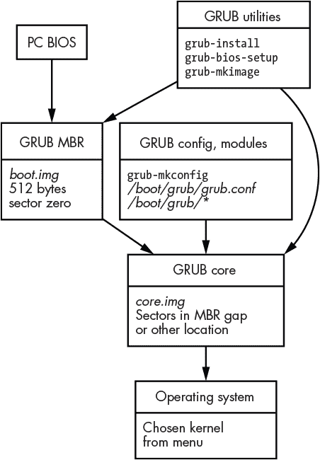
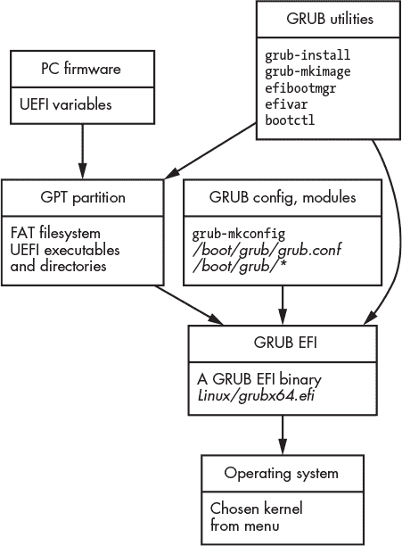

## **6

重建系统启动和初始化**


本章介绍 Linux 系统启动和初始化过程的取证分析。我们将检查启动的早期阶段，其中 BIOS 或 UEFI 固件将控制权交给引导加载程序，内核的加载和执行，以及 systemd 初始化运行系统。此外，还包括电源管理活动的分析，如睡眠和休眠，以及系统最终的关机过程。

### **引导加载程序分析**

传统 PC 使用 BIOS（基本输入输出系统）芯片运行来自磁盘第一个扇区的代码以启动计算机。这个第一个扇区称为 *主引导记录 (MBR)*，它启动了将操作系统内核和其他组件加载到内存中的过程。现代 PC 使用 *统一可扩展固件接口 (UEFI)* 来从 EFI 系统分区中的 FAT 文件系统运行 EFI 二进制程序文件。这些 UEFI 特定的程序由固件直接运行，管理操作系统的加载和执行过程。本节描述了这些 Linux 系统早期启动阶段的取证 artifacts，这些可能对调查人员有价值。

基于 PC 的 Linux 系统使用 BIOS 或 UEFI 启动，采用一种名为 *引导加载程序* 的软件来启动。引导加载程序负责将 Linux 内核和其他组件加载到内存中，选择正确的内核参数并执行内核。非 PC 系统可能有完全不同的启动过程。例如，树莓派不使用 BIOS 或 UEFI，而是有自己独特的引导机制，^(1) 本章也将简要描述。

现代 Linux 计算机大多数使用 *GRand Unified Bootloader (GRUB)* 系统进行启动。GRUB 替代了更古老、基础的引导加载程序 LILO（LInux LOader）。本节主要聚焦于通过 GRUB 的 MBR 和 UEFI 启动。我将在本章后面简要介绍树莓派启动及其他引导加载程序。

从取证角度来看，在分析引导加载程序过程时，我们可能会识别或提取一些 artifacts，例如：

+   已安装的引导加载程序

+   启动多个操作系统的证据

+   曾经安装的多个 Linux 内核的证据

+   启动文件的时间戳

+   分区和文件系统的 UUID

+   启动时传递给内核的参数

+   根文件系统位置

+   休眠映像位置

+   引导加载程序密码哈希值

+   EFI 系统分区内容

+   异常的引导加载程序二进制文件（用于可能的恶意软件分析）

第三章涵盖了分区表的分析，尽管引导加载程序和分区表紧密相关，我选择将它们分开讲解。对引导加载程序可执行代码的全面分析超出了本书的范围。分析恶意修改的引导加载程序涉及恶意软件逆向工程、二进制代码反编译与反汇编，以及代码块的执行调试或追踪。仅此一主题就足以填满一本书，因此这里仅包括提取引导加载程序组件和数据以供分析。BIOS 设置和 EFI 变量的分析是与操作系统无关的，这里只是简要提及。

#### ***BIOS/MBR GRUB 引导***

使用 MBR 启动被视为遗留方式，但仍然在使用（通常用于小型虚拟机）。现代 UEFI 主板支持使用*兼容性支持模块（CSM）*进行 MBR 启动。^(2) 检查 PC 的 BIOS/固件设置可以确认是否启用了 CSM 引导。

图 6-1 显示了使用 MBR 的 Linux GRUB 的示意图。



*图 6-1：GRUB MBR 启动数据流*

BIOS 读取磁盘的第一个扇区并执行代码，如果扇区零的最后两个字节是 0x55 和 0xAA。^(3) 这个签名表示它是一个 MBR。签名前的 64 个字节保留给一个 DOS 分区表，该表由四个每个 16 字节的条目组成。MBR 的前 446 个字节包含可执行的二进制代码（用汇编语言编写），该代码由 BIOS 加载到内存并执行。当你安装或更新 GRUB 的 MBR 时，*boot.img*文件会被写入扇区零（在根据系统要求修改后），并作为初始引导加载程序代码使用。^(4)

GRUB 的 MBR 包含几个可以搜索的字符串，下面显示了它们的十六进制表示：

```
47 52 55 42 20 00 47 65 6f 6d 00 48 61 72 64 20 GRUB .Geom.Hard
44 69 73 6b 00 52 65 61 64 00 20 45 72 72 6f 72 Disk.Read. Error
```

`grub-install`程序运行`grub-bios-setup`来写入 MBR。可以使用`dd`或支持导出扇区的十六进制编辑器提取 512 字节的引导扇区（*boot.img*）。

扇区零中的代码负责加载引导加载器代码的下一阶段并执行它。此后续代码也直接从磁盘上的扇区读取；然而，它的大小要大得多（数十千字节），因此它具有理解分区和文件系统并读取文件的功能。GRUB 2 版本将此阶段称为*core.img*，它由**.img**文件和*grub/*目录中的模块组成。此映像通过`grub-mkimage`创建，并在安装或更新 GRUB 时直接写入驱动器扇区。*core.img*的第一个扇区存储在 MBR 的字节偏移 92（0x5c）处，长度为 8 个字节（在 Intel 上以小端形式存储）。在 DOS 分区驱动器中，*core.img*代码通常位于 MBR（从扇区 1 开始）和第一个分区的起始位置（通常为扇区 63 或 2048）之间的区域。如果此“MBR 间隙”不可用，*core.img*可以存储在驱动器的其他位置，并通过指定的扇区列表读取。*core.img*的第一个扇区包含几个可搜索的字符串，下面是它们的示例及其十六进制表示：

```
6C 6F 61 64 69 6E 67 00 2E 00 0D 0A 00 47 65  loading......Ge
6F 6D 00 52 65 61 64 00 20 45 72 72 6F 72 00  om.Read. Error.
```

`grub-install`程序运行`grub-mkimage`来创建并写入*core .img*到驱动器中。*core.img*的大小和使用的扇区列表（文档中的“块列表”）在*core.img*的初始扇区中指定（称为*diskboot.img*）。可以使用`dd`或支持按扇区导出的十六进制编辑器提取*core.img*扇区。*core.img*代码查找并读取*grub.conf*文件，加载额外的 GRUB 模块，提供菜单系统，并执行其他 GRUB 任务。

#### ***UEFI GRUB 引导***

BIOS/MBR 引导过程是在 1980 年代初期随着原始 IBM PC 的推出而引入的。大约 20 年后，英特尔为 PC 开发了一个更新、更先进的固件和引导系统。这一系统演变为 UEFI 标准，定义了硬件与操作系统之间的现代接口。它包括一种更具扩展性的分区方案，称为*GPT*，一种基于文件的引导分区（而非基于扇区的机制），称为*EFI 系统分区（ESP）*，以及许多其他现代功能。

为了防止在 GPT 分区驱动器上意外丢失分区数据，在扇区零上安装了*保护性 MBR*，该 MBR 定义了一个最大 DOS 分区，类型为 0xEE，指示该驱动器正在使用 GPT 分区。（GPT 分区方案在第三章中讨论。）

固件的日益复杂化有助于简化引导加载过程。与 MBR 不同，EFI 引导不需要直接将代码块写入驱动器的原始扇区。可执行代码可以放在常规文件中，并简单地复制到正常 FAT 文件系统（ESP）中的预期位置。

Linux 发行版可以在 ESP 中指定文件的路径，例如 *EFI/Linux/grubx64.efi*。如果找不到此文件（或没有设置 EFI 变量），则默认文件位于 *EFI/BOOT/BOOT64.EFI*。该文件结合了前面小节中描述的 *boot.img* 和 *core.img* 文件的功能。图 6-2 是使用 UEFI 的 Linux GRUB 图示。



*图 6-2：Grub UEFI 启动数据流*

支持 UEFI 的主板包含比传统 BIOS/MBR 主板更有趣的取证证据。固件中包含持久的 EFI 变量，包含当前和以前安装的操作系统信息、启动顺序、安全启动信息、资产和库存标签等（这些是通用的，可以用来存储任何变量）。从主板的 NVRAM 变量中提取和分析 EFI 变量超出了本书的范围。GRUB 可以检测系统是使用 UEFI 还是 MBR 启动，并可以根据需要在两者上安装。

从取证角度来看，识别并分析在 ESP 分区中发现的可疑二进制文件是很重要的。ESP 曾被用于漏洞利用，也作为提取内存的取证技术。维基解密发布了与 EFI 和 UEFI 相关的泄露文件，来自 Vault 7：CIA 黑客工具公开 (*[`wikileaks.org/ciav7p1/cms/page_26968080.html`](https://wikileaks.org/ciav7p1/cms/page_26968080.html)*)。学术研究也描述了使用 UEFI 二进制文件转储内存镜像的情况 (*[`www.diva-portal.org/smash/get/diva2:830892/FULLTEXT01.pdf`](https://www.diva-portal.org/smash/get/diva2:830892/FULLTEXT01.pdf)*).

#### ***GRUB 配置***

GRUB 在 MBR 和 UEFI 之间的主要差异体现在安装过程上（MBR 写入扇区，UEFI 复制文件并设置 EFI 变量）。然而，它们的配置非常相似。

配置主要围绕 *grub.conf* 文件展开，具体存储位置取决于发行版。以下是几个典型的 *grub.conf* 可能存在的位置：

+   */boot/grub/grub.cfg*

+   */boot/grub2/grub.cfg*

+   *EFI/fedora/grub.cfg*（在 UEFI FAT 文件系统上）

有时，Linux 系统会将一个单独的小文件系统挂载到 */boot/*，用于保存 GRUB 配置文件。

*grub.cfg* 文件通常不会手动修改，而是通过 `grub-mkconfig` 脚本（在某些系统上是 `update-grub`）生成。这些脚本从 */etc/default/grub* 文件读取配置变量，并包含来自 */etc/grub.d/* 目录的辅助脚本。文件 */etc/grub.d/40_custom* 和 */boot/grub/custom.cfg*（如果存在）用于额外的自定义设置。

这里提到的文件可能包含系统管理员所做的更改和自定义设置，在取证检查过程中应进行分析。以下是一个示例 */etc/default/grub* 文件：

```
...
GRUB_DEFAULT=0
GRUB_TIMEOUT_STYLE=hidden
GRUB_TIMEOUT=0
GRUB_DISTRIBUTOR=`lsb_release -i -s 2> /dev/null || echo Debian`
GRUB_CMDLINE_LINUX_DEFAULT="quiet splash"
GRUB_CMDLINE_LINUX=""
...
```

*/usr/bin/grub-mkconfig* shell 脚本^(6) 包含了所有可以定义的变量（在脚本内部查找 `GRUB_*` 行）。`GRUB_CMDLINE_*` 变量很有意思，因为它们包含传递给内核的信息。其他变量由辅助脚本处理。在一些系统中，如 Fedora 和 SUSE，*/etc/sysconfig/grub* 可能会通过符号链接（symlink）指向 */etc/default/grub*。

生成的 *grub.cfg* 文件由多个部分组成，这些部分是从每个辅助脚本生成的。GRUB 有一种内置的脚本语言，用于解析更复杂的 *grub.cfg* 文件，并为用户提供详细的菜单和子菜单界面，以选择启动选项。以下是一个示例，展示了在示例 *grub.cfg* 文件中找到的菜单选项：

```
menuentry 'Arch Linux (on /dev/nvme0n1p3)'
submenu 'Advanced options for Arch Linux (on /dev/nvme0n1p3)
...
menuentry 'Linux Mint 20 Ulyana (20) (on /dev/nvme0n1p4)'
submenu 'Advanced options for Linux Mint 20 Ulyana (20) (on /dev/nvme0n1p4)'
...
menuentry 'System setup'
...
```

在法医检查过程中，`menuentry` 和 `submenu` 行可能会揭示其他操作系统、过去版本的其他操作系统以及其他设置/诊断选项。对于每个菜单选项，传递给内核的参数都已定义，包括当前和过去的根 UUID 以及休眠镜像的位置（`resume=`）。这些在 Linux 法医检查中很有意义，因为它们提供了驱动器上操作系统安装活动的重建。

历史上，Linux 用户会在不同的操作系统之间双重启动，但现在在一个主机操作系统内部使用虚拟机变得越来越普遍。因此，并非所有已安装的操作系统都会被 GRUB 配置脚本检测到，也不会在 *grub.cfg* 文件中显示。

除了加载内核和 initramfs 二进制镜像（将在下一节中描述），GRUB 还可以加载 CPU 固件更新（来自同一目录），通常对于 Intel 为 *ucode.img*，对于 AMD 为 *amd-ucode.img*。

在某些情况下，可能会找到 GRUB 密码。如果该密码仅用于在启动时控制访问，它不会影响我们在法医环境中获取镜像或分析系统的能力。以下示例（由 SUSE 脚本生成）展示了一个受密码保护的 *grub.cfg* 条目：

```
### BEGIN /etc/grub.d/42_password ###
# File created by YaST and next YaST run probably overwrite it
set superusers="root"
password_pbkdf2 root grub.pbkdf2.sha512.10000.0E73D41624AB768497C079CA5856E5334A
40A539FE3926A8830A2F604C78B9A1BD2C7E2C399E0F782D3FE7304E5C9C6798D49FBCC1E1A89EFE
881A46C04F2E.34ACCF04562ADDBD26781CA0B4DD9F3C75AE085B3F7937CFEA5FCC4928F10A382DF
7A285FD05CAEA283F33C1AA47AF0AFDF1BF5AA5E2CE87B0F9DF82778276F
export superusers
set unrestricted_menu="y"
export unrestricted_menu
### END /etc/grub.d/42_password ###
```

GRUB 的另一个功能是在启动加载过程中请求密码，以解锁 LUKS 加密的根文件系统（见 第三章 中的 LUKS 加密部分）。

你可以在在线手册中找到 *grub.cfg* 中使用的 GRUB 脚本语言、文件格式、设计细节以及更多内容（* [`www.gnu.org/software/grub/manual/grub/`](https://www.gnu.org/software/grub/manual/grub/) *）。

#### ***其他引导加载程序***

SYSLINUX 是一个设计用来从 DOS/Windows 文件系统引导的引导加载程序，它使新手 Linux 用户能够更容易地安装 Linux 或测试实时系统。它有时也用于引导 Linux 救援镜像。可以通过根目录中存在 *LDLINUX.SYS* 文件来识别 SYSLINUX 镜像。此外，*syslinux.cfg* 配置文件可能位于根目录（/）或 */boot/* 或 */syslinux/* 子目录中。该文件决定了 SYSLINUX 的行为，并可能包含（使用 `INCLUDE` 配置参数）其他配置文件。这些文件包含信息，例如菜单选项、内核镜像和初始 ramdisk 的位置、内核命令行及其他定义的变量。

SYSLINUX 文件位于 FAT 文件系统上，可以使用常规的文件系统取证工具进行分析。在同一软件项目中，还有 ISOLINUX、EXTLINUX 和 PXELINUX 变体，分别用于从光盘、Linux 文件系统和网络引导（使用 DHCP 和 TFTP）进行启动。有关更多信息，请访问该项目的官方网站 (*[`www.syslinux.org/`](https://www.syslinux.org/)*).

systemd 开发者创建了一个替代的 UEFI 引导加载程序和管理器，名为 systemd-boot（前身为 Gummiboot），旨在提供一个简单的菜单系统、基本的配置文件和其他功能。systemd-boot 的一个特点是期望内核和初始 ramdisk 镜像位于 EFI 系统分区中。主板的 NVRAM 存储了一些与 systemd-boot 相关的 EFI 变量。UEFI 固件执行 `systemd-bootx64.efi`，这是一个 EFI 二进制文件，它查找默认配置文件 *loader/loader.conf*。有关多操作系统启动的进一步配置可以在 *loader/entries/** 中找到（通常每个操作系统启动选项对应一个目录）。从数字取证的角度来看，整个引导过程和文件都包含在一个 FAT 文件系统中，可以使用常见的 FAT 文件系统取证工具来分析文件的时间戳和已删除文件的证据。有关更多信息，请参阅 systemd-boot(7) 手册和引导加载程序规范文档 (*[`systemd.io/BOOT_LOADER_SPECIFICATION/`](https://systemd.io/BOOT_LOADER_SPECIFICATION/)*).

无盘系统可以使用预启动执行环境（PXE）通过网络引导操作系统。在这里，主板固件向本地网络段发送 DHCP 请求，然后获取引导加载程序、内核和 initramfs。根文件系统随后通过 NFS 或其他网络文件共享协议进行挂载。网络启动的计算机可能仍然有本地驱动器用于缓存或交换，这些都可以进行分析。如果没有安装物理驱动器，所有取证证据（操作系统文件系统树、用户主目录等）将存储在 PXE 服务器上。

树莓派不使用 MBR、UEFI 或甚至 GRUB 进行启动，而是依赖于自己的一种多阶段启动过程。^(7) 启动加载程序的第一阶段是 ROM 中的代码，它加载第二阶段的 *bootcode.bin* 文件（该文件存储在树莓派 4 型号的 EEPROM 中）。第三阶段（*start*.elf）是一个二进制固件镜像，它查找并启动内核。潜在有趣的文物是 *boot/* 目录下几个文件中的用户可配置设置。*cmdline.txt* 文件指定传递给内核的参数。*settings.conf* 文件指定用于在启动时配置树莓派的引导加载程序的参数。可能还存在一个包含 Wi-Fi 网络和密码的 *wpa_supplicant.conf* 文件。如果在第一次启动时存在 *ssh* 或 *ssh.txt* 文件，systemd 单元（*/lib/systemd/system/sshswitch.service*）将启用 SSH 并删除该文件。有关这些信息，请参阅树莓派官方网站 (*[`www.raspberrypi.org/documentation/`](https://www.raspberrypi.org/documentation/)*）。

另外，值得一提的是 Linux 容器及其启动方式。由于容器是在运行中的 Linux 主机系统内启动的，并与主机共享相同的内核，因此它们不需要引导加载程序。可以使用容器管理器（如 LXC、systemd-nspawn 等）提供的命令，在容器中启动具有独立文件系统树的 Linux 系统。在此进行法医分析时，可能需要检查宿主系统和容器的文件树。

### **内核初始化分析**

Linux 内核是模块化和可配置的。内核模块可以在编译时构建到内核中，也可以在启动或操作期间动态加载，或由用户手动加载。内核和模块的配置可以在启动时进行，加载模块时（`modprobe`），或由用户手动配置。本节中，我将描述如何识别已加载的模块以及内核的配置方式。

模块的加载和内核的配置状态在操作过程中动态变化，并且只有在机器运行时才可见。事后法医分析必须通过推导或推测来进行，因为我们无法观察到正在运行的内核（除非我们有内存镜像）。本节重点讨论启动时定义的模块和配置，并尝试查找操作过程中发生的其他变化的痕迹。

在法医分析中，了解内核的配置和已加载的模块帮助我们重建正在分析的机器的状态，这有助于回答各种问题并识别以下内容：

+   加载的非默认内核模块

+   防止加载的默认内核模块

+   明确或更改的内核配置

+   系统管理员明确手动做出的更改

+   恶意行为者引入的变化

我们特别关注那些偏离发行版或已安装软件包默认设置的模块和配置。如果我们能够识别出非默认、显式或故意的活动，我们可以尝试找出这些变化发生的原因和方式。

#### ***内核命令行和运行时参数***

内核只是一个程序，尽管它是一个独特且特殊的程序。像大多数程序一样，它可以通过参数启动，以提供一些初始配置。这些参数有时被称为*内核命令行*，由引导加载程序提供，并在启动时传递给内核。

内核命令行参数在启动时配置系统的多个部分，包括以下内容：

+   核心内核参数

+   内核内置模块的参数

+   初始化系统参数（`systemd pid 1`）

内核理解多个参数，这些参数允许它在执行时进行自我配置。内置的内核模块可以通过点号（`.`）分隔模块名称和模块参数来配置；例如，`libata.allow_tpm=1`。为可加载模块指定的参数可能由初始化进程的启动脚本和单元处理。内核无法理解的参数会传递给初始化系统，无论是作为命令参数还是环境变量。

在运行中的系统上，命令行位于*/proc/cmdline*；然而，对于死后调查，我们必须在持久存储中寻找证据。由于引导加载程序将命令行传递给内核，因此这些参数可能存储在引导加载程序配置中（我们在前面一节中已讨论）。

对于 GRUB 引导加载程序，内核命令参数通常可以在*/boot/grub/grub.cfg*文件中找到（某些发行版使用*grub2*目录）。查找以`linux`开头的行（可能有缩进），后面跟着内核镜像的路径。参数列在内核镜像文件名之后，如下所示：

```
linux /boot/vmlinuz-linux root=UUID=da292e26-3001-4961-86a4-ab79f38ed237
rw resume=UUID=327edf54-00e6-46fb-b08d-00250972d02a libata.allow_tpm=1
intel_iommu=on net.ifnames=0
```

在这个例子中，定义了根文件系统（`root=UUID=...`），定义了休眠分区（`resume=UUID=...`），配置了内置的`libata`模块参数（`libata.allow_tpm=1`），配置了核心内核参数（`intel_iommu=on`），并将网络配置传递给 systemd 初始化（`net.ifnames=0`）。

如前所述，*grub.cfg*文件通常是通过脚本生成的。这些脚本读取*/etc/default/grub*文件，以获取在`GRUB_CMDLINE_*`变量中定义的附加内核参数。对于 systemd-boot，内核参数定义在*loader/entries/**文件中。在 Raspberry Pi 系统上，用户可配置的内核命令行存储在*/boot/cmdline.txt*中（启动过程可能会在启动内核之前添加附加参数）。内核命令行(7)手册页面描述了由 systemd 初始化过程解释的附加参数。

内核命令行上可能有趣的法医证据包括：

+   内核镜像的名称和位置

+   根文件系统的位置（及可能的 UUID）（`root=`）

+   潜在的休眠内存转储的位置（`resume=`）

+   要加载的模块的配置（`module.parameter=`）

+   可能的替代 init^(8) 程序（`init=`）

+   其他指示使用某些硬件的内核配置

+   可能的篡改或滥用迹象

理解内核命令行能让调查人员更全面地理解正在检查的 Linux 系统。有关命令列表和更多信息，请参见 bootparam(7) 手册页和 Linux 内核文档 (*[`www.kernel.org/doc/html/latest/admin-guide/kernel-parameters.html`](https://www.kernel.org/doc/html/latest/admin-guide/kernel-parameters.html)*)。

#### ***内核模块***

模块为内核提供功能，以管理文件系统、网络协议、硬件设备和其他内核子系统。模块可以在编译时静态构建到内核中，也可以动态添加到正在运行的内核中。

要列出静态编译到内核中的模块，我们可以查看安装的内核中的*/lib/modules/*/modules.builtin*文件：

```
$ cat /lib/modules/5.7.7-arch1-1/modules.builtin
kernel/arch/x86/platform/intel/iosf_mbi.ko
kernel/kernel/configs.ko
kernel/mm/zswap.ko
...
```

因为这些模块在文件系统中是静态的，所以它们在事后取证分析中很容易识别和检查。可能还会安装多个内核，可以将它们相互比较，并与发行版的原始文件进行比较。

动态插入和移除的模块可以通过启动配置和可用日志来识别。要确定启动时加载的模块，可以检查多个地方的配置文件。

systemd 初始化过程提供了 `systemd-modules-load` `.service` 来在启动时加载内核模块。用户（或系统管理员）可以通过将配置文件放入 */etc/modules-load.d/*.conf* 来显式加载模块。提供自己配置来显式加载模块的软件包可以在 */usr/lib/modules-load.d/*.conf* 中找到。以下是一个加载 CUPS 打印系统模块的配置文件示例：

```
$ cat /etc/modules-load.d/cups-filters.conf
# Parallel printer driver modules loading for cups
# LOAD_LP_MODULE was 'yes' in /etc/default/cups
lp
ppdev
parport_pc
```

有关更多信息，请参见 systemd-modules-load(8) 和 modules-load.d(5) 手册页。

还有其他地方可以查找内核模块加载/卸载活动的证据。一些发行版（例如基于 Debian 的发行版）可能会有一个*/etc/modules*文件，里面包含了启动时需要加载的额外模块列表。可以通过搜索 shell 历史文件（包括 root 用户和可能使用 `sudo` 的非 root 用户）来查找包含命令的证据，例如`modprobe`、`insmod`或`rmmod`，以识别用户插入或移除的模块。内核命令行可以在早期启动过程中（由 systemd 进行）用来加载模块。这些命令行选项是`modules_load=<modulename>`或`rd.modules_load=<modulename>`；后者指的是初始 RAM 磁盘（rd）。

在内核中插入和移除模块可能会或可能不会生成日志条目。日志记录的多少取决于模块的开发者。例如，`i2c_dev`驱动程序在从内核中移除时不打印任何内容，插入时仅打印最少的信息。以下是 dmesg 中的日志条目：

```
[13343.511222] i2c /dev entries driver
```

如果生成内核模块日志信息（通过内核环形缓冲区），它通常会传递到 dmesg、syslog 或 systemd 日志中。有关检查内核消息的更多信息，请参见第五章。

在取证检查过程中，应检查这些模块配置文件和目录，查看是否有不寻常或无法解释的内核模块。特别是，应检查那些偏离发行版和软件包默认设置的模块。

#### ***内核参数***

初始内核配置在系统启动时设置，随后根据系统需求动态重新配置。动态更改配置的一些示例可能包括添加、移除或修改硬件；更改网络设置；挂载文件系统等。甚至主机名也是在系统启动时设置的内核配置项。此处的取证分析涉及重建系统启动时的内核配置，并确定系统运行过程中发生的变化。特别是，我们关注偏离正常默认值的配置，可能是用户或恶意行为者所引入的。

还可以在运行时手动指定内核参数。在运行中的系统上，系统管理员可以使用`sysctl`命令读取和写入内核参数，或者通过将文本重定向到/从*/proc/sys/*目录中的适当伪文件进行操作。在事后取证调查中，我们可以在 shell 历史文件中或日志中搜索`sysctl`命令的痕迹，查看是否有`sysctl`命令与权限提升一起使用的证据。以下示例显示了一个非特权用户（Sam）使用 sysctl `-w`标志设置内核参数：

```
Dez 09 16:21:54 pc1 sudo[100924]: sam : TTY=pts/4 ; PWD=/ ; USER=root ;
COMMAND=/usr/bin/sysctl -w net.ipv6.conf.all.forwarding=1
```

该用户启用了 IPv6 数据包转发。如果一个组织只专注于管理 IPv4 安全性，那么这一行为可能是绕过网络控制或减少检测机会的恶意尝试。

内核参数还可以通过将其添加到配置文件中，在启动时进行设置。这些配置文件遵循典型的 Linux 惯例，配置文件位于*/etc/*目录下，附加配置文件则位于以下目录：

+   */etc/sysctl.conf*

+   */etc/sysctl.d/*.conf*

+   */usr/lib/sysctl.d/*.conf*

系统管理员通常会修改*sysctl.conf*或在*/etc/sysctl.d/*目录中创建文件。需要内核配置的已安装软件包也可能将配置文件放在*/usr/lib/sysctl.d/*目录中。

在取证调查期间，应审核提供 sysctl 配置的文件和目录，以寻找不寻常或未解释的内核设置。通过将它们与原始文件进行比较，可以找到自定义修改和与发行版默认设置的偏差。文件的创建时间和最后修改时间可能是变更发生时间的潜在指标。手动内核设置更改可能为调查提供额外洞察（例如，变更可能指示在过去某个时点手动安装特定硬件设备）。

更多关于 sysctl 的信息，请参阅 sysctl(8)、sysctl.conf(5) 和 sysctl.d(5) 手册页面。

#### ***分析 initrd 和 initramfs***

内核二进制可执行文件通常称为 vmlinuz^(9)，通常位于 */boot/* 目录中。它也可能是指向带有版本信息的文件名的符号链接（例如 *vmlinuz-5.4.0-21-generic*）。通常还会找到一个称为 *initrd* 或 *initramfs* 的伴侣文件（有时带有 **.img* 扩展名）。这些文件也可能是指向带有版本信息的文件名的符号链接（例如 *initrd.img-5.4.0-21-generic* 或 *initramfs-5.4-x86_64.img*）。

*initrd* 和 *initramfs* 文件解决了内核引导时的鸡和蛋问题。内核需要各种文件、实用工具和模块来挂载根文件系统，但这些项目位于尚未能够挂载的根文件系统上。为了解决这个问题，引导加载程序将临时的最小根文件系统加载到内存中，并将其作为 RAM 磁盘提供给内核。这称为*初始 RAM 磁盘*，有两种形式：initrd 和 initramfs（有关更多信息，请参阅 initrd(4) 手册页面）。初始化 RAM 磁盘文件是通过安装或更改/升级内核时由引导加载程序工具（如 mkinitramfs、mkinitcpio 或 dracut）运行脚本创建的。

内核运行内部初始化程序，该程序位于 initramfs 中（参数可以传递给内核命令行），并且初始设置开始。一些发行版使用 busybox^(10) 作为 initramfs 中的初始化程序。其他一些，通常基于 dracut^(11)，使用 systemd 初始化。完成后，切换到主根文件系统并将执行权传递给主初始化系统以开始完整系统启动。

从取证的角度来看，初始 RAM 磁盘的内容可能包含有关系统和引导过程的有趣信息，例如以下内容：

+   可能的文件时间戳（尽管一些系统将文件设置为 Unix 纪元，即 1970 年 1 月 1 日）

+   可执行文件和内核模块列表

+   配置文件（如 */etc/fstab*）

+   脚本（启动、自定义等）

+   RAID 配置的信息

+   加密文件系统的信息

+   Kiosk 和 IoT 设备的自定义启动

在涉及加密文件系统的情况下，初始 RAM 磁盘可能是唯一可以分析的未加密数据。可能还会包含解密过程和密钥位置的信息。

如果商业取证工具无法访问初始 RAM 磁盘文件的内容，调查员可以将文件复制到类似的 Linux 发行版中，使用 Linux 命令进行分析。

例如，使用`lsinitcpio`列出 Arch Linux *initramfs*文件的内容如下所示：

```
$ lsinitcpio -v initramfs-linux.img
lrwxrwxrwx   0 root   root        7 Jan 1 1970 bin -> usr/bin
-rw-r--r--   0 root   root     2515 Jan 1 1970 buildconfig
-rw-r--r--   0 root   root       82 Jan 1 1970 config
drwxr-xr-x   0 root   root        0 Jan 1 1970 dev/
drwxr-xr-x   0 root   root        0 Jan 1 1970 etc/
-rw-r--r--   0 root   root        0 Jan 1 1970 etc/fstab
-rw-r--r--   0 root   root        0 Jan 1 1970 etc/initrd-release
...
```

`lsinitcpio`命令还可以通过`-a`标志提供有用的分析摘要。

使用`lsinitramfs`列出 Debian *initrd*文件内容的输出如下所示：

```
$ lsinitramfs -l initrd.img-4.19.0-9-amd64
drwxr-xr-x   1 root   root        0 Jun 1 08:41 .
lrwxrwxrwx   1 root   root        7 Jun 1 08:41 bin -> usr/bin
drwxr-xr-x   1 root   root        0 Jun 1 08:41 conf
-rw-r--r--   1 root   root       16 Jun 1 08:41 conf/arch.conf
drwxr-xr-x   1 root   root        0 Jun 1 08:41 conf/conf.d
-rw-r--r--   1 root   root       49 May 2 2019 conf/conf.d/resume
-rw-r--r--   1 root   root     1269 Feb 6 2019 conf/initramfs.conf
drwxr-xr-x   1 root   root        0 Jun 1 08:41 etc
-rw-r--r--   1 root   root        0 Jun 1 08:41 etc/fstab
...
```

Fedora 和 SUSE 有一个类似的工具叫做`lsinitrd`，用来列出初始 RAM 磁盘文件的内容。

列出文件内容后，可能需要提取文件以进行进一步分析。一个简单的方法是使用`unmkinitramfs`或`lsinitcpio`工具将所有内容提取到一个单独的目录中，具体取决于 Linux 发行版。以下是在 Debian 系统上提取*initrd*文件的示例：

```
$ unmkinitramfs -v initrd.img-5.4.0-0.bpo.4-amd64 evidence/
...
bin
conf
conf/arch.conf
conf/conf.d
conf/initramfs.conf
conf/modules
cryptroot
cryptroot/crypttab
...
$ ls evidence/
bin   cryptroot/ init lib32 libx32 sbin     usr/
conf/ etc/       lib  lib64 run/   scripts/ var/
```

在 Arch 系统上，可以使用相同的`lsinitcpio`命令，但需要加上`-x`标志：

```
$ lsinitcpio -v -x initramfs-linux.img
```

在这些示例中，`unmkinitramfs`和`lsinitcpio`会将内容提取到当前目录，因此需要具有写权限。对于死后检查，被分析的文件可以复制到一个单独的分析系统中。

理论上，应该可以使用常规的商业取证工具分析这些文件，而不需要 Linux 系统。文件通常是使用 gzip 或 zstd 压缩的 CPIO 归档文件。文件可以先解压，然后像正常的 CPIO 归档（标准 Unix 格式，类似于 tar）一样处理。这两个示例通过将压缩程序（`gunzip`或`zstcat`）的输出传递给`cpio`程序，列出*initramfs*的内容：

```
$ gunzip -c initramfs-linux.img | cpio -itv
$ zstdcat initramfs-linux.img | cpio -itv
```

移除`cpio`标志中的`t`标志会将内容提取到当前目录中。

启动加载程序也可以以类似于*initrd*文件的方式加载 CPU 微代码更新。这些也可能以 CPIO 文件的形式打包（但不压缩），并且可以使用`cpio`命令列出内容。以下是显示 Intel 和 AMD 处理器的两个示例：

```
$ cpio -itv < intel-ucode.img
drwxr-xr-x  2 root   root         0 Apr 27 14:00 kernel
drwxr-xr-x  2 root   root         0 Apr 27 14:00 kernel/x86
drwxr-xr-x  2 root   root         0 Apr 27 14:00 kernel/x86/microcode
drwxr-xr-x  2 root   root         0 Apr 27 14:00 kernel/x86/microcode/.enuineIntel
.align.0123456789abc
-rw-r--r--  1 root   root   3160064 Apr 27 14:00 kernel/x86/microcode/GenuineIntel.bin
6174 blocks
...
$ cpio -itv < amd-ucode.img
-rw-r--r--  0 root   root     30546 May 27 10:27 kernel/x86/microcode/AuthenticAMD.bin
61 blocks
```

这些文件中的时间戳可能不同。它们可以来自原始打包过程，也可以来自本地安装过程。

一些*initramfs*文件（例如 Red Hat）包含一个固件和 initramfs 的单一归档文件（彼此附加）。要提取第二个文件，可以使用`skipcpio`工具，该工具来自 dracut 软件包。

Raspberry Pi 的操作方式不同，不需要初始 RAM 磁盘。由于硬件是标准化的，Raspberry Pi 开发人员可以创建一个包含所有必要驱动程序的特定内核。

### **Systemd 分析**

从数字取证的角度来看，我们希望了解系统在启动过程中做了什么，完全启动后的目标状态是什么样的，以及随着时间的推移发生了什么活动。特别是，我们要重建偏离默认发行版行为的配置和活动。这包括由系统管理员明确创建的配置、安装的软件包或可能的恶意进程或攻击者。

最常见的 Linux 初始化系统是 systemd。自 2010 年首次宣布以来，systemd 已被所有主要的 Linux 发行版采用，取代了传统的 Unix sysvinit 以及其他发行版特有的替代方案，如 Ubuntu 的 Upstart。Systemd 从根本上与传统的 Unix 和 Linux 初始化系统不同，其引入并非没有争议。

本节重点介绍 systemd 的系统初始化过程。在进行事后取证分析时，我们希望重建由系统运行时的 systemd 命令（例如 `systemctl`）提供的基本相同的信息，这可以通过检查文件系统上的 systemd 文件和目录来完成。

Systemd 的文档非常完备。systemd.index(7) 手册页列出了所有 systemd 手册页（超过 350 个）。对于不熟悉 Linux 的取证调查员来说，这些手册页是关于 systemd 最好且最权威的信息来源。

**注意**

*警告：systemd 广泛使用符号链接。如果你在调查 Linux 机器上挂载了一个可疑的 Linux 文件系统，这些符号链接可能指向你自己的安装，而不是可疑驱动器。请确保在取证检查时，分析的是可疑文件系统中的正确文件。*

#### ***Systemd 单元文件***

Systemd 使用配置文件来初始化系统并管理服务。这是与传统的 Unix 和 Linux 初始化系统的根本变化，后者使用 shell 脚本来实现类似的目标。

Systemd 使用 *单元* 的概念来控制系统的启动或服务的运行。单元有相关的文本文件，称为 *单元配置文件*。单元文件内容组织成多个部分，每部分包含由系统管理员、软件包维护者或发行版供应商设置的指令或选项。单元文件不仅用于系统启动，还用于操作维护（启动、停止、重启、重载等）和系统关机。更多信息可以在 systemd(1) 和 bootup(7) 手册页中找到。

以下列表展示了 systemd 的 11 种不同单元类型，列出了它们控制的对象以及描述单元文件的手册页：

**服务** 程序或守护进程；systemd.service(5)

**套接字** 用于 IPC 和套接字；systemd.socket(5)

**目标** 单元组；systemd.target(5)

**设备** 用于内核设备；systemd.device(5)

**挂载** 文件系统挂载点；systemd.mount(5)

**自动挂载** 文件系统按需挂载；systemd.automount(5)

**定时器** 基于时间的单元激活；systemd.timer(5)

**交换** 交换分区或文件；systemd.swap(5)

**路径** 基于文件更改的单元激活；systemd.path(5)

**切片** 用于资源管理的单元分组；systemd.slice(5)

**作用域** 由进程父项分组的单元；systemd.scope(5)

单元文件是普通的文本文件，文件名描述单元类型，扩展名与类型匹配（例如 *httpd.service* 或 *syslog.socket*）。单元文件还可能包含一个关联的 **.d** 目录，该目录包含 **.conf** 文件，用于提供额外的配置。

单元文件可以包含 `[Unit]` 和 `[Install]` 部分，这些部分包含描述单元基本行为并提供通用单元设置的选项（参见 systemd.unit(5) 手册页）。除 *target* 和 *device* 外，所有单元文件都有一个自命名的部分，包含特定于该单元类型的附加选项。例如，*service* 有一个 `[Service]` 部分，*socket* 有一个 `[Socket]`，以此类推。*service*、*socket*、*swap* 和 *mount* 单元有附加选项，指定路径、用户、组、权限以及与执行环境相关的其他选项（参见 systemd.exec(5) 手册页）。*service*、*socket*、*swap*、*mount* 和 *scope* 单元具有附加的终止选项，描述如何终止属于单元的进程（参见 systemd.kill(5) 手册页）。*slice*、*scope*、*service*、*socket*、*mount* 和 *swap* 单元具有附加的资源控制选项，指定 CPU 和内存使用、IP 网络访问控制、^(12) 和其他限制（参见 systemd.resource-control(5) 手册页）。所有可用的 systemd 选项、变量和指令（超过 5,000 个！）都列在 systemd.directives(7) 手册页中。在检查单元文件时，此索引应为您提供理解各个选项所需的文档。

以下示例是一个典型的服务单元文件。它是通过发行版提供的 xorg-xdm 包安装的，并提供图形化登录界面：

```
$ cat /usr/lib/systemd/system/xdm.service
[Unit]
Description=X-Window Display Manager
After=systemd-user-sessions.service

[Service]
ExecStart=/usr/bin/xdm -nodaemon
Type=notify
NotifyAccess=all

[Install]
Alias=display-manager.service
```

`[Unit]` 部分提供描述和依赖信息。`[Service]` 部分定义要运行的命令及其他选项，这些选项在 systemd.service(5) 手册页中有描述。`[Install]` 部分提供启用或禁用单元所需的信息。

systemd 可以作为 *系统* 实例（在初始化和系统操作期间）或 *用户* 实例（在用户登录会话期间）运行。用户可以创建和管理自己的 systemd 单元文件。具有特权访问权限的系统管理员可以管理 systemd 系统单元文件。在进行 Linux 系统取证检查时，您需要知道在哪里查找单元文件。这些文件会在多个常见位置创建并保存。

由发行版打包系统安装的单元文件位于*/usr/lib/systemd/system/*目录下（某些发行版可能使用*/lib/systemd/system/*）。由系统管理员安装的单元文件或在系统配置过程中创建的文件通常安装在*/etc/systemd/system/*目录下。系统管理员在*/etc/systemd/system/*目录中创建的文件优先于*/usr/lib/systemd/system/*目录中的文件。那些不是任何已安装包的一部分的单元文件很有意思，因为它们是由管理员显式添加的，或者是潜在恶意的特权进程添加的。

用户单元文件可以由发行版的打包系统、系统管理员或用户本人创建。发行版的用户单元文件位于*/usr/lib/systemd/user/*目录下，系统管理员的用户单元文件位于*/etc/systemd/user/*目录下。用户可以将自己的单元文件放置在其主目录的*~/.config/systemd/user/*中。用户单元文件在用户的登录会话期间使用。

从取证的角度来看，用户自己的单元文件很有趣，因为它们可能是由正在运行的程序创建的，或是手动显式创建的，或者是针对用户的恶意活动所创建的。查看 systemd.unit(5)的 man 页面，了解 systemd 搜索单元文件的完整位置列表。

如果单元文件为空（零字节）或符号链接到*/dev/null*，则被认为是*屏蔽*的，这意味着它不能被启动或启用。在运行的系统中，单元目录可以在*/run/systemd/*伪目录中找到；然而，它们仅存在于运行系统的内存中，因此在事后取证检查时将无法访问。

#### ***Systemd 初始化过程***

当内核启动并挂载根文件系统后，它会寻找初始化程序（通常符号链接到*/lib/systemd/systemd*）来初始化系统的用户空间。当 systemd 启动时，它会读取*/etc/systemd/system.conf*文件来进行自我配置。此文件提供了多种选项来改变 systemd 的行为。以下是*system.conf*文件的一部分：

```
[Manager]
#LogLevel=info
#LogTarget=journal-or-kmsg
#LogColor=yes
#LogLocation=no
#LogTime=no
#DumpCore=yes
#ShowStatus=yes
#CrashChangeVT=no
#CrashShell=no
#CrashReboot=no
#CtrlAltDelBurstAction=reboot-force
...
```

默认文件列出了所有编译时的默认条目，但这些条目是被注释掉的（使用`#`）。系统管理员可以通过修改或添加条目来偏离这些默认设置。此文件配置日志记录、崩溃、各种限制、记账及其他设置。更多信息请参见 systemd-system.conf(5)的 man 页面。

当其他 systemd 守护进程启动（或重新加载）时，它们也会读取各种*/etc/systemd/*.conf*配置文件。以下是这些文件的一些示例，它们可以通过其 man 页面查看：

+   systemd-user.conf(5)

+   logind.conf(5)

+   journald.conf(5)

+   journal-remote.conf(5)

+   journal-upload.conf(5)

+   systemd-sleep.conf(5)

+   timesyncd.conf(5)

+   homed.conf(5)

+   coredump.conf(5)

+   resolved.conf(5)

systemd.syntax(7) 手册页将这些称为 *守护进程配置文件*，不应与单元文件混淆。通常，这些配置文件（包括 *system.conf*）还会列出默认选项，这些选项会被注释掉（以 `#` 开头）。在取证检查中，查看 `*.conf` 条目，若这些条目没有注释或被添加了内容，表示系统所有者已做出明确更改。

传统的 Unix 和 Linux 系统有 *运行级别*，系统可以启动到不同的操作状态（单用户、多用户等）。Systemd 有类似的概念，称为 *目标*。当定义的一组单元成功激活时，就达到了一个目标。目标的主要目的是管理依赖关系。

当 systemd 启动时，它会启动所有需要的单元，以实现默认目标状态。默认目标是 *default.target* 单元文件，通常是指向其他目标的符号链接，例如 *graphical.target* 或 *multi-user.target*。Linux 系统中的一些常见目标状态包括：

***rescue.target*** 单用户模式，供系统管理员使用，没有用户，最小化服务

***sysinit.target*** **和** ***basic.target*** 设置交换分区、本地挂载点、套接字、定时器等

***multi-user.target*** 完全启动的系统，没有图形界面（典型的服务器配置）

***graphical.target*** 完全启动的图形化系统

***default.target*** 默认目标，通常是指向 multiuser 或 graphical 目标的符号链接

***shutdown.target*** 清理地关闭系统

systemd 标准目标在 systemd.special(7) 和 bootup(7) 手册页中有描述。传统的 Unix 风格引导在 boot(7) 手册页中有说明。默认目标可以通过在内核命令行中显式提供另一个目标名称来覆盖（`systemd.unit=`）。

单元文件包含关于与其他单元文件或目标之间依赖关系的信息。这些信息在`[Unit]`和`[Install]`部分中定义。在启动过程中，`[Unit]`部分定义了依赖关系以及如果这些依赖项失败时，单元如何表现。以下列表显示了一些常见的依赖选项：

| Wants= | 该单元需要的其他单元（即使它们失败也继续） |
| --- | --- |
| Requires= | 该单元所需的其他单元（如果它们失败则失败） |
| Requisite= | 如果其他单元尚未激活，则失败 |
| Before= | 该单元必须在这些单元之前激活 |
| After= | 该单元必须在这些单元之后激活 |

`Wants=` 和 `Requires=` 选项的替代方法是将单元文件或指向单元文件的符号链接放置在 **.wants/* 或 **.requires/* 目录中。

从 *default.target* 单元文件开始，可以向后追溯并根据 `Requires=` 和 `Wants=` 配置项或 **.wants/* 和 **.requires/* 目录构建所有已启动单元文件的列表。这种方法需要进行详尽的手动检查，在某些调查中可能是必要的。如果你只想评估在正常情况下由系统管理员创建或启用的服务，可以分析 */etc/systemd/system/* 目录中是否存在单元文件（或指向单元文件的符号链接）。

单元文件的 `[Install]` 部分中的选项用于通过 `systemctl` 命令启用或禁用单元。systemd 在启动时不使用这一部分。`[Install]` 依赖项可以通过 `WantedBy=` 或 `RequiredBy=` 选项来定义。

#### ***Systemd 服务和守护进程***

*守护进程*（发音为 dee-men 或 day-mon）源自 Unix，描述了一个在后台运行的进程。Systemd 使用 **.service* 单元文件来启动守护进程，该文件包含 `[Service]` 部分，用于配置守护进程的启动方式。守护进程还可以通过各种激活方式按需启动（在下一节中介绍）。*服务* 和 *守护进程* 这两个词经常互换使用，但在 systemd 的上下文中，它们有一些区别。systemd 服务更加抽象，可以启动一个或多个守护进程，并且具有不同的服务类型。

**注意**

*启动和停止服务与启用和禁用服务不同。如果服务是*启用*的，它将在启动时自动启动。如果*禁用*，它将在启动时不会启动。服务可以在系统运行时由系统管理员启动和停止，而不受启用/禁用状态的影响。*被屏蔽*的服务不能启动或启用。*

systemd 下的守护进程与传统 Unix 守护进程有所不同，因为它们的终端输出（`stdout` 和 `stderr`）会被 systemd 日志捕获。有关 systemd 和传统守护进程的详细比较，请参见 *[`www.freedesktop.org/software/systemd/man/daemon.html`](https://www.freedesktop.org/software/systemd/man/daemon.html)*。

这个示例单元文件（`sshd.service`）管理安全外壳守护进程：

```
[Unit]
Description=OpenSSH Daemon
Wants=sshdgenkeys.service
After=sshdgenkeys.service
After=network.target

[Service]
ExecStart=/usr/bin/sshd -D
ExecReload=/bin/kill -HUP $MAINPID

KillMode=process
Restart=always

[Install]
WantedBy=multi-user.target
```

该文件描述了如何启动、停止和重新加载守护进程，并指明何时启动它。

在实时系统中，单元可以是活动的或非活动的（即，已启动或已停止），其状态可以通过 `systemctl status` 命令进行检查。在取证镜像中，我们只能确定单元是否在启动时启用或禁用（显然，死机系统上没有任何活动）。当系统管理员显式启用服务时，会在 */etc/systemd/system/* 或 **.target.wants/* 目录下创建一个符号链接。检查这些目录中的所有符号链接将显示为每个目标启动的服务。

在前面代码块中的示例 *sshd.service* 单元文件中，我们可以通过观察在多用户目标的 **.wants/* 目录中创建的符号链接，来确定安全外壳守护进程是否已启用：

```
$ stat /etc/systemd/system/multi-user.target.wants/sshd.service
  File: /etc/systemd/system/multi-user.target.wants/sshd.service ->
  /usr/lib/systemd/system/sshd.service
  Size: 36         Blocks: 0          IO Block: 4096  symbolic link
Device: 802h/2050dInode: 135639164  Links: 1
Access: (0777/lrwxrwxrwx) Uid: (  0/  root)  Gid: (  0/  root)
Access: 2020-08-09 08:06:41.733942733 +0200
Modify: 2020-08-09 08:06:41.670613053 +0200
Change: 2020-08-09 08:06:41.670613053 +0200
 Birth: 2020-08-09 08:06:41.670613053 +0200
```

我们还可以从时间戳中看到符号链接何时创建，指示服务最后一次启用的时间。原始文件 */usr/lib/systemd/system/sshd.service* 上的时间戳表明该服务文件最后一次被安装或升级的时间。

服务的启动和停止都会被记录。以下示例显示了安全外壳守护进程被停止并重新启动（重启）的过程：

```
Aug 09 09:05:15 pc1 systemd[1]: Stopping OpenSSH Daemon...
   Subject: A stop job for unit sshd.service has begun execution
...
   A stop job for unit sshd.service has begun execution.
Aug 09 09:05:15 pc1 systemd[1]: sshd.service: Succeeded.
   Subject: Unit succeeded
...
   The unit sshd.service has successfully entered the 'dead' state.
Aug 09 09:05:15 pc1 systemd[1]: Stopped OpenSSH Daemon.
   Subject: A stop job for unit sshd.service has finished
...
   A stop job for unit sshd.service has finished.
...
Aug 09 09:05:15 pc1 systemd[1]: Started OpenSSH Daemon.
   Subject: A start job for unit sshd.service has finished successfully
...
   A start job for unit sshd.service has finished successfully.
...
   The job identifier is 14262.
Aug 09 09:05:15 pc1 sshd[18405]: Server listening on 0.0.0.0 port 22.
Aug 09 09:05:15 pc1 sshd[18405]: Server listening on :: port 22.
```

systemd 日志不会记录启用或禁用服务的信息，除了一个简单的 `systemd[1]: Reloading` 消息。通过检查符号链接的文件时间戳，可以确定服务启用的时间。如果服务是通过 `systemctl` 启用的，那么时间戳应该与 systemd 重新加载日志条目相对应。

#### ***激活与按需服务***

按需服务的概念非常简单，即背景进程或守护进程在真正需要时才会启动。服务和守护进程可以通过多种方式触发，包括 D-Bus、套接字、路径和设备激活。服务激活可以在系统上下文中使用，也可以针对单个用户。激活通常会被记录，并且可以在取证调查中进行检查。

##### **套接字激活**

套接字激活是基于传入的 FIFO、IPC 或网络连接尝试来启动服务。传统的 Unix 风格激活使用名为 inetd（或 xinetd 替代品）的守护进程来监听多个传入的 TCP 和 UDP 端口，并在尝试建立网络连接时启动相应的守护进程。今天，systemd 的 **.socket** 单元文件提供了相同的功能。在以下示例中，PipeWire^(13) 配置为在用户需要时通过套接字激活：

```
$ cat /usr/lib/systemd/user/pipewire.socket
[Unit]
Description=Multimedia System

[Socket]
...
ListenStream=%t/pipewire-0
...
```

这里选择了用户的运行时目录（`%t`）作为 `pipewire-0` 监听管道的位置。如果访问该管道，则会激活一个具有相同名称的服务：

```
$ cat /usr/lib/systemd/user/pipewire.service
[Unit]
Description=Multimedia Service
...
Requires=pipewire.socket

[Service]
Type=simple
ExecStart=/usr/bin/pipewire
...
```

`ExecStart` 选项随后会运行 `pipewire` 程序。注意，这里使用了两个单元文件，一个用于套接字激活，一个用于实际的服务。有关更多信息，请参阅 systemd.socket(5) 手册页，并查看 第八章 中的网络服务示例。

##### **D-Bus 激活**

D-Bus^(14) 是一个库和守护进程（`dbus-daemon`），用于促进进程之间的通信。D-Bus 守护进程可以作为系统范围的实例运行，或者作为用户登录会话的一部分运行。几个常见的目录与 D-Bus 配置相关联，可以在嫌疑磁盘镜像上检查：

***/usr/share/dbus-1/*** 包默认配置

***/etc/dbus-1/*** 系统管理员指定的配置

***~******/.local/share/dbus-1/*** 用户指定的配置

这些目录（如果存在）可能包含系统和会话配置文件、XML 定义文件以及指定激活细节的服务文件。

`dbus-daemon` 管理 D-Bus 活动，根据请求激活服务，并将活动记录到 systemd 日志中。一旦请求了 D-Bus 服务，服务会直接或通过 systemd 被激活。更多信息请参见 dbus-daemon(1) 手册页。

D-Bus 激活的日志显示了几个在重建过去事件时有用的项目。在这个例子中，发出了一个 D-Bus 请求以激活 PolicyKit 服务：

```
   Aug 08 09:41:03 pc1  ➊ dbus-daemon[305]: [system] Activating via  ➋ systemd:
➌ service name='org.freedesktop.PolicyKit1' unit='polkit.service'
   requested by ':1.3' (uid=0 pid=310 comm="/usr/lib/systemd/systemd-logind  ➍ ")
   ...
   Aug 08 09:41:03 pc1 dbus-daemon[305]: [system] Successfully activated
   service 'org.freedesktop.PolicyKit1'
```

在这里，D-Bus 守护进程（显示其 PID） ➊ 生成日志并请求 systemd ➋ 启动 policykit 服务 ➌。激活请求的发起者也会被记录 ➍（此例中为 `systemd-logind`）。

支持 D-Bus 的服务也可能在一段时间不活动后自行关闭。在此示例中，GeoClue 服务由 D-Bus 激活，且服务在 60 秒不活动后自动终止：

```
Mar 21 19:42:41 pc1 dbus-daemon[347]: [system] Activating via systemd: service
name='org.freedesktop.GeoClue2' unit='geoclue.service' requested by ':1.137'
(uid=1000 pid=2163 comm="/usr/bin/gnome-shell ")
...
Mar 21 19:43:41 pc1 geoclue[2242]: Service not used for 60 seconds. Shutting down..
Mar 21 19:43:41 pc1 systemd[1]: geoclue.service: Succeeded.
```

##### **基于路径的激活**

基于路径的激活使用了内核特性 inotify，允许监控文件和目录。**.path** 单元文件定义了哪些文件需要监控（请参见 systemd.path(5) 手册页）。当路径单元文件的条件满足时，与其同名的 **.service** 文件会被激活。在此例中，一个 *canary.txt* 文件被监控以检测可能的勒索病毒。这里显示了 canary 文件、路径单元和服务单元：

```
$ cat /home/sam/canary.txt
If this file is encrypted by Ransomware, I will know!

$ cat /home/sam/.config/systemd/user/canary.path
[Unit]
Description=Ransomware Canary File Monitoring

[Path]
PathModified=/home/sam/canary.txt

$ cat /home/sam/.config/systemd/user/canary.service
[Unit]
Description=Ransomware Canary File Service

[Service]
Type=simple
ExecStart=logger "The canary.txt file changed!"
```

两个单元文件，*canary.path* 和 *canary.service*，位于用户的 *~/.config/systemd/user/* 目录中，定义了路径激活的服务。如果文件被修改，服务将启动并执行命令，日志中会显示这一过程：

```
 Dec 13 10:14:39 pc1 systemd[13161]: Started Ransomware Canary File Service.
Dec 13 10:14:39 pc1 sam[415374]: The canary.txt file changed!
Dec 13 10:14:39 pc1 systemd[13161]: canary.service: Succeeded.
```

这里的日志显示了 canary 服务的启动、执行（记录器命令输出）和完成（`Succeeded`）。用户必须登录才能使自己的单元文件处于活动状态。

##### **设备激活**

设备激活使用了 udev 动态设备管理系统（`systemd-udevd` 守护进程）。内核观察到的新设备可以被配置为激活服务单元文件。系统 d.device(5) 手册页中描述的 **.device** 单元文件是在运行的内核上动态创建的，无法在事后进行法医检查时获得。然而，我们仍然可以检查在 udev 规则文件和日志中配置的 systemd 设备激活。例如，一个规则文件 (*60-gpsd.rules*) 定义了当特定 GPS 设备（pl2303）插入时运行的 systemd 服务：

```
$ cat /usr/lib/udev/rules.d/60-gpsd.rules
...
ATTRS{idVendor}=="067b", ATTRS{idProduct}=="2303", SYMLINK+="gps%n",
TAG+="systemd" ➊, ENV{SYSTEMD_WANTS}="gpsdctl@%k.service" ➋ 
...
$ cat /usr/lib/systemd/system/gpsdctl@.service ➌ 
[Unit]
Description=Manage %I for GPS daemon
...
[Service]
Type=oneshot
...
RemainAfterExit=yes
ExecStart=/bin/sh -c "[ \"$USBAUTO\" = true ] && /usr/sbin/gpsdctl add /dev/%I || :"
ExecStop=/bin/sh -c "[ \"$USBAUTO\" = true ] && /usr/sbin/gpsdctl remove /dev/%I || :"
...
```

在这个例子中，udev 规则被标记为 systemd ➊，`SYSTEMD_WANTS` ➋ 环境变量指定了 `gpsdctl@.service` 模板，其中 `%k` 代表设备的内核名称（它将变为 `ttyUSB0`）。服务模板文件 ➌ 描述了如何运行程序。日志显示了设备的插入和随后的激活：

```
Dec 13 11:10:55 pc1 kernel: pl2303 1-1.2:1.0: pl2303 converter detected
Dec 13 11:10:55 pc1 kernel: usb 1-1.2: pl2303 converter now attached to ttyUSB0
Dec 13 11:10:55 pc1 systemd[1]: Created slice system-gpsdctl.slice.
Dec 13 11:10:55 pc1 systemd[1]: Starting Manage ttyUSB0 for GPS daemon...
Dec 13 11:10:55 pc1 gpsdctl[22671]: gpsd_control(action=add, arg=/dev/ttyUSB0)
Dec 13 11:10:55 pc1 gpsdctl[22671]: reached a running gpsd
Dec 13 11:10:55 pc1 systemd[1]: Started Manage ttyUSB0 for GPS daemon.
```

内核将设备检测为 `ttyUSB0`，系统 d 单元被激活并使用设备名称运行 `gpsdctl` 命令。systemd.device(5)、udev(7) 和 systemd-udevd(8) 手册页提供了更多信息。

在取证检查中，这些激活日志可能有助于帮助重建过去的设备活动。此外，调查人员应分析激活前后立即的日志，看看是否能发现与之相关或可疑的内容。

#### ***计划命令和定时器***

每个现代操作系统都允许将程序安排在未来运行，可以是一次性执行，也可以是重复执行。在 Linux 系统中，任务调度通过传统的 Unix 风格的 `at` 和 `cron` 任务，或通过 systemd 定时器来完成。从取证的角度来看，我们需要回答几个问题：

+   当前计划执行的任务有哪些？

+   它们计划何时执行？

+   该任务何时被创建？

+   是谁创建了该任务？

+   计划执行的是什么任务？

+   过去运行过哪些任务？

在 */var/spool/* 目录中找到的日志条目和文件通常会揭示更多信息，帮助回答这些问题。

##### **at**

`at` 程序用于创建由 `atd` 守护进程在特定时间执行一次的任务。一个使用 `at` 任务的恶意活动示例是将在未来某个时刻执行逻辑炸弹。计划的 `at` 任务由位于 */var/spool/at/* 或 */var/spool/cron/atjobs/* 目录中的文件标识；例如：

```
# ls -l /var/spool/cron/atjobs
total 8
-rwx------ 1 sam daemon 5832 Dec 11 06:32 a000080198df05
...
```

在这里，文件名编码了有关任务的信息。第一个字符表示队列状态（`a` 表示待处理，`=` 表示正在执行），接下来的五个字符是任务编号（十六进制），最后八个字符是自 1970 年 1 月 1 日以来的分钟数（也以十六进制表示）。

将最后八个字符转换为十进制并乘以 60，将揭示待处理执行的时间戳（以秒为单位）。

任务文件是由 `at` 命令创建的脚本，包含如何运行程序、将输出发送到哪里、环境变量和用户脚本的内容。以下是一个 `at` 任务 shell 脚本头部的示例：

```
# cat /var/spool/cron/atjobs/a000080198df05
#!/bin/sh
# atrun uid=1000 gid=1000
# mail sam 0
...
```

头部信息通过注释嵌入在 shell 脚本中。`at` 任务的所有者可以通过文件系统的所有权或 shell 脚本头部的 uid 注释来确定。任务的文件系统创建时间戳表示用户提交任务的时间。一个隐藏文件 *.SEQ* 包含系统上最后一个任务的编号。一个待处理目录（*/var/spool/at/spool/* 或 */var/spool/cron/atspool/*）将运行任务的输出保存到电子邮件中，并在任务完成后发送给任务所有者。调查人员可以检查电子邮件日志和邮箱中的 `at` 任务输出电子邮件（例如，`Subject: Output from your job 27`）。这些电子邮件的时间戳将指示任务何时完成。一旦 `at` 任务完成，待处理文件将被删除。`at` 任务的执行和完成可能会出现在日志中：

```
Dec 11 07:06:00 pc1 atd[5512]: pam_unix(atd:session): session opened for user sam
by (uid=1)
...
Dec 11 07:12:00 pc1 atd[5512]: pam_unix(atd:session): session closed for user sam
```

at 作业的提交不会被记录，但可以在用户的 shell 历史记录中找到。可以搜索 shell 历史记录，查看是否运行了 at 命令。

##### **cron**

cron 系统通常在 */etc/crontab* 文件中进行配置。文件格式由每个计划任务的一行组成。每行以指定分钟、小时、日期、月份和星期几的字段开始。如果某个字段包含星号（*），则命令会在每次（每小时、每天等）运行时执行。最后两个字段指定运行任务的用户以及要执行的命令。以下是一个包含一些有用注释的 *crontab* 文件示例。

```
# Example of job definition:
# .---------------- minute (0 - 59)
# | .------------- hour (0 - 23)
# | | .---------- day of month (1 - 31)
# | | | .------- month (1 - 12) OR jan,feb,mar,apr ...
# | | | | .---- day of week (0 - 6) (Sunday=0 or 7) OR sun,mon,tue,wed,thu,fri,sat
# | | | | |
# * * * * * user-name command to be executed

59 23 * * * root /root/script/backup.sh
...
```

在此示例中，每天午夜前一分钟，备份脚本作为 root 用户开始运行。

大多数 Linux 发行版都有一个 crontab，并且运行每小时、每天、每周和每月的脚本，这些脚本存储在不同的目录中：

```
$ ls -1d /etc/cron* 
/etc/cron.d/
/etc/cron.daily/
/etc/cron.hourly/
/etc/cron.monthly/
/etc/crontab
/etc/cron.weekly/
```

已安装的包可以将文件放置在这些目录中以执行周期性任务。单独的用户也可能在 */var/spool/cron/* 目录中拥有 *crontab* 文件。格式几乎与 */etc/crontab* 相同，但没有用户名字段，因为文件名已经指示了用户的名称。

法医调查员可以检查 *crontab* 文件和目录，查找恶意计划活动的迹象（如外泄数据、删除文件等）。

##### **Systemd 定时器**

Systemd 定时器开始在现代 Linux 系统中取代 cron。定时器是 systemd 单元文件，指定何时以及如何激活相应的单元文件（具有相同的名称但不同的扩展名）。这也是上一节讨论的激活形式，但它是基于定时器的。定时器的扩展名为**.timer**，并且是普通的 systemd 单元，具有一个额外的 `[Timer]` 部分，如下例所示：

```
$ cat /usr/lib/systemd/system/logrotate.timer
[Unit]
Description=Daily rotation of log files
Documentation=man:logrotate(8) man:logrotate.conf(5)

[Timer]
OnCalendar=daily
AccuracySec=1h
Persistent=true

[Install]
WantedBy=timers.target
```

*logrotate.timer* 单元指定每天激活 *logrotate.service* 单元。*logrotate.service* 单元文件包含有关如何运行 `logrotate` 程序的信息。定时器执行信息以 `Description=` 字符串的形式记录在日志中，如下所示：

```
Jul 22 08:56:01 pc1 systemd[1]: Started Daily rotation of log files.
```

定时器通常位于与软件包或系统管理员安装的其他 systemd 单元文件相同的位置。用户也可以在自己的主目录中创建定时器（*./config/systemd/user/*.timer*），但在注销后，定时器将不会保持激活状态。^(15)有关更多信息，请参见 systemd.timer(5) 手册页。Systemd 提供了灵活的符号表示法，用于指定在 `OnCalendar=` 指令中使用的时间段。有关更多细节，请参见 systemd.time(7) 手册页。

### **电力和物理环境分析**

Linux 内核直接与物理环境中的硬件进行交互。物理环境的变化可能会在日志中留下数字痕迹，这些痕迹对于取证调查人员来说可能很有意义。这些数字痕迹可能提供有关电力或温度的有用信息，或者表明接近计算机的人的物理位置。

#### ***电力和物理环境分析***

大多数服务器安装配备了备份电源，通常使用不间断电源（UPS）设备。这些设备包含电池，能够在停电时提供电力连续性。它们通常通过串行或 USB 电缆连接到服务器，当电源故障时，服务器会负责采取行动（如清理关闭、通知等）。在 Linux 环境中，守护进程会监听来自 UPS 的警报。常见的 UPS 软件包包括 PowerPanel/Cyber-Power 及其 `pwrstatd` 守护进程、Network UPS Tools（NUT）及其 `upsd` 守护进程，以及 `apcupsd` 守护进程。

这个例子显示了一台服务器失去电源然后重新恢复电源：

```
Aug 09 14:45:06 pc1 apcupsd[1810]: Power failure.
Aug 09 14:45:12 pc1 apcupsd[1810]: Running on UPS batteries.
...
Aug 09 14:45:47 pc1 apcupsd[1810]: Mains returned. No longer on UPS batteries.
Aug 09 14:45:47 pc1 apcupsd[1810]: Power is back. UPS running on mains.
```

这些日志在企业计算环境中可能很有用，尤其是当调查意外故障或故意破坏时。

与笔记本电源相关的日志消息可能来自多个来源（或者根本没有），这取决于 Linux 发行版和配置。一个 ACPI 守护进程（`acpid`）可能正在运行并记录到 syslog，systemd 或窗口环境可能会对 ACPI 消息作出反应并采取相应的行动，也可能有其他守护进程被配置为响应 ACPI 更改。Linux 可能没有完全支持某些硬件实现的 ACPI 接口，可能会出现某些错误消息。例如，在这个日志中，笔记本检测到电源线拔掉时发生了变化，但没有识别出是什么：

```
Aug 09 15:51:09 pc1 kernel: acpi INT3400:00: Unsupported event [0x86]
```

这通常发生在存在 bug 或不受支持的 ACPI BIOS 时。

温度问题可能源于处于高温环境、通风受阻、风扇故障、用户的超频操作或其他因素。根据系统的安装和配置方式，日志中可能会留下温度读数的痕迹。

ACPI 接口可能提供一些温度信息，`lm_sensors` 软件包提供温度信息，其他温度程序可能是图形环境的插件。企业系统可能运行像 Icinga/Nagios 这样的监控软件来检查和报告温度。像 `thermald` 这样的守护进程也会记录温度信息。像 `hddtemp` 这样的守护进程读取硬盘上的自我监控分析与报告技术（SMART）数据来监控温度（并记录阈值）。

在某些情况下，内核会检测到温度变化。这个例子显示了系统在 CPU 高负载时作出的反应，并改变其速度：

```
Feb 02 15:10:12 pc1 kernel: mce: CPU2: Package temperature above threshold,
cpu clock throttled (total events = 1)
...
Feb 02 15:10:12 pc1 kernel: mce: CPU2: Core temperature/speed normal
```

达到温度阈值后的反应取决于已配置的软件，可能包括向系统管理员报告、日志记录、减慢设备速度、关闭设备或甚至关闭整个系统。根据调查的上下文，温度指示器可能具有法医兴趣。例如，可能通过关联来自意外进程的高 CPU 活动或机器所在物理环境的变化来进行调查。

#### ***睡眠、关机和重启证据***

根据调查，了解计算机何时在线、离线、挂起或重启，对于构建法医时间线可能很重要。例如，知道计算机何时挂起可能与某人声称机器在线并且在工作的说法相冲突，或者服务器的非计划重启可能是恶意活动的结果。计算机的状态可以通过时间线分析推断出来，也可以通过日志分析确定。

ACPI 规范定义了计算机的多个睡眠状态（“S” 状态），Linux 内核实现了这些睡眠状态的变体（*[`www.kernel.org/doc/html/latest/admin-guide/pm/sleep-states.html`](https://www.kernel.org/doc/html/latest/admin-guide/pm/sleep-states.html)*）。此处列出的每个状态通过各种方法提供逐渐增加的节能效果：

**挂起到空闲（S0 空闲）** 冻结用户空间，设备处于低功耗，CPU 空闲

**待机（S1）** 除了 S0 空闲，非启动 CPU 离线，低级系统功能挂起

**挂起到内存（S3）** 内存有电；其他硬件关闭或处于低功耗模式

**休眠（S4 或 S5）** 内存挂起到磁盘，系统关闭电源

ACPI 规范还将 S0 定义为正常操作，将 S5 定义为关闭电源。在 Linux 下，这些状态通过显式的用户请求、空闲超时或低电池阈值条件来改变。

当 systemd 管理挂起过程时，许多这些睡眠状态变化可以在日志中看到：

```
Dec 09 11:16:02 pc1 systemd[1]: Starting Suspend...
Dec 09 11:16:02 pc1 systemd-sleep[3469]: Suspending system...
...
Dec 09 11:17:14 pc1 systemd-sleep[3469]: System resumed.
Dec 09 11:17:14 pc1 systemd[1]: Finished Suspend.
```

在某些情况下，意识到变化的单个守护进程也可能记录关于进入睡眠或唤醒的消息。

休眠过程将所有内容挂起到磁盘并关闭系统（对这个休眠区域的分析将在第三章中描述），这一过程可以在日志中观察到：

```
Dec 09 11:26:17 pc1 systemd[1]: Starting Hibernate...
Dec 09 11:26:18 pc1 systemd-sleep[431447]: Suspending system...
...
Dec 09 11:29:08 pc1 kernel: PM: hibernation: Creating image:
Dec 09 11:29:08 pc1 kernel: PM: hibernation: Need to copy 1037587 pages
...
Dec 09 11:29:08 pc1 kernel: PM: Restoring platform NVS memory
Dec 09 11:29:07 pc1 systemd-sleep[431447]: System resumed.
Dec 09 11:29:08 pc1 systemd[1]: Finished Hibernate.
```

本示例展示了 systemd 如何开始休眠过程，然后将其交给内核完成将内存写入磁盘的任务。在恢复时，内核从磁盘读取内存并将其交还给 systemd 以完成唤醒。

Systemd 管理 Linux 系统的初始化和关闭，并将活动记录到日志中。由于停止或关机导致的停机时间取决于系统管理员，关机和启动时间可以通过文件系统时间线分析得出，但这些信息也应在各种日志中可用。

重启 Linux 系统会进行干净的关机，并立即重新启动系统。重启是由 systemd 启动的，并会在日志中显示：

```
Dec 09 08:22:48 pc1 systemd-logind[806]: System is rebooting.
Dec 09 08:22:50 pc1 systemd[1]: Finished Reboot.
Dec 09 08:22:50 pc1 systemd[1]: Shutting down.
```

重启后的停机时间仅限于完全关机和完全重启所需的时间。

停止 Linux 系统会执行干净的关机操作，然后停止内核，但不会重启或关闭电源。停止过程的启动可以在日志中看到：

```
Dec 09 12:32:27 pc1 systemd[1]: Starting Halt...
Dec 09 12:32:27 pc1 systemd[1]: Shutting down.
```

最终的内核日志会显示在控制台上（但不会出现在日志中，因为 systemd 日志记录已经停止）。

Linux 系统的关机过程与重启或停止相同，但在 Linux 关机完成后，硬件会被指示关闭电源。关机过程可以在日志中看到：

```
Dec 09 12:38:48 pc1 systemd[1]: Finished Power-Off.
Dec 09 12:38:48 pc1 systemd[1]: Shutting down.
```

重启、停止和关闭系统的过程类似。唯一的区别是内核执行停止后发生的事情。

日志会记录启动周期，你可以通过将日志文件复制到分析机器并使用`journalctl`命令加上--list-boots 标志来查看：

```
# journalctl --file system.journal --list-boots
...
-4 cf247b03cd98423aa9bbae8a76c77819 Tue 2020-12-08 22:42:58 CET-Wed 2020-12-09 08:22:50 CET
-3 9c54f2c047054312a0411fd6f27bbbea Wed 2020-12-09 09:10:39 CET-Wed 2020-12-09 12:29:56 CET
-2 956e2dc4d6e1469dba8ea7fa4e6046f9 Wed 2020-12-09 12:30:54 CET-Wed 2020-12-09 12:32:27 CET
-1 5571c913a76543fdb4123b1b026e8619 Wed 2020-12-09 12:33:36 CET-Wed 2020-12-09 12:38:48 CET
 0 a494edde3eba43309957be06f20485ef Wed 2020-12-09 12:39:30 CET-Wed 2020-12-09 13:01:32 CET
```

该命令会生成一个启动周期的列表，从开始到结束。其他日志，如*lastlog*和*wtmp*，也会记录重启和关机。守护进程可能会记录关机信息，表明它们由于即将进行关机而终止。

#### ***人类接近指标***

确定某人是否在计算机附近通常对调查很有帮助。尽管 Linux 具有灵活的远程访问功能，如安全外壳和远程桌面，调查人员仍然可以通过某些活动的发生时间推测某人是否曾坐在（或靠近）计算机旁边，或者与本地硬件进行某种交互。我称这些为*人类接近指标*。

##### **笔记本电脑盖**

一个人类接近指标是与笔记本电脑盖的交互。如果盖子被打开或关闭，说明有人可能实际接触了机器进行操作。知道盖子打开与关闭的区别也很有趣，因为这可能表示某人在某个时刻有意开始工作或停止工作。

笔记本盖的活动会记录在 systemd 日志中。以下示例显示了笔记本盖被关闭然后再打开的过程：

```
Aug 09 13:35:54 pc1 systemd-logind[394]: Lid closed.
Aug 09 13:35:54 pc1 systemd-logind[394]: Suspending...
...
Aug 09 13:36:03 pc1 systemd-logind[394]: Lid opened.
```

通常，关闭笔记本电脑盖会触发屏幕锁定程序，打开盖子时需要进行身份验证。成功的身份验证和后续的用户活动（从时间线和其他指示符观察到）表明机器的主人当时就在附近。

##### **电源线**

笔记本电脑的电源电缆从调查角度来看也可能很有趣。如果笔记本电脑的电源电缆被物理拔出或插入，可能会在日志中留下痕迹。除非发生了电力中断，否则这表明某人曾靠近笔记本电脑。许多笔记本电脑系统使用`upowerd`守护进程来进行电源管理。这个守护进程会记录与电源相关的多个事件日志，包括电池充放电状态的历史、时间和功耗。

*/var/lib/upower/* 目录包含通过 ACPI^(16) 从电池供电的外设和笔记本电池报告的电源历史数据。电池有四个历史文件（* 是一个标识电池的字符串）：

***history-charge-*.dat*** 记录充电百分比

***history-rate-*.dat*** 记录能耗率（以瓦特为单位）

***history-time-empty-*.dat*** 拔出时，记录电池放空所需的时间（以秒为单位）

***history-time-full-*.dat*** 充电时，记录充满电所需的时间（以秒为单位）

日志中找到的三种充电状态可能对法医调查有意义：

**充电中** 电池正在充电；电缆已插入

**放电中** 电池正在放电；电缆已拔出

**已充满电** 电池已充满；电缆已连接

有关所有支持的充电状态的列表，请参见项目文档 (*[`upower.freedesktop.org/docs/`](https://upower.freedesktop.org/docs/)*).

电池的充电和放电与电源电缆的插入和拔出状态相关。该状态的变化会被时间戳记录，并在此示例中显示：

```
$ cat /var/lib/upower/history-rate-5B10W13932-51-4642.dat
...
1616087523     7.466  discharging
1616087643     7.443  discharging
1616087660     7.515  charging
1616087660     7.443  charging
...
1616240940     3.049  charging
1616241060     2.804  charging
1616241085     3.364  fully-charged
1616259826     1.302  discharging
1616259947     7.046  discharging
...
```

这里的充电历史包含时间戳（Unix 纪元）、功耗和充电状态。在法医检查中，`充电`、`放电`和`已充满电`之间的状态过渡可能表明电源电缆何时被物理插入或拔出（或发生了电力中断）。这些状态过渡可能出现在一个或多个四个*upower*历史文件中。

##### **以太网电缆**

以太网电缆的连接状态从调查角度来看也可能很有趣。在服务器环境中，如果以太网电缆被物理插入或拔出，内核会注意到并记录该信息：

```
Dec 09 07:08:39 pc1 kernel: igb 0000:00:14.1 eth1: igb: eth1 NIC Link is Down
...
Dec 09 07:08:43 pc1 kernel: igb 0000:00:14.1 eth1: igb: eth1 NIC Link is Up
1000 Mbps Full Duplex, Flow Control: RX/TX
```

此活动可能包括未使用的以太网端口突然变为活动状态或配置的接口突然关闭。这些操作可能表明人类靠近（例如插拔电缆），但也可能表明其他基础设施问题，例如交换机故障、管理员禁用端口、电缆断开或机器本身停用端口（例如使用`ip link set`命令）。意外的以太网端口活动的潜在恶意原因可能包括干扰、创建数据外泄的旁路通道、绕过外围安全或进行其他未经授权的网络活动。

##### **插入的外围设备和可移动介质**

另一个显示人员物理接近度的指标是 USB 设备的插入或移除记录。第十一章讨论了如何检测附加的 USB 设备，但以下示例展示了一个物理连接（并随后移除）的 USB 闪存驱动器：

```
Aug 09 15:29:43 pc1 kernel: usb 1-1: New USB device found, idVendor=0951,
idProduct=1665, bcdDevice= 1.00
...
Aug 09 15:29:43 pc1 kernel: usb 1-1: Product: DataTraveler 2.0
Aug 09 15:29:43 pc1 kernel: usb 1-1: Manufacturer: Kingston
Aug 09 15:29:43 pc1 kernel: usb 1-1: SerialNumber: 08606E6D418ABDC087172926
...
Aug 09 15:53:16 pc1 kernel: usb 1-1: USB disconnect, device number 9
```

还可以通过检查总线和端口号来确定用于连接 USB 设备的物理插口（例如，用于确定活动发生在 PC 前面还是后面）。

其他接近度指示包括物理可移动介质（CD-ROM、磁带、SD 卡等）的插入或移除。根据介质和驱动器，这一操作可能会在日志中留下痕迹，表明某人在现场执行了该操作。

##### **控制台登录和其他指示**

从物理控制台（本地键盘、屏幕等）登录机器是最明显的接近度指示。如果登录会话绑定到一个 systemd “座席”（这与像 SSH 这样的远程访问不同），则表示是本地物理登录。`last`日志输出（在第十章中有描述）提供了本地和远程登录的历史记录。

本地物理控制台的登录将使用`tty`，而远程 SSH 会话将使用伪终端（`pts`）。以下示例来自`last`输出，显示了用户 Sam 的登录记录：

```
sam   pts/3    10.0.1.10    Fri Nov 20 15:13 - 20:08 (04:55)
sam   tty7     :0           Fri Nov 20 13:52 - 20:08 (06:16)
```

这里的`tty7`表示登录发生的本地物理设备（`:0`是 X11 服务器），而`pts/3`则表示远程登录（来自给定的 IP 地址）。

当物理键盘/视频/鼠标（KVM）设备连接到 PC 并通过远程方式访问时，无法确定物理接近度（除非 KVM 设备保留了自己的日志）。

其他接近度指示是本地连接键盘上的物理按键按下。^(17)这些通常不会被记录，但某些按键（如电源、亮度、功能键等）可能与操作系统执行的操作相关联。日志可能会根据按键或配置为执行操作的守护进程而存在。某些键盘操作还可能触发脚本或程序，这些脚本或程序在运行时会在日志中留下痕迹，如以下所示：

```
Dec 09 09:30:23 pc1 systemd-logind[812]: Power key pressed.
```

在这个例子中，按下了计算机的电源按钮，触发了挂起操作。物理按钮按压被记录下来，表明有人靠近计算机。

使用指纹识别器进行生物特征认证还可以帮助确定人的接近程度。如果某人在本地指纹识别器上扫描了指纹，这表明他们在特定时间点与系统有过物理接触。这里的优势是结合了接近度的判断和人员的生物特征识别。有关 Linux 指纹认证的更多信息，请参见第十章。

缺少人类接近性指示器并不意味着没有人在计算机旁边。此外，仅仅知道一个人处于计算机的物理接近位置并且执行了一些操作，并不能确定这个人。必须通过其他日志或文件系统中的时间戳来推断，甚至是远程服务器的日志。如果打开了笔记本电脑的盖子，并且随后输入了密码以登录或解锁物理系统，这些操作指向任何知道密码的人，而不一定是日志中观察到的用户（换句话说，密码可能已经被盗或被其他人知道）。

### **总结**

在这一章中，你学习了 Linux 系统的启动、运行和关闭过程。你看到了 systemd 单元文件的示例，以及我们可以用来重建过去事件的更多日志示例。你还了解了人类接近性指示器和 Linux 电源管理的概念。本章提供了分析 Linux 机器系统层活动所需的背景知识。
