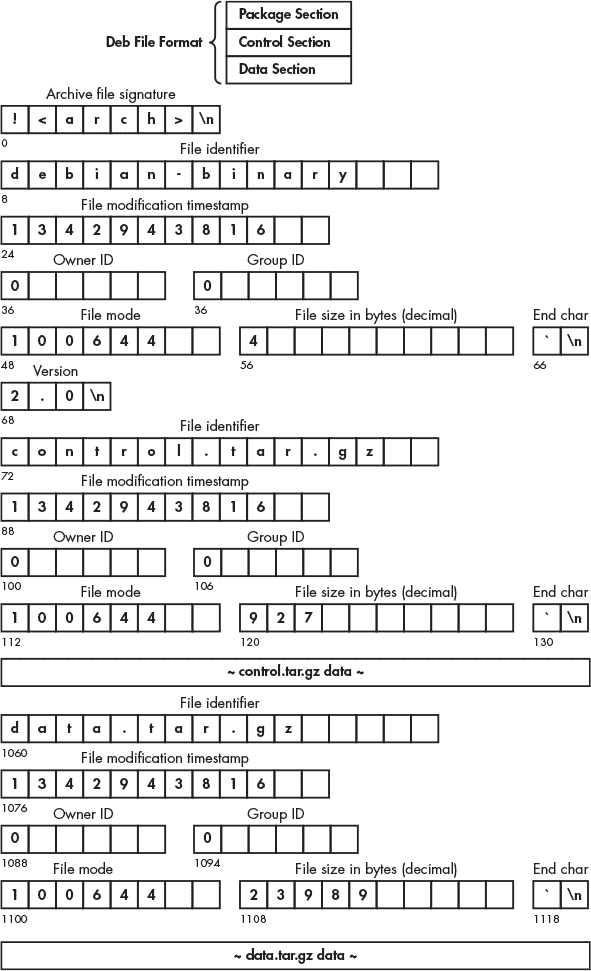

## **7

**已安装软件包的检查**


本章介绍了对 Linux 系统上已安装软件的分析，包括在创建 Linux 系统初期复制的软件以及在正常系统管理过程中安装、更新和删除的软件包。从数字取证的角度来看，我们关注的是软件包何时安装到系统、安装了什么、是谁安装的、以及为什么安装。这些问题同样适用于已被删除（卸载）的软件。Linux 系统和包管理器有包数据库和日志文件，这些文件带有时间戳，帮助回答这些问题。

在 Linux 的早期，没有安装图形用户界面（GUI）或包管理系统。人们通过直接从开发者（通常通过 FTP）下载源文件，编译源文件成二进制文件，然后通过提供的安装脚本、`make install` 命令，或仅仅是简单的文件复制来安装软件。获取和安装软件依赖项是在阅读文档（*README* 文件等）中列出的要求后手动完成的。最初的安装过程也类似于这种手动操作。分区和文件系统是手动创建的，系统目录是手动建立的，内核被复制到适当的位置，并安装了引导加载程序。今天，你仍然可以通过 *Linux From Scratch (LFS)*^(1) 发行版体验这种手动过程，这也是深入学习 Linux 的绝佳方式。

Linux 发行版的一些定义特征包括其安装过程和包管理系统。Linux 的这些领域在很大程度上缺乏统一标准，大多数发行版仍然有自己独特的工具、脚本、远程包仓库、本地包数据库和包文件格式。

Linux 社区在管理软件方面正在经历一些根本性的变化。一些发行版现在采用 *滚动发布* 模式，即系统会随着新软件的发布进行更新，而无需固定的版本号或发布日期。这种模式使用户能够拥有最新版本的软件，并享受最新功能和安全修复。Gentoo 和 Arch Linux 是首批采用滚动发布概念的主要发行版。复杂性和兼容性促使了另一个变化，即将软件打包成自包含的存档，包含所有运行所需的文件（包括通常共享的文件，如库文件）。这两种软件打包概念从取证的角度来看都很有趣，数字证据可以通过元数据和日志文件来找到。

大多数发行版使用传统的软件开发生命周期，其中有明确的发布日期、名称和版本号。版本号在分析被攻击的系统和入侵时尤其重要。特定软件版本中的已知漏洞可能与恶意活动和利用相关联。这种漏洞识别也适用于滚动发布的发行版，因为它们安装的是来自特定日期的已发布版本的单个软件包或 Git 克隆的软件包。

### **系统识别**

当一台 Linux PC、笔记本电脑或获取的镜像文件到达你的取证实验室进行分析时，首要任务之一是确定安装了哪个 Linux 发行版。了解这些有助于使调查聚焦于更具体的发行版分析。其他要查找的证据包括可以用于关联和核实来自多个来源的证据的唯一标识符。例如，在安装过程中生成的随机唯一标识字符串可能用于在备份档案或其他机器的日志中准确识别这台机器。

#### ***发行版版本信息***

典型的软件开发生命周期涉及在不同的时间点发布软件，包括 alpha 版、beta 版、候选版和正式版。该模型包括发布前测试、固定（冻结）稳定版本和发布后的更新。固定版本提供更高的稳定性，并且更容易获得支持。发行版的版本号与内核版本号独立（尽管正是内核让它成为了 Linux）。每个单独的软件包都有自己的版本号，这些版本号也独立于发行版版本号。

基于 systemd 的现代 Linux 安装提供详细的版本信息，通常存储在*/etc/os-release*文件中（通常是指向*/usr/lib/os-release*的符号链接）；例如：

```
$ cat /etc/os-release
NAME="Ubuntu"
VERSION="20.04.1 LTS (Focal Fossa)"
ID=ubuntu
ID_LIKE=debian
PRETTY_NAME="Ubuntu 20.04.1 LTS"
VERSION_ID="20.04"
HOME_URL="https://www.ubuntu.com/"
SUPPORT_URL="https://help.ubuntu.com/"
BUG_REPORT_URL="https://bugs.launchpad.net/ubuntu/"
PRIVACY_POLICY_URL="https://www.ubuntu.com/legal/terms-and-policies/privacy-policy"
VERSION_CODENAME=focal
UBUNTU_CODENAME=focal
```

这个文件的设计目的是可以从 shell 脚本中读取（每一行都是一个已赋值的变量）。这个示例中的变量大多数是显而易见的，但你可以参考 os-release(5)手册页以获取更多信息。基于 systemd 的发行版也可能将本地机器的信息（如位置、部署等）存储在*/etc/machine-info*文件中。有关更多信息，请参见 machine-info(5)手册页。

*Linux 标准基础（LSB）*还定义了*/etc/*distro*.release*和*/etc/ lsb-release*文件，用于提供发行版版本信息，一些发行版可能会包括 LSB 信息文件。有关更多信息，请参见 lsb_release(1)手册页和`lsb_release`源代码（它是一个简单的脚本）。以下是一个示例：

```
$ cat /etc/lsb-release
DISTRIB_ID=LinuxMint
DISTRIB_RELEASE=20
DISTRIB_CODENAME=ulyana
DISTRIB_DESCRIPTION="Linux Mint 20 Ulyana"
```

一些发行版将版本信息写入*/etc/*目录中的其他小文本文件。例如，在 Fedora 中：

```
$ cat /etc/fedora-release
Fedora release 33 (Thirty Three)
```

Debian 将信息存储在*/etc/debian_version*文件中。通过搜索所有匹配*/etc/*release*或*/etc/*version*的文件，可以找到最常见的发行版和版本信息文件。

一些发行版还会将版本和发布信息写入*/etc/issue*或*/etc/motd*文件，这些文件在用户通过 shell 或网络登录时显示。例如：

```
$ cat /etc/issue
Welcome to openSUSE Tumbleweed 20201111 - Kernel \r (\l).
```

滚动发布发行版通常使用最后一次更新的日期作为版本号。

#### ***唯一机器 ID***

现代 Linux 系统有一个在安装过程中创建的唯一标识符。*/etc/machine-id*文件（可能会被复制或与存储在*/var/lib/dbus/machine-id*中的 D-Bus 机器 ID 创建符号链接）包含一个随机生成的 128 位十六进制字符串，如下所示：

```
$ cat /etc/machine-id
8635db7eed514661b9b1f0ad8b249ffd
```

这个唯一的标识字符串可以用于匹配在多个地方部署的相同复制/重复的机器，或者用于匹配具有完整系统备份的系统。此文件的创建时间戳是安装时间的潜在指示符。有关详细信息，请参见 machine-id(5) 手册页。Raspberry Pi 镜像最初包含一个空的*/etc/machine-id*文件，该文件在首次启动时初始化。

符合 POSIX 标准的系统通常具有一个 hostid，它通常是 IP 地址的十六进制表示（来自*/etc/hosts*文件或 DNS 查询）。这个 ID 可以存储在*/etc/hostid*文件中（尽管大多数发行版没有它），并且可以通过执行`hostid`命令或从程序中调用`gethostid()`来在运行中的系统上找到。

#### ***系统主机名***

机器的主机名是另一个标识符。该主机名在启动时或网络重新配置期间由内核设置。主机名可以在安装过程中手动指定，也可以在 DHCP 网络配置过程中动态分配。系统管理员选择主机名，该主机名在其负责的机器中或在一个 DNS 域内通常是唯一的。然而，主机名通常不能保证是唯一的。

系统的名称通常以非 FQDN 格式存储在*/etc/hostname*文件中。虽然允许使用完全限定的域名（FQDN），但通常不推荐使用。

如果在*/etc/hostname*（或其他特定发行版的位置）中指定了主机名，或者从 DHCP 请求中返回了主机名，则运行的内核将相应地进行配置。具有多个接口、多重 IP 地址（每个地址解析为不同的 DNS 名称）或流动设备（笔记本电脑和移动设备）的主机将仍然有一个主机名，代表整个系统。涉及主机名、DNS 域名、接口等的网络配置在第八章中进行了解释。

### **发行版安装程序分析**

分析 Linux 系统的初始安装涉及识别日志和文件的位置，这些日志和文件可能包含有趣的信息。初始的 Linux 安装可以是用户交互式的，也可以是自动化/无人值守的（企业部署）。无论哪种情况，都需要指定一组基本的配置参数来引导安装过程。安装系统时需要做出的典型决策信息如下：

+   语言、区域设置、键盘布局和时区

+   磁盘分区、文件系统和挂载点

+   磁盘或用户目录的加密

+   初始用户名和密码，以及 root 密码（除非使用 sudo）

+   基本系统类型（桌面、无头服务器等的选择）

+   基本服务（网页服务器、通过 SSH 远程访问、打印等）

+   软件仓库的选择，非自由软件

自动化企业安装（例如 Red Hat 的 Kickstart 或 SUSE 的 AutoYaST 等）不在本书的讨论范围内。

在分析安装过程时，数字取证调查员试图回答几个基本问题：

+   系统是什么时候安装的？

+   安装过程中提供的初始设置是什么？

+   是否保存了任何有用或有趣的信息？

+   安装过程中（或仓库）是否有任何异常情况？

根据正在进行的事件类型或调查，可能需要回答与安装相关的其他更具体问题。

在构建时间轴时，请记住系统安装不是一个单一的时间点，而是一个包含开始和结束时间戳的过程。根据机器的速度、网络连接和已安装软件包的数量，安装可能需要超过几分钟才能完成。如果安装是交互式的，而用户未能及时回答提示问题，则安装可能看起来需要几个小时或更长时间才能完成（当用户回到安装提示时）。

还需要注意，安装的开始时间戳可能不可靠。当计算机使用安装介质启动时，时间尚未同步，时区尚未选择。安装程序可能仍会生成日志，但它将使用计算机或虚拟机（VM）主机的当前时间（在某些特殊情况下，这个时间差可能从调查角度来看也很有趣）。一旦配置了网络、确定了时区并同步了时钟，日志将包含更可靠的时间戳。

一个名为 `systemd-firstboot` 的 systemd 服务能够在系统首次启动时提供自动化或交互式配置。有关更多信息，请参阅 systemd-firstboot(1) 手册页。

#### ***Debian 安装程序***

Debian 系统的初始安装使用了*Debian 安装程序*。^(2) Debian 安装程序本身是一个 Linux 系统，可以从 CD/DVD、USB 闪存驱动器、网络或从下载的镜像文件（用于虚拟机）启动。文档定义了 Debian 安装的多个阶段：

**启动与初始化** 安装程序的初次启动；键盘、语言和区域设置选择；硬件检测

**加载附加组件** 选择镜像，获取并解压附加组件

**网络配置** 检测网络硬件并配置网络

**分区** 检测附加存储，分区驱动器，创建文件系统，定义挂载点

**安装目标系统** 安装基础系统和用户选择的软件包，设置用户账户，完成安装并重启

完成的 Debian 安装的日志保存在 */var/log/installer/* 目录下，并提供了初次安装时的信息快照。这个快照可能很有趣。例如，考虑下面这个来自典型 Debian 安装的安装日志目录：

```
$ ls -lR /var/log/installer/
/var/log/installer/:
total 1208
drwxr-xr-x 2 root root   4096 Mar 5 02:43 cdebconf
-rw-r--r-- 1 root root  35283 Mar 5 02:43 hardware-summary
-rw-r--r-- 1 root root    160 Mar 5 02:43 lsb-release
-rw------- 1 root root  81362 Mar 5 02:43 partman
-rw-r--r-- 1 root root  72544 Mar 5 02:43 status
-rw------- 1 root root 988956 Mar 5 02:43 syslog
-rw------- 1 root root  43336 Mar 5 02:43 Xorg.0.log

/var/log/installer/cdebconf:
total 14668
-rw------- 1 root root   119844 Mar 5 02:43 questions.dat
-rw------- 1 root root 14896576 Mar 5 02:43 templates.dat
```

*hardware-summary* 文件提供了安装时机器硬件的信息，包括 PCI 总线上的设备和附加的 USB 设备列表。*lsb-release* 文件包含了最初安装的发行版本信息（在任何升级之前）。*partman* 文件是驱动器设置过程的输出，包含存储设备、分区信息和创建的文件系统。*status* 文件包含安装时所有已安装软件包（包括版本）的详细列表。*syslog* 文件包含在整个安装过程中发送到标准 syslog 的信息（包括时间戳）。桌面系统还可能包含一个 *Xorg.0.log* 文件，包含 X11 服务器的启动输出，其中有关于显卡、显示器和附加外设输入设备的信息。*cdebconf* 包含在安装过程中做出的选项和选择的文件。这些文件提供了关于安装时系统状态的洞察。

基于 Ubuntu 的系统有一个可启动的实时系统（称为 *Casper*），并带有一个名为 *Ubiquity* 的图形化安装程序。Debian 安装程序作为 Ubiquity 的后台使用，并将文件保存在 */var/log/installer/* 目录下，但内容略有不同。以下是一个示例：

```
$ ls -l /var/log/installer/
total 1096
-rw------- 1 root root   1529 Mar 5 11:22 casper.log
-rw------- 1 root root 577894 Mar 5 11:22 debug
-rw-r--r-- 1 root root 391427 Mar 5 11:22 initial-status.gz
-rw-r--r-- 1 root root     56 Mar 5 11:22 media-info
-rw------- 1 root root 137711 Mar 5 11:22 syslog
```

*casper.log* 和 *debug* 文件是安装脚本的输出，包含错误信息。*media-info* 文件显示安装时的发行版本信息。一些基于 Ubuntu 的发行版（例如 Mint）可能还有一个版本文件。*initial-status.gz* 文件（压缩文件）包含最初安装的软件包列表。

#### ***Raspberry Pi Raspian***

Raspberry Pi 使用基于 Debian 的发行版，称为 Raspian。无需 Debian 安装程序，因为 Raspian 已作为预装镜像文件提供下载。此预装镜像有两种格式：

**NOOBS** 一个适合初学者的过程，用户只需要格式化 SD 卡（FAT），然后复制文件，不需要任何特殊工具

**驱动器镜像** 一个原始镜像，需要解压并使用 `dd` 或类似工具传输到 SD 卡

因为没有传统意义上的“安装”，调查人员需要确定用户第一次打开 Pi 并保存初始设置的时间。然而，由于种种原因，找到这个初始设置时间是很棘手的。初始文件系统时间戳来自下载的 Raspian 镜像，而不是本地安装脚本创建的。树莓派没有带电池备份的硬件时钟^(3)，因此每次开机时，时钟都会从 Unix 纪元（1970 年 1 月 1 日 00:00）开始。启动的操作系统会将时钟设置为距离上次关机最近的时间，直到网络时间同步完成（关于系统时间的更多细节，请参见第九章）。默认情况下，文件系统会以`noatime`选项挂载，因此最后访问的时间戳不会更新。其他时间戳可能已经更新，并且日志条目可能会在正确的时间设置之前就被写入，这使得这些时间戳不可靠。

当第一次使用树莓派时，文件系统会被调整大小以适应 SD 卡。重启后，`piwiz` 应用程序启动^(4)，允许用户配置网络、重置密码（默认密码是 `raspberry`）并指定国家、语言和时区设置。`piwiz` 应用程序会从文件 */etc/xdg/autostart/piwiz.desktop* 自动启动，用户提供初始设置后，该文件会被删除。如果这个 *piwiz.desktop* 文件仍然存在，那就意味着树莓派的安装尚未使用。如果你的文件系统取证分析工具能够确定文件 */etc/xdg/autostart/piwiz.desktop* 被删除的时间，那将表明安装完成的大致时间。另一种方法是查找 */var/log/dpkg.log* 文件中的第一个条目的时间戳（或最早的已保存日志轮换）。当 `piwiz` 运行时，包会首次更新，这通常发生在时间同步成功之后。

#### ***Fedora Anaconda***

基于 Fedora 的系统（如 CentOS、Red Hat 等）使用名为 Anaconda 的安装程序^(5)。在初始桌面安装完成并且新系统首次重启后，一个名为 `Initial Setup` 的独立应用程序会运行。该应用程序可以提供额外的配置选项，包括用户同意最终用户许可协议（EULA）。

Anaconda 安装程序会在 */var/log/anaconda/* 文件夹中留下初始安装的日志文件，内容如下所示：

```
# ls -l /var/log/anaconda/
total 3928
-rw-------. 1 root root   36679 Mar 24 11:01 anaconda.log
-rw-------. 1 root root    3031 Mar 24 11:01 dbus.log
-rw-------. 1 root root  120343 Mar 24 11:01 dnf.librepo.log
-rw-------. 1 root root     419 Mar 24 11:01 hawkey.log
-rw-------. 1 root root 2549099 Mar 24 11:01 journal.log
-rw-------. 1 root root       0 Mar 24 11:01 ks-script-sot00yjg.log
-rw-------. 1 root root  195487 Mar 24 11:01 lvm.log
-rw-------. 1 root root  327396 Mar 24 11:01 packaging.log
-rw-------. 1 root root    7044 Mar 24 11:01 program.log
-rw-------. 1 root root    2887 Mar 24 11:01 storage.log
-rw-------. 1 root root  738078 Mar 24 11:01 syslog
-rw-------. 1 root root   22142 Mar 24 11:01 X.log
```

*anaconda.log* 文件记录了各种安装任务的进度。*X.log* 文件显示了 Anaconda 使用的 Xorg 服务器的输出，并包含了安装时关于显卡、显示器和附加外设输入设备的信息。

*journal.log*和*syslog*文件非常相似，主要区别在于*journal.log*显示了更多的 dracut 活动（参见第六章）。它们都包含内核（dmesg 输出）和系统初始化（systemd）的日志，这些日志记录了第一次安装时的信息。这些日志有助于确定安装的开始和结束时间。关于存储设备、分区和卷管理的信息可以在*storage.log*和*lvm.log*中找到。*dnf.librepo.log*文件列出了所有下载用于安装的包。*ks-script-*.log*文件包含来自 kickstart 脚本的日志输出。其他文件则包含 D-Bus 活动和库调用的日志。有关 Anaconda 日志的更多信息，请参见*[`fedoraproject.org/wiki/Anaconda/Logging`](https://fedoraproject.org/wiki/Anaconda/Logging)*。

这些日志提供了关于用户指定的配置、原始机器的硬件、已安装的软件包以及安装时的存储配置的信息。

#### ***SUSE YaST***

SUSE Linux 拥有今天仍在维护的最古老的发行版安装程序之一。*YaST*，或称“另一个设置工具”，旨在将初始安装与其他系统配置任务整合为一个工具。^(6) YaST 可用于安装系统、设置外设（如打印机）、安装软件包、配置硬件、配置网络等。SUSE 还提供 AutoYaST，用于无人值守的企业部署。

YaST 日志目录是*/var/log/YaST2/*。它包含来自安装过程和其他常规配置任务的日志。安装过程中的日志被存储在压缩归档文件*yast-installation-logs.tar.xz*中，从取证的角度来看，这些日志尤其重要。以下是一个示例（部分）内容列表：^(7)

```
# tar -tvf yast-installation-logs.tar.xz
-rw-r--r-- root/root     938 2020-03-05 08:35 etc/X11/xorg.conf
drwxr-xr-x root/root       0 2020-02-12 01:14 etc/X11/xorg.conf.d/
-rw-r--r-- root/root     563 2020-03-03 20:30 linuxrc.config
-rw-r--r-- root/root     322 2020-02-26 01:00 etc/os-release
...
-rw-r--r-- root/root   21188 2020-03-05 08:35 Xorg.0.log
-rw-r--r-- root/root   25957 2020-03-05 08:38 linuxrc.log
-rw-r--r-- root/root   17493 2020-03-05 08:34 wickedd.log
-rw-r--r-- root/root   46053 2020-03-05 08:35 boot.msg
-rw-r--r-- root/root  104518 2020-03-05 08:55 messages
-rw-r--r-- root/root    5224 2020-03-05 08:55 dmesg
-rw-r--r-- root/root      17 2020-03-05 08:55 journalctl-dmesg
-rw-r--r-- root/root     738 2020-03-05 08:55 install.inf
-rw------- root/root    3839 2020-03-05 08:55 pbl-target.log
-rw-r--r-- root/root     141 2020-03-05 08:55 rpm-qa
-rw-r--r-- root/root   27563 2020-03-05 08:55 _packages.root
```

安装时的发布信息可以在子目录`etc/os-release`中找到。文件*Xorg.0.log*包含关于图形卡、显示器和安装时附加的外设输入设备的信息。*boot.msg*、*dmesg*和*messages*文件包含来自安装过程、内核环形缓冲区以及安装时的其他信息的日志。来自网络管理器的*wickedd.log*文件记录了网络配置，包括系统的 IP 和安装时的其他网络配置。

此目录中日志文件条目的开始和结束时间提供了安装发生的大致时间段。

#### ***Arch Linux***

原生的 Arch Linux 系统没有一个舒适的安装程序。启动 Arch 安装媒体后，用户会进入一个根 shell 并附带一个指向 wiki 安装指南的引用（早期版本中有一个*install.txt*文件，里面包含了更多的安装说明）。用户需要手动创建分区和文件系统，然后运行`pacstrap`脚本，填充已挂载的安装目标目录。之后，用户进入 chroot 环境并手动完成安装。安装过程的详细信息可以参考*[`wiki.archlinux.org/index.php/Installation_guide`](https://wiki.archlinux.org/index.php/Installation_guide)*。

一个名为`archinstall`的基本安装脚本包含在 Arch Linux 安装媒体中。如果使用此脚本，它会将初始配置设置和活动记录到*/var/log/archinstall/install.log*中。

根目录的创建时间戳（`Birth:`）（如果文件系统支持的话）大致表示安装开始的时间：

```
# stat /
  File: /
  Size: 4096       Blocks: 16     IO Block: 4096  directory
Device: fe01h/65025dInode: 2       Links: 17
Access: (0755/drwxr-xr-x) Uid: (  0/  root)  Gid: (  0/  root)
Access: 2020-03-05 10:00:42.629999954 +0100
Modify: 2020-02-23 10:29:55.000000000 +0100
Change: 2020-03-05 09:59:36.896666639 +0100
 Birth: 2020-03-05 09:58:55.000000000 +0100
```

安装 Arch 是一个手动且持续的过程。用户可以继续安装和调整系统，直到无尽，因此在这个背景下，安装的“结束”时间可能并没有意义。

安装 Arch Linux 的简洁而不直观的过程催生了多个发行版，供那些希望获得前沿滚动更新发行版的所有好处，但又希望有一个舒适安装过程的用户使用。最受欢迎的基于 Arch 的发行版是 Manjaro。

Manjaro 的安装程序叫做 Calamares，它提供了最小化的安装过程日志。这些日志保存在*/var/log/Calamares.log*中。*Calamares.log*的内容包括指定的配置（时区、语言环境等）、分区信息、用户信息等。Calamares（在 Manjaro 上）不会记录 IP 地址，但它会执行 Geo-IP 查找以确定正在安装系统的位置：

```
# grep Geo /var/log/Calamares.log
2020-03-05 - 08:57:31 [6]: GeoIP result for welcome= "CH"
2020-03-05 - 08:57:33 [6]: GeoIP reporting "Europe/Zurich"
```

Calamares 因 Manjaro 而广为人知，但它的开发目的是作为任何发行版的通用安装程序。有关 Calamares 的更多信息，请参见*[`calamares.io/`](https://calamares.io/)*。

### **包文件格式分析**

本节介绍了常见 Linux 发行版中使用的各个软件包的文件格式。Linux 发行版软件包是单一的归档文件，包含了安装和移除这些软件包所需的所有信息和文件。此外，Linux 系统通常有包管理系统，用来追踪已安装的包、管理依赖关系、执行更新等。

分析软件包文件可以揭示一些有趣的证据。一些可以对包文件进行的法医分析任务包括：

+   查找包何时构建

+   验证包的完整性

+   显示包元数据

+   列出包文件内容

+   提取支持脚本

+   提取单个文件

+   标识额外的时间戳

此外，漏洞评估可能涉及将单个包的版本号与已知的公开漏洞进行匹配；例如，将系统上安装的特定软件版本与 Mitre 发布的 CVE 进行匹配（* [`cve.mitre.org/`](https://cve.mitre.org/)*）。这通常是组织内企业漏洞管理职能的任务。

#### ***Debian 二进制包格式***

Debian 二进制包格式（DEB）被 Debian 及其衍生发行版使用。有关更多信息，请参见 Debian 或 Debian 衍生系统上的 deb(5)手册页。DEB 文件具有**.deb**扩展名，并具有一个初始的七字符魔术字符串（`!<arch>`）。图 7-1 在下一页中显示了 DEB 文件的结构。

DEB 文件使用`ar`档案格式，包含三个标准组件。在此示例中，使用 GNU `ar`命令列出了`ed`包（一个行编辑器）：

```
$ ar -tv ed_1.15-1_amd64.deb
rw-r--r-- 0/0     4 Jan 3 15:07 2019 debian-binary
rw-r--r-- 0/0  1160 Jan 3 15:07 2019 control.tar.xz
rw-r--r-- 0/0 58372 Jan 3 15:07 2019 data.tar.xz
```

在此示例中，`ar`的标志（`-tv`）指定了详细列出内容。文件时间戳表示 DEB 包档案的构建时间。

档案中的三个文件包含以下内容：

***debian-binary*** 一个包含包格式版本字符串的文件

***control*** 一个包含包的脚本/元数据的压缩档案

***data*** 一个包含要安装文件的压缩档案

这些组件可以通过`ar`提取：

```
$ ar -xov ed_1.15-1_amd64.deb
x - debian-binary
x - control.tar.xz
x - data.tar.xz
```

(`-xov`)标志指示`ar`提取文件、保留原始时间戳，并显示详细输出。*control.tar.xz*和*data.tar.xz*文件是可以进一步检查的压缩档案。



*图 7-1：Debian “DEB”包格式（修改自维基百科：* [`upload.wikimedia.org/wikipedia/commons/6/67/Deb_File_Structure.svg`](https://upload.wikimedia.org/wikipedia/commons/6/67/Deb_File_Structure.svg)*)*

*debian-binary*文件包含一行，表示包格式版本号（2.0）。为了列出档案的内容，我们依赖`tar`来解压文件并列出档案内容：

```
$ cat debian-binary
2.0
$ tar -tvf control.tar.xz
drwxr-xr-x root/root       0 2019-01-03 15:07 ./
-rw-r--r-- root/root     506 2019-01-03 15:07 ./control
-rw-r--r-- root/root     635 2019-01-03 15:07 ./md5sums
-rwxr-xr-x root/root     287 2019-01-03 15:07 ./postinst
-rwxr-xr-x root/root     102 2019-01-03 15:07 ./prerm
$ tar -tvf data.tar.xz
drwxr-xr-x root/root       0 2019-01-03 15:07 ./
drwxr-xr-x root/root       0 2019-01-03 15:07 ./bin/
-rwxr-xr-x root/root   55424 2019-01-03 15:07 ./bin/ed
-rwxr-xr-x root/root      89 2019-01-03 15:07 ./bin/red
drwxr-xr-x root/root       0 2019-01-03 15:07 ./usr/
drwxr-xr-x root/root       0 2019-01-03 15:07 ./usr/share/
drwxr-xr-x root/root       0 2019-01-03 15:07 ./usr/share/doc/
drwxr-xr-x root/root       0 2019-01-03 15:07 ./usr/share/doc/ed/
-rw-r--r-- root/root     931 2012-04-28 19:56 ./usr/share/doc/ed/AUTHORS
-rw-r--r-- root/root     576 2019-01-01 19:04 ./usr/share/doc/ed/NEWS.gz
-rw-r--r-- root/root    2473 2019-01-01 18:57 ./usr/share/doc/ed/README.gz
-rw-r--r-- root/root     296 2016-04-05 20:28 ./usr/share/doc/ed/TODO
...
```

如果我们想从**.tar.xz**档案中提取特定文件，可以使用相同的命令，但给`tar`指令来提取该文件：

```
$ tar xvf control.tar.xz ./control
./control
$ cat ./control
Package: ed
Version: 1.15-1
Architecture: amd64
Maintainer: Martin Zobel-Helas <zobel@debian.org>
Installed-Size: 111
Depends: libc6 (>= 2.14)
Section: editors
Priority: optional
Multi-Arch: foreign
Homepage: https://www.gnu.org/software/ed/
Description: classic UNIX line editor
 ed is a line-oriented text editor. It is used to
...
```

提取的控制文件的内容列出了版本、CPU 架构、维护者、依赖关系和其他信息。*control*文件是必需的，*control.tar.xz*组件中的其他文件是可选的。其他常见的包控制文件包括安装前、安装后、删除前和删除后脚本（分别为`preinst`、`postinst`、`prerm`和`postrm`）。有关*control*文件的更多信息，请参见 deb-control(5)手册页。

我们可以以相同的方式从数据归档中提取文件和目录。然而，这样做会将完整的目录树提取到当前工作目录，并指定文件。也可以将单个文件提取到`stdout`，并将其重定向到文件或程序中。在此示例中，使用`-xOf`标志（`O`是大写字母 O，而不是零）提取单个文件到`stdout`：

```
$ tar -xOf data.tar.xz ./usr/share/doc/ed/AUTHORS
Since 2006 GNU ed is maintained by Antonio Diaz Diaz.

Before version 0.3, GNU ed and its man page were written and maintained
(sic) by Andrew L. Moore.

The original info page and GNUification of the code were graciously
provided by FranÃğois Pinard.
...
```

可以使用文件重定向保存单个文件，或者将整个归档解压到本地分析目录。

虽然不是强制性的，但 DEB 包通常包含一个 MD5 哈希值列表，用于验证文件完整性。这些哈希值存储在包归档文件的控制组件中的*md5sums*文件中。此示例显示包中预期的 MD5 哈希值列表，后跟已安装二进制文件的验证：

```
$ tar -xOf control.tar.xz ./md5sums
9a579bb0264c556fcfe65bda637d074c bin/ed
7ee1c42c8afd7a5fb6cccc6fa45c08de bin/red
318f005942f4d9ec2f19baa878f5bd14 usr/share/doc/ed/AUTHORS
ad0755fb50d4c9d4bc23ed6ac28c3419 usr/share/doc/ed/NEWS.gz
f45587004171c32898b11f8bc96ead3c usr/share/doc/ed/README.gz
3eef2fe85f82fbdb3cda1ee7ff9a2911 usr/share/doc/ed/TODO
...
$ md5sum /bin/ed
9a579bb0264c556fcfe65bda637d074c /bin/ed
```

`md5sum`工具有一个标志（`-c`），它从像*md5sums*这样的文件中读取 MD5 列表，并对列出的所有文件进行检查。曾有讨论建议将*md5sums*文件替换为 SHA 哈希值（有关更多信息，请参阅*[`wiki.debian.org/Sha256sumsInPackages`](https://wiki.debian.org/Sha256sumsInPackages)*）。

在 Debian 系统上，`dpkg-deb`工具执行所有上述分析任务，如列出文件、提取文件、查看控制数据等。如果您正在尝试从损坏的 DEB 文件中恢复数据，`ar -tO`（`O`是大写字母 O，而不是零）将提供三个组件的十六进制偏移量，这可能允许使用诸如`dd`之类的工具进行提取。

#### ***红帽软件包管理器***

*红帽软件包管理器（RPM）* 是由红帽公司开发的二进制包格式。RPM 包可以通过*.rpm*扩展名和文件开头的四字节魔术字符串（`ED AB EE DB`）进行识别。RPM 包文件的结构在`rpm`工具的源代码中有详细说明，文件*/doc/manual/format*描述了四个逻辑部分：

**引导** 96 字节的“魔术”信息及其他信息

**签名** “数字签名”集合

**头部** 存放所有包信息的区域（即元数据）

**有效载荷** 软件包中文件的压缩归档（即有效载荷）

`rpm`命令也可以安装在非 Red Hat 发行版上，可以在单独的分析机器上使用。查询标志（`-q`）可用于分析 RPM 文件的各个方面。在此示例中，`-q`和`-i`标志提供了关于*xwrits* RPM 包文件的信息概述：

```
$ rpm -q -i xwrits-2.26-17.fc32.x86_64.rpm
Name        : xwrits
Version     : 2.26
Release     : 17.fc32
Architecture: x86_64
Install Date: (not installed)
Group       : Unspecified
Size        : 183412
License     : GPLv2
Signature   : RSA/SHA256, Sat 01 Feb 2020 01:17:59 AM, Key ID 6c13026d12c944d0
Source RPM  : xwrits-2.26-17.fc32.src.rpm
Build Date  : Fri 31 Jan 2020 09:43:09 AM
Build Host  : buildvm-04.phx2.fedoraproject.org
Packager    : Fedora Project
Vendor      : Fedora Project
URL         : http://www.lcdf.org/xwrits/
Bug URL     : https://bugz.fedoraproject.org/xwrits
Summary     : Reminds you take wrist breaks
Description :
Xwrits reminds you to take wrist breaks, which
should help you prevent or manage a repetitive
stress injury. It pops up an X window when you
...
```

您可以使用以下标志（在`rpm -q`之后）以及 RPM 文件名查看其他 RPM 元数据：

-lv    显示软件包中文件的详细列表

–dump 转储文件信息（路径、大小、修改时间、摘要、模式、所有者、组、是否配置、是否文档、设备号、符号链接）

–changes 显示包的变更信息，包含完整时间戳（`--changelog`与此相同，但带有日期）

–提供 该软件包提供的功能列表

–enhances 列出软件包增强的功能

–obsoletes 列出了此包淘汰的包

–conflicts 列出了此包与之冲突的功能

–requires 列出了此包所依赖的功能

–recommends 列出了包所推荐的功能

–suggests 列出了包所建议的功能

–supplements 列出了包所补充的功能

–scripts 列出了作为安装和卸载过程一部分使用的特定包脚本

–filetriggers 列出了包中的文件触发脚本

–triggerscripts 显示包中包含的触发脚本（如果有）

该列表摘自 rpm(9) 手册页，您可以在其中找到有关 rpm 文件的更多信息。如果某个标志没有输出，则该头字段为空。

从 RPM 包中提取单个文件是一个两步过程。首先，从 RPM 中提取有效载荷，然后从该有效载荷中提取所需的文件。`rpm2cpio` 和 `rpm2archive` 工具会创建一个 *cpio* 或压缩 tar（**.tgz**）归档文件，其中包含 RPM 的有效载荷。这些文件是大多数文件管理器和取证工具应该能够浏览以进行文件导出/提取的。

在以下示例中，从 RPM 中提取单个文件。首先提取 RPM 的有效载荷，然后识别并提取单个文件：

```
$ rpm2cpio xwrits-2.26-17.fc32.x86_64.rpm > xwrits-2.26-17.fc32.x86_64.rpm.cpio
$ cpio -i -tv < xwrits-2.26-17.fc32.x86_64.rpm.cpio
...
-rw-r--r--  1 root   root     1557 Oct 16 2008 ./usr/share/doc/xwrits/README
...
$ cpio -i --to-stdout ./usr/share/doc/xwrits/README < xwrits-2.26-17.fc32.x86_64.rpm.cpio
XWRITS VERSION 2.25
===================
ABOUT XWRITS
------------
  Xwrits was written when my wrists really hurt. They don't any more --
...
```

运行 `rpm2cpio` 命令，并将输出重定向到文件（文件名可以是任何名称，但为了清晰起见，我使用了相同的文件名并加上 **.cpio** 扩展名）。下一个命令列出了 *cpio* 存档，以查找要提取的文件。最后一个命令将文件提取到 `stdout`，可以通过管道或重定向到程序或文件。

RPM 包头包含加密签名和哈希值，用于验证有效载荷的完整性。完整性检查可以使用 `rpmkeys`^(8) 命令完成，并可以通过 `-Kv` 标志以详细模式查看：

```
$ rpmkeys -Kv xwrits-2.26-17.fc32.x86_64.rpm
xwrits-2.26-17.fc32.x86_64.rpm:
    Header V3 RSA/SHA256 Signature, key ID 12c944d0: OK
    Header SHA256 digest: OK
    Header SHA1 digest: OK
    Payload SHA256 digest: OK
    V3 RSA/SHA256 Signature, key ID 12c944d0: OK
    MD5 digest: OK
```

可以使用 `rpmkeys` 命令导入已签名 RPM 包的 GPG 密钥。有关更多信息，请参阅 rpmkeys(8) 手册页。

#### ***Arch Pacman 包***

Arch Linux 的包是压缩的 tar 文件。当前默认的压缩格式正在从 XZ 过渡到 Zstandard，文件扩展名分别为 **.xz** 和 **.zst**。^(9) 该 tar 文件包含了包的元数据以及要安装的文件。

我们可以使用 `tar` 查看 `pacman` 包的内容：

```
$ tar -tvf acpi-1.7-2-x86_64.pkg.tar.xz
-rw-r--r-- root/root     376 2017-08-15 19:06 .PKGINFO
-rw-r--r-- root/root    3239 2017-08-15 19:06 .BUILDINFO
-rw-r--r-- root/root     501 2017-08-15 19:06 .MTREE
drwxr-xr-x root/root       0 2017-08-15 19:06 usr/
drwxr-xr-x root/root       0 2017-08-15 19:06 usr/share/
drwxr-xr-x root/root       0 2017-08-15 19:06 usr/bin/
-rwxr-xr-x root/root   23560 2017-08-15 19:06 usr/bin/acpi
drwxr-xr-x root/root       0 2017-08-15 19:06 usr/share/man/
drwxr-xr-x root/root       0 2017-08-15 19:06 usr/share/man/man1/
-rw-r--r-- root/root     729 2017-08-15 19:06 usr/share/man/man1/acpi.1.
```

本例展示了包格式的简洁性。归档文件的根目录中包含包的元数据。这些文件在 Arch Linux Wiki 中有所描述（*[`wiki.archlinux.org/index.php/Creating_packages`](https://wiki.archlinux.org/index.php/Creating_packages)）并包括：

***.PKGINFO*** 包含 `pacman` 处理包、依赖项等所需的所有元数据。

***.BUILDINFO*** 包含了可重复构建所需的信息。此文件仅在使用 Pacman 5.1 或更高版本构建包时存在。

***.MTREE*** 包含文件的哈希值和时间戳，这些文件包含在本地数据库中，以便`pacman`验证软件包的完整性。

***.INSTALL*** 一个可选文件，用于在安装/升级/删除阶段后执行命令（该文件仅在`PKGBUILD`中指定时存在）。

***.Changelog*** 包维护者保存的可选文件，记录软件包的变化。

*.PKGINFO* 文件是常规文本，可以轻松查看，但使用`pacman`工具可以提供更完整的输出（包括未定义的字段）。`-Qip`标志分别指定查询操作、信息选项和目标软件包文件名：

```
$ pacman -Qip acpi-1.7-2-x86_64.pkg.tar.xz
Name            : acpi
Version         : 1.7-2
Description     : Client for battery, power, and thermal readings
Architecture    : x86_64
URL             : https://sourceforge.net/projects/acpiclient/files/acpiclient/
Licenses        : GPL2
Groups          : None
Provides        : None
Depends On      : glibc
Optional Deps   : None
Conflicts With  : None
Replaces        : None
Compressed Size : 10.47 KiB
Installed Size  : 24.00 KiB
Packager        : Alexander RÃÿdseth <rodseth@gmail.com>
Build Date      : Di 15 Aug 2017 19:06:50
Install Script  : No
Validated By    : None
Signatures      : None
```

*.MTREE* 文件是一个压缩的时间戳、权限、文件大小和加密哈希的列表。我们可以通过将`tar`输出管道传输到`zcat`来提取它：

```
$ tar -xOf acpi-1.7-2-x86_64.pkg.tar.xz .MTREE | zcat
#mtree
/set type=file uid=0 gid=0 mode=644
./.BUILDINFO time=1502816810.765987104 size=3239 md5digest=0fef5fa26593908cb0958537839f35d6
sha256digest=75eea1aee4d7f2698d662f226596a3ccf76e4958b57e8f1b7855f2eb7ca50ed5
./.PKGINFO time=1502816810.745986656 size=376 md5digest=c6f84aeb0bf74bb8a1ab6d0aa174cb13
sha256digest=83b005eb477b91912c0b782808cc0e87c27667e037766878651b39f49d56a797
/set mode=755
./usr time=1502816810.602650109 type=dir
./usr/bin time=1502816810.685985311 type=dir
./usr/bin/acpi time=1502816810.682651903 size=23560 md5digest=4ca57bd3b66a9afd517f49e13f19688f
sha256digest=c404597dc8498f3ff0c1cc026d76f7a3fe71ea729893916effdd59dd802b5181
./usr/share time=1502816810.592649885 type=dir
./usr/share/man time=1502816810.592649885 type=dir
./usr/share/man/man1 time=1502816810.699318943 type=dir
./usr/share/man/man1/acpi.1.gz time=1502816810.609316926 mode=644 size=729
md5digest=fb0da454221383771a9396afad250a44
sha256digest=952b21b357d7d881f15942e300e24825cb3530b2262640f43e13fba5a6750592
```

这可以用来验证软件包中文件的完整性，并提供时间戳以重建时间线。我们可以利用这些信息分析那些异常、恶意或被篡改的软件包。

### **软件包管理系统分析**

上一部分聚焦于安装前个别软件包的文件格式。这里我们将重点转向已安装（或以前安装过）的软件的包管理系统。这包括分析下载软件包的仓库、软件包内容在文件系统中的位置、跟踪已安装软件包的数据库、安装日志等。

一个 Linux 发行版的软件包系统通常包含以下组件：

+   用于下载已编译二进制包的仓库

+   用于下载软件包源代码的仓库

+   包含非自由或具有不同许可协议的仓库

+   解决依赖关系和冲突的信息

+   一个包含已安装软件记录的数据库

+   包管理活动的日志文件（包括卸载）

+   与后端工具和库交互的前端用户界面

各个 Linux 发行版的包管理系统非常相似。请参阅*[`wiki.archlinux.org/index.php/Pacman/Rosetta`](https://wiki.archlinux.org/index.php/Pacman/Rosetta)*以查看软件包管理命令的对比。

从取证的角度来看，我们可以提出许多与软件包管理相关的问题，例如：

+   当前安装了哪些软件包，哪些版本？

+   谁安装了这些软件包，何时安装的，以及如何安装的？

+   哪些软件包被升级了，何时升级的？

+   哪些软件包被删除了，何时删除的？

+   使用了哪些仓库？

+   我们能否确认软件包的完整性？

+   可以分析哪些日志、数据库和缓存数据？

+   给定文件系统中的某个特定文件，它属于哪个软件包？

+   还有哪些其他时间戳是相关的？

解答这些问题有助于重建过去的活动、建立时间线并识别可能的恶意或可疑活动。查找和验证加密哈希值也有助于使用 NSRL 哈希集排除已知的软件。已删除的软件包可能会留下自定义或修改过的配置文件和未删除的数据痕迹。

接下来的几个部分描述了对最常见的发行版的分析。每个部分提供了包管理系统的介绍，并描述了对取证检查员有兴趣的各种文件、数据库和目录位置。

#### ***Debian apt***

Debian 包管理系统是一组程序，负责管理软件包的搜索/选择、外部仓库、下载、依赖/冲突解决、安装、删除、更新和升级以及其他软件包管理功能。最终用户通过像 Apt、Aptitude、Synaptic 等高级程序与系统交互，选择安装、删除或升级哪些软件包。这些高级程序与 `dpkg` 命令交互，^(10) 该命令用于管理 Debian 系统上软件包的安装、删除和查询。取证调查员主要关注系统当前的软件包状态，重建过去的软件包活动，并识别其他有趣的证据。

Debian 系统当前已安装的软件包状态存储在 */var/lib/dpkg/status* 文件中（软件包“数据库”）。这是一个纯文本文件，每个软件包条目以 `Package:` 字符串开头，以空行结尾（类似于电子邮件的 mbox 格式）。该文件的备份副本存储在同一目录中，可能被命名为 *status-old* 或 */var/backups/dpkg.status.**（以前版本的多个副本也可能以压缩形式存在）。

*status* 文件可以通过任何文本编辑器或文本处理工具轻松查看和搜索。在这个例子中，`awk`^(11) 工具用于搜索状态文件中的软件包名称（`Package: bc`）并打印出整个信息块：

```
$ awk ' /^Package: bc$/ , /^$/ ' /var/lib/dpkg/status
Package: bc
Status: install ok installed
Priority: standard
Section: math
Installed-Size: 233
Maintainer: Ryan Kavanagh <rak@debian.org>
Architecture: amd64
Multi-Arch: foreign
Source: bc (1.07.1-2)
Version: 1.07.1-2+b1
Depends: libc6 (>= 2.14), libncurses6 (>= 6), libreadline7 (>= 6.0), libtinfo6 (>= 6)
Description: GNU bc arbitrary precision calculator language
 GNU bc is an interactive algebraic language with arbitrary precision which
 follows the POSIX 1003.2 draft standard, with several extensions including
 multi-character variable names, an `else' statement and full Boolean
 expressions. GNU bc does not require the separate GNU dc program.
Homepage: http://ftp.gnu.org/gnu/bc/
```

从取证重建的角度来看，Status: 行是非常有趣的。正常安装的软件包文件会显示 Status: install ok installed。已删除但仍包含用户修改过的配置文件的软件包将显示为 Status: deinstall ok config-files。某些软件包可能会有一个 Conffiles: 行，后面跟着几行，表示管理员可能会修改的配置文件，以及该文件原始安装版本的 MD5 哈希值。例如，以下是 Apache Web 服务器的默认配置文件：

```
Package: apache2
Status: install ok installed
...
Conffiles:
 /etc/apache2/apache2.conf 20589b50379161ebc8cb35f761af2646
...
 /etc/apache2/ports.conf a961f23471d985c2b819b652b7f64321
 /etc/apache2/sites-available/000-default.conf f3066f67070ab9b1ad9bab81ca05330a
 /etc/apache2/sites-available/default-ssl.conf 801f4c746a88b4228596cb260a4220c4
 ...
```

MD5 哈希值可以帮助识别偏离软件包默认配置的配置文件。有关 *status* 文件字段的更多信息，请参见 dpkg-query(1) 手册页。

*status* 文件不包含安装时间戳。要查看安装日期，必须分析日志文件。多个日志文件记录了软件包管理系统及前端包管理工具的活动。Debian 系统上常见的软件包管理日志包括以下内容：

***/var/log/dpkg.log*** `dpkg` 活动日志，包括软件包状态的变化（安装、删除、升级等）

***/var/log/apt/history.log*** `apt` 命令的开始/结束时间以及执行这些命令的用户

***/var/log/apt/term.log*** `apt` 命令输出（stdout）的开始/结束时间

***/var/log/apt/eipp.log.**** 记录外部安装计划协议（EIPP）的当前状态，这是一个管理依赖顺序的系统

***/var/log/aptitude*** 记录执行的 Aptitude 操作

***/var/log/unattended-upgrades/**** 自动化/无人值守升级的日志

已旋转的日志可能会被压缩并重新命名为带有数字的文件名，表示日志文件的相对年龄（例如 *dpkg.log.1.gz*）。数字越大，日志越旧。

`dpkg` 的配置信息存储在 */etc/dpkg/* 目录中。`apt` 的配置信息存储在 */etc/apt/* 目录中。*/etc/apt/* 目录包含 *sources.list* 和 *sources.list.d/** 文件。这些文件很重要，因为它们定义了特定 Debian 发行版的外部仓库配置。显式添加的（合法或恶意）仓库将被附加到此文件或保存到 *sources.list.d/* 目录中的文件里。Ubuntu 还提供个人软件包档案（PPAs），用户可以通过它的中央 Launchpad 服务器帮助添加单个软件包的源。

*/var/lib/dpkg/info/* 目录包含每个已安装软件包的多个文件（这些是来自 DEB 文件的元数据）。这些信息包括文件列表（**.list*）、加密哈希（**.md5sums*）、安装前/安装后和删除脚本等。**.conffiles*（如果存在）可能是法医调查人员有用的资源，因为它们列出了配置文件的位置，并且通常会被系统所有者修改。

*/var/cache/apt/archives/* 目录包含过去下载的 **.deb* 文件。*/var/cache/debconf/* 目录是软件包配置信息和模板的中心位置。这里可能感兴趣的是 *passwords.dat* 文件，它包含系统生成的本地守护进程所需的密码。

请参阅 dpkg(1) 和 apt(8) 手册页，以及 Debian 手册（*[`www.debian.org/doc/manuals/debian-reference/ch02.en.html#_the_dpkg_command`](https://www.debian.org/doc/manuals/debian-reference/ch02.en.html#_the_dpkg_command)*) 以获取更多信息。

#### ***Fedora dnf***

基于 Fedora 的系统使用 `dnf`（Dandified Yum）来管理软件包，`dnf` 是 yum（Yellow Dog Update Manager）的继任者。`dnf` 工具用 Python 编写，并使用 `librpm` 库来管理已安装的 `rpm` 软件包。

当前已安装的软件包状态存储在 */var/lib/rpm/* 目录中的一组 Berkeley 数据库文件中。分析这些数据最简单的方法是在一台单独的分析机器上使用 `rpm` 命令，并使用 `--dbpath` 标志指向数据库文件的只读副本。例如，要列出存储在单独目录中的数据库文件中的已安装软件包，可以使用 --dbpath 和 -qa 标志：

```
$ rpm --dbpath=/evidence/ -qa
...
rootfiles-8.1-25.fc31.noarch
evince-libs-3.34.2-1.fc31.x86_64
python3-3.7.6-2.fc31.x86_64
perl-Errno-1.30-450.fc31.x86_64
OpenEXR-libs-2.3.0-4.fc31.x86_64
man-pages-de-1.22-6.fc31.noarch
...
```

要查看特定已安装软件包的元数据，请使用 --dbpath 和 -qai 标志，并提供软件包名称。以下是使用 Evince 文档查看器包的几个示例：

```
$ rpm --dbpath=/evidence/ -qai evince
Name        : evince
Version     : 3.34.2
Release     : 1.fc31
Architecture: x86_64
Install Date: Tue Mar 3 06:21:23 2020
Group       : Unspecified
Size        : 9978355
License     : GPLv2+ and GPLv3+ and LGPLv2+ and MIT and Afmparse
Signature   : RSA/SHA256, Wed Nov 27 16:13:20 2019, Key ID 50cb390b3c3359c4
Source RPM  : evince-3.34.2-1.fc31.src.rpm
Build Date  : Wed Nov 27 16:00:47 2019
Build Host  : buildhw-02.phx2.fedoraproject.org
Packager    : Fedora Project
Vendor      : Fedora Project
URL         : https://wiki.gnome.org/Apps/Evince
Bug URL     : https://bugz.fedoraproject.org/evince
Summary     : Document viewer
Description :
Evince is simple multi-page document viewer. It can display and print
...
```

要查看属于某个软件包的文件列表，请使用 --dbpath 和 -ql 标志（小写字母 L，表示“列表”）：

```
$ rpm --dbpath /evidence/ -ql evince
/usr/bin/evince
/usr/bin/evince-previewer
/usr/bin/evince-thumbnailer
/usr/lib/.build-id
/usr/lib/.build-id/21
/usr/lib/.build-id/21/15823d155d8af74a2595fa9323de1ee2cf10b8
...
```

要确定某个文件属于哪个软件包，请使用 --dbpath 和 -qf 标志，并提供完整的路径和文件名：

```
$ rpm --dbpath /evidence/ -qf /usr/bin/evince
evince-3.34.2-1.fc31.x86_64
```

所有这些命令都可以与位于被分析的 Linux 镜像下 */var/lib/rpm/* 目录中的只读离线 RPM 数据库文件一起使用。请注意，在你的取证工作站上运行 `rpm` 命令将使用本地的 RPM 配置（例如，*/usr/lib/rpm/rpmrc*），但这不应影响上述示例中输出的准确性。

RPM 数据库文件传统上是标准的 Berkeley DB 文件，可以通过像 `db_dump` 这样的工具单独分析。Fedora 33 版本将 RPM 数据库迁移到了 SQLite，并且可以使用相关工具来检查包数据。此外，*/var/lib/dnf/* 目录包含了 SQLite 数据库，其中存储了 dnf 包的信息，可以使用 SQLite 工具进行分析。

`dnf` 命令生成多个日志文件，这些日志文件存储在 */var/log/* 目录中，并列在这里：

+   */var/log/dnf.librepo.log*

+   */var/log/dnf.log*

+   */var/log/dnf.rpm.log*

+   */var/log/dnf.librepo.log*

+   */var/log/hawkey.log*

其中一些从取证的角度来看兴趣较小，可能仅显示某台计算机在特定时间在线（例如检查更新等）。

*dnf.log*（或其轮转版本）记录了使用 `dnf` 命令执行的活动。以下是一个示例：

```
2020-08-03T19:56:04Z DEBUG DNF version: 4.2.23
2020-08-03T19:56:04Z DDEBUG Command: dnf install -y openssh-server
2020-08-03T19:56:04Z DDEBUG Installroot: /
2020-08-03T19:56:04Z DDEBUG Releasever: 32
```

在这里，`dnf install` 命令用于在特定时间安装 `openssh-server`。

`dnf` 的配置数据可能存储在多个位置：

***/etc/dnf/*** `dnf` 的配置数据和模块

***/etc/rpm/*** `rpm` 的配置数据和宏

***/etc/yum.repos.d/*** 远程软件包仓库

查看 dnf.conf(5) 手册页，以获取有关 `dnf` 配置的更多信息。

#### ***SUSE zypper***

SUSE Linux 最初有自己的软件包管理器，紧密集成了 YaST 配置工具。后来，SUSE 转而使用 RPM 作为软件包格式，并开发了 ZYpp 包管理器。与 ZYpp 库（libzypp）交互的主要工具是 `zypper`。配置文件位于 */etc/zypp/zypper.conf* 和 */etc/zypp/zypp.conf*，分别控制 `zypper` 工具和 ZYpp 库。这些配置文件指定了各种参数，包括文件和目录的位置。有关更多信息，请参阅 zypper(8) 手册页。

ZYpp 库调用 `rpm` 工具执行底层的安装和移除任务。因为软件包是标准的 RPM 格式，所以可以像分析基于 Fedora 的系统一样分析已安装的软件包状态。*/var/lib/rpm/* 目录包含已安装的软件包数据库，如上一节所述。

ZYpp 记录了多种详细的软件包管理活动日志。*/var/log/zypp/history* 日志记录了 ZYpp 库的操作，多个前端工具可能会使用这些日志。以下示例显示了安装和移除 `cowsay` 软件包的日志：

```
# cat /var/log/zypp/history
...
2020-04-11 12:38:20|command|root@pc1|'zypper' 'install' 'cowsay'|
2020-04-11 12:38:20|install|cowsay|3.03-5.2|noarch|root@pc1|download.opensuse.
org-oss| a28b7b36a4e2944679e550c57b000bf06078ede8fccf8dfbd92a821879ef8b80|
2020-04-11 12:42:52|command|root@pc1|'zypper' 'remove' 'cowsay'|
2020-04-11 12:42:52|remove |cowsay|3.03-5.2|noarch|root@pc1|
...
```

日志包含基本的 `libzypp` 操作，包括软件包安装/移除、仓库添加/移除、仓库更改以及使用的命令。

*/var/log/zypper.log* 文件显示了 `zypper` 命令行工具的详细活动，*/var/log/pk_backend_zypp* 则包含了 PackageKit 活动的日志。这两个日志文件中都有一个字段，包含本地系统的主机名。如果主机名是通过 DHCP 动态生成的，从取证角度来看可能很有趣，因为这表明工具运行时的主机名。如果主机名是 FQDN，它可能有一个有效的域名解析到一个 IP 地址。

SUSE 的 `zypper-log` 工具可以打印 *zypper.log* 文件的格式化输出：

```
$ zypper-log -l zypper.log
===============================================================================
Collect from zypper.log ...

TIME                PID      VER   CMD
2020-08-03 09:08   1039  1.14.37   /usr/bin/zypper appstream-cache
2020-08-03 09:08   1074  1.14.37   /usr/bin/zypper -n purge-kernels
2020-08-03 09:08   1128  1.14.37   zypper -n lr
2020-11-12 20:52  29972  1.14.37   zypper search hex
2020-11-12 20:52  30002  1.14.37   zypper search kcrash
2020-11-12 20:52  30048  1.14.37   zypper search dr.conqi
2020-11-13 09:21   2475  1.14.37   zypper updaet
2020-11-13 09:21   2485  1.14.37   zypper -q subcommand
2020-11-13 09:21   2486  1.14.37   zypper -q -h
2020-11-13 09:21   2489  1.14.37   /usr/bin/zypper -q help
2020-11-13 09:21   2492  1.14.37   zypper update
2020-11-13 09:22   2536  1.14.37   zypper dup
2020-11-13 10:02    671  1.14.40   /usr/bin/zypper -n purge-kernels
```

此输出类似于 shell 历史记录，显示了所有输入的 `zypper` 命令，包括拼写错误或失败的尝试。`-l`（小写字母 L）标志指定了如果日志已被复制到分析机器上时要使用的日志文件名。

仓库配置存储在 */etc/repos.d/* 和 */etc/services.d/* 目录中的定义文件中。服务定义文件管理仓库，并包含 `lrf_dat` 变量，该变量是一个时间戳（以 Unix 纪元格式表示），指示最后刷新日期。关于远程软件包仓库（元数据）的信息被本地缓存，在 */var/cache/zypp/** 目录中。

一些 SUSE 安装配置为每次运行发行版升级（`zypper dist-upgrade`）时保存错误报告信息。这将创建一个目录 */var/log/updateTestcase-**，其中 *** 为日期和时间。该目录将包含可用仓库软件包和已安装软件包的压缩 XML 文件（例如 *solver-system.xml.gz*）。

`zypper` 工具也可以作为交互式 shell（`zypper shell`）运行，在这种情况下，命令的历史记录将存储在运行该命令的用户的 *~/.zypper_history* 文件中。

*/var/lib/zypp/* 目录还包含有关已安装系统的持久信息。安装过程中会生成一个唯一标识符，并在每次从 SUSE 下载文件时用于统计数据。文件 *AnonymousUniqueId* 包含该字符串，如下所示：

```
# cat /var/lib/zypp/AnonymousUniqueId
61d1c49b-2bee-4ff0-bc8b-1ba51f5f9ab2
```

该字符串嵌入在 HTTP 用户代理中（`X-ZYpp-AnonymousId:`），并在请求文件时发送到 SUSE 的服务器。

#### ***Arch pacman***

Arch Linux 使用 `pacman` 命令行工具来下载和管理软件包。配置文件 */etc/pacman.conf* 用于控制如何使用 `pacman` 和关联的 `libalpm` 库。软件包从远程镜像站点获取，镜像站点在 */etc/pacman.d/mirrorlist* 中配置，并按列出的顺序使用。

Arch Linux 系统通常从以下四个源之一安装软件包：

***core*** 运行基本操作的 Arch 系统所需的软件包

***extra*** 添加非核心功能的软件包（例如桌面环境等）

***community*** 来自 Arch 用户库（AUR）的软件包，这些包获得了足够的社区投票，并由受信任的用户（TUs）管理

PKGBUILD AUR 中由社区驱动的脚本，用于从源代码或专有二进制文件（信任未知的情况下）构建软件包

前三个源是官方的 Arch 仓库，包含已编译的二进制包。官方仓库中可用软件包的列表与 */var/lib/pacman/sync/* 目录中的文件同步。这些文件实际上是压缩的 tar 文件（扩展名不同），可以使用常规工具进行解压：

```
$ file /var/lib/pacman/sync/* 
/var/lib/pacman/sync/community.db: gzip compressed data, last modified:
Mon Apr 6 07:38:29 2020, from Unix, original size modulo 2³² 18120192
/var/lib/pacman/sync/core.db:   gzip compressed data, last modified:
Sun Apr 5 19:10:08 2020, from Unix, original size modulo 2³² 530944
/var/lib/pacman/sync/extra.db:   gzip compressed data, last modified:
Mon Apr 6 07:43:58 2020, from Unix, original size modulo 2³² 6829568
...
$ tar tvf /var/lib/pacman/sync/core.db
drwxr-xr-x lfleischer/users 0 2019-11-13 00:49 acl-2.2.53-2/
-rw-r--r-- lfleischer/users 979 2019-11-13 00:49 acl-2.2.53-2/desc
drwxr-xr-x lfleischer/users  0 2020-04-04 07:11 amd-ucode-20200316.8eb0b28-1/
-rw-r--r-- lfleischer/users 972 2020-04-04 07:11 amd-ucode-20200316.8eb0b28-1/desc
drwxr-xr-x lfleischer/users  0 2020-01-09 08:14 archlinux-keyring-20200108-1/
-rw-r--r-- lfleischer/users 899 2020-01-09 08:14 archlinux-keyring-20200108-1/desc
...
```

时间戳表示仓库包列表和单个包最后更新的时间。

签名的软件包和数据库的完整性使用 GnuPG 进行验证，并在 pacman(8) 手册中进行描述。用于验证签名的 GPG 密钥存储在 */etc/pacman.d/gnupg/* 目录中。

安装的软件包元数据的默认位置是 */var/lib/pacman/local/* 目录。系统中为每个已安装的软件包创建一个独立的目录，并包含以下文件：

***desc*** 提供已安装包的描述（元数据）和安装时间戳

***files*** 软件包安装的文件和目录列表

***mtree*** 一个压缩的文本文件，包含有关单个文件和目录的信息

***install*** 一个可选文件，包含安装、升级或删除后的命令

***changelog*** 一个可选文件，记录软件包的变更历史

这些与之前描述的 Arch Linux 包格式中的文件相对应。

*mtree* 文件包含了安装包所需的文件名、时间戳、加密哈希值和权限。有关该格式的更多信息，请参见 mtree(5)手册页。*mtree*的内容是经过 gzip 压缩的（但没有文件扩展名），可以通过`zless`或`zcat`查看。在此示例中，来自 sfsimage^(14)包的*mtree*文件被分析：

```
$ zcat /var/lib/pacman/local/sfsimage-1.0-1/mtree
#mtree
/set type=file uid=0 gid=0 mode=644
./.BUILDINFO time=1586180739.0 size=58974 md5digest=352b893f2396fc6454c78253d5a3be5a
sha256digest=681193c404391246a96003d4372c248df6a977a05127bc64d49e1610fbea1c72
./.PKGINFO time=1586180739.0 size=422 md5digest=32a5ef1a7eab5b1f41def6ac57829a55
sha256digest=3dd26a5ca710e70e7c9b7c5b13043d6d3b8e90f17a89005c7871313d5e49a426
...
./usr/bin/sfsimage time=1586180739.0 size=10168
md5digest=e3dcfcb6d3ab39c64d733d8fa61c3097
sha256digest=1c19cc2697e214cabed75bd49e3781667d4abb120fd231f9bdbbf0fa2748c4a3
...
./usr/share/man/man1/sfsimage.1.gz time=1586180739.0 mode=644 size=1641
md5digest=2d868b34b38a3b46ad8cac6fba20a323
sha256digest=cb8f7d824f7e30063695725c897adde71938489d5e84e0aa2db93b8945aea4c1
```

当软件包被移除时，安装的文件会与该包的元数据目录一起被删除。

包的安装、更新和移除历史记录会被记录在*/var/log/pacman.log*文件中。以下示例展示了一个软件包的安装和随后的移除：

```
$ cat /var/log/pacman.log
[2020-04-06T16:17:16+0200] [PACMAN] Running 'pacman -S tcpdump'
[2020-04-06T16:17:18+0200] [ALPM] transaction started
[2020-04-06T16:17:18+0200] [ALPM] installed tcpdump (4.9.3-1)
[2020-04-06T16:17:18+0200] [ALPM] transaction completed
...
[2020-04-06T16:18:01+0200] [PACMAN] Running 'pacman -R tcpdump'
[2020-04-06T16:18:02+0200] [ALPM] transaction started
[2020-04-06T16:18:02+0200] [ALPM] removed tcpdump (4.9.3-1)
[2020-04-06T16:18:02+0200] [ALPM] transaction completed
...
```

在日志中，`PACMAN`指的是用户执行的`pacman`命令，而`ALPM`指的是`libalpm`库的活动（包括安装依赖）。

从各种仓库下载的软件包会被缓存到*/var/cache/pacman/pkg/*目录中。从取证角度来看，这可能很有趣，因为该目录包含了更新过的包文件的历史版本，并且不会删除已经移除的包文件。文件系统的时间戳将显示软件包何时被下载用于安装或更新。

AUR 中的那些不属于 Arch 社区仓库的软件包需要通过多个手动步骤来安装。这个过程通常通过 AUR 帮助脚本自动化（两个常见的 AUR 帮助工具是`yay`和`pacaur`）。这些程序下载*PKGBUILD*和源文件，解压并编译源代码，创建并安装包，然后清理所有临时文件。这些帮助脚本可能会在用户的*~/.cache/*目录中留下文件和数据，并带有软件包构建时的文件系统时间戳。有许多 AUR 帮助程序可用，每个程序可能都有自己的配置和日志信息。有关 AUR 帮助程序的完整列表，请参见*[`wiki.archlinux.org/index.php/AUR_helpers`](https://wiki.archlinux.org/index.php/AUR_helpers)*。

### **通用软件包分析**

一些软件安装和打包系统绕过了 Linux 发行版的标准机制。如果这些系统设计为独立于所选的 Linux 发行版（或某个特定版本的发行版）运行，它们有时被称为*通用软件包*或*通用包系统*。

一些软件打包系统还设计为跨非 Linux 操作系统或企业容器平台（例如 Docker）工作。本节主要关注 Linux 特定的本地打包系统。

#### ***AppImage***

AppImage 的设计目的是通过创建自包含的便携文件格式，提供跨多个 Linux 发行版和版本兼容的二进制文件。AppImage 最常见的用途是在稳定的 Linux 发行版上运行最新版本的桌面应用程序，这些发行版的本地软件包仓库中的应用程序版本较旧。AppImage 也可以用来运行旧版本的软件。本节后面展示的示例将分析一个来自 1990 年代中期的 NCSA Mosaic 浏览器的工作 AppImage。

AppImage 格式将所有必要的二进制文件、库和支持文件捆绑到一个可执行文件中。任何用户都可以下载 AppImage 文件，授予执行权限，然后运行它。无需进一步的安装或根权限。AppImage 二进制文件嵌入了一个 squashfs 文件系统，其中存储了文件的目录结构。当二进制文件运行时，这个 squashfs 文件系统通过 FUSE 挂载，执行传递给一个名为 AppRun 的内部程序。AppImage 二进制文件并不是在一个隔离的沙盒中运行，它们可以访问文件系统的其他部分。用户的主目录可能包含与 AppImage 程序相关的配置、缓存和其他文件。

每个 AppImage 可执行文件都包括用于文件提取、squashfs 挂载等的标志。从取证角度来看，最有趣的标志是 `--appimage-offset`，它提供了嵌入的 squashfs 文件系统的字节偏移量。这个偏移量使我们能够使用 `unsquashfs` 命令访问文件系统，提取详细的信息和文件（包括保留的时间戳）。这个标志的问题是我们必须执行二进制文件，这存在安全风险（特别是在分析可疑或恶意文件时）。为了避免这种风险，可以通过 `readelf` 命令独立计算偏移量。

`readelf` 工具提供有关可执行文件头的信息，通过 `-h` 标志：

```
$ readelf -h NCSA_Mosaic-git.6f488cb-x86_64.AppImage
ELF Header:
  Magic:  7f 45 4c 46 02 01 01 00 41 49 02 00 00 00 00 00
  Class:                             ELF64
  Data:                              2's complement, little endian
  Version:                           1 (current)
  OS/ABI:                            UNIX - System V
  ABI Version:                       65
  Type:                              EXEC (Executable file)
  Machine:                           Advanced Micro Devices X86-64
  Version:                           0x1
  Entry point address:               0x401fe4
  Start of program headers:          64 (bytes into file)
  Start of section headers:          110904 (bytes into file)
  Flags:                             0x0
  Size of this header:               64 (bytes)
  Size of program headers:           56 (bytes)
  Number of program headers:         8
  Size of section headers:           64 (bytes)
  Number of section headers:         31
  Section header string table index: 30
```

squashfs 文件系统从节头之后开始。这个偏移量可以很容易地从节头行计算出来：

```
Start of section headers:      110904 (bytes into file)
Size of section headers:       64 (bytes)
Number of section headers:     31
```

字节偏移量是通过 `Start` + （`Size` * `Number`）的方式计算得出的，或者在我们的示例中：

```
110904 + ( 64 * 31 ) = 112888
```

这个字节偏移量（112888）可以与 `unsquashfs` 一起使用，提取信息和文件。

在以下 `unsquashfs` 示例中，`-o` 指定了 AppImage 文件中的偏移量，`-s` 显示有关文件系统的信息（包括时间戳）：

```
$ unsquashfs -s -o 112888 NCSA_Mosaic-git.6f488cb-x86_64.AppImage
Found a valid SQUASHFS 4:0 superblock on NCSA_Mosaic-git.6f488cb-x86_64.AppImage.
Creation or last append time Tue Apr 18 23:54:38 2017
Filesystem size 3022295 bytes (2951.46 Kbytes / 2.88 Mbytes)
Compression gzip
Block size 131072
...
```

我们可以使用偏移量和 `-ll` 标志（两个小写字母 L）来获取更详细的文件列表：

```
$ unsquashfs -ll -o 112888 NCSA_Mosaic-git.6f488cb-x86_64.AppImage
Parallel unsquashfs: Using 4 processors
19 inodes (75 blocks) to write

drwxrwxr-x root/root           96 2017-04-18 23:54 squashfs-root
-rw-rw-r-- root/root          653 2017-04-18 23:54 squashfs-root/.DirIcon
lrwxrwxrwx root/root           14 2017-04-18 23:54 squashfs-root/AppRun -> usr/bin/Mosaic
-rw-rw-r-- root/root          149 2017-04-18 23:54 squashfs-root/mosaic.desktop
-rw-rw-r-- root/root          653 2017-04-18 23:54 squashfs-root/mosaic.png
drwxrwxr-x root/root           50 2017-04-18 23:54 squashfs-root/usr
drwxrwxr-x root/root           29 2017-04-18 23:54 squashfs-root/usr/bin
-rwxrwxr-x root/root      2902747 2017-04-18 23:54 squashfs-root/usr/bin/Mosaic
...
```

可以提取整个文件系统树，或者我们可以提取单个文件。在这个示例中，提取了一个文件（如果 *squashfs-root* 目录不存在，unsquashfs 会创建它）：

```
$ unsquashfs -o 112888 NCSA_Mosaic-git.6f488cb-x86_64.AppImage mosaic.desktop
...
created 1 files
created 1 directories
created 0 symlinks
created 0 devices
created 0 fifos
$ ls -l squashfs-root/
total 4
-rw-r----- 1 sam sam 149 18\. Apr 2017 mosaic.desktop
```

字节偏移量还可以用来在取证分析机器上挂载嵌入的文件系统，在那里可以使用其他程序浏览它：

```
$ sudo mount -o offset=112888 NCSA_Mosaic-git.6f488cb-x86_64.AppImage /mnt
...
$ ls -l /mnt
total 2
lrwxrwxrwx 1 root root 14 18\. Apr 2017 AppRun -> usr/bin/Mosaic
-rw-rw-r-- 1 root root 149 18\. Apr 2017 mosaic.desktop
-rw-rw-r-- 1 root root 653 18\. Apr 2017 mosaic.png
drwxrwxr-x 5 root root 50 18\. Apr 2017 usr/
```

因为这是 squashfs，所以它是只读的，因此不会有意外修改挂载目录内容的危险。

AppImage 文件可以在用户具有写入权限的任何地方找到。由于它们是普通的 ELF 可执行文件，因此具有与其他可执行文件相同的魔术字符串和其他属性。**.AppImage** 文件扩展名可能是唯一的文件类型指示符。AppImage 文件的文件系统时间戳（`Birth` 和 `Modify`）可能指示文件何时被下载，而 squashfs 内部的时间戳则指示 AppImage 文件何时被构建。

#### ***Flatpak***

Flatpak（从 `xdg-app` 更名而来）旨在为 Linux 发行版独立的桌面应用程序打包和分发。Flatpak 使用仓库通过 *OSTree* 系统传输和更新文件。OSTree 类似于 Git，但它跟踪的是二进制文件而不是源代码。这些应用程序在容器中运行，并显式授予访问本地系统资源的权限。

Flatpak 有几个配置文件可以检查。系统范围的配置文件位于 */etc/flatpak/*，其中可能包含覆盖默认设置的配置文件（**.conf**），并配置系统中使用的仓库。

```
$ cat /etc/flatpak/remotes.d/flathub.flatpakrepo
[Flatpak Repo]
Title=Flathub
Url=https://dl.flathub.org/repo/
Homepage=https://flathub.org/
Comment=Central repository of Flatpak applications
Description=Central repository of Flatpak applications
Icon=https://dl.flathub.org/repo/logo.svg
GPGKey=mQINBFlD2sABEADsiUZUOYBg1UdDaWkEdJYkTSZD682
...
```

配置文件描述了仓库或 repo，指定了 URL 位置，并存储了用于验证签名的 GPG 公钥。

系统范围的目录是 */var/lib/flatpak/*，该目录包含运行时数据和进一步的配置。描述仓库基本行为的配置可以在 */var/lib/flatpak/repo/config* 文件中找到：

```
$ cat /var/lib/flatpak/repo/config
[core]
repo_version=1
mode=bare-user-only
min-free-space-size=500MB
xa.applied-remotes=flathub;

[remote "flathub"]
url=https://dl.flathub.org/repo/
xa.title=Flathub
gpg-verify=true
gpg-verify-summary=true
xa.comment=Central repository of Flatpak applications
xa.description=Central repository of Flatpak applications
xa.icon=https://dl.flathub.org/repo/logo.svg
xa.homepage=https://flathub.org/
```

单个用户也可以安装 Flatpak 仓库、数据和配置，这些内容完全包含在其本地主目录中 (*~/.local/share/flatpak/*)。

应用程序安装到它们自己的子目录中，并位于 */var/lib/flatpak/app/**。可能存在多个版本，符号链接表示当前或活动版本。Flatpak 应用程序目录中的 *current/active/metadata* 文件提供了用于运行和设置沙箱环境的配置信息，例如：

```
$ cat /var/lib/flatpak/app/org.jitsi.jitsi-meet/current/active/metadata
[Application]
name=org.jitsi.jitsi-meet
runtime=org.freedesktop.Platform/x86_64/20.08

sdk=org.freedesktop.Sdk/x86_64/20.08
base=app/org.electronjs.Electron2.BaseApp/x86_64/20.08
command=jitsi-meet-run

[Context]
shared=network;ipc;
sockets=x11;pulseaudio;
devices=all;

[Session Bus Policy]
org.gnome.SessionManager=talk
org.freedesktop.Notifications=talk
org.freedesktop.ScreenSaver=talk
org.freedesktop.PowerManagement=talk

[Extension org.jitsi.jitsi_meet.Debug]
directory=lib/debug
autodelete=true
no-autodownload=true

[Build]
built-extensions=org.jitsi.jitsi_meet.Debug;org.jitsi.jitsi_meet.Sources;
```

在这里，可以定义不同的权限、策略、路径等。有关此文件格式的描述，请参阅 flatpak-metadata(5) 手册页。

Flatpak 明确记录了安装、更新和卸载操作到 systemd 日志中，可以通过 `flatpak history` 命令查看。有关 Flatpak 日志记录的更多信息，请参阅 flatpak-history(1) 手册页。

Flatpak 的安装和卸载操作记录在 systemd 日志中，如下所示：

```
...
Dec 05 10:14:07 pc1 flatpak-system-helper[131898]: system:
Installed app/org.sugarlabs.MusicKeyboard/x86_64/stable from flathub
...
Dec 05 10:18:24 pc1 flatpak-system-helper[131898]: system:
Uninstalled app/org.sugarlabs.MusicKeyboard/x86_64/stable
...
```

在这里，systemd 日志中有两条记录，显示 Sugar Labs 的 Music Keyboard Flatpak 被安装，然后在几分钟后被卸载。

启动和停止 Flatpak 应用程序的操作也可能会记录在日志中：

```
...
Dec 05 10:14:44 pc1 systemd[400]: Started
app-flatpak-org.sugarlabs.MusicKeyboard-144497.scope.
...
Dec 05 10:16:42 pc1 systemd[400]:
app-flatpak-org.sugarlabs.MusicKeyboard-144497.scope: Succeeded.
...
```

在这里，日志中有两条记录显示应用程序已启动并运行了几分钟，然后被关闭。这些信息也存储在 systemd 用户日志中，可以用于法医检查以重建过去的应用程序使用情况。

也可以使用 Flatpak 包捆绑包。它们被称为单文件捆绑包，文件扩展名为 **.flatpak**。Flatpak 文件以 `flatpak` 的魔术字符串开头，并包含安装所需的文件：

```
00000000  66 6C 61 74 70 61 6B flatpak
```

该文件格式源自 Docker 的开放容器倡议（OCI）。使用单文件捆绑包不如开发者推荐的使用软件仓库那样常见。

#### ***Snap***

Canonical 的软件开发人员创建了一种自包含的包格式，称为 Snap，并配有一个中央应用商店 (*[`snapcraft.io/`](https://snapcraft.io/)*)。Snap 包旨在跨发行版独立使用，但 Ubuntu 是唯一默认使用它们的主流发行版。在对使用 snaps 的系统进行法医调查时，我们可以确定安装了哪些 snaps，何时安装或更新，以及有关 snap 内容（文件、配置等）的信息。

Snap 包的扩展名为 **.snap**，但它们是常规的 squashfs 压缩文件系统。可以轻松地挂载并浏览以获取更多信息：

```
$ sudo mount gnome-calculator_238.snap /mnt
$ ls -l /mnt
total 1
drwxr-xr-x 2 root root  37 10\. Sep 2018 bin/
-rwxr-xr-x 1 root root 237 10\. Sep 2018 command-gnome-calculator.wrapper
-rw-r--r-- 1 root root  14 10\. Sep 2018 flavor-select
drwxr-xr-x 2 root root   3 10\. Sep 2018 gnome-platform/
drwxr-xr-x 2 root root  40 10\. Sep 2018 lib/
drwxr-xr-x 3 root root  43 10\. Sep 2018 meta/
drwxr-xr-x 3 root root  82 10\. Sep 2018 snap/
drwxr-xr-x 5 root root  66 10\. Sep 2018 usr/
```

安装后，这些 squashfs 文件会挂载在运行系统的 */snap/* 目录下（在事后法医调查中不可见）。有关包的信息可以在 *meta/snap.yaml* 文件中找到。

已安装的 snaps 可以在 */var/lib/snapd/snaps/* 目录中找到，每个应用程序（及版本）对应一个文件，如以下示例所示：

```
# ls -l /var/lib/snapd/snaps/* 
-rw------- 1 root root 179642368 Nov 20 23:34 /var/lib/snapd/snaps/brave_87.snap
-rw------- 1 root root 187498496 Dez 4 00:31 /var/lib/snapd/snaps/brave_88.snap
-rw------- 1 root root 254787584 Nov 18 18:49 /var/lib/snapd/snaps/chromium_1411.snap
-rw------- 1 root root 254418944 Dez 3 18:51 /var/lib/snapd/snaps/chromium_1421.snap
...
```

这里的示例输出显示了 Brave 和 Chromium 浏览器的多个版本。挂载是通过 systemd 挂载单元文件完成的，这些文件可以在 */etc/systemd/system/* 目录中找到，文件名为 *snap-*.mount*。

Snaps 依赖于 snapd 守护进程来管理基本的家务工作。各种 snapd 操作会记录在日志中（或 syslog 中）：

```
...
Apr 07 15:21:25 pc1 snapd[22206]: api.go:985: Installing snap "subsurface" revision unset
...
Sep 28 14:41:32 pc1 snapd[8859]: storehelpers.go:438: cannot refresh snap "subsurface":
snap has no updates available
...
Nov 14 16:10:14 pc1 systemd[1]: Unmounting Mount unit for subsurface, revision 3248...
...
Nov 14 16:10:59 pc1 systemd[1]: Mounting Mount unit for subsurface, revision 3231...
...
```

该日志输出显示了 Subsurface snap 包的 snapd 日志。^(15) 输出内容表明了安装日期、刷新（更新）检查以及挂载/卸载活动（这也对应系统重启）。

有关 snap 包的更多信息，请参见 snap(8) 手册页和 *[`snapcraft.io/`](https://snapcraft.io/)*。

#### ***软件中心和图形界面前端***

历史上，包管理系统具有高度的发行版特异性。主要发行版之间开展了合作，旨在朝着解决这一问题的共同方案努力。PackageKit 的开发目的是统一不同发行版之间的包管理。它为通用前端软件管理应用程序和后端（发行版特定）包管理系统（如 apt、dnf 等）提供接口。像 Flatpak 或 Snap 这样的通用包系统也可以通过相同的 PackageKit 应用程序进行管理。一个名为 AppStream 的通用包元数据规范被创建，用于跨发行版和包管理系统的使用。

已安装的应用程序可以将 AppStream 元数据 XML 文件存储在*/usr/share/metainfo/*目录中。该文件包含诸如描述（包括翻译）、许可证和版本信息、项目团队的主页和联系人、显示的截图 URL 等信息。当用户在软件中心查看应用程序时，截图会从项目团队指定的 URL 获取。这个网络位置和相关的网络流量可能在取证调查中很有价值。有关 AppStream 元数据存储的更多信息，请参见*[`www.freedesktop.org/software/appstream/docs/chap-Quickstart.html`](https://www.freedesktop.org/software/appstream/docs/chap-Quickstart.html)*。

PackageKit 的配置文件位于*/etc/PackageKit/*目录中。PackageKit 安装的软件包的 SQLite 数据库存储在文件*/var/lib/PackageKit/transactions.db*中。

为了实现软件包管理的统一，这一努力促成了通用包管理器的发展，这些包管理器称为软件中心，是易于使用的图形应用程序，可以在任何 Linux 发行版上运行。软件中心的概念类似于在移动设备和其他操作系统上流行的应用商店程序。以下列表包括一些 Linux 软件中心的示例，以及它们的命令行和图形应用名称：

| gnome-software | GNOME 系统的(软件) |
| --- | --- |
| plasma-discover | KDE Plasma 系统的(Discover) |
| pamac-manager | Arch Linux 系统的(Pamac) |
| mintinstall | Linux Mint 系统的(软件管理器) |
| pi-packages | Raspberry Pi 系统的(PiPackages) |

这些工具都有相似的外观和感觉（请参见图 7-2 的示例）。


*图 7-2：GNOME 软件*

除了使用 PackageKit 和 AppStream 的通用前端外，许多发行版还具有直接与本地软件包管理系统接口的图形前端工具。例如，Debian 的 Synaptic 或 SUSE 的 YaST。

在后台，这些图形化工具通常运行低级工具（如 apt 或 dnf）或调用库（如 libalpm 或 libdnf）。对于取证检查，软件包管理活动应在日志和本地软件包数据库中显示，正如本章前面所讨论的那样。各个工具可能有自己的日志（例如，它们可能有一个守护进程记录到文件或 syslog）。持久数据或缓存数据也可能存在于用户的*~/.cache/*或*~/.local/*目录中。配置文件通常位于*/etc/*（用于系统默认设置）和*~/.config/*（用于用户自定义设置）。

### **其他软件安装分析**

还有多种其他方法可以手动添加软件，或者将其作为插件添加到现有的软件包中。这些方法完全绕过了 Linux 发行版的包管理。然而，它们可能仍然会留下在取证上下文中有用的痕迹信息。

#### ***手动编译和安装的软件***

GNU 软件包可以手动编译和安装，从而绕过任何包管理系统（不会在包管理日志或数据库中留下痕迹）。GNU 编码标准文档可以在 *[`www.gnu.org/prep/standards/`](https://www.gnu.org/prep/standards/)* 上找到。典型的过程包括在线找到源软件包（通常是压缩的 tar 文件），下载到工作目录，解压并运行 `configure` 和 `make` 脚本。以下是一个示例：

```
$ wget http://ftp.gnu.org/gnu/bc/bc-1.07.1.tar.gz
...
Length: 419850 (410K) [application/x-gzip]
Saving to: 'bc-1.07.1.tar.gz'
...
$ tar -xvf bc-1.07.1.tar.gz
...
bc-1.07.1/bc/bc.h
bc-1.07.1/bc/bc.c
...
$ cd bc-1.07.1/
$ ./configure
checking for a BSD-compatible install... /bin/install -c
checking whether build environment is sane... yes
...
$ make
make all-recursive
make[1]: Entering directory '/home/sam/Downloads/bc/bc-1.07.1'
...
$ sudo make install
Making install in lib
...
 /bin/mkdir -p '/usr/local/bin'
 /bin/install -c bc '/usr/local/bin'
...
```

可以指定安装目录，非特权用户可以在自己的主目录中安装软件（例如 *~/.local/bin/*）。通常，下载网站会提供一个单独的文件，其中包含压缩档案文件的加密哈希值，以便进行验证。

手动下载还可能涉及与软件开发仓库（如 Git）同步（或克隆）。手动安装也可能仅仅是将独立的脚本和二进制文件复制到可执行路径中的某个位置。对于手动安装，系统没有包管理，也没有安装时间戳的跟踪。文件系统的时间戳是判断文件安装时间的最佳指标（特别是，通过对比编译目录中的文件时间戳与安装文件的时间戳）。手动卸载软件可能涉及 `make uninstall` 命令或脚本。如果找到源代码目录，值得检查 Makefile，以了解在安装（和卸载）过程中对文件系统进行了哪些修改。还可以检查 shell 历史记录，以查找手动下载、编译和安装软件包的证据。

#### ***编程语言包***

一些编程语言，尤其是解释型语言，有自己的包管理器，用于添加提供扩展功能的额外代码模块和库。这些包可能使用发行版的包管理系统，或者完全绕过它。本节介绍了一些使用编程语言的包管理系统直接安装的软件包示例。

Python 编程语言有多个包管理器，其中最流行的是 `pip`，即 Python 包安装工具。`pip` 工具用于获取、安装和管理 Python 包。如果非特权用户安装了一个包，它将被写入到他们的主目录中的 *~/.local/lib/python*/ site-packages/*。如果是站点安装（即面向所有用户），它将被安装到 */usr/lib/python*/site-packages/*。以 *.egg-info* 结尾的文件或目录包含包的元数据。

Perl 编程语言有 CPAN（Comprehensive Perl Archive Network）。`cpan` 命令用于获取、安装和管理 Perl 模块。用户安装的模块存储在 *~/.cpan* 中。

另一个例子是 Ruby Gems (*[`rubygems.org/`](https://rubygems.org/)*)，它从中央仓库下载 Ruby 代码并将其存储在用户的主目录或全站位置。

在法医检查过程中，应该分析每个用户的主目录，以确定他们是否为程序员以及他们使用哪种编程语言进行开发。编程语言可能拥有模块或库包管理系统。

#### ***应用程序插件***

应用程序插件在这里仅简要提及，因为分析不在本书的范围之内。许多大型应用程序通过主题、插件、附加组件或扩展功能进行扩展，这些扩展是从应用程序内部安装的。浏览器、文件管理器、办公套件、窗口环境和其他程序通常采用这种方式。插件不仅被大型图形程序使用，也被小型实用工具（例如 vim 或 neovim）使用。

在某些情况下，这些插件可以通过发行版的包存储库获得，并安装在标准位置，其他用户也可以使用。在其他情况下，用户可能会为自己的使用安装插件。在后者情况下，插件通常存储在用户的主目录中（以隐藏点“.”目录的形式，与应用程序的其他文件一起）。如果应用程序有日志或活动历史记录，可以找到安装的时间戳；否则，文件系统的时间戳是最好的安装时间指示。

### **总结**

本章中，我已经描述了如何检查 Linux 系统上安装的软件。你现在应该能够识别安装的发行版和版本号，并重建最初的安装过程。你还应该能够确定哪些附加软件包已安装，并如何分析这些软件包的详细信息。
