**是的，跳过网络配置！**，如图 3-16 所示\。

*图 3-16：跳过网络配置*

为了简化第一次示例的设置，选择快速设置选项，

如图 3-17 所示。这样服务器将作为一个独立

独立系统，配置最小。

*图 3-17：选择快速设置*

你需要告诉 SO 一些组件的接口

监控。如图 3-18 所示，我告诉 SO 我希望 Snort 在 eth1 上嗅探流量

在 eth1 上。 (作为快速设置的一部分，SO 选择使用 Snort 网络 IDS

用于生成警报数据。)

现在提供一个用户名，用于访问 NSM 软件组件

Sguil（在第八章中讨论），如图 3-19 所示。SO 将使用此

多个 NSM 工具的用户名。

**68** 第三章

[www.it-ebooks.info](http://www.it-ebooks.info/)

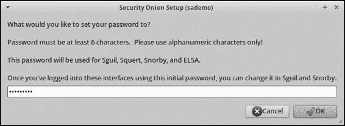

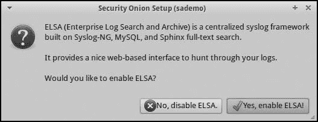

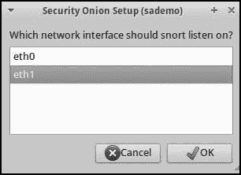

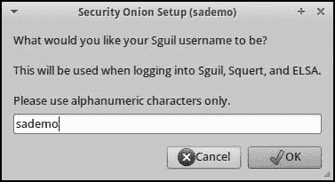

*图 3-18：告诉 SO 使用 Snort*

*图 3-19：输入 Sguil 用户名*

*应嗅探*

在下一个屏幕上，输入一个供 SO 用于日志记录的电子邮件地址

进入 Snorby NSM 控制台并验证用户。（SO 不会使用

此电子邮件地址不会向你发送垃圾邮件！事实上，SO 项目并不

以任何方式跟踪用户。）Snorby（也在第八章中讨论）是一个用于预先

向分析师呈现 NSM 数据，它使用单独的身份验证机制

基于电子邮件地址的身份验证。

现在你将选择一个字母数字密码，用于验证

运行 SO 的 NSM 软件， 如图 3-20 所示。（你可以

稍后通过 Sguil 和 Snorby 界面更改此密码。）

*图 3-20：为 SO NSM 应用输入密码*

在你为 SO NSM 应用创建凭证后，配置

脚本会询问你是否要安装企业日志搜索与

存档（ELSA）软件，如图 3-21 所示。选择 **是的，启用**

**ELSA!** 除非你使用的是硬件资源非常有限的系统。ELSA

提供一个搜索引擎接口，用于 NSM 日志数据。

*图 3-21：选择启用 ELSA*

独立 NSM 部署与安装 **69**

[www.it-ebooks.info](http://www.it-ebooks.info/)

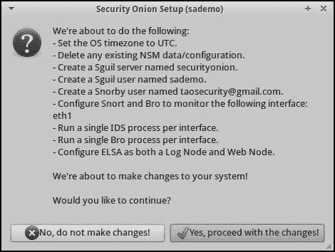

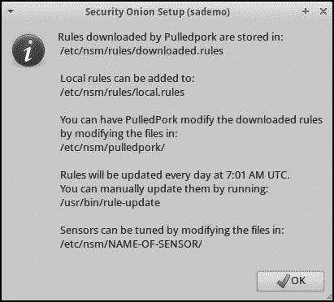

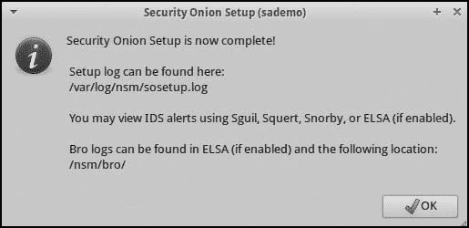

SO 现在应该总结它即将进行的更改。如果你喜欢

结果，选择 **是的，继续更改！**，如图 3-22 所示\。

*图 3-22：SO 已准备好继续更改。*

接下来，SO 配置系统的时区为 UTC，然后设置

完成时，它应该会启动所有与之捆绑的 NSM 应用。

报告一些有关系统的有用信息。你可以在 */var/log/nsm/sosetup.log* 文件中检查设置状态，如图 3-23 所示\。

安装状态

最后，你将看到有关 IDS 规则管理的信息，如下所示

图 3-24\。

*图 3-23：SO 设置已完成。*

*图 3-24：关于 IDS 规则的说明*

*管理*

***检查你的安装***

完成独立系统安装后，你应该进行一些

执行一些步骤，确保其按预期运行。

**70** 第三章

[www.it-ebooks.info](http://www.it-ebooks.info/)

首先，打开终端并运行以下命令以查看所有 NSM 代理是否正常运行。记得通过执行

桌面上的终端应用程序。

$ **sudo service nsm status**

[sudo] 输入 sademo 的密码：

状态：securityonion

* sguil server [ OK ]

状态：HIDS

* ossec_agent (sguil) [ OK ]

状态：Bro

名称 类型 主机 状态 Pid 对等节点 启动时间

bro 独立本地主机正在运行 5813 0 10 月 11 日 11:10:32

状态：sademo-eth1

* netsniff-ng (完整数据包) [ OK ]

* pcap_agent (sguil) [ OK ]

* snort_agent-1 (sguil) [ OK ]

* snort-1 (警报数据) [ OK ]

* barnyard2-1 (spooler，unified2 格式) [ OK ]

* prads (会话/资产) [ OK ]

* sancp_agent (sguil) [ OK ]

* pads_agent (sguil) [ OK ]

* argus [ OK ]

* http_agent (sguil) [ OK ]

现在，在同一窗口中运行以下命令生成

活动将触发 Snort 警报。我假设你的传感器能够看到

到独立系统管理端口的流量。如果没有，请运行

这个命令来自一个由新传感器监控的系统，或者访问 URL

在由新传感器监控的系统上使用 Web 浏览器。

**$ curl www.testmyids.com**

uid=0(root) gid=0(root) groups=0(root)

为了确定你的 NSM 设置是否部分正常工作，访问

使用 Web 浏览器访问 Snorby NSM 应用程序。将 Web 浏览器指向

你之前分配给独立传感器的 IP 地址。你将看到

收到一个错误，表示 HTTPS 证书不被信任，因为

它没有签名，如图 3-25 所示。除非你怀疑有中间人攻击，

普通用户正在对你进行中间人攻击时，如果确认安全，可以

选择**继续执行**或等效选项。（如果你稍后选择部署

如果浏览器信任该证书，你将不会看到这些警告。

现在你将看到 SO 欢迎页面，如图 3-26 所示，内容如下：

访问 SO 应用程序的链接通过 SO 上运行的 Web 服务器可用

系统。点击 Snorby 链接以确定是否捕获到数据触发的

通过访问*http://www.testmyids.com/*。

独立 NSM 部署和安装 **71**

[www.it-ebooks.info](http://www.it-ebooks.info/)

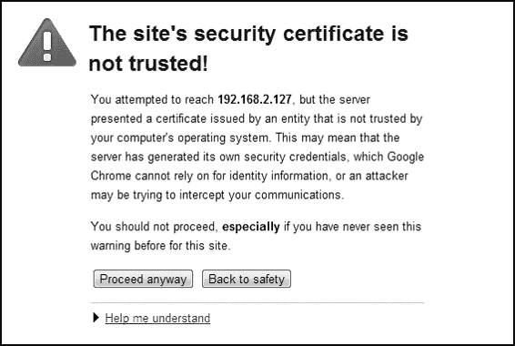

*图 3-25：证书警告*

*图 3-26：SO 欢迎页面*

点击 Snorby 链接应打开 SO 系统的一个新标签页或窗口。

IP 地址和端口 444。Snorby 应该会要求输入电子邮件地址和密码

你在设置时选择的单词，如图 3-27 所示。输入这些信息并点击

**欢迎，登录**。

**72** 第三章

[www.it-ebooks.info](http://www.it-ebooks.info/)

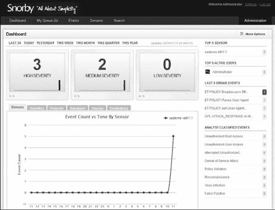

*图 3-27：Snorby 登录界面*

根据你部署传感器的位置和网络上活跃的

网络上活跃的流量，你将看到不同量的信息

初始仪表板上的信息。我们希望看到两个特定的  

屏幕右侧的警报：要么是 ET Policy curl User-Agent，要么是 GPL  

ATTACK_RESPONSE id ch。如果你看到其中任何一个或两个（如图 3-28 所示），  

你的传感器正在看到流量，并且至少有一个 NSM 应用程序（在此案例中，  

Snort）观察并正确报告了它。  

*图 3-28：Snorby 仪表板确认独立传感器操作。*  

独立 NSM 部署和安装 **73**  

[www.it-ebooks.info](http://www.it-ebooks.info/)  

**结论**

在本章中，我们创建了一个独立的 SO 平台。我们启动了 SO  

*.iso*文件并将 Xubuntu Linux 发行版安装到硬盘上。接下来，我们更新了操作系统，并开始了安装过程  

SO 软件。我们从配置网络接口开始，选择  

一个用于系统管理，另一个用于数据收集或嗅探。  

在准备好网络接口后，我们转向配置多种  

通过一个有用的向导过程来安装 SO 工具。一旦所有软件安装完成  

并配置完毕后，我们查看了 Snorby 控制台，确保它至少能够看到  

从网络中获取一些数据。  

在第四章中，我们将从独立平台的世界向前推进  

进入一个由分布式系统主导的世界。独立平台在  

用于隔离部署，但 NSM 模型的某些功能在此显现  

仅当分析师能够从多个角度与数据交互时，才会有效。  

独立平台有时可以监视多个网络段  

当监控段物理接近时表现良好。  

如果系统地理位置分散，分布式部署能够最有效地统一  

NSM 数据的收集和展示。第四章将展示如何使  

使其成为现实。  

**74** 第三章  

[www.it-ebooks.info](http://www.it-ebooks.info/)  

**4**  

**分 布 式 部 署**  

第三章讨论了构建 NSM 平台  

基于开源 SO 项目，专注于  

如何将 SO 安装为独立平台。  

单系统解决方案是一个很好的起点  

对于 NSM 世界的新手来说，这是一个很好的起点，但大多数组织  

许多组织有多个网络需要管理，  

监视。根据你在第二章和第三章中学到的内容，你可能已经识别出  

在你的环境中需要多个传感器协同工作的位置  

提供多站点可视性。幸运的是，正如前面所述  

本章，SO 支持分布式部署模型（服务器加传感器  

平台）以适应这些需求。  

除了涵盖分布式 SO 部署，本章还  

解释了如何使用 SO 个人包存档（PPA）来构建 SO 平台  

而不使用 SO *.iso*镜像。使用项目的官方*.iso*文件安装 SO 可能是开始的最简单方法，但有些组织更倾向于从自己版本的 Ubuntu Linux 开始。SO 项目的  

[www.it-ebooks.info](http://www.it-ebooks.info/)  

PPA 允许管理员在基于 Ubuntu Linux 的系统上安装 SO 包。您可以安装自己的 Ubuntu Linux 版本，添加 SO PPA，

然后享受完整的 SO 功能。

我们将开始构建一个分布式的 SO 配置。

**使用 SO .iso 镜像安装 SO 服务器**

如果您按照第三章中的指示操作，现在您已经拥有了一个独立的

SO 平台收集并解析网络流量。更具挑战性的是

一些情况需要服务器加传感器的部署。

如第三章所述，在服务器加传感器配置中，一个

或更多传感器收集 NSM 数据，服务器充当中央“大脑”

用于操作以及某些类型的 NSM 数据的聚合和存储点

类型的 NSM 数据。此部分描述如何安装 SO 服务器。安装后

设置服务器时，我们将安装一个与服务器协作的传感器

收集和展示 NSM 数据。

***SO 服务器注意事项***

在考虑 SO 服务器时，请记住，服务器将是中央

中央收集和存储点，用于某些类型的 NSM 数据。保持

请牢记以下事项：

• 一个 *SO 服务器* 操作一个中央 MySQL 数据库，所有 SO 传感器都连接到它

传输会话数据。会话数据的汇总是考虑

考虑 SO 服务器的内存和硬盘需求。

• 一个 *SO 传感器* 存储网络流量作为 pcap 文件。SO 传感器存储

将这些数据本地存储，直到它被复制到 SO 服务器上。这个本地存储的数据

数据是考虑硬盘需求时的关键因素

SO 传感器。

您还需要了解哪些数据存储在哪里，并知道如何

很多传感器可能会将数据提供给服务器。您需要

以下内容：

• 在 RAID 配置中有大量硬盘空间，您将使用这些空间来

存储会话和相关的 NSM 数据

• 至少 4GB 的 RAM，且需要更多的 RAM 以满足 MySQL 的需求

• 一个多核 CPU

• 至少需要一个网络接口用于管理目的

由于服务器未连接到网络 Tap 或 SPAN 端口，您

可以将其视为传统的服务器系统。像 SO 传感器这样的客户端

或 CIRT 分析员将连接到 SO 服务器以访问数据。连接到服务器的客户端数量

访问服务器的客户端数量以及您希望存储的集中数据量

可用的硬盘空间和内存是设计 SO 服务器时需要考虑的主要因素

服务器。

**第七十六章**

[www.it-ebooks.info](http://www.it-ebooks.info/)

**注意**

*一些 CIRT 选择将其中央服务器的功能分离。例如，他们* *运行与中央服务器协作的独立数据库系统。SO 默认不* *支持这种配置。因此，我们将在此讨论中省略这种配置。这里描述的配置在* *许多 CIRT 的生产环境中表现良好。*

***构建您的 SO 服务器***

要构建您的服务器，启动 SO *.iso* 镜像，选择 **Live**，然后等待直到您看到 SO 桌面。通过点击安装开始安装过程。

安全洋葱 12.04 图标。按照配置过程中的说明操作

“安装 SO 到硬盘”在第 62 页 总结来说，您将执行以下步骤，和上一章相似：

1\. 验证空间、连接、更新和第三方软件。

2\. 选择擦除磁盘以安装 SO。

3\. 选择用户名、计算机名和密码。

4\. 完成安装并重启系统。

5\. 使用**sudo apt-get update && sudo apt-get**更新已安装的软件

**dist-upgrade**。

完成此过程后，SO 软件应已安装在

服务器已安装，但尚未配置用于 NSM 的任务。此时

我们将系统转换为一个实时 SO 服务器。

第一个任务是手动为系统分配一个静态 IP 地址。

按照以下步骤操作：

1\. 点击屏幕左上角的蓝白色鼠标图标，

选择**设置**，然后选择**网络连接**，如图所示

图 4-1\。

*图 4-1：选择查看网络连接的设置*

分布式部署 **77**

[www.it-ebooks.info](http://www.it-ebooks.info/)

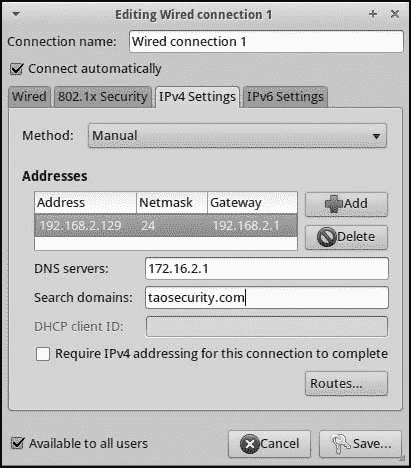

2\. 高亮**有线连接 1**，然后点击**编辑**。点击**IPv4**

**设置**选项卡中，然后将方法更改为**手动**。输入值

通过点击**添加**，然后输入适合您服务器的

输入所需的信息，如图 4-2 所示。（这些值代表

为我的示例网络选择合适的选项；确保使用与

与您的环境匹配。）

*图 4-2：配置有线连接 1 的*

*静态 IP 地址配置*

3\. 完成后，点击**保存**。对话框在过程中会变灰，直到

系统重新配置网络。

4\. 点击**关闭**以完成此过程。

5\. 重启系统。

此时，服务器正在运行正确的操作系统，

更新的组件，并可以通过静态管理 IP 地址访问。

***配置您的 SO 服务器***

现在我们可以开始将系统配置为 SO 服务器。为此，请按照以下步骤操作：

以下步骤：

1\. 点击**设置**图标并输入您的密码以执行管理

选择性任务。在提示时选择**是，继续！**。

2\. 当询问是否要配置接口时，选择**否，暂时不配置**。

3\. 在提示时选择**高级设置**。

**78** 第四章

[www.it-ebooks.info](http://www.it-ebooks.info/)

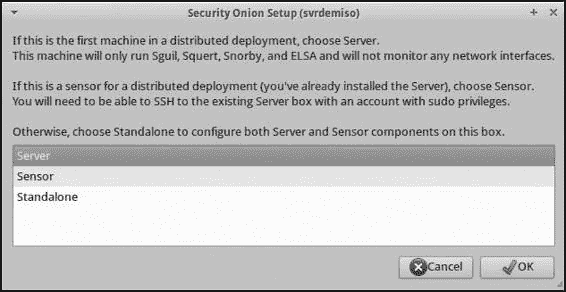

4\. 下一屏幕会询问您想要构建什么样的系统。选择**服务器**，如图 4-3 所示，然后点击**确定**。

*图 4-3：选择构建服务器*

5\. 现在选择运行 Snort 或 Suricata IDS 引擎。选择

选择您计划在传感器上运行的 IDS 引擎，然后点击**确定**。

6\. 当提示选择一个 IDS 规则集时，选择**Emerging Threats GPL**，

如图 4-4 所示。（Emerging Threats 规则集是免费的，并且

适合我们用途的配置。）

*图 4-4：选择 Emerging Threats GPL 规则集*

7\. 安装向导会询问 Sguil 用户名、Snorby 电子邮件地址和

密码。根据您的环境输入适当的回答。当

被问到是否要启用 ELSA 时，选择**是，启用 ELSA！**。安装向导

向导会总结您的选择，并询问是否准备好继续。

如图 4-5 所示。

分布式部署 **79**

[www.it-ebooks.info](http://www.it-ebooks.info/)

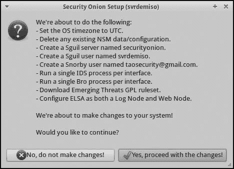

*图 4-5：继续进行 SO 服务器更改前的设置总结*

8\. 点击**是，继续进行更改！**，设置向导将完成。

完成 SO 服务器的安装。脚本应该报告安装是否成功。

安装完成。

9\. 为确认安装成功，访问托管在网页上的

服务器，然后访问一个支持网页的 NSM 应用程序，例如 Snorby。

此时，您只有一个活动的 SO 服务器。它尚未运行任何

收集和解读 NSM 数据的工具。Snorby 控制台将为空

直到您按照下文所述构建一个 SO 传感器。

**使用 SO .iso 镜像安装 SO 传感器**

我们的 SO 服务器没有一个或多个传感器来收集数据时，意义不大。

收集和解读 NSM 数据。在本节中，我们将使用

SO *.iso*文件。对于硬件，选择与您所使用的设备相同类型。

在独立模式下运行。

要构建传感器，请启动*.iso*镜像，选择**Live**，并等待直到看到 SO 桌面。点击

安装 Security Onion 12.04 图标，然后按照配置向导进行操作。

过程已在《安装 SO 到硬盘》中解释。

总结：您将执行以下步骤：

1\. 验证空间、连接性、更新和第三方软件。

2\. 选择擦除磁盘以安装 SO。

3\. 选择用户名、计算机名和密码。

4\. 完成安装并重启系统。

5\. 使用**sudo apt-get update && sudo apt-get**更新已安装的软件

**dist-upgrade**。

**80** 第四章

[www.it-ebooks.info](http://www.it-ebooks.info/)

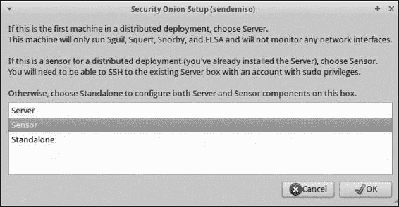

完成此过程后，SO 软件应该已安装在

传感器已安装，但尚未配置 NSM 任务。下一节中，

我们将在 SO 设置向导中选择静态 IP 地址，因为这是

这是 SO 传感器更大网络配置过程的一部分。我们

准备将系统转变为实时 SO 传感器，并让它与

与我们刚刚创建的 SO 服务器进行连接。

***配置 SO 传感器***

要将系统配置为 SO 传感器，请按照以下步骤操作：

1\. 点击设置图标并输入您的密码以执行管理员任务。

执行管理员任务时，选择**是，继续！**

2\. 当提示时，选择**eth0**作为管理接口（或选择任何

配置静态 IP 地址。

选择**eth1**进行嗅探（或选择任何您希望使用的接口）

用于收集和解读流量数据）。

3\. 通过选择**是，进行更改并重启！**来接受您的选择。

当系统重启时，它将准备好作为 SO 传感器进行配置

传感器。要配置传感器，请按照以下步骤操作：

1\. 点击设置图标并输入密码以执行管理任务

执行管理任务。当提示时，选择**是，继续！**

2\. 设置脚本应该注意到您已经配置了网络

接口，因此选择**是，跳过网络配置！**。

3\. 选择**传感器**，如图 4-6 所示\。

*图 4-6：选择构建传感器*

4\. 作为 SO 传感器，本系统将与我们的 SO 服务器协作。根据

设置向导应该提示您输入 SO 服务器的主机名或 IP 地址

如图 4-7 所示。正如您所见，我输入了

192.168.2.129，这是我之前为 SO 服务器静态分配的地址。输入

SO 服务器的 IP 地址。

分布式部署**81**

[www.it-ebooks.info](http://www.it-ebooks.info/)

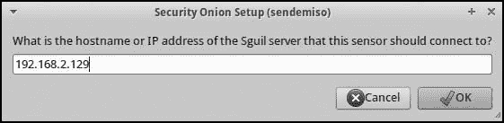

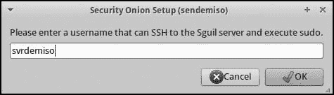

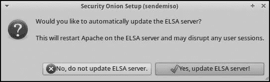

*图 4-7：为 SO 传感器设置向导提供 IP 地址*

*SO 服务器的*

5\. 设置向导将询问 SO 传感器进程的用户名

用于通过 OpenSSH 连接的用户名。SO 使用 OpenSSH 进行通信

服务器与一个或多个传感器之间的通信。您选择的用户名

在构建 SO 服务器时选择的用户名对于演示目的足够了，但

在生产环境中，您应在服务器上创建一个新用户

为每个您期望报告的传感器设置。单独的用户将限制您的

如果任何单个传感器被攻击，将会暴露系统。 我输入**svrdemiso**作为

用户账户，如图 4-8 所示。使用适合的值

您的设置。

*图 4-8：配置用户名以连接到 SO 服务器*

6\. 设置向导会询问要监视的接口，如图中所示

独立设置。我选择**eth1**，然后选择启用**ELSA**并

自动更新 ELSA 服务器（这有助于 ELSA 服务器）

让 SO 服务器知道有一个新节点正在检查并传送数据，如图所示

如图 4-9 所示\。

*图 4-9：告诉设置脚本更新 ELSA 服务器*

7\. 现在是提交这些更改的时候了。设置脚本总结了

如果您对输出结果满意，请点击**是，继续进行**

**更改！**，如图 4-10 所示\。

**82** 第四章

[www.it-ebooks.info](http://www.it-ebooks.info/)

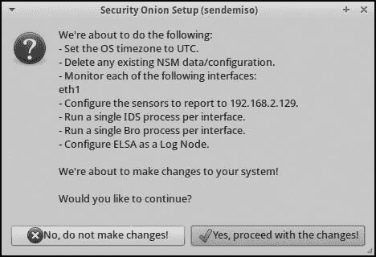

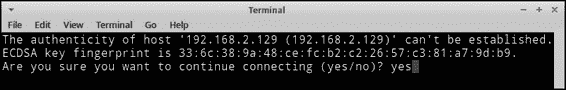

*图 4-10：继续进行 SO 传感器之前的 SO 概览*

*更改*

***完成设置***

如前所述，分布式 SO 部署依赖于 OpenSSH 进行通信。

通信。在设置过程中，OpenSSH 客户端可能会报告它无法

验证 SO 服务器的真实性。它可能会显示 ECDSA 密钥

SO 服务器的指纹，并询问是否继续连接。

本地登录到 SO 服务器并运行以下命令以

获取 ECDSA 密钥的指纹。（你的密钥与输出的内容会不同）

在列表 4-1 中的命令。)

$ **ls /etc/ssh/*key***

/etc/ssh/ssh_host_dsa_key /etc/ssh/ssh_host_ecdsa_key.pub

/etc/ssh/ssh_host_dsa_key.pub /etc/ssh/ssh_host_rsa_key

/etc/ssh/ssh_host_ecdsa_key /etc/ssh/ssh_host_rsa_key.pub

$ **ssh-keygen -lf /etc/ssh/ssh_host_ecdsa_key.pub**

256 33:6c:38:9a:48:ce:fc:b2:c2:26:57:c3:81:a7:9d:b9 root@svrdemiso (ECDSA)

*列表 4-1：检查 SSH 密钥*

验证你看到的密钥指纹是否与 SO 中的密钥匹配

服务器，然后输入**yes**并按回车，如图 4-11 所示。

*图 4-11：验证 OpenSSH ECDSA 密钥指纹*

几条更多的配置消息会通过，接着会出现另一个终端

终端会出现，提示你输入密码以登录 SO

服务器。正确输入密码后，安装向导会

报告显示它已完成。

分布式部署 **83**

[www.it-ebooks.info](http://www.it-ebooks.info/)

***验证传感器是否正常工作***

现在通过 **sudo service nsm status** 验证传感器是否正常运行

命令。如果你看到像列表 4-2 中那样的输出，一切可能正常

正常工作：

$ **sudo service nsm status**

状态：HIDS

* ossec_agent (sguil) [ OK ]

状态：Bro

名称 类型 主机 状态 进程号 对等 启动时间

管理员 管理员 192.168.2.130 正在运行 2501 2 10 2 月 17:17:26

代理代理 192.168.2.130 正在运行 2659 2 10 2 月 17:17:28

sendemiso-eth1-1 工作站 192.168.2.130 正在运行 3275 2 10 2 月 17:17:31

状态：sendemiso-eth1

* netsniff-ng (完整数据包数据) [ OK ]

* pcap_agent (sguil) [ OK ]

* snort_agent (sguil) [ OK ]

* suricata (警报数据) [ OK ]

* barnyard2 (排队器，统一 2 格式) [ OK ]

* prads (会话/资产) [ OK ]

* sancp_agent (sguil) [ OK ]

* pads_agent (sguil) [ OK ]

* argus [ OK ]

* http_agent (sguil) [ OK ]

*列表 4-2：检查 NSM 服务状态*

***验证 Autossh 隧道是否正常工作***

如果你注意到一个或多个 NSM 组件没有正常工作，尝试运行

**sudo service nsm restart** 命令停止并启动每个应用程序。如果

如果每个组件没有按预期工作，你可能遇到了

更严重的问题。你可能需要重新启动你的设置，或者咨询

在线 SO 邮件列表寻求帮助。你还应该验证 autossh

连接传感器到服务器的隧道是正常工作的。使用以下

按照列表 4-3 中所示的命令继续执行。

$ **ps aux | grep autoss[h]**

root 9775 0.0 0.0 4308 324 ? Ss 17:01 0:00 /usr/lib/

autossh/autossh -M 0 -q -N -o ServerAliveInterval 60 -o ServerAliveCountMax

3 -i /root/.ssh/securityonion -L 3306:127.0.0.1:3306 -R 50000:localhost:50000

-R 50001:localhost:9306 svrdemiso@192.168.2.129

*列表 4-3：查找 autossh 进程*

你可以使用 **pgrep -lf autossh** 获取类似的结果。如果输出为空，则说明你没有建立 autossh 隧道。尝试重新运行 SO 安装脚本。

你可以通过访问 *http://www.testmyids.com/* 来进行测试。如果你看到结果

在 Snorby 应用程序中，您的 SO 传感器正在将事件传递到您的

SO 服务器。恭喜您—您已构建了一个分布式 NSM 系统！

**84** 第四章

[www.it-ebooks.info](http://www.it-ebooks.info/)

**使用 PPA 构建 SO 服务器**

上述安装使用了 SO 项目提供的 SO *.iso* 文件，

但这不是唯一的安装选项。您还可以使用 SO 功能

在本地安装的基于 Ubuntu Linux 的操作系统上构建

SO 项目的 PPA，网址为 *https://launchpad.net/~securityonion/*。

一些组织倾向于避免使用其他人构建的 Linux 发行版

团队。如果您的组织遵循这种模式并使用自己的 Ubuntu

基于 Linux 的基础安装，您可以使用 SO PPA 将 SO 部署到您的

平台。

SO 项目构建了稳定、测试和开发 PPA。您应该

在生产环境中使用稳定版本。如果您想帮助保持 SO 的发展

向前运行，使用测试 PPA。开发 PPA 最适合用于 SO

开发人员。

在本章的剩余部分，我们将构建一个全新的服务器加

仅为演示替代方案而部署传感器

设置选项。我们将使用 SO 项目提供的 *.iso* 镜像

使用 64 位的 Ubuntu Server 12.04 LTS 版本作为

用作 SO 服务器和传感器的基础操作系统。

您可以从 Ubuntu 下载此发行版的 *.iso* 文件

项目网站地址 *http://www.ubuntu.com/download/server/*。访问时

在该页面上，您将看到一个获取 Ubuntu 12.04 LTS 选项，该选项将可用

直到 2017 年 4 月。选择此发行版是因为 SO 项目

针对 LTS 进行测试，无法保证对其他变体的支持。

这是一个您的组织可能会使用的流行选项，感谢

该版本的扩展可用性。

**注意**

*使用 PPA 构建自己的系统需要比使用 SO .iso 安装方法更多的 Linux 知识。例如，您需要知道* *如何转发 X 会话。（我将展示如何完成此任务，以及其他 Linux*

*步骤，在本章稍后部分。如果您对这个过程不熟悉，或者不理解其含义，请向一位有 Linux 经验的朋友请教，或者按照前面描述的方式从 .iso 文件安装 SO。*

***将 Ubuntu Server 安装为 SO 服务器操作系统***

通过启动 Ubuntu 服务器安装过程开始安装 Ubuntu 服务器

在选定硬件上安装 LTS *.iso* 镜像，以运行 SO 服务器。安装

向导将提示您做出若干选择。请做出以下选择

根据您的环境，调整相应的选择。

1\. 语言：**英语**

2\. **安装 Ubuntu Server**

3\. 选择语言：**英语**

4\. 选择您的位置：**美国**

分布式部署 **85**

[www.it-ebooks.info](http://www.it-ebooks.info/)

5\. 配置键盘：

• 检测键盘布局？**否**

• **英语（美国）**

• 键盘布局：**英语（美国）**

6\. 主机名：**serverdemo**

7\. 设置用户和密码：

• 新用户的全名：**serverdemo**

• 您账户的用户名：**serverdemo**

• 为新用户选择一个密码：**<输入密码>**

• 重新输入密码进行验证：**<输入密码>**

• 是否加密您的主目录？**否**

8\. 配置时钟。这个时区正确吗？**是**

9\. 分区磁盘：

• 分区方法：**引导 – 使用整个磁盘并设置 LVM**

• 选择要分区的磁盘：**<选择您的磁盘>**

• 将更改写入磁盘并配置 LVM？**是**

• 用于引导分区的卷组大小：**<接受>**

**default>，继续**

• 将更改写入磁盘？**是**

10\. 配置软件包管理器。HTTP 代理信息（空白为

无：**<空白>，继续**

11\. 配置 tasksel。您希望如何管理此系统的升级？

**无自动更新。**

12\. 软件选择。选择要安装的软件：**<点击空格键选择>**

**OpenSSH 服务器>，继续**

13\. 将 GRUB 引导加载程序安装到硬盘上。安装 GRUB 引导

将引导加载程序安装到主引导记录中？**是**

14\. 完成安装。**继续**

安装完成后，系统将重启。重新登录时，

您应该看到通过 DHCP 分配的 IP 地址，以及关于

可以应用的更新数量，如图 4-12 所示\。

在某些情况下，Ubuntu 可能不会显示 IP 地址或其他系统

信息。在这些情况下，登录脚本会确定系统的状态。

在负载下，它会报告这种情况。对于一些系统来说，这是正常现象，

启动大量的输入/输出 (I/O) 敏感操作后

启动中。

**86** 第四章

[www.it-ebooks.info](http://www.it-ebooks.info/)

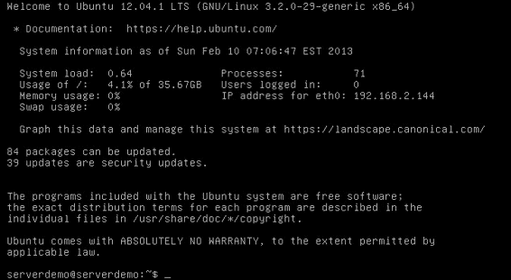

*图 4-12：Ubuntu 服务器已安装。*

***选择静态 IP 地址***

我们安装了操作系统并允许动态 IP 地址，

但现在我们想将 DHCP 转换为静态 IP 地址。在此

例如，我们将编辑一个特定的配置文件，这也是配置的一种方式。

设置静态 IP 地址。（我之前已经展示了如何设置静态 IP 地址）

使用 GUI 菜单进行配置。）首先，使用 vi 编辑器打开 */etc/network/interfaces* 文件进行编辑，如下所示（提示时输入您的密码）：

$ **sudo vi /etc/network/interfaces**

该文件应包含如列 4-4 所示的条目。

# 该文件描述了您系统上可用的网络接口

# 以及如何激活它们。更多信息，请参阅 interfaces(5)。

# 回环网络接口

auto lo

iface lo inet loopback

# 主要网络接口

auto eth0

iface eth0 inet dhcp

*列 4-4：默认的* /etc/network/interfaces 内容

分布式部署 **87**

[www.it-ebooks.info](http://www.it-ebooks.info/)

使用井号 (#) 注释掉 eth0 部分中的条目，并

添加如列 4-5 所示的粗体条目，以匹配您的设置。

（请向您的管理员询问最适合您的网络设置）

如果需要，请进行必要的工作。

# 主要网络接口

**#** auto eth0

**#** iface eth0 inet dhcp

auto eth0

iface eth0 inet static

**address 192.168.2.128**

**netmask 255.255.255.0**

**network 192.168.2.0**

**broadcast 192.168.2.255**

**gateway 192.168.2.1**

**dns-search taosecurity.com**

**dns-nameservers 172.16.2.1**

*列表 4-5：编辑后的* /etc/network/interfaces 内容

最后，重新启动网络服务以启用静态 IP 地址。

使用列表 4-6 中显示的命令。

$ **sudo /etc/init.d/networking restart**

* 运行 /etc/init.d/networking restart 已不推荐使用，因为它可能无法

再次启用某些接口

* 正在重新配置网络接口...

ssh 停止/等待

ssh 正在启动/运行，进程 16814 [ OK ]

*列表 4-6：重启网络服务以使用静态 IP 地址*

现在重启系统，以终止分配 IP 地址的虚拟 dhclient 进程。

通过 DHCP 分配 IP 地址。重启后，您的系统应该有一个静态 IP。

地址。

为了确认您的静态 IP 地址已按预期配置，连接

通过 OpenSSH 连接到服务器的 IP 地址，以继续进行后续任务。

从另一台工作站，打开终端并执行 **ssh *username*****@ *server***

***IP***，其中 ***username*** 是您配置的用户名，***server IP*** 是您为服务器申请的静态管理 IP 地址。

***更新软件***

接下来，更新您服务器上运行的软件。运行以下命令：

$ **sudo apt-get update && sudo apt-get dist-upgrade**

当被询问是否继续时，输入 **Y** 并按回车键。

服务器将下载并安装任何更新。完成后，输入

**sudo reboot** 完成过程并重启服务器。

**88** 第四章

[www.it-ebooks.info](http://www.it-ebooks.info/)

***开始在 SO 服务器上进行 MySQL 和 PPA 设置***

重启后，登录。现在我们将开始配置我们的系统作为 SO

服务器。首先，执行以下命令，告诉 MySQL 不要提示输入

安装过程中需要输入 root 密码。

$ **echo "debconf debconf/frontend select noninteractive" | sudo debconf-set-selections** 现在安装 python-software-properties 包。

$ **sudo apt-get -y install python-software-properties**

接下来，将 securityonion/stable PPA 添加到识别的软件源列表中。

由此 Ubuntu 服务器组织，如列表 4-7 所示\。

$ **sudo add-apt-repository -y ppa:securityonion/stable**

gpg: 创建了密钥环 `/tmp/tmpnOilj5/secring.gpg`

gpg: 创建了密钥环 `/tmp/tmpnOilj5/pubring.gpg`

gpg: 从 hkp 服务器 keyserver.ubuntu.com 请求密钥 23F386C7

gpg: /tmp/tmpnOilj5/trustdb.gpg: 创建了信任数据库

gpg: 密钥 23F386C7：已导入公钥 "Launchpad PPA for Security Onion"

gpg: 处理总数：1

gpg: 导入了 1 个密钥 (RSA: 1)

OK

*列表 4-7：将 securityonion/stable PPA 添加到软件源列表中*

使用以下命令更新软件包列表。

$ **sudo apt-get update**

现在安装 securityonion-server 包。

$ **sudo apt-get install securityonion-server**

在列表 4-8 中可以看到，除了许多依赖项外，系统还

计划安装大量特定于 SO 的软件包。这在软件安装过程中是正常的

安装。

*-- snip --*

securityonion-capme securityonion-daq securityonion-et-rules

securityonion-limits securityonion-login-screen

securityonion-nsmnow-admin-scripts securityonion-ossec-rules

securityonion-passenger securityonion-passenger-conf

securityonion-pfring-daq securityonion-pfring-ld securityonion-pfring-module

securityonion-pfring-userland securityonion-pulledpork

securityonion-rule-update securityonion-server securityonion-setup

securityonion-sguil-agent-ossec securityonion-sguil-db-purge

securityonion-sguil-server securityonion-sguild-add-user

securityonion-snorby securityonion-snort securityonion-sostat

分布式部署 **89**

[www.it-ebooks.info](http://www.it-ebooks.info/)

securityonion-squert securityonion-squert-cron securityonion-web-page securityonion-wkhtmltopdf shared-mime-info sound-theme-freedesktop sox

sqlite3 ssl-cert tcl-tls tcl8.5 tcllib tclx8.4 tcpflow tcpflow-no-tags

tshark ttf-dejavu-core ttf-liberation wireshark-common x11-common xplico

zenity zenity-common

0 个升级，安装 288 个新包，0 个待删除，0 个未升级。

需要下载 287 MB 的归档文件。

完成此操作后，将使用 643 MB 的额外磁盘空间。

你想继续吗 [Y/n]？

*列表 4-8：安装 securityonion-server 软件包*

输入 **Y** 并按回车键继续。你可能需要等待几分钟

需要几分钟时间，服务器将下载并安装所需的软件。

一旦完成，安装 securityonion-elsa 和 securityonion-elsa-extras

软件包。

$ **sudo apt-get install securityonion-elsa securityonion-elsa-extras**

***通过 PPA 配置你的 SO 服务器***

现在使用 sosetup 设置此服务器。通过 Linux 系统通过 SSH 连接

利用 X 转发功能。这里，我是从另一个

名为 ubuntu 的 Linux 系统。注意使用大写的 -X 选项来启用

X 转发。X 是一种用于显示图形用户界面的协议。为了

转发意味着将图形界面窗口发送到除本地计算机之外的地方

运行它的服务器。-X 选项告诉远程服务器显示客户端的窗口

通过 SSH 连接将窗口转发到本地桌面，使其显示在本地，

而不是远程系统。这允许你与那些客户端窗口进行交互

并根据需要配置软件。列表 4-9 解释了详细信息。

richard@ubuntu:~$ **ssh -X serverdemo@192.168.2.128**

主机 '192.168.2.128 (192.168.2.128)' 的真实性无法验证。

ECDSA 密钥指纹是 7f:a5:75:69:66:07:d9:1a:90:e5:42:1a:91:5a:ab:65\。

你确定要继续连接吗（yes/no）？ **yes**

警告：'192.168.2.128' (ECDSA) 已永久添加到已知主机列表中。

serverdemo@192.168.2.128 的密码：**********

欢迎使用 Ubuntu 12.04.2 LTS (GNU/Linux 3.2.0-37-generic x86_64)

* 文档： https://help.ubuntu.com/

系统信息：2014 年 2 月 10 日星期天 10:02:59 EST

系统负载：0.0 进程：94

使用情况 /: 35.20GB 的 7.2% 用户已登录：1

内存使用率：7% eth0 的 IP 地址：192.168.2.128

交换区使用率：0%

图形化显示这些数据并通过 https://landscape.canonical.com/ 管理此系统

**90** 第四章

[www.it-ebooks.info](http://www.it-ebooks.info/)

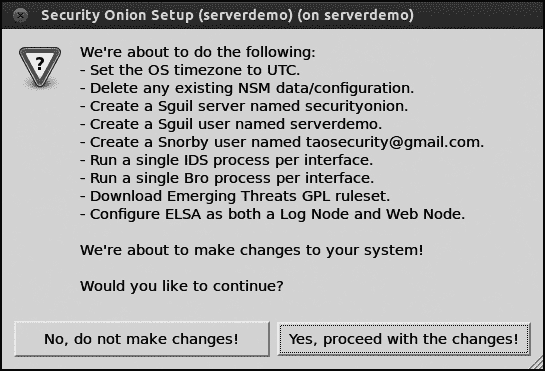

上次登录：2014 年 2 月 10 日星期天 09:59:57

/usr/bin/xauth: 文件 /home/serverdemo/.Xauthority 不存在

serverdemo@serverdemo:~$ **sudo sosetup**

[sudo] 密码为 serverdemo: ***********

*清单 4-9：连接到 SO 服务器并配置 X 转发*

当你运行 **sudo sosetup** 时，你将在本地看到一个屏幕。

工作站，如图 4-13 所示。

*图 4-13：准备运行 SO 设置*

现在按之前配置 SO 服务器的方式配置这个 SO 服务器。

构建 SO 服务器，基于本章早些时候的 *.iso* 文件，在“配置

你的 SO 服务器” 第 78 页。做出选择后，设置向导将总结这些选择并询问你是否继续

如图 4-14 所示，应用更改。

*图 4-14：在继续 SO 服务器更改之前的 SO 摘要*

点击 **是，继续更改！** 后，设置向导将

完成安装。

如在“配置您的 SO 服务器”第 78 页所讨论，确认安装是否成功，访问托管在服务器上的网页并

访问支持 Web 的 NSM 应用程序，如 Snorby。

服务器激活后，接下来是构建传感器。

分布式部署 **91**

[www.it-ebooks.info](http://www.it-ebooks.info/)

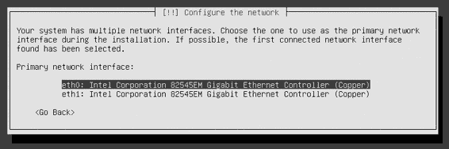

**使用 PPas 构建 So 传感器**

服务器运行后，我们可以开始使用 PPAs 构建 SO 传感器。

该传感器将与我们刚刚构建的服务器合作。我们将继续

以使用 Ubuntu 服务器发行版作为我们的操作系统为主题，

使用 PPAs 添加 SO 组件。

***作为 SO 传感器操作系统安装 Ubuntu 服务器***

通过启动 Ubuntu Server 开始安装过程

LTS *.iso* 文件将被安装到选择的硬件上，用于运行 SO 传感器。安装

向导将提示你做出一些选择。做出以下选择

选择项，根据你的环境适当调整：

1\. 语言：**英语**

2\. **安装 Ubuntu 服务器**

3\. 选择语言：**英语**

4\. 选择你的位置：**美国**

5\. 配置键盘：

• 检测键盘布局？**否**

• **英语（美国）**

• 键盘布局：**英语（美国）**

6\. 配置网络。主机名：**sensordemo**

当被提示选择一个主要的网络接口时（如图所示）

如图 4-15 所示，必须告知设置向导使用哪个 NIC 进行管理。

在图 4-15 中，我选择 eth0 作为管理的主要网络接口

设置向导应自动从一个 IP 地址中查找

eth0 的 DHCP 服务器。（我们将在运行 SO 设置脚本时设置静态 IP。）

*图 4-15：选择主网络接口*

现在按照以下步骤继续安装操作系统。

我输入的值，如用户名和密码，仅供演示使用。

选择符合生产需求的值。

**92** 第四章

[www.it-ebooks.info](http://www.it-ebooks.info/)

1\. 设置用户和密码：

• 新用户的全名：**sensordemo**

• 你的帐户的用户名：**sensordemo**

• 为新用户选择密码：**<enter password>**

• 重新输入密码以验证：**<enter password>**

• 加密你的主目录吗？**否**

2\. 配置时钟。这个时区是否正确？**是**

3\. 分区磁盘：

• 分区方式：**引导—使用整个磁盘并设置 LVM**

• 选择要分区的磁盘：**<choose your disk>**

• 将更改写入磁盘并配置 LVM 吗？**是**

• 用于引导分区的卷组大小：**<accept**

**默认>，继续**

• 将更改写入磁盘吗？**是**

4\. 配置软件包管理器。HTTP 代理信息（留空表示不设置）

无（空白）：**<blank>, 继续**

5\. 配置 tasksel。你希望如何管理此系统上的升级？

系统？**不自动更新。**

6\. 软件选择。选择要安装的软件：**<click spacebar on**

**OpenSSH 服务器>，继续**

7\. 在硬盘上安装 GRUB 引导加载程序。安装 GRUB 引导

将引导加载程序写入主引导记录吗？**是**

8\. 完成安装。**继续**

安装完成后，系统将重启。

登录后，你可能会看到通过 DHCP 分配的 IP 地址，以及

各种消息。如果显示 IP 地址，请注意。如果系统负载较高，

在负载较高时，你可能看不到报告 IP 地址的系统信息屏幕。

地址。要获取管理网卡的 IP 地址，请运行**ifconfig eth0**

在命令提示符下，如图 4-16 所示。

*图 4-16：运行 ifconfig eth0 以获取管理 IP 地址*

分布式部署 **93**

[www.it-ebooks.info](http://www.it-ebooks.info/)

现在是时候更新传感器软件了。使用 OpenSSH 连接到服务器并输入以下命令：

$ **sudo apt-get update && sudo apt-get dist-upgrade**

当系统提示时，键入**Y**以继续，然后按回车。传感器

应该下载并安装更新。完成后，输入**sudo**

**reboot**命令重启服务器并完成过程。

***将系统配置为传感器***

我们的下一个任务是配置 SO 传感器。首先，输入以下命令：

命令告诉 MySQL 在安装过程中不要提示输入 root 密码。

$ **echo "debconf debconf/frontend select noninteractive" | sudo debconf-set-selections** 现在安装 python-software-properties 包。

$ **sudo apt-get -y install python-software-properties**

接下来，将 securityonion/stable PPA 添加到已识别的仓库列表中，

由此 Ubuntu 系统识别的仓库列表，如清单 4-10 所示。

$ **sudo add-apt-repository -y ppa:securityonion/stable**

gpg: 密钥环 `/tmp/tmpBByK4H/secring.gpg' 已创建

gpg: 密钥环 `/tmp/tmpBByK4H/pubring.gpg' 已创建

gpg: 从 hkp 服务器 keyserver.ubuntu.com 请求密钥 23F386C7

gpg: /tmp/tmpBByK4H/trustdb.gpg: trustdb 已创建

gpg: 密钥 23F386C7: 公钥 "Launchpad PPA for Security Onion" 导入成功

gpg: 处理的总数: 1

gpg: 已导入: 1 (RSA: 1)

好的

*清单 4-10: 将 securityonion/stable PPA 添加到软件源列表*

使用以下命令更新软件包列表。

$ **sudo apt-get update**

安装以下软件包。

$ **sudo apt-get install securityonion-sensor securityonion-elsa securityonion-elsa-extras** 在系统询问是否继续时，输入**Y**并按回车键。

**94** 第四章

[www.it-ebooks.info](http://www.it-ebooks.info/)

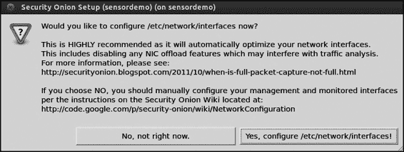

***运行设置向导***

为了运行设置向导，我们需要使用 OpenSSH 和启用 X 转发

继续。执行以下操作，但请使用适合的用户名和 IP 地址

你的环境。在清单 4-11 中，我选择了 sensordemo 作为用户名，

通过 DHCP 分配的 IP 地址是 192.168.2.147\。

richard@ubuntu:~$ **ssh -X sensordemo@192.168.2.147**

无法验证主机 '192.168.2.147 (192.168.2.147)' 的真实性。

ECDSA 密钥指纹是 a5:a9:08:16:b5:d2:3c:ce:59:f7:08:91:a0:04:0b:47\。

确认是否继续连接 (yes/no)? **yes**

警告: 已永久添加 '192.168.2.147' (ECDSA) 到已知主机列表。

sensordemo@192.168.2.147 的密码: ***********

欢迎使用 Ubuntu 12.04.2 LTS (GNU/Linux 3.2.0-37-generic x86_64)

* 文档: https://help.ubuntu.com/

系统信息截至 2013 年 2 月 10 日 13:06:46 EST

系统负载: 0.11 进程: 82

使用情况 /: 35.20GB 中的 5.3% 已使用 登录用户: 1

内存使用: 1% eth0 的 IP 地址: 192.168.2.147

交换使用: 0%

在 https://landscape.canonical.com/ 上绘制这些数据并管理此系统

上次登录: 2013 年 2 月 10 日 13:03:59

/usr/bin/xauth: 文件 /home/sensordemo/.Xauthority 不存在

sensordemo@sensordemo:~$ **sudo sosetup**

[sudo] sensordemo 的密码: **********

*清单 4-11: 连接到 SO 传感器并配置 X 转发*

执行此命令时，你将看到如下所示的屏幕

如图 4-17 所示。你需要配置网络接口，因为

平台是传感器。

*图 4-17: 配置网络接口的提示*

分布式部署 **95**

[www.it-ebooks.info](http://www.it-ebooks.info/)

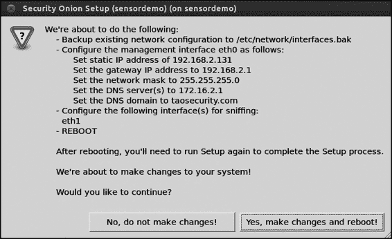

请记得使用 SO 的 IP 地址、用户名和密码

从 PPAs 安装服务器。设置向导将总结你的配置

选择并询问是否希望继续更改，如图所示

图 4-18\.

*图 4-18: 在继续修改网络接口之前的 SO 总结*

系统重启后，再次通过

OpenSSH 并启用 X 转发。重新运行设置向导，然后

选择**高级设置**4**传感器**。输入 SO 服务器的 IP 或主机名，

服务器，随后是可以通过 OpenSSH 连接并运行的用户名

sudo。选择适当的 NIC 进行监控，启用 ELSA，更新

ELSA 服务器，然后查看变更摘要，

看起来类似于图 4-19\。

*图 4-19：在进行传感器更改前的 SO 摘要*

**96** 第四章

[www.it-ebooks.info](http://www.it-ebooks.info/)

当你连接时，将提示你继续通过 OpenSSH 连接，

无法验证 SO 服务器的 ECDSA 密钥的真实性。你还将

需要登录 SO 服务器，并输入 sudo 密码。一旦

完成后，设置向导会报告已完成。之后，

GUI 消失后，运行状态脚本查看 NSM 应用是否

正在运行，如清单 4-12 所示\。

$ **sudo service nsm status**

状态：HIDS

* ossec_agent (sguil) [ OK ]

状态：Bro

名称 类型 主机 状态 PID 同行 启动时间

manager manager 192.168.2.131 正在运行 3173 2 10 2 月 18:18:27

代理 proxy 192.168.2.131 正在运行 3228 2 10 2 月 18:18:29

sensordemo-eth1-1 worker 192.168.2.131 正在运行 3275 2 10 2 月 18:18:32

状态：sensordemo-eth1

* netsniff-ng (完整数据包数据) [ OK ]

* pcap_agent (sguil) [ OK ]

* snort_agent (sguil) [ OK ]

* suricata (警报数据) [ OK ]

* barnyard2 (spooler, unified2 格式) [ OK ]

* prads (会话/资产) [ OK ]

* sancp_agent (sguil) [ OK ]

* pads_agent (sguil) [ OK ]

* argus [ OK ]

* http_agent (sguil) [ OK ]

*清单 4-12：检查 NSM 服务状态*

也检查是否建立了如图所示的 autossh 隧道

清单 4-13\。

$ **ps aux | grep autoss[h]**

root 3046 0.0 0.0 4308 320 ? Ss 18:18 0:00 /usr/lib/

autossh/autossh -M 0 -q -N -o ServerAliveInterval 60 -o ServerAliveCountMax

3 -i /root/.ssh/securityonion -L 3306:127.0.0.1:3306 -R 50000:localhost:50000

-R 50001:localhost:9306 serverdemo@192.168.2.128

*清单 4-13：查找 autossh 进程*

这些结果（每个字段中都有 OK）都是好兆头。如果你得到不同的

如果得到不同的结果，尝试重新运行设置向导。

为了验证一切是否按预期工作，访问 Web 服务器

正在新 SO 服务器上运行，然后运行 Snorby 并查看事件

由 Suricata IDS 引擎捕获。如果你看到事件，恭喜你—

你已经使用 Ubuntu Linux PPAs 构建了分布式 NSM 系统！

分布式部署 **97**

[www.it-ebooks.info](http://www.it-ebooks.info/)

**结论**

在本章中，你超越了传统的独立 SO 模型

并进入了分布式 NSM 操作的世界。我们查看了两种

部署服务器加传感器系统的可能方式：

• 使用 SO 项目提供的*.iso*镜像构建 SO 服务器，

然后使用相同的*.iso*文件构建 SO 传感器。

• 使用 Ubuntu Server 发行版的标准*.iso*镜像来

替换 SO 项目的*.iso*文件。我们使用 SO 项目 PPAs 构建了一个

SO 服务器和 SO 传感器。

使用每种方法—SO 项目的*.iso*文件或“标准”*.iso*文件

来自 Ubuntu 开发者的警告—我们构建了一个分布式 NSM 系统。

在第五章中，我们将简要介绍各种 SO 系统维护任务

问题，如保持平台更新，限制网络访问，

为了安全性目的，并管理平台存储。

**98** 第四章

[www.it-ebooks.info](http://www.it-ebooks.info/)

**5**

**SO 平台的维护**

在第三章和第四章中，我们构建了独立的，

服务器和传感器 SO 平台。所有的

这些平台是 Linux 系统，

需要一定的注意和维护

维护。本章解释了三个系统共同的关键任务。

这三种系统的管理任务包括

保持软件更新，限制网络访问以促进安全性，

以及管理系统存储。通过遵循本章中的建议

本章，你将保持 SO 平台的平稳运行，同时提供

重要数据传送给 NSM 分析师。

**保持 SO 系统最新**

所有 NSM 平台运行的代码可能需要定期更新，

SO 系统也不例外。如果你不定期更新操作系统，

系统及各种应用程序，可能会出现运行代码的问题，

[www.it-ebooks.info](http://www.it-ebooks.info/)

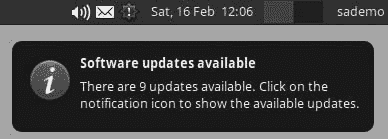

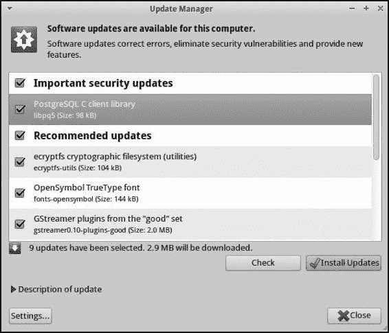

漏洞。幸运的是，SO 的更新并不困难。最简单的路径是

使用图形用户界面的更新方法很容易，但 SO 团队推荐从命令行更新。

这种方法提供了更多对更新过程的控制，因此我建议使用它。

过程。我们将从最简单的方法开始，然后看看如何使用

推荐的更新方式。

***通过图形用户界面更新***

若要通过图形用户界面更新，请登录 SO 控制台。你可能会看到类似的通知

与图 5-1 所示的界面类似，通知你有可用的更新。

*图 5-1：SO 会通知你有可用的更新。*

点击感叹号图标，打开一个带有更新选项的菜单，

并选择**显示更新**。你很可能会看到重要的和推荐的更新，

推荐的更新，如图 5-2 所示。

*图 5-2：重要的安全更新和推荐更新已可用。*

**100** 第五章

[www.it-ebooks.info](http://www.it-ebooks.info/)

我建议安装所有更新。例外情况是如果 SO 项目在某些更新上遇到问题，在这种情况下，它可能会建议

遵循其他程序或避免某些更新。如果有警告，

警告将发布在 SO 网站上，网址是*http://securityonion.blogspot.com/*。

若要继续，点击**安装更新**。完成后，更新管理器

将报告软件已是最新版本，并且可能需要重新启动系统。

请遵循任何附加指示。

正如你所看到的，通过图形用户界面进行更新是很简单的。然而，你可以找到

自行接受可能与推荐更新不兼容的更新。

SO 项目的推荐。例如，MySQL 数据库更新可能

可能会有一些问题。因此，我建议遵循 SO 项目的建议：

通过命令行进行更新。

***通过命令行更新***

SO 项目博客通常会告知用户通过 com- 进行更新。

命令行，并提供特定的语法。要执行通用更新，请打开

在桌面上的终端输入以下内容：

$ **sudo apt-get update**

现在使用列表 5-1 中显示的命令检查过时的软件。

$ **sudo apt-get upgrade**

正在读取软件包列表... 完成

正在构建依赖树

正在读取状态信息... 完成

以下软件包将被升级：

ecryptfs-utils fonts-opensymbol gstreamer0.10-plugins-good

gstreamer0.10-pulseaudio language-selector-common language-selector-gnome

libecryptfs0 libpciaccess0 libpq5

9 个已升级，0 个新安装，0 个移除，0 个未升级。

需要下载 2,861 kB 的档案。

操作完成后，将释放 114 kB 磁盘空间。

是否继续 [Y/n]？

*列表 5-1：运行 sudo apt-get upgrade*

记得遵循 SO 团队关于更新的警告，

决定是否继续，并回答是或否。如果你回答 **Y**，

Apt 将下载并安装更新。

重启以确保你的 SO 应用程序正常工作。

**注**

*更多关于更新 SO 的指导请参见附录。*

SO 平台维护 **101**

[www.it-ebooks.info](http://www.it-ebooks.info/)

**限制对 SO 的访问**

默认情况下，SO 配置了启用的 Linux iptables 防火墙。一个本地防火墙

防火墙像 iptables 一样帮助执行适当的网络安全策略

服务器。要查看默认的访问控制设置，请运行不复杂的

防火墙（UFW）配置程序通过 **sudo ufw status**。（我添加了

最右列到列表 5-2 手动显示与服务相关联的内容

每个开放端口都有相应的配置。）

$ **sudo ufw status**

[sudo] 密码为 sademo: **********

状态：活动

从 操作

-- ------ ----

22/tcp 允许 任何地方 OpenSSH

514 允许 任何地方 Syslog

1514/udp 允许 任何地方 OSSEC

443/tcp 允许 任何地方 Apache

444/tcp 允许 任何地方 Snorby

7734/tcp 允许 任何地方 Sguil 客户端到服务器

7736/tcp 允许 任何地方 Sguil 代理到服务器

3154/tcp 允许 任何地方 ELSA

22/tcp 允许 任何地方 (v6) OpenSSH

514 允许 任何地方 (v6) Syslog

1514/udp 允许 任何地方 (v6) OSSEC

443/tcp 允许 任何地方 (v6) Apache

444/tcp 允许 任何地方 (v6) Snorby

7734/tcp 允许 任何地方 (v6) Sguil 客户端到服务器

7736/tcp 允许 任何地方 (v6) Sguil 代理到服务器

3154/tcp 允许 任何地方 (v6) ELSA

*列表 5-2：防火墙策略*

由此命令列出的防火墙策略显示所有允许状态，

允许网络流量通过指定端口的防火墙策略

隐式地拒绝对任何其他端口的入站访问。这意味着如果，

例如，你需要修改配置来启动 Apache 网络服务器

如果服务器在另一个端口上，你需要更改 iptables 防火墙访问设置。

根据需要调整控制列表。

在默认配置中，Apache 在端口 443 TCP 上监听，

根据防火墙设置，远程系统被允许连接到端口 443 TCP

策略。监听在端口 4443 上的 Apache，然而将无法访问。

除非管理员更改了防火墙策略。

一些管理员选择不暴露更多端口以进行远程访问，

选择限制在公共接口上监听的服务数量。相反

让应用程序监听公共网络接口时，管理员

“绑定”它们到非公开接口。

一种使用非公开接口提高安全性的方法是配置

让应用程序仅监听 localhost（127.0.0.1）。当应用程序

**102** 第五章

[www.it-ebooks.info](http://www.it-ebooks.info/)

只监听本地接口的应用程序无法被远程访问；只能通过本地系统访问（因此使用 localhost，非公开 IP 地址）。

然而，你可以通过巧妙地配置 OpenSSH 来“模拟”本地访问。

你可以从授权的远程客户端设置 SSH 代理到目标

运行监听本地接口的应用程序的服务器。

***通过 SOCKS 代理连接***

为了演示访问仅在本地接口上监听的应用程序，我们将

与 Xplico 应用程序一起工作，你可能记得看到过一个警告，

在 SO 欢迎页面上，显示端口 9876 TCP 用于 Xplico 不可用。

从远程连接时。默认情况下，如果你尝试从远程计算机连接到端口，

如果 SO 系统上的端口 9876 TCP 未开放，iptables 将拒绝连接。9876 TCP 端口

本地可用。如果你在 SO 平台上打开网页浏览器并

将其指向端口 9876 TCP，Xplico 正在监听该端口。

如果你想从桌面访问 Xplico，你需要

模拟本地访问。如果你使用 SSH 作为

SOCKS 代理（一个旨在允许这种“隧道”模拟的协议——

模拟本地访问）。

使用 SSH 设置 SOCKS 代理将允许你远程访问

一个只监听本地接口的应用程序。你可以在设置过程中通过以下方式实现这个目标。

不论是在 Microsoft Windows 桌面还是 Linux 桌面上。

如果你的远程客户端运行 Microsoft Windows，你可以使用免费的 PuTTY

客户端，可以连接到该端口。PuTTY 是一个

提供一个单独的*.exe*二进制文件，不需要任何安装过程。按照以下步骤进行操作：

1. 运行*putty.exe*程序，并导航至**连接**4**SSH**4**隧道**。

在源端口字段中输入一个 TCP 端口，该端口将在你的本地系统上监听。

（在这个例子中，我使用的是 8080 TCP）。

2. 选择**动态**和**自动**单选按钮，然后点击**添加**。你的设置应如下图 5-3 所示。

3. 返回 PuTTY 的会话部分，输入主机名或 IP 地址

以及远程 SO 独立系统的端口，然后点击**打开**。

4. 使用你选择的用户名和密码登录到 SO 系统。

在设置过程中。

5. 打开你的网页浏览器并选择配置网络

设置。例如，如果你使用 Firefox，选择**选项**4**网络**4

选择**设置**，然后配置手动代理的连接设置。

配置 SOCKS 主机为 127.0.0.1，端口设置为

你在 PuTTY 中配置的防火墙规则。图 5-4 显示了我的设置。点击 **OK** 来

继续。

6\. 将 Firefox 指向 *https://127.0.0.1:9876*。你的浏览器应该重定向到

*https://127.0.0.1:9876/users/login* 并警告 Xplico 未运行。

这样没问题；你已经通过 TCP 端口 9876 访问了 web 服务器，哪

之前无法远程访问。

SO 平台维护 **103**

[www.it-ebooks.info](http://www.it-ebooks.info/)

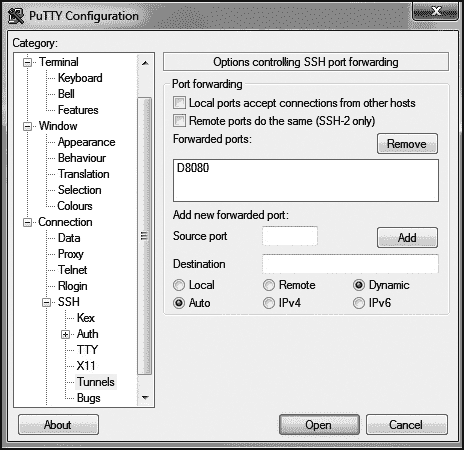

*图 5-3：配置 PuTTY 用于 SSH 端口转发*

*图 5-4：在 Firefox 中配置代理设置*

**104** 第五章

[www.it-ebooks.info](http://www.it-ebooks.info/)

如果你的远程客户端是 Linux 系统，你可以使用集成的 SSH 客户端实现相同的目标。在你的 Linux 桌面上，运行以下命令

命令：

**ssh -L 9876:localhost:9876 *用户名*****@ *SO 服务器 IP***

在你的隧道建立后，按照前面的步骤 4 和 5 进行操作

配置 Windows 远程客户端的 Firefox 浏览器的程序

并访问 web 服务器。

***更改防火墙策略***

如果你不想通过隧道传输流量来绕过防火墙，你可以修改

更改防火墙规则。例如，以下命令更改规则集

允许远程访问端口 9876 TCP。

$ **sudo ufw allow 9876/tcp**

规则已添加

规则已添加（v6）

要再次禁止该端口，请输入以下命令：

$ **sudo ufw deny 9876/tcp**

规则已更新

规则已更新（v6）

请参阅 SO wiki 获取更多有关配置防火墙的信息

( *https://code.google.com/p/security-onion/wiki/Firewall*).

**管理 SO 数据存储**

一旦你安装并配置了 SO 并将其嗅探接口连接到

在实时网络中，NSM 软件开始收集并解释流量。

SO 传感器存储了各种 NSM 数据类型，但有两个目录特别重要：

特别关注：

• */nsm* 目录存储日志和完整的内容数据。

• */var/lib/mysql* 目录保存 SO 的数据库。

*/nsm* 目录通常比 */var/lib/mysql* 占用更多的磁盘空间。

SO 将完整的内容数据保存在 */nsm/sensor_data/<传感器名-接口>/*

*dailylogs/YYYY-MM-DD* 目录，文件名采用 *snort.log.<Unix 时间戳>* 格式。虽然文件名中有 *snort*，但内容是常见的 pcap 格式。列表 5-3 显示了存储在独立演示 SO 平台上两个目录中的完整内容数据。

SO 平台维护 **105**

[www.it-ebooks.info](http://www.it-ebooks.info/)

sademo@sademo:/nsm/sensor_data/sademo-eth1/dailylogs$ **ls -alR**

.:

总计 16

drwxrwxr-x 4 sguil sguil 4096 Feb 16 12:28 .

drwxrwxr-x 7 sguil sguil 4096 Feb 10 11:12 ..

drwxrwxr-x 2 sguil sguil 4096 Feb 10 13:09 2014-02-10

drwxrwxr-x 2 sguil sguil 4096 Feb 16 20:15 2014-02-16

./2013-02-10:

总计 118060

drwxrwxr-x 2 sguil sguil 4096 Feb 10 13:09 .

drwxrwxr-x 4 sguil sguil 4096 Feb 16 12:28 ..

-rw-r--r-- 1 root root 108390541 Feb 10 11:31 snort.log.1360494635

-rw-r--r-- 1 root root 12485022 Feb 10 13:17 snort.log.1360501765

./2014-02-16:

total 645312

drwxrwxr-x 2 sguil sguil 4096 Feb 16 20:15 .

drwxrwxr-x 4 sguil sguil 4096 Feb 16 12:28 ..

-rw-r--r-- 1 root root 10637153 Feb 16 12:41 snort.log.1361017706

-rw-r--r-- 1 root root 122264262 Feb 16 14:29 snort.log.1361019690

*-- snip --*

*Listing 5-3: Directory contents for* /nsm/sensor_data/sademo-eth1/dailylogs

The date on the directory listing is the time the file was last modified.

The date in the *snort.log<Unix timestamp>* filename is the time the file was created, in Unix timestamp format. This format is expressed as the number

of seconds elapsed since January 1, 1970\.

You can translate the Unix timestamp into more familiar terms with the

date command. For example, running date against the file *snort.log.1360494635*, we learn that the trace was created about 21 minutes before the system stopped

writing to it. We know this because the timestamp on the file is Feb 10 11:31,

and the “translated” date from the filename is Feb 10 11:10:35\. We can see

that the file was opened at roughly 11:10, and it was last written to 21 minutes

later, at 11:31\.

$ **date --date='@1360494635'**

Sun Feb 10 11:10:35 UTC 2013

***Managing Sensor Storage***

To manage sensor storage, SO scripts check the amount of available hard

drive space regularly. As the used space hits the 90 percent threshold, the

scripts remove old full content (pcap) files from the */nsm/ sensor_data/*

*<sensorname-interface>/dailylogs* directories, old Bro logs from */nsm/bro/logs*, old Argus session data from */nsm/sensor_data/<sensorname-interface>/*

*dailylogs/argus*, and old Snort Unified2 alert files from */nsm/sensor_data/*

*<sensorname-interface>/snort-<instancenumber>* . Part III of this book covers these and other SO tools. For now, it’s important to know that these logs

exist and how the system manages them.

**106** Chapter 5

[www.it-ebooks.info](http://www.it-ebooks.info/)

The system works by having the Linux cron command run the */usr/*

*sbin/nsm_sensor_clean* script hourly, which calls the sensor_cleandisk() func-

tion found in */usr/lib/nsmnow/lib-nsm-sensor-utils*. The sensor_cleandisk()

function in *lib-nsm-sensor-utils* contains the 90 percent value that triggers

deleting old logs. Although this daily check at 90 percent works well for

most users, you can change it to suit your needs if necessary. If you want

to change the 90 percent figure, edit it in the *lib-nsm-sensor-utils* file.

***Checking Database Drive Usage***

To check the size of SO’s databases in */var/lib/mysql*, use MySQL command

shown in Listing 5-4\. (Thanks to RolandoMySQLdba for posting this at

*http://pastebin.com/YFqNaVi3/*.)

$ **mysql -u root**

Welcome to the MySQL monitor. Commands end with ; or \g.

Your MySQL connection id is 386507

Server version: 5.5.29-0ubuntu0.12.04.1 (Ubuntu)

版权所有(c) 2000, 2012，Oracle 及其附属公司。保留所有权利。

Oracle 是 Oracle Corporation 及其附属公司的注册商标。

其他名称可能是其各自所有者的商标。

输入 'help;' 或 '\h' 获取帮助。输入 '\c' 清除当前输入语句。

mysql> **SELECT DBName,CONCAT(LPAD(FORMAT(SDSize/POWER(1024,pw),3),17,' '),' ',**

**-> SUBSTR(' KMGTP',pw+1,1),'B') "数据大小",CONCAT(LPAD(**

**-> FORMAT(SXSize/POWER(1024,pw),3),17,' '),' ',SUBSTR(' KMGTP',pw+1,1),'B') "索引大小",**

**-> CONCAT(LPAD(FORMAT(STSize/POWER(1024,pw),3),17,' '),' ',**

**-> SUBSTR(' KMGTP',pw+1,1),'B') "总大小" FROM**

**-> (SELECT IFNULL(DB,'所有数据库') DBName,SUM(DSize) SDSize,SUM(XSize) SXSize,**

**-> SUM(TSize) STSize FROM (SELECT table_schema DB,data_length DSize,**

**-> index_length XSize,data_length+index_length TSize FROM information_schema.tables**

**-> WHERE table_schema NOT IN ('mysql','information_schema','performance_schema')) AAA**

**-> GROUP BY DB WITH ROLLUP) AA,(SELECT 3 pw) BB ORDER BY (SDSize+SXSize);**

+------------------+----------------------+----------------------+----------------------+

| DBName | 数据大小 | 索引大小 | 总大小 |
| --- | --- | --- | --- |

+------------------+----------------------+----------------------+----------------------+

| elsa_web | 0.000 GB | 0.000 GB | 0.000 GB |
| --- | --- | --- | --- |
| syslog | 0.014 GB | 0.007 GB | 0.021 GB |
| snorby | 0.059 GB | 0.020 GB | 0.079 GB |
| syslog_data | 1.625 GB | 0.050 GB | 1.675 GB |
| securityonion_db | 3.384 GB | 0.377 GB | 3.761 GB |
| 所有数据库 | 5.082 GB | 0.454 GB | 5.536 GB |

+------------------+----------------------+----------------------+----------------------+

6 行结果（2.20 秒）

*列表 5-4：显示数据库表使用的存储空间*

在这个例子中，正在使用的数据库总共占用了 5.536GB。

Sguil 及其组件使用的 securityonion_db 数据库占用

3.761GB，ELSA 使用的 syslog_data 数据库占用 1.675GB。

SO 平台维护**107**

[www.it-ebooks.info](http://www.it-ebooks.info/)

***管理 Sguil 数据库***

SO 还提供了一个 sguil-db-purge 脚本，用于管理 Sguil 数据库

securityonion_db。配置文件*/etc/nsm/securityonion.conf*包含一个 DAYSTOKEEP 变量，如列表 5-5 所示。

ENGINE=snort

DAYSTOKEEP=365

ELSA=YES

*列表 5-5：/etc/nsm/securityonion.conf 中的 DAYSTOKEEP 变量*

当 SO 运行 sguil-db-purge 时，它会删除默认期限之前的数据

从 securityonion_db 数据库中删除 365 天的数据。你可以编辑 DAYSTOKEEP

如果你开始用完硬盘空间，可以调整这个变量。

为了管理 syslog_data 数据库，ELSA 提供了一个配置变量

用于控制磁盘空间使用量的变量。文件*/etc/elsa_node.conf*

包含列表 5-6 所示的条目。

# 日志和索引的大小限制。将此设置为总数据磁盘空间的 90-95%。

"log_size_limit" : 200000000000,

*列表 5-6：/etc/elsa_node.conf 中的大小限制条目*

log_size_limit 变量是根据字节数设置的，因此

默认值大约相当于 187GB。调高或调低此值以管理

ELSA 数据库存储根据需要调整。

***跟踪磁盘使用情况***

尽管 SO 提供了自动管理硬盘空间的方法，但它并不是一个

完全部署并遗忘的设备。通过使用

df -h 命令和更加精细的 du -csh 命令中所示的

列表 5-7\。

$ **sudo df -h**

文件系统 大小 已用 可用 使用% 挂载位置

/dev/sda1 456G 96G 337G 23% /

udev 1.5G 4.0K 1.5G 1% /dev

tmpfs 603M 876K 602M 1% /run

none 5.0M 0 5.0M 0% /run/lock

none 1.5G 216K 1.5G 1% /run/shm

$ **sudo du -csh /nsm**

86G /nsm

86G 总计

*列表 5-7：磁盘使用命令*

**108** 第五章

[www.it-ebooks.info](http://www.it-ebooks.info/)

如你所见，这个传感器在硬盘（*/dev/sda1*）上有充足的空间，只有 23%的空间被占用。*/nsm*目录占用了 86GB

整个分区占用的 96GB 中，数据库的示例

本章前面提到的大小检查显示所有数据库占用了

5.536GB。Windows 用户可能更熟悉图形表示方式。

了解硬盘使用情况非常有用。在 Linux 上，熟悉

可以监控由像 df 这样的命令生成的百分比和列表。

**结论**

本章解释了几个核心的管理任务：保持软件

保持系统最新，限制网络访问以提高安全性，并管理

系统存储。这些绝不是管理系统所需的唯一技能。

管理，但幸运的是，SO 项目使得照顾 NSM

使平台更简便。掌握这些基本技能，你就能保持你的 SO 系统

系统以最小的努力顺畅运行。

在接下来的章节中，我们将查看你可以

用于收集和解释网络数据。

SO 平台日常维护 **109**

[www.it-ebooks.info](http://www.it-ebooks.info/)

[www.it-ebooks.info](http://www.it-ebooks.info/)

**第三部分**

**工具**

[www.it-ebooks.info](http://www.it-ebooks.info/)

[www.it-ebooks.info](http://www.it-ebooks.info/)

**6**

**命令行工具包**

**分析工具**

在第三章和第四章，我们安装了 SO

软件的几种配置方式，

我们在之前讨论了日常维护功能。

第五章。现在你拥有了这个强大的

NSM 平台收集数据，本章我将

介绍了用于

向分析师展示信息。这些工具中的一些将一直运行。

随时调用的命令，每个方法都有其特定用途。

优势和弱点。我会讨论我如何使用关键功能，尽管我不会

这里不会详尽无遗地介绍所有工具。

由于这本书是为新分析师编写的，我将讨论 SO 的相关内容。

本部分的工具将集中于数据展示。在本章中，我

我们将看看使用命令行界面的数据展示工具。在

第七章我将讨论使用图形界面的数据展示工具。

表面，在第八章中我将研究数据展示的专门形式

工具——NSM 控制台。现在，让我们退一步理解所有

SO 中打包的 NSM 工具之间是相互关联的。

[www.it-ebooks.info](http://www.it-ebooks.info/)

**工具类别**

SO 附带了多种工具，详细列表可见 SO 维基（ *http://code.google*

*.com/p/security-onion/wiki/Tools*）。有些工具向分析师展示数据，有些

直接从网络或通过其他计算机的消息收集数据

其他工具则介于两者之间，充当中间件，提供

数据或提供其他必要功能。让我们简要看看每个

工具的类别：数据展示、数据收集和数据传递。

***SO 数据展示工具***

*数据展示工具* 将 NSM 信息展示给分析师。两种类型的

数据展示工具用于数据包分析，在 SO 中可用。一种依赖于

一个是命令行界面，另一个为分析师提供图形界面

界面。SO 还为数据展示提供了 NSM 控制台。

**数据包分析工具**

*数据包分析工具* 从实时接口或包含以 pcap 格式保存的流量的文件中读取网络流量。分析师使用数据包分析工具来

更好地解释网络流量，但不一定实现 NSM

特定的调查或工作流。这些工具中的一些帮助分析师更好地

理解单个数据包的工具，其他工具将数据包分组为会话，仍然

其他则分析应用数据。这些工具的作者通常没有

并不是为 NSM 而构建的，但它们对于理解

理解网络流量。

有两种数据展示工具可用于数据包分析

SO。一个依赖命令行界面。这些工具包括 Tcpdump，

Tshark 和 Argus Ra 客户端。因为

某些 Tshark 的使用依赖于相关的数据收集工具 Dumpcap，

我将与 Tshark 一起介绍它。第二种数据包分析工具

向分析师提供图形界面。Wireshark、Xplico 和 NetworkMiner

这类软件的例子，我将在第七章中讨论。

**NSM 控制台**

*NSM 控制台* 是基于 NSM 特定的调查和工作流构建的

考虑。控制台的作者从核心的 NSM 原则出发并实现

它们被实现为软件工具。这些工具还具有数据展示功能

应用程序，但它们更像是 NSM 数据的门户。本文中将讨论的软件包括

该类别包括 Sguil、Squert、Snorby 和 ELSA。我将解释如何使用

在第八章中我们将讨论这些 NSM 控制台。

**114** 第六章

[www.it-ebooks.info](http://www.it-ebooks.info/)

***SO 数据收集工具***

一旦 NSM 分析师熟悉了数据展示工具，

它们转向*数据收集工具*。该类别的软件包括 Argus 服务器、Netsniff-ng、被动实时资产检测系统（PRADS），

Snort、Suricata 和 Bro。（Dumpcap 也属于这一类，但 SO

默认情况下未启用。) 这些应用程序收集并生成

将 NSM 数据提供给展示工具。

Argus 服务器和 PRADS 创建并存储各自的会话格式

数据。Argus 数据以专有二进制格式存储，适合快速

命令行挖掘，而 PRADS 数据最适合通过 NSM

控制台。分析人员可以选择最适合他们的数据格式。

Netsniff-ng 仅将完整内容数据写入磁盘，采用 pcap 格式。Snort

和 Suricata 是网络入侵检测系统，检查流量并

根据每个工具部署的签名编写警报。Bro

观察并解释生成并记录为

各种 NSM 数据类型。

在 SO 平台启用的默认配置中，所有这些

应用程序提供大量 NSM 数据给展示工具进行展示，

本章和接下来的两章将讨论这些内容。

***SO 数据交付工具***

最后，在数据展示和数据收集工具之间，是一套

*数据交付应用程序*的特性。广义来说，这些中间件使得

其他类别软件的功能。工具

如 PulledPork、Barnyard2 和 CapMe 等管理 IDS 规则、警报处理

以及分别的传输、和 pcap 访问。

与 Sguil 相关的“代理”套件——如 pcap_agent、snort_agent，

等——将数据从收集工具传送到展示软件，

软件。这包括 Apache web 服务器、MySQL 数据库和

Sphinx 索引应用程序，您可能已经熟悉它。

最后，SO 包括用于集成某些主机中心分析的工具

特性。这些包括 OSSEC 主机 IDS 和 Syslog-ng 的传输

和日志消息的聚合。因为本书专注于

网络中心数据，我们不会研究来自 OSSEC 和 Syslog-ng 的数据，

但您应该知道这些组件正在 SO 平台上运行。

图 6-1 展示了核心 SO 工具之间的关系。此图

本章涵盖了 Tcpdump、Tshark、Dumpcap 和 Argus Ra 工具

客户端。第七章讲解 Wireshark、Xplico 和 NetworkMiner。第八章

讨论了 NSM 控制台 Sguil、Snorby、Squert 和 ELSA。我们将从

我们来看一下与 Tcpdump 相关的数据展示工具。

命令行数据包分析工具 **115**

[www.it-ebooks.info](http://www.it-ebooks.info/)

NetworkMiner

Wireshark，

Sguil

Snorby 或

ELSA

完整界面

Bro 的界面

和 Xplico

Tshark，以及

Squert

数据

内容数据，警报

和警报数据

完整界面

Tcpdump

界面

展示内容数据，警报

协议分析器

数据，会话数据，

警报数据和

以及一些元数据

Argus Ra

数据，会话数据，

完整内容数据的界面

一些元数据

以及一些元数据

客户端

会话数据

PulledPork

pcap_agent

Apache

OSSEC

Sphinx

警报数据

snort_agent

Web 服务器

主机日志警报

ELSA 日志搜索

规则更新

数据

sancp_agent

及分析

CapMe

MySQL

交付

Barnyard2 开始

pads_agent

完整内容和

Syslog-ng

数据库

警报数据存储

http_agent

文本

日志收集

处理

从传感器到服务器

传输

数据传输

Argus 服务器

Dumpcap

PRADS

Snort 或

Bro

会话数据

完整内容数据

会话数据

Suricata

提取的内容

(未运行

和元数据

数据

警报数据

数据，会话

收集

默认）

数据，事务

数据，统计信息

Netsniff-ng

数据，元数据，

完整内容数据

和警报数据

监控接口，例如，eth1

*图 6-1：核心 SO 工具*

**正在运行 Tcpdump**

Tcpdump（*http://www.tcpdump.org/*）是一个命令行网络流量

分析器。Tcpdump 在 SO 上可用，但默认未运行。

分析员可以根据需求调用它，通常用来查看存储的数据

*/nsm/sensor_data/<sensorname>/dailylogs*。

**注意**

*Bill Fenner, David Young, Fulvio Risso, Guy Harris, Hannes Gredler, 和 Michael*

*Richardson 是当前的 Tcpdump 维护者，他们根据三条款*BSD 许可证编写代码。（请参见 Tcpdump* CREDITS *文件，位于* http://svnweb.freebsd.org/base/

vendor/tcpdump/4.3.0/CREDITS?revision=241212&view=markup *感谢所有贡献者*

*贡献者。）他们还在相同许可证下开发了 libpcap 流量捕获库。Van Jacobson，Craig Leres 和 Steven McCanne 于*1987 年在劳伦斯伯克利实验室网络研究小组工作时编写了原始版本。*

Tcpdump 可以作用于实时网络接口或已保存的跟踪文件。它

可以实时显示结果或将输出写入文件。

Tcpdump 是一个*协议分析器*，因为它可以展示多个层次的

任何它理解的流量的详细信息。作为协议分析器，它对

网络流量的分析依赖于其解码数据的能力。如果没有

对底层协议的了解，Tcpdump 可能仅生成一个

数据流，分析员需要手动解码。

**第一百一十六章**

[www.it-ebooks.info](http://www.it-ebooks.info/)

***使用 Tcpdump 显示、写入和读取流量***

Tcpdump 在命令终端运行。要实时显示流量，

使用以下选项运行它：

$ **tcpdump -n -i <interface> -s <snaplen> -c <count>**

-n 开关告诉 Tcpdump 不要将 IP 地址解析为主机名

通过 DNS 查询。为了避免等待，我总是用-n 开关运行 Tcpdump

同时工具通过 DNS 解析 IP 地址为主机名。-i 开关

告诉它要监控的接口。-s 开关告诉它要捕获多少字节

捕获每个数据包的内容。默认情况下，Tcpdump 会捕获 IPv4 数据包的 68 字节

IPv4 数据包为 96 字节，IPv6 数据包为 96 字节。（使用-s 0 来捕获整个

数据包，或者指定适合当前介质的值

捕获。）最后，-c 告诉 Tcpdump 要捕获多少个数据包。（如果你

忘记这个开关，Tcpdump 会一直运行，直到你按 ctrl-C 停止它。）

示例 6-1 显示了一些输出示例。Tcpdump 需要提升的

权限不足以在混杂模式下嗅探流量，因此需要在命令前加上说明

使用 sudo。

$ **sudo tcpdump -n -i eth1 -c 5**

tcpdump：警告：eth1：未分配 IPv4 地址

tcpdump: 忽略详细输出，使用 -v 或 -vv 获取完整协议解码

正在监听 eth1，链路类型 EN10MB（以太网），捕获大小 65535 字节

u19:48:51.723139 IP 192.168.2.120.55060 > 205.233.0.226.443:

UDP，长度 461

v19:48:51.886312 IP 69.171.246.17.443 > 192.168.2.104.49608:

标志 [P.], seq 928328861:928329246, ack 1080949825, win 39, length 385

w19:48:51.898576 IP 192.168.2.104.49608 > 69.171.246.17.443:

标志 [P.], seq 1:978, ack 385, win 4220, length 977

x19:48:51.914324 IP 69.171.246.17.443 > 192.168.2.104.49608:

标志 [.], ack 978, win 45, length 0

y19:48:51.915284 IP 69.171.246.17.443 > 192.168.2.104.49608:

标志 [P.], seq 385:823, ack 978, win 45, length 438

捕获了 5 个数据包

5 个数据包由过滤器接收

内核丢弃了 0 个数据包

*列表 6-1：使用 Tcpdump 捕获五个数据包*

该流量包含一个用户数据报协议（UDP）数据包 u，

后跟四个传输控制协议（TCP）数据包（v，w，x，

和 y)。UDP 流量具有以下格式：

时间戳 / 第三层协议 / 源 IP 地址.源端口 > 目标 IP

地址.目标端口：第四层协议 / 数据长度

命令行数据包分析工具 **117**

[www.it-ebooks.info](http://www.it-ebooks.info/)

TCP 流量的格式类似：

时间戳 / 第三层协议 / 源 IP 地址.源端口 > 目标 IP

地址.目标端口：第四层协议 / TCP 标志、TCP 序列号，

TCP 确认号、TCP 窗口大小、数据长度

**注意**

*该跟踪中的时间为 UTC 时间。当你配置 SO 时，它会将本地时钟设置为使用* *UTC，因此预计在网络证据中看到 UTC 时间戳。在保存为 libpcap 格式的文件中* *时间以自 Unix 纪元起的秒数和微秒数存储*

*1970 年 1 月 1 日的“纪元时间”。本地系统随后将该值转换为* *网络工具显示的时间。*

要在查看实时接口时将流量保存到磁盘，请添加 -w 开关

后跟目标文件名。列表 6-2 展示了如何完成此任务。

$ **sudo tcpdump -n -i eth1 -c 5 -w demo1.pcap**

tcpdump: 警告：eth1：未分配 IPv4 地址

tcpdump: 正在监听 eth1，链路类型 EN10MB（以太网），捕获大小 65535 字节

捕获了 5 个数据包

5 个数据包由过滤器接收

内核丢弃了 0 个数据包

*列表 6-2：使用 Tcpdump 捕获并保存五个数据包*

要读取流量，请使用 -r 开关。（不需要 sudo 命令

因为你是从跟踪文件读取，而不是 eth1。）列表 6-3 展示了结果

阅读五个捕获的数据包。

$ **tcpdump -n -r demo1.pcap**

从文件 demo1.pcap 读取，链路类型 EN10MB（以太网）

20:23:44.858470 IP 74.125.228.54.443 > 192.168.2.104.49945:

标志 [P.], seq 1145489012:1145489069, ack 1920080636, win 4132, length 57

20:23:44.859134 IP 74.125.228.54.443 > 192.168.2.104.49945:

标志 [P.], seq 57:1407, ack 1, win 4132, length 1350

20:23:44.859154 IP 74.125.228.54.443 > 192.168.2.104.49945:

标志 [P.], seq 1407:2757, ack 1, win 4132, length 1350

20:23:44.859505 IP 74.125.228.54.443 > 192.168.2.104.49945:

标志 [P.]，seq 2757:4107，ack 1，win 4132，长度 1350

20:23:44.860006 IP 74.125.228.54.443 > 192.168.2.104.49945:

标志 [P.]，seq 4107:4261，ack 1，win 4132，长度 154

*清单 6-3: 使用 Tcpdump 读取五个数据包*

***使用 Tcpdump 过滤器***

除了显示、写入和读取流量，另一个核心用法

对 Tcpdump 的使用涉及应用过滤器。*过滤器*是一种限制流量显示或捕获的机制。

由 Tcpdump 和其他工具显示或捕获的流量。常用术语

**第一百一十八章 第六章**

[www.it-ebooks.info](http://www.it-ebooks.info/)

过滤器的核心是 *BPF*，即 Berkeley 数据包过滤器虚拟机，它将人类可读的过滤器语法转化为适合代码语法的格式。

机器消耗。

**应用过滤器**

你可以通过将 BPF 添加到 Tcpdump 命令行来应用 BPF。

例如，要仅捕获 ICMP 流量，可以将 icmp 添加到语法中，如下所示

如清单 6-4 所示 (u)。

$ **sudo tcpdump -n -i eth1 -c 10 -w icmp.pcap icmp**u

tcpdump: 警告：eth1: 未分配 IPv4 地址

tcpdump: 在 eth1 上监听，链路类型 EN10MB（以太网），捕获大小 65535 字节

捕获了 10 个数据包

过滤器接收了 10 个数据包

0 个数据包被内核丢弃

*清单 6-4: 使用 Tcpdump 捕获 10 个 ICMP 数据包*

要读取该追踪，请再次使用 Tcpdump，如清单 6-5 所示。

$ **tcpdump -n -r icmp.pcap**

从文件 icmp.pcap 中读取，链路类型 EN10MB（以太网）

20:30:28.203723 IP 172.16.2.1 > 172.16.2.2: ICMP 回显请求，id 20822，seq 44313，长度 44

20:30:28.204282 IP 172.16.2.2 > 172.16.2.1: ICMP 回显应答，id 20822，seq 44313，长度 44

20:30:28.844237 IP 192.168.2.108 > 173.194.75.104: ICMP 回显请求，id 1，seq 5，长度 40

20:30:28.871534 IP 173.194.75.104 > 192.168.2.108: ICMP 回显应答，id 1，seq 5，长度 40

20:30:29.213917 IP 172.16.2.1 > 172.16.2.2: ICMP 回显请求，id 20822，seq 44569，长度 44

20:30:29.214475 IP 172.16.2.2 > 172.16.2.1: ICMP 回显应答，id 20822，seq 44569，长度 44

20:30:29.850913 IP 192.168.2.108 > 173.194.75.104: ICMP 回显请求，id 1，seq 6，长度 40

20:30:29.875103 IP 173.194.75.104 > 192.168.2.108: ICMP 回显应答，id 1，seq 6，长度 40

20:30:29.987013 IP 192.168.2.127 > 173.194.75.99: ICMP 回显请求，id 47441，seq 1，长度 64

20:30:30.013728 IP 173.194.75.99 > 192.168.2.127: ICMP 回显应答，id 47441，seq 1，长度 64

*清单 6-5: 使用 Tcpdump 读取 ICMP 数据包*

除了使用 icmp，你还可以通过使用其他特定的流量捕获方式

选项如 tcp、udp 等。例如，你可以收集指定端口的流量

指定 TCP 或 UDP 端口，例如端口 53，如清单 6-6 所示。

$ **sudo tcpdump -n -i eth1 -s 0 port 53**

tcpdump: 警告：eth1: 未分配 IPv4 地址

tcpdump: 忽略详细输出，使用 -v 或 -vv 查看完整的协议解码

在 eth1 上监听，链路类型 EN10MB（以太网），捕获大小 65535 字节

20:53:42.685078 IP 192.168.2.106.33348 > 172.16.2.1.53: 55862+ A? daisy.ubuntu.com. (34) 20:53:42.701421 IP 172.16.2.1.53 > 192.168.2.106.33348: 55862 2/0/0 A 91.189.95.54, A 91.189.95.55 (66)

*列表 6-6：使用 Tcpdump 捕获端口 53 数据包*

命令行数据包分析工具 **119**

[www.it-ebooks.info](http://www.it-ebooks.info/)

列表 6-6 捕获端口 53 的 UDP 或 TCP 流量。要捕获端口 53

仅捕获 TCP 流量时，按列表 6-7 中的方式修改过滤器\。

$ **sudo tcpdump -n -i eth1 -s 0 port 53 and tcp**

tcpdump: 警告：eth1: 未分配 IPv4 地址

tcpdump: 详细输出被抑制，使用 -v 或 -vv 进行完整协议解码

正在监听 eth1，链路类型 EN10MB（以太网），捕获大小 65535 字节

21:02:06.430169 IP 192.168.2.126.44334 > 8.8.8.8.53: 标志 [S]，seq 1330246822，win 42340，选项 [mss 1460,sackOK,TS val 157066547 ecr 0,nop,wscale 11]，长度 0

*列表 6-7：使用 Tcpdump 捕获端口 53 的 TCP 数据包*

SO 中包含的 pcap-filter 手册页显示了所有可用的

选项。通过在命令终端输入 **man pcap-filter** 来查看。

**一些常见过滤器**

现在让我们来看看一些常见的过滤器，用于显示来自或到达特定计算机的流量

来自特定主机，甚至网络的流量。

若要显示特定计算机的流量，使用主机 BPF，如下所示

在列表 6-8 中\。

$ **tcpdump -n -r icmp.pcap host 192.168.2.127**

从文件 icmp.pcap 读取，链路类型 EN10MB（以太网）

20:30:29.987013 IP 192.168.2.127 > 173.194.75.99: ICMP 回显请求，id 47441，seq 1，长度 64

20:30:30.013728 IP 173.194.75.99 > 192.168.2.127: ICMP 回显回复，id 47441，seq 1，长度 64

*列表 6-8：通过 BPF 使用 Tcpdump 捕获涉及某主机的流量*

若要显示来自特定源计算机的流量，使用源主机 BPF，如下所示

如列表 6-9 中所示\。

$ **tcpdump -n -r icmp.pcap src host 192.168.2.127**

从文件 icmp.pcap 读取，链路类型 EN10MB（以太网）

20:30:29.987013 IP 192.168.2.127 > 173.194.75.99: ICMP 回显请求，id 47441，seq 1，长度 64

*列表 6-9：通过 BPF 使用 Tcpdump 捕获来自主机的流量*

dst host BPF 与 src host 版本的工作方式相同，如下所示

如列表 6-10 中所示\。

$ **tcpdump -n -r icmp.pcap dst host 192.168.2.127**

从文件 icmp.pcap 读取，链路类型 EN10MB（以太网）

20:30:30.013728 IP 173.194.75.99 > 192.168.2.127: ICMP 回显回复，id 47441，seq 1，长度 64

*列表 6-10：通过 BPF 使用 Tcpdump 捕获到主机的流量*

**第一百二十章 第六章**

[www.it-ebooks.info](http://www.it-ebooks.info/)

你可以使用网络 BPF 而不是主机，如列表 6-11 所示。
