$ **tcpdump -n -r icmp.pcap dst net 192.168.2.0**

从文件 icmp.pcap 中读取，链路类型为 EN10MB（以太网）

20:30:28.844237 IP 192.168.2.108 > 173.194.75.104: ICMP 回显请求，id 1，seq 5，长度 40

20:30:29.850913 IP 192.168.2.108 > 173.194.75.104: ICMP 回显请求，id 1，seq 6，长度 40

20:30:29.987013 IP 192.168.2.127 > 173.194.75.99: ICMP 回显请求，id 47441，seq 1，长度 64

*列表 6-11：通过 BPF 使用 Tcpdump 捕获网络流量*

许多协议提供了 BPF 原语，允许你查看特定的

流量的各个方面，并且你还可以结合前面的元素

示例用于限制显示内容。例如，列表 6-12 仅显示 ICMP

从 IP 地址 192.168.2.127 获取回显回复\。

$ **tcpdump -n -r icmp.pcap 'icmp[icmptype] = icmp-echoreply' and dst host 192.168.2.127**

从文件 icmp.pcap 中读取，链路类型为 EN10MB（以太网）

20:30:30.013728 IP 173.194.75.99 > 192.168.2.127: ICMP 回显回复，id 47441，seq 1，长度 64

*列表 6-12：通过 BPF 使用 Tcpdump 捕获主机的 ICMP 回显回复*

***从 Tcpdump 输出中提取细节***

除了更具体地显示流量外，使用 Tcpdump，你还可以

还可以从结果中提取更多细节。例如，列表 6-13 显示

Tcpdump 显示时间戳格式为 *YYYY*- *MM*- *DD* *HH*: *MM*: *SS.毫秒*，通过

–tttt，添加第二层头信息，使用 –e，指示 Tcpdump 显示所有头信息

以及以十六进制和 ASCII 格式显示数据，使用 -XX。

$ **tcpdump -n -tttt -e -XX -r icmp.pcap 'icmp[icmptype] = icmp-echoreply' and dst host 192.168.2.127**

从文件 icmp.pcap 中读取，链路类型为 EN10MB（以太网）

2013-02-16 20:30:30.013728 00:0d:b9:27:f1:48 > 00:13:10:65:2f:ac, ethertype IPv4 (0x0800)，长度 98：173.194.75.99 > 192.168.2.127: ICMP 回显回复，id 47441，seq 1，长度 64

0x0000: 0013 1065 2fac 000d b927 f148 0800 4500 ...e/....'.H..E.

0x0010: 0054 0000 0000 fb01 035c adc2 4b63 c0a8 .T.......\..Kc..

0x0020: 027f 0000 2092 b951 0001 65ec 1f51 0000 .......Q..e..Q..

0x0030: 0000 d30a 0f00 0000 0000 1011 1213 1415 ................

0x0040: 1617 1819 1a1b 1c1d 1e1f 2021 2223 2425 ...........!"#$%

0x0050: 2627 2829 2a2b 2c2d 2e2f 3031 3233 3435 &'()*+,-./012345

0x0060: 3637 67

*列表 6-13：从 Tcpdump 输出中提取更多细节*

**注意**

*Tcpdump 提供其他匹配和存储选项。更多信息，请参见*

*Tcpdump 手册页面。请在命令提示符下输入 **man tcpdump** 来查看*

*阅读手册。*

命令行数据包分析工具 **121**

[www.it-ebooks.info](http://www.it-ebooks.info/)

***使用 Tcpdump 检查完整内容数据***

由于 Tcpdump 也可以在保存的跟踪中工作，因此你可以用它检查

在 SO 独立或传感器平台上保存的完整内容数据位于 */nsm/*

*sensor_data/<sensorname>/dailylogs* 目录。当在网络流量中寻找入侵指标时，你可能想要搜索这些目录中的每个文件

目录。你可以使用 Tcpdump 和 BPF 修改符来优化输出。

例如，列表 6-14 会搜索所有文件，查找涉及

host 8.8.8.8 和 TCP 通过 for 循环和 find 命令实现。注意

在 find 命令前面加上反引号（与波浪符号在同一键位），并在后面加上反引号

-type f。

$ **for i in `find /nsm/sensor_data/sademo-eth1/dailylogs/ -type f`; do tcpdump -n -c 1 -r $i** **host 8.8.8.8 and tcp; done**

从文件 /nsm/sensor_data/sademo-eth1/dailylogs/2013-02-16/snort.log.1361019690 读取，链路类型 EN10MB（以太网） u

从文件 /nsm/sensor_data/sademo-eth1/dailylogs/2013-02-16/snort.log.1361045719 读取，链路类型 EN10MB（以太网） v

21:02:06.430169 IP 192.168.2.126.44334 > 8.8.8.8.53:

标志 [S]，序列号 1330246822，窗口大小 42340，选项

[mss 1460,sackOK,TS val 157066547 ecr 0,nop,wscale 11]，长度 0 w

从文件 /nsm/sensor_data/sademo-eth1/dailylogs/2013-02-16/snort.log.1361017706 读取，链路类型 EN10MB（以太网） x

*-- 截取 --*

*列表 6-14：遍历 pcap 文件*

列表 6-14 显示，第一次跟踪没有包含任何流量

匹配 BPF 的流量。第二次跟踪 v 包含一个匹配的 SYN 数据包 w。

第三次跟踪 x 没有包含任何匹配的包。

拥有完整内容数据的存储库后，你能提供更强大的

为你的 NSM 分析提供上下文。虽然大多数 NSM 分析师使用许多工具来

访问完整内容数据时，我通常使用 Tcpdump 快速查看特定

网络活动，应用 BPF 过滤器来监控特定端口或主机的流量。

**使用 dumpcap 和 Tshark**

Dumpcap 和 Tshark 工具随 Wireshark 一同发布（*http://*

*www.wireshark.org/*) 套件。Dumpcap 是一个简单的流量收集工具，且

Tshark 是 Wireshark 网络流量分析器的命令行版

分析器。Dumpcap 和 Tshark 依赖于 libpcap 流量

捕获库用来访问数据包。Dumpcap 和 Tshark 都可以在

可在 SO 上使用，但默认情况下它们未运行。分析师可以根据需要调用每个

按需访问，通常用于访问 */nsm/sensor_data/* 中的完整内容数据

*<sensorname>/dailylogs*。

**注意**

*Gerald Combs 是 Dumpcap 的原始作者，他和 Wireshark 团队*

*根据 GNU 通用公共许可证第 2 版 (* http://www.wireshark

.org/faq.html *）。*

**122** 第六章

[www.it-ebooks.info](http://www.it-ebooks.info/)

Tshark 的强大之处在于协议分析，得益于它理解的数百种协议，而且与 Tcpdump 不同，它允许你只访问

使用相当人性化的语法解读协议的任何方面。对于这个

原因是，如果我需要在命令行环境中解码某个特定协议

在这种情况下，我选择 Tshark 而不是 Tcpdump。

***运行 Tshark***

你可以通过命令终端运行 Tshark，尽管如果你启动它时

使用 sudo 时，它可能会报告如下错误和警告，正如所示

在列表 6-15 中\。

$ **sudo tshark -i eth1**

tshark: Lua: 加载时发生错误：

[string "/usr/share/wireshark/init.lua"]:45: dofile 已被禁用

以用户 "root" 和组 "root" 运行。这可能很危险。

在 eth1 上捕获

*清单 6-15：启动 Tshark 时的 Lua 错误*

Wireshark 和 Tshark 附带的协议解码器可能包含

可能包含漏洞。聪明的入侵者可以利用这些漏洞

发送特别构造的网络流量通过传感器。如果恶意数据包

如果恶意数据包在传感器前发送，入侵者可能会利用 Wireshark 或 Tshark 正在嗅探流量的漏洞

获取传感器控制权。如果 Wireshark 或 Tshark 正在以 root 权限运行，

当利用发生时，入侵者可能会获得传感器的完全控制权。

传感器。

为了部分缓解授予入侵者未经授权访问的风险，

Wireshark 开发者建议用户不要以 root 权限运行任何程序

以 root 权限运行。相反，他们建议使用 Dumpcap 捕获流量

首先，使用 Wireshark 或 Tshark 分析保存的数据包。

***运行 Dumpcap***

Dumpcap 使用与 Tcpdump 相同的 BPF 语法，如清单 6-16 所示\。

$ **sudo dumpcap -i eth1 -c 2 -w /tmp/tshark-icmp.pcap -f "icmp and host 192.168.2.108"**

文件：/tmp/tshark-icmp.pcap

捕获的数据包：2

在接口 eth1 上接收/丢弃的数据包：2/0

*清单 6-16：使用 Dumpcap 捕获两个 ICMP 数据包*

清单 6-16 中的命令告诉 Dumpcap 监听 eth1 网络接口

面对，保存两个数据包，写入到 */tmp/tshark-icmp.pcap* 文件，并将捕获限制为涉及 IP 地址 192.168.2.108 计算机的 ICMP 流量\。

如你在清单中看到的，不需要通过 -s 指定 snaplength

与 Tcpdump 一样，因为 Dumpcap 使用默认的最大值。

清单 6-15 写入到 */tmp* 目录，因为操作系统不会

命令行数据包分析工具 **123**

[www.it-ebooks.info](http://www.it-ebooks.info/)

让我通过 sudo 以 root 身份写入我的主目录。我必须写入 root 用户也可以写入的目录，而这不包括我的

用户的主目录。

除了使用 sudo 并写入 root 可写的目录外，你还可以

重新配置 Wireshark，在 SO 中创建 wireshark 组，并将你的

用户帐户添加到该组中。这样做将允许用户捕获数据包

使用 Dumpcap 而不调用 sudo 提升权限来完成此操作

目标，运行以下命令：

$ **sudo dpkg-reconfigure wireshark-common**

如果你在 OpenSSH 会话中运行此命令，屏幕应显示

看起来像清单 6-17\。

ââââââââââââââââââââââ⤠配置 wireshark-common âââââââââââââââââââââââ

â â

â Dumpcap 可以以一种方式安装，使得“wireshark”系统组的成员能够捕获数据包。推荐这种方法，而不是 â

â 直接以 root 身份运行 Wireshark/Tshark 的替代方法，因为较少 â

â 代码将以提升的权限运行。 â

â â

â 如需详细信息，请参见 â

â /usr/share/doc/wireshark-common/README.Debian. â

â â

â 启用此功能可能带来安全风险，因此默认情况下禁用。 â

â 默认情况下。如果有疑问，建议保持禁用状态。 â

â â

â 非超级用户是否能捕获数据包？ â

â â

â <是> <否> â â â

âââââââââââââââââââââââââââââââââââââââââââââââââââââââââââââââââââââââââââââ

*列表 6-17: 通过 OpenSSH 会话配置 wireshark-common*

使用制表符或箭头键选择**Yes**，然后按回车键。脚本

将会在*/etc/group*文件中添加一个 Wireshark 用户。接下来，将你的用户添加到

wireshark 组。这里，用户名是 sademo：

$ **sudo usermod -a -G wireshark sademo**

现在从系统注销并重新登录。（如果你尝试捕获流量

如果不重新登录，你将收到一个错误。）尝试以普通用户身份捕获流量

普通用户，如列表 6-18 所示。

$ **dumpcap -i eth1 -c 2 -w tshark-icmp.pcap -f "icmp and host 192.168.2.108"**

文件：tshark-icmp.pcap

捕获的数据包：2

在接口 eth1 上接收到/丢弃的数据包：2/0

*列表 6-18: 使用 Dumpcap 以用户级权限捕获流量。现在你可以* *在不使用 sudo 并避免错误的情况下使用 Dumpcap 捕获流量。*

**第一百二十四章 第六章**

[www.it-ebooks.info](http://www.it-ebooks.info/)

***在 Dumpcap 的流量上运行 Tshark***

一旦 Dumpcap 捕获到流量，使用 Tshark 进行分析。要运行 Tshark

在其最基本的模式下，使用-r 选项，如列表 6-19 所示。

$ **tshark -r tshark-icmp.pcap**

1 0.000000 192.168.2.108 -> 8.8.8.8 ICMP 74 Echo（ping）请求

id=0x0001, seq=17/4352, ttl=127

2 0.022643 8.8.8.8 -> 192.168.2.108 ICMP 74 Echo（ping）应答

id=0x0001, seq=17/4352, ttl=251

*列表 6-19: 使用 Tshark 读取跟踪*

该输出应该相对容易理解，尽管时间字段

可能会让你感到陌生。具体来说，主机 192.168.2.108 发起了一个 ICMP 回显

请求主机 8.8.8.8 的数据包 1，主机 8.8.8.8 用 ICMP 应答返回

在数据包 2 中为回显应答。默认情况下，Tshark 显示初始时间为 0，随后是

随后是从第一个数据包起的时间经过。你可以更改为显示

使用-t ad 选项，可以以更易读的格式显示，如列表 6-20 所示。

$ **tshark -t ad -r tshark-icmp.pcap**

1 2013-02-17 13:37:45.922462 192.168.2.108 -> 8.8.8.8 ICMP 74 回显

（ping）请求 id=0x0001, seq=17/4352, ttl=127

2 2013-02-17 13:37:45.945105 8.8.8.8 -> 192.168.2.108 ICMP 74 Echo

（ping）应答 id=0x0001, seq=17/4352, ttl=251

*列表 6-20: 使用-t ad 选项在 Tshark 中显示绝对时间戳*

***使用 Tshark 的显示过滤器***

Tshark 提供了一种强大的语言来显示匹配*显示过滤器*的数据包

*filters*组。Tshark 和 Wireshark 使用显示过滤器来控制捕获的流量。

如所示，但显示过滤器不影响数据包捕获。如果你

想要影响 Tshark（或者说 Dumpcap）收集的数据

存储。例如，列表 6-21 调用了一个显示过滤器，只显示 ICMP

回显应答（ICMP 类型 0 消息）。

$ **tshark -t ad -r tshark-icmp.pcap -R "icmp.type == 0"**

2 2013-02-17 13:37:45.945105 8.8.8.8 -> 192.168.2.108 ICMP 74 Echo

（ping）应答 id=0x0001, seq=17/4352, ttl=251

*列表 6-21: 在 Tshark 中显示 ICMP 回显应答*

该输出可能与 Tcpdump 的文件输出看起来没有太大区别

如列表 6-20 所示，但 Tshark（和 Wireshark）的强大之处在于

从可用显示过滤器的广泛目录中。ICMP 协议具有

截至本文写作时，共有 64 个显示过滤器可用，详细信息请参见 *http://www.wireshark*

*.org/docs/dfref/i/icmp.html*。所有这些都可以用来定义与显示过滤器匹配的特定值。

命令行数据包分析工具 **125**

[www.it-ebooks.info](http://www.it-ebooks.info/)

Tshark 显示了它在协议方面的深厚知识，当你给它传递

-V 开关，指示 Tshark 输出详细的协议解码

指定流量。添加 -x 参数以显示数据包的十六进制和 ASCII 列表。

这两个选项在列表 6-22 中显示\。

$ **tshark -t ad -r tshark-icmp.pcap -R "icmp.type == 0" -x -V**

uFrame 2: 74 字节在网络上传输 (592 位)，74 字节已捕获 (592 位)

到达时间: 2014 年 2 月 17 日 13:37:45.945105000 UTC

时间戳: 1361108265.945105000 秒

[与前一帧的时间差: 0.022643000 秒]

[前一帧显示时间差: 0.000000000 秒]

[与参考时间或前一帧的时间差: 0.022643000 秒]

帧编号: 2

帧长度: 74 字节 (592 位)

捕获长度: 74 字节 (592 位)

[帧被标记: 否]

[帧被忽略: 否]

[帧协议: eth:ip:icmp:data]

v 以太网 II, 源: PcEngine_27:f1:48 (00:0d:b9:27:f1:48), 目标: Cisco-Li_65:2f:ac

(00:13:10:65:2f:ac)

目的地: Cisco-Li_65:2f:ac (00:13:10:65:2f:ac)

地址: Cisco-Li_65:2f:ac (00:13:10:65:2f:ac)

.... ...0 .... .... .... .... = IG 位: 单播地址 (单播)

.... ..0\. .... .... .... .... = LG 位: 全球唯一地址 (出厂默认)

源: PcEngine_27:f1:48 (00:0d:b9:27:f1:48)

地址: PcEngine_27:f1:48 (00:0d:b9:27:f1:48)

.... ...0 .... .... .... .... = IG 位: 单播地址 (单播)

.... ..0\. .... .... .... .... = LG 位: 全球唯一地址 (出厂默认)

类型: IP (0x0800)

w 互联网协议版本 4, 源: 8.8.8.8 (8.8.8.8), 目标: 192.168.2.108 (192.168.2.108) 版本: 4

头部长度: 20 字节

区分服务字段: 0x00 (DSCP 0x00: 默认; ECN: 0x00: 非 ECT (非

ECN 支持的传输))

0000 00.. = 区分服务代码点: 默认 (0x00)

.... ..00 = 明确拥塞通知: 非 ECT (非 ECN 支持的传输)

(0x00)

总长度: 60

标识符: 0x0000 (0)

标志: 0x00

0... .... = 保留位: 未设置

.0.. .... = 不分片: 未设置

..0\. .... = 更多片段: 未设置

分片偏移: 0

生存时间: 251

协议: ICMP (1)

头部校验和: 0xec9c [正确]

[正确: 是]

[错误: 否]

源: 8.8.8.8 (8.8.8.8)

目的地: 192.168.2.108 (192.168.2.108)

**126** 第六章

[www.it-ebooks.info](http://www.it-ebooks.info/)

x 互联网控制消息协议

类型: 0 (回显 (ping) 回复)

代码: 0

校验和: 0x554a [正确]

标识符 (BE): 1 (0x0001)

标识符 (LE): 256 (0x0100)

序列号 (BE): 17 (0x0011)

序列号 (LE): 4352 (0x1100)

[响应于: 1]

[响应时间: 22.643 毫秒]

数据 (32 字节)

数据：6162636465666768696a6b6c6d6e6f707172737475767761...

[长度：32]

y0000 00 13 10 65 2f ac 00 0d b9 27 f1 48 08 00 45 00 ...e/....'.H..E.

0010 00 3c 00 00 00 00 fb 01 ec 9c 08 08 08 08 c0 a8 .<..............

0020 02 6c 00 00 55 4a 00 01 00 11 61 62 63 64 65 66 .l..UJ....abcdef

0030 67 68 69 6a 6b 6c 6d 6e 6f 70 71 72 73 74 75 76 ghijklmnopqrstuv

0040 77 61 62 63 64 65 66 67 68 69 wabcdefghilll

*列表 6-22：Tshark 中 ICMP 回显应答的完整解码*

这个数据包的完整解码分为五个主要部分：

• 部分 u 显示帧信息，包括时间、帧大小和其他细节。

大小和其他细节。

• 部分 v 显示以太网头部的详细信息，如源地址，

目的地和媒体访问控制（MAC）地址。

• 部分 w 提供来自 IP 头部的信息，如源地址和目的地。

国家 IP 地址和其他 IP 协议数据。

• 部分 x 显示关于 ICMP 协议本身的详细信息。

• 部分 y 是整个帧的十六进制和 ASCII 表示。

像 Tshark 这样的工具非常有用，因为它们展示了每一个细节。

协议。例如，你可能会发现知道 ICMP

序列号，如果该元素可能已被用于可疑或

恶意用途。

***Tshark 显示过滤器的实际应用***

在这一部分，我们将查看一些显示过滤器的示例，展示

Tshark 的强大功能。

假设你想查找简单邮件传输协议（SMTP）的流量，

(SMTP)命令。你可以使用 smtp.req.command 显示过滤器，正如

如列表 6-23 所示。

$ **tshark -t ad -r smtp.pcap -R 'smtp.req.command'**

4 2014-02-17 14:09:14.659043 192.168.2.127 -> 68.87.26.155 SMTP 76 C: helo test

10 2014-02-17 14:09:19.090208 192.168.2.127 -> 68.87.26.155 SMTP 71 C: quit

*列表 6-23：Tshark 显示过滤器用于 SMTP*

命令行数据包分析工具 **127**

[www.it-ebooks.info](http://www.it-ebooks.info/)

如果你想查找由 curl 生成的 HTTP GET 请求中的用户代理，可以将两个过滤器一起使用。列表 6-24 使用 for 循环搜索

整个目录。echo 语句显示了 Tshark 追踪的相关信息。

搜索它。

$ **for i in `find /nsm/sensor_data/sademo-eth1/dailylogs/2013-02-17/ -type f`; do echo $i;** **tshark -t ad -r $i -R 'http.user_agent contains "curl" and http.request.method == GET'; done**

/nsm/sensor_data/sademo-eth1/dailylogs/2013-02-17/snort.log.1361107364

143841 2014-02-17 14:26:43.875022 192.168.2.127 -> 217.160.51.31 HTTP 223 GET / HTTP/1.1

*列表 6-24：使用 Tshark 通过循环查找 HTTP 流量*

Tshark 显示过滤器还可以轻松搜索来自或到达

一个 IP 地址范围。例如，列表 6-25 查找 IP 范围内的流量。

地址范围在 192.168.2.100 到 192.168.2.110 之间，包括，但不包括 TCP

或 UDP。

$ **tshark -t ad -r /nsm/sensor_data/sademo-eth1/dailylogs/2013-02-17/snort.log.1361107364 -R**

**'ip.dst >= 192.168.2.100 and ip.dst <= 192.168.2.110 and not tcp and not udp'**

10327 2014-02-17 13:33:01.775757 8.8.8.8 -> 192.168.2.108

ICMP 74 Echo（ping）回复 id=0x0001，seq=16/4096，ttl=251

12519 2014-02-17 13:37:45.945105 8.8.8.8 -> 192.168.2.108

ICMP 74 Echo（ping）回复 id=0x0001，seq=17/4352，ttl=251

*清单 6-25：使用 Tshark 显示过滤器搜索 IP 地址范围*

要查看更多细节，可以添加`-V`和/或`-x`开关。

如你所见，我喜欢使用 Tshark 来查看保存的跟踪数据，查找特定元素。

元素。对于许多显示过滤器，创建等效的 BPF 语法是困难的。

这些显示过滤器的语法。虽然技术上是可行的，但 BPF 语法会

非常复杂。

**运行 argus 和 ra 客户端**

我们的最终命令行工具是 Argus（*http://www.qosient.com/argus/*），这是一个

会话数据生成和分析套件，以及用于读取数据的客户端，

Ra。Argus 服务器默认在 SO 上运行，但分析师必须使用

使用 Argus 客户端工具访问存储在*/nsm/sensor_data/*中的数据

*<sensorname>/argus*目录。

**注**

*Carter Bullard 于 1993 年开始在卡内基梅隆大学软件工程研究所（SEI）编写 Argus，并于 1996 年初公开发布了 Argus 1.5 版本。*

*今天，这个代码作为一个服务器组件和多个客户端组件存在，采用 GNU 通用公共许可证第 3 版授权。*

你可以通过运行`nsm_sensor_`命令来验证 Argus 服务器的状态。

使用`--only-argus`开关的 ps-status 脚本，如清单 6-26 所示。

**128** 第六章

[www.it-ebooks.info](http://www.it-ebooks.info/)

$ **sudo nsm_sensor_ps-status --only-argus**

状态：sademo-eth1

* argus [ OK ]

*清单 6-26：检查 Argus 状态*

***停止和启动 Argus***

如果 Argus 未运行，你可以重新启动它。让我们先停止它，然后重新启动。

如清单 6-27 所示。

$ **sudo nsm_sensor_ps-stop --only-argus**

停止中：sademo-eth1

* 停止中：argus [ OK ]

$ **sudo nsm_sensor_ps-start --only-argus**

启动中：sademo-eth1

* 启动中：argus [ OK ]

* 当前磁盘空间使用率为 21%

*清单 6-27：停止和启动 Argus*

存储在*/nsm/sensor_data/<sensorname>/argus*目录中的 Argus 数据

日志文件以单独的文件形式显示，每个文件代表一天，命名为*YYYY-MM-DD.log*。

停止并重新启动 Argus 服务器不会销毁先前的文件，

仅在此基础上追加数据。

***Argus 文件格式***

Argus 目录中的文件是仅能由 Argus 客户端工具读取的二进制文件。

客户端工具。二进制格式保持文件的紧凑性。相比之下，文本格式会占用更多空间。

示例传感器，具有 48 天的 NSM 数据，显示以下目录使用情况

用于完整内容和 Argus 会话数据。详细信息请参见清单 6-28。

$ **sudo du -csh /nsm/sensor_data/soe-eth0/argus/**

1.8G /nsm/sensor_data/soe-eth0/argus/

1.8G 总计

$ **sudo du -csh /nsm/sensor_data/soe-eth0/dailylogs/**

83G /nsm/sensor_data/soe-eth0/dailylogs/

83G 总计

*清单 6-28：示例 Argus 和 pcap 存储*

如你所见，在此传感器上有 48 天的完整内容数据，格式为 pcap。

传感器占用了 83GB 空间，但相同时间段内的 Argus 会话数据只占用

只有 1.8GB，或者是总空间的 1/46。这个比率可能会有很大不同。

这取决于每个网络的性质，但你可以看到与会话数据相比，空间的优势。

与会话数据相比，完整内容数据的空间占用较少。

命令行数据包分析工具 **129**

[www.it-ebooks.info](http://www.it-ebooks.info/)

这个比较展示了会话数据的强大功能。如果你只是

需要知道与连接相关的 IP 地址、协议和/或端口。

对于连接，你可以通过会话数据获取所有这些信息。

你不需要捕获或搜索大量完整内容数据就能获取这些信息。

***检查 Argus 数据***

喜欢使用命令行工具解析数据的分析师可能会发现

Argus 数据特别有用。我将展示几种检查这些数据的方法。

有趣的结果。如果你想查找特定信息或执行脚本搜索，可能会使用这种方法来查找异常活动。

查找特定信息或执行会话数据的脚本搜索来查找异常活动。

首先，我们将比较使用两个 Argus 客户端 Ra 来读取会话数据。

和 Racluster。列出 6-29 显示了一个使用 Ra 查找会话的示例。

包含目标端口 21 的记录，这个端口被许多 FTP 服务器使用。

$ **ra -n -r 2014-02-10.log - tcp and dst port 21 -s stime saddr sport daddr dport sbytes dbytes** StartTime SrcAddr Sport DstAddr Dport SrcBytes DstBytes u 11:10:53.939711 192.168.2.127.60102 202.12.29.205.21 140 74

v 11:11:04.434637 192.168.2.127.60102 202.12.29.205.21 769 1633

w 11:11:10.003721 192.168.2.127.60102 202.12.29.205.21 204 301

11:11:25.561995 192.168.2.127.50732 192.149.252.20.21 917 1195

11:11:25.806418 192.168.2.127.50734 192.149.252.20.21 979 1198

11:12:07.851453 192.168.2.127.48178 200.3.14.11.21 939 1346

11:12:09.236747 192.168.2.127.48180 200.3.14.11.21 935 1345

11:12:16.019452 192.168.2.127.41655 193.0.6.140.21 1114 1279

11:12:17.357230 192.168.2.127.41657 193.0.6.140.21 840 979

11:12:23.449643 192.168.2.127.41657 193.0.6.140.21 348 301

*列出 6-29：端口 21 的 Argus Ra 输出*

-n 开关告诉 Ra 不要将端口号解析为名称。BPF

语法过滤器 tcp 和 dst port 21 指定了一个感兴趣的协议和端口。

-s 开关告诉 Ra 显示哪些字段。 （Ra 手册页面列出了所有输出

由 -s 开关控制的字段。SrcBytes 和 DstBytes 列中

结果计数事务数据字节，其中包括数据包头。 （要

要获取应用层字节，使用 sappbytes 和 dappbytes 替代 sbytes 和

命令行中的 dbytes。

注意到某些会话有多个记录。

Argus 服务器在看到连接保持活动时写入了这些记录。

对于像列出 6-29 中这样简短的结果没问题，但对于连接时间较长的情况就不适用了。

对于保持连接较长时间的会话，使用 Racluster 来合并这些记录，如

如在列出 6-30 中所示。

$ **racluster -n -r 2013-02-10.log - tcp and dst port 21 -s stime saddr sport daddr dport sbytes** **dbytes**

StartTime SrcAddr Sport DstAddr Dport SrcBytes DstBytes u 11:10:53.939711 192.168.2.127.60102 202.12.29.205.21 1113 2008

11:11:25.561995 192.168.2.127.50732 192.149.252.20.21 917 1195

11:11:25.806418 192.168.2.127.50734 192.149.252.20.21 979 1198

11:12:07.851453 192.168.2.127.48178 200.3.14.11.21 939 1346

11:12:09.236747 192.168.2.127.48180 200.3.14.11.21 935 1345

**第一百三十章**

[www.it-ebooks.info](http://www.it-ebooks.info/)

11:12:16.019452 192.168.2.127.41655 193.0.6.140.21 1114 1279

11:12:17.357230 192.168.2.127.41657 193.0.6.140.21 1188 1280

*示例 6-30：端口 21 的 Argus Racluster 输出*

请注意，Ra 记录中的前三个记录（u、v 和 w）在

示例 6-29 中的记录已经合并为示例 6-30 中的一个记录 u，尽管

当你在 Ra 输出中添加来自相同会话的字节计数时，

你会发现它们与 Racluster 输出中的总字节计数匹配。对于

例如，Ra 输出中到 202.12.29.205 会话的 SrcBytes 计数

输出为 140 + 769 + 204 = 1113，这与 SrcBytes 字段中的值相同

对于会话到 202.12.29.205 的 Racluster 输出。

我经常使用 Argus 与 Racluster 快速搜索大量数据

通过命令行会话数据，特别是用于查找意外条目。

与其搜索特定数据，我告诉 Argus 忽略哪些内容，然后

我查看剩下的内容。

作为示例，我们将通过构建一个相当复杂的 Racluster 来演示

搜索。这将告诉 Racluster 搜索三个 Argus 存档中的 UDP 流量，

但排除端口 53（DNS）、123（网络时间协议，或 NTP）或

主机 192.168.2.120\。

这将需要使用 -m saddr daddr 开关，它告诉 Ra

使用 -s 开关按源和目标 IP 地址分组记录，

它指定了所需的输出字段。两个额外的元素添加了

向报告中的时间戳添加年、月和日。要添加这些内容，首先

创建 */tmp/ra.conf* 文件，如示例 6-31 所示，文件中包含一个变量，告诉 Ra 如何显示时间。 （要了解更多关于此格式的信息，请参阅 `date` 命令的手册页。）

cat /tmp/ra.conf

RA_TIME_FORMAT="%Y-%m-%d %T"

*示例 6-31：* /tmp/ra.conf *文件的内容*

接下来，添加 -s 开关中的 stime 元素，告诉 Ra 提供

打印缓冲区足够大，可以显示整个日期和时间戳。

示例 6-32 汇总了所有这些组件并显示了输出。

$ **racluster -F /tmp/ra.conf -n -r 2014-02-10.log 2013-02-16.log 2014-02-17.log - udp and not \** **(port 53 or port 123 or host 192.168.2.120\) -m saddr daddr -s stime:20 saddr sport daddr dport** **sbytes dbytes**

StartTime SrcAddr Sport DstAddr Dport SrcBytes DstBytes 2013-02-17 13:26:49 192.168.2.114.16403 17.173.254.222.0u 540 540

2013-02-17 13:26:49 192.168.2.114.16403 17.173.254.223.16386 240 240

2013-02-17 13:26:49 192.168.2.114.16403 96.231.180.71.0v 660 0

2013-02-16 20:35:09 192.168.2.115.16403 17.173.254.222.0w 6000 6000

2013-02-16 20:35:09 192.168.2.115.16403 17.173.254.223.16386 2820 2820

2013-02-16 20:35:09 192.168.2.115.16403 96.231.180.71.0x 7740 0

2013-02-10 11:28:29 192.168.2.116.58444 23.23.189.8.0y 534 918

2013-02-10 11:28:29 192.168.2.116.58444 23.23.189.44.33434 382 0

2013-02-17 19:12:09 192.168.2.117.63517 157.56.106.184.3544 2472 3624

命令行数据包分析工具**131**

[www.it-ebooks.info](http://www.it-ebooks.info/)

2013-02-17 19:12:09 192.168.2.117.63517 157.56.106.185.3544 206 302

2013-02-16 13:37:19 192.168.2.117.0z 157.56.149.60.3544 33372 48169

2013-02-16 13:37:19 192.168.2.117.0{ 157.56.149.61.3544 515 755

*列表 6-32：使用 Racluster 查找 UDP 流量，同时忽略端口 53、端口 123 和主机 192.168.2.120*

在列表 6-32 中，你会看到目标端口在 u、v 处为 0，

w、x 和 y，并且当源端口为 0 时在 z 和{处。当目的地-

目标端口显示为 0，Racluster 已将多个目标端口聚合到

一个记录。例如，列表 6-33 显示了一个类似的 Racluster 搜索，它

查看涉及 192.168.2.117 作为源 IP 地址的 Argus 记录，并

157.56.149.0/24（意味着任何第四八位是可以接受的）作为目标

网络块。

$ **racluster -F /tmp/ra.conf -n -r 2014-02-10.log 2013-02-16.log 2014-02-17.log - src host** **192.168.2.117 and dst net 157.56.149.0/24 and udp and not \(port 53 or port 123 or host** **192.168.2.120\) -s stime:20 saddr sport daddr dport sbytes dbytes**

StartTime SrcAddr Sport DstAddr Dport SrcBytes DstBytes 2013-02-16 13:37:19 192.168.2.117.64412 157.56.149.60.3544u 20909 30653

2013-02-16 13:37:19 192.168.2.117.64412 157.56.149.61.3544w 412 604

2013-02-17 14:27:57 192.168.2.117.57672 157.56.149.60.3544v 12463 17516

2013-02-17 14:27:57 192.168.2.117.57672 157.56.149.61.3544x 103 151

*列表 6-33：使用 Racluster，以 192.168.2.117 作为源 IP 地址，157.56.149.0/24 作为目标网络块*

注意，这个输出代表四个不同的连接：两个连接到

157.56.149.60 位于 u 和 v 处，两个连接到 157.56.149.61 位于 w 和 x。当你

使用源 IP 地址汇总结果，如在列表 6-32 中所示，您会失去

这个粒度。

我之前提到过，我喜欢使用 Argus 及其 Ra 或 Racluster 客户端

用来忽略某些流量，然后审查剩下的流量是否存在异常。列表 6-32

包含一些我可以检查以查找可疑或恶意条目的数据。

进行这种类型的审查需要一定的能力来识别网络块和

协议，但它可以产生有趣的结果。

采用网络块方法意味着确定源或目的地-

流量的分类。像 Robtex 网站这样的工具（*http://www.robtex.com/*）可以

帮助识别网络所有者。例如，列表 6-32 中的流量发送到

17.0.0.0/8 的流量很可能与苹果的协议有关，因为苹果拥有

整个 Class A 网络块。进行类似分析显示微软拥有

157.56.0.0/14 网络块属于亚马逊，23.20.0.0/14 属于 Verizon。

96.224.0.0/11\。

采用协议方法需要查看涉及的协议，

通过解密哪些应用程序使用某些 TCP 或 UDP 端口，来实现这一点。

像 SANS 互联网风暴中心（ISC）端口报告这样的在线资源

(*https://isc.sans.edu/portreport.html*)提供有关各种 TCP 和 UDP 端口功能的线索。例如，苹果使用端口 3544 UDP 作为

其推送通知服务使用端口 16386 UDP 用于 FaceTime 服务。

许多系统使用基于 UDP 的 Traceroute，端口为 33434\。基于此

**132** 第六章

[www.it-ebooks.info](http://www.it-ebooks.info/)

知识，我可以确定清单 6-32 中描述的应用程序

这些可能都是良性流量，并且与苹果流量和网络相关

使用 Traceroute 进行工作路径发现。当然，为了牢固地识别

要访问这些会话，我需要其他来源的完整数据或日志

资源。尽管如此，这种方法提供了一种识别有趣活动的方式

以最小的努力实现。

**结论**

本章从解释 SO 中可用的三种工具类型开始：

用于数据收集、展示和传输的软件。在展示中

分类中，我们找到了数据包分析工具，以及可以工作的应用程序

作为 NSM 控制台的最佳选择。部分数据包分析工具依赖命令

行界面的工具，其他使用图形界面。 本章讨论了

一些用于从命令行操作的包分析数据展示工具

行界面：Tcpdump、Tshark 和 Argus Ra 客户端。你还会看到如何

使用 Dumpcap 配合 Tshark。

在第七章中，我们将看看图形界面数据包分析工具：

Wireshark、Xplico 和 NetworkMiner。你会发现通过 GUI 访问数据包

提供几个明显的优势，包括更多类型的

NSM 数据的

命令行数据包分析工具 **133**

[www.it-ebooks.info](http://www.it-ebooks.info/)

[www.it-ebooks.info](http://www.it-ebooks.info/)

**7**

**图形数据包**

**分析工具**

第六章介绍了

NSM 工具：数据展示、数据收集-

分类和数据传输。如前所述

本章在数据展示类别中，

有些工具更适合数据包分析，而

其他工具旨在作为 NSM 控制台使用。

第六章集中讲解了数据展示工具

提供通过命令行访问数据包。

本章重点讲解数据包分析工具，它们使分析人员能够

GUI 访问流量。此类工具包括 Wireshark、Xplico 和

NetworkMiner (NM)。所有这些应用程序都随 SO 一起提供，并且可用

可以按需从分发中获取。我们将从最受欢迎的工具开始

这些工具的类型：Wireshark。

[www.it-ebooks.info](http://www.it-ebooks.info/)

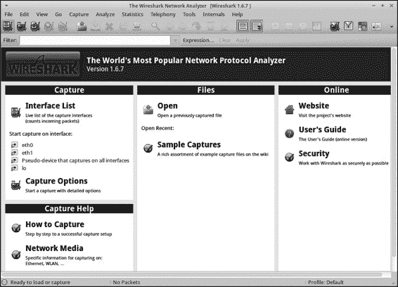

**使用 Wireshark**

Wireshark 是 Wireshark 套件中的主要工具，套件还包括

Tshark 和 Dumpcap。本节重点介绍我使用的 Wireshark 功能

在进行 NSM 操作时最常使用。要了解更多关于

若要了解 Wireshark，请参考一些优秀的相关书籍，如 Laura

Chappell 的作品在*http://www.wiresharkbook.com/*上。

***运行 Wireshark***

像 Tcpdump 和 Tshark 一样，Wireshark 操作在完整内容数据上

存储在*/nsm/sensor_data/<sensorname>/dailylogs*目录下。你可以直接或通过其他工具（例如 Sguil）启动 Wireshark，

如第八章所述。

**注意**

*Wireshark 不一定是处理大量完整内容数据的最佳工具*，*我通常不建议你在分析网络流量时直接加载一个庞大的跟踪文件到 Wireshark 中。相反，使用其他方法识别感兴趣的流量*，*例如通过查看会话数据，然后仅将 Wireshark 应用于这些流量。*

Wireshark 是 SO 中的按需工具，只有在你启动它时才会运行

通过在终端窗口中手动输入**wireshark**，或通过选择

**安全洋葱**4**Wireshark** 从图形界面启动 Wireshark。Wireshark 显示一个启动画面

如图 7-1 所示的屏幕。

*图 7-1：默认的 Wireshark 屏幕*

**136** 第七章

[www.it-ebooks.info](http://www.it-ebooks.info/)

***在 Wireshark 中查看数据包捕获***

要打开一个 pcap 格式的数据包捕获，请按照以下步骤操作：

1\. 选择**文件**4**打开**，并导航到*/nsm/sensor_data/<sensorname>/*

*dailylogs*目录。

2\. 选择一个*YYYY-MM-DD*格式的目录，然后选择一个跟踪文件

Wireshark 呈现关于该跟踪的一些基本统计信息。例如

例如，如图 7-2 所示，示例跟踪文件为 11.9MB（显示在大小字段中）。

（列中）包含 19,866 个数据包（显示在数据包字段中）。如你所见

如在第一包字段中看到的，跟踪从 2013-02-10 13:09:28 开始

持续时间为 8 分钟 16 秒（显示在经过时间字段中）。

3\. 取消勾选启用 MAC 名称解析和启用传输名称

解析选项，这样你将看到数字而非名称

填写这些字段，然后点击**打开**。

*图 7-2：在 Wireshark 中打开一个跟踪文件*

***修改默认的 Wireshark 布局***

打开跟踪后，Wireshark 的默认布局会显示如图所示的字段。

如图 7-3 所示。这些包括数据包编号、时间戳等信息。

显示时间戳，显示自第一个数据包以来的时间，源和目标 IP

地址、协议以及有关数据包的信息（在信息字段中）。

如果你更喜欢不同的布局，可以更改默认设置，

通过图形界面（GUI）或编辑偏好设置文件。

图形化数据包分析工具**137**

[www.it-ebooks.info](http://www.it-ebooks.info/)

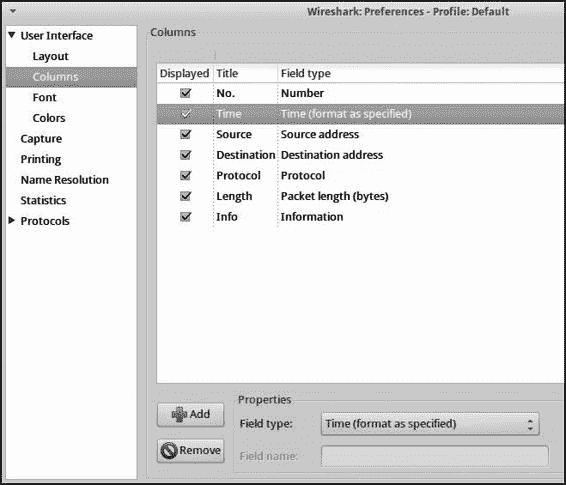

*图 7-3：Wireshark 中的默认列*

**使用图形界面修改布局**

我喜欢一种 Wireshark 布局，它显示绝对的日期和时间，同时

源端口和目标端口号。我们将把该布局设置为

这是如何使用 Wireshark 图形界面修改显示列的示例，以便

更好地显示相关数据包字段。

要更改默认布局设置，请按照以下步骤操作：

1\. 选择**编辑**4**首选项**4**列**。

2\. 高亮显示时间行。

3\. 将字段类型更改为**绝对日期和时间**。

4\. 将源地址字段更改为**源地址（未解析）**，目标地址字段更改为

目标地址字段更改为**目标地址（未解析）**。

5\. 点击**添加**，然后选择**源端口（未解析）**。

6\. 双击新列字段，将标题条目替换为

**源端口**。

7\. 再次点击**添加**，并添加**目标端口（未解析）**。

8\. 双击新列字段，将标题条目替换为

**目标端口**。

9\. 要隐藏显示数据包长度（字节）的长度字段，请高亮显示该字段，

高亮该字段并点击**删除**。

**138** 第七章

[www.it-ebooks.info](http://www.it-ebooks.info/)

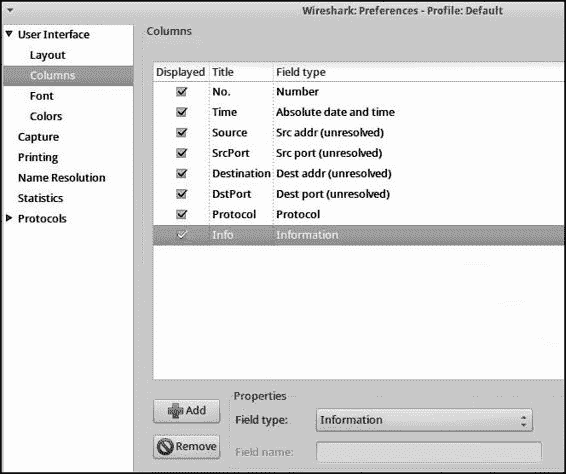

10\. 点击并拖动每个新列到显示的位置

图 7-4\。

*图 7-4：自定义 Wireshark 布局*

11\. 点击**应用**，然后点击**确定**。

**修改首选项文件**

如果你更倾向于直接修改屏幕布局，可以编辑

*.wireshark/preferences* 文件。首先，你需要通过选择**编辑**4**首选项**4**列**4**应用**4**确定**来创建此文件，无论是否做出更改。然后你应该能在你的主目录中找到一个 *.wireshark/preferences* 文件。此文件控制 Wireshark 的列布局，见清单 7-1\。

# 第二章：数据包列表列格式。

# 每对字符串由列标题和格式组成。

column.format：

"编号", "%m",

"时间", "%t",

"源", "%s",

"目标", "%d",

"协议", "%p",

"长度", "%L",

"信息", "%i"

*清单 7-1：*.wireshark/preferences* 文件内容*

图形数据包分析工具 **139**

[www.it-ebooks.info](http://www.it-ebooks.info/)

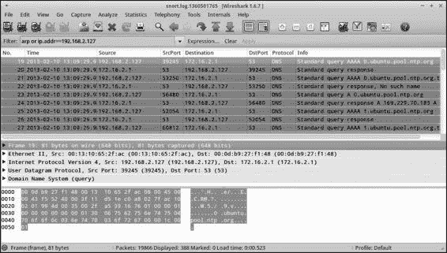

关闭 Wireshark 并编辑 *.wireshark/preferences* 文件，以便它们

如清单 7-2 所示（以粗体显示的为更改部分）。另外，删除

完全隐藏长度字段。

# 数据包列表列格式。

# 每对字符串由列标题和格式组成。

column.format：

"编号", "%m",

"时间", "%**Y**t",

"源", "%**u**s",

**"源端口", "%uS",**

"目标", "%**u**d",

**"目标端口", "%uD",**

"协议", "%p",

"信息", "%i"

*清单 7-2：编辑后的*.wireshark/preferences* 文件内容*

当你重新启动 Wireshark 并打开一个追踪时，GUI 将显示

列如图 7-5 所示。这是一个来自演示 SO stand- 的追踪，

使用显示过滤器 arp 或 ip.addr==192.168.2.127 来独立运行系统，指示

Wireshark 显示地址解析协议（ARP）帧，或任何涉及 192.168.2.127 的流量\。

流量涉及 192.168.2.127\。

*图 7-5：Wireshark 显示新的列首选项和显示过滤器*

***一些有用的 Wireshark 特性***

现在，Wireshark 已经启动并运行，我们将讨论一些我个人

最受欢迎的 Wireshark 特性，包括查看低级协议的能力，

列特性详细介绍。虽然 Tshark 提供了这个功能，但 Wireshark 的

**140** 第七章

[www.it-ebooks.info](http://www.it-ebooks.info/)

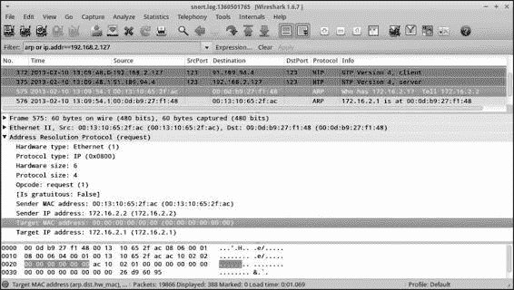

图形化的特性使得跳跃到不同的元素变得更容易。

我也喜欢在 Wireshark 中添加和删除显示过滤器。再一次，

你可以使用 Tshark 完成此操作，但每个新过滤器都需要重新运行 Tshark

再次，Wireshark 中，只需要在 GUI 中应用新过滤器。而且，

Wireshark 提供了控制数据如何解码的功能，跟随

流，并导出对象功能；这些功能帮助分析人员操控

这种流量的处理方式是 Tshark 所不提供的。

**详细查看低层协议特征**

Wireshark 允许分析人员极其详细地查看低层协议特征

细节。它对协议的深入理解使它能够解码几乎所有

它会解析它遇到的每个字段，前提是流量未加密并且能够识别—

它通过协议解析器对数据进行识别。（如果你遇到加密会话，

Wireshark 提供了一些功能，可以集成加密密钥来

解密流量。）

例如，图 7-6 显示了 ARP 请求消息。仅查看

在底部窗格中查看十六进制和 ASCII 值，你会很难

理解这个帧的所有元素。然而，协议解码

在中间面板中，每个字段都清晰地解释了。无论你选中哪个字段，

中间窗格中的高亮部分对应的十六进制和 ASCII

输出在底部窗格中。

*图 7-6：Wireshark 解释 ARP 请求消息。*

**省略流量以查看残留部分**

Wireshark 的另一个特别有用的功能是它能够过滤流量，

流量，帮助你找到感兴趣的残留部分。有时，我会通过告诉—

通过 Wireshark 指定忽略的内容，以便我可以检查剩余的部分。我

图形化数据包分析工具 **141**

[www.it-ebooks.info](http://www.it-ebooks.info/)

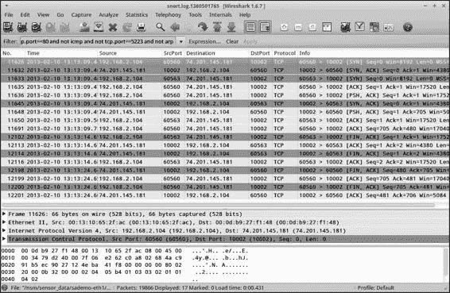

从简单的过滤器开始，查看结果，添加另一个过滤器，再次查看

结果，等等，直到我剩下少量流量进行分析。

例如，列表 7-3 显示了我如何逐步构建一个显示过滤器来

寻找值得注意的流量。

不是 http，也不是 ntp，不是 dns，也不是 tcp.port==443，不是 tcp.port==80

也不是 icmp，不是 tcp.port==5223，也不是 arp

*列表 7-3：Wireshark 中省略流量的显示过滤器*

该过滤器省略了以下内容：

• HTTP 流量

• NTP 流量

• DNS 流量

• 任何 TCP 443 端口上的流量

• 任何 TCP 80 端口上的流量

• ICMP 流量

• 任何 TCP 5223 端口上的流量（Apple 推送通知服务）

• 地址解析协议（ARP）流量

结果如图 7-7 所示\。

*图 7-7：在应用列表 7-3 中的显示过滤器后剩余的流量*

**142** 第七章

[www.it-ebooks.info](http://www.it-ebooks.info/)

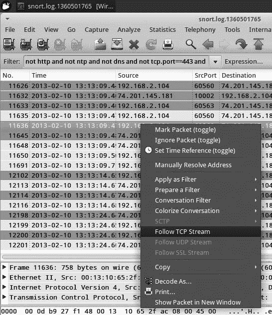

**后续流**

图 7-7 显示了两组 TCP 流。每组的目标端口是

10002，但一个流的源端口是 60560，另一个是 60563\。

由于两组流交织在一起，跟踪它们有点困难，

发生了变化。这个方法的另一个缺点是我更感兴趣

在对话内容中，而不是逐包列出。这

让我来到 Wireshark 的第三个最喜欢的功能：跟随流。

Wireshark 可以识别流中的所有 TCP 段，重新组装它们

使用特定算法进行解码，并以文本形式呈现结果。这项功能

这种功能使得容易识别对话的目的并判断

它是良性的、可疑的还是恶意的。

要告诉 Wireshark 重新组装 TCP 流，突出显示其中一个

流中的数据包，右键点击并选择**跟随 TCP 流**，如图所示

在图 7-8 中。

*图 7-8: 在 Wireshark 中选择“跟随 TCP 流”*

在这个例子中，Wireshark 呈现了图 7-9 所示的流。

顶部的文本显示来自 Web 浏览器的 GET 请求。文本开始于

以 HTTP/1.1 200 OK 开始的文本表示 Web 服务器的回复。

请注意，Web 客户端提到了 Accept-Encoding: gzip, deflate

选项。来自 Web 服务器的回复实际上是 gzip 编码的，但 Wireshark

解压内容并显示明文。我们识别这个流量为 HTTP，

图形化数据包分析工具 **143**

[www.it-ebooks.info](http://www.it-ebooks.info/)

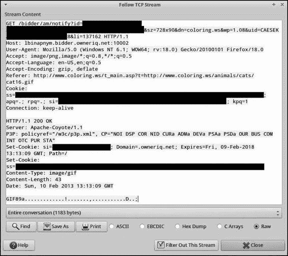

即使 Wireshark 默认未将其识别为这种方式。（在图中，

我已经从涉及敏感信息的记录中删除了部分内容

此交换中使用的 cookie。）

*图 7-9: Wireshark 显示重新组装的 TCP 流。*

**使用“解码为”设置协议解码方法**

在前一节讨论过重新组装流后，Wireshark

将只显示该流中的数据包在主窗口中。要更改

为了改变 Wireshark 看到这些流量的方式，使用“解码为”选项。这告诉

Wireshark 应用某种协议解码方法到特定流量。

作为示例，我们将告诉 Wireshark 将流量视为端口 10002

作为 HTTP。

1\. 右键单击要解码的流中的一个数据包，点击

**解码为**，如图 7-10 所示。

2\. 您将看到一个菜单，询问 Wireshark 应解码哪些端口。对于

例如，在 TCP 端口（10002）字段中选择**目标（10002）**。

3\. 滚动右侧列出的协议，找到并选择**HTTP**。

4\. 点击**应用**。

**144** 第七章

[www.it-ebooks.info](http://www.it-ebooks.info/)

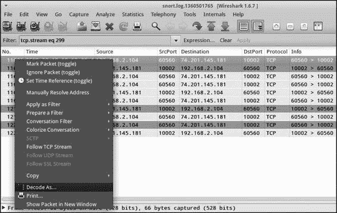

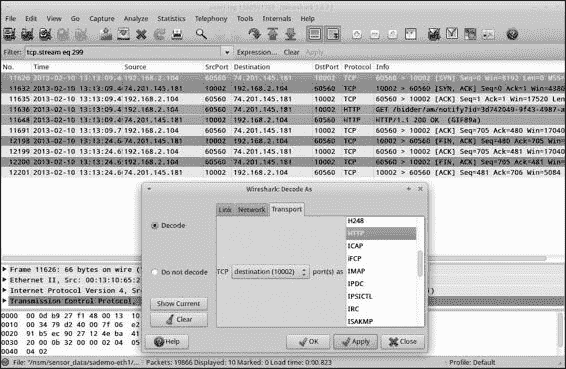

*图 7-10: 选择“解码为”*

您将看到 Wireshark 现在理解一个 GET 请求和一个 Web

服务器的回复，如图 7-11 所示。例如，注意帧 11636

现在 11648 被列为 Wireshark 的协议栏中的 HTTP。

*图 7-11: Wireshark 将端口 10002 的 TCP 解码为 HTTP。*

图形化数据包分析工具 **145**

[www.it-ebooks.info](http://www.it-ebooks.info/)

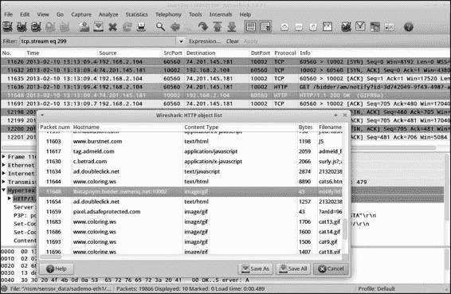

**跟随其他流**

根据协议，Wireshark 还可以跟踪其他类型的流，

如 UDP 或安全套接字层（SSL）等协议。（由于 UDP 不是会话协议，

面向协议的工具，比如 TCP，Wireshark 会根据其最佳评估

UDP 数据包构成了 UDP “会话”。）

此外，Wireshark 还可以从一些流中提取内容，

作为 HTTP 对象、服务器消息块（SMB）对象和数字图像

以及医学图像和通信（DICOM）对象。例如，在

在图 7-9 的底部，我们看到 web 服务器向客户端发送了一个 43 字节的 *.gif* 文件

web 客户端。我们可以使用 Wireshark 的 HTTP 对象导出功能来

调查此文件。选择 **文件**4**导出**4**对象**4**HTTP** 来访问此功能。你将看到一个窗口，显示 Wireshark 在追踪中识别的所有 HTTP 对象，包括 HTML 页面、JavaScript、文本、图像等

其他对象。要访问这里感兴趣的数据包，向下滚动到数据包

11648，其中包含 HTTP/1.1 200 OK（GIF89a）消息，如图所示

图 7-12。然后点击 **另存为**，命名文件并保存。

*图 7-12: Wireshark HTTP 对象列表*

在查看*.gif*时，你会发现它是一个 1×1 像素的图像，可能

用于追踪和广告目的。相关的 web 服务器

74.201.145.181 由 OwnerIQ 拥有，详见 *http://www.owneriq.com/*

被称为“开创所有权概念的广告网络”

**146** 第七章

[www.it-ebooks.info](http://www.it-ebooks.info/)

定向……我们使广告商能够定义并接触到他们理想的在线消费者。” 这听起来像是可能会部署 1×1 “web

“bug” 图像，用于追踪目的。

正如你所看到的，Wireshark 为我们提供了从一个

数据类型转换时，会对某些协议应用额外的处理

这只是开始！正如我在本书开始时所建议的

如果你想了解更多 Wireshark 的功能，可以阅读专门介绍 Wireshark 的书籍。

**使用 Xplico**

Xplico（*http://www.xplico.org/*）是一个开源的网络取证分析

（NFA）工具，能够理解多种网络协议并提取出

识别出它能够识别的信息。

**注** 

*Gianluca Costa 和 Andrea De Franceschi 在 GNU General*

*公共许可证版本 2*。

作为一款 NFA 工具，Xplico 最常用于分析保存的追踪文件，来

提取和解读有趣内容，就像我们在本章中所做的那样

例如，Xplico 也可以从网络中嗅探实时流量。不过，

作者不建议在实时接口上运行 Xplico，并表示

这个更多的是用于演示，而不是生产环境。

为了理解 Xplico，我们将使用它来分析可用的网络流量

通过 Digital Corpora 项目（*http://www.digitalcorpora.org/*）进行。Digital Corpora 是一个由国家科学基金会资助的数字证据集合，由取证专家 Simson Garfinkel 主导。分析师和学生

可以使用 Digital Corpora 项目下载并解读数据

手机、硬盘和网络流量，以学习如何使用

取证工具和技术。

我们将使用捆绑在“Nitroba 大学骚扰”中的 pcap 文件—

“恶意场景”（ *http://digitalcorpora.org/corpora/scenarios/nitroba-university*

*-harassment-scenario/*) 发布在 *http://digitalcorpora.org/corp/nps/packets/*

*2008-nitroba/nitroba.pcap*。该跟踪大约 55MB，包含一个

各种适用于 NSM 和取证审查的网络流量。下载

使用 Xplico 前，请先处理 *nitroba.pcap* 文件。

***运行 Xplico***

Xplico 通过网页浏览器进行管理。默认情况下，SO 配置为允许

只允许本地访问 Xplico Web 服务器。远程用户必须通过隧道

通过 OpenSSH 处理流量（如第五章所述）或修改防火墙规则

用于允许远程访问端口 9876 TCP 的数据包。选择最适合您需求的选项。

满足您的需求。

首次访问 Xplico 时，可能会看到类似图中显示的错误。

图 7-13。

图形化数据包分析工具 **147**

[www.it-ebooks.info](http://www.it-ebooks.info/)

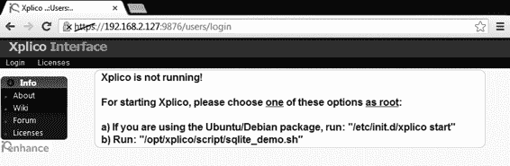

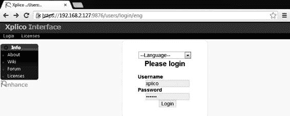

*图 7-13：默认情况下，Xplico 并未运行。*

该错误意味着虽然 SO 上的 Apache Web 服务器正在提供服务

页面显示，Xplico 服务尚未启动。通过运行以下命令来修复：

如列表 7-4 所示。

$ **sudo service xplico start**

* 启动 Xplico

修改优先级为 -1 [ 好 ]

*列表 7-4：启动 Xplico 服务*

现在重新加载网页浏览器并选择语言。接下来，使用

使用用户名**xplico**和密码**xplico**进行登录，如图 7-14 所示。

（选择语言更改 URL，但不会显示语言

语言下拉框中的选项。)

*图 7-14：登录 Xplico*

***创建 Xplico 案件和会话***

Xplico 将网络流量组织为*会话*，并将分析会话称为*案件*。要启动一个新的案件和会话进行分析，请按照以下步骤操作：

1\. 选择**新建案件**，并将默认的数据采集方法保留为

**上传 PCAP 捕获文件**，如图 7-15 所示。

2\. 输入案件名称，然后点击**创建**。

**148** 第七章

[www.it-ebooks.info](http://www.it-ebooks.info/)

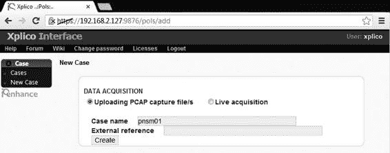

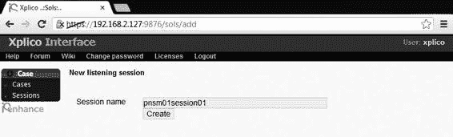

*图 7-15：在 Xplico 中创建新案件*

3\. 创建新案件后，您应该会在案件列表中看到它。点击

继续输入案件名称。

4\. 点击左上菜单中的**新建会话**链接来创建一个新的会话。

5\. 为会话命名，如图 7-16 所示，然后点击**创建**。

（Xplico 只允许会话名称使用字母数字字符，因此

您不能在名称中使用连字符。）

*图 7-16：在 Xplico 中创建新会话*

新会话创建后，Xplico 现在已准备好处理网络流量。

流量。

***处理网络流量***

要处理网络流量，请点击会话名称。您将看到一个

屏幕如图 7-17 所示。因为我们还没有处理

如果尚未处理任何流量，Xplico 将不会显示任何结果。

选择**选择文件**，浏览到你之前下载的 *nitroba.pcap* 文件，点击**打开**，然后点击**上传**。网页浏览器应报告正在上传文件。一旦文件上传完成，Xplico 会显示

屏幕顶部显示“文件已上传，等待开始解码……”。

可能需要几分钟时间让 Xplico 处理流量，

取决于你的硬件。一旦 Xplico 完成解码

流量，它应该在状态字段中报告**解码完成**。其主要

屏幕将显示它识别到的各种流量统计信息并进行交互

像图 7-18 所示的伪装内容。

图形数据包分析工具 **149**

[www.it-ebooks.info](http://www.it-ebooks.info/)

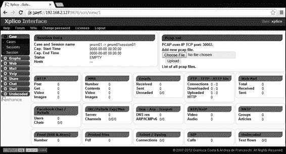

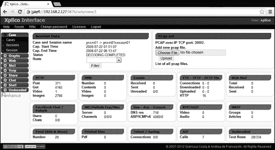

*图 7-17：Xplico 会话屏幕*

*图 7-18：Xplico 已完成解码跟踪文件。*

***解码流量的理解***

到这个时候，分析师可以浏览解码后的流量，查找相关内容

估计。这种调查方法与前面工具的方法不同，

与数据包或会话进行交互。通过 Xplico，分析师可以操作和

浏览提取的内容。

例如，分析师可能想知道视频内容是否已被转移

是否在网页浏览会话中传输的内容。实际上，图 7-18 显示了 **1** 在

**150** 第七章

[www.it-ebooks.info](http://www.it-ebooks.info/)

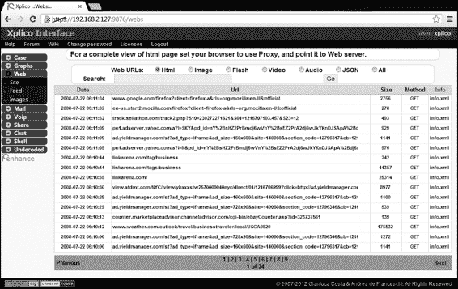

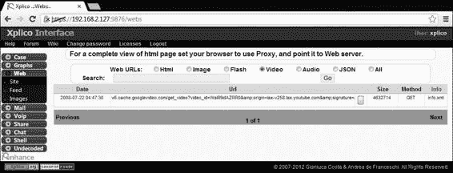

HTTP 部分的摘要屏幕中的视频字段。这意味着 Xplico

从网络流量中提取的视频内容并使其可视化

给用户。要访问内容，请点击左上角的**Web**链接

Xplico 显示的部分，然后点击接下来的**Site**链接。

默认情况下，Xplico 会显示最后 16 个网页会话，其中最新的

首先列出，如图 7-19 所示\。

*图 7-19：Xplico 的网页会话列表*

要访问 Xplico 识别到的视频内容，请点击**视频**单选框

在屏幕顶部点击按钮，然后点击**Go**。Xplico 会显示一个链接，指向一个

*googlevideo.com* 网站，如图 7-20 所示\。

*图 7-20：数字语料库跟踪中的一个视频链接*

图形数据包分析工具 **151**

[www.it-ebooks.info](http://www.it-ebooks.info/)

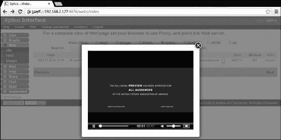

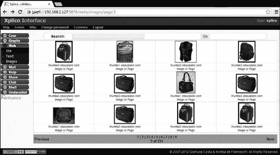

点击右侧的 *info.xml* 链接可以查看元数据的选项

关于跟踪的信息，以及一个下载 pcap 文件的链接。最有趣的是，点击

图 7-20 中显示的网址，或者链接右侧的灰色框将

打开视频进行查看，如图 7-21 所示。此视频并未被

从网络流式传输；这是从下载的视频的重建

网络流量最初捕获的时间。

*图 7-21：重建从网络下载的视频*

也可以浏览下载过程中的图像缩略图

正如图 7-22 所示，有人进行了网络追踪捕获。

在 eBay 上购买背包。

*图 7-22：重建从网络下载的图像*

**152** 第七章

[www.it-ebooks.info](http://www.it-ebooks.info/)

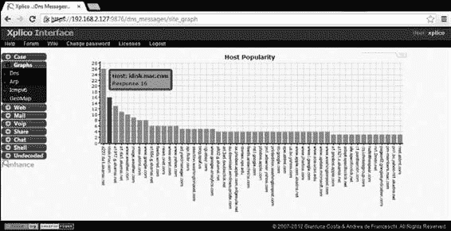

***获取元数据并总结流量***

除了重建有趣的内容，Xplico 还提供了一些元数据。

并总结它理解的流量数据。按照以下步骤操作来查看实际情况：

按照以下步骤操作：

1\. 在屏幕左上部分的 **Graphs** 菜单项下，

点击 **DNS** 链接，告诉 Xplico 显示按排序的 DNS 查询列表。

2\. 在屏幕顶部，将出现一个红色、黄色和绿色的饼图图标。

将会显示该图标，点击它以显示一个 DNS 响应的条形图。

在右上角的选项卡中显示主机流行度。

3\. 点击 **Host Popularity** 选项卡查看按 DNS 查询排序的图表。

按频率排序，如图 7-23 所示。

*图 7-23：Xplico 根据频率绘制 DNS 查询图。*

4\. 高亮任意一个条形图以显示查询的主机名和响应。

计数。

Xplico 使得审查在网络追踪中捕获的各种内容变得非常简单。

网络追踪。通过 SO 的 Apache web 服务器发布数据。

作者允许任何具有网页浏览器和认证访问权限的人进行查看。

这个工具真正将 NSM 提取的内容活跃起来。

**使用 NetworkMiner 检查内容**

NM（*http://sourceforge.net/projects/networkminer/*）是一个开源的 NFA 工具，也有商业版本。

**注释**

*Erik Hjelmvik 在 GNU 通用公共许可证第 2 版下开发了 NM。*

图形化数据包分析工具 **153**

[www.it-ebooks.info](http://www.it-ebooks.info/)

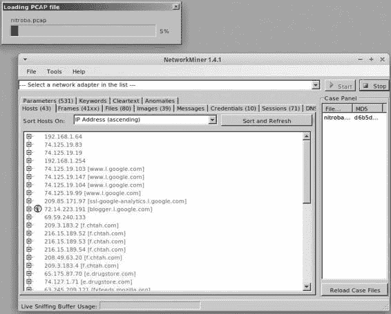

NM 的商业版本位于 *http://www.netresec.com/*，支持远程。

通过 Pcap-over-IP，端口独立协议识别抓取数据包。

(PIPI；见 *http://taosecurity.blogspot.com/2006/09/port-independent-protocol*

*.html*（关于描述），以及其他功能。捆绑的免费版本。

SO 包含分析师在检查时需要的核心功能。

内容。

在这一部分，我们将看到 NM 如何处理 Digital Corpora 追踪。

如之前在 Xplico 讨论中所述。如果你还没有下载，

已经将 *nitroba.pcap* 文件加载到 SO 平台上，在继续之前先完成此操作。

***运行 NetworkMiner***

NM 是一个 Windows 应用程序，但 SO 团队将其配置为在 Microsoft 的 .NET Framework 下运行。

开源的 Mono（*http://www.mono-project.com/*）实现。

Microsoft 的 .NET Framework。

从 SO 桌面访问 NM，点击蓝白相间的鼠标图标。

图标，接着是**Security Onion**，最后是**NetworkMiner**。默认情况下，NM 希望监控一个实时接口来收集流量。要启动分析过程，请选择。

在 NM 中选择 **File**4**Open**，然后浏览到 *nitroba.pcap* 文件的位置。

一旦文件加载完成，NM 应该会显示大量的分析活动。

包括提取内容和解析它找到的所有域名。

如图 7-24 所示。这个过程可能需要一个小时或两个小时

并且会使你的 SO 平台忙碌。

*图 7-24：NM 处理 nitroba.pcap 跟踪。*

**154** 第七章

[www.it-ebooks.info](http://www.it-ebooks.info/)

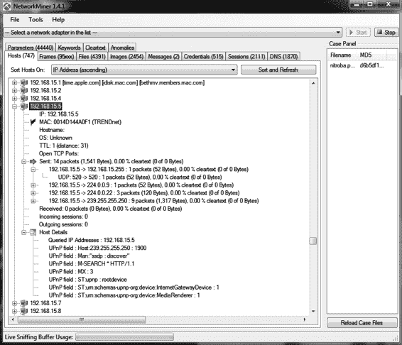

**注意**

*Windows 上的 NM 比 Mono 和 Linux 上的要快得多。你可能希望*

*将其安装在具有大量内存的 Windows 工作站上，或限制其在 SO*

*处理较小的跟踪文件。*

本节的其余部分专注于如何与相同的

*nitroba.pcap* 跟踪使用 Windows 版本的 NM，这在功能上

等价于 Linux 上的 NM。

***收集和组织流量详细信息***

许多分析师开始在 NM 数据的“主机”标签中查看数据，该标签列出了所有 IP

它在网络跟踪中看到的地址，如图 7-25 所示。该

IP 地址 192.168.15.5 在图中高亮显示并展开。

要展开某个 IP 地址的条目，请点击该条目左侧的小框

地址。

*图 7-25：NM 提供的 192.168.15.5 IP 地址的元数据*

如你所见，尽管 NM 无法识别操作系统，但它

告诉我们，MAC 地址分配给了 TRENDnet，一家网络设备制造商。

工作设备进行交互。涉及的 Universal Plug and Play (UPnP) 查询

MediaRenderer 表明该设备可能是一个视听平台。

IP 地址 192.168.15.4 的详细信息和元数据与

如图 7-26 所示的 192.168.15.5 地址。

图形化数据包分析工具 **155**

[www.it-ebooks.info](http://www.it-ebooks.info/)

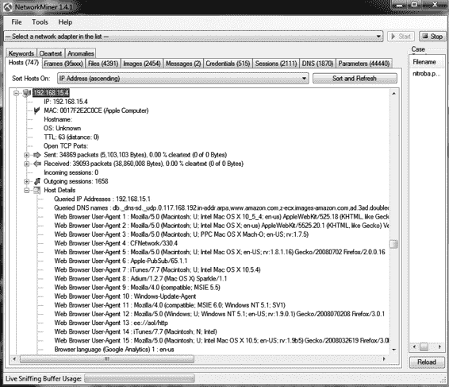

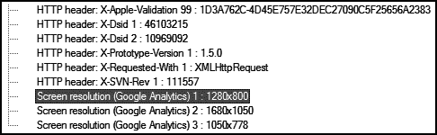

*图 7-26：NM 提供的 192.168.15.4 IP 地址的元数据*

这个地址的硬件似乎是 Apple 设备。此外，

主机详细信息部分显示了各种网页浏览器的用户代理字符串，

这告诉我们，这个系统比 192.168.15.5 活跃得多，正如

如发送的会话数量（1658）所示。

在主机详细信息部分的底部，显示了在跟踪中观察到的屏幕分辨率，

在 NM 从 Google Analytics 获取的流量捕获期间列出了，

如图 7-27 所示。

*图 7-27：NM 列出了 192.168.15.4 的三个屏幕分辨率。*

***渲染内容***

除了收集并组织有关在网络上看到的主机的详细信息外，

NM 提取内容并渲染它以便于查看。图 7-28 显示了一个

示例涉及电子邮件。

**156** 第七章

[www.it-ebooks.info](http://www.it-ebooks.info/)

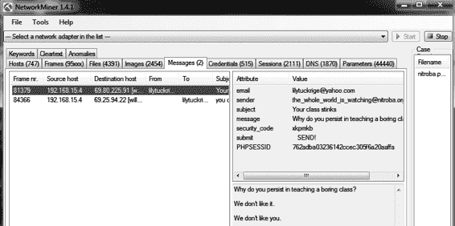

图 7-28 中的“消息”标签显示了从 192.168.15.4 发送的电子邮件，

我们在图 7-26 中回顾的 Apple 电脑。一个发送者通过电子邮件

地址 *the_whole_world_is_watching@nitroba.org* 发送了一封不愉快的电子邮件

发送给 *lilytuckrige@yahoo.com* 的邮件。现在我们理解为什么这是一封骚扰邮件。

案例。

*图 7-28：NM 提取的骚扰邮件*

像 Xplico 一样，NM 提取并显示所有捕获的图像，连同

各种其他形式的内容。它比 Xplico 更容易使用，

因为你滚动浏览输出，而不是像使用 Xplico 的 web 服务器那样点击页面。

NM 可以简化提取内容的过程

从网络追踪中批量提取。

**结论**

本章介绍了三种图形化数据包分析工具：Wireshark、

Xplico 和 NM。Wireshark 无疑是最受欢迎的，支持

适用于成千上万的协议和不断扩展的功能集。较小的—

知名项目如 Xplico 和 NM 更侧重于取证，提供

解析器自动提取内容，并为分析师提供内容概览

网络派生的产物。

选择使用哪种工具取决于调查需求—

方面。当你需要深入理解一个协议时，我推荐

Wireshark。当你想快速概览在

如果是计算机，Xplico 或 NM 可能更为合适。

这些工具各自提供不同的功能，并暴露出各种

各种形式的 NSM 数据。虽然这些工具是分析师工具箱中的强大补充，

在他们的工具箱中，它们并不作为 NSM 控制台使用。第八章结束了数据

通过查看 NSM 控制台 Sguil、Squert 来讨论展示工具

Snorby 和 ELSA。

图形化数据包分析工具 **157**

[www.it-ebooks.info](http://www.it-ebooks.info/)

[www.it-ebooks.info](http://www.it-ebooks.info/)

**8**

**N S M c o N S o l e S**

第六章和第七章讨论了用于数据包

分析。本章介绍了 NSM

控制台，它们是专门为

NSM。像 Tcpdump、Tshark 这样的应用程序，

Wireshark、Xplico 和 NetworkMiner 处理实时

流量或以 pcap 格式保存的流量。当读取

在本章中，你可能会回忆起那些工具的特点，它们具有某些相似性—

和这里讨论的软件有一些相似性。它们中的一些生成会话或

提取的内容数据，例如，或以多种形式呈现数据

单个接口时。第六章中涵盖的工具与第七章中的工具有所不同。

第六章和第七章中讨论的工具和本章中展示的工具的区别在于，NSM 控制台帮助

分析师推动决策过程，而不是故障排除或

取证过程。

此外，NSM 控制台通常不处理原始数据包，无论是

以实时流量或以 pcap 格式保存的流量的形式。所有这些工具在

第六章和第七章包含了让分析师告诉软件

从网络线缆嗅探流量或打开保存的追踪。NSM 控制台则不同，

提供了一个框架和接口来操作和与多个

NSM 数据类型构建的工具，但通常不是通过处理保存的追踪来进行的。这是一个

[www.it-ebooks.info](http://www.it-ebooks.info/)

在某些方面有所限制，因为它将其使用限制于实时操作场景。这并不一定适用于一些商业工具，但

本书的重点是开源软件，配有免费的 SO 分发版

但这类工具的分发版有：Sguil、Squert、Snorby 和 ELSA。

**以 NSM 为中心的网络流量分析**

我们迄今为止探索的工具会生成一种或多种形式的 NSM 数据。

这里简要回顾一下 NSM 数据类型（在第一章介绍）：

**完整内容数据** 以 pcap 格式存储到磁盘上的网络流量。

**提取内容** 从网络流量中提取的信息，如

文件或网页。

**会话数据** 网络对话的高层次摘要，关注

谁和谁进行了交流，何时交流，以及交换了多少信息，

交换。

**交易数据** 会话数据的一种更细化的形式，暴露

带有请求-回复特性的协议细节，如 HTTP、FTP，

以及 SMTP。

**统计数据** 描述性信息，刻画网络

活动，如各种对话方面的计数。

**元数据** “关于数据的数据”，或是外部信息的集成。

如地理位置或所有权，应用于网络信息。

**警报数据** 反映是否触发了某种通知。

这是由工具做出的判断，通常是 IDS 关于某些特征的判断

网络流量的特征。

这是一堆数据需要管理。NSM 不是为了收集证据而存在，

仅仅为了拥有它。CIRT 收集 NSM 数据，因为它能够

它们的目的是帮助实现特定的业务目标。NSM-

网络流量的集中式视角是一项决定：所涉及的事件是良性、 

可疑的还是恶意的？对这个问题的回答决定了

CIRT 分析师接下来的操作。成熟的 CIRT 会回答这些问题，以达成商业-

商业安全目标，例如在一小时内或更短时间内进行检测与响应。

多种形式的网络数据以及检查这些数据的工具，有助于分析-

分析师帮助实现业务安全目标。然而，专为 NSM 构建的工具，

有助于三种特定的方式：

• 它们使分析师能够轻松地审查多种形式的 NSM 数据，

通常在单一界面内完成。

• 它们使分析师能够“转换”或过渡，从一种形式的 NSM

数据传输到另一个。

• 它们捕获分析师决策过程的结果。

专为 NSM 构建的工具使得工作流成为可能，通常协调

多个分析师的活动，共同完成一个共享目标。

**160** 第八章

[www.it-ebooks.info](http://www.it-ebooks.info/)

Sguil、Squert、Snorby 和 ELSA 是四个由 NSM 从业者编写的开源工具，专为 NSM 从业者而设计。这些软件作者意识到

其他分析网络数据的工具是有用的，但并不完全

足够用于将 NSM 作为持续的业务流程来进行。每个工具

提供了一种整合几种类型 NSM 数据的方式，在这些数据之间进行转换

信息，并且在大多数情况下，分类调查结果。

与 SO 一起捆绑的 NSM 控制台与几个重叠的 NSM 数据集合作。

NSM 数据的形式。而第六章和第七章中讨论的数据包分析工具

tend to be *producers* of NSM data, the consoles in this chapter are more like

*消费者* 使用 NSM 数据。与第六章和第七章中描述的工具类似，

本章中的控制台默认情况下在 SO 中可用，除了 ELSA。

（安装 SO 时，设置向导会询问你是否要运行 ELSA。）这个

本章强调了每个工具的关键特性，帮助你决定哪个

最适合你的 NSM 操作需求。

**使用 Sguil**

Sguil（*http://www.sguil.net/*）是一个开源的 NSM，最初作为

专有应用程序，但随后被重新编码并作为开源发布

在 2003 年初\。

**注意**

*Bamm Visscher 在 Qt 公共许可证下编写了 Sguil*（*QPL,* http://sourceforge

.net/projects/sguil/) *.*

Sguil 是 SO 打包的主要应用程序之一。其组件

收集、存储并呈现其他 SO 工具使用的数据，以及某些应用程序

某些应用程序依赖于 Sguil 的认证数据库。即使你决定不使用

你将受益于 Sguil 控制台对 NSM 数据的收集和审查。

NSM 数据的管理。

***运行 Sguil***

Sguil 是一个用 Tcl/Tk 编写的客户端/服务器应用程序。它的服务器协调

在传感器上部署 Sguil 代理以收集 NSM 数据。Sguil 客户端

这是分析师查看 Sguil 数据的窗口。你可以启动 Sguil 控制台

通过 SO 桌面上的 Sguil 图标，或者你也可以在

另一台计算机。

到目前为止我们讨论的工具通过分析实时或已保存的网络

流量；它们用于实时操作或进行审查时

基于历史活动。相比之下，Sguil 完全是一个实时工具。你不能使用

使用 Sguil “打开”已保存的网络追踪；你只能在其

各种组件和依赖项收集并生成收集到的流量

从一个实时网络接口获取数据。例如，我们将使用 Sguil 客户端

与示例服务器和传感器进行交互。

NSM 控制台 **161**

[www.it-ebooks.info](http://www.it-ebooks.info/)

**注意**

*如果你已经安装了 SO，你应该能够跟随示例进行操作。*

*然而，你看到的数据与展示的数据不匹配，因为你将看到* *新的实时数据，尽管分析过程是相同的。*

在运行 Sguil 之前，确保其所有底层服务都已

使用 service 命令在传感器上运行，如在清单 8-1 中所示。

你应该在每个字段看到 OK。

$ **sudo service nsm status**

状态：securityonion

* sguil server [ OK ]

状态：HIDS

* ossec_agent（sguil）[ OK ]

状态：Bro

名称 类型 主机 状态 Pid 对等端 启动时间

bro 独立运行 2433 0 24 2 月 18:27:19

状态：sademo-eth1

* netsniff-ng（完整数据包数据）[ OK ]

* pcap_agent（sguil）[ OK ]

* snort_agent-1（sguil）[ OK ]

* snort-1（警报数据）[ OK ]

* barnyard2-1（缓冲区，统一 2 格式）[ OK ]

* prads（会话/资产）[ OK ]

* sancp_agent（sguil）[ OK ]

* pads_agent（sguil）[ OK ]

* argus [ OK ] 

* http_agent（sguil）[ OK ]

*清单 8-1：sudo service nsm status 命令的输出*

如果一个或多个组件未运行，你可以尝试通过重启所有

使用以下命令启动软件：

$ **sudo service nsm restart**

如果一个或多个组件仍未运行，你可能需要重新运行

SO 设置脚本或咨询 SO 邮件列表以获得更多帮助。

一旦确认所有服务正在运行，连接到 Sguil

通过点击 SO 桌面上的 Sguil 图标打开控制台。在这个例子中，

Sguil 客户端将连接到 localhost 上的 Sguil 服务器。（你可以连接

服务器上运行 Sguil 客户端的另一台计算机，但连接起来更容易

使用 SO 平台。)

1\. 连接到你的 SO 服务器实例，并输入用户名和

在 SO 安装过程中为 Sguil 选择的密码，

如图 8-1 所示，然后点击**确定**。

2\. Sguil 客户端要求你选择要监控的网络。点击**选择**

**全部**，然后点击**启动 Sguil**。

**162** 第八章

[www.it-ebooks.info](http://www.it-ebooks.info/)

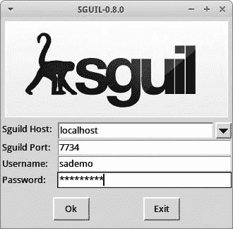

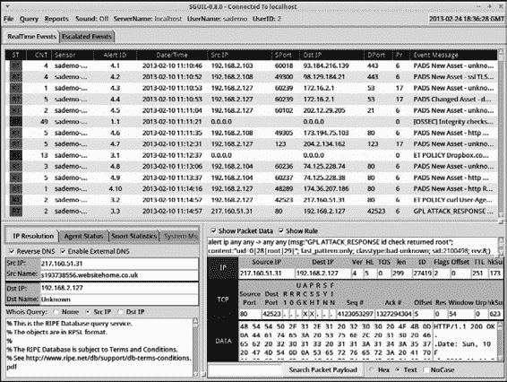

*图 8-1：登录到 Sguil*

3\. Sguil 控制台出现。高亮显示顶部区域中的任何一行，然后

然后勾选**反向 DNS**、**显示数据包数据**和**显示规则**框。

Sguil 控制台将显示如图 8-2 所示的数据。

*图 8-2：Sguil 控制台显示数据*

如果你看到类似图 8-2 中的信息，你的 Sguil 安装—

安装正常工作的指示。

NSM 控制台 **163**

[www.it-ebooks.info](http://www.it-ebooks.info/)

***Sguil 的六大关键功能***

Sguil 提供了六个对 NSM 分析员有帮助的关键功能：

• Sguil 执行相似警报数据记录的简单聚合。

• Sguil 使某些类型的元数据及相关数据易于访问

可用。

• Sguil 允许查询和审查警报数据。

• Sguil 允许查询和审查会话数据。

• Sguil 提供了一个右键菜单，让你可以进行旋转，或从

将这两类数据之一从完整内容数据呈现为

以*记录*形式的文本，或在协议分析工具如 Wireshark 中，或在网络中

类似 NM 这样的取证工具。

• Sguil 公开功能，使分析员能够计数和分类事件，从而

启动升级和其他事件响应决策的可能性。

以下部分将解释如何使用这些功能。

**简单聚合**

一个强大的但可能被低估的 Sguil 功能是它能够聚合

聚合相似记录为控制台中的单行输出。图 8-2

显示此功能的实际操作。CNT 列是 Sguil 的机制，用来显示—

播放记录计数。例如，顶行显示 Sguil 如何聚合

将四个相似记录合并为控制台中的一条。

这种简单的操作将相似记录合并为单行，从而减少了

分析员的工作负载。审查过程可以集中于独特的记录，而不是

比较那些仅通过时间戳不同的重复条目更具意义。因为 Sguil 是一个

作为一个实时工具，它在控制台处理并聚合条目

它接收这些数据。CNT 列中的条目可能会增加，尽管新条目是重复的—

有效事件到达传感器时。

**元数据和相关数据**

Sguil 不会暴露大量的元数据，但它提供了三种重要的

类型非常容易访问。在图 8-2 中，你可以看到两种元数据形式。

控制台的左下角。标记为*Src IP*、*Src Name*、*Dst IP*和*Dst Name*的条目代表源和目标 IP 地址（如果通过 DNS 可用的主机名）任何高亮显示的

在这个 IP 和主机名信息下，Sguil 显示 WHOIS

数据。分析人员可以选择

通过单选按钮显示数据。

Sguil 显示另一种形式的元数据和一种相关数据形式

在控制台的右下角。当显示生成的警报数据时，

由 Snort 或 Suricata 等 IDS 生成的警报（将在下一节讨论），Sguil

显示触发警报数据生成的规则。规则下方

规则时，Sguil 显示触发警报数据创建的包。

**第一百六十四章**

[www.it-ebooks.info](http://www.it-ebooks.info/)

这些元数据和相关数据为分析人员提供了更多的上下文信息

参与网络流量的系统。它们也可以选择禁用源或目标 IP 地址的

展示这些信息的方式。

现在让我们更仔细地看看警报数据，了解它们的含义。

这意味着在 Sguil 控制台中的上下文。

**查询 Sguil 中的警报数据**

当你启动 Sguil 时，警报数据是你会看到的第一种 NSM 证据形式。

Sguil 将警报称为*事件数据*。支持 Sguil 的数据库将警报数据存储在*事件表*中，因此你将看到对该术语的引用，而不是*警报*。

Sguil 集成了四种形式的警报数据：

• 像 Snort 和 Suricata 这样的网络 IDS 引擎在触发警报数据时会生成警报。

它们观察到的流量触发了他们的规则之一。这些规则是指示

可能需要人工分析来确定是否

它们代表良性、可疑或恶意活动。来自 Sguil 的警报数据展示了

Snort 或 Suricata IDS 生成的条目会出现在事件消息列中

以文本*ET*（表示*Emerging Threats*，一种 IDS 规则源）或*GPL*（另一种规则源）开头的规则。

• 基于主机的 IDS 引擎如 OSSEC（*http://www.ossec.net/*），如果启用，

根据分析有关个体计算机的信息，提供类似的警告。

对个体计算机使用 OSSEC，需要安装 OSSEC 软件

在服务器上运行代理。默认情况下，SO 在其操作系统上运行 OSSEC，

系统。来自 OSSEC 的警报有事件消息，开头是*[OSSEC]*。

（有关 OSSEC 的更多信息，请参见在线手册，网址为*http://*）

*www.ossec.net/doc/*.)

• Sguil 还集成了来自一些来源的事件表数据，这些来源是

不是 IDS 引擎。例如，Sguil 收集网络分析数据

由被动实时资产检测系统（PRADS）工具创建的警报数据

(*https://github.com/gamelinux/prads/*)。来自 PRADS 的警报数据开始

使用*PADS*。PADS 是指被动资产检测系统，

是 PRADS 的前身。

• Sguil 存储由 Bro 生成的 HTTP 事务数据。这些数据记录了

Bro 观察到的统一资源定位符（URL），例如 *www*

*.testmyids.com*。Sguil 会在这些消息前面加上

标签为 *URL* 的事件。由于 HTTP 活动在网络中非常常见，URL

数据默认情况下不显示，不像来自 Snort/Suricata 的数据那样，

OSSEC 和 PRADS。

默认情况下，Snort/Suricata、OSSEC 和 PRADS 的数据出现在

图 8-2，位于 Sguil 控制台的上半部分。如果你想查询

如果你需要查询 Bro 记录的 HTTP URL 数据，必须手动询问 Sguil。作为

例如，我们将创建一个 HTTP 数据的查询。Sguil 将其称为

*事件查询*。

NSM 控制台 **165**

[www.it-ebooks.info](http://www.it-ebooks.info/)

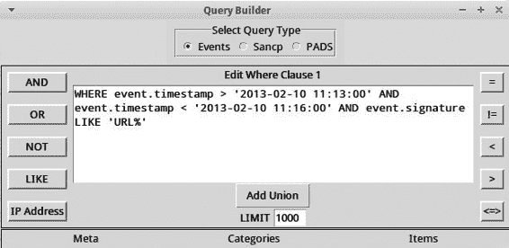

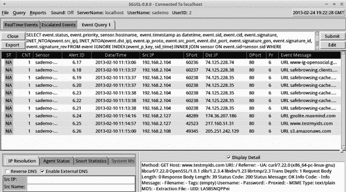

要运行事件查询，请选择 **查询**4**查询事件表** 从

Sguil 菜单。在查询构建器窗口中，按如下所示修改默认文本

在清单 8-2 中。注意使用单引号字符（位于

输入键盘上的回车键（位于美国键盘的左侧）。

WHERE event.timestamp > '2014-02-10 11:13:00' AND event.timestamp < '2013-02-

10 11:16:00' AND event.signature LIKE 'URL%'

*清单 8-2：运行一个以 URL% 开头的签名事件查询*

图 8-3 显示了 Sguil 控制台中的这个查询。

*图 8-3：Sguil 对 'URL%' 的事件查询*

这个查询会查找 Sguil 数据库中时间戳为

在 2013 年 2 月 10 日 11:13:00 和 11:16:00 UTC 之间，签名

签名或消息以 URL 字符串开头。图 8-4 显示了查询结果

在我们的演示系统上执行此查询。

*图 8-4：查询 Sguil 的 URL 事件*

**第一百六十六章**

[www.it-ebooks.info](http://www.it-ebooks.info/)

这些 URL 事件来自 Bro 应用程序的 *http.log* 文件，该文件包含观察到的 HTTP 流量的总结。Sguil 代理读取

*http.log*，并将结果插入到 MySQL 数据库中。

注意，某些细节——如时间戳、源和目标 IP 地址

对象 IP 地址和端口，以及 URL——作为单独的行可用。

高亮任何一行并勾选 **显示详情** 框，以查看其余的

与此事件相关的文本信息。UID 元素后面的文本

详细显示是 Bro 为该会话创建的唯一标识符。

你可以使用这个 UID 来稍后查询 Bro 日志。

**在 Sguil 中查询会话数据**

查询 NSM 会话数据的能力是 Sguil 另一个关键功能之一。

会话数据，Sguil 将其称为 *SANCP 数据*。SANCP 代表安全

分析师网络连接分析器（SANCP），这是由 John Curry 编写的工具

Sguil 的早期版本中捆绑了用于生成会话数据的功能。在 SO 中，

Doug Burks 在 2012 年底用 PRADS 替换了 SANCP\。

除了生成会话数据外，PRADS 还执行网络设备

配置文件，并跟踪它所看到的系统。尽管有了新代码，Sguil 的数据

基地维护一个 *sancp 表* 来存储会话数据。这种 NSM 数据形式

保持详细记录每次传感器看到的对话。

与警报数据不同，会话数据始终被写入磁盘，无论

无论系统是否认为这正常或有问题，都是中立的。

这种方法同样适用于完整内容数据、提取的内容数据、事务

事务数据、统计数据和元数据。

**注**

*收集和生成超出 IDS 警报的数据是网络安全* *监控的一个关键方面。其他形式的数据的可用性，无论与 IDS 警报是否相关，都是 NSM（网络安全监控）操作与* *警报中心操作之间的核心区别。对于 NSM 来说，警报仅仅是分析* *过程的开始，而不是结束。如果你的网络监控模型依赖于 IDS 警报，或者 IDS*

*如果警报触发数据包捕获，那你就没有在进行 NSM。为什么不今天就转变呢？*

会话数据默认在 Sguil 控制台中不显示。分析人员可以

使用类似于运行事件查询的过程进行会话数据查询，

在上一节中描述的过程。区别在于查询 sancp

表，而不是事件表。更常见的情况是

*从警报数据到会话数据的跳转*。通过跳转，你从一种数据形式开始，识别出一个感兴趣的项，并将该项作为跳转的起点，

新查询的起始点。

为了演示如何使用跳转方法查询会话数据，

我们将从基于 URL 的警报数据查询结果开始。假设

我们希望了解更多关于涉及目标 IP 地址的活动

对某个 URL 记录进行查询。与其从查询界面重新开始一个新搜索，不如

菜单中，我们将基于高亮显示的消息进行跳转。右键点击高亮事件的目标 IP

地址，然后选择**高级查询**4**查询**

**Sancp 表**4**查询 DstIP/1 小时**，如图 8-5 所示。

NSM 控制台 **167**

[www.it-ebooks.info](http://www.it-ebooks.info/)

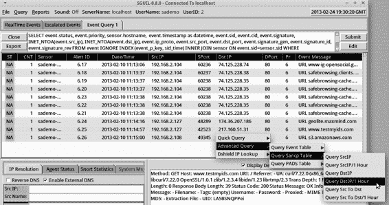

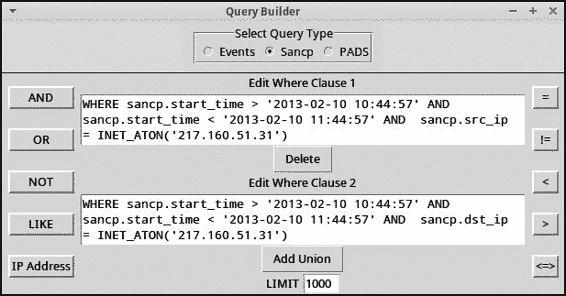

*图 8-5：从消息跳转到 SANCP 数据*

Sguil 显示了带有预填充语法的查询构建器窗口，

查找会话记录时，需要回溯到 30 分钟之前和 30 分钟之后的时间。

高亮记录的时间戳，如图 8-6 所示。高亮的时间戳为 11:14:57，

高亮事件的时间戳是 11:14:57，因此查询从 10:44:57 开始，到 11:44:57 结束。

2013 年 2 月 10 日。

*图 8-6：在查询构建器窗口中查询 SANCP 记录*

如图 8-7 所示，这个查询只返回一条会话数据

记录。PRADS 应用程序创建了这个会话记录。Sguil 软件

运行在传感器上的代理读取了 PRADS 输出并加载了会话

记录进入 SO 服务器上的 MySQL 数据库。这是一个示例，

展示一个像 Sguil 这样的 NSM 控制台如何集成来自多个系统的数据，

平台。

**168** 第八章

[www.it-ebooks.info](http://www.it-ebooks.info/)

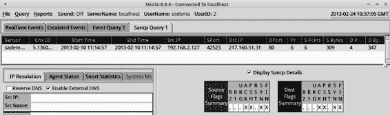

*图 8-7：Sguil 中显示的会话数据*

选择**显示 Sancp 详情**选项来查看 TCP

在此会话期间计数的标志。TCP 协议使用像 SYN 这样的标志，

ACK、FIN、ACK、RST、URG 和 PSH 用于协调会话期间的数据传输-

会话。PRADS 跟踪在两台计算机之间看到的所有标志集合

使用 TCP 交换数据。Sguil 可以在控制台中显示这些标志

帮助分析人员识别通信模式。例如，模式-

图 8-7 中显示的 SYN FIN 反映了会话中所有会用到的标志

在正常的 TCP 会话中，某些时刻可以使用。

该记录中的信息与我们在生成时看到的信息类似

由 Argus 在第六章中提供，包括时间戳、源和目标 IP

地址和端口、协议（这里是 TCP 的 6 号协议），以及源和目标

包和字节计数。这些元素是会话

数据：谁与谁交谈、何时交谈、以及他们交换了多少数据。

**注**

*就在这本书印刷之前，PRADS 开发人员更改了他们的代码，并*

*它们如何计算源计算机和目标计算机在会话中发送的字节数据* *记录。PRADS 与 Bro 和 NM 一起，计算 IP 头部、TCP 或*

*UDP 头部，以及在报告会话中发送或接收的字节数据时的任何应用数据* *与 Argus 和 Wireshark 相比，PRADS、Bro 和 NM 将报告较少的字节* *这些选择是任意的，并且无害，但在比较这些不同工具的数据时，理解这些选择是非常重要的。*

**切换到完整内容数据**

正如我们从事件切换到会话数据一样，Sguil 允许我们从

警报或会话数据到完整内容数据。要查看其工作原理，点击

**实时事件**标签页并突出显示一个有趣的警报。此示例使用

关于过时版本 Java 的警报。像 Snort 或 Suricata 这样的 IDS

在检测时生成了 ET POLICY 漏洞 Java 版本警报

引擎注意到来自运行旧版 Java 的计算机的流量。

IDS 将警报写入磁盘，然后 Sguil 代理读取数据并

将其插入到 MySQL 数据库中。使用 Sguil，我们可以进一步了解

通过右键点击**警报 ID**字段并选择**转录**，如图 8-8 所示，查看此事件。

NSM 控制台 **169**

[www.it-ebooks.info](http://www.it-ebooks.info/)

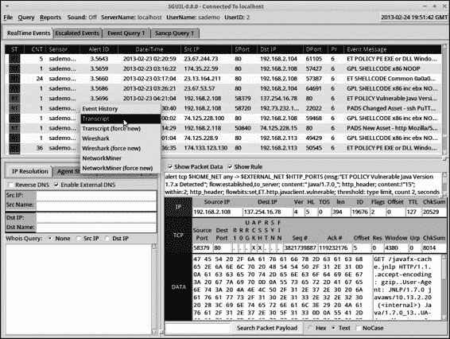

*图 8-8：从警报数据切换到转录*

Sguil 生成一个名为*转录*的新窗口，如图 8-9 所示

（类似于重建 TCP 会话后出现的窗口

Wireshark）。我们看到一台 IP 地址为 192.168.2.108 的计算机连接

到*oracle.com*域中的服务器。这是 HTTP 流量，如下所示

通过 GET 请求和 HTTP/1.1 回复进行识别。ET POLICY 规则用于漏洞

Java 版本注意到 192.168.2.108 正在运行一个过时版本的

Java，如 User-Agent 字段和 UA-Java-Version（1.7.0_13）所报告的那样。

这些数据重要的原因有多个：

• 它是由 Netsniff-ng 保存的完整内容数据的重建。这

数据是*没有*被收集，因为 IDS 检测到了可疑或恶意

活动并决定触发完整内容数据的捕获。相反，

我们只是使用 ET POLICY 规则生成了易受攻击的 Java 版本警报，作为

从警报数据转向完整内容数据是有原因的。

• 它显示了此会话的所有内容——源发送的内容

以及目标的回应方式。在尝试时，这些数据可能至关重要

理解入侵过程中发生的事情。

• 尽管这些数据出现在 Sguil 的 Tcl/Tk 窗口中，但它也可以

很容易自动跳转到 Wireshark，如图 8-10 所示，或者

NM。事实上，你可以通过右键单击警报 ID 字段打开 Wireshark

并选择任一选项。

**170** 第八章

[www.it-ebooks.info](http://www.it-ebooks.info/)

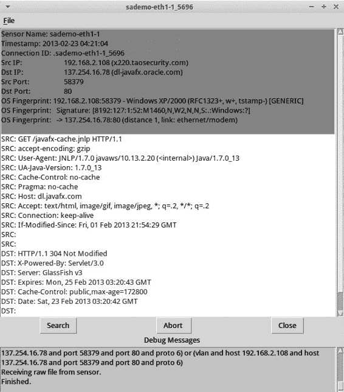

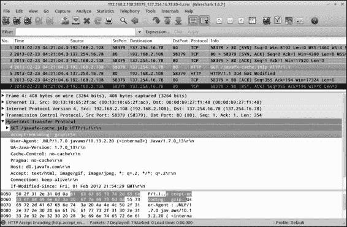

*图 8-9：Sguil 转录*

*图 8-10：从 Sguil 警报数据转到 Wireshark*

NSM 控制台 **171**

[www.it-ebooks.info](http://www.it-ebooks.info/)

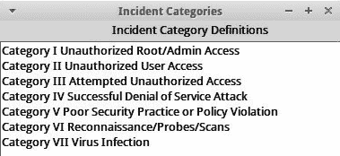

**注意**

*每次 Sguil 从传感器检索完整内容数据时，它会将副本保存到* /nsm/

server_data/<servername>/archive *目录。Sguil 客户端也会保存一份本地副本用于* *本地使用。例如，构建转录所需的 pcap 文件可能会被归档* *在 SO 服务器的* /nsm/server_data/securityonion/archive/2013-02-24/

sademo-eth1/192.168.2.117:49207_184.51.126.91:80-6.raw *。这是格式的* 

*文件名是* SourceIP:SourcePort_DestinationIP:DestinationPort-Protocol.raw *.*

Sguil 的完整内容功能因多个原因而强大。首先，

它们易于使用。更熟悉手动检索数据的分析员

通过命令行查看网络流量的用户通常会兴奋地与

在右键点击的基础上使用 Sguil。此外，Sguil 通过其 Netsniff-ng 组件，

它*始终*将完整内容数据捕获到磁盘。无论是否有警报，Sguil 都会保存这些数据。唯一的限制是硬盘的容量

用于捕获的空间。如果等得太久，硬盘的清理过程

SO 上运行的脚本将删除较旧的捕获以腾出空间给新捕获的数据。

图像。这就是为什么 Sguil 能够保存请求的转录档案副本的原因。

服务器和客户端上的脚本非常有用：SO 可能会删除原始的完整内容数据

内容数据以腾出空间给新文件。只要分析员请求了一个

转录，相关的完整内容证据会在两个位置保留。

**分类警报数据**

Sguil 被设计为一个实时控制台，供坐在 CIRT 或

安全操作中心（SOC）。Sguil 不是一个为分配警报而设计的“警报浏览器”——

通过安全信息进行分析。分析员不应将 Sguil 当作日志管理平台来

管理平台，它被动地存储记录。相反，分析员应

监控 Sguil 控制台并在警报出现时进行调查。他们必须

决定一个事件是良性、可疑还是恶意。做出此决定后，

分析师可以为事件分配一个标签，传达这些信息。

信息。这一分类过程将事件的状态从*RT*

（对于*实时*）切换到用户选择的其他代码。

为了支持这个工作流程，

Sguil 允许你对事件进行分类

警报数据。选择**文件**4**显示**

**事件分类**以查看

内建的 Sguil 分类

默认设置，如图 8-11 所示\。

高亮显示 Sguil 中的任何事件，并

点击相应的功能键

（F1 表示类别 I，F2

*图 8-11：Sguil 事件分类*

对于类别 II，依此类推)

对警报进行分类。例如，

如果你发现有入侵者获取了系统的根级访问权限，

按下 F1 将把事件分类为未授权的根/管理员访问

事件。至关重要的是，*警报将从实时显示中消失*。该事件仍然保存在数据库中，但从 Sguil 的角度来看，该事件已经

已经“处理”。要将事件分类为无关紧要，请按 F8

而是。

**172** 第八章

[www.it-ebooks.info](http://www.it-ebooks.info/)

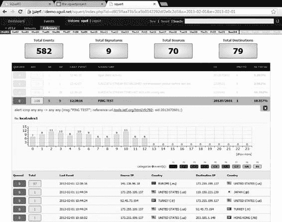

请注意，您只能分类警报数据——而不是会话数据。分析师

使用 Sguil 的人员往往会为不同的功能键分配他们自己的含义，

因此，请制定一个适合您需求的计划。

Sguil 用户不会让警报数据在控制台中堆积。相反，他们会工作

清除屏幕，以尽可能高效的方式。

本书后面的案例研究展示了如何应用这个 NSM

使用 NSM 数据来寻找入侵的操作模型。目前，它的

足够理解 Sguil 为 CIRT 成员提供了一种执行的方式

六个关键功能：查看汇总警报，访问一些元数据和

相关数据，查询警报数据，查询会话数据，转到

完整的内容数据，分类警报数据。

**使用 Squert**

Squert（*http://www.squertproject.org/*）是一个开源的 Web 界面，用于

NSM 数据。Paul Halliday 编写了 Squert，以便访问 Sguil 数据

基于 Web 浏览器的数据库。

**注意**

*Paul 在 GNU 通用公共许可证版本 3 下编写了 Squert* (https://

github.com/int13h/squert/blob/master/COPYING/) *.*

如前所示，Sguil 客户端专注于预

展示不同数据类型的关键元素，按记录行排列。Squert 增加了

如可视化和支持事件的相关信息

Sguil 数据库。图 8-12 展示了 Squert 页面的事件标签，其中

选择的 PING 测试警报。

*图 8-12：Squert 1.0 中的事件标签*

NSM 控制台 **173**

[www.it-ebooks.info](http://www.it-ebooks.info/)

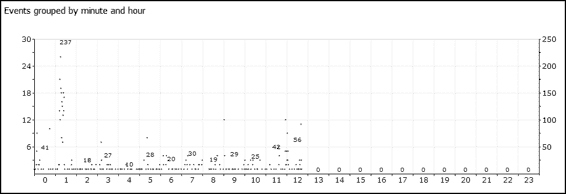

Squert 仪表板呈现了几种数据可视化。例如，

按分钟和小时分组的事件图表显示了高峰和低谷

Snort 或 Suricata IDS 引擎创建的警报计数，如图所示

图 8-13\。

*图 8-13：Squert 显示 IDS 警报随时间变化的可视化*

Squert 的未来版本应该允许分析员从警报数据进行数据转换

数据包详情和完整的内容数据。

Squert 项目超出了捕获的关键数据类型，

集成到 Sguil 及其组件中，但 Snorby 项目将这一点

集成更进一步。

**使用 Snorby**

Snorby（*http://www.snorby.org/*）是一个更新的开源 Web 界面

NSM 数据。

**注**

*Dustin Webber 在 GNU 通用公共许可证版本 3 下编写 Snorby 代码*

(https://github.com/Snorby/snorby/blob/master/LICENSE) *.*

SO 用户可以通过将网页浏览器指向端口 444 TCP 来访问 Snorby

在 SO 服务器上。使用选择的电子邮件地址和密码登录

在 SO 安装过程中，可以查看数据的摘要仪表板

从 Sguil 数据库中，如图 8-14 所示。与 Sguil 一样，Snorby

用户可以使用功能键对事件进行分类。

大多数用户发现 Snorby 界面直观。例如，点击

在仪表板上查看高严重性部分，会带你到高

严重性警报（由 IDS 引擎指定）。点击任何记录

列表显示与该事件相关的更多数据，如图 8-15 所示。

Snorby 还支持创建转录内容，得益于 Paul Halliday 的

CapMe 程序（*https://github.com/int13h/capme*）。使用它时，选择 **数据包**

**捕获选项**，然后选择 **自定义**。数据包捕获构建器

将会弹出一个窗口，如图 8-16 所示。

**174** 第八章

[www.it-ebooks.info](http://www.it-ebooks.info/)

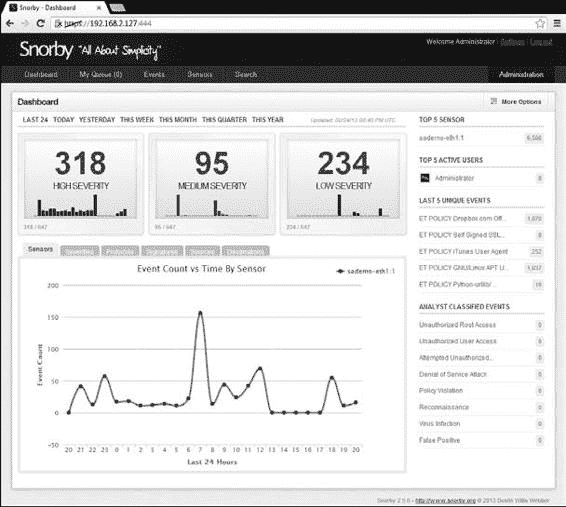

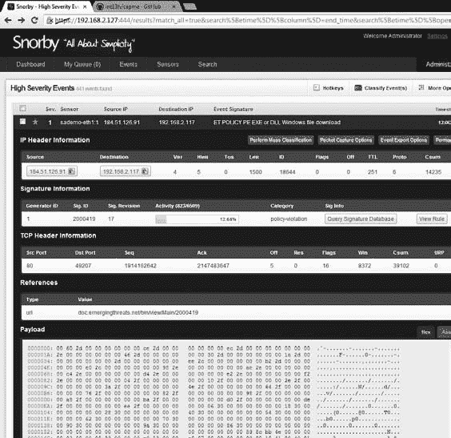

*图 8-14：初始的 Snorby 屏幕*

*图 8-15：Snorby 警报详情*

NSM 控制台 **175**

[www.it-ebooks.info](http://www.it-ebooks.info/)

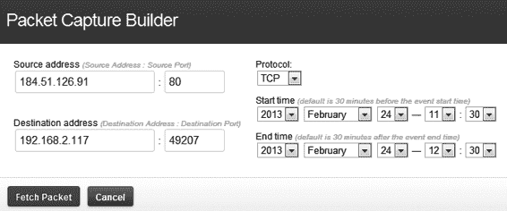

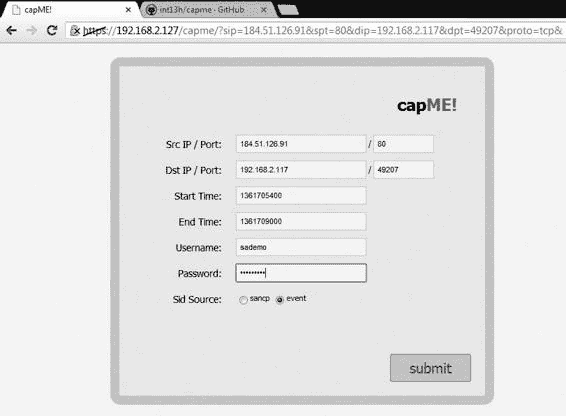

*图 8-16：Snorby 中的数据包捕获构建器窗口*

点击 **获取数据包** 打开一个新窗口，标题为 *capME!*，如图所示

图 8-17。此窗口预先填充了检索必要字段

该事件关联的完整内容数据。剩下的就是

输入用户名和密码，进行身份验证以连接到存储

完整的内容数据。

*图 8-17：CapMe 准备构建转录内容*

当你准备好时，点击 **提交**，CapMe 将会获取完整的内容数据。

来自适当传感器的数据，将其返回到服务器并通过

网络浏览器，如图 8-18 所示。

**176** 第八章

[www.it-ebooks.info](http://www.it-ebooks.info/)

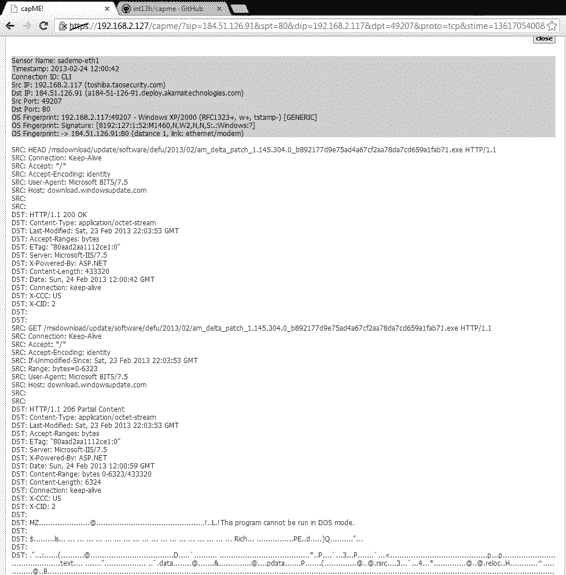

*图 8-18：CapMe 返回转录内容。*

在这个例子中，我们看到 HTTP 流量，包括 HEAD 和 GET 请求，接着是

后面跟着一个 HTTP/1.1 状态码。看起来像是 192.168.2.117 正在检索一个

来自 Microsoft 的更新。

Snorby 还可以以非传统方式向分析员提供数据，例如通过

iPhone 应用程序。例如，Snorby 的 iPhone 应用程序（*https://itunes.apple.com/*

*us/app/snorby/id570584212?mt=8/*) 提供了一种创新的方式来查看 Snorby

警报随时查看，如图 8-19 所示。

**注**

*2013 年，Dustin Webber 发布了一个基于云的 Snorby 版本，称为 Threat*

*Stack* (https://www.threatstack.com/) *，在结论中提到。他计划* *继续支持 Snorby 的开源版本，但云版本包含* *许多吸引人的功能。*

NSM 控制台 **177**

[www.it-ebooks.info](http://www.it-ebooks.info/)

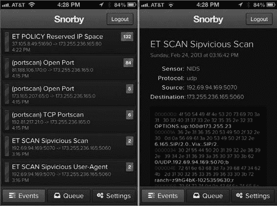

*图 8-19：Snorby iPhone 应用显示可疑扫描警报。*

**使用 ELSA**

ELSA，即企业日志搜索与归档（*https://code.google.com/p/*

*enterprise-log-search-and-archive/*)，提供一个完全异步的基于网页的

查询界面，标准化日志并使得搜索数十亿条日志变得

可以像搜索网页一样轻松搜索任意字符串，正如项目的说明所述

网站。

**注**

*Martin Holste 在 GNU 通用公共许可证第二版下开发了 ELSA*

*(* http://enterprise-log-search-and-archive.googlecode.com/svn/trunk/

elsa/LICENSE/ *).*

ELSA 依赖于 Syslog-ng（*http://www.balabit.com/network-security/syslog-ng/*）来收集远程日志事件，将它们存储在 MySQL 中，并提供搜索

功能，通过使用搜索服务器 Sphinx（*http://sphinxsearch.com/*）。ELSA

它与 Bro 工具紧密集成，许多分析人员使用它来解析 Bro 日志。

因为 ELSA 已经集成到 SO 中，使用它就像点击

通过网页浏览器访问 SO 服务器上的地址和端口，且

然后使用你为 Sguil 设置的用户名和密码进行身份验证

数据库。ELSA 默认应在端口 3154 TCP 上监听，并且必须

通过 HTTPS 访问。在认证后，它提供了所示的查询窗口

如图 8-20 所示\。

**第一百七十八章**

[www.it-ebooks.info](http://www.it-ebooks.info/)

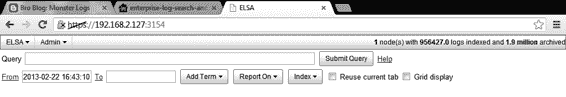

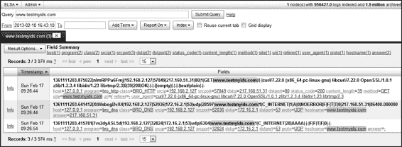

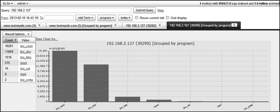
