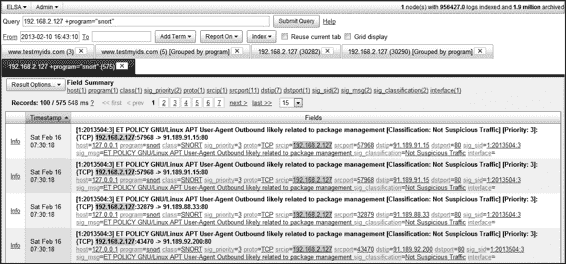
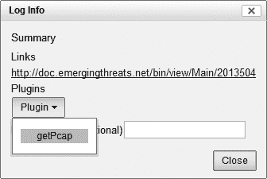
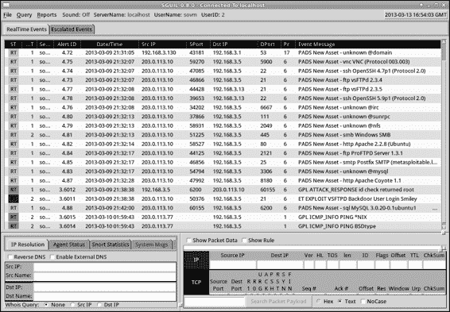
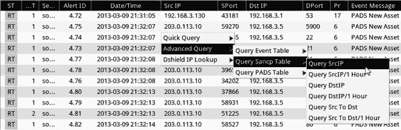
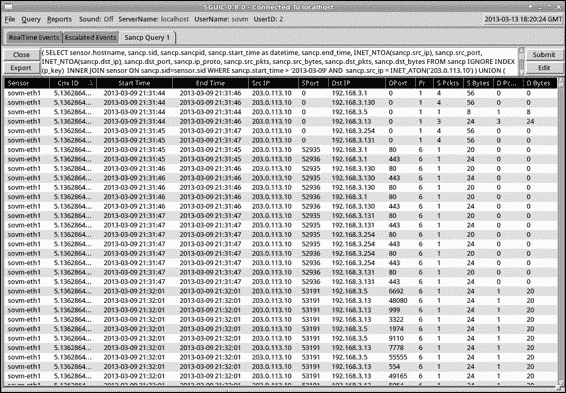
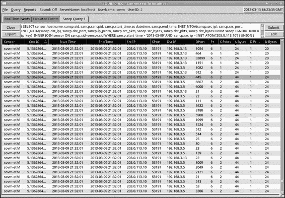
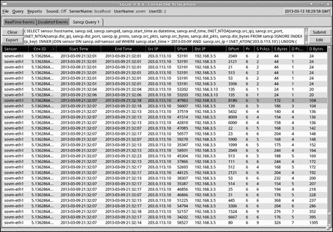
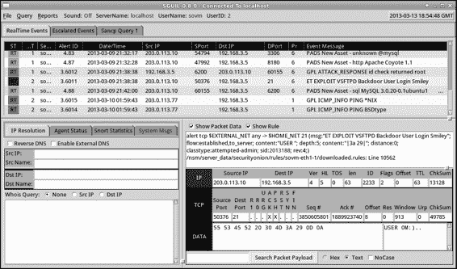

*图 8-20：ELSA 查询窗口*

为了尝试一个示例查询，我将 *From* 时间设置为数据的开始

可通过弹出日历进行选择，然后在中输入 **www.testmyids.com**

查询框。我点击 **提交查询** 并看到图 8-21 中显示的结果。

*图 8-21：ELSA 对 www.testmyids.com 的搜索结果*

请注意“程序(2)”元素出现在字段总结部分。这表明

表示 ELSA 为这些结果识别了两个数据源。

检查记录时，我们可以看到 program=bro_http 和

program=bro_dns。当有许多不同的数据源时，我们可以使用

使用此程序元素来缩小结果。例如，图 8-22 显示

当我在查询框中输入 **192.168.2.127** 后点击时，会发生什么

程序元素的条目。

*图 8-22：按程序分组的 192.168.2.127 的 ELSA 结果*

NSM 控制台 **179**

[www.it-ebooks.info](http://www.it-ebooks.info/)

你可以看到结果按程序分组，bro_conn

提供最多结果的为 bro_conn（16,261 个），最少的为 bro_smtp（2 个）。点击

任何 Count 字段都会开始一个仅针对这些结果的新查询。例如，点击

**snort** 链接查看与 192.168.2.127 相关的 Snort 警报，如图中所示

图 8-23。（ELSA 从 MySQL 数据库中提取这些 Snort 警报。）

*图 8-23：ELSA 中与 192.168.2.127 相关的部分 Snort 警报*

点击 bro_conn 显示 Bro 的连接日志，这是一种会话数据形式

与 Argus 和 PRADS 相似，但由 Bro 生成。

ELSA 还支持其他集成的 NSM 数据。例如，若要

在 Snorby 中生成成绩单（如图 8-17 中我们使用 CapMe 所做的），点击

点击任何记录旁边的 **Info** 链接，点击 **Plugin** 下拉菜单，选择

选择 **getPcap**，如图 8-24 所示。

*图 8-24：选择检索完整内容*

*ELSA 中的 CapMe 数据*

此选项将带你进入 CapMe 认证屏幕，你可以

可以输入用户名和密码来检索该事件的成绩单

问题。

**180** 第八章

[www.it-ebooks.info](http://www.it-ebooks.info/)

ELSA 操作日志数据的能力进行一些有趣的查询。

例如，要查询所有未涉及服务器的 HTTP POST 事件

在美国，你可以提交以下内容：

+method:POST -country_code:US

接下来，通过点击字段的 user_agent 元素来对结果进行分组

摘要。我的实验室网络中结果的示例见于清单 8-3。

5724 Mozilla/5.0 (Windows NT 6.1; WOW64; rv:18.0) Gecko/20100101 Firefox/18.0

2314 Mozilla/5.0 (Windows NT 6.1; WOW64; rv:19.0) Gecko/20100101 Firefox/19.0

897 Mozilla/5.0 (Windows NT 6.1; WOW64) AppleWebKit/537.17 (KHTML，像

Gecko）Chrome/24.0.1312.57 Safari/537.17

788 -

**599 realms/1.0.2 CFNetwork/548.1.4 Darwin/11.0.0** u

448 Dalvik/1.4.0 (Linux; U; Android 2.3.4; Kindle Fire Build/GINGERBREAD)

231 com.apple.Maps/1.0 iPhone OS/6.0.1

**227 village/1.16.1 CFNetwork/548.1.4 Darwin/11.0.0**

129 Shockwave Flash

**85 Lost%20World/1.1.0 CFNetwork/548.1.4 Darwin/11.0.0**

**76 BejBlitz/600 CFNetwork/609 Darwin/13.0.0**

**68 JNPPirateSchool/1.0.6 CFNetwork/548.1.4 Darwin/11.0.0**

49 Google Update/1.3.21.135;winhttp;cup

**48 PetCat/1.4 CFNetwork/548.1.4 Darwin/11.0.0**

**36 Mailroom/1.7.5.1 CFNetwork/609.1.4 Darwin/13.0.0**

**35 Paradise%20Cove/3.8 CFNetwork/548.1.4 Darwin/11.0.0**

27 Mozilla/5.0 ZMTransaction/1.0

25 GoogleAnalytics/2.0b3 (iPad; U; CPU iPhone OS 5.1.1 like Mac OS X; en-us)

**24 TinyPetsies/1.5.3 CFNetwork/548.1.4 Darwin/11.0.0**

17 Storm8/iPhone

*Listing 8-3: ELSA 查询结果：user_agent 数据*

正如你从加粗的代码中看到的，我的孩子们喜欢玩他们的 iPad

和 PC 游戏在此实验室传感器监控的一个区域内！每个游戏列出

其名称作为用户代理的一部分，例如，**realms** 在 u，帮助身份验证过程。警惕通过伪造用户代理来伪装的恶意代码，

然而。

由于 ELSA 最近才被集成到 SO，分析师们刚刚

开始欣赏其强大的功能。

**conclusion**

本章调查了四个主要的开源 NSM 控制台：Sguil，

Squert、Snorby 和 ELSA。这些控制台通常不会生成新的

NSM 数据本身。相反，它们提供一个界面来支持 NSM 数据

被其他工具提供的功能。控制台帮助分析师审查和查询相关的

信息，然后以高效的方式转向相关数据。

NSM 控制台 **181**

[www.it-ebooks.info](http://www.it-ebooks.info/)

Sguil 是原始的 NSM 控制台，许多人认为它是参考 NSM 平台。其六个主要功能是分析师的核心能力

在进行 NSM 操作时需要的工具。Sguil 缺乏一些在其他工具中发现的灵活性

然而，在新的应用中。像 Squert、Snorby 和 ELSA 这样的工具是基于 Web 的

便捷的访问。Snorby 甚至为 iOS 平台提供了一个应用。ELSA 集成了

评估更丰富的 NSM 数据集，尽管分析师们继续扩展

Sguil 的功能可以接受来自非网络源的数据，如

OSSEC。

通过了解每个工具的界面和功能，作为补充

作为他们操作的主要数据形式，你可以开始想象

通过这种丰富的数据进行的检测和响应操作类型

数据在手时。选择最适合你操作需求的工具。在

下一章我将概述如何在你的环境中使用 NSM

描述 NSM 操作时。

**182** 第八章

[www.it-ebooks.info](http://www.it-ebooks.info/)

**Part IV**

**N S M i N a c T i o N**

[www.it-ebooks.info](http://www.it-ebooks.info/)

[www.it-ebooks.info](http://www.it-ebooks.info/)

**9**

**N S M o P e r aT i o N S**

分析师需要工具来找到入侵者，但

方法论比软性技能更为重要

软件。工具收集并解释数据，但

方法论提供了概念模型。

分析师必须了解如何使用工具来实现

一个特定的目标，但重要的是要从一个好的开始

操作模型，然后选择提供

支持该模型的数据。

太多的安全组织将工具置于操作之前。他们认为

“我们需要购买一个日志管理系统”或“我将指派一个分析员”

执行反病毒任务，一个负责数据泄漏保护的任务，”等等。一个工具—

由驱动的团队将不会像一个使命驱动的团队那样有效。当任务—

使命通过运行软件来定义，分析员变得依赖于功能

和工具的限制。分析员如果仅仅考虑他们需要的工具，

为了完成使命，团队将寻求满足这些需求的工具，

如果他们的要求未得到满足，就继续寻找。有时他们甚至

决定构建他们自己的工具。

[www.it-ebooks.info](http://www.it-ebooks.info/)

本章为开发适合您组织的 NSM 操作模型提供了基础。我们将从

企业安全周期。

**企业安全周期**

本书提倡 NSM 作为一种有效的操作模型。我将 NSM 定义为

如收集、分析和升级指示和警告以

检测和响应入侵。这种方法并没有明确地解决

在规划活动或试图抵抗入侵时，安全周期的四个阶段都在进行。

安全周期——规划、抵抗、发现和响应——是必要的

在保护组织免受威胁时。因此，抵抗入侵的第一步

构建操作模型的目标是描述规划之间的关系—

持续检测、抵抗、发现和响应，如图 9-1 所示（一个再版图示）

图 1-1 的再版生产）。1

IT 主要负责，安全协助

规划

抵抗

准备

过滤

评估

保护

解决

升级

收集

分析

响应

检测

安全主要负责，IT 协助

*图 9-1：企业安全周期*

图 9-1 显示了四个核心安全活动之间的关系—

问题。尽管它描绘了从一个阶段到下一个阶段的顺利过渡，

在现实世界中，这四项活动是同时进行的，因为组织—

在同一时刻，IT 和安全

团队在规划新的防御措施时，现有的对策已经在抵御一些入侵者—

团队在努力检测一组入侵者时，CIRT 团队正在响应

其他已在组织中的入侵者。

1. 本循环的元素出现在我 2010 年对 SANS 的演讲中，标题为“CIRT 级别对抗高级持续性威胁的响应” *(http://computer-forensics.sans.org/summit-archives/*

*2010/31-bejtlich-cirt-level-response.pdf)*。

**186** 第九章

[www.it-ebooks.info](http://www.it-ebooks.info/)

***规划阶段***

规划阶段的目标是让组织在最有效的方式中定位自己

尽可能地抵抗入侵，或反制正在被利用的弱点

通过持续的入侵者活动。在此阶段，IT 和安全团队准备

并评估情况。它们使防御成为可能并评估其效果。

预算、审计、合规检查、培训、安全软件开发—

管理和类似工作占据了这一阶段。对抗者模拟，渗透测试—

测试和红队行动是评估工作的示例。

**注释** *The*

红队期刊 *定义* 红队行动 *为“从对手或竞争者的角度看问题的实践”* (http://redteamjournal.com/

关于/red-teaming-and-alternative-analysis/) *。在实际操作中，这意味着参与*

*一个或多个安全专家被聘请来对一个组织进行进攻性操作，以评估安全措施。对抗者模拟是一种红队* *行动的形式，其中操作者试图模仿* *一个选定威胁组的工具、技术和程序。* 渗透测试 *有时被用作红队* *行动的同义词，尽管一些人认为渗透测试是红队用来实现整体目标的技术。*

***抵抗阶段***

在抵抗阶段，IT 和安全团队过滤和保护。

自动化对策，如防火墙、杀毒软件、数据泄漏防护等，

检测、白名单和相关技术，旨在阻止入侵者

在他们能够未经授权访问网络之前的部分

阶段。

安全意识培训以及配置和漏洞修复

管理是其他旨在加强人类的对策

以及在抵抗阶段期间发生的技术环境。

不幸的是，决心强烈的入侵者最终会找到至少一种进入方式

一个网络，这使得企业安全的下两个阶段变得至关重要。

周期—检测与响应—是强制性的。

***检测与响应阶段***

检测与响应阶段包括 NSM 的三个元素：收集、

分析和升级。第四个元素，解决，是响应

阶段，但图 9-1 显示这一元素更靠近规划

企业安全周期的一个元素。

企业安全周期的检测与响应阶段是

在 NSM 的核心，他们是分析师执行收集、

分析，并升级以检测和响应入侵。因此，

它们值得拥有自己的图表，展示各个元素如何协同工作

一起。图 9-2 描述了这种关系，接下来的部分

解释这些元素的更多细节。

NSM 操作 **187**

[www.it-ebooks.info](http://www.it-ebooks.info/)

检测

响应

收集

分析

升级

解决

主机数据

成分

C

A

A

通知

O

IOC 中心

成分

N

N

N

网络数据

响应

A

分析，或

A

S

L

L

T

Y

“匹配”

Y

新的 IOC

I

应用

额外的

S

S

创建

T

T

T

日志

响应

UE

C

C

新的

N

O

O

T

来自

收集

N

N

收集

S

S

P

第三方

改进

O

IOC 自由

O

要求

O

L

L

分析，或

R

E

E

T

来自

分析

(S)

“狩猎”

(S) 新分析

A

要求

L

成分

改进

事件观察/

识别

验证

文档

通知

确认

阻断

修复

存储

请求更多数据

*图 9-2：NSM 流程*

**收集、分析、升级和解决**

检测和响应阶段包括以下元素：

**收集** 收集我们需要的数据，以决定活动是否

正常、可疑或恶意。

**分析** 验证我们对活动性质的怀疑的过程

事件的过程。如图 9-2 所示，有两种类型的分析：其中之一

主要关注妥协指示器（IOC），以及

否则就是不行。（IOC 在“分析”部分讨论：第 193 页）

**升级** 通知利益相关者有关事件状态的行为

被入侵的资产。（我主张使用“利益相关者”这个术语，因为

它捕捉了 CIRT 服务对象在

CIRT 的操作，因为利益相关者拥有被监控的计算机

（由 CIRT 负责。）

**解决** 利益相关者或安全团队成员采取的行动，

以减少丢失风险的安全团队成员。

就像图 9-1 中的企业安全周期图一样，

图 9-2 中的工作流看起来有序且线性，但实际上通常不是这样

实际生活中的案例。事实上，检测和响应的所有阶段

可能同时发生。有时，多个事件同时发生；

其他时候，同一个事件会占据所有四个阶段。图 9-2

显示检测由收集和分析组成，响应

包括升级和解决。让我们仔细看看这些

元素。

**188** 第九章

[www.it-ebooks.info](http://www.it-ebooks.info/)

***收集***

收集包括各种收集信息的过程，既有技术性-

技术性和非技术性：

**技术过程**涉及从端点或主机收集数据

（例如计算机、服务器、平板电脑、移动设备等），网络-

工作和日志（由应用程序、设备及相关源创建）。

**非技术性收集过程**包括记录来自

第三方（如合作伙伴、执法机关、情报

机构等）和利益相关者的“投票”主题。

**技术来源**

收集主机数据的一种方式是使用商业级企业解决方案

类似 Mandiant 智能响应（MIR，*http://www.mandiant*

*.com/products/mandiant-platform/intelligent-response/*）平台，通过软件对端点提出问题。MIR 使得 CIRT 能够*扫查*企业，寻找入侵的迹象

入侵者活动的阶段，然后对潜在受害者进行有针对性的分析

计算机。其他选择包括 F-Response 的商业版本

（*http://www.f-response.com/*），允许基本的远程访问硬盘和内存，以及 Windows Management 等原生 Windows 工具

工具命令行（WMIC）和 SysInternals PsExec.2

网络为中心的收集是本书的重点。网络访问

第二章中讨论的方法，以及所描述的平台

第二部分和第三部分介绍的工具结合提供了网络-

从原始数据中派生的分析结果。附加的解释层次将原始数据转化为

将网络信息转化为值得关注的指标。

应用日志是收集中的主要技术数据来源

阶段，并且生成日志的任何应用程序或设备都可以提供有价值的

可用信息。来自杀毒软件代理和 Apache 进程的输出

Web 服务器上的应用日志就是应用日志的例子。

日志收集至少需要以下内容：

• 一个*日志源*，用于创建应用程序数据

• 一个*日志收集器*，用于接收和存储数据

• 一个*传输方法*，用于将日志从源头传输到收集器

例如，ELSA 可能会从代理服务器收集日志，使用 Syslog

充当传输方法。

主机数据不同于应用日志，因为主机数据通常是通过

按需提供，而日志是由定期调度的过程创建的。使用

例如，MIR，你可以远程查询主机数据，比如 Windows 中的互斥锁

内存或 Windows 注册表中的工件。这个询问的概念

寻找特定的妥协指示符（IOC，见下文讨论）

“分析”o 第 193 页）是一种强大的以主机为中心的技术。

2\. Mike Pilkington 在 SANS 法医博客上的帖子特别有帮助：*http://*

*computer-forensics.sans.org/blog/author/mpilkington*。

NSM 操作 **189**

[www.it-ebooks.info](http://www.it-ebooks.info/)

**非技术来源**

非技术来源对于成功至关重要，

NSM 过程。例如，Mandiant M-Trends 2013 版

报告（*http://www.mandiant.com/resources/m-trends/*）指出，组织

组织接收到来自外部方的入侵警告，占三分之二的比例

时间；只有三分之一的时间他们能自己发现事件。

在使用内部来源识别事件时，来自用户的报告

常常至关重要。经过钓鱼活动意识培训的用户可以成为

企业防御的关键方面。报告钓鱼攻击失败的用户

尝试可能提供需要的警告和证据，以便在该

同样的攻击对另一个受害者成功。

**你应该收集哪些数据？**

本书建议收集几类以网络为中心的数据。这

NSM 数据包括完整内容、提取内容、会话数据、交易

数据、统计数据、元数据和警报数据。所有这些都必要吗？如何

如果 CIRT 决定收集哪些数据以提高其检测成功的概率，

并应对各种数字入侵者？

Eric M . Hutchins、Michael J . Cloppert 和 Rohan M . Amin 提出了一个模型

帮助回答这个问题的论文中，“基于情报的计算机网络防御”。

计算机网络防御通过对敌对行动分析得出的

入侵杀伤链”（*http://papers.rohanamin.com/wp-content/uploads/papers*

*.rohanamin.com/2011/08/iciw2011.pdf*。在这篇论文中（以及会议上的演讲中），他们概述了入侵者在实施某一套

战术、技术和程序（TTPs，这是一个借用自美国军方的术语）

用于描述入侵者活动）尽管作者开发了他们的模型，以

对抗高级持续性威胁（APT）的 TTP，

这种一般形式的分析可以适应

入侵杀链

适用于其他行动者和其他方法。（更多信息请参考

关于 APT 的信息，请参见 Mandiant 的报告：

侦察

*http://www.mandiant.com/apt1/*。）他们的模型

如图 9-3 所示，并在其中引用

武器化

他们的论文作为*入侵杀链*。

交付

这一系列步骤类似于

之前的研究中讨论过的内容，比如“阶段

利用

“攻陷的解剖”出自我的第一本书*The Tao of*

*网络安全监控：超越入侵*

安装

*检测*（Addison-Wesley，2004 年）：（1）侦察-

命令与控制

侦察，（2）利用，（3）强化-

（4）整合，（5）掠夺。这个

基于意图的操作

《黑客攻击的解剖》来自于*Hacking Exposed*，

*第四版*（麦格劳-希尔奥斯本媒体，

*图 9-3：入侵杀链*

2003 年）类似：（1）足迹分析，（2）扫描，

*链模型*

**190** 第九章

[www.it-ebooks.info](http://www.it-ebooks.info/)

（3）枚举，（4）获取访问权限，（5）提升权限，（6）盗窃，（7）掩盖痕迹，（8）创建后门。其他人有自己的版本

对手在入侵目标时所采取的步骤。

Hutchins、Cloppert 和 Amin 提出的这种方法的独特之处在于

它的特点是专注于将安全程序与入侵步骤对齐

杀链。他们展示了用于检测、拒绝、干扰、降级的示例技术，

并/或欺骗对手。NSM 很适合这种模型，因为它提供了一个

在入侵者完成任务之前，发现并响应入侵者的一种方法。

因此，入侵杀链为识别提供了一个强大的模型

我们需要收集的数据。

最强大的 NSM 操作将为每个

入侵杀链中的一步，数据源根据网络情况有所不同-

网络。图 9-4 显示了入侵杀链及其示例数据源，包括-

扫描主机、网络、应用程序和非技术性内容。

入侵杀链

检测方法

侦察

网站访问日志

武器化

提取内容

交付

用户报告

利用

端点评估

安装

端点评估

命令与控制

交易数据

基于意图的操作

内存分析

*图 9-4：入侵杀链和可能的检测*

*来源与方法*

要理解图 9-4，假设一个入侵者想要入侵

一个特定的公司，以窃取数据。他决定进行定向钓鱼攻击-

向目标发起攻击以获得初始访问权限。要识别公司中的用户，

他从公司网站下载所有包含电子邮件地址的文件

公司用户的电子邮件地址。入侵者设计了一封诱人的钓鱼邮件，

将利用代码插入到附件中，并将恶意信息传送给

公司的一组用户。一旦受害用户点击恶意附件，

这种恶意软件会利用用户文字处理应用程序中的漏洞，

在应用程序中，恶意软件建立了外向的命令与控制通道，

通道将会连接到由入侵者控制的站点。在这个阶段，入侵者已经准备好

开始寻找他想窃取的数据。

*(续)*

NSM 操作 **191**

[www.it-ebooks.info](http://www.it-ebooks.info/)

图 9-4 展示了如何利用不同来源和方法进行数据收集。

检测入侵链的每个阶段。CIRT 可以分析访问

日志用于通过搜索引擎检测入侵者，查找电子邮件地址。

公司的网站。当钓鱼邮件通过公司网站时，

电子邮件服务器、自动处理软件可以提取恶意附件，

并分析其是否存在可疑特征。钓鱼邮件的一个或多个收件人可能会报告收到此邮件。

在被钓鱼的信息中，收件人可能报告说他们收到了该信息。

CIRT 可以使用端点评估工具查找相关的指示器，

攻击成功后，利用了一个易受攻击的文字处理应用程序漏洞，

漏洞的利用和随后的恶意软件安装。CIRT 可以观察

在其 SO 平台收集的事务数据中，发现命令与控制通道。

最后，为了查看入侵者执行的个别命令，CIRT 可能...

分析从一个或多个受害系统中捕获的内存。

这些示例检测来源和方法并非所有组织都可以使用，

组织。你可能需要更加依赖你现有的工具，

很可能在 NSM 旅程的开始阶段，许多 CIRT 将会看到存在差距。

在检测入侵链的各个阶段方面具有强大能力的智能 CIRT 将能够...

针对这些差距，CIRT 可以采取措施，结合技术与非技术手段来弥补。

方法，他们将构建反制措施以试图拒绝、干扰、削弱...

并/或欺骗对手。并非所有的措施都能对所有攻击方法有效，

但是在链条的“更高”阶段（即更早的阶段）进行防御或检测是有意义的。

给防御者提供最佳机会，以防止对手实现其目的。

完成其任务。

关键是收集需要多个组件来实现，

要有效，这些方法包括：

• 来自主机、网络和应用程序的数据构成了技术基础。

基础

• 一个过程来接收来自第三方和利益相关方的报告，

收集非技术数据

• 数据库、工单系统或其他平台用于管理此

信息

我们已经讨论了 SO 作为数据收集的一种技术工具，但它并非万能。

唯一可用的方法。你的组织可以通过电子邮件、帮助台人员，

以及相关流程来管理非技术性的收集工作。

一些组织在 NSM 过程中的收集阶段就结束了。他们...

将 NSM 收集工具和技术视为另一套系统

部署并丢弃。它们把收集当作最终目的，而不是

不要陷入这个陷阱！虽然使用完善工具的

网络很少出现时，采取下一步并处理数据。

进入分析阶段。

**192** 第九章

[www.it-ebooks.info](http://www.it-ebooks.info/)

***分析***

分析是识别和验证正常、可疑和

恶意活动。IOC 加速了这个过程。正式而言，IOC 是敌方行为的表现—

观察到或可辨别的敌方行为的表现。非正式地，IOC 是

编码敌方活动的方式，以便技术系统能够找到入侵者

在数字证据中。例如，Mandiant APT1 报告（ *http://www*

*.mandiant.com/apt1/*) 该报告于 2013 年 2 月发布，列出了超过 3,000 个 IOC（指标）。

包括 IP 地址、域名以及恶意工具的 MD5 哈希值

中国人民解放军 61398 部队。（Mandiant 识别出某些

威胁团体以 APT 为前缀，后跟一个数字，如 APT1，

APT2，等等。）

我将依赖 IOC 来寻找入侵者称为*IOC 中心分析*，或

*匹配*。分析人员将 IOC 与证据进行匹配，以识别可疑或恶意

可疑活动，然后验证他们的发现。

匹配并不是寻找入侵者的唯一方法。更先进的 NSM

操作还追求 *无 IOC 分析*，或 *猎捕*。

在 2000 年代中期，美国空军普及了*猎杀者*这一术语

数字世界中。安全专家对他们的网络进行了*友军力量投射*，检查数据并有时占领系统本身

为了发现高级威胁。今天，像 David Bianco 这样的 NSM 专业人员

(*http://detect-respond.blogspot.com/*) 和 Aaron Wade (*http://forensicir.blogspot*

*.com/*) 促进网络“猎捕之旅”，在这些旅程中，一位高级调查员

用一种新颖的方式来检测入侵者，指导初级分析师通过数据并

系统在寻找敌方的痕迹。在验证技术后（以及

响应任何敌方行动时，猎手们将新的检测方法纳入其中

方法进入 CIRT 的 IOC 中心操作。（第十章和第十一章对比

匹配和猎捕方法以展示其优势和

每个的弱点。）

**入侵与事件**

分析人员使用数据来识别并验证入侵。入侵是其中之一

一个事件的例子。其他事件的例子包括因断开网络电缆而导致的中断

由 DDoS 攻击引起的，移动设备的丢失或盗窃，以及丢失的连接

连接性丧失。但究竟什么是*入侵*，以及

什么是*事件*？

*入侵*是政策违反或计算机安全事件。在他们的

书籍《事件响应与计算机取证（第二版）》(McGraw-Hill

Osborne Media, 2003 年），Kevin Mandia 和 Chris Prosise 定义了一个 *事件*

被定义为“任何非法、未经授权或不可接受的行为，涉及到

计算机系统或计算机网络。”这些定义留下了大量空间

操作空间，组织应该决定这些

这些术语对你意味着什么。你的目标应该是采纳一致的内部

定义。例如，图 9-5 展示了一种分类方法

（*http://taosecurity.blogspot.com/2009/06/information-security-incident.html* 和 *http://taosecurity.blogspot.com/2009/06/extending-information-security-incident*

*.html*) 构建在一部分入侵类别或 *cat* 级别的基础上，这些是由美国国防部推广的。

NSM 操作 **193**

[www.it-ebooks.info](http://www.it-ebooks.info/)

名称

描述

Cat 6

入侵者对具有访问敏感数据的资产进行了侦察。

Cat 3

入侵者尝试利用具有访问敏感数据的资产，但失败。

Cat 2

入侵者突破资产防护，访问敏感数据，但未获得数据。

拥有 root 或管理员级别的访问权限。

Cat 1

入侵者突破资产防护，轻松访问敏感数据。

破坏 3 入侵者从已获得访问权限的资产建立指挥控制通道

对敏感数据进行访问。

破坏 2 入侵者窃取了非敏感数据或有助于访问敏感数据的数据。

破坏 1 入侵者窃取了敏感数据或因数据量等原因被怀疑窃取了敏感数据。

危机 3 入侵者通过在线或主流媒体公开盗取的数据。

危机 2 数据丢失导致政府或监管机构调查，并可能处以罚款或其他法律后果。

危机 1 数据丢失导致身体伤害或生命丧失。

*图 9-5：建议的入侵类别*

这些类别旨在帮助分析员理解外部因素

入侵的来临和性质。例如，假设分析员判断

入侵者通过执行未经授权的代码来突破计算机安全。

代码，可能是通过诱使用户打开一个恶意附件

利用一个存在漏洞的 Java 安装。但如果分析员进一步

分析员判断出外发的指挥控制通道被拒绝

如果通过企业代理，入侵被分类为 Cat 1。因为该

入侵者无法建立他的指挥控制通道，事件为

事件未达到破坏 3。

另一个例子，假设分析员发现入侵者已经

通过执行未经授权的代码突破计算机安全。在

在这种情况下，入侵者还*窃取*了非敏感数据，如用户的购物清单。如果 CIRT 迅速采取行动，能够控制受害者的损失。

在入侵者窃取敏感数据之前，或从初始受害者转移目标时

到另一个受害者的系统。如果 CIRT 成功，事件将被归类为破坏 2。

如果 CIRT 失败，且入侵者窃取了敏感数据，则事件为

破坏 1。如果入侵者选择在线发布被盗数据，则事件为

事件是危机 3。

**194** 第九章

[www.it-ebooks.info](http://www.it-ebooks.info/)

**事件分类**

CIRT 可能会在其分析控制台中或通过事件跟踪系统对事件进行分类。例如，开源的 Sguil 和 Snorby 控制台

跟踪系统。例如，开源的 Sguil 和 Snorby 控制台

（在第八章讨论）通过功能键支持事件分类。

其他选项包括在安全信息和事件中标记结果

管理（SIEM）或日志管理平台。

分类应包括做出决定的分析师的用户 ID。

分类的会话，分类时间，分类本身以及一个可选的

评论字段。支持将事件转发给更高级别的

分析师的帮助非常重要。协作和社交讨论事件数据有助于

（如标记、聊天室和论坛）有助于提高决策—

制定过程。

分析过程的底线是，分析师必须统计和

分类所有影响其组成部分的事件。统计和分类

事件生成了 CIRT 必须收集的两个关键指标之一。（

第二个关键指标是从事件检测到遏制所经过的时间。

作为“解决方案”中讨论的第 198 页）的定义不需要符合任何国际标准，但它们必须是内部一致的。

一致的术语。

也就是说，如果 CIRT 希望为事件报告系统贡献数据，

项目对外部事件定义与其外部

无论是内部还是外部报告，CIRT 应该能够

按单位时间内的事件类型和数量定期生成报告。

例如按季度或每年一次。组织如何处理这些

分析过程的输出是下一个部分的主题。

***升级***

升级是 CIRT 用来记录其发现过程的过程，

通知其组成部分，并收到组成部分的确认

事件报告的系统。升级可能看起来像是事后的考虑，未充分

事件的细节，然而在大型和/或分布式环境中，升级—

升级是 NSM 过程最困难的方面之一。

**事件文档**

文档记录了事件的过程，以及 CIRT 为

处理该事件。重要的是为每个事件分配一个唯一的事件编号。

受害计算机。（将被利用的应用程序视为计算机，以

本练习的目的。）不要为多个受害计算机分配

一个事件编号，除非你使用不同的术语来表示一个被妥协的计算机—

被妥协的计算机。例如，一些 CIRT 将单一的受害者称为*妥协*，

将一个或多个被妥协的计算机称为*事件*。关键在于使用一个

适用于单一受害计算机的细化术语；如果没有这样的细节， 

如果不做这些，就无法收集和衡量事件响应指标。

NSM 操作**195**

[www.it-ebooks.info](http://www.it-ebooks.info/)

组织将选择将不同层次的细节纳入其事件报告。例如，处理数百或数千个事件的 CIRT

每年的事件数量将很可能捕获受害系统的基本细节，

而处理较少事件的工作人员可能会更详细地记录。

如果可能，考虑使用社区标准来记录事件

像“事件记录和事件共享词汇”这样的标准

(VERIS)。VERIS 提供了描述安全事件的通用语言。

一致地记录安全事件。你会找到如何记录安全事件的例子。

各种类型可以在 VERIS 项目网站上找到（*http://veriscommunity.net/*）。

**事件通知**

通知是升级流程中的下一步。它要求你

确定受损资产，找到负责的人员或团队，

受害者，并将事件报告交给受影响的方。该过程

听起来简单，但在处理

在大规模或分布式网络中，由于清单管理普遍较差，

许多组织面临的管理和网络可见性问题。

**什么是可防御的网络架构？**

确定受损资产，找到负责的所有者，并交付

事件报告是安全领域最具挑战性的工作之一，但它们并非唯一的挑战。我开发了一种*可防御的网络架构*，以解释那些网络提供最大整体安全性的组织的特点（*http://*）。

*taosecurity.blogspot.com/2008/01/defensible-network-architecture-20.html*）这个清单从安全团队应该首先采取的特性开始，随着清单的推进，元素变得越来越难以实现。

监控的 CIRT 可以查看所有主机、网络和应用层面的资产。

日志级别。

列出的 CIRT 可以访问识别资产位置、用途和

数据分类、重要性、所有者和联系方式。

控制了安全团队在主机、网络和

应用级别应允许授权活动并拒绝其他所有活动。

声明资产所有者在清单中列出，负责系统的积极控制。

最小化了资产提供执行所需的最小表面面积。

他们的业务功能；不必要的服务、协议和软件被禁用。

评估的 CIRT 定期评估资产配置，以防范安全风险。

他们的安全姿态。

当前，IT 团队保持资产的补丁状态和配置是最新的。

使用最新的标准。

测量了 IT 团队和 CIRT 根据之前的进度进行评估。

步骤。

采用可防御的网络架构的组织处于最佳位置，

提到的目标是抵抗妥协，并在入侵发生时有效响应。

**196** 第九章

[www.it-ebooks.info](http://www.it-ebooks.info/)

如果 CIRT 无法映射 IP 地址或

主机名指向真实计算机，确定其所有者，并联系所有者。

如果这些步骤中的任何一步失败，事件将无法报告，网络

风险。

通知也取决于特定事件所带来的风险。

例如，关于 Cat 2 事件（未经授权的用户访问）的通讯，

级别访问）可能不应具有与通讯紧急性相关的要求。

关于 Breach 2 事件（入侵者窃取了敏感数据）的通讯，

无论如何，所有报告都应符合标准事件

CIRT 使用的事件管理平台，但 CIRT 和相关方

应根据事件的严重性同意不同的预期响应时间。

事件。如果事件紧急，使用电话或即时消息；

时间是关键因素之一。确保每个人都理解

如何沟通事件并实践通知过程，

定期进行通知。同时，制定备份通知计划，以防万一

主要联系人没有回应。

确认事件报告是升级过程中的最后一步，

阶段，但这一步骤可能是一个挑战，因为一些相关方

不关心他们的计算机是否被入侵（或者他们只是

被其他工作压得喘不过气）。有些人根本没有 IT 或安全能力，

无论如何，可能完全依赖 CIRT 执行接下来的步骤。无论

在这种情况下，跟踪确认时间和方法，在任何系统中

你用来管理事件报告的工具有助于提高整体安全性

过程。

**事件沟通考虑事项**

被持续威胁攻陷的组织应假设

对手已经访问了他们的电子邮件。阅读 CIRT 和安全团队的消息

消息是攻击者的最爱活动。不幸的是，电子邮件往往是最

企业通信中的常见元素。大型，

分布式组织可能使用不同的聊天应用程序、协作

通信平台或其他形式的通信，但几乎每个人都有

一个他们密切关注的电子邮件地址。确保加密敏感

CIRT 和相关方之间具有启发性的电子邮件对话并交换真正敏感的

通过电话获取信息。如果你怀疑攻击者已渗透

你的语音 over IP 协议（VoIP）网络，使用手机。相同

适用于企业托管的实时聊天系统和其他协作平台。

平台。

许多被攻陷的组织选择通过电子邮件进行沟通

使用像 Gmail 这样的服务，或其他供应商，以避免他们的

被攻陷的系统。需要在检测到之前对这些响应活动进行压力测试。

一起对待一个严重事件。

现在 CIRT 和相关方正在就一个事件进行沟通，

事件发生后，最后阶段是采取措施减少损失风险。

NSM 操作 **197**

[www.it-ebooks.info](http://www.it-ebooks.info/)

***解决方案***

解决方案指的是 CIRT 和相关方用来将系统从

从风险状态到可信状态的系统恢复。实际的

过渡过程有很多种形式，取决于事件的性质，

事件及 CIRT 和相关方的能力和风险承受能力，

事件。每一方必须平衡数据丢失、篡改或拒绝服务的风险，

服务中断对被攻陷资产的业务需求。

CIRT 通常希望将被攻陷的计算机从网络中断开

尽可能迅速地恢复，而业务负责人则希望它无论如何都能在线

无论成本如何。

解决事件时，可以考虑制定*风险缓解指南*。

当任何资产被破坏时，相关人员必须采取至少一个措施，

确保减少数据丢失、篡改或拒绝服务的风险，具体取决于

根据事件的性质，采取行动不是一种选择。容忍

网络上的入侵者最好的做法是，最糟糕的情况是邀请

诉讼或其他处罚的风险。

**遏制技术**

CIRT 和相关方应制定可能的风险缓解层级

缓解策略。这些响应选项专注于遏制入侵者

并限制他们与受害计算机的互动自由，或从

将受害计算机转移到另一个受害者计算机上。

遏制入侵者时，从受害计算机开始，并

可以考虑以下几种可能性：

• 将计算机置于休眠模式。（不要关闭它；你会失去

在内存中存储宝贵的易变数据。）

• 关闭计算机用于访问网络的端口。

• 实施本地防火墙规则或内核级过滤器，禁止计算机

给计算机提供与其他计算机通信的能力。

• 实施访问控制列表条目，防止计算机

与其他计算机通信。

• 实施路由更改，防止计算机与其他计算机

与其他计算机进行通信。

• 实施防火墙或代理阻止，禁止计算机访问

互联网，这将切断远程命令与控制通道。

更先进的 CIRT 将拥有其他手段，例如

将入侵者转移到一个模拟计算机的蜜罐网络中，以供

在一个“安全”的环境中进行研究。（蜜罐网络是由计算机组成的一个集合，

由 CIRT 部署，用于引诱、陷阱和观察入侵者。）无论具体

行动选择，关键是确保 CIRT 和相关方

有限地采取措施以减少丢失风险。

**198** 第九章

[www.it-ebooks.info](http://www.it-ebooks.info/)

**遏制速度**

CIRT 和相关方采取遏制行动的速度是

这是安全界的热门争议话题。有些人主张快速遏制，

限制风险的措施；其他人主张较慢的遏制，提供

更多时间去了解对手。最佳答案是遏制事件，

尽可能快速地处理事件，只要 CIRT 能将事件范围限定在

以最佳能力执行其任务。

*限定事件范围*意味着了解入侵者的渗透范围。他是仅限于

是否仅限于与目前识别的唯一计算机互动？他

通过利用漏洞控制更多的计算机，甚至整个网络。

是否破坏了 Active Directory 域控制器？

CIRT 做出遏制决策的速度是一个

这是衡量其成熟度的主要方式之一。如果 CIRT 定期了解

通过外部通知，识别先进（或甚至常规）威胁的存在

若 CIRT 与相关方在决策时花费更多时间，转而采取快速遏制将不太有效。

无法在自身环境中发现入侵的 CIRT，可能也无法

快速界定事件范围。“切断”首个识别的受害者将

可能会留下数十、数百或数千个其他受害者仍在线并处于危险中。

可供对手使用。

另一方面，如果 CIRT 开发自己的威胁情报，

维持广泛的可视性，并快速自主发现入侵者的 CIRT

更有可能在最短时间内对事件进行范围界定。

拥有此类能力的 CIRTs 应建立入侵者的渗透范围

尽可能迅速地响应，然后同样迅速地控制受害者，以限制

对手的选项。

决定采取何种封锁行动可能会很棘手。一个方法是

决定采取基于威胁或基于资产的应对策略

防御信息资源。

*基于威胁*的策略关注假定的对手特征

必要时，成熟的 CIRT 可能会追踪多个不同的威胁群体，并进行

识别出更为复杂或具有破坏性的威胁时，会影响某个

或多台计算机。当 CIRT 检测到一个威胁组织在

一旦发现威胁，CIRT 可能会迅速采取行动以控制对手。

如果 CIRT 注意到一个涉及犯罪分子的常规事件，

CIRT 可能会采取更为从容的应对方式。

*基于资产*的策略关注假定的受害者特征

计算机。与成熟的 IT 和业务组织合作的 CIRT

将理解其网络中数据的敏感性及其相关方的角色

处理这些数据的系统。当 CIRT 检测到影响

如果是一个对业务至关重要的资产，CIRT 会迅速采取行动。如果 CIRT 注意到

影响较不重要资产（例如员工笔记本电脑）的活动时，CIRT

CIRT 反应不那么迅速。一些 CIRTs 采取混合方法，权衡

威胁行为者与受影响资产的相对关系。

CIRTs 应在*操作手册*中记录其流程，概述

CIRTs 和相关方需要履行的责任和采取的行动。CIRTs

还应根据入侵活动的性质以不同的方式跟踪入侵者的活动。

威胁时。例如，成熟的 CIRTs 会针对 APT 和激进的

NSM 操作 **199**

[www.it-ebooks.info](http://www.it-ebooks.info/)

**如何跟踪波次和活动**

尽管 CIRTs 应为事件分配某种形式的编号（例如

201305180006（2013 年 5 月 18 日的第六个事件）更易于记忆，我建议

CIRTs 为波次活动制定名称。名称比

编号，使用它们可以帮助 CIRTs 更容易地讨论重要活动

与相关方合作。一些 CIRTs 使用国家气象局分配的名称

美国国家飓风中心服务（*http://www.nhc.noaa.gov/aboutnames*

*.shtml*)用于一整年的波次名称。例如，2013 年的第一波

由 CIRT 发起的应对高级威胁活动的事件将被命名为 Wave

Andrea，第二个将命名为 Wave Barry，依此类推。

在入侵的高压情况下，CIRT 缺乏

能够完全识别对手活动的能力。分配一个

将活动与敌人行为的热战进行对比。相反，根据

有关 CIRT 如何响应的外部信息。在持续的数字混战中，

通过响应活动，CIRT 的情报小组可以进行分析，确定

确定观察到的敌人行为如何融入整体局势。

成熟的 CIRT 跟踪多个威胁团体，如国家级、犯罪集团、

和黑客活动者。CIRT 情报小组会将对手的活动分配到

将这些威胁团体与 CIRT 的波动响应配对

问题。例如，情报小组可能会意识到“波动 Andrea”

是 CIRT 对 APT12 的响应，而“波动 Barry”是 CIRT 对

针对 APT1 的响应。

犯罪团体经常用“敌人*活动*”来讨论。一次活动

是敌人进行的一项长期操作，通常是为了窃取信息，

信息。一次单独的入侵可能只是对手攻击的一个环节。

活动。

CIRT 对抗持久敌人时，通常会组织其响应行动

如同*波动*一样。一波并不完全等同于一次活动。相比之下，一个

活动指的是入侵者对目标进行长期攻击的整体。

一个目标，一波指的是 CIRT 检测并响应对手活动的努力。

敌人。换句话说，入侵者进行活动，CIRT 进行防御。

按波次进行。CIRT 永远无法完全洞察敌人的活动。

因此，跟踪你*认为*敌人在做什么（例如，一次活动）

活动），以及 CIRT *正在做什么*（例如，一波行动）。

成熟的 CIRT 认识到需要应对一次严重的

事件采取的步骤。

1\. 选择一个波动名称，并宣布波动开始。

2\. 创建一个电话桥接和密码保护的实时聊天室

讨论反制敌人的活动。

3\. 向受影响的相关方发送紧急通知，告知他们

CIRT 已经启动一波行动，并且如何与 CIRT 沟通

通过电话和聊天室进行交流。

**200** 第九章

[www.it-ebooks.info](http://www.it-ebooks.info/)

4\. 根据需要收集并分析其他证据，以界定事件的范围。

5\. 通过实时和数字方式，迅速向相关方报告事件

方式，识别受害系统和数据。

6\. 与相关方协调遏制措施，以限制风险

数据丢失、篡改或服务中断的风险。

7\. 一旦所有受害者的遏制措施到位，宣布一波行动结束。

8\. 在整个波动期间，定期与相关方沟通

以便让相关方保持知情，并减少紧张情绪。

对于不太严重的事件，CIRT 不需要采取如此复杂的

沟通方法。CIRT 会集中精力记录

高效处理事件，并在事件发生后的

预期的服务时间窗口。对于这两类事件，CIRT 应该衡量——

确保关键步骤的时间。例如——

图 9-2 底部的文字（展示了——

NSM 过程）展示了在事件检测和响应过程中的关键点。

子流程应该记录时间。图 9-6 重现了那些——

关键时刻。

请求更多数据

事件已观察/存储

识别

验证

文档

通知

确认

隔离

修复

*图 9-6：应该记录时间的事件*

到目前为止，我们主要关注的是隔离，或旨在——

以限制风险，但单靠隔离仍然会让受害计算机处于威胁中——

承诺。一旦攻击被隔离，就该进入 *修复* 阶段，或者——

恢复受损资产到一个可信状态。

**修复**

修复是安全行业的另一个热点话题。一些人认为——

系统可以“清理”以去除入侵者的工具、持久性机制——

和访问方法。另一些人认为，受害计算机应该重建——

从安装介质或可信备份恢复。一些甚至表示已被攻陷——

系统应该重新闪存或放弃，因为高级入侵者可以——

在硬件中植入持久性机制！

你应该重建任何已知有敌方接入的系统

与之互动，但仅在完全了解事件范围后才进行。这里的 *互动* 意味着——

如果有法医原因可以假设敌方已经获取并利用了——

未经授权访问受害者。这并不意味着入侵者 *可能*——

接触了受害者，但并没有。实际上，这件事的真相是它是虚拟的——

对任何系统中的入侵者的行为，CIRT 通常不可能完全知晓。

NSM 操作 **201**

[www.it-ebooks.info](http://www.it-ebooks.info/)

受害者的风险容忍度。通常，一个 CIRT 看到的只是所谓的“冰山一角”。毕竟，为什么要在尝试“清理”受害者时危及修复计划，结果却——

学习到消毒未能去除持久性机制？

你应该多快进行修复？一些 CIRT 努力将——

从 *检测到隔离* 一小时内完成。其他人则更激进（也更有野心），努力将 *敌方访问到修复* 的时间限制在一小时以内。选择取决于你——

组织和 CIRT、IT 团队以及各方的能力。

一旦你开始追踪从检测到隔离的时间，你可能会发现——

隔离通常需要数周，而不是一个小时。记录这些指标并尽量——

随着你继续开发你的过程和战术，尽量减少时间。

***使用 NSM 改进安全性***

此时，我们有了一个框架来思考 CIRT 和安全改进——

我们来看一些实际操作中的例子。

• 一个供应商提出增加探针来收集和解释 NetFlow

来自边界路由器的记录（某种类型的会话数据）。此活动——

属于 NSM 过程中的收集阶段。因为 CIRT——

CIRT 已经通过 Argus 和 Bro 在 SO 传感器上收集会话数据，

监控网关时，额外的采集可能不是必需的。CIRT

CIRT 拒绝购买 NetFlow 处理设备的提议。

• Mandiant 发布了关于 APT1 的报告（*http://www.mandiant.com/apt1/*）。

该档案包含超过 3000 个指标。CIRT 意识到它

可以使用这些指标进行 IOC 中心的匹配活动，这是 NSM

在 NSM 过程的分析阶段。Mandiant 还发布了超过 100 页

描述 APT1 行为者使用的工具。CIRT 利用这些信息

用于无 IOC 猎杀分析。

• 在特定情况下，从事件检测到遏制所用的时间

公司每次响应的时间大约是几周，CIO 希望缩短

将此时间缩短至一个小时内。一个厂商提议使用新的资产管理

系统。多个业务线表达了对新工具的热情

并成立工作组以更好地管理资产清单。CIRT

支持这个新系统，因为它将减少所需的时间

识别资产所有者，并将提高事件通知的准确性，

在 NSM 过程的升级阶段发生的情况。

• 网络团队决定尝试实施一个网络访问

控制（NAC）解决方案。IT 团队成员抵制这个计划

因为他们担心会妨碍用户生产力，但 CIRT 认为

这解决方案可能在 NSM 的解决阶段有所帮助。

NSM 过程。CIRT 说服 IT 团队支持 NAC

解决方案。

**202** 第九章

[www.it-ebooks.info](http://www.it-ebooks.info/)

这些示例展示了如何在 NSM 过程中进行工作

可以帮助 CIRT 在操作中做出更好的决策。相较于

相较于被最新的安全潮流或厂商工具引导，CIRT 可以识别

改进 NSM 过程中的所有阶段。通过解决

现有的差距，CIRT 可以减少检测和响应时间并提供帮助

识别导致系统被攻破的问题。

***建立 CIRT***

本书主要面向那些作为个人或团队成员实践 NSM 的人。

CIRTs 的成员。那些作为独立贡献者工作的人可能希望你

成员扩展处理 NSM 任务资源的支持。为了帮助证明理由，

为了确认增项，跟踪这些关键指标：

• 事件的分类和计数

• 从事件检测到遏制的时间

将这些指标呈交给管理人员并询问他们是否

满意他们的数据。他们对事件类型和数量满意吗？

每季度和每年的事件数量？他们对所花费的时间是否满意？

从事件检测到遏制需要多久时间？如果答案是

不，估算增加人力、新工具和更好流程的成本。

这就是你为增加新的 CIRT 功能，甚至是创建新 CIRT 的理由，

组织成立首个 CIRT 的过程。（更多关于建立 CIRT 的理由，

相关的反威胁操作，参见我在

2011 年 7-8 月期的《信息安全杂志》[*http://taosecurity*](http://taosecurity.blogspot.com/2011/12/become-hunter.html) 号刊物

[*.blogspot.com/2011/12/become-hunter.html*.](http://taosecurity.blogspot.com/2011/12/become-hunter.html) ) 一旦获得批准增加 CIRT 能力，接下来的决策是如何建立团队。我建议

如图 9-7 所示的常规功能。

事件响应总监

事件检测与响应

应用威胁

基础设施和

响应

情报

开发

事件处理员

主分析师

建筑师

事件分析师

高级分析师

工程师

事件分析员

助理分析师

管理员

成员关系团队

*图 9-7：通用 CIRT 结构*

NSM 操作 **203**

[www.it-ebooks.info](http://www.it-ebooks.info/)

CIRT 结构包括以下组成部分：

**事件响应总监**

总监组织、培训并装备 CIRT，确保其成功。总监负责

总监从三个 CIRT 组成部分中选择一名副手，以协助工作。

协助执行此任务，并将管理层排除在 CIRT 之外。

以便 CIRT 能够顺利执行其任务。

**事件检测与响应 (IDR) 中心**

该小组负责每日的安全分析和事件升级。

安全事件。IDR 中心包括事件处理员（IHs，有经验的

经历过猎杀任务的分析师），事件分析员（IAs，中级

结合猎杀与匹配的分析师，事件分析师（EAs，

初级分析师专注于匹配分析。所有级别的分析师都有

访问所有数据类型，但 EAs 和 IAs 只能对其分类事件进行分类。

他们负责。事件处理员（IHs）训练事件分析员（IAs）和事件分析师（EAs），并带领他们进行数字猎杀。

出差并将经验转化为可重复的操作手册，EAs

用于识别入侵。事件处理员（IHs）开启、管理并关闭波次，视情况而定，

在事件分析员和事件分析员的支持下进行工作。如果可能，IDR 中心与

24×7 时间表，至少有 EAs 全天候值班，IHs 和 IAs 随时待命。

**应用威胁情报 (ATI) 中心**

该小组负责数字情报活动，内部

安全咨询、对手模拟、红队测试和渗透

测试工作。它包括以下小组：

• *情报团队* 在波次期间提供报告支持

定期向 CIRT 和管理层提供对手活动的简报和更新，

成员搜索证据，寻找指示性

权衡并分析以提取对手的工具、技术和程序。

和程序。

• *红队* 主动评估和测试组织的安全

通过模拟各种攻击手段来确定其安全态势，

威胁。该团队提供一种衡量标准，通过它可以评估 CIRT 的表现。

性能可以量化。

• *蓝队* 成员作为内部安全顾问。他们

帮助组织改善其资产的安全性。

**基础设施与开发 (ID) 中心**

该小组通过使用软件工具支持其他两个 CIRT 组成部分的工作，

软件开发人员，编写生产级工具。它设计、构建，

部署并运行收集、分析和升级工具。它还负责

引领新的检测和响应技术的开发。尽管

其他团队可能会开发概念验证工具来支持他们的

任务完成后，ID 团队最终负责这些工具。

**204** 第九章

[www.it-ebooks.info](http://www.it-ebooks.info/)

**组成关系团队**

该小组充当 CIRT 与其成员之间的中介。

这些团队成员帮助保持 CIRT 与其成员之间的顺畅运行。

CIRT 与成员之间的关系，他们代表 CIRT 在公司外部进行工作。

公司本身。

**结论**

本章解释了包含规划、检测、响应等的企业安全周期，

抵抗、检测和响应阶段。许多组织将所有资源都投入到

他们把大部分精力投入到规划和抵抗中，但几乎不投入任何资源到

检测和响应。

近年来，随着持续入侵者突破常规防线，

防御措施，组织已经开始意识到检测和响应的价值。

响应。如果对手在能够完成其任务之前失去了对组织的访问权限，

如果对手在完成任务之前失去访问权限，那么他们就失败了。CIRT 每次战胜对手都获得胜利。

在对手能够窃取、篡改或拒绝访问商业信息之前拦截他。

NSM 过程包括收集、分析、升级和解决，这一过程至关重要。

这是一个强大的框架，能够赋能 CIRT 并令对手陷入困境。

为了成功，CIRT 必须对所有事件进行分类和计数，

检测到事件，并衡量从事件检测到遏制所需的时间。

他们应当制定时间敏感的流程来管理事件，并

他们将自身构建成提供检测、情报和支持的混合体。

功能。

在理解这些内容后，我们现在转向几个案例研究

本章展示了 NSM 操作在实际中的应用。

NSM 操作 **205**

[www.it-ebooks.info](http://www.it-ebooks.info/)

[www.it-ebooks.info](http://www.it-ebooks.info/)

**10**

**服务器端的妥协**

这是关键时刻。现在你已经

准备好看到 NSM 实际操作了。在本章中，

我们将把理论、工具和过程应用到实际操作中

在简单的妥协场景中工作。到目前为止，

你已经使用 SO 实施了一个传感器并收集了

一些 NSM 数据。现在你计划分析可用的

提供充分的证据。

本章展示了一个服务器端的妥协——这是主要的攻击方式之一。

你可能会遇到的恶意网络活动的类别。接下来的内容

本章展示了一个客户端妥协，这可能比服务器端变体更为常见。

服务器端变体通常比客户端变体更受欢迎。我们从服务器端妥协开始。

妥协因为它在概念上更容易理解。

因为这是一本关于 NSM 的书，在本章和第十一章中，我们将

查看两种流行的网络攻击类型的入侵模式。

例如，我不会讨论将恶意 USB 驱动器插入笔记本电脑，

或者恶意内部人员通过内网计算机进行密码猜测等攻击

[www.it-ebooks.info](http://www.it-ebooks.info/)

终端的信息。相反，我们将专注于跨网络的攻击。这些是*远程*攻击，而非需要与物理或虚拟上已存在的系统进行交互的*本地*变种。

**服务器端受损定义**

一个*服务器端受损*事件涉及入侵者决定攻击一个应用程序—

暴露在互联网上的服务应用程序。该应用程序可能是一个 Web 服务，

文件传输协议服务、数据库或任何其他监听网络的软

网络流量。图 10-1 显示了一个服务器端攻击模式的示例。

损害。

1. 入侵者对暴露的服务发起攻击，

受害者系统中的漏洞应用程序。

网络连接

入侵者

受害者

2. 攻击方法利用了漏洞的应用程序

被利用

在受害者系统上执行代码或命令。

网络连接

入侵者

受害者

3. 恶意代码通过三种方式与入侵者交互：

a. 入侵者重新利用现有的连接到受害者应用程序

或者

b. 入侵者向通过受害者系统创建的后门发起新连接。

恶意代码的风险

或者

c. 恶意代码导致受害者回击入侵者

*图 10-1：服务器端受损攻击模式*

入侵者会联系应用程序，以了解更多关于

这项侦察活动被视为 Cat 6 事件，如前所述

第九章中的描述（见图 9-5）。如果入侵者试图利用

任何漏洞在其代码中的表现，都会使其被归类为 Cat 3 事件。如果

入侵者设法让应用程序为他执行恶意任务，这次攻击

攻击成功，并且*漏洞利用*已发生。根据类别外部

如图 9-5 所示，我们现在面对的是一个 Cat 1 入侵。经过

入侵者在受害者计算机上执行恶意代码或命令，他

打开一个或多个通道，以进一步增强他对系统的控制。

这被称为*命令与控制 (C2)* 渠道。建立 C2 渠道

使该活动被归类为 Breach 3 类型的入侵。

一旦入侵者与受害者建立 C2 连接，他就可以执行

他可能希望从第一个受害者窃取信息，或者作为

受害者。也许他想从第一个受害者转移到另一台计算机

**208** 第十章

[www.it-ebooks.info](http://www.it-ebooks.info/)

或公司内部的应用程序。也许他想通过这个受害者进行跳跃，攻击另一个完全不同的组织，利用新被破坏的受害者作为*跳板*，或跳跃点。

无论攻击者接下来选择做什么，其目标都不会改变

CIRT 在这一阶段需要迅速评估入侵的范围并进行

采取快速的遏制措施，以减轻数据丢失、篡改和

降级。

**服务器端受损行动**

在本章的示例中，我们将讲解一个服务器端受损的过程

当入侵者攻击暴露在互联网上的服务时，就会发生这种情况。

被单独的 NSM 平台监控的计算机，运行着 SO 系统。

我们将检查 NSM 数据中一个样本入侵的样子，并弄清楚

弄清楚如何理解这些数据。

目标网络是 Vivian’s Pets 网络上的一个新分段，正如

如图 10-2 所示。网络包括一台服务器（192.168.3.5）、一台桌面

顶端（192.168.3.13），以及支持网络设备。一台 NSM 传感器

监控到互联网的上行链路，使用网络拓扑。公司

CIRT 成员创建了他们认为是隔离的测试网络

带着一些计算机学习更多关于安全的内容。不幸的是，

他们未能有效保护该分段的系统。在这个过程中

试图学习更多关于计算机安全的内容，他们可能已经暴露了

使公司面临额外风险。

互联网

NSM

测试

网络

拓扑

服务器

192.168.3.5

桌面

192.168.3.13

*图 10-2：Vivian’s Pets 网络上的测试网络*

服务器端妥协 **209**

[www.it-ebooks.info](http://www.it-ebooks.info/)

在这种配置下，NSM 平台将看到来自和去往

测试网络。为了简单起见，我已配置网络，使 NAT 未启用

所需时，当你看到测试网络与外部计算机交互时，

Vivian’s Pets 网络的流量，你应当假设没有翻译发生

发生。 （在现实中，你可能需要处理一定程度的

由于 NAT 问题而造成的混淆，正如第二章所描述。)

***从 Sguil 开始***

Vivian’s Pets CIRT 的工作始于访问其 Sguil 控制台，

团队使用的主要 NSM 数据接口。回想一下，Sguil

允许分析师通过查看会话和完整内容数据来调查警报，

以及一些事务数据。

一天，一名分析师登录到 NSM 平台的 Sguil 控制台

如图 10-2 所示，查看图 10-3 中显示的警报。

*图 10-3：Vivian’s Pets 网络上的 Sguil 控制台*

默认的 Sguil 控制台显示警报数据。这里显示的警报

主要由 PRADS 被动资产检测系统生成

（由 PADS 预设的条目）以及由 Snort IDS 引擎生成的条目

由 GPL 或 ET 预设)。

我们看到一大批来自源 IP 地址 203.0.113.10 的 PRADS 事件。

该 IP 地址代表远程入侵者。（203.0.113.0/24 网

该区块根据 RFC 5735 规定为文档用途保留，连同

我们在第二章中看到的 198.51.100.0/24 网段。）

**210** 第十章

[www.it-ebooks.info](http://www.it-ebooks.info/)

从 Alert ID 4.75 开始到 4.87 结束的事件代表

PRADS 报告发现两台计算机上有新服务：192.168.3.5

以及 192.168.3.13，这两个系统位于测试网络段，如

图 10-2。正如 PRADS 通过观察计算机交互来学习服务

与它们交互时，它会生成这类警报。这里的结果是一个方便的摘要

至少是远程入侵者 203.0.113.10 所发现的一些服务的总结

似乎已发现。从 2013-03-09 21:32:07 开始，时间戳

在第一条警报中，源 IP 地址为 203.0.113.10，我们看到

203.0.113.10 至少对两台计算机进行了网络侦察，

测试网络中的计算机。

其他活动呢？第一条警报，源 IP 地址为

192.168.3.130，似乎是 PRADS 报告发现了一个 DNS 服务器

在 192.168.3.1 上。那并不奇怪。来自 PRADS 事件之后的警报

203.0.113.10 看起来更令人担忧。

在深入研究这些警报之前，让我们稍微绕个弯，验证一下我们的

假设 203.0.113.10 对此进行网络侦察

测试网络。

***查询 Sguil 会话数据***

为了确定 203.0.113.10 执行了什么网络侦察，

我们可以查询 Sguil 中 203.0.113.10 的会话数据。由于

在 Sguil 控制台中目标服务的数量，我们可以猜测 203.0.113.10

扫描了两台目标计算机上的许多 TCP 端口。因此，当我们

在 Sguil 中查询会话数据时，我们将手动调整会话限制计数

从 1000 条结果调整到 10,000 条结果。

为了执行会话数据查询，我们突出显示其中一条警报记录

显示 203.0.113.10 作为源 IP 地址，然后选择 **高级**

**查询**4**查询 Sancp 表**4**查询 SrcIP**，如图 10-4 所示\。

*图 10-4：使用源 IP 地址查询会话数据*

结果查询构建器窗口提供了两个 Where 子句框

让我们编辑。我们需要确保会话的默认开始时间

记录将捕获我们关心的数据。在这种情况下，活动从

在 2013 年 3 月 9 日 21:32:07 UTC，因此我们修改 Where 子句框

搜索正确的时间，如列表 10-1 所示\。

服务器端妥协 **211**

[www.it-ebooks.info](http://www.it-ebooks.info/)

WHERE sancp.start_time > '2013-03-09' AND sancp.src_ip = INET_ATON('203.0.113.10') *列表 10-1：涉及 203.0.113.10 的会话数据搜索语法*

还需要在查询构建器窗口中调整 LIMIT 字段，从

从 1000 条到 10,000 条结果，我们选择 **提交** 来运行查询。来自

Sguil 数据库生成了 2104 条记录，开始于那些显示的记录

图 10-5\。

*图 10-5：展示 203.0.113.10 的会话数据，显示侦察阶段 1 和 2，以及阶段 3 的开始*

来自 203.0.113.10 的活动开始于 2013-03-09 21:31:44\。我们可以

将事件序列分解为几个不同的元素。

• 首先，攻击者使用 ICMP（IP 协议 1）执行侦察

反对 192.168.3.0/24 网络上的一部分系统。我们无法确定

确定，但也许入侵者之前进行了侦察（没有记录

（这里）导致他只尝试 ping 这六台系统。ICMP 扫描

这是阶段 1\. 他在 2013-03-09 21:31:45 开始阶段 2，进行扫描

反对多个系统的端口 80 和 443 TCP。

**212** 第十章

[www.it-ebooks.info](http://www.it-ebooks.info/)

• 阶段 3 于 2013-03-09 21:32:01 开始，扫描多种不同类型

TCP 端口。在第 4 阶段，仍然是相同的时间戳，我们看到较小的

可能是开放端口的扫描。（活动非常迅速，似乎

（所有的开始时间相同的一秒钟。）

图 10-6 显示了第 3 阶段的结束和第 4 阶段的开始\。

*图 10-6：侦察阶段 3 结束，阶段 4 开始。*

图 10-7 显示第 4 阶段在 2013-03-09 21:32:06 结束，接着是

入侵者再次改变战术。2013-03-09 21:32:07，他进行了额外的

进一步的侦察活动，开始了第 5 阶段——查询活跃服务。

我们看到他发送和接收更多的数据，如图中的

图 10-7 中的最右列显示了更高的数据传输量。\

计算机通常表示更“有意义”的对话。低计数

通常只是交换 TCP 三次握手的状态信息—

例如，震动之类的动作。）

图 10-5 到 10-8 中最右的四列显示了数据包

和源发送的数据、目标发送的分组及数据。

入侵者可能正在使用侦察工具来分析目标的活跃服务—

侦察工具收集有关可用服务的信息。该

入侵者比较扫描得出的信息以寻找可用的

攻击方法，如果他找到一个能够利用暴露的弱点的办法

漏洞，他将利用这个弱点。

服务器端泄露 **213**

[www.it-ebooks.info](http://www.it-ebooks.info/)

*图 10-7：侦察阶段 4 结束，阶段 5 开始。*

活动的最后阶段在 2013-03-09 21:38:38 开始，如下所示

在图 10-8 中。入侵者的侦察工具已完成信息收集

信息，他暂停来回顾他的结果。在发现一个弱点后—

漏洞，他似乎正在利用它，尽管从会话中看不出这一点—

显示的会话数据。（我们将在原始 Sguil 控制台上检查此警报数据

用于澄清。）现在，查看从 21:38:38 开始的会话记录\。

从 21:38:38 开始的会话看起来与之前的会话非常不同

一些会话显示了大量数据传输，涉及端口 6200

TCP。另一个会话（记录显示涉及端口 21 TCP 的活动）显示

一个活跃的 FTP 命令通道。在经过五个侦察阶段后

来自 203.0.113.10 的数据，随后是涉及端口 21 和 6200 的专注活动

TCP，我们应该仔细查看这些最后的连接。

***返回警报数据***

让我们检查一下 Sguil 控制台中的两个警报。如图 10-9 所示，我们

看到了两个令人担忧的警报，标题为 GPL ATTACK_RESPONSE id check 返回 root

和 ET EXPLOIT VSFTPD 后门用户登录 Smiley。还有一个奇怪的警报

标题为 PADS 新资产 - sql MySQL 3.0.20-0.1ubuntu1 的记录，接着是两个

ICMP 警报。

**214** 第十章

[www.it-ebooks.info](http://www.it-ebooks.info/)

*图 10-8：侦察阶段 5 结束，入侵者攻击受害者。*

*图 10-9：Snort 警报数据，跟随侦察警报*

服务器端漏洞 **215**

[www.it-ebooks.info](http://www.it-ebooks.info/)

我已突出显示 ET EXPLOIT 警报的记录，因为它似乎是最直接的一个，并且使用了一个相当熟悉的协议：FTP。

Sguil 的显示数据包数据选项显示提供给

FTP 服务器是 0M:)，后跟回车符（0D）和换行符（0A）。(FTP

这些命令以这些字符结尾，表示它们通过

用户（或攻击工具）输入 FTP 用户名时，FTP 客户端出现。

我们可以尝试通过右键点击生成该事件的记录

警报 ID 字段并选择**Transcript**。结果如列表 10-2 所示。

传感器名称：sovm-eth1-1

时间戳：2013-03-09 21:38:38

连接 ID: .sovm-eth1-1_6011

源 IP: 203.0.113.10u（未知）

目标 IP: 192.168.3.5x（未知）

源端口：50376

Dst Port: 21w

操作系统指纹：203.0.113.10:50376 - 未知 [S10:63:1:60:M1460,S,T,N,W4:.:?:?]（已上线：1 小时） 操作系统指纹： -> 192.168.3.5:21（链路：以太网/调制解调器）

DST: 220 (vsFTPd 2.3.4)v

DST:

SRC: 用户名 0M:)y

SRC:

DST: 331 请指定密码。

DST:

SRC: PASS azzz

SRC:

DST: 421 超时{

DST:

*列表 10-2：ET EXPLOIT 警报的记录*

该记录显示 203.0.113.10 u 登录到 FTP 服务器 v 上

端口 21 TCP w 在 192.168.3.5 x 上。用户名是 0M:) y，如前所述

由 Snort 警报生成。客户端提供密码 azz z，但没有进行任何通信-

通信没有发生{。接下来发生了什么，连接呢？

涉及端口 6200 TCP？

***使用 Tshark 查看完整内容数据***

在这种情况下，我建议检查原始流量，以

记录下来的完整内容数据。我们感兴趣的是在

2013-03-09 21:38:38 时间戳，涉及端口 21 或 6200 的 TCP 流量。我们可以

通过查看相应目录中的文件读取完整内容数据

名为 sovm 的传感器并通过监视 eth1 接口。我们运行 ls 命令-

命令查看完整内容文件的名称，详情如下所示

在列表 10-3 中\。

**216** 第十章

[www.it-ebooks.info](http://www.it-ebooks.info/)

$ **cd /nsm/sensor_data/sovm-eth1/dailylogs/2013-03-09**

$ **ls**

snort.log.1362864654

$ **tshark -n -t ad -r snort.log.1362864654 tcp.port==21 or tcp.port==6200**

*列表 10-3：查找完整内容数据并运行 Tshark*

我们使用 Tshark，因为默认情况下它显示更多协议级别的细节。

使得更容易跟踪发生的情况。现在我们来看每个相关的

将这些细节分部分检查。（我们开始时忽略与侦察相关的流量。）

与侦察相关的流量)

列表 10-4 显示了前两个有趣的数据包。

6589 2013-03-09 21:38:38.159255 203.0.113.10u -> 192.168.3.5w

TCP 74 40206 > 6200v [SYN] Seq=0 Win=14600 Len=0 MSS=1460

SACK_PERM=1 TSval=695390 TSecr=0 WS=16

6590 2013-03-09 21:38:38.159451 192.168.3.5 -> 203.0.113.10

TCP 60 6200 > 40206 [RST, ACK]x Seq=1 Ack=1 Win=0 Len=0

*清单 10-4：203.0.113.10 尝试连接到 192.168.3.5 的 6200 端口 TCP，但失败。*

在清单 10-4 中，203.0.113.10 u 尝试连接到 192.168.3.5 上的 6200 端口 TCP v

在 192.168.3.5 w 上，但连接失败，因为 6200 端口 TCP 未监听。

它回复 RST, ACK x，表示连接关闭。

清单 10-5 展示了接下来的发生情况。

6591 2013-03-09 21:38:38.160692 203.0.113.10u -> 192.168.3.5w

TCP 74 50376 > 21v [SYN] Seq=0 Win=14600 Len=0 MSS=1460

SACK_PERM=1 TSval=695390 TSecr=0 WS=16

6592 2013-03-09 21:38:38.160702 192.168.3.5 -> 203.0.113.10

TCP 74 21 > 50376 [SYN, ACK] Seq=0 Ack=1 Win=5792 Len=0 MSS=1460

SACK_PERM=1 TSval=276175 TSecr=695390 WS=32

6593 2013-03-09 21:38:38.161131 203.0.113.10 -> 192.168.3.5

TCP 66 50376 > 21 [ACK] Seq=1 Ack=1 Win=14608 Len=0 TSval=695390 TSecr=276175

6594 2013-03-09 21:38:38.162679 192.168.3.5 -> 203.0.113.10

FTP 86 响应：220 (vsFTPd 2.3.4)

6595 2013-03-09 21:38:38.163164 203.0.113.10 -> 192.168.3.5

TCP 66 50376 > 21 [ACK] Seq=1 Ack=21 Win=14608 Len=0 TSval=695391 TSecr=276175

6596 2013-03-09 21:38:38.164876 203.0.113.10 -> 192.168.3.5

FTP 77 请求：USER 0M:)x

6597 2013-03-09 21:38:38.164886 192.168.3.5 -> 203.0.113.10

TCP 66 21 > 50376 [ACK] Seq=21 Ack=12 Win=5792 Len=0 TSval=276175 TSecr=695391

6598 2013-03-09 21:38:38.164888 192.168.3.5 -> 203.0.113.10

FTP 100 响应：331 请提供密码。

6599 2013-03-09 21:38:38.166318 203.0.113.10 -> 192.168.3.5

FTP 76 请求：PASS azzy

*清单 10-5：203.0.113.10 登录到 192.168.3.5 的 FTP 服务器。*

服务器端漏洞 **217**

[www.it-ebooks.info](http://www.it-ebooks.info/)

在清单 10-5 中，我们看到 203.0.113.10 u 连接到 192.168.3.5 w 上的 FTP 服务，端口为 21 TCP v。我们还看到用户 0M:) x 登录并

提供密码 azzy。清单 10-6 展示了成功登录后的结果。

成功登录。

6600 2013-03-09 21:38:38.166971 203.0.113.10u -> 192.168.3.5w

TCP 74 60155 > 6200v [SYN] Seq=0 Win=14600 Len=0 MSS=1460

SACK_PERM=1 TSval=695392 TSecr=0 WS=16

6601 2013-03-09 21:38:38.166978 192.168.3.5 -> 203.0.113.10

TCP 74 6200 > 60155 [SYN, ACK]x Seq=0 Ack=1 Win=5792 Len=0 MSS=1460

SACK_PERM=1 TSval=276175 TSecr=695392 WS=32

6602 2013-03-09 21:38:38.168296 203.0.113.10 -> 192.168.3.5

TCP 66 60155 > 6200 [ACK] Seq=1 Ack=1 Win=14608 Len=0 TSval=695392 TSecr=276175

6603 2013-03-09 21:38:38.168738 203.0.113.10 -> 192.168.3.5

TCP 69 60155 > 6200 [PSH, ACK] Seq=1 Ack=1 Win=14608 Len=3 TSval=695392 TSecr=276175

6604 2013-03-09 21:38:38.168775 192.168.3.5 -> 203.0.113.10

TCP 66 6200 > 60155 [ACK] Seq=1 Ack=4 Win=5792 Len=0 TSval=276175 TSecr=695392

*-- 截断 --*

*清单 10-6：203.0.113.10 连接到 192.168.3.5 的 6200 端口 TCP。*

紧接着，在断开与 FTP 服务器的连接之前，

我们看到来自 203.0.113.10 u 的新连接到 192.168.3.5 w 上的 6200 端口 TCP v

192.168.3.5 w。与清单 10-4 中不同，这次 6200 端口 TCP 正在监听。

连接时，它通过回复 SYN, ACK x 来接受连接。

该事件序列显示，端口 6200 TCP 并未主动接受

直到 203.0.113.10 登录到 FTP 服务器并提供连接

正确的用户名和密码。

***理解后门***

这个模式表明，位于 192.168.3.5 的 FTP 服务器存在编程错误

后门在寻找某个用户名和密码。在我们的案例中，我们

看到了用户 0M:) 和密码 azz。

结果发现 192.168.3.5 正在运行一个版本的 vsftpd FTP

服务器报告称 2011 年 7 月发现的未经授权的后门

由 vsftpd 开发者 Chris Evans 编写 (*http://scarybeastsecurity.blogspot.com/2011/07/*

*alert-vsftpd-download-backdoored.html*）。没有关于代码如何

后门出现在博客文章中，但最终的效果是

包含严重安全漏洞的软件。用户输入用户名时

结尾带有笑脸符号（如 :))）的用户名将能够连接到后门

在 FTP 服务器上创建了后门。图 10-10 总结了情况并增加了

针对此案例的具体细节。

为什么日志显示在成功利用前涉及端口 6200 TCP 的记录？

FTP 服务器的成功利用？正如我们在完整数据内容中看到的

由 Tshark 渲染，FTP 连接发生在后门之前

连接。显然，用于记录警报和会话数据的工具

无法区分这些连接的开始时间，而且

**218** 第十章

[www.it-ebooks.info](http://www.it-ebooks.info/)

他们没有按顺序记录这些数据。这种情况偶尔会发生在执行 NSM 时。这一现象有助于支持收集多个 NSM 数据的观点

数据类型。当某些事情看起来不对劲时，你可以比较不同的数据类型，以更好地确定真正发生了什么。

比较不同的数据类型，以更好地判断到底发生了什么。

1\. 入侵者对暴露的目标发起攻击，

受害系统上的漏洞应用程序。

网络连接到端口 21 TCP

入侵者

受害者

203.0.113.10

192.168.3.5

2\. 攻击方法利用了漏洞应用程序

在受害系统上执行代码或命令。

vsftpd

被利用

用户 0M:)

密码 azz

网络连接到端口 6200 TCP

入侵者

受害者

203.0.113.10

192.168.3.5

3\. 恶意代码与入侵者的互动：

入侵者启动了新的连接

恶意代码创建的后门。

*图 10-10：服务器端 ACK，涉及利用漏洞的 vsftpd 服务器*

***入侵者做了什么？***

在确认发生了恶意行为后，我们需要理解

其影响。这个场景似乎至少是 Breach 3 级别的事件，因为

说明入侵者已经从他的计算机建立了 C2 通道到受害者。

我们如何知道事情有多严重？

我们已经看到一个 GPL ATTACK_RESPONSE 警报，显示 id 检查返回了 root 权限。

我们还知道端口 6200 TCP 是 C2 通道。我们或许能够

通过生成该连接的记录，了解入侵者的行为

通过 GPL ATTACK_RESPONSE 警报或使用会话进行操作

从 203.0.113.10 到 192.168.3.5 的端口 6200 TCP 传输数据。我们可以检查

详细生成该会话的内容记录，如你将看到的那样

在接下来的章节中。此检查应能帮助我们更好地理解

这说明了入侵者的行为。

**初始访问**

从 203.0.113.10 到 192.168.3.5 的活动记录，如下所示

Listing 10-7 显示了各种事件。我们无法确定是否有入侵者在

与系统交互的实时方式，或者他正在执行一个自动化脚本—

估计的攻击。重要的是，这些活动的后果。

服务器端妥协 **219**

[www.it-ebooks.info](http://www.it-ebooks.info/)

传感器名称: sovm-eth1-1

时间戳: 2013-03-09 21:38:38

连接 ID: .sovm-eth1-1_6012

源 IP: 203.0.113.10u (未知)

目标 IP: 192.168.3.5v (未知)

源端口: 60155

目标端口: 6200

操作系统指纹: 203.0.113.10:60155 - UNKNOWN [S10:63:1:60:M1460,S,T,N,W4:.:?:?] (已运行: 1 小时) 操作系统指纹: -> 192.168.3.5:6200 (链路: 以太网/调制解调器)

SRC: idw

目标: uid=0(root) gid=0(root) x

SRC: nohup >/dev/null 2>&1

SRC: echo T33KwxKuFgj4Uhy7

目标: T33KwxKuFgj4Uhy7

SRC: whoamiy

目标: rootz

SRC: echo 3816568630;echo hJZeerbzDFqlJEwWxlyePwOzBhEhQYbN

目标: 3816568630

目标: hJZeerbzDFqlJEwWxlyePwOzBhEhQYbN

SRC: id -u{ ;echo idGIIxVuiPbrznIwlhwdADqMpAAyLIlj}

目标: 0|

目标: idGIIxVuiPbrznIwlhwdADqMpAAyLIlj

*Listing 10-7: 显示从 203.0.113.10 到 192.168.3.5 的活动记录的开始*

记录的第一部分显示 203.0.113.10 u 作为源 (SRC)

IP 地址，192.168.3.5 v 作为目标 (DST) IP 地址。

入侵者或入侵者执行的代码运行了 Unix id 命令 w

用于确定该通道当前提供的权限。结果

这表明这是一个 root 级别的帐户 x。我们看到用户的确认

使用 whoami 命令 y 和其对应结果: root z。

现在，使用带 -u 选项的 id 命令 {，入侵者看到效果—

有效用户 ID 为 0 |，这与 root 访问权限相关。入侵者

或者他的脚本似乎在使用带有长字符串的 echo 语句 } 来标记

系统活动流中的某些位置。

**枚举受害者**

逐行记录继续如 Listing 10-8 所示。执行一些基本命令后，

命令，入侵者花费更多时间了解受害者。

SRC: /usr/sbin/dmidecodeu ;echo WqyRBNDvoqzwtPMOWXAZNDHVcqKrjVOA

目标: # dmidecode 2.9

目标: SMBIOS 2.4 存在。

目标: 364 个结构，占用 16040 字节。

目标: 表格位于 0x000E0010\.

*-- 省略 --*

目标: 句柄 0x016B, DMI 类型 127, 4 字节

目标: 表格结束

目标: WqyRBNDvoqzwtPMOWXAZNDHVcqKrjVOA

**220** 第十章

[www.it-ebooks.info](http://www.it-ebooks.info/)

SRC: ls /etcv ;echo PZhfAinSgdJcyhYaCgAcFDjvciEFALXs

目标: X11

目标: adduser.conf

目标: adjtime

目标: aliases

目标: aliases.db

*-- 省略 --*

目标: wgetrc

目标: wpa_supplicant

目标: xinetd.conf

目标: xinetd.d

目标: zsh_command_not_found

目标: PZhfAinSgdJcyhYaCgAcFDjvciEFALXs

SRC: uname -aw ;echo gSQsJbnmNmNLEqElLTNRfxfLUQNndGaS

DST: Linux metasploitable 2.6.24-16-server #1 SMP Thu Apr 10 13:58:00 UTC 2008

i686 GNU/Linuxx

DST: gSQsJbnmNmNLEqElLTNRfxfLUQNndGaS

SRC: cat '/etc/issue'y;echo KoDdtYNGyWHGPIkHITZtMAYrhsyckIIC

DST: _ _ _ _ _ _ ____

DST: _ __ ___ ___| |_ __ _ ___ _ __ | | ___ (_) |_ __ _| |__ | | ___|___ \

DST: | '_ ` _ \ / _ \ __/ _` / __| '_ \| |/ _ \| | __/ _` | '_ \| |/ _ \ __) |

DST: | | | | | | __/ || (_| \__ \ |_) | | (_) | | || (_| | |_) | | __// __/

DST: |_| |_| |_|\___|\__\__,_|___/ .__/|_|\___/|_|\__\__,_|_.__/|_|\___|_____|

DST: |_|

DST: 警告：切勿将此虚拟机暴露于不信任的网络！

DST: 联系方式：msfdev[at]metasploit.com

DST: 使用 msfadmin/msfadmin 登录以开始操作 z

DST: KoDdtYNGyWHGPIkHITZtMAYrhsyckIIC

SRC: hostname{;echo SBRTSpmkeFZNpuHOMmcQUhMbnPnbNWPQ

DST: metasploitable

DST: SBRTSpmkeFZNpuHOMmcQUhMbnPnbNWPQ

*清单 10-8: 受害者枚举*

入侵者或其脚本列举了受害者的各种信息

系统。他首先使用 dmidecode 命令 u 了解更多有关

平台本身。接下来，他获取了 */etc* v 目录的列表，其中许多关键的系统配置文件存放在此。通过 uname 命令 w，他发现系统运行的内核版本 x。显示的内容-

*issue* 文件的内容，显示了用户登录后出现的文本 z。最后，入侵者读取了受害者的主机名 {。该主机系统正在运行

一个名为 Metasploitable 的 Linux 发行版，这是一个用于学习

数字攻击与防御，由 Rapid7 的 Metasploit 团队开发

（*http://sourceforge.net/projects/metasploitable/files/Metasploitable2/*）。防御者在进行安全评估时使用 Metasploitable 进行培训。

因为 Metasploitable 只有漏洞——这使它非常适合

任何想要测试检测系统有效性的人。

显然，Vivian’s Pets 的某个工作人员下载了 Metasploitable，

已安装在测试网络上，并暴露给互联网。一个入侵者

来自 IP 地址 203.0.113.10 的攻击者发现了计算机，利用了该漏洞

在其上运行的 vsftpd 服务器，并列举了计算机的关键方面。

服务器端妥协 **221**

[www.it-ebooks.info](http://www.it-ebooks.info/)

**访问凭据**

在录音的最后部分，入侵者转向了用户创建的文件

凭据已存储，如清单 10-9 所示\。

SRC: cat '/etc/passwd'u;echo nRVObgMSefnPCAljIfCKrtCxyxAFwbXo

SRC:

DST: root:x:0:0:rootv:/root:/bin/bash

DST: daemon:x:1:1:daemon:/usr/sbin:/bin/sh

DST: bin:x:2:2:bin:/bin:/bin/sh

DST: sys:x:3:3:sys:/dev:/bin/sh

DST: sync:x:4:65534:sync:/bin:/bin/sync

*-- 截断 --*

DST:

DST: nRVObgMSefnPCAljIfCKrtCxyxAFwbXo

SRC: cat '/etc/shadoww';echo YMIULmTNrfStudFPMoeddbhSAwYHGUKY

DST: root:$1$/avpfBJ1$x0z8w5UF9Iv./DR9E9Lid.:14747:0:99999:7:::x

DST: daemon:*:14684:0:99999:7:::

DST: bin:*:14684:0:99999:7:::

DST: sys:$1$fUX6BPOt$Miyc3UpOzQJqz4s5wFD9l0:14742:0:99999:7:::

DST: sync:*:14684:0:99999:7:::

*-- 截断 --*

DST:

DST: CKNszVzdeRiiApmbrdHsuAolRXRtIFfF

SRC: ping -c 1 www.google.comy

SRC:

SRC: pwd

SRC:

DST: ping: 未知主机 www.google.comz

DST:

*清单 10-9：查看* /etc/passwd *和* /etc/shadow *文件*

在记录的最后部分，入侵者显示了

两个关键系统文件：*/etc/passwd* u 和 */etc/shadow* w。*/etc/passwd* 文件包含关于用户的信息，例如 root v，*/etc/shadow* 文件存储用户密码的哈希值 x。记录以入侵者或他的

脚本尝试 ping *www.google.com* y，但失败了 z。

看到入侵者列出包含系统用户名和哈希密码的*/etc/passwd*和*/etc/shadow*文件令人不安。如果他突破了
