现在我们访问 PuTTY 下载网站，如图 12-3 所示，

通过 HTTP 下载 *putty.exe*，然后通过 FTP。

*图 12-3：PuTTY 网站下载*

下载完成后，通过按下 ctrl-C 停止每个 Tcpdump 实例，

按下 ctrl-C 后，然后使用 Capinfos 查看每个跟踪的元数据，

如列表 12-6 所示。

$ **capinfos putty-http.pcap putty-ftp.pcap**

文件名：putty-http.pcap

文件类型：Wireshark/tcpdump/... - libpcap

文件封装：以太网

包大小限制：文件头：65535 字节

数据包数量：509

文件大小：521880 字节

数据大小：513712 字节

*-- 剪辑 --*

**268** 第十二章

[www.it-ebooks.info](http://www.it-ebooks.info/)

文件名：putty-ftp.pcap

文件类型：Wireshark/tcpdump/... - libpcap

文件封装：以太网

包大小限制：文件头：65535 字节

数据包数量：558

文件大小：525649 字节

数据大小：516697 字节

*-- 剪辑 --*

*列表 12-6：HTTP 和 FTP 跟踪的 Capinfos 输出*

***测试 Bro 提取 HTTP 流量中的二进制文件***

准备好测试流量数据后，让我们运行 Bro 处理每个跟踪，看看

它生成的日志。列表 12-7 运行 Bro 处理 *putty-http.pcap* 文件，并告诉 Bro 引用我们修改过的 *local.bro* 文件 v。（注意，我在一个名为 *bro-http* 的目录中运行这些命令，以便将第二次测试 FTP 的输出与其分开。）

$ sudo bro -r putty-http.pcapu /opt/bro/share/bro/site/local.brov

警告：未定义 Site::local_nets。通常建议

定义你的本地网络。

警告：BPFConf 文件名中剩余的模板值：/etc/nsm/{{hostname}}-

{{interface}}/bpf-bro.conf (/opt/bro/share/bro/securityonion/./bpfconf.bro,

行 99)

*列表 12-7：运行 Bro 处理保存的 HTTP 流量*

现在我们可以看到 Bro 生成了哪些日志。首先，我们来看一下内容

当前工作目录，如列表 12-8 所示。

$ **ls -al**

总计 560

drwxrwxr-x 3 sov sov 4096 4 月 17 19:33 .

drwxr-xr-x 29 sov sov 4096 4 月 17 19:32 ..

-rw-r--r-- 1 root root 280 4 月 17 19:33 capture_loss.log

-rw-r--r-- 1 root root 763 4 月 17 19:33 conn.log

-rw-r--r-- 1 root root 1376 4 月 17 19:33 http.logu

-rw-r--r-- 1 root root 7888 4 月 17 19:33 loaded_scripts.log

-rw-r--r-- 1 root root 938 4 月 17 19:33 notice.log

-rw-r--r-- 1 root root 1128 4 月 17 19:33 notice_policy.log

-rw-r--r-- 1 root root 251 4 月 17 19:33 packet_filter.log

-rw-r--r-- 1 root root 521880 4 月 17 17:53 putty-http.pcap

-rw-r--r-- 1 root root 951 4 月 17 19:33 reporter.log

drwx------ 3 root root 4096 4 月 17 19:33 .state

*列表 12-8：通过运行 Bro 处理保存的 HTTP 流量生成的日志*

现在让我们更详细地查看 *http.log* 文件，使用 cat 和

同时运行 bro-cut 命令，如列表 12-9 所示。-d 标志

告诉 bro-cut 显示一个人类可读的时间戳，-C 告诉它预处理

保留文件头，以显示当前存在的字段。

扩展 SO **269**

[www.it-ebooks.info](http://www.it-ebooks.info/)

$ **cat http.log | bro-cut -d -C**

#separator \x09

#set_separator ,

#empty_field (空)

#unset_field -

#path http

#open 2013-04-17-19-33-23

#fields ts uid id.orig_h id.orig_p id.resp_h id.resp_p trans_

depth method host uri referrer user_agent request_body_len

response_body_len status_code status_msg info_code info_msg filename tags username password proxied mime_type md5 extraction_file

#types string string addr port addr port count string string string string string count count count string count string string table[enum] string string table[string] string string file

2013-04-17T17:53:28+0000u cSb1GfCIIL9w 192.168.2.108 53999 46.43.34.31

80 1 GET the.earth.li /~sgtatham/putty/latest/x86/putty.exez http://

www.chiark.greenend.org.uk/~sgtatham/putty/download.html Mozilla/5.0 (Windows NT 6.1; WOW64) AppleWebKit/537.31 (KHTML, like Gecko) Chrome/26.0.1410.64 Safari/537.31 0 300 302y Found - - - (空) - - - text/html - -

2013-04-17T17:53:28+0000v cSb1GfCIIL9x 192.168.2.108 53999 46.43.34.31

80 2 GET the.earth.li /~sgtatham/putty/0.62/x86/putty.exe{ http://

www.chiark.greenend.org.uk/~sgtatham/putty/download.html Mozilla/5.0 (Windows NT 6.1; WOW64) AppleWebKit/537.31 (KHTML, like Gecko) Chrome/26.0.1410.64 Safari/537.31 0 483328

200| OK - - - (空) - - - application/

x-dosexec a3ccfd0aa0b17fd23aa9fd0d84b86c05~ /nsm/bro/extracted/http/http-

item_192.168.2.108:53999-46.43.34.31:80_resp_2.dat}

#close 2013-04-17-19-33-23

*列出 12-9：Bro ht p.log 的 HTTP 传输*

两个日志条目 u 和 v 显示了通过单一的 Web 连接传输的流量

由于 Bro 将相同的跟踪 ID w 和 x 分配给了两个记录，因此该事务

在第一个记录 u 中，网络服务器回复了一个 302 代码 y，指示

从 */~sgtatham/putty/latest/x86/putty.exe* z 下载到 */~sgtatham/*

*putty/0.62/x86/putty.exe* {. 在第二个记录 v 中，网络服务器回复了一个 200 代码 |，显示它拥有请求的文件。最后，第二个记录

显示 Bro 将 *putty.exe* 提取到特定的目录和文件，*/nsm/bro/*

*extracted/http/http-item_192.168.2.108:53999-46.43.34.31:80_resp_2.dat* }。我们

我们也有该文件的 MD5 哈希，a3ccfd0aa0b17fd23aa9fd0d84b86c05 ~。

Bro 正在处理我们预期的 HTTP 流量。

***检查从 HTTP 中提取的二进制文件***

现在我们有了指示 Bro 从 HTTP 流量中提取文件的标识符，

我们可以在磁盘上检查它。列表 12-10 显示了该分析的结果。

**270** 第十二章

[www.it-ebooks.info](http://www.it-ebooks.info/)

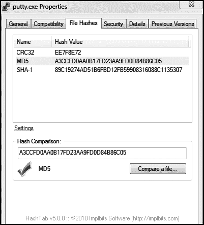

$ **ls -al /nsm/bro/extracted/http/http-item_192.168.2.108:53999-46.43.34.31:80_**

**resp_2.dat**

-rw-r--r-- 1 root root 483328u Apr 17 19:33 /nsm/bro/extracted/http/http-

item_192.168.2.108:53999-46.43.34.31:80_resp_2.dat

$ **file /nsm/bro/extracted/http/http-item_192.168.2.108:53999-46.43.34.31:80_**

**resp_2.dat**

/nsm/bro/extracted/http/http-item_192.168.2.108:53999-46.43.34.31:80_resp_2\.

dat: PE32 可执行文件（GUI）Intel 80386，适用于 MS Windowsv

$ **md5sum /nsm/bro/extracted/http/http-item_192.168.2.108:53999-46.43.34.31:80_**

**resp_2.dat**

a3ccfd0aa0b17fd23aa9fd0d84b86c05w /nsm/bro/extracted/http/http-

item_192.168.2.108:53999-46.43.34.31:80_resp_2.dat

*列表 12-10：检查从 HTTP 流量中提取的二进制文件*

这里，我们看到提取的文件大小为 483,328 字节 u，文件

类型为 PE32 可执行文件（GUI）Intel 80386，适用于 MS Windows v 和一个哈希值

(a3ccfd0aa0b17fd23aa9fd0d84b86c05 w) 与 Bro 匹配的值

在列表 12-9 中报告的结果。

为了确认哈希值与下载的二进制文件的值是否匹配

对于 Windows 系统，我们查看文件属性，如图 12-4 所示\。

我使用了 Implbits 的 HashTab（*http://www.implbits.com/hashtab.aspx*）来生成-

在属性对话框的文件哈希选项卡中生成了这些哈希值。

*图 12-4：putty .exe 的文件属性，显示*

*相同的 MD5 哈希值*

扩展 SO **271**

[www.it-ebooks.info](http://www.it-ebooks.info/)

***测试 Bro 从 FTP 流量中提取二进制文件***

与我们的 HTTP 测试一样，我们可以运行 Bro 对 FTP 示例进行分析，以查看

它创建的日志。列表 12-11 演示了运行 Bro 对 *putty-ftp.pcap* u 进行分析，并告诉 Bro 再次引用我们修改过的 *local.bro* v 文件。（注意，我在一个名为 *bro-ftp* 的目录中运行这些命令，以便将输出与 HTTP 测试结果分开。）

$ sudo bro -r putty-ftp.pcapu /opt/bro/share/bro/site/local.brov

警告：未定义任何 Site::local_nets。通常最好

定义你的本地网络。

警告：BPFConf 文件名中仍有模板值：/etc/nsm/{{hostname}}-

{{interface}}/bpf-bro.conf (/opt/bro/share/bro/securityonion/./bpfconf.bro,

line 99)

*列表 12-11：运行 Bro 对保存的 HTTP 流量进行分析*

我们现在可以看到 Bro 生成了哪些日志。首先，我们检查 con-

当前工作目录的内容，如列表 12-12 所示\。

$ **ls -al**

total 560

drwxrwxr-x 3 sov sov 4096 4 月 17 20:30 .

drwxr-xr-x 29 sov sov 4096 4 月 17 20:30 ..

-rw-r--r-- 1 root root 281 4 月 17 20:30 capture_loss.log

-rw-r--r-- 1 root root 1531 4 月 17 20:30 conn.log

-rw-r--r-- 1 root root 731 4 月 17 20:30 ftp.logu

-rw-r--r-- 1 root root 7888 4 月 17 20:30 loaded_scripts.log

-rw-r--r-- 1 root root 1128 4 月 17 20:30 notice_policy.log

-rw-r--r-- 1 root root 251 4 月 17 20:30 packet_filter.log

-rw-r--r-- 1 root root 525649 4 月 17 18:07 putty-ftp.pcap

-rw-r--r-- 1 root root 951 4 月 17 20:30 reporter.log

drwx------ 3 root root 4096 4 月 17 20:30 .state

*列表 12-12：运行 Bro 对保存的 FTP 流量进行分析时生成的日志*

让我们来看一下 *ftp.log* u。列表 12-13 显示了同时使用 cat 和 bro-cut 命令的结果。

$ **cat ftp.log | bro-cut -d -C**

#separator \x09

#set_separator ,

#empty_field (empty)

#unset_field -

#path ftp

#open 2013-04-17-20-30-56

#fields ts uid id.orig_h id.orig_p id.resp_h id.resp_p user password command arg mime_type mime_desc file_size reply_code reply_msg tags extraction_file

**272** 第十二章

[www.it-ebooks.info](http://www.it-ebooks.info/)

#types string string addr port addr port string string string string string string count count string table[string] file

2013-04-17T18:06:59+0000u 3JGazzdNGmev 192.168.2.108 54104 212.13.197.229

21 匿名用户 w chrome@example.comx RETR ftp://212.13.197.229/users/

sgtatham/putty-latest/x86/putty.exey 应用程序/x-dosexec MS-DOS 可执行文件，MZ 适用于 MS-DOSz 86 226 传输完成{ - /nsm/bro/extracted/ftp/ftp-file_192.168.2.108:54106-212.13.197.229:38177_1.dat|

#close 2013-04-17-20-30-56

*清单 12-13：Bro* ftp .log *用于 FTP 传输*

这一条日志记录追踪了一个单独的 FTP 会话，因为 Bro

分配了一个跟踪 ID v 给该会话。这里，我们看到

通过 Google Chrome 下载二进制文件。提供的用户名是

匿名用户 w，密码是 chrome@example.com x。我们看到

检索的文件，*putty-latest/x86/putty.exe* y，是 MS-DOS 可执行文件类型，MZ

MS-DOS z。我们还看到传输成功完成 { 和

表明 Bro 提取了它观察到的二进制文件：*/nsm/bro/extracted/ftp/*

*ftp-file_192.168.2.108:54106-212.13.197.229:38177_1.dat* |下载的。

***检查从 FTP 提取的二进制文件***

现在我们有了指示，表明 Bro 从 FTP 流量中提取了一个文件，

我们可以在磁盘上查看它。清单 12-14 显示了该分析的结果。

在这个例子中，我们只确认 MD5 哈希值与我们

如我们之前看到的。

$ **md5sum /nsm/bro/extracted/ftp/ftp-file_192.168.2.108:54106-212.13.197.229:38177_1.dat** a3ccfd0aa0b17fd23aa9fd0d84b86c05u /nsm/bro/extracted/ftp/ftp-file_192.168.2.108:54106-212.13.197.229:38177_1.dat

*清单 12-14：检查从 FTP 流量提取的二进制文件*

注意到 MD5 哈希值 u 与 HTTP 中列出的值匹配

示例，清单 12-10 和图 12-4\。

***提交哈希值和二进制文件到 VirusTotal***

现在我们既有二进制文件的哈希值，也有该二进制文件本身（已恢复）

从网络流量中恢复的文件），我们可以将其提交到 VirusTotal 进行分析。

而在图 12-1 中，我们仅提交了一个二进制文件的哈希值进行分析，

在这一节中，我们将提交哈希值，然后是二进制文件，以便进行比较

结果。在图 12-5 中，我们提交了哈希值。

图 12-6 显示 VirusTotal 知道这个哈希值的信息。

该分析的结果有些混合，两个杀毒引擎

（在检测率字段中）报告与此哈希值关联的文件为

恶意的！不过，我们知道这个文件是合法的，因为我们是从

从发布者的网站下载的。如果我们仍然怀疑，可以使用

使用 PuTTY 下载页面上发布的加密签名来验证

扩展 SO **273**

[www.it-ebooks.info](http://www.it-ebooks.info/)

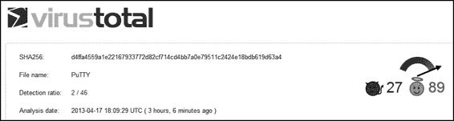

我们下载的文件就是网站上发布的文件，但这将是

只确认有人访问了私钥并发布了一个二进制文件

由该密钥签名。（在数字世界中，信任也是有限的。）

*图 12-5：提交* putty .exe *哈希值给 VirusTotal*

*图 12-6：VirusTotal 对提交的 MD5 哈希值的结果*

VirusTotal 发布了其他信息以及病毒扫描结果，

如运行 Mark Russinovich 的 Sigcheck 的输出（*http://technet*

*.microsoft.com/en-us/sysinternals/bb897441.aspx*），它检查确认

一个文件是否被数字签名，正如在列表 12-15 中所示。

Sigcheck

发布者................: Simon Tatham

产品..................: PuTTY 套件

内部名称............: PuTTY

版权................: Copyright (c) 1997-2011 Simon Tatham。

原始名称............: PuTTY

文件版本.............: Release 0.62

描述..............: SSH、Telnet 和 Rlogin 客户端

*列表 12-15：VirusTotal 报告 Sigcheck 结果。*

Sigcheck 的结果似乎确认我们提交的哈希值与

这是由之前的 VirusTotal 用户上传的 PuTTY 二进制文件。

我们还可以上传 Bro 为我们提取的二进制文件，如所示

图 12-7\。

**274** 第十二章

[www.it-ebooks.info](http://www.it-ebooks.info/)

*图 12-7：提交从 HTTP 流量中提取的二进制文件*

VirusTotal 已经知道这个二进制文件，它应该知道：它是 Bro 的二进制文件

提取出来，我们刚刚看到它的哈希值已经为 VirusTotal 所知。

这种通用的方法展示了如何扩展 Bro，以提取

来自 HTTP 和 FTP 流量的 Windows 二进制文件。然而，当前实例

Bro 正在运行，并且内存中有之前的配置文件。除非

如果我们重新启动 Bro，它不会知道将新的*local.bro*配置文件应用到运行中的配置。

***重启 Bro***

直到你重新启动 Bro，或者重启 SO 系统，Bro 将继续运行

使用原始*local.bro*脚本加载的情况下。为了利用 Bro 从网络流量中提取 Windows 可执行文件的能力，我们需要

Bro 重新读取其*local.bro*脚本。为了告诉 Bro 处理该脚本，使用 broctl 界面，如列表 12-16 所示。

$ **sudo broctl**u

欢迎来到 BroControl 1.1

输入"help"以获取帮助。

[BroControl] > **check**v

管理员一切正常。

代理一切正常。

sov-eth0-1 一切正常。

[BroControl] > **install**w

删除旧政策，在/nsm/bro/spool/installed-scripts-do-not-touch/site 中... 完成。

删除旧政策，在/nsm/bro/spool/installed-scripts-do-not-touch/auto 中... 完成。

创建政策目录... 完成。

安装站点政策... 完成。

生成 cluster-layout.bro... 完成。

生成 local-networks.bro... 完成。

扩展 SO **275**

[www.it-ebooks.info](http://www.it-ebooks.info/)

生成 broctl-config.bro... 完成。

更新节点... 完成。

[BroControl] > **restart**x

停止...

停止 sov-eth0-1 ...

停止代理...

停止管理员...

启动中...

启动管理员...

启动代理...

启动 sov-eth0-1 ...

。

[BroControl] > **exit**y

*列表 12-16：使用 broctl 重新配置 Bro*

在列表 12-16 中，broctl 是从启动的终端运行的

broctl 接口并接受命令。接下来，我们运行检查命令 v

用来确定 Bro 读取的配置文件是否格式正确。如果是的话，

Bro 报告状态为正常，我们将其安装并继续。接下来，我们重启 Bro x，

在看到组件重启后，我们退出 broctl 接口 y。

最后一步是使用 NSM 脚本确认 Bro 的状态

与 SO 一起使用，如清单 12-17 所示。 (你也可以使用相同的方法)

sudo broctl status 命令。)

$ **sudo nsm_sensor_ps-status --only-bro**

状态：Bro

名称 类型 主机 状态 Pid 同行 启动时间

manager manager 192.168.2.102 正在运行 19555 2 18 4 月 00:29:37

proxy proxy 192.168.2.102 正在运行 19603 2 18 4 月 00:29:40

sov-eth0-1 worker 192.168.2.102 正在运行 19647 2 18 4 月 00:29:42

状态：sov-eth0

*清单 12-17：使用 NSM 脚本确认 Bro 状态*

根据 nsm_sensor_ps-status --only-bro 命令的输出，

Bro 正常运行，并采用新配置。

为了测试实时配置，我们将下载另一个可执行文件并

观察 Bro 日志中的条目。清单 12-18 显示了测试命令

在配置为提取的生产 SO 传感器上启用新功能

Windows 可执行文件。

$ **wget http://www.etree.org/cgi-bin/counter.cgi/software/md5sum.exe**u

--2013-04-18 00:44:06-- http://www.etree.org/cgi-bin/counter.cgi/software/md5sum.exe 正在解析 www.etree.org (www.etree.org)… 152.19.134.46

正在连接到 www.etree.org (www.etree.org)|152.19.134.46|:80… 已连接。

已发送 HTTP 请求，等待响应…… 200 OK

长度：49152 (48K) [application/octet-stream]

保存到：`md5sum.exe'

**276** 第十二章

[www.it-ebooks.info](http://www.it-ebooks.info/)

100%[======================================>] 49,152 --.-K/s 在 0.1 秒内 2013-04-18 00:44:07 (398 KB/s) - `md5sum.exe' 已保存 [49152/49152]

$ **grep md5sum.exe /nsm/bro/logs/current/***v

/nsm/bro/logs/current/http_eth0.log:1366245846.879854 8AwBGe9EpX 192.168.2.102 55409

152.19.134.46 80 1 GET www.etree.org /cgi-bin/counter.cgi/software/md5sum。

exew - Wget/1.13.4 (linux-gnu) 0 49152 200 OK - - -

(empty) - - - application/x-dosexecx eb574b236133e60c989c6f472f07827by

/nsm/bro/extracted/http/http-item_192.168.2.102:55409-152.19.134.46:80_resp_1.datz

/nsm/bro/logs/current/notice.log:1366245847.087877 8AwBGe9EpX 192.168.2.102

55409 152.19.134.46 80 tcp HTTP::MD5 192.168.2.102

eb574b236133e60c989c6f472f07827b{ http://www.etree.org/cgi-bin/counter.cgi/software/md5sum.

exe| eb574b236133e60c989c6f472f07827b 192.168.2.102 152.19.134.46 80 -

sov-eth0-1 Notice::ACTION_LOG 6 3600.000000 F - - -

- - - - -

*清单 12-18：测试新的文件提取功能*

清单 12-18 显示了验证 Windows 可执行文件的两个命令

在生产传感器上提取。首先，我们下载一个 Windows 可执行文件

使用 wget 工具 u 调用 *md5sum.exe*。下载完成后，我们

使用 grep 在当前 Bro 日志中查找 md5sum 字符串的实例 v。

结果有两个：

• 第一个来自*http.log*，显示了文件 w 的下载，文件类型 x，

MD5 哈希 y 和提取的二进制文件路径 z。

• 第二个来自*notice.log*，重现了许多相同的元素

早期的示例，如 MD5 哈希{和二进制文件的 URL|。

这些日志的存在表明 Bro 正在从 HTTP 流量中提取 Windows

可执行文件，这要归功于我们的配置更改和

应用程序重启。

**使用 aPT1 情报**

2013 年 2 月，Mandiant 发布了一份关于中国军队单位的报告

通常称为高级持久威胁 1（APT1）。在中国，APT1 是

总参谋部第三部门第二局

解放军，也称为其军事单位掩护。

设计器，61398，该军队团队针对讲英语的公司和

偷窃商业机密、知识产权和其他敏感信息。

在报告中，Mandiant 发布了 3000 个 IOC（在第九章中讨论），

包括域名、IP 地址、X.509 加密证书等。

MD5 哈希值，用于 APT1 使用的恶意软件。Mandiant 还发布了

扩展 SO **277**

[www.it-ebooks.info](http://www.it-ebooks.info/)

入侵者与受害者的西方计算机交互，发送钓鱼邮件，建立命令和控制通道，并窃取数据。

尽管 Mandiant 以 OpenIOC 格式发布了情报（*http://www*）

*.openioc.org/*）格式，网络防御者并未立即清楚如何应对

NSM 分析师可以将这些指标应用到他们的网络中。在报告发布后的两天内，

报告发布后的几天，Seth Hall 来自 Bro 项目发布了一个

回答：一个新的 Bro 模块，称为 APT1，整合了 Mandiant 的 APT1

情报（*https://github.com/sethhall/bro-apt1/*）。使用 SO 的网络防御者在 NSM 商店中现在可以轻松搜索 APT1 指标

网络。

**概念验证 vS.生产**

Seth Hall 编写了 APT1 Bro 模块，作为概念验证，目的是

快速发布一些内容以造福社区。然而，SO

用户在使用此模块时应注意几个方面。

生产。（Seth 会首先提醒你这些问题，但我在此列出它们以便澄清）

在此列出它们以便澄清！

如写明，模块识别出 DNS 流量中 APT1 域名的使用，但

它无法检测 HTTP 头部中的 Host 元素中的 APT1 域名（如

主机：advanbusiness.com）或代理式 URI（例如*GET http://advanbusiness*）

*.com/some/file*)。此外，模块不查找涉及子域名的活动（如*subdomain.advanbusiness.com*）。

除了使用 APT1 Bro 模块中的功能外，你还可以

在其他流量中查找有趣的域名，如 SMTP 或其他内容。正如

截至目前，模块没有包含这些功能，但你可以使用

使用 Bro 网络编程语言编写脚本以满足这些需求。Seth

提醒用户 Bro 不断发展，他的模块可能会发生变化

因为 Bro 正在加入新特性。

***使用 APT1 模块***

到目前为止，我们已经探讨了 Bro 如何与 SO 配合使用，创建多种用途。

完整日志，我们已修改 *local.bro* 来启用 Windows

从 HTTP 和 FTP 流量中提取可执行文件。现在，我们将通过添加新功能来扩展 Bro。

一个新模块的配置。

Seth 的 APT1 模块由三个策略脚本组成：

***data.bro*** 这个脚本包含了 Mandiant 提供的域名、MD5 哈希值和 X.509 证书元素的列表，格式化为

供 Bro 使用。

***main.bro*** 这个脚本告诉 Bro 的通知框架监控是否与 *data.bro* 中的元素匹配。

***load__.bro*** 这个脚本告诉 Bro 加载 *data.bro* 和 *main.bro*。

**278** 第十二章

[www.it-ebooks.info](http://www.it-ebooks.info/)

该模块还包括一个名为 *README.rst* 的文件，里面包含有关如何安装脚本的说明，讨论生成的新通知

由 Bro 提供，并提供相关信息。

*data.bro* 中的 IOCs 按照 Listing 12-19 所示的格式进行排列。

umodule APT1;

vconst x509_serials_and_subjects: set[string, string] = {

["01", "C=US, ST=Some-State, O=www.virtuallythere.com, OU=new, CN=new"],

["0122", "C=US, ST=Some-State, O=Internet Widgits Pty Ltd, CN=IBM"],

*-- snip --*

};

wconst 域名：set[string] = {

"advanbusiness.com",

"aoldaily.com",

"aolon1ine.com",

"applesoftupdate.com",

*-- snip --*

};

xconst file_md5s: set[string] = {

"001dd76872d80801692ff942308c64e6",

"002325a0a67fded0381b5648d7fe9b8e",

"00dbb9e1c09dbdafb360f3163ba5a3de",

*-- snip --*

};

*Listing 12-19: 来自 APT1 的数据摘录 .bro*

*data.bro* 文件包含四个主要部分：

• 第 u 部分声明这是 APT1 模块。

• 第 v 部分包含 Bro 识别的 X509 加密证书详细信息

并被 APT1 使用。

• 第 w 部分包含与 APT1 活动相关的恶意域名列表。

• 第 x 部分列出了 APT1 使用的恶意软件的 MD5 哈希值。

如你所见，非常容易将 IOCs 添加到这个文件或它的副本中，以便

以检测不同的活动。*main.bro* 文件会在 Bro 的 *notice.log* 文件中生成警报数据，如 Listing 12-20 所示。

APT1::域名命中

APT1::证书命中

APT1::文件 _MD5_ 命中

*Listing 12-20: APT1 模块生成的警报数据*

我们将在实际示例中看到这些警报，当我们测试 APT1 时

但首先我们需要获取该模块并安装它。

扩展 SO **279**

[www.it-ebooks.info](http://www.it-ebooks.info/)

***安装 APT1 模块***

我们可以使用之前尝试过的技术来测试 APT1 模块，

启用从 HTTP 和 FTP 流量中提取二进制文件。Listing 12-21 显示了

这个过程正在进行中。

$ **sudo apt-get install git**u

-- *snip* --

$ **cd /opt/bro/share/bro/site/**

$ **sudo git clone git://github.com/sethhall/bro-apt1.git apt1**v

克隆到 'apt1'...

远程：统计对象：12，完成。

远程：压缩对象：100%（10/10），完成。

远程：总计 12（增量 2），重用 11（增量 1）

接收对象：100% (12/12)，32.82 KiB，完成。

解决差异：100% (2/2)，完成。

$ **ls**

apt1 local.bro.orig local-proxy.bro

local.bro local-manager.bro local-worker.bro

$ **cd apt1**

$ **ls**

data.bro __load__.bro main.bro README.rst

*列表 12-21：安装 Git 并获取 APT1 模块*

要获取 APT1 模块，首先安装 Git 版本控制软件—

获取软件包 u，并克隆 Seth Hall 的 APT 模块 v 的 Git 仓库。

一旦 APT1 模块被下载到 */opt/bro/share/* 中

*bro/site/* 目录，如果需要告知 Bro，可以通过在 *local.bro* 的底部添加以下行来实现：

@load apt1

修改了 *local.bro* 后，我们几乎准备好测试 APT1 模块了，但

我们还需要再执行一步。

***生成流量以测试 APT1 模块***

要测试 APT1 模块，我们在传感器上启动一个终端并告诉

Tcpdump 捕获流量。我们应用一个 BPF 来专注于来自和前往

涉及我们的测试系统 192.168.2.102 的端口 53。Tcpdump 会保存这些

它会看到一个名为 *port53.pcap* 的跟踪文件。

$ **sudo tcpdump -n -i eth0 -s 0 -w port53.pcap port 53 and host 192.168.2.102**

**280** 第十二章

[www.it-ebooks.info](http://www.it-ebooks.info/)

在第二个终端中，查询 APT1 中列出的一些域名

*data.bro* 策略脚本 *advanbusiness.com*，如列表 12-22 所示。

$ **host advanbusiness.com**u

advanbusiness.com 的地址是 50.63.202.91v

advanbusiness.com 的邮件由 0 smtp.secureserver.net 处理。

advanbusiness.com 的邮件由 10 mailstore1.secureserver.net 处理。

*列表 12-22：对* advanbusiness .com 执行 DNS 查询

接下来，我们使用 Linux 工具 host 查询 *advanbusiness.com* u，并且

看到结果是 IP 地址 50.63.202.91 v。

返回 Tcpdump，我们使用 ctrl-C 停止捕获并查看

结果，如列表 12-23 所示。

$ **tcpdump -n -r port53.pcap**

从文件 port53.pcap 读取，链路类型 EN10MB（以太网）

14:30:15.622379 IP 192.168.2.102.57097 > 172.16.2.1.53: 57373+ A? advanbusiness.com.u (35) 14:30:15.762833 IP 172.16.2.1.53 > 192.168.2.102.57097: 57373 1/0/0 A 50.63.202.91v (51) 14:30:15.765342 IP 192.168.2.102.58378 > 172.16.2.1.53: 42025+ AAAA? advanbusiness.com. (35) 14:30:15.870230 IP 172.16.2.1.53 > 192.168.2.102.58378: 42025 0/1/0 (103)

14:30:15.872373 IP 192.168.2.102.42336 > 172.16.2.1.53: 29779+ MX? advanbusiness.com. (35) 14:30:15.989506 IP 172.16.2.1.53 > 192.168.2.102.42336: 29779 2/0/2 MX smtp.secureserver.net.

0, MX mailstore1.secureserver.net. 10 (131)

*列表 12-23：针对* advanbusiness .com 的 DNS 查询

列表 12-23 显示了对 *advanbusiness.com* u 的查询，接着是

结果：IP 地址 50.63.202.91 v。借助这个流量，我们现在可以测试

APT1 模块。

***测试 APT1 模块***

要测试 APT1 模块，我们运行 Bro，分析我们刚刚捕获的跟踪文件。

列表 12-24 显示了结果。

$ sudo bro -r port53.pcapu /opt/bro/share/bro/site/local.brov

警告：未定义任何 Site::local_nets。通常建议您

定义您的本地网络。

警告：BPFConf 文件名中仍然有模板值：/etc/nsm/{{hostname}}-

{{interface}}/bpf-bro.conf (/opt/bro/share/bro/securityonion/./bpfconf.bro,

第 99 行)

*列表 12-24：运行 Bro 处理保存的 DNS 流量*

列表 12-24 显示了 Bro 读取网络追踪 u，而之前的

在命令行中指定*local.bro* v 文件会告诉 Bro 读取该文件

获取更多的配置信息。现在我们可以看到 Bro 创建了哪些日志。

已生成。

扩展 SO **281**

[www.it-ebooks.info](http://www.it-ebooks.info/)

首先，我们检查当前工作目录的内容，因为

如列表 12-25 所示。

$ **ls -al**

总计 52

drwxrwxr-x 3 soe soe 4096 4 月 18 14:52 .

drwxr-xr-x 33 soe soe 4096 4 月 18 14:52 ..

-rw-r--r-- 1 root root 278 4 月 18 14:52 capture_loss.log

-rw-r--r-- 1 root root 865 4 月 18 14:52 conn.log

-rw-r--r-- 1 root root 932 4 月 18 14:52 dns.log

-rw-r--r-- 1 root root 8020 4 月 18 14:52 loaded_scripts.log

-rw-r--r-- 1 root root 864 4 月 18 14:52 notice.logu

-rw-r--r-- 1 root root 1128 4 月 18 14:52 notice_policy.log

-rw-r--r-- 1 root root 251 4 月 18 14:52 packet_filter.log

-rw-rw-r-- 1 soe soe 762 4 月 18 14:52 port53.pcap

-rw-r--r-- 1 root root 951 4 月 18 14:52 reporter.log

drwx------ 3 root root 4096 4 月 18 14:52 .state

*列表 12-25：运行 Bro 处理保存的 HTTP 流量时创建的日志*

列表 12-25 显示了 Bro 处理网络追踪时创建的各种文件。

网络追踪。让我们查看一下*notice.log* u，看看 APT1 模块是否检测到了我们为报告中的恶意*advanbusiness.com* 做的 DNS 查询。

域名。列表 12-26 显示了输出。

$ **cat notice.log | bro-cut -C -d**

#separator \x09

#set_separator ,

#empty_field (空)

#unset_field -

#path notice

#open 2013-04-18-14-52-57

#fields ts uid id.orig_h id.orig_p id.resp_h id.resp_p proto note msg sub src dst p n peer_descr actions policy_items suppress_for dropped remote_location.country_code remote_location.region remote_

location.city remote_location.latitude remote_location.longitude metric_

index.host metric_index.str metric_index.network

#types string string addr port addr port enum enum string string addr addr port count string table[enum] table[count] interval bool string string string double double addr string subnet

2013-04-18T14:30:15+0000 IVCYGEfpRya 192.168.2.102 57097 172.16.2.1 53

udp APT1::Domain_Hitu 从 APT1 报告中看到的一个域名：advanbusiness.comv

- 192.168.2.102 172.16.2.1 53 - bro Notice::ACTION_LOG 6

3600.000000 F - - - - - - - -

#close 2013-04-18-14-52-57

*列表 12-26：Bro* notice .log *文件*的内容

**282** 第十二章

[www.it-ebooks.info](http://www.it-ebooks.info/)

列表 12-26 显示了 Bro 报告一个 APT::Domain_hit 警报 u，后面跟着看到的域名信息，*advanbusiness.com* v。我们的测试是

成功了，但这只是一个测试。要让 Bro 运行新的配置，

我们需要重新启动 Bro，正如列表 12-27 所示。

$ **sudo broctl install && sudo broctl restart**

移除 /nsm/bro/spool/installed-scripts-do-not-touch/site 中的旧政策 ... 完成。

移除 /nsm/bro/spool/installed-scripts-do-not-touch/auto 中的旧政策 ... 完成。

创建政策目录 ... 完成。

安装站点政策 ... 完成。

生成 cluster-layout.bro ... 完成。

生成 local-networks.bro ... 完成。

生成 broctl-config.bro ... 完成。

更新节点 ... 完成。

停止 ...

停止 soe-eth0-1 ...

停止代理 ...

停止管理器 ...

启动中 ...

启动管理器 ...

启动代理 ...

启动 soe-eth0-1 ...

*列表 12-27：从命令行重启 Bro*

记得使用 **sudo nsm_sensor_ps-status** 检查 Bro 的状态

**--only-bro** 命令也可以使用。

**报告恶意二进制文件的下载**

如你之前所学，Bro 可以计算 Windows 可执行文件的 MD5 哈希值。

通过 HTTP 下载的二进制文件。在本节中，我们将检查 SO 和 Bro

与第三方恶意软件哈希注册表集成，以便在分析人员发现时发出警告

用户通过 Team 提供的数据库下载恶意软件

Cymru 组织。

***使用 Team Cymru 恶意软件哈希注册表***

Team Cymru，正式名称为 *Team Cymru Research NFP*，自我描述为

作为“一个专门从事互联网安全研究的公司和 501(c)3 非营利组织”

致力于使互联网更安全” ( *http://www.team-cymru.*

*org/About/*)。我们可以使用他们免费的恶意软件哈希注册表 (MHR，位于 *http://*

*www.team-cymru.org/Services/MHR/*) 用于将 MD5 哈希与已知值进行匹配

恶意软件。

大多数分析人员通过 DNS 查询 MHR。列表 12-28 展示了如何使用

Linux dig 命令用于运行 DNS TXT 记录查询，查找恶意软件哈希值

与 MHR 对比。

扩展 SO **283**

[www.it-ebooks.info](http://www.it-ebooks.info/)

$ **dig +short 733a48a9cb49651d72fe824ca91e8d00.malware.hash.cymru.com TXT**u

"1277221946v 79w"

$ **date -d @1277221946**x

2010 年 6 月 22 日 15:52:26 UTC

$ **dig +short 1e39efe30b02fd96b10785b49e23913b.malware.hash.cymru.com TXT**z

$ **whois -h hash.cymru.com 1e39efe30b02fd96b10785b49e23913b**{

1e39efe30b02fd96b10785b49e23913b 1366297928 NO_DATA|

*列表 12-28：通过 TXT 和 whois 记录查询 MHR*

第一个示例展示了一个针对恶意软件的 DNS TXT 记录查询，使用了哈希值

733a48a9cb49651d72fe824ca91e8d00 u. （搜索 VirusTotal 查看它是什么！）这个

响应的第一部分显示了 MHR 上次看到该样本的日期 v.

响应的第二部分是一个粗略的杀毒检测指标，如

一个百分比 w。我们将时间戳从 Unix 时间戳转换为

使用日期命令 x 以人类可读的格式查看，并看到它是

2010 年 6 月 22 日 y.

第二个示例展示了查询 MHR 时发生的情况

它没有发送响应 z。提供的哈希值是 Firefox 的值

二进制文件。因为 MHR 没有关于此哈希的信息，我们切换到 MHR

WHOIS 查询功能 {. NO_DATA | 响应证明 MHR

不知道提供的哈希值。

Listing 12-29 中的示例显示了另一种使用 dig 的查询方式，但没有

请求 TXT 记录。

$ **dig +short 733a48a9cb49651d72fe824ca91e8d00.malware.hash.cymru.com**

127.0.0.2

*Listing 12-29：通过默认 A 记录查询 MHR*

我们查询 Listing 12-28 中的相同第一个哈希值，但我们让

默认情况下应该是 A 记录。

查询 A 记录要求 DNS 服务器返回该域名的 IP 地址。

请求的完全合格域名。相比之下，查询 PTR 记录

记录请求 DNS 服务器返回完全合格的域名，

请求的 IP 地址。查询 TXT 记录请求 DNS 服务器回复

包含与域名相关的任何文本记录。

我们的唯一结果是 IP 地址 127.0.0.2。这是 MHR 的方式，

响应匹配的 A 记录查询。如果我们想要更多信息—

如果要获取更多关于匹配的信息，我们需要运行 DNS 查询以获取 TXT 记录，如下所示

在 Listing 12-28 中提到的。

**284** 第十二章

[www.it-ebooks.info](http://www.it-ebooks.info/)

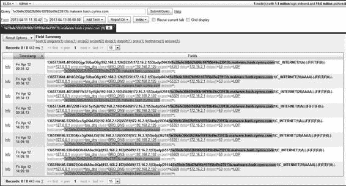

***MHR 和 SO：默认启用***

默认情况下，SO 上的 Bro 已配置与 MHR 配合工作，帮助检测

恶意下载。SO 依赖于 Bro 计算 Windows 可执行文件的 MD5 哈希值

通过 HTTP 下载的可执行文件，Bro 会自动提交

这些哈希值对应于 MHR。如果我们查询 Bro，可以看到这个活动的执行情况。

通过 ELSA 的日志，如图 12-8 所示。

*图 12-8：查询 ELSA 获取 MHR 查询结果*

在图 12-8 中，我们查询 ELSA 获取 1e39efe30b02fd96b10785b49e23913b

.malware.hash.cymru.com——这是之前提到的 Firefox 二进制文件的 MD5 哈希值。

示例（1e39efe30b02fd196b10785b49e23913b），加上域名 *malware.hash*

*.cymru.com*。图 12-8 显示了八个结果，所有结果都是配对的。配对中的第一个条目是查询 IPv4 的 A 记录，第二个条目是

查询 IPv6 的 AAAA 记录。因此，我们有四个独特的查询

这是特定的 MD5 哈希值。

我们可以使用两种方法来确定任何查询结果是否

返回的结果：

• 直接检查 ELSA 返回的结果。例如，结果

没有在 MHR 中显示恶意条目的结果看起来像是|1

|C_INTERNET|1|A|-|-|F|F|T|F|0|-|- 适用于 IPv4，并且 |1|C_INTERNET|28|AAAA|-

|-|F|F|T|F|0|-|- 适用于 IPv6。我们可以看到这些结果对于每个条目

如图 12-8 所示，表明在 MHR 中没有匹配项。

这告诉我们 MHR 认为下载具有 MD5

1e39efe30b02fd96b10785b49e23913b 是恶意的。

• 查询 ELSA 以获取 Malware_Hash_Registry_Match。这是事件的一部分，

由 Bro 在查询 MHR 并获得积极响应时返回。

在这种情况下，查询在 ELSA 中没有找到对应哈希的二进制记录。

1e39efe30b02fd96b10785b49e23913b。

扩展 SO **285**

[www.it-ebooks.info](http://www.it-ebooks.info/)

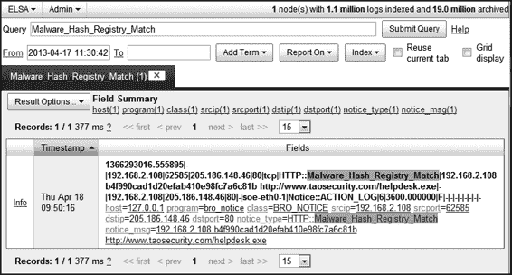

***MHR 和 SO 与恶意下载***

因为 SO 和 Bro 默认查询 MHR，在生产环境中，任何匹配项

恶意下载将在 ELSA 和底层 Bro 日志中出现。

例如，假设有一天你正在与 SO 一起工作，而你的

NSM 数据，你执行了一个查询，获取 Malware_Hash_Registry_Match。你得到的

如图 12-9 所示的结果。

*图 12-9：查询结果，针对 Malware_Hash_Registry_Match*

我已经将相同的日志条目以文本形式重现，在列表 12-30 中以便于阅读

参考。

1366293016.555895 - 192.168.2.108u 62585 205.186.148.46v 80 tcp HTTP::Malware_Hash_Registry_Matchw 192.168.2.108 b4f990cad1d20efab410e98fc7a6c81bx http://www.taosecurity.com/helpdesk.exey - 192.168.2.108 205.186.148.46

80- soe-eth0-1 Notice::ACTION_LOG 6 3600.000000 F

- - --- - - -

*列表 12-30：Malware_Hash_Registry_Match 的日志条目*

这个来自 Bro *notice.log* 文件的日志结果表明了一次计算机-

计算机的 IP 地址为 192.168.2.108，访问了 205.186.148.46，并且

触发了一个 HTTP::Malware_Hash_Registry_Match w 警报，针对 MD5 哈希值

b4f990cad1d20efab410e98fc7a6c81b 来自 *www.taosecurity.com* 和该

*helpdesk.exe* 文件。我们可以进一步了解这个连接，如果我们

查询 ELSA 以获取文件名 *helpdesk.exe*，如图 12-10 所示。

结果显示三条记录：

• 图 12-10 中的第一条记录是 Bro 告诉我们它计算了

计算出了 *helpdesk.exe* 二进制文件的 MD5 哈希值。

• 第二条记录与我们在 MD5 查找中看到的内容相同。

• 第三条记录显示 Bro 从 HTTP 中提取了该二进制文件

流量并将其保存为 */nsm/bro/extracted/http/http-item_192.168.2.108:*

*62585-205.186.148.46:80_resp_1.dat*。

**286** 第十二章

[www.it-ebooks.info](http://www.it-ebooks.info/)

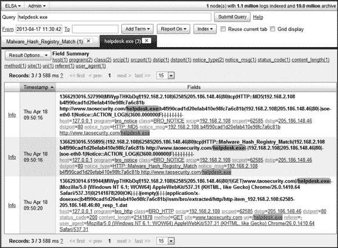

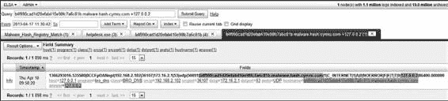

*图 12-10：查询 ELSA 获取* helpdesk .exe

***识别二进制文件***

我们知道 Bro 和 SO 根据一个

MD5 哈希值，我们知道找到了匹配项，因为 Bro 报告了一个

Malware_Hash_Registry_Match 事件。我们可以以不同的角度查看这个结果

通过查询 ELSA，使用前面展示的哈希值和域名方法

如图 12-8 所示。

我们稍微修改查询，通过在哈希值后添加 +127.0.0.2

和域名。加号（+）告诉 ELSA 查询加号后面的术语——

特别是 127.0.0.2，这是 MHR 返回的 IP 地址，当

Bro 查询它以获取恶意软件哈希值。（我们在列表 12-28 中看到过这个差异。）

图 12-11 显示了针对哈希值和

域名 b4f990cad1d20efab410e98fc7a6c81b.malware.hash.cymru.com。

*图 12-11：查询 ELSA 获取 b4f990cad1d20efab410e98fc7a6c81b.malware.hash.cymru .com +127.0.0.2*

扩展 SO **287**

[www.it-ebooks.info](http://www.it-ebooks.info/)

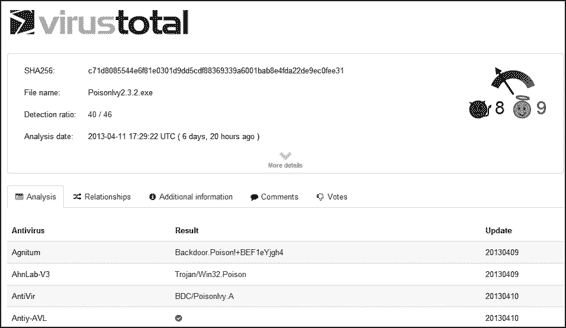

我们得到一个结果。127.0.0.2 的回复表明

MHR 识别了该哈希值的结果。

此时，我们可以采取几条不同的路径来识别二进制文件：

• 因为二进制文件存储在 */nsm/bro/extracted/http/http-item_*

*192.168.2.108:62585-205.186.148.46:80_resp_1.dat*，我们可以执行

手动分析。

• 我们可以将提取的二进制文件提交给像 VirusTotal 这样的第三方引擎。

• 我们可以将哈希提交到 VirusTotal，VirusTotal 返回结果

如图 12-12 所示\。

*图 12-12：提交哈希 b4f990cad1d20efab410e98fc7a6c81b 的 VirusTotal 结果* VirusTotal 将该恶意软件识别为 Poison Ivy 变种——一种流行的

这是一种远程访问木马（RAT），可以从多个网站获取。我们希望

用户通过此案例识别下载了该工具，仅用于测试目的

如果没有，那么是时候开始寻找出站命令复制的迹象了。

控制流量，如第 10 和第十一章所述。祝你好运！

**结论**

本章向你介绍了四种扩展并改进的方式

使用 SO 打包的函数。我们介绍了 Bro 如何创建 MD5

为可执行文件计算哈希，并展示了如何使用 VirusTotal。我们

配置了 Bro 以从网络流量中提取可执行二进制文件，并

演示了如何从 Mandiant 的 APT1 外部智能源进行集成

报告。我们还在 Bro 中生成了警报，以模拟可疑的 DNS 查找

用于 APT1 域的恶意软件。我们通过展示 SO 报告的结构结束了这一章，

并提取生产环境中恶意二进制文件的下载内容，我们

学到的恶意软件是 Poison Ivy RAT。

在下一章中，我们将查看进行

NSM：代理和校验和。

**288** 第十二章

[www.it-ebooks.info](http://www.it-ebooks.info/)

**13**

**代理和校验和**

本章，恰逢第十三章，探讨了

进行 NSM 的两个不幸特征

在真实网络上：代理和校验和。

*代理* 这个术语指的是网络基础设施的一部分

结构是一些公司用来观察、控制、

加速互联网使用。术语 *校验和*，

在本章的上下文中，指的是一种错误检测机制

由互联网协议（IP）提供的服务。本章描述了一些方法

以应对操作中每个特征所带来的问题

环境。

**代理**

Web 代理在企业环境中特别流行。一种类型

Web 代理的配置被调整为处理来自 Web 客户端的流量，目标是 Web

服务器。

[www.it-ebooks.info](http://www.it-ebooks.info/)

一些网络和安全管理员喜欢代理，因为它们

提供性能和安全的好处。使用代理时，用户有时

更好地访问内容，因为该内容第一次访问时被缓存

任何用户查看它后，随后的用户可以享受快速访问缓存

当用户必须通过代理发送流量时，管理员可以尝试

通过限制他们访问恶意网站来保护网络。

图 13-1 展示了 Web 代理在企业环境中可能如何工作

在企业环境中，这里有一个 Web 客户端，IP 地址为 192.168.2.108，访问 Web 服务器

位于 205.186.148.46。Web 客户端首先与代理建立会话，

被标记为 CONNECTION 1\。代理然后连接到 Web 服务器

代表客户端的会话。这一会话被标记为连接 2。所有流量

客户端与服务器之间的通信通过独立连接发生，像

这些。

连接 1

连接 2

位置 X

位置 Y

互联网

Web 客户端

代理

网络服务器

192.168.2.108

内部: 192.168.2.1

205.186.148.46

外部: 172.16.2.1

*图 13-1：示例 Web 代理设置*

***代理与可见性***

如图 13-1 所示，当部署代理时，一些可见性元素会丧失。

管理员部署代理。这样就不再看到真正的源 IP 地址。

为 Web 客户端提供的地址和 Web 服务器的真正目标 IP 地址

服务器时，我们还会看到代理的内部和外部 IP 地址。该

Web 客户端与代理服务器通信，代理服务器再与 Web 服务器通信。当

Web 服务器回复时，方向会反转。

例如，在位置 X 监视流量的 NSM 平台，

图 13-1 显示的流量源 IP 地址为 192.168.2.108，目标 IP 地址为

tion IP 地址 192.168.2.1。位置 Y 的 NSM 平台看到源 IP 地址为

源 IP 地址 172.16.2.1 和目标 IP 地址 205.186.148.46。

似乎没有一个单一位置可以让一个传感器同时看到两个

真实的源 IP 地址（192.168.2.108）和真实的目标 IP 地址

(205.186.148.46) 一次性连接。这对依赖该信息的分析人员来说是一个问题。

信息用于检测并响应入侵者。

如果没有足够的日志访问权限，NSM 分析人员实际上可能看到的 *更少*。

部署代理时，有时他们可以访问代理日志，但这些日志

可能不容易读取。有时分析人员可以捕获网络流量。

直接在代理本身上收集流量。例如，图 13-1 中的代理是运行在

配置 pfSense（*http://www.pfsense.org/*）防火墙与 Squid（*http://*）

*www.squid-cache.org/*) Web 代理。由于特定平台是 FreeBSD

在这个示例中，我们可以直接在服务器上收集流量。也就是说，

这在生产环境中通常不常见，但我们将在本例中利用这种情况。

本章将收集网络流量，以更好地理解情况。

**290** 第十三章

[www.it-ebooks.info](http://www.it-ebooks.info/)

假设你想排查代理可能出现的问题

如图 13-1 所示。你决定以 pcap 格式记录完整的流量内容，

Tcpdump。你从内部接口收集流量，并将其存储在一个跟踪文件中

叫做 *bej-int.pcap*。然后，你在与代理服务器分开的会话中收集流量。

外部接口的流量存储在 *bej-ext.pcap* 中。在嗅探每个接口时，你使用

Web 客户端在 192.168.2.108 上访问 *www.bejtlich.net* Web 服务器。

为了查看跟踪文件的内容，你手动生成

使用 Tcpflow 生成的转储（*https://github.com/simsong/tcpflow/*），如清单 13-1 所示。

$ **tcpflow -r bej-int.pcap**

$ **ls -al**

总计 56

drwxrwxr-x 3 ds61so ds61so 4096 Apr 23 20:14 .

drwxrwxr-x 4 ds61so ds61so 4096 Apr 23 20:05 ..

-rw-rw-r-- 1 ds61so ds61so 3605 Apr 21 20:53 172.016.002.001.03128-192.168.002.108.50949u

-rw-rw-r-- 1 ds61so ds61so 376 Apr 21 20:53 192.168.002.108.50949-172.016.002.001.03128v *Listing 13-1: 使用 Tcpflow 生成转录手动 y 在* bej-int .pcap *跟踪文件* 运行时，Tcpflow 会生成两个文件。第一个是从代理到客户端的流量 u。第二个是从客户端到

代理 v.

**客户端到代理的流量**

Listing 13-2 显示了客户端到代理的流量。

$ **cat 192.168.002.108.50949-172.016.002.001.03128**

GET http://www.bejtlich.net/u HTTP/1.1

Host: www.bejtlich.net

User-Agent: Mozilla/5.0 (X11; Ubuntu; Linux x86_64; rv:20.0) Gecko/20100101 Firefox/20.0

Accept: text/html,application/xhtml+xml,application/xml;q=0.9,*/*;q=0.8

Accept-Language: en-US,en;q=0.5

Accept-Encoding: gzip, deflate

DNT: 1

Referer: http://www.taosecurity.com/training.html

Connection: keep-alive

*Listing 13-2: 客户端到代理的流量*

在位置 X，请注意，GET 请求 *http://www.bejtlich.net/* u 与正常的 GET 请求稍有不同。未经过代理的 Web 流量将会是

GET 请求到 / 目录，而不是整个 URL，类似于 GET /。

Listing 13-3 显示了来自代理的响应。

代理和校验和 **291**

[www.it-ebooks.info](http://www.it-ebooks.info/)

$ **cat 172.016.002.001.03128-192.168.002.108.50949**

HTTP/1.0 200 OK

Date: Sun, 21 Apr 2013 20:53:38 GMT

Server: Apache/2

Last-Modified: Wed, 02 Jan 2013 15:49:44 GMT

ETag: "2e800ed-c713-4d25031f1f600"

Accept-Ranges: bytes

Content-Length: 3195

Content-Type: text/html; charset=UTF-8

X-Cache: MISS from localhostu

X-Cache-Lookup: MISS from localhost:3128v

Via: 1.1 localhost:3128 (squid/2.7.STABLE9)w

Connection: keep-alive

Proxy-Connection: keep-alivex

y<!DOCTYPE html PUBLIC "-//W3C//DTD XHTML 1.0 Strict//EN" "http://www.w3.org/TR/xhtml1/DTD/

xhtml1-strict.dtd">

<html xml:lang="en">

<head>

<meta http-equiv="content-type" content="text/html; charset=iso-8859-1" />

<meta name="Richard Bejtlich" content="TaoSecurity 创始人 Richard Bejtlich 的主页" />

<meta name="keywords" content="bejtlich,taosecurity,network,security" />

*-- snip --*

*Listing 13-3: 代理到客户端的流量，如位置 X 所见*

Listing 13-3 包含四个头部，表示代理在其中起作用。

u 和 v 中的头部显示代理没有本地缓存。

请求内容的副本。w 和 x 中的头部报告了代理连接的性质。

代理连接的最后部分，位于 y，显示了响应的开始。

托管在 205.186.148.46 的网页\。

**代理到 Web 服务器的流量**

现在让我们使用 Tcpflow 来查看从代理到客户端的流量。

代理到 Web 服务器，如位置 Y 所见。Listing 13-4 显示了如何生成

将转录文件与 trace 文件 *bej-ext.pcap* 进行比对，后者是在面向 Web 服务器的代理接口上捕获的。

$ **tcpflow -r bej-ext.pcap**

$ **ls -al**

total 20

drwxrwxr-x 2 ds61so ds61so 4096 Apr 23 20:33 .

drwxrwxr-x 3 ds61so ds61so 4096 Apr 23 20:32 ..

-rw-rw-r-- 1 ds61so ds61so 461 Apr 21 20:53 192.168.001.002.02770-205.186.148.046.00080u

-rw-rw-r-- 1 ds61so ds61so 3453 Apr 21 20:53 205.186.148.046.00080-192.168.001.002.02770v *列表 13-4：使用 Tcpflow 生成转录手册中的 bej-ext .pcap *跟踪文件* **292** 第 13 章

[www.it-ebooks.info](http://www.it-ebooks.info/)

再次，Tcpflow 生成了两个文件：首先是从代理到

服务器 u 和从服务器到代理的流量 v。让我们来看看流量

从代理到服务器的流量，首先如列表 13-5 所示\。

$ **cat 192.168.001.002.02770-205.186.148.046.00080**

GET /u HTTP/1.0

Host: www.bejtlich.net

User-Agent: Mozilla/5.0 (X11; Ubuntu; Linux x86_64; rv:20.0) Gecko/20100101 Firefox/20.0

Accept: text/html,application/xhtml+xml,application/xml;q=0.9,*/*;q=0.8

Accept-Language: en-US,en;q=0.5

Accept-Encoding: gzip, deflate

DNT: 1

Referer: http://www.taosecurity.com/training.html

Via: 1.1 localhost:3128 (squid/2.7.STABLE9)v

X-Forwarded-For: 192.168.2.108w

Cache-Control: max-age=259200

Connection: keep-alive

*列表 13-5：在位置 Y 看到的从代理到服务器的流量*

列表 13-5 包含几个有趣的特性：

• 通过 GET / 请求 u，代理访问的资源类似于常见的

书中其他地方看到的恶意网页流量。然而，它与

如列表 13-2 所示的代理请求\。

• 代理包括一个 Via 声明 v，表明涉及了一个

Squid 代理。

• 代理暴露了客户端的真实源 IP 地址

在 X-Forwarded-For 声明 w 中的网页请求。

**注**

*一些安全分析师担心这些“特性”，特别是 X-Forwarded-For* *声明，会允许操作恶意网站的入侵者看到这些头信息，并* *了解公司的内部网络是如何配置的。安全团队必须平衡* *他们获得的可见性与可能泄露的敏感信息之间的风险。*

列表 13-6 显示了来自服务器的响应。

$ **cat 205.186.148.046.00080-192.168.001.002.02770**

HTTP/1.1 200 OK

Date: Sun, 21 Apr 2013 20:53:38 GMT

Server: Apache/2

Last-Modified: Wed, 02 Jan 2013 15:49:44 GMT

ETag: "2e800ed-c713-4d25031f1f600"

Accept-Ranges: bytes

Content-Length: 3195

Connection: close

Content-Type: text/html; charset=UTF-8

代理和校验和 **293**

[www.it-ebooks.info](http://www.it-ebooks.info/)

<!DOCTYPE html PUBLIC "-//W3C//DTD XHTML 1.0 Strict//EN" "http://www.w3.org/TR/xhtml1/DTD/

xhtml1-strict.dtd">

<html xml:lang="en">

<head>

<meta http-equiv="content-type" content="text/html; charset=iso-8859-1" />

<meta name="Richard Bejtlich" content="TaoSecurity 创始人 Richard Bejtlich 的主页" />

<meta name="keywords" content="bejtlich,taosecurity,network,security" />

*-- 截断 --*

*列表 13-6：在位置 Y 看到的从服务器到代理的流量*

就列表 13-6 中的网页服务器而言，代理是 sys-

发起请求的系统。它返回的内容没有特别之处。

（请注意，在 Listing 13-3 中如何比较二者，特别是要关注

代理添加的头部信息。）

***处理生产网络中的代理***

CIRTs 在处理生产网络中的代理时有四种选择：

1. 尝试获取由代理生成的日志，以便查看流量。

从代理的角度来看。

2. 使用第二章中描述的技术部署多个传感器。

这方面，代理就像 NAT 问题——

将传感器放置在需要的位置，以便查看真实的源和目的。

国家 IP 地址。

3. 更广泛地利用生成的日志中保存的信息。

由支持代理的网络安全监控（NSM）软件处理。如 Listings 13-2 中的转录所示，

在 13-3 和 13-5 中，关于代理使用的信息可以供审查。

4. 使用能够启用特殊功能的软件来跟踪 X-Forwarded-For

提取客户端 IP 地址并报告警报数据时，需要适当的可见性。

（例如，请参见 Snort 中的 enable_xff 配置选项。）

本章的下一部分将采取第三种方法。我们将使用

使用 Bro 检查这些示例流量，看看它是否能生成有用的

生成有助于我们处理代理的信息。在处理我们的

代理问题，但是我们需要稍微绕道进入代理的世界。

IP 校验和。

**校验和**

IP 头包含一个校验和作为错误检测机制。网络

设备在处理数据包时会计算并插入校验和。当

下游设备接收到 IP 数据包后，会计算该数据包的校验和，

基于 IP 头的内容生成该数据包。为了我们的目的，

计算时，方程将 IP 校验和字段本身设为零。如果计算出的校验和

如果计算出的校验和与 IP 数据包中的校验和不匹配，设备

可能会丢弃该数据包。设备检测到错误并通过

丢弃 IP 数据包。

**294** 第十三章

[www.it-ebooks.info](http://www.it-ebooks.info/)

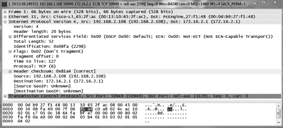

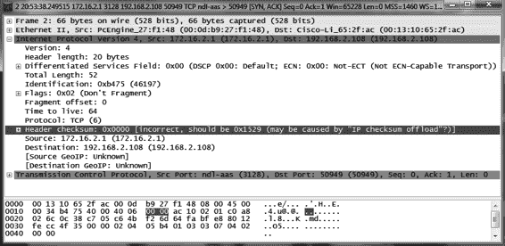

***一个良好的校验和***

图 13-2 显示了一个与数据包内容匹配的正确校验和。

*图 13-2：TCP 数据包的正确 IP 校验和 0x81a4*

IP 校验和是 0x81a4（0x 表示该值以十六进制表示）。

十进制）。Wireshark 在校验和值后附加了词汇[正确]。

显示它计算了一个校验和，并发现它与所期望的值一致

数据包中报告的内容。（请注意，这是一个 TCP 段，但我们关注的是

这里只涉及 IP 校验和。）

***一个错误的校验和***

图 13-3 显示了一个不正确的校验和，无法与数据包内容匹配。

*图 13-3：TCP 数据包中错误的 IP 校验和 0x0000*

在这里，我们看到 IP 校验和是 0x0000。Wireshark 不喜欢

该值。它通过在 IP 头条目上方显示红条来报告问题，且

词汇[不正确，应该是 0x1529（可能由“IP 校验和卸载”引起？）]。

Wireshark 显示它计算的校验和与值不匹配

在包中报告的。（这也是一个 TCP 段。）

代理与校验和 **295**

[www.it-ebooks.info](http://www.it-ebooks.info/)

***使用 Tshark 标识错误和正确的校验和***

Tshark 提供了几种有用的方法来快速查看校验和。我们将使用

我们收集的流量中，in “代理”第 289 页 是我们的示例数据。我们应该是在进行性能故障排除，预计会依赖

这些跟踪数据来回答我们的问题。首先，查看录制的跟踪文件

如列表 13-7 所示，位于位置 X。

$ **tshark -n -r bej-int.pcap -T fields -E separator=/t -e ip.src -e tcp.srcport**

**-e ip.dst -e tcp.dstport -e ip.checksum**

源 IP SrcPort 目标 IP DstPort IP 校验和

192.168.2.108 50949 172.16.2.1 3128 0x81a4

172.16.2.1 3128 192.168.2.108 50949 0x0000

192.168.2.108 50949 172.16.2.1 3128 0x81af

192.168.2.108 50949 172.16.2.1 3128 0x8036

172.16.2.1 3128 192.168.2.108 50949 0x0000

172.16.2.1 3128 192.168.2.108 50949 0x0000

192.168.2.108 50949 172.16.2.1 3128 0x81ad

172.16.2.1 3128 192.168.2.108 50949 0x0000

192.168.2.108 50949 172.16.2.1 3128 0x81a5

172.16.2.1 3128 192.168.2.108 50949 0x0000

172.16.2.1 3128 192.168.2.108 50949 0x0000

192.168.2.108 50949 172.16.2.1 3128 0x81a4

*列表 13-7：bej-int .pcap 跟踪文件的自定义 Tshark 输出*

列表 13-7 调用了几个新选项，仅显示我们想要的信息

这正是我们关心的。我们使用了 -T fields 和 -E separator=/t 选项来告诉

Tshark 我们希望显示包的特定部分，并且希望

使用 -e 选项，我们告诉

Tshark 仅显示我们需要的包的部分内容。（我在后面添加了标题）

命令行使你更容易识别字段。)

看最后一列，似乎很奇怪的是每个包从

172.16.2.1 的校验和是 0x0000。当我们看到相同的情况时

在 Wireshark 中，该工具报告了一个校验和错误。

我们可以再次调用 Tshark 来告诉我们哪些包的校验和计算错误

如列表 13-8 所示，校验和

$ **tshark -n -r bej-int.pcap -T fields -E separator=/t -e ip.src -e tcp.srcport**

**-e ip.dst -e tcp.dstport -e ip.proto -e ip.checksum -R "ip.checksum_bad==1"**

172.16.2.1 3128 192.168.2.108 50949 6 0x0000

172.16.2.1 3128 192.168.2.108 50949 6 0x0000

172.16.2.1 3128 192.168.2.108 50949 6 0x0000

172.16.2.1 3128 192.168.2.108 50949 6 0x0000

172.16.2.1 3128 192.168.2.108 50949 6 0x0000

172.16.2.1 3128 192.168.2.108 50949 6 0x0000

*列表 13-8：显示只含有错误校验和的 Tshark 输出样本*

**296** 第十三章

[www.it-ebooks.info](http://www.it-ebooks.info/)

在列表 13-8 中，我们添加了显示过滤器 **-R "ip.checksum_bad==1"**。这告诉 Tshark 只显示那些校验和不匹配的包

Tshark 认为它们应该是这样的。如果你只想查看检查合格的包

校验和，试试列表 13-9 中显示的命令。

$ **tshark -n -r bej-int.pcap -T fields -E separator=/t -e ip.src -e tcp.srcport**

**-e ip.dst -e tcp.dstport -e ip.proto -e ip.checksum -R "ip.checksum_good==1"**

192.168.2.108 50949 172.16.2.1 3128 6 0x81a4

192.168.2.108 50949 172.16.2.1 3128 6 0x81af

192.168.2.108 50949 172.16.2.1 3128 6 0x8036

192.168.2.108 50949 172.16.2.1 3128 6 0x81ad

192.168.2.108 50949 172.16.2.1 3128 6 0x81a5

192.168.2.108 50949 172.16.2.1 3128 6 0x81a4

*示例 13-9：仅显示有效校验和的 Tshark 输出*

在示例 13-9 中，我们添加了显示过滤器 -R "ip.checksum_good==1"。这

告诉 Tshark 仅显示那些校验和匹配 Tshark 预期值的数据包

认为它们应该如此。你可以得到与示例 13-8 相同的结果

使用显示过滤器 -R "ip.checksum_good==0" 并获得相同的结果

示例 13-9 使用显示过滤器 -R "ip.checksum_bad==0"。

在调查为什么我们会得到这些错误的校验和之前，让我们看看

是否也出现在*bej-ext.pcap*中。如同我们在示例 13-7 中所做的，我们可以使用 Tshark 显示追踪文件的关键元素。示例 13-10 提供了

语法和输出。

$ **tshark -n -r ../bej-ext.pcap -T fields -E separator=/t -e ip.src -e tcp.**

**srcport -e ip.dst -e tcp.dstport -e ip.checksum**

192.168.1.2 2770 205.186.148.46 80 0x0000

205.186.148.46 80 192.168.1.2 2770 0x5b28

192.168.1.2 2770 205.186.148.46 80 0x0000

192.168.1.2 2770 205.186.148.46 80 0x0000

205.186.148.46 80 192.168.1.2 2770 0x9597

205.186.148.46 80 192.168.1.2 2770 0x8fee

192.168.1.2 2770 205.186.148.46 80 0x0000

205.186.148.46 80 192.168.1.2 2770 0x8fed

192.168.1.2 2770 205.186.148.46 80 0x0000

205.186.148.46 80 192.168.1.2 2770 0x9367

192.168.1.2 2770 205.186.148.46 80 0x0000

192.168.1.2 2770 205.186.148.46 80 0x0000

192.168.1.2 2770 205.186.148.46 80 0x0000

205.186.148.46 80 192.168.1.2 2770 0x9593

*示例 13-10：针对 bej-ext.pcap 追踪文件的自定义 Tshark 输出*

在示例 13-10 中，代理是 192.168.1.2，服务器是 205.186.148.46，

提供 Web 服务的端口为 80 TCP。再次，我们看到可疑的 IP 校验和

（0x0000）表示从代理到 Web 服务器的所有数据包。与*bej-int.pcap*一样，生成 IP 流量且校验和错误的系统是代理。为什么？

代理和校验和 **297**

[www.it-ebooks.info](http://www.it-ebooks.info/)

***校验和错误如何发生***

IP 校验和偶尔因错误而未能匹配预期值

这些错误通过互联网传输时极为罕见，但

除非涉及到实际的网络问题，否则为什么这么多校验和

在示例 13-7 和 13-10 中出现失败，为什么这些失败如此一致？

Wireshark 在图 13-3 中报告的错误，[不正确，应为

0x1529（可能是由于“IP 校验和卸载”？）]，可以帮助我们回答这些问题。

传统上，操作系统和网络协议栈负责

用于计算 IP 校验和，但现代网络驱动程序和一些网卡

假设这个负担。这一过程称为*卸载*，它使网络堆栈能够快速发送流量。在

驱动程序，或者更好的是，通过专用硬件来快速计算校验和。

像列表 13-7 和 13-10 中的频繁 IP 校验和错误将

干扰你进行 NSM 的能力。带有坏校验和的跟踪文件会

通常是因为在卸载了网络流量捕获的平台上捕获数据包

将校验和过程交给驱动程序或硬件。网络看到的包

安全工具有一个 0x0000 或空的校验和，但“真实”的包已发送

在传输链路上有一个真实的校验和，它是由网络

驱动程序或硬件。（当 SO 配置网络接口时，设置

脚本禁用驱动程序和硬件的校验和卸载，试图

避免这些问题。）

在我们的场景中，代理依赖于校验和卸载来加速

这会影响网络流量的传输。不幸的是，平台上的软件

代理在所有传出的包上设置 0x0000 的 IP 校验和。发送之前，数据包

一旦数据包发送到链路上，驱动程序或 NIC 硬件就会计算并插入

拥有正确的校验和。来自其他设备的包有正确的

校验和。

***Bro 和坏的校验和***

现在我们已经查看了好和坏的 IP 校验和，让我们研究一下为什么

它们很重要。一些网络安全工具假设带有坏 IP

校验和将永远不会被接收端处理。网络

网络安全工具会丢弃该包。不幸的是，这些坏的校验和

可能仅仅是由卸载引起的。

Bro 会忽略带有坏 IP 校验和的流量。例如，注意它是如何

处理 *bej-int.pcap* 跟踪文件，如列表 13-11 所示\。

$ **sudo bro -r bej-int.pcap /opt/bro/share/bro/site/local.bro**

警告：没有定义 Site::local_nets。通常，定义本地网络是个好主意。

警告：BPFConf 文件名中仍有模板值：/etc/nsm/{{hostname}}-{{interface}}/bpf-bro.conf (/opt/bro/share/bro/securityonion/./bpfconf.bro，第 99 行)

警告：BPFConf 文件名中仍有模板值：/etc/nsm/ds61so-{{interface}}/bpf-bro。

conf (/opt/bro/share/bro/securityonion/./bpfconf.bro，第 99 行)

*列表 13-11: Bro 读取 *bej-int.pcap* 跟踪文件。*

**298** 第十三章

[www.it-ebooks.info](http://www.it-ebooks.info/)

默认情况下没有什么奇怪的东西，但看看 *weird.log*，如列表 13-12 所示\。

$ **cat weird.log**

#separator \x09

#set_separator ,

#empty_field (空)

#unset_field -

#path weird

#open 2013-04-23-19-40-10

#fields ts uid id.orig_h id.orig_p id.resp_h id.resp_p name addl notice peer

#types time string addr port addr port string string bool string 1366577618.249515 - - - - - bad_IP_checksum - F

bro

1366577618.251250 rhdNNjfMGkc 192.168.2.108 50949 172.16.2.1 3128

upossible_split_routing - F bro

1366577618.251867 rhdNNjfMGkc 192.168.2.108 50949 172.16.2.1 3128

vdata_before_established - F bro

#close 2013-04-23-19-40-10

*列表 13-12: Bro* weird.log *文件*

第一条记录报告可能的分割路由 u，因为 Bro 只看到了

一半的流量，即从 192.168.2.108 到 172.16.2.1 的数据包。这些数据包

列表 13-9 中的数据包具有良好的 IP 校验和。第二条记录报告

data_before_established v，因为 Bro 没有看到完整的 TCP 三次握手

握手。当 Bro 错过三次握手时，它会感到困惑，

在会话尚未完全建立时看到数据被传输。

Bro 的 *http.log* 文件也很奇怪，如列表 13-13 所示\。

$ **cat http.log**

#separator \x09

#set_separator ,

#empty_field (空)

#unset_field -

#path http

#open 2013-04-23-19-40-10

#fields ts uid id.orig_h id.orig_p id.resp_h id.resp_p trans_

depth method host uri referrer user_agent request_body_len

response_body_len status_code status_msg info_code info_msg filename tags username password proxied mime_type md5 extraction_file

#types time string addr port addr port count string string string string string count count count string count string string table[enum] string string table[string] string string file

代理和校验和 **299**

[www.it-ebooks.info](http://www.it-ebooks.info/)

1366577618.251867 rhdNNjfMGkc 192.168.2.108 50949 172.16.2.1 3128 1

GETu www.bejtlich.net http://www.bejtlich.net/ http://www.taosecurity.

com/training.html Mozilla/5.0 (X11; Ubuntu; Linux x86_64; rv:20.0) Gecko/20100101

Firefox/20.0 0 0 - - - - - (空) - - -

- - -

#close 2013-04-23-19-40-10

*列表 13-13：Bro* http .log *文件*

我们看到这里有一个 GET 请求 u，但没有回复的迹象。

***设置 Bro 忽略坏的校验和***

我们可以告诉 Bro 关闭其校验和验证，并处理所有流量

使用 -C 开关，如列表 13-14 所示\。

$ **sudo bro -r bej-int.pcap -C /opt/bro/share/bro/site/local.bro**

警告：没有定义 Site::local_nets。通常建议定义你的本地网络。

警告：模板值仍然存在于 BPFConf 文件名中：/etc/nsm/{{hostname}}-{{interface}}/bpf-bro.conf (/opt/bro/share/bro/securityonion/./bpfconf.bro，第 99 行)

警告：1366577618.694909 模板值仍然存在于 BPFConf 文件名中：/etc/nsm/ds61so-

{{interface}}/bpf-bro.conf (/opt/bro/share/bro/securityonion/./bpfconf.bro，第 99 行)

*列表 13-14：Bro 读取跟踪文件并忽略校验和。*

现在没有 *weird.log* 文件。如果我们查看 *http.log*，我们会看到它正是我们所期待的。列表 13-15 显示了结果。

$ **cat http.log**

#separator \x09

#set_separator ,

#empty_field (空)

#unset_field -

#path http

#open 2013-04-23-20-06-19

#fields ts uid id.orig_h id.orig_p id.resp_h id.resp_p trans_

depth method host uri referrer user_agent request_body_len

response_body_len status_code status_msg info_code info_msg filename tags username password proxied mime_type md5 extraction_file

#types time string addr port addr port count string string string string string count count count string count string string table[enum] string string table[string] string string file

**300** 第十三章

[www.it-ebooks.info](http://www.it-ebooks.info/)

1366577618.251867 aqjpeHaXm7f 192.168.2.108 50949 172.16.2.1 3128 1

GETu www.bejtlich.net http://www.bejtlich.net/v http://www.taosecurity.

com/training.html Mozilla/5.0 (X11; Ubuntu; Linux x86_64; rv:20.0) Gecko/20100101

Firefox/20.0 0 3195 200 OKw - - - (empty) - -

- text/htmlx - -

#close 2013-04-23-20-06-19

*列表 13-15: Bro* http.log *文件用于* bej-int .pcap *禁用校验和验证* 现在我们不仅看到 GET 请求 u 访问*http://www.bejtlich.net/* v，但

也是服务器 200 OK 回复的记录 w，表示页面

返回的是*text/html* x。你可以进行类似的分析，涉及

Bro 处理*bej-ext.pcap*的方式可以查看它在处理并忽略

校验和检查。列表 13-16 展示了当 Bro 处理*http.log*文件时的结果

读取*bej-ext.pcap*跟踪文件，禁用校验和处理。

$ **cat http.log**

#separator \x09

#set_separator ,

#empty_field (empty)

#unset_field -

#path http

#open 2013-04-24-00-36-03

#fields ts uid id.orig_h id.orig_p id.resp_h id.resp_p trans_

depth method host uri referrer user_agent request_body_len

response_body_len status_code status_msg info_code info_msg filename tags username password proxied mime_type md5 extraction_file

#types time string addr port addr port count string string string string string count count count string count string string table[enum] string string table[string] string string file

1366577618.269074 ua3JI6YJIxh 192.168.1.2 2770 205.186.148.46 80

1 GET www.bejtlich.net /u http://www.taosecurity.com/training.html Mozilla/5.0 (X11; Ubuntu; Linux x86_64; rv:20.0) Gecko/20100101 Firefox/20.0 0 3195

200 OKv - - - (empty) - - wVIA -> 1.1 localhost:3128

(squid/2.7.STABLE9)，X-FORWARDED-FOR -> 192.168.2.108x text/html - -

#close 2013-04-24-00-36-04

*列表 13-16: Bro* http.log *文件用于* bej-ext .pcap *禁用校验和验证* 在列表 13-16 中，有趣的字段是 GET 请求/u，的

服务器返回的 200 OK 回复 v，Via 语句 w 揭示了存在

Squid 代理的记录，以及 X-Forwarded-For 字段 x 显示真实的源

Web 客户端的 IP 地址。仅通过访问此类日志，你

可以使用 X-Forwarded-For 字段来识别真实的源 IP 地址

如果你只看到位置 Y 的活动，并且需要知道哪个客户端

浏览器正在访问相关的 Web 服务器。

代理和校验和 **301**

[www.it-ebooks.info](http://www.it-ebooks.info/)

校验和故事的寓意是这样的：如果你必须从一个使用校验和卸载传输流量的系统中收集流量，确保你的工具

知道如何处理这种情况。记住，你可以告诉 Bro 忽略

使用-C 开关处理坏校验和。请参阅 SO 邮件列表和 Wiki 或

其他工具的手册页中有关于等效功能的详细信息。Snort，对于

例如，提供了以下选项来处理校验和处理：

-k <模式> 校验和模式（all, noip, notcp, noudp, noicmp, none）

现在你知道如何处理校验和卸载特性了

在这个运行 Squid 代理的 pfSense 盒子上收集流量的特点，你

可以使用这里收集的数据进行故障排除。没有考虑到

考虑到校验和问题，你可能已经错误地解释了流量

直接处理并得出了有关网络性能的奇怪结论。

**结论**

本章介绍了两个可能让分析师感到困扰的网络特性

列表：代理和校验和。代理存在问题，因为它们引入了另一个中间设备，增加了网络的复杂性。

它们引入了另一个中间设备，增加了网络的复杂性。

像 NAT 一样，代理会隐藏真实的源和目标 IP 地址。

尽管本章只展示了一个代理在工作，但一些组织

链接多个代理！这样的多代理场景使得所谓的

NSM 和代理的圣杯——代理日志——无法获得。当多个

代理涉及时，没有单一日志可以显示分析师需要查看的所有活动。

如果代理日志可用，它们将成为有用的补充

应用程序如 ELSA 收集的数据。

我们还讨论了校验和和因卸载而导致的异常结果。

这个功能旨在加速网络连接，但也暴露了一个缺点：零化

当由流量捕获工具报告校验和时。虽然这更容易

在解决这个挑战时，工程师不要惊讶于一位热心的分析师

提供了一个包含对话的一方或双方的跟踪文件，其中包含 0x0000

对于 IP 校验和。在本章的帮助下，你应该能够理解

发生的原因以及如何处理这个问题。

**302** 第十三章

[www.it-ebooks.info](http://www.it-ebooks.info/)

**结论**

我写这本书是为了帮助读者开始一个网络

在网络安全监控操作中

他们的组织。我使用了开源

SO 套件展示如何在

快速且具有成本效益的方式。最后这一部分

本书展示了 NSM 的其他几个选项

相关操作。我的目标是展示 NSM 如何应用于其他领域

数字防御以及我认为 NSM 将如何适应日益复杂的

信息处理需求。

首先，我讨论了云计算如何影响 NSM。云计算呈现出

挑战和机遇，意识到这两者将帮助安全管理

管理人员更好地保护他们的数据。其次，我谈到了工作的重要性

流量以及为什么一个操作性、以指标为驱动的模型是 CIRT 成功的关键。

[www.it-ebooks.info](http://www.it-ebooks.info/)

**云计算**

美国国家标准与技术研究院（NIST）定义了云计算

计算时

启用无处不在、方便、按需网络的模型

为工作访问共享的可配置计算资源池

（例如，网络、服务器、存储、应用程序和服务）可以

可以快速配置并释放，管理最小化

管理工作或服务提供商交互的努力。1

NIST 描述了三种服务模型：

***软件即服务 (SaaS)*** 允许消费者使用在云基础设施上运行的提供商应用程序。

***平台即服务 (PaaS)*** 允许消费者部署提供商运行在云基础设施上的应用程序，

创建的应用程序或使用程序构建的已获取应用程序——

提供商支持的编程语言、库、服务和工具，

被移植到云基础设施上。

***基础设施即服务 (IaaS)*** 允许消费者访问处理、存储、网络和其他基本计算资源，

在这种模式下，消费者能够部署并运行任意软件，

可以包括操作系统和应用程序。

一项 SaaS 提供服务，如 Salesforce.com（*http://www.salesforce.com/*），为

客户提供一个能够提供特定功能的应用程序，如客户关系管理。

客户关系管理。PaaS 提供服务，如 Heroku（*http://*

*www.heroku.com/*)，为客户提供一套编程语言和

具备构建自己应用程序的相关能力。IaaS 提供服务，如

亚马逊弹性计算云 (EC2，*https://aws.amazon.com/ec2*)，为

客户可以通过虚拟机及相关支持基础设施来使用，

他们可以安装自己的软件。

从 NSM 的角度看，云计算的一个关键特征是

这个信息处理是“在别处”完成的。一个例外可能是

这个例外可能是由一个组织为内部使用而运营的“私有”云，

或者是由一个合作组织运营的“社区”云，

合作伙伴。当云是“公共”或“混合”的时候，意味着一个组织的

数据被存储、处理和传输到常规企业边界之外。

跨越企业边界。虽然许多安全专业人士对这一点进行了辩论，

本节讨论了云安全和相关话题中的可见性挑战，

云计算所带来的挑战。

***云计算挑战***

数据处理发生在组织外部时，CIRT 无法

依赖于第二章介绍的网络仪表模型。

1\. Peter Mell 和 Timothy Grance，《NIST 云计算定义》，NIST 特别出版物 800-145，美国国家标准与技术研究院，2011 年 9 月，*http://csrc.nist.gov/publications/nistpubs/800-145/SP800-145.pdf*。

**304** 结论

[www.it-ebooks.info](http://www.it-ebooks.info/)

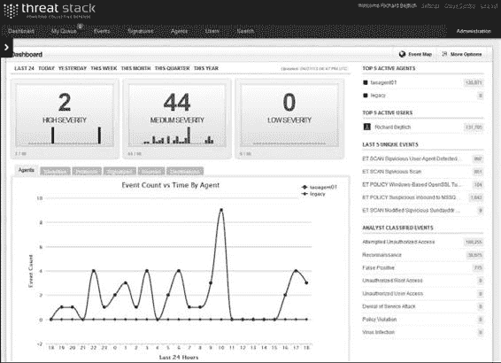

云用户通常无法部署网络探针或配置 SPAN 端口，

查看云提供商基础设施的流量进出。凭其本质，

云基础设施往往是多租户环境，服务于数百个

服务上共享平台上的成百上千客户。尽管你可能

想查看处理你数据的云平台的进出流量，

你的云邻居可能不希望你看到他们的流量！

NSM 通常不是 SaaS 提供服务的选择，因为客户

与云公司提供的应用程序交互。客户可以

限制于依赖云提供商提供的日志。

对于 PaaS 服务，NSM 也很难实现，尽管客户可以选择

将应用程序级日志记录功能内建到他们构建的软件中。

在 PaaS 平台上。NSM 可能在 IaaS 服务中实现，但可视性

功能通常限于特定虚拟机。IaaS 上的 NSM 需要

轻量级方法，代理在特定虚拟机上收集和分析

网络中心的数据。

Threat Stack（*http://www.threatstack.com/*）是一个基于云的商业

提供 NSM 功能的 IaaS 云平台。Dustin Webber，

Snorby 工具的作者，与 Jen Andre 共同创立了 Threat Stack，以扩展

Snorby 超越企业之外。Threat Stack 提供了一个轻量级代理，

收集并生成关于各个终端的 NSM 信息，无论

在企业中或 IaaS 云平台上的示例。Threat Stack 代理报告

将其结果传输到由 Threat Stack 团队运营的基于云的控制器。

当分析师想要调查来自代理的 NSM 数据时，他们登录到

由 Threat Stack 发布的云应用程序。图 1 展示了 Threat

Stack 仪表盘，显示来自部署在虚拟私人

服务器。

*图 1：Threat Stack 仪表盘*

结论 **305**

[www.it-ebooks.info](http://www.it-ebooks.info/)

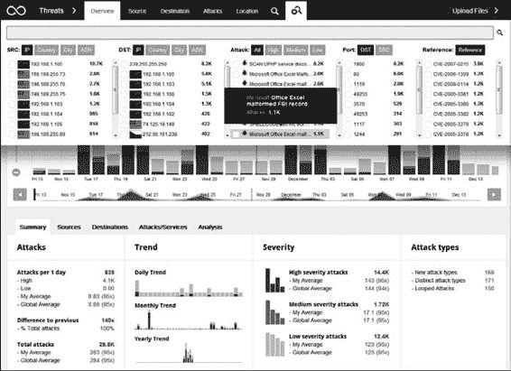

Threat Stack 展示了云端挑战如何应对监控-

运行 IaaS 平台，可以通过使用云来收集和呈现

来自代理的 NSM 数据。这暗示了云计算的一些优势。

给 NSM 操作员带来的优势。

***云计算的优势***

云环境为分析师提供了强大且可扩展的工作环境

处理和挖掘 NSM 数据。通过将 NSM 数据放到云中，存储

分析能力问题会变得不那么突出。分析师必须感到舒适-

在云提供商应用安全控制后再进行处理。

敏感信息掌握在另一家公司手中。如果服务提供商能够

满足这些需求，云提供了令人兴奋的可能性。

Packetloop（*http://www.packetloop.com/*）是另一个基于云的商业

基于云的商业提供，聚焦点不同。Michael Baker

以及他在澳大利亚的团队开发了 Packetloop，作为一个基于云的应用

分析用户上传的网络流量。分析师可以发送网络流量

批量传输到 Packetloop，后者处理并以各种方式展示这些流量。

多种方式。图 2 展示了 Packetloop 仪表盘，显示与网络流量相关的

关联于数字语料库样本案例（*http://digitalcorpora.org/corpora/*

*场景/m57-patents-scenario/*)。

*图 2：Packetloop 仪表盘，显示示例网络流量*

Threat Stack 和 Packetloop 是企业用户的选择，令人放心-

可以将本地数据发送给云服务提供商。或许更重要的是，

这两种服务适合那些已经进行计算的客户。

在云端。换句话说，云上工作的客户可能

**306** 结论

[www.it-ebooks.info](http://www.it-ebooks.info/)

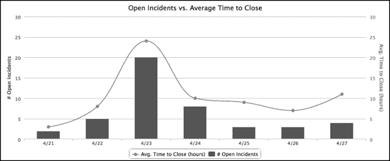

感到舒适将日志或网络流量或两者发送到另一个云端

提供商，如安全供应商的效果。随着越来越多的计算工作从

企业迁移到云端时，我预计这种“云对云”关系会

对安全和监控需求变得越来越重要。

**工作流、度量和协作**

NSM 不仅仅是工具。NSM 是一种操作，而这一概念意味着

工作流、度量和协作。*工作流*确定了分析员执行检测和响应任务时所遵循的一系列步骤。

*度量*，如事件的分类和数量，以及经过的时间

从事件检测到遏制，衡量

工作流。*协作*使分析员能更聪明、更快速地工作。

***工作流与度量***

下一代 NSM 工具将融合这些关键功能。

Mandiant 在其多个商业产品中提供了这些功能。

目标是帮助客户更快地确定入侵范围，管理

升级和解决过程，并突出改进的领域。

图 3 显示了两个关键事件响应指标的图表。

*图 3：跟踪未解决事件与关闭事件的平均时间*

在图 3 中，我们看到一系列连接成线的点，显示了

关闭一个事件所需的平均时间，以小时计算。在这种情况下，“关闭”

进行短期事件遏制（STIC）以减轻

被入侵者攻击的计算机所带来的风险。柱状图显示了

每日未解决事件的数量。未解决事件的激增

4 月 23 日的事件导致平均关闭时间也急剧上升。这表明

CIRT 因处理的事件数量过多而不堪重负

如果组织的目标是平均关闭时间为 10 小时或更短，

这个激增表明，当

未解决事件的数量超过每日 10 个案件。CIRT 经理可以利用

使用这些度量来证明额外人员的需求，或调整流程或工具

以保持 CIRT 的正常运作。

结论 **307**

[www.it-ebooks.info](http://www.it-ebooks.info/)

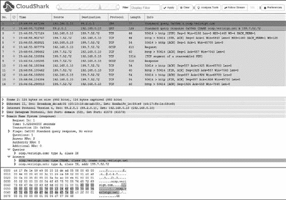

***协作***

能够管理多个同时入侵的 CIRT 通常能从

强大的协作工具。许多分析员熟悉维基、聊天

渠道和客户端，以及其他用于交换事件数据的工具。一个新的

这种协作工具结合了处理 NSM 数据和共享分析

分析能力。就像在线文字处理应用程序 Google Docs 一样

文档允许多个用户同时协作，某些工具是

正在涌现，提供类似的功能给 NSM 操作员。

CloudShark（ *http://www.cloudshark.org/*）是一个协作

具有创新的包分析工具。QA Cafe 的团队（ *http://www.qacafe.com/*）

构建了 CloudShark，作为客户可以在本地部署的平台

和多个团队成员共享。（尽管其名称为 CloudShark

不存在于云端；客户购买软件并在其内部部署

他们的企业。2）分析师将数据包捕获上传到本地设备

然后通过网页浏览器操作数据包捕获。图 4 展示了

一个 CloudShark 渲染 DNS 和在线证书状态的示例

协议（OCSP）流量。

*图 4：CloudShark 显示 DNS 和 OCSP 流量*

CloudShark 看起来非常类似于 Wireshark，因此分析师会感到很

在界面中定位。CIRT 可以维护一个本地的 CloudShark 应用程序

作为从各种入侵中提取的关键网络跟踪的存储库。

2\. 本节中的示例由 CloudShark 和 Jeremy Stretch 提供，他们在线发布样本跟踪数据，地址为 *http://packetlife.net/captures/protocol/dns/* 和 *http://www.cloudshark*

*.org/captures/46b2c8403863/* 用于展示 CloudShark 的能力。

**308** 结论

[www.it-ebooks.info](http://www.it-ebooks.info/)

例如，当 Sguil 从传感器检索流量以构建记录时，服务器会保留该流量的本地存档。CIRT 可以将所有

将这些捕获数据上传到 CloudShark，使其易于获取和浏览

由分析师进行。这些分析师还可以通过

信息和评论功能，并为跟踪数据添加关键标签，便于后续

参考。作为一个本地设备，CloudShark 可能解决一些

纯云端产品所带来的问题也需要关注。

**结论**

本书的最后部分展示了 NSM 功能的一些示例

在 SO 套件之外发现的功能。随着 CIRT 意识到 NSM 的强大功能

必须应用于云环境，并且可以通过云

和协作平台，我预计会看到更多利用

这些功能。Threat Stack、Packetloop、Mandiant 和 CloudShark

以下是一些公司将 NSM 相关服务整合进

他们的核心产品。幸运的话，这些及其他解决方案提供商将

继续将工具和流程交到全球 CIRT 手中。

如果我们在对手完成任务之前阻止他们，就有可能战胜对手

他们的任务。正如自 1990 年代初以来的情况一样，NSM 将继续

是对抗入侵者的一种强大且具成本效益的方式。振作起来，CIRT；

未来依然光明！

结论 **309**

[www.it-ebooks.info](http://www.it-ebooks.info/)

[www.it-ebooks.info](http://www.it-ebooks.info/)

**SO 脚本**

**A N D 配置**

*由 Security Onion 的创建者 Doug Burks 提供*

本附录提供了一个快速参考

到 Security Onion (SO) 控制脚本

和配置文件。该材料将

帮助 SO 用户更好地管理和优化

他们的传感器部署。

**SO 控制脚本**

NSM 控制脚本是 SO 的核心组件之一。这些

脚本最初是 NSMnow 软件包的一部分，该软件包由

SecurixLive 团队（*http://www.securixlive.com/nsmnow/docs/index.php*），但是

它们已被重度修改，以便在 SO 中使用。

[www.it-ebooks.info](http://www.it-ebooks.info/)

NSM 脚本最初是为控制 Sguil 服务器（sguild）、其代理（snort_agent、pads_agent、sancp_agent 和 pcap_agent）及其传感器而开发的

组件（snort、pads、sancp 和 daemonlogger）。以下是其中的一些

我们对 SO 所做的更改：

• 添加了使用 Suricata 代替 Snort 的功能

• 添加了通过 PF_RING 启动多个 Snort 实例的功能（并且

barnyard2 和 snort_agent 的实例数目相同）

• 添加了对 Argus 组件的控制

• 添加了对 Bro 的控制

• 添加了对 Sguil 的 OSSEC 代理的控制

• 添加了对 Sguil 的 HTTP 代理的控制

• 用 prads 替换了 pads 和 sancp

• 用 netsniff-ng 替换了 daemonlogger

NSM 脚本安装在 */usr/sbin/nsm**，并需要 root 权限

权限，所以它们应该使用 sudo 运行。目录 */usr/sbin/* 应该

在你的 PATH 变量中，因此你不需要包含完整路径

执行这些命令时，示例中包含了完整路径

完整性。

我们不会涵盖每个脚本的所有选项，但你可以探索每个

使用 --help 查看这些脚本的更多信息。例如，查看

若要获取有关 /usr/sbin/nsm 的更多信息，请输入此命令：

$ **sudo /usr/sbin/nsm --help**

NSMnow 管理脚本旨在轻松配置和管理

你的 NSM 安装情况。错误、评论和火焰可以发送到

SXL 团队联系方式：dev@securixlive.com

NSMnow 管理脚本不提供任何形式的保证。

使用：/usr/sbin/nsm [选项]

选项：

-U 检查并应用任何可用的升级

-V 显示版本信息

-? 显示使用信息

长选项：

--sensor 见 nsm_sensor

--server 见 nsm_server

--all 在传感器和服务器上执行操作

--upgrade 与 -U 相同

--version 与 -V 相同

--help 与 -? 相同

**312** 附录

[www.it-ebooks.info](http://www.it-ebooks.info/)

***/usr/sbin/nsm***

高级的 /usr/sbin/nsm 脚本可以将选项传递给某些下级

伪造脚本，如 nsm_server 和 nsm_sensor。要检查所有

服务器和传感器进程，请输入以下命令：

$ **sudo /usr/sbin/nsm --all --status**

状态：securityonion

* sguil 服务器 [ OK ]

状态：HIDS

* ossec_agent（sguil）[ OK ]

状态：Bro

名称 类型 主机 状态 进程 ID 同行 启动时间

bro 独立 localhost 正在运行 13015 0 18 Feb 16:35:40

状态：securityonion-eth1

* netsniff-ng（完整数据包）[ OK ]

* pcap_agent（sguil）[ OK ]

* snort_agent-1（sguil）[ OK ]

* snort-1（警报数据）[ OK ]

* barnyard2-1（spooler，统一 2 格式）[ OK ]

* prads（会话/资产）[ OK ]

* sancp_agent（sguil）[ OK ]

* pads_agent（sguil）[ OK ]

* argus [ OK ]

* http_agent（sguil）[ OK ]

/etc/init.d/nsm 是“/usr/sbin/nsm –all”的包装器，因此你也可以这样做：

sudo service nsm status

除了状态外，你还可以使用其他进程控制关键字，如

如启动、停止和重启。

***/usr/sbin/nsm_al _del***

高级脚本/usr/sbin/nsm_all_del 将提示用户确认，

然后调用 nsm_all_del_quick 删除所有 NSM 数据和配置。

$ **sudo /usr/sbin/nsm_all_del**

警告！

继续将永久删除所有 NSM 配置和数据！

按 Ctrl-C 取消。

或

按 Enter 继续。

停止：securityonion

* 停止：sguil 服务器 [ OK ]

停止：HIDS

* 停止：ossec_agent (sguil) [ OK ]

停止：Bro

停止 bro ...

SO 脚本和配置 **313**

[www.it-ebooks.info](http://www.it-ebooks.info/)

停止：securityonion-eth1

* 停止：netsniff-ng (完整数据包) [ OK ]

* 停止：pcap_agent (sguil) [ OK ]

* 停止：snort_agent-1 (sguil) [ OK ]

* 停止：snort-1 (警报数据) [ OK ]

* 停止：barnyard2-1 (排队器，unified2 格式) [ OK ]

* 停止：prads (会话/资产) [ OK ]

* 停止：sancp_agent (sguil) [ OK ]

* 停止：pads_agent (sguil) [ OK ]

* 停止：argus [ OK ]

* 停止：http_agent (sguil) [ OK ]

删除传感器

所有关于传感器“securityonion-eth1”的配置和收集的数据将被删除。

删除传感器：securityonion-eth1

* 移除配置文件 [ OK ]

* 移除收集的数据文件 [ OK ]

* 更新传感器表 [ OK ]

删除服务器

所有关于服务器“securityonion”的配置和收集的数据将被

已删除。

删除服务器：继续吗？ (Y/N) [N]:

* 移除配置文件 [ OK ]

* 移除收集的数据文件 [ OK ]

* 移除数据库 [ OK ]

* 更新服务器表 [ OK ]

***/usr/sbin/nsm_al _del_quick***

高级脚本/usr/sbin/nsm_all_del_quick 将调用 nsm_sensor_del 并

nsm_server_del 用于删除所有 NSM 数据和配置，但*不会*提示

需要用户确认。请小心使用！

$ **sudo nsm_all_del_quick**

停止：securityonion

* 停止：sguil 服务器 [ OK ]

停止：HIDS

* 停止：ossec_agent (sguil) [ OK ]

停止：Bro

停止 bro ...

停止：securityonion-eth1

* 停止：netsniff-ng (完整数据包) [ OK ]

* 停止：pcap_agent (sguil) [ OK ]

* 停止：snort_agent-1 (sguil) [ OK ]

* 停止：snort-1 (警报数据) [ OK ]

**314** 附录

[www.it-ebooks.info](http://www.it-ebooks.info/)

* 停止：barnyard2-1 (排队器，unified2 格式) [ OK ]

* 停止：prads (会话/资产) [ OK ]

* 停止：sancp_agent (sguil) [ OK ]

* 停止：pads_agent (sguil) [ OK ]

* 停止：argus [ OK ]

* 停止：http_agent (sguil) [ OK ]

删除传感器

所有关于传感器“securityonion-eth1”的配置和收集的数据将被删除。

删除传感器：securityonion-eth1

* 移除配置文件 [ OK ]

* 移除收集的数据文件 [ OK ]

* 更新传感器表 [ OK ]

删除服务器

所有关于服务器“securityonion”的配置和收集的数据将被

已删除。

删除服务器：继续吗？ (Y/N) [N]:

* 移除配置文件 [ OK ]

* 移除收集的数据文件 [ OK ]

* 移除数据库 [ OK ]

* 更新服务器表 [ OK ]

***/usr/sbin/nsm_sensor***

高级 /usr/sbin/nsm_sensor 脚本可以将选项传递给一些

基础的 nsm_sensor_* 脚本。

$ **sudo /usr/sbin/nsm_sensor --status**

状态: HIDS

* ossec_agent (sguil) [ OK ]

状态: Bro

名称 类型 主机 状态 Pid 同伴 启动时间

bro 独立 localhost 运行 13015 0 18 2 月 16:35:40

状态: securityonion-eth1

* netsniff-ng (完整数据包数据) [ OK ]

* pcap_agent (sguil) [ OK ]

* snort_agent-1 (sguil) [ OK ]

* snort-1 (警报数据) [ OK ]

* barnyard2-1 (spooler, unified2 格式) [ OK ]

* prads (会话/资产) [ OK ]

* sancp_agent (sguil) [ OK ]

* pads_agent (sguil) [ OK ]

* argus [ OK ]

* http_agent (sguil) [ OK ]

SO 脚本和配置 **315**

[www.it-ebooks.info](http://www.it-ebooks.info/)

***/usr/sbin/nsm_sensor_add***

/usr/sbin/nsm_sensor_add 脚本由设置向导调用，以添加新的

传感器。你不需要手动运行此脚本。

***/usr/sbin/nsm_sensor_backup-config***

/usr/sbin/nsm_sensor_backup-config 脚本将备份传感器配置-

将文件归档为用户指定的 tarball。

***/usr/sbin/nsm_sensor_backup-data***

/usr/sbin/nsm_sensor_backup-data 脚本将备份传感器数据文件到一个

用户指定的 tarball。请注意，数据文件包括完整的数据包捕获，

真正的大小可能达到数十 GB 或 TB。

***/usr/sbin/nsm_sensor_clean***

/usr/sbin/nsm_sensor_clean 脚本由每小时的 cronjob 调用。如果磁盘

使用率达到 90% 或更高，最旧一天的 NSM 数据（pcaps，

Bro 日志等) 将被删除，直到磁盘使用率低于 90%。如果磁盘

该过程将重复，直到磁盘使用率低于 90%。

***/usr/sbin/nsm_sensor_clear***

/usr/sbin/nsm_sensor_clear 脚本清除传感器的所有数据。

$ **sudo /usr/sbin/nsm_sensor_clear --sensor-name=securityonion-eth1**

清除传感器

所有传感器 "securityonion-eth1" 收集的数据将被清除。

您要继续吗？(Y/N) [N]: **y**

清除传感器: securityonion-eth1

* 删除书签 [ OK ]

* 删除收集的数据文件 [ OK ]

* 删除收集的日志目录 [ OK ]

***/usr/sbin/nsm_sensor_del***

/usr/sbin/nsm_sensor_del 脚本会删除传感器的所有数据和配置。

用户指定的传感器，永久禁用它。

$ **sudo /usr/sbin/nsm_sensor_del --sensor-name=securityonion-eth1**

删除传感器

所有配置和传感器 "securityonion-eth1" 收集的数据将被删除。

您要继续吗？(Y/N) [N]: **y**

**316** 附录

[www.it-ebooks.info](http://www.it-ebooks.info/)

删除传感器: securityonion-eth1

* 删除配置文件 [ OK ]

* 删除收集的数据文件 [ OK ]

* 更新传感器表 [ OK ]

***/usr/sbin/nsm_sensor_edit***

/usr/sbin/nsm_sensor_edit 脚本允许您编辑传感器的某些细节。

传感器的配置。

***/usr/sbin/nsm_sensor_ps-daily-restart***

/usr/sbin/nsm_sensor_ps-daily-restart 脚本由每天的 cronjob 调用，

午夜时分重新启动任何可能处理基于日期输出的服务

并且需要滚动到新的日期戳。

***/usr/sbin/nsm_sensor_ps-restart***

/usr/sbin/nsm_sensor_ps-restart 脚本用于重启传感器进程。

$ **sudo /usr/sbin/nsm_sensor_ps-restart**

正在重启: HIDS

* 停止中: ossec_agent (sguil) [ OK ]

* 启动中: ossec_agent (sguil) [ OK ]

正在重启: Bro

停止 bro ...

启动 bro ...

正在重启: securityonion-eth1

* 正在重启并有重叠: netsniff-ng (完整数据包数据)

* 启动中: netsniff-ng (完整数据包数据) [ OK ]

- 停止旧进程: netsniff-ng (完整数据包数据) [ OK ]

* 停止中: pcap_agent (sguil) [ OK ]

* 启动中: pcap_agent (sguil) [ OK ]

* 停止中: snort_agent-1 (sguil) [ OK ]

* 启动中: snort_agent-1 (sguil) [ OK ]

* 停止中: snort-1 (警报数据) [ OK ]

* 启动中: snort-1 (警报数据) [ OK ]

* 停止中: barnyard2-1 (spooler, unified2 格式) [ OK ]

* 启动中: barnyard2-1 (spooler, unified2 格式) [ OK ]

* 停止中: prads (会话/资产) [ OK ]

* 启动中: prads (会话/资产) [ OK ]

* 停止中: pads_agent (sguil) [ OK ]

* 启动中: pads_agent (sguil) [ OK ]

* 停止中: sancp_agent (sguil) [ OK ]

* 启动中: sancp_agent (sguil) [ OK ]

* 停止中: argus [ OK ]

* 启动中: argus [ OK ]

* 停止中: http_agent (sguil) [ OK ]

* 启动中: http_agent (sguil) [ OK ]

SO 脚本和配置 **317**

[www.it-ebooks.info](http://www.it-ebooks.info/)

请注意，这些以及其余的 nsm_sensor_ps-* 脚本可以非常精细地控制你所管理的传感器或进程。例如，请注意

以下 --help 列表中的 --only-、--skip- 和 --sensor-name= 选项:

$ **sudo /usr/sbin/nsm_sensor_ps-restart --help**

NSMnow 管理脚本没有任何保证。

用法: /usr/sbin/nsm_sensor_ps-restart [选项]

选项:

-d 使用对话框模式

-y 强制是

-V 显示版本信息

-? 显示用法信息

长选项:

--sensor-name=<name> 定义要处理的特定传感器 <name>

--only-barnyard2 仅处理 barnyard2

--only-snort-alert 仅处理 snort 警报

--only-pcap 仅处理数据包日志

--only-argus 仅处理 argus

--only-prads 仅处理 prads

--only-bro 仅处理 bro

--only-pcap-agent 仅处理 pcap_agent

--only-sancp-agent 仅处理 sancp_agent

--only-snort-agent 仅处理 snort_agent

--only-http-agent 仅处理 http_agent

--only-pads-agent 仅处理 pads_agent

--only-ossec-agent 仅处理 ossec_agent

--skip-barnyard2 跳过 barnyard2 的处理

--skip-snort-alert 跳过 snort 警报的处理

--skip-pcap 跳过数据包日志的处理

--skip-argus 跳过 argus 的处理

--skip-prads 跳过 prads 的处理

--skip-bro 跳过 bro 的处理

--skip-pcap-agent 跳过 pcap_agent 的处理

--skip-sancp-agent 跳过 sancp_agent 的处理

--skip-snort-agent 跳过 snort_agent 的处理

--skip-http-agent 跳过 http_agent 的处理

--skip-pads-agent 跳过 pads_agent 的处理

--skip-ossec-agent 跳过 ossec_agent 的处理

--if-stale 仅重启已崩溃的进程

--dialog 同 -d

--force-yes 同 -y

--version 同 -V

--help 同 -?

**318** 附录

[www.it-ebooks.info](http://www.it-ebooks.info/)

例如，假设你刚刚更改了 *snort.conf* 文件，并且想要重启 Snort 以使这些更改生效。你可以仅重启 Snort 进程，而不需要重启整个堆栈，如下所示：

$ **sudo /usr/sbin/nsm_sensor_ps-restart --only-snort-alert**

重启中：securityonion-eth1

* 停止中：snort-1 (警报数据) [ OK ]

* 启动中：snort-1 (警报数据) [ OK ]

***/usr/sbin/nsm_sensor_ps-start***

/usr/sbin/nsm_sensor_ps-start 脚本用于启动传感器进程。

$ **sudo /usr/sbin/nsm_sensor_ps-start**

启动中：HIDS

* 启动中：ossec_agent (sguil) [ OK ]

启动中：Bro

启动 bro ...

启动中：securityonion-eth1

* 启动中：netsniff-ng (完整数据包数据) [ OK ]

* 启动中：pcap_agent (sguil) [ OK ]

* 启动中：snort_agent-1 (sguil) [ OK ]

* 启动中：snort-1 (警报数据) [ OK ]

* 启动中：barnyard2-1 (spooler, unified2 格式) [ OK ]

* 启动中：prads (会话/资产) [ OK ]

* 启动中：pads_agent (sguil) [ OK ]

* 启动中：sancp_agent (sguil) [ OK ]

* 启动中：argus [ OK ]

* 启动中：http_agent (sguil) [ OK ]

* 磁盘空间当前为 26%

***/usr/sbin/nsm_sensor_ps-status***

/usr/sbin/nsm_sensor_ps-status 脚本用于检查传感器的状态。

进程。

$ **sudo /usr/sbin/nsm_sensor_ps-status**

状态：HIDS

* ossec_agent (sguil) [ OK ]

状态：Bro

名称 类型 主机 状态 进程 ID 对等方 启动时间

bro 独立运行的本地主机，端口号 15426，0，18 Feb 16:40:23

状态：securityonion-eth1

* netsniff-ng (完整数据包数据) [ OK ]

* pcap_agent (sguil) [ OK ]

* snort_agent-1 (sguil) [ OK ]

* snort-1 (警报数据) [ OK ]

* barnyard2-1 (spooler, unified2 格式) [ OK ]

SO 脚本和配置 **319**

[www.it-ebooks.info](http://www.it-ebooks.info/)

* prads (会话/资产) [ OK ]

* sancp_agent (sguil) [ OK ]

* pads_agent (sguil) [ OK ]

* argus [ OK ]

* http_agent (sguil) [ OK ]

***/usr/sbin/nsm_sensor_ps-stop***

/usr/sbin/nsm_sensor_ps-stop 脚本用于停止传感器进程。

$ **sudo /usr/sbin/nsm_sensor_ps-stop**

停止中：HIDS

* 停止中：ossec_agent (sguil) [ OK ]

停止中：Bro

停止 bro ...

停止中：securityonion-eth1

* 停止中：netsniff-ng (完整数据包数据) [ OK ]

* 停止中：pcap_agent (sguil) [ OK ]

* 停止中：snort_agent-1 (sguil) [ OK ]

* 停止中：snort-1 (警报数据) [ OK ]

* 停止中：barnyard2-1 (spooler, unified2 格式) [ OK ]

* 停止中：prads (会话/资产) [ OK ]

* 停止中：sancp_agent (sguil) [ OK ]

* 停止中：pads_agent (sguil) [ OK ]

* 停止中：argus [ OK ]

* 停止中：http_agent (sguil) [ OK ]

***/usr/sbin/nsm_server***

高级 /usr/sbin/nsm_server 脚本可以将选项传递给一些

底层 nsm_server_* 脚本。

$ **sudo /usr/sbin/nsm_server --status**

状态：securityonion

* sguil 服务器 [ OK ]

***/usr/sbin/nsm_server_add***

/usr/sbin/nsm_server_add 脚本由设置向导使用，用于创建一个

新的 Sguil 服务器（sguild）。您不应该手动运行此脚本。

***/usr/sbin/nsm_server_backup-config***

/usr/sbin/nsm_server_backup-config 脚本将 sguild 配置文件备份

配置文件到用户指定的 tarball。

***/usr/sbin/nsm_server_backup-data***

/usr/sbin/nsm_server_backup-data 脚本将 sguild 数据备份到一个

用户指定的 tarball。

**320** 附录

[www.it-ebooks.info](http://www.it-ebooks.info/)

***/usr/sbin/nsm_server_clear***

/usr/sbin/nsm_server_clear 脚本清除所有 sguild 数据。

***/usr/sbin/nsm_server_del***

/usr/sbin/nsm_server_del 脚本永久删除 Sguil 服务器

（sguild）。

***/usr/sbin/nsm_server_edit***

/usr/sbin/nsm_server_edit 脚本可以用来编辑某些详细信息

sguild 配置。

***/usr/sbin/nsm_server_ps-restart***

/usr/sbin/nsm_server_ps-restart 脚本可以用来重启 sguild。

$ **sudo /usr/sbin/nsm_server_ps-restart**

重启中：securityonion

* 停止中：sguil 服务器 [ OK ]

* 启动中：sguil 服务器 [ OK ]

***/usr/sbin/nsm_server_ps-start***

/usr/sbin/nsm_server_ps-start 脚本可用于启动 sguild。

$ **sudo /usr/sbin/nsm_server_ps-start**

启动中：securityonion

* 启动中：sguil 服务器 [ OK ]

***/usr/sbin/nsm_server_ps-status***

/usr/sbin/nsm_server_ps-status 脚本可用于检查

sguild。

$ **sudo /usr/sbin/nsm_server_ps-status**

状态：securityonion

* sguil 服务器 [ OK ]

***/usr/sbin/nsm_server_ps-stop***

/usr/sbin/nsm_server_ps-stop 脚本可以用来停止 sguild。

$ **sudo /usr/sbin/nsm_server_ps-stop**

停止中：securityonion

* 停止中：sguil 服务器 [ OK ]

SO 脚本和配置 **321**

[www.it-ebooks.info](http://www.it-ebooks.info/)

***/usr/sbin/nsm_server_sensor-add***

/usr/sbin/nsm_server_sensor-add 脚本用于向

sguild 配置。

***/usr/sbin/nsm_server_sensor-del***

/usr/sbin/nsm_server_sensor-del 脚本用于删除传感器

sguild 配置。

***/usr/sbin/nsm_server_user-add***

/usr/sbin/nsm_server_user-add 脚本用于添加新的 sguild 用户。

$ **sudo /usr/sbin/nsm_server_user-add**

用户名

输入将被授予连接权限的新用户名称

此服务器。：**richard**

用户密码

输入将被授予连接权限的新用户密码

连接到此服务器。：

验证：

将用户添加到服务器

以下信息已被收集：

服务器：securityonion

用户：richard

您是否要创建？（Y/N）[Y]：**y**

将用户添加到服务器：richard => securityonion

**So 配置文件**

配置文件控制 SO 应用程序的操作方式。管理员

可以更改某些文件的内容，以定制 SO 收集和

解释 NSM 数据。

SO 团队以合理的默认值配置 SO，但在某些情况下，

变更可能是合适的。本节描述了 SO 的配置文件，

包括 SO 团队是否认为管理员有时可能

不需要对它们进行修改。

***/etc/nsm/***

*/etc/nsm/* 是主要的配置目录。它包含以下内容：

administration.conf

ossec/

pulledpork/

rules/

**322** 附录

[www.it-ebooks.info](http://www.it-ebooks.info/)

securityonion/

securityonion.conf

sensortab

servertab

templates/

$HOSTNAME-$INTERFACE

列表中的最后一项将根据你的主机名和

你选择监控的接口。例如，以下是来自

我的小传感器命名为 securityonion，拥有一个监控接口（eth1）：

-rw-r--r-- 1 root root 247 2012 年 7 月 24 日 administration.conf

drwxr-xr-x 2 root root 4.0K 2 月 18 16:16 ossec

drwxr-xr-x 2 root root 4.0K 12 月 18 11:15 pulledpork

drwxr-xr-x 3 root root 4.0K 2 月 18 16:16 rules

drwxrwxr-x 3 sguil sguil 4.0K 2 月 18 16:16 securityonion

-rw-r--r-- 1 root root 37 2 月 18 16:16 securityonion.conf

drwxrwxr-x 2 sguil sguil 4.0K 2 月 18 16:17 securityonion-eth1

-rw-r--r-- 1 root root 31 2 月 18 16:16 sensortab

-rw-r--r-- 1 root root 349 2 月 18 16:16 servertab

drwxr-xr-x 8 root root 4.0K 12 月 18 11:14 templates

让我们逐一查看这些文件和目录。

***/etc/nsm/administration.conf***

*/etc/nsm/administration.conf* 文件定义了 NSM 脚本的一些文件系统位置。你通常不需要更改这个文件中的任何内容。

***/etc/nsm/ossec/***

*/etc/nsm/ossec/* 目录包含用于 Sguil 的 OSSEC 代理（ossec_

agent.tcl) 及其配置文件（ *ossec_agent.conf* ）。你可能不需要修改这些文件。

***/etc/nsm/pulledpork/***

*/etc/nsm/pulledpork/* 目录包含 PulledPork 配置文件

PulledPork，负责从

互联网。PulledPork 的主要配置文件是 *pulledpork.conf*，但是

你可能大部分时间都会修改 *disablesid.conf*、*enablesid*

*.conf* 和 *modifysid.conf* 用于调整你的规则集。

***/etc/nsm/rules/***

*/etc/nsm/rules/* 目录包含已下载的 IDS 规则集

由 PulledPork 和与之相关的文件控制传感器进程。当

PulledPork 运行时，它将规则存储在 *downloaded.rules* 中。不要手动修改此文件，因为 PulledPork 会在下一次运行时自动覆盖它

运行。相反，使用 */etc/nsm/pulledpork/* 中的文件调整你的规则集。

你可以编写自己的规则并将其存储在 *local.rules* 中。要调整一个

如果你只想禁用特定规则而不是完全禁用它，请使用 *threshold.conf*。要指定 SO 脚本和配置 **323**

[www.it-ebooks.info](http://www.it-ebooks.info/)

Berkeley 数据包过滤器（BPF），使嗅探进程可以选择性地忽略来自某些 IP 地址的流量，使用 *bpf.conf*。Bro 会自动

监控此文件的服务会根据需要更新它。其他服务

（如 Snort 和 Suricata，PRADS，和 Netsniff-ng）需要

必须重新启动才能使更改生效。

***/etc/nsm/securityonion/***

*/etc/nsm/securityonion/* 目录包含以下 Sguil 服务器

（sguild）配置文件：

***autocat.conf*** 用于配置 Sguil 自动分类

某些事件。

***certs*** 包含用于保护通信的文件

Sguil 服务器（sguild）及其代理和客户端。

***server.conf*** 包含一些用于启动 sguild 的通用设置

不需要修改。

***sguild.access*** 用于控制对 sguild 的访问。

***sguild.conf*** 包含 sguild 的通用设置，通常不需要更改。

***sguild.email*** 允许你配置 Sguil 在发生某些事件时自动发送电子邮件。

***sguild.queries*** 包含可从 Sguil 访问的查询

客户端通过选择 **查询**4**标准查询**。

***sguild.users*** 该文件不应修改。

***/etc/nsm/securityonion.conf***

*/etc/nsm/securityonion.conf* 文件包含 IDS_ENGINE、DAYSTOKEEP 和 ELSA 设置，允许你更改入侵检测系统（IDS）

引擎，数据在 Sguil 数据库中保存的时间，以及是否

ELSA 已启用。

如果你运行设置向导并选择快速设置，SO 将默认

使用 Snort 作为 IDS 引擎。如果选择高级设置，SO 会询问是否

你想运行 Snort 还是 Suricata。在任何一种情况下，设置向导将设置

IDS_ENGINE 变量。如果你后来决定更改 IDS 引擎，

可以停止所有传感器进程，修改 IDS_ENGINE 设置，执行规则更新，

更新，并重新启动所有传感器进程。

例如，假设你运行了快速设置，它会为你提供默认的

Snort。如果你想尝试 Suricata，请执行以下操作：

$ **sudo nsm_sensor_ps-stop**

停止中：HIDS

* 停止中：ossec_agent（sguil）[ OK ]

停止中：Bro

正在等待锁定 ........ ok

停止 bro ...

**324** 附录

[www.it-ebooks.info](http://www.it-ebooks.info/)

停止中：securityonion-eth1

* 停止中：netsniff-ng（完整数据包）[ OK ]

* 停止中：pcap_agent（sguil）[ OK ]

* 停止中：snort_agent-1（sguil）[ OK ]

* 停止中：snort-1（警报数据）[ OK ]

* 停止中：barnyard2-1（队列器，unified2 格式）[ OK ]

* 停止中：prads（会话/资产）[ OK ]

* 停止中：sancp_agent（sguil）[ OK ]

* 停止中：pads_agent（sguil）[ OK ]

* 停止中：argus [ OK ]

* 停止中：http_agent（sguil）[ OK ]

$ **sudo sed -i 's|ENGINE=snort|ENGINE=suricata|g' /etc/nsm/securityonion.conf**

$ **sudo rule-update > /dev/null**

$ **sudo nsm_sensor_ps-start**

启动中：HIDS

* 启动中：ossec_agent（sguil）[ OK ]

启动中：Bro

启动中：bro ...

启动中：securityonion-eth1

* 启动中：netsniff-ng（完整数据包）[ OK ]

* 启动中：pcap_agent（sguil）[ OK ]

* 启动中：snort_agent（sguil）[ OK ]

* 启动中：suricata（警报数据）[ OK ]

* 启动中：barnyard2（队列器，unified2 格式）[ OK ]

* 启动中：prads（会话/资产）[ OK ]

* 启动中：pads_agent（sguil）[ OK ]

* 启动中：sancp_agent（sguil）[ OK ]

* 启动中：argus [ OK ]

* 启动中：http_agent（sguil）[ OK ]

* 磁盘空间当前为 26%

DAYSTOKEEP 变量允许你定义

Sguil 数据库。一个每日的 cronjob 会删除任何在 securityonion_db 中超过的旧数据

$DAYSTOKEEP。默认值是 365\。

单独的设备，使其仅作为服务器而非传感器。

启用 ELSA。

***/etc/nsm/sensortab***

* 停止：sancp_agent（sguil）[ OK ]

如果该设备配置为监控接口，则该文件包含要监控的接口列表。要禁用接口上的嗅探进程，

你可以临时停止接口，如下所示（替换 *HOSTNAME-INTERFACE*

使用你的实际主机名和接口名称）：

**sudo nsm_sensor_ps-stop --sensor-name= *HOSTNAME-INTERFACE***

SO 脚本和配置 **325**

[www.it-ebooks.info](http://www.it-ebooks.info/)

要永久禁用一个接口，请注释掉相关行

*/etc/nsm/sensortab*。例如，假设你运行了快速设置并且

* sguil 服务器 [ OK ]

保留策略对于

$ **sudo nsm_sensor_ps-stop --sensor-name=securityonion-eth1**

停止：HIDS

* 停止：http_agent（sguil）[ OK ]

停止：Bro

停止 bro ...

停止：securityonion-eth1

* 停止：netsniff-ng（完整数据包）[ OK ]

* 停止：pcap_agent（sguil）[ OK ]

* 停止：snort_agent-1（sguil）[ OK ]

* 停止：snort-1（警报数据）[ OK ]

* 停止：barnyard2-1（spooler，unified2 格式）[ OK ]

* 停止：prads（会话/资产）[ OK ]

$ **sudo service nsm status**

* 停止：pads_agent（sguil）[ OK ]

* 停止：argus [ OK ]

监控 eth1，但之后决定将传感器组件移至

设置向导询问你是否要启用 ELSA 变量时进行设置，

**barnyard2.conf**

状态：securityonion

$ **sudo sed -i 's|securityonion-eth1|#securityonion-eth1|g' /etc/nsm/sensortab**

***/etc/nsm/servertab***

如果该设备被配置为服务器，*/etc/nsm/servertab* 文件包含服务器的内部名称（securityonion）。

***/etc/nsm/templates/***

*/etc/nsm/templates/* 目录包含 barnyard2 的模板文件，

http_agent、prads、pulledpork、snort 和 suricata。设置向导会复制

从这些目录中的模板文件到目标目录，并自定义

它们使用你在设置过程中做出的选择进行配置。你不应该修改

这些文件。

***/etc/nsm/$HOSTNAME-$INTERFACE/***

* 停止：ossec_agent（sguil）[ OK ]

并且你有一个四端口网络接口卡（eth0、eth1、eth2 和 eth3），

但你选择只监控 eth1 和 eth2\。你将拥有以下内容

传感器配置目录：

**326** 附录

你将拥有一个 /etc/nsm/$ *HOSTNAME*-$ *INTERFACE*/ 目录，用于你选择监控的每个接口。例如，假设你的主机名是 securityonion

/etc/nsm/securityonion-eth1/

/etc/nsm/securityonion-eth2/

让我们看一下这些目录中的文件。

[www.it-ebooks.info](http://www.it-ebooks.info/)

*barnyard2.conf* 文件配置了 barnyard2，这是用来获取

从 Snort 或 Suricata 的 unified2 输出并将警报插入到 Sguil，

Snorby 或 ELSA。可能有多个*barnyard2.conf*文件来处理

Snort 的多个实例。

除非你决定添加或

移除一些输出。例如，你可能决定停止发送

将 IDS 警报发送到 ELSA，并将其转发到企业安全信息

事件管理平台而不是其他。

**bpf.conf 文件**

一个名为*bpf.conf*的全局配置文件，位于*/etc/nsm/rules/bpf.conf*，默认适用于所有接口上的所有进程。每个接口上的每个进程

每个实例都有自己的*.bpf*文件，但默认情况下，每个进程的*.bpf*文件都通过符号链接指向接口的 bpf 文件，而接口的 bpf 文件又通过符号链接指向全局的*bpf.conf*，如图所示：

lrwxrwxrwx 1 root root 8 2 月 18 日 16:16 bpf-bro.conf -> bpf.conf

lrwxrwxrwx 1 root root 23 2 月 18 日 16:16 bpf.conf -> /etc/nsm/rules/bpf.conf

lrwxrwxrwx 1 root root 8 2 月 18 日 16:16 bpf-ids.conf -> bpf.conf

lrwxrwxrwx 1 root root 8 2 月 18 日 16:16 bpf-pcap.conf -> bpf.conf

lrwxrwxrwx 1 root root 8 2 月 18 日 16:16 bpf-prads.conf -> bpf.conf

要指定每个接口或每个进程的 bpf，只需替换默认

用符号链接连接到所需的 bpf 文件，并根据需要重启服务。

**http_agent.conf**

*http_agent*将 Bro HTTP 日志发送到 Sguil 数据库，*http_agent.conf*允许你配置包含哪些 HTTP 日志。例如，你

你可能想排除用户通常访问的高流量网站，以便

以避免使 Sguil 数据库膨胀。

如果你运行的是 ELSA，你可能想完全禁用 http_agent，以便

防止重复工作，因为所有 Bro HTTP 日志都可以在 ELSA 中找到。

**pads_agent.conf**

*pads_agent.conf*文件配置 pads_agent，它从

PRADS 并将其插入到 Sguil 中。通常你不需要更改任何

这里的任何内容。

SO 脚本和配置 **327**

[www.it-ebooks.info](http://www.it-ebooks.info/)

**pcap_agent.conf**

*pcap_agent.conf*文件配置 pcap_agent，它允许 Sguil

服务器请求从传感器的 pcap 存储中获取一个 pcap 文件。你可能不会

这里可能需要更改的内容。

**prads.conf**

*prads.conf*文件配置 PRADS，它是 PADS 和 SANCP 的替代品。

PRADS 创建了资产数据和会话数据。如果你正在监控

如果是 RFC 1918 地址范围以外的内容，请更新 home_nets 变量。

在此文件中。

**sancp_agent.conf**

*sancp_agent.conf*文件配置 sancp_agent，它从 PRADS 获取会话数据并将其插入到 Sguil 中。你可能不需要更改

这里的任何内容。

**sensor.conf**

*sensor.conf*文件包含 NSM 引用的几个不同变量。

启动进程时使用的脚本。大多数设置应该保持默认状态。

但是，你可能需要调整 IDS_LB_PROCS，它控制 PF_RING 的数量。

为 Snort 和 Suricata 实例化负载均衡进程。设置

向导会自动询问你希望创建多少个 PF_RING 实例。

对于 Snort 或 Suricata 和 Bro（假设你选择了高级设置并且

你有多个核心）。

如果你在设置后需要调整这个设置，停止 NSM 进程，

修改 *sensor.conf* 中的 IDS_LB_PROCS 变量，然后重新启动 NSM 进程。如果你正在运行 Snort，脚本会自动生成 $IDS_LB_PROCS

运行 Snort 实例（使用 PF_RING）、barnyard2 和 snort_agent。如果你正在运行，

运行 Suricata 时，脚本会自动将 $IDS_LB_PROCS 复制到 *suricata*

*.yaml*，然后 Suricata 会自动启动 PF_RING 实例。由于 Suricata 管理 PF_RING 实例，它只会创建一个 unified2 输出，

因此只需要一个 barnyard2 和 snort_agent 实例。

在以下示例中，我们从 IDS_LB_PROCS=1 的默认设置开始，

增加设置为 2，然后重新启动 NSM 进程。请注意，我们

最终会有两个 snort 进程，两个 snort_agent 进程和两个 barnyard2

进程。

$ **sudo nsm_sensor_ps-stop**

停止中：HIDS

* 停止中：ossec_agent (sguil) [ OK ]

停止中：Bro

停止 bro ...

停止中：securityonion-eth1

* 停止中：netsniff-ng (完整数据包) [ OK ]

* 停止中：pcap_agent (sguil) [ OK ]

* 停止中：snort_agent-1 (sguil) [ OK ]

**328** 附录

[www.it-ebooks.info](http://www.it-ebooks.info/)

* 停止中：snort-1 (alert data) [ OK ]

* 停止中：barnyard2-1 (spooler, unified2 格式) [ OK ]

* 停止中：prads (sessions/assets) [ OK ]

* 停止中：sancp_agent (sguil) [ OK ]

* 停止中：pads_agent (sguil) [ OK ]

* 停止中：argus [ OK ]

* 停止中：http_agent (sguil) [ OK ]

$ **sudo sed -i 's|IDS_LB_PROCS=1|IDS_LB_PROCS=2|g' /etc/nsm/securityonion-eth1/**

**sensor.conf**

$ **sudo nsm_sensor_ps-start**

启动中：HIDS

* 启动中：ossec_agent (sguil) [ OK ]

启动中：Bro

启动 bro ...

启动中：securityonion-eth1

* 启动中：netsniff-ng (完整数据包) [ OK ]

* 启动中：pcap_agent (sguil) [ OK ]

* 启动中：snort_agent-1 (sguil) [ OK ]

* 启动中：snort_agent-2 (sguil) [ OK ]

* 启动中：snort-1 (alert data) [ OK ]

* 启动中：snort-2 (alert data) [ OK ]

* 启动中：barnyard2-1 (spooler, unified2 格式) [ OK ]

* 启动中：barnyard2-2 (spooler, unified2 格式) [ OK ]

* 启动中：prads (sessions/assets) [ OK ]

* 启动中：pads_agent (sguil) [ OK ]

* 启动中：sancp_agent (sguil) [ OK ]

* 启动中：argus [ OK ]

* 启动中：http_agent (sguil) [ OK ]

* 当前磁盘空间 26%

顺便说一下，如果你想改变负载均衡的数量，

要改变 Bro 的进程，编辑 */opt/bro/etc/node.cfg* 并更改 lb_procs 变量，

然后执行以下命令：

**sudo broctl install**

**sudo broctl restart**

**snort_agent.conf**

*snort_agent.conf* 文件配置了 snort_agent，它从 barnyard2 获取警报并将其插入 Sguil 数据库。你可能不需要

不需要在这里更改任何内容。

可能有多个 *snort_agent.conf* 文件来处理多个实例

Snort 的

**snort.conf**

*snort.conf* 文件配置了 Snort。即使你将 IDS_LB_PROCS 设置为大于 1，仍然只有一个 *snort.conf* 文件，以确保同一接口上的 Snort 实例配置一致。

SO 脚本和配置 **329**

[www.it-ebooks.info](http://www.it-ebooks.info/)

**suricata.yaml**

*suricata.yaml* 文件配置了 Suricata。NSM 脚本会复制 $IDS_LB_PROCS

从 *sensor.conf* 转移到 *suricata.yaml*，然后 Suricata 启动 PF_RING

实例本身。

***/etc/cron.d/***

*/etc/cron.d/* 目录包含一些重要的定时任务，我们来看一下每个任务。

**bro** 这个定时任务每五分钟运行一次推荐的 broctl 定时任务

以确保 Bro 正常运行。

**elsa** 这个定时任务每分钟运行默认的 ELSA 定时任务。

**nsm-watchdog** 该定时任务每五分钟检查一次 NSM 传感器进程

分钟，如果它们失败，则重新启动它们。

**rule-update** 这个定时任务在协调世界时 7:01 AM 运行规则更新

时间（UTC）。如果 NSM 盒子是独立或服务器模式，规则更新将

使用 PulledPork 从互联网下载新的 IDS 规则集。如果

如果 NSM 盒子是传感器，它会等待几分钟，直到服务器下载完成

完成后，使用 scp 从服务器将新的 IDS 规则集复制到

本地传感器。该脚本还会复制调优文件，如 *threshold.conf* 和 *bpf.conf*，让你可以在一个地方（你的中央服务器）进行更改

将自动应用于你所有分布式传感器的规则。

**sensor-clean** 这是一个每小时运行的定时任务，用于防止完整数据包捕获

以及其他日志文件，防止它们占满你的磁盘。如果磁盘使用率超过 90%，

如果磁盘使用率超过 90%，则会删除最旧的一天的 NSM 数据（pcaps、Bro 日志等）

被删除。这一过程会重复，直到磁盘使用率降到 90% 以下。

**sensor-newday** 这个每天运行的定时任务在午夜重启任何服务

可能需要处理基于日期的输出，并需要切换到新的一天

日期戳。

**sguil-db-purge** 这个每天运行的定时任务在 UTC 时间 5:01 AM 运行并执行

数据库维护，包括删除任何超过 $DAYSTOKEEP 的旧数据

（如在 */etc/nsm/securityonion.conf* 中定义）并修复任何损坏的

MySQL 表。

**squert-ip2c** 这个定时任务更新 Squert 的 IP 到国家（GeoIP）映射

映射。

***Bro***

Bro 安装在 */opt/bro/* 目录下，其配置文件可以在以下位置找到

*/opt/bro/etc/*。

**330** 附录

[www.it-ebooks.info](http://www.it-ebooks.info/)

***CapMe***

CapMe 是一个基于 PHP 的 Web 界面，用于提取 TCP 的 ASCII 转录

会话。其 PHP 脚本和其他资源文件可以在 */var/www/* 目录下找到

*capme/*。通常，这些文件无需修改。

***ELSA***

ELSA 的核心文件位于 */opt/elsa/* 目录下。通常你可能需要

修改其两个主要配置文件中的设置：

***/etc/elsa_web.conf*** 该文件配置了 ELSA 的 Apache Web 前端

ELSA。如果你选择了独立或服务器安装，它将出现

并选择启用 ELSA。

***/etc/elsa_node.conf*** 此文件配置 ELSA 的日志节点后端。

如果你选择了独立或传感器安装，它将会存在

已启用 ELSA。

***Squert***

Squert 是一个为 Sguil 数据库编写的 Web 界面，使用 PHP。PHP

脚本和其他资源文件可以在 */var/www/squert/* 中找到。你通常

通常不需要修改该目录中的任何内容。

***Snorby***

Snorby 是一个使用 Ruby on Rails 编写的 IDS 警报的 Web 界面。它的

脚本和其他资源文件可以在 */opt/snorby/* 中找到。配置

配置文件可以在 */opt/snorby/config/* 找到。

***Syslog-ng***

Syslog-ng 被 ELSA 使用，其配置文件可以在

*/etc/syslog-ng/*。

***/etc/network/interfaces***

*/etc/network/interfaces* 文件配置你的网络接口。该

如果你选择该选项，设置向导将自动为你配置此文件

**是的，配置 /etc/network/interfaces**。

你需要一个管理接口（最好连接到一个专用的

cated 管理网络）使用 DHCP 或更好的是静态 IP。如果

如果你的管理接口使用 DHCP 并且你在集群模式下运行 Bro，

它会抱怨每次 DHCP 地址变化时，你需要

更新 Bro 的 *node.cfg* 文件中的 IP 地址。强烈建议使用静态 IP 以防止此问题。

SO 脚本和配置 **331**

[www.it-ebooks.info](http://www.it-ebooks.info/)

你将需要一个或多个专门用于嗅探的接口，没有

IP 地址。网络接口卡卸载功能，如 tso，

gso 和 gro 应该被禁用，以确保 Snort 和 Suricata 能够得到

准确查看流量（参见 *http://securityonion.blogspot.com/2011/10/*

*when-is-full-packet-capture-not-full.html*）。

以下是一些示例 *network/interfaces* 条目。

自动 lo

iface lo inet loopback

# 第五章：使用 DHCP 的管理接口（由于上述 Bro 问题，不推荐使用）

自动 eth0

iface eth0 inet dhcp

# 或

# 使用静态 IP 的管理接口（代替 DHCP）

自动 eth0

iface eth0 inet static

地址 192.168.1.14

网关 192.168.1.1

子网掩码 255.255.255.0

网络 192.168.1.0

广播 192.168.1.255

dns-nameservers 192.168.1.1 192.168.1.2

# 和以下之一或多个

# 连接到 TAP 或 SPAN 端口进行流量监控

自动 eth1

iface eth1 inet manual

上 ifconfig $IFACE -arp up

上 ip 链接设置 $IFACE promisc on

关闭 ip 链接设置 $IFACE promisc off

关闭 ifconfig $IFACE down

post-up 对于 i in rx tx sg tso ufo gso gro lro; do ethtool -K $IFACE $i off; done

post-up echo 1 > /proc/sys/net/ipv6/conf/$IFACE/disable_ipv6

**更新 So**

更新 SO 的两个方面值得一提：保持平台的更新，

日期并保持 MySQL 更新。

***更新 SO 分发版***

由于所有 SO 包都在标准的 Ubuntu Launchpad Personal Package

存档 (PPA)，你可以使用标准的 Ubuntu 包管理工具来

更新所有软件包。你可以使用图形化的更新管理器，或者更新

从命令行像这样操作：

**sudo apt-get update && sudo apt-get dist-upgrade**

**332** 附录

[www.it-ebooks.info](http://www.it-ebooks.info/)

***更新 MySQL***

更新 Ubuntu MySQL 软件包可能因 autossh 而出现问题

端口转发和其他问题。以下是推荐的操作程序

确保顺利的 MySQL 更新。

1\. 停止所有服务：

**sudo service nsm stop**

**sudo service syslog-ng stop**

**sudo service apache2 stop**

**sudo pkill autossh**

**sudo pkill perl**

2\. 检查进程列表，确认所有 *nsm/syslog-ng/apache/autossh/*

*perl* 进程已停止：

**ps aux**

3\. 安装 MySQL 更新。其他更新（如 *securityonion-snorby*）

可能需要 MySQL 运行，因此单独更新 MySQL：

**sudo apt-get update && sudo apt-get install mysql-server mysql-server-core-5.5 mysql-server-5.5**

4\. 重启系统：

**sudo reboot**

SO 脚本和配置 **333**

[www.it-ebooks.info](http://www.it-ebooks.info/)

[www.it-ebooks.info](http://www.it-ebooks.info/)

**i N D e x**

**a**

Argus

作为 NetFlow 的替代，202

地址解析协议（ARP），

计数会话数据中的字节

16，140–142

使用中，169

地址转换，42–45

作为数据收集工具，115

*administration.conf*，322–323

日志存储位置，106

管理员，如同 IDC 中，203–204

和 Ra 客户端，128–133

高级包管理工具（APT），65

和 Racluster 客户端，130–132，248

高级持续威胁（APT），193

作为会话数据的来源，22，248

APT1，193，202，277–278。*另见*

ARIN（美国互联网注册机构）

APT1 模块

数字），40

资源，190

ARP（地址解析协议），

对手模拟，187

16，140–142

空军计算机应急

AS（自治系统），28

响应团队

ASIM（自动化安全事件）

（AFCERT），3

测量），3

警报数据，28–30

资产为中心的安全，199

美国互联网注册机构

在 ATI 中的联席分析师，203–204

数字（ARIN），40

ATI（应用威胁情报）

阿敏，罗汉，190

中心，203–204

分析，作为检测阶段的一个元素，

*autocat.conf*，324

188，193–195

自治系统（AS），28

“黑客的解剖”，190–191

autossh，作为 SO 数据的隧道，84，

安德烈，詹，305

97，333

应用威胁情报（ATI）

自动化安全事件

中心，203–204

测量（ASIM），3

APT（高级包管理工具），65

APT（高级持续威胁），193

APT1，193，202，277–278。*另见*

**B**

APT1 模块

贝克，迈克尔，306

资源，190

*barnyard2.conf*，327

APT1 模块，278

伯克利数据包过滤器（BPF），118–123，

安装中，280

130，230，280

测试，280–283

比安科，大卫，32，193

使用中，278–279

BPF（伯克利数据包过滤器），118–123，

apt-get

130，230，280

和配置 SO 传感器，94

*bpf-bro.conf*，327

安装 APT1 模块，280

*bpf.conf*，324，327

和设置 SO 服务器，89–90

漏洞

更新包的过程，64，77，80，

分类，194，208，219，

88–90，94，101

232，237

升级与 dist-upgrade，65–66

不可避免性，5

建筑师，如同 IDC 中，203–204

和通知，196–197

[www.it-ebooks.info](http://www.it-ebooks.info/)

Bro

云计算，304–307

作为 NetFlow 的替代方案，202

CloudShark，308

APT1 模块，278

收集，作为检测元素

安装，280

阶段，188–191

测试，280–283

Combs, Gerald, 122

使用，278–279

命令与控制（C2）通道，

*capture_loss.log*，243–244

190–194, 208, 237, 250–251

校验和验证，298–302

妥协

创建可执行文件的哈希值

客户端，235–237

与，264

阶段，190

计算会话数据中的字节数，169

服务器端，207–208

作为数据收集工具，115

计算机事件响应团队

DNS 日志由其生成，225–226,

（CIRT），4, 203–205

244–246

*conn.log*，由 Bro 生成，21,

提取二进制文件，266–273

242–243

FTP 日志由其生成，228–229

成员关系团队，203, 205

与恶意软件哈希的集成

隔离

注册表，285–288

速度，199–200

日志存储位置，106

技术，198

使用 broctl 重新启动，275–277, 283,

持续监控，8–9

329–330

Costa, Gianluca, 147

作为 HTTP 事务数据的来源

cron，用于定期执行

在 Sguil 中，165, 167

命令，107, 330

作为 ELSA 中日志的来源，178–180,

cronjobs，用于执行命令，

240, 242

316–317, 325, 330

作为会话数据来源，21

作为事务数据来源，22–23

**D**

SSH 日志由其生成，226–227

Bullard, Carter, 128

数据类型，16, 160

Burks, Doug, 55, 167

警报数据，28–30

提取的内容数据，19–20

**C**

完整的内容数据，16–18

元数据，26–28

用于跟踪对手的活动

会话数据，21–22

活动，199–201

统计数据，24–26

CapMe

事务数据，22–23

通过 ELSA 访问，180,

日期命令，翻译 Unix

250–251

从纪元到人类可读格式

通过 Snorby 访问，174–177

格式，106

作为数据传输工具，115

DAYSTOKEEP 变量，108

CIRT（计算机事件响应团队）

De Francheschi, Andrea, 147

团队），4, 203–205

可防御的网络架构，196

校验和

非军事区（DMZ），11, 37–46

错误的校验和，298

df，用于检查分区使用情况，108

告诉 Bro 忽略，298–301

Digital Corpora，147, 151, 154

告诉 Snort 忽略，302

事件响应总监，203–204

用于 IP 错误检测

*disablesid.conf*，323

数据包，304

显示过滤器，用于 Wireshark 和

使用 Tshark 识别，297–298

Tshark，125–128

Cisco，作为交换机供应商，12, 48

DMZ（非军事区），11, 37–46

客户端妥协，235–237

*dns.log*，由 Bro 生成，23,

Cloppert, Michael, 190

243–246, 282

**336** 索引

[www.it-ebooks.info](http://www.it-ebooks.info/)

du，用于检查目录使用情况，108

以及事务数据，22–23

Dumpcap，用法，123–124

以及 URL 事件，167

猎杀（无 IOC 分析），193

**E**

Hutchins, Eric, 190

ELSA（企业日志搜索与分析）

存档)，用法，178–182

**I**

*elsa_node.conf*，108, 323, 331

ICMP（互联网控制消息协议）

*elsa_web.conf*，331

协议）

*enablesid.conf*，323

示例入侵，212, 214

工程师，作为 IDC 内的角色，203–204

搜索 Bro SSH 日志，226

企业日志搜索和归档

和 Tcpdump，119–128

（ELSA），使用，178–182

和 Wireshark，142

企业安全周期，5，186

事件分析员角色，203–204

阶段，187

事件检测与响应

升级，作为响应的要素

中心，203–204

阶段，188，193–197

事件处理员角色，203–204

*/etc/network/interfaces*，87–88

危害指示符（IOC）

事件分析员角色，203–204

作为情报格式，188–189，

事件分类，195

193，202，277，279

提取的内容数据，19–20

OpenIOC，作为 IOC 的架构，278

基础设施和开发

**F**

中心，203–204

Internet 控制消息协议。

Fenner，Bill，116

*参见* ICMP（Internet 控制

查找命令，用于处理流量，

消息协议）

122，128

入侵类别，194

用于命令，处理流量，

入侵杀链，190–192

122，128

入侵防御，5

F-Response，189

IOC（危害指示符）

*ftp.log*，由 Bro 生成，228–229，

作为情报格式，188–189，

272–273

193，202，277，279

完整内容数据，16–18

OpenIOC，作为 IOC 的架构，278

IOC 为中心的分析（匹配），

**G**

193，202

无 IOC 分析（狩猎），193

Garfinkel，Simson，147，229，291

Iodine 隐蔽通道工具，255–259

Gredler，Hannes，116

IP 地址，39–41

**H**

**M**

Halliday，Paul，173，174

恶意软件哈希注册表（MHR），

Harris，Guy，116

283–288

Heberlein，Todd，3

Mandia，Kevin，193

Hjelmvik，Erik，153

Mandiant

Holste，Martin，178，245

APT1 报告，190，193，202，

*http_agent.conf*，327

277–278

*http.log*，由 Bro 生成

与南卡罗来纳州的合作

和错误的校验和，299，300–301

DoR，6–8

从 HTTP 提取二进制文件

M-Trends 报告，190

流量，269–270，277

作为跟踪关键平台

查询，243

事件测量，307

跟踪可执行文件，264

索引 **337**

[www.it-ebooks.info](http://www.it-ebooks.info/)

Mandiant 为智能响应

网络可见性

（MIR），189

捕获客户端或

匹配（IOC 为中心的分析），

服务器，49

193，202

位置，45–46

元数据，26–28

网络 TAPs 用于，48

Metasploit，239–241，248，251

切换 SPAN 端口，47–48

Metasploitable，221

与网络 TAPs 的比较，50

Meterpreter，作为 Metasploit 组件，

NIST（国家标准与技术研究院）

240–241，248，251–255

和技术），304

MHR（恶意软件哈希注册表），

*notice.log*，由 Bro 生成

283–288

使用 ELSA 分析，242–243

*modifysid.conf*，323

与 APT1 模块，279，282

MySQL

从 HTTP 提取二进制文件

数据库存储位置，105

流量，277

保持软件最新，333

哈希化下载的可执行文件

查询以确定存储

与 Bro，264

使用，107

和恶意下载，286

在 SO 上使用 PPA 设置，89，94

NPAT（网络端口地址）

作为 SO 数据库，76，115，167–169，

翻译），43–46

178，180

NSM（网络安全监控）

作为数据窃取的目标，228–232

对 CIRTs 的好处，4

作为持续业务过程，4

**N**

数据类型，16，160

定义，3

NAT（网络地址转换），

效能，12–13，31

42–43

如何胜出，10

与 NSM 的缺点，31

合法性，13–14

网络可见性，45–46

保护用户隐私时

与代理的对比，294

执行，14

国家标准与技术研究院

购买，31–32

技术（NIST），304

与其他方法的关系，

网络块，39–41

9–10

Net Optics，作为 tap 供应商，12, 48

资源，32

Netsniff-ng，作为数据收集工具，115，

简单设置，10–11

170, 172, 244

NSMNow，311

网络地址转换（NAT），

*/nsm/sensor_data/<sensorname>/dailylogs*

42–43

目录，105–106, 116,

与 NSM 的缺点，31

122, 128–129, 136–137

网络可见性，45–46

与代理的对比，294

NetworkMiner

**O**

计算会话数据中的字节

OpenIOC 格式，278

使用，169

OpenSSH

使用，153–157

用于通信

网络端口地址转换

分布式 SO 平台，

（NPAT），43–46

82–83

网络安全监控。*另见*

用于通过 SOCKS 连接

NSM（网络安全

代理，103

监控）

被 Bro 记录的，277

网络采样器，48, 49

用于传感器管理，51, 88,

94, 124

**338** 索引

[www.it-ebooks.info](http://www.it-ebooks.info/)

用于 X 转发，95–97

回顾性安全分析，30

被入侵者使用的，232–233

Richardson, Michael，116

OSSEC，115, 165, 182, 227

RIR（区域互联网注册局），40

*ossec_agent.conf*，323

Risso, Fulvio，116

RobTex，28, 132

**P**

路由，28, 34, 49, 198, 299

Packetloop，306

*pads_agent.conf*，327

**S**

被动实时资产检测

SANCP（安全分析员网络

系统。*另见* PRADS（被动

连接分析器）

实时资产检测

数据库表，167

系统）

通过 Sguil 查询，167–169，

*pcap_agent.conf*，328

211–212, 223

pcap 文件格式，50, 76, 114, 115

作为会话数据来源，22, 167

pcap-filter 手册页，120

*sancp_agent.conf*，328

渗透测试，187

SANS 网络风暴中心（ISC）

解放军。*另见* APT

端口报告，132

（高级持久

安全分析员网络连接

威胁）

分析器。*另见* SANCP

Poison Ivy，288

（安全分析员网络

PPA（个人软件包归档），59\.

连接分析器）

*另见* SO（安全洋葱）

安全洋葱。*另见* SO（安全

洋葱）：安装

洋葱）

PRADS（被动实时资产

*securityonion.conf*，108, 324–325

检测系统）

SecurixLive，311

计算会话数据中的字节

高级分析员，在 ATI 中，203–204

使用，169

传感器硬件

作为 NSM 数据的来源，115

估算硬盘空间，51

与 Sguil 一起使用，165, 167–169，

对应要求，49–50

210–211

*sensor.conf*，328

类似于 Bro 的连接

sensor_cleandisk() 函数，107

日志，180

传感器管理，建议

*prads.conf*，328

用于，51–52

主分析员，在 ATI 中，203–204

*server.conf*，324

Prosise, Chris，193

服务器端妥协，207–208

保护用户隐私，14

会话数据，21–22

协议分析器，116

Sguil

代理，289–294

代理，115, 312

*pulledpork.conf*，323

用于分析客户端入侵，

PuTTY，用于 SOCKS 代理访问，

210–224

103–105

使用的数据库，107–108

事件类别定义，在其中，172

**r**

关键功能，164

管理 Sguil 数据库，108

*ra.conf*。参见 */tmp/ra.conf*

转录数据存储，172

RAT（远程访问木马），288

使用情况

红队，187

分类警报数据，172–173

区域互联网注册中心（RIR），40

元数据和相关数据，

远程访问木马（RAT），288

164–165

响应的元素，作为解决方案

转向完整内容数据，

阶段，188, 198–201

169–171

索引 **339**

[www.it-ebooks.info](http://www.it-ebooks.info/)

Sguil，使用情况（续）

限制访问，102–103

查询警报数据，165–167

管理 Sguil 数据库

查询会话数据，167–169

配置，108

正在运行，161–163

服务器要求

简单聚合，164

硬件，76

用户名和密码期间

选择部署代码的方法，59

SO 设置，68–69, 79

作为服务器加传感器系统，

sguil-db-purge 脚本，108

56–58, 76

*sguild.conf*，324

作为独立系统，56–57

Snorby

存储，估算完整内容

作为查看警报数据的控制台，29,

数据需求，51

71–73

更新

电子邮件地址要求期间

通过命令行，101

SO 设置，69, 79

通过图形用户界面，

使用情况，174–178

100–101

Snort

SOCKS 代理，103–104

在 ELSA 中生成的警报，

*sosetup.log*，70

180, 240–243, 248

南卡罗来纳州，入侵示例，

在 Sguil 中生成的警报，

6–8

210, 215–216

SPAN 端口，49, 50

在中配置校验和模式，302

Sphinx，115–116, 178

在中配置 X-Forwarded-For，294

Squert，使用情况，173–174

作为查看警报数据的控制台，29–30,

*ssh.log*，由 Bro 生成，226–227

210–11, 214–216

统计数据，24–26

作为查看会话数据的控制台，22,

Suricata

211–214

由此生成的警报，169, 174,

作为 pcap 日志文件名中的元素，

325–325, 328

105–106

作为 SO 配置选项，79

作为警报数据源，28, 30, 115,

作为警报数据源，28, 115,

164–165

164–165

*snort_agent.conf*，329

*suricata.yaml*，328, 330

*snort.conf*，319, 329

Sysinternals PsExec，189

*snort.log.<Unix timestamp>*，作为完整内容

Syslog-ng，作为数据传输工具，115,

生成的内容数据

178, 189, 331

由 Netsniff-ng，105

SO（Security Onion）

**t**

核心工具，116

数据采集工具类别的，115

Tcpdump

数据传输工具类别的，115

用于收集样本流量，268,

数据展示工具

280–281, 291

类别的，114

作为数据包分析工具，114

与之数据存储，105–106

作为完整内容数据的来源，16–18

估算数据库存储的，

使用情况，116–122

107–108

Tcpflow，229–230, 291–293

估算文件系统

Team Cymru，283

存储，108

威胁中心安全，199

安装，

Threat Stack，305

通过*.iso*的传感器系统，80–84

*threshold.conf*，323, 330

通过 PPA 的传感器系统，92–96

时间

通过*.iso*的服务器系统，77–80

需要记录的事件，201

通过 PPA 的服务器系统，85–91

重要性，5

独立系统，59–73

*/tmp/ra.conf*，131–132

**340** 索引

[www.it-ebooks.info](http://www.it-ebooks.info/)

*/tmp/.xkey.log*，作为记录的按键，

Webber, Dustin，174, 177, 305

253–255

*weird.log*，由 Bro 生成，299

流量

WHOIS

在客户端或服务器上捕获，49

作为元数据的一种形式，26-27

处理，122，128

在 Sguil 中的应用，164-165

以及 Tcpdump，268，280-281，291

whois，作为查询恶意软件哈希的工具

理解流量流向，35-38

注册表，284

交易数据，22-23

Windows 管理工具

Tshark，

命令行标注

校验和复审，296-297

(WMIC)，189

完整内容数据的复审，

无线局域网（WLAN），

216-218，249

12-13，34-35，38-46，

使用，122-128

238，246

Twitter，作为攻击向量，238-239

Wireshark

256，261-262

计算会话数据中的字节

使用，169

**U**

解码协议，144-145

跟踪流，143-144

Ubuntu，作为 NSM 平台操作系统

修改默认列

系统，59，64-65，85-94

布局，137-140

UFW（简单防火墙），

作为数据包分析工具，18-19

102-103，105

捕获流量时的问题

61398 单元。*见* APT（高级持续威胁）

作为 root 使用，123-124

持续威胁）

作为提取内容数据的来源，

协调世界时（UTC），

19-20

62，70，118

作为统计数据源，24-26

Unix 纪元时间，118

使用，136-147

理解流量流向，35-38

《窃听法》，13

UTC（协调世界时），

WLAN（无线局域网），

62，70，118

12-13，34-35，38-46，

238，246

**V**

WMIC（Windows 管理工具）

VERIS（事件词汇表）

仪器化

记录与事件

命令行），189

共享），196

*www.testmyids.com*，15-16，20-23，28-29，

虚拟私人网络（VPN），31，58，

71，84，179

258

VirusTotal

**X**

提交二进制文件至，273-275

通过安全外壳转发 X，95

提交哈希至，264-266，

Xplico，使用，147-153

273-274，288

Xubuntu，作为 NSM 平台操作系统

Visscher，Bamm，3

系统，59-60，63-65

事件记录词汇表

以及事件共享

**Y**

(VERIS)，196

VPN（虚拟私人网络），31，

Young，David，116

58，258

*YYYY-MM-DD.log*，作为会话数据

由 Argus 生成，129

**W**

Wade，Aaron，193

波形，用于跟踪 CIRT 活动，

200-201

索引 **341**

[www.it-ebooks.info](http://www.it-ebooks.info/)

[www.it-ebooks.info](http://www.it-ebooks.info/)

*《网络安全监控实践》*使用了 New Baskerville、TheSansMono Condensed、Futura 和 Dogma 字体。

本书由 Edwards Brothers Malloy 印刷并装订

密歇根州安阿伯。本文使用的是 70# Williamsburg Smooth 纸张，特点是

由可持续森林倡议（SFI）认证。

本书使用了 RepKover 装订方式，页面通过

配合冷设定的柔性胶水以及书的首尾页面一起使用

生成的书籍块通过胶带附着在封面上。封面是

实际上并未将其粘贴在书脊上，打开时，书籍会平躺

并且脊背不会断裂。

[www.it-ebooks.info](http://www.it-ebooks.info/)

更新

访问*http://nostarch.com/nsm/*获取更新、勘误和其他信息。

*更多直接了当的书籍来自*

No Starch Press

实践恶意软件分析

Metasploit

实用的包分析，

动手实践指南

渗透测试者指南

第二版

解剖恶意软件

*由* david kennedy, jim o’gorman,

使用 Wireshark 解决实际问题

*由* michael sikorski *和*

devon kearns, *和* mati aharoni

网络问题

andrew honig

2011 年 7 月，328 页，$49.95

*由* chris sanders

2012 年 2 月，800 页，$59.95

isbn 978-1-59327-288-3

2011 年 7 月，280 页，$49.95

isbn 978-1-59327-290-6

isbn 978-1-59327-266-1

黑客入门，第二版

错综复杂的网络

绝对的 OpenBSD，

利用漏洞的艺术

现代安全指南

第二版

*由* jon erickson

Web 应用程序

Unix 实用手册

2008 年 2 月，488 页，带 CD，$49.95

*由* michal zalewski

*由* michael w. lucas

isbn 978-1-59327-144-2

2011 年 11 月，320 页，$49.95

2013 年 4 月，536 页，$59.95

isbn 978-1-59327-388-0

isbn 978-1-59327-476-4

电话：

邮箱：

800.420.7240 或

sales@nostarch.com

415.863.9900

网站：

www.nostarch.com

[www.it-ebooks.info](http://www.it-ebooks.info/)

[www.it-ebooks.info](http://www.it-ebooks.info/)

**C O L L E C T**

**序言由 Todd Heberlein**

**A N A L Y Z E**

**网络开发者**

**E S C A L A T E**

**安全监控系统**

**N**

**网络安全实践**

**ETW**

**网络安全**

**或**

网络安全不仅仅是建立无法渗透的

• 解释服务器端和

**监控**

因为坚决的攻击者*终将*突破

客户端入侵

**K T**

传统防御体系已经不再有效。最有效的计算机

• 将威胁情报整合进 NSM 软件

**H**

安全策略整合网络安全监控

**SEC**

**理解事件检测**

**SEC**

识别复杂的对手

**E P**

(NSM)：收集和分析数据以帮助你

**应对响应**

检测和响应入侵。

没有任何万无一失的方法能让攻击者无法进入

你的网络。但当他们入侵时，你将做好准备。

在*《网络安全监控实践》*中，

**R**

*《网络安全监控实践》*将向你展示

**U**

Mandiant 的首席安全官 Richard Bejtlich 展示了如何

如何建立一个安全网来检测、遏制并

**R A**

**R I C H A R D B E J T L I C H**

使用 NSM 为你的网络添加一层强大的保护

**R**

控制它们。攻击是不可避免的，但丧失敏感数据

**C**

你的网络——无需任何经验。为了帮助

**我**

数据不应该是。

你将学会如何避免昂贵且不灵活的解决方案

**T T**

如何部署、构建和运行 NSM 操作

**Y I**

开源软件和供应商中立工具。

**关于作者**

**MONI CE O**

你将学会如何：

Richard Bejtlich 是 Mandiant 的首席安全官

曾任 Mandiant 事件响应总监

• 确定 NSM 平台的部署位置，并

通用电气公司。他是哈佛大学的毕业生

为被监控的网络配置适当的规模

以及美国空军学院。他之前

**F**

• 部署独立或分布式的 NSM 安装

他的作品包括 *网络安全监控的道*，

**T**

*挤出检测* 和 *真实数字取证*。他写道

• 使用命令行和图形化数据包分析

**OR**

在他的博客上（ *http://taosecurity.blogspot.com*）以及

工具和 NSM 控制台

在 Twitter 上使用 @taosecurity。

**ING**

***TH E FI N EST I N G E E K E NTE RTAI N M E NT™***

**B**

www.nostarch.com

**EJTL**

**$49.95 *($52.95 CDN)***

**IC**

***“我平躺。”***

**C S**

**O H**

**H**

**M ELV**

*本书采用 RepKover 装订 —— 一种耐用的绑定方式，不易合拢。*

**PU E**

**T I**

**E N**

**R :**

*“对任何从事检测工作的人来说，都是一种宝贵的资源”*

**S/SEC**

**U**

*并响应安全漏洞。”*

**RITY**

***—凯文·曼迪亚，Mandiant CEO***

[www.it-ebooks.info](http://www.it-ebooks.info/)

# 文档大纲

+   关于作者

+   前言

+   前言

    +   受众

    +   前提条件

    +   软件与协议说明

    +   范围

    +   致谢

+   第一部分：入门

    +   第一章：网络安全监控的基本原理

        +   NSM 入门

            +   NSM 是否能防止入侵？

            +   NSM 和持续监控有什么区别？

            +   NSM 与其他方法相比如何？

            +   为什么 NSM 有效？

            +   如何设置 NSM

            +   NSM 不适用的情况

            +   NSM 合法吗？

            +   如何在 NSM 操作中保护用户隐私？

        +   NSM 测试示例

        +   NSM 数据的范围

            +   完整内容数据

            +   提取的内容数据

            +   会话数据

            +   交易数据

            +   统计数据

            +   元数据

            +   告警数据

        +   所有这些数据的意义何在？

        +   NSM 的缺点

        +   我在哪里可以购买 NSM？

        +   我可以去哪里获得支持或更多信息？

        +   结论

    +   第二章：收集网络流量：访问、存储和管理

        +   试点 NSM 系统的示例网络

            +   简单网络中的流量

            +   NSM 可能的部署位置

        +   IP 地址与网络地址转换

            +   网络块

            +   IP 地址分配

            +   地址转换

        +   选择最佳位置以获取网络可见性

            +   DMZ 网络流量的位置

            +   查看无线和内部网络流量的位置

        +   获取流量的物理访问权限

            +   使用交换机进行流量监控

            +   使用网络 Tap

            +   直接在客户端或服务器上捕获流量

        +   选择一个 NSM 平台

        +   十条 NSM 平台管理建议

        +   结论

+   第二部分：Security Onion 部署

    +   第三章：独立 NSM 部署与安装

        +   独立使用还是服务器加传感器？

        +   选择如何将 SO 代码传输到硬件

        +   安装独立系统

            +   将 SO 安装到硬盘

            +   配置 SO 软件

            +   选择管理接口

            +   安装 NSM 软件组件

            +   检查你的安装

        +   结论

    +   第四章：分布式部署

        +   使用 SO .iso 文件安装 SO 服务器

            +   SO 服务器注意事项

            +   搭建 SO 服务器

            +   配置你的 SO 服务器

        +   使用 SO .iso 镜像安装 SO 传感器

            +   配置 SO 传感器

            +   完成设置

            +   验证传感器是否正常工作

            +   验证 Autossh 隧道是否工作

        +   使用 PPA 构建 SO 服务器

            +   将 Ubuntu Server 安装为 SO 服务器操作系统

            +   选择静态 IP 地址

            +   更新软件

            +   开始在 SO 服务器上设置 MySQL 和 PPA

            +   通过 PPA 配置你的 SO 服务器

        +   使用 PPA 构建 SO 传感器

            +   将 Ubuntu Server 安装为 SO 传感器操作系统

            +   将系统配置为传感器

            +   运行设置向导

        +   结论

    +   第五章：SO 平台日常维护

        +   保持 SO 更新

            +   通过 GUI 更新

            +   通过命令行更新

        +   限制对 SO 的访问

            +   通过 SOCKS 代理连接

            +   更改防火墙策略

        +   管理 SO 数据存储

            +   管理传感器存储

            +   检查数据库磁盘使用情况

            +   管理 Sguil 数据库

            +   跟踪磁盘使用情况

        +   结论

+   第三部分：工具

    +   第六章：命令行数据包分析工具

        +   SO 工具类别

            +   数据展示

            +   SO 数据收集工具

            +   SO 数据交付工具

        +   运行 Tcpdump

            +   使用 Tcpdump 显示、写入和读取流量

            +   在 Tcpdump 中使用过滤器

            +   从 Tcpdump 输出中提取详细信息

            +   使用 Tcpdump 检查完整内容数据

        +   使用 Dumpcap 和 Tshark

            +   运行 Tshark

            +   运行 Dumpcap

            +   在 Dumpcap 流量上运行 Tshark

            +   在 Tshark 中使用显示过滤器

            +   Tshark 显示过滤器应用示例

        +   运行 Argus 和 Ra 客户端

            +   停止和启动 Argus

            +   Argus 文件格式

            +   检查 Argus 数据

        +   结论

    +   第七章：图形化数据包分析工具

        +   使用 Wireshark

            +   运行 Wireshark

            +   在 Wireshark 中查看数据包捕获

            +   修改默认的 Wireshark 布局

            +   一些有用的 Wireshark 功能

        +   使用 Xplico

            +   运行 Xplico

            +   创建 Xplico 案例和会话

            +   处理网络流量

            +   理解解码后的流量

            +   获取元数据并总结流量

        +   使用 NetworkMiner 检查内容

            +   运行 NetworkMiner

            +   收集和组织流量详情

            +   渲染内容

        +   结论

    +   第八章：NSM 控制台

        +   从 NSM 视角看网络流量

        +   使用 Sguil

            +   运行 Sguil

            +   Sguil 的六个关键功能

        +   使用 Squert

        +   Snorby

        +   ELSA

        +   结论

+   第四部分：NSM 实践

    +   第九章：NSM 操作

        +   企业安全周期

            +   规划阶段

            +   抵抗阶段

            +   检测与响应阶段

        +   收集、分析、权限提升与解决

            +   收集

            +   分析

            +   权限提升

            +   解决

        +   修复

            +   使用 NSM 改善安全性

            +   建立 CIRT

        +   结论

    +   第十章：服务器端妥协

        +   定义服务器端妥协

        +   服务器端妥协示例

            +   从 Sguil 开始

            +   查询 Sguil 获取会话数据

            +   返回警报数据

            +   使用 Tshark 审查完整内容数据

            +   理解后门

            +   入侵者做了什么？

            +   入侵者还做了什么？

        +   探索会话数据

            +   搜索 Bro DNS 日志

            +   搜索 Bro SSH 日志

            +   搜索 Bro FTP 日志

            +   解码敏感数据的盗窃

            +   提取被盗档案

        +   后退一步

            +   总结阶段 1

            +   总结阶段 2

            +   下一步

        +   结论

    +   第十一章：客户端妥协

        +   定义客户端妥协

        +   客户端妥协示例

            +   从用户获取事件报告

            +   使用 ELSA 开始分析

            +   查找丢失的流量

        +   分析 Bro dns.log 文件

        +   检查目标端口

        +   检查命令与控制通道

            +   初始访问

            +   改进 Shell

            +   总结阶段 1

            +   转向第二个受害者

            +   安装隐蔽隧道

            +   枚举受害者

            +   总结阶段 2

        +   结论

    +   第十二章：扩展 Security Onion

        +   使用 Bro 跟踪可执行文件

            +   使用 Bro 对下载的可执行文件进行哈希计算

            +   将哈希提交给 VirusTotal

        +   使用 Bro 从流量中提取二进制文件

            +   配置 Bro 从流量中提取二进制文件

            +   收集流量来测试 Bro

            +   测试 Bro 从 HTTP 流量中提取二进制文件

            +   检查从 HTTP 提取的二进制文件

            +   测试 Bro 从 FTP 流量中提取二进制文件

            +   检查从 FTP 提取的二进制文件

            +   将哈希和二进制文件提交给 VirusTotal

            +   重启 Bro

        +   使用 APT1 情报

            +   使用 APT1 模块

            +   安装 APT1 模块

            +   生成流量来测试 APT1 模块

            +   测试 APT1 模块

        +   报告恶意二进制文件的下载

            +   使用 Team Cymru 恶意软件哈希注册表

            +   MHR 和 SO：默认启用

            +   MHR 和 SO 对比恶意下载

            +   识别二进制文件

        +   结论

    +   第十三章：代理与校验和

        +   代理

            +   代理与可见性

            +   在生产网络中处理代理

        +   校验和

            +   一个好的校验和

            +   一个不良校验和

            +   使用 Tshark 识别不良和良好的校验和

            +   不良校验和如何发生

            +   Bro 和不良校验和

            +   设置 Bro 忽略不良校验和

        +   结论

+   结论

    +   云计算

        +   云计算挑战

        +   云计算的好处

    +   工作流、指标与协作

        +   工作流和指标

        +   协作

    +   结论

+   Security Onion 脚本和配置

    +   Security Onion 控制脚本

        +   /usr/sbin/nsm

        +   /usr/sbin/nsm_all_del

        +   /usr/sbin/nsm_all_del_quick

        +   /usr/sbin/nsm_sensor

        +   /usr/sbin/nsm_sensor_add

        +   /usr/sbin/nsm_sensor_backup-config

        +   /usr/sbin/nsm_sensor_backup-data

        +   /usr/sbin/nsm_sensor_clean

        +   /usr/sbin/nsm_sensor_clear

        +   /usr/sbin/nsm_sensor_del

        +   /usr/sbin/nsm_sensor_edit

        +   /usr/sbin/nsm_sensor_ps-daily-restart

        +   /usr/sbin/nsm_sensor_ps-restart

        +   /usr/sbin/nsm_sensor_ps-start

        +   /usr/sbin/nsm_sensor_ps-status

        +   /usr/sbin/nsm_sensor_ps-stop

        +   /usr/sbin/nsm_server

        +   /usr/sbin/nsm_server_add

        +   /usr/sbin/nsm_server_backup-config

        +   /usr/sbin/nsm_server_backup-data

        +   /usr/sbin/nsm_server_clear

        +   /usr/sbin/nsm_server_del

        +   /usr/sbin/nsm_server_edit

        +   /usr/sbin/nsm_server_ps-restart

        +   /usr/sbin/nsm_server_ps-start

        +   /usr/sbin/nsm_server_ps-status

        +   /usr/sbin/nsm_server_ps-stop

        +   /usr/sbin/nsm_server_sensor-add

        +   /usr/sbin/nsm_server_sensor-del

        +   /usr/sbin/nsm_server_user-add

    +   Security Onion 配置文件

        +   /etc/nsm/

        +   /etc/nsm/administration.conf

        +   /etc/nsm/ossec/

        +   /etc/nsm/pulledpork/

        +   /etc/nsm/rules/

        +   /etc/nsm/securityonion/

        +   /etc/nsm/securityonion.conf

        +   /etc/nsm/sensortab

        +   /etc/nsm/servertab

        +   /etc/nsm/templates/

        +   /etc/nsm/$HOSTNAME-$INTERFACE/

        +   /etc/cron.d/

        +   Bro

        +   CapMe

        +   ELSA

        +   Squert

        +   Snorby

        +   Syslog-ng

        +   /etc/network/interfaces

    +   更新 Security Onion

        +   更新 Security Onion 发行版

        +   更新 MySQL
