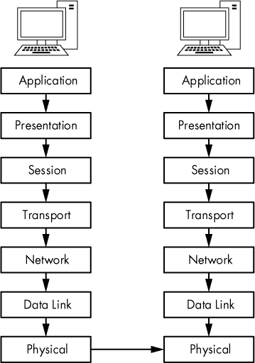
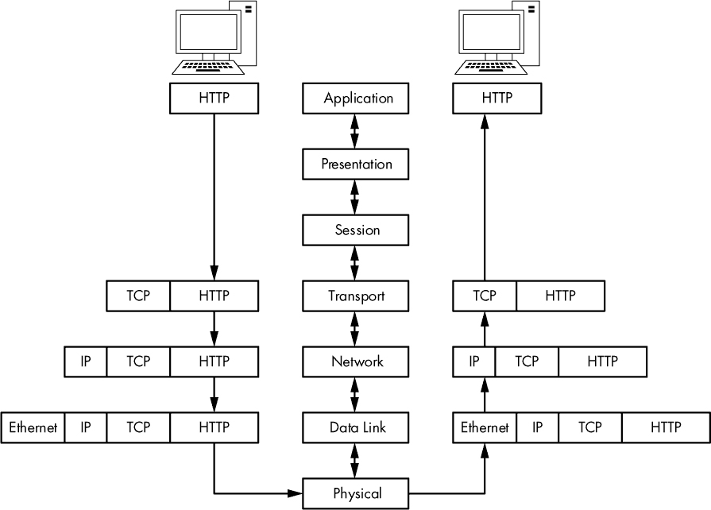
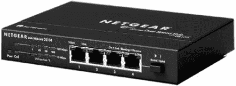
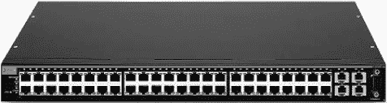
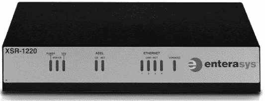
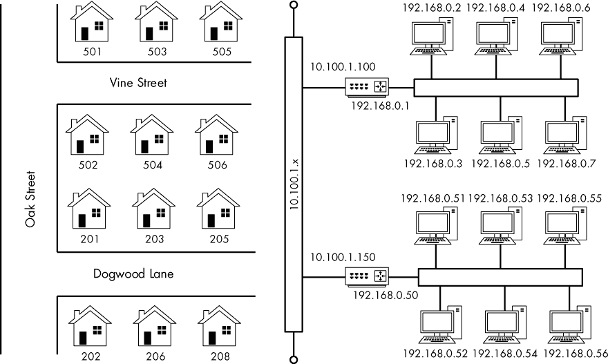
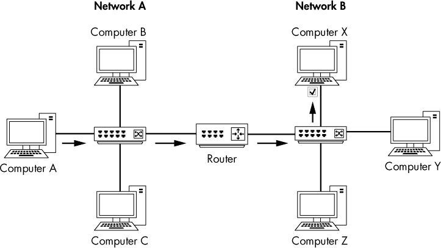
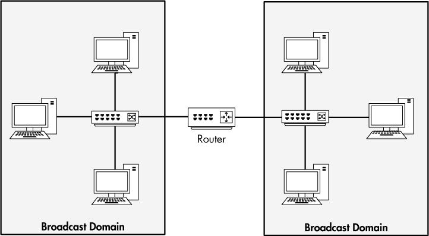

## 1

**数据包分析与网络基础**

每天，计算机网络中可能出现无数种问题——从简单的间谍软件感染到复杂的路由器配置错误——而且不可能立即解决每个问题。我们能做的最好的准备就是拥有应对这些问题所需的知识和工具。

要真正理解网络问题，我们需要从数据包级别入手。所有的网络问题都源自这个层次，在这里，即便是最美观的应用程序也能揭示它们糟糕的实现，而看似值得信任的协议也可能证明是恶意的。在这里，什么都不会被隐藏。没有什么能够通过误导性的菜单结构、引人注目的图形或不可信的员工而被掩盖——没有真正的秘密（只有加密的秘密）。我们在数据包级别上能做的越多，我们就能越多地控制我们的网络并解决问题。这就是数据包分析的世界。

本书将深入探讨这个领域。通过真实场景，你将学习如何解决网络通信缓慢、识别应用程序瓶颈，甚至追踪黑客。读完本书后，你应该能够实施数据包分析技术，帮助你解决自己网络中最棘手的问题。

本章将从基础知识开始，重点介绍网络通信。本部分内容将帮助你获得分析不同场景所需的工具。

### 数据包分析和数据包嗅探器

*数据包分析*，通常称为数据包嗅探或协议分析，描述了捕获和解读网络中实时数据流动的过程，目的是更好地理解网络上发生的事情。数据包分析通常由*数据包嗅探器*执行，这是一种用于捕获通过网络传输的原始数据的工具。

数据包分析可以帮助完成以下任务：

•     理解网络特性

•     了解谁在网络上

•     确定谁或什么在使用可用带宽

•     识别网络使用的高峰时间

•     识别恶意活动

•     寻找不安全且臃肿的应用程序

有多种类型的数据包嗅探程序，包括免费和商业版的。每个程序都有不同的目标。一些流行的数据包分析程序包括 tcpdump、OmniPeek 和 Wireshark（本书主要使用 Wireshark）。OmniPeek 和 Wireshark 具有图形用户界面（GUI），而 tcpdump 是一个命令行程序。

#### *评估数据包嗅探器*

在选择数据包嗅探器时，你需要考虑多个因素，包括以下几点：

**支持的协议**   所有数据包嗅探器都能够解读各种协议。大多数能够解读常见的网络协议（如 IPv4 和 ICMP）、传输协议（如 TCP 和 UDP），甚至应用程序协议（如 DNS 和 HTTP）。然而，它们可能不支持非传统的、更复杂的或较新的协议（如 IPv6、SMBv2 和 SIP）。在选择嗅探器时，确保它支持你将要使用的协议。

**用户友好性**   考虑数据包嗅探器的布局、安装的简便性以及整体工作流程。你选择的程序应该适合你的专业水平。如果你在数据包分析方面经验很少，你可能想避免使用像 tcpdump 这样的高级命令行数据包嗅探器。另一方面，如果你是数据包分析的老手，你可能会发现一个高级程序更为有用。随着经验的积累，你甚至可能会发现结合多个数据包嗅探程序以应对特定场景是非常有用的。

**成本**   数据包嗅探器的一个好处是有许多免费的嗅探器，它们的性能可以媲美任何商业产品。商业产品与其免费的替代品之间最显著的区别在于它们的报告引擎。商业产品通常包括某种形式的精美报告生成模块，而免费应用程序通常没有这种功能，或者仅提供非常有限的报告功能。

**程序支持**   即使你已经掌握了嗅探程序的基础知识，你可能仍然需要支持来解决随着新问题的出现而产生的挑战。在评估可用支持时，寻找开发者文档、公共论坛和邮件列表。虽然像 Wireshark 这样的免费数据包嗅探程序可能缺乏正式的商业支持，但用户和贡献者社区通常会提供活跃的讨论板、维基和博客，帮助你更好地使用数据包嗅探器。

**源代码访问**   一些数据包嗅探器是开源软件。这意味着你可以查看程序的源代码，在某些情况下，甚至可以提出建议并对源代码进行更改。如果你有非常具体或高级的嗅探应用需求，这可能是一个非常吸引人的特点。大多数商业应用程序不提供源代码访问。

**操作系统支持**   不幸的是，并不是所有数据包嗅探器都支持每一个操作系统。请选择一个可以在所有你需要支持的操作系统上运行的工具。如果你是顾问，你可能需要在多种操作系统上捕获和分析数据包，因此你需要一个可以在大多数操作系统上运行的工具。另外，请记住，你有时可能会在一台机器上捕获数据包，并在另一台机器上进行查看。操作系统之间的差异可能迫使你在每个设备上使用不同的应用程序。

#### *数据包嗅探器的工作原理*

数据包嗅探过程涉及软件和硬件的协同工作。这个过程可以分为三个步骤：

1.  **收集：** 首先，数据包嗅探器从网络中收集原始的二进制数据。通常通过将选定的网络接口切换到*混杂模式*来实现。在此模式下，网络卡可以监听网络段上的所有流量，而不仅仅是发送给它的流量。

1.  **转换：** 接下来，将捕获的二进制数据转换为可读形式。这是大多数高级命令行数据包嗅探器能够做到的极限。在此阶段，网络数据只能在非常基础的层面进行解读，剩下的大部分分析则交由最终用户完成。

1.  **分析：** 最后，数据包嗅探器对捕获并转换后的数据进行分析。嗅探器根据提取的信息验证捕获的网络数据的协议，并开始分析该协议的特定特性。

### 计算机如何通信

要完全理解数据包分析，你必须了解计算机是如何相互通信的。在本节中，我们将研究网络协议的基础知识、开放系统互联（OSI）模型、网络数据帧以及支撑这一切的硬件。

#### *协议*

现代网络由运行在多种不同平台上的各种系统组成。为了在系统之间进行通信，我们使用一套称为*协议*的通用语言。常见的协议包括传输控制协议（TCP）、互联网协议（IP）、地址解析协议（ARP）和动态主机配置协议（DHCP）。多个协同工作的协议组合被称为*协议栈*。

可以把协议想象成类似于控制人类语言的规则。每种语言都有一些规则，比如动词变位、如何打招呼，甚至如何恰当地表达感谢。协议的工作方式也类似，允许我们定义数据包应该如何路由，如何初始化连接，以及如何确认接收数据。

协议可以是非常简单的，也可以是高度复杂的，具体取决于其功能。尽管各种协议可能存在显著差异，但许多协议都涉及以下问题：

**连接初始化**  是客户端还是服务器发起了连接？在通信之前必须交换哪些信息？

**连接特征的协商**  协议的通信是否经过加密？加密密钥是如何在通信主机之间传输的？

**数据格式化**  数据包内的数据是如何组织的？接收设备处理数据的顺序是怎样的？

**错误检测与修正**  如果数据包在传输过程中花费太长时间才到达目的地，会发生什么情况？如果客户端在短时间内无法与服务器建立通信，如何恢复？

**连接终止**  一个主机如何向另一个主机表示通信已经结束？为了优雅地终止通信，必须传输哪些最终信息？

#### *七层 OSI 模型*

协议根据其功能根据行业标准的 OSI 参考模型进行分离。这个七层的分层模型有助于理解网络通信。在图 1-1 中，OSI 模型的层级位于右侧，而每一层的数据术语位于左侧。顶部的应用层代表用于访问网络资源的程序。最底层是物理层，网络数据通过它传输。每一层的协议共同作用，确保数据在上下层协议之间得到正确处理。

**注意**

*OSI 模型最初由国际标准化组织（ISO）于 1983 年发布，作为名为 ISO 7498 的文档。OSI 模型只是一个行业推荐的标准。协议开发人员并不要求严格遵循它。事实上，OSI 模型并不是唯一的网络模型；例如，有些人更倾向于使用国防部（DoD）模型，也称为 TCP/IP 模型。*

*图 1-1：OSI 模型七层的分层视图*

每个 OSI 模型层都有特定的功能，如下所示：

**应用层（第 7 层）**  OSI 模型的最顶层为用户提供访问网络资源的方式。这是终端用户通常看到的唯一一层，因为它提供了所有网络活动的基础接口。

**表示层（第 6 层）**  该层将接收到的数据转化为应用层可以读取的格式。这里的数据编码和解码依赖于发送或接收数据的应用层协议。表示层还处理几种形式的加密和解密，用于保护数据安全。

**会话层（第 5 层）**  该层管理两台计算机之间的*对话*，或会话。它在所有通信设备之间建立、管理和终止连接。会话层还负责确定连接是双工（双向）还是半双工（单向），并且负责优雅地关闭主机之间的连接，而不是突然中断连接。

**传输层（第 4 层）**  传输层的主要目的是为下层提供可靠的数据传输服务。通过流量控制、分段/重组和错误控制，传输层确保数据从源点到目的点无误传输。由于确保可靠的数据传输可能非常繁琐，OSI 模型专门为此设立了一个层级。传输层使用面向连接和无连接的协议。某些防火墙和代理服务器在这一层工作。

**网络层（第 3 层）**  这一层是 OSI 模型中最复杂的层之一，负责在物理网络之间路由数据。它负责网络主机的逻辑寻址（例如，通过 IP 地址）。它还处理将数据流分割成较小的片段，并在某些情况下进行错误检测。路由器在这一层操作。

**数据链路层（第 2 层）**  这一层提供了一种在物理网络中传输数据的方法。其主要目的是提供一种可以用来识别物理设备的寻址方案（例如，MAC 地址）。桥接器和交换机是操作在数据链路层的物理设备。

**物理层（第 1 层）**  OSI 模型最底层是网络数据传输的物理介质。此层定义了所有硬件的物理和电气特性，包括电压、集线器、网络适配器、中继器和电缆规格。物理层建立和终止连接，提供共享通信资源的方式，并将信号从数字转换为模拟，反之亦然。

**注意**

*记忆 OSI 模型各层的一种常用助记符是* Please Do Not Throw Sausage Pizza Away. *每个单词的首字母代表 OSI 模型的每一层，从第一层开始。*

表 1-1 列出了 OSI 模型各层中常用的一些协议。

**表 1-1：** OSI 模型各层中常用的协议

| **层级** | **协议** |
| --- | --- |
| 应用层 | HTTP, SMTP, FTP, Telnet |
| 表现层 | ASCII, MPEG, JPEG, MIDI |
| 会话层 | NetBIOS, SAP, SDP, NWLink |
| 传输层 | TCP, UDP, SPX |
| 网络层 | IP, IPX |
| 数据链路层 | 以太网, 令牌环, FDDI, AppleTalk |
| 物理层 | 有线, 无线 |

虽然 OSI 模型仅仅是一个推荐标准，但你应该将它记住，因为它为思考和描述网络问题提供了有用的词汇。随着我们深入本书，你会发现路由器问题很快就成为“第 3 层问题”，而软件问题则被迅速识别为“第 7 层问题”。

**注意**

*有一次，一位同事告诉我，某用户抱怨无法访问网络资源。问题的根本原因是用户输入了错误的密码。我的同事将此称为* 第 8 层问题。 *第 8 层是非官方的用户层。这个术语在那些生活在数据包层次的人中非常常见。*

##### 数据流通过 OSI 模型

网络上的初始数据传输始于发送系统的应用层。数据逐层通过 OSI 模型的七个层级，直到到达物理层，此时发送系统的物理层将数据发送到接收系统。接收系统在其物理层接收数据，然后数据沿着接收系统的各层向上传递，最终到达最上层的应用层。

OSI 模型中的每一层只能与其上下直接相邻的层进行通信。例如，第 2 层只能与第 1 层和第 3 层进行数据交换。

在 OSI 的任何给定层级中，各种协议提供的服务都不是冗余的。例如，如果某一层的协议提供了特定服务，那么其他层级的协议将不会提供相同的服务。不同层级的协议可能具有类似的目标，但它们的实现方式会有所不同。

发送和接收设备上对应层次的协议是互补的。例如，如果发送设备第 7 层的协议负责格式化传输的数据，那么接收设备第 7 层的对应协议则应负责读取这些格式化的数据。

图 1-2 是 OSI 模型与两个通信设备相关的图示。你可以看到数据从一个设备的顶部向下传输，随后当数据到达第二个设备时，传输方向会反转。

*图 1-2：发送和接收系统中相同层次工作的协议*

##### 数据封装

OSI 模型中不同层次的协议通过*数据封装*相互传递数据。堆栈中的每一层都负责在传输的数据上添加一个头部或尾部——这些附加的位置信息允许各层之间进行通信。例如，当传输层从会话层接收数据时，传输层会在传输的数据上添加自己的头部信息，然后将其传递给网络层。

封装过程会创建一个协议数据单元（PDU），它包括被发送的数据和所有附加的头部或尾部信息。随着数据沿着 OSI 模型向下流动，各种协议会添加头部和尾部信息，PDU 会发生变化并不断增长。当 PDU 到达物理层时，它已处于最终形式，此时它将被发送到目标设备。接收设备在数据沿着 OSI 层次反向流动时，会去除 PDU 中的协议头部和尾部。最终，当 PDU 到达 OSI 模型的顶层时，只剩下原始的应用层数据。

**注意**

*OSI 模型使用特定的术语来描述每个层次中的封装数据。物理层包含比特，数据链路层包含帧，网络层包含数据包，传输层包含段。前三层仅使用数据一词。*这种命名法在实践中并不常用，因此我们通常仅使用数据包*一词来指代包括来自一个或多个 OSI 模型层的头部和尾部信息的完整或部分 PDU。*

为了说明数据封装是如何工作的，我们将通过一个简化的实际示例来展示数据包的构建、传输和接收过程，这与 OSI 模型有关。请记住，作为分析师，我们通常不会讨论会话层或表现层，因此在这个示例中（以及本书的其余部分）这两个层将不涉及。

在此场景中，我们正在尝试浏览* [`www.google.com/`](http://www.google.com/) *。首先，我们必须生成一个请求数据包，该数据包从我们的源客户端计算机传输到目标服务器计算机。此场景假设 TCP/IP 通信会话已经建立。图 1-3 展示了此示例中的数据封装过程。

我们从客户端计算机的应用层开始。我们正在浏览一个网站，因此所使用的应用层协议是 HTTP；HTTP 协议将发出命令，从* [google.com](http://google.com) *下载文件* index.html*。

**注意**

*在实际操作中，浏览器首先会请求网站的文档根目录，这通常用斜杠（/）表示。当 web 服务器收到此请求时，它会将浏览器重定向到配置文件中指定的文件，通常是* index.html *或* index.php。 *我们将在第九章讨论 HTTP 时进一步介绍这一过程。*

一旦我们的应用层协议发送了命令，我们关注的就是如何将数据包送达目标。数据包中的数据会沿着 OSI 协议栈向下传递到传输层。HTTP 是一个应用层协议，它使用（或*基于*）TCP，因此 TCP 作为传输层协议，确保数据包的可靠传输。生成一个 TCP 头，并将其添加到 PDU 中，如图 1-3 所示。此 TCP 头包含序列号及其他数据，这些信息会附加到数据包中，确保数据包的正确传送。

*图 1-3：客户端和服务器之间数据封装的图形表示*

**注意**

*我们常说一个协议“依赖于”或“建立在”另一个协议之上，因为 OSI 模型的自上而下设计。例如，像 HTTP 这样的应用协议提供特定服务，并依赖 TCP 确保其服务的可靠交付。这两种服务都依赖网络层的 IP 协议来寻址和传递数据。因此，HTTP 建立在 TCP 之上，而 TCP 则建立在 IP 之上。*

完成其工作后，TCP 将数据包交给 IP，后者是负责数据包逻辑寻址的第三层协议。IP 创建一个包含逻辑寻址信息的头部，将其添加到 PDU 中，并将数据包传递到数据链路层的以太网。物理以太网地址存储在以太网头部中。数据包现在已经完全组装好，并传递到物理层，在那里它以零和一的形式穿越网络。

完整的数据包穿过网络布线系统，最终到达 Google Web 服务器。Web 服务器首先从底层向上读取数据包，这意味着它首先读取数据链路层，其中包含网络卡用来确定数据包是否指向特定服务器的物理以太网地址信息。一旦这些信息处理完毕，第二层信息会被去除，接着处理第三层信息。

第 3 层的 IP 寻址信息被读取，以确保数据包地址正确并且未被分段。此数据也会被去除，以便处理下一个层次的信息。

第 4 层 TCP 信息现在被读取，以确保数据包按顺序到达。然后，第 4 层的头部信息被去除，只留下应用层数据，这些数据可以传递给托管网站的 Web 服务器应用程序。为了响应来自客户端的数据包，服务器应该传输一个 TCP 确认数据包，以便客户端知道它的请求已被接收，随后是*index.html*文件。

所有的数据包都是按照这个示例中的描述构建和处理的，无论使用什么协议。但是，同时请记住，并非每个网络上的数据包都是由应用层协议生成的，因此你会看到只包含第二层、第三层或第四层协议信息的数据包。

#### *网络硬件*

现在是时候看看网络硬件了，这是完成“脏活”的地方。我们将重点介绍一些常见的网络硬件：集线器、交换机和路由器。

##### 集线器

*集线器*通常是一个带有多个 RJ-45 端口的盒子，像图 1-4 所示的 NETGEAR 集线器。集线器的大小从非常小的 4 端口设备到设计用于在企业环境中机架安装的更大 48 端口设备不等。

*图 1-4：典型的 4 端口以太网集线器*

由于集线器可能产生大量不必要的网络流量，并且只能在*半双工模式*下工作（它们不能同时发送和接收数据），因此在大多数现代或高密度网络中通常看不到它们的身影；而是使用交换机（将在下一节讨论）。然而，你应该了解集线器的工作原理，因为在使用第二章中讨论的“集线器外发”技术时，它们对于数据包分析将非常重要。

集线器不过是一个*重复设备*，它在 OSI 模型的物理层上运行。它接收从一个端口发送的数据包，并将其传输（重复）到设备上的所有其他端口，接收设备负责接受或拒绝每个数据包。例如，如果一个连接到 4 端口集线器端口 1 的计算机需要向端口 2 的计算机发送数据，集线器会将这些数据包发送到端口 2、3 和 4。连接到端口 3 和 4 的客户端会检查数据包以太网头部中的目标媒体访问控制（MAC）地址字段，发现数据包不是发给它们的，因此它们会*丢弃*（丢弃）该数据包。图 1-5 展示了一个示例，其中计算机 A 向计算机 B 传输数据。当计算机 A 发送此数据时，所有连接到集线器的计算机都会接收到数据。然而，只有计算机 B 会接受该数据；其他计算机会丢弃该数据。

*图 1-5：计算机 A 通过集线器向计算机 B 传输数据时的流量情况*

举个例子，假设你给公司每一位员工发送了主题为“全体营销人员注意”的电子邮件，而不是只发送给营销部门的员工。营销部门的员工看到邮件是发给他们的，就打开了邮件；其他员工看到邮件不是发给他们的，就把邮件丢弃。你可以看出，这种沟通方式会导致大量不必要的流量和时间浪费，而这正是集线器的工作方式。

在生产环境和高密度网络中，最好的集线器替代品是*交换机*，它们是*全双工设备*，可以同步发送和接收数据。

##### 交换机

与集线器类似，交换机也被设计为重复数据包。然而，与集线器不同的是，交换机并不是将数据广播到每个端口，而是只将数据发送到目标计算机。交换机看起来与集线器非常相似，如图 1-6 所示。

*图 1-6：一款 48 端口机架式以太网交换机*

市面上一些较大的交换机，例如思科品牌的交换机，通常通过专用的厂商特定软件或网页界面进行管理。这些交换机通常被称为*托管交换机*。托管交换机提供了一些在网络管理中非常有用的功能，包括启用或禁用特定端口、查看端口统计信息、进行配置更改以及远程重启等功能。

交换机还提供了处理传输数据包的高级功能。为了能够与特定设备直接通信，交换机必须能够根据设备的 MAC 地址唯一识别设备，这意味着它们必须在 OSI 模型的数据链路层上操作。

交换机将每个连接设备的二层地址存储在一个*CAM 表*中，这个表充当了一个交通警察。当一个数据包被传输时，交换机会读取数据包中的二层头信息，并使用 CAM 表作为参考，决定将数据包发送到哪个端口。交换机只将数据包发送到特定的端口，从而大大减少了网络流量。

图 1-7 展示了通过交换机的流量流动。在这个图中，计算机 A 仅将数据发送给目标接收方：计算机 B。多个对话可以同时在网络上发生，但信息是直接在交换机与目标接收方之间传输，而不是在交换机与所有连接的计算机之间传输。

*图 1-7：计算机 A 通过交换机将数据传输到计算机 B 时的流量流动*

##### 路由器

*路由器*是一种功能远超交换机或集线器的高级网络设备。路由器有许多不同的形状和形式，但大多数设备的前面有几个 LED 指示灯，背面有一些网络端口，具体取决于网络的大小。图 1-8 展示了一个小型路由器的示例。

*图 1-8：适用于小型到中型网络的低端 Enterasys 路由器*

路由器在 OSI 模型的第三层操作，负责在两个或多个网络之间转发数据包。路由器用于指导网络间流量流动的过程被称为*路由*。几种不同类型的路由协议决定了如何将不同类型的数据包路由到其他网络。路由器通常使用第三层地址（例如 IP 地址）来唯一标识网络上的设备。

一个很好的方法来说明路由的概念是用有多条街道的社区作类比。把每栋房子及其地址看作是计算机。然后把每条街道看作是一个网络段。图 1-9 展示了这个对比。从你的房子出发，你可以通过从你家门口直走到邻居家门口的方式，轻松拜访住在同一街道上的邻居。同样，交换机允许网络段内所有计算机之间进行通信。

然而，与住在另一条街道的邻居沟通就像与不在同一网段的计算机通信。参见图 1-9，假设你坐在 502 Vine Street，需要到达 206 Dogwood Lane。为了做到这一点，你必须先转到 Oak Street，然后转到 Dogwood Lane。可以将这看作是跨越网络段。如果 192.168.0.3 的设备需要与 192.168.0.54 的设备通信，它必须跨越一个路由器才能进入 10.100.1.x 网络，然后再跨越目标网络段的路由器，才能到达目标网络段。

网络上路由器的数量和大小通常取决于网络的规模和功能。个人和家庭办公室网络可能只有一个小型路由器，位于网络的边缘。而大型企业网络可能在各个部门之间有多个路由器，这些路由器都连接到一个大型中央路由器或层 3 交换机（这是一种高级交换机，具有内置的路由器功能）。

*图 1-9：路由网络与街道的比较*

随着你查看越来越多的网络图，你将逐渐理解数据如何通过这些不同的点流动。图 1-10 展示了一个非常常见的路由网络的布局。在这个例子中，两个独立的网络通过一个路由器连接。如果网络 A 上的计算机希望与网络 B 上的计算机通信，那么传输的数据必须经过路由器。

*图 1-10：计算机 A 在一个网络上传输数据到另一个网络上的计算机 X 时，流量的流动*

### 流量分类

网络流量可以分为三种类型：广播、组播和单播。每种类型都有独特的特征，决定了该类数据包如何被网络硬件处理。

#### *广播流量*

一个*广播数据包*是发送到网络段上所有端口的数据包，无论给定端口是集线器还是交换机。

广播流量有层 2 和层 3 两种形式。在层 2，MAC 地址 ff:ff:ff:ff:ff:ff 是保留的广播地址，发送到这个地址的任何流量都会广播到整个网络段。层 3 也有一个特定的广播地址，但它根据使用的网络地址范围而有所不同。

一个 IP 网络范围内最高的 IP 地址是保留用作广播地址的。例如，如果你的计算机地址是 192.168.0.20，子网掩码是 255.255.255.0，那么 192.168.0.255 就是广播地址（有关 IP 地址的更多信息，请参见第七章）。

广播包可以传播的范围称为*广播域*，这是一个网络段，任何计算机都可以直接向另一台计算机发送数据包，而无需通过路由器。在拥有多个集线器或交换机并通过不同介质连接的较大网络中，从一个交换机发送的广播包会传送到网络中所有其他交换机的所有端口，因为广播包会从一个交换机重复传送到另一个交换机。图 1-11 展示了一个小型网络中两个广播域的示例。由于每个广播域会扩展到路由器，因此广播包仅在这个指定的广播域内循环。

*图 1-11：广播域扩展到当前路由段后面的所有内容。*

我们之前的邻里类比也很好地帮助理解了广播域是如何工作的。你可以把广播域想象成一个邻里街道，街道上所有的邻居都坐在自家的门廊上。如果你站在门廊上大喊，街道上的人都会听到你。然而，如果你想和不同街道上的人交谈，你需要找到一种方式直接与那个人沟通，而不是从门廊上大喊（广播）。

#### *多播流量*

*多播*是一种将数据包从单一源同时传输到多个目的地的方式。多播的目标是尽可能使用最少的带宽。优化这种流量的方法在于，数据流沿路径复制的次数较少，直到到达目的地。多播流量的具体处理方式高度依赖于各个协议的实现。

实现多播流量的主要方法是通过一种寻址方案，将数据包接收者加入到一个多播组中。这就是 IP 多播的工作方式。这种寻址方案确保数据包不会被传输到不属于目标的计算机。实际上，IP 专门为多播保留了一个完整的地址范围。如果你看到一个 IP 地址在 224.0.0.0 到 239.255.255.255 的范围内，那么它很可能是在处理多播流量，因为这些范围是为此目的保留的。

#### *单播流量*

*单播数据包*是从一台计算机直接传输到另一台计算机。单播的具体功能取决于使用它的协议。例如，假设有一个设备想与一台网页服务器进行通信。这是一个一对一的连接，因此，通信过程将从客户端设备向网页服务器发送数据包开始。

### 总结思考

本章介绍了你作为数据包分析基础所需的网络基础知识。在开始排查网络问题之前，你*必须*理解这一层次的网络通信发生了什么。在第二章中，我们将探讨多种捕获你需要分析的数据包的技术。
