## 第二章：**接入网络线路**

对于有效的数据包分析来说，关键决策之一是将数据包嗅探器物理放置在哪个位置，以便适当地捕获数据。数据包分析员通常称将数据包嗅探器放置到网络中为*嗅探线路*、*接入网络*或*接入网络线路*。

不幸的是，嗅探数据包并不像将笔记本电脑插入网络端口并捕获流量那么简单。实际上，有时将数据包嗅探器放置到网络上，比实际分析数据包还要困难。嗅探器的放置具有挑战性，因为设备可以通过多种不同的网络硬件进行连接。图 2-1 展示了一个典型情况。由于现代网络中的设备（交换机和路由器）对流量的处理方式不同，因此在分析网络时，必须考虑到网络的物理布局。

本章的目标是帮助你理解在不同网络拓扑中放置数据包嗅探器的方式。但首先，让我们来看看我们是如何看到所有穿越我们接入的网络线路的数据包的。

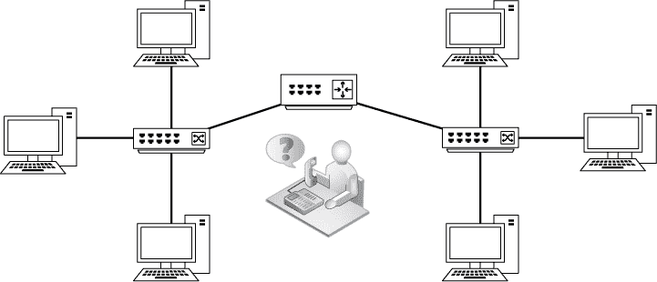

*图 2-1：当网络连接较多时，放置嗅探器在网络上可能会具有挑战性，获取所需的数据也可能变得棘手。*

### 肆意生活

在你能够嗅探网络上的数据包之前，你需要一张支持混杂模式驱动程序的网络接口卡（NIC）。*混杂模式*允许 NIC 查看所有穿越线路的数据包。

正如你在第一章中学到的那样，在网络广播流量中，设备通常会接收到并非专门发送给它们的数据包。例如，地址解析协议（ARP）是任何网络中至关重要的协议，我们将在第七章中深入探讨，它用于确定哪个 MAC 地址与特定的 IP 地址相对应。为了找到匹配的 MAC 地址，设备会向其广播域中的所有设备发送 ARP 广播数据包，希望正确的设备能够响应。

广播域（任何计算机可以直接向另一台计算机发送数据包而不通过路由器的网络段）可以由多台设备组成，但只有广播域中正确的接收设备应该对所传输的 ARP 广播数据包感兴趣。如果网络上的每一台设备都处理 ARP 广播数据包，那将是极其低效的。相反，如果数据包不是面向该设备并且因此对它没有用，设备的 NIC 会丢弃该数据包，而不是将其传递给 CPU 进行处理。

丢弃不面向接收主机的数据包可以提高处理效率，但这对数据包分析员来说并不是那么理想。作为分析员，我们通常希望捕获通过网络传输的*每个*数据包，以免错过一些关键信息。

我们可以通过使用网卡的混杂模式来确保捕获所有流量。在混杂模式下，网卡会将它看到的每个数据包都传递给主机的处理器，无论地址如何。一旦数据包到达 CPU，数据包嗅探应用程序就可以将其抓取进行分析。

大多数现代网卡都支持混杂模式，而 Wireshark 包含 libpcap/WinPcap 驱动程序，允许它通过 Wireshark GUI 将网卡直接切换到混杂模式。（我们将在第三章中详细讨论 libpcap/WinPcap。）

本书要求你必须拥有支持使用混杂模式的网卡和操作系统。唯一不需要在混杂模式下嗅探的情况是，当你只想查看直接发送到你嗅探的接口的 MAC 地址的流量时。

**注意**

*大多数操作系统（包括 Windows）不会允许你在没有提升用户权限的情况下使用网卡的混杂模式。如果你无法合法地获得这些权限，那么你很可能不应该在该网络上进行任何类型的数据包嗅探。*

### 嗅探集线器网络

在安装了集线器的网络上进行嗅探是任何数据包分析师的梦想。正如你在第一章中学到的那样，集线器传输的流量会通过连接到该集线器的每个端口。因此，要分析通过连接到集线器的计算机的流量，你只需将数据包嗅探器连接到集线器上的空闲端口即可。你将能够看到该计算机的所有通信，以及连接到该集线器的任何其他设备之间的所有通信。如图 2-2 所示，当你的嗅探器连接到集线器网络时，您的可视窗口是无限的。

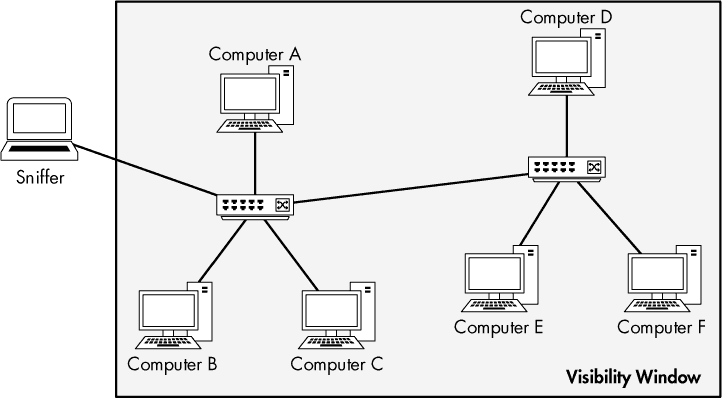

*图 2-2：在集线器网络上嗅探提供了一个无限的可视窗口。*

**注意**

*如本书各个图表中所示，*可视窗口*表示网络上你可以用数据包嗅探工具看到流量的设备。*

对我们来说，不幸的是，基于集线器的网络已经很少见，因为它们给网络管理员带来了很多麻烦。由于在任何时候只有一个设备可以通过集线器进行通信，连接的设备必须与所有其他试图通信的设备竞争带宽。当两个或更多设备同时通信时，数据包会发生冲突，如图 2-3 所示。结果可能是数据包丢失，通信设备可能会通过重新传输数据包来补偿丢失，从而增加网络拥塞。随着流量和冲突次数的增加，设备可能需要传输数据包三到四次，网络性能会显著下降。因此，很容易理解为什么大多数现代网络都使用交换机。虽然在现代网络中很少见到集线器，但在支持旧版硬件或特殊设备的网络中，例如工业控制系统（ICS）网络中，偶尔会遇到它们。

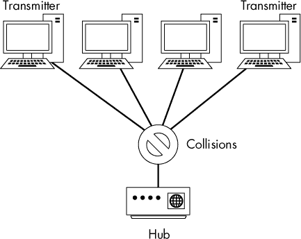

*图 2-3：当两个或更多设备同时发送数据时，集线器网络会发生数据包冲突。*

识别网络中是否使用集线器的最简单方法是查看服务器机房或网络机柜。大多数集线器上都会有标签。如果一切都失败了，只需在服务器机柜的最暗角落寻找那些布满几英寸灰尘的网络硬件。

### 在交换环境中的嗅探

交换机是现代网络中最常用的连接设备。它们通过广播、单播和多播流量提供高效的数据传输方式。交换机支持全双工通信，这意味着设备可以同时发送和接收数据。

对数据包分析师来说，不幸的是，交换机增加了复杂性。当你将嗅探器连接到交换机的端口时，你只能看到广播流量以及嗅探器所在设备发送和接收的流量，如图 2-4 所示。为了捕获交换网络中目标设备的流量，你需要采取额外的步骤。

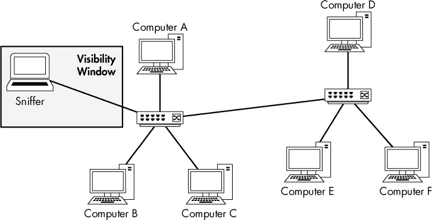

*图 2-4：在交换网络中，能看到的流量窗口仅限于你连接的端口。*

捕获这些流量的四种主要方法是：端口镜像、集线器连接、使用网络采集器（tap）和 ARP 缓存中毒。

#### *端口镜像*

*端口镜像*，或称*端口跨越*，可能是捕获交换网络中目标设备流量的最简单方法。在这种设置中，你必须能够访问目标计算机所在交换机的命令行或网页管理界面。此外，交换机必须支持端口镜像并且具有一个空闲端口，以便你可以连接你的嗅探器。

要启用端口镜像，你需要发出一个命令，强制交换机将一个端口上的所有流量复制到另一个端口。例如，为了捕获从交换机的端口 3 发送和接收的所有流量，你可以将分析仪插入端口 4，并将端口 3 镜像到端口 4。图 2-5 展示了端口镜像的情况。

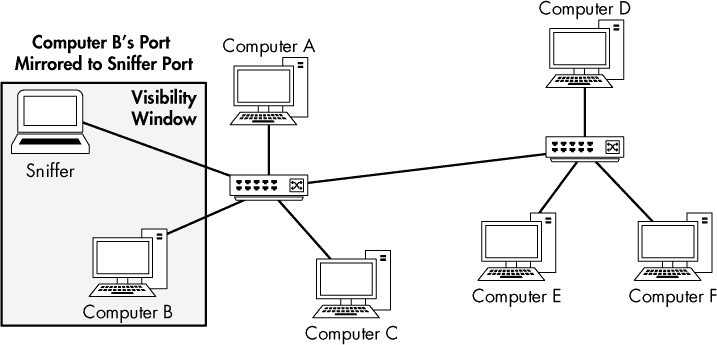

*图 2-5：端口镜像允许你扩展交换网络中的可视窗口。*

设置端口镜像的方式取决于交换机的制造商。对于大多数企业级交换机，你需要登录到命令行界面，并使用特定命令配置端口镜像。你可以在表 2-1 中找到一些示例的端口镜像命令。

**表 2-1：** 启用端口镜像的命令

| **制造商** | **命令** |
| --- | --- |
| Cisco | `set span <`source port`> <`destination port`>` |
| Enterasys | `set port mirroring create <`source port`> <`destination port`>` |
| Nortel | `port-mirroring mode mirror-port <`source port`> monitor-port <`destination port`>` |

**注意**

*一些企业交换机提供基于 Web 的 GUI，提供端口镜像作为选项，但这些并不常见，且没有统一标准。然而，如果你的交换机提供了通过 GUI 配置端口镜像的有效方式，当然可以使用它。另外，更多的小型办公室和家庭办公室（SOHO）交换机开始提供端口镜像功能，通常是通过 GUI 配置的。*

在进行端口镜像时，注意你正在镜像的端口的吞吐量。一些交换机制造商允许将多个端口镜像到一个端口，这在分析单个交换机上两个或更多设备之间的通信时可能非常有用。然而，让我们通过一些基本的数学来考虑可能发生的情况。如果你有一台 24 个端口的交换机，并将 23 个全双工 100Mbps 端口镜像到一个端口，那么这个端口的流量可能高达 4600Mbps。这远远超过了单个端口的物理阈值，因此，如果流量达到一定水平，可能会导致丢包或网络延迟。这种情况有时被称为超额订阅。在这些情况下，交换机可能会完全丢弃多余的包，甚至“暂停”其内部电路，导致通信中断。在进行捕获时，务必确保不会引发此类问题。

端口镜像可能看起来是一个有吸引力的低成本解决方案，适用于需要持续监控特定网络段的企业网络和场景，例如在网络安全监控中。然而，这种技术通常不足以在此类应用中提供足够的可靠性，尤其是在高吞吐量的情况下，端口镜像可能会提供不一致的结果，并导致数据丢失，难以追踪。在这种情况下，建议使用“使用 TAP”中讨论的 TAP，详见第 24 页。

#### *通过集线器隔离*

捕获通过目标设备的流量的另一种方法是在交换网络中使用*集线器隔离*。通过这种技术，你可以将目标设备和分析仪系统直接插入集线器，将它们放置在同一网络段。许多人将集线器隔离视为“作弊”，但当你无法执行端口镜像，并且仍能物理接触目标设备连接的交换机时，这实际上是一个有效的解决方案。

要进行集线器隔离，你只需要一个集线器和几根网络电缆。得到硬件后，按以下方式连接：

1.  找到目标设备所在的交换机并将目标设备从网络中拔掉。

1.  将目标设备的网络线插入到集线器中。

1.  插入另一条连接分析仪与集线器的电缆。

1.  将一根网络电缆从集线器插入到网络交换机，以将集线器连接到网络。

现在你已经将目标设备和分析仪放在同一广播域中，所有来自目标设备的流量将被广播，以便分析仪能够捕获这些数据包，如图 2-6 所示。

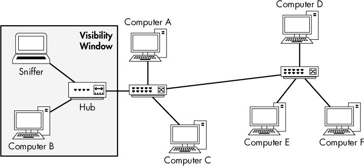

*图 2-6：通过集线器隔离了目标设备和分析仪。*

在大多数情况下，通过集线器隔离会将目标设备的双工模式从全双工（双向）减少到半双工（单向）。虽然这种方法不是捕获数据包最干净的方式，但当交换机不支持端口镜像时，有时它是你唯一的选择。但请记住，你的集线器也需要电源连接，而这可能很难找到。

**注意**

*提醒一下，通常在拔掉设备前通知设备的用户是一个很好的举动，特别是当该用户恰好是公司的 CEO 时！*

**找到“真正的”集线器**

在进行集线器隔离时，确保你使用的是一个真正的集线器，而不是错误标记的交换机。许多网络硬件供应商有一个坏习惯，将一种低级交换机标记并销售为“集线器”。如果你没有使用经过验证的集线器，你只会看到你自己的流量，而看不到目标设备的流量。

当你找到一个你认为是集线器的设备时，测试它以确保其功能。确定设备是否为真正集线器的最佳方法是将一对计算机连接到该设备，看看是否其中一台计算机能够嗅探到另一台计算机与网络上其他设备（如另一台计算机或打印机）之间的流量。如果能，你就找到了一个可靠的设备！

由于集线器（hubs）已经过时，现在几乎不再大规模生产了。几乎不可能在市面上买到真正的集线器，所以你需要发挥创造力才能找到一个。一个很好的来源通常是你当地学区举行的 surplus 拍卖。公立学校在处理剩余物品前必须尝试拍卖这些物品，它们通常会有一些旧硬件堆放在一旁。我见过有人在拍卖会上以低于一盘白豆和玉米面包的价格买到好几个集线器。或者，eBay 也是一个不错的集线器来源，但要小心，因为你可能会碰到标错的交换机。

#### *使用 Tap*

大家都知道“为什么吃鸡肉，而你可以吃牛排？”（或者，如果你来自南方，“为什么吃肝酱，而你可以吃炸香肠？”）这种选择同样适用于集线器与使用 tap 之间的对比。

网络*tap*是一种硬件设备，你可以将其放置在电缆系统的两个点之间，以捕获这两个点之间的数据包。与集线器（hubbing out）类似，你需要在网络中放置一台硬件设备，允许你捕获所需的数据包。不同之处在于，你不是使用集线器，而是使用一种专门为网络分析设计的硬件设备。

网络 tap 主要有两种类型：*聚合型*和*非聚合型*。这两种类型的 tap 都位于两台设备之间，用于嗅探通信。聚合型 tap 与非聚合型 tap 的主要区别在于，非聚合型 tap 有四个端口，如图 2-7 所示，需要独立的接口来监控双向流量，而聚合型 tap 只有三个端口，只需一个接口即可进行双向流量监控。

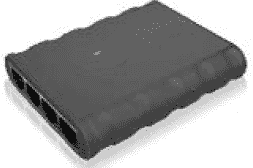

*图 2-7：一款 Barracuda 非聚合型 tap*

Tap 通常需要一个电源连接，尽管有些 tap 内置电池，允许进行短时间的数据包嗅探。

##### 聚合型 Tap

聚合型 tap 是最简单的使用方式。它只有一个物理监控端口，适用于双向流量嗅探。

若要捕获从插入交换机的单台计算机的所有流量，请按照以下步骤操作：

1.  从交换机上拔下计算机。

1.  将一端的网络电缆插入计算机，另一端插入 tap 的“in”端口。

1.  将另一端的网络电缆插入 tap 的“out”端口，另一端插入网络交换机。

1.  将一端的电缆插入 tap 的“monitor”端口，另一端插入作为嗅探器的计算机。

聚合型 tap 应按照图 2-8 所示进行连接。此时，你的嗅探器应该已经捕获了所有进出你插入 tap 的计算机的流量。

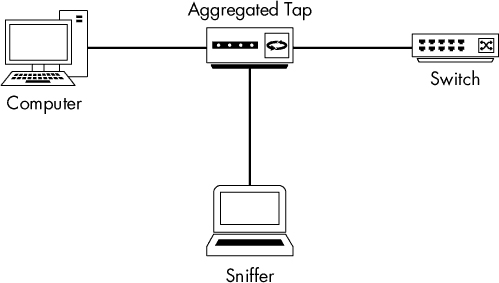

*图 2-8：使用聚合 tap 拦截网络流量*

##### 非聚合型 Tap

非聚合 tap 比聚合类型稍微复杂一些，但在捕获流量时提供了更多的灵活性。与聚合 tap 只有一个可用于监听双向通信的监视端口不同，非聚合 tap 具有两个监视端口。一个监视端口用于嗅探来自连接到 tap 的计算机的单向流量，另一个监视端口用于嗅探流向连接到 tap 的计算机的单向流量。

要捕获所有流入和流出单台计算机的流量，请按照以下步骤操作：

1.  将计算机从交换机上拔掉。

1.  将一根网线的一端插入计算机，另一端插入 tap 的“in”端口。

1.  将另一根网线的一端插入到 tap 的“out”端口，另一端插入到网络交换机中。

1.  将第三根网线的一端插入到 tap 的“monitor A”端口，另一端插入到充当嗅探器的计算机的一个 NIC 端口。

1.  将一根网线的一端插入到 tap 的“monitor B”端口，另一端插入到充当嗅探器的计算机的第二个 NIC 端口。

非聚合 tap 应按照图 2-9 所示的方式连接。

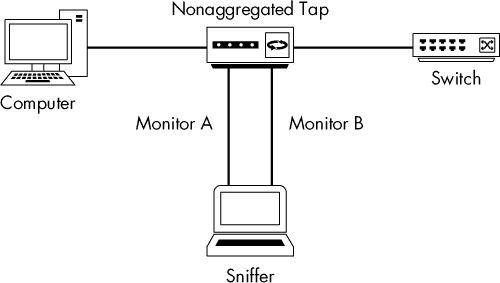

*图 2-9：使用非聚合 tap 拦截网络流量*

虽然这些示例可能让你觉得只能通过 tap 监控单个设备，但实际上通过巧妙地放置 tap，你可以监控多个设备。例如，如果你想监控整个网络段与互联网之间的所有通信，可以将 tap 放置在连接所有其他设备的交换机与网络上游路由器之间。将 tap 放置在网络瓶颈点可以让你收集所需的流量。这种策略在安全监控中很常见。

##### 选择网络 tap

哪种类型的 tap 更好？在大多数情况下，聚合 tap 更受欢迎，因为它们需要较少的布线，并且不需要在嗅探计算机上安装两个 NIC。然而，如果你需要捕获大量流量或只关心单向流量，非聚合 tap 则是更好的选择。

你可以购买各种大小的 tap，从简单的以太网 tap（大约 150 美元）到企业级光纤 tap（价格达到六位数）。我曾使用过 Ixia（前身为 Net Optics）、Dualcomm 和 Fluke Networks 的企业级 tap，效果非常好，但市场上也有许多其他优秀的 tap。如果你在企业应用中使用 tap，你需要确保 tap 具备故障开放功能。这意味着，如果 tap 发生故障或失效，数据包仍然会通过 tap 传输，且连接到 tap 的网络链路不会中断。

#### *ARP 缓存中毒*

我最喜欢的窃听技术之一就是 ARP 缓存中毒。我们将在第七章中详细讨论 ARP 协议，但在这里简要说明一下，以便你理解这种技术是如何工作的。

##### ARP 过程

回顾第一章，OSI 模型的第 2 层和第 3 层是两种主要的包地址类型。这些第 2 层地址，或称 MAC 地址，与您使用的任何第 3 层地址系统一起使用。在本书中，按照行业标准术语，我将第 3 层地址系统称为*IP 地址系统*。

网络上的所有设备都使用 IP 地址在第 3 层进行通信。由于交换机在 OSI 模型的第 2 层工作，它们只关心第 2 层的 MAC 地址，因此设备必须能够在构造的数据包中包含这些信息。当 MAC 地址未知时，必须通过已知的第 3 层 IP 地址获取，以便将流量转发到适当的设备。这一翻译过程是通过第 2 层协议 ARP 完成的。

对于连接到以太网网络的计算机，ARP 过程在一台计算机希望与另一台计算机通信时开始。发送计算机首先检查其 ARP 缓存，看看是否已经拥有与目标计算机的 IP 地址相关联的 MAC 地址。如果没有，它会发送一个 ARP 请求到数据链路层的广播地址 ff:ff:ff:ff:ff:ff，如第一章所讨论的那样。这个广播包会被该特定以太网段上的每台计算机接收。该包基本上是在询问：“哪个 IP 地址拥有 *xx:xx:xx:xx:xx:xx* MAC 地址？”

没有目标计算机 IP 地址的设备会直接丢弃这个 ARP 请求。目标计算机通过 ARP 回复包回复其 MAC 地址。此时，原始发送计算机现在拥有了与远程计算机通信所需的数据链路层地址信息，并将这些信息存储在其 ARP 缓存中，以便快速检索。

##### ARP 缓存中毒是如何工作的

*ARP 缓存中毒*，有时也叫做 *ARP 欺骗*，是一种在交换网络中窃听信号的高级技术。它通过向以太网交换机或路由器发送带有虚假 MAC（第 2 层）地址的 ARP 消息，来拦截另一台计算机的流量。图 2-10 展示了这一设置。

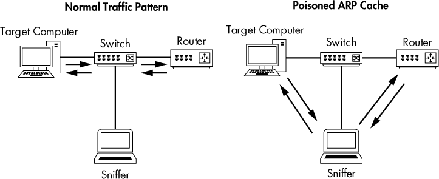

*图 2-10：ARP 缓存中毒可以让你拦截目标计算机的流量。*

这种技术通常被攻击者用来向客户端系统发送虚假地址的数据包，以拦截特定流量或对目标发起拒绝服务（DoS）攻击。然而，它也可以是捕获交换网络上目标机器数据包的一种合法方式。

##### 使用 Cain & Abel

在尝试进行 ARP 缓存中毒时，第一步是获取必要的工具并收集一些信息。为了演示，我们将使用来自 oxid.it 的流行安全工具 Cain & Abel（* [`www.oxid.it/`](http://www.oxid.it/)*），它支持 Windows 系统。按照网站上的指示下载并安装它。

**注意**

*当你尝试下载 Cain & Abel 时，杀毒软件或浏览器很可能会将该软件标记为恶意软件或“黑客工具”。这个工具有多种用途，其中一些可能是恶意的。但在我们的使用中，它对你的系统没有威胁。*

在你能使用 Cain & Abel 之前，你需要收集一些信息，包括分析器系统的 IP 地址、你希望捕获流量的远程系统的 IP 地址以及该远程系统下游的路由器。

当你第一次打开 Cain & Abel 时，你会注意到窗口顶部有一系列标签。（ARP 缓存中毒只是 Cain & Abel 的一个功能。）为了我们的目的，我们将在嗅探器标签下操作。当你点击这个标签时，你应该看到一个空表格，如图 2-11 所示。

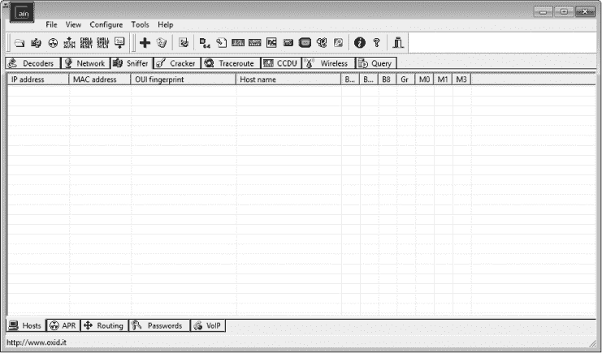

*图 2-11：Cain & Abel 主窗口中的嗅探器标签*

要完成这个表格，你需要激活程序的内置嗅探器，并扫描你的网络以寻找主机。请按照以下步骤操作：

1.  单击工具栏上从左侧数起的第二个图标，它类似于一个网络接口卡（NIC）。

1.  系统会要求你选择一个你希望进行嗅探的接口。选择连接到你将执行 ARP 缓存中毒操作的网络的接口。如果这是你第一次使用 Cain & Abel，选择该接口并点击**确定**。否则，如果你之前在 Cain & Abel 中选择过一个接口，那么你的选择将会被保存，你需要再次点击 NIC 图标以选择接口。（确保按下该按钮以激活 Cain & Abel 内置的嗅探器。）

1.  要建立一个可用主机列表，点击加号（+）按钮。MAC 地址扫描器对话框会出现，如图 2-12 所示。**我的子网中的所有主机**单选按钮应该被选中（或者如果需要，你可以指定一个地址范围）。点击**确定**继续。

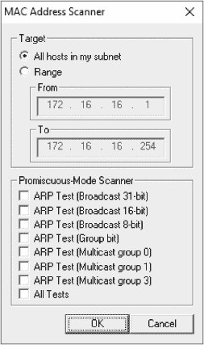

*图 2-12：使用 Cain & Abel 网络发现工具扫描 MAC 地址*

一些 Windows 10 用户报告称 Cain & Abel 无法确定他们网络接口的 IP 地址，导致无法完成此过程。如果你遇到这个问题，在配置网络接口时你会看到接口的 IP 地址是 0.0.0.0。为了解决这个问题，请按照以下步骤操作：

1.  如果 Cain & Abel 已打开，关闭它。

1.  在桌面搜索栏中，输入 ncpa.cpl 以打开网络连接对话框。

1.  右键点击你将要进行嗅探的网络接口，然后点击**属性**。

1.  双击 **Internet Protocol Version 4 (TCP/IPv4)**。

1.  点击 **高级** 按钮并选择 **DNS** 标签。

1.  选中 **使用此连接的 DNS 后缀进行 DNS 注册** 旁边的复选框以激活它。

1.  点击 **OK** 退出打开的对话框并重新启动 Cain & Abel。

网格现在应该填充了你附加网络上所有主机的列表，以及它们的 MAC 地址、IP 地址和厂商信息。这是你在设置 ARP 缓存中毒时将要使用的列表。

在程序窗口的底部，你应该看到一组标签，点击它们将带你进入嗅探器下的其他窗口。现在你已经构建了主机列表，你将从 APR（用于 ARP 中毒路由）标签开始工作。现在点击该标签切换到 APR 窗口。

一旦进入 APR 窗口，你将看到两个空表格。在你完成设置步骤后，上方的表格将显示涉及你 ARP 缓存中毒的设备，下方的表格将显示你中毒机器之间的所有通信。

要设置你的中毒过程，按照以下步骤操作：

1.  点击屏幕上方的空白区域。然后点击程序标准工具栏上的加号（+）按钮。

1.  出现的窗口有两个选择面板。在左侧，你会看到网络中所有可用主机的列表。如果你点击目标计算机的 IP 地址，右侧面板将显示网络中所有主机的列表，除了目标机器的 IP 地址。

1.  在右侧面板中，点击目标机器上游路由器的 IP 地址，如 图 2-13 所示，然后点击 **OK**。现在，两个设备的 IP 地址应该已列在主应用窗口的上方表格中。

1.  为完成该过程，点击标准工具栏上的黄黑色辐射符号。这将激活 Cain & Abel 的 ARP 缓存中毒功能，并允许你的分析系统成为目标系统与其上游路由器之间所有通信的中介。

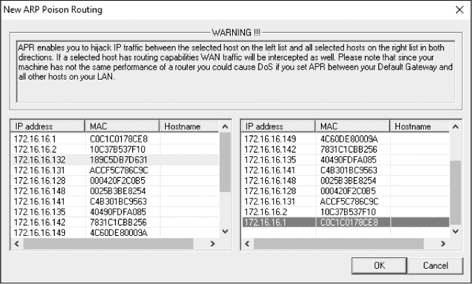

*图 2-13：选择你希望启用 ARP 缓存中毒的设备*

你现在应该能够启动数据包嗅探器并开始分析过程。当你完成捕获流量后，只需再次点击黄黑色辐射符号以停止 ARP 缓存中毒。

##### 关于 ARP 缓存中毒的警告

关于 ARP 缓存中毒的最后提醒：你应该非常清楚你实施此过程时系统的角色。例如，当目标设备是网络利用率非常高的设备时，不要使用此技术，比如一个与网络连接速度为 1Gbps 的文件服务器（尤其是当你的分析系统只提供 100Mbps 的连接时）。

当你使用本示例中展示的技术重新路由流量时，所有传输和接收的流量必须首先经过你的分析系统，因此使得你的分析系统成为通信过程中的瓶颈。这个重新路由的过程可能会对你正在分析的机器造成类似 DoS 攻击的效果，导致网络性能下降和分析数据错误。流量拥堵还可能阻止基于 SSL 的通信按预期工作。

**注意**

*你可以通过使用一种叫做不对称路由的功能，避免所有流量都经过你的分析系统。如需了解更多关于这一技术的信息，请参阅 oxid.it 用户手册*（[`www.oxid.it/ca_um/topics/apr.htm`](http://www.oxid.it/ca_um/topics/apr.htm)）。

### 在路由环境中的嗅探

所有在交换网络上截取数据的技术同样适用于路由网络。处理路由环境时，唯一需要特别考虑的重要因素是，当你在排查涉及多个网络段的问题时，嗅探器的布置位置至关重要。

正如你所学到的，一个设备的广播域会一直扩展，直到遇到路由器为止，这时流量会被传递到下一个上游路由器。当数据必须经过多个路由器时，分析所有路由器两侧的流量非常重要。

例如，考虑一下你可能在一个通过多个路由器连接的网络中遇到的问题。在这个网络中，每个网络段与上游网络段进行通信以存储和检索数据。在图 2-14 中，我们试图解决的问题是，下游子网网络 D 无法与网络 A 中的任何设备通信。

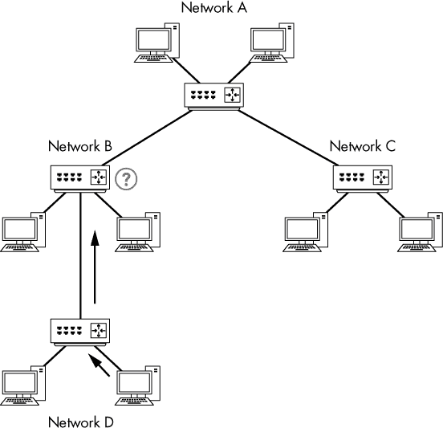

*图 2-14：网络 D 中的一台计算机无法与网络 A 中的计算机通信。*

如果你嗅探网络 D 中一台与其他网络设备通信有问题的设备流量，你可能会清楚地看到数据被传输到另一个网络段，但却看不到返回的数据。如果你重新考虑嗅探器的位置，并开始嗅探下一个上游网络段（网络 B）的流量，你将更清晰地了解发生了什么。这时，你可能会发现流量被网络 B 的路由器丢弃或错误路由。最终，这将引导你发现路由器配置的问题，经过修正后，解决了你更大的困境。虽然这个场景有些宽泛，但故事的教训是：在处理多个路由器和网络段时，你可能需要稍微移动嗅探器，以获取完整的图景并精确定位问题。

**网络拓扑图**

在我们讨论网络布置时，我们已经研究了几张网络拓扑图。*网络拓扑图*，或称*网络示意图*，展示了网络中的所有技术资源及其连接方式。

没有什么比可视化网络更能帮助你确定数据包嗅探器的部署位置。如果你有网络拓扑图，请随时带着它，因为它将在故障排除和分析过程中发挥重要作用。你甚至可以想要制作自己网络的详细图。记住，有时故障排除的一半工作就是确保你收集到了正确的数据。

### 嗅探器部署实践

我们已经看过了四种在切换环境中捕获网络流量的方法。如果我们考虑仅在单个设备上安装数据包嗅探应用程序并捕获该设备的流量（*直接安装法*），我们还可以再增加一种方法。考虑到这五种方法，确定哪种方法最合适可能有些混乱。表 2-2 提供了每种方法的一些基本指南。

作为分析员，我们需要尽可能隐秘。在一个理想的世界里，我们收集所需的数据而不留下任何痕迹。就像法医调查员不希望污染犯罪现场一样，我们也不希望污染捕获的网络流量。

**表 2-2：** 切换环境中的数据包嗅探指南

| **技术** | **指南** |
| --- | --- |
| 端口镜像 | •     不会在网络上留下痕迹，也不会生成额外的数据包。•     可以在不使客户端下线的情况下配置，非常方便用于镜像路由器或服务器端口。•     需要交换机的处理资源，并且在高吞吐量下可能不稳定。 |
| 通过集线器连接 | •     当你不担心暂时使主机下线时有效。•     当必须从多个主机捕获流量时无效，因为可能会发生冲突和丢包。•     在现代 100/1000Mbps 主机上可能会丢失数据包，因为大多数集线器的速度仅为 10Mbps。 |
| 使用分接器 | •     当你不担心暂时使主机下线时，这是理想选择。•     当需要嗅探光纤连接的流量时，这是唯一的选择。•     由于分接器可靠且可以扩展到高吞吐量链路，因此它是企业数据包捕获和持续监控的首选方案。•     由于分接器是为此任务专门设计的，并且能够支持现代网络速度，因此这种方法优于通过集线器进行捕获。•     可能会很昂贵，尤其是大规模部署时，可能会导致成本过高。 |
| ARP 缓存中毒 | •     被认为非常粗糙，因为它涉及将数据包注入网络，通过嗅探器重新路由流量。•     当端口镜像不可用时，可以快速有效地从设备捕获流量，而无需使其下线。•     需要非常小心，以免影响网络功能。 |
| 直接安装 | • 通常不推荐使用，因为如果主机出现问题，该问题可能会导致数据包丢失或被篡改，从而使其无法准确表示。 • 主机的网卡不需要处于混杂模式。 • 最适合测试环境、检查/基准性能以及检查在其他地方创建的捕获文件。 |

在后续章节中，我们将通过实际场景来讨论根据具体情况捕获所需数据的最佳方法。暂时，图表图 2-15 应该能帮助你选择在特定情况下捕获流量的最佳方法。该图表考虑了不同的因素，首先是你是在家里还是在工作中捕获数据包。请记住，这个流程图仅作为一般参考，并未涵盖所有可能的场景，尤其是你可能接入网络的情况。

*图 2-15：帮助确定哪种方法最适合接入网络的图示*
