## 第三章：**Wireshark 简介**


如第一章所述，虽然有多种数据包嗅探应用可用于执行网络分析，但我们将在本书中主要关注 Wireshark。本章将介绍 Wireshark。

### Wireshark 的简短历史

Wireshark 有着非常丰富的历史。Gerald Combs 是堪萨斯城密苏里大学的计算机科学毕业生，他最初出于必要性开发了 Wireshark。Combs 的第一个版本的应用程序，名为 Ethereal，于 1998 年发布，并采用了 GNU 公共许可证（GPL）。

发布《Ethereal》八年后，Combs 离职去追求其他职业机会。不幸的是，当时他的雇主拥有《Ethereal》商标的全部权利，Combs 未能达成协议，使他能够控制《Ethereal》品牌。最终，Combs 和其他开发团队成员于 2006 年中期将该项目重新命名为*Wireshark*。

Wireshark 的受欢迎程度大幅增长，目前其协作开发团队拥有超过 500 名贡献者。以 Ethereal 名称存在的程序不再被开发。

### Wireshark 的优势

Wireshark 提供了几个使其在日常使用中很有吸引力的优势。它面向初学者和专家数据包分析师，提供了多种功能以吸引各类用户。让我们根据第一章中定义的标准，来评估 Wireshark 在选择数据包嗅探工具时的表现。

**支持的协议**   Wireshark 在支持的协议数量上表现突出——截至本文编写时，已支持超过 1,000 种协议。这些协议从常见的 IP 和 DHCP 到更高级的专有协议，如 DNP3 和 BitTorrent。由于 Wireshark 是在开源模式下开发的，每次更新时都会添加新的协议支持。

**注意**

*如果 Wireshark 不支持您需要的协议，您可以自行编写代码来实现支持。然后，您可以将代码提交给 Wireshark 开发者，以供考虑是否纳入应用程序中。有关向 Wireshark 项目贡献代码的要求，您可以在* [`www.wireshark.org/develop.html`](https://www.wireshark.org/develop.html) *查看相关信息。*

**用户友好性**   Wireshark 的界面是所有数据包嗅探应用中最容易理解的之一。它基于图形用户界面（GUI），具有清晰编写的上下文菜单和简洁的布局。它还提供了多种旨在提升可用性的功能，如基于协议的颜色编码和原始数据的详细图形表示。与一些更为复杂的基于命令行的替代工具（如 tcpdump）不同，Wireshark 的 GUI 对初学者也十分友好。

**费用** 由于 Wireshark 是开源的并且发布在 GNU 公共许可证（GPL）下，它的定价无可比拟：它完全免费。你可以出于任何目的下载和使用 Wireshark，无论是个人使用还是商业用途。

**注意**

*尽管 Wireshark 可能是免费的，但一些人犯了一个错误，不小心付费购买了它。如果你在 eBay 上搜索数据包嗅探器，你可能会惊讶于有多少人愿意以 39.95 美元的低价卖给你一个“专业企业许可证”。如果你真的决定想要购买它，给我打个电话，我们可以谈谈我在肯塔基州待售的一块海滨地产！*

**程序支持** 一个软件包的支持水平可能决定它的成败。像 Wireshark 这样的自由分发软件可能没有正式的技术支持，因此开源社区通常依赖于其用户基础提供帮助。幸运的是，Wireshark 社区是所有开源项目中最活跃的社区之一。Wireshark 网站直接链接到多种支持形式，包括在线文档；维基百科；常见问题解答；以及注册 Wireshark 邮件列表的地方，这些邮件列表通常由该程序的大部分顶级开发人员进行监控。Wireshark 的付费支持也可以通过 Riverbed Technology 提供。

**源代码访问** Wireshark 是开源软件，因此你可以随时访问其源代码。这对于解决应用程序问题、理解协议分析器的工作原理，或进行自己的贡献都非常有用。

**操作系统支持** Wireshark 支持所有主要的现代操作系统，包括 Windows、基于 Linux 的系统和 OS X 平台。你可以在 Wireshark 主页上查看完整的操作系统支持列表。

### 安装 Wireshark

Wireshark 的安装过程出奇的简单。然而，在安装 Wireshark 之前，请确保你的系统满足以下要求：

•     任意现代的 32 位 x86 或 64 位 CPU

•     400MB 可用内存，但如果是较大的捕获文件，内存需求更高

•     至少需要 300MB 的可用存储空间，另外还需要存储捕获文件的空间

•     支持混杂模式的网卡

•     WinPcap/libpcap 捕获驱动程序

WinPcap 捕获驱动程序是 Windows 系统上实现的 pcap 数据包捕获应用程序接口（API）。简而言之，这个驱动程序与操作系统交互，捕获原始数据包数据，应用过滤器，并将网卡在混杂模式和正常模式之间切换。

尽管你可以单独下载 WinPcap（从 *[`www.winpcap.org/`](http://www.winpcap.org/)*），但通常更好的做法是从 Wireshark 安装包中安装 WinPcap，因为该版本的 WinPcap 已通过测试，确保能够与 Wireshark 兼容。

#### *在 Windows 系统上安装*

当前版本的 Wireshark 已测试支持仍在延长支持生命周期内的 Windows 版本。截至本书编写时，这些版本包括 Windows Vista、Windows 7、Windows 8、Windows 10，以及 Windows Servers 2003、2008 和 2012。虽然 Wireshark 通常也可以在其他版本的 Windows（如 Windows XP）上运行，但这些版本不被正式支持。

在 Windows 上安装 Wireshark 的第一步是从官方 Wireshark 网页获取最新的安装包，* [`www.wireshark.org/`](http://www.wireshark.org/)*。访问网站上的下载 Wireshark 部分并选择一个镜像。下载完安装包后，按照以下步骤操作：

1.  双击 *.exe* 文件以开始安装，然后在介绍窗口中点击 **下一步**。

1.  阅读许可协议并点击 **我同意**，如果你同意的话。

1.  选择你希望安装的 Wireshark 组件，如 图 3-1 所示。对于我们的目的，你可以通过点击 **下一步** 来接受默认设置。

    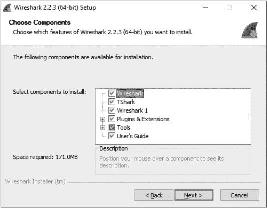

    *图 3-1：选择你希望安装的 Wireshark 组件*

1.  在附加任务窗口中点击 **下一步**。

1.  选择你希望安装 Wireshark 的位置，并点击 **下一步**。

1.  当对话框询问是否要安装 WinPcap 时，首先确保勾选了**安装 WinPcap**框，如 图 3-2 所示。然后点击 **安装**。安装过程应会开始。

1.  在 Wireshark 安装过程中大约一半时，WinPcap 安装应会开始。当它开始时，在介绍窗口中点击 **下一步**，阅读许可协议，并点击 **我同意**。

1.  系统会提供安装 USBPcap 的选项，这是一个用于从 USB 设备收集数据的工具。如果你希望安装，请勾选相应的复选框，然后点击 **下一步**。

    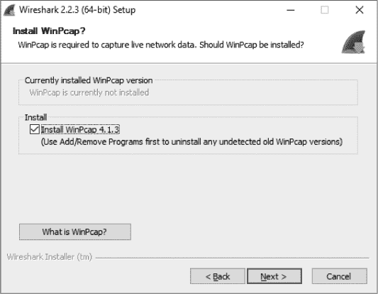

    *图 3-2：选择安装 WinPcap 驱动程序的选项*

1.  WinPcap 和（如果你选择了的话）USBPcap 应该已经安装在你的计算机上。安装完成后，点击 **完成**。

1.  Wireshark 应该完成安装。当它完成时，点击 **下一步**。

1.  在安装确认窗口中，点击 **完成**。

#### *在 Linux 系统上安装*

Wireshark 可以在大多数现代基于 Unix 的平台上运行。它可以通过使用发行版的包管理器或下载并安装适合你发行版的包进行安装。由于无法覆盖所有安装过程，我们这里只讨论几种常见的情况。

通常，对于系统范围的软件，根权限是必需的。然而，从源代码编译的本地软件安装通常可以不需要根权限。

##### 基于 RPM 的系统

如果你正在使用 Red Hat Linux 或基于它的发行版，比如 CentOS，那么操作系统很可能默认安装了 Yum 包管理工具。如果是这种情况，你可能可以通过从发行版的软件仓库中获取 Wireshark 来快速安装它。为此，打开一个控制台窗口并输入以下命令：

```
$ sudo yum install wireshark
```

如果需要任何依赖项，系统会提示你安装它们。如果一切顺利完成，你应该能够从命令行运行 Wireshark，并通过 GUI 访问它。

##### 基于 DEB 的系统

大多数基于 DEB 的发行版，如 Debian 或 Ubuntu，包含 APT 包管理工具，允许你从操作系统的软件仓库中安装 Wireshark。要使用此工具安装 Wireshark，请打开一个控制台窗口并输入以下命令：

```
$ sudo apt-get install wireshark wireshark-qt
```

再次，你会被提示安装任何所需的依赖项以完成安装。

##### 从源代码编译

由于操作系统架构和 Wireshark 功能的变化，从源代码编译 Wireshark 的指令可能会随着时间的推移发生变化。这也是推荐使用操作系统的包管理工具来执行安装的原因之一。然而，如果你的 Linux 发行版不使用自动化包管理软件，或者你需要特殊的安装方式，可以通过从源代码编译来手动安装 Wireshark。为此，请完成以下步骤：

1.  从 Wireshark 网站下载源代码包。

1.  通过输入以下命令解压归档文件（根据需要替换下载包的文件名）：

    ```
    $ tar –jxvf <file_name_here>.tar.bz2
    ```

1.  在配置和安装 Wireshark 之前，根据你选择的 Linux 版本，可能需要一些依赖项。例如，Ubuntu 14.04 需要安装一些其他软件包才能正常运行 Wireshark。这些可以通过发出以下命令安装（你需要以 root 用户身份执行此操作，或者在命令前加上 `sudo`）：

    ```
    $ sudo apt-get install pkg-config bison flex qt5-default libgtk-3-dev libpcap-dev qttools5-dev-tools
    ```

1.  安装完先决条件后，导航到提取 Wireshark 文件的目录。

1.  使用命令 `./configure` 配置源代码，使其能够正确地为你的 Linux 发行版编译。如果你希望偏离默认的安装选项，可以在此时指定这些选项。如果缺少任何依赖项，你很可能会收到错误消息。在继续之前，必须安装并配置这些依赖项。如果配置成功，你应该看到一条成功的消息，如 图 3-3 所示。

    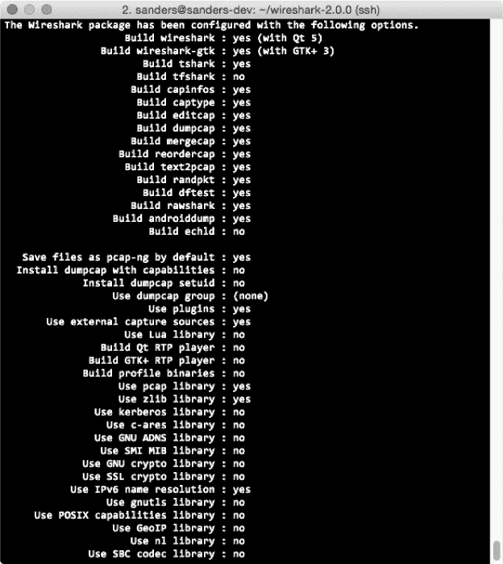

    *图 3-3：当 `./configure` 命令成功执行时，会显示一条消息，提示已选择的配置。*

1.  输入 make 命令将源代码编译成二进制文件。

1.  使用 sudo make install 启动最终安装。

1.  运行 sudo/sbin/ldconfig 完成安装。

**注意**

*如果你在按照这些步骤操作时遇到错误，可能需要安装一个额外的软件包。*

#### *在 OS X 系统上安装*

在 OS X 上安装 Wireshark，请按照以下步骤操作：

1.  从 Wireshark 的网页上下载 OS X 包。

1.  运行安装工具并按照其步骤进行操作。一旦你接受了所需的最终用户许可协议，你将有机会选择安装位置。

1.  完成安装向导。

### Wireshark 基础知识

一旦你成功地在系统上安装了 Wireshark，你就可以开始熟悉它。现在，你终于可以打开你的功能齐全的数据包嗅探器，并看到……完全什么都没有！

好吧，Wireshark 在你第一次打开它时并不太吸引人。要让事情变得更有趣，你需要获取一些数据。

#### *你的第一次数据包捕获*

为了将数据包数据导入 Wireshark，你将进行第一次数据包捕获。你可能会想，“如果网络上没有问题，我怎么捕获数据包呢？”

首先，网络上*总是*存在问题。如果你不相信我，那就给你的网络用户发一封邮件，让他们知道一切都运行得完美无缺。

其次，不一定需要出现问题才能进行数据包分析。事实上，大多数数据包分析师花费更多时间分析没有问题的流量，而不是他们正在排查故障的流量。毕竟，你需要有一个基线来比较，才能有效地排查网络流量。例如，如果你希望通过分析 DHCP 流量来解决 DHCP 的问题，你必须了解工作正常的 DHCP 流量的流向。

更广泛地说，要在日常网络活动中发现异常，你必须了解正常的日常网络活动是什么样的。当你的网络运行顺利时，你的观察会成为一个基线，代表正常状态下的流量。

好吧，让我们捕获一些数据包吧！

1.  打开 Wireshark。

1.  从主下拉菜单中选择**捕获**，然后选择**选项**。你应该会看到一个对话框，列出了可以用于捕获数据包的各种接口，以及每个接口的基本信息（图 3-4）。注意流量标题，它显示了一个折线图，表示当前通过该接口的流量量。折线上的峰值告诉你，实际上你正在捕获数据包。如果没有数据包，线条会是平的。你还可以通过点击每个接口左侧的箭头来展开它，查看与之关联的地址信息，如 MAC 地址或 IP 地址。

1.  点击你希望使用的接口，然后点击**开始**。数据应该开始填充窗口。

1.  等待大约一分钟，当你准备停止捕获并查看数据时，从捕获下拉菜单中点击**停止**按钮。

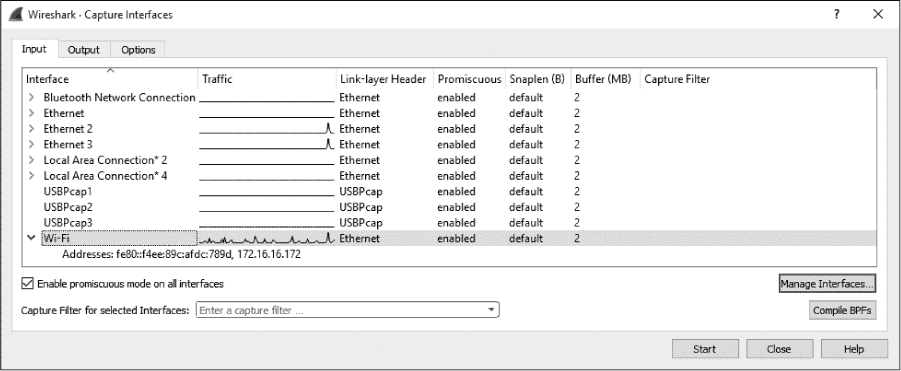

*图 3-4：选择用于执行数据包捕获的接口*

一旦完成这些步骤并结束捕获过程，Wireshark 主窗口应该会充满数据。事实上，您可能会被出现的数据量压倒，但当我们逐一解析 Wireshark 的主窗口时，这一切都会很快变得有意义。

#### *Wireshark 主窗口*

您将大部分时间都花在 Wireshark 的主窗口中。这里展示了您捕获的所有数据包，并将它们分解成更易于理解的格式。使用您刚刚捕获的数据包，让我们来看一下 Wireshark 的主窗口，如图 3-5 所示。

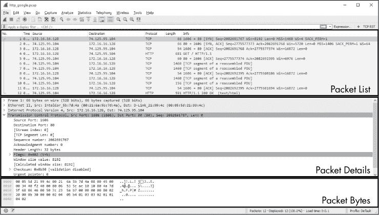

*图 3-5：Wireshark 的主窗口使用了三面板设计。*

主窗口中的三个面板——从上到下的**数据包列表**、**数据包详细信息**和**数据包字节**——彼此相互依赖。要查看**数据包详细信息**面板中单个数据包的详细信息，必须先在**数据包列表**面板中选择该数据包。当你在**数据包详细信息**面板中选择数据包的某一部分时，**数据包字节**面板将显示与该部分相对应的字节。

**注意**

*注意，图 3-5 在数据包列表面板中列出了几种不同的协议。不同层次的协议之间没有视觉上的分隔（除了通过颜色编码）；所有数据包都按照接收到的顺序显示。*

以下是每个面板的内容：

**数据包列表** 顶部面板显示了当前捕获文件中所有数据包的表格。它包含了数据包编号、数据包捕获的相对时间、数据包的源和目的地、数据包的协议以及数据包中找到的一些一般信息的列。

**注意**

*当我提到*流量*时，我指的是在数据包列表面板中显示的所有数据包。当我特别提到*DNS 流量*时，我指的是数据包列表面板中的 DNS 协议数据包。*

**数据包详细信息** 中间的面板显示了关于单个数据包的层次信息，并且可以折叠或展开以显示关于该数据包的所有收集信息。

**数据包字节** 下方面板——可能是最让人困惑的——显示数据包的原始未处理形式；也就是说，它展示了数据包在网络上传输时的样子。这是原始信息，没有任何温和或模糊的部分来使其更容易理解。我们将在附录 B 中讨论如何解释这类数据。

#### *Wireshark 偏好设置*

Wireshark 有多个可以自定义的偏好设置，以满足您的需求。要访问 Wireshark 的偏好设置，请从主下拉菜单中选择**编辑**并点击**偏好设置**。您将看到包含多个可自定义选项的偏好设置对话框，如图 3-6 所示。

Wireshark 的偏好设置分为六个主要部分，外加一个高级部分：

**外观** 这些设置决定了 Wireshark 如何呈现数据。你可以根据个人喜好在这里更改大多数选项，包括是否保存窗口位置、三大窗格的布局、滚动条位置、数据包列表窗格列的位置、用于显示捕获数据的字体，以及背景和前景颜色。

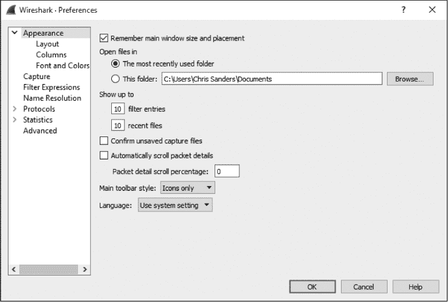

*图 3-6：你可以使用“设置”对话框选项来自定义 Wireshark。*

**捕获** 这些设置允许你指定与数据包捕获方式相关的选项，包括默认的捕获接口，是否默认使用混杂模式，以及是否实时更新“数据包列表”窗格。

**过滤表达式** 稍后我们将讨论 Wireshark 如何根据特定条件过滤流量。此部分设置允许你创建和管理这些过滤器。

**名称解析** 通过这些设置，你可以启用 Wireshark 的某些功能，使其能够将地址解析为更易识别的名称（包括 MAC、网络和传输名称解析），并指定最大并发名称解析请求数。

**协议** 这一部分允许你操作与 Wireshark 解码不同数据包相关的捕获和显示选项。并非每种协议都有可配置的设置，但有些协议提供了若干可以更改的选项。除非你有特定理由更改它们，否则最好保留默认设置。

**统计信息** 这一部分提供了 Wireshark 统计功能的一些可配置选项，这些内容将在第五章中详细介绍。

**高级** 不适合归入上述任何类别的设置可以在此找到。编辑这些设置通常是 Wireshark 高级用户的工作。

#### *数据包颜色编码*

如果你像我一样，喜欢闪亮的物体和漂亮的颜色，那么当你在“数据包列表”窗格中看到这些不同的颜色时，可能会感到很兴奋，就像在图 3-7 中的示例一样（如果你是看纸质书，图示是黑白的，但你大概明白我的意思）。这些颜色似乎是随机分配给每个数据包的，但事实并非如此。

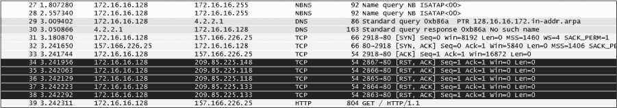

*图 3-7：Wireshark 的颜色编码可以快速识别协议。*

每个数据包会以特定的颜色显示，原因是有的。颜色可以反映数据包的协议和特定字段值。例如，所有的 UDP 流量默认是蓝色，所有的 HTTP 流量默认是绿色。颜色编码使你能够快速区分不同的协议，因此你无需每次都在“数据包列表”窗格中读取协议字段。你会发现，这大大加快了浏览大文件时所需的时间。

Wireshark 通过着色规则窗口使你能够轻松查看每个协议分配的颜色，如图 3-8 所示。要打开此窗口，请从主下拉菜单选择 **查看** 并点击 **着色规则**。

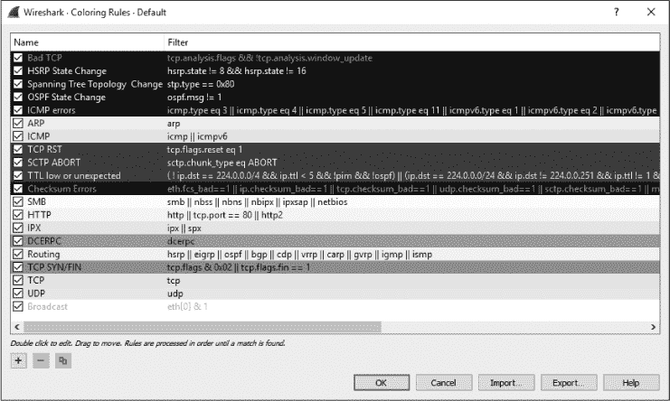

*图 3-8：着色规则窗口让你查看和修改数据包的着色。*

着色规则基于 Wireshark 过滤器，我们将在第四章中讨论这些过滤器。使用这些过滤器，你可以定义自己的着色规则并修改现有的规则。例如，要将 HTTP 流量的背景颜色从默认的绿色改为薰衣草色，请按照以下步骤操作：

1.  打开 Wireshark 并访问着色规则窗口（**查看** ▶ **着色规则**）。

1.  在着色规则列表中找到 HTTP 着色规则并单击选择它。

1.  你将在屏幕底部看到前景色和背景色，如图 3-9 所示。

    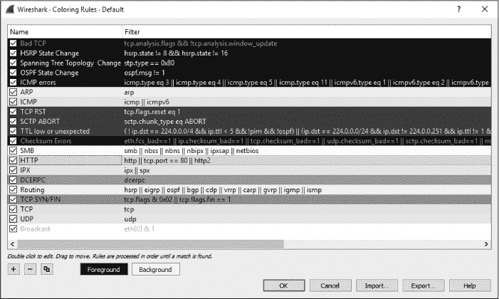

    *图 3-9：编辑颜色过滤器时，你可以修改前景色和背景色。*

1.  点击 **背景** 按钮。

1.  选择你希望在颜色轮上使用的颜色并点击 **确定**。

1.  再次点击 **确定** 接受更改并返回主窗口。用户界面将重新加载，以反映更新后的颜色方案。

当你在网络上使用 Wireshark 时，会开始注意到某些协议比其他协议更常见。此时，颜色编码的数据包可以让你的工作变得更加轻松。例如，如果你认为网络上存在一个不明的 DHCP 服务器在分发 IP 租约，你可以修改 DHCP 协议的着色规则，使其显示为亮黄色（或其他易于识别的颜色）。这样，你就能更快地识别出所有的 DHCP 流量，提高数据包分析的效率。

**注意**

*不久前，我在向本地学生小组做演讲时讨论了 Wireshark 着色规则。一位学生发现自己可以编辑着色规则时松了一口气，因为他是色盲，基于默认着色很难区分某些协议。因此，能够修改默认的着色规则为一些程度的可访问性提供了帮助。*

### 配置文件

了解 Wireshark 存储各种配置设置的位置非常有帮助，尤其是当你需要直接修改这些文件时。你可以通过从主下拉菜单选择 **帮助**，选择 **关于 Wireshark**，然后点击 **文件夹** 标签来查找 Wireshark 配置文件的位置。此窗口如图 3-10 所示。

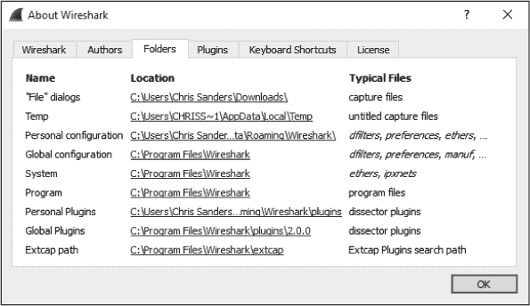

*图 3-10：定位 Wireshark 配置文件*

在 Wireshark 定制中，最重要的两个位置是个人配置目录和全局配置目录。全局配置目录包含 Wireshark 的所有默认设置，并且是默认配置文件存储其设置的地方。个人配置文件夹包含针对你的帐户定制的设置和配置文件。你创建的任何新配置文件将存储在个人配置文件夹的子目录中，并使用你提供的名称。

全局配置目录和个人配置目录之间的区别非常重要，因为对全局配置文件所做的任何更改都会影响系统上的每个 Wireshark 用户。

### 配置文件

在了解 Wireshark 的偏好设置后，你可能会发现，有时你想使用一组偏好设置，但又希望迅速切换到另一组以应对不同的场景。Wireshark 引入了配置文件，允许用户创建已保存的偏好设置集，而不必每次发生这种情况时都手动重新配置偏好设置。

配置文件存储以下内容：

•     偏好设置

•     捕获过滤器

•     显示过滤器

•     着色规则

•     禁用的协议

•     强制解码

•     最近的设置，例如面板大小、视图菜单设置和列宽

•     特定协议的表格，例如 SNMP 用户和自定义 HTTP 头

要查看配置文件列表，可以在主下拉菜单中点击**编辑**并选择**配置文件**选项。或者，你也可以右键点击屏幕右下角的配置文件部分，选择**管理配置文件**选项。当你进入配置文件窗口时，你会看到 Wireshark 提供了一些标准配置文件，包括图 3-11 中显示的默认、蓝牙和经典配置文件。延迟调查配置文件是我添加的自定义配置文件，采用的是纯文本格式，而全局和默认配置文件则以斜体显示。

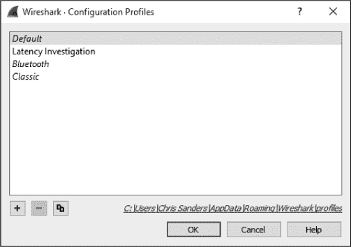

*图 3-11：查看配置文件*

配置文件窗口允许你创建、复制、删除和应用配置文件。创建新配置文件的过程非常简单。

1.  根据你希望保存到配置文件中的设置配置 Wireshark。

1.  通过在主下拉菜单中点击**编辑**，进入配置文件窗口。选择**配置文件**选项。

1.  点击加号（+）按钮，并为配置文件指定一个描述性名称。

1.  点击**确定**。

当你想切换配置文件时，可以进入配置文件窗口，点击配置文件名称，然后点击**确定**。你也可以通过点击 Wireshark 窗口右下角的 Profile 标题，并选择你想使用的配置文件来更快地完成此操作，如图 3-12 所示。

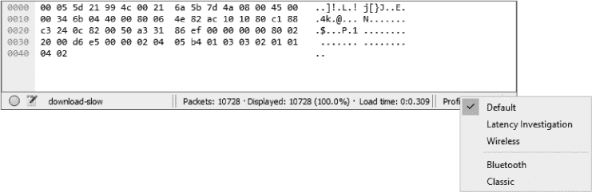

*图 3-12：通过 Profile 标题快速切换配置文件。*

配置文件最有用的一个方面是，每个配置文件都保存在其独立的目录中，并包含一系列配置文件。这意味着你可以备份配置文件并与他人分享。图 3-10 中的文件夹标签提供了个人和全局配置文件目录的路径。要与另一台计算机上的用户共享配置文件，只需复制与要共享的配置文件同名的文件夹，并将其粘贴到另一台计算机上相应用户的同一目录中。

在阅读本书时，你可能会发现需要创建一些高层次的配置文件，以进行常规故障排除、查找网络延迟源头以及调查安全问题。不要害怕广泛使用配置文件。当你想要快速切换一些偏好设置时，配置文件能为你节省大量时间。我认识一些人，他们成功地使用了数十个配置文件来应对不同的场景。

现在你已经成功启动了 Wireshark，准备进行数据包分析。第四章描述了如何处理你捕获到的数据包。
