## **处理捕获的数据包**


现在你已经了解了 Wireshark，准备开始捕获和分析数据包了。在本章中，你将学习如何处理捕获文件、数据包和时间显示格式。我们还将介绍更多关于捕获数据包的高级选项，并深入了解过滤器的使用。

### 处理捕获文件

你会发现，你的大部分数据包分析会发生在捕获之后。通常，你会在不同的时间进行几次捕获，保存它们，并一次性分析它们。因此，Wireshark 允许你将捕获的文件保存以便稍后分析。你还可以合并多个捕获文件。

#### *保存和导出捕获文件*

要保存数据包捕获，选择**文件** ▶ **另存为**。你将看到“保存文件为”对话框，如图 4-1 所示。系统会要求你指定保存捕获文件的位置和希望使用的文件格式。如果没有指定文件格式，Wireshark 将使用默认的 *.pcapng* 格式。

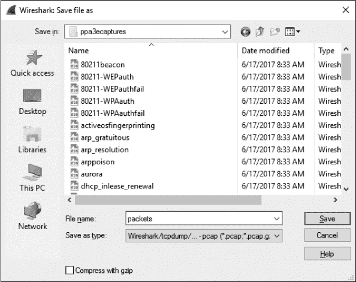

*图 4-1: “保存文件为”对话框允许你保存数据包捕获。*

在许多情况下，你可能只想保存捕获中的一部分数据包。要做到这一点，选择**文件** ▶ **导出指定数据包**。出现的对话框如图 4-2 所示。这是精简冗长数据包捕获文件的好方法。你可以选择仅保存某个数字范围内的数据包、标记的数据包，或者作为显示过滤结果可见的数据包（标记的数据包和过滤器将在本章后面讨论）。

你可以将 Wireshark 捕获的数据导出为几种格式，以便在其他媒体中查看或导入到其他数据包分析工具中。这些格式包括纯文本、PostScript、逗号分隔值 (CSV) 和 XML。要以其中一种格式导出数据包捕获，选择**文件** ▶ **导出数据包解析**，然后选择导出文件的格式。你将看到一个“另存为”对话框，其中包含与你选择的格式相关的选项。

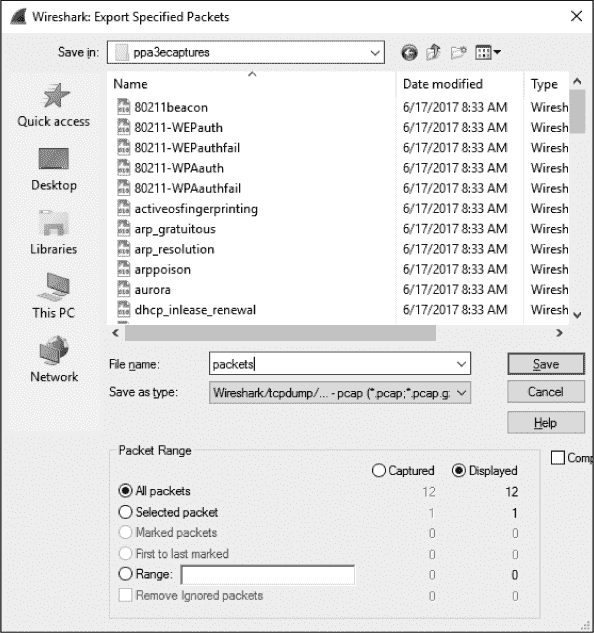

*图 4-2: “导出指定数据包”对话框让你可以更精确地控制你选择保存的数据包。*

#### *合并捕获文件*

某些类型的分析需要合并多个捕获文件的能力。这通常是在比较两个数据流或将分别捕获的相同流量数据合并时使用的做法。

要合并捕获文件，打开其中一个你想要合并的文件，然后选择**文件** ▶ **合并**，以打开“合并捕获文件”对话框，如图 4-3 所示。选择你希望合并到当前打开文件的新文件，然后选择合并文件的方法。你可以将选定文件添加到当前文件前面、后面，或者根据时间戳按时间顺序合并文件。

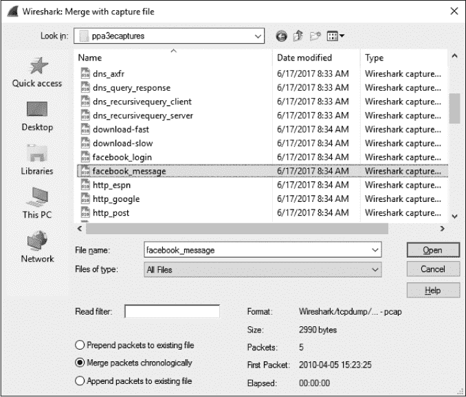

*图 4-3：与捕获文件合并对话框允许你合并两个捕获文件。*

### 处理数据包

你最终会遇到涉及大量数据包的情况。随着数据包数量的增长，达到几千甚至几百万个数据包，你需要更高效地浏览这些数据包。为此，Wireshark 允许你查找并标记符合特定标准的数据包。你还可以打印数据包以方便参考。

#### *查找数据包*

要查找符合特定标准的数据包，请通过按 CTRL-F 打开查找数据包栏，如图 4-4 中圈出的部分所示。该栏应出现在过滤器栏和数据包列表面板之间。

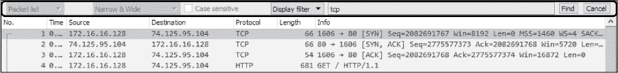

*图 4-4：在 Wireshark 中根据指定的标准查找数据包——在这种情况下，是符合显示过滤器表达式* tcp 的数据包

这个面板提供了三种查找数据包的选项：

•     显示过滤器选项允许你输入基于表达式的过滤器，该过滤器将只查找满足该表达式的数据包。此选项在图 4-4 中使用。

•     十六进制值选项可以搜索你指定的十六进制值的数据包。

•     字符串选项搜索包含你指定文本字符串的数据包。你可以指定搜索执行的面板，或者使搜索字符串区分大小写。

表 4-1 展示了这些搜索类型的示例。

**表 4-1：** 查找数据包的搜索类型

| **搜索类型** | **示例** |
| --- | --- |
| 显示过滤器 | `not ip ip.addr==192.168.0.1 arp` |
| 十六进制值 | `00ff ffff 00ABB1f0` |
| 字符串 | `Workstation1 UserB domain` |

一旦决定使用哪种搜索类型，就在文本框中输入搜索标准，并点击**查找**以查找第一个符合标准的数据包。要查找下一个匹配的数据包，再次点击**查找**或按 CTRL-N；要查找前一个匹配的数据包，请按 CTRL-B。

#### *标记数据包*

在找到符合标准的数据包后，你可以标记那些特别感兴趣的数据包。例如，标记数据包可以让你只保存这些数据包。此外，你还可以通过其黑色背景和白色文本快速找到你的标记数据包，如图 4-5 所示。

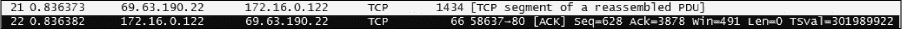

*图 4-5：屏幕上突出显示了一个标记的包。在这个例子中，第二个包被标记并显示为较暗。*

要标记数据包，可以右键点击数据包列表面板中的数据包，然后从弹出菜单中选择**标记数据包**，或点击数据包并按 CTRL-M。要取消标记数据包，再次按 CTRL-M 可以切换此设置。你可以在一个捕获中标记任意数量的数据包。要在标记的数据包之间跳转，可以分别按 SHIFT-CTRL-N 和 SHIFT-CTRL-B。

#### *打印数据包*

尽管大多数分析将在计算机屏幕上进行，您可能需要打印捕获的数据。我偶尔会打印出数据包并将其贴在桌子上，这样在进行其他分析时可以快速参考其内容。能够将数据包打印成 PDF 文件也非常方便，尤其是在准备报告时。

要打印捕获的数据包，请通过主菜单选择**文件** ▶ **打印**打开打印对话框，如图 4-6 所示。

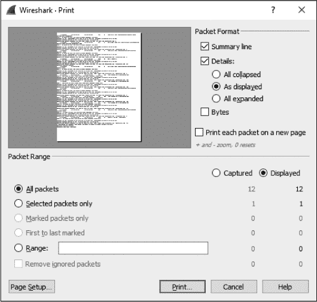

*图 4-6：打印对话框允许您打印指定的数据包。*

与“导出指定数据包”对话框类似，您可以打印特定的数据包范围、仅标记的数据包或作为过滤结果显示的数据包。您还可以选择每个数据包的打印详细程度。一旦选择好选项，点击**打印**。

### 设置时间显示格式和参考

时间至关重要——尤其是在数据包分析中。网络上的一切活动都是时间敏感的，您需要频繁地检查捕获文件中的趋势和网络延迟。Wireshark 提供了多个与时间相关的可配置选项。在本节中，我们将探讨时间显示格式和参考。

#### *时间显示格式*

Wireshark 捕获的每个数据包都会被赋予一个时间戳，该时间戳由操作系统应用于数据包。Wireshark 可以显示绝对时间戳，表示数据包捕获的确切时刻，以及与上一个捕获的数据包和捕获的开始与结束时间的关系。

与时间显示相关的选项位于主菜单中的“视图”项下。时间显示格式部分，如图 4-7 所示，允许您配置时间显示格式以及时间显示的精度。

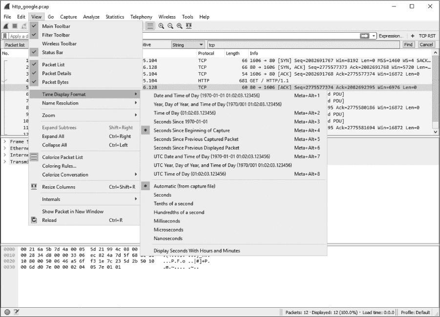

*图 4-7：提供多种时间显示格式。*

显示格式选项允许您选择不同的时间显示设置。这些设置包括日期和时间、UTC 日期和时间、纪元以来的秒数、捕获开始以来的秒数（默认设置）、上一个捕获的数据包以来的秒数等等。

精度选项允许您将时间显示精度设置为自动设置，从捕获文件获取格式，或者设置为手动设置，如秒、毫秒、微秒等。我们将在书中的后面部分更改这些选项，因此您现在应该熟悉它们。

**注意**

*在比较来自多个设备的数据包时，请确保这些设备与相同的时间源同步，特别是当您进行法医分析或故障排除时。您可以使用网络时间协议（NTP）确保网络设备同步。当检查来自跨越多个时区的设备的数据包时，考虑以 UTC 时间分析数据包，而非本地时间，以避免在报告发现时产生混淆。*

#### *数据包时间参考*

数据包时间参考允许你配置某个数据包，使得所有后续的时间计算都相对于该数据包进行。当你检查一系列在捕获文件开始之外的某个时间点触发的顺序事件时，这个功能尤其有用。

要将时间参考设置为某个数据包，右键单击数据包列表窗格中的参考数据包并选择**设置/取消时间参考**。要关闭此参考，请重复相同的操作。你还可以通过在数据包列表窗格中选择你希望作为参考的数据包并按 CTRL-T 来切换数据包的时间参考。

当你在数据包上启用时间参考时，数据包列表窗格中的时间列将显示`*REF*`，如图 4-8 所示。

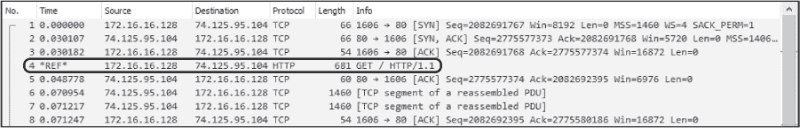

*图 4-8：启用数据包时间参考切换的第 4 个数据包*

设置数据包时间参考只有在捕获的时间显示格式设置为相对于捕获开始时间显示时才有用。任何其他设置将无法产生可用的结果，实际上会生成一组非常混乱的时间。

#### *时间偏移*

在某些情况下，你可能会遇到来自多个源的数据包，它们并未同步到相同的时间源。当检查从两个位置捕获的文件时，尤其常见，其中包含相同数据流的捕获。尽管大多数管理员希望网络上的每个设备都同步，但某些类型的设备之间可能会有几秒钟的时间偏差。Wireshark 提供了调整数据包时间戳的功能，可以在分析过程中缓解这个问题。

要调整一个或多个数据包的时间戳，选择**编辑** ▶ **时间偏移**，或者按下 CTRL-SHIFT-T。在打开的时间偏移屏幕上，你可以指定一个时间范围来调整整个捕获文件，或者你可以指定一个时间来设置单个数据包的时间戳。在图 4-9 中，我选择通过为每个数据包增加两分钟五秒来调整捕获中每个数据包的时间戳。

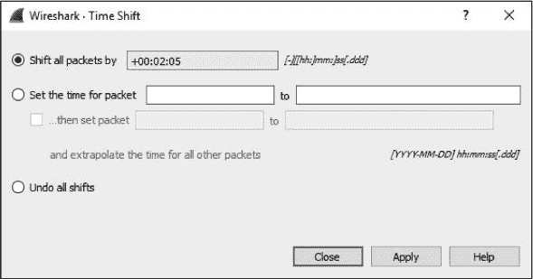

*图 4-9：时间偏移对话框*

### 设置捕获选项

在上章的简单数据包捕获过程中，我们曾讨论过捕获接口对话框。Wireshark 还提供了许多额外的捕获选项，但我们当时没有提到。要访问这些选项，请选择**捕获** ▶ **选项**。

捕获接口对话框有很多功能，旨在为你在捕获数据包时提供更多灵活性。它分为三个标签页：输入、输出和选项。我们将分别讨论每一个。

#### *输入标签*

输入选项卡 (图 4-10) 的主要目的是显示所有可用的捕获接口，并提供每个接口的一些基本信息。这些信息包括操作系统提供的接口友好名称、显示接口流量的图表，以及其他配置选项，如混杂模式状态和缓冲区大小。在最右侧（未显示）还有一个列，显示应用的捕获过滤器，稍后我们会在 第 65 页的“捕获过滤器”中讨论。

在本节中，你可以点击这些选项中的大多数，并直接进行编辑。例如，如果你想禁用某个接口的混杂模式，可以点击该字段，通过提供的下拉菜单将其从启用状态更改为禁用状态。

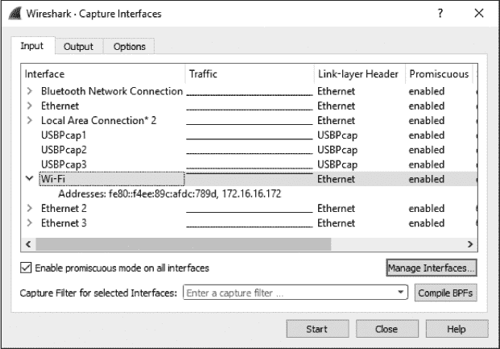

*图 4-10：捕获接口输入选项卡*

#### *输出选项卡*

输出选项卡 (图 4-11) 允许你自动将捕获的报文存储到文件中，而不是先捕获报文然后再保存文件。这样做为你提供了更多的灵活性来管理报文的保存方式。你可以选择将它们保存为单个文件或文件集，甚至可以使用环形缓冲区（稍后我们会介绍）来管理创建的文件数量。要启用此选项，请在文件文本框中输入完整的文件路径和名称。或者，使用浏览...按钮选择目录并提供文件名。

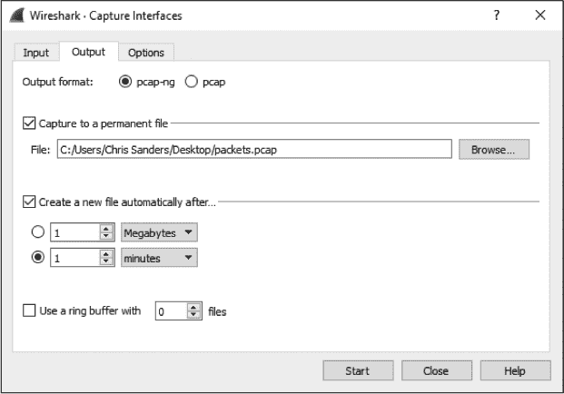

*图 4-11：捕获接口输出选项卡*

当你捕获大量流量或进行长期捕获时，文件集特别有用。*文件集*是由多个文件组成的集合，这些文件通过特定条件进行分隔。要保存到文件集，请勾选 **在...之后自动创建新文件** 选项。

Wireshark 使用各种触发器来基于文件大小或时间条件管理文件集保存。要启用这些触发器之一，选择大小或基于时间的选项旁边的单选按钮，然后指定触发的值和单位。例如，你可以设置一个触发器，在每捕获 1MB 流量后创建一个新文件，或者如 图 4-12 所示，在每捕获 1 分钟的流量后创建一个新文件。

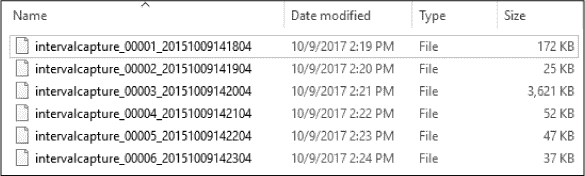

*图 4-12：Wireshark 在每分钟间隔创建的文件集*

"使用环形缓冲区"选项允许你指定在 Wireshark 开始覆盖文件之前，文件集能保存的文件数量。虽然“环形缓冲区”一词有多种含义，但在我们的应用中，它本质上是一个文件集，指定一旦保存的最后一个文件写入完成，当需要保存更多数据时，第一个文件会被覆盖。换句话说，它建立了一种先进先出（FIFO）文件写入方法。你可以勾选此选项并指定希望循环使用的最大文件数量。例如，假设你选择为捕获使用多个文件，每小时创建一个新文件，并将环形缓冲区设置为 6。第六个文件创建完成后，环形缓冲区将会回绕并覆盖第一个文件，而不是创建第七个文件。这确保了最多只有六个文件（或在此情况下，六个小时）的数据保存在硬盘上，同时仍允许新数据被写入。

最后，输出标签还允许你指定是否使用.*pcapng*文件格式。如果你计划使用无法解析.*pcapng*格式的工具来处理保存的数据包，可以选择传统的.*pcap*格式。

#### *选项标签*

选项标签包含其他一些数据包捕获选项，包括显示、名称解析和捕获终止选项，详见图 4-13。

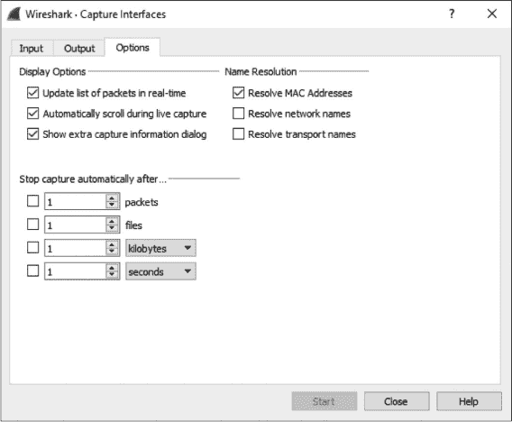

*图 4-13：捕获接口选项标签*

##### 显示选项

显示选项部分控制捕获过程中数据包的显示方式。"实时更新数据包列表"选项不言自明，可以与"实时捕获时自动滚动"选项配对使用。当这两个选项都启用时，所有捕获的数据包都会显示在屏幕上，最新捕获的数据包会立即显示。

**警告**

*当这两个选项配对使用时，即使你只捕获少量数据，它们也可能会消耗较多的处理器资源。除非你有特定需要实时查看数据包，否则最好取消勾选这两个选项。*

"显示额外的捕获信息对话框"选项让你启用或抑制一个小窗口的显示，该窗口显示已捕获的数据包数量及其按协议分类的百分比。我喜欢显示捕获信息对话框，因为我通常不允许在捕获过程中实时滚动数据包。

##### 名称解析设置

名称解析部分的选项允许你启用自动的 MAC（第二层）、网络（第三层）和传输（第四层）名称解析功能。我们将在第五章中更深入地讨论名称解析这一主题，包括它的缺点。

##### 停止捕获设置

“在...之后自动停止捕获”部分让你在满足某些条件时停止正在进行的捕获。与多个文件集一样，你可以根据文件大小和时间间隔触发停止捕获，也可以基于数据包数量触发停止。这些选项可以与输出选项卡上的多文件选项一起使用。

### 使用过滤器

过滤器允许你指定可供分析的包。简单来说，过滤器是一个表达式，用于定义包的包含或排除标准。如果你不希望看到某些包，可以写一个过滤器将它们去除。如果你只希望看到特定的包，可以写一个过滤器仅显示这些包。

Wireshark 提供了两种主要的过滤器类型：

•     *捕获过滤器* 在捕获数据包时指定，只会捕获那些在给定表达式中指定为包含/排除的数据包。

•     *显示过滤器* 被应用于已捕获的数据包集，用于根据指定的表达式隐藏不需要的包或显示所需的包。

让我们先来看一下捕获过滤器。

#### *捕获过滤器*

捕获过滤器在数据包捕获过程中应用，用于从一开始就限制交付给分析员的数据包。使用捕获过滤器的一个主要原因是性能。如果你知道某种类型的流量不需要分析，你可以通过捕获过滤器简单地过滤掉它，从而节省通常用于捕获这些包的处理能力。

在处理大量数据时，创建自定义捕获过滤器非常有用。通过确保只查看与当前问题相关的包，可以加快分析速度。

例如，假设你正在排查一个运行在 262 端口的服务问题，但你正在分析的服务器在多个端口上运行着不同的服务。仅找到并分析某一个端口的流量本身就是一项工作。为了只捕获特定端口的流量，你可以使用捕获过滤器。具体做法是，使用捕获接口对话框，如下所示：

1.  选择你希望捕获数据包的接口旁边的**捕获** ▶ **选项**按钮。这将打开捕获接口对话框。

1.  找到你希望使用的接口，并滚动到最右侧列的捕获过滤器选项。

1.  你可以通过点击这一列并输入表达式来应用捕获过滤器。我们希望过滤器只显示进出 262 端口的流量，因此输入**port 262**，如图 4-14 所示。（我们将在下一节详细讨论表达式。）单元格的颜色应该变为绿色，表示你输入了一个有效的表达式；如果表达式无效，单元格会变为红色。

    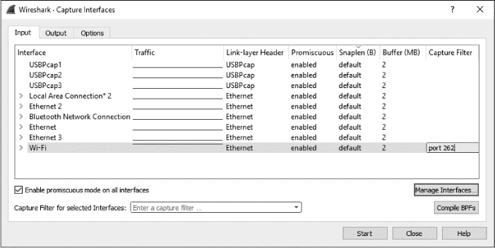

    *图 4-14：在捕获接口对话框中创建捕获过滤器*

1.  设置好过滤器后，点击**开始**以开始捕获。

现在，你应该只看到端口 262 的流量，并能够更高效地分析这部分数据。

##### 捕获/BPF 语法

捕获过滤器由 libpcap/WinPcap 应用，并使用伯克利数据包过滤器（BPF）语法。这个语法在多个数据包嗅探应用中常见，主要是因为数据包嗅探应用通常依赖于 libpcap/WinPcap 库，而这些库支持使用 BPF。掌握 BPF 语法对于深入理解网络层级的数据包分析至关重要。

使用 BPF 语法创建的过滤器被称为*表达式*，每个表达式由一个或多个*原语*组成。原语由一个或多个*限定符*（如表 4-2 所列）和一个 ID 名称或编号组成，如图 4-15 所示。

**表 4-2：** BPF 限定符

| **限定符** | **描述** | **示例** |
| --- | --- | --- |
| 类型 | 标识 ID 名称或编号所代表的内容 | `host, net, port` |
| 方向 | 指定传输方向到或来自 ID 名称或编号 | `src, dst` |
| 协议 | 限制匹配特定协议 | `ether, ip, tcp, udp, http, ftp` |

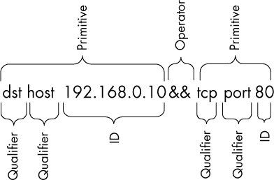

*图 4-15：一个示例捕获过滤器*

结合表达式的组成，`dst host`的限定符与 ID 192.168.0.10 结合形成一个原语。这个原语本身就是一个表达式，它只会捕获目的 IP 地址为 192.168.0.10 的流量。

你可以使用逻辑运算符将原语结合起来，创建更复杂的表达式。共有三种逻辑运算符可用：

•     连接运算符 AND (`&&`)

•     选择运算符 OR (`||`)

•     否定运算符 NOT (`!`)

例如，以下表达式将仅捕获源 IP 地址为 192.168.0.10 且源端口或目标端口为 80 的流量：

```
src host 192.168.0.10 && port 80
```

##### 主机名和地址过滤器

你创建的大多数过滤器将集中在特定的网络设备或设备组上。根据具体情况，过滤可以基于设备的 MAC 地址、IPv4 地址、IPv6 地址或 DNS 主机名。

比如，你想了解某个特定主机与网络上服务器交互的流量。你可以在服务器上使用`host`限定符创建一个过滤器，捕获与该主机 IPv4 地址相关的所有流量：

```
host 172.16.16.149
```

如果你在 IPv6 网络中，你可以使用`host`限定符过滤基于 IPv6 地址的数据，如下所示：

```
host 2001:db8:85a3::8a2e:370:7334
```

你还可以通过`host`限定符基于设备的主机名进行过滤，如下所示：

```
host testserver2
```

或者，如果你担心某个主机的 IP 地址可能变化，你也可以通过添加`ether`协议限定符来基于其 MAC 地址进行过滤：

```
ether host 00-1a-a0-52-e2-a0
```

传输方向限定符通常与过滤器一起使用，例如前面示例中的过滤器，用于根据流量是从主机发送还是接收来捕获流量。例如，要仅捕获来自特定主机的流量，可以添加 `src` 限定符：

```
src host 172.16.16.149
```

要仅捕获发送到 172.16.16.149 的数据，可以使用 `dst` 限定符：

```
dst host 172.16.16.149
```

当您不使用类型限定符（`host`、`net` 或 `port`）与原语一起时，默认使用 `host` 限定符。因此，这个不包含限定符的表达式，相当于之前的示例：

```
dst 172.16.16.149
```

##### 端口过滤器

除了根据主机进行过滤外，您还可以根据每个数据包中使用的端口进行过滤。端口过滤可以用于过滤使用已知服务端口的服务和应用程序。例如，以下是一个简单的过滤器，只捕获到或来自端口 8080 的流量：

```
port 8080
```

要捕获除端口 8080 以外的所有流量，可以使用以下表达式：

```
!port 8080
```

端口过滤器可以与传输方向限定符结合使用。例如，要仅捕获发送到监听标准 HTTP 80 端口的 Web 服务器的流量，可以使用 `dst` 限定符：

```
dst port 80
```

##### 协议过滤器

协议过滤器允许您基于特定协议过滤数据包。它们用于匹配那些不能仅通过使用某个端口来定义的非应用层协议。因此，如果您只想查看 ICMP 流量，可以使用以下过滤器：

```
icmp
```

要查看除了 IPv6 流量以外的所有流量，可以使用以下过滤器：

```
!ip6
```

##### 协议字段过滤器

BPF 语法的一个真正强大的地方在于，它允许我们检查协议头的每个字节，从而基于这些数据创建非常具体的过滤器。本节中我们将讨论的高级过滤器将允许您从数据包的特定位置开始检索特定数量的字节。

例如，假设我们想根据 ICMP 头部的类型字段进行过滤。类型字段位于数据包的最开始位置，因此它的偏移量是 0。为了标识数据包中需要检查的位置，可以在协议限定符旁边用方括号指定字节偏移量——例如，`icmp[0]`。这个规范将返回一个 1 字节的整数值，我们可以与之进行比较。例如，为了仅捕获表示目标不可达（类型 3）消息的 ICMP 数据包，我们可以在过滤表达式中使用等于操作符：

```
icmp[0] == 3
```

要检查仅表示回显请求（类型 8）或回显回复（类型 0）的 ICMP 数据包，可以使用两个原语与 OR 操作符：

```
icmp[0] == 8 || icmp[0] == 0
```

这些过滤器效果很好，但它们仅根据数据包头部中的 1 字节信息进行过滤。您还可以通过在方括号中的偏移量后添加字节长度，并用冒号分隔，来指定过滤表达式中返回的数据长度。

例如，假设我们想要创建一个过滤器，捕获所有 ICMP 目标不可达，主机不可达的数据包，这些数据包的类型是 3，代码是 1。这些是 1 字节的字段，位于数据包头部的偏移量 0 处并紧邻在一起。为此，我们创建一个过滤器，检查数据包头部从偏移量 0 开始的 2 个字节，并将这些数据与十六进制值 0301（类型 3，代码 1）进行比较，如下所示：

```
icmp[0:2] == 0x0301
```

一个常见的场景是只捕获 TCP 数据包中 RST 标志位被设置的数据包。我们将在第八章详细讨论 TCP。现在，你只需要知道 TCP 数据包的标志位位于偏移量 13。这是一个有趣的字段，因为它总共占用 1 字节作为标志字段，但每个特定的标志位由这个字节中的单个位标识。正如我将在附录 B 中进一步讨论的那样，每个字节中的位表示某个二进制数。该标志位存储的位由该位表示的数字指定，所以第一个位表示 1，第二个表示 2，第三个表示 4，依此类推。多个标志位可以同时在 TCP 数据包中被设置。因此，我们不能仅使用单一的 `tcp[13]` 值来进行高效的过滤，因为多个值可能表示 RST 位被设置。

相反，我们必须通过附加一个单一的 & 符号 (`&`)，然后跟上表示该标志存储位置的数字来指定我们希望检查的字节中的位置。RST 标志位位于表示数字 4 的位中，而该位被设置为 4，意味着 RST 标志已被设置。过滤器如下所示：

```
tcp[13] & 4 == 4
```

如果想要查看所有设置了 PSH 标志位的数据包，可以使用该标志位在 TCP 标志字段中偏移量 13 的位置，这个位置表示数字 8。我们的过滤器会使用这个位置：

```
tcp[13] & 8 == 8
```

##### 示例捕获过滤器表达式

你会经常发现，你的分析成功与否取决于你是否能够为当前情况创建合适的过滤器。表 4-3 展示了一些你可能经常使用的常见捕获过滤器。

**表 4-3：** 常用的捕获过滤器

| **过滤器** | **描述** |
| --- | --- |
| `tcp[13] & 32 == 32` | TCP 数据包中 URG 标志位被设置 |
| `tcp[13] & 16 == 16` | TCP 数据包中 ACK 标志位被设置 |
| `tcp[13] & 8 == 8` | TCP 数据包中 PSH 标志位被设置 |
| `tcp[13] & 4 == 4` | TCP 数据包中 RST 标志位被设置 |
| `tcp[13] & 2 == 2` | TCP 数据包中 SYN 标志位被设置 |
| `tcp[13] & 1 == 1` | TCP 数据包中 FIN 标志位被设置 |
| `tcp[13] == 18` | TCP SYN-ACK 数据包 |
| `ether host` 00`:`00`:`00`:`00`:`00`:`00 | 属于或来自你 MAC 地址的流量 |
| `!ether host` 00`:`00`:`00`:`00`:`00`:`00 | 不属于或来自你 MAC 地址的流量 |
| `broadcast` | 仅广播流量 |
| `icmp` | ICMP 流量 |
| `icmp[0:2] == 0x0301` | ICMP 目标不可达，主机不可达 |
| `ip` | 仅 IPv4 流量 |
| `ip6` | 仅 IPv6 流量 |
| `udp` | 仅 UDP 流量 |

#### *显示过滤器*

显示过滤器是指，当应用于捕获文件时，告诉 Wireshark 只显示匹配该过滤器的数据包。你可以在数据包列表窗格上方的过滤器文本框中输入显示过滤器。

显示过滤器比捕获过滤器使用得更频繁，因为它们允许你筛选你看到的数据包，而不会实际删除捕获文件中的其他数据。这样，如果你需要恢复到原始捕获文件，你只需清除过滤器表达式即可。由于 Wireshark 拥有大量的协议分析器，显示过滤器也更为强大。

例如，在某些情况下，你可能会使用显示过滤器从捕获文件中过滤掉无关的广播流量，比如当这些数据包与当前分析的问题无关时，从数据包列表窗格中过滤掉 ARP 广播数据包。然而，由于这些 ARP 广播数据包以后可能会有用，所以最好是临时过滤它们，而不是删除它们。

要在捕获窗口中过滤掉所有 ARP 数据包，将光标置于数据包列表窗格上方的过滤器文本框中，输入 !arp 即可从列表中移除所有 ARP 数据包（见图 4-16）。要移除过滤器，点击**X**按钮；要保存过滤器以供以后使用，点击加号（+）按钮。

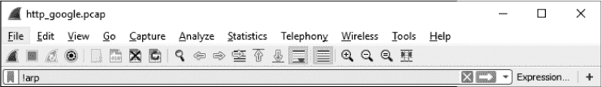

*图 4-16：使用位于数据包列表窗格上方的过滤器文本框创建显示过滤器*

有两种应用显示过滤器的方法。一种是使用适当的语法直接应用，就像我们在这个例子中做的那样。另一种是使用显示过滤器表达式对话框逐步构建过滤器；当你刚开始使用过滤器时，这种方法更容易。让我们从更简单的方法开始，依次探讨两种方法。

##### 显示过滤器表达式对话框

显示过滤器表达式对话框，如图 4-17 所示，便于新手 Wireshark 用户创建捕获和显示过滤器。要访问此对话框，点击过滤器工具栏上的**表达式**按钮。

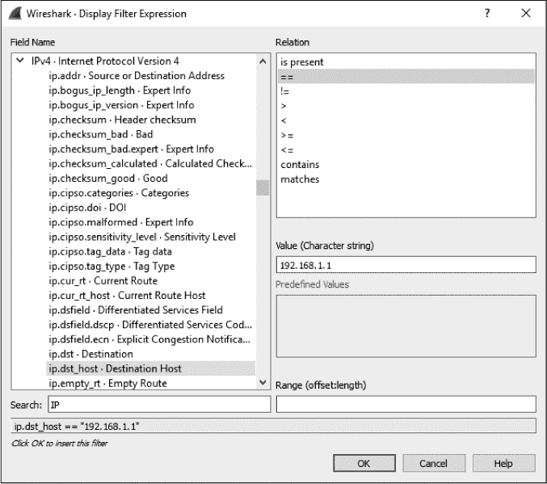

*图 4-17：显示过滤器表达式对话框允许在 Wireshark 中轻松创建过滤器。*

对话框的左侧列出了所有可能的协议字段，这些字段指定了所有可能的过滤标准。要创建过滤器，请按照以下步骤操作：

1.  若要查看与某个协议相关的标准字段，点击该协议旁边的箭头符号展开它。找到你想基于其创建过滤器的标准后，点击选中它。

1.  选择你所选字段与所提供的标准值之间的关系。这个关系可以是等于、大于、小于等。

1.  通过指定与所选字段相关的标准值来创建你的过滤器表达式。你可以定义此值，或者从 Wireshark 中预定义的选项中选择。

1.  你的完整过滤器将在屏幕底部显示。当你完成后，点击 **OK** 将其插入过滤栏。

显示过滤器表达式对初学者来说很有帮助，但一旦你掌握了操作，你会发现手动输入过滤表达式可以大大提高效率。显示过滤器表达式的语法结构简单而强大。

##### 过滤表达式语法结构

当你开始更多地使用 Wireshark 时，你会希望直接在主窗口中使用显示过滤器语法，以节省时间。幸运的是，显示过滤器使用的语法遵循标准方案，易于导航。在大多数情况下，这个方案是以协议为中心的，遵循协议`.`特性`.`子特性`的格式，正如你在查看显示过滤器表达式对话框时看到的。现在我们来看一些例子。

你最常使用捕获或显示过滤器来查看基于特定协议的包。例如，假设你正在排查一个 TCP 问题，并且你只想查看捕获文件中的 TCP 流量。如果是这样，使用简单的 `tcp` 过滤器就可以完成任务。

现在让我们从另一角度来看问题。假设在排查你的 TCP 问题时，你已经使用了 ping 工具很多次，因此生成了大量的 ICMP 流量。你可以通过过滤器 `expression !icmp` 从你的捕获文件中去除这些 ICMP 流量。

比较操作符允许你比较值。例如，在排查 TCP/IP 网络问题时，你经常需要查看所有涉及特定 IP 地址的包。等于比较操作符（`==`）将允许你创建一个过滤器，显示所有 IP 地址为 192.168.0.1 的包：

```
ip.addr==192.168.0.1
```

现在假设你只需要查看小于 128 字节的包。你可以使用小于或等于操作符（`<=`）来实现这个目标：

```
frame.len<=128
```

表 4-4 显示了 Wireshark 的比较操作符。

**表 4-4：** Wireshark 过滤表达式比较操作符

| **操作符** | **描述** |
| --- | --- |
| `==` | 等于 |
| `!=` | 不等于 |
| `>` | 大于 |
| `<` | 小于 |
| `>=` | 大于或等于 |
| `<=` | 小于或等于 |

逻辑操作符允许你将多个过滤表达式组合成一个语句，从而大大提高过滤器的有效性。例如，假设你只对显示两个 IP 地址的包感兴趣。你可以使用 `or` 操作符创建一个表达式，显示包含任一 IP 地址的包，如下所示：

```
ip.addr==192.168.0.1 or ip.addr==192.168.0.2
```

表 4-5 列出了 Wireshark 的逻辑操作符。

**表 4-5：** Wireshark 过滤表达式逻辑操作符

| **操作符** | **描述** |
| --- | --- |
| `and` | 两个条件必须都为真。 |
| `or` | 其中一个条件必须为真。 |
| `xor` | 必须且仅有一个条件为真。 |
| `not` | 两个条件都不为真。 |

##### 示例显示过滤器表达式

尽管创建过滤器表达式的概念相对简单，但在为各种问题创建新过滤器时，你需要使用一些特定的关键词和运算符。表 4-6 展示了我最常用的一些显示过滤器。有关完整的列表，请参考 Wireshark 显示过滤器参考文档，网址为 *[`www.wireshark.org/docs/dfref/`](http://www.wireshark.org/docs/dfref/)*。

**表 4-6：** 常用显示过滤器

| **过滤器** | **描述** |
| --- | --- |
| `!tcp.port==3389` | 过滤掉 RDP 流量 |
| `tcp.flags.syn==1` | 带 SYN 标志的 TCP 数据包 |
| `tcp.flags.reset==1` | 带 RST 标志的 TCP 数据包 |
| `!arp` | 清除 ARP 流量 |
| `http` | 所有 HTTP 流量 |
| `tcp.port==23 &#124;&#124; tcp.port==21` | Telnet 或 FTP 流量 |
| `smtp &#124;&#124; pop &#124;&#124; imap` | 邮件流量（SMTP、POP 或 IMAP） |

#### *保存过滤器*

一旦你开始创建大量的捕获和显示过滤器，你会发现自己经常使用某些过滤器。幸运的是，你不需要每次都输入这些过滤器，因为 Wireshark 允许你保存过滤器以便后续使用。要保存自定义捕获过滤器，请按照以下步骤操作：

1.  选择 **捕获** ▶ **捕获过滤器**，以打开捕获过滤器对话框。

1.  通过点击对话框左下角的加号（+）按钮来创建一个新过滤器。

1.  在“过滤器名称”框中输入过滤器名称。

1.  在“过滤器字符串”框中输入实际的过滤器表达式。

1.  点击**确定**按钮，将过滤器表达式保存到列表中。

要保存自定义显示过滤器，请按照以下步骤操作：

1.  在主窗口的“数据包列表”面板上方的过滤器栏中输入你的过滤器，并点击栏左侧的**按钮**。

1.  点击**保存此过滤器**选项，将在单独的对话框中显示已保存的显示过滤器列表。在此，你可以为过滤器提供名称，之后点击**确定**以保存它（图 4-18）。

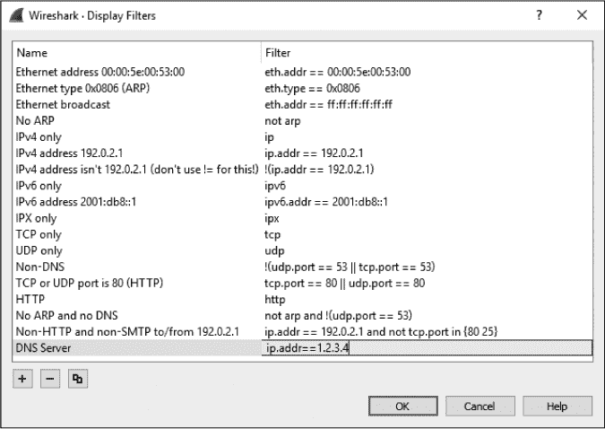

*图 4-18：你可以直接从主工具栏保存显示过滤器。*

#### *将显示过滤器添加到工具栏*

如果你发现自己频繁切换的过滤器，一个最简单的操作方式是将过滤器切换按钮添加到数据包列表面板上方的过滤器栏中。为此，完成以下步骤：

1.  在主窗口的数据包列表面板上方的过滤器栏中输入过滤器，并点击栏右侧的加号（+）按钮。

1.  在过滤器栏下方会显示一个新栏，在该栏中你可以在标签字段中为你的过滤器提供一个名称（图 4-19）。这是将在工具栏上表示该过滤器的标签。一旦你在此字段中输入内容，点击**确定**即可在过滤器工具栏中创建该表达式的快捷方式。

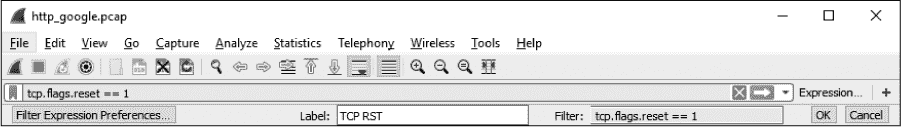

*图 4-19：将过滤器表达式快捷方式添加到过滤器工具栏*

如你在图 4-20 中看到的，我们创建了一个快捷方式，可以快速显示所有启用了 RST 标志的 TCP 数据包。对过滤工具栏的添加会保存在你的配置文件中（如第三章中所讨论的），使它们成为增强你在各种场景下识别数据包捕获问题能力的有力工具。

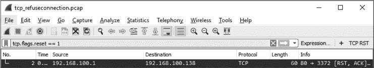

*图 4-20：使用工具栏快捷方式进行过滤*

Wireshark 包含了几个内置的过滤器，这些过滤器是过滤器应有样子的很好的示例。在创建自己的过滤器时，你会希望使用它们（以及 Wireshark 帮助页面）。在本书的示例中，我们将使用这些过滤器。
