## 第五章：**Wireshark 高级功能**


一旦掌握了 Wireshark 的基础知识，下一步就是深入了解它的分析和图形化功能。在本章中，我们将探讨一些强大的功能，包括端点和会话窗口、名称解析的细节、协议解析、流量解读、IO 图形分析等。这些功能是 Wireshark 作为图形化分析工具的独特之处，在分析过程中多个阶段都很有用。在继续之前，确保至少尝试使用本章列出的所有功能，因为我们将在书中的后续章节中频繁地回顾这些功能，并探讨实际的分析场景。

### 端点和网络会话

要进行网络通信，数据必须在至少两个设备之间流动。每个在网络上发送或接收数据的设备都代表了 Wireshark 所称的*端点*。两个端点之间的通信被称为*会话*。Wireshark 根据通信的属性，特别是各种协议中使用的地址，描述端点和会话。

端点通过多个地址进行识别，这些地址分配在 OSI 模型的不同层次上。例如，在数据链路层，端点将具有 MAC 地址，这是设备内置的唯一地址（尽管它可以修改，可能使其不再是唯一的）。然而，在网络层，端点将具有 IP 地址，该地址可以随时更改。我们将在接下来的几章中讨论这些地址类型是如何使用的。

图 5-1 展示了两种如何使用地址来识别会话中的端点的示例。图中的会话 A 由在数据链路（MAC）层通信的两个端点组成。端点 A 的 MAC 地址为 00:ff:ac:ce:0b:de，端点 B 的 MAC 地址为 00:ff:ac:e0:dc:0f。会话 B 由两个在网络（IP）层通信的设备定义。端点 A 的 IP 地址为 192.168.1.25，端点 B 的 IP 地址为 192.168.1.30。

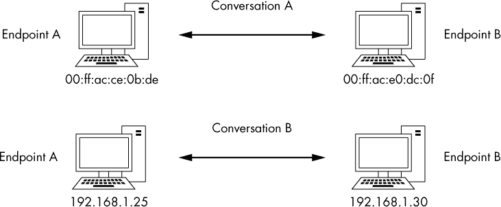

*图 5-1：网络中的端点和会话*

让我们看看 Wireshark 如何提供按端点或会话划分的网络通信信息。

#### *查看端点统计信息*

*lotsofweb.pcapng*

在分析流量时，你可能会发现能够准确定位问题发生在网络的特定端点。例如，打开捕获文件*lotsofweb.pcapng*，然后打开 Wireshark 的端点窗口（**统计** ▶ **端点**）。这个窗口展示了每个端点的几个有用统计信息，如图 5-2 所示，包括地址、数据包数量、传输和接收的字节数等。

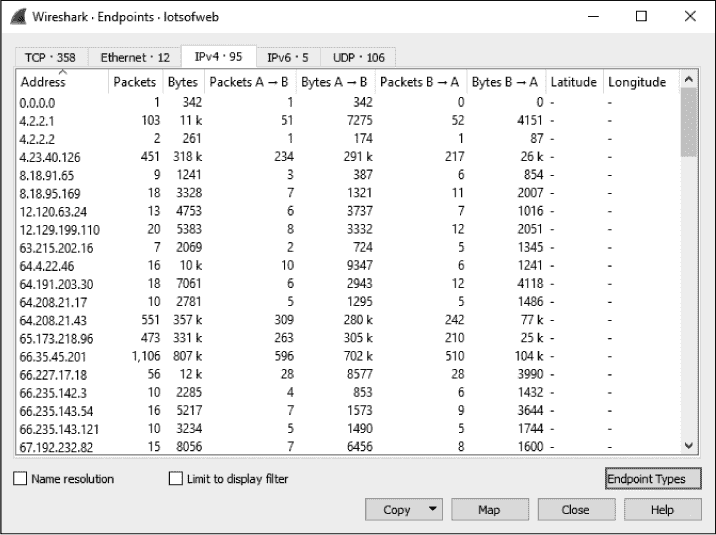

*图 5-2：端点窗口让你查看捕获文件中的每个端点。*

窗口顶部的标签（TCP、以太网、IPv4、IPv6 和 UDP）显示按协议组织的端点数量。要仅显示特定协议的端点，点击这些标签中的一个。你可以通过点击屏幕右下角的端点类型框，并选择要添加的协议，来添加额外的协议过滤标签。如果你希望使用名称解析来查看端点地址（请参见第 84 页中的“名称解析”），勾选名称解析复选框。如果你正在处理一个较大的捕获文件并且想要筛选显示的端点，可以在主 Wireshark 窗口中应用显示过滤器，并在端点窗口中选择“限制到显示过滤器”选项。此选项将使窗口仅显示与显示过滤器匹配的端点。

端点窗口的另一个实用功能是可以过滤显示特定的数据包到数据包列表窗格中。这是一种快速深入查看单个端点数据包的方式。右键点击一个端点，选择可用的过滤选项。出现的对话框将允许你显示或排除与选定输入相关的数据包。你还可以在此对话框中选择“着色”选项，将端点地址直接导出为着色规则（着色规则在第四章中有讨论）。通过这种方式，你可以快速突出显示与给定端点相关的数据包，从而在分析时迅速识别它们。

#### *查看网络会话*

*lotsofweb.pcapng*

在 *lotsofweb.pcapng* 文件仍然打开的状态下，访问 Wireshark 会话窗口 **统计** ▶ **会话** (图 5-3) 以显示捕获文件中的所有会话。会话窗口与端点窗口相似，但会话窗口每行显示两个地址，表示一个会话，并且显示每个设备传输的包和字节。列 *地址 A* 是源端点，*地址 B* 是目标端点。

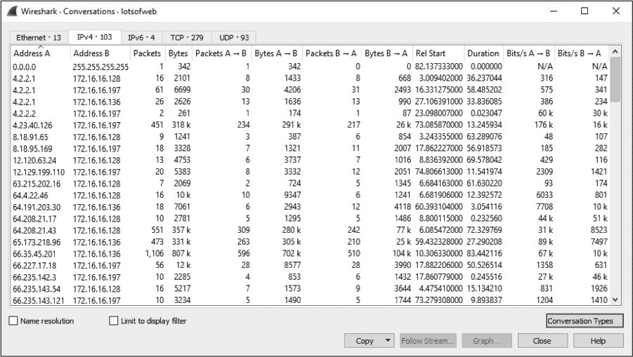

*图 5-3: 会话窗口让你可以剖析捕获文件中的每个会话。*

会话窗口按协议组织。要查看仅使用特定协议的会话，点击窗口顶部的标签（与端点窗口类似），或者点击右下角的会话类型按钮添加其他协议类型。与端点窗口一样，你可以使用名称解析、使用显示过滤器限制可见的会话，或者右键点击特定会话以基于特定会话创建过滤器。基于会话的过滤器对于深入挖掘有趣的通信序列的细节非常有用。

#### *识别顶级会话者与端点和会话*

*lotsofweb.pcapng*

端点和会话窗口在网络故障排除中非常有用，特别是当你试图找到网络中大量流量的源头时。

作为一个例子，我们再看一下 *lotsofweb.pcapng*。顾名思义，这个捕获文件包含多个客户端浏览互联网时生成的 HTTP 流量。图 5-4 显示了这个捕获文件中的端点列表，按字节数排序。

请注意，负责最多流量（按字节计算）的端点是地址 172.16.16.128。 这是一个内部网络地址（我们将在 第七章 讨论如何确定这一点），作为本次捕获中负责最多通信的设备，它被称为 *top talker*。

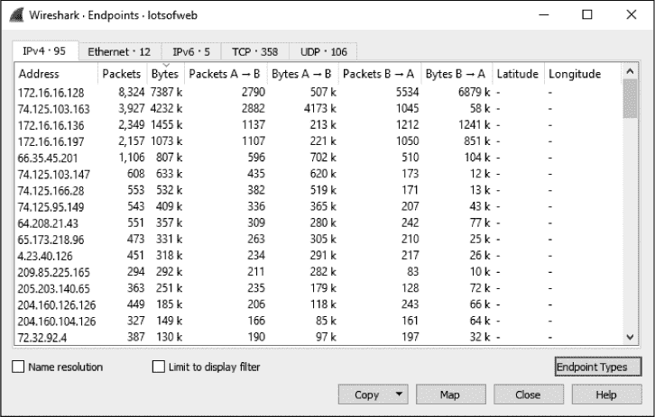

*图 5-4：端点窗口显示了哪些主机的通信量最大。*

第二高流量的地址是 74.125.103.163，一个外部（互联网）地址。当你遇到一些你不了解的外部地址时，可以搜索 WHOIS 注册表来查找注册的所有者。在这种情况下，来自美国互联网号码注册局（* [`whois.arin.net/ui/`](https://whois.arin.net/ui/) *）的结果显示，Google 拥有这个 IP 地址，正如 图 5-5 所示。

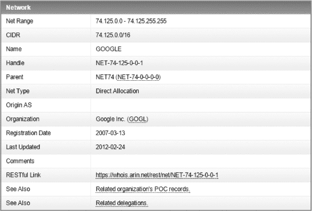

*图 5-5：查看 74.125.103.163 的 WHOIS 结果显示该 IP 属于 Google。*

**通过 WHOIS 确定 IP 地址所有权**

IP 地址的分配由不同的实体根据其地理位置进行管理。ARIN 负责美国及其周边地区的 IP 地址分配，AfriNIC 管理非洲地区的 IP 地址，RIPE 负责欧洲，APNIC 负责亚洲/太平洋地区。通常，你会在负责该 IP 的注册机构的网站上执行 WHOIS 查询。当然，仅通过查看一个地址，你通常无法知道哪个区域注册机构负责它。像 Robtex 这样的站点（* [`robtex.com/`](http://robtex.com/) *）会为你完成这项工作，查询正确的注册机构并提供结果。然而，如果你第一次查询了错误的注册机构，通常会被引导到正确的注册机构。

根据这些信息，你可以假设 172.16.16.128 和 74.125.103.163 要么与多个其他设备进行大量通信，要么它们之间相互通信。实际上，正如大多数顶级通信端点对所示，这两个端点是在互相通信。为了确认这一点，打开“对话”窗口，选择 IPv4 标签，并按字节数对列表进行排序。你应该能看到这两个端点构成了数据传输字节数最多的对话。传输模式表明这是一次大规模的下载，因为来自外部地址 A（74.125.103.163）传输的字节数远大于来自内部地址 B（172.16.16.128）传输的字节数，如图 5-6 所示。

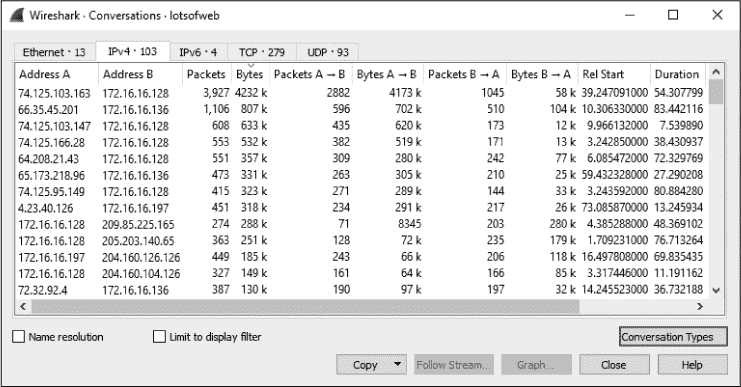

*图 5-6：对话窗口确认这两个主要通信端点正在相互通信。*

你可以通过应用以下显示过滤器来检查此对话：

```
ip.addr == 74.125.103.163 && ip.addr == 172.16.16.128
```

如果你浏览数据包列表，你会看到在数据包列表窗口的“信息”列中有几个针对*youtube.com*域的 DNS 请求。这与我们发现 74.125.103.163 是谷歌拥有的 IP 地址相符，因为谷歌拥有 YouTube。

你将在本书的剩余章节中看到如何在实际场景中使用端点和对话窗口。

### 协议层次统计

*lotsofweb.pcapng*

在处理不熟悉的捕获文件时，有时需要确定流量按协议的分布情况。也就是说，捕获文件中有多少比例是 TCP、IP、DHCP 等协议？与其逐一统计数据包并汇总结果，不如使用 Wireshark 的“协议层次统计”窗口，它可以为你提供这些信息。

例如，保持*lotsofweb.pcapng*文件打开并清除之前应用的任何过滤器后，选择**统计** ▶ **协议层次**，如图 5-7 所示，打开“协议层次统计”窗口。

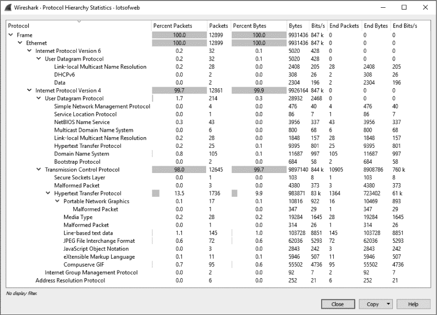

*图 5-7：协议层次统计窗口显示流量按协议的分布情况。*

协议层次统计窗口为您提供网络上发生的活动类型的快照。在图 5-7 中，100%为以太网流量，99.7%为 IPv4，98%为 TCP，13.5%为来自网页浏览的 HTTP 流量。这些信息为您提供了一个很好的方式来基准测试您的网络，尤其是在您已经对网络流量的常见模式有了直观了解的情况下。例如，如果您知道您的网络流量中通常有 10%是 ARP 流量，但在最近的捕获中看到 50%的 ARP 流量，那么可能有问题。在某些情况下，协议的存在本身就可能引起注意。如果您没有任何设备配置使用生成树协议（STP），那么在协议层次结构中看到它可能意味着某个设备配置错误。

随着时间的推移，您会发现通过查看协议使用情况的分布，您可以仅凭协议层次统计窗口来分析网络中的用户和设备。例如，更高的 HTTP 流量会告诉您有大量的网页浏览活动。您还可能发现，仅凭查看属于某个业务部门的网络段的流量，您就能识别出网络中的特定设备。例如，IT 部门可能使用更多的管理协议，如 ICMP 或 SNMP，客户服务部门可能负责大量的 SMTP（电子邮件）流量，而角落里那个烦人的实习生可能正用*魔兽世界*流量占满整个网络！

### 名称解析

网络数据通过各种字母数字地址系统在端点之间传输，这些地址通常过长或过于复杂，不容易记住，例如 MAC 地址 00:16:ce:6e:8b:24，IPv4 地址 192.168.47.122 或 IPv6 地址 2001:db8:a0b:12f0::1。*名称解析*（也称为*名称查找*）将一个标识地址转换为另一个地址，主要是为了使地址更容易记住。例如，记住* [google.com](http://google.com) *比记住 216.58.217.238 要容易得多。通过将易读的名称与这些晦涩的地址关联起来，我们使它们更容易记住和识别。

#### *启用名称解析*

Wireshark 可以在显示数据包时使用名称解析来简化分析。要启用 Wireshark 的名称解析，请选择**编辑** ▶ **首选项** ▶ **名称解析**。该窗口如图 5-8 所示。以下是 Wireshark 中与名称解析相关的主要选项：

**解析 MAC 地址**  使用 ARP 协议尝试将二层 MAC 地址（例如 00:09:5b:01:02:03）转换为三层地址（例如 10.100.12.1）。如果这些转换失败，Wireshark 会使用程序目录中的*ethers*文件进行转换尝试。Wireshark 的最后手段是将 MAC 地址的前三个字节转换为设备的 IEEE 指定的制造商名称，例如*Netgear_01:02:03*。

**解析传输名称**  尝试将端口号转换为与之相关的名称，例如，将端口 80 显示为 *http*。当你遇到一个不常见的端口并不知道它通常关联的服务时，这个功能很有用。

**解析网络（IP）地址**  尝试将第 3 层地址（如 192.168.1.50）转换为易于阅读的 DNS 名称，例如 *[MarketingPC1.domain.com](http://MarketingPC1.domain.com)*。这对于识别系统的用途或所有者非常有帮助，前提是该系统有一个描述性的名称。

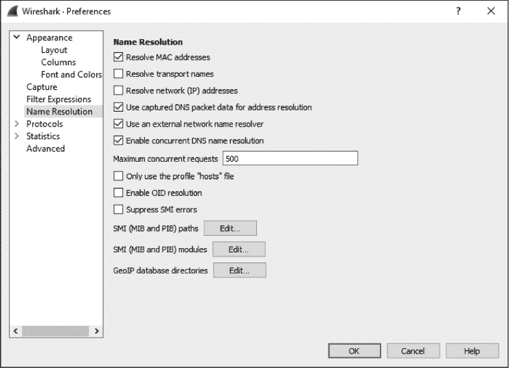

*图 5-8：在首选项对话框中启用名称解析。第一组三个与名称解析类型相关的复选框中，只有“解析 MAC 地址”被选中。*

图 5-8 中的名称解析首选项对话框包括一些其他有用的选项：

**使用捕获的 DNS 数据包数据进行地址解析**  从捕获的 DNS 数据包中解析 DNS 数据，以将 IP 地址解析为 DNS 名称。

**使用外部网络名称解析器**  允许 Wireshark 向分析机器使用的 DNS 服务器生成查询，以将 IP 地址解析为 DNS 名称。如果您希望使用 DNS 名称解析，但正在分析的捕获数据包中没有相关的 DNS 数据包，这将非常有帮助。

**最大并发请求数**  限制了可以同时进行的并发 DNS 查询的数量。如果你的捕获操作会生成大量的 DNS 请求，且你担心会占用过多的网络带宽或 DNS 服务器资源，可以使用此选项。

**仅使用“hosts”文件配置**  限制 DNS 解析仅使用与当前 Wireshark 配置文件关联的主机文件。我将在本节稍后介绍如何使用此文件。

在首选项屏幕中所做的更改将在关闭并重新打开 Wireshark 后保持不变。若要临时更改名称解析设置而不使其保持，您可以通过点击主菜单中的“查看 ▶ 名称解析”来切换名称解析的启用或禁用。您可以选择启用或禁用物理、传输和网络地址的名称解析。

你可以利用各种名称解析工具，使捕获的文件更易于阅读，并在某些情况下节省大量时间。例如，您可以使用 DNS 名称解析帮助快速识别您正在定位的计算机的名称，该计算机是某个特定数据包的来源。

#### *名称解析的潜在缺点*

鉴于其优点，使用名称解析可能看起来是显而易见的，但也存在一些潜在的缺点。首先，如果没有 DNS 服务器提供与 IP 地址相关联的名称，网络名称解析可能会失败。名称解析信息不会随捕获文件一起保存，因此每次打开文件时都必须进行解析。如果您在一个网络上捕获数据包，然后在另一个网络上打开该捕获文件，则您的系统可能无法访问源网络的 DNS 服务器，导致名称解析失败。

此外，名称解析需要额外的处理开销。当处理非常大的捕获文件时，您可能希望放弃名称解析，以节省系统资源。如果您尝试打开一个大型捕获文件，发现系统无法加载它，或者 Wireshark 崩溃，禁用名称解析可能会有所帮助。

另一个问题是，网络名称解析依赖于 DNS，这可能会生成不必要的数据包，从而使捕获文件变得混乱，因为流量会发送到 DNS 服务器以解析地址。更复杂的是，如果你分析的捕获文件包含恶意 IP 地址，尝试解析它们可能会生成向攻击者控制的基础设施发送的查询，这可能会让攻击者意识到你已经发现了他们的行动，甚至可能让你成为攻击目标。为了减少污染数据包文件或无意间与攻击者通信的风险，请在“名称解析首选项”对话框中禁用“使用外部网络名称解析器”选项。

#### *使用自定义 hosts 文件*

在大型捕获文件中，尤其是当外部主机解析不可用时，跟踪来自多个主机的流量可能会变得繁琐。帮助的方法之一是使用 Wireshark 的*hosts*文件手动标记系统，文件是一个包含 IP 地址与名称映射的文本文件。你可以使用*hosts*文件为 Wireshark 中的地址标记名称，以便快速参考。这些名称将显示在数据包列表窗格中。

要使用*hosts*文件，请按照以下步骤操作：

1.  选择**编辑** ▶ **首选项** ▶ **名称解析**，然后选择**仅使用“hosts”配置文件**。

1.  使用 Windows 记事本或类似的文本编辑器创建一个新文件。文件应包含每行一个条目，其中包括一个 IP 地址和需要解析的名称，如图 5-9 所示。你在右侧选择的名称将在 Wireshark 遇到左侧的 IP 地址时显示在数据包列表窗口中。

    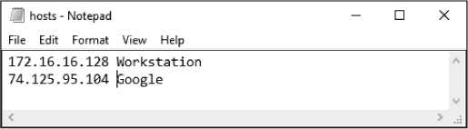

    *图 5-9: 创建 Wireshark* hosts *文件*

1.  将文件保存为纯文本文件，并命名为*hosts*，存储到适当的目录中，如下所示。确保文件没有扩展名！

    •     Windows: *<USERPROFILE>\Application Data\Wireshark\hosts*

    •     OS X: */Users/<username>/.wireshark/hosts*

    •     Linux: */home/<username>/.wireshark/hosts*

现在打开一个捕获文件，你的*hosts*文件中的任何 IP 地址应该会解析为指定的名称，如图 5-10 所示。取代数据包列表窗口中的源地址和目的地址列显示的 IP 地址，会显示更有意义的名称。

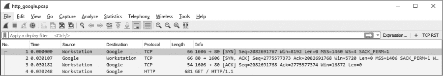

*图 5-10：Wireshark 中* hosts *文件的名称解析*

以这种方式使用*hosts*文件可以显著提高你在分析过程中识别特定主机的能力。当与分析团队合作时，考虑在你的网络工作人员之间共享已知资产的*hosts*文件。这将帮助你的团队快速识别具有静态地址的系统，如服务器和路由器。

**注意**

*如果你的* hosts *文件似乎没有正常工作，请确保你没有不小心为文件名添加文件扩展名。文件名应该只是* hosts。

#### *手动启动名称解析*

Wireshark 还具有在临时按需基础上强制进行名称解析的能力。这是通过右键单击数据包列表窗格中的一个数据包，然后选择编辑已解析名称选项来完成的。弹出的窗口允许你为地址指定一个名称，类似于标签。此解析在捕获文件关闭后会丢失，因此这是一种快速标记地址的方法，而无需进行永久性更改，也不必担心以后撤销更改。我经常使用这种技术，因为它比每次查看数据包捕获时手动编辑*hosts*文件更简单。

### 协议分解

Wireshark 最大的优势之一是它支持分析超过一千种协议。Wireshark 之所以具有这种能力，是因为它是开源的，从而提供了一个框架来创建*协议分解器*。这些分解器使 Wireshark 能够识别并解码协议为各种字段，以便在用户界面中显示该协议。Wireshark 使用多个分解器协同工作来解释每个数据包。例如，ICMP 协议分解器使 Wireshark 能够识别 IP 数据包包含 ICMP 数据，提取 ICMP 类型和代码，并将这些字段格式化后显示在数据包列表窗格的“信息”列中。

你可以将分解器看作是原始数据与 Wireshark 程序之间的翻译器。为了让 Wireshark 支持某个协议，该协议必须有一个分解器（或者你可以自己编写一个）。

#### *更改分解器*

*wrongdissector.pcapng*

Wireshark 使用分解器来检测各个协议并决定如何显示网络信息。不幸的是，Wireshark 在选择应用于数据包的分解器时并不总是做出正确的选择。当网络上的协议使用非标准配置时，尤其如此，例如非默认端口（这通常由网络管理员作为安全预防措施配置，或由员工试图规避访问控制时使用）。

当 Wireshark 错误地应用了解析器时，可以覆盖此选择。例如，打开追踪文件*wrongdissector.pcapng*。该文件包含两台计算机之间的大量 SSL 通信。SSL 是安全套接字层协议，用于主机之间的加密通信。在大多数正常情况下，由于其加密性质，在 Wireshark 中查看 SSL 流量不会获得太多可用信息。然而，这里显然有些问题。如果你通过点击这些数据包并检查数据包字节面板来浏览其中的几个数据包内容，你会发现明文流量。事实上，如果你查看数据包 4，你会发现提到了 FileZilla FTP 服务器应用程序。接下来的几个数据包清楚地显示了用户名和密码的请求和响应。

如果这真的是 SSL 流量，你将无法读取数据包中包含的任何数据，而且你肯定不会看到明文传输的所有用户名和密码，如图 5-11 所示。根据这里显示的信息，可以安全地假设这可能是 FTP 流量，而不是 SSL 流量。Wireshark 可能会将此流量解释为 SSL，因为它使用的是端口 443，如在“信息”列中看到的那样，而端口 443 是 HTTPS（基于 SSL 的 HTTP）的标准端口。

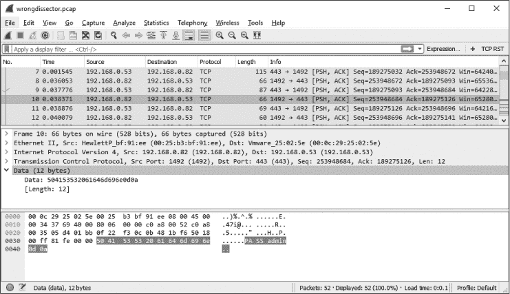

*图 5-11：明文用户名和密码？这看起来更像是 FTP 而不是 SSL！*

为了修复这个问题，你可以对 Wireshark 应用*强制解码*，使用 FTP 协议解析器来解析这些数据包。以下是步骤：

1.  右键点击协议列中的一个 SSL 数据包（例如数据包 30），然后选择**解码为**，这将打开一个新对话框。

1.  告诉 Wireshark 将所有 TCP 端口 443 流量解码为 FTP，通过选择“字段”列中的 TCP 端口，在“值”列中输入 443，并从“当前”列的下拉菜单中选择 FTP，如图 5-12 所示。

    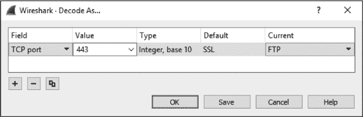

    *图 5-12：解码为...对话框允许你创建强制解码。*

1.  点击**确定**，立即将更改应用到捕获文件中。

数据将作为 FTP 流量进行解码，这样你就可以在数据包列表面板中分析它，而无需深入查看单个字节（图 5-13）。

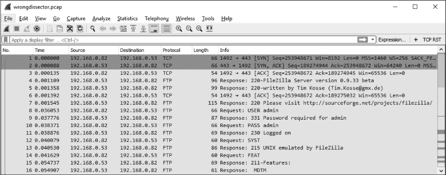

*图 5-13：查看正确解码的 FTP 流量*

强制解码功能可以在同一个捕获文件中多次使用。Wireshark 会在“解码为...”对话框中跟踪你强制解码的记录，在那里你可以查看和编辑迄今为止创建的所有强制解码。

默认情况下，强制解码不会在你关闭捕获时保存。你可以通过在“解码为...”对话框中点击保存按钮来解决这个问题。这会将协议解码规则保存到你当前的 Wireshark 用户配置文件中；当你使用该配置文件打开任何捕获文件时，这些规则将会被应用。保存的解码规则可以通过点击对话框中的减号按钮来移除。

很容易保存解码规则后就忘记它们。当你没有准备好时，这可能会导致很多困惑，所以要留心强制解码。为了避免自己犯这个疏忽，我通常避免将强制解码保存到我的主 Wireshark 配置文件中。

#### *查看解剖器源代码*

使用开源应用程序的好处在于，如果你对某些事情发生的原因感到困惑，你可以查看源代码，找出原因。当你尝试确定某个特定协议为什么被错误解读时，这非常有用，因为你可以检查各个协议解剖器。

通过点击 Wireshark 网站上的“开发”链接并点击“浏览代码”，可以直接查看协议解剖器的源代码。此链接将把你带到 Wireshark 代码仓库，在那里你可以查看最新 Wireshark 版本的发布代码。协议解剖器位于*epan/dissectors*文件夹中，每个解剖器都标注为*packets-<protocolname>.c*。

这些文件可能相当复杂，但它们都遵循标准模板，并且通常注释得非常好。你不需要是一个专家级的 C 程序员就能理解每个解剖器的基本功能。如果你想深入理解在 Wireshark 中看到的内容，我建议你查看一些简单协议的解剖器。

### 跟踪流

*http_google.pcapng*

Wireshark 最令人满意的分析功能之一是其能够将来自多个数据包的数据重新组合成一个合并的、易于阅读的格式，这通常被称为*数据包转录*。这样，你就不需要在点击数据包之间时查看客户端到服务器的数据的小块，*流跟随*功能会将数据排序，便于查看。

有四种类型的流可供跟随：

**TCP 流** 组装来自使用 TCP 的协议的数据，例如 HTTP 和 FTP。

**UDP 流** 组装来自使用 UDP 的协议的数据，例如 DNS。

**SSL 流** 组装来自加密协议的数据，例如 HTTPS。你必须提供密钥来解密流量。

**HTTP 流** 组装和解压来自 HTTP 协议的数据。当通过 TCP 流跟踪 HTTP 数据时，无法完全解码 HTTP 负载时，这非常有用。

作为一个例子，考虑文件*http_google.pcapng*中的一个简单 HTTP 事务。点击文件中的任意 TCP 或 HTTP 数据包，右键点击数据包并选择**跟踪 TCP 流**。这将整合 TCP 流并在一个单独的窗口中打开对话记录，如图 5-14 所示。

此窗口中显示的文本使用了两种颜色，红色文本（在这里用较浅的灰色阴影表示）表示源到目的地的流量，蓝色文本（在这里用较深的灰色阴影表示）则表示目的地到源的流量。颜色的不同与通信的发起方有关。在我们的例子中，客户端发起了与 Web 服务器的连接，因此显示为红色。

TCP 流中的通信以一个初始的`GET`请求开始，请求访问网站根目录（`/`），并且服务器以`HTTP/1.1 200 OK`形式响应，表示请求成功。在数据包捕获中的其他流中也重复出现类似的模式，客户端请求单个文件，服务器相应返回。这实际上是一个用户在浏览 Google 主页的过程，不过您不需要逐个查看每个数据包，而是能够轻松滚动浏览记录。您所看到的是用户所看到的内容，但从内部视角。


*图 5-14：跟踪 TCP 流窗口将通信重新组装成易于阅读的格式。*

除了在此窗口中查看原始数据外，您还可以在文本中进行搜索；将其保存为文件；打印；或者选择以 ASCII、EBCDIC、十六进制或 C 数组格式查看数据。这些选项位于跟踪流窗口的底部，有助于在处理大量数据时更加便捷。

#### *跟踪 SSL 流*

跟踪 TCP 和 UDP 流是一个简单的两步操作，但要以可读格式查看 SSL 流则需要几个额外的步骤。由于流量被加密，您需要提供与负责加密流量的服务器关联的私钥。获取此密钥的方法取决于使用的服务器技术，超出了本书的范围，但一旦您获得了该密钥，您需要按照以下过程将其加载到 Wireshark 中：

1.  通过点击**编辑** ▶ **首选项**来访问 Wireshark 的首选项设置。

1.  展开**协议**部分，点击**SSL**协议标题（如图 5-15 所示）。点击 RSA 密钥列表标签旁的**编辑**按钮。

1.  点击加号（+）按钮。

1.  提供所需的信息。这包括负责加密的服务器的 IP 地址、端口、协议、密钥文件的位置，如果使用了密码，还需提供密钥文件的密码。

1.  重启 Wireshark。

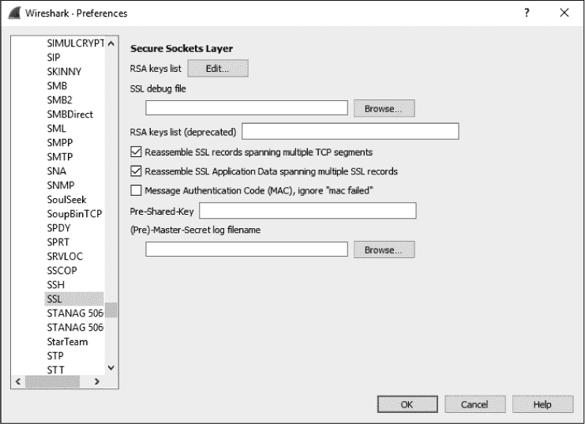

*图 5-15：添加 SSL 解密信息*

一旦此过程完成，你应该能够捕获客户端和服务器之间的加密流量。右键点击一个 HTTPS 数据包，然后点击**跟踪 SSL 流**以查看明文转录。

查看数据包转录的能力是 Wireshark 中最常用的分析功能之一，你会依赖它来快速确定正在使用哪些特定协议。我们将在后续章节中介绍几个依赖于查看数据包转录的额外场景。

### 数据包长度

*download-slow.pcapng*

单个数据包或数据包组的大小可以告诉你很多关于网络状况的信息。在正常情况下，以太网网络中一个帧的最大大小是 1,518 字节。当你从这个数值中减去以太网、IP 和 TCP 头部后，你剩下的是 1,460 字节，这些字节可以用于传输第七层协议头部或数据。如果你知道数据包传输的最小要求，就可以开始查看捕获中数据包长度的分布，以合理推测流量的构成。这对理解大型捕获文件的组成非常有帮助。Wireshark 提供了数据包长度对话框，供你查看根据长度分布的数据包。

让我们通过打开文件*download-slow.pcapng*来举个例子。打开后，选择**统计** ▶ **数据包长度**。结果会显示图 5-16 中的数据包长度对话框。

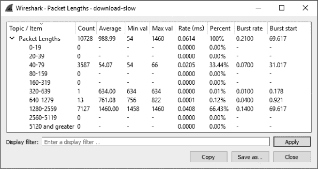

*图 5-16：数据包长度对话框帮助你对捕获文件中的流量做出合理的推测。*

特别注意显示统计信息的行，其中数据包长度在 1,280 到 2,559 字节之间。像这样的较大数据包通常表示数据传输，而较小的数据包则表示协议控制序列。在这种情况下，我们看到较大数据包的比例很高（66.43%）。即使没有查看文件中的数据包，我们也可以合理推测，捕获文件中包含一个或多个数据传输。这些传输可能是 HTTP 下载、FTP 上传或其他类型的网络通信，其中数据在主机之间传输。

剩余的大多数数据包（33.44%）的长度在 40 到 79 字节之间。这个范围内的数据包通常是 TCP 控制数据包，不携带数据。让我们考虑一下协议头的典型大小。以太网头部是 14 字节（加上 4 字节的 CRC），IP 头部至少是 20 字节，且一个没有数据或选项的 TCP 数据包也是 20 字节。这意味着标准的 TCP 控制数据包——如 SYN、ACK、RST 和 FIN 数据包——大约是 54 字节，符合这个范围。当然，IP 或 TCP 选项的加入会增加这个大小。我们将在第七章和第八章中深入讨论 IP 和 TCP。

检查数据包长度是快速查看大型捕获的好方法。如果有很多大数据包，可以假设正在传输数据。如果大多数数据包较小，说明传输的数据量不多，可以推测捕获的数据主要是协议控制命令。这些并不是硬性规则，但在深入分析之前做出这样的假设会很有帮助。

### 绘制图表

图表是分析的基础，是获得数据集概览的最佳方式之一。Wireshark 包括了多个图表功能来帮助理解捕获的数据，其中最重要的功能之一就是它的 IO 图表功能。

#### *查看 IO 图表*

*download-fast.pcapng, download-slow.pcapng, http_espn.pcapng*

Wireshark 的 IO 图表窗口允许你绘制网络上数据的吞吐量。你可以使用这些图表来查找数据吞吐量的峰值和低谷，发现单个协议中的性能滞后，或比较同时进行的数据流。

要查看计算机从互联网下载文件时的 IO 图表示例，请打开*download-fast.pcapng*。点击任何 TCP 数据包以突出显示它，然后选择**统计** ▶ **IO 图表**。

IO 图表窗口显示了数据流随时间变化的图形视图。在图 5-17 的例子中，你可以看到这个图表所代表的下载平均约为每秒 500 个数据包，并且在下载的过程中保持相对一致，直到最后有所下降。

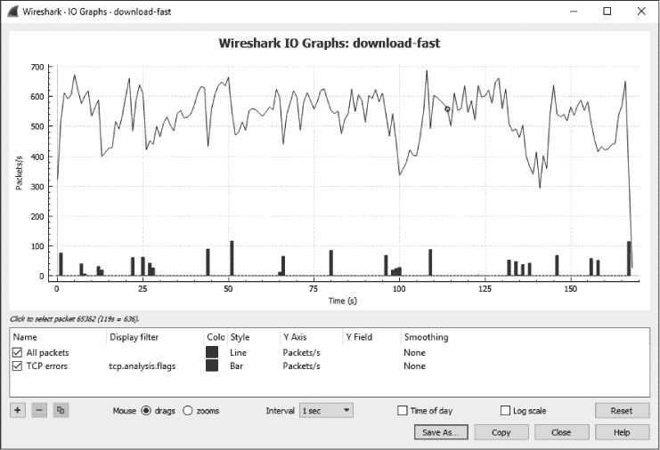

*图 5-17：快速下载的 IO 图表大致一致。*

让我们将其与一个下载速度较慢的例子进行比较。在保持当前文件打开的情况下，在另一个 Wireshark 实例中打开*download-slow.pcapng*。调出该下载的 IO 图表，你会看到一个完全不同的情况，如图 5-18 所示。

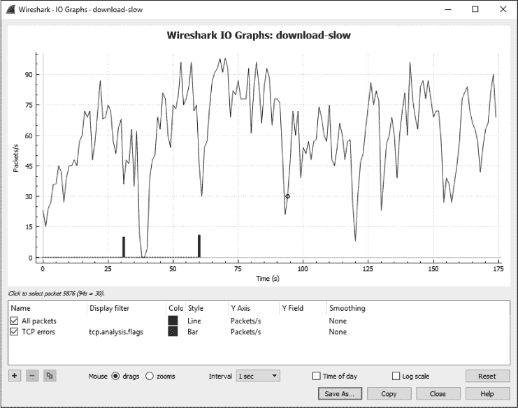

*图 5-18：慢速下载的 IO 图表完全不一致。*

这个下载的传输速率介于每秒 0 到 100 个数据包之间，并且其速率远远不一致，有时接近每秒 0 个数据包。如果你将这两个文件的 IO 图表并排放置（见图 5-19），你可以更清楚地看到这些不一致性。在比较两个图表时，请注意 x 轴和 y 轴的数值，以确保你在做公平的比较。图表的比例会根据数据包的数量和/或传输的数据量自动调整，这是图 5-19 中两个图表的一个重要区别。较慢的下载显示的比例在每秒 0 到 100 个数据包之间，而较快的下载比例则在每秒 0 到 700 个数据包之间。

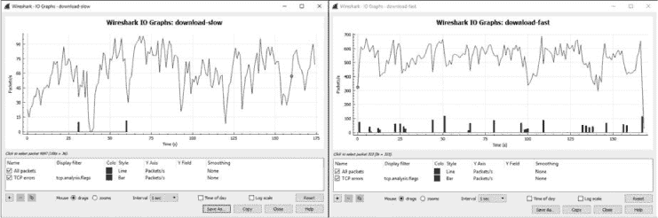

*图 5-19：并排查看多个 IO 图表有助于发现变化。*

此窗口底部的可配置选项允许你使用多个唯一过滤器（使用与显示或捕获过滤器相同的语法），并为这些过滤器指定显示颜色。例如，你可以为特定 IP 地址创建过滤器，并为其分配独特的颜色，以便查看每个设备的吞吐量差异。我们来试试看。

打开*http_espn.pcapng*，这是在某设备访问 ESPN 主页时捕获的。如果你查看“会话”窗口，你会看到最活跃的外部 IP 地址是 205.234.218.129\。由此我们可以推断，当访问*[espn.com](http://espn.com)*时，数据很可能来自于这个主机作为主要内容提供者。然而，还有其他多个 IP 地址参与会话，这很可能是因为额外的内容是从外部内容提供者和广告商处下载的。我们可以使用图 5-20 中的 IO 图来展示直接内容和第三方内容交付之间的差异。

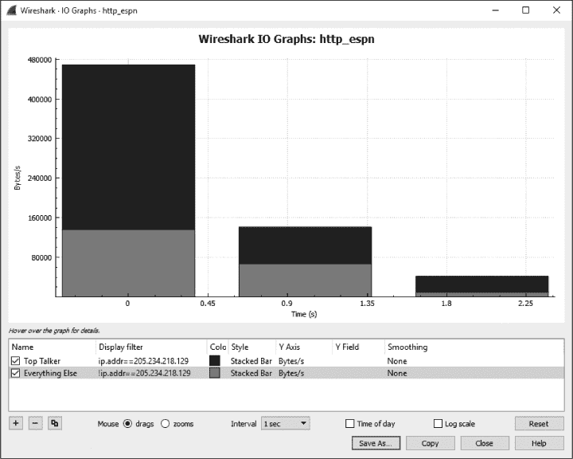

*图 5-20：显示两个独立设备 IO 的 IO 图。*

该图表中应用的两个过滤器通过 IO 图窗口底部的行表示。名为“Top Talker”的过滤器仅显示 IP 地址 205.234.218.129（我们的主要内容提供者）的 IO 流量。它将以堆叠条形图样式用黑色绘制此值。第二个过滤器，名为“Everything Else”，将显示捕获文件中除了 205.234.218.129 地址之外的所有内容，因此包括所有第三方内容提供者。这一数值将以红色（此处为较浅的灰色）使用堆叠条形图绘制。请注意，我们已经将 y 轴的单位更改为字节/秒。应用这些更改后，轻松看出主要内容提供者和第三方内容提供者之间的差异，并且可以清楚地看到来自第三方源的实际内容量。这是一个有趣的练习，可以在你常访问的网站上重复进行，也是比较不同网络主机 IO 的有用策略。

#### *往返时间图*

*download-fast.pcapng*

Wireshark 的另一个图形功能是能够查看给定捕获文件的往返时间图。*往返时间（RTT）*是接收到数据包确认所需的时间。实际上，这是数据包到达目标并收到该数据包确认后返回给你的时间。RTT 分析通常用于查找通信中的慢点或瓶颈，并确定是否存在延迟。

让我们试试这个功能。打开文件*download-fast.pcapng*。通过选择一个 TCP 数据包，然后选择**统计** ▶ **TCP 流图** ▶ **往返时间图**来查看该文件的 RTT 图。*download-fast.pcapng*的 RTT 图如图 5-21 所示。

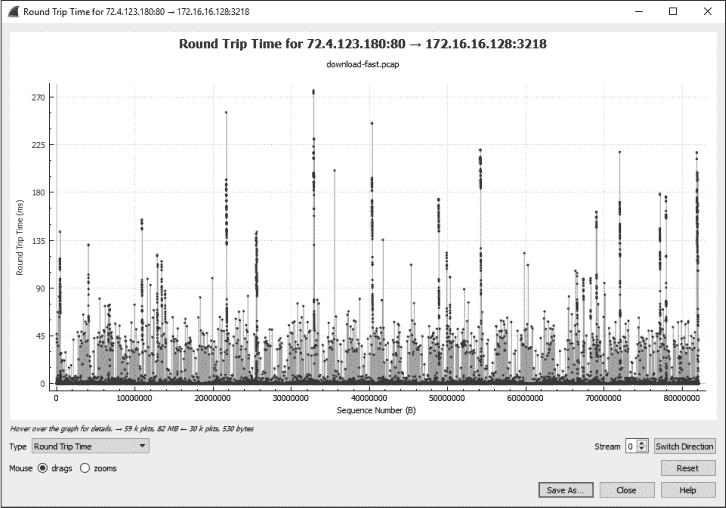

*图 5-21：快速下载的 RTT 图表看起来大部分保持一致，只有少数偏离值。*

图中的每个点表示一个包的 RTT。默认视图将这些值按序列号排序。你可以点击图表中的某个点，直接跳转到“数据包列表”面板中的对应包。

**注意**

*RTT 图是单向的，因此选择正确的流量方向非常重要。如果你的图表看起来不像图 5-21 中的图形，你可能需要点击“切换方向”按钮两次。*

看起来快速下载的 RTT 图表大多数 RTT 值都在 0.05 秒以下，只有一些较慢的点位于 0.10 到 0.25 秒之间。尽管有相当多的较高值，但大多数 RTT 值都还可以，因此这将被认为是一个可接受的文件下载 RTT。当检查吞吐量问题的 RTT 图时，应该寻找高延迟时间，这些高延迟时间通过在 y 轴较高位置绘制多个点来表示。

#### *流量图*

*dns_recursivequery_server.pcapng*

流量图功能对于可视化连接和展示随时间变化的数据流非常有用，这些信息使得理解设备之间如何通信变得更加容易。流量图包含一个基于列的连接视图，并组织流量数据，以便可以通过视觉方式进行解读。

要创建流量图，请打开文件 *dns_recursivequery_server.pcapng*，然后选择 **统计信息** ▶ **流量图**。生成的图表显示在图 5-22 中。

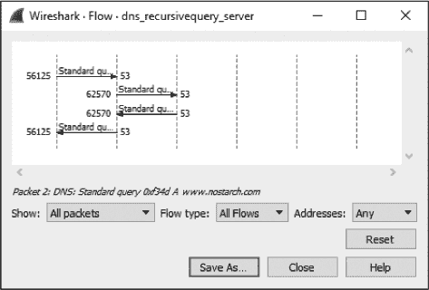

*图 5-22：TCP 流量图让我们能更好地可视化连接。*

这个流量图是一个递归 DNS 查询，它是由一个主机接收并转发到另一个主机的 DNS 查询（我们将在第九章中讲解 DNS）。图中的每一条垂直线表示一个独立的主机。流量图是可视化两个设备之间来回通信的好方法，或者像本例中一样，展示多个设备之间的通信关系。它对于理解与不太熟悉的协议的正常通信流动也非常有用。

### 专家信息

*download-slow.pcapng*

Wireshark 中每个协议的解析器定义了*专家信息*，该信息可用于提醒你协议包中的特定状态。这些状态被分为四类。

**聊天** 基本的通信信息

**注意** 可能属于正常通信的异常包

**警告** 可能不属于正常通信的异常包

**错误** 包中的错误或解析器在解释它时的错误

例如，打开文件 *download-slow.pcapng*，然后点击 **分析** 并选择 **专家信息**，以调出专家信息窗口。在此窗口中，取消选择按总结分组，按严重性整理输出（参见 图 5-23）。

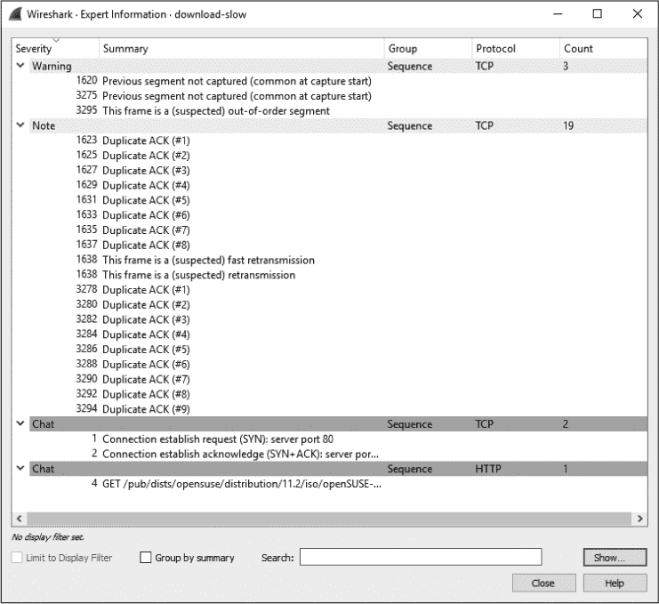

*图 5-23：专家信息窗口显示协议解剖器中编程的专家系统信息。*

窗口包含针对每种信息分类的部分。此处没有错误，3 条警告，19 条提示信息，和 3 条聊天信息。

该捕获文件中的大部分信息都与 TCP 相关，这是因为专家信息系统传统上主要与该协议配合使用。目前，为 TCP 配置了 29 条专家信息消息，在排查捕获文件时非常有用。当某个数据包满足特定条件时，这些消息将标记该数据包，条件如下所列。（随着我们在 第八章 研究 TCP 和在 第十一章 排查慢速网络时，这些消息的含义将变得更加清晰。）

**聊天信息**

*窗口更新* 接收方发送给发送方，通知其 TCP 接收窗口大小已发生变化。

**提示信息**

*TCP 重传* 由于数据包丢失导致。当收到重复的 ACK 或数据包的重传计时器到期时，发生重传。

*重复的 ACK* 当主机未收到期望的下一个序列号时，它会生成一个重复的 ACK，确认最后接收到的数据。

*零窗口探测* 在发送零窗口数据包后，监控 TCP 接收窗口的状态（详见 第十一章）。

*保持连接 ACK* 响应保持连接数据包时发送的 ACK。

*零窗口探测 ACK* 响应零窗口探测数据包时发送的 ACK。

*窗口已满* 通知发送方接收方的 TCP 接收窗口已满。

**警告信息**

*丢失的前一个段* 表示数据包丢失。当数据流中期望的序列号被跳过时发生。

*确认丢失的数据包* 当看到一个 ACK 数据包，但它所确认的数据包未出现时，发生此情况。

*保持连接* 当检测到连接保持活动包时触发。

*零窗口* 当 TCP 接收窗口大小已满并发送零窗口通知，请求发送方停止发送数据时，出现该信息。

*乱序* 利用序列号检测数据包是否乱序接收。

*快速重传* 在收到重复的 ACK 后 20 毫秒内发生的重传。

**错误信息**

*没有错误信息*

尽管本章讨论的某些特性可能看起来仅在特定情况下使用，但你可能会发现自己比预期更频繁地使用它们。熟悉这些窗口和选项非常重要；在接下来的几章中，我会频繁提到它们。
