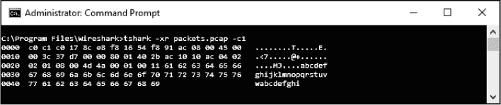
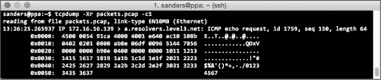
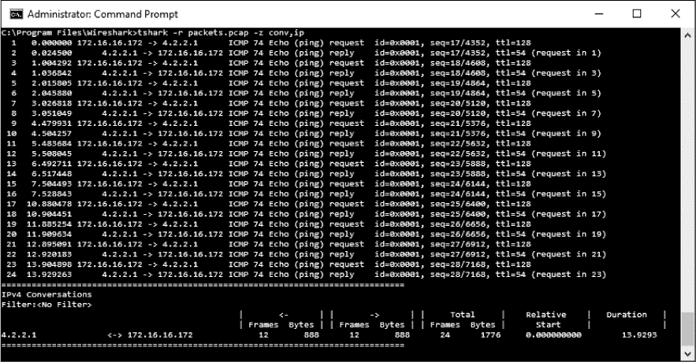
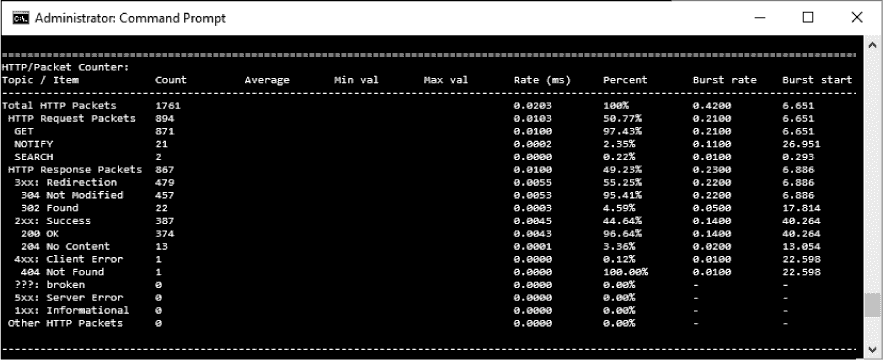

## **命令行上的数据包分析**


尽管许多场景可以通过图形用户界面（GUI）解决，但在某些情况下，使用命令行工具——例如 TShark 或 tcpdump——是必要的或更为理想的。以下是一些可能需要使用命令行工具而不是 Wireshark 的情况：

•     Wireshark 会一次性提供大量信息。通过使用命令行工具，你可以将显示的信息限制为仅与数据相关的内容，例如只显示包含 IP 地址的单行信息。

•     命令行工具最适合用于过滤数据包捕获文件，并通过 Unix 管道将结果直接提供给其他工具。

•     处理一个非常大的捕获文件时，Wireshark 可能会由于必须将整个文件加载到内存中而感到压力。使用命令行工具对大型捕获文件进行流处理，可以帮助你迅速筛选出相关数据包。

•     如果你正在处理一台服务器且无法访问图形工具，你可能被迫依赖命令行工具。

在本章中，我将演示两种常见的命令行数据包分析工具，TShark 和 tcpdump 的功能。我认为熟悉这两种工具是有帮助的，但通常我在 Windows 系统上使用 TShark，而在 Unix 系统上使用 tcpdump。如果你仅使用 Windows，你可以跳过关于 tcpdump 的部分内容。

### 安装 TShark

基于终端的 Wireshark，或 TShark，是一个数据包分析应用程序，它提供了与 Wireshark 大致相同的功能，但完全通过命令行接口进行，没有图形用户界面。如果你已经安装了 Wireshark，那么 TShark 也很可能已经安装，除非你在安装 Wireshark 时明确选择不安装它。你可以通过以下步骤来验证 TShark 是否已安装：

1.  打开命令提示符。点击 **开始菜单**，输入 cmd，然后点击 **命令提示符**。

1.  浏览到 Wireshark 安装目录。如果你安装到了默认位置，可以通过在命令提示符中输入 cd C:\Program Files\ Wireshark 进入该目录。

1.  运行 TShark 并通过输入 tshark –v 打印其版本信息。如果 TShark 没有安装，你会看到一个错误，提示该命令无法识别。如果 TShark 已安装，你会看到 TShark 版本信息的输出：

    ```
    C:\Program Files\Wireshark>tshark –v
    TShark (Wireshark) 2.0.0 (v2.0.0-0-g9a73b82 from master-2.0
    --snip--
    ```

如果你没有安装 TShark 并且现在希望使用它，可以重新运行 Wireshark 安装程序，并确保选中了 TShark（默认情况下是选中的）。

如果你希望立即开始了解 TShark 的功能，可以通过 `–h` 参数打印可用的命令。我们将在本章中介绍其中的一些命令。

```
C:\Program Files\Wireshark>tshark -h
```

和 Wireshark 一样，TShark 可以运行在多个操作系统上，但由于它不依赖于操作系统特定的图形库，用户体验在不同操作系统平台间更加一致。因此，TShark 在 Windows、Linux 和 OS X 上的操作非常相似。不过，TShark 在每个平台上的运行仍然存在一些差异。本书将重点讲解如何在 Windows 上运行 TShark，因为这是它设计时的主要操作系统。

### 安装 tcpdump

虽然 Wireshark 是全球最受欢迎的图形化数据包分析应用程序，但 tcpdump 仍然是最受欢迎的命令行数据包分析应用程序。tcpdump 是专为 Unix 类操作系统设计的，通过流行的包管理应用程序很容易安装，并且在许多 Linux 发行版中已经预装。

尽管本书的大部分内容聚焦于 Windows，但也为 Unix 用户包含了 tcpdump 的相关章节。具体来说，我们将使用 Ubuntu 14.04 LTS。如果你想在 Windows 设备上使用 tcpdump，可以下载并安装其 Windows 版本 WinDump，网址是*[`www.winpcap.org/windump/`](http://www.winpcap.org/windump/)*。虽然 tcpdump 和 WinDump 的体验不完全相同，但这两款数据包分析器的功能类似。然而需要注意的是，WinDump 的维护不像 tcpdump 那样活跃。因此，一些较新的功能可能没有，且可能存在安全漏洞。（本书不会涵盖 WinDump。）

Ubuntu 系统没有预装 tcpdump，但由于 APT 包管理系统的存在，安装它非常简单。要安装 tcpdump，请按照以下步骤操作：

1.  打开一个终端窗口并执行命令`sudo apt-get update`，以确保你的包管理库是最新的，且包含最新的包版本。

1.  执行命令`sudo apt-get install tcpdump`。

1.  系统会提示你安装一些运行 tcpdump 所需的前置条件。当系统提示时，输入 Y 并按`ENTER`键允许这些安装。

1.  安装完成后，执行命令`tcpdump –h`来运行 tcpdump 并打印其版本信息。如果命令执行成功并且终端窗口中出现类似以下文本，你就可以开始使用 tcpdump 了：

    ```
    sanders@ppa:~$ tcpdump -h
    tcpdump version 4.5.1
    libpcap version 1.5.3
    Usage: tcpdump [-aAbdDefhHIJKlLnNOpqRStuUvxX#] [ -B size ] [ -c count ]
                [ -C file_size ] [ -E algo:secret ] [ -F file ] [ -G seconds ]
                [ -i interface ] [ -j tstamptype ] [ -M secret ]
                [ -Q metadata-filter-expression ]
                [ -r file ] [ -s snaplen ] [ -T type ] [ --version ] [ -V file ]
                [ -w file ] [ -W filecount ] [ -y datalinktype ] [ -z command ]
                [ -Z user ] [ expression ]
    ```

你可以通过执行`man tcpdump`命令来打印 tcpdump 的所有可用命令，如下所示：

```
sanders@ppa:~$ man tcpdump
```

我们将讨论如何使用其中的一些命令。

### 捕获并保存数据包

首要任务是从网络中捕获数据包并将其显示在屏幕上。要在 TShark 中开始捕获，只需执行命令`tshark`。此命令将启动从网络接口捕获数据包并将其显示在终端窗口的过程，屏幕上会显示类似以下内容：

```
C:\Program Files\Wireshark>tshark
  1   0.000000 172.16.16.128 -> 74.125.95.104 TCP 66 1606      80 [SYN]
Seq=0 Win=8192 Len=0 MSS=1460 WS=4 SACK_PERM=1
  2   0.030107 74.125.95.104 -> 172.16.16.128 TCP 66 80      1606 [SYN, ACK]
Seq=0 Ack=1 Win=5720 Len=0 MSS=1406 SACK_PERM=1 WS=64
  3   0.030182 172.16.16.128 -> 74.125.95.104 TCP 54 1606      80 [ACK]
Seq=1 Ack=1 Win=16872 Len=0
  4   0.030248 172.16.16.128 -> 74.125.95.104 HTTP 681 GET / HTTP/1.1
  5   0.079026 74.125.95.104 -> 172.16.16.128 TCP 60 80      1606 [ACK]
Seq=1 Ack=628 Win=6976 Len=0
```

要在 tcpdump 中开始捕获，执行命令`tcpdump`。运行此命令后，你的终端窗口应该会显示类似以下内容：

```
sanders@ppa:~$ tcpdump
tcpdump: verbose output suppressed, use -v or -vv for full protocol decode
listening on eth0, link-type EN10MB (Ethernet), capture size 65535 bytes
21:18:39.618072 IP 172.16.16.128.slm-api > 74.125.95.104.http: Flags [S],
seq 2082691767, win 8192, options [mss 1460,nop,wscale 2,nop,nop,sackOK],
length 0
21:18:39.648179 IP 74.125.95.104.http > 172.16.16.128.slm-api:
Flags [S.], seq 2775577373, ack 2082691768, win 5720, options [mss
1406,nop,nop,sackOK,nop,wscale 6], length 0
21:18:39.648254 IP 172.16.16.128.slm-api > 74.125.95.104.http: Flags [.],
ack 1, win 4218, length 0
21:18:39.648320 IP 172.16.16.128.slm-api > 74.125.95.104.http: Flags [P.],
seq 1:628, ack 1, win 4218, length 627: HTTP: GET / HTTP/1.1
21:18:39.697098 IP 74.125.95.104.http > 172.16.16.128.slm-api: Flags [.],
ack 628, win 109, length 0
```

**注意**

*由于在 Unix 系统上捕获数据包需要管理员权限，因此你可能需要以 root 用户身份执行`tcpdump`，或者在本书中列出的命令前使用`sudo`命令。在许多情况下，你可能会以具有有限权限的用户身份访问你的 Unix 系统。如果在跟随过程中遇到权限错误，这可能就是原因。*

根据你的系统配置，TShark 或 tcpdump 可能不会默认选择你想要捕获流量的网络接口。如果发生这种情况，你需要手动指定它。你可以通过使用`–D`参数列出 TShark 可用的接口，该命令将以编号列表的形式输出接口，如下所示：

```
C:\Program Files\Wireshark>tshark -D
1\. \Device\NPF_{1DE095C2-346D-47E6-B855-11917B74603A} (Local Area Connection*
2)
2\. \Device\NPF_{1A494418-97D3-42E8-8C0B-78D79A1F7545} (Ethernet 2)
```

要使用特定的接口，请使用`–i`参数，并从接口列表中选择该接口的编号，如下所示：

```
C:\Program Files\Wireshark>tshark –i 1
```

该命令将仅从名为“Local Area Connection 2”的接口捕获数据包，该接口在接口列表中的编号为 1。我建议始终指定你要捕获的接口。虚拟机工具或 VPN 常常会添加接口，你要确保你捕获的数据包来自正确的源。

在运行 tcpdump 的 Linux 或 OS X 系统上，使用`ifconfig`命令列出可用的接口：

```
sanders@ppa:~$ ifconfig
eth0      Link encap:Ethernet HWaddr 00:0c:29:1f:a7:55
          inet addr:172.16.16.139 Bcast:172.16.16.255 Mask:255.255.255.0
          inet6 addr: fe80::20c:29ff:fe1f:a755/64 Scope:Link
          UP BROADCAST RUNNING MULTICAST MTU:1500 Metric:1
          RX packets:5119 errors:0 dropped:0 overruns:0 frame:0
          TX packets:3088 errors:0 dropped:0 overruns:0 carrier:0
          collisions:0 txqueuelen:1000
          RX bytes:876746 (876.7 KB) TX bytes:538083 (538.0 KB)
```

也可以通过使用`–i`参数来指定接口：

```
sanders@ppa:~$ tcpdump –i eth0
```

该命令将专门从 eth0 接口捕获数据包。

一旦你正确配置了所有内容，就可以开始捕获数据包。如果你捕获的设备在网络上即使是稍微繁忙，你可能会注意到，表示单个数据包的行会飞快地出现——可能快得让你根本看不清。我们可以通过将数据包保存到文件中，然后仅从文件中读取其中的一部分来解决这个问题。

在这两个工具中，要将捕获到的数据包保存到文件中，请使用`–w`参数并指定文件名。捕获将继续运行，直到你通过按下 CTRL-C 停止它。除非另行指定，否则文件将保存到程序执行的目录中。

这是 TShark 中该命令的一个示例：

```
C:\Program Files\Wireshark>tshark –i 1 –w packets.pcap
```

该命令将把从接口列表中第一个接口捕获的所有数据包写入*packets.pcap*。

在 tcpdump 中，相同的命令会是这样的：

```
sanders@ppa:~$ tcpdump –i eth0 –w packets.pcap
```

要从保存的文件中读取数据包，请使用`–r`参数并指定文件名：

```
C:\Program Files\Wireshark>tshark –r packets.pcap
```

该命令将把所有数据包从*packets.pcap*读取到屏幕上。

tcpdump 命令几乎是一样的：

```
sanders@ppa:~$ tcpdump –r packets.pcap
```

你可能会注意到，如果你尝试从一个包含大量数据包的文件中读取数据，你会遇到类似前述的情况，数据包会太快滚动，根本来不及阅读。你可以使用`–c`参数来限制从文件中读取时显示的数据包数量。

例如，以下命令将仅显示 TShark 中捕获文件的前 10 个数据包：

```
C:\Program Files\Wireshark>tshark –r packets.pcap –c10
```

在 tcpdump 中，使用相同的参数：

```
sanders@ppa:~$ tcpdump –r packets.pcap –c10
```

`–c` 参数也可以在捕获时使用。执行此命令将仅捕获观察到的前 10 个数据包。将 `–c` 与 `–w` 参数结合使用时，也可以将它们保存。

下面是 TShark 中此命令的样子：

```
C:\Program Files\Wireshark>tshark –i 1 –w packets.pcap –c10
```

而在 tcpdump 中：

```
sanders@ppa:~$ tcpdump –i eth0 –w packets.pcap –c10
```

### 操作输出

使用命令行工具的一个好处是，输出通常会更为仔细地考虑。图形用户界面（GUI）通常会显示所有内容，用户需要自己去寻找想要的部分。命令行工具通常只显示最基本的信息，迫使用户使用额外的命令来深入挖掘。TShark 和 tcpdump 也不例外。它们每个数据包都显示一行输出，要求用户使用额外的命令查看诸如协议详情或单独字节之类的信息。

在 TShark 输出中，每一行代表一个数据包，行的格式取决于该数据包使用的协议。TShark 使用与 Wireshark 相同的解码器，并以相同的方式分析数据包数据，因此，当 TShark 和 Wireshark 并排运行时，TShark 输出会与 Wireshark 的数据包列表窗格相似。由于 TShark 具有第 7 层协议的解码器，它能够提供比 tcpdump 更多的关于包含头部的数据包的信息。

在 tcpdump 中，每一行也代表一个数据包，格式根据所使用的协议而不同。由于 tcpdump 没有使用 Wireshark 的协议解码器，第 7 层协议的信息不会被工具解析。这是 tcpdump 的最大限制之一。相反，单行数据包会根据其传输层协议格式化，该协议是 TCP 或 UDP（我们将在第八章中了解更多）。

TCP 数据包使用此格式：

```
[Timestamp] [Layer 3 Protocol] [Source IP].[Source Port] > [Destination IP].
[Destination Port]: [TCP Flags], [TCP Sequence Number], [TCP Acknowledgement
Number], [TCP Windows Size], [Data Length]
```

UDP 数据包使用此格式：

```
[Timestamp] [Layer 3 Protocol] [Source IP].[Source Port] > [Destination IP].
[Destination Port]: [Layer 4 Protocol], [Data Length]
```

这些基本的单行摘要非常适合快速分析，但最终你需要深入分析某个数据包。在 Wireshark 中，你可以通过点击数据包列表窗格中的数据包来实现这一点，从而在数据包详情和数据包字节窗格中显示信息。你也可以通过在命令行中使用一些选项来访问相同的信息。

获取更多关于每个数据包的信息最简单的方法是增加输出的详细程度。

在 TShark 中，使用大写字母 `V` 来增加详细度：

```
C:\Program Files\Wireshark>tshark –r packets.pcap –V
```

这将提供类似 Wireshark 数据包详情窗格的输出，适用于从 *packets.pcap* 捕获文件读取的数据包。这里展示了一个数据包的正常详细度（基本摘要）和扩展详细度（通过 `–V` 参数获得的更详细摘要）示例。

首先是标准输出：

```
C:\Program Files\Wireshark>tshark -r packets.pcap -c1
  1   0.000000 172.16.16.172 -> 4.2.2.1      ICMP Echo (ping) request
id=0x0001, seq=17/4352, ttl=128
```

现在是通过增加详细程度所产生的更深入的信息的一部分：

```
C:\Program Files\Wireshark>tshark -r packets.pcap -V -c1
Frame 1: 74 bytes on wire (592 bits), 74 bytes captured (592 bits) on
interface 0
    Interface id: 0 (\Device\NPF_{C30671C1-579D-4F33-9CC0-73EFFFE85A54})
    Encapsulation type: Ethernet (1)
    Arrival Time: Dec 21, 2015 12:52:43.116551000 Eastern Standard Time
    [Time shift for this packet: 0.000000000 seconds]
--snip--
```

在 tcpdump 中，小写字母 `v` 用于增加详细程度。与 TShark 不同，tcpdump 允许显示每个数据包的多个详细级别。您可以通过附加额外的 `v` 来增加最多三层详细度，如下所示：

```
sanders@ppa:~$ tcpdump –r packets.pcap –vvv
```

下面展示了同一个数据包在正常详细度和一层扩展详细度下的显示情况。即使在完全详细模式下，这个输出也远不如 TShark 产生的详细。

```
sanders@ppa:~$ tcpdump -r packets.pcap -c1
reading from file packets.pcap, link-type EN10MB (Ethernet)
13:26:25.265937 IP 172.16.16.139 > a.resolvers.level3.net: ICMP echo request,
id 1759, seq 150, length 64
sanders@ppa:~$ tcpdump -r packets.pcap -c1 -v
reading from file packets.pcap, link-type EN10MB (Ethernet)
13:26:25.265937 IP (tos 0x0, ttl 64, id 37322, offset 0, flags [DF], proto
ICMP (1), length 84)
    172.16.16.139 > a.resolvers.level3.net: ICMP echo request, id 1759, seq
150, length 64
```

可用的详细程度将取决于您正在检查的数据包协议。虽然扩展的详细信息非常有用，但它仍然没有显示我们需要看到的所有内容。TShark 和 tcpdump 会存储每个数据包的全部内容，也可以以十六进制或 ASCII 形式查看。

在 TShark 中，您可以通过使用 `–x` 参数查看数据包的十六进制和 ASCII 表示，并可以与 `r` 参数结合使用，从文件中读取并显示数据包：

```
C:\Program Files\Wireshark>tshark –xr packets.pcap
```

此视图与 Wireshark 的数据包字节窗格类似，如图 6-1 所示。



*图 6-1：在 TShark 中以十六进制和 ASCII 查看原始数据包*

在 tcpdump 中，您可以通过使用 `–X` 开关查看十六进制和 ASCII 表示。您还可以将 `–X` 与 `r` 参数结合使用，从数据包文件中读取，如下所示：

```
sanders@ppa:~$ tcpdump –Xr packets.pcap
```

这个命令的输出如图 6-2 所示。



*图 6-2：在 tcpdump 中以十六进制和 ASCII 查看原始数据包*

如果需要，tcpdump 还允许您进行更细粒度的操作。您可以使用 `–x`（小写字母）参数仅查看十六进制输出，或者使用 `–A` 参数仅查看 ASCII 输出。

当您开始尝试这些数据输出选项时，很容易被数据淹没。我发现，在命令行分析时，使用最少的信息是最有效的。首先通过默认列表视图查看数据包，当您将分析缩小到几个有趣的数据包时，再使用更详细的输出。这种方法能帮助您避免被大量数据压倒。

### 名称解析

像 Wireshark 一样，TShark 和 tcpdump 会尝试执行名称解析，将地址和端口号转换为名称。如果您跟随之前的示例，可能已经注意到默认情况下会发生这种情况。如前所述，我通常更倾向于禁用此功能，以防止我的分析在网络中生成更多的数据包。

您可以通过使用 `–n` 参数在 TShark 中禁用名称解析。这个参数，像许多其他参数一样，可以与其他命令结合使用，以增强可读性：

```
C:\Program Files\Wireshark>tshark –ni 1
```

您可以使用 `–N` 参数启用或禁用某些名称解析方面的功能。如果您使用 `–N` 参数，所有名称解析将被禁用，除非您明确启用了某些解析。比如，以下命令只会启用传输层（端口名称）解析：

```
C:\Program Files\Wireshark>tshark –i 1 –Nt
```

你可以组合多个值。此命令将启用传输层和 MAC 解析：

```
C:\Program Files\Wireshark>tshark –i 1 -Ntm
```

使用此选项时，以下值可用：

m  MAC 地址解析

n  网络地址解析

t  传输层（端口名）解析

N  使用外部解析器

C  并发 DNS 查找

在 tcpdump 中，使用 `–n` 将禁用 IP 名称解析，而使用 `–nn` 则将同时禁用端口名称解析。

此参数也可以与其他命令结合使用，像这样：

```
sanders@ppa:~$ tcpdump –nni eth1
```

以下示例展示了先启用端口解析然后禁用端口解析（`-n`）的捕获数据包。

```
sanders@ppa:~$ tcpdump -r tcp_ports.pcap -c1
reading from file tcp_ports.pcap, link-type EN10MB (Ethernet)
14:38:34.341715 IP 172.16.16.128.2826 > 212.58.226.142\. ➊http: Flags [S], seq
3691127924, win 8192, options [mss 1460,nop,wscale 2,nop,nop,sackOK], length 0
sanders@ppa:~$ tcpdump -nr tcp_ports.pcap -c1
reading from file tcp_ports.pcap, link-type EN10MB (Ethernet)
14:38:34.341715 IP 172.16.16.128.2826 > 212.58.226.142\. ➋80: Flags [S], seq
3691127924, win 8192, options [mss 1460,nop,wscale 2,nop,nop,sackOK], length 0
```

这两个命令都只读取捕获文件中的第一个数据包 *tcp_ports.pcap*。第一个命令启用了端口名称解析，并将端口 80 解析为 http ➊，而第二个命令则只显示端口号 ➋。

### 应用过滤器

在 TShark 和 tcpdump 中，过滤功能非常灵活，因为两者都允许使用 BPF 捕获过滤器。TShark 还可以使用 Wireshark 显示过滤器。就像在 Wireshark 中一样，TShark 中的捕获过滤器只能在捕获时使用，显示过滤器可以在捕获时使用，也可以在显示已捕获的数据包时使用。我们将首先查看 TShark 过滤器。

捕获过滤器可以通过 `–f` 参数应用，后面跟上你希望使用的 BPF 语法，语法要用引号括起来。此命令只会捕获并保存目标端口为 80 且使用 TCP 协议的数据包：

```
C:\Program Files\Wireshark>tshark –ni 1 –w packets.pcap –f "tcp port 80"
```

显示过滤器可以通过 `–Y` 参数应用，后面跟上你希望使用的 Wireshark 过滤器语法，语法要用引号括起来。可以像这样在捕获时应用：

```
C:\Program Files\Wireshark>tshark –ni 1 –w packets.pcap –Y "tcp.dstport == 80"
```

显示过滤器可以在已捕获的数据包上使用相同的参数应用。此命令将仅显示与过滤器匹配的 *packets.pcap* 文件中的数据包：

```
C:\Program Files\Wireshark>tshark –r packets.pcap –Y "tcp.dstport == 80"
```

在 tcpdump 中，你在命令末尾的单引号内指定过滤器。这条命令也将只捕获并保存目标为 TCP 端口 80 的数据包：

```
sanders@ppa:~$ tcpdump –nni eth0 –w packets.pcap "tcp dst port 80"
```

你在读取数据包时也可以指定过滤器。此命令将仅显示与过滤器匹配的 *packets.pcap* 文件中的数据包：

```
sanders@ppa:~$ tcpdump –r packets.pcap 'tcp dst port 80'
```

需要记住的是，如果原始捕获文件是在没有过滤器的情况下创建的，那么它仍然包含其他数据包；你只是限制了在从现有文件读取时在屏幕上显示的内容。

如果你有一个包含多种数据包的捕获文件，但你只想过滤出其中的一部分并将该部分保存到一个单独的文件中怎么办？你可以通过结合使用 `–w` 和 `–r` 参数来实现：

```
sanders@ppa:~$ tcpdump –r packets.pcap 'tcp dst port 80' –w http_packets.pcap
```

这个命令将读取文件*packets.pcap*，仅筛选出目标为 TCP 端口 80（用于 http）的流量，并将这些数据包写入一个名为*http_packets.pcap*的新文件。这是一种非常常见的技术，尤其是在您希望保持一个较大的源文件.*pcap*，但又只想分析其中的一小部分时。我经常使用这种技术通过 tcpdump 将非常大的捕获文件缩小，以便在 Wireshark 中分析数据包的子集。较小的捕获文件更容易处理。

除了指定内联过滤器外，tcpdump 还允许您引用一个包含一系列过滤器的 BPF 文件。当您需要应用一个非常大或复杂的过滤器，且不方便在 tcpdump 命令中进行编辑和维护时，这非常有用。您可以使用`–F`参数指定一个过滤器文件，如下所示：

```
sanders@ppa:~$ tcpdump –nni eth0 –F dns_servers.bpf
```

如果您的文件变得太大，您可能会想添加注释或说明，以便跟踪过滤器每个部分的作用。请记住，BPF 过滤器文件不允许注释，并且如果遇到任何非过滤声明的内容，将会生成错误。由于注释对于解读大型过滤器文件非常有帮助，我通常会保留每个文件的两个副本：一个用于 tcpdump，不包含注释，另一个包含注释供参考。

### TShark 中的时间显示格式

一个经常让新分析师困惑的事情是 TShark 的默认时间戳。它显示的是相对于数据包捕获开始的时间戳。在某些情况下，这种时间戳非常有用，但在许多情况下，您可能希望查看数据包实际捕获的时间，就像 tcpdump 时间戳的默认行为一样。您可以通过在 TShark 中使用`–t`参数，并将值设置为`ad`（绝对日期）来获得相同的输出：

```
C:\Program Files\Wireshark>tshark –r packets.pcap –t ad
```

这是之前相同数据包的比较，显示了默认的相对时间戳➊和绝对时间戳➋：

```
➊ C:\Program Files\Wireshark>tshark -r packets.pcap -c2
    1   0.000000 172.16.16.172 -> 4.2.2.1      ICMP Echo (ping)
  request  id=0x0001, seq=17/4352, ttl=128
    2   0.024500 4.2.2.1 -> 172.16.16.172      ICMP Echo (ping)
  reply    id=0x0001, seq=17/4352, ttl=54 (request in 1)

➋ C:\Program Files\Wireshark>tshark -r packets.pcap -t ad -c2
    1 2015-12-21 12:52:43.116551 172.16.16.172 -> 4.2.2.1      ICMP Echo (ping)
  request  id=0x0001, seq=17/4352, ttl=128
    2 2015-12-21 12:52:43.141051      4.2.2.1 -> 172.16.16.172 ICMP Echo (ping)
  reply    id=0x0001, seq=17/4352, ttl=54 (request in 1)
```

通过使用`–t`参数，您可以指定 Wireshark 中可用的任何时间显示格式。这些格式显示在表 6-1 中。

**表 6-1：** TShark 中可用的时间显示格式

| **值** | **时间戳** | **示例** |
| --- | --- | --- |
| `a` | 数据包捕获的绝对时间（按您的时区） | `15:47:58.004669` |
| `ad` | 数据包捕获的绝对时间（按您的时区） | `2015-10-09 15:47:58.004669` |
| `d` | 自上一个捕获的数据包以来的时间差（时差） | `0.000140` |
| `dd` | 自上一个显示的数据包以来的时间差 | `0.000140` |
| `e` | 纪元时间（自 1970 年 1 月 1 日以来的秒数，UTC） | `1444420078.004669` |
| `r` | 第一个数据包和当前数据包之间的经过时间 | `0.000140` |
| `u` | 数据包捕获的绝对时间（UTC） | `19:47:58.004669` |
| `ud` | 数据包捕获的绝对时间（UTC 日期） | `2015-10-09 19:47:58.004669` |

不幸的是，tcpdump 没有提供这种级别的控制来操作时间戳的显示方式。

### TShark 中的总结统计信息

另一个有用的 TShark 功能（也是它与 tcpdump 的不同之处）是它能够从捕获文件中生成统计信息的子集。这些统计信息与 Wireshark 中的许多功能相似，但提供了方便的命令行访问。统计信息通过使用`–z`参数并指定你希望生成的输出名称来生成。你可以使用此命令查看所有可用统计信息的完整列表：

```
C:\Program Files\Wireshark>tshark –z help
```

我们已经涵盖的许多功能都可以通过`–z`参数来实现。它们包括使用此命令输出端点和会话统计信息的功能：

```
C:\Program Files\Wireshark>tshark -r packets.pcap –z conv,ip
```

此命令将打印*packets.pcap*文件中关于 IP 会话的统计信息表，如图 6-3 所示。

你还可以使用此参数查看特定协议的信息。如图 6-4 所示，你可以使用`http,tree`选项以表格形式查看 HTTP 请求和响应的详细信息。

```
C:\Program Files\Wireshark>tshark -r packets.pcap –z http,tree
```



*图 6-3：使用 TShark 查看会话统计信息*



*图 6-4：使用 TShark 查看 HTTP 请求和响应的统计信息*

另一个有用的功能是查看重组流输出，类似于我们之前通过右键点击 Wireshark 中的数据包并选择“跟随 TCP 流”选项所做的操作。要获取此输出，我们必须使用`follow`选项，并指定流的类型、输出模式以及我们希望显示的流。你可以通过在输出会话统计信息时，在最左边的列中看到分配给它的编号来识别某个流（如图 6-3 所示）。一个命令可能如下所示：

```
C:\Program Files\Wireshark>tshark -r http_google.pcap -z follow,tcp,ascii,0
```

此命令将从*http_google.pcap*文件中以 ASCII 格式打印 TCP 流 0 的内容。此命令的输出如下所示：

```
C:\Program Files\Wireshark>tshark -r http_google.pcap -z

--snip--
===================================================================
Follow: tcp,ascii
Filter: tcp.stream eq 0
Node 0: 172.16.16.128:1606
Node 1: 74.125.95.104:80
627
GET / HTTP/1.1
Host: www.google.com
User-Agent: Mozilla/5.0 (Windows; U; Windows NT 6.1; en-US; rv:1.9.1.7)
Gecko/20091221 Firefox/3.5.7
Accept: text/html,application/xhtml+xml,application/xml;q=0.9,*/*;q=0.8
Accept-Language: en-us,en;q=0.5
Accept-Encoding: gzip,deflate
Accept-Charset: ISO-8859-1,utf-8;q=0.7,*;q=0.7
Keep-Alive: 300
Connection: keep-alive
Cookie: PREF=ID=257913a938e6c248:U=267c896b5f39fb0b:FF=4:LD=e
n:NR=10:TM=1260730654:LM=1265479336:GM=1:S=h1UBGonTuWU3D23L;
NID=31=Z-nhwMjUP63e0tYMTp-3T1igMSPnNS1eM1kN1_DUrnO2zW1cPM4JE3AJec9b_
vG-YFibFXszOApfbhBA1BOX4dKx4L8ZDdeiKwqekgP5_kzELtC2mUHx7RHx3PIttcuZ

        1406
HTTP/1.1 200 OK
Date: Tue, 09 Feb 2010 01:18:37 GMT
Expires: -1
Cache-Control: private, max-age=0
Content-Type: text/html; charset=UTF-8
Content-Encoding: gzip
Server: gws
Content-Length: 4633
X-XSS-Protection: 0
```

你还可以通过提供地址细节来指定你想要查看的流。例如，以下命令将检索指定端点和端口的 UDP 流：

```
C:\Program Files\Wireshark>tshark –r packets.pcap –z follow,udp,ascii,192.168.
1.5:23429➊,4.2.2.1:53➋
```

此命令将打印来自*packets.pcap*的 UDP 流，端点为 192.168.1.5，端口 23429 ➊ 和 4.2.2.1，端口 53 ➋。

这是我最喜欢的一些统计选项：

ip_hosts,tree   显示捕获中的每个 IP 地址，以及每个地址所负责的流量的速率和百分比

io,phs   显示捕获文件中找到的所有协议的协议层次结构

http,tree   显示与 HTTP 请求和响应相关的统计信息

http_req,tree   显示每个 HTTP 请求的统计信息

smb,srt   显示与 SMB 命令相关的统计信息，用于分析 Windows 通信

endpoints,wlan   显示无线端点

expert   显示捕获中的专家信息（聊天、错误等）

使用 `–z` 参数可以提供许多有用的选项。这里不能一一列出它们，因为需要太多页面，但如果你打算频繁使用 TShark，你应该投入时间查看官方文档，了解更多关于所有可用选项的信息。你可以在这里找到该文档：*[`www.wireshark.org/docs/man-pages/tshark.html`](https://www.wireshark.org/docs/man-pages/tshark.html)*。

### 比较 TShark 和 tcpdump

我们在本章中分析的两个命令行数据包分析应用程序都非常适合各自的任务，使用它们中的任何一个都能以不同的努力程度完成当前任务。有一些差异值得指出，以便你选择最适合的工具：

**操作系统** tcpdump 仅适用于基于 Unix 的操作系统，而 TShark 可以在 Windows 和基于 Unix 的系统上运行。

**协议支持** 这两个工具都支持常见的第 3 层和第 4 层协议，但 tcpdump 对第 7 层协议的支持有限。TShark 提供了丰富的第 7 层协议支持，因为它可以访问 Wireshark 的协议解析器。

**分析功能** 这两个工具都在很大程度上依赖人工分析来产生有意义的结果，但 TShark 还提供了一套强大的分析和统计功能，类似于 Wireshark，这些功能在没有 GUI 的情况下可以帮助分析。

工具的可用性和个人偏好通常是决定使用哪个应用程序的最终因素。幸运的是，这些工具足够相似，学习其中一个会自然地让你对另一个有所了解，从而使你更加多才多艺，扩大你的工具包。
