## 7

**网络层协议**


无论你是在排查延迟问题、识别故障的应用程序，还是为了发现异常流量而寻找安全威胁，你都必须首先了解正常流量。在接下来的几章中，你将学习正常网络流量如何在数据包层面上工作，我们将从 OSI 模型的底层一路走到顶层。每个协议部分至少有一个相关的抓包文件，你可以直接下载并操作。

在本章中，我们将特别关注网络层协议，这些协议是网络通信的主力军：ARP、IPv4、IPv6、ICMP 和 ICMPv6。

接下来的三章关于网络协议的内容可以说是本书中最重要的章节。跳过这部分讨论就像做感恩节晚餐却没有预热烤箱。即使你已经很好地掌握了每个协议的功能，仍然建议至少快速阅读这些章节，以便复习每个协议的数据包结构。

### 地址解析协议（ARP）

逻辑地址和物理地址都用于网络中的通信。逻辑地址允许跨多个网络以及间接连接的设备进行通信。物理地址则便于在通过交换机直接连接的设备之间，在同一个网络段内进行通信。在大多数情况下，这两种类型的地址必须协同工作，才能实现通信。

假设你希望与网络上的某个设备进行通信。这个设备可能是某种服务器，或者只是你需要共享文件的另一台工作站。你正在使用的应用程序已经知道远程主机的 IP 地址（通过 DNS，在 第九章中介绍），这意味着系统应该拥有构建它想要传输的数据包的第 3 层到第 7 层信息所需的所有内容。此时唯一需要的信息是包含目标主机 MAC 地址的数据链路层信息。

需要 MAC 地址是因为交换机在网络中连接设备时，使用 *内容寻址存储器（CAM）表*，该表列出了所有设备在其各个端口上的 MAC 地址。当交换机接收到发送到特定 MAC 地址的流量时，它会使用该表来判断应通过哪个端口转发流量。如果目标 MAC 地址未知，发送设备将首先检查其缓存中是否有该地址；如果没有，则必须通过网络上的额外通信来解析该地址。

TCP/IP 网络（使用 IPv4）将 IP 地址解析为 MAC 地址的过程称为 *地址解析协议（ARP）*，该协议在 RFC 826 中定义。ARP 解析过程仅使用两个数据包：一个 ARP 请求和一个 ARP 响应（见 图 7-1）。

**注意**

*RFC（请求评论）是互联网工程任务组（IETF）和互联网协会（ISOC）发布的技术文献，是定义协议实现标准的机制。你可以在 RFC 编辑器主页上查找 RFC 文档，* http://www.rfc-editor.org/。

发送计算机发送出一个 ARP 请求，基本内容是：“大家好，我的 IP 地址是 192.168.0.101，我的 MAC 地址是 f2:f2:f2:f2:f2:f2。我需要将数据发送给拥有 IP 地址 192.168.0.1 的设备，但我不知道其硬件地址。请拥有此 IP 地址的设备回复你的 MAC 地址。”

这个数据包会广播到网络段上的每个设备。任何没有这个 IP 地址的设备都会丢弃这个数据包。拥有该 IP 地址的设备会发送一个 ARP 回复，内容例如：“嘿，发送设备，我就是你在找的，IP 地址是 192.168.0.1，MAC 地址是 02:f2:02:f2:02:f2。”

一旦解析过程完成，发送设备会更新其缓存，记录接收设备的 MAC 与 IP 地址关联关系，并可以开始发送数据。

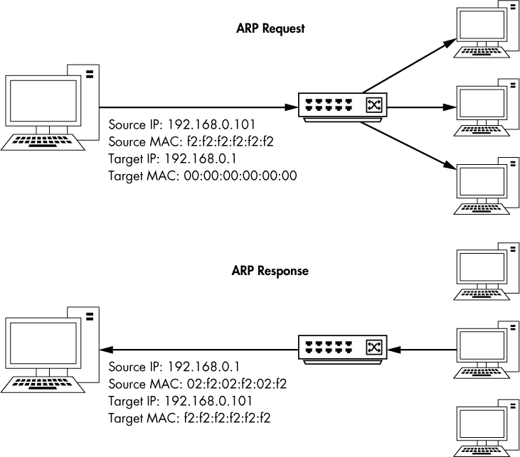

*图 7-1：ARP 解析过程*

**注意**

*你可以通过在命令提示符下输入`arp –a`来查看 Windows 主机的 ARP 表。*

看到这个过程的实际操作将帮助你理解它是如何工作的。但在我们查看一些示例之前，先来了解一下 ARP 数据包头部。

#### *ARP 数据包结构*

如图 7-2 所示，ARP 头部包括以下字段：

**硬件类型**   使用的第二层类型——在大多数情况下是以太网（类型 1）

**协议类型**   ARP 请求所使用的上层协议

**硬件地址长度**   使用的硬件地址的长度（以八位字节为单位）（以太网为 6）

**协议地址长度**   指定协议类型的逻辑地址的长度（以八位字节为单位）

**操作**   ARP 数据包的功能：1 表示请求，2 表示回复

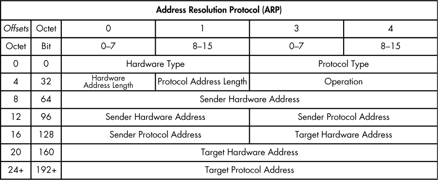

*图 7-2：ARP 数据包结构*

**发送方硬件地址**   发送方的硬件地址

**发送方协议地址**   发送方的上层协议地址

**目标硬件地址**   目标接收方的硬件地址（ARP 请求中为全零）

**目标协议地址**   目标接收方的上层协议地址

*arp_resolution.pcapng*

现在打开文件*arp_resolution.pcapng*，查看这个解析过程的实际操作。我们将在讲解这个过程时，逐个关注每个数据包。

#### *数据包 1：ARP 请求*

第一个数据包是 ARP 请求，如图 7-3 所示。我们可以通过检查 Wireshark 的“数据包详情”窗格中的以太网头部来确认该数据包是一个真正的广播数据包。该数据包的目的地址是 ff:ff:ff:ff:ff:ff ➊。这是以太网广播地址，发送到该地址的任何数据包都会被广播到当前网络段上的所有设备。数据包在以太网头部中的源地址列出了我们的 MAC 地址 ➋。

基于这个结构，我们可以判断这确实是一个在以太网网络上使用 IPv4 的 ARP 请求。发送者的 IP 地址（192.168.0.114）和 MAC 地址（00:16:ce:6e:8b:24）已列出 ➌，目标的 IP 地址（192.168.0.1）也列出 ➎。目标的 MAC 地址——我们试图获取的信息——未知，因此目标 MAC 列出了 00:00:00:00:00:00 ➍。

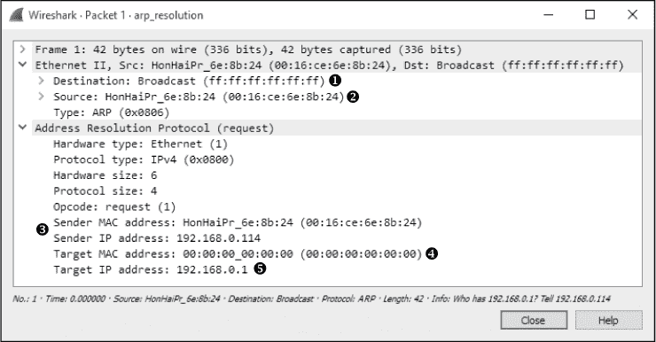

*图 7-3：ARP 请求数据包*

#### *数据包 2：ARP 应答*

在对初始请求的应答中（见图 7-4），以太网头部的目的地址现在是第一个数据包中的源 MAC 地址。ARP 头部与 ARP 请求的相似，只是有一些变化：

•     该数据包的操作码（opcode）现在是 0x0002 ➊，表示这是一个应答而不是请求。

•     地址信息被反转——发送者的 MAC 地址和 IP 地址现在成为目标 MAC 地址和 IP 地址 ➌。

•     最重要的是，所有信息都已呈现，这意味着我们现在得到了我们的主机在 192.168.0.1 上的 MAC 地址（00:13:46:0b:22:ba） ➋。

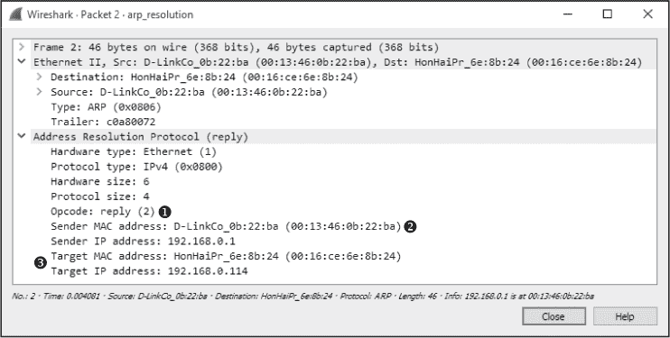

*图 7-4：ARP 应答数据包*

#### *无偿 ARP*

*arp_gratuitous.pcapng*

在我所在的地方，当某事是“无偿”做的时，这个词通常带有负面含义。然而，*无偿的 ARP*却是一件好事。

在许多情况下，设备的 IP 地址可能会发生变化。当这种情况发生时，网络中主机的 IP 到 MAC 地址映射会变得无效。为了防止这导致通信错误，一个无偿的 ARP 数据包会在网络上发送，强制任何接收到该数据包的设备更新其缓存中的 IP 到 MAC 地址映射（见图 7-5）。

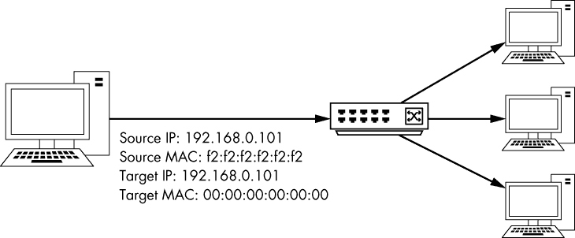

*图 7-5：无偿 ARP 过程*

有几种不同的场景可能会生成无偿的 ARP 数据包。最常见的一种情况是 IP 地址的变化。打开捕获文件*arp_gratuitous.pcapng*，你会看到这个过程的实际情况。这个文件仅包含一个数据包（见图 7-6），因为无偿的 ARP 只涉及一个数据包。

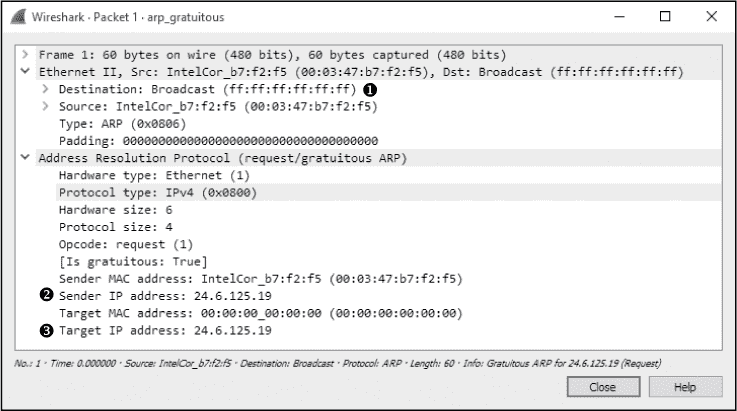

*图 7-6：一个无偿 ARP 数据包*

检查以太网头部，你可以看到这个数据包作为广播发送，这样网络上的所有主机都能接收到它 ➊。ARP 头部看起来像是一个 ARP 请求，不同之处在于发送方的 IP 地址 ➋ 和目标 IP 地址 ➌ 是相同的。当网络中的其他主机接收到这个数据包时，它会导致它们更新 ARP 表，将新的 IP 到 MAC 地址的映射加入其中。由于这个 ARP 数据包是无请求的，但却导致客户端更新其 ARP 缓存，因此该数据包被视为不必要的。

你会在一些情况下注意到不必要的 ARP 数据包。如前所述，改变设备的 IP 地址会生成一个不必要的数据包。此外，一些操作系统在启动时会执行不必要的 ARP 请求。此外，一些系统使用不必要的 ARP 数据包来支持负载均衡。

### 互联网协议（IP）

OSI 模型第 3 层的协议主要目的是允许不同网络之间的通信。正如你刚才看到的，MAC 地址用于第 2 层单一网络上的通信。类似地，第 3 层负责处理用于不同网络间通信的地址。有一些协议可以实现这一点，但最常见的是*互联网协议（IP）*，目前有两个版本在使用——IP 版本 4 和 IP 版本 6。我们将从 RFC 791 中定义的 IP 版本 4（IPv4）开始。

#### *互联网协议版本 4 (IPv4)*

要理解 IPv4 的功能，你需要知道网络间流量是如何流动的。IPv4 是通信过程中的主力军，最终负责在设备之间传递数据，无论通信端点位于何处。

所有设备通过集线器或交换机连接的简单网络称为 *局域网（LAN）*。当你想要连接两个局域网时，可以通过路由器来实现。复杂的网络可以由成千上万的局域网通过成千上万的路由器连接在全球范围内组成。互联网本身就是由数百万个局域网和路由器组成的。

##### IPv4 地址

*IPv4 地址*是 32 位分配的数字，用于唯一标识连接到网络的设备。要记住一个由 32 个字符长的零和一组成的序列是相当困难的，因此 IP 地址采用 *点分四段*（或 *点分十进制*）*表示法*来书写。

在点分四段表示法中，构成 IP 地址的四组零和一被转换为十进制，并表示为 0 到 255 之间的数字，格式为 *A.B.C.D*（见 图 7-7）。例如，考虑 IP 地址 11000000 10101000 00000000 00000001。这个值显然是难以记住或标注的。幸运的是，使用点分四段表示法，我们可以将其表示为 192.168.0.1。

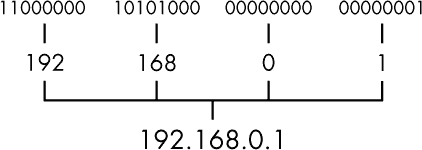

*图 7-7：点分四段 IPv4 地址表示法*

一个 IP 地址由两部分组成：*网络部分*和*主机部分*。网络部分标识设备连接的局域网，而主机部分标识该网络中的设备。确定 IP 地址的哪一部分属于网络部分或主机部分并不总是相同的。这些信息通过另一组地址信息传达，这组信息称为*网络掩码（netmask）*，有时也叫做*子网掩码*。

**注意**

*在本书中，当我们提到 IP 地址时，我们总是指 IPv4 地址。稍后在本章中，我们将讨论使用不同地址规则的 IP 版本 6。每当我们提到 IPv6 地址时，都会明确标注。*

网络掩码标识了 IP 地址中哪一部分属于网络部分，哪一部分属于主机部分。网络掩码的长度也是 32 位，每个位为 1 的部分标识 IP 地址中保留给网络部分的部分。其余的位被设置为 0，以标识主机部分。

例如，考虑 IP 地址 10.10.1.22，二进制表示为 00001010 00001010 00000001 00010110。为了确定 IP 地址各部分的分配方式，我们可以应用我们的网络掩码。在这种情况下，我们的网络掩码是 11111111 11111111 00000000 00000000。这意味着 IP 地址的前半部分（10.10 或 00001010 00001010）保留给网络部分，而 IP 地址的后半部分（.1.22 或 00000001 00010110）标识此网络中的单个主机，如图 7-8 所示。

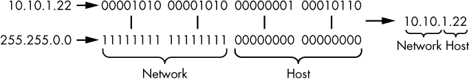

*图 7-8：子网掩码决定了 IP 地址中各位的分配方式。*

如图 7-8 所示，网络掩码也可以用点分十进制表示法表示。例如，网络掩码 11111111 11111111 00000000 00000000 表示为 255.255.0.0。

IP 地址和网络掩码通常采用*无类域间路由（CIDR）表示法*书写。在这种形式下，IP 地址写出完整，然后是一个斜杠（/）和表示 IP 地址网络部分的位数。例如，IP 地址 10.10.1.22 和网络掩码 255.255.0.0 会写成 CIDR 表示法为 10.10.1.22/16。

##### IPv4 数据包结构

源 IP 地址和目的 IP 地址是 IPv4 数据包头部的关键组成部分，但这并不是数据包中包含的所有 IP 信息。与我们刚刚检查过的 ARP 数据包相比，IP 头部要复杂得多；它包括许多额外的功能，帮助 IP 完成其任务。

如图 7-9 所示，IPv4 头部包含以下字段：

**版本**   正在使用的 IP 版本（IPv4 时始终为 4）。**头部长度**  IP 头部的长度。

**服务类型**   优先级标志和服务类型标志，路由器用来优先处理流量。

**总长度（Total Length）** IP 头部和数据包中包含的数据的长度。

**标识符（Identification）** 用于标识数据包或碎片化数据包序列的唯一标识号码。

**标志（Flags）** 用于标识数据包是否是碎片化数据包序列的一部分。

**碎片偏移量（Fragment Offset）** 如果数据包是碎片，使用此字段的值来按正确顺序重新组装数据包。

**生存时间（Time to Live）** 定义数据包的生命周期，以跳数或通过路由器的秒数来衡量。

**协议（Protocol）** 标识封装 IPv4 头部的传输层头部。

**头部校验和（Header Checksum）** 用于错误检测的机制，用以验证 IP 头部的内容是否损坏或受损。

**源 IP 地址（Source IP Address）** 发送数据包的主机的 IP 地址。

**目的地 IP 地址（Destination IP Address）** 数据包目的地的 IP 地址。

**选项（Options）** 预留用于额外的 IP 选项。包括源路由和时间戳选项。

**数据（Data）** 实际上传输的 IP 数据。

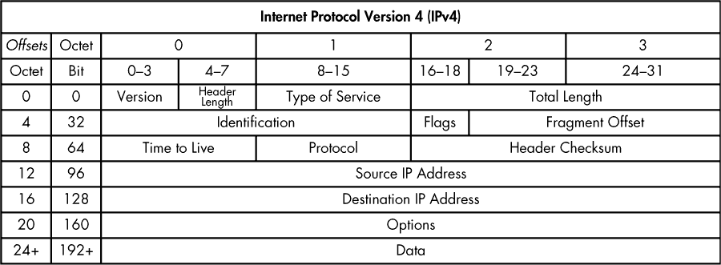

*图 7-9：IPv4 数据包结构*

##### 生存时间（Time to Live）

*ip_ttl_source.pcapng ip_ttl_dest.pcapng*

*生存时间（TTL）* 值定义了数据包可以经过的最大时间或最大路由器数量，超过此时间或数量后数据包会被丢弃（适用于 IPv4）。TTL 在数据包创建时被定义，通常每次数据包被路由器转发时，TTL 值会减 1。例如，如果数据包的 TTL 为 2，第一个到达的路由器会将 TTL 减为 1，并将数据包转发到第二个路由器。第二个路由器会再将 TTL 减为 0，如果数据包的最终目的地不在该网络上，数据包将被丢弃（见 图 7-10）。

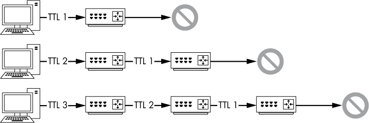

*图 7-10：数据包的 TTL 每次经过路由器时都会减少。*

为什么 TTL 值很重要？通常，我们只关心数据包从源地址到目的地所需的时间。然而，考虑到一个数据包必须通过多个路由器传输到互联网上的主机。在该数据包的路径中，可能会遇到配置错误的路由器，并失去到达最终目的地的路径。在这种情况下，路由器可以执行多种操作，其中一种可能导致数据包在网络中永无止境地循环。

无限循环可能会引发各种问题，但通常会导致程序或整个操作系统崩溃。从理论上讲，网络中的数据包也可能发生类似情况。数据包将不断地在路由器之间循环。随着循环数据包的数量增加，网络中的带宽将被耗尽，直到发生拒绝服务的情况。为防止这种情况发生，TTL 被创建。

让我们在 Wireshark 中看一个示例。文件*ip_ttl_source.pcapng*包含两个 ICMP 数据包。ICMP（在本章稍后讨论）使用 IP 来传输数据包，我们可以通过展开“数据包详情”窗格中的 IP 头部部分来查看这一点（见图 7-11）。

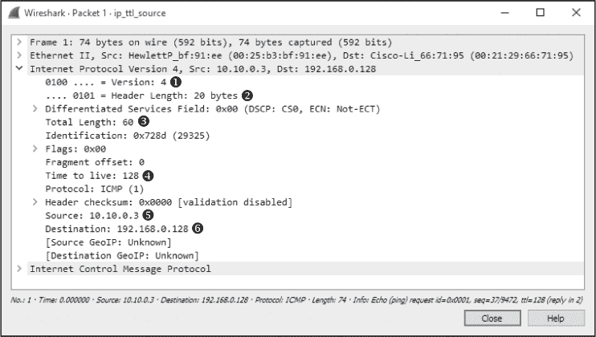

*图 7-11：源数据包的 IP 头部*

你可以看到使用的 IP 版本是版本 4 ➊，IP 头长度是 20 字节 ➋，头部和负载的总长度是 60 字节 ➌，TTL 字段的值是 128 ➍。

ICMP Ping 的主要目的是测试设备间的通信。数据从一个主机发送到另一个主机作为请求，接收主机应该将数据作为回复发回。在这个文件中，我们有一个地址为 10.10.0.3 ➎的设备向一个地址为 192.168.0.128 ➏的设备发送 ICMP 请求。这个初始的捕获文件是在源主机 10.10.0.3 处创建的。

现在打开文件*ip_ttl_dest.pcapng*。在这个文件中，数据是在目标主机 192.168.0.128 处捕获的。展开这个捕获中第一个数据包的 IP 头部以检查其 TTL 值（见图 7-12）。

你应该立刻注意到 TTL 值为 127 ➊，比原始 TTL 值 128 少了 1。即使不了解网络的架构，我们也可以得出结论：有一台路由器将这些设备隔开，因此通过该路由器的传输将 TTL 值减少了 1。

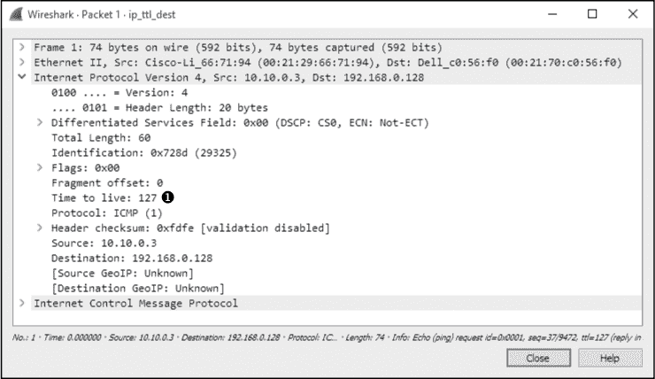

*图 7-12：IP 头部显示 TTL 已经减少了 1。*

##### IP 分片

*ip_frag_source.pcapng*

*数据包分片*是 IP 的一个特性，它通过将数据流分割成更小的片段，从而允许在不同类型的网络中可靠地传输数据。

数据包的分片是基于使用的第 2 层数据链路协议的*最大传输单元（MTU）*大小以及使用该第 2 层协议的设备配置。在大多数情况下，使用的第 2 层数据链路协议是以太网。以太网的默认 MTU 为 1,500 字节，这意味着可以通过以太网网络传输的最大数据包大小为 1,500 字节（不包括 14 字节的以太网头部）。

**注意**

*尽管有标准的 MTU 设置，但在大多数情况下，设备的 MTU 可以手动重新配置。MTU 设置是按每个接口分配的，并且可以在 Windows 和 Linux 系统上修改，也可以在管理型路由器的接口上进行修改。*

当设备准备发送 IP 数据包时，它会通过将数据包的大小与将要传输该数据包的网络接口的 MTU 进行比较，来决定是否需要分片。如果数据包的大小大于 MTU，则该数据包将被分片。分片数据包的步骤如下：

1.  设备将数据分割成成功传输所需的数据包数量。

1.  每个 IP 头的总长度字段设置为每个碎片的段大小。

1.  数据流中的所有数据包，除了最后一个，都设置了更多碎片标志为 1。

1.  碎片偏移字段被设置在碎片的 IP 头中。

1.  数据包被传输。

文件*ip_frag_source.pcapng*是从地址为 10.10.0.3 的计算机上获取的，该计算机向地址为 192.168.0.128 的设备发送了 ping 请求。注意，在数据包列表窗格中的信息列列出了两个碎片化的 IP 数据包，后面是 ICMP（ping）请求。

从检查数据包 1 的 IP 头开始（见图 7-13）。

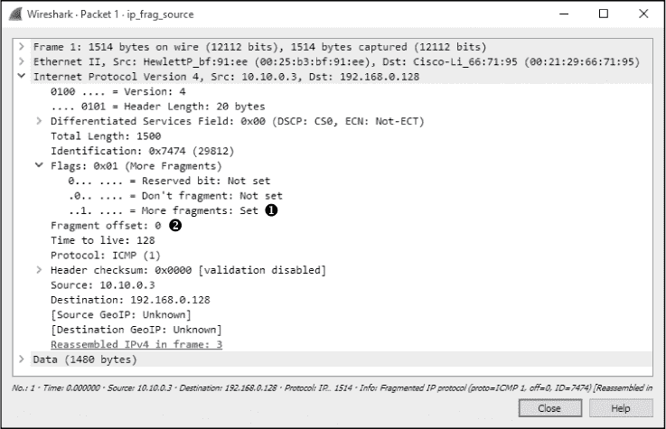

*图 7-13：更多碎片标志和碎片偏移值可以指示一个碎片化的数据包。*

你可以根据更多碎片标志和碎片偏移字段看出该数据包是一个碎片。碎片数据包要么具有正的碎片偏移值，要么设置了更多碎片标志。在第一个数据包中，设置了更多碎片标志➊，表示接收设备应该期待接收到此序列中的另一个数据包。碎片偏移设置为 0➋，表示该数据包是碎片序列中的第一个。

第二个数据包的 IP 头（见图 7-14）也设置了更多碎片标志➊，但在这种情况下，碎片偏移值为 1480➋。这表明 MTU 为 1,500 字节，减去 20 字节的 IP 头。

第三个数据包（见图 7-15）没有设置更多碎片标志➋，这标志着它是数据流中的最后一个碎片，碎片偏移值设置为 2960➌，这是 1480 + (1500 – 20)的结果。由于它们在 IP 头的标识符字段中有相同的值➊，因此这些碎片可以被识别为同一数据系列的一部分。

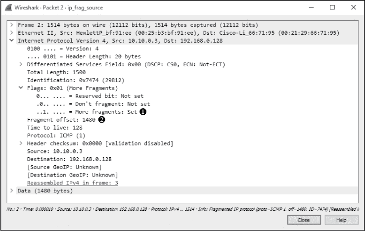

*图 7-14：碎片偏移值会根据数据包的大小增加。*

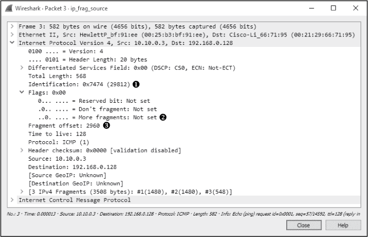

*图 7-15：更多碎片标志未设置，表示该碎片是最后一个。*

尽管在网络中看到碎片化的数据包不像过去那么常见，但理解为什么数据包会被碎片化是很有用的，这样当你遇到它们时，便能诊断问题或发现丢失的碎片。

#### *互联网协议第六版（IPv6）*

当编写 IPv4 规范时，没人预料到我们最终会拥有今天那么多的互联网连接设备。IPv4 最大可寻址空间仅限于大约 43 亿个地址。实际的可寻址空间在减去保留给特殊用途的地址范围（如测试、广播流量和 RFC1918 内部地址）后，进一步缩小。尽管进行了多次努力以延缓 IPv4 地址的枯竭，但最终解决这一限制的唯一方法是开发新的 IP 规范版本。

因此，IPv6 规范应运而生，第一版于 1998 年发布，作为 RFC 2460。这一版本提供了几项性能提升，包括更大的地址空间。在本节中，我们将研究 IPv6 数据包的结构，并讨论 IPv6 通信与其前身的区别。

##### IPv6 地址

IPv4 地址的位数限制为 32 位，提供了一个以十亿为单位的可寻址空间。IPv6 地址为 128 位，提供了一个以不可计数大数（万亿万亿万亿）为单位的可寻址空间。这可真是一次大升级！

由于 IPv6 地址为 128 位，因此以二进制形式管理它们比较笨重。大多数情况下，IPv6 地址以八组 2 字节的十六进制表示，每组之间用冒号分隔。例如，一个非常简单的 IPv6 地址看起来是这样的：

```
1111:aaaa:2222:bbbb:3333:cccc:4444:dddd
```

你的第一个想法可能和许多习惯记住 IPv4 地址的人一样：IPv6 地址几乎不可能记住。这是一个为了更大的地址空间所作的无奈取舍。

IPv6 地址表示法的一个特点是在某些情况下可以折叠零组。例如，考虑以下 IPv6 地址：

```
1111:0000:2222:0000:3333:4444:5555:6666
```

你可以将包含零的分组完全折叠，以使其不可见，如下所示：

```
1111::2222:0000:3333:4444:5555:6666
```

然而，你只能折叠单一的一组零，因此以下地址将是无效的：

```
1111::2222::3333:4444:5555:6666
```

另一个需要考虑的问题是 IPv6 地址中的前导零可以被省略。考虑以下示例，其中第四、第五和第六组前面有零：

```
1111:0000:2222:0333:0044:0005:ffff:ffff
```

你可以像这样更高效地表示地址：

```
1111::2222:333:44:5:ffff:ffff
```

这不像 IPv4 地址那样容易使用，但比起更长的表示法，处理起来要容易得多。

IPv6 地址包含网络部分和主机部分，通常分别称为 *网络前缀* 和 *接口标识符*。这些字段的分配方式取决于 IPv6 通信的分类。IPv6 流量被分为三种分类：单播、多播或任播。在大多数情况下，你可能会处理链路本地单播流量，即在网络内部一个设备与另一个设备之间的通信。链路本地单播 IPv6 地址的格式如 图 7-16 所示。

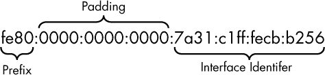

*图 7-16：IPv6 链路本地单播地址的各个部分*

链路本地地址用于当通信目标是同一网络内的另一台设备时。链路本地地址的标识方法是其最重要的 10 位设置为 1111111010，接下来的 54 位全部为零。因此，当地址的前半部分为 fe80:0000:0000:0000 时，你可以辨认出这是一个链路本地地址。

链路本地 IPv6 地址的后半部分是接口 ID 部分，它唯一标识端点主机上的网络接口。在以太网网络中，这可以基于接口的 MAC 地址。然而，MAC 地址只有 48 位。为了填满整个 64 位空间，MAC 地址被分成两半，并在每一半之间添加值 0xfffe 作为填充，以创建唯一标识符。最后，第一个字节的第七位被反转。这有点复杂，但可以参考图 7-17 中的接口 ID。表示此 ID 的设备的原始 MAC 地址是 78:31:c1:cb:b2:56。字节 0xfffe 被添加在中间，反转第一个字节的第七位将*8*变为*a*。

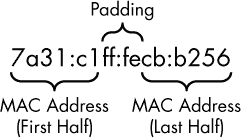

*图 7-17：接口 ID 使用接口的 MAC 地址和填充。*

IPv6 地址可以像 IPv4 地址一样使用 CIDR 表示法表示。在这个例子中，64 位的可寻址空间使用链路本地地址表示：

```
fe80:0000:0000:0000:/64
```

当 IPv6 地址用于通过公共互联网路由的全局单播流量时，其组成会发生变化（见图 7-18）。以这种方式使用时，全局单播的特点是其前 3 个位设置为 001，后跟一个 45 位的全局路由前缀。全局路由前缀由互联网号码分配局（IANA）分配给组织，用于唯一标识一个组织的 IP 空间。接下来的 16 位是子网 ID，可用于分层地址分配，类似于 IPv4 地址的网络掩码部分。最后的 64 位用于接口 ID，和链路本地单播地址一样。路由前缀和子网 ID 的大小可以有所不同。

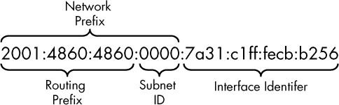

*图 7-18：IPv6 全局单播地址的各部分*

相较于 IPv4，IPv6 在路由数据包到达目的地和有效利用地址空间方面提供了更高的效率。这种效率得益于更大的地址范围，以及链路本地和全局地址的使用，结合唯一的主机标识符。

**注意**

*你可以很容易地视觉区分 IPv6 和 IPv4 地址，但许多程序不能这样做。如果你需要指定 IPv6 地址，一些应用程序，如浏览器或命令行工具，要求你将地址放在方括号内，例如：[1111::2222:333:44:5:ffff]。这个要求并不总是有很好的文档说明，许多人在学习 IPv6 时因此感到沮丧。*

##### IPv6 数据包结构

*http_ip4and6.pcapng*

IPv6 头部的结构已经扩展，以支持更多功能，但它也被设计得更易解析。头部现在是固定的 40 字节，而不是具有需要检查的头部长度字段的可变大小。附加选项通过扩展头部提供。其好处是，大多数路由器只需要处理 40 字节的头部即可转发数据包。

如 图 7-19 所示，IPv6 头部包含以下字段：

**版本**   正在使用的 IP 版本（对于 IPv6，总是为 6）。

**流量类别**   用于对某些类别的流量进行优先级排序。

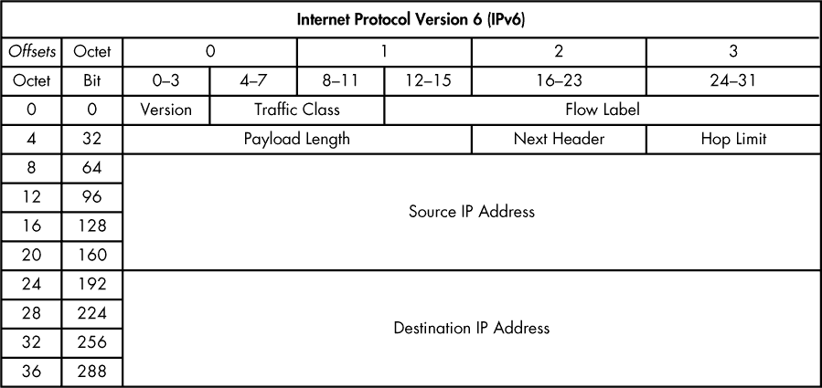

*图 7-19：IPv6 数据包结构*

**流标签**   由源使用来标记属于同一流的一组数据包。此字段通常用于服务质量（QoS）管理，并确保属于同一流的数据包走相同的路径。

**有效载荷长度**   紧随 IPv6 头部后的数据载荷的长度。

**下一个头部**   标识封装 IPv6 头部的第 4 层头部。此字段替代了 IPv4 中的协议字段。

**跳数限制**   定义数据包的生命周期，以通过路由器的跳数来衡量。此字段替代了 IPv4 中的 TTL 字段。

**源 IP 地址**   发送数据包的主机的 IP 地址。

**目的地 IP 地址**   数据包目的地的 IP 地址。

我们通过比较 IPv4 和 IPv6 数据包，查看一些差异，参见 *http_ip4and6.pcapng*。在此抓包中，配置了一个 Web 服务器，监听同一物理主机上的 IPv4 和 IPv6 连接。一个配置了 IPv4 和 IPv6 地址的客户端独立地使用各自的地址浏览服务器，并通过 curl 应用程序使用 HTTP 下载 *index.php* 页面（见 图 7-20）。

打开抓包文件后，你应该能够根据数据包列表区域中的源和目的地列地址，轻松看到哪些数据包属于哪个会话。数据包 1 到 10 表示 IPv4 流（流 0），数据包 11 到 20 表示 IPv6 流（流 1）。你可以从会话窗口过滤每个流，或在过滤栏中输入 tcp.stream == 0 或 tcp.stream == 1。

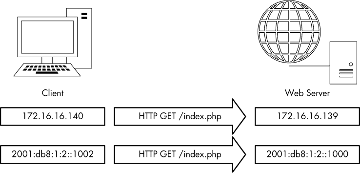

*图 7-20：使用不同 IP 版本的相同物理主机之间的连接*

我们将在 第八章 中深入讨论 HTTP，这是负责提供网页的协议。在这个例子中，只需注意，无论使用哪种下层网络协议，提供网页的业务始终保持一致。TCP 也是如此，它的操作方式也始终一致。这是封装作用的一个典型例子。尽管 IPv4 和 IPv6 的工作方式不同，但不同层次的协议并不受影响。

图 7-21 提供了两个数据包的并排比较，功能相同——数据包 1 和数据包 11。两个数据包都是 TCP SYN 数据包，旨在从客户端发起与服务器的连接。这些数据包的以太网和 TCP 部分几乎相同。然而，IP 部分完全不同。

•     源地址和目标地址格式不同 ➏➓。

•     IPv4 数据包为 74 字节，总长度为 60 字节 ➊，其中包括 IPv4 头和有效载荷，以及 14 字节的以太网头。IPv6 数据包为 96 字节，其中包括 40 字节的 IPv6 有效载荷 ➐，并且有一个独立的 40 字节 IPv6 头和 14 字节的以太网头。IPv6 头是 40 字节，是 IPv4 头 20 字节的两倍，以适应更大的地址大小。

•     IPv4 通过协议字段 ➍识别协议，而 IPv6 通过下一个头字段（也可以用于指定扩展头） ➑识别协议。

•     IPv4 有 TTL 字段 ➌，而 IPv6 使用跳数限制字段 ➒来实现相同的功能。

•     IPv4 包含一个头部校验和值 ➎，而 IPv6 则没有。

•     IPv4 数据包没有被分片，但它仍包括这些选项的值 ➋。IPv6 头部不包含这些信息，因为如果需要分片，它将在扩展头中实现。

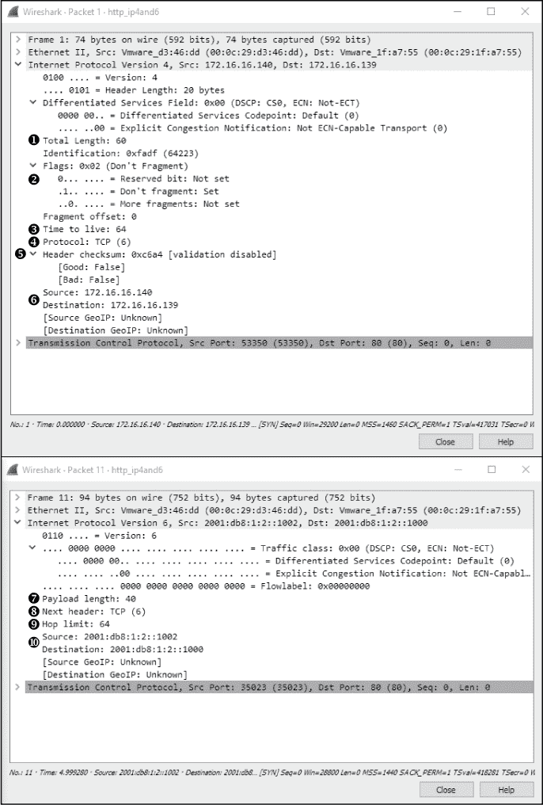

*图 7-21：IPv4（上）和 IPv6（下）数据包并排比较，执行相同功能*

并排比较 IPv4 和 IPv6 流量是完全理解这两种协议如何操作差异的好方法。

##### 邻居请求与 ARP

*icmpv6_neighbor_solicitation.pcapng*

当我们之前讨论不同的流量分类时，我列出了单播、多播和任播，但没有列出广播流量。IPv6 不支持广播流量，因为广播被视为一种低效的传输机制。由于没有广播，ARP 无法用于主机之间在网络上的相互发现。那么，IPv6 设备是如何找到彼此的呢？

答案在于一个名为*邻居请求*的新特性，这是邻居发现协议（NDP）的一部分，它利用 ICMPv6（在本章最后一节讨论）来完成这项工作。为了实现这个任务，ICMPv6 使用多播，一种通信方式，只有订阅特定数据流的主机才能接收并处理它。多播流量可以迅速识别，因为它有自己保留的 IP 空间（ff00::/8）。

尽管地址解析过程依赖于不同的协议，但它仍然使用非常简单的请求/响应工作流。例如，假设一个 IPv6 地址为 2001:db8:1:2::1003 的主机想与另一个地址为 2001:db8:1:2::1000 的主机通信。就像 IPv4 一样，源设备必须能够确定它想要通信的主机的链路层（MAC）地址，因为这是网络内部通信。该过程如 图 7-22 所示。

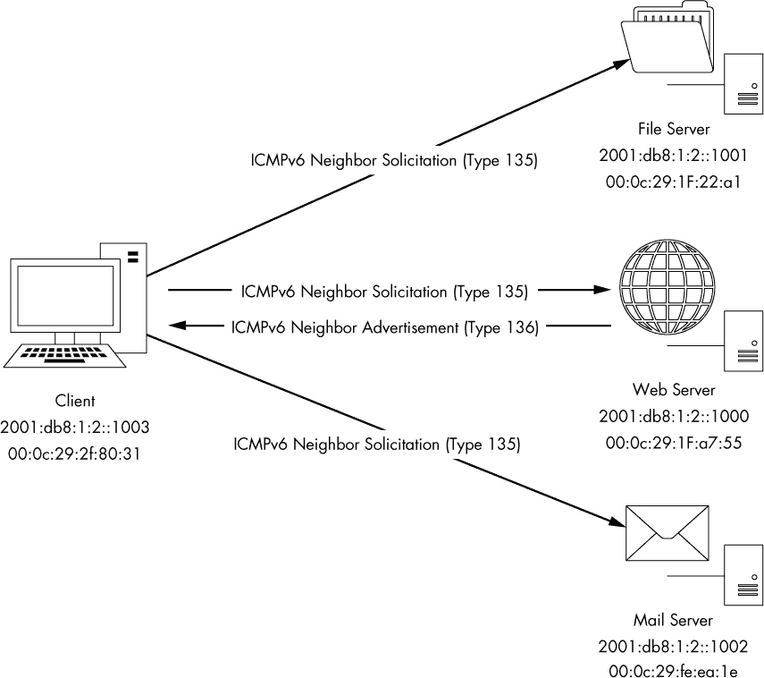

*图 7-22：地址解析的邻居请求过程*

在此过程中，主机 2001:db8:1:2::1003 通过多播向网络上的每个设备发送一个邻居请求（ICMPv6 类型 135）包，询问：“IP 地址为 2001:db8:1:2::1000 的设备的 MAC 地址是什么？我的 MAC 地址是 00:0C:29:2f:80:31。”

被分配了该 IPv6 地址的设备将接收到此多播传输，并通过邻居广告（ICMPv6 类型 136）包响应源主机。此包内容为：“你好，我的网络地址是 2001:db8:1:2::1000，我的 MAC 地址是 00:0c:29:1f:a7:55。”收到此消息后，通信可以开始。

你可以在捕获文件 *icmpv6_neighbor_solicitation.pcapng* 中看到此过程的实际操作。该捕获文件展示了我们刚才讨论的示例，其中 2001:db8:1:2::1003 想与 2001:db8:1:2::1000 通信。查看第一个包并展开“包详细信息”窗口中的 ICMPv6 部分（图 7-23），可以看到该包是 ICMP 类型 135 ➋，从 2001:db8:1:2::1003 发送到多播地址 ff02::1:ff00:1000 ➊。源主机提供了它想要通信的目标 IPv6 地址 ➌，以及它自己的第 2 层 MAC 地址 ➍。

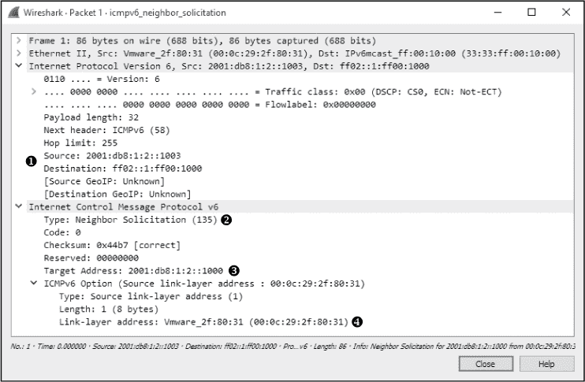

*图 7-23：一个邻居请求包*

对请求的响应可以在捕获文件的第二个包中找到。展开“包详细信息”窗口中的 ICMPv6 部分（图 7-24）可以看到，该包是 ICMP 类型 136 ➋，从 2001:db8:1:2::1000 发送回 2001:db8:1:2::1003 ➊，并包含与 2001:db8:1:2::1000 相关的 MAC 地址 00:0c:29:1f:a7:55 ➌。


*图 7-24：一个邻居广告包*

完成此过程后，2001:db8:1:2::1003 和 2001:db8:1:2::1000 将开始正常通信，使用 ICMPv6 回显请求和回复包，表示邻居请求过程和链路层地址解析成功。

##### IPv6 分片

*ipv6_fragments.pcapng*

分段支持被内置在 IPv4 头部中，因为它确保了数据包可以在各种网络中传输，而那时网络的最大传输单元（MTU）差异极大。在 IPv6 中，分段的使用较少，因此支持分段的选项没有包含在 IPv6 头部中。传输 IPv6 数据包的设备需要执行一个叫做*MTU 发现*的过程，以确定它在发送数据包之前可以发送的最大数据包大小。如果路由器接收到一个超出其转发的网络 MTU 的数据包，它将丢弃该数据包并返回一个 ICMPv6 的"数据包过大"（类型 2）消息给源主机。接收到此消息后，源主机会尝试使用更小的 MTU 重新发送数据包（前提是上层协议支持这种操作）。这一过程将不断重复，直到达到足够小的 MTU，或者直到负载无法再进行分段为止（图 7-25）。路由器永远不会自己负责分段数据包；源设备负责确定传输路径的合适 MTU，并适当分段。

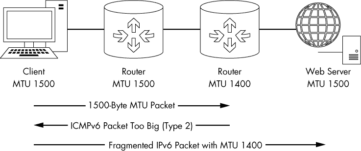

*图 7-25：IPv6 MTU 路径发现*

如果与 IPv6 一起使用的上层协议无法限制数据包负载的大小，则仍然必须使用分段。可以将分段扩展头部添加到 IPv6 数据包中，以支持这种情况。你可以在名为*ipv6_fragments.pcapng*的文件中找到显示 IPv6 分段的示例捕获。

由于接收设备的 MTU 小于发送设备，因此在捕获文件中，每个 ICMPv6 回显请求和回显应答都有两个分段的数据包。第一个数据包的分段头部如图 7-26 所示。

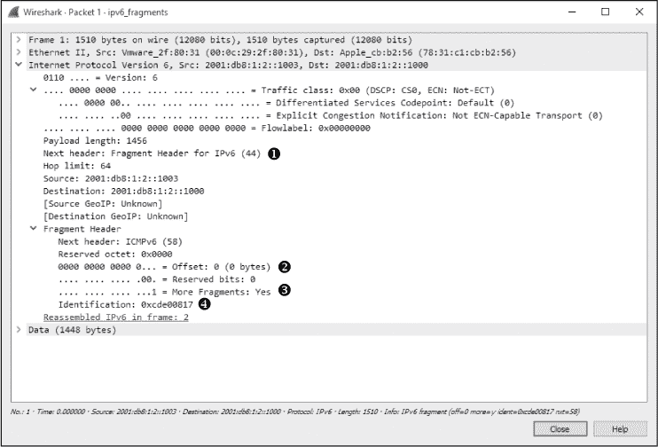

*图 7-26：IPv6 分段头部扩展*

8 字节的扩展头部包含了与 IPv4 数据包中相同的所有分段属性，例如分段偏移量 ➋、更多分段标志 ➌ 和标识字段 ➍。它并非出现在每个数据包中，而是仅添加到需要分段的数据包的末尾。这个更高效的过程仍然允许接收系统适当地重新组装分段。此外，如果存在这个扩展头部，下一头部字段将指向扩展头部，而不是封装协议 ➊。

##### IPv6 过渡协议

IPv6 解决了一个非常实际的问题，但由于将网络基础设施迁移到 IPv6 所需的工作量，其采用速度较慢。为了简化这一过渡，几种协议允许 IPv6 通信通过只支持 IPv4 通信的网络进行隧道传输。在这个意义上，隧道传输意味着 IPv6 通信被封装在 IPv4 通信中，就像其他协议可能被封装一样。封装通常通过三种方式之一进行：

**路由器到路由器**    使用隧道封装 IPv6 流量，将传输和接收主机的网络上的流量通过 IPv4 网络传输。此方法允许整个网络通过中介 IPv4 链接进行 IPv6 通信。

**主机到路由器**    在路由器级别使用封装将 IPv6 主机上的流量通过 IPv4 网络进行传输。该方法允许当主机位于仅支持 IPv4 网络时，主机可以在 IPv6 网络中进行 IPv6 通信。

**主机到主机**    通过两个端点之间的隧道封装 IPv6 流量，实现 IPv4 或 IPv6 主机之间的通信。该方法允许 IPv6 端点直接通过 IPv4 网络进行通信。

尽管本书不会深入讨论过渡协议，但了解它们的存在很有帮助，以防在进行数据包级别的分析时需要研究它们。以下是一些常见的协议：

**6to4**    也称为*IPv6 over IPv4*，该过渡协议允许 IPv6 数据包通过 IPv4 网络进行传输。此协议支持中继和路由器提供路由器到路由器、主机到路由器以及主机到主机的 IPv6 通信。

**Teredo**    该协议用于通过 NAT（网络地址转换）在 IPv4 网络上传输 IPv6 单播通信，其工作原理是将 IPv6 数据包封装在 UDP 传输协议中，通过 IPv4 进行传输。

**ISATAP**    该站内协议允许在同一网络内进行 IPv4 和 IPv6 设备之间的主机到主机通信。

### 互联网控制消息协议（ICMP）

*互联网控制消息协议（ICMP）*是 TCP/IP 的实用协议，负责提供有关 TCP/IP 网络上设备、服务或路由可用性的信息。大多数网络故障排除技术和工具都集中在常见的 ICMP 消息类型上。ICMP 定义在 RFC 792 中。

#### *ICMP 数据包结构*

ICMP 是 IP 的一部分，依赖于 IP 来传输其消息。ICMP 包含一个相对较小的头部，根据其目的的不同而变化。如图 7-27 所示，ICMP 头部包含以下字段：

**类型**    根据 RFC 规范，ICMP 消息的类型或分类。

**代码**    根据 RFC 规范对 ICMP 消息的子分类。

**校验和**    用于确保 ICMP 头部和数据在到达时完整无损。

**可变**    根据类型和代码字段的不同而变化的一部分。

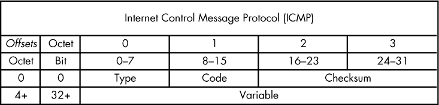

*图 7-27：ICMP 头部*

#### *ICMP 类型和消息*

如前所述，ICMP 数据包的结构取决于其目的，这由*类型*和*代码*字段中的值定义。

你可以将 ICMP 类型字段看作是数据包的分类，而代码字段则是其子分类。例如，类型字段的值为 3 表示“目标不可达”。虽然仅凭这些信息可能不足以解决问题，但如果该数据包同时指定了代码字段值为 3，表示“端口不可达”，你就可以推测你尝试通信的端口存在问题。

**注意**

*有关可用 ICMP 类型和代码的完整列表，请参见* http://www.iana.org/assignments/icmp-parameters/.

#### *回显请求与回应*

*icmp_echo.pcapng*

ICMP 最著名的应用就是 ping 工具。*Ping* 用于测试与设备的连接性。虽然 ping 本身并不是 ICMP 规范的一部分，但它利用了 ICMP 来实现其核心功能。

使用 ping 时，在命令提示符中输入 `ping ipaddress`，将 ipaddress 替换为你网络中某个设备的实际 IP 地址。如果目标设备已开启，且你的计算机能够与之通信，并且没有防火墙阻止该通信，你应该能够看到对 `ping` 命令的回应。

图 7-28 中的例子显示了四个成功的回复，展示了其大小、往返时间（或 RTT，指的是数据包到达并接收到回应所需的时间）和使用的 TTL 值。Windows 工具还提供了一个总结，详细列出了发送、接收和丢失的数据包数量。如果通信失败，你应该看到一条信息，告诉你原因。

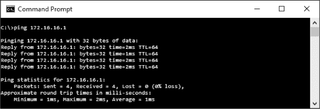

*图 7-28：使用`ping`命令测试连接性*

基本上，`ping` 命令一次只向设备发送一个数据包，并监听回应来判断是否与该设备存在连接性，如图 7-29 所示。


*图 7-29：`ping`命令仅涉及两个步骤。*

**注意**

*虽然 ping 长期以来一直是 IT 领域的基础工具，但当主机防火墙部署时，它的结果可能会有些误导。如今的许多防火墙限制了设备响应 ICMP 数据包的能力。这对安全性非常有利，因为潜在的攻击者使用 ping 来判断主机是否可达时可能会被阻止，但故障排除也变得更加困难——当你知道自己能与设备通信时，ping 设备测试连接性却没有得到回应，可能会让人感到沮丧。*

ping 工具的实际应用是一个简单的 ICMP 通信的很好的例子。文件中的数据包 *icmp_echo.pcapng* 展示了当你运行 ping 时发生的情况。

第一个数据包（见图 7-30）显示主机 192.168.100.138 正在向 192.168.100.1 发送数据包 ➊。当你展开此数据包的 ICMP 部分时，可以通过查看类型和代码字段来确定 ICMP 数据包类型。在这种情况下，数据包类型为 8 ➋，代码为 0 ➌，表示回显请求。（Wireshark 应该会告诉你显示的类型/代码是什么。）这个回显（ping）请求是公式的前半部分。它是一个简单的 ICMP 数据包，通过 IP 发送，包含少量数据。除了类型和代码标识以及校验和之外，我们还有一个用于将请求与回复配对的序列号，并且 ICMP 数据包的可变部分中还包含一个随机文本字符串。

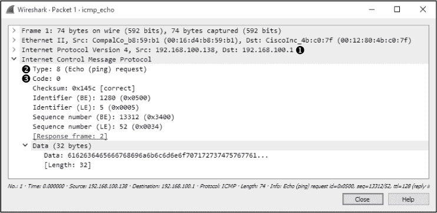

*图 7-30：一个 ICMP 回显请求数据包*

**注意**

*术语* echo *和* ping *常常可以互换使用，但请记住* ping *实际上是一个工具的名称。ping 工具用于发送 ICMP 回显请求数据包。*

该序列中的第二个数据包是对我们请求的回复（见图 7-31）。数据包的 ICMP 部分类型为 0 ➊，代码为 0 ➋，表明这是一个回显回复。由于第二个数据包中的序列号和标识符与第一个数据包相同 ➌，我们知道这个回显回复与前一个数据包中的回显请求相匹配。Wireshark 以大端（BE）和小端（LE）格式显示这些字段的值。换句话说，它根据特定端点处理数据的方式，以不同的顺序表示数据。这个回复数据包还包含与初始请求一起传输的相同的 32 字节数据字符串 ➍。一旦 192.168.100.138 收到第二个数据包，ping 将报告成功。

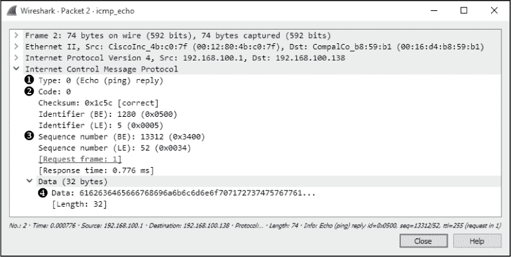

*图 7-31：一个 ICMP 回显回复数据包*

请注意，你可以使用 ping 命令的不同变种来增加回显请求中的数据填充大小，这将迫使数据包在各种类型的网络故障排除中进行分段。当你在故障排除需要更小分段大小的网络时，这可能是必需的。

**注意**

*ICMP 回显请求中使用的随机文本可能对潜在攻击者非常有价值。攻击者可以利用此填充中的信息来分析设备使用的操作系统。此外，攻击者还可以将少量数据放入此字段，以便进行隐蔽通信。*

#### *traceroute*

*icmp_traceroute.pcapng*

traceroute 工具用于识别从一个设备到另一个设备的路径。在简单的网络中，一条路径可能仅经过一个路由器，或者根本不经过路由器。然而，在复杂的网络中，一个数据包可能需要经过数十个路由器才能到达最终目的地。因此，能够追踪数据包从一个目的地到另一个目的地的确切路径，对于故障排除通信非常关键。

通过使用 ICMP（借助 IP 的一点帮助），traceroute 可以绘制数据包的路径。例如，文件*icmp_traceroute.pcapng*中的第一个数据包与我们在前一节中看到的回显请求非常相似（见图 7-32）。

在这个捕获中，这些数据包是通过运行命令 `tracert 4.2.2.1` 生成的。要在 Windows 上使用 traceroute，请在命令提示符下输入 `tracert ipaddress`，将 ipaddress 替换为你想要探测路径的设备的实际 IP 地址。要在 Linux 或 Mac 上使用 traceroute，请使用命令 `traceroute ipaddress`。

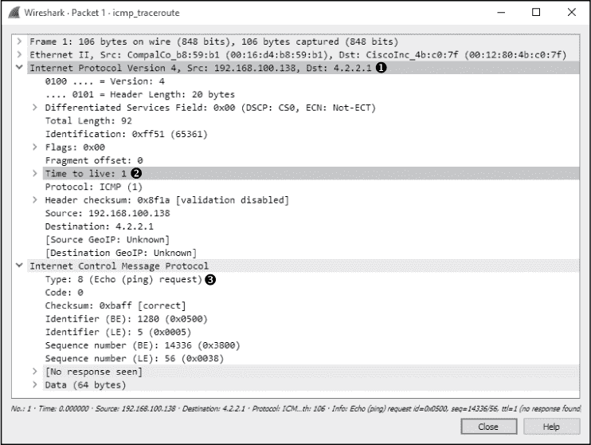

*图 7-32: TTL 值为 1 的 ICMP 回显请求数据包*

乍一看，这个数据包似乎是一个简单的回显请求 ➌，从 192.168.100.138 发往 4.2.2.1 ➊，并且数据包中的 ICMP 部分与回显请求数据包的格式完全相同。然而，当你展开这个数据包的 IP 头部时，你会注意到一个奇怪的地方：数据包的 TTL 值被设置为 1 ➋，这意味着数据包将在它遇到的第一个路由器处被丢弃。因为目标地址 4.2.2.1 是一个互联网地址，我们知道在源设备和目标设备之间至少会有一个路由器，所以这个数据包根本无法到达目的地。对我们来说，这正是我们需要的，因为 traceroute 依赖于这一点，即这个数据包只会到达它经过的第一个路由器。

第二个数据包，如预期的那样，是我们到达路径上第一个路由器的回复（见图 7-33）。该数据包到达了 192.168.100.1 这个设备，它的 TTL 被减为 0，数据包无法进一步传输，因此路由器回复了一个 ICMP 响应。这个数据包的类型为 11 ➊，代码为 0 ➋，数据告诉我们目的地不可达，因为数据包在传输过程中 TTL 被超出了。

这个 ICMP 数据包有时被称为 *双头数据包*，因为其 ICMP 部分的尾端包含了在原始回显请求中发送的 IP 头部 ➌ 和 ICMP 数据 ➍ 的副本。这些信息对于故障排除非常有用。

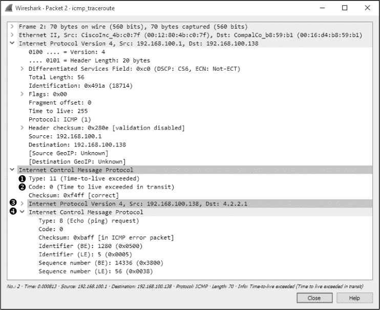

*图 7-33: 来自路径上第一个路由器的 ICMP 响应*

发送 TTL 值为 1 的数据包这一过程会重复两次，直到我们到达第 7 个数据包。在这里，你看到的与第一个数据包中看到的相同，只是这次，IP 头部中的 TTL 值被设置为 2，这确保数据包在被丢弃之前会到达第二跳路由器。如预期所示，我们从下一个跳的路由器 12.180.241.1 收到回复，包含相同的 ICMP 目的地不可达和 TTL 超过消息。

这个过程会持续进行，TTL 值每次增加 1，直到目的地 4.2.2.1 到达。然而，正如在图 7-34 中所看到的，在线路 8 上，请求超时了。那么，沿着路径的请求如何超时而过程仍能成功完成呢？通常，这发生在路由器配置为不响应 ICMP 请求时。路由器仍然接收到请求并将数据转发给下一个路由器，这就是为什么我们能在图 7-34 中的第 9 行看到下一个跳点。只不过它没有像其他跳点那样生成 ICMP 时间超时的包。由于没有响应，tracert 假定请求超时并继续进行到下一个请求。

总结来说，这个 traceroute 过程已经与路径上的每个路由器进行了通信，构建了通向目的地的路由图。在图 7-34 中显示了一个示例图。

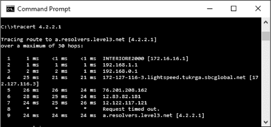

*图 7-34：traceroute 工具的示例输出*

**注意**

*这里关于 traceroute 的讨论主要集中在 Windows 系统，因为这个工具仅使用 ICMP。Linux 上的 traceroute 工具则更为多功能，可以利用其他协议来执行路径追踪。*

#### *ICMP 版本 6（ICMPv6）*

更新版的 IP 在诸如邻居请求和路径发现等功能上严重依赖 ICMP，如前面的示例所示。*ICMPv6*是在 RFC 4443 中建立的，支持 IPv6 所需的功能集以及额外的增强功能。由于 ICMPv6 与 ICMP 数据包使用相同的数据包结构，因此本书不单独讨论 ICMPv6。

ICMPv6 数据包通常分为错误消息或信息消息。你可以从 IANA 找到完整的类型和代码列表，网址是：*http://www.iana.org/assignments/icmpv6-parameters/icmpv6-parameters.xhtml*。

本章介绍了在数据包分析过程中将会涉及到的几个最重要的协议。ARP、IP 和 ICMP 是所有网络通信的基础，它们对你每天要执行的几乎所有任务至关重要。在第八章中，我们将讨论常见的传输层协议，TCP 和 UDP。
